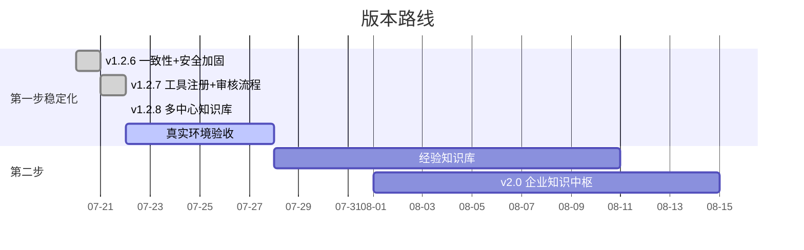

# 🗺️ 恩特小助手 — 项目进度看板

> 更新时间：2026-08-11｜当前版本：v1.11.3｜框架：三步走 AI 赋能计划

---

## 三步走总览

| 步骤 | 目标 | 进度 | 状态 |
|:----:|------|:----:|:----:|
| 🔥 第一步 | 智能快速查询 + 标准文档检索 + 通用聊天 | █████████░ ~95% | 功能基本完善，待真实环境验收 |
| 🎯 第二步 | 项目经验全流程沉淀与复用 | ████░░░░░░ ~40% | 框架完成（v1.5.0），内容沉淀 + 真实环境验证进行中 |
| 🔭 第三步 | AI 辅助研发探索 | ░░░░░░░░░░ 0% | 尚未启动 |

---

## 里程碑

> 完整里程碑见 [CHANGELOG.md](CHANGELOG.md)。此处只列最近 3 版。

| 版本 | 日期 | 亮点 |
|:----:|:----:|------|
| v1.11.3 | 08-11 | 📑 文档概要回复（去上限）+ LLM 指令联动（总结成推送）+ 需求探索清单 — 发文档回复「名字+概要」不限数量（识别只读概要秒回，指令时全读：workbook 翻页/doc 5000 块）；「帮我总结成推送」LLM 调新增 summarize_doc 工具总结推回本人（卡片写 memory 打通前提）；detect_kind 缓存省 API；9 组需求清单；590 项全绿 |
| v1.11.2 | 08-11 | 🔧 实测修复包 — 发多文档不再丢（`urls[:5]`）+ 卡片消息也能做看板（`_handle_doc_link_with_kanban` 合并摘要+看板确认，接入文本/富文本/卡片三处路由）+ 「帮我学习」说明加强（入库进哪个库/怎么检索/看板不受影响，入库成功提示补块数记录数）；564 项全绿 |
| v1.11.1 | 08-11 | 📄 钉钉文档类型自动识别 — 入口统一允许所有类型（AI表格/在线表格/普通文档 doc），自动探测后按类型读取；doc 走 blocks 接口逐块转保真 Markdown（需 Storage.File.Read）；「帮我学习」doc 按全文入库；doc 也可做看板数据源（采集全文由 LLM 提炼）；561 项全绿 |
| v1.11.0 | 08-10 | 📊 每日项目看板 — 发钉钉文档动态做看板（全动态数据源，`list_fields` 自动取字段名）+ 定时主动推送（「按这几个文档做每日看板」订阅管理 + changes_only 静默 + 工具/技能/调度全链）；上传文件自动推荐入库（回复「入库/确认」即学）；看板数据不入 Chroma 实时拉取；552 项全绿 |
| v1.10.3 | 08-10 | 🔀 PDF 检测路由 — 文字版走本地 PyMuPDF（免费高保真）省 MinerU 每日 1000 页额度，扫描/混合版走 MinerU 保质量；`PDF_ROUTING` 开关一键切回；4 份精选已入库标准双路径对比（烧 263 页额度，文字版重合 90~100%）；331 项全绿 |
| v1.10.2 | 08-10 | 📚 上传文件直接学习 — 上传后回复「帮我学习」直接入库（取消主管审核，代码保留注释）；存储目录改主部门/员工/日期；「我的文件」查看、删除/重新学习、ENTARBOSS 管理员模式；315 项全绿 |
| v1.10.1 | 08-10 | 🛡️ 上线前修复包 — 长对话回放加预算防撑爆上下文 + MinerU 拆分子 PDF 改临时目录防磁盘累积 + MinerU API 补超时防无限挂起 + CSV 不规则行容错；283 项全绿 |
| v1.10.0 | 08-07 | 🖼️ 识图功能 — 钉钉发图自动识别（qwen3.7-flash 视觉外挂）+ tools/describe_image 工具 + Claude Code vision skill；MinerU OSS 上传修复；真实 254 页扫描件拆分入库 226 块；283 项全绿 |
| v1.9.1 | 08-07 | 🔧 Agent 体验优化 — 工具调用早期通知（不等参数累积完）+ 系统提示词不主动汇报用户信息；266 项全绿 |
| v1.9.0 | 08-07 | 🔗 引用溯源 + 👍/👎 反馈 + Prompt 后台配置 — source_label 统一引用标签；Web/钉钉双通道反馈收集；system prompt 在线编辑即时生效；266 项全绿 |
| v1.8.0 | 08-07 | 📄 文档格式补齐 — 新增 Word (.docx) / PPT (.pptx) / CSV (.csv) 支持，支持格式 3→6 种；241 项全绿 |
| v1.7.0 | 08-06 | 👥 钉钉通讯录员工查询 — find_employee 工具（姓名/部门/职位/工号全员可查，手机号/邮箱仅审核人）；实时拉取 + 60s 缓存防限流；旧版 oapi topapi 接口；227 项全绿 |
| v1.6.2 | 08-06 | 🧠 上下文工程 + 长期记忆修复 — 静态 system + 窗口20批量滚动 + 缓存命中率日志；V4 思考挤空压缩 / 压缩误伤窗口修复（208 项全绿） |
| v1.6.0 | 08-05 | 👥 多人并发消息处理 — 慢操作放行线程池互不阻塞，同人串行异人并行 + DeepSeek 并发限流 20 |
| v1.5.6 | 08-05 | 🧩 PCB 参数补足层（54 类声明+多组合表格）+ 安规 AC/DC/海拔 + 紫铜路由 + 国内 API 全直连 + 记忆/性能优化 |
| v1.5.5 | 08-05 | 🔧 PCB 计算自然语言健壮性 — 40 题社区回归，26 处失败清零（路由误判/参数提取/\b 边界/2 处公式） |
| v1.5.4 | 08-05 | 🔩 PCB 计算技能全套升级 — 13→54 类（以 pcb-tools.cn 为基准） |
| v1.5.3 | 08-05 | 🧠 双层会话记忆升级 — 短期窗口 8 轮 + LLM 长期记忆 |
| v1.5.2 | 08-04 | 🔧 修改文件归属 + 修复 bge-reranker 重排静默失效 |
| v1.5.1 | 08-04 | 🎨 Web 端 UI 改版 — 三块视觉统一 + Markdown 渲染 + 来源展示 |
| v1.5.0 | 08-04 | 🚀 第二步经验知识库启动（五段式经验沉淀 + Agent 检索） |
| v1.4.2 | 08-04 | 🔩 PCB 布局综合校验模式（12→13 类计算器）+ P1 安全收尾 |
| v1.4.1 | 08-04 | 🔩 PCB 计算修复（差分/波长崩溃）+ 新增 2152/差分/安规 3 类计算器 |
| v1.3.0 | 08-03 | 🔍 检索质量升级 — 混合检索（BM25+向量）+ 重排框架 |

---

## 当前焦点（🔥 优先）

> 详细待办清单见 [TODO.md](TODO.md)（唯一事实源），此处只列当前最优先关注项。

| 事项 | 类型 | 说明 |
|------|:----:|------|
| 真实环境验收 | P0 | Excel/PDF/MinerU/查询/重学/删除 完整链路 |
| 上传直接学习真实钉钉验证 | P0 | v1.10.2 改「回复『帮我学习』」直接入库，验证学习/我的文件/删除/管理员链路（审核流程已暂停） |
| 扫描 PDF OCR 入库 | P1 | 4 份扫描 PDF → MinerU → sync_standards 入库 |
| 经验知识库内容补充 | 第二步 | 框架完成（v1.5.0），待人工整理五段式排查/解决内容 |

> ✅ 已收尾：崩溃恢复（8433f42）、管理端安全收尾（v1.2.9/v1.4.2）、双层会话记忆（v1.5.3）

---

## 模块完成度

| 模块 | 状态 | 备注 |
|------|:----:|:----:|
| 🔧 故障代码查询 | ✅ 完成 | 精确匹配 + 语义搜索 + 混合检索（v1.3.0） |
| 🔍 混合检索 | ✅ 完成 | BM25 + 向量 RRF 融合，短词召回提升（v1.3.0） |
| 🔍 重排 | ✅ 生效 | bge-reranker 模型就位并启用（v1.4.0） |
| 🔧 PCB 计算技能 | ✅ 完成 | 54 类计算器，全本地秒回（v1.5.4 以 pcb-tools.cn 为基准全套升级） |
| 💬 钉钉即时反馈 | ✅ 完成 | 慢操作提示 + 错误码，秒回不打扰（v1.4.0） |
| 📄 标准文档检索 | ✅ 完成 | 文本 PDF 4 份 + 扫描 PDF 队列 |
| 🤖 钉钉机器人 | ✅ 完成 | Stream 模式单聊 |
| 💬 通用聊天托底 | ✅ 完成 | DeepSeek Agent 路由 |
| 📂 doc_mgr 文档管理 | ✅ 完成 | 上传/切块/入库/删除/版本替换 |
| 🖼️ MinerU OCR | ✅ 完成 | 扫描 PDF → Markdown 入库 |
| 🏢 多中心知识库 | ✅ 完成 | 五中心隔离 + 权限（v1.2.8） |
| 🔔 上传审核流程 | ⏸️ 已停用 | v1.10.2 改「帮我学习」直接入库；代码保留注释，未来可恢复（见 CHANGELOG/TODO） |
| 📎 上传直接学习 | ✅ 完成 | v1.10.2：上传→回「帮我学习」入库；目录主部门/员工/日期；我的文件/删除/重学/管理员 |
| 📎 钉钉文件接收 | ✅ 完成 | 自动下载保存 |
| 📄 钉钉文档类型识别 | ✅ 完成 | v1.11.1：入口统一允许所有类型（AI表格/在线表格/普通文档 doc）自动识别读取；doc blocks 逐块转保真 Markdown（需 Storage.File.Read）；doc 也可做看板数据源。v1.11.2：多链接放宽到 5 个 + 卡片/富文本消息识别「做看板」意图 + 学习提示说明加强。v1.11.3：去链接上限 + 概要回复（识别只读概要秒回，指令时全读 workbook 翻页/doc 5000 块）+「帮我总结成推送」summarize_doc 工具 + detect_kind 缓存 |
| 💾 用户存储 | ✅ 完成 | SQLite（users + conversations + permissions） |
| ☁️ 腾讯云同步 | ❌ 未开始 | v2.0 计划内容 |
| 🧠 经验知识库 | ✅ 框架完成 | 搭建 + 五段式模板 + 提交/审核/发布链路（v1.5.0），内容待补充 |

---

## 阻塞项

| 阻塞 | 影响 | 状态 |
|------|:----:|:----:|
| 真实环境端到端验收未完成 | 不敢发版本 | ⏳ 待安排 |
| 上传直接学习未真实钉钉验证 | 学习/删除/管理员链路未闭环 | ⏳ 待真实钉钉验证（审核流程已暂停 v1.10.2） |

---

## 版本规划

---

## 数据规模

| Collection | 记录数 | 说明 |
|:-----------|:------:|:-----|
| `error_codes` | 133 | PCS 故障记录 |
| `standards` | 54 | 标准文档章节（4 份文本 PDF）|
| `user_store.db` | — | 用户/对话/权限 |
> 扫描 PDF OCR 完成后 standards 将大幅增加

---

*看板随项目进展持续更新。详细变更见 [CHANGELOG.md](CHANGELOG.md)，项目架构见 [CLAUDE.md](CLAUDE.md)。*
