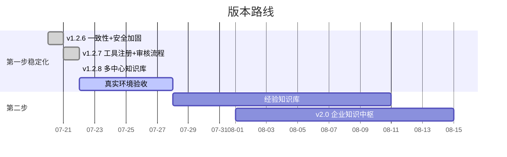

# 🗺️ 恩特小助手 — 项目进度看板

> 更新时间：2026-08-04｜当前版本：v1.5.2｜框架：三步走 AI 赋能计划

---

## 三步走总览

| 步骤 | 目标 | 进度 | 状态 |
|:----:|------|:----:|:----:|
| 🔥 第一步 | 智能快速查询 + 标准文档检索 + 通用聊天 | █████████░ ~95% | 功能基本完善，待真实环境验收 |
| 🎯 第二步 | 项目经验全流程沉淀与复用 | ░░░░░░░░░░ 0% | 尚未启动 |
| 🔭 第三步 | AI 辅助研发探索 | ░░░░░░░░░░ 0% | 尚未启动 |

---

## 里程碑

> 完整里程碑见 [CHANGELOG.md](CHANGELOG.md)。此处只列最近 3 版。

| 版本 | 日期 | 亮点 |
|:----:|:----:|------|
| v1.5.2 | 08-04 | 🔧 修改文件归属 + 修复 bge-reranker 重排静默失效 |
| v1.5.1 | 08-04 | 🎨 Web 端 UI 改版 — 三块视觉统一 + Markdown 渲染 + 来源展示 |
| v1.5.0 | 08-04 | 🚀 第二步经验知识库启动（五段式经验沉淀 + Agent 检索） |
| v1.4.2 | 08-04 | 🔩 PCB 布局综合校验模式（12→13 类计算器）+ P1 安全收尾 |
| v1.4.1 | 08-04 | 🔩 PCB 计算修复（差分/波长崩溃）+ 新增 2152/差分/安规 3 类计算器 |
| v1.4.0 | 08-03 | 🔧 PCB 设计计算技能 + 钉钉即时反馈 + rerank 生效 |
| v1.3.0 | 08-03 | 🔍 检索质量升级 — 混合检索（BM25+向量）+ 重排框架 |

---

## 当前焦点（🔥 优先）

> 详细待办清单见 [TODO.md](TODO.md)（唯一事实源），此处只列当前最优先关注项。

| 事项 | 类型 | 说明 |
|------|:----:|------|
| 真实环境验收 | P0 | Excel/PDF/MinerU/查询/重学/删除 完整链路 |
| 崩溃恢复 | P0 | ✅ 已提交（8433f42）— 启动时识别并清理遗留 staging/retired 数据 |
| 管理端安全收尾 | P1 | 上传校验/MIME、Web 身份 GET→POST |
| 经验知识库 | 第二步主线 | 三步走核心目标，详见 TODO.md |

---

## 模块完成度

| 模块 | 状态 | 备注 |
|------|:----:|:----:|
| 🔧 故障代码查询 | ✅ 完成 | 精确匹配 + 语义搜索 + 混合检索（v1.3.0） |
| 🔍 混合检索 | ✅ 完成 | BM25 + 向量 RRF 融合，短词召回提升（v1.3.0） |
| 🔍 重排 | ✅ 生效 | bge-reranker 模型就位并启用（v1.4.0） |
| 🔧 PCB 计算技能 | ✅ 完成 | 13 类计算器，全本地秒回（v1.4.2 新增布局综合校验） |
| 💬 钉钉即时反馈 | ✅ 完成 | 慢操作提示 + 错误码，秒回不打扰（v1.4.0） |
| 📄 标准文档检索 | ✅ 完成 | 文本 PDF 4 份 + 扫描 PDF 队列 |
| 🤖 钉钉机器人 | ✅ 完成 | Stream 模式单聊 |
| 💬 通用聊天托底 | ✅ 完成 | DeepSeek Agent 路由 |
| 📂 doc_mgr 文档管理 | ✅ 完成 | 上传/切块/入库/删除/版本替换 |
| 🖼️ MinerU OCR | ✅ 完成 | 扫描 PDF → Markdown 入库 |
| 🏢 多中心知识库 | ✅ 完成 | 五中心隔离 + 权限（v1.2.8） |
| 🔔 上传审核流程 | ⚠️ 代码完成 | 未向真实钉钉发送测试消息 |
| 📎 钉钉文件接收 | ✅ 完成 | 自动下载保存 |
| 💾 用户存储 | ✅ 完成 | SQLite（users + conversations + permissions） |
| ☁️ 腾讯云同步 | ❌ 未开始 | v2.0 计划内容 |
| 🧠 经验知识库 | ❌ 未开始 | 第二步核心 |

---

## 阻塞项

| 阻塞 | 影响 | 状态 |
|------|:----:|:----:|
| 真实环境端到端验收未完成 | 不敢发版本 | ⏳ 待安排 |
| MinerU 200 页 PDF 拆分修复 | 大 PDF 上传失败 | ✅ 代码已改，待部署 |
| 审核流程未向真实钉钉发消息 | 功能未闭环 | ⏳ 待配置 staff_id |

---

## 版本规划

---

## 数据规模

| Collection | 记录数 | 说明 |
|:-----------|:------:|:-----|
| `error_codes` | 133 | PCS 故障记录 |
| `standards` | 54 | 标准文档章节（4 份文本 PDF）|
| `user_store.db` | — | 用户/对话/权限 |
> 扫描 PDF OCR 完成后 standards 将大幅增加

---

*看板随项目进展持续更新。详细变更见 [CHANGELOG.md](CHANGELOG.md)，项目架构见 [CLAUDE.md](CLAUDE.md)。*
