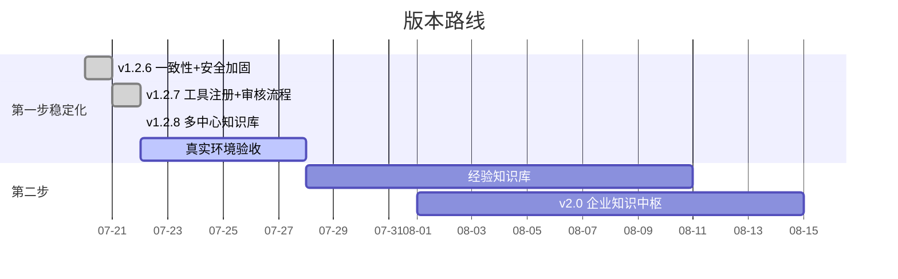

# 🗺️ 恩特小助手 — 项目进度看板

> 更新时间：2026-08-27｜当前版本：v1.13.3｜框架：三步走 AI 赋能计划

---

## 三步走总览

| 步骤 | 目标 | 进度 | 状态 |
|:----:|------|:----:|:----:|
| 🔥 第一步 | 智能快速查询 + 标准文档检索 + 通用聊天 | █████████░ ~95% | 功能基本完善，待真实环境验收 |
| 🎯 第二步 | 项目经验全流程沉淀与复用 | ████░░░░░░ ~40% | 框架完成（v1.5.0），内容沉淀 + 真实环境验证进行中 |
| 🔭 第三步 | AI 辅助研发探索 | ░░░░░░░░░░ 0% | 尚未启动 |

---

## 里程碑

> 完整里程碑见 [CHANGELOG.md](CHANGELOG.md)。此处只列最近 3 版。

| 版本 | 日期 | 亮点 |
|:----:|:----:|------|
| v1.13.3 | 08-27 | 📊 看板体验收口：幻觉护栏补将来时承诺盲区；看板绑定透明（确认草稿/查看订阅逐条列源）、任务与数据源编号动态重排（删除后自动补位）；总结改 LLM 一句话总览（必须引用来源）+ 证据 400→100 字短预览 + 结论级 [查看原文] 链接；发钉钉文档改「先收录→主动问去向」；dash_query 实时查询与定时推送同口径；删测试订阅 #12；1051 项离线回归通过 |
| v1.13.2 | 08-20 | 🧭 结构治理发布：统一生产/测试/部署运行路径，测试默认隔离到 `data/_test_runtime`；部署包排除真实 `data/` 与 `knowledge_base/`；工具/技能自动发现，新增功能无需修改中心注册文件；补充稳定包入口、结构文档和边界回归，1001 项离线回归通过 |
| v1.13.1 | 08-20 | 🎯 看板可靠性收口发布：固定任务提示词与版本/哈希审计、所有者确认后编辑、监测状态语义化、调度结果与失败提醒状态持久化、用户侧和管理端可见；997 项离线回归通过，真实钉钉/部署验收仍待 P0 |
| v1.12.9 | 08-14 | 🎯 看板操作意图 LLM 分类治本（折中方案）— 袁会荧实测口语操作句接不住（「帮我停掉这个」无「看板」词 → 正则 miss → 落 Agent → LLM 无工具编造「将停用」）。正则快闸保留（确定性指令秒回），LLM 只在「正则未命中 + 用户在看板上下文」（`is_kanban_context` = 看板词面/有 pending/600s 内聊过看板）时兜底分类；写操作仍二次确认，确认后按真实 store 落地；「删除全部数据源」bot 文件删除 gate 让位技能层按 remove_all 清空任务源；60s 短缓存防 match+handle 双调 LLM；含「看板」词消息不由此兜底（交 match 层歧义判定）；966 项全绿 |
| v1.12.8 | 08-14 | 🔒 审查修复包 + Web 端砍用户层 — C2 密钥不进 Docker 镜像（.dockerignore + volume 注入）；C3 BM25 缓存永不失效根治（invalidate_bm25_cache 学习/删除后按库失效）；H4 调度宽容窗口 ±5 分钟防漏推；H6 模板 key 路径穿越拦截（黑名单校验，放行中文模板名）；H7 推送失败自动重试（4xx 不重试）；Web `/ask`/`/feedback` 物理删除、`/` 跳转 `/admin`（用户名伪造 C1 攻击面消失，钉钉端反馈不受影响）；管理层「按人查看」tab（每人上传文件 + 学习进度，/admin/people）；946 项全绿 |
| v1.12.7 | 08-14 | 📐 看板任务边界明确（D1）+ 推送留档（D2）— 用户拍板：每个任务绑定自己的数据源（实时算以任务为边界，取代 v1.12.6 C6 的「实时拉 owner 全部候选」——新发布文档默认不进已有任务，需主动说「把这个文档加进看板」才纳入）；新增任务级源增删意图 change_sources（「把XX加进看板 / 从看板去掉」名称匹配候选→确认→按真实 update 落地，匹配不到列候选不编造）；推送留档 push_history.py 每任务保留最近 30 次自动裁剪 + 历史回放意图 history（「看上次的看板」回放最近一次，只读不确认）；判重/重合度回归任务绑定 data_sources 集合比较；923 项全绿 |
| v1.12.6 | 08-14 | 🐛 袁会荧三项看板问题根治（A 应急+B 防幻觉+C 架构对齐）— A3 内容截断根治：LLM map 批预算从全局对折改每批独立 deadline（一批慢调用不再吃光预算整批取消）；B4 幻觉护栏强化：判定从「是否调过工具」收紧为「是否执行写操作」（只调只读工具≠已执行）+ B5 口语序数选择接住；C6 订阅取消持久绑定：每次推送实时拉 owner 当前发布文档（「每次发的时候才算」，新发布文件自动纳入订阅、按人隔离），stored data_sources 只当迁移兜底；C7 删「改数据源」意图（用户没设计过绑定/解绑，set_per_source 保留）；C8 文件夹逐个解读全部子文档（每条记录带「来源文件」标签，部分子文档失败保留已采记录并上报，不再整源丢弃）；版本标注统一（未发版 v1.13/v1.14 标注改回 v1.12 线，patch 合并）；896 项全绿 |
| v1.12.5 | 08-13 | 📨 消息流根治 + 袁会荧三项看板调整落地 — 一次请求回多条顺序消息（看板识别/预览每数据源单独一条 + 定时推送「汇总报告 + 变化最多 Top 2 数据源单独展开详情」+ 聊天超长自动拆条兜底）；订阅操作补齐：新增「调整数据源」意图（「XX数据源删掉/加个XX数据源」按名称匹配真实源确认落地）、Agent 零工具幻觉护栏（回答含完成态声明但本轮未调任何工具 → 自动纠偏「未执行任何写操作」）、每源独立总结 per_source（「四份文件各自独立总结/合并成一份」切换订阅输出模式）；887 项全绿 |
| v1.12.4 | 08-13 | 🐛 修复看板确认词「对的」漏接 — 袁会荧回「对的」确认建看板，但「对的」不在确认词表 → 落 Agent → LLM 无工具调用谎称「已开通」、实际订阅从未创建 → 「示例看板在哪里」查真实状态报「没有订阅」矛盾。确认词表补自然口语（对/对的/对呀/是呀/好呀/可以呀），删 subscription_commands._CONFIRM_TEXT_RE 死代码防两表漂移（收口 pending_context 唯一事实源）；851 项全绿 |
| v1.12.3 | 08-13 | 📁 钉钉文件夹做看板数据源 + 看板意图识别混合方案 — 文件夹链接可做看板（dws 元信息判定 folder + `dws drive list` 枚举子文档），每次采集动态取最新一份（袁会荧「部门周报」4 份周报真机验证，下周新周报自动跟随，不提示学习入库）；「现在的看板数据源和看板任务是分开的吗」这类概念疑问句不再被 query 意图吞掉——看板话题 + 疑问词交 LLM 判歧义放行 Agent，明确管理/查询动词零延迟快路径不变；849 项全绿 |
| v1.12.1 | 08-13 | 🎨 看板模板内容编辑 + M3 确认 pending 归一 — 新增「编辑看板模板XX改成：…」整体重述入口（AI 生成新结构 → 确认覆盖，仅本人私有模板，系统模板拒绝；另修「把周报模板改成：」被 set 误抢切换的潜在 bug）；4 套独立确认 pending 统一成单一 pending_context + bot 单一确认路由，确认词按 pending 类型作用域（「入库/要」只在入库场景生效）；829 项全绿 |
| v1.12.0 | 08-13 | 🧰 工具板块化重构 + 判定层治本框架 — 注册中心成为工具唯一事实源（LLM prompt 工具段 / 流式显示映射 / 能力清单自动生成，不再手写）；8 个工具改名带板块前缀（kb/calc/dash/contact/image/doc）；判定层三态化：领域互斥让位（「删除看板订阅」不再被「删除学习」误抢）+ 跨领域歧义反问交还用户 + 查询盲区不补枚举（CQC 3310 落 LLM 走 kb_search 工具兜底）；能力清单生成器 capability_manifest.py；813 项全绿 |
| v1.11.14 | 08-13 | 📊 看板格式改版 + 上下文窗口扩容 — 总体结论先行 → 各表最新总结（按来源分块）→ 原文链接；证据原值 400 字句边界截断（不再像没写完）；附件字段只留文件名（省 token + 减少变化误报）；时间戳格式化；对话记忆窗口 50 轮（满时释放 30 保留 20）取消字数预算；模板要求按用户落盘本地文件夹 + 创建时提醒自定义格式/复用旧模板；783 项全绿 |
| v1.11.13 | 08-12 | 🎛️ 创建订阅后主动反问选模板 — 开通后回复 1每日/2周报/3项目（或模板名）即应用并重推样例；600s 反问窗口 + 纯模板名双闸防误判（「项目进展怎么样」不误抢）；确认词兼容保持默认；772 项全绿 |
| v1.11.12 | 08-12 | 🎨 看板模板自定义系统 — 输出格式模板化（每日/周报/项目三模板 + 「描述成模板」LLM 生成 + 上传表头「提交模板」确定性解析 + 创建后主动告知模板模式）；只改输出不动数据链路，daily 逐字回归锚点；用户模板按 owner 隔离；762 项全绿 |
| v1.11.11 | 08-12 | 🔧 看板推送用户级隔离 + 文件识别缺口修复 — push_dashboard 只碰当前用户自己的订阅和数据源（上次拍板「看板不允许跨用户」落地）；.txt 纯文本入库（含 GBK 编码兜底）；图片当文件发也识图（复用 describe_image）；.doc/.ppt/压缩包给清晰引导；729 项全绿 |
| v1.11.10 | 08-12 | 🔧 同事实测 5 个看板问题修复 — 实时查询数据源按用户隔离（不再串同事看板）；创建意图放宽（发完链接补创建意图不带文档词也能识别）；「查看/看板任务」查询意图盲区 + 「查看一下」负向后瞻；unknown 类型友好提示（钉盘/视图/子表）；query_dashboard 转述强制保留来源链接；719 项全绿 |
| v1.11.9 | 08-12 | 🔧 外部审查 4 条 Critical 修复 — 看板确认词按用户隔离（防 A 聊完看板 B 说「确认」被误拦）；MinerU 入库失败触发本地回退（不再静默丢文档）；sync_mineru 跳过 `-mineru-cache` 缓存目录；删除学习覆盖全部版本（不再被崩溃恢复复活）；711 项全绿 |
| v1.11.8 | 08-12 | 🛡️ 看板生产链路修复 — 写操作统一二次确认并以真实工具结果回报；真实文件标题；今日变化优先摘要；主动消息表格安全降级和语义分页；重复订阅识别，相同配置不重复创建，来源子集同批只推一次；706 项全绿 |
| v1.11.7 | 08-11 | 📊 看板全量数据总结与来源证据链 — 完整非敏感字段分批交给 DeepSeek map/reduce，逐条校验引用和原值，保留源文档链接 |
| v1.11.6 | 08-11 | 🛡️ 看板运维增强 — 失败告警（订阅执行失败主动推给创建人+管理员，no_changes/off 静默不误告警，告警失败不影响主流程）；恢复订阅（「重新开通看板」复用已停用订阅，不再新建重复）；删除订阅（删除/删掉/解绑看板，确认后彻底移除）；创建前权限预检（登记候选后概要模式探测可读性，不可读剔除逐条提示，全不可读拒绝创建，防「订阅建好但每天推失败」）；set_recipient_self 补处理（v1.11.5 遗留意图消费）；662 项全绿 |
| v1.11.5 | 08-11 | 🗂️ 多知识库架构改造 + 实测日志 9 问题修复 — 「创建知识库」独立通用功能（钉钉自然语言创建，SQLite 注册表 `knowledge_bases` + `department` 部门预留）；查询工具 3→1 通用（指定库分发/留空全库合并，LLM 不再选错工具——修「已学文档搜不到」）；学习支持「把这个文档学到XX」入库指定库；静态看板源空 base_id 过滤 + 停用陈旧订阅（修 404 循环）+ 无源清晰报错杜绝 Agent 幻觉「推送成功」；订阅指令误判修复（只推给我自己/粘贴过了重新发给了你/这跟看板功能有什么关系）；识图路径文件名递归查找兜底；文档类型 unknown 原因聚合日志；看板 LLM 组装 25s 超时兜底；642 项全绿 |
| v1.11.4 | 08-11 | 📊 看板实测修复 — 每日必推（`alert_mode` 默认 always，顶部注入 `change_banner`：有变化「📌 今日变化」/ 无变化「📌 今日无变化」）；本次文档做数据源（bot 返回候选 id，历史候选不再混入——修「发 4 文件 6 标题」）；创建时立即推完整当天看板（规则兜底加「📌 今日要点」+ LLM prompt 严禁表格）；现有订阅 SQL 迁移为 always；604 项全绿 |
| v1.11.3 | 08-11 | 📑 文档概要回复（去上限）+ LLM 指令联动（总结成推送）+ 需求探索清单 — 发文档回复「名字+概要」不限数量（识别只读概要秒回，指令时全读：workbook 翻页/doc 5000 块）；「帮我总结成推送」LLM 调新增 summarize_doc 工具总结推回本人（卡片写 memory 打通前提）；detect_kind 缓存省 API；9 组需求清单；590 项全绿 |
| v1.11.2 | 08-11 | 🔧 实测修复包 — 发多文档不再丢（`urls[:5]`）+ 卡片消息也能做看板（`_handle_doc_link_with_kanban` 合并摘要+看板确认，接入文本/富文本/卡片三处路由）+ 「帮我学习」说明加强（入库进哪个库/怎么检索/看板不受影响，入库成功提示补块数记录数）；564 项全绿 |
| v1.11.1 | 08-11 | 📄 钉钉文档类型自动识别 — 入口统一允许所有类型（AI表格/在线表格/普通文档 doc），自动探测后按类型读取；doc 走 blocks 接口逐块转保真 Markdown（需 Storage.File.Read）；「帮我学习」doc 按全文入库；doc 也可做看板数据源（采集全文由 LLM 提炼）；561 项全绿 |
| v1.11.0 | 08-10 | 📊 每日项目看板 — 发钉钉文档动态做看板（全动态数据源，`list_fields` 自动取字段名）+ 定时主动推送（「按这几个文档做每日看板」订阅管理 + changes_only 静默 + 工具/技能/调度全链）；上传文件自动推荐入库（回复「入库/确认」即学）；看板数据不入 Chroma 实时拉取；552 项全绿 |
| v1.10.3 | 08-10 | 🔀 PDF 检测路由 — 文字版走本地 PyMuPDF（免费高保真）省 MinerU 每日 1000 页额度，扫描/混合版走 MinerU 保质量；`PDF_ROUTING` 开关一键切回；4 份精选已入库标准双路径对比（烧 263 页额度，文字版重合 90~100%）；331 项全绿 |
| v1.10.2 | 08-10 | 📚 上传文件直接学习 — 上传后回复「帮我学习」直接入库（取消主管审核，代码保留注释）；存储目录改主部门/员工/日期；「我的文件」查看、删除/重新学习、ENTARBOSS 管理员模式；315 项全绿 |
| v1.10.1 | 08-10 | 🛡️ 上线前修复包 — 长对话回放加预算防撑爆上下文 + MinerU 拆分子 PDF 改临时目录防磁盘累积 + MinerU API 补超时防无限挂起 + CSV 不规则行容错；283 项全绿 |
| v1.10.0 | 08-07 | 🖼️ 识图功能 — 钉钉发图自动识别（qwen3.7-flash 视觉外挂）+ tools/describe_image 工具 + Claude Code vision skill；MinerU OSS 上传修复；真实 254 页扫描件拆分入库 226 块；283 项全绿 |
| v1.9.1 | 08-07 | 🔧 Agent 体验优化 — 工具调用早期通知（不等参数累积完）+ 系统提示词不主动汇报用户信息；266 项全绿 |
| v1.9.0 | 08-07 | 🔗 引用溯源 + 👍/👎 反馈 + Prompt 后台配置 — source_label 统一引用标签；Web/钉钉双通道反馈收集；system prompt 在线编辑即时生效；266 项全绿 |
| v1.8.0 | 08-07 | 📄 文档格式补齐 — 新增 Word (.docx) / PPT (.pptx) / CSV (.csv) 支持，支持格式 3→6 种；241 项全绿 |
| v1.7.0 | 08-06 | 👥 钉钉通讯录员工查询 — find_employee 工具（姓名/部门/职位/工号全员可查，手机号/邮箱仅审核人）；实时拉取 + 60s 缓存防限流；旧版 oapi topapi 接口；227 项全绿 |
| v1.6.2 | 08-06 | 🧠 上下文工程 + 长期记忆修复 — 静态 system + 窗口20批量滚动 + 缓存命中率日志；V4 思考挤空压缩 / 压缩误伤窗口修复（208 项全绿） |
| v1.6.0 | 08-05 | 👥 多人并发消息处理 — 慢操作放行线程池互不阻塞，同人串行异人并行 + DeepSeek 并发限流 20 |
| v1.5.6 | 08-05 | 🧩 PCB 参数补足层（54 类声明+多组合表格）+ 安规 AC/DC/海拔 + 紫铜路由 + 国内 API 全直连 + 记忆/性能优化 |
| v1.5.5 | 08-05 | 🔧 PCB 计算自然语言健壮性 — 40 题社区回归，26 处失败清零（路由误判/参数提取/\b 边界/2 处公式） |
| v1.5.4 | 08-05 | 🔩 PCB 计算技能全套升级 — 13→54 类（以 pcb-tools.cn 为基准） |
| v1.5.3 | 08-05 | 🧠 双层会话记忆升级 — 短期窗口 8 轮 + LLM 长期记忆 |
| v1.5.2 | 08-04 | 🔧 修改文件归属 + 修复 bge-reranker 重排静默失效 |
| v1.5.1 | 08-04 | 🎨 Web 端 UI 改版 — 三块视觉统一 + Markdown 渲染 + 来源展示 |
| v1.5.0 | 08-04 | 🚀 第二步经验知识库启动（五段式经验沉淀 + Agent 检索） |
| v1.4.2 | 08-04 | 🔩 PCB 布局综合校验模式（12→13 类计算器）+ P1 安全收尾 |
| v1.4.1 | 08-04 | 🔩 PCB 计算修复（差分/波长崩溃）+ 新增 2152/差分/安规 3 类计算器 |
| v1.3.0 | 08-03 | 🔍 检索质量升级 — 混合检索（BM25+向量）+ 重排框架 |

---

## 当前焦点（🔥 优先）

> 详细待办清单见 [TODO.md](TODO.md)（唯一事实源），此处只列当前最优先关注项。

| 事项 | 类型 | 说明 |
|------|:----:|------|
| 真实环境验收 | P0 | Excel/PDF/MinerU/查询/重学/删除 完整链路 |
| 上传直接学习真实钉钉验证 | P0 | v1.10.2 改「回复『帮我学习』」直接入库，验证学习/我的文件/删除/管理员链路（审核流程已暂停） |
| 扫描 PDF OCR 入库 | P1 | 4 份扫描 PDF → MinerU → sync_standards 入库 |
| 经验知识库内容补充 | 第二步 | 框架完成（v1.5.0），待人工整理五段式排查/解决内容 |

> ✅ 已收尾：崩溃恢复（8433f42）、管理端安全收尾（v1.2.9/v1.4.2）、双层会话记忆（v1.5.3）

---

## 模块完成度

| 模块 | 状态 | 备注 |
|------|:----:|:----:|
| 🔧 故障代码查询 | ✅ 完成 | 精确匹配 + 语义搜索 + 混合检索（v1.3.0） |
| 🧰 工具板块化注册中心 | ✅ 完成 | v1.12.0：注册中心成为工具唯一事实源（prompt 工具段/流式显示/能力清单自动生成）；8 工具板块前缀改名（kb/calc/dash/contact/image/doc）；无旧名残留 tripwire |
| ⚖️ 判定层治本框架 | ✅ 完成 | v1.12.0：领域互斥让位（删除看板不再被删除学习误抢）+ 操作歧义澄清（跨领域反问）+ 查询盲区不补枚举走 kb_search 工具兜底 |
| 🔍 混合检索 | ✅ 完成 | BM25 + 向量 RRF 融合，短词召回提升（v1.3.0） |
| 🔍 重排 | ✅ 生效 | bge-reranker 模型就位并启用（v1.4.0） |
| 🔧 PCB 计算技能 | ✅ 完成 | 54 类计算器，全本地秒回（v1.5.4 以 pcb-tools.cn 为基准全套升级） |
| 💬 钉钉即时反馈 | ✅ 完成 | 慢操作提示 + 错误码，秒回不打扰（v1.4.0） |
| 📄 标准文档检索 | ✅ 完成 | 文本 PDF 4 份 + 扫描 PDF 队列 |
| 🤖 钉钉机器人 | ✅ 完成 | Stream 模式单聊 |
| 💬 通用聊天托底 | ✅ 完成 | DeepSeek Agent 路由 |
| 📂 doc_mgr 文档管理 | ✅ 完成 | 上传/切块/入库/删除/版本替换 |
| 🖼️ MinerU OCR | ✅ 完成 | 扫描 PDF → Markdown 入库 |
| 🏢 多中心知识库 | ✅ 完成 | 五中心隔离 + 权限（v1.2.8） |
| 🔔 上传审核流程 | ⏸️ 已停用 | v1.10.2 改「帮我学习」直接入库；代码保留注释，未来可恢复（见 CHANGELOG/TODO） |
| 📎 上传直接学习 | ✅ 完成 | v1.10.2：上传→回「帮我学习」入库；目录主部门/员工/日期；我的文件/删除/重学/管理员；v1.11.11 补 .txt 纯文本（含 GBK 兜底） |
| 📎 钉钉文件接收 | ✅ 完成 | 自动下载保存；v1.11.11 图片当文件发也识图；.doc/.ppt/压缩包给引导文案 |
| 📄 钉钉文档类型识别 | ✅ 完成 | v1.11.1：入口统一允许所有类型（AI表格/在线表格/普通文档 doc）自动识别读取；doc blocks 逐块转保真 Markdown（需 Storage.File.Read）；doc 也可做看板数据源。v1.11.2：多链接放宽到 5 个 + 卡片/富文本消息识别「做看板」意图 + 学习提示说明加强。v1.11.3：去链接上限 + 概要回复（识别只读概要秒回，指令时全读 workbook 翻页/doc 5000 块）+「帮我总结成推送」summarize_doc 工具 + detect_kind 缓存 |
| 💾 用户存储 | ✅ 完成 | SQLite（users + conversations + permissions） |
| ☁️ 腾讯云同步 | ❌ 未开始 | v2.0 计划内容 |
| 🧠 经验知识库 | ✅ 框架完成 | 搭建 + 五段式模板 + 提交/审核/发布链路（v1.5.0），内容待补充 |

---

## 阻塞项

| 阻塞 | 影响 | 状态 |
|------|:----:|:----:|
| 真实环境端到端验收未完成 | 不敢发版本 | ⏳ 待安排 |
| 上传直接学习未真实钉钉验证 | 学习/删除/管理员链路未闭环 | ⏳ 待真实钉钉验证（审核流程已暂停 v1.10.2） |

---

## 版本规划

---

## 数据规模

| Collection | 记录数 | 说明 |
|:-----------|:------:|:-----|
| `error_codes` | 133 | PCS 故障记录 |
| `standards` | 54 | 标准文档章节（4 份文本 PDF）|
| `user_store.db` | — | 用户/对话/权限 |
> 扫描 PDF OCR 完成后 standards 将大幅增加

---

*看板随项目进展持续更新。详细变更见 [CHANGELOG.md](CHANGELOG.md)，项目架构见 [CLAUDE.md](CLAUDE.md)。*
