# 中国质量认证中心认证技术规范

CQC 3310—2014

# 光伏发电系统用储能变流器 技术规范

# Technical Specification of Energy storage converter used for

PV generation system

2014-01-13 发布

2014-01-13 实施

中国质量认证中心 发布

## 目录

目录....I
前言....VII
1 范围....1
2 规范性引用文件....1
3 术语和定义....2
4 产品类型....2
4.1 按其交流侧输出相位数可分为:....3
4.2 按其安装环境可分为:....3
4.3 按其电气隔离情况可分为:....3
4.4 按应用场合分类:....3
4.5 其它类型:....3
5 使用、安装及运输条件....3
5.1 正常使用、安装及运输条件....3
5.1.1 正常使用条件....3
5.1.2 运输和储存....4
5.1.3 安装....4
5.2 非正常使用、安装及运输条件....4
6 产品标识和资料....4
6.1 标识....4
6.1.1 一般要求....4
6.1.2 产品额定参数....4
6.1.3 设备零部件及接口....4
6.1.4 标识的耐久性....5
6.2 文档资料....5
6.2.1 一般要求....5
6.2.2 安装说明....6
6.2.3 操作说明....6
6.2.4 维护说明....6
7 结构和性能要求....6
7.1 结构材料....6
7.1.1 温升....6
7.1.2 紫外暴露....7
7.1.3 设备防护等级....7
7.2 电击防护要求....7
7.2.1 一般要求....7
7.2.2 直接接触防护要求....7
7.2.3 间接接触防护要求....8
7.2.4 绝缘配合....10
7.2.5 电能危险防护....16

CNCA/CTS0022-2013 CQC3310—2014
7.3 机械防护要求....17
7.3.1 一般要求....17
7.3.2 运动部件要求....17
7.3.3 稳定性试验....17
7.3.4 搬运措施....17
7.3.5 墙壁安装....18
7.3.6 抛射出的零部件....18
7.3.7 接线端子....18
7.4 防火要求....18
7.4.1 一般要求....18
7.4.2 减少引燃和火焰蔓延的方法....18
7.4.3 材料防火....19
7.5 基本功能要求....20
7.5.1 电气参数....20
7.5.2 自动开关机....20
7.5.3 软启动....21
7.5.4 恢复并网....21
7.5.5 通讯....21
7.5.6 冷却系统....21
7.5.7 防雷....21
7.5.8 噪声....21
7.6 电能质量....21
7.6.1 谐波和波形畸变....21
7.6.2 功率因数....22
7.6.3 三相不平衡度....22
7.6.4 直流分量....22
7.7 电气保护功能要求....22
7.7.1 过/欠压保护....22
7.7.2 交流输出过/欠频保护....23
7.7.3 相序或极性错误....23
7.7.4 直流输入过载保护....23
7.7.5 短路保护....23
7.7.6 防孤岛保护....24
7.7.7 操作过电压....24
7.8 电磁兼容....24
7.8.1 发射测试....24
7.8.2 抗扰度测试....25
7.9 功率控制....26
7.10 方阵绝缘阻抗检测....26
7.10.1 与不接地光伏方阵连接的变流器....26
7.10.2 需要功能性接地的变流器....26
7.10.3 方阵残余电流检测....26
7.11 运行状态....27
7.12 切换时间....28

CNCA/CTS0022-2013 CQC3310—2014
7.13 储能电池管理系统（BMS）一般要求....28
7.13.1 电池....28
7.13.1.1 电池外壳通风要求....28
7.13.1.2 电池的安装....28
7.13.1.3 电解液溢出....29
7.13.1.4 恒流充电稳流精度....29
7.13.1.5 恒流充电电流纹波....29
7.13.1.6 恒压充电稳压精度....29
7.13.1.7 恒压充电电压纹波....29
7.13.2 绝缘电阻....29
7.13.3 绝缘耐压性能....29
7.13.4 状态参数测量精度....30
7.13.5 电池故障诊断....30
7.14 储能变流器环境适应性要求....30
7.14.1 低温启动....30
7.14.2 高温启动及工作....31
7.14.3 恒定湿热....31
8 试验方法....31
8.1 设备安全....31
8.1.1 外观及结构检查....31
8.1.2 结构材料验证....31
8.1.2.1 紫外暴露....31
8.1.2.2 设备防护等级....31
8.1.3 电击防护试验....31
8.1.3.1 试验指检查....31
8.1.3.2 保护连接....32
8.1.3.3 接触电流....33
8.1.3.4 介电性能的验证....34
8.1.3.4.1 一般条件....34
8.1.3.4.2 冲击耐受电压验证....34
8.1.3.4.3 固体绝缘的工频耐受电压....35
8.1.3.4.4 短路试验后工频耐受电压....36
8.1.3.4.5 湿热性能试验后的工频耐受电压....36
8.1.3.4.6 局部放电试验....36
8.1.3.4.7 电气间隙和爬电距离....37
8.1.4 机械防护要求....37
8.1.4.1 稳定性试验....37
8.1.4.2 搬运要求....37
8.1.4.3 接线端子要求....38
8.1.4.3.1 一般条件....38
8.1.4.3.2 机械强度试验....38
8.1.4.3.3 弯曲试验....38
8.1.4.3.4 拉出试验....39
8.1.5 防火要求....40

CNCA/CTS0022-2013 CQC3310—2014
8.1.5.1 灼热丝试验....40
8.1.5.2 电热丝引燃试验....40
8.2 基本功能验证....40
8.2.1 一般要求....40
8.2.2 电气参数....41
8.2.2.1 额定输入输出....41
8.2.2.2 逆变效率....41
8.2.3 自动开关机....41
8.2.4 软启动....41
8.2.5 恢复并网....41
8.2.6 通讯....41
8.2.7 冷却系统....41
8.2.8 防雷....41
8.2.9 噪声....41
8.3 电气性能....41
8.3.1 一般要求....41
8.3.2 温升....41
8.3.2.1 一般要求....42
8.3.2.2 温升试验....42
8.3.2.2.1 周围空气温度测量....42
8.3.2.2.2 部件温度的测量....42
8.3.3 电能质量....43
8.3.3.1 谐波和波形畸变....43
8.3.3.2 功率因数....43
8.3.3.3 三相不平衡度....44
8.3.3.4 直流分量....44
8.3.4 电气保护功能....44
8.3.4.1 过/欠压保护....44
8.3.4.1.1 直流输入侧过压保护....44
8.3.4.1.2 交流输出侧过/欠压保护....44
8.3.4.2 过/欠频保护....44
8.3.4.3 极性或相序错误保护....44
8.3.4.3.1 直流极性误接....44
8.3.4.3.2 交流缺相保护....44
8.3.4.4 直流输入过载保护....44
8.3.4.5 短路保护....44
8.3.4.6 操作过电压....44
8.4 电磁兼容（EMC）....46
8.4.1 发射测试....46
8.4.1.1 传导发射....46
8.4.1.2 辐射发射....46
8.4.2 抗扰度测试....46
8.4.2.1 静电放电抗扰度....46
8.4.2.2 射频电磁场辐射抗扰度....46

CNCA/CTS0022-2013 CQC3310—2014
8.4.2.3 电快速脉冲群抗扰度....46
8.4.2.4 浪涌（冲击）抗扰度....47
8.4.2.5 射频场感应的传导骚扰抗扰度....47
8.4.2.6 电压暂降、短时中断和电压变化的抗扰度....47
8.4.2.7 工频磁场抗扰度....47
8.4.2.8 阻尼振荡波抗扰度....47
8.4.2.9 电压波动抗扰度....48
8.4.3 闪烁....48
8.5 功率控制....48
8.6 安装要求....48
8.6.1 方阵绝缘阻抗检测试验....48
8.6.2 方阵残余电流检测试验....48
8.6.2.1 连续残余电流测试方法....48
8.6.2.2 着火漏电流测试方法....49
8.6.2.3 残余电流突变的测试方法....49
8.7 运行状态....49
8.8 切换时间....49
8.9 对储能电池管理系统（BMS）功能一般要求....49
8.9.1 电池....49
8.9.1.1 电池外壳通风要求....49
8.9.1.2 电池的安装....49
8.9.1.3 电解液溢出....49
8.9.1.4 恒流充电稳流精度....49
8.9.1.5 恒流充电电流纹波....49
8.9.1.6 恒压充电稳压精度....49
8.9.1.7 恒压充电电压纹波....49
8.9.2 绝缘电阻....49
8.9.3 绝缘耐压性能....49
8.9.4 状态参数测量精度....50
8.9.5 电池故障诊断....50
8.10 储能变流器环境试验....50
8.10.1 低温启动试验....50
8.10.2 高温启动及工作试验....50
8.10.3 振动试验....50
8.10.4 恒定湿热试验....51
附录 A....52
附录 B....53
附录 C....55
附录 D....57
附录 E....59
附录 F....60
附录 G....61
附录 H....62
附录 I....63

CNCA/CTS0022-2013 CQC3310—2014
附录 J....66
附录 K....67
附录 L....71
附录 M....72
参考文献....74

## 前言

本技术规范按照GB/T 1.1-2009给出的规则起草。

光伏发电系统已经在国内广泛应用，储能变流器作为光伏发电系统的重要部件，其可靠性与安全性直接影响到光伏发电系统的稳定性。为了确保光伏发电系统的工程质量，保证光伏发电市场的健康发展，特制定本规范。

本规范制定过程中，主要参考了UL 1741:1999《独立电力系统用逆变器、变换器、控制器》、IEC 61727:2004《光伏系统 供电机构接口要求》、IEEE 929:2000《光伏系统供电接口操作规程建议》、AS 4777.2：2005《通过逆变器连接的电源系统的并网 第二部分：逆变器要求》、IEEE 1547:2003《分布式电源与电力系统进行互连的标准》、IEEE 1547.1:2005《分布式电源与电力系统的接口设备的测试程序》，特别是IEC刚发布的IEC62116《光伏并网系统用逆变器防孤岛测试方法》制定了此认证技术规范。

本技术规范目的在于根据储能逆变器和并网逆变器的特征，设计科学合理的检测方法，为评价储能逆变器的性能、安全、可靠性等提供依据。

本规范由中国质量认证中心提出。

本规范由中国质量认证中心归口。

本规范起草单位：中国质量认证中心、中国赛宝实验室、南京中认南信检测技术有限公司、中国电力科学研究院电工所、北京群菱能源科技有限公司、国家电网许继电源有限公司、北京索英电气技术有限公司。

本规范主要起草人：邢合萍、康巍、刘群兴、蒋春旭、丁成功、李荣、陈爱国、陈勇、姚承勇、邢振华、闫涛、张建兴、金成日。

# 光伏发电系统用储能变流器技术规范

## 1 范围

本规范规定了光伏发电系统用储能变流器技术要求、实验室或现场检测要求。

本规范适用于离网、并网、微网等光伏发电系统用储能变流器。

## 2 规范性引用文件

下列文件中的条款通过本规范的引用而成为本规范的条款。凡是注日期的引用文件，其随后所有的修改单（不包括勘误的内容）或修订版均不适用于本规范，然而，鼓励根据本规范达成协议的各方研究是否可使用这些文件的最新版本。

GB 3859.1 半导体变流器 基本要求的规定

GB 3859.2 半导体变流器 应用导则

GB 3859.3 半导体变流器 变压器和电抗器

GB 4208 外壳防护等级（IP代码）（IEC 60529:2001, IDT）

GB 10593.1 电工电子产品环境参数测量方法 第1部份：振动

GB/T 191 包装储运图示标志

GB/T 5465.2 电气设备用图形符号 第2部分：图形符号

GB/T 2423.1 电工电子产品环境试验 第2部分:试验方法 试验A:低温

GB/T 2423.2 电工电子产品环境试验 第2部分:试验方法 试验B:高温

GB/T 12325 电能质量 供电电压偏差

GB/T 12326 电能质量 电压波动和闪变

GB/T 14549 电能质量 公用电网谐波

GB/T 15543 电能质量 三相电压允许不平衡

GB/T 15945 电能质量 电力系统频率偏差

GB/T 17626.2 电磁兼容 试验和测量技术 静电放电抗扰度试验（IEC 61000-4-2:2001, IDT）

GB/T 17626.3 电磁兼容 试验和测量技术 射频电磁场辐射抗扰度试验

GB/T 17626.4 电磁兼容 试验和测量技术 电快速瞬变脉冲群抗扰度试验

GB/T 17626.5 电磁兼容 试验和测量技术 浪涌（冲击）抗扰度试验（IEC 61000-4-5:2005, IDT）

GB/T 17626.6 电磁兼容试验和测量技术 射频场感应的传导骚扰抗扰度

GB/T 17626.8 电磁兼容 试验和测量技术 工频 磁场抗扰度试验（IEC 61000-4-8-2001, IDT）

GB/T 17626.12 电磁兼容 试验和测量技术 阻尼振荡波抗扰度试验

GB/T 17626.14 电磁兼容 试验和测量技术 电压波动抗扰度试验IEC61000-4-14:2002, IDT)

GB/T 19939 光伏系统并网技术要求

GB/T 19964 光伏电站接入电力系统技术规定

NB/T 31016 电池储能功率控制系统技术条件

QC/T 897 电动汽车用电池管理系统技术条件

IEC 60990 接触电流和保护导体电流的测量方法

IEC 62109-1 光伏发电系统用电力转换设备的安全 第1部分 通用要求

IEC 62109-2 光伏发电系统用电力转换设备的安全 第2部分 对逆变器的特殊要求

IEC 62116 并网连接式光伏变流器孤岛防护措施测试方法

IEC 60695 -2-20 着火危险试验 基于灼热丝/热丝的基本试验方法 热丝线圈引燃性设备

试方法和导则

## 3 术语和定义

本规范使用以下术语和定义:

## 3.1

## 储能变流器 energy storage converter

带有储能系统的变流器，既能够将电能储存在蓄电池里，又可以在需要时将电池储存的电能变换为交流电能的变流器。

## 3.2

## A 型储能变流器 energy storage inverter type A

A型储能变流器是指非家用和不直接连接到住宅低压供电网的所有设施中使用的储能变流器。对于这类设备不应限制其销售，但应在其有关使用说明中包含下列内容：“警告：这是一种A级储能变流器产品，在家庭环境中，该产品可能产生无线电干扰，此时，用户可能需要另加措施。”

## 3.3

B 型储能变流器 energy storage inverter type B

B型变流器适用于包括家庭在内的所有场合，以及直接与住宅低压供电网连接的设施。

## 3.4

## 短时 short time

用于量化短时间变化持续时间的修饰词，指时间范围3s～1min。

## 3.5

电池储能系统 battery energy storage system

通过电化学电池进行可循环电能存储、转换及释放的设备系统。

## 3.6

## 额定功率 rated power

储能变流器交流端口能安全、连续输出的最大功率。

并网运行时，在额定电网电压条件下，变流器交流端口能安全、连续工作的最大功率；

离网运行时，在额定输出电压条件下，变流器交流端口能安全、连续输出的最大功率。

注：对于单模式储能变流器，额定功率根据变流器类型按照上述方法计算；对于双模式储能变流器，额定功率是指按照上述两种方法计算结果中的较小值。

## 3.7

## 过载能力 overload capability

在规定的时间段内连续供给而不会超过规定限值的最大基波电流均方根值。

## 3.8

## 离网运行 islanded operation

按照预先设置的控制策略,储能系统转入电压源运行模式保持对储能系统所连接的某一部分负荷继续供电的状态,又称独立运行或计划性孤岛运行。

## 3.9

恒流充电 constant current charge

充电过程中电流按照设定值保持恒定工作。

## 3.10

## 电压失真度 voltage distortion

储能变流器输出全部谐波电压有效值与基波有效值之比。

## 3.11

## 充放电切换时间 transfer time between charge and discharge

储能变流器在充电状态和放电状态之间切换所需要的时间。

## 3.12

## 不均流度 uneven flow degree

离网运行模式下，以相同功率等级并联的各储能变流器之间的电流平衡程度，按以下公式计算：

$$
\triangle \text { Imax } = (\text { Imax-   Iaver }) / \text { Ie }
$$

式中 $\triangle$ Imax——不均流度；Ie——各并联电池储能系统的额定电流值；Iaver——各并联系统的平均电流值；Imax——并联系统中电流最大值。

## 3.13

## 稳流精度 stabilized current precision

电池储能系统在恒流充电状态下, 储能变流器直流侧输出电流在其额定值范围内任一数值上保持稳定时, 其输出电流稳定程度, 按以下公式计算:

$$
\delta \mathrm{I} = [ (\mathrm{IM} - \mathrm{IZ}) / \mathrm{IZ} ] \times 100 \%
$$

式中：δ I——稳流精度；IM——输出电流稳态均方根值；IZ——输出电流整定值。

## 4 产品类型

## 4.1 按其交流侧输出相位数可分为：

—— 单相储能变流器；

三相储能变流器。

## 4.2 按其安装环境可分为:

—— 户内 I 型（室内带气温调整装置）；

—— 户内 II 型（室内不带气温调整装置）；

—— 户外型。

## 4.3 按其电气隔离情况可分为：

隔离型；

—— 非隔离型。

## 4.4 按应用场合分类：

户用型；

工业用型（如电站、工厂等）。

## 4.5 其它类型：

根据应用领域的特定情况，由制造商声明产品类型。

## 5 使用、安装及运输条件

## 5.1 正常使用、安装及运输条件

## 5.1.1 正常使用条件

## 5.1.1.1 周围空气温度

户内使用储能变流器周围空气温度：户内Ⅱ型 $-20^{\circ}C \sim +40^{\circ}C$ ；户内Ⅰ型 $0^{\circ}C \sim +40^{\circ}C$ 。

户外使用储能变流器周围空气温度-25℃～+55℃（无阳光直射）。

对于超过上述使用温度范围的情况，由制造商与用户协商解决。

## 5.1.1.2 海拔

安装地点的海拔不超过2000m。预定在海拔2000m以上至5000m使用的时，其最小电气间隙应当乘以GB/T16935.1的表A.2给出的对应海拔高度5000m的倍增系数1.48。预定在5000m以上使用时，其最小电气间隙应当乘以GB/T16935.1的表A.2给出的倍增系数，允许在表A.2最邻近的两点间使用线性内插法。使用倍增系数计算得到的电气间隙值应当进位到小数点后一位。

## 5.1.1.3 大气条件

## 5.1.1.3.1 湿度

户外相对湿度范围为：4%\~100%，有凝露；

户内相对湿度范围为：户内Ⅱ型5%\~90% 无凝露；户内Ⅰ型5%\~85% 无凝露。

## 5.1.1.3.2 污染等级

污染等级与产品使用所处的环境条件有关。

注：电气间隙或爬电距离的微观环境确定对电气绝缘的影响，而不是产品的环境确定其影响。电气间隙或爬电距离的微观环境可能好于或劣于产品的环境。微观环境包括所有影响绝缘的因素，例如：气候条件、电磁条件、污染的产生等。

对用在外壳中的电器或本身带有外壳的电器，其污染等级可选用壳内的环境污染等级。

为了便于确定电气间隙和爬电距离，微观环境可分为四个污染等级（不同的污染等级的电气间隙和爬电距离见表7-2和表7-4）。

污染等级1：无污染或仅有干燥的非导电性污染。

污染等级2：一般情况仅有非导电性污染，但是必须考虑到偶然由于凝露造成短暂的导电性。

污染等级3：有导电性污染，或由于凝露使干燥的非导电性污染变为导电性污染。

污染等级4：造成持久的导电性污染，例如由于导电尘埃或雨雪造成的污染。

户外型产品和户用型II一般适用于污染等级3的环境；户内型I产品一般适用于污染等级2的环境。但是，对于特殊的用途和微观环境可考虑采用其他的污染等级。如预定在污染等级4的环境下使用产品，需采取措施将微观环境的污染等级降低至1、2、3级。

如果设备本身会产生污染或潮湿（例如冷却系统引起的凝露，或电机电刷产生的导电污染物），则设备特定区域的污染等级会提高。

## 5.1.1.4 冲击振动

产品在生产、运输、安装、操作和维护等过程可能会受到冲击振动，因此设备需要有合理的预防措施以确保避免损坏。在正常工作、运输等环境中使用的产品可采用8.10.3的方法来验证。

## 5.1.2 运输和储存

如果储能变流器的运输和储存条件，如温度和湿度不同于5.1中的规定，制造商和用户应达成特殊协议。对于50kg以上的设备，包装上须给出设备重心的标识，便于运输和搬运。

## 5.1.3 安装

储能变流器应按照制造商的说明书中规定的方法进行安装。

## 5.2 非正常使用、安装及运输条件

如果产品的实际运行和使用条件与本部分规定的条件不同时，用户应与制造商协商解决。

## 6 产品标识和资料

## 6.1 标识

## 6.1.1 一般要求

除内部零部件的标识之外，所有标识在产品安装之后应能从外部看见；针对整个产品的标识不应安装在操作人员不需要工具即可拆卸的零部件上。标识中使用的图形符号应符合GB/T5465.2相关要求。产品提供的文档应解释所使用的图形符号。产品至少应永久标注以下内容：

a) 制造商或供应商的名称或商标;

b) 用于识别产品的型号或命名;

c) 用于识别产地、批次或日期的序列号、代码或其它标识。批次或日期准确到3个月以内，标识日期的方法在30年内不会出现重复的数字。

本条款符合性通过检查来验证。

## 6.1.2 产品额定参数

除非本规范其他部分有特别规定，设备上应标注以下适用的内容，标注形式应符合国家相关标准的规定：

—— 输入电压范围、电压类型以及最大输入电流；

—— 输出电压等级、电压类型、频率、最大连续工作电流，以及交流输出端的额定功率；
—— IP 防护等级。

本条款符合性通过检查来验证。

## 6.1.3 设备零部件及接口

## 6.1.3.1 熔断器标识

熔断器标识应给出额定电流。若熔断器座可以装入不同电压的熔断器，标识还应给出额定电压。标识应靠近熔断器或熔断器座，或者直接标注在熔断器座上。也可以标注在其他位置，但需明显区分标识所指的熔断器。如果必须使用特定熔断特性（例如延迟时间和断开容量）的熔断器，则应标明熔断器类型。对于安装在操作人员（即没有经过特殊培训的变流器使用人员）接触区以外的熔断器，以及在操作人员接触区内但固定焊接的熔断器，可以只标注一个明确的参考符号（例如F1、F2等），在维修说明中对参考符号具体说明。

本条款符合性通过检查来验证。

## 6.1.3.2 开关和断路器

开关和断路器的开与关位置需标注清楚。如果电源采用按钮开关，可以使用附录D中表D.1的第10个或第16个符号来标注“开”的位置，用第11个或第17个符号来标注“关”的位置。这些符号需配对使用，即用第10个与第16个，或用第11个和第17个。

本条款符合性通过检查来验证。

## 6.1.3.3 接口标识

出于安全方面的考虑，应给出端子、连接器、控制器和指示器以及他们的各种位置的指示，包括冷却液加注和排线的连接（适用时）。可以参考表D.1给出的符号；如果位置不够，可以用表D.1中的第9个符号。

注：有多个管脚的信号、控制和通讯用连接器，不必逐个管脚进行标注，只须标明整个连接器的用途。

紧急制动装置的按钮和制动器，用于警示危险或指示需要紧急处理的指示灯，均须使用红色。

多电压供电设备需标明出厂时设置的电压。该标识允许用纸标签或其它非永久性材料。

产品的直流端子需明确标注连接的极性:

—— “+” 号表示正极，“-” 号表示负极；

—— 其他能够明白无误地说明极性的图形符号。

保护接地导体的连接端子用以下方式标注：

—— 表D.1中的第7个符号;

—— 字母 “PE”；

—— 黄绿双色导线。

本条款符合性通过检查来验证。

## 6.1.4 标识的耐久性

本条款要求产品上的标识，在正常使用条件下需保持清晰可辨，而且能够耐受制造商所指定的清洗剂的腐蚀。本条款符合性通过检查和对产品外部的标识进行以下耐久性试验来检验。用浸渍了指定清洗剂的布，以正常压力（约10 N）手工快速擦拭标识15 s。若制造商没有指定清洗剂，则用异丙醇替代。擦拭之后，标识须保持清晰可辨，粘贴标签不能出现松脱或卷边现象。

## 6.2 文档资料

## 6.2.1 一般要求

文档需对产品安全操作和安装进行说明。若有需要，也可以给出产品维护的说明，以及以下内容：

a) 解释产品上的标识，包括所用的符号；

b) 端子和控制器的位置和功能;

c) 所有安全安装和操作产品相关的限值和规格，包括以下环境条件，并解释其含义及影响：

—— 环境分类

—— 潮湿场所分类

—— 预定外部环境的污染等级

额定IP 防护等级

额定环境温度和相对湿度

—— 每个输入输出端口的过电压分类

d) 关于光伏方阵受到光照后会向产品提供直流电压的警告。

相关安全方面的说明需采用产品预定安装使用国家能接受的语言,在国内销售使用的设备必须使用规范中文。

文档必须采用印刷形式，并随产品提供。

注：电子版可以随印刷文档提供，但不能替代印刷文档。

本条款符合性通过检查来验证。

## 6.2.2 安装说明

文档应包括安装说明，也可以包括详细调试说明。基于安全考虑，对于安装和调试过程中可能产生的危险，需给出警示。文档提供的信息应包括：

a) 组装、定位和固定的要求;

b) 每个电源的定额和连接方式；关于配线、外部控制器、导线颜色代码、断开方式和所需过流保护的要求；以及关于安装位置不得妨碍断开电源的说明；

c) 储能变流器各个输出端的定额和连接方式，以及关于配线、外部控制器、导线颜色代码和所需过流保护的要求；

d) 通风要求;

e) 特殊保养要求，例如冷却液；

f) 噪声等级相关指示和说明;

g) 保护接地的说明;

本条款符合性通过检查来验证。

## 6.2.3 操作说明

操作说明应包括所有保证安全操作的必要信息，包括以下适用的内容：

—— 控制器的调整方法以及调整效果的说明；

—— 关于连接附件和其他设备的说明，并明确适用的附件、可拆卸零部件和专用材料；

——烫伤危险的警告，以及要求操作人员采取的降低风险的措施；

—— 关于产品没有按照制造商规定的方式使用时其保护措施可能失效的说明。

本条款符合性通过检查来验证。

## 6.2.4 维护说明

维护说明包括以下信息:

—— 保持安全所需要的定期维护的周期和说明（例如更换空气过滤器或定期加固接线端子）；

—— 进入操作人员接触区（若有）的说明，包括不要进入产品其他区域的警告；

——零部件的编号和说明，方便找到可以由操作人员更换的零部件；

—— 说明安全的清洁方式;

如果产品有多路供电，手册中需说明那些装置按何种次序断开才能完全隔离产品。

## 7 结构和性能要求

## 7.1 结构材料

## 7.1.1 温升

储能变流器使用的绝缘材料不应在热应力作用下降低产品的安全等级。

针对以下部位引起的危险的防护要求:

a) 超过安全温度的可接触部位;

b) 超过特定温度的部件、零件、绝缘和塑料材料：设备在其预期使用寿命内，且正常使用时，如果超过该特定温度时，有可能会降低电气、机械及其它性能；

c) 超过特定温度的结构和安装表面：超过该温度，则可能会使设备预期使用寿命缩短。

注：正常使用条件下的温升可能与试验值有所差异，这取决于安装条件和连接导体尺寸。

## 7.1.2 紫外暴露

户外型产品的外部塑料件暴露在紫外光照射下，危险防护等级不低于附录A规定的水平。聚合物材料需要经过耐紫外辐射的评估，符合附录A规定要求。如果部件降级不影响其提供的保护，本条款要求可以忽略。

## 7.1.3 设备防护等级

储能变流器防护等级的要求是为了防止人体接近壳内危险部件、防止固体异物和水进入对设备造成有害影响。设备由于应用场合不同其防护要求可以不同。户外型最低需满足IP54要求，户内型最低需满足IP 20要求。

## 7.2 电击防护要求

## 7.2.1 一般要求

电击防护是产品在整个预期使用寿命期间，安装、操作和维修过程中，对可预见的误操作所带来的危险要降到最低。

## 7.2.2 直接接触防护要求

## 7.2.2.1 一般要求

防止人直接接触到对人产生伤害带电零部件，防止直接接触的措施应通过7.2.2.2 防护外壳和安全栅或7.2.2.3 绝缘的一种或多种措施来实现。

开放式部件和装置不需要直接接触防护措施，但产品的操作说明书需明确要求最终产品或安装完成后必须提供防护措施。预定安装在封闭电气操作区域的产品不需要直接接触防护措施。除非有维修人员在安装或维修期间产品需要通电，需要符合7.2.2.2.3要求。

## 7.2.2.2 外壳和遮栏防护

## 7.2.2.2.1 一般要求

提供保护的外壳和安全栅，其零部件在不使用工具的情况下应不能拆卸。满足这些要求的聚合物材料应同时满足7.1.1、7.4的要求。如果产品在户外使用，外壳聚合物材料受阳光照射则需同时满足7.1.2要求。

## 7.2.2.2.2 防止接触要求

通过外壳和安全栅的防护后，与带电部件之间的距离需达到以下要求：

a. 带电部件电压为小于等于规定安全电压 $^{[1]}$ ——可以触及；

b. 带电部件电压为大于规定安全电压——不可触及，并与带电零部件之间必须有足够的电气间隙，即达到根据所考虑电路的重复峰值工作电压确定的基本绝缘的电气间隙要求。

注1：安全电压限值按标准GB/T 3805-2008 要求规定。

对于产品采用外壳或遮栏防护，应采用GB 4208-2008的规定的最低为IPXXB（也可按IP2X）的电击防护等级，按8.1.2.2的方法进行检测，以防止触及危险的带电部分。

## 7.2.2.2.3 维修人员接触区

如果安装或维修期间外壳需打开而且储能变流器需通电时，那么维修过程中可能无意触碰到的大于规定安全电压的带电零部件应提供防接触保护。防护要求用8.1.3.1试验指检验。

## 7.2.2.3 带电部件的绝缘防护

绝缘需根据产品的冲击电压、暂时过电压或工作电压来确定，并按7.2.4要求选择其中最严酷的情况。在不使用工具的情况下，绝缘应不能被去除。

## 7.2.3 间接接触防护要求

## 7.2.3.1 一般要求

要求对间接接触进行防护，是为了在绝缘失效的情况下防止接触存在电击危险的电流。间接接触防护的方式一般有三种：

保护等级I ——基本绝缘和保护接地;

保护等级II ——双重绝缘或加强绝缘；

保护等级III ——电压限值。

如果间接接触防护依赖于安装方式，安装说明书需明确指示相关的危险并详细说明要求的安装方式。采用绝缘方式进行间接防护的电路按7.2.4要求规定防护。对于电压小于规定安全电压（见7.2.2.2.2中a项）的部分，这种电路不存在电击危险。

## 7.2.3.2 接地保护连接要求

## 7.2.3.2.1 一般要求

当带电零部件和可接触导电零部件出现错误连接时，相应的保护连接应能承受因此引起的最大热应力和动应力。保护连接在可接触导电零部件出现故障情况下也要一直保持有效，除非前级的保护装置切断该部分电源。产品提供保护连接，并且确保导体可触及部件与外部接地保护的电气连接。图7-1给出了产品及其相关保护连接的示例。

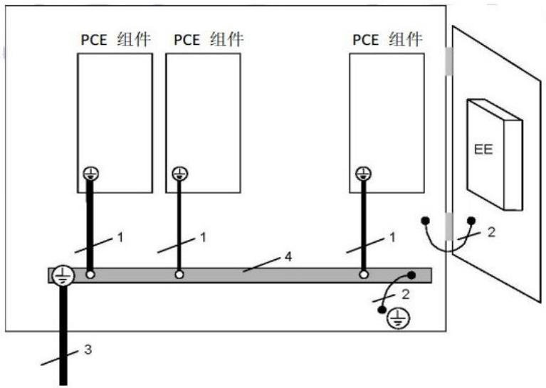  
图7-1 保护连接示例

图中：

1 —— 产品部件的保护接地导线（根据每个部件要求）。

2 —— 保护连接（可能是连接导体，紧固件，或其他方式）。

3 —— 产品保护接地导体（根据产品要求）。

4 —— 接地母线。

## 7.2.3.2.2 连接方式

电气的接地保护连接应当选择以下方式:

a) 通过直接的金属连接;

b) 通过产品使用时不会被卸掉的其它零部件；

c) 通过专用的保护连接;

d) 通过产品其它金属元器件。

直接金属连接的两部件，接触处有涂层或油漆，应刮去涂层或油漆确保金属与金属的直接接触。

当电气产品安装在盖、门或罩上面时，可采用例如专门的连接导体、紧固件、铰链的方式以确保保护连接的连续性，其阻抗需要满足7.2.3.2.3要求。

金属软管或硬管以及金属套一般不能用作保护导体，除非这些装置或材料经过研究证明适用于保护连接用途。

## 7.2.3.2.3 保护连接要求

保护连接应满足以下要求:

a) 对于电路中过电流保护装置的额定值 $\leqslant 16\mathrm{A}$ 的设备，保护连接的阻值不超过 $0.1\Omega$ 。

b) 对于电路中过电流保护装置的额定值 $>16 \mathrm{~A}$ 的设备, 保护连接上的压降不超过 $2.5 \mathrm{~V}$ 。

保护连接测量检查见8.1.3.2 条款。

## 7.2.3.3 接地外部连接要求

## 7.2.3.3.1 一般要求

储能变流器通电后外部保护接地导体应始终保持连接。除非当地的配线设计规则有不同要求，否则外部保护接地导体的横截面积需符合表7-1的要求，或者根据GB 16895.3 -2004进行计算。

表7-1 外部保护接地导体的横截面积

<table><tr><td>PCE 相导体的横截面积S $mm^{2}$ </td><td>外部保护接地导体的最小横截面积Sp $mm^{2}$ </td></tr><tr><td>S ≤ 16</td><td>S</td></tr><tr><td>16 &lt; S ≤ 35</td><td>16</td></tr><tr><td>35 &lt; S</td><td>S/2</td></tr><tr><td colspan="2">注:只有当外部保护接地导体使用与相导体采用相同的金属时,本表的取值有效。否则,外部保护接地导体横截面积应使其电导率与本表规定等效。</td></tr></table>

## 7.2.3.3.2 连接方式

每个预定需通过保护连接与地相连的储能变流器，都需在靠近相应带电导体连接的地方提供一个连接端子。这个连接端子需防腐蚀，并且适合7.2.3.3.1所规定线缆和安装配线所规定线缆的连接。外部保护接地导体的连接方式不能用作其他连接的机械组件。每个外部保护接地导体应使用单独的连接方式。连接和连接点的电流容量不能因机械、化学或电化学影响而降低。若外壳和导体采用铝或铝合金，需特别注意电解液腐蚀的问题。接地回路中不应安装熔断器等短路保护开关装置。

## 7.2.3.3.3 接触电流

满足本条款的要求是为了在保护接地导体受损或被断开的情况下保持安全。

对于插头连接的单相储能变流器，使用GB/T 12113-2003试验图4所规定的试验电路，测得的接触电流不应超过3.5 mA a.c. 或10 mA d.c.。

注1：GB/T 12113 -2003 试验图4见附录B。

注2：注意外部试验源和地之间的电容对接触电流测量的影响。

对于其他储能变流器或根据以上要求测量接触电流见8.1.3.3，或采用以下一个或多个保护措施：

## a) 固定连接:

保护接地导体的横截面积至少为 $10mm^{2}$ （铜）或 $16mm^{2}$ （铝）；

在保护接地导体中断情况下自动断开电源；

为与第一个保护接地导体具有相同横截面积的第二个保护接地导体提供连接端子，且在安装说明书中要求第二个保护接地导体也必须安装。

b) 用IEC 60309规定的工业连接器进行连接，而且多导体电缆中得保护接地导体的最小横截面积为 $2.5 \mathrm{~mm}^{2}$ 。

## 7.2.4 绝缘配合

## 7.2.4.1 一般要求

绝缘配合是根据设备的使用及其周围的环境来选择设备的电气特性。

只有基于在其期望寿命中所承受的应力（如电压）时才能实现绝缘配合。

## 7.2.4.2 污染等级

储能变流器的绝缘在使用期间会受到污染的影响，尤其是通过电气间隙和爬电距离提供的绝缘。储能变流器需满足的最低污染等级应该是根据5.1.1.3.2的要求进行确定。

## 7.2.4.3 过电压

## 7.2.4.3.1 一般要求

过电压类别按GB/T 16895.10-2010中相关条款判别：

类别IV的设备是使用在配电装置电源的设备；

注：此类设备包含如测量仪和前级过电流保护设备。

—— 类别III的设备是固定式配电装置中的设备，以及设备的可靠性和适用性必需符合特殊要求者；注：此类设备包含如安装在固定式配电装置中的开关电器和永久连接至固定式配电装置的工业用设备。

—— 类别Ⅱ的设备是由固定式配电装置供电的耗能设备；

注：此类设备包含如器具、可移动式工具及其他家用和类似用途负载。如果此类设备的可靠性和适用性具有特殊要求时，则采用过电压类别Ⅲ。

—— 类别 I 的设备是连接至具有限制瞬时过电压至相当低水平措施的电路的设备。

注：除非电路设计时考虑了暂时过电压，否则过电压类别为Ⅰ的设备不能直接连接于电网中。

## 7.2.4.3.2 PV 电路过电压

一般地，PV电路的过电压等级定为Ⅱ级，冲击耐压分级依据PV系统电压见表7-3。PV电路冲击耐压不小于2 500 V。

## 7.2.4.3.3 电源电路过电压

一般地，电源电路过电压考虑等级为III级，冲击耐压见表7-3。

注：电源电路并不一定过电压等级为Ⅲ级，某些安装环境需要考虑Ⅳ级过电压。变流器提供的安装信息需说明过电压等级。

## 7.2.4.4 绝缘位置

## 7.2.4.4.1 电路与其周边之间

电路及其周边之间的基本绝缘、附加绝缘和加强绝缘的设计需考虑以下因素：

—— 冲击电压

暂时过电压

—— 电路的额定工作电压

## 7.2.4.4.2 直接连接电网的电路

直接连接到电网的电路及其周边之间的电气间隙和固体绝缘应根据冲击电压、暂时过电压、或工作电压进行设计，选择三者中要求最严酷的。

## 7.2.4.4.3 主电路以外的电路

两个电路之间的绝缘设计应根据对绝缘有较高要求的电路来确定。对于电气间隙和固体绝缘，由有较高冲击电压要求的电路决定。对于爬电距离，由有较高的工作电压有效值的电路决定。

主电路以外的电路及其周边之间的电气间隙和固体绝缘，需根据冲击电压和重复峰值电压进行设计，考虑以下要求：

—— 系统电压:

对于PV电路，取最大额定PV开路电压

对于其他电路，取工作电压

——冲击电压见表7-3的规定，根据上述系统电压和7.2.4.4规定的过电压等级进行查表。

——电气间隙的设计根据工作电压或冲击电压来确定，取二者中要求较严酷的。

## 7.2.4.5 绝缘材料

绝缘材料要求应按GB/T 16935.1 -2008中4.8条款要求。将绝缘材料按CTI值划分为四组，CTI值是根据GB/T 4207-2003 使用溶液A所测得的。具体的分组如下：

绝缘材料组别 I $600 \leq CTI;$

绝缘材料组别 II $400 \leq CTI;$

绝缘材料组别IIIa $175 \leq CTI;$

绝缘材料组别IIIb $100 \leq CTI;$

绝缘材料可用耐电痕化指数（PTI）来表明耐电痕化性能。根据GB/T 4207-2003规定的方法使用溶液A验证PTI值。

按GB/T 4207-2003 中相比电痕化指数（CTI）试验比较各种绝缘材料在试验条件下的性能，可提供定性比较，同时就绝缘材料具有形成漏电痕迹的趋向来说，相比电痕化指数试验也可给出定量比较。

对于玻璃、陶瓷或其它无机绝缘材料，不会发生电痕化，爬电距离无需大于其相应的为实现绝缘配合而要求的电气间隙。

## 7.2.4.6 电气间隙

## 7.2.4.6.1 一般要求

电气间隙除考虑7.2.4.2 要求外，另需考虑如下影响因素：

电场条件；

——功能绝缘、基本绝缘、附件绝缘和加强绝缘的冲击耐受电压要求；
——海拔。

## 7.2.4.6.2 电场条件

## 7.2.4.6.2.1 一般要求

导电部件（电极）的形状和布置会影响到电场的均匀性，进而影响到耐受规定的电压所需要的电气间隙。

## 7.2.4.6.2.2 非均匀电场条件

由于不能控制形状结构，可能会对电场的均匀性产生不利影响，因此通过绝缘材料的外壳中缝隙的电气间隙应不小于非均匀电场条件规定的电气间隙。

表7-2规定了非均匀电场的电气间隙要求。

选用不小于表7-2中电气间隙可不必考虑导电部件的形状结构，也不必用电压耐受试验进行验证。

海拔2000米和20000米之间使用的设备，电气间隙需根据GB/T 16935.1 -2008表A2（或见附录F）的修正因子进行修正。

电气间隙的符合性应通过测量来验证；必要时进行8.1.3.4的冲击耐压试验和绝缘耐压试验。

## 表7-2 电气间隙

<table><tr><td>1</td><td>2</td><td>3</td><td>4</td><td>5</td><td>6</td></tr><tr><td rowspan="3">冲击电压V</td><td rowspan="3">用于确定电路及其周边之间绝缘的暂时过电压(峰值)或用于确定功能绝缘的工作电压(重复峰值)V</td><td rowspan="3">用于确定电路及其周边之间绝缘的工作电压(重复峰值)V</td><td colspan="3">最小间隙mm</td></tr><tr><td colspan="3">污染等级</td></tr><tr><td>1</td><td>2</td><td>3</td></tr><tr><td>N/A</td><td> $\leqslant 110$ </td><td> $\leqslant 71$ </td><td>0,01</td><td>0,20a</td><td>0,80</td></tr><tr><td>N/A</td><td>225</td><td>141</td><td>0,01</td><td>0,20</td><td>0,80</td></tr><tr><td>330</td><td>340</td><td>212</td><td>0,01</td><td>0,20</td><td>0,80</td></tr><tr><td>500</td><td>530</td><td>330</td><td>0,04</td><td>0,20</td><td>0,80</td></tr><tr><td>800</td><td>700</td><td>440</td><td>0,10</td><td>0,20</td><td>0,80</td></tr><tr><td>1 500</td><td>960</td><td>600</td><td>0,50</td><td>0,50</td><td>0,80</td></tr><tr><td>2 500</td><td>1 600</td><td>1 000</td><td colspan="3">1,5</td></tr><tr><td>4 000</td><td>2 600</td><td>1 600</td><td colspan="3">3,0</td></tr><tr><td>6 000</td><td>3 700</td><td>2 300</td><td colspan="3">5,5</td></tr><tr><td>8 000</td><td>4 800</td><td>3 000</td><td colspan="3">8,0</td></tr><tr><td>12 000</td><td>7 400</td><td>4 600</td><td colspan="3">14,0</td></tr><tr><td colspan="6">注1:允许插值。注2:暂时过电压和工作电压的电气间隙源自于GB/T 16935.1-2008表A1。第2列的电压大约为耐受电压的80%;第3列的电压大约为耐受电压的50%。注3:a指PWB上为0.1mm。</td></tr></table>

## 7.2.4.6.2.3 均匀电场条件

只有当导电部件（电极）的形状结构设计成使该处电场强度基本上为恒定的电压梯度时才能采用此值。如果确切知道电场是均匀分布的，而且冲击电压≥6 000 V（对于直接连接电网的电路）或者4 000 V（电路内部），那么电气间隙可以减小到GB/T 16935.1-2008表F2情况B的电气间隙值。

## 7.2.4.6.3 功能绝缘的电气间隙的确定

要求的耐受电压应是设备在额定条件下跨电气间隙两端预期发生的最大冲击电压或暂时过电压（见下表7-3），对应的电气间隙参见上表7-2。

表7-3 低电压电路的绝缘电压

<table><tr><td>1</td><td>2</td><td>3</td><td>4</td><td>5</td><td>6</td></tr><tr><td rowspan="2">系统电压V</td><td colspan="4">冲击耐受电压V</td><td rowspan="2">暂时过电压 $(峰值r.m.s.)^{(5)}$ V</td></tr><tr><td colspan="4">过电压等级I II III IV</td></tr><tr><td>50 V rms or 71 V dc</td><td>330</td><td>500</td><td>800</td><td>1 500</td><td>1 770 / 1 250</td></tr><tr><td>100 V rms or 141 V dc</td><td>500</td><td>800</td><td>1 500</td><td>2 500</td><td>1 840 / 1 300</td></tr><tr><td>150 V rms or 213 V dc</td><td>800</td><td>1 500</td><td>2 500</td><td>4 000</td><td>1 910 / 1 350</td></tr><tr><td>300 V rms or 424 V dc</td><td>1 500</td><td>2 500</td><td>4 000</td><td>6 000</td><td>2 120 / 1 500</td></tr><tr><td>600 V rms or 849 V dc</td><td>2 500</td><td>4 000</td><td>6 000</td><td>8 000</td><td>2 550 / 1 800</td></tr><tr><td>1000 V rms or 1500 V dc</td><td>4 000</td><td>6 000</td><td>8 000</td><td>12 000</td><td>3 110 / 2 200</td></tr><tr><td colspan="6">注1:电源电路不允许插值,其它电路允许。注2:最后一行仅适用于单相系统,或三相系统中相对相。注3:第六栏,暂时过电压仅适用于主电源电路。注4:变流器直流输入侧主电路最小冲击电压2 500 V。注5:本栏数值是根据GB/T16935.1-2008用公式(1 200 V + 系统电压)计算得到。</td></tr></table>

## 7.2.4.6.4 基本绝缘、附加绝缘和加强绝缘的电气间隙的确定

基本绝缘和附加绝缘的电气间隙应按表7-2电气间隙2、3栏规定各自应对的电压予以确定。加强绝缘的电气间隙按表7-2电气间隙1栏规定各自应对的电压予以确定。对应的电压值应采用下一个更高的脉冲电压，或者1.6倍的暂时过电压，或1.6倍工作电压以最高电压值为准。

## 7.2.4.6.5 海拔

表7-2中规定的电气间隙对从海平面至 $2000\mathrm{m}$ 之处是有效的，附录H规定的海拔修正系数适合于海拔高于 $2000\mathrm{m}$ 以上的电气间隙。

## 7.2.4.7 爬电距离

## 7.2.4.7.1 一般要求

爬电距离要足够大以防止固体绝缘表面长期退化。对于功能绝缘、基本绝缘和附加绝缘，直接采用表7-4中数值。对于加强绝缘表中数值要加倍（2倍）。当表规定的爬电距离小于7.2.4.6规定的或由冲击试验确定的电气间隙时，爬电距离要增加与电气间隙相同。表7-4中的值适用于大多数用途，爬电距离应从表中选取，且必须考虑以下影响因素：电压；污染；爬电距离的方向和位置；绝缘表面的形状；绝缘材料。爬电距离通过测量检验，测试方法见8.1.3.4.7条款。

## 7.2.4.7.2 电压

确定爬电距离是以作用在跨接爬电距离两端的长期电压有效值为基础。电压见表7-4中第一列，允许插值。

## 7.2.4.7.3 污染

微观环境污染等级对确定爬电距离的尺寸的影响在表7-4中考虑。

注：设备中可能存在不同的微观环境条件。

## 7.2.4.7.4 爬电距离的方向和位置

如有必要，制造商应指明设备或原件预期使用的方位，以便在设计时考虑污染的积累对爬电距离的不利影响。必须考虑长期存放的情况。

表7-4 最小爬电距离

<table><tr><td>1</td><td>2</td><td>3</td><td>4</td><td>5</td><td>6</td><td>7</td><td>8</td><td>9</td><td>10</td><td>11</td><td>12</td></tr><tr><td rowspan="5">工作电压,交流有效值或直流V</td><td colspan="2"> $(PWBs)^{a}$ </td><td colspan="9">其它绝缘体</td></tr><tr><td colspan="2">污染等级</td><td colspan="9">污染等级</td></tr><tr><td>1</td><td>2</td><td>1</td><td colspan="4">2</td><td colspan="4">3</td></tr><tr><td rowspan="2">b</td><td rowspan="2">c</td><td rowspan="2">b</td><td colspan="4">绝缘材料组别</td><td colspan="4">绝缘材料组别</td></tr><tr><td>I</td><td>II</td><td>IIIa</td><td>IIIb</td><td>I</td><td>II</td><td>IIIa</td><td>IIIb</td></tr><tr><td>≤2</td><td>0,025</td><td>0,04</td><td>0,056</td><td>0,35</td><td>0,35</td><td colspan="2">0,35</td><td>0,87</td><td>0,87</td><td colspan="2">0,87</td></tr><tr><td>5</td><td>0,025</td><td>0,04</td><td>0,065</td><td>0,37</td><td>0,37</td><td colspan="2">0,37</td><td>0,92</td><td>0,92</td><td colspan="2">0,92</td></tr><tr><td>10</td><td>0,025</td><td>0,04</td><td>0,08</td><td>0,40</td><td>0,40</td><td colspan="2">0,40</td><td>1,0</td><td>1,0</td><td colspan="2">1,0</td></tr><tr><td>25</td><td>0,025</td><td>0,04</td><td>0,125</td><td>0,50</td><td>0,50</td><td colspan="2">0,50</td><td>1,25</td><td>1,25</td><td colspan="2">1,25</td></tr><tr><td>32</td><td>0,025</td><td>0,04</td><td>0,14</td><td>0,53</td><td>0,53</td><td colspan="2">0,53</td><td>1,3</td><td>1,3</td><td colspan="2">1,3</td></tr><tr><td>40</td><td>0,025</td><td>0,04</td><td>0,16</td><td>0,56</td><td>0,80</td><td colspan="2">1,1</td><td>1,4</td><td>1,6</td><td colspan="2">1,8</td></tr><tr><td>50</td><td>0,025</td><td>0,04</td><td>0,18</td><td>0,60</td><td>0,85</td><td colspan="2">1,20</td><td>1,5</td><td>1,7</td><td colspan="2">1,9</td></tr><tr><td>63</td><td>0,04</td><td>0,063</td><td>0,20</td><td>0,63</td><td>0,90</td><td colspan="2">1,25</td><td>1,6</td><td>1,8</td><td colspan="2">2,0</td></tr><tr><td>80</td><td>0,063</td><td>0,10</td><td>0,22</td><td>0,67</td><td>0,95</td><td colspan="2">1,30</td><td>1,7</td><td>1,9</td><td colspan="2">2,1</td></tr><tr><td>100</td><td>0,10</td><td>0,16</td><td>0,25</td><td>0,71</td><td>1,0</td><td colspan="2">1,4</td><td>1,8</td><td>2,0</td><td colspan="2">2,2</td></tr><tr><td>125</td><td>0,16</td><td>0,25</td><td>0,28</td><td>0,75</td><td>1,05</td><td colspan="2">1,5</td><td>1,9</td><td>2,1</td><td colspan="2">2,4</td></tr><tr><td>160</td><td>0,25</td><td>0,40</td><td>0,32</td><td>0,80</td><td>1,1</td><td colspan="2">1,6</td><td>2,0</td><td>2,2</td><td colspan="2">2,5</td></tr><tr><td>200</td><td>0,40</td><td>0,63</td><td>0,42</td><td>1,0</td><td>1,4</td><td colspan="2">2,0</td><td>2,5</td><td>2,8</td><td colspan="2">3,2</td></tr><tr><td>250</td><td>0,56</td><td>1,0</td><td>0,56</td><td>1,25</td><td>1,8</td><td colspan="2">2,5</td><td>3,2</td><td>3,6</td><td colspan="2">4,0</td></tr><tr><td>320</td><td>0,75</td><td>1,6</td><td>0,75</td><td>1,6</td><td>2,2</td><td colspan="2">3,2</td><td>4,0</td><td>4,5</td><td colspan="2">5,0</td></tr><tr><td>400</td><td>1,0</td><td>2,0</td><td>1,0</td><td>2,0</td><td>2,8</td><td colspan="2">4,0</td><td>5,0</td><td>5,6</td><td colspan="2">6,3</td></tr><tr><td>500</td><td>1,3</td><td>2,5</td><td>1,3</td><td>2,5</td><td>3,6</td><td colspan="2">5,0</td><td>6,3</td><td>7,1</td><td colspan="2">8,0</td></tr><tr><td>630</td><td>1,8</td><td>3,2</td><td>1,8</td><td>3,2</td><td>4,5</td><td colspan="2">6,3</td><td>8,0</td><td>9,0</td><td colspan="2">10,0</td></tr><tr><td>800</td><td>2,4</td><td>4,0</td><td>2,4</td><td>4,0</td><td>5,6</td><td colspan="2">8,0</td><td>10,0</td><td>11</td><td>12,5</td><td>d</td></tr><tr><td>1 000</td><td>3,2</td><td>5,0</td><td>3,2</td><td>5,0</td><td>7,1</td><td colspan="2">10,0</td><td>12,5</td><td>14</td><td>16</td><td></td></tr><tr><td>1 250</td><td>4,2</td><td>6,3</td><td>4,2</td><td>6,3</td><td>9</td><td colspan="2">12,5</td><td>16</td><td>18</td><td>20</td><td></td></tr><tr><td>1 600</td><td rowspan="3">e</td><td rowspan="3">e</td><td>5,6</td><td>8,0</td><td>11</td><td colspan="2">16</td><td>20</td><td>22</td><td>25</td><td></td></tr><tr><td>2 000</td><td>7,5</td><td>10,0</td><td>14</td><td colspan="2">20</td><td>25</td><td>28</td><td>32</td><td></td></tr><tr><td>2 500</td><td>10,0</td><td>12,5</td><td>18</td><td colspan="2">25</td><td>32</td><td>36</td><td>40</td><td></td></tr><tr><td>3 200</td><td rowspan="3"></td><td rowspan="3"></td><td>12,5</td><td>16</td><td>22</td><td colspan="2">32</td><td>40</td><td>45</td><td>50</td><td></td></tr><tr><td>4 000</td><td>16</td><td>20</td><td>28</td><td colspan="2">40</td><td>50</td><td>56</td><td>63</td><td></td></tr><tr><td>5 000</td><td>20</td><td>25</td><td>36</td><td colspan="2">50</td><td>63</td><td>71</td><td>80</td><td></td></tr><tr><td>6 300</td><td rowspan="2"></td><td rowspan="2"></td><td>25</td><td>32</td><td>45</td><td colspan="2">63</td><td>80</td><td>90</td><td>100</td><td></td></tr><tr><td>8 000</td><td>32</td><td>40</td><td>56</td><td colspan="2">81</td><td>100</td><td>110</td><td>125</td><td></td></tr></table>

CQC3310—2014

<table><tr><td>10 000</td><td></td><td></td><td>40</td><td>50</td><td>71</td><td>100</td><td>125</td><td>140</td><td>160</td><td></td></tr><tr><td colspan="11">a 这些列也适用于 PWB 上的元器件和零部件,以及公差控制相当的其他爬电距离。b 所有材料分组。c 除 IIIb 以外的所有材料分组。d 污染等级 3,630V 以上,一般推荐使用组材料。e 1250 V 以上,采用 4 至 11 列的适当数值。注:允许插值。</td></tr></table>

## 7.2.4.7.5 功能绝缘的爬电距离的确定

功能绝缘的爬电距离应按表7-4规定的对应于跨接爬电距离两端的实际工作电压予以确定。

当用实际工作电压来确定爬电距离时，允许用插入值确定中间电压的爬电距离。应使用线性插入法求插入值，并将所得值的位数圆整到表中值的相同位数。

## 7.2.4.7.6 基本绝缘、附加绝缘和加强绝缘的爬电距离的确定

基本绝缘和附加绝缘的爬电距离应根据承受的最高电压应力从表7-4中确定。允许使用插值确定中间电压的爬电距离。应使用线性插入法求插入值，并将所得值的位数调整到表中值的相同位数。双重绝缘的爬电距离是基本绝缘之值和附加绝缘之值的总和，因双重绝缘是由基本绝缘和附加绝缘组成。加强绝缘的爬电距离应为表7-4中对应于基本绝缘所确定值的二倍。

## 7.2.4.8 固体绝缘

## 7.2.4.8.1 一般要求

由于固体绝缘的电气强度远远大于空气的电气强度，故在设计低压绝缘系统时可能不会引起注意。另一方面，通过固体绝缘材料的绝缘距离通常大大地小于电气间隙而产生高的电应力。另一点需考虑的是实际上很少采用高电气强度的材料。在绝缘系统中电极与绝缘之间和不同的绝缘层之间均可能会产生间隙，或绝缘材料本身有气隙。在这些间隙或气隙中，电压远小于击穿水平时，仍可能发生局部放电，这就会影响固体绝缘的使用寿命。

许多不利影响会在固体绝缘的使用寿命期间积累，由此形成复杂的过程，且最终导致绝缘老化。所以电应力和其他应力（例如热、环境）的叠加会造成绝缘老化。

可用短期试验结合适当的条件处理见8.10环境试验来模拟固体绝缘的长期性能。

固体绝缘的厚度与前面所述的失效机理之间存在一定的联系。固体绝缘的厚度减少，电场强度随之增加，失效的风险也随之上升。由于不可能计算出固体绝缘的所需厚度，因此只能通过试验来验证性能。

## 7.2.4.8.2 应力

## 7.2.4.8.2.1 电压的频率

电压的频率会极大地影响电气强度。介质发热和热不稳定性的概率大约与频率成正比。按GB/T1408.1-2006在工频下测量时，厚度为 $3\mathrm{mm}$ 固体绝缘的击穿电场强度在 $10\mathrm{kV / mm}\sim 40\mathrm{kV / mm}$ 之间。提高施加的电压频率会降低大多数绝缘材料的电气强度。

注：高于30 kHz的频率对电气强度的影响见IEC60664-4。

## 7.2.4.8.2.2 发热

发热可以造成:

——由于内应力的消除造成机械上的变形；

——在高于环境温度（例如温度高于 $60^{\circ}C$ ）的较低温升下热塑性材料软化；

由于塑化剂损失造成某些材料脆裂；

如果超过材料的玻璃化转变温度，尤其会软化某些交联材料；

——增大介电损耗导致热不稳定性和损坏。

## 7.2.4.8.2.3 机械冲击

如果材料不具有足够的抗撞击强度，机械冲击会造成绝缘损坏。因此，在规定运输、储存、安装和使用的环境条件时要考虑此情况。

## 7.2.4.8.2.4 局部放电（PD）

如果跨在绝缘上的工作电压重复峰值大于700 V，且绝缘上的电压应力大于1 kV/mm，要进行局部放电试验。局部放电特性受外施电压的频率的影响。在增高频率的条件下进行加速寿命试验，可证实失效时间大约与外施电压的频率成反比。然而，实际经验仅包括5kHz及以下的频率，因为在较高的频率下，也会存在其他一些失效机理，如电介质发热。

注：高于30kHz 的频率对局部放电的影响见IEC 60664-4。

## 7.2.4.8.2.5 湿度

有水蒸气的地方可能会影响绝缘电阻和放电熄灭电压，加剧表面污染，发生腐蚀外形变化。对于某些材料，高湿度会大大降低电气强度。在某些情况下，低湿度也可能是不利的，例如会增大静电电荷的滞留，且会降低某些材料（如聚酰胺）的机械强度。

## 7.2.4.8.2.6 其它应力

某些应力的影响不怎么重要或影响较小，但在特定情况下，还是应引起注意，如：

——紫外线辐射和电离辐射；

——暴露于溶剂或活性化学剂中造成的应力裂纹或应力断裂；

\- 塑化剂迁移作用；

细菌、霉菌或菌类的作用；

——机械塑性变形等等。

## 7.2.4.8.3 应力要求

## 7.2.4.8.3.1 一般要求

基本绝缘、附加绝缘和加强绝缘的固定绝缘应能持久地承受电场强度和机械应力，并能在设备的预期寿命期间承受可能产生的热影响和环境影响。

## 7.2.4.8.3.2 耐受电压应力

基本绝缘和附加绝缘应能承受以下试验:

a) 根据表8-2第2列或第4列确定冲击电压;

b) 根据表8-3第2列或表8-4确定适当的交流或直流电压。

双重或加强绝缘应能承受以下试验:

a) 根据表8-2第3列或第5列确定冲击电压;

b) 根据表8-3第3列或表8-4确定适当的交流或直流电压；

c) 如果跨在绝缘上的工作电压重复峰值大于700V且绝缘上的电压应力大于1kV/mm，要进行8.1.3.4.6的局部放电试验。

如果设备的试验不能考核元器件或组件内部的双重或加强绝缘，还应在元器件或组件上进行。

如果零部件符合相关标准并且其制造商有可靠的质量控制体系，那么零部件的抽样试验可以不做。

## 7.2.4.8.3.3 承受机械应力

在预期使用中可能出现的机械振动或冲击不应损坏固体绝缘。

## 7.2.4.8.3.4 承受湿度影响

设备在规定湿度条件下应保持绝缘配合。

## 7.2.4.8.3.5 承受其它应力

设备可能承受其它应力，这些应力可能会对固体绝缘产生不利的影响在考虑中。

## 7.2.5 电能危险防护

## 7.2.5.1 危险能量等级的确定

出现下列两种情况之一，则认为存在危险能量等级：

--电压等于或大于2 V，且60s之后功率超过240VA；

通过以下试验来检验其符合性:

产品工作在正常工作条件下,所考虑元器件连接可变电阻负载。调整可变电阻负载使输出达到240VA维持60s（若有必要，可进一步调整）。如果此时电压等于或大于2V，则输出功率处于危险能量水平，除非过流保护装置在上述试验期间启动了，或出于某种原因功率不能在240VA下维持60s。

--电容器电压U等于大于2V，按E=0.5CU²计算的电能E超过20J。其中：

E ——能量，单位为焦耳（J）；

C ——电容，单位为法拉（F）；

U ——电容器端电压测量值，单位为伏特（V）。

## 7.2.5.2 操作人员接触区

产品的设计应保证操作人员接触区的可触及电路不产生危险能量。

如果两个或更多裸露零部件（其中一个可能接地）之间存在危险能量等级，它们被金属物体桥接的时候可能会引起伤害。零部件之间被桥接的可能性通过附录C 图C.1规定的试验指从直线位置来确定。能够被试验指桥接的零部件之间，一定不能存在危险能量等级。

除了限制能量，另一种方式是提供屏障、护栏和类似的防止无意接触的措施。

## 7.2.5.3 维修人员接触区

位于维修或安装时可能被移动或移除的操作面板的电容器, 储能变流器断电之后电容器存储的电荷应不构成危险能量。

储能变流器断开电源之后，内部的电容器应在10 s之内放电至能量低于7.2.5.1规定的20 J。如果由于功能或其它原因本要求不能满足，附录表D.1中第21个警告符号以及放电时间应标示在外壳、电容器的保护屏障或电容器附件清晰可见的位置。变流器断电之后电容器放电时间在维修手册中也需说明。

本条款符合性通过检查和测量来验证：检查产品和相关电路图；考虑各种情况下断电的可能性，所有开关应分别处于“开”或“关”的位置，产品内的周期性耗电装置或元器件应处于非工作状态。如果电容器的放电时间不能精确计算，则应该进行测量。

## 7.3 机械防护要求

## 7.3.1 一般要求

产品不应产生机械危险，棱缘、凸起、拐角、孔洞、护罩和手柄等操作人员能够接触的部位需圆滑，无毛刺，在正常使用时不能引起伤害。

## 7.3.2 运动部件要求

运动部件不能碾压、切割、刺破与之接触的操作人员的身体部位，也不能严重擦伤操作人员的皮肤。产品的危险运动部件，需合理布局、封闭安装或加保护罩，对人身伤害危险提供足够的保护，在例行维护期间，如果由于技术原因不可避免地要求操作人员接触危险运动部件，例如对运动部件进行调整，那么产品必须提供以下所有预防措施才允许让操作人员接触：

a) 只有借助工具才能接触;

b) 为操作人员职责体提供的说明书须有声明：操作人员必须经过培训才允许执行危险操作；

c) 必须拆卸才能接触到危险部位的盖子或零部件上需有警告标识，以防止未经培训的操作人员误接触。

热继电器或过流保护装置，以及自动定时启动装置等，如果其复位会产生危险，则设备不应加装这些装置；本条款符合性通过检查来验证，必要时用试指（见附录C）进行试验见8.1.3.1。试验前先将操作人员可拆卸零部件卸掉，将操作人员可触及的门和盖打开。对于没有采取以上预防措施的设备，试验指以不明显力从任何方向均不得触及危险运动部件，对于防止试验指进入的孔洞，需进一步用直的不带关节的试验指，施加30 N的力进行试验。如果这种试验指能进入孔洞，则应重新使用试验指进行试验；如有必要，则应将该试验指施力至30N推入孔洞内。

## 7.3.3 稳定性试验

设备和设备组装的系统，如果没有固定到建筑构件上，则在正常使用中本身须具有物理稳定性。在操作人员打开抽屉等之后起到保持稳定作用的装置，应自动开启或者给出警告标识。稳定性要求需通过8.1.4.1试验来检验。

## 7.3.4 搬运措施

a）如果设备安装或提供了搬运手柄，那么手柄必须能够承受产品本身重量4倍的力（适用时）。

b) 重量为 $18 \mathrm{~kg}$ 或以上的设备或部件，需提供搬运措施，或者在制造商文档中给出搬运指引。

c) 对每个手柄施加大小等于设备重量4倍的力，不用夹具，直接将力均匀施加在手柄中间70 mm的范围内。力要逐渐地增加，10s后达到预定大小，并保持1 min，如果产品安装了多个手柄，力按正常使用的比例分配到各个手柄上；如果设备安装了多个手柄但预定可以通过一个手柄来搬运，则不能进行力的分配，而要求每个手柄都需承受全部的力手柄不能从设备上松脱，或者出现永久性变形、破裂或其它失效现象。

## 7.3.5 墙壁安装

设备上预定固定到墙壁或天花板的安装支架，要承受大小等于设备重量四倍的力。用规定的紧固件和墙壁结构按制造商说明书的要求安装好设备之后，再进行符合性检验。对于可调整的支架，要调整到伸出墙壁最远。如果说明书没有规定墙壁结构，则采用厚度为 $10\mathrm{mm} \pm 2\mathrm{mm}$ 的石膏板（干板）作为支撑表面。石膏板定在面积为 $50\mathrm{mm} \times 100\mathrm{mm} \pm 10\mathrm{mm}$ 、中心间距为 $400\mathrm{mm} \pm 10\mathrm{mm}$ 的骨架上。按说明书规定安装紧固件；如果没有规定，应装在骨架之间的石膏板上。安装支架除了承受设备自重，还要再加上大小等于设备重量三倍的力。力的方向沿重心处垂直向下。试验力在5s至10s内从零逐渐增加到预定大小，然后维持1分钟。

试验后，支架和安装表面不能损坏。

## 7.3.6 抛射出的零部件

在故障条件下，设备不能带有抛射出来可能导致危险的零部件，或者必须限制其能量，设备对抛射零部件的防护措施，必须使用工具才能拆卸。

## 7.3.7 接线端子

## 7.3.7.1 一般要求

蓄电池、储能变流器的接线端子结构应保证良好的电接触和电气的载流能力，并应有足够的机械强度。接线端子的连接应用螺钉、弹簧或其他等效方法与导体连接以保证维持必要的接触压力。接线端子的结构应能在合适接触面间压紧导体，而不会对导体和接线端子有任何显著的损伤。接线端子应设计成不允许导体移动或其移动不应有害于电器的正常运行及不应使绝缘电压值下降至低于额定值。接线端子结构要求通过8.1.4.3试验验证。接线端子也可采用光伏连接器，连接器需经检验证明适用。

## 7.3.7.2 接线端子导电能力

制造厂应规定接线端子适用连接的导线的类型（硬线或软线，单芯线或多股线），最大和最小导线截面以及同时能接至接线端子的导线根数（如适用）。接线端子能够连接的最大截面导线应不小于8.3.2温升试验所规定的导线截面，可用于接线端子的导体应是同一种类型硬线或软线，单芯线或多股线。

## 7.3.7.3 接线端子的连接

用于连接外部导线的接线端子在安装时应容易进入并便于接线。接线端子紧固用螺钉和螺母除固定接线端子本身就位或防止其松动外，不应作为固定其他任何零部件之用。

## 7.4 防火要求

## 7.4.1 一般要求

在电的作用下可能受到热应力影响且有可能使电器的安全性降低的绝缘材料，在正常热和火的作用下不应产生不利的影响。在产品内部和产品外侧，通过使用适当的材料和元器件以及采用适当的结构，以减少引燃危险和火焰蔓延的危险。

储能变流器使用的储能电池，防火性能应满足相关标准的要求，若无适用标准，应满足使用说明书规定的全部要求。

储能电池安装时应充分考虑防火要求，将储能电池故障引起火灾的风险降低到最低等级。

注1：通过在正常工作条件下元器件的最高温度或限制电路的有效功率来减小引燃的危险。

注2：通过使用阻燃材料和绝缘或者提供足够的隔离，减少引燃火焰蔓延的可能。

## 7.4.2 减少引燃和火焰蔓延的方法

对设备或设备的一部分，阻止引燃和火焰蔓延有两种保护方法：

方法1 —— 选择和使用能将引燃危险和火焰蔓延的可能性减小的元器件、配线和材料；必要时使用防火外壳。

注：对于元器件数量比较多的设备，推荐使用方法1。

方法2 —— 所有模拟试验不会有导致元器件引燃，或使温度达到燃点，或导致其他着火危险迹象，那么，此类设备或设备的一部分则就不要求防火外壳。

注：对于元器件数量比较少的产品，推荐使用方法2。

## 7.4.3 材料防火

## 7.4.3.1 一般要求

外壳、元器件和其他零部件的结构或所使用的材料，应能限制火焰的蔓延。

从燃烧性能来讲，可燃性等级为VTM-0、VTM-1和VTM-2的材料可认为分别等效于可燃性等级为V-0、V-1和V-2的材料。它们的电气和机械性能不一定等效。

材料的可燃性等级适用HB级或HBF级时，按照GB/T 5169.11-2006规定，在550℃下通过灼热丝试验的材料作为替换也可接受。

若无法防止元器件在故障条件下过热，则这些元器件应安装在可燃性等级为V-1级的材料上，且应与可燃性等级低于V-1级的材料相隔至少 $13\mathrm{mm}$ 的空气间隙，或用可燃性等级为V-1级的实心挡板隔开。

用作外层外壳的聚合物材料, 如果表面积大于 $1 \mathrm{~m}^{2}$ 或单个方向的长度超过 $2 \mathrm{~m}$ , 则根据ASTM E162 或ANSI/ASTM E84的方法测定的燃烧速率不能超过100, 方法1还是方法2均适用。

注：材料可燃性要求在表7-6中一般要求。

## 7.4.3.2 防火外壳的材料

如果外壳材料不属于以下规定的类别，则需对最终定型的外壳或其一部分进行试验，而且要进行定期的抽样检验。

防火外壳所采用的最薄有效壁厚的材料，其可燃性等级根据GB/T 5169.17-2008 可判为5 VB级，或者最终产品通过5VB级试验。无论分级还是试验，试验结果需符合以下所有要求：

a) 样品不应释放燃烧的滴落物或者能点燃脱脂棉的颗粒;

b) 在试验火焰第五次施加后，样品延续燃烧不应超过1min;

c) 试验后，燃烧孔洞不能大于25 mm。

防火外壳材料距离起弧零部件(例如非密封整流子和未封装的开关接点)的空气间隙应大于13 mm。

防火外壳材料若距离非起弧零部件的空气间隙小于13 mm，而这些零部件在正常或异常工作条件下能达到足以引燃外壳材料的温度，那么外壳材料应通过附录H（IEC 60695-2-20）的热丝引燃试验。

如果样品熔穿但没有点燃，则孔洞尺寸须符合本标准的要求。金属、陶瓷材料和玻璃无须进行试验即可认为符合要求。

## 7.4.3.3 防火外壳内的元器件和其他零部件的材料

在防火外壳内的元器件和其他零部件（包括安置在防火外壳内的机械防护外壳和电气防护外壳）的材料应符合以下要求之一：

a) 可燃性等级为V-2级或HF-2级；

b) 符合包含相关要求的IEC和GB元器件标准。

以上要求不适用于下列任一种情况：

a) 按7.4.2方法2试验确认不存在着火危险的电子元器件；

b) 安装在体积不超过 $0.06 \mathrm{~m}^{3}$ 、全部由金属制成且无通风孔的外壳内的材料和元器件，或者装在充有惰性气体的密封单元内的材料和元器件；

c) 直接用于防火外壳内的任何表面（包括载流零部件表面）的一层或多层的薄层绝缘材料（例如胶带），如果薄层绝缘材料和应用表面的组合符合可燃性等级V-2级或HF-2级的要求；

d) 电子元器件，例如集成电路封装件、光耦合器封装件、电容器和其他安装在可燃性等级为V-1级材料上的小零部件；

e) 带有PVC、TFE、PTFE、FEP、氯丁橡胶或聚酰亚胺绝缘的导线、电缆和连接器；

f) 用于线束的各种夹持件（不包括螺旋缠绕式的或其他连续形式的夹持件）、带子、细绳和电缆捆绑材料；

g) 以下零部件，如果它们与故障条件下可能产生引燃温度的电子零部件（绝缘导线和电缆除外）之间相隔的空间距离至少有 $13\mathrm{mm}$ ，或者相互之间用可燃性等级为V-1级的材料做成的实心挡板隔开。

a. 作为燃烧物质可以忽略不计的小零部件，包括标签、安装脚轮、键帽、把手等。

b. 气动或液压系统的管道，粉末和液体的容器，以及泡沫塑料零部件，如果它们是用可燃性等级为HB级的材料做成。

## 7.4.3.4 空气过滤装置的材料

空气过滤装置应使用可燃性等级为V-2级或HF-2级的材料做成，要求不适用于以下的结构：

a) 不向防火外壳外面排风的空气循环系统中的空气过滤装置，不管它是否气密；

b) 安置在防火外壳内侧或外侧，与可能产生引燃温度的电气零部件之间是通过金属屏隔离的的空气过滤装置。金属屏可以打孔，但是需满足对防火外壳底板的要求；

c) 由可燃性等级为HB级的材料构成的空气过滤构件，该构件与在故障条件下可能产生引燃温度的电气零部件（绝缘导线和电缆除外）之间，相隔的空间距离至少有13 mm，或者用可燃性等级为V-1级的材料做成的实心挡板隔开；

d) 安装在防火外壳外侧，用可燃性等级为HB级的材料做成的空气过滤装置。

e) 本条款符合性通过检查设备和材料数据来检验。

表7-6 材料可燃性要求汇总

<table><tr><td>零部件</td><td>要求</td></tr><tr><td>大面积外壳材料</td><td>火焰蔓延最大速率不超过 $100mm^{2}/s$ </td></tr><tr><td>防火外壳</td><td>-5VB级-IEC 60695-11-20的试验-IEC 60695-2-20的热丝试验(若与可能产生引燃温度的零部件之间的空气距离小于13 mm)</td></tr><tr><td>元器件和零部件,包括防火外壳内的机械防护外壳和电气防护外壳</td><td>- V-2级或HF-2级- 元器件和例外情况见7.4.3.3</td></tr><tr><td>空气过滤装置</td><td>- V-2级或HF-2级- 例外情况见7.4.3.4</td></tr></table>

## 7.5 基本功能要求

## 7.5.1 电气参数

## 7.5.1.1 输入要求

储能变流器最大输入电流或功率要求不超过额定输入的110%。

## 7.5.1.2 输出要求

储能变流器输出电流或输出功率的偏差应在标识的额定输出 + 10% 以内。

## 7.5.1.3 逆变效率

对逆变效率，要求不带隔离变压器型储能变流器最大值应不低于96%，带隔离变压器型储能变流器最大值应不低于94%。

## 7.5.2 自动开关机

储能变流器应能根据电压输入情况，或故障及故障恢复后等情形，实现对应的自动开、关机操作。

## 7.5.3 软启动

储能变流器启动运行时，输出功率应缓慢增加，不应对电网造成冲击；要求储能变流器输出功率从启动至额定值的变化率可根据电网的具体情况进行设定且最大不超过50 kW/s，或者变流器输出电流从启动至额定值的过程中电流最大值要求不超过变流器的额定值的110%。

## 7.5.4 恢复并网

由于电网故障原因导致储能变流器向电网停止送电，在电网的电压和频率恢复到正常范围后，储能变流器应在20s\~5min内能自动重新向电网送电，送电时应满足7.5.3要求。

## 7.5.5 通讯

储能变流器应设置本地通讯接口，应具备CAN、RS485/RS232、以太网等通信接口中的一种，通讯协议宜支持IEC60870-5-104或GB/19582.1或并入电网的相关规定。根据应用领域的不同，允许变流器使用其它通讯协议。通讯接口应具有固定措施，以保护连接电缆与设备的有效连接。通讯端口电磁兼容应符合7.8要求，并易于组成网络。

## 7.5.6 冷却系统

储能变流器应具有冷却系统，确保变流器持续正常工作不因温度过高而对变流器造成损害。

## 7.5.7 防雷

储能变流器应设有防雷保护装置。安装说明书中应说明防雷保护措施。

## 7.5.8 噪声

变流器在最严酷的工况下，在变流器的前后左右距离设备中心水平位置1 m处用声级计测量噪声（适用时）。户用变流器要求噪声不超过65dB。工业用变流器不超过80dB，对于声压等级大于80dB的变流器，应该于变流器明显位置处加贴“听力损害”的警示标识。说明书中给出减少听力损害的指导。

## 7.6 电能质量

## 7.6.1 谐波和波形畸变

## 7.6.1.1 谐波电流含有率

储能变流器在运行时不应造成电网电压波形过度畸变和注入电网过度的谐波电流，以确保对连接到电网的其他设备不造成不利影响。储能变流器额定功率运行时，注入电网的电流谐波总畸变率限值为5%，奇次谐波电流含有率限值见表7，偶次谐波电流含有率限值见表8。其他负载情况下运行时，变流器注入电网的各次谐波电流值不得超过变流器额定功率运行时注入电网的各次谐波电流值。

表7-7 奇次谐波电流含有率限值

<table><tr><td>奇次谐波次数</td><td>含有率限值(%)</td></tr><tr><td>3—9次谐波</td><td>4.0</td></tr><tr><td>11—15次谐波</td><td>2.0</td></tr><tr><td>17—21次谐波</td><td>1.5</td></tr><tr><td>23—33次谐波</td><td>0.6</td></tr><tr><td>35次以上</td><td>0.3</td></tr></table>

表7-8 偶次谐波电流含有率限值

<table><tr><td>奇次谐波次数</td><td>含有率限值(%)</td></tr><tr><td>2—10次谐波</td><td>1.0</td></tr><tr><td>12—16次谐波</td><td>0.5</td></tr><tr><td>18—22次谐波</td><td>0.375</td></tr><tr><td>24—34次谐波</td><td>0.15</td></tr><tr><td>36次以上</td><td>0.075</td></tr></table>

注：由于电压畸变可能会导致更严重的电流畸变，使得谐波测试存在一定的问题。注入谐波电流不应包括任何由未连接光伏系统的电网上的谐波电压畸变引起的谐波电流。满足上述要求的型式试验变流器可视为符合条件，不需要进一步的检验。

## 7.6.1.2 谐波电流允许值

公共连接点的全部用户向该点注入的谐波电流分量应不超过GB/T 14549-1993规定的允许值。

## 7.6.2 功率因数

当储能变流器输出有功功率大于其额定功率的50%时，功率因数应不小于0.98（超前或滞后），输出有功功率在20%～50%之间时，功率因数应不小于0.95（超前或滞后）。功率因数（PF）计算公式为：

$$
P F = \frac {P _ {\mathrm{out}}}{\sqrt {P _ {\mathrm{out}} ^ {2} + Q _ {\mathrm{out}} ^ {2}}}\tag{8}
$$

式中：P out —— 储能变流器输出总有功功率；Q out —— 储能变流器输出总无功功率。

## 7.6.3 三相不平衡度

变流器并网运行时(三相输出)，引起接入电网的公共连接点的三相电压不平衡度不超过GB/T 15543规定的限值，设备引起该点负序电压不平衡度允许一般不超过1.3%，短时不超过2.6%。根据连接点负荷情况及安全运行要求可做适当变动，但必须满足负序电压不平衡度应不超过2%，短时不得超过4%。

注：针对变流器控制其输出电流不平衡度的要求正在考虑中。

## 7.6.4 直流分量

储能变流器额定功率并网运行时，向电网馈送的直流电流分量应不超过其输出电流额定值的0.5%或5mA，取二者中较大值。

## 7.7 电气保护功能要求

## 7.7.1 过/欠压保护

## 7.7.1.1 直流输入侧过压保护

当直流侧输入电压高于储能变流器允许的直流方阵接入电压最大值时，储能变流器不得启动或在0.1s内停机（正在运行的变流器），同时发出警示信号。直流侧电压恢复到变流器允许工作范围后，变流器应能正常启动。

## 7.7.1.2 交流输出侧过/欠压保护

储能变流器交流输出端电压UN超出此电压范围时，允许储能变流器切断向电网供电，切断时应发出警示信号。除大功率储能变流器外对异常电压的响应时间应满足表7-9的要求，电站型并网储能变流器响应时间应满足表7-10的要求。在电网电压恢复到允许的电压范围时变流器应能正常启动运行。此要求适用于多相系统中的任何一相。

注1：最大脱网时间是指从异常状态发生到变流器停止向电网供电的时间。

注2：对于具有低电压穿越功能的变流器，以低电压穿越功能优先。

表7-9 异常电压的响应

<table><tr><td>电网电压(电网接口处)</td><td>最大脱网时间a</td></tr><tr><td>20%≤U&lt;50%UN</td><td>0.1 s</td></tr><tr><td>50%UN≤U&lt;85% UN</td><td>2.0 s</td></tr><tr><td>85% UN≤U&lt;110% UN</td><td>继续运行</td></tr><tr><td>110% UN≤U&lt;135% UN</td><td>2.0 s</td></tr><tr><td>135% UN≤U</td><td>0.05 s</td></tr></table>

表7-10 电站型并网变流器电压异常响应时间

<table><tr><td>电压范围</td><td>运行要求</td></tr><tr><td>&lt;0.9 UN</td><td>应符合本标准第7.7.8节低电压穿越的要求</td></tr><tr><td>0.9 UN≤UT≤1.1 UN</td><td>应正常运行</td></tr><tr><td>1.1 UN &lt; UT &lt; 1.2 UN</td><td>应至少持续运行10s</td></tr><tr><td>1.2 UN≤UT≤1.3 UN</td><td>应至少持续运行0.5s</td></tr><tr><td colspan="2">注:依据接入电网主管部门的相应技术规范要求设定。</td></tr></table>

## 7.7.2 交流输出过/欠频保护

电网频率在额定频率变化时，储能变流器的工作状态应该满足表7-11电网频率的响应的要求。当因为频率响应的问题变流器切出电网后，在电网频率恢复到允许运行的电网频率时变流器能重新启动运行。

表7-11 电网频率的响应

<table><tr><td>频率</td><td>变流器响应</td></tr><tr><td> $\leqslant48Hz$ </td><td>0.2 秒内停止运行</td></tr><tr><td> $48Hz10分钟后停止运行</td><td>10分钟后停止运行</td></tr><tr><td>\( 49.5正常运行</td><td>正常运行</td></tr><tr><td>\( 50.2运行2分钟后停止运行,此时处于停运状态的储能变流器不得并网</td><td>运行2分钟后停止运行,此时处于停运状态的储能变流器不得并网</td></tr><tr><td>\( >50.5Hz$ </td><td>0.2 秒内停止向电网供电,此时处于停运状态的储能变流器不得并网</td></tr></table>

## 7.7.3 相序或极性错误

## 7.7.3.1 直流极性误接

储能变流器直流输入极性误接时变流器能自动保护，待极性和相序正确接入时，储能变流器应能正常工作。

## 7.7.3.2 交流缺相保护

储能变流器交流输出缺相时，设备自动保护不能工作，正确连接时储能变流器正常运行。

## 7.7.4 直流输入过载保护

1）若储能变流器输入端不具备限功率的功能，则当储能变流器输入侧输入功率超过额定功率1.1倍时需跳保护。

2）若储能变流器输入端具备具有限功率功能，当光伏方阵输出的功率超过储能变流器允许的最大直流输入功率的1.1\~1.25倍时，变流器应自动限流工作在允许的最大交流输出功率处。

## 7.7.5 短路保护

当储能变流器开机或运行中，检测到输出侧发生短路时，储能变流器应能自动保护。储能变流器最大跳闸时间应小于0.1s。

## 7.7.6 防孤岛保护

变流器并入10 kV及以下电压等级配电网应具有防孤岛效应保护功能。若变流器并入的电网供电中断，变流器应在2 s内停止向电网供电，同时发出警示信号。对于并入35 kV及以上电压等级输电网的变流器，可由继电保护装置完成保护。

## 7.7.7 操作过电压

变流器在与电网断开时，为了防止损害与变流器连接到同一电路的电力设备，其瞬态电压应不超过表中列出的限值。

表7-12 瞬态电压范围

<table><tr><td rowspan="2">持续时间(s)</td><td colspan="2">瞬时电压</td></tr><tr><td>L-N(V)</td><td>L-L(V)</td></tr><tr><td>0.000 2</td><td>910</td><td>1 580</td></tr><tr><td>0.000 6</td><td>710</td><td>1 240</td></tr><tr><td>0.002</td><td>580</td><td>1 010</td></tr><tr><td>0.006</td><td>470</td><td>810</td></tr><tr><td>0.02</td><td>420</td><td>720</td></tr><tr><td>0.06</td><td>390</td><td>670</td></tr><tr><td>0.2</td><td>390</td><td>670</td></tr><tr><td>0.6</td><td>390</td><td>670</td></tr></table>

## 7.8 电磁兼容

## 7.8.1 发射测试

按照GB 4824，考虑如下两种电磁环境：

——环境 A：与低压非公用电网或工业电网的场所/装置有关，含高骚扰源；

——环境 B：与低压公用电网，诸如家用、商用和轻工业场所/装置有关，不包括高骚扰源。

制造商应在提供给用户的信息中规定并网变流器的应用环境（即设备应用类别）。

## 7.8.1.1 传到发射

家用或直接连接到住宅低压供电网设施中使用的变流器应满足GB4824中组B类限值。

非家用或不直接连接到住宅低压供电网设施中使用的变流器应满足GB4824中组A类限值。

表7-13 A类设备电源端子骚扰电压限值

<table><tr><td rowspan="2">频率/MHz</td><td colspan="2">1组A类设备限值/dB(μV)</td></tr><tr><td>准峰值</td><td>平均值</td></tr><tr><td>0.15~0.50</td><td>79</td><td>66</td></tr><tr><td>0.5~5</td><td>73</td><td>60</td></tr><tr><td>5~30</td><td>73</td><td>60</td></tr><tr><td colspan="3">注:电流大于100A/相,使用电压探头或适当的V型网络(LISN或AMN)。</td></tr></table>

表7-14 B类设备电源端子骚扰电压限值

<table><tr><td rowspan="2">频率/MHz</td><td colspan="2">1组B类设备限值/dB(μV)</td></tr><tr><td>准峰值</td><td>平均值</td></tr><tr><td>0.15~0.50</td><td>66~56随频率的对数线性减小</td><td>59~46随频率的对数线性减小</td></tr><tr><td>0.5~5</td><td>56</td><td>46</td></tr><tr><td>5~30</td><td>60</td><td>50</td></tr></table>

## 7.8.1.2 辐射发射

家用或直接连接到住宅低压供电网设施中使用的变流器应满足GB 4824中组B类限值。

非家用或不直接连接到住宅低压供电网设施中使用的变流器应满足GB 4824中组A类限值。

表7-15 1组设备电磁辐射骚扰限值

<table><tr><td rowspan="3">频率/MHz</td><td colspan="3">骚扰限值/dB(μV/m)</td></tr><tr><td colspan="2">在试验场</td><td>在现场</td></tr><tr><td>1组A类设备测量距离10m</td><td>1组B类设备测量距离10m</td><td>1组A类设备测量距离30m(指距设备所在建筑物外墙的距离) $^a$ </td></tr><tr><td>0.15~30</td><td>在考虑</td><td>在考虑</td><td>考虑中</td></tr><tr><td>30~230</td><td>40</td><td>30</td><td>30</td></tr><tr><td>230~1000</td><td>47</td><td>37</td><td>37</td></tr><tr><td colspan="4">a:考虑到现场测试环境的本底噪声状况,允许10m距离测量,相应限值增加10dB。</td></tr></table>

## 7.8.2 抗扰度测试

制造商应提供在EMC测试期间或测试结果中性能判据定义的功能说明，测试结果按如下判据记录在测试报告里。

表7-16 抗扰度测试的性能判据等级

<table><tr><td>性能判据等级</td><td>试验期间</td><td>试验后</td></tr><tr><td>A</td><td>变流器应按预期要求连续正常运行,不允许任何偏离制造商声明变流器性能的性能降低或性能丧失。</td><td>变流器应按预期要求继续运行。</td></tr><tr><td>BC</td><td>变流器应按预期要求继续运行;允许出现可接受的性能降低,如显示数值在制造商规定限值范围内的变化,通信延迟时间在制造商规定限值范围内的变化,显示屏出现闪烁等。但不允许出现操作状况的改变或不可逆转的存储数据的丢失。可接受的性能降低和性能丧失,但没有不可逆的硬件或软件(程序/数据)破坏。</td><td>能自行恢复暂时的性能降低,变流器按预期要求继续运行。在手动控制、系统重启或电源关断/开启后,变流器能恢复试验期间降低或丧失的性能,并按预期要求继续运行。</td></tr></table>

## 7.8.2.1 静电放电抗扰度

产品应符合GB/T 17626.2的规定，能承受接触放电6kV，空气放电8kV的静电放电骚扰，满足性能判据B。

## 7.8.2.2 射频电磁场辐射抗扰度

产品应符合GB/T 17626.3 的规定，能承受10V/m的射频电磁场辐射场强骚扰，满足性能判据A。

## 7.8.2.3 电快速瞬变脉冲群抗扰度

产品应符合GB/T 17626.4的规定，能承受电源线±2kV，信号±1kV的电快速脉冲群骚扰，满足性能判据B。

## 7.8.2.4 浪涌（冲击）抗扰度

产品应符合 GB/T 17626.5 的规定，能承受共模±2kV，差模±1kV 的浪涌骚扰，满足性能判据B。

## 7.8.2.5 射频场感应的传导骚扰抗扰度

产品应符合GB/T 17626.6的规定，能承受10V的射频场感应的传导骚扰，满足性能判据A。

## 7.8.2.6 电压暂降、短时中断和电压变化的抗扰度

产品应符合GB/T 17626.11的规定，满足性能判据B。

## 7.8.2.7 工频磁场抗扰度

产品应符合GB/T17626.8的规定，依据储能变流器的预期工作环境承受不同试验等级的工频磁场骚扰，满足性能判据A。

## 7.8.2.8 阻尼振荡波抗扰度

产品应符合GB/T17626.12的规定，依据变流器的预期工作环境承受不同试验等级的阻尼振荡波骚扰，满足性能判据A。

## 7.8.2.9 电压波动抗扰度

产品应符合GB/T17626.14的规定，依据变流器的预期工作环境承受不同试验等级的电压波动骚扰，满足性能判据A。

## 7.8.3 闪烁

对于额定电流小于或等于16A（交流）的设备，其应该符合GB 17625.2规定的电压闪烁范围；对于额定大于16A（交流）的设备，应符合GB 17625.3规定的电压闪烁范围。是否符合标准应根据适当的标准通过试验来确定。

## 7.9 功率控制

储能变流器有功功率控制、无功功率控制应符合GB/T29319-2012的相关要求。

## 7.10 方阵绝缘阻抗检测

## 7.10.1 与不接地光伏方阵连接的变流器

与不接地的光伏方阵连接的变流器应在系统启动前测量组件方阵输入端与地之间的直流绝缘阻抗。如果阻抗小于 $R = (\text{Vmax pv}/30\text{mA})$ ，那么：

a）对带电气隔离的变流器，应指示故障，但故障期间仍可进行其它动作和操作。在阻抗满足上述要求时允许其停止报警；

b）对非隔离变流器或变流器虽有隔离但其漏电流不符合要求，应指示故障，并限制其接入电网。此时允许其继续监测方阵的阻抗，并且在阻抗满足上述要求时，允许停止报警也允许并接入电网。

## 7.10.2 需要功能性接地的变流器

若是需要通过一个集成的电阻实现光伏方阵功能性接地的变流器，变流器需满足a）和c），或者b）和c）。

a）含预置的用于功能性接地的电阻在内，总接地阻抗不得小于 $R = (\mathrm{Vmax} \, \mathrm{pv}/30\,\mathrm{mA})$ 。预期的阻抗值可以在所接方阵面积可知的情况下，按照每平米的绝缘方阵 $40\, M\Omega$ 计算。也可以根据变流器的额定功率和变流器可以连接的最差的电池板的效率来计算。

b）如果用到了一个小于a）中规定的电阻。那么变流器应该能够提供一个在运行过程中监测通过电阻和任何一个与之平行的网络线路（如：测试线路），如果超过表7-17的限制，应该断开电阻或者用其他方式实现限流。如果变流器是个非隔离的变流器，或者说不能满足漏电流允许的最低电流，那么必须从电网断开。

c）在正常工作之前，变流器必须能够实现接地电阻的测试。

## 7.10.3 方阵残余电流检测

## 7.10.3.1 一般要求

a）工作在安全电压等级以上的不接地光伏方阵有可能导致触电危险。当储能变流器没有隔离，或者虽具有隔离措施但不能保证限制接触电流在某个合理范围内的储能变流器，当使用者同时接触到方阵的带电部分和地时，电网和地的连接（如接地中线）将为接触电流提供一个回路，从而产生触电危险。这种危险可以通过7.10.3.4描述的防护方式消除，亦可通过7.10.3.5规定的方式，使接触电流被限制在30mA以内。

b）无论光伏方阵接不接地，接地故障的发生都会导致不应载流的导体部件或结构承载电流，从而有着火的危险。该危险可以通过7.10.3.4描述的防护方式消除，亦可通过7.10.3.5规定的方式，将着火漏电流限制在如下范围内：

(1) 对于额定输出 $\leqslant 30 \mathrm{kVA}$ 的储能变流器, $300 \mathrm{~mA}$ 。

(2) 对于额定输出>30 kVA的储能变流器, 10mA/kVA。

## 7.10.3.2 30mA 接触电流

按照IEC60990 图4所示接触电流测试电路，依次测试方阵的各个端子与地之间的接触电流，若测得的值大于30mA限值，则应采用7.10.3.4或7.10.3.5中的措施提供额外保护。

## 7.10.3.3 着火漏电流

着火漏电流应不大于300mA（≤30kVA储能变流器），或10mA/kVA(>30kVA储能变流器)，当大于此值时则需要采用7.10.3.4或7.10.3.5中的措施提供额外保护。

## 7.10.3.4 残余电流检测器（RCD）保护

对于不具有基本隔离的储能变流器，在储能变流器与交流电网之间装配RCD来提供额外保护，RCD限制设置为30mA，并应符合IEC60755的相关要求。

## 7.10.3.5 残余电流监控保护

在储能变流器接入交流电网，交流断路器闭合的任何情况下，储能变流器都应提供残余电流检测。残余电流检测装置应能检测总的（包括直流和交流部件）有效值电流。无论储能变流器是否带有隔离，与之连接的方阵是否接地，以及隔离形式采用何种等级（基本绝缘隔离或加强绝缘隔离），都需对过量的连续残余电流及过量残余电流的突变进行监控。限值如下：

## a) 连续残余电流

如果连续残余电流超过如下限值，储能变流器应当在0.3s内断开并发出故障发生信号：

1) 对于额定输出 $\leqslant 30\mathrm{kVA}$ 的储能变流器， $300\mathrm{mA}$

2) 对于额定输出>30kVA 的储能变流器, 10mA/kVA

## b) 残余电流的突变

如果残余电流的突变超过如表8的限值，那么储能变流器应当在表7-18规定时间内断开。

表7-18 对突变电流的响应时间

<table><tr><td>残余电流突变</td><td>变流器与电网断开时间</td></tr><tr><td>30mA</td><td>0.3s</td></tr><tr><td>60mA</td><td>0.15s</td></tr><tr><td>150mA</td><td>0.04s</td></tr></table>

## 7.11 运行状态

储能变流器除并网运行模式外，还应具有离网运行模式，即按照设定的条件脱离主网，在容量范围内为部分负荷提供符合电网电能质量要求的电能。

储能变流器要求能够自动化运行，运行状态可视化程度高，应清晰可辨。

储能变流器或监控系统上传量信息至少应包含：蓄电池充电电流、蓄电池组端口电压、蓄电池放电电流、储能变流器交流侧电压/电流/频率、功率器件温度、控制/保护定值、保护及故障信号。

储能变流器可接收BMS发送的蓄电池状态量及告警信息等至少包括以下必要信息：蓄电池组可充电电量、蓄电池组可放电电量、蓄电池组状态：充满、放空、正常、告警、故障等。

储能变流器宜具有故障记录功能，每份记录的信息包括故障器件所有重要的模拟量和开关量，以便进行事故分析。

## 7.12 切换时间

储能变流器应能快速切换运行状态，在额定功率并网充电状态和额定功率并网放电状态之间运行状态切换时间不应超过200ms。

## 7.13 储能电池管理系统（BMS）一般要求

电池管理系统应能检测电池的电和热相关的数据，至少应包括电池单体或者电池模块的电压、电池组回路电流和电池包内部温度等参数。

电池管理系统应能对动力电池的荷电状态(SOC)、最大充放电电流(或者功率)等状态参数进行实时估算。

电池管理系统应能对电池系统进行故障诊断，并可以根据具体故障内容进行相应的故障处理，如故障码上报、实时警示和故障保护等。

电池管理系统应有与储能变流器的其他控制器基于总线通信方式的信息交互功能。

电池管理系统应能够有效的将充电电压，使其不超过电池的充电电压上限。

如果输入电流超过了电池的最大充电电流，电池管理系统应该有效的终止充电来保护电池。

如果电池温度超过制造商指定的温度上限时，电池管理系统应能够终止充电。

## 7.13.1 电池

包含电池的设备应合理设计，减少正常使用条件和单一故障条件下发生着火、爆炸、化学品泄漏的危险。其中单一故障条件包括电池组内部电路故障。

如果电池保养可由操作人员进行，维修手册中应详细给出保养说明和指导。进行电池保养时，通过使用正确的工具，电池的端子和连接器要可触及。对于装在电池盒中的电解液电池，保养时应能够测量和调整电解液的液位。

本条款符合性通过检查来检验。检查方法包括目测，以及使用制造商提供或推荐的工具和测量仪器。

## 7.13.1.1 电池外壳通风要求

非密封电池和阀调节电池的外壳应符合以下要求：

a) 容纳电池的外壳或盒子应通风，减少爆炸性气体积聚；

b) 起弧零部件，例如开关、断路器和继电器的接点，不应置于电池盒之内；

c) 电池盒的通风口不应连向装有起弧零部件的封闭空间。

电池在大电流放电、过充或类似使用过程中，可能产生氢气等。为了防止这些气体积聚或形成危险压力，从而降低爆炸危险，PCE 的电池外壳或电池盒应采用通风设计，提供充足的空气流。通风方式应能将挥发性气体控制在危险浓度以下。氢气的体积浓度不应超过2%。

对于装有风扇或过滤器的电池外壳或电池盒,要求在风扇或过滤器被堵塞的情况下仍能防止挥发性气体达到危险浓度。

注：对充满电的铅酸电池继续充电，假设所充入的电能都用于产生气体，那么大约每充电63安时就能够产生1立法英尺（28.3升）的氢气。

## 7.13.1.2 电池的安装

电池安装位置和安装方式的设计要合理,装卸过程中电池的端子不能碰到邻居电池的端子或电池盒的金属部分。用于储能变流器的蓄电池要求有独立的和封闭的安装位置,并应按照蓄电池制造商的说明书防护振动。电池安装可设计为:

---独立的蓄电池间或蓄电池房；

---户内或户外独立的蓄电池箱或蓄电池柜；

---储能变流器内置的蓄电池槽或蓄电池室。

用来容纳和支撑电池的仓室、支架和托盘等，要符合以下适用的要求：

a)金属支架和托盘，与所支撑的电池之间要用绝缘材料进行隔离。

b)非金属支架和托盘材料，以及非密封或阀调节电池仓的聚合物外壳材料，根据电池类型要能够耐受酸或碱的腐蚀。

电池安装方式不应对电池壳造成过度应力或损坏电池壳。安装位置的尺寸设计要考虑电池壳膨胀和尺寸公差。安装后应保证蓄电池电极和蓄电池连接器应易于触及，以便使用合适的工具紧固。带有电解液的蓄电池的安装应使蓄电池单元的盖易于触及，以便于检测电解液和重新调整其液位。

如果蓄电池单元的外壳由绝缘材料构成，或是由一个绝缘外壳罩住，蓄电池间的空隙最小距离应保证通风条件不会导致蓄电池温升过高而产生任何危险。

用于支撑一个或多个蓄电池的金属电池支架或托盘, 实际能够承受的压力应为制造商规定的电池最

大重量乘以最大数量的两倍。施加该压力之后，电池支架或托盘不应有永久的变形、破损、错位、裂缝、或者其他破坏，且电池端子的电气间隙和爬电距离不减少。

本条款符合性通过对电池安装表面施加作用力来检验。试验力在5到10秒钟内逐渐增加到预定大小，并维持1分钟。非金属支架或托盘应在正常工作的最高温度下进行试验。

## 7.13.1.3 电解液溢出

电池托盘和仓室要有耐电解液的涂层。容纳阀调节电池的外壳或仓室应合理设计，保证一个电池溢出或泄漏的电解液存留在该电池的仓室内，防止：

a) 渗到PCE 外壳上被使用者接触到；

b)污染临近的电气元器件或材料;

c) 短接了必要的电距离。

注：规定只能容纳密封电池的外壳，不适用上述要求。

本条款符合性通过检查来检验。

## 1.1.1.1 恒流充电稳流精度

对储能电池进行恒流充电时，输出电流的稳流精度应符合储能电池的具体要求。

## 1.1.1.2 恒流充电电流纹波

对储能电池进行恒流充电时，输出电流的电流纹波应符合储能电池的具体要求。

## 1.1.1.3 恒压充电稳压精度

对储能电池进行恒压充电时，输出电压的稳压精度应符合储能电池的具体要求。

## 1.1.1.4 恒压充电电压纹波

对储能电池进行恒压充电时，输出电压的电压应符合储能电池的具体要求。

## 7.13.2 绝缘电阻

电池管理系统与动力电池相连的带电部件和其壳体之间的绝缘电阻值应不小于2MΩ。

## 7.13.3 绝缘耐压性能

在电池管理系统的电压采样电路(对应电池系统的正极)和其壳体之间施加频率为50Hz的正弦波形交流电压，试验电压(有效值)为该回路可能发生的最高工作电压(如小于550V，则试验电压为550V). 历时1min。

在电池管理系统的供电电源正极端子和与其最近的电压采样电路之间施加频率为50Hz的正弦波形交流电压，试验电压(有效值)为该回路可能发生的最高工作电压(如小于550V，则试验电压为550V)，历时1min。

在电池管理系统的通信线路和与其最近的电压采样电路之间施加频率为50Hz的正弦波形交流电压，试验电压(有效值)为该回路可能发生的最高工作电压(如小于550V，则试验电压为550V)，历时1rmin。

在试验过程中应无击穿或闪络等破坏性放电现象，漏电流小于20mA。

## 7.13.4 状态参数测量精度

电池管理系统所检测状态参数的测量精度要求见表7-19。

表7-19 状态参数测量精度要求

<table><tr><td>参数</td><td>总电压值</td><td>电流值</td><td>温度值</td><td>单体(模块)电压值</td></tr><tr><td>精度要求</td><td> $\leqslant\pm2\%$ </td><td> $\leqslant\pm3\%$ </td><td> $\leqslant\pm2^{\circ}C$ </td><td> $\leqslant\pm0.5\%$ </td></tr></table>

## 7.13.5 电池故障诊断

电池管理系统对于电池系统进行故障诊断的基本项目和可扩展项目分别见表7-20和表7-21。表7-20中所列的故障诊断项目是基本要求。根据储能变流器的能设计和电池系统的具体需要，电池管理系统的具体诊断内容可以不限于表7-20和表7-21所列项目。

表7-20 电池管理系统故障故障诊断基本要求项目

<table><tr><td>序号</td><td>故障状态</td><td>电池管理系统的故障诊断项目a</td></tr><tr><td>1</td><td>电池温度大于温度设定值 1</td><td>电池温度高</td></tr><tr><td>2</td><td>电池温度小于温度设定值 2</td><td>电池温度低</td></tr><tr><td>3</td><td>单体(模块)电压大于电压设定值 1</td><td>单体(模块)电压高</td></tr><tr><td>4</td><td>单体(模块)电压小于电压设定值 2</td><td>单体(模块)电压低</td></tr><tr><td>5</td><td>单体(模块)一致性偏差大于设定条件</td><td>单体(模块)一致性偏差大b</td></tr><tr><td>6</td><td>充电电流(功率)大于最大充电电流(功率)值</td><td>充电电流(功率)大</td></tr><tr><td>7</td><td>放电电流(功率)大于最大放电电流(功率)值</td><td>放电电流(功率)大</td></tr><tr><td colspan="3">a制造商可以自行规定故障项目的具体名称、故障等级划分以及相关故障条件的设定值。b电池系统具有均衡功能时,该项目不作为基本要求项目。</td></tr></table>

表7-21 可扩展的故障诊断项目

<table><tr><td>序号</td><td>故障状态</td><td>电池管理系统的故障诊断项目</td></tr><tr><td>1</td><td>绝缘电阻小于绝缘电阻设定值</td><td>绝缘薄弱</td></tr><tr><td>2</td><td>SOC 值大于 SOC 设定值 1</td><td>SOC 高</td></tr><tr><td>3</td><td>SOC 值小于 SOC 设定值 2</td><td>SOC 低</td></tr><tr><td>4</td><td>总电压小于总电压设定值 1(与放电电流、温度等参数有关)</td><td>总电压低</td></tr><tr><td>5</td><td>总电压大于总电压设定值 2(与充电电流、温度等参数有关)</td><td>总电压高</td></tr><tr><td>6</td><td>外部通信接 iSI 电路故障</td><td>外部通信接口故障</td></tr><tr><td>7</td><td>内部通信接口电路故障</td><td>内部通信接口故障</td></tr><tr><td>8</td><td>电池系统内部温度差大于温度差设定值</td><td>电池系统温差大</td></tr><tr><td>9</td><td>内部通信总线脱离</td><td>内部通信网络故障</td></tr><tr><td>10</td><td>电池连接电阻大于连接电阻设定值(或者其他等效的判断条件)</td><td>电池连接松动</td></tr></table>

## 7.14 储能变流器环境适应性要求

## 7.14.1 低温启动

按GB/T 2423.1中“试验A”进行。储能变流器无包装，在试验温度为 $(-20\pm3)$ ℃(户内型)或 $(-25\pm3)$ ℃(户外型)的环境下，产品至热平衡状态后应能够正常启动，电池管理系统的数据采集精度应满足7.13.4的要求。

若电池管理系统没有集成在储能变流器内部，则将处于工作状态的电池管理系统放入初始温度为室温的恒温箱中，温度降至 $(-20\pm3)$ ℃(户内型)或 $(-25\pm3)$ ℃(户外型)后保持1h，试验过程中记录电池管理系统采集的数据(单体或模块电压采集通道数不少于2个，温度采集通道数不少于1个)，并与检测设备检测的对应数据进行比较，电池管理系统的数据采集精度应满足7.13.4的要求。

## 7.14.2 高温启动及工作

按GB/T 2423.2中“试验B”进行。储能变流器无包装，在试验温度为 $(40\pm2)$ ℃(户内型)或 $(55\pm2)$ ℃(户外型)环境下，产品放置2小时后应能够正常启动；通电加额定负载保持2小时，并在标准大气条件下恢复2小时后，储能变流器应能正常工作，电池管理系统的数据采集精度应满足7.13.4的要求。

若电池管理系统没有集成在储能变流器内部，则将处于工作状态的电池管理系统放入初始温度为室温的恒温箱中，试验温度为 $(40\pm2)$ ℃(户内型)或 $(55\pm2)$ ℃(户外型)环境下，放置2小时后。试验过程中记录电池管理系统采集的数据(单体或模块电压采集通道数不少于2个，温度采集通道数不少于1个)，并与检测设备检测的对应数据进行比较，电池管理系统的数据采集精度应满足7.13.4的要求。

## 7.14.3 恒定湿热

按GB/T 2423.3进行。储能变流器在试验温度为 $(40\pm2)$ ℃(户内型)或 $(55\pm2)$ ℃(户外型)，相对湿度 $(90\pm3)$ %恒定湿热条件下，无包装，不通电，经受48h试验后，取出样品，在正常环境条件下恢复2h后，储能变流器应能正常工作，电池管理系统的数据采集精度应满足7.13.4的要求。

若电池管理系统没有集成在储能变流器内部，则将处于工作状态的电池管理系统放入初始温度为室温的恒温箱中，试验温度为 $(40\pm 2)^{\circ}\mathrm{C}$ (户内型)或 $(55\pm 2)^{\circ}\mathrm{C}$ (户外型)，相对湿度 $(90\pm 3)\%$ 恒定湿热条件下，无包装，不通电，经受48h试验后，取出样品，在正常环境条件下恢复2h后，电池管理系统的数据采集精度应满足7.13.4的要求。

## 8 试验方法

除非本标准另有规定说明，试验场所须满足以下环境条件要求：

—— 温度 $5^{\circ}$ C至 $40^{\circ}$ C；

—— 相对湿度5%至75%；

大气压强75kPa至106kPa；

——无结霜、凝露、渗水、淋雨、日照等现象。

## 8.1 设备安全

## 8.1.1 外观及结构检查

储能变流器系统应符合以下全部要求：

a）采用的元器件数量、质量应符合设计要求，元器件布局、安装应符合各自技术要求；

b）油漆或电镀应牢固、平整，无剥落、锈蚀及裂痕等现象；

c）机架面板应平整，文字和符号要求清楚、整齐、规范、正确；

d）标牌、标志、标记应完整清晰，符合6.1要求；

e）各种开关应便于操作，灵活可靠；

## 8.1.2 结构材料验证

## 8.1.2.1 紫外暴露

户外型设备的外部塑料件应满足7.1.2的要求，或提供第三方相关合格测试报告。

## 8.1.2.2 设备防护等级

设备防护等级按照制造商声明的IP防护等级按照GB 4208-2008验证。

设备的防护等级要求最低满足7.1.3要求。

注：大型储能变流器防护等级验证可采用提供样柜的方法等效测试。

## 8.1.3 电击防护试验

## 8.1.3.1 试验指检查

a) 检查;

b) 用附录C规定的试验指（图C-1）和试验针（图C-2）进行试验，试验结果应符合7.2.2.2的要求。对外壳开孔进行探头试验时，操作人员不用工具即可拆卸或打开的零部件（包括熔断器座）要先去掉；同时，操作人员接触的门和盖要打开。试验时设备中的灯允许留在原位。对于操作人员不需要工具即可断开的连接器，应在断开的过程中和断开之后分别试验。任何可移动零部件要置于对结果最不利的位置。试验指和试验针按照上述要求，在不施加明显力的情况下对每个可能的位置进行试验。重量超过40kg的立式设备可以不用倾斜。预定嵌入式安装、架式安装、或并入大型设备的设备，应根据安装说明书要求的安装方法判断哪些位置需要进行试验。

c) 试验 b）中能够防止带关节试验指（见附录C的图C-1）进入的开孔，要进一步用直线不带关节的试验指（见附录C的图C-3）施加30N力进行试验。如果不带关节试验指能够进入，这时再重新使用带关节试验指进行试验，最多可以施加30N的力。

## 8.1.3.2 保护连接

基本防护一旦损坏可能带有危险接触电压的可接触及的可导电部分, 即外露可导电部分都应与保护等电位连接系统连接。

保护连接的阻抗应是足够低，以避免在绝缘失效的情况下，部件之间出现危险的电位差。

对于每个保护连接电路，保护导体和作为每个保护电路一部分的相关点之间的阻抗，应通电流进行测量。测试电流及持续时间如下：

a) 对于设备过电流保护值小于等于16A，测试电流采用200%的过电流保护值，但是不小于32A，持续120s。保护连接的电阻最后测得不超过0.1Ω。

b) 对于设备过电流保护值大于16A，测试电流是过电流保护值的两倍并且持续时间如下表8-1所示。保护连接的压降测试时，持续时间如下表中规定，持续规定时间后测量得出不超过2.5V。

c) 测试中与测试后，不应有融化，松动或其它损坏可能会伤害到保护连接的有效性。

注1：测试电流可用直流或交流电源，输出不接地。

注2：如果阻抗值很低，需正确放置测量探针。

表8-1 保护连接测试持续时间

<table><tr><td>过流保护装置等级A</td><td>测试持续时间min</td></tr><tr><td>&gt;16~30</td><td>2</td></tr><tr><td>31~60</td><td>4</td></tr><tr><td>61~100</td><td>6</td></tr><tr><td>101~200</td><td>8</td></tr><tr><td>&gt;200</td><td>10</td></tr></table>

1）设备的回路中有过流保护装置，如下图8-1所示：

测量时对于每个保护连接都需要测量，对于带过流保护的电路测量(图8-1)，两个接地点接线不用计算入保护连接阻抗内。

注：设备采用软件控制实现过流保护功能不属于回路中有过流保护装置范畴。

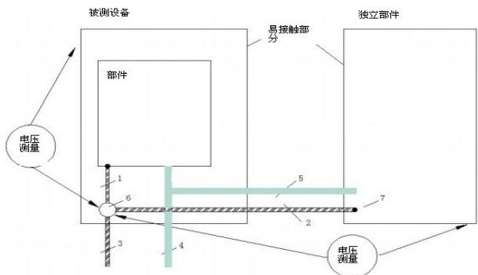  
图8-1 带过流保护装置的保护联结阻抗测试

图中：

1——保护连接

2——独立部件的保护接地导体

3——被测设备的接地保护导体

4——电源供电

5——由被测设备到独立部件供电，带过流保护

6——外部保护接地导体终端

7——独立部件保护接地导体终端

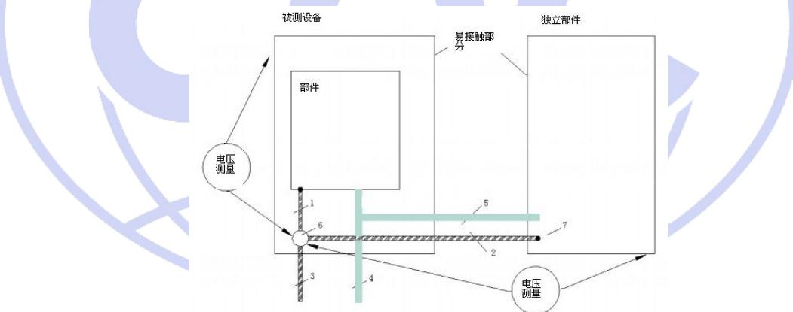  
图8-2 不带过流保护装置的保护联结阻抗测试

图中：

1——保护连接

2——独立部件的保护连接

3——被测设备的接地保护导体

4——电源供电

5——由被测设备到独立部件供电，不带过流保护

6——外部保护接地导体终端

7——独立部件连接的点（可能多于1个）

2）设备的回路中无过流保护装置，如上图8-2所示。

对于不带过流保护的电路测量如上图8-2所示，两个单元的接线电阻必须计算作为保护连接阻抗值。

## 8.1.3.3 接触电流

接触电流测量结果应不大于7.2.3.3.3规定要求。

对于预定安装在潮湿环境中的变流器，应进行湿度预处理(见附录G)后，再进行接触电流的测量。

设备不接地安装，并且在额定电压下。使用IEC 60990图4规定的探头测量外部保护接地导体及其连接方式间的接触电流。

对于预定连接到接地中线系统的PCE，测试场所电网电源的中线应直接连接到外部保护接地导体。

对于预定连接到隔离系统或阻抗系统的PCE，中线应通过1 kΩ电阻连接到外部接地导体，而外部接地导体应依次连接到每个输入相线。测量结果取最大值。

对于预定连接到接地系统的被测设备，外部保护接地导体应依次连接到每个输入相线。测量结果取最大值。

对于带特殊接地系统的被测设备，试验时系统应工作在正常条件下。

对于预定连接到多个系统网络的被测设备，应分别使用每个不同的系统网络来进行漏电流测量。如果能够确定哪个网络对测量结果最不利，也可以直接在最不利情况下测量。

## 8.1.3.4 介电性能的验证

## 8.1.3.4.1 一般条件

除非有关产品标准另有规定，试验都应在完好的电器上进行。

若为了便于试验而采用提高试验严酷度的方法,或为了缩短试验时间而采用较高的操作频率进行试验,则需在制造厂同意的情况下进行,而试验结果应认为是有效的。

根据制造厂的说明书和8.1规定的环境条件，被试设备应如正常使用情况一样接线和完整安装在其固有支架或等效支架上。

所有设备应在自由空气中进行试验。除非另有规定，试验时不允许维修和更换零部件。

## 8.1.3.4.2 冲击耐受电压验证

## a) 一般要求

设备的绝缘验证应采用额定冲击耐受电压进行。

如果设备的某些部分其介电性能受海拔影响较小（如，密封部分），则其绝缘验证可选择无海拔修正系数的额定冲击耐受电压进行试验。这些部分是独立的，而设备的其它部分应选择有海拔修正系数的额定冲击耐受电压进行试验。

## b) 冲击试验电压

试验电压按表8-2规定。

冲击耐压试验的波形为 $1.2 / 50 \mu \mathrm{s}$ （见GB/T17627.1-1998中6.1、6.2规定波形），正负极性各5次，最小时间间隔为1s。针对小于表7-2规定的电气间隙需进行冲击耐压试验，试验电压根据表8-2选择。

如果有必要对设计用于2 000 m至20 000 m海拔高度的电气间隙（根据GB/T 16935.1-2008中的表A.2）进行试验，可以通过电气间隙在表7-2中反查来选取试验电压值。

c) 试验电压施加

试验时保护接地应断开，除非它本身是试验对象。试验电压施加在：

(1)正常工作位置，主电路所有接线端子连接一起和外壳或安装板之间。

(2) 主电路每极与其他极连接一起并接至外壳或安装板之间。

(3) 正常工作不接至主电路的每个控制电路和辅助电路与以下部位之间:

——主电路

-其他电路

-外露导体部分

——外壳或安装板

测试时，以上部位任何合适者可以连接在一起进行。

表8-2 冲击电压试验值

<table><tr><td>1</td><td>2</td><td>3</td><td>4</td><td>5</td></tr><tr><td>系统电压</td><td colspan="2">过电压等级II,不直接连接到电网的电路及周边之间的绝缘的脉冲耐受电压</td><td colspan="2">过电压等级III,直接连接到电网的电路及周边之间的绝缘的脉冲耐受电压</td></tr><tr><td>V</td><td>基本或附加V</td><td>加强V</td><td>基本或附加V</td><td>加强V</td></tr><tr><td>≤50</td><td>500</td><td>800</td><td>800</td><td>1 500</td></tr><tr><td>100</td><td>800</td><td>1 500</td><td>1 500</td><td>2 500</td></tr><tr><td>150</td><td>1 500</td><td>2 500</td><td>2 500</td><td>4 000</td></tr><tr><td>300</td><td>2 500</td><td>4 000</td><td>4 000</td><td>6 000</td></tr><tr><td>600</td><td>4 000</td><td>6 000</td><td>6 000</td><td>8 000</td></tr><tr><td>1 000</td><td>6 000</td><td>8 000</td><td>8 000</td><td>12 000</td></tr><tr><td>-</td><td colspan="2">允许插值</td><td colspan="2">不允许插值</td></tr><tr><td></td><td colspan="2">注:过电压等级I和III的试验电压可以按同样方法从表2中得到</td><td colspan="2">注:过电压等级I和II的试验电压可以按同样方法从表2中得到。</td></tr></table>

d) 试验判别  
试验过程中应无非故意的击穿放电。

## 8.1.3.4.3 固体绝缘的工频耐受电压

## a) 一般要求

本试验是验证固体绝缘及固体绝缘耐受暂态过电压的能力。

## b) 试验电压值

试验电压值，应根据被试验电路是否直接连接到电网而分别从表 8-3 第 2、第 3 栏或者表 8-4 中选择。电压试验应采用 50 Hz 或 60 Hz 的正弦电压。如果电路中有电容器，试验可采用直流电压，直流电压值等于规定的交流电压峰值。

试验电压值：对主电路、控制电路和辅助电路，按表 8-3、8-4 规定，试验电压测量的误差不应超过规定值的±3%；如果不能施加交流试验电压（如由于EMC滤波器件），可应用表第三列中的直流试验电压值。试验电压测量的误差不应超过规定值的±3%。

所施加的电压的有效值应在规定值的±3%范围内。

## c) 试验电压施加

当设备线路包含有仪表、电容器、固态电子器件等，且这些器件的介电试验电压低于上述b)的规定值时，则在进行设备试验前应将这些器件和设备分开，具有保护功能的电路在试验时不应拆除。

对于预定安装在潮湿环境的变流器，应先按规定进行湿度预处理(见附录G)，然后马上进行本项试验。

## —— 带电电路与接地线或外壳之间

带电电路与邻极之间

试验持续时间，对于型式试验至少为60 s。施加试验电压时可以逐渐上升和下降，但上述试验持续时间为达到规定试验电压后保持的时间。

表8-3 直接连接电网电路的交流或直流试验电压

<table><tr><td>1</td><td colspan="2"> $2^b$ </td><td colspan="2"> $3^b$ </td></tr><tr><td>系统电压</td><td colspan="2">带基本绝缘的电路的型式试验电压,以及所有例行试验电压</td><td colspan="2">带保护隔离的电路的型式试验电压,以及电路和可接触表面(导电或非导电,但不连接到保护接地;7.3.6.4的保护等级为II)</td></tr><tr><td>V</td><td>交流电压有效值aV</td><td>直流电压V</td><td>交流电压有效值V</td><td>直流电压V</td></tr><tr><td>≤50</td><td>1 250</td><td>1 770</td><td>2 500</td><td>3 540</td></tr><tr><td>100</td><td>1 300</td><td>1 840</td><td>2 600</td><td>3 680</td></tr><tr><td>150</td><td>1 350</td><td>1 910</td><td>2 700</td><td>3 820</td></tr><tr><td>300</td><td>1 500</td><td>2 120</td><td>3 000</td><td>4 240</td></tr></table>

CQC3310—2014

<table><tr><td>600</td><td>1 800</td><td>2 545</td><td>3 600</td><td>5 090</td></tr><tr><td>1 000</td><td>2 200</td><td>3 110</td><td>4 400</td><td>6 220</td></tr><tr><td colspan="5">注1:允许插值。注2:a 对应于1 200 V+系统电压。注3:b 本试验应采用短路电流不低于0.1 A,符合IEC 61180-1第5.2.2.2条款要求的电压源。</td></tr></table>

## d) 试验结果

储能变流器的输入电路对地、输出电路对地以及输入电路与输出电路间的绝缘电阻应不小于1MΩ，漏电流小于20mA。绝缘电阻只作为绝缘强度试验参考。

试验时，设备应无内部或外部的绝缘闪络和击穿或任何破坏性放电现象的发生，但辉光放电是允许的。

表8-4 不直接连接电网的电路的交流或直流试验电压

<table><tr><td>1</td><td colspan="2"> $2^b$ </td><td colspan="2"> $3^b$ </td></tr><tr><td>工作电压(重复峰值)</td><td colspan="2">带基本绝缘的电路的型式试验电压,以及所有例行试验电压</td><td colspan="2">带保护隔离的电路的型式试验电压,以及电路和可接触表面(导电或非导电,但不连接到保护接</td></tr><tr><td>V</td><td>交流电压有效值aV</td><td>直流电压V</td><td>交流电压有效值V</td><td>直流电压V</td></tr><tr><td>≤71</td><td>80</td><td>110</td><td>160</td><td>220</td></tr><tr><td>141</td><td>160</td><td>225</td><td>320</td><td>450</td></tr><tr><td>212</td><td>240</td><td>340</td><td>480</td><td>680</td></tr><tr><td>330</td><td>380</td><td>530</td><td>760</td><td>1 100</td></tr><tr><td>440</td><td>500</td><td>700</td><td>1 000</td><td>1 400</td></tr><tr><td>600</td><td>680</td><td>960</td><td>1 400</td><td>1 900</td></tr><tr><td>1 000</td><td>1 100</td><td>1 600</td><td>2 200</td><td>3 200</td></tr><tr><td>1 600</td><td>1 800</td><td>2 600</td><td>2 900</td><td>4 200</td></tr><tr><td colspan="5">注1:允许插值。注2:a对应于1200V+系统电压。注3:b本试验应采用短路电流不低于0.1A,符合IEC 61180-1第5.2.2.2条款要求的电压源。</td></tr></table>

## 8.1.3.4.4 短路试验后工频耐受电压

## a) 一般要求

设备应保持短路试验时的安装方式。在实际试验中如不能实现，可以把设备与试验电路断开或把设备移开，但必须注意的是这一做法不应影响试验结果。

b) 试验电压值

8.1.3.4.3中b)适用。

c) 试验电压施加

8.1.3.4.3中c)适用。

d) 试验结果判别

8.1.3.4.3中d)适用。

## 8.1.3.4.5 湿热性能试验后的工频耐受电压

湿热试验后按8.1.3.4.3进行试验。

## 8.1.3.4.6 局部放电试验

a) 一般要求

同一电路的导电零部件应连接在一起。

在冲击耐压试验之后进行局部放电试验，这样可以发现冲击耐压试验导致的损伤。

## b) 试验电压值

压采用 50 Hz 或 60 Hz 交流电压峰值（见图 8-3），峰值应与最大稳态电压、长期暂时过电压、再现峰值电压（根据实际情况乘上系数 F1=1.2、F3=F4=1.25）的最高值相等。

## c) 试验电压施加

采用经过校准的放电测量装置或不带加权滤波的无线电干扰仪，试验按照GB/T 16935.1-2008附录C进行。

试验电压从低于额定放电电压UPD $^{a}$ 开始，逐渐升高至UPD的1.875倍，并最多维持5秒。然后电压逐渐降低到UPD的1.5倍（±5%），并最多维持15秒。在此15秒内完成局部放电的测量。

## 注a：额定放电电压是绝缘隔离的每个电路的重复峰值电压的总和。

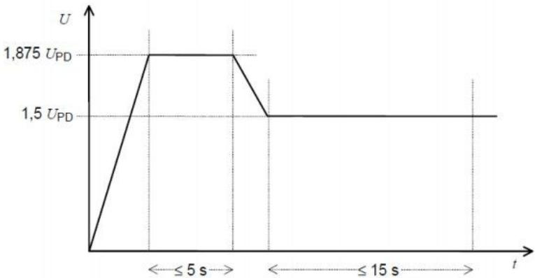  
图8-3 试验电压

## d) 试验结果判别

无绝缘击穿现象；

施加试验电压时无局部放电现象，或试验期间测得的放电量不大于10pC规定值。

## 8.1.3.4.7 电气间隙和爬电距离

电气间隙和爬电距离的符合性应通过测量来检验，测量方法按GB/T 16935.1-2008 6.2条款进行或见附录K；电气间隙结果要求符合7.2.4.6；爬电距离要求符合7.2.4.7。

## 8.1.4 机械防护要求

## 8.1.4.1 稳定性试验

稳定性试验时，设备的各箱柜应在其额定容积范围内转至能产生最不利条件的物件，脚轮置于正常使用范围内对试验结果最不利的位置。除非另有规定，门和抽屉等试验时需关紧。

a) 对于非手持式设备，从正常垂直位置向各个方向倾斜 $10^{\circ}$ ;

b) 设备高度超过1 m且重量不小于25 kg以及所有落地设备，对设备顶部或距地面2 m处（如果设备高度不低于2 m），沿任意方向（除向上的方向外）施加250 N或者是本身重力20%的力，取较小值，在正常操作时使用支撑脚，以及预定由操作人员打开的门和抽屉等，需置于最不利位置；

c) 对落地式设备，用800 N的向下作用力施加在能产生最大力矩的以下位置：

① 所有水平工作面；

② 明显突出且距离地面小于1 m的其他表面。

试验期间，设备不应失去平衡。

对于壁挂式安装的设备需预定固定到墙壁或天花板的安装支架，需承受大小等于产品本身重量4倍的力；

用规定的紧固件和墙壁结构按制造商说明书的要求安装之后，再进行符合性检验。对于可调整的支架，需调整到伸出墙壁（或支撑装置）的最远端。

如果说明书没有规定墙壁结构，则按说明书规定安装紧固件将变流器安装固定在支架上；安装支架除了承受产品自重，还需再加上大小等于产品重量3倍的力。力的方向沿重心处垂直向下。试验力在5s至10 s内从零逐渐增加到预定大小，然后维持1 min。试验后产品表面不能损坏并符合7.3.5的要求。

## 8.1.4.2 搬运要求

对每个手柄施加大小等于设备重量4倍的力，不用夹具，直接将力均匀施加在手柄中间70 mm的范围内。力要逐渐地增加，10s后达到预定大小，并保持1 min，如果产品安装了多个手柄，力按正常使用的比例分配到各个手柄上；如果设备安装了多个手柄但预定可以通过一个手柄来搬运，则不能进行力的分配，对于要求每个手柄都需承受全部的力手柄不能从设备上松脱，或者出现永久性变形、破裂或其它失效现象。搬运要求应符合7.3.4的规定。

## 8.1.4.3 接线端子要求

## 8.1.4.3.1 一般条件

本试验不适用于铝接线端子，也不适用于连接铝导体的接线端子。

除非制造厂另有规定，每一试验应在完好的和新的接线端子上进行。

当采用圆铜导线进行试验时，应采用符合IEC 60028规定的铜线。

当采用扁铜导体进行试验时，铜导体应具有以下特征：

\- 最小纯度：99.5%;

——极限抗张强度：200N/mm2\~280N/mm2；

——维氏硬度：40\~65。

## 8.1.4.3.2 机械强度试验

试验应采用具有最大截面积的合适型号的导体来进行试验。

每个接线端子应接上和拆下导体5次。

对螺纹型接线端子，拧紧力矩应按表8-5第Ⅱ列规定的力矩用螺丝刀拧紧进行第Ⅱ次试验。

如果表第Ⅱ和第Ⅲ列之值相同，只需进行螺丝刀拧紧试验。

每次拧紧的螺钉或螺母松掉后，应采用新的导体来进行下一次拧紧试验。

在试验中，紧固部件和接线端子不应松掉并且不应有会影响其进一步使用的损坏。

表8-5 验证螺纹型接线端子机械强度的拧紧力矩

<table><tr><td colspan="2">螺纹直径,mm</td><td colspan="3">拧紧力矩,Nm</td></tr><tr><td>米制标准值</td><td>直径范围</td><td>I</td><td>II</td><td>III</td></tr><tr><td>2.5</td><td> $\phi \leqslant 2.8$ </td><td>0.2</td><td>0.4</td><td>0.4</td></tr><tr><td>3.0</td><td> $2.8 < \phi \leqslant 3.0$ </td><td>0.25</td><td>0.5</td><td>0.5</td></tr><tr><td>—</td><td> $3.0 < \phi \leqslant 3.2$ </td><td>0.3</td><td>0.6</td><td>0.6</td></tr><tr><td>3.5</td><td> $3.2 < \phi \leqslant 3.6$ </td><td>0.4</td><td>0.8</td><td>0.8</td></tr><tr><td>3.5</td><td> $3.6 < \phi \leqslant 4.1$ </td><td>0.7</td><td>1.2</td><td>1.2</td></tr><tr><td>4.5</td><td> $4.1 < \phi \leqslant 4.7$ </td><td>0.8</td><td>1.8</td><td>1.8</td></tr><tr><td>5</td><td> $4.7 < \phi \leqslant 5.3$ </td><td>0.8</td><td>2.0</td><td>2.0</td></tr><tr><td>6</td><td> $5.3 < \phi \leqslant 6.0$ </td><td>1.2</td><td>2.5</td><td>3.0</td></tr><tr><td>8</td><td> $6.0 < \phi \leqslant 8.0$ </td><td>2.5</td><td>3.5</td><td>6.0</td></tr><tr><td>10</td><td> $8.0 < \phi \leqslant 10.0$ </td><td>—</td><td>4.0</td><td>10.0</td></tr><tr><td>12</td><td> $10 < \phi \leqslant 12$ </td><td>—</td><td>—</td><td>14.0</td></tr><tr><td>14</td><td> $12 < \phi \leqslant 15$ </td><td>—</td><td>—</td><td>19.0</td></tr><tr><td>16</td><td> $15 < \phi \leqslant 20$ </td><td>—</td><td>—</td><td>25.0</td></tr><tr><td>20</td><td> $20 < \phi \leqslant 24$ </td><td>—</td><td>—</td><td>36.0</td></tr><tr><td>24</td><td> $24 < \phi$ </td><td>—</td><td>—</td><td>50.0</td></tr></table>

注：第Ⅰ列：适用于拧紧时不突出孔外的无头螺钉和不能用刀口宽度大于螺钉根部直径的螺丝刀拧紧的其他螺钉；第Ⅱ列：适用于用螺丝刀拧紧的螺钉和螺母；

第Ⅲ列：适用于比螺丝刀更好的工具来拧紧的螺钉和螺母。

## 8.1.4.3.3 弯曲试验

本试验用于连接非预制圆铜导线的接线端子，连接导线的根数、截面和类型（软线和/或硬线，多股线和/或单芯线）由制造厂规定。

注：用于扁铜导体的接线端子试验可由供需双方协商。

用2个新试品进行以下试验:

a) 用最小截面导线及其允许的最多根数连接至接线端子进行试验；

b) 用最大截面导线及其允许的最多根数连接至接线端子进行试验；

c) 用最小和最大截面导线及其允许的最多根数连接至接线端子进行试验。

预期要连接软线或硬线（多股线和/或单芯线）的接线端子应采用每种类型导线在不同的试品组上进行试验。

预期将软线和硬线（多股线和/或单芯线）一起接入的接线端子应同时进行上述c)项规定的试验。

试验应在合适的试验设备上进行，规定的导线根数应接至接线端子。试验导线长度应比表8-6规定的高度H长75mm。紧固螺钉应拧紧，施加的拧紧力矩按表8-5的规定或制造厂商的力矩，被试设备应按图8-4固定所示固定。图中尺寸标注单位是毫米。

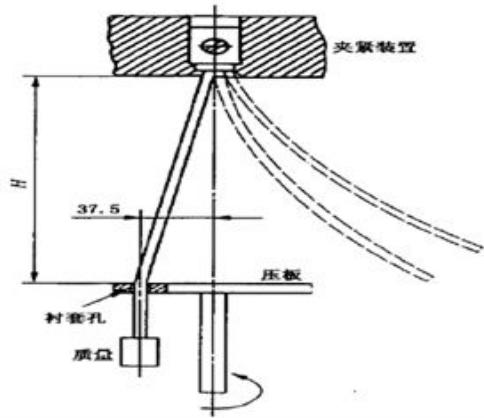  
图8-4 弯曲试验的试验设备

## 8.1.4.3.4 拉出试验

## a) 圆铜导线的拉出试验

8.1.4.3.3的试验后，应将表5规定的拉力作用到进行过8.1.4.3.3试验的导线上。  
本试验的紧固被试导线的螺钉不应再拧紧。  
拉力应平稳的持续作用1 min，拉力不应突然施加。  
试验过程中，导线应既不脱出接线端子又不在夹紧件处折断。  
b) 扁铜导线拉出试验  
适当长度的导线固定在接线端子上，将表8-7规定的拉力平稳的作用1 min，拉力方向与导体插入方向相反。拉力不应突然施加。  
试验过程中，导线应既不脱出接线端子又不在夹紧件处折断。  
表8-6 圆铜导体拉出和弯曲试验数值

<table><tr><td colspan="2">导体截面</td><td>衬套孔直径 $^{1)}$ </td><td rowspan="2">高度 H±13 mmmm</td><td rowspan="2">质量kg</td><td rowspan="2">拉力N</td></tr><tr><td> $mm^2$ </td><td>AWG/MCM</td><td>mm</td></tr><tr><td>0.2</td><td>24</td><td>6.4</td><td>260</td><td>0.3</td><td>10</td></tr><tr><td>—</td><td>22</td><td>6.4</td><td>260</td><td>0.3</td><td>20</td></tr><tr><td>0.5</td><td>20</td><td>6.4</td><td>260</td><td>0.3</td><td>30</td></tr><tr><td>0.75</td><td>18</td><td>6.4</td><td>260</td><td>0.4</td><td>30</td></tr><tr><td>1.0</td><td>—</td><td>6.4</td><td>260</td><td>0.4</td><td>35</td></tr><tr><td>1.5</td><td>16</td><td>6.4</td><td>260</td><td>0.4</td><td>40</td></tr><tr><td>2.5</td><td>14</td><td>9.5</td><td>279</td><td>0.7</td><td>50</td></tr><tr><td>4.0</td><td>12</td><td>9.5</td><td>279</td><td>0.9</td><td>60</td></tr><tr><td>6.0</td><td>10</td><td>9.5</td><td>279</td><td>1.4</td><td>80</td></tr><tr><td>10</td><td>8</td><td>9.5</td><td>279</td><td>2.0</td><td>90</td></tr><tr><td>16</td><td>6</td><td>12.7</td><td>298</td><td>2.9</td><td>100</td></tr><tr><td>25</td><td>4</td><td>12.7</td><td>298</td><td>4.5</td><td>135</td></tr><tr><td>—</td><td>3</td><td>14.3</td><td>318</td><td>5.9</td><td>156</td></tr><tr><td>35</td><td>2</td><td>14.3</td><td>318</td><td>6.8</td><td>190</td></tr><tr><td>—</td><td>1</td><td>15.9</td><td>343</td><td>8.6</td><td>236</td></tr><tr><td>50</td><td>0</td><td>15.9</td><td>343</td><td>9.5</td><td>236</td></tr><tr><td>70</td><td>00</td><td>19.1</td><td>368</td><td>10.4</td><td>285</td></tr><tr><td>95</td><td>000</td><td>19.1</td><td>368</td><td>14</td><td>351</td></tr><tr><td>—</td><td>0 000</td><td>19.1</td><td>368</td><td>14</td><td>427</td></tr><tr><td>120</td><td>250</td><td>22.2</td><td>406</td><td>14</td><td>427</td></tr><tr><td>150</td><td>300</td><td>22.2</td><td>406</td><td>15</td><td>427</td></tr><tr><td>185</td><td>350</td><td>25.4</td><td>432</td><td>16.8</td><td>503</td></tr><tr><td>—</td><td>400</td><td>25.4</td><td>432</td><td>16.8</td><td>503</td></tr><tr><td>240</td><td>500</td><td>28.6</td><td>464</td><td>20</td><td>578</td></tr><tr><td>300</td><td>600</td><td>28.6</td><td>464</td><td>22.7</td><td>578</td></tr><tr><td colspan="6">注:如果规定的衬套孔直径不足以容纳包扎导线则可以用一个较大孔径的补套。</td></tr></table>

表8-7 扁铜导体拉出试验数值

<table><tr><td>扁导体的最大宽度,mm</td><td>拉力,N</td></tr><tr><td>12</td><td>100</td></tr><tr><td>14</td><td>120</td></tr><tr><td>16</td><td>160</td></tr><tr><td>20</td><td>180</td></tr><tr><td>25</td><td>220</td></tr><tr><td>30</td><td>280</td></tr></table>

## 8.1.5 防火要求

## 8.1.5.1 灼热丝试验

灼热丝试验应在7.4规定的条件下，根据GB/T 5169.10-2006和GB/T 5169.11-2006规定进行。

注：如果试验必须在试品上的多个地方进行，应注意保证首次试验引起的材料损坏不影响后续试验。

## 8.1.5.2 电热丝引燃试验

热丝试验应在7.4规定的条件下，根据附录H规定进行。

## 8.2 基本功能验证

## 8.2.1 一般要求

试验平台按附录I规定连接。

试验过程中允许的试验允许误差若无规定，则按表8-8。

表8-8 试验参数允差

<table><tr><td>所有试验</td><td>轻载、正常负载、过载、短路条件下的试验</td></tr><tr><td>电流(交直流)±1%</td><td>功率因数0-0.05%</td></tr><tr><td rowspan="2">电压(交直流)±1%</td><td>时间常数+15%0</td></tr><tr><td>频率±5%</td></tr></table>

## 8.2.2 电气参数

## 8.2.2.1 额定输入输出

在8.1规定的参考试验条件下运行时，测得的连续输入、输出电流或功率满足7.5.1要求。

## 8.2.2.2 逆变效率

根据储能变流器的设计，测量额定功率并网运行时的逆变效率（交流输出端的输出功率值与直流输入端的输入功率值的百分比），其值应符合7.5.1.3的规定。

## 8.2.3 自动开关机

储能变流器应能在制造商规定的电压范围内，自动开关机。

按8.2.1一般要求接线，调节直流输入源，使直流侧输入条件从低于变流器允许工作范围下限处开始增加，当直流侧输入条件高于允许范围下限时，变流器应能自动开机；待变流器工作稳定后，调节直流输入源使直流侧输入条件下降到低于允许范围下限时，储能变流器应能自动关机。

## 8.2.4 软启动

储能变流器启动运行时，用功率分析仪或电能质量分析仪记录变流器功率变化曲线,按7.5.3要求不能出现冲击现象。

## 8.2.5 恢复并网

设备启动或故障排除后能自动恢复并向电网送电，恢复时间满足7.5.4要求。

## 8.2.6 通讯

对储能变流器进通讯功能验证，应满足7.5.5的要求。

## 8.2.7 冷却系统

设备冷却系统按以下要求设置故障，可根据储能变流器设置其中一个：

a) 完全堵住或部分堵住进风口;

b) 堵转或断开冷却风扇，一次一个；

c) 循环水或其他冷却液应停止或部分限制;

储能变流器能持续运行7小时不对变流器造成损害或者具有自动检测温度功能，温度超过允许值时自动停止工作。

## 8.2.8 防雷

检查储能变流器是否具有防雷保护装置，应满足7.5.7的要求。

## 8.2.9 噪声

储能变流器在最严酷的工况下，在噪声最强的方向，距离设备1m处用声级计测量变流器发出的噪声。声级计测量采用A计权方式。

测试时至少应保证实测噪声与背景噪声的差值大于3dB，否则应采取措施使测试环境满足测试条件要求。当测得噪声值与背景噪声相差大于10dB时，测量值不做修正；当实测噪声与背景噪声的差值在3dB-10dB之间时，按照表8-9进行噪声值的修正，其值应符合7.6.8中要求。

表8-9 背景噪声测量结果修正

<table><tr><td>差值(dB)</td><td>3</td><td>4~5</td><td>6~10</td></tr><tr><td>修正值(dB)</td><td>-3</td><td>-2</td><td>-1</td></tr></table>

## 8.3 电气性能

## 8.3.1 一般要求

试验中未注明试验电路的按附录I规定连接。

电气性能试验过程中允许的试验误差若无规定，则按表8-8。

## 8.3.2 温升

## 8.3.2.1 一般要求

温升试验应满足7.1.1的要求

温升试验用导体应根据试验电流按一下规定选取:

1）试验电流不大于400A:

a) 连接导线应采用单芯聚氯乙烯（PVC）绝缘铜导线，其截面按表8-10的规定。

b) 连接导线应置于大气中，导线之间的间距约等于设备端子间的距离。

表8-10 试验电流为400A及以下的试验铜导线

<table><tr><td rowspan="2" colspan="2">试验电流范围A</td><td colspan="2">导线尺寸</td></tr><tr><td>2</td><td>AWG/MCM</td></tr><tr><td>0</td><td>8</td><td>1.0</td><td>18</td></tr><tr><td>8</td><td>12</td><td>1.5</td><td>16</td></tr><tr><td>12</td><td>15</td><td>2.5</td><td>14</td></tr><tr><td>15</td><td>20</td><td>2.5</td><td>12</td></tr><tr><td>20</td><td>25</td><td>4.0</td><td>10</td></tr><tr><td>25</td><td>32</td><td>6.0</td><td>10</td></tr><tr><td>32</td><td>50</td><td>10</td><td>8</td></tr><tr><td>50</td><td>65</td><td>16</td><td>6</td></tr><tr><td>65</td><td>85</td><td>25</td><td>4</td></tr><tr><td>85</td><td>100</td><td>35</td><td>3</td></tr><tr><td>100</td><td>115</td><td>35</td><td>2</td></tr><tr><td>115</td><td>130</td><td>50</td><td>1</td></tr><tr><td>130</td><td>150</td><td>50</td><td>0</td></tr><tr><td>150</td><td>175</td><td>70</td><td>00</td></tr><tr><td>175</td><td>200</td><td>95</td><td>000</td></tr><tr><td>200</td><td>225</td><td>95</td><td>0 000</td></tr><tr><td>225</td><td>250</td><td>120</td><td>250</td></tr><tr><td>250</td><td>275</td><td>150</td><td>300</td></tr><tr><td>275</td><td>300</td><td>185</td><td>350</td></tr><tr><td>300</td><td>350</td><td>185</td><td>400</td></tr><tr><td>350</td><td>400</td><td>240</td><td>500</td></tr></table>

2）试验电流大于400A的见附录L。

## 8.3.2.2 温升试验

## 8.3.2.2.1 周围空气温度测量

在试验周期的最后1/4时间内应记录周围空气温度。测量时至少用两个温度检测器（如温度计或热电偶），均匀分布在被试设备的周围，放置在被试设备高度的1/2处离开被试设备的距离约为1 m。温度检测器及变流器应保证免受气流、热辐射影响和由于温度迅速变化产生的显示误差。

试验中，周围空气温度应在0-50℃之间，如果周围空气温度的变化超过3 K，应按设备的热时间常数用适当的修正系数对测得的部件温升予以修正。

## 8.3.2.2.2 部件温度的测量

除线圈外，设备的所有部件应用合适的温度检测器来测量其可能达到最高温度的不同位置上各点，这些点应记录在试验报告中。

温度测量选用的温度检测器应不会影响被测量部件的温升。

试验中，温度检测器与被试部件的表面应保证良好的热传导。

即使在最严酷的额定工作条件下，设备所使用的材料和部件的温度不能超过下列表规定的限值。为证明设备符合最高温度限值要求，温度的测量必须在设备厂家规定的最高使用环境温度下进行。同时，还需要考虑所有可能影响温度测量结果的各种额定工作模式和条件。对于最高可在50℃环境温度下工作的设备，试验可在0-50℃规定范围内的任意环境温度下进行，但是，必须对温度测量结果进行修正（增加或减少）。修正值为实际试验环境温度和设备最高额定环境温度的差值。变流器以最大输出，间隔时间1h记录1次各个测试部位的温度数据，直到连续4次测得同一位置的温度变化不超过±1℃时，记录此时各个测试位置的最高温度。温度测量一般使用热电偶法：

a) 线圈的测量，可以用电阻变化法进行测量；

b) 对其它零部件进行测量时，实际测得温度不应超过以下规定的最低限值：

① 零部件适用的IEC标准;

② 零部件或材料制造商标称的工作温度;

(2) 若不满足于上述①②两种条件，则温度限值参照表8-11规定所示；

(3) 表8-12规定所示适用于样品表面或者附近的表面。

注：可以使用电阻变化法测量温升，温升值可通过附录E方法计算得出。

表8-11 元器件及制造商材料等级温度标准不存在时的极限限值

<table><tr><td>部件和材质</td><td>电阻法或多点式热电偶测试温度限值(°C)</td></tr><tr><td>电容-电解型</td><td>65</td></tr><tr><td>电容-非电解型</td><td>90</td></tr><tr><td>外部连接的接线柱</td><td>60</td></tr><tr><td>外部可接触的线路布线点</td><td>60</td></tr><tr><td>变流器内部的绝缘导线</td><td>额定温度</td></tr><tr><td>熔断器</td><td>90</td></tr><tr><td>印刷电路板</td><td>105</td></tr><tr><td>绝缘材料</td><td>90</td></tr><tr><td>主电路半导体器件与导体的连接处</td><td>裸铜:70有锡镀层:80有银镀层:95</td></tr><tr><td colspan="2">测量到的接线端子和接线盒内的接线点</td></tr></table>

表8-12 变流器表面的温度限值

<table><tr><td rowspan="2">位置</td><td colspan="3">表面成分</td></tr><tr><td>金属</td><td>陶瓷或玻璃类</td><td>塑料橡胶类</td></tr><tr><td>日常使用中操作需要连续接触的(按钮、把手、开关器件、显示面板等)</td><td>55 °C</td><td>65 °C</td><td>75 °C</td></tr><tr><td>日常使用中用户操作时只需短暂接触的器件</td><td>60 °C</td><td>70 °C</td><td>85 °C</td></tr><tr><td>偶尔触及的变流器表面</td><td>70 °C</td><td>80 °C</td><td>95 °C</td></tr></table>

## 8.3.3 电能质量

## 8.3.3.1 谐波和波形畸变

将储能变流器启动并置于额定工作状态，测量变流器输出电流谐波应符合7.6.1的要求。同时测量30%、50%、70%负载点时输出电流谐波，其值不应超过额定功率运行时储能变流器注入到电网的各次谐波电流限值。

## 8.3.3.2 功率因数

将储能变流器启动并置于额定工作状态，测量储能变流器输出端功率因数。应满足7.6.2的规定。

## 8.3.3.3 三相不平衡度

将储能变流器启动并置于额定工作状态，测量变流器输出端三相不平衡度应满足7.6.3的规定。

注：此项测试项目是针对三相并网储能变流器，单相并网储能变流器此项不适用。

## 8.3.3.4 直流分量

将储能变流器启动并置于额定工作状态，测量变流器输出端直流分量应满足7.6.4的规定。

## 8.3.4 电气保护功能

## 8.3.4.1 过/欠压保护

## 8.3.4.1.1 直流输入侧过压保护

调节直流输入源的电压，直至变流器直流侧输入电压偏离允许直流输入电压范围，变流器的工作状态应符合7.7.1.1规定。

## 8.3.4.1.2 交流输出侧过/欠压保护

将储能变流器启动并置于额定工作状态，按7.7.1.2要求调节电网模拟电源电压，在不同的范围内选取三个不同的电压值U，储能变流器最大脱网时间均符合规定要求。

分别测量三次，要求均满足7.7.1.2的规定。

## 8.3.4.2 过/欠频保护

将储能变流器启动并置于额定工作状态，调整电网模拟电源输出频率，分别选取f=49.5 Hz、f=50Hz以及f=50.5 Hz范围内三个不同的频率值，测量储能变流器最大脱网时间。

分别测量三次，要求均满足7.7.2的规定。

## 8.3.4.3 极性或相序错误保护

## 8.3.4.3.1 直流极性误接

将所有开关断开，储能变流器直流输入端正负极反接，输出正确接线，闭合所有开关，变流器应能自动跳保护，1 min后将变流器直流输入端正确接线后，储能变流器应能正常工作；

## 8.3.4.3.2 交流缺相保护

将储能变流器输出端逐一缺相连接，输入输出端通电加载工作电压时，设备不能工作，正确连接时储能变流器正常运行。

## 8.3.4.4 直流输入过载保护

调节直流输入源，使其输出功率超过储能变流器允许的最大直流输入功率，储能变流器的工作状态应符合7.7.4要求。

## 8.3.4.5 短路保护

短路测试前，预先将需要短路的线路连接使用继电器或类似装置断开，储能变流器正常启动后再进行合闸短路操作。

a) 单相储能变流器分别将L-N接通，变流器应在规定时间内断开并网回路，并报警。

b) 三相储能变流器分别将A-B、B-C、A-C，A-N、B-N、C-N接通，再接通电源，变流器应在规定时间内断开并网回路，并报警。

要求均满足7.7.5的规定。

注1：对于带隔离变压器的储能变流器，短路处为隔离变压器的原边和副边

注2：短路测试电路不能接在与外壳连接在一起的熔断器上

## 8.3.4.6 操作过电压

储能变流器与配电网断开时不应导致其瞬时过压超过7.7.9规定的限值。

## 8.3.4.7 防孤岛保护

下图8-5给出了防孤岛效应保护试验平台，K1为被测变流器的网侧分离开关，K2为被测变流器的负载分离开关。负载采用可变RLC谐振电路，谐振频率为被测变流器的额定频率（50 Hz），其消耗的有功功率与被测变流器输出的有功功率相当。试验应在表8-14规定的条件下进行。

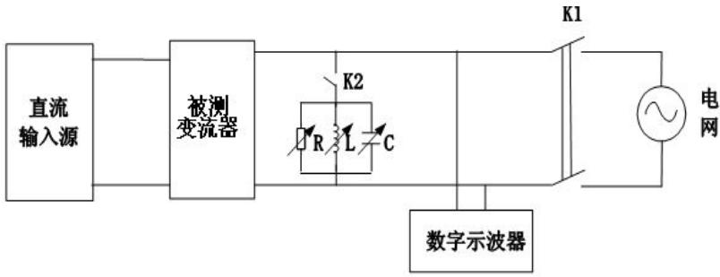  
图8-5 防孤岛效应保护试验平台

试验步骤如下:

a）闭合K1，断开K2，启动变流器。通过调节直流输入源，使变流器的输出功率PEUT等于额定交流输出功率，并测量变流器输出的无功功率QEUT；

b) 使变流器停机，断开K1;

c）通过以下步骤调节RLC电路使得 $Qf=1.0\pm0.05$ ;

① RLC电路消耗的感性无功满足关系式：QL=Qf·PEUT=1.0·PEUT；

① 接入电感L，使其消耗的无功等于QL

② 并入电容C，使其消耗的容性无功满足关系式：QC+QL=-QEUT

③ 最后并入电阻R，使其消耗的有功等于PEUT。

d）闭合K2接入RLC电路，闭合K1，启动变流器，确认其输出功率符合步骤a）的规定。调节R、L、C，直到流过K1的基频电流小于稳态时变流器额定输出电流的 $1\%$ ；

e）断开K1，记录K1断开至变流器输出电流下降并维持在额定输出电流的 $1\%$ 以下之间的时间；

f) 调节有功负载（电阻R）和任一无功负载（L或C）以获得表8-15中阴影部分参数表示的负载不匹配状况；表8-15中的参数表示的是偏差的百分比，符号表示的是图8-5中流经开关K1的有功功率流和无功功率流的方向，正号表示功率流从变流器到电网；每次调节后，都应记录K1断开至变流器输出电流下降并维持在额定输出电流的1%以下之间的时间；若记录的时间有任何一项超过步骤e）中记录的时间，则表8-15中非阴影部分参数也应进行试验；

g）对于试验条件B和C，调节任一无功负载（L或C），使之按表8-15的规定每次变化 $1\%$ 。表8-16中的参数表示的是图8-5中流经开关K1的无功功率流的方向，正号表示功率流从变流器到电网；每次调节后，记录K1断开至变流器输出电流下降并维持在额定输出电流的 $1\%$ 以下之间的时间；若记录的时间呈持续上升趋势，则应继续以 $1\%$ 的增量扩大调节范围，直至记录的时间呈下降趋势；

h）以上步骤中记录的时间都应符合7.7.7的规定。

表8-13 防孤岛效应保护的试验条件

<table><tr><td>条件</td><td>被测变流器的输出功率PEUT</td><td>被测变流器的输入电压a</td><td>被测变流器跳闸设定值</td></tr><tr><td>A</td><td>100%额定交流输出功率</td><td>&gt;直流输入电压范围的90%</td><td>2s</td></tr><tr><td>B</td><td>(50~66)%额定交流输出功率</td><td>直流输入电压范围的50%±10%</td><td>2s</td></tr><tr><td>C</td><td>(25~33)%额定交流输出功率</td><td>&lt;直流输入电压范围的10%</td><td>2s</td></tr></table>

表8-14 试验条件A情况下的负载不匹配状况

<table><tr><td colspan="5">试验中负载消耗的有功功率、无功功率与额定值的偏差百分比(%)</td></tr><tr><td>-10,+10</td><td>-5,+10</td><td>0,+10</td><td>+5 +10</td><td>+10,+10</td></tr><tr><td>-10,+5</td><td>-5,+5</td><td>0,+5</td><td>+5,+5</td><td>+10,+5</td></tr><tr><td>-10,0</td><td>-5,0</td><td></td><td>+5,0</td><td>+10,0</td></tr><tr><td>-10,-5</td><td>-5,-5</td><td>0,-5</td><td>+5,-5</td><td>-10,-5</td></tr><tr><td>-10,-10</td><td>-5,-10</td><td>0,-10</td><td>+5,-10</td><td>+10,-10</td></tr></table>

表8-15 试验条件B和试验条件C情况下的负载不匹配状况

<table><tr><td>试验中负载消耗的有功功率、无功功率与额定值的偏差百分比(%)</td></tr><tr><td>0,-5</td></tr><tr><td>0,-4</td></tr><tr><td>0,-3</td></tr><tr><td>0,-2</td></tr><tr><td>0,-1</td></tr><tr><td>0,1</td></tr><tr><td>0,2</td></tr><tr><td>0,3</td></tr><tr><td>0,4</td></tr><tr><td>0,5</td></tr></table>

## 8.4 电磁兼容（EMC）

## 8.4.1 发射测试

按照 GB 4824，考虑如下两种电磁环境：

——环境 A: 与低压非公用电网或工业电网的场所/装置有关, 含高骚扰源;

——环境 B：与低压公用电网，诸如家用、商用和轻工业场所/装置有关，不包括高骚扰源。

制造商应在提供给用户的信息中规定并网变流器的应用环境（即设备应用类别）。

## 8.4.1.1 传导发射

储能变流器应在满载状态下运行，参照GB 4824规定并在下述条件下进行试验：

a) 测试频段：150kHz\~30MHz;

b) 测试端口：输入输出电源端口、信号线；

c) 测试限值：参照GB 4824一组A类或B类限值

注：当前对于针对直流端口传导发射测试用的考核限值及人工电源网络的规范，国际上仍在讨论中；在正式标准发布前，建议使用GB 4824限值考核直流电源端口（超出人工电源网络耐压极限的端口可使用电压探头测量）。

## 8.4.1.2 辐射发射

储能变流器应在满载状态下运行，参照GB 4824规定并在下述条件下进行试验：

a) 测试频段：30MHz\~1000MHz;

b) 测试端口：外壳整体；

c) 测试限值：参照GB 4824一组A类或B类限值。

## 8.4.2 抗扰度测试

## 8.4.2.1 静电放电抗扰度

储能变流器可在轻载状态下运行，按照GB/T 17626.2的规定并在下述条件下进行试验：

试验电压：接触放电6kV，空气放电8kV；

测试端口：外壳整体；

每个敏感试验点放电次数：正负极性各10次，每次放电间隔至少为1s；

性能判据：B。

## 8.4.2.2 射频电磁场辐射抗扰度

储能变流器可在轻载状态下运行，按照GB/T 17626.3的规定并在下述条件下进行试验：

频率范围：80MHz～1000MHz;

试验场强：10V/m（非调制）；

正弦波1kHz，80%幅度调制；

测试端口：外壳整体；

天线极化方向：水平和垂直方向；

性能判据：A。

## 8.4.2.3 电快速脉冲群抗扰度

储能变流器可在轻载状态下运行，按照GB/T 17626.4的规定并在下述条件下进行试验：

试验电压： $\pm2kV$ （电源线）， $\pm1kV$ （信号线）；

测试端口：输入输出电源端口、信号线；

重复频率：100kHz;

持续时间：1min;

性能判据：B。

## 8.4.2.4 浪涌（冲击）抗扰度

储能变流器可在轻载状态下运行，按照GB/T 17626.5的规定并在下述条件下进行试验：

试验电压：±2kV（共模），±1kV（差模）；

测试端口：输入输出电源端口、信号线；

极性：正、负；

试验次数：正负极性各5次；

重复率：每分钟一次；

性能判据：B。

## 8.4.2.5 射频场感应的传导骚扰抗扰度

储能变流器可在轻载状态下运行，按照GB/T 17626.6的规定并在下述条件下进行试验：

频率范围：0.15MHz～80MHz；

试验场强：10V/m（非调制）；

测试端口：输入输出电源端口、信号线；

正弦波1kHz，80%幅度调制；

扫描频率： $\leqslant1\%$ ;

性能判据：A。

## 8.4.2.6 电压暂降、短时中断和电压变化的抗扰度

储能变流器可在轻载状态下运行，按照GB/T 17626.11的规定并在下述条件下进行试验：电压暂降等级：

0%持续 0.5周期;

0%持续 1周期;

40%持续 10周期；

70%持续 25周期;

80%持续 250周期;

电压中断严酷等级：

0%持续 250周期;

测试端口：输出AC电源端口；

持续时间：10s;

性能判据：B。

## 8.4.2.7 工频磁场抗扰度

储能变流器可在轻载状态下运行，按照GB/T 17626.8的规定并在下述条件下进行试验：

测试等级：等级3-10A/m（家用或直接连接到住宅低压供电网设施中使用的变流器）或

等级4-30A/m（非家用或连接到工业电网设施中使用的变流器）；

测试端口：外壳整体；

线圈相对位置：X、Y、Z三个方向；

性能判据：A。

## 8.4.2.8 阻尼振荡波抗扰度

仅考核在变电站区域设施中使用的储能变流器。

储能变流器可在轻载状态下运行，按照GB/T 17626.12的规定并在下述条件下进行试验：

测试等级：等级2（与控制室和继电器室内设备电缆相连使用的变流器）或

等级3（与安装在继电器室内的设备电缆相连使用的变流器）；

振荡频率：100kHz和1MHz;

持续时间：至少2s;

测试端口：输出AC电源端口；

性能判据：A。

## 8.4.2.9 电压波动抗扰度

储能变流器可在轻载状态下运行，按照GB/T 17626.14的规定并在下述条件下进行试验：

测试等级：等级2（家用或直接连接到住宅低压供电网设施中使用的变流器）或等级3（非家用或连接到工业电网设施中使用的变流器）；

测试端口：输出AC电源端口；

性能判据：A。

## 8.4.3 闪烁

储能变流器在额定状态下运行，依据对应的标准进行试验，见7.8.3。

表8-16 EMC测试项目及测试端口汇总表

<table><tr><td>测试端口</td><td>外壳整体</td><td>直流DC输入端口</td><td>交流AC输出端口</td><td>信号端口</td></tr><tr><td>传导发射</td><td>---</td><td>√</td><td>√</td><td>√</td></tr><tr><td>辐射发射</td><td>√</td><td>---</td><td>---</td><td>---</td></tr><tr><td>静电放电抗扰度</td><td>√</td><td>---</td><td>---</td><td>---</td></tr><tr><td>射频电磁场辐射抗扰度</td><td>√</td><td>---</td><td>---</td><td>---</td></tr><tr><td>电快速脉冲群抗扰度</td><td>---</td><td>√</td><td>√</td><td>√</td></tr><tr><td>浪涌(冲击)抗扰度</td><td>---</td><td>√</td><td>√</td><td>√</td></tr><tr><td>射频场感应的传导骚扰抗扰度</td><td>---</td><td>√</td><td>√</td><td>√</td></tr><tr><td>电压暂降、短时中断和电压变化的抗扰度</td><td>---</td><td>---</td><td>√</td><td>---</td></tr><tr><td>工频磁场抗扰度</td><td>√</td><td>---</td><td>---</td><td>---</td></tr><tr><td>阻尼振荡波抗扰度</td><td>---</td><td>---</td><td>√</td><td>---</td></tr><tr><td>电压波动抗扰度</td><td>---</td><td>---</td><td>√</td><td>---</td></tr></table>

8.5 功率控制  
储能变流器功率控制应满足7.9的规定。

## 8.6 安装要求

## 8.6.1 方阵绝缘阻抗检测试验

储能变流器连入测试电路，将直流端的电压设置在低于变流器启动的电压（功率）值。将一个小于7.10.1中阻抗值的电阻（约90%的要求阻抗值）的接入变流器的直流输入端子与地之间，变流器响应满足7.10.1要求。

## 8.6.2 方阵残余电流检测试验

## 8.6.2.1 连续残余电流测试方法

储能变流器在最严酷的工况下，且直流输入端无接地，交流输出端应有一极接地。测试时可以关闭方阵的绝缘电阻监测功能。在直流输入端与地之间接入一个可调电阻。可调电阻的起始值应设定在使初始残余电流在7.10.3.1 a）限值之下。然后逐步调低电阻值，记录残余电流保护装置动作时的电流值。该测试应重复5遍，所有测试结果不得超过7.10.3.1 a）限值或者变流器在0.3s内断开电网。

注：如果有多路输入，且电路分析有同样的原理及可能的测试结果，则无需逐一测试。

## 8.6.2.2 着火漏电流测试方法

储能变流器在最严酷的工况下，且直流输入端无接地，交流输出端应有一极接地。测试时可以关闭方阵的绝缘电阻监测功能，用电流表依次测量每个方阵端子与地之间的漏电流。

## 8.6.2.3 残余电流突变的测试方法

储能变流器工作在额定功率条件下，在直流输入端与地之间接入一个可调电阻，调节此电阻，使得输入端与地之间恰好产生 $30\mathrm{mA}$ ， $60\mathrm{mA}$ ， $150\mathrm{mA}$ 漏电流时，变流器的断网时间不得超过7.10.3.5b)中的限值。

注：如果有多路输入，且电路分析有同样的原理及可能的测试结果，则并不必逐一测试。

## 8.7 运行状态

储能变流器的运行状态应满足7.11的规定。

## 8.8 切换时间

储能变流器应能快速切换运行状态,在额定功率并网充电状态和额定功率并网放电状态之间运行状态切换时间应符合7.12的要求

## 8.9 对储能电池管理系统（BMS）功能一般要求

电池管理系统应满足7.13的规定。

## 8.9.1 电池

通过检查来检验是否符合7.13.1的要求。检查方法包括目测，以及使用制造商提供或推荐的工具和测量仪器。

## 8.9.1.1 电池外壳通风要求

电池外壳的通风要求应符合7.13.1.1的规定。

## 8.9.1.2 电池的安装

电池的安装应符合7.13.1.2的规定。

## 8.9.1.3 电解液溢出

通过检查来检验防电解液溢出应符合7.13.1.3的规定。

## 8.9.1.4 恒流充电稳流精度

对储能电池进行恒流充电时，输出电流的稳流精度应符合7.13.1.4的规定。

## 8.9.1.5 恒流充电电流纹波

对储能电池进行恒流充电时，输出电流的电流纹波应符合7.13.1.5的规定。

## 8.9.1.6 恒压充电稳压精度

对储能电池进行恒压充电时，输出电压的稳压精度应符合7.13.1.6的规定。

## 8.9.1.7 恒压充电电压纹波

对储能电池进行恒压充电时，输出电压的电压应符合应符合7.13.1.7的规定。

## 8.9.2 绝缘电阻

在电池管理系统的电压采样电路和其壳体之间施加500V的电压进行绝缘电阻测量，绝缘电阻值应不小于2MΩ。

## 8.9.3 绝缘耐压性能

在电池管理系统的电压采样电路(对应电池系统的正极)和其壳体之间施加频率为50Hz的正弦波形交流电压，试验电压(有效值)为该回路可能发生的最高工作电压(如小于550V，则试验电压为550V). 历时1min。

在电池管理系统的供电电源正极端子和与其最近的电压采样电路之间施加频率为50Hz的正弦波形交流电压，试验电压(有效值)为该回路可能发生的最高工作电压(如小于550V，则试验电压为550V)，历时1min。

在电池管理系统的通信线路和与其最近的电压采样电路之间施加频率为50Hz的正弦波形交流电压，试验电压(有效值)为该回路可能发生的最高工作电压(如小于550V，则试验电压为550V)，历时1rmin。

在试验过程中应无击穿或闪络等破坏性放电现象，漏电流小于20mA。

## 8.9.4 状态参数测量精度

将电池管理系统按正常工作要求装配、连接或者通过模拟系统提供电池管理系统需要监测的电气信号，正确安装布置检测设备的电压、电流和温度测量装置，接通电池管理系统工作电源。将电池管理系统采集的数据(单体或模块电压采集通道数不少于5个，温度采集通道数不少于2个)与检测设备检测的对应数据进行比较。数据采集精度应符合7.13.4的要求。

## 8.9.5 电池故障诊断

通过模拟系统，建立满足表7-20所列故障项目的触发条件，记录相应故障项目及其触发条件。根据制造商技术规范的要求，对于其他故障诊断项目进行功能确认。

## 8.10 储能变流器环境试验

## 8.10.1 低温启动试验

试验方法按按GB/T 2423.1中“试验A”进行。储能变流器无包装，在试验温度为 $(-20\pm3)$ ℃(户内型)或 $(-25\pm3)$ ℃(户外型)的环境下，产品至热平衡状态后应能够正常启动，电池管理系统的数据采集精度应满足7.13.4的要求。

若电池管理系统没有集成在储能变流器内部，则将处于工作状态的电池管理系统放入初始温度为室温的恒温箱中，温度降至 $(-20\pm 3)^{\circ}\mathrm{C}$ (户内型)或 $(-25\pm 3)^{\circ}\mathrm{C}$ (户外型)后保持1h，试验过程中记录电池管理系统采集的数据(单体或模块电压采集通道数不少于2个，温度采集通道数不少于1个)，并与检测设备检测的对应数据进行比较，电池管理系统的数据采集精度应满足7.13.4的要求。

## 8.10.2 高温启动及工作试验

试验方法按按 GB/T 2423.2 中 “试验 B” 进行。储能变流器无包装，在试验温度为 $(40 \pm 2)^{\circ}\mathrm{C}$ (户内型) 或 $(55 \pm 2)^{\circ}\mathrm{C}$ (户外型) 环境下，产品放置 2 小时后应能够正常启动；通电加额定负载保持 2 小时，并在标准大气条件下恢复 2 小时后，储能变流器应能正常工作，电池管理系统的数据采集精度应满足 7.13.4 的要求。

若电池管理系统没有集成在储能变流器内部，则将处于工作状态的电池管理系统放入初始温度为室温的恒温箱中，试验温度为 $(40\pm2)$ ℃(户内型)或 $(55\pm2)$ ℃(户外型)环境下，放置2小时后。试验过程中记录电池管理系统采集的数据(单体或模块电压采集通道数不少于2个，温度采集通道数不少于1个)，并与检测设备检测的对应数据进行比较，电池管理系统的数据采集精度应满足7.13.4的要求。

## 8.10.3 振动试验

产品振动试验的方法按GB/T2423.10-2008要求。

频率范围： $10\mathrm{Hz}\sim 150\mathrm{Hz}$ 。

振幅/加速度推荐：0.075mm 振幅

振动持续时间： 三个垂直轴方向扫频循环数：10/轴

振动试验后，产品应能正常启动工作。

注：大型变流器振动替代方法正在考虑中。

## 8.10.4 恒定湿热试验

试验方法储能变流器在试验温度为 $(40\pm 2)^{\circ}\mathrm{C}$ (户内型)或 $(55\pm 2)^{\circ}\mathrm{C}$ (户外型)，相对湿度 $(90\pm 3)\%$ 恒定湿热条件下，无包装，不通电，经受 $48\mathrm{h}$ 试验后，取出样品，在正常环境条件下恢复 $2\mathrm{h}$ 后，储能变流器应能正常工作，电池管理系统的数据采集精度应满足7.13.4的要求。

若电池管理系统没有集成在储能变流器内部，则将处于工作状态的电池管理系统放入初始温度为室温的恒温箱中，试验温度为 $(40\pm 2)^{\circ}\mathrm{C}$ (户内型)或 $(55\pm 2)^{\circ}\mathrm{C}$ (户外型)，相对湿度 $(90\pm 3)\%$ 恒定湿热条件下，无包装，不通电，经受 $48\mathrm{h}$ 试验后，取出样品，在正常环境条件下恢复 $2\mathrm{h}$ 后，电池管理系统的数据采集精度应满足7.13.4的要求。

## 附录 A

# (规范性附录)

## 紫外暴露试验

## A. 1 防紫外要求

本标准要求户外外壳的聚合物材料对紫外（UV）辐射引起的材料退化应有足够的耐受能力。

本条款符合性通过检查设备的结构和外壳材料的防紫外数据（或者保护涂层的相关数据）以及进行以下试验来检验。

样品从零部件中裁取，或者使用与之相同的材料。样品按照试验方法标准的规定进行制备。然后根据附录L进行UV处理。

UV处理之后，样品应没有明显的退化迹象，包括裂纹或破裂。样品在室温下保存16小时到96小时，然后根据标准进行相关的试验。

为了评价试验后的性能指标保持率，按A.2进行UV处理的样品跟没有经过UV处理的样品一起测试，进行比较。保持率见下表的规定。

表A.1 UV 暴露后的最低性能保持率

<table><tr><td>试验零部件</td><td>性能指标</td><td>试验方法标准</td><td>试验后最低保持率</td></tr><tr><td rowspan="2">提供机械支持的零部件</td><td rowspan="2">拉伸强度 $^{a}$ 或挠曲强度 $^{a,b}$ </td><td>ISO 527</td><td>70%</td></tr><tr><td>ISO 178</td><td>70%</td></tr><tr><td rowspan="3">提供冲击防护的零部件</td><td rowspan="3">摆锤冲击 $^{c}$ 或悬臂梁冲击 $^{c}$ 或拉伸冲击 $^{c}$ </td><td>ISO 179</td><td>70%</td></tr><tr><td>ISO 180</td><td>70%</td></tr><tr><td>ISO 8256</td><td>70%</td></tr><tr><td>所有零部件</td><td>可燃性等级</td><td>5.5.1.4</td><td>d</td></tr><tr><td colspan="4">a 拉伸强度和挠曲强度试验的试验样品的厚度不应大于实际使用的厚度。b 用三点负载法测量挠曲强度时,样品暴露于UV辐射的一侧应接触两个负载点。c 对于厚度不低于0.8mm的聚合物材料,悬臂梁冲击和拉伸冲击试验可以针对3.0mm的样品进行,摆锤冲击可以针对4.0mm的样品进行。d 可燃性等级可以发生变化,但不能低于5.5.1.4的要求。</td></tr></table>

## 附录 B

(规范性附录)

接触电流测量

## B.1 测量仪器

图B-1的测量仪器选自IEC 60990中图4。

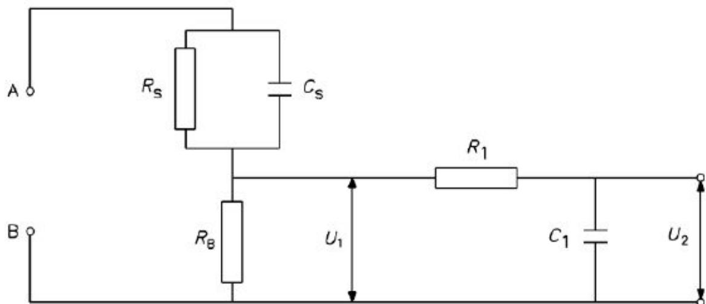

## 图中：

Rs——1500 Ω

RB——500 Ω

R1——10k Ω

$$
\mathrm{Cs} — — 0. 0 2 \mu \mathrm{f}
$$

C1——0.022 μ f

电压表或示波器:

输入电阻： $>1\mathrm{M}\Omega$

输入电容: $< 200\mathrm{pF}$

频率范围： $15\mathrm{Hz} \sim 1\mathrm{MHz}$

对于测量参数的所有分量（直流、交流电源频率、高频和谐波电流），电气测量仪器应有足够的带宽，以保证读数精确，测量有效值时应注意测量仪器是否对非正弦波形跟正弦波形一样给出真实的有效值读数。

图B.1 测量仪器

通过比较各不同频率时U2频率系数和IEC60990中图F.2中的实线来校准测量仪器。画出能表示U2与理想曲线的偏差随频率变化的校准曲线。

## B.2 替代测量仪器

图B-2的测量仪器选自IEC60950中图D.2。

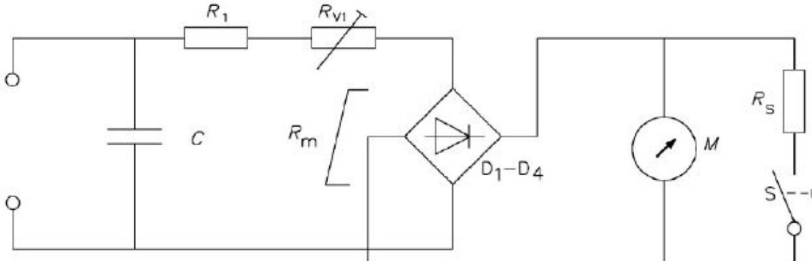  
图B.2 代替测量仪器

## 图中：

<table><tr><td>M</td><td>0 mA - 1 mA 动圈转动的指示表头;</td></tr><tr><td>在直流0.5 mA时的R1+RV1+Rm</td><td>1500 Ω ±1%,当C=150nF±1%;或2000 Ω ±1%,当C=112nF±1%;</td></tr><tr><td>D1 - D4</td><td>整流器;</td></tr><tr><td>RS</td><td>10量程档用的无感分流电阻;</td></tr><tr><td>S</td><td>灵敏度按钮(按下灵敏度最大)</td></tr></table>

该仪器应由整流器/动圈批示表头以及附加的串连电阻组成，这两者再与一电容器相并联，如图J.2所示。该电容器的作用是需降低对谐波和高于电源频率的其他频率的灵敏度。该仪表还应装有 $\times 10$ 的量挡，用无感电阻将仪表线圈分流来获得。如果使用过流保护方法不影响该仪表的基本特性，则也可以装有过流保护装置。

RV1 应加以调节，以便在直流0.5mm的条件下，得到所要求的阴值。

动圈批示表头应在下列各校准点上进行校准，以50Hz\~60Hz 的正弦波电流，在最大灵敏度量程上校准：0.25mA，0.5mA，0.75mA

按下列要求，应在0.5mA校准点上检验下列频率响应：5KHz正弦波的灵敏度：3.6mA±5%。

## 附录 C

## (规范性附录)

接触探头试验

## C.1 接触探头试验

以下示图源自引用标准，为方便参考在此罗列。由于相关引用标准是不带日期引用的，因此，应以引用标准的现行有效版本为准，本附录的示图仅供参考。

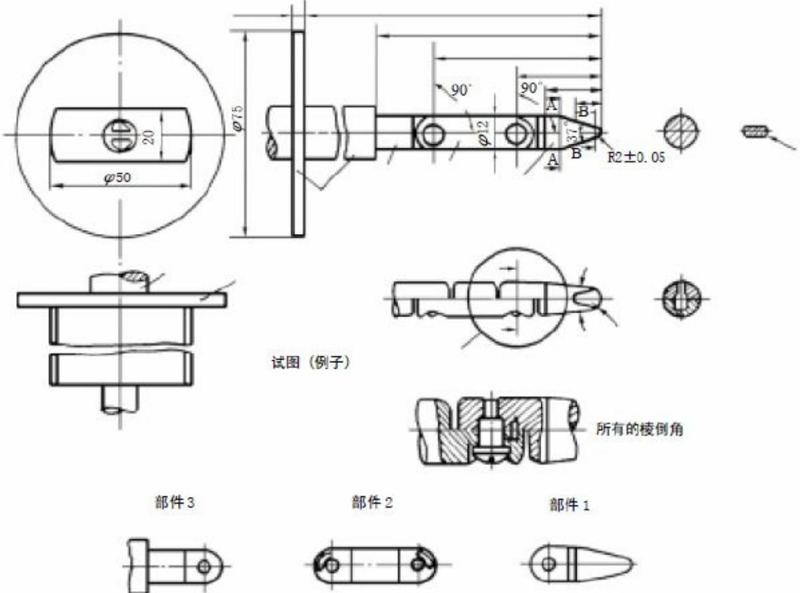

## 尺寸单位为毫米

对未注明具体公差的尺寸，其公差为：

—— 对于 $14^{\circ}$ 和 $37^{\circ}$ 的角度公差： $\pm 15^{\circ}$

—— 对于半径：±0.1mm

—— 直线尺寸公差：
δ 15mm: +0/- 0.1mm
>15mm δ 25mm : ±0.1mm
>25mm: ±0.3mm

本试验指的两个铰接点可以弯曲 $90^{\circ}$ （ $+10^{\circ}$ ， $-0^{\circ}$ ），但是只能沿同一方向弯曲。

注1：销钉和卡槽只是为了使弯曲角度限于 $90^{\circ}$ ，所以图中未给出这些结构细节的尺寸和公差。但实际所采用的结构保证弯曲角度 $90^{\circ}$ 的公差在 $0^{\circ}$ 到 $+10^{\circ}$ 之间。

注2：括号中的尺寸仅供参考。

注3：试验指选自IEC 61032中图2的试验探头B。在某些情况下尺寸公差是不同的。

图C.1 试验指

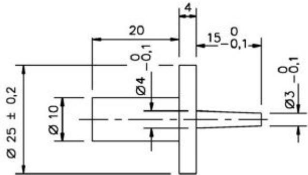

把手的尺寸（ø10和ø20）不是关键尺寸。

注：本试验阵尺寸为IEC61032的图8试验探头13中给出的尺寸，在某些情况下尺寸公差是不同的。

图C.2 试验指  
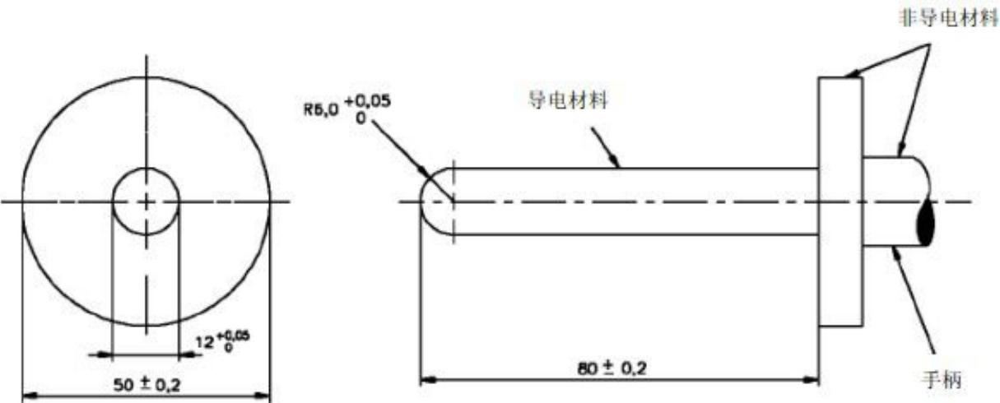  
图C.3 直线不带关节的试验探头

## 附录D（规范性附录）设备标识上使用的符号

## D.1 设备标识上使用的符号

表D.1 符号

<table><tr><td>编号</td><td>符号</td><td>参考标准</td><td>描述</td></tr><tr><td>1</td><td>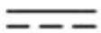</td><td>IEC 60417-5031</td><td>直流</td></tr><tr><td>2</td><td></td><td>IEC 60417-5032</td><td>交流</td></tr><tr><td>3</td><td></td><td>IEC 60417-5033</td><td>交直流</td></tr><tr><td>4</td><td>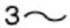</td><td>IEC 60417-5032-1</td><td>三相交流</td></tr><tr><td>5</td><td>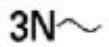</td><td>IEC 60417-5032-2</td><td>三相交流带中线</td></tr><tr><td>6</td><td>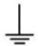</td><td>IEC 60417-5017</td><td>接地</td></tr><tr><td>7</td><td></td><td>IEC 60417-5019</td><td>保护接地</td></tr><tr><td>8</td><td>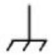</td><td>IEC 60417-5020</td><td>框架或底座端子</td></tr><tr><td>9</td><td></td><td>ISO 7000-1641</td><td>参考操作说明书</td></tr><tr><td>10</td><td></td><td>IEC 60417-5007</td><td>开(电源)</td></tr><tr><td>11</td><td>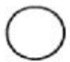</td><td>IEC 60417-5008</td><td>关(电源)</td></tr><tr><td>12</td><td></td><td>IEC 60417-5172</td><td>通过双重绝缘或加强绝缘保护的设备</td></tr><tr><td>13</td><td>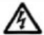</td><td>ISO 3864-5036</td><td>注意,电击危险</td></tr><tr><td>14</td><td>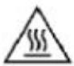</td><td>IEC 60417-5041</td><td>注意,灼热表面</td></tr><tr><td>15</td><td></td><td>ISO 7000-0434</td><td>注意危险</td></tr><tr><td>16</td><td></td><td>IEC 60417-5268</td><td>双稳按按键开启</td></tr><tr><td>17</td><td></td><td>IEC 60417-5269</td><td>双稳按按键关闭</td></tr><tr><td>18</td><td>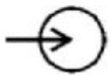</td><td>IEC 60417-5034</td><td>输入端子或定额</td></tr><tr><td>19</td><td></td><td>IEC 60417-5035</td><td>输出端子或定额</td></tr><tr><td>20</td><td>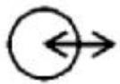</td><td>IEC 60417-5448</td><td>双向端子或定额</td></tr><tr><td>21</td><td>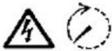</td><td>IEC 60417-5036IEC 60417-5416</td><td>注意,电击危险,能量存储定时释放(放电时间标注在符号旁边)</td></tr><tr><td>22</td><td></td><td></td><td>注意听力损害危险,佩戴听力保护装置</td></tr></table>

## 附录 E

## (规范性附录)

## 温度测量修正

## E.1 测量修正

对于线圈，可以用电阻变化法进行测量限值，电阻法修正公式如下：

$$
\mathrm{T} = \mathrm{R2} / \mathrm{R1(k+t1)} - (\mathrm{k+t2})
$$

## 其中：

T —— 温度升高值，单位为摄氏度（℃）。

R1 —— 线圈开始测试时电阻，单位为欧姆（Ω）。

t1 —— 开始测试时房间温度，单位为摄氏度（℃）。

R2 —— 测试结束后线圈电阻，单位为欧姆（Ω）。

t2 —— 测试结束后房间温度，单位为摄氏度（℃）。

$\mathrm{k} = 234.5$ 铜材质

$\mathrm{k} = 225.0$ 铝材质

其他材质的常量K应根据使用修正。

## 附录F

(规范性附录)

电气间隙校正

## F. 1 电气间隙校正因子

F. 1 海拔高度在2000m至20000m之间的电气间隙校正因子

<table><tr><td>海拔高度(m)</td><td>正常大气压强(kPa)</td><td>电气间隙的倍增因子</td></tr><tr><td>2 000</td><td>80.0</td><td>1.00</td></tr><tr><td>3 000</td><td>70.0</td><td>1.14</td></tr><tr><td>4 000</td><td>62.0</td><td>1.29</td></tr><tr><td>5 000</td><td>54.0</td><td>1.48</td></tr><tr><td>6 000</td><td>47.0</td><td>1.70</td></tr><tr><td>7 000</td><td>41.0</td><td>1.95</td></tr><tr><td>8 000</td><td>35.5</td><td>2.25</td></tr><tr><td>9 000</td><td>30.5</td><td>2.62</td></tr><tr><td>10 000</td><td>26.5</td><td>3.02</td></tr><tr><td>15 000</td><td>12.0</td><td>6.67</td></tr><tr><td>20 000</td><td>5.5</td><td>14.5</td></tr></table>

## 附录 G

## (规范性附录)

湿度预处理

## G.1 湿度预处理

如果本标准其他条款要求在试验前对逆变器进行潮湿预处理，按以下湿度条件进行。

预处理时设备不工作。电子元器件、外盖和其他零部件，若能够徒手拆除，则应拆除后与主体一同进行湿度预处理。

预处理在相对湿度为92.5%RH ± 2.5%RH 的湿度试验箱中进行。试验箱内空气温度保持在40℃ ± 2℃。在加湿之前，设备先加热到40℃ ± 2℃，通常需要在该温度下放置至少4小时。试验箱内的空气应流动起来，而且能防止设备上出现凝露。

设备在试验箱内保持48小时。湿度试验后，允许在规定的环境条件下恢复2小时后再进行后续的试验。恢复期间，无通风设备的外盖应打开。

## 附录 H

(规范性附录)

电热丝引燃试验

## H.1 电热丝引燃试验

每种材料用5件样品进行试验，式样应是长为150 mm，宽为13 mm，并且试样厚度均匀，材料厚度由材料制造商规定。材料的各边应无毛刺、飞边等。

应采用直径为0.5 mm、长（250±5）mm、冷电阻约为5.28 Ω/m的镍铬（80% 镍、20% 铬，无铁）电阻丝。电阻丝应以直线长度的方式接到可调节的电源上，该电源被调节到在8 s至12 s 内使电阻丝内的功率损耗为0.26 W/mm 。冷却后，电阻丝应当被绕在试样上5圈，各圈之间的距离6 mm。

被绕上电阻丝的试样放在水平位置上，电阻丝的两个接线端子接到可调的电源上，重新调整电源至电阻丝的内耗为0.26 W/mm （见图M-1）。

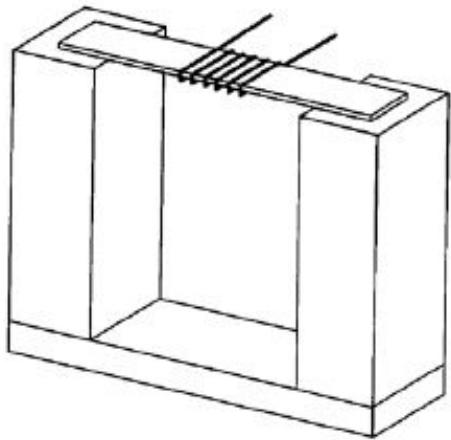  
图 M.1 电热丝引燃试验装置

开始试验，接通电路电源使得通过电阻丝的电流产生的线功率密度为0.26 W/mm。

继续加热知道试样引燃，当引燃一旦发生，断开电源，记录引燃时间。如果在120 s 时间内不引燃，结束试验。对于穿过电阻丝绕组被融化但不燃烧的试样，当试样不再与所有5圈加热电阻丝紧密接触时结束试验。

试验应在其余的试样上重复进行。

平均引燃时间和每组样品的厚度应记录下来。

# 附录Ⅰ （规范性附录） 储能变流器测试平台

## I.1 试验平台

下图 I.1 给出了储能变流器电气性能试验的参考电路，要求如下：

A）测量储能变流器的直流输入源应该是具有光伏阵列和电池模拟功能的可编程直流电源。

B）交流电源可以模拟电网特性，额定容量应该大于被测变流器最大输出功率，输出的电压、频率能在一定的范围内调节。

C）交流负载要求是可调整、可编程的，可以精确产生交流并联谐振，对 RLC 交流负载的寄生量及 THD 指标性能的相关技术要求参照标准 IEC62116。

D）直流负载要求可以精确模拟各种电池组在充放电过程的阻抗值变化，满足储能变流器充电性能试验检测，要求采用无源器件不会对试验数据产生影响。

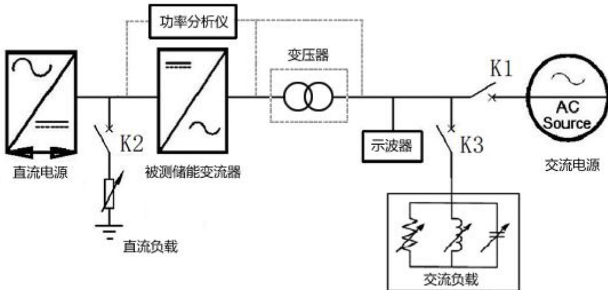  
图1.1 储能变流器的试验平台

## 1.2 测试设备

## 1.2.1 试验数据采集仪器

使用具有存储功能的检测装置观测波形，示波器与功率分析仪等数据采集系统。波形测量/数据采集捕捉装置应能记录从测试开始时刻到被测设备停止输出，所有相位的波形都需要监测。

对于三相被测设备，测试和监测设备应记录所有相位的电流以及相电压或线电压，根据可行性来确定测试期间输出的基频有功功率和无功功率。宜使用 10KHz 或更高的采样频率，测量精度应至少为被测设备标称输出电压和标称输出电流的 0.5%。

## 1.2.2 直流电源

测试中宜使用具有可编程功能的直流电源。直流电源应该可以提供被测设备的试验所需要的电流，应该具有光伏阵列和蓄电池组模拟功能；建议选用双向直流电源，可以将被测逆变器的直流输出回馈到电网。

直流电源应该可以提供满足所述储能变流器检测要求的电压范围和电流。该直流电源提供的电流和电压应可调节。应能在被测设备的最小和最大输入电压条件下使被测设备达到最大输出功率。

可调节填充因子，使其达到表 I.2.2 所要求的范围值。

具有模拟直流电流电压特性和时间响应特性。测试应在表 I.2.2 规定的输入电压条件下进行，试验过程直流电源输出最大电流至少要达到被测变流器额定功率输入电流 1.5 倍，测试方法中指定的特殊条件除外。

表 1.2.2 直流电源的技术要求

<table><tr><td>项目</td><td>技术条件</td></tr><tr><td>输出功率</td><td>可以满足使被测设备产生最大输出功率或规定的其他功率等级</td></tr><tr><td> $响应速度^a$ </td><td>当测试负载以5%变化时,响应时间应能在小于1ms的时间内将输出电流稳定在其终值的10%以内</td></tr><tr><td>稳定度</td><td>除了由被测设备最大功率跟踪引起的变化外,直流电源的输出功率在整个测试期间应稳定在规定的功率等级,偏差小于2%。</td></tr><tr><td>填充因子b</td><td>0.4~0.92</td></tr><tr><td colspan="2"> $^a$ 一定的响应速度可避免MPPT控制系统、被测设备直流侧的脉动频率或主动防孤岛方法造成的影响。 $^b$ 填充因子=( $V_{mn}$ × $I_{mn}$ )/(Voc× $I_{sc}$ ),其中 $V_{mn}$ 和 $I_{mn}$ 分别是最大功率点的电压和电流。 $V_{oc}$ 是开路电压, $I_{sc}$ 是短路电流。</td></tr></table>

## 1.2.3 交流电源

交流电源是可以编程的，满足模拟电网特性的同时额定容量应该大于被测变流器最大输出功率，输出的电压、频率能在一定的范围内调节。交流电源有条件建议选用具有双向功能，可以将被测逆变器的交流输入回馈至电网，可以满足电压适应性、频率适应性、三相电压不平衡适应性、闪变适应性、谐波电压适应性的型式试验。

使用的交流电源，应该完全符合表 I.2.3 规定的技术条件。

表 1.2.3 交流电源的技术要求

<table><tr><td>项目</td><td>技术条件</td></tr><tr><td>电压</td><td>标称值的±1.0%</td></tr><tr><td>电压谐波畸变率(THD)</td><td>&lt;2.5%</td></tr><tr><td>频率</td><td>标称值的±0.05Hz</td></tr><tr><td>相角差a</td><td>120° ±5°</td></tr><tr><td colspan="2">a仅适用于三相电源</td></tr></table>

## 1.2.4 交流负载

在被测设备和交流电源之间并接可以调整的电阻器，电容器和电抗器，统称交流负载，交流负载要求是连续可调、可编程，以满足防孤岛效应保护功能测试规范技术要求。

试验平台所用的交流负载必须满足所有检测条件规定的额定等级，并可以通过调节以满足所有测试条件要求。为确保 Qf 值的精确性，在检测电路中应使用无感阻抗、低耗电感和具有低串联有效内阻和串联有效电感的电容器。如果使用铁心电感，在标称电压条件下工作时，电感电流的 THD 不得超过 2%。上述负载额定值保守的要求也应该预计测试的电压和功率等级对应。同时要注意电阻器的功率额定值，确保在测试过程中因电阻器发热而引起阻值热漂移，不会影响试验结果。

## 1.2.5 直流负载

直流负载是在被测设备和直流电源之间并接可以调节的精密直流电阻器，用于精确模拟蓄电池组在充电过程的阻抗变化，以及通过测量设备对储能变流器直流输出精度的测量。理论上也可以使用类似的负载源，例如电子负载或变流器，要求能够确保试验结果的一致性，需要证明使用该有源器件负载对试验结果没有产生影响，不建议使用。

试验平台所用的直流负载必须满足所有检测条件规定的额定电压等级，并可以通过调节阻抗值以满足储能变流器充电功能的所有检测条件要求；直流负载必须具备直流冲击电压等自动保护功能，同时要注意直流负载的最大功率额定值，确保在测试过程中因电阻器发热而引起阻值热漂移，不会影响试验结果。

## 附录 J

## (资料性附录)

## 防孤岛效应保护方案

## J. 1 防孤岛效应保护方案的选取

基于变流器的防孤岛效应保护方案分为主动式防孤岛保护方案和被动式防孤岛保护方案。被动式方案通过检测变流器交流输出端电压或频率的异常来检测孤岛效应。由于被动式方案的检测范围有限，因此为了满足并网变流器防孤岛保护安全标准的要求，按照GB19939-2005的6.3节规定，应至少设置各一种主动和被动防孤岛效应保护。主动式方案通过有意地引入扰动信号来监控系统中电压、频率以及阻抗的相应变化，以确定电网的存在与否。

主动式防孤岛效应保护方案主要有频率偏移、电流脉冲注入引起的阻抗变动、电力线载波通讯等。被动式防孤岛效应保护方案主要有电压相位跳变、3次电压谐波变动、频率变化率检测、有功功率变动、无功功率变动等。

防孤岛效应保护方案的选取应考虑以下规则：

a）要兼顾考虑检测性能、输出电能质量以及对整个系统暂态响应的影响；

b) 如果一个简单且成本低的防孤岛效应保护方案将孤岛效应带来的危害降低到其它的电力危害以下，那么该方案即为适当的。

## 附录 K

# (资料性附录)

# 电气间隙和爬电距离测量

## K.1 基本要求

在例1中规定的槽的宽度 X 基本上适用于以污染等级为函数的所有例子，如下表：

表K-1

<table><tr><td>污染等级</td><td>槽宽度的最小值 mm</td></tr><tr><td>1</td><td>0.25</td></tr><tr><td>2</td><td>1.0</td></tr><tr><td>3</td><td>1.5</td></tr><tr><td>4</td><td>2.5</td></tr></table>

对于承载触头的固定的和移动的绝缘材料间的爬电距离，具有相对运行的绝缘材料间无最小 X 值的要求。

如果有关的电气间隙小于 3 mm，槽最小宽度可以减小至该电气间隙的三分之一。

测量电气间隙和爬电距离的方法示于以下例 1～例 11 中, 这些举例对气隙与槽之间或绝缘型式之间没有区别。

而且：

假定任意角被宽度为 X mm 的绝缘联接在最不利的位置下桥接（见例 3）；

——当横跨槽顶部的距离为 X mm 或更大时，沿着槽的轮廓测量爬电距离（见例 2）

——当运动部件处于最不利的位置时，测量运动部件之间的电气间隙和爬电距离。

## K. 2 筋的使用

由于筋受污染物的影响小以及筋的干透效果较好，筋的使用大大地减少了泄漏电流的形成。因此假设筋的最小高度为 $2\mathrm{mm}$ 时，爬电距离可以减少至规定值的0.8倍。

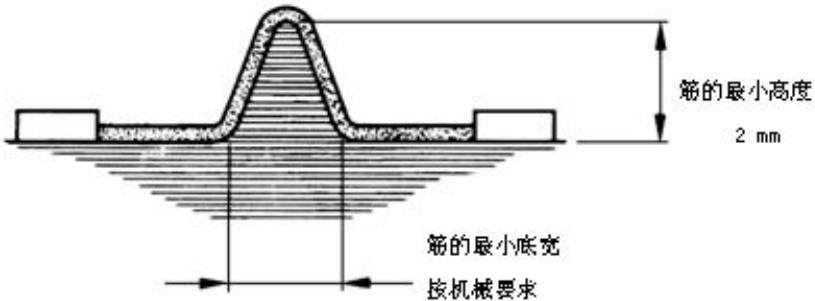  
图K.1筋的测量

## K.3 电气间隙与爬电距离测量举例

下例中:

为电气间隙：

[Unreadable]

为爬电距离。

例 1:

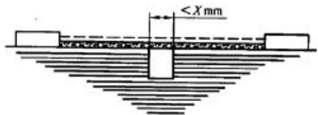

条件：该爬电距离路径包括宽度小于 X mm 而深度为任意的平行边或收敛形边槽。
规则：爬电距离和电气间隙如图所示，直接跨过槽测量。

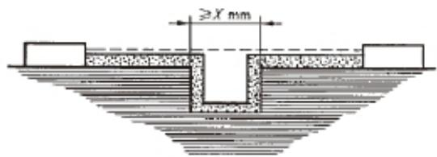

## 例 3:

条件：爬电距离路径包括任意深度且宽度等于或大于 X mm 的平行边槽。
规则：电气间隙是“虚线”的距离，爬电距离路径沿槽的轮廓。

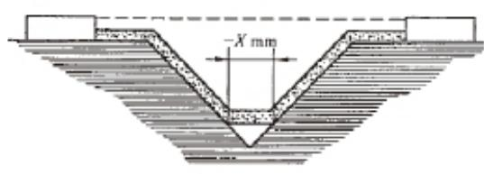

条件：爬电距离路径包括宽度大于 X mm 的 V 形槽。

规则：电气间隙是“虚线”的距离，爬电距离路径沿着槽的轮廓但被 X mm 联结把槽底“短路”。

## 例 4:

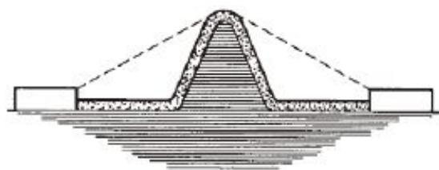

条件：爬电距离路径包括一条筋。

规则：电气间隙是通过筋顶的最短直径空气路径，爬电距离沿着筋的轮廓。

## 例 5:

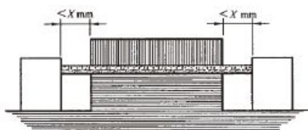

## 例 6:

条件：爬电距离路径包括一条未浇合的接缝以及每边的宽度小于 X mm 的槽。
规则：爬电距离和电气间隙路径是“虚线”所示距离。

例 7:  
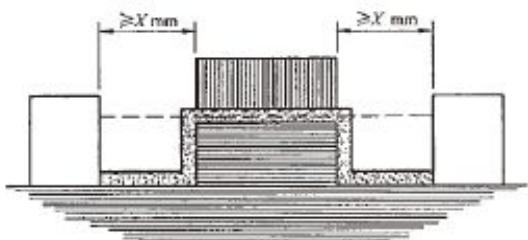

条件：爬电距离路径包括一条未浇合的接缝以及每边的宽度等于或大 X mm 的槽。
规则：电气间隙为“虚线”的距离，爬电途径沿着槽的轮廓。

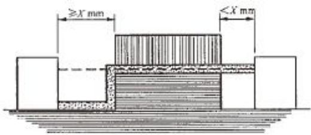

条件：爬电距离路径一条未浇合的接缝以及一边宽度小于 X mm 而另一边宽度大于或等于 X mm 的槽。
规则：电气间隙和爬电距离路径如图所示。

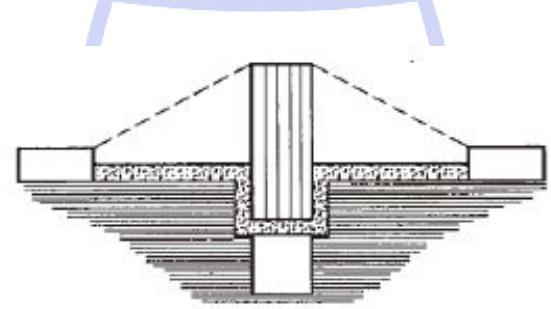

条件：穿过一条未浇合的接缝的爬电距离小于通过隔板的爬电距离。  
规则：电气间隙是通过隔板顶部的最短直接空气路径。

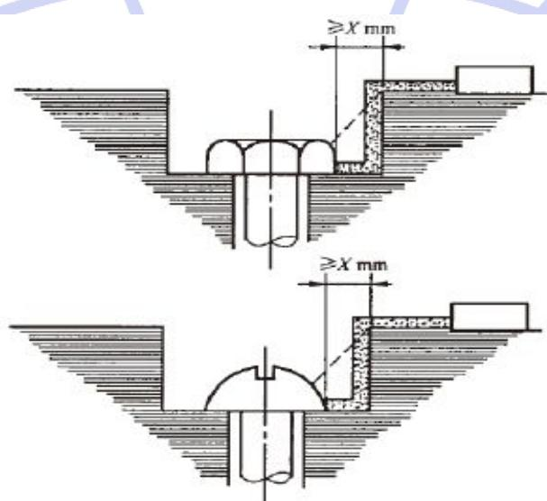  
条件：螺钉头与凹壁之间的间隙足够宽应加以考虑。  
规则：电气间隙和爬电距离路径如图所示。

例 10:

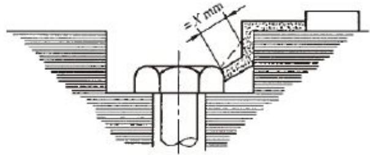

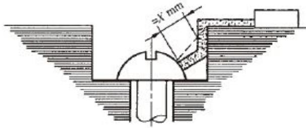

条件：螺钉头与凹壁之间的隙过分窄小而不被考虑。
规则：当螺钉头到壁的距离为 X mm 时的测量爬电距离。

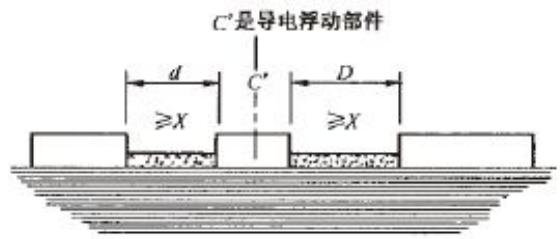

电气间隙为 $d + D$ 的距离爬电距离也为 $d + D$ 。

## 附录 L

(规范性附录)

## 温升试验用导线

## L.1 试验电流值大于 400A，但不超过 800A：

a）连接导线应采用单芯聚氯乙烯（PVC）绝缘铜导线，导线截面积见表L.1，或采用等效铜排，见表M-2，由制造厂推荐。

b）连接导体之间的间隔距离应与设备端子间的距离近似相同，铜排应涂黑色光漆。每个端子接有多个并联导线应捆在一起，并应排列成相互间约有10mm的空气间隙。每个端子接多个铜排，铜排隔开间距应近似等于铜排的厚度。如果规定的铜排尺寸不适合接线端子或难以获得，则可采用截面近似相同和冷却面积近似相同或较小的其他尺寸的铜排。铜导体或铜排不应叠加组成规定的尺寸。

表 L.1 试验电流大于 400A 而不超过 800A 的试验铜导线

<table><tr><td rowspan="3" colspan="2">试验电流范围 $^a$ A</td><td colspan="4">b,c,d导线尺寸</td></tr><tr><td colspan="2">公制</td><td colspan="2">铜排</td></tr><tr><td>根数</td><td>尺寸 $mm^2$ </td><td>根数</td><td>尺寸mm</td></tr><tr><td>400</td><td>500</td><td>2</td><td>150(16)</td><td>2</td><td>30×5(15)</td></tr><tr><td>500</td><td>630</td><td>2</td><td>185(18)</td><td>2</td><td>40×5(15)</td></tr><tr><td>630</td><td>800</td><td>2</td><td>240(21)</td><td>2</td><td>50×5(17)</td></tr><tr><td colspan="6">a,b,c,d 见表M-2</td></tr></table>

## L. 2 试验电流值大于 800A，但不超过 2000A:

a) 连接导线应采用铜排，尺寸见表 M-2。如果设计规定仅用电缆连接，则电缆的截面和尺寸应由厂商规定。

b) 连接导体之间的间隔距离应与设备端子间的距离近似相同，铜排应涂黑色光漆。每个端子接多个铜排，铜排隔开间距应近似等于铜排的厚度。如果规定的铜排尺寸不适合接线端子或难以获得，则可采用截面近似相同和冷却面积近似相同或较小的其他尺寸的铜排。铜导体或铜排不应叠加组成规定的尺寸。

表 L.2 试验电流大于 400A 试验铜排

<table><tr><td rowspan="2" colspan="2">试验电流范围A</td><td colspan="2">b, c, d, e, f铜排</td></tr><tr><td>根数</td><td>尺寸mm</td></tr><tr><td>400</td><td>500</td><td>2</td><td>30×5(15)</td></tr><tr><td>500</td><td>630</td><td>2</td><td>40×5(15)</td></tr><tr><td>630</td><td>800</td><td>2</td><td>50×5(17)</td></tr><tr><td>800</td><td>1000</td><td>2</td><td>60×5(19)</td></tr><tr><td>1000</td><td>1250</td><td>2</td><td>80×5(20)</td></tr><tr><td>1250</td><td>1600</td><td>2</td><td>100×5(23)</td></tr><tr><td>1600</td><td>2000</td><td>3</td><td>100×5(20)</td></tr><tr><td colspan="4">a 试验电流应大于第一栏的第一个数值,并应小于或等于第二个数值。b 为了便于试验,在制造厂的同意下,可以采用较小试验电流规定的导体。c 表中列出了公制和 AWG/MCM 制的尺寸变换和铜排 mm 的尺寸变换。d 按试验电流范围规定的两种导体的任一种都可以采用e 铜排采用其长边处于垂直的位置和布置。如果制造商同意,铜排可采用置其长边呈水平位置的布置。f 在采用四根铜排时,应分成二组,一组二根,每组中心间的距离不大于 100mm。</td></tr></table>

(规范性附录)  
常用变流器技术参数表

<table><tr><td colspan="2">制造厂家</td><td></td></tr><tr><td colspan="2">型号</td><td></td></tr><tr><td rowspan="5">直流侧参数</td><td>最大直流功率 (kW)</td><td></td></tr><tr><td>直流母线最高电压 (V)</td><td></td></tr><tr><td>直流侧最大电流 (A)</td><td></td></tr><tr><td>直流电压工作范围 (V)</td><td></td></tr><tr><td>直流电压纹波系数 (%)</td><td></td></tr><tr><td rowspan="5">交流侧参数</td><td>额定功率 (kW)</td><td></td></tr><tr><td>最大输出功率 (kW)</td><td></td></tr><tr><td>交流接入方式</td><td></td></tr><tr><td>隔离方式</td><td></td></tr><tr><td>无功范围 (kW)</td><td></td></tr><tr><td rowspan="7">并网运行参数</td><td>额定电网电压 (V)</td><td></td></tr><tr><td>允许电网电压 (V)</td><td></td></tr><tr><td>额定电网频率 (Hz)</td><td></td></tr><tr><td>允许电网频率 (Hz±%)</td><td></td></tr><tr><td>电流总谐波畸变率THD (%)</td><td></td></tr><tr><td>功率因数</td><td></td></tr><tr><td>充放电切换时间 (ms)</td><td></td></tr><tr><td rowspan="14">离网运行参数</td><td>额定输出电压 (V)</td><td></td></tr><tr><td>输出电压偏差 (V±%)</td><td></td></tr><tr><td>输出电压不平衡度 (%)</td><td></td></tr><tr><td>输出电压失真度 (%)</td><td></td></tr><tr><td>额定输出频率 (Hz)</td><td></td></tr><tr><td>电压过渡变换范围 (%)</td><td></td></tr><tr><td>输出过压保护值 (V)</td><td></td></tr><tr><td>输出欠压保护值 (V)</td><td></td></tr><tr><td>并离网切换时间 (ms)</td><td></td></tr><tr><td>最大转换效率 (%)</td><td></td></tr><tr><td>允许环境温度 (°C)</td><td></td></tr><tr><td>允许相对湿度 (%)</td><td></td></tr><tr><td>噪声 (dB)</td><td></td></tr><tr><td>尺寸 (长×深×高) (mm)重量(kg)</td><td></td></tr><tr><td rowspan="7"></td><td>防护等级</td><td></td></tr><tr><td>冷却方式</td><td></td></tr><tr><td>绝缘电阻(MΩ)</td><td></td></tr><tr><td>介质强度</td><td></td></tr><tr><td>通信接口</td><td></td></tr><tr><td>人机界面</td><td></td></tr><tr><td>通信规约</td><td></td></tr></table>

## 参考文献

[1] EN 50178:1997 用于电力安装的电气设备（Electronic equipment for use in power installations）

[2] EN 50530-2010 并网光伏变流器的全逆变效率（Overall Efficiency of Photovoltaic Inverters）

[3] UL 1741-2010 分布式能源用变流器、变换器、控制器及系统互联设备（Inverters, Converters, Controllers and Interconnection System Equipment for Use With Distributed Energy Resources）

[4] CNCA/CTS 0004-2009A 并网光伏发电专用变流器技术条件

