DIN EN 62109-1 (VDE 0126-14-1)

Diese Norm ist zugleich eine VDE-Beetimmung im Sinne von VDE 0022. Sie ist nach Durchführung des vom VDE-Präsidium beschlossenen Genehmigungsverfahrens unter der oben angeführten Nummer in das VDE-Vorschriftenwerk aufgenommen und in der „etz Elektrotechnik + Automation“ bekannt gegeben worden.

## Vervielfältigung – auch für innerbetriebliche Zwecke – nicht gestattet.

## ICS 29.200

Einsprüche bis 2008-08-31

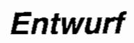

## Sicherheit von Leistungsumrichtern zur Anwendung in photovoltaischen Energiesystemen –

Deutsche Fassung prEN 62109-1:2007

Safety of power converters for use in photovoltaic power systems – Part 1: General requirements (IEC 82/505/CDV:2007); German version prEN 62109-1:2007

Sécurité des convertisseurs utilisés pour les systèmes de puissance photovoltaïques – Partie 1 : Exigences générales
(CEI 82/505/CDV:2007);
Version allemande prEN 62109-1:2007

## Anwendungswarnvermerk

Dieser Norm-Entwurf mit Erscheinungsdatum 2008-06-09 wird der Öffentlichkeit zur Prüfung und Stellungnahme vorgelegt.

Weil die beabsichtigte Norm von der vorliegenden Fassung abweichen kann, ist die Anwendung dieses Entwurfes besonders zu vereinbaren.

Stellungnahmen werden erbeten

\- vorzugsweise als Datei per E-Mail an dke@vde.com in Form einer Tabelle. Die Vorlage dieser Tabelle kann im Internet unter www.dke.de/stellungnahme abgerufen werden

\- oder in Papierform an die DKE Deutsche Kommission Elektrotechnik Elektronik Informationstechnik im DIN und VDE, Stresemannallee 15, 60596 Frankfurt am Main.

Die Empfänger dieses Norm-Entwurfs werden gebeten, mit ihren Kommentaren jegliche relevante Patentrechte, die sie kennen, mitzuteilen und unterstützende Dokumentationen zur Verfügung zu stellen.

Gesamtumfang 326 Seiten

DKE Deutsche Kommission Elektrotechnik Elektronik Informationstechnik im DIN und VDE

## Beginn der Gültigkeit

Diese Norm gilt ab ...

## Nationales Vorwort

Die Deutsche Fassung des europäischen Dokuments prEN 62109-1:2007 „Sicherheit von Leistungsumrichtern zur Anwendung in photovoltaischen Energiesystemen – Teil 1: Allgemeine Anforderungen“ (Entwurf in der Umfrage) ist unverändert in diesen Norm-Entwurf übernommen worden.

Die Internationale Elektrotechnische Kommission (IEC) und das Europäische Komitee für Elektrotechnische Normung (CENELEC) haben vereinbart, dass ein auf IEC-Ebene erarbeiteter Entwurf für eine Internationale Norm zeitgleich (parallel) bei IEC und CENELEC zur Umfrage (CDV-Stadium) und Abstimmung als FDIS (en: Final Draft International Standard) bzw. Schluss-Entwurf für eine Europäische Norm gestellt wird, um eine Beschleunigung und Straffung der Normungsarbeit zu erreichen. Dem entsprechend ist das internationale Dokument IEC 82/505/CDV:2007 „Safety of power converters for use in photovoltaic power systems – Part 1: General requirements“ unverändert in den Entwurf prEN 62109-1:2007 übernommen worden.

Da die Deutsche Fassung noch nicht endgültig mit der Englischen und Französischen Fassung abgeglichen ist, ist die englische Originalfassung des IEC-CDV entsprechend der diesbezüglich durch die IEC erteilten Erlaubnis beigefügt. Die Nutzungsbedingungen für den deutschen Text des Norm-Entwurfes gelten gleichermaßen auch für den englischen IEC-Text.

Das internationale Dokument wurde vom TC 82 „Solar photovoltaic energy systems“ der Internationalen Elektrotechnischen Kommission (IEC) erarbeitet.

Bei der Abstimmung zu dem Europäischen Schluss-Entwurf bei CENELEC und dem Internationalen Schluss-Entwurf bei IEC [Final Draft International Standard (FDIS)] sind jeweils nur „JA/NEIN“-Entscheidungen möglich, wobei „NEIN“-Entscheidungen fundiert begründet werden müssen. Dokumente, die bei CENELEC als Europäische Norm angenommen und ratifiziert werden, sind unverändert als Deutsche Normen zu übernehmen.

Für diesen Norm-Entwurf ist das nationale Arbeitsgremium K 373 „Photovoltaische Solarenergie-Systeme“ der DKE Deutsche Kommission Elektrotechnik Elektronik Informationstechnik im DIN und VDE (www.dke.de) zuständig.

## Nationaler Anhang NA (informativ)

## Zusammenhang mit Europäischen und Internationalen Normen

Für den Fall einer undatierten Verweisung im normativen Text (Verweisung auf eine Norm ohne Angabe des Ausgabedatums und ohne Hinweis auf eine Abschnittsnummer, eine Tabelle, ein Bild usw.) bezieht sich die Verweisung auf die jeweils neueste gültige Ausgabe der in Bezug genommenen Norm.

Für den Fall einer datierten Verweisung im normativen Text bezieht sich die Verweisung immer auf die in Bezug genommene Ausgabe der Norm.

Eine Information über den Zusammenhang der zitierten Normen mit den entsprechenden Deutschen Normen ist in Tabelle NA.1 wiedergegeben.

Tabelle NA.1

<table><tr><td>Europäische Norm</td><td>Internationale Norm</td><td>Deutsche Norm</td><td>Klassifikation im VDE-Vorschriftenwerk</td></tr><tr><td>EN 50102:1995</td><td>-</td><td>DIN EN 50102; DIN EN 62262 (VDE 0470-100):1997-09</td><td>VDE 0470-100</td></tr><tr><td>EN 60027</td><td>IEC 60027</td><td>DIN EN 60027</td><td>-</td></tr><tr><td>HD 588.1 S1</td><td>IEC 60060-1</td><td>DIN IEC 60060-1 (VDE 0432-1)</td><td>VDE 0432-1</td></tr><tr><td>EN 60061-1</td><td>IEC 60061-1</td><td>DIN EN 60061-1</td><td>-</td></tr><tr><td>EN 60065</td><td>IEC 60065</td><td>DIN EN 60065 (VDE 0860)</td><td>VDE 0860</td></tr><tr><td>Normen der Reihe EN 60068-2</td><td>Normen der Reihe IEC 60068-2</td><td>Normen der Reihe DIN EN 60068-2 (VDE 0468-2)</td><td>Normen der Reihe VDE 0468-2</td></tr><tr><td>60071-1</td><td>IEC 60071-1</td><td>DIN EN 60071-1 (VDE 0111-1)</td><td>VDE 0111-1</td></tr><tr><td>EN 60071-2</td><td>IEC 60071-2</td><td>DIN EN 60071-2 (VDE 0111-2)</td><td>VDE 0111-2</td></tr><tr><td>-</td><td>IEC/TR 60083</td><td>--</td><td>-</td></tr><tr><td>EN 60112</td><td>IEC 60112</td><td>DIN EN 60112 (VDE 0303-11)</td><td>VDE 0303-11</td></tr><tr><td>EN 60216</td><td>IEC 60216</td><td>DIN EN 60216 (VDE 0304)</td><td>VDE 0304</td></tr><tr><td>EN 60216-4-1</td><td>IEC 60216-4-1</td><td>DIN EN 60216-4-1 (VDE 0304-4-1)</td><td>VDE 0304-4-1</td></tr><tr><td>EN 60309</td><td>IEC 60309</td><td>DIN EN 60309 (VDE 0623)</td><td>VDE 0623</td></tr><tr><td>EN 60417</td><td>IEC 60417</td><td>DIN EN 60417</td><td>-</td></tr><tr><td>EN 60529:1991 + A1:2000</td><td>IEC 60529:1989 + A1:1999</td><td>DIN EN 60529 (VDE 0470-1):2000-09</td><td>VDE 0470-1</td></tr><tr><td>EN 60664</td><td>IEC 60664</td><td>DIN EN 60664 (VDE 0110)</td><td>VDE 0110</td></tr><tr><td>EN 60664-3</td><td>IEC 60664-3</td><td>DIN EN 60664-3 (VDE 0110-3)</td><td>VDE 0110-3</td></tr><tr><td>EN 60695-2-11</td><td>IEC 60695-2-11</td><td>DIN EN 60695-2-11 (VDE 0471-2-11)</td><td>-</td></tr><tr><td>-</td><td>IEC 60695-2-20</td><td>-</td><td>-</td></tr><tr><td>EN 60695-10-2</td><td>IEC 60695-10-2</td><td>DIN EN 60695-10-2 (VDE 0471-10-2)</td><td>VDE 0471-10-2</td></tr><tr><td>-</td><td>IEC/TR 60755</td><td>-</td><td>-</td></tr><tr><td>EN 60950-1</td><td>IEC 60950-1</td><td>DIN EN 60950-1 (VDE 0805-1)</td><td>VDE 0805-1</td></tr><tr><td>EN 60990</td><td>IEC 60990</td><td>DIN EN 60990 (VDE 0106-102)</td><td>VDE 0106-102</td></tr><tr><td>Normen der Reihe EN 61000-4</td><td>Normen der Reihe IEC 61000-4</td><td>Normen der Reihe DIN EN 61000-4 (VDE 0847-4)</td><td>Normen der Reihe VDE 0847-4</td></tr><tr><td>EN 61008-1</td><td>IEC 61008-1</td><td>DIN EN 61008-1 (VDE 0664-10)</td><td>VDE 0664-10</td></tr><tr><td>EN 61140</td><td>IEC 61140</td><td>DIN EN 61140 (VDE 0140-1)</td><td>VDE 0140-1</td></tr><tr><td>-</td><td>IEC/TS 61201</td><td>-</td><td>-</td></tr><tr><td>EN 61672-1</td><td>IEC 61672-1</td><td>DIN EN 61672-1</td><td>-</td></tr><tr><td>EN 61672-2</td><td>IEC 61672-2</td><td>DIN EN 61672-2</td><td>-</td></tr><tr><td>EN 61730-2</td><td>IEC 61730-2</td><td>DIN EN 61730-2 (VDE 0126-30-2)</td><td>VDE 0126-30-2</td></tr><tr><td>EN ISO 178</td><td>ISO 178</td><td>DIN EN ISO 178</td><td>-</td></tr><tr><td>EN ISO 179</td><td>ISO 179</td><td>DIN EN ISO 179</td><td>-</td></tr><tr><td>EN ISO 180</td><td>ISO 180</td><td>DIN EN ISO 180</td><td>-</td></tr></table>

— Entwurf —

E DIN EN 62109-1 (VDE 0126-14-1):2008-06

<table><tr><td>Europäische Norm</td><td>Internationale Norm</td><td>Deutsche Norm</td><td>Klassifikation VDE-Vorschwerk</td></tr><tr><td>Normen der Reihe EN ISO 527</td><td>Normen der Reihe ISO 527</td><td>Normen der Reihe DIN EN ISO 527</td><td>-</td></tr><tr><td>EN ISO 3746</td><td>ISO 3746</td><td>DIN EN ISO 3746</td><td>-</td></tr><tr><td>EN ISO 8256</td><td>ISO 8256</td><td>DIN EN ISO 8256</td><td>-</td></tr><tr><td>Normen der Reihe EN ISO 9000</td><td>Normen der Reihe ISO 9000</td><td>Normen der Reihe DIN EN ISO 9000</td><td>-</td></tr><tr><td>EN ISO 9614-1</td><td>ISO 9614-1</td><td>DIN EN ISO 9614-1</td><td>-</td></tr></table>

# Nationaler Anhang NB (informativ)

# Literaturhinweise

DIN EN 50102; DIN EN 62262 (VDE 0470-100):1997-09, Schutzarten durch Gehäuse für elektrische Betriebsmittel (Ausrüstung) gegen äußere mechanische Beanspruchungen (IK-Code); Deutsche Fassung EN 50102:1995

DIN EN 60027, Formelzeichen für die Elektrotechnik

DIN EN 60061-1, Lampensockel und -fassungen sowie Lehren zur Kontrolle der Austauschbarkeit und Sicherheit – Teil 1: Lampensockel

DIN EN 60065 (VDE 0860), Audio-, Video- und ähnliche elektronische Geräte – Sicherheitsanforderungs

Normen der Reihe DIN EN 60068-2 (VDE 0468-2), Umgebungseinflüsse – Teil 2: Prüfverfahren (IEC 60068-2); Deutsche Fassung EN 60068-2

DIN EN 60071-1 (VDE 0111-1), Isolationskoordination – Teil 1: Begriffe, Grundsätze und Anforderungen

DIN EN 60071-2 (VDE 0111-2), Isolationskoordination – Teil 2: Anwendungsrichtlinie

DIN EN 60112 (VDE 0303-11), Verfahren zur Bestimmung der Prüfzahl und der Vergleichszahl der Kriech wegbildung von festen, isolierenden Werkstoffen

DIN EN 60216 (VDE 0304), Elektroisolierstoffe – Eigenschaften hinsichtlich des thermischen Langzeitverhaltens

DIN EN 60216-4-1 (VDE 0304-4-1), Elektroisolierstoffe – Eigenschaften hinsichtlich des thermischen Langzeitverhaltens – Teil 4-1: Wärmeschränke für die Warmlagerung – Einzelkammerwärmeschränke

DIN EN 60309 (VDE 0623), Stecker, Steckdosen und Kupplungen für industrielle Anwendungen

DIN EN 60417, Graphische Symbole für Betriebsmittel

DIN EN 60529 (VDE 0470-1):2000-09, Schutzarten durch Gehäuse (IP-Code) (IEC 60529:1989 + A1:1999)
Deutsche Fassung EN 60529:1991 + A1:2000

DIN EN 60664, Isolationskoordination für elektrische Betriebsmittel in Niederspannungsanlagen

## — Entwurf —

E DIN EN 62109-1 (VDE 0126-14-1):2008-06

DIN EN 60664-3 (VDE 0110-3), Isolationskoordination für elektrische Betriebsmittel in Niederspannungsanlagen – Teil 3: Anwendung von Beschichtungen, Eingießen oder Vergießen zum Schutz gegen Verschmutzung

DIN EN 60695-2-11 (VDE 0471-2-11), Prüfungen zur Beurteilung der Brandgefahr – Teil 2-11: Prüfungen mit dem Glühdraht – Prüfungen mit dem Glühdraht zur Entzündbarkeit von Enderzeugnissen

DIN EN 60695-10-2 (VDE 0471-10-2), Prüfungen zur Beurteilung der Brandgefahr – Teil 10-2: Unübliche Wärme – Kugeldruckprüfung

DIN EN 60950-1 (VDE 0805-1), Einrichtungen der Informationstechnik – Sicherheit – Teil 1: Allgemeine Anforderungen

DIN EN 60990 (VDE 0106-102), Verfahren zur Messung von Berührungsstrom und Schutzleiterstrom

Normen der Reihe DIN EN 61000-4 (VDE 0847-4), Elektromagnetische Verträglichkeit (EMV) – Teil 4: Prüf- und Messverfahren (IEC 61000-4); Deutsche Fassung EN 61000-4

DIN EN 61008-1 (VDE 0664-10), Fehlerstrom-/Differenzstrom-Schutzschalter ohne eingebauten Überstromschutz (RCCBs) für Hausinstallationen und für ähnliche Anwendungen – Teil 1: Allgemeine Anforderungen

DIN EN 61140 (VDE 0140-1), Schutz gegen elektrischen Schlag – Gemeinsame Anforderungen für Anlagen und Betriebsmittel

DIN EN 61672-1, Elektroakustik – Schallpegelmesser – Teil 1: Anforderungen

DIN EN 61672-2, Elektroakustik – Schallpegelmesser – Teil 2: Baumusterprüfungen

DIN EN 61730-2 (VDE 0126-30-2), Photovoltaik(PV)-Module – Sicherheitsqualifikation – Teil 2: Anforderungen an die Prüfung

DIN EN ISO 178, Kunststoffe – Bestimmung der Biegeeigenschaften

DIN EN ISO 179, Kunststoffe – Bestimmung der Charpy-Schlageigenschaften

DIN EN ISO 180, Kunststoffe – Bestimmung der Izod-Schlagzähigkeit

Normen der Reihe DIN EN ISO 527, Kunststoffe – Bestimmung der Zugeigenschaften

DIN EN ISO 3746, Akustik – Bestimmung der Schalleistungspegel von Geräuschquellen aus Schalldruckmessungen – Hüllflächenverfahren der Genauigkeitsklasse 3 über einer reflektierenden Ebene

DIN EN ISO 8256, Kunststoffe – Bestimmung der Schlagzugzähigkeit

Normen der Reihe DIN EN ISO 9000, Qualitätsmanagementsysteme – Grundlagen und Begriffe

DIN EN ISO 9614-1, Akustik – Bestimmung der Schalleistungspegel von Geräuschquellen aus Schallintensitätsmessungen – Teil 1: Messungen an diskreten Punkten

DIN IEC 60060-1 (VDE 0432-1), Hochspannungs-Prüftechnik – Teil 1: Allgemeine Festlegungen und Prüfbedingungen

# Anhang L (normativ)

# Prüfung der Beständigkeit gegen ultraviolettes Licht (siehe 13.6.4)

## L.1 Prüfeinrichtung

Die Prüfmuster werden dem ultravioletten Licht unter Anwendung einer der folgenden Prüfeinrichtungen ausgesetzt:

a) eingeschlossener Kohlezwillingslichtbogen (siehe L.3) mit Dauerbestrahlung. Die Prüfeinrichtung muss mit einer Schwarzstandardtemperatur von 63 °C ± 3 °C bei einer relativen Feuchte von 50 % ± 5 % betrieben werden oder

b) Xenonbogen (siehe L.4) mit Dauerbestrahlung. Die Prüfeinrichtung muss mit einer wassergekühlten Xenonbogenlampe mit 6 500 W mit einer spektralen Bestrahlungsstärke von 0,35 W/m² bei 340 nm, einer Schwarzstandardtemperatur von 65 °C ± 3 °C bei einer relativen Feuchte von 50 % ± 5 % betrieben werden.

## L.2 Montage der Prüfmuster

Die Prüfmuster werden senkrecht auf der Innenseite des Zylinders der Bestrahlungseinrichtung befestigt, so dass der breiteste Teil des Prüfmusters zum Lichtbogen zeigt. Sie sind so anzuordnen, dass sie sich nicht berühren.

## L.3 Kohlelichtbogen-Bestrahlungseinrichtung

Es wird die in ISO 4892-2 beschriebene oder eine gleichartige Einrichtung nach dem in ISO 4892-1 und ISO 4892-2 beschriebenen Verfahren benutzt mit einem Filter des Typs 1 mit Sprühwasser.

## L.4 Xenonlichtbogen-Bestrahlungseinrichtung

Es wird die in ISO 4892-2 beschriebene oder eine gleichartige Einrichtung nach dem in ISO 4892-1 und ISO 4892-2 beschriebenen Verfahren, Methode A, mit Sprühwasser benutzt.

## Contents

## Foreword

1 Scope and Objective .... 10
1.1 Scope .... 10
1.1.1 Equipment Included in Scope .... 10
1.1.2 Equipment Excluded from Scope .... 10
1.2 Object .... 10
1.2.1 Aspects included in scope .... 10
1.2.2 Aspects excluded from scope .... 11
2 Normative references .... 11
3 Terms and definitions .... 13
4 General testing requirements .... 25
4.1 General .... 25
4.2 General conditions for testing .... 25
4.2.1 Sequence of tests .... 25
4.2.2 Reference test conditions .... 26
4.3 Thermal Testing .... 29
4.3.1 General .... 29
4.3.2 Maximum temperatures .... 29
4.4 Testing in single fault condition .... 31
4.4.1 General .... 31
4.4.2 Test conditions and duration for testing under fault conditions .... 32
4.4.3 Compliance after application of fault conditions .... 32
4.4.4 SINGLE FAULT CONDITIONS to be applied: .... 33
4.5 Humidity preconditioning .... 36
4.5.1 General .... 36
4.5.2 Conditions .... 36
4.6 Voltage Backfeed Protection .... 36
4.6.1 Backfeed tests under normal conditions .... 37
4.6.2 Backfeed tests under single-fault conditions .... 37
4.6.3 Compliance with backfeed tests .... 37
4.7 Electrical Ratings Tests .... 37
4.7.1 Input Ratings .... 37
4.7.2 Output Ratings .... 37
5 Marking and documentation .... 37
5.1 Marking .... 37

5.1.1 General....37
5.1.2 Durability of markings....38
5.1.3 Identification....38
5.1.4 Equipment ratings....38
5.1.5 Fuse identification....39
5.1.6 Terminals, Connections, and Controls....39
5.1.7 Switches and circuit-breakers....40
5.1.8 Class II Equipment....40
5.1.9 Terminal boxes for External Connections....40
5.2 Warning markings....40
5.2.1 Visibility and legibility requirements for warning markings....40
5.2.2 Content for warning markings....41
5.2.3 Sonic hazard markings and instructions....42
5.2.4 Equipment with multiple sources of supply....42
5.2.5 Excessive touch current....42
5.3 Documentation....42
5.3.1 General....42
5.3.2 Information related to installation....43
5.3.3 Information related to operation....44
5.3.4 Information related to maintenance....44
6 Environmental requirements and conditions....45
6.1 Environmental categories and minimum environmental conditions....46
6.1.1 OUTDOOR....46
6.1.2 INDOOR, unconditioned....46
6.1.3 INDOOR, conditioned....46
6.2 Pollution degree....48
6.3 Ingress Protection....49
6.4 UV exposure....49
6.5 Temperature and humidity....50
7 Protection against electric shock and energy hazards....50
7.1 General....50
7.2 Fault conditions....50
7.3 Protection against electric shock....50
7.3.1 General....50
7.3.2 Decisive voltage classification....52
7.3.3 Protective separation....55
7.3.4 Protection against direct contact....55
7.3.5 Protection in case of direct contact....60
7.3.6 Protection against indirect contact....63
7.3.7 Insulation Including Clearance and Creepage Distances....69
7.3.8 Residual Current-operated protective (RCD) or monitoring (RCM) device compatibility....82
7.3.9 Capacitor discharge....82

7.4 Protection against energy hazards 83
7.4.1 Operator Access Areas 83
7.4.2 Service Access Areas 84
7.4.3 Mechanical hazards resulting from electrical energy 84
7.5 Electrical tests related to shock hazard 84
7.5.1 Impulse voltage test (type test) 84
7.5.2 Voltage Test (dielectric strength test) (type test and routine test) 86
7.5.3 Partial discharge test (type test or sample test) 90
7.5.4 Protective Bonding (type test and routine test) 92
7.5.5 Touch current measurement (type test) 92
7.5.6 Equipment with multiple sources of supply 93
8 Protection against mechanical HAZARDS 93
8.1 General 93
8.2 Moving parts 93
8.2.1 Protection of service persons 94
8.3 Stability 94
8.4 Provisions for lifting and carrying 95
8.5 Wall mounting 95
8.6 Expelled parts 96
9 Protection Against Fire Hazards 96
9.1 Resistance to fire 96
9.1.1 Reducing the risk of ignition and spread of flame 96
9.1.2 Conditions for a fire enclosure 96
9.1.3 Materials requirements for protection against fire hazard 98
9.1.4 Openings in fire enclosures 102
9.2 LIMITED POWER SOURCES 107
9.2.1 General 107
9.2.2 Limited power source tests 107
10 Protection Against Sonic Pressure Hazards 108
10.1 General 108
10.2 Sonic Pressure and Sound level 109
10.2.1 Hazardous Noise Levels 109
11 Protection Against Liquid Hazards 109
11.1 Liquid Containment, Pressure and Leakage 109
11.2 Fluid pressure and leakage 109
11.2.1 Maximum pressure 110
11.2.2 Leakage from parts 110
11.2.3 Overpressure safety device 110
11.3 Oil and grease 111
12 Chemical Hazards 111
12.1 General 111
13 Physical Requirements 111
13.1 Handles and manual controls 111

13.1.1 Adjustable controls.... 112
13.2 Securing of parts.... 112
13.3 Provisions for external connections.... 112
13.3.1 General
13.3.2 Connection to an a.c. MAINS supply.... 113
13.3.3 Wiring terminals for connection of external conductors.... 117
13.3.4 Supply wiring space.... 119
13.3.5 Wire bending space for wires 10 mm² and greater.... 120
13.3.6 Disconnection from supply sources.... 120
13.3.7 Connectors, plugs and sockets.... 121
13.3.8 Direct plug-in equipment.... 121
13.4 Internal wiring and connections.... 121
13.4.1 General
13.4.2 Routing
13.4.3 Colour coding.... 122
13.4.4 Splices and connections.... 122
13.4.5 Interconnections between parts of the PCE.... 122
13.5 Openings in enclosures.... 123
13.5.1 Top and side openings.... 123
13.6 Polymeric Materials.... 126
13.6.1 General
13.6.2 Polymers serving as enclosures or barriers preventing access to hazards
13.6.3 Polymers serving as solid insulation.... 127
13.6.4 UV resistance.... 127
13.7 Mechanical resistance to deflection, impact, or drop.... 128
13.7.1 General
13.7.2 250-N deflection test for metal enclosures.... 129
13.7.3 7-J impact test for polymeric enclosures.... 129
13.7.4 Drop test
13.8 Thickness requirements for metal enclosures.... 130
13.8.1 General
13.8.2 Cast metal.... 130
13.8.3 Sheet metal.... 130
Components.... 132
14.1 General.... 132
14.2 Motor Overtemperature Protection.... 134
14.3 Overtemperature protection devices.... 135
14.4 Fuse holders.... 135
14.5 MAINS voltage selecting devices.... 135
14.6 Printed circuit boards.... 136
14.7 Circuits or components used as transient overvoltage limiting devices.... 136
14.8 Batteries.... 136

14.8.1 Battery Enclosure Ventilation .... 136
14.8.2 Battery Mounting .... 137
14.8.3 Electrolyte spillage .... 138
14.8.4 Battery Connections .... 138
14.8.5 Battery Maintenance instructions .... 138
14.8.6 Battery accessibility and maintainability .... 139

Annex A (normative) Measurement of clearances and creepage distances (see 7.3.7.4 and 7.3.7.5.) .... 140

Annex B (normative) Programmable Equipment .... 147

Annex C (informative) Parts between which Insulation Requirements are Specified .... 148

Annex D (normative) Symbols to be used in Equipment Markings .... 149

Annex E (informative) Test Probes for Determining Access .... 151

Annex F (informative) RCDs .... 153

F.1 Selection of RCD type in AC circuits .... 153

F.2 Fault current waveforms .... 155

Annex G (informative) Altitude correction for clearances .... 157

Annex H (informative) Clearance and creepage distance determination for frequencies greater than 30 kHz.... 158

H.1 - Clearance.... 158

H.2 - Creepage distance .... 159

Annex I (informative) List of Test Requirements .... 161

Annex J (informative) Measuring Instrument for Touch Current Measurements (See 7.5.5) 162

J.1 Measuring instrument .... 162

J.2 Alternative measuring instrument .... 163

Annex K (informative) Examples of Protection, Insulation, and Overvoltage Category Requirements for PCE .... 164

K.1 Protection, Insulation, and Overvoltage.... 164

Annex L (normative) Ultraviolet light conditioning test.... 169

L.1 Test apparatus .... 169

L.2 Mounting of test samples.... 169

L.3 Carbon-arc light-exposure apparatus.... 169

L.4 Xenon-arc light-exposure apparatus.... 169

# INTERNATIONAL ELECTROTECHNICAL COMMISSION

# SAFETY OF POWER CONVERTERS FOR USE IN PHOTOVOLTAIC POWER SYSTEMS –

# PART 1 - GENERAL REQUIREMENTS

## FOREWORD

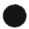

1) The IEC (International Electrotechnical Commission) is a worldwide organization for standardization comprising all national electrotechnical committees (IEC National Committees). The object of the IEC is to promote international cooperation on all questions concerning standardization in the electrical and electronic fields. To this end and in addition to other activities, the IEC publishes International Standards. Their preparation is entrusted to technical committees; any IEC National Committee interested in the subject dealt with may participate in this preparatory work. International, governmental and non-governmental organizations liaising with the IEC also participate in this preparation. The IEC collaborates closely with the International Organization for Standardization (ISO) in accordance with conditions determined by agreement between the two organizations.

2) The formal decisions or agreements of the IEC on technical matters, prepared by technical committees on which all the National Committees having a special interest therein are represented, express, as nearly as possible, an international consensus of opinion on the subjects dealt with.

3) They have the form of recommendations for international use published in the form of standards, technical reports or guides and they are accepted by the National Committees in that sense.

4) In order to promote international unification, IEC National Committees undertake to apply IEC International Standards transparently to the maximum extent possible in their national and regional standards. Any divergence between the IEC Standard and the corresponding national or regional standard shall be clearly indicated in the latter.

5) The IEC provides no marking procedure to indicate its approval and cannot be rendered responsible for any equipment declared to be in conformity with one of its standards.

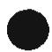

6) Attention is drawn to the possibility that some of the elements of this International Standard may be the subject of patent rights. The IEC shall not be held responsible for identifying any or all such patent rights.

International Standard 62109-1 has been prepared by IEC technical committee 82: Solar photovoltaic energy systems.

The text of this standard is based on the following documents:

<table><tr><td>FDIS</td><td>Report on voting</td></tr><tr><td>82/XXX/FDIS</td><td>82/XXX/RVD</td></tr></table>

Full information on the voting for approval can be found in the report on voting indicated in the above table.

In this part, the following print types are used:

\- requirements proper: roman type;

\- test specifications: italic type;

\- notes: smaller roman type.

\- terms used throughout this standard which have been defined in clause 3: SMALL ROMAN CAPITALS.

## INTRODUCTION

This part 1 specifies the safety requirements that are generally applicable to all equipment within its scope. For certain types of equipment, these requirements will be supplemented or modified by the special requirements of one, or more than one, subsequent section (for example 62109-2, 62109-3, etc.) of the standard which must be read in conjunction with the part 1 requirements.

# SAFETY OF POWER CONVERTERS FOR USE IN PHOTOVOLTAIC POWER SYSTEMS –

# PART 1 - GENERAL REQUIREMENTS

## 1 Scope and Objective

## 1.1 Scope

This International Standard applies to the POWER CONVERSION EQUIPMENT (PCE) for use in Photovoltaic (PV) systems where a uniform technical level with respect to safety is necessary. This standard defines the minimum requirements for the design and manufacture of PCE for protection against electric shock, energy, fire, mechanical and other hazards.

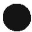

This standard provides general requirements applicable to all types of PV PCE. There are additional parts of this standard that provide specific requirements for the different types of power converters such as Part 2 - inverters. Additional parts may be published as new products and technologies are commercialised.

## 1.1.1 Equipment Included in Scope

This standard covers PCE connected to systems not exceeding maximum PV source circuit voltage of 1500 VDC. The equipment may also be connected to systems not exceeding 1000 VAC at the a.c. mains circuits, non-mains a.c. load circuits, and to other DC source or load circuits such as batteries. This standard may be used for accessories for use with PCE, except where more appropriate standards exist.

## 1.1.2 Equipment Excluded from Scope

This standard has not been written to address characteristics of other sources such as wind turbines, other rotating machine sources, etc.

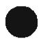

NOTE Requirements for other sources may be incorporated in the IEC 62109 series in the future.

Additional or other requirements are necessary for equipment intended for use in explosive atmospheres (see IEC 60079, Explosive atmospheres), aircraft, marine installations, electromedical applications (see IEC 60601, Medical electrical equipment) or at elevations above 2000 m.

## 1.2 Object

## 1.2.1 Aspects included in scope

The purpose of the requirements of this part 1 is to ensure that the design and methods of construction used provide adequate protection for the OPERATOR and the surrounding area against:

a) electric shock and energy HAZARDS;

b) mechanical HAZARDS;

c) excessive temperature HAZARDS;

d) spread of fire from the equipment;

e) chemical hazards;

f) sonic pressure HAZARDS;

g) liberated fluids, gases and explosion HAZARDS.

NOTE Servicing personnel are expected to have the necessary knowledge and skill to use reasonable care in dealing with HAZARDS associated with the operation, repair and maintenance of this equipment. Based upon this premise, this document provides only limited requirements (for example markings or guarding) intended to protect service personnel from hazards that may not be apparent even to trained personnel.

## 1.2.2 Aspects excluded from scope

Aspects not covered by this standard include, but are not limited to, the following:

a) functional reliability, performance or other properties of the equipment not related to safety;

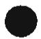

b) effectiveness of transport packaging;

c) EMC requirements;

d) installation requirements, which are covered by local and national installation codes

NOTE This standard does provide requirements for PCE intended to ensure that the PCE can be installed in a safe manner, including requirements for installation instructions provided with the product.

## 2 Normative references

The following normative documents contain provisions, which, through reference in this text constitute provisions of this part of IEC 62109. For dated references, subsequent amendments to, or revisions of, any of these publications do not apply. However, parties to agreements based on this part of IEC 62109 are encouraged to investigate the possibility of applying the most recent editions of the normative documents indicated below. For undated references, the latest edition of the normative document referred to applies. Members of ISO and IEC maintain registers of currently valid international standards.

EN 50102: 1995, Degrees of protection provided by enclosures for electrical equipment against external mechanical impacts (IK code)

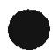

IEC 60529: (1989-11), Degrees of protection provided by enclosures (IP Code)

IEC 60068-2 (all parts), Environmental testing – Part 2: Tests IEC 61000-4 (all parts), Electromagnetic compatibility (EMC) – Part 4: Testing and measurement techniques

IEC 60309, Plugs, socket-outlets and couplers for industrial purposes

IEC 60027, Letter symbols to be used in electrical technology

IEC 61140, Protection against electric shock – Common aspects for installation and equipment

IEC 61201, Extra-low voltage (ELV) - Limit values

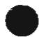

IEC 60990, Methods of measurement of touch current and protective conductor current

IEC 60755, General requirements for residual current operated protective devices

IEC 61008-1, Residual current operated circuit-breakers without integral overcurrent protection for household and similar uses (RCCBs) – Part 1: General rules

IEC 60417, Graphical symbols for use on equipment

IEC 60664, Insulation coordination for equipment within low-voltage systems

IEC 60083, Plugs and socket-outlets for domestic and similar general use standardized in member countries of IEC

IEC 60950-1, Information technology equipment – Safety – Part 1: General requirements

IEC 60664-3, Insulation coordination for equipment within low-voltage systems – Part 3: Use of coating, potting or moulding for protection against pollution

IEC 60060-1, High-voltage test techniques - Part 1: General definitions and test requirements

IEC 60071-1, Insulation co-ordination – Part 1: Definitions, principles and rules

IEC 60071-2, Insulation co-ordination - Part 2: Application guide

IEC 60061-1, Lamp caps and holders together with gauges for the control of interchangeability and safety – Part 1: Lamp caps

IEC 60695-2-11, Fire hazard testing - Part 2-11: Glowing/hot-wire based test methods - Glow-wire flammability test method for end-products

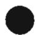

IEC 60695-2-20, Fire hazard testing - Part 2-20: Glowing/hot wire based test methods - Hot-wire coil ignitability - Apparatus, test method and guidance

IEC 60065, Audio, video and similar electronic apparatus – Safety requirements

IEC 61672-1, Electroacoustics – Sound level meters – Part 1: Specifications

IEC 61672-2, Electroacoustics – Sound level meters – Part 2: Pattern evaluation tests

IEC 60216-4-1, Guide for the determination of thermal endurance properties of electrical insulating materials. Part 4: Ageing ovens – Section 1: Single-chamber ovens

IEC 60695-10-2, Fire hazard testing – Part 10-2: Abnormal heat – Ball pressure test

IEC 60216, Electrical insulating materials – Properties of thermal endurance

IEC 60112, Method for the determination of the proof and the comparative tracking indices of solid insulating materials

IEC 61730-2, Photovoltaic (PV) module safety qualification – Part 2: Requirements for testing

ASTM D 3638-85, Standard Test Method for Comparative Tracking Index of Electrical Insulation Materials

ISO 9000 (Series), Quality management systems – Fundamentals and vocabulary

ISO 3746, Acoustics – Determination of sound power levels of noise sources using sound pressure – Survey method using an enveloping measurement surface over a reflecting plane

ISO 9614-1, Acoustics - Determination of sound power levels of noise sources using sound intensity - Part 1: measurement at discrete points

ISO 527 (Series), Plastics - Determination of Tensile Properties

ISO 178 Plastics - Determination of flexural properties

ISO 179 Plastics - Determination of Charpy Impact Strength

ISO 180 Plastics - Determination of Izod Impact Strength

ISO 8256 Plastics - Determination of tensile-impact strength

ASTM E162 Standard Test Method for Surface Flammability of Materials Using a Radiant Heat Energy Source

ANSI/ASTM E84 Standard Test Method for Surface Burning Characteristics of Building Materials

## 3 Terms and definitions

For the purpose of this part of IEC 62109 the following definitions apply.

NOTE Unless otherwise specified, values of "voltage" and "current" are the r.m.s. values of an alternating, direct or composite voltage or current.

## 3.1

accessible

able to be touched with the standard access probes when used as specified in 7.3.4.

## 3.2

barrier

part providing protection against direct contact from any usual direction of access, or providing protection against spread of fire.

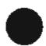

## 3.3

## basic insulation

insulation which provides basic protection against electric shock under fault-free conditions.

NOTE BASIC INSULATION may serve also for functional purposes.

## 3.4

## battery type

the battery chemistry (e.g. lead-acid) and type (e.g. flooded, gel, etc.) or types of batteries intended for use with the PCE.

## 3.5

## battery - sealed

a battery with no provision for the addition of water or electrolyte, and constructed so as to prevent the emission of liquid or gasses under normal operation.

## 3.6

## battery - non-sealed

a battery with removable caps or other provision for addition of water and/or electrolyte.

## 3.7

## battery - valve regulated

a sealed battery with provision for the release of excessive pressure under abnormal conditions.

## 3.8

## clearance

shortest distance in air between two conductive parts.

## 3.9

## closed electrical operating area

room or location for electrical equipment to which access is restricted to skilled or instructed persons by the opening of a door or the removal of a barrier by the use of a key or tool and which is clearly marked by appropriate warning signs.

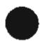

## 3.10

## comparative tracking index (CTI)

the voltage, as determined under the conditions specified in the Method for the determination of the proof and the comparative tracking indices of solid insulating materials, IEC 60112 (ASTM D 3638-85), that causes a permanent electrically conductive carbon path with the application of 50 drops of electrolyte that is applied at the rate of one drop every 30 s to the specimen.

## 3.11

## creepage distance

shortest distance along the surface of the insulating material between two conductive parts [IEV 151-03-37].

## 3.12

## decisive voltage

the decisive voltage of a circuit is the highest voltage which occurs continuously between any two arbitrary live parts of the PCE during worst-case rated operating conditions when used as intended (see Decisive Voltage Class limits in 7.3.2).

## 3.13

decorative part
a part of the equipment, outside the ENCLOSURE, which has no safety function.

## 3.14

equipment with a mains plug that is part of the equipment so that the equipment is supported by the mains receptacle.

## 3.15

double insulation
insulation comprising both basic insulation and supplementary insulation.

## 3.16

decisive voltage classification (DVC) A as defined in 7.3.2.

## 3.17

decisive voltage classification (DVC) B as defined in 7.3.2.

## 3.18

decisive voltage classification (DVC) C as defined in 7.3.2.

## 3.19

electrical enclosure
a part of the equipment which surrounds internal parts, intended to limit access to electrical shock, energy, or burn hazards.

## 3.20

a part of the equipment which surrounds internal parts, intended to provide protection against external influences, against the spread of fire, or against access to hazards.

## 3.21

environmental category
the set of ambient conditions to which the PCE is exposed in its installation, as defined in section 6.

## 3.22

provision of electric connections between conductive parts, intended to achieve equipotentiality. [IEV 195-01-10].

NOTE The effectiveness of the equipotential bonding may depend on the frequency of the current in the bonding.

## 3.23

equipotential bonding conductor
conductor electrically connecting metal parts to provide equipotential bonding.

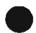

3.24
EUT
equipment under test.

## 3.25

## fire enclosure

a part of the equipment which surrounds internal parts, intended to minimize the spread of fire or flaming materials from within.

## 3.26

## fixed equipment

equipment fastened to a support, or otherwise secured in a specific location [IEV 826-07-07].

## 3.27

## flammability classification of materials

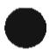

the recognition of the burning behaviour of materials and their ability to extinguish if ignited. Materials are classified as in the definitions in this standard, when tested in accordance with IEC 60695-11-10, IEC 60695-11-20, ISO 9772 or ISO 9773.

NOTE 1 When applying the requirements in this standard, HF-1 CLASS FOAMED MATERIALS are regarded as better than those of CLASS HF-2, and HF-2 better than HBF.

NOTE 2 Similarly, other MATERIALS, including rigid (engineering structural) foam of CLASS 5VA are regarded as better than those of CLASS 5VB, 5VB better than V-0, V-0 better than V-1, V-1 better than V-2, V-2 better than HB40 and HB40 better than HB75.

NOTE 3 Similarly, other MATERIALS of CLASS VTM-0 are regarded as better than those of CLASS VTM-1 and VTM-1 better than VTM-2.

NOTE 4 Materials of FLAMMABILITY CLASSES VTM-0, VTM-1 and VTM-2 are considered to be equivalent to materials of FLAMMABILITY CLASSES V-0, V-1 and V-2, respectively, but only for their flammability properties. Their electrical and mechanical properties are not necessarily equivalent.

3.28
Fnom in
nominal a.c. input frequency.

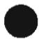

3.29
Fnom out
nominal a.c. output frequency.

## 3.30

functional earth terminal
terminal by which electrical connection is made to a part or circuit for any functional purpose other than safety.

## 3.31

functional insulation (FI)
insulation that is necessary only for the correct operation of the equipment.

NOTE Functional insulation by definition does not protect against electric shock. It may, however, reduce the likelihood of ignition and fire.

## 3.32

0.62
hand-held equipment
portable equipment intended to be supported by one hand during normal use.

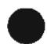

## 3.33

hazard
potential source of harm.

## 3.34

## hazardous energy level

an available power level of 240 VA or more having a duration of 60 s or more, or a stored energy level of 20 J or more (for example, from one or more capacitors), at a potential of 2 V or more (see 7.4.1.1)

## 3.35

## hazardous live

capable of rendering an electric shock or electric burn. A circuit or a part that is either a shock or energy hazard as described in section 7.

## 3.36

## hazardous voltage

a voltage exceeding the limits for shock hazard in section 7.3

## 3.37

## homogeneous field (distribution)

a homogeneous field is an electric field which has an essentially constant voltage gradient between electrodes (uniform field), such as that between two spheres where the radius of each sphere is greater than the distance between them.

## 3.38

## Imax a.c. in

maximum a.c. current an input to the PCE will draw at any voltage within the a.c. input operating voltage range under normal conditions.

## 3.39

## Imax a.c. out

maximum a.c. current an output of the PCE is rated to provide continuously, under normal conditions.

## 3.40

## Imax battery in

maximum d.c. current the a battery input to the PCE will draw at any voltage within the d.c. input operating range, under normal conditions.

## 3.41

## Imax battery out

maximum d.c. current a battery output (for example for battery charging) of the PCE is rated to provide continuously, under normal conditions.

## 3.42

maximum d.c. current the PCE will draw from the PV array at any voltage within the d.c. input operating voltage range for the PV input (Vop PV).

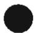

## 3.43

## inhomogeneous distribution (of an electric field)

inhomogeneous distribution of an electric field refers to a field which does not have an essentially constant voltage gradient between electrodes (non-uniform field).

## 3.44

## lsc a.c. out

maximum available a.c. output short-circuit (fault) current from an a.c. output port of the PCE.

NOTE Isc a.c. out may vary with time, so that both a current and a time (or a set of values) needs to be specified.

## 3.45

## Isc PV

absolute maximum total PV array short circuit current (d.c.) that the PCE is rated to have connected to its PV input.

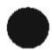

NOTE This rating of the PCE refers to the absolute maximum current the PV input to the PCE is designed for under conditions of expected use. This differs from the simple sum of the marked Isc ratings of the connected PV modules, since those markings are based on short-circuit conditions under standard test conditions, and may be exceeded in cold temperatures or with irradiance above the standard level.

## 3.46

## limited power source

a source complying with the requirements in clause 9.2 of this standard.

## 3.47

conductor or conductive part intended to be energized in normal use, including a neutral conductor.

## 3.48 low voltage

a set of voltage levels used for the distribution of electricity and whose upper limit of the line-to-line or line-to-neutral voltage is 1 000 V a.c. or 1 500 V d.c.

## 3.49

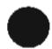

## mains

low-voltage a.c. electricity supply system to which the PCE is designed to be connected.

## 3.50

## mains circuit

circuit which is intended to be conductively connected to the mains.

## 3.51

## mechanical enclosure

a part of the equipment which surrounds internal parts, intended to reduce the risk of injury due to mechanical and other physical hazards.

## 3.52

condition in which all means for protection against hazards are intact and the PCE is installed and operated in accordance with its ratings and installation instructions.

## 3.53

## normal use

operation, including stand-by, according to the instructions for use or for the obvious intended purpose.

NOTE In most cases, normal use also implies normal condition, because the instructions for use will warn against using the equipment when it is not in normal condition.

## 3.54

## operator

person operating equipment for its intended purpose.

## 3.55

## operator access area

an area to which, under normal operating conditions, one of the following applies:

\- access can be gained without the use of a tool;

– the means of access is deliberately provided to the operator;

– the operator is instructed to enter regardless of whether or not a tool is needed to gain access.

## 3.56

## overvoltage category

numeral designation defining a classification of transient overvoltage conditions [per IEC 60664-1].

NOTE 1 See section 7.3.7.1.2 for a description of the four OVERVOLTAGE CATEGORIES.

NOTE 2 A transient overvoltage is defined as a 'short duration overvoltage of a few milliseconds or less, oscillatory or non-oscillatory, usually highly damped' [IEV 604-03-13]. It should not be confused with a temporary overvoltage (swell), which is defined as a 'power frequency overvoltage of relatively long duration' [IEV 616-01-16].

## 3.57

## partial discharge extinction voltage ( $U_{e}$ )

lowest peak value of the test voltage at which the apparent charge becomes less than the specified discharge magnitude when the test voltage is reduced below a high level where such discharges have occurred (IEC 60664-1).

NOTE For a.c. tests the r.m.s. value may be used.

## 3.58

## permanently connected equipment

equipment that is electrically connected to one or more of it's sources of supply by means which can be detached only by the use of a tool.

## 3.59

## photovoltaic (PV)

relating to the conversion of light directly into electrical energy.

## 3.60

## pluggable equipment type A

equipment which is intended for connection to the building installation wiring via a non-industrial plug and socket-outlet or a non-industrial appliance coupler, or both.

## 3.61

## pluggable equipment type B

pluggable equipment type 2 equipment which is intended for connection to the building installation wiring via an industrial plug and socket-outlet or an appliance coupler, or both, complying with IEC 60309 or with a comparable national standard.

## 3.62

Pmax out

maximum rated continuous output power of a port of the PCE.

## 3.63

## pollution

addition of foreign matter, solid, liquid or gaseous (ionized gases), that may produce a reduction of dielectric strength or surface resistivity.

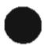

## 3.64

## pollution degree

classification scheme describing the extent of expected pollution in a micro-environment in or around the equipment.

## 3.65

pollution degree 1
no pollution or only dry, non-conductive pollution occurs. The pollution has no influence.

## 3.66

## pollution degree 2

normally only non-conductive pollution occurs. Occasionally, however, a temporary conductivity caused by condensation must be expected.

## 3.67

## pollution degree 3

conductive pollution occurs, or dry, non-conductive pollution occurs which becomes conductive due to condensation which is expected.

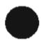

## 3.68

## portable equipment

pluggable equipment intended to be moved from place to place.

## 3.69 power conversion equipment (PCE)

an electrical device converting one kind of electrical power from a voltage or current source into another kind of electrical power with respect to voltage, current and frequency.

NOTE Examples include AC-DC converters, DC-AC inverters, DC-DC charge controllers, frequency converters, etc.

## 3.70

## protective bonding

electrical connection of accessible conductive parts or protective screening to provide electrical continuity to the protective conductor terminal.

## 3.71

## protective bonding conductor

a conductor used to interconnect accessible conductive parts or protective screening for the purpose of protective bonding.

## 3.72

## protective class I

protection against electric shock by means of basic insulation and protective earthing of accessible conductive parts, so that accessible conductive parts cannot become live in the event of a failure of the basic insulation.

## 3.73

## protective class II

protection against electric shock that does not rely on basic insulation only, but in which additional safety precautions such as double insulation or reinforced insulation are provided, there being no provision for protective earthing or reliance upon installation conditions.

## 3.74

## protective class III

equipment in which protection against electric shock relies upon supply from decisive voltage classification A circuits and in which HAZARDOUS VOLTAGES are not generated.

NOTE For CLASS III EQUIPMENT, although there is no requirement for protection against electric shock, all other requirements of the standard apply.

## 3.75

## protective earthing

connection of a point in the equipment, system, or installation to earth, for protection against electric shock in case of a fault.

## 3.76

## protective earthing conductor

a conductor used to connect an equipment, system, or installation to earth, for protection against electric shock in case of a fault.

## 3.77

## protective conductor terminal

terminal which is bonded to conductive parts of an equipment for safety purposes and is provided for the connection of a protective earthing conductor.

## 3.78

## protective impedance

component, assembly of components or the combination of basic insulation and a current or voltage-limiting device, whose impedance, construction and reliability are such that, when connected between accessible conductive parts and parts which are hazardous live, it provides protection to the extent required by this standard in normal condition and single fault condition.

## 3.79

## protective separation

a construction means to maintain the separation between circuits of different protection levels even in the event of a single fault as described in 7.3.3.

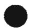

NOTE Protective separation is a separation between circuits by means of basic and supplementary protection (basic insulation plus supplementary insulation or protective screening) or by an equivalent protective provision (for example, reinforced insulation).

## 3.80

## rated

value assigned, generally by a manufacturer, to a specified operating condition of a component, device or equipment [IEV 151-04-03].

## 3.81

set of rated values and operating conditions [IEV 151-04-04].

## 3.82

## reference test conditions

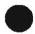

the electrical, operating, and environmental conditions under which testing is to be performed, as specified in clause 4.2.2.

## 3.83

## reinforced insulation

single insulation system applied to live parts, which provides a degree of protection against electric shock equivalent to double insulation under the conditions specified.

NOTE A single insulation system does not imply that the insulation must be one homogeneous piece. It may comprise several layers which cannot be tested singly as basic or supplementary insulation.

## 3.84

## residual-current

vector sum of the currents flowing in the normally current carrying conductors of a MAINS circuit, expressed as an r.m.s. value.

## 3.85

## responsible body

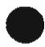

individual or group responsible for the use and maintenance of equipment and for ensuring that operators are adequately trained.

## 3.86

a combination of the probability of the occurrence of harm and the severity of that harm.

## 3.87

## routine test

test to which each individual device (equipment) is subjected during or after manufacture to ascertain whether it conforms to certain criteria [IEV 151-04-16, modified].

## 3.88

a means either of preventing access to a hazardous area until the hazard is removed, or of automatically removing the hazardous condition when access is gained.

## 3.89

## sample test

tests on a number of devices taken at random from a production batch.

## 3.90

## secondary circuit

a circuit which has no direct connection to a mains circuit and derives its power from a transformer, converter or equivalent isolation device, or from a battery or other power source not connected to the mains (e.g. PV array).

## 3.91

## service personnel

a person having appropriate technical training and experience necessary to be aware of hazards to which that person may be exposed in performing a task and of measures to minimize the risks to that person or other persons.

## 3.92

## single fault condition

condition in which one means for protection against hazard is defective or one fault is present which could cause a hazard.

NOTE If a single fault condition results in other subsequent failures, the set of failures is considered as one single fault condition.

## 3.93

## supplementary insulation

independent insulation applied in addition to basic insulation in order to provide protection against electric shock in the event of a failure of basic insulation.

## 3.94

## terminal

a component provided for the connection of a device (equipment) to external conductors [IEV 151-01-03, modified].

NOTE Terminals can contain one or several contacts and the term therefore includes sockets, connectors, etc.

## 3.95

## tool

a screwdriver, coin, key, or any other object that is used to operate a screw, latch, or similar fastening means.

## 3.96

## transportable equipment

equipment with a mass of less than 18 kg that is not fixed and is intended to be routinely carried by a USER.

## 3.97

## type test

test of one or more samples (prototypes) of equipment (or parts of equipment) made to a particular design, to show that the design and construction meet one or more requirements of this standard [IEV 151-04-15, modified].

NOTE This is an amplification of the IEV 151-04-15 definition to cover both design and construction requirements.

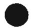

## 3.98

## VAmax out

maximum rated continuous a.c. output volt-amperes from an a.c. output port of the PCE.

## 3.99

## Vmax PV

maximum rated d.c. input voltage the PCE is designed to withstand from the PV array (i.e. max open-circuit voltage).

## 3.100

$V_{NOM}$ a.c. in
nominal rated a.c. voltage for an a.c. input port of the PCE.

## 3.101

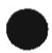

$V_{NOM}$ a.c. out
nominal rated a.c. voltage produced at an a.c. output port of the PCE.

## 3.102

## Vnom battery

nominal rated d.c. voltage for a battery port of the PCE.

## 3.103

Vop a.c. in
rated a.c. input operating voltage range, over which the PCE will operate as specified.

## 3.104

Vop battery in
rated battery input operating voltage range, over which the PCE will operate as specified.

## 3.105

Vop battery out
rated range of d.c. battery charging voltage the PCE can provide.

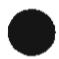

## 3.106

rated PV input operating voltage range over which the PCE will operate as specified.

## 3.107

## wet location

location where water or another conductive liquid may be present and is likely to cause reduced human body impedance due to wetting of the contact between the human body and the equipment, or wetting of the contact between the human body and the environment.

## 3.108

## working voltage

voltage which occurs by design in a circuit or across insulation, when the PCE is operated at rated nominal supply conditions and under worst-case normal operating conditions.

NOTE 1 Both the r.m.s. and recurring peak values are used.
NOTE 2 Transients and voltage fluctuations are disregarded.
NOTE 3 All conditions of loading from open-circuit to full load are taken into account.

## 4 General testing requirements

## 4.1 General

Testing is required by this standard to demonstrate that the EUT is fully in accordance with the applicable requirements of this standard. This clause of this standard provides:

\- general conditions and requirements under which testing shall be carried out

\- some of the actual tests required to be performed, where those tests are general in nature and are not specifically related to one particular type of hazard (for example thermal tests).

Other test requirements that are specific to a particular type of hazard are located in the appropriate clause elsewhere in this standard.

Tests on subassemblies of the equipment meeting the requirements of the relevant reference standards specified in this standard, and used in accordance with them and in conditions not more onerous than those applied during testing to determine conformity with the reference standards, need not be repeated during TYPE TESTS of the whole equipment.

To ensure that equipment will not become hazardous in expected humidity conditions, as specified in Table 6-1, the EUT is to be subjected to humidity preconditioning according to 4.5 before certain tests, where specified elsewhere in this standard.

To ensure that the specified maximum and/or minimum environmental or test values are imposed when a test is applied, tolerances and measurement inaccuracies shall be taken fully into account.

Conformity with the requirements of this standard is checked by carrying out all applicable tests in this standard, except that a test may be omitted if examination of the equipment demonstrates conclusively that the equipment would pass the test.

Tests are carried out under REFERENCE TEST CONDITIONS (see 4.2.2), and tests under both NORMAL and SINGLE FAULT CONDITIONS are specified.

## 4.2 General conditions for testing

## 4.2.1 Sequence of tests

The sequence of tests is optional unless otherwise specified in this standard. The EUT shall be carefully inspected for damage creating a possible hazard in the meaning of this standard, after each test. The same sample need not be used for all tests unless otherwise specified in this standard.

## 4.2.2 Reference test conditions

## 4.2.2.1 Environmental conditions

Unless otherwise specified in this standard, for example with regard to ENVIRONMENTAL CATEGORY as defined in 6.1, the following ambient environmental conditions shall exist in the test location:

a) temperature of $15^{\circ}$ C to $40^{\circ}$ C

b) a relative humidity of not more than 75 % and not less than 5%

c) an air pressure of 75 kPa to 106 kPa.

d) no frost, dew, percolating water, rain, solar radiation, etc.

## 4.2.2.2 State of equipment

The product being subjected to type tests shall be physically and electrically representative of the future production products such that the evaluations per this standard adequately represent future production units.

Unless otherwise specified, each test shall be carried out on the equipment assembled for NORMAL USE and under the least favorable combination of the conditions given in 4.2.2.1 to 4.2.2.10. If it is impractical to carry out particular tests on a complete EUT, tests on subassemblies are allowed, provided it is verified that the assembled equipment will meet the requirements of this standard.

## 4.2.2.3 Position of equipment

The equipment shall be installed in accordance with the manufacturer's instructions, in the configuration that results in the worst-case test conditions. Consideration shall be given to effects of ventilation, building into a wall, recess, cabinet, etc., installation in close proximity to structures, other equipment, etc.

## 4.2.2.4 Accessories

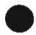

Accessories and OPERATOR-interchangeable parts available from, or recommended by, the manufacturer for use with the EUT shall be either connected or not connected, whichever is least favorable.

## 4.2.2.5 Covers and removable parts

Covers or parts, which can be removed without using a TOOL, shall be removed or not removed, whichever is least favorable.

## 4.2.2.6 Mains supply

Tests for which the outcome will not be significantly affected by the MAINS supply conditions, may be carried out at any rated supply conditions. For tests for which the outcome may be significantly affected by mains supply conditions, the test shall be performed at the worst-case MAINS supply condition or conditions, taking into consideration multiple rated conditions and tolerances on rated conditions, as specified below

a) Voltage: Tolerance shall be taken as 90 % to 110 % of the RATED voltage(s), unless a wider range is given in the specifications for the EUT in which case the wider range is used. If the EUT will not operate across the full 90 % to 110 % range, the tolerance is taken as specified operating range. Testing under nominal supply conditions, or at supply conditions between the ends of the ranges, is only necessary if testing at the ends of the ranges is not worst-case.

b) Frequency: Multiple RATED frequencies are to be taken into account (e.g. 50 Hz vs. 60 Hz), but tolerances around these frequencies do not normally need to be considered.

c) Polarity: For PLUGGABLE EQUIPMENT TYPE A, consideration is to be given to connection in both normal and reverse polarity conditions, if the outcome of a particular test could be affected.

d) Earthing: The test supply shall be earthed or not according to the intended supply configuration for the equipment under test. For equipment that may be supplied from either an earthed or un-earthed supply system, the supply system used shall be that which provides a worst-case test condition, or tests shall be done in both configurations

e) Over-current Protection: Inputs shall be provided with the over-current protection that will be present in the installation, and this protection shall not operate during any tests in normal conditions, but is allowed to operate to protect the system during tests in single fault conditions.

## 4.2.2.7 Supply ports other than the mains

Tests shall be performed at the least favorable combination of supply conditions, within the RATED range(s) for each supply port, considering voltage, frequency, polarity, earthing, and any other normal condition, where these considerations could affect the outcome of the test.

Inputs shall be provided with the over-current protection that will be present in the installation, and this protection shall not operate during any tests in NORMAL CONDITIONS, but is allowed to operate to protect the system during tests in SINGLE FAULT CONDITIONS.

For PV and battery inputs, the following additional requirements apply:

## 4.2.2.7.1 Photovoltaic supply sources

Where the results of a test could be affected by the voltage vs. current characteristic of the supply, the PV source used shall simulate the voltage vs. current characteristic of the largest PV array for which the equipment is rated, with regard to open circuit voltage (VMAX PV) and short-circuit current (ISC PV).

Tests performed under abnormal or fault conditions shall be tested with a source capable of 1.25 to 1.5 times the PCE rated maximum input current (Isc PV) for that input. If provided, any included or specified PCE overcurrent protective devices shall not be altered or changed.

NOTE When selecting test conditions for the PV supply, consideration has to be given to the characteristic of PV arrays: when maximum voltage is available, the available current is at a minimum, and when maximum current is available, the voltage is at a minimum. It is not expected that any test should be run with both the PV source current and voltage at their maximum values.

## 4.2.2.7.2 Battery inputs

Battery inputs may be supplied from either a d.c. power supply or from a battery bank, except that for fault testing, where the magnitude of the available fault current could affect the results of the test, a battery bank of the size normally used with the product shall be used.

## 4.2.2.8 Conditions of loading for output ports

Tests shall be performed under the least favorable loading conditions, within the RATED range(s) for each port, considering voltage, frequency, polarity, earthing, load current and type, and any other normal condition, where these considerations could affect the outcome of the test. An a.c. output port shall be loaded with linear resistive or reactive load(s) to obtain the maximum RATED output power or current, whichever is least favourable. A d.c. output port (for example a battery charging output or a d.c. load port) shall be loaded with resistive load(s) to obtain the maximum RATED output power or current, whichever is least favourable. For ports intended for connection to a battery, a battery shall be used in place of or in parallel with the load, if the test results could be affected.

Unless otherwise specified in this standard, loading conditions are to be maintained for a length of time as follows:

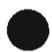

\- for CONTINUOUS OPERATION ratings, until steady conditions are established, except that for a test for which the only source of power is the PV input, testing is limited to 7 h at full power (to approximate a single solar day);

\- for INTERMITTENT OPERATION, until steady conditions are established, using the rated "ON" and "OFF" periods;

\- for SHORT-TIME OPERATION, for the RATED OPERATING TIME.

## 4.2.2.9 Earthing terminals

A PROTECTIVE CONDUCTOR TERMINAL, if provided, shall be connected to earth. A FUNCTIONAL EARTH TERMINAL shall be connected or not connected to earth, whichever is least favourable.

## 4.2.2.10 Controls

Controls which the OPERATOR can adjust shall be set to any position except that

a) MAINS selection devices shall be set to the correct value unless otherwise noted in this standard;

b) combinations of settings shall not be made if they are prohibited by the manufacturer's instructions provided with the equipment.

## 4.2.2.11 Available short circuit current

Where the results of a test could be affected, the short circuit current sourcing capability of the source used during testing shall be taken into consideration. Where high available short circuit current is considered to be the worst-case test condition, the capability of the source shall not be less than the maximum short-circuit current the PCE is rated for.

NOTE For some tests, less than maximum short circuit current may be worst-case, if, for example, it results in longer test duration.

## 4.3 Thermal Testing

## 4.3.1 General

This subclause specifies requirements intended to prevent hazards due to:

\- touchable parts exceeding safe temperatures; and

\- components, parts, insulation and plastic materials exceeding temperatures which may degrade electrical, mechanical, or other properties during normal use over the expected life of the equipment; and

\- structures and mounting surfaces exceeding temperatures which may degrade the materials over the expected life of the equipment.

## 4.3.2 Maximum temperatures

Materials and components shall be selected so that under the most severe rated operating conditions, the temperatures do not exceed the temperature limits below.

Conformity is verified by measuring temperatures under the conditions given in 4.2 for each rated operating condition or mode of the PCE that could affect the resulting temperatures.

The temperature limits specified below are total temperature limits (not temperature rise limits). Tests of equipment RATED for use in ambient temperatures up to $40^{\circ}$ C may be conducted at any ambient temperature in the range given in 4.2.2.1, in which case the difference between the maximum RATED ambient temperature and the test ambient is to be subtracted from or added to (as appropriate) the measured temperatures for comparison to the limits specified below.

PCE RATED for use in prevailing ambient temperatures constantly more than 40 °C shall be tested at the maximum RATED ambient temperature +/- 5°C. If the test ambient is not exactly the maximum RATED ambient temperature then the difference between the maximum RATED ambient temperature and the test ambient is to be subtracted from or added to (as appropriate) the measured temperatures for comparison to the limits specified below.

PCE with different output ratings or with automatic derating for different ambient temperatures shall be tested under as many conditions as are necessary to record worst-case temperatures.

During thermal testing within NORMAL CONDITIONS protective devices shall not operate.

Temperatures are to be measured by thermocouples, except that for coils the change of resistance method may be used.

Limits:

\- for coils and their insulation systems, the temperature limits in

Table 4-1 apply.

\- for other components the measured temperatures shall not exceed the lower of:

\- the applicable IEC component standards

\- the component or material manufacturer's rated operating temperature

\- if neither of the above exists, temperature limits are given in Table 4-2.

\- for surfaces on or adjacent to the EUT, temperature limits are given in Table 4-3.

Table 4-1 Total temperature limits for coils and their insulation systems

<table><tr><td>Class of insulation (see IEC 62114)</td><td>Limits for surface mounted thermocouple measurements</td><td>Limits for resistance method and multiple embedded thermocouple measurements °C</td></tr><tr><td>Class A (105)</td><td>90 °C</td><td>95 °C</td></tr><tr><td>Class E (120)</td><td>105 °C</td><td>110 °C</td></tr><tr><td>Class B (130)</td><td>110 °C</td><td>120 °C</td></tr><tr><td>Class F (155)</td><td>130 °C</td><td>140 °C</td></tr><tr><td>Class H (180)</td><td>150 °C</td><td>160 °C</td></tr><tr><td>Class N (200)</td><td>165 °C</td><td>175 °C</td></tr><tr><td>Class R (220)</td><td>180 °C</td><td>190 °C</td></tr><tr><td>Class S (240)</td><td>195 °C</td><td>205 °C</td></tr><tr><td colspan="3">NOTE Surface mounted thermocouples are assumed to not be located on the hot-spot. Multiple embedded thermocouples are more likely to record hot-spot temperatures. The resistance method gives an average temperature for the specific winding whose resistance rise was measured.</td></tr></table>

Table 4-2 – Total temperature limits for materials and components where manufacturer's ratings and component standards do not exist (see 4.3.2)

<table><tr><td>Materials and components</td><td>Limit</td></tr><tr><td>Capacitors - electrolytic types</td><td>65 °C</td></tr><tr><td>Capacitors - other than electrolytic types</td><td>90 °C</td></tr><tr><td>Wiring terminals for external connections1</td><td>60 °C</td></tr><tr><td>Any point on or within a wiring compartment which external conductors are able to contact1</td><td>60 °C</td></tr><tr><td>Insulated conductors internal to the PCE</td><td>rated temperature</td></tr><tr><td>Fuses</td><td>90 °C</td></tr><tr><td>Printed circuit boards</td><td>105 °C</td></tr><tr><td>Insulating materials</td><td>90 °C</td></tr><tr><td colspan="2"> $^{1}$ The temperature observed on the terminals and at points within a terminal box or wiring component of a unit is able to exceed the values specified if the marking of 5.1.9 requires wiring of a suitably high temperature rating. In this case, measured temperatures on the terminals and wiring compartment are limited to the temperature rating of the wiring required by the marking.</td></tr></table>

Table 4-3 - Total temperature limits for surfaces

<table><tr><td rowspan="2">Location</td><td colspan="2">Composition of surface</td></tr><tr><td>Metal</td><td> $Nonmetallic^b$ </td></tr><tr><td>Handles or knobs that are grasped for lifting, carrying, or holding of portable PCE or part of  $PCE^a$ </td><td>50 °C</td><td>60 °C</td></tr><tr><td>PCE handles or knobs that are contacted that do not involve lifting, carrying, or  $holding^a$ ; and other surfaces subject to contact and user maintenance</td><td>60 °C</td><td>85 °C</td></tr><tr><td>PCE surfaces subject to casual contact</td><td>70 °C</td><td>95 °C</td></tr><tr><td>PCE surfaces subject to casual contact and provided with the hot surface marking in Table D-1</td><td>90 °C</td><td>95 °C</td></tr><tr><td>A surface upon which a PCE is mounted and surfaces that are adjacent to the unit when so mounted</td><td>90 °C</td><td>90 °C</td></tr><tr><td colspan="3"> $^a$  A handle, knob, or similar component made of a material other than metal that is plated or clad with metal having a thickness of 0.127 mm or less is to be judged as a nonmetallic part.</td></tr><tr><td colspan="3"> $^b$  Nonmetallic materials shall not be used above their temperature ratings.</td></tr></table>

## 4.4 Testing in single fault condition

## 4.4.1 General

Testing in SINGLE FAULT CONDITION is done to determine that no HAZARDS result from reasonably expected fault conditions that may arise in normal service or from reasonably expected misuse.

Fault testing shall be done unless it can be conclusively demonstrated that no HAZARDS could arise from a particular fault condition, or unless alternative methods of checking conformity are specified in this standard in place of fault testing.

Conformity is checked by applying the criteria of 4.4.3 after each of the tests specified in 4.4.4 under the conditions specified in 4.4.2

## 4.4.2 Test conditions and duration for testing under fault conditions

## 4.4.2.1 General

The equipment shall be operated under the combination of conditions in 4.2, which is least favourable for the particular fault test being performed.

NOTE When configuring sources for fault testing, consideration shall be given to the fact that for some fault tests, a source limited to less than the maximum rated current or power of that input of the PCE may be more severe than if a maximum rated current source was used. Test duration may be longer, and heating in the fault path may be more severe under limited conditions. For example on a PV input, it may be more severe to test with a simulated array limited to less than Isc max.

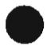

Fault conditions are to be applied only one at a time and shall be applied in turn in any convenient order. Multiple simultaneous faults shall not be applied, but a subsequent fault may arise as a consequence from an applied fault. Separate samples of the EUT may be used for each separate fault test applied, or the same sample may be used for many tests if damage from previous fault tests has been repaired or will not affect the results of further tests.

## 4.4.2.2 Duration of tests

The equipment shall be operated until further change as a result of the applied fault is unlikely, as determined by (for example) opening of a device that removes the influence of the fault, stabilization of temperatures, etc.

If a non-resettable, manual, or automatically resetting protective device or circuit operates in such a way as to interrupt or mitigate the fault condition, the test duration is as follows:

\- automatic reset devices or circuits: allow the protection to cycle on and off until no further change as a result of the applied fault is likely, until the ultimate result is obtained, or until temperatures stabilize

\- manual reset devices or circuits: three cycles, with the device or circuit reset as soon as possible after tripping

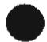

\- non-resettable devices or circuits: one cycle

## 4.4.3 Compliance after application of fault conditions

## 4.4.3.1 Protection against shock hazard

Compliance with requirements for protection against electric shock is checked after the application of single faults as follows:

a) by making the measurements of 7.3.6.3.3 to check that no ACCESSIBLE conductive parts have become shock-hazardous; and

b) by performing a dielectric strength test as per 7.5.2 (without humidity preconditioning) in the following cases:

i) on Reinforced or Double Insulation, using the test level for Basic insulation, and

ii) on Basic insulation in Protective Class I equipment, using the test level for Basic insulation, unless it can be determined that the fault did not result in any damage to the protective earthing conductor or terminal, or to protective bonding means; and

c) by inspection of the enclosure to ensure that no damage has resulted that allows access to parts that are HAZARDOUS LIVE or are a mechanical hazard.

## 4.4.3.2 Protection against the spread of fire

Compliance with requirements for protection against the spread of fire is checked by placing the equipment on white tissue-paper covering a softwood surface and covering the equipment with cheesecloth or surgical cotton during the fault testing. As an alternative, the cheesecloth or surgical cotton may be placed only over the openings of large equipment.

There shall be no emission of molten metal, burning insulation, or flaming or glowing particles from the fire enclosure, and there shall be no charring, glowing, or flaming of the tissue paper, cheesecloth, or glowing or flaming of surgical cotton.

## 4.4.3.3 Protection against other HAZARDS

Conformity with requirements for protection against other HAZARDS after application of the fault tests is checked as specified elsewhere in this standard.

## 4.4.3.4 Protection against parts expulsion hazards

Failure of any component within the PCE shall not release parts outside the PCE enclosure with sufficient energy to lead to a hazard, for example, expulsion of material into an area occupied by personnel.

4.4.4 SINGLE FAULT CONDITIONS to be applied:

## 4.4.4.1 Component fault tests

Circuit analysis shall be performed to identify components (including insulation systems) whose failure would result in a fire or electric shock hazard. The analysis shall include the effect of short-circuit and open-circuit conditions of the component. Based on the analysis, faults shall be applied to relevant components in a manner that simulates the manner in which faults would occur in use. Components need only be faulted in a single mode (short-circuit or open-circuit), unless they do not have a predominant mode of failure.

The following faults are simulated:

a) Short circuit or open circuit of relevant components

b) Short circuit or open circuit of any components or insulation where failure could adversely affect SUPPLEMENTARY INSULATION or REINFORCED INSULATION.

c) In addition, where required by Method 2 of 9.1.1, components that could result in a fire hazard are to be overloaded unless they comply with the requirements of 9.1.3

NOTE 1 An overload condition is any condition between NORMAL LOAD and maximum current condition up to short circuit.

NOTE 2 The component fault testing does not need to include components for which equivalent testing is accomplished during other fault tests, such as output short-circuit tests

## 4.4.4.2 Equipment or parts for short-term or intermittent operation

Components such as motors, relays, other electromagnetic devices and heaters, which are normally operated only intermittently, shall be operated continuously if continuous operation could occur in a SINGLE FAULT CONDITION.

## 4.4.4.3 Motors

Motors shall be stopped while fully energized or prevented from starting, whichever is less favorable.

## 4.4.4.4 Transformer short circuit tests

The output windings of transformers shall be short-circuited one at a time. A transformer damaged during one test may be repaired or replaced before the next test.

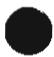

## 4.4.4.5 Output short circuit

Each output of the PCE, and each section of a tapped output, shall be tested one at a time, to simulate short circuits in the load. Overcurrent protection devices as provided in the PCE or as specified in the installation instructions, shall be fitted during the test. All other outputs are loaded or not loaded, whichever load condition of NORMAL USE is less favorable.

In addition to the requirements of 4.4.3, the short-circuit currents are to be recorded and if they exceed the max. rated current of the circuit, the maximum measured current must be provided in the installation manual for the purpose of coordination of overcurrent protection of the external circuit conductors (see 5.3.2).

## 4.4.4.6 Backfeed current test for equipment with more than one source of supply

For equipment intended to be connected simultaneously to more than one source of supply, each input of the PCE shall be tested one at a time, to determine if hazardous conditions can result from current from one source of supply flowing into the input wiring for another source under fault conditions.

With the PCE operating under normal conditions, a short circuit shall be applied at the input terminals of the input circuit under consideration, with all intended other sources connected to the PCE through the overcurrent protective devices (if any) intended to be present in the installation. The short circuit is to be applied using a shorting means connected to the input terminals with a short length of the type and size of conductor that will normally be used to connect to that input. The shorting means shall be of adequate current-carrying capacity and low enough impedance (relative to the conductors) to not significantly affect the test results.

In addition to the requirements of 4.4.3, the short-circuit currents are to be recorded and if they exceed the max. rated current of the circuit, the maximum measured current shall be provided in the installation manual for the purpose of coordination of overcurrent protection of the external circuit conductors (see 5.3.2).

## 4.4.4.7 Output overload

Each output of the PCE, and each section of a tapped output, shall be overloaded in turn, one at a time. The other windings are loaded or not loaded, whichever load condition of NORMAL USE is less favorable. Overloading is carried out by connecting a variable resistor across the winding.

The resistor is adjusted as quickly as possible and readjusted, if necessary, after 1 min to maintain the applicable overload. No further readjustments are then permitted.

If overcurrent protection is provided by a current-sensitive device or circuit, the overload test current is the maximum current which the overcurrent protection device is just capable of passing for 1 h. If this value cannot be derived from the specification, it is to be established by test. Before the test, the device is made inoperative or replaced by a link with negligible impedance.

For equipment in which the output voltage is designed to collapse when a specified overload current is reached, the overload is slowly increased to the point of maximum output power before the point which causes the output voltage to collapse.

In all other cases, the loading is the maximum power output obtainable from the output.

## 4.4.4.8 Cooling system failure

Equipment cooling shall be faulted as follows, one fault at a time:

a) air-intakes shall be blocked or partially blocked;

b) cooling fans shall be stopped or disconnected, one at a time;

c) cooling by circulation of water or other coolant shall be stopped or partially restricted.

## 4.4.4.9 Heating devices

In equipment incorporating heating devices, the following faults shall be applied one at a time:

a) timers which limit the heating period shall be overridden to energize the heating circuit continuously;

b) temperature control devices or circuits shall have SINGLE FAULT CONDITIONS applied such that control over the heater is lost. Over-temperature protection devices meeting the requirements of 14.3 are left operational during the test.

## 4.4.4.10 Safety interlock systems

Each part of an interlock system for the protection of OPERATORS shall be short-circuited or open-circuited in turn to determine if the system continues to prevent access to HAZARDS when a cover, etc. can be removed without the use of a TOOL.

## 4.4.4.11 Reverse d.c. connections

Unless the means of connection prevents reversal, external d.c. connections shall be connected with reverse polarity.

## 4.4.4.12 Voltage selector mismatch

Equipment employing a voltage selector intended to be adjusted or set to match the supply voltage, is to have its voltage selector set in any position with the equipment connected to any of its RATED supply circuits.

## 4.4.4.13 Mis-wiring with incorrect phase sequence or polarity

If connection to the a.c. supply with incorrect phase sequence or incorrect polarity of an earthed single-phase supply could result in a hazard, a mis-wiring test shall be applied.

## 4.4.4.14 PWB short-circuit test

Where permitted by 7.3.7.7, functional insulation on PWBs, provided by spacings that are less than those specified in Table 7-7 and Table 7-8 (see 7.3.7.7) shall be type tested as described below.

Each location of decreased spacings shall be short-circuited one at a time, and the short-circuit shall be maintained until no further damage occurs. Overcurrent protection integral to the PCE, or required to be used with the PCE, is allowed to open. During and after each test, the PCE shall comply with the requirements of 4.4.3.

## 4.5 Humidity preconditioning

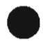

## 4.5.1 General

Where required by other clauses of this standard as a pre-condition for another test, the EUT shall be subjected to the following humidity conditioning.

## 4.5.2 Conditions

The equipment is not operated during preconditioning. Electrical components, covers, and other parts, which can be removed by hand, are removed and subjected to the humidity preconditioning together with the main part.

Preconditioning is carried out in a humidity chamber containing air with a humidity of 92,5 % RH ± 2,5 % RH. The temperature of the air in the chamber is maintained at 40 °C ± 2 °C. Before applying humidity, the equipment is brought to a temperature of 42 °C ± 2 °C, normally by keeping it at this temperature for at least 4 h before the humidity preconditioning. The air in the chamber is stirred and the chamber is designed so that condensation will not precipitate on the equipment.

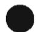

The equipment remains in the chamber for 48 h, after which it is removed and allowed a recovery period of 2 h under the environmental conditions of 4.2.2.1, with the covers of non-ventilated equipment removed, before application of the test for which the pre-conditioning was required.

## 4.6 Voltage Backfeed Protection

Under normal and single-fault conditions, hazardous voltage or energy shall not be present on the terminals of each source, with that source de-energized or disconnected. Disconnection or de-energizing of the source under test is considered a normal condition, not an applied fault.

The PCE is operated with all sources connected and energized that are intended to be present under normal operation.

Internal sources (for example internal batteries) that cannot be disconnected or de-energized without access to the inside of the PCE requiring use of a tool are not required to be tested.

A semiconductor device connected between separate sources is to be short circuited, and that short is not considered to be a fault. Additional single faults are to be applied.

## 4.6.1 Backfeed tests under normal conditions

Each input source shall be tested separately by first disconnecting the source and then by de-energizing the source (if possible).

NOTE De-energizing is intended to simulate conditions where the source provides no voltage or current, but the supply equipment and other loads on that circuit remain connected, which may result in a low impedance presented to the PCE as opposed to the high impedance presented when the source is disconnected. Examples of de-energized sources include a PV array not exposed to light, and a mains outage.

## 4.6.2 Backfeed tests under single-fault conditions

The tests in 4.6.1 are repeated for each single fault condition under consideration. Faults to be applied are selected based on analysis of schematics of the circuitry with particular attention to devices that control or transfer energy between different sources.

## 4.6.3 Compliance with backfeed tests

The PCE is compliant with the requirements if during the tests in 4.6.1 and 4.6.2 no hazardous voltage or energy is present on the PCE terminals for the source under test. Measurements are taken 15 s or 1 s after the source is de-energized or disconnected, as follows:

\- 15 s for sources that are connected by fixed wiring

\- 1 s for sources that are cord-connected or use connectors that can be opened without the use of a tool

## 4.7 Electrical Ratings Tests

## 4.7.1 Input Ratings

While operating under the reference test conditions of 4.2.2, the measured continuous input current or power, as applicable, shall not exceed the marked input ratings by more than 10%.

## 4.7.2 Output Ratings

While operating under the reference test conditions of 4.2.2, each output port of the PCE shall be capable of providing its marked output power or current ratings, as applicable, without overcurrent protective devices operating and without shutdown due to operation of overtemperature protection systems. The measured continuous output current or power, as applicable, shall not exceed the marked output ratings by more than 10%.

## 5 Marking and documentation

## 5.1 Marking

## 5.1.1 General

Equipment shall bear markings as specified in 5.1 and 5.2.

Except for marking of internal parts, these markings shall be visible from the exterior after installation, or be visible after removing a cover or opening a door without the aid of a TOOL, if the cover or door is intended to be removed or opened by an OPERATOR. Markings applying to the equipment as a whole shall not be put on parts, which can be removed by an OPERATOR without the use of a TOOL.

For rack- or panel-mounted equipment, markings are permitted to be on a surface that becomes visible after removal of the equipment from the rack or panel.

Graphic symbols may be used and shall be in accordance with Table D-1 or IEC 60417 as applicable. Graphic symbols shall be explained in the documentation provided with the PCE.

Conformity is checked by inspection.

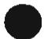

## 5.1.2 Durability of markings

Markings required by this clause to be located on the PCE shall remain clear and legible under conditions of NORMAL USE and resist the effects of cleaning agents specified by the manufacturer.

Conformity is checked by inspection and by performing the following test for durability of markings on the outside of the equipment. The markings are rubbed quickly by hand, without undue pressure, for 30 s with a cloth soaked with the specified cleaning agent (or, if not specified, with isopropyl alcohol). The markings shall be clearly legible after the above treatment, and adhesive labels shall not have worked loose or become curled at the edges.

## 5.1.3 Identification

The equipment shall, as a minimum, be permanently marked with:

a) the name or trade mark of the manufacturer or supplier;

b) a model number, name or other means to identify the equipment,

c) a serial number, code or other marking allowing identification of manufacturing location and the manufacturing batch or date within a three month time period.

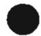

Conformity is checked by inspection.

## 5.1.4 Equipment ratings

Unless otherwise specified in another part of IEC 62109, the following ratings, as applicable, shall be marked on the equipment:

\- input voltage, type of voltage (a.c. or d.c.), frequency, and max. continuous current for each input

\- output voltage, type of voltage (a.c. or d.c.), frequency, max. continuous current, and for a.c. outputs, either the power or power factor

\- Protective class (I, II, or III)

\- Overvoltage Category

\- the environmental information required in section 6

Conformity is checked by inspection.

## 5.1.5 Fuse identification

Marking shall be located adjacent to each fuse or fuseholder, or on the fuseholder, or in another location provided that it is obvious to which fuse the marking applies, giving the fuse current rating and, where fuses of different voltage rating value could be fitted, the fuse voltage rating.

Where fuses with special fusing characteristics such as time delay or breaking capacity are necessary, the type shall also be indicated.

For fuses not located in OPERATOR ACCESS AREAS and for soldered-in fuses located in OPERATOR ACCESS AREAS, it is permitted to provide an unambiguous cross-reference (for example, F1, F2, etc.) to the servicing instructions which shall contain the relevant information.

Conformity is checked by inspection.

## 5.1.6 Terminals, Connections, and Controls

If necessary for safety, an indication shall be given of the purpose of TERMINALS, connectors, controls, and indicators, and their various positions, including any connections for coolant fluids such as water and drainage. The symbols in Table D-1 may be used, and where there is insufficient space, symbol 9 of Table D-1 may be used.

NOTE Individual pins of multi-pin signal, control, and communication connectors need not be marked, but the overall purpose of the connector must be marked. Unless the connector is used for a standard purpose (e.g. RS 232) the instructions provided shall include an explanation of the pin-out.

Push-buttons and actuators of emergency stop devices, and indicator lamps used only to indicate a warning of danger or the need for urgent action, shall be coloured red.

A multiple-voltage unit shall be marked to indicate the particular voltage for which it is set when shipped from the factory. The marking is allowed to be in the form of a paper tag or any other nonpermanent material.

A unit with d.c. terminals shall be plainly marked indicating the polarity of the connections, with:

\- the signs "+" for positive and "-" for negative; or

\- a pictorial representation illustrating the proper polarity where the correct polarity can be unambiguously determined from the representation

Conformity is checked by inspection.

## 5.1.6.1 Protective Conductor Terminals

The means of connection for the protective earthing conductor shall be marked with:

\- symbol 7 of Table D-1; or

\- the letters "PE"; or

\- the colour coding green-yellow.

Conformity is checked by inspection.

## 5.1.7 Switches and circuit-breakers

The on and off-positions of switches and circuit breakers shall be clearly marked. If a push-button switch is used as the power switch, symbols 10 and 16 of Table D-1 may be used to indicate the on-position, or symbols 11 and 17 to indicate the off-position, with the pair of symbols (10 and 16, or 11 and 17) close together.

Conformity is checked by inspection.

## 5.1.8 Class II Equipment

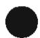

Equipment using Class II protective means throughout shall be marked with symbol 12 of Table D-1. Equipment which is only partially protected by DOUBLE INSULATION or REINFORCED INSULATION shall not bear symbol 12 of Table D-1.

Where such equipment has provision for the connection of an earthing conductor for functional reasons (see 7.3.6.4) it shall be marked with symbol 6 of Table D-1.

Conformity is checked by inspection.

## 5.1.9 Terminal boxes for External Connections

Where required by note 1 of Table 4-2 as a result of high temperatures of terminals or parts in the wiring compartment, there shall be a marking, visible beside the terminal before connection, of either:

a) the minimum temperature RATING and size of the cable to be connected to the TERMINALS; or

b) a marking to warn the installer to consult the installation instructions. Symbol 9 of Table D-1 is an acceptable marking.

Conformity is checked by visual inspection and by the temperature measurements of 4.3.

## 5.2 Warning markings

## 5.2.1 Visibility and legibility requirements for warning markings

Warning markings shall be visible when the equipment is installed and ready for NORMAL USE. If a warning applies to a particular part of the equipment, the marking shall be placed on, or near to, this part.

Warning markings shall be legible, and shall have minimum dimensions as follows:

\- Printed symbols shall be at least 2,75 mm high

\- Printed text characters shall be at least 1,5 mm high and shall contrast in colour with the background

\- Symbols or text that are moulded, stamped or engraved in a material shall have a character height of at least 2,0 mm, and if not contrasting in colour from the background, shall have a depth or raised height of at least 0,5 mm.

If it is necessary to refer to the instruction manual to preserve the protection afforded by the equipment, the equipment shall be marked with symbol 9 of Table D-1.

Symbol 9 of Table D-1 is not required to be used adjacent to symbols that are explained in the manual.

Conformity is checked by inspection.

## 5.2.2 Content for warning markings

## 5.2.2.1 Ungrounded heatsinks and similar parts

An ungrounded heat sink or other part that may be mistaken for a grounded part and involves a risk of electric shock in accordance with 7.3 shall be marked with symbol 13 of Table D-1, or equivalent.

Conformity is checked inspection.

## 5.2.2.2 Hot Surfaces

A part of the PCE that exceeds the temperature limits specified in 4.3.2 shall be marked with symbol 14 of Table D-1 or equivalent.

Conformity is checked by inspection and by measurements in accordance with 4.3.

## 5.2.2.3 Coolant

A unit containing coolant that exceeds 70 °C shall be legibly marked externally where readily visible after installation with symbol 15 of Table D-1. The documentation shall provide a warning regarding the risk of burns from hot coolant, and either:

a) a statement that coolant system servicing is to be done only by SERVICE PERSONNEL, or

b) instructions for safe venting, draining, or otherwise working on the cooling system, if these operations can be performed without OPERATOR access to HAZARDS internal to the equipment

Conformity is checked by inspection and by measurements in accordance with 4.3.

## 5.2.2.4 Stored energy

Where required by 7.3.9.2 or 7.4.2 the PCE shall be marked with Symbol 21 of Table D-1 and the time to discharge capacitors to safe voltage and energy levels shall accompany the symbol.

Conformity is checked by inspection.

## 5.2.2.5 Motor guarding

Where required by 8.2 a marking shall be provided where it is visible to service personnel before removal of a guard, warning of the hazard and giving instructions for safe servicing (for example disconnection of the source before removing the guard).

Conformity is checked by inspection.

## 5.2.3 Sonic hazard markings and instructions

If required by 10.2.1 a PCE shall:

a) be marked to warn the OPERATOR of the sonic pressure hazard; or

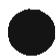

b) be provided with installation instructions that specify how the installer can ensure that the sound pressure level from equipment, at its point of use after installation, will not reach a value, which could cause a HAZARD. These instructions shall identify readily available and practicable protective materials or measures, which may be used, including the fitting of noise-reducing baffles or hoods.

Conformity is checked by inspection and by measurements in accordance with clause 10.

## 5.2.4 Equipment with multiple sources of supply

A PCE with connections for multiple energy sources shall be marked with symbol 13 of Table D-1 and the following or the equivalent:

"More than one source of supply. Disconnect all sources before servicing $^{7}$ "

The marking shall be located on the outside of the unit or shall be prominently visible behind any cover giving access to hazardous parts.

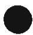

## 5.2.5 Excessive touch current

Where required by 7.3.6.3.6 the PCE shall be marked with symbol 15 of Table D-1. See also 5.3.2 for information to be provided in the installation manual.

## 5.3 Documentation

## 5.3.1 General

The documentation provided with the PCE shall provide the information needed for the safe operation, installation, and (where applicable) maintenance of the equipment. The documentation shall include the items required in 5.3.2 through 5.3.4, and the following:

a) explanations of equipment markings, including symbols used

b) location and function of terminals and controls

c) all ratings or specifications that are necessary to safely install and operate the PCE, including the following environmental ratings along with an explanation of their meaning and any resulting installation requirements:

\- ENVIRONMENTAL CATEGORY as per 6.1

\- WET LOCATIONS classification as per 6.1

\- POLLUTION DEGREE classification for the intended external environment as per 6.2

\- INGRESS PROTECTION rating as per 6.3

\- Ambient temperature and relative humidity ratings

\- OVERVOLTAGE CATEGORY assigned to each input and output port as per 7.3.7.1.2

d) a warning that when the photovoltaic array is exposed to light, it supplies a d.c. voltage to the PCE

## 5.3.1.1 Language

Instructions related to safety shall be in a language that is acceptable in the country where the equipment is to be installed.

## 5.3.1.2 Format

The documentation must be provided in printed form and is to be delivered with the equipment.

NOTE An electronic format copy of the documentation may accompany the printed format, but may not replace it. Conformity is checked by inspection.

## 5.3.2 Information related to installation

The documentation shall include installation and where applicable, specific commissioning instructions and, if necessary for safety, warnings against HAZARDS which could arise during installation or commissioning of the equipment. The information provided shall include:

a) assembly, location, and mounting requirements:

b) ratings and means of connection to each source of supply and any requirements related to wiring and external controls, colour coding of leads, disconnection means, or overcurrent protection needed, including instructions that the installation position shall not prevent access to the disconnection means;

c) ratings and means of connection of any outputs from the PCE, and any requirements related to wiring and external controls, colour coding of leads, or overcurrent protection needed;

d) ventilation requirements;

e) requirements for special services, for example cooling liquid;

f) instructions and information relating to sound pressure level if required by 10.2.1;

g) where required by 14.8.1.3, instructions for the adequate ventilation of the room or location in which PCE containing vented or valve-regulated batteries is located, to prevent the accumulation of hazardous gases;

h) tightening torque to be applied to wiring terminals;

i) values of backfeed short-circuit currents available from the PCE on input and output conductors under fault conditions, if those currents exceed the max. rated current of the circuit, as per 4.4.4.6;

j) for each input to the PCE, the max value of short-circuit current available from the source, for which the PCE is designed; and

NOTE This input short-circuit current rating applies to ports such as the MAINS, PV input, and battery circuits, it is not intended for low power signal, control, or communications circuits.

k) compatibility with RCD and RCM;

I) instructions for protective earthing, including the information required by 7.3.6.3.6 if applicable:

Where required by 7.3.8, the installation instructions shall include the following or equivalent wording:

"This product can cause a d.c. current in the external protective earthing conductor. Where a residual current-operated protective (RCD) or monitoring (RCM) device is used for protection in case of direct or indirect contact, only an RCD or RCM of Type B is allowed on the supply side of this product."

Conformity is checked by inspection.

## 5.3.3 Information related to operation

Instructions for use shall include any operating instructions necessary to ensure safe operation, including the following, as applicable:

\- instructions for adjustment of controls including the effects of adjustment;

\- instructions for interconnection to accessories and other equipment, including indication of suitable accessories, detachable parts and any special materials;

\- warnings regarding the risk of burns from surfaces permitted to exceed the temperature limits of 4.3.2. and required operator actions to reduce the risk; and

\- instructions that if the equipment is used in a manner not specified by the manufacturer, the protection provided by the equipment may be impaired.

Conformity is checked by inspection.

## 5.3.4 Information related to maintenance

Maintenance instructions shall include the following:

\- Intervals and instructions for any preventive maintenance that is required to maintain safety (for example air filter replacement or periodic re-tightening of terminals);

\- instructions for accessing OPERATOR ACCESS AREAS, if any are present, including a warning not to enter other areas of the equipment;

\- part numbers and instructions for obtaining any required operator replaceable parts;

\- instructions for safe cleaning (if recommended);

\- where there is more than one source of supply energizing the PCE, information shall be provided in the manual to indicate which disconnect device or devices are required to be operated in order to completely isolate the equipment; and

\- where required by 7.3.9.2, information regarding the location(s) and safe discharge times for capacitor(s).

## 5.3.4.1 Battery maintenance

Where required by 14.8.5, the applicable items from the following list of instructions regarding maintenance of batteries:

NOTE the exact wording below does not have to be used as long as the intended information is provided.

\- Servicing of batteries should be performed or supervised by personnel knowledgeable about batteries and the required precautions.

\- When replacing batteries, replace with the same type and number of batteries or battery packs.

\- general instructions regarding removal and installation of batteries.

\- CAUTION: Do not dispose of batteries in a fire. The batteries may explode.

\- CAUTION: Do not open or mutilate batteries. Released electrolyte is harmful to the skin and eyes. It may be toxic.

\- CAUTION: A battery can present a risk of electrical shock and high short-circuit current. The following precautions should be observed when working on batteries:

a) Remove watches, rings, or other metal objects.

b) Use tools with insulated handles.

c) Wear rubber gloves and boots.

d) Do not lay tools or metal parts on top of batteries.

e) Disconnect charging source prior to connecting or disconnecting battery terminals.

f) Determine if battery is inadvertently grounded. If inadvertently grounded, remove source from ground. Contact with any part of a grounded battery can result in electrical shock. The likelihood of such shock can be reduced if such grounds are removed during installation and maintenance (applicable to equipment and remote battery supplies not having a grounded supply circuit).

## 6 Environmental requirements and conditions

The manufacturer shall rate the PCE for the following environmental conditions:

\- ENVIRONMENTAL CATEGORY, as in 6.1 below

\- Suitability for WET LOCATIONS or not

\- POLLUTION DEGREE rating, as in 6.2 below

\- INGRESS PROTECTION (IP) rating, as in 6.3 below

\- Ultraviolet (UV) exposure rating, as in 6.4 below

\- Ambient temperature and relative humidity ratings, as in 6.5 below

The documentation provided with the PCE shall include these ratings as per 5.3.1.

These parameters are subject to minimum requirements, test, and examination, as given in the following clauses and in Table 6-1

## 6.1 Environmental categories and minimum environmental conditions

The PCE environmental categories are defined as follows:

NOTE The term ENVIRONMENTAL CATEGORY replaces the term "SERVICE USE" used in IEC 62093 to avoid confusion between service and maintenance.

## 6.1.1 OUTDOOR

The PCE is fully or partly exposed to direct rain, sun, wind, dust, fungus, ice, condensation, radiation to the cold night sky, etc., and to the full range of outdoor temperature and humidity. Wet location requirements apply.

## 6.1.2 INDOOR, unconditioned

The PCE is fully covered by a building or enclosure to protect it from direct rain, sun, wind-blown dust, fungus, and radiation to the cold night sky, etc, but the building or enclosure is not conditioned in terms of temperature, humidity or air filtration, and the equipment may experience condensation. If the PCE is not rated for and evaluated for WET LOCATION use, then the installation instructions must specify that the installation location must be dry, except for condensation.

## 6.1.3 INDOOR, conditioned

The PCE is fully covered by a building or enclosure to fully protect it from rain, sun, wind-blown dust, fungus, and radiation to the cold night sky, etc, and the building or enclosure is generally conditioned in terms of temperature, humidity and air filtration. Condensation is not expected. If the PCE is not rated for and evaluated for WET LOCATION use, then the installation instructions must specify that the installation location must be dry, including no expected condensation.

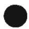

Table 6-1 ENVIRONMENTAL CATEGORIES, environmental conditions, and test requirements

<table><tr><td rowspan="2">Rating</td><td colspan="3">Minimum environmental conditionsPer the manufacturer&#x27;s specifications, subject to the following minimum  $requirements^4$ </td></tr><tr><td>OUTDOOR</td><td>INDOOR, UNCONDITIONED</td><td>INDOOR, CONDITIONED</td></tr><tr><td> $POLLUTION DEGREE^1$ </td><td>Min. PD3</td><td>Min. PD3</td><td>Min. PD2</td></tr><tr><td>WET LOCATION</td><td>yes</td><td>no</td><td>no</td></tr><tr><td> $INGRESS PROTECTION^2$ </td><td> $Min. IP34^3$ </td><td>Min. IP20</td><td>Min. IP20</td></tr><tr><td>Ambient Service Temperature Range</td><td>-20 °C to +55 °C(Class 4K4H)</td><td>-5 °C to +45 °C(Class 3K5)</td><td>+0 °C to +40 °C(Class 3K3)</td></tr><tr><td>Relative Humidity Range</td><td>4% to 100%(Non condensing)(Class 4K4H)</td><td>5% to 95%(Non condensing)(Class 3K5)</td><td>5% to 85%(Non condensing)(Class 3K3)</td></tr><tr><td>UV Exposure</td><td>Required</td><td>Not required</td><td>Not required</td></tr><tr><td colspan="4"> $^1$ This is the POLLUTION DEGREE of the external environment. See also 6.2 regarding reduction of POLLUTION DEGREE in specific areas internal to the equipment. $^2$ These requirements are in addition to the requirements of other clauses of this standard which may be more stringent, concerning access to live parts and mechanical hazards, and containment of fire hazards $^3$ Attention is brought to the fact that this IP34 requirement is not as stringent as the IP44 requirement in IEC 62093 for environmental qualification of PV components $^4$ This table defines the PCE safe environmental operating range and is not intended to specify operational performance.</td></tr></table>

## 6.2 Pollution degree

The manufacturer's stated POLLUTION DEGREE rating shall be used when determining the required CREEPAGE and CLEARANCE distances in 7.3.7. The stated POLLUTION DEGREE rating shall comply with above and with the definitions in 3.70 - 3.73.

NOTE POLLUTION DEGREE 4 is not covered by this standard. PCE intended for use in POLLUTION DEGREE 4 environments must be provided with means to reduce the micro-environment to POLLUTION DEGREE 1, 2, or 3.

The POLLUTION DEGREE is increased within certain areas of the equipment where the equipment itself may generate contamination or moisture (for example condensation caused by a cooling system, or conductive contamination from motor brushes).

The POLLUTION DEGREE may be reduced within certain areas of the equipment by the use of encapsulation, conformal coating, etc., as in Table 6-2 and clause 7. Reduction of POLLUTION DEGREE within the overall equipment may also be achieved, by the use of enclosures providing protection as in Table 6-2.

Table 6-2 – Reduction of the pollution degree of internal environment through the use of additional protection

<table><tr><td>Additional protection</td><td>From POLLUTION DEGREE 2 of external environment to:</td><td>From POLLUTION DEGREE 3 of external environment to:</td><td>Area to which the reduced pollution degree applies</td></tr><tr><td>ENCLOSURE IP5X dust test of IEC 60529 and no internally generated contamination</td><td>1</td><td>2</td><td>entire inside of the enclosure or that portion which meets IP5X</td></tr><tr><td>ENCLOSURE IPX7 or IPX8 of IEC 60529</td><td>2</td><td>2</td><td>entire inside of the enclosure or that portion which meets IPX7 or IPX8</td></tr><tr><td>Conformal coating or encapsulation by potting or molding as per clause 7</td><td>1</td><td>1</td><td>area under the coating or encapsulation</td></tr><tr><td>Hermetically sealed ENCLOSURE with measures taken to exclude pollution before sealing, and no internally generated contamination</td><td>1</td><td>1</td><td>entire inside of the enclosure</td></tr></table>

## 6.3 Ingress Protection

The manufacturer's stated INGRESS PROTECTION rating shall comply with Table 6-1 and shall be verified in accordance with IEC 60529.

These requirements are in addition to the requirements of other clauses of this standard concerning access to live parts, fire hazards and mechanical hazards.

Compliance is checked by testing in accordance with IEC 60529.

Protection against ingress of water is verified by the applicable tests in IEC 60529, followed by visual inspection, the voltage test of 7.5.2, and the touch current test of 7.5.5 if required by 7.3.6.3.6.

## 6.4 UV exposure

External plastic parts of equipment for OUTDOOR service shall not be degraded by exposure to UV light to the extent that protection against hazards is reduced below levels given in 13.6.4. If required by Table 6-1, the polymeric material shall have been evaluated for ultraviolet (UV) radiation resistance as determined in accordance with 13.6.4. If degradation of the parts could not affect the protection provided, this requirement is waived.

## 6.5 Temperature and humidity

The manufacturer's stated ranges of ambient temperature and relative humidity are used elsewhere in this standard to determine preconditioning and test parameters.

## 7 Protection against electric shock and energy hazards

## 7.1 General

This clause 7 defines the minimum requirements for the design and construction of PCE for protection against shock and energy hazards during installation, operation, and maintenance, under normal and single fault conditions, for the expected lifetime of the PCE. Consideration is also given to minimizing hazards resulting from reasonably foreseeable misuse.

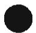

## 7.2 Fault conditions

Protection against electric shock and energy hazards shall be maintained under normal and single fault conditions as tested in 4.4.4.

## 7.3 Protection against electric shock

## 7.3.1 General

Each circuit under evaluation shall be compliant with Figure 7-1, which presents a summary of possible design solutions with regard to protection against electric shock arising from direct and indirect contact.

The decisive voltage class of each circuit in the PCE, as per section 7.3.2, determines the minimum required level of protection.

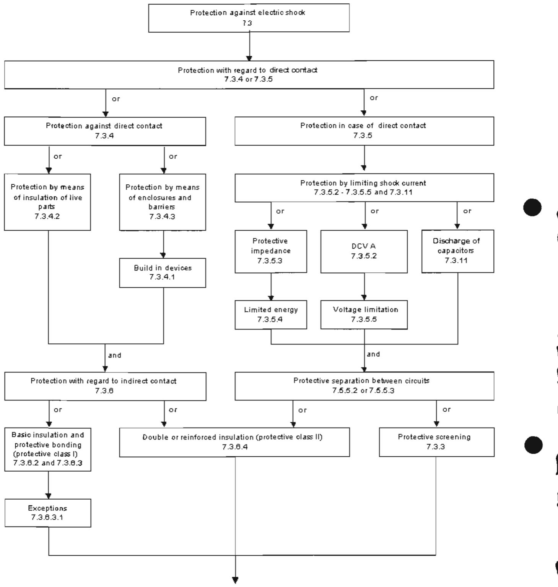  
Figure 7-1 – Functional summary of protective measures against electric shock  
NOTE Different circuits, insulation, and parts of the PCE will use different approaches for protection against shock hazards, and different paths through this flow-chart.

## 7.3.2 Decisive voltage classification

## 7.3.2.1 Use of decisive voltage class (DVC)

Protective measures against electric shock depend on the decisive voltage classification of the circuit, which is determined from Table 7-1 and Table 7-2. The decisive voltage classification for a circuit is the least severe classification for which both of the following are complied with:

\- the working voltage limits of Table 7-1, and

\- all the protective measures of Table 7-2.

The DVC in turn indicates the minimum required level of protection for the circuit.

If the protective measures of Table 7-2 are not met, the decisive voltage classification of a circuit must be raised to a more severe classification even if the working voltage limits of Table 7-1 are met.

If two circuits are connected, or are separated only by Functional Insulation, they are treated as a single circuit (not as “adjacent circuits”) in determining decisive voltage classification and in Table 7-2.

## 7.3.2.2 Limits of DVC

Table 7-1 – Summary of the limits of the decisive voltage classes

<table><tr><td rowspan="2">Decisive Voltage Classification (DVC)</td><td colspan="3">Limits of working voltage V</td></tr><tr><td>a.c. voltage (r.m.s.) $U_{ACL}$ </td><td>a.c. voltage (peak) $U_{ACPL}$ </td><td>d.c. voltage (mean) $U_{DCL}$ </td></tr><tr><td>A</td><td>25(16)</td><td>35,4(22,6)</td><td>60(35)</td></tr><tr><td>B</td><td>50(33)</td><td>71(46,7)</td><td>120(70)</td></tr><tr><td>C</td><td>1 000</td><td> $4\ 500^a$ </td><td>1 500</td></tr><tr><td colspan="4">The table values in parentheses are to be used for PCE or portions of PCEs rated for installation in wet locations as addressed in section 6.1 for Environmental categories and minimum environmental conditions.</td></tr></table>

## 7.3.2.3 Requirements for protection

Table 7-2 shows the requirements for the application of functional and basic insulation or protective separation, dependent on the DVC of the circuit under consideration and of adjacent circuits.

NOTE Examples are shown in Annex K.

Table 7-2 – Protection requirements for considered circuit

<table><tr><td rowspan="2">DVC of considered circuit</td><td rowspan="2">Protection required against direct contact per 7.3.4</td><td rowspan="2">Insulation to earthed parts</td><td rowspan="2">Insulation to adjacent accessible conductive parts that are not earthed</td><td colspan="3">Insulation to adjacent circuit of DVC:</td></tr><tr><td>A</td><td>B</td><td>C</td></tr><tr><td>A</td><td>No</td><td>a</td><td>a</td><td>f</td><td>b</td><td>p ‡</td></tr><tr><td>B</td><td>Yes</td><td>f</td><td>b</td><td></td><td>b*</td><td>p ‡</td></tr><tr><td>C</td><td>Yes</td><td>b</td><td>p</td><td></td><td></td><td>b</td></tr></table>

a insulation is not necessary for safety, but may be required for functional reasons.

f functional insulation for circuit of higher voltage.

b basic insulation for circuit of higher voltage.

p protective separation based on circuit of higher voltage.

\* it is permitted to use FUNCTIONAL INSULATION between two earthed decisive voltage classification B circuits

‡ it is permitted to use basic insulation between the considered circuit and the circuit of higher voltage if protection against direct contact with the considered circuit is provided by basic or supplementary insulation or barriers or enclosures, based on the DVC C requirements for the voltage of the DVC C circuit.

## 7.3.2.4 Circuit evaluation

## 7.3.2.4.1 General

The working voltage used in determining the decisive voltage classification of a given circuit is evaluated by the method set out below. Three cases of waveforms are considered.

## 7.3.2.4.2 AC working voltage (see Figure 7-2)

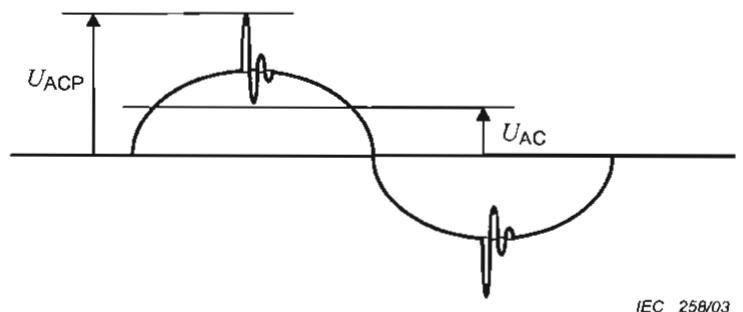  
Figure 7-2 - Typical waveform for a.c. working voltage

The working voltage has an r.m.s. value $U_{AC}$ and a recurring peak value $U_{ACP}$ .

The DVC is that of the lowest voltage row of Table 7-1 for which both of the following conditions are satisfied.

$U_{\mathsf{AC}} \leq U_{\mathsf{ACL}}$

$U_{\mathsf{ACP}} \leq U_{\mathsf{ACPL}}$

## 7.3.2.4.3 DC working voltage (see Figure 7-3)

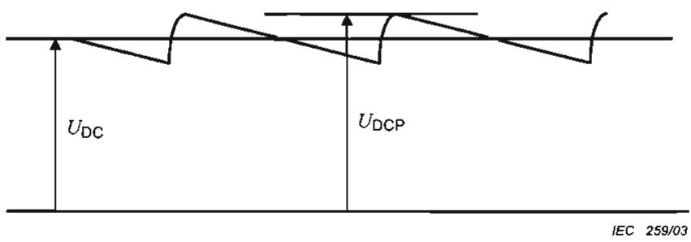  
Figure 7-3 - Typical waveform for d.c. working voltage

The working voltage has a mean value UDC and a recurring peak value UDCP, caused by a ripple voltage of r.m.s. value not greater than 10 % of UDC.

The DVC is that of the lowest voltage row of Table 7-1 for which both of the following conditions are satisfied.

• $U_{DC} \leq U_{DCL}$

• $U_{DCP} \leq 1,17 \times U_{DCL}$

## 7.3.2.4.4 Pulsating working voltage (see Figure 7-4)

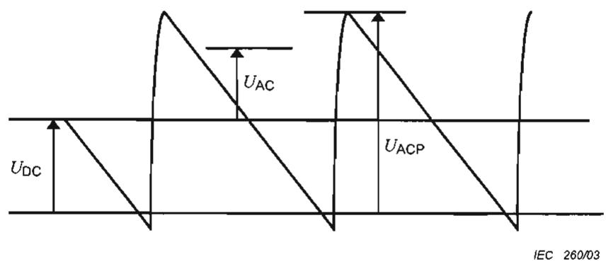  
Figure 7-4 - Typical waveform for pulsating working voltage

The working voltage has a mean value UDC and a recurring peak value UACP, caused by a ripple voltage of r.m.s. value UAC greater than 10 % of UDC.

The DVC is that of the lowest voltage row of Table 7-1 for which both of the following conditions are satisfied.

• $U_{AC}/U_{ACL} + U_{DC}/U_{DCL} \leq 1$

• $U_{ACP}/U_{ACPL} + U_{DC}/(1,17 \times U_{DCL}) \leq 1$

## 7.3.3 Protective separation

Protective separation shall be achieved by:

• double or reinforced insulation,

or

\- protective screening, i.e. by a conductive screen connected to earth by protective bonding in the PCE, or connected to the protective earth conductor itself, whereby the screen is separated from live parts by at least basic insulation,

or

\- protective impedance comprising limitation of current per 7.3.5.3 and of discharged energy per 7.3.5.4

or

• limitation of voltage according to 7.3.5.5.

The protective separation shall be fully and effectively maintained under all conditions of intended use of the PCE.

## 7.3.4 Protection against direct contact

## 7.3.4.1 General

Protection against direct contact is employed to prevent persons from touching live parts that do not meet the requirements of 7.3.5 and shall be provided by one or more of the measures given in 7.3.4.2 (enclosures and barriers) and 7.3.4.3 (insulation).

Open type sub-assemblies and devices do not require protective measures against direct contact but the instructions provided with the equipment must indicate that such measures must be provided in the end equipment or in the installation.

Products intended for installation in CLOSED ELECTRICAL OPERATING AREAS, (see 3.9) need not have protective measures against direct contact, except as required by 7.3.4.2.4.

NOTE Some local regulations require guarding against inadvertent contact with hazardous parts even in CLOSED ELECTRICAL OPERATING AREAS.

## 7.3.4.2 Protection by means of enclosures and barriers

The following requirements apply where protection against contact with live parts is provided by enclosures or barriers, not by insulation in accordance with 7.3.4.3.

## 7.3.4.2.1 General

Parts of enclosures and barriers that provide protection in accordance with these requirements shall not be removable without the use of a tool (see 7.3.4.2.3).

Polymeric materials used to meet these requirements shall also meet the requirements of 13.6.

## 7.3.4.2.2 Access probe criteria

Protection is considered to be achieved when the separation between the test probes and live parts, when tested as described below, is as follows:

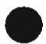

a) decisive voltage classification A, (DVC A) - the probe may touch the live parts

b) decisive voltage classification B, (DVC B) - the probe must not touch bare live parts

c) decisive voltage classification C, (DVC C) - the probe must have adequate clearance to live parts, based on the clearance for Basic insulation using the recurring peak working voltage involved,

NOTE 1 Basic insulation is required rather than Reinforced or Double insulation, because inserting a finger into an opening is not a normal condition (it is considered to be the first fault).

NOTE 2 Figure 7-5 row 4 gives examples of the probe requirements for openings in the enclosure.

## 7.3.4.2.3 Access probe tests

Compliance with 7.3.4.2.1 is checked by all of the following:

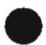

a) Inspection; and

b) Tests with the test finger (Figure E-1) and test pin (Figure E-2) of 0E, the results of which shall comply with the requirements of 7.3.4.2.1 a), b), and c) as applicable. Probe tests are performed on openings in the enclosures after removal of parts that can be detached or opened by an operator without the use of a tool, including fuseholders, and with operator access doors and covers open. It is permitted to leave lamps in place for this test. Connectors that can be separated by an operator without use of a tool, shall also be tested during and after disconnection. Any movable parts are to be put in the most unfavourable position.

The test finger and the test pin are applied as above, without appreciable force, in every possible position, except that floor-standing equipment having a mass exceeding 40 kg is not tilted.

Equipment intended for building-in or rack mounting, or for incorporation in larger equipment, is tested with access to the equipment limited according to the method of mounting detailed in the installation instructions.

c) Openings preventing the entry of the jointed test finger (Figure E-1 of 0E) during test b) above, are further tested by means of a straight unjointed test finger (Figure E-3 of 0E), applied with a force of 30 N. If the unjointed finger enters, the test with the jointed finger is repeated except that the finger is applied using any necessary force up to 30 N.

d) In addition to a) - c) above, top surfaces of enclosures shall be tested with the IP3X probe of IEC 60529. The test probe shall not penetrate the top surface of the enclosure when probed from the vertical direction $\pm 5^{\circ}$ only.

## 7.3.4.2.4 Service access areas

Where the enclosure is required to be opened and the PCE is energized during installation or maintenance, live parts of DVC B or C that may be unintentionally touched when making adjustments shall be protected against contact by the finger probe of Figure E-1 of 0E.

## 7.3.4.3 Protection by means of insulation of live parts

Where the requirements of 7.3.4.2 are not met, live parts shall be provided with insulation if:

\- their working voltage is greater than the maximum limit of decisive voltage class A, or

\- for a DVC A or B circuit, protective separation from adjacent circuits of DVC C is not provided (see note “‡” under Table 7-2).

The insulation shall be rated according to the impulse voltage, temporary overvoltage or working voltage (see 7.3.7.2.1), whichever gives the most severe requirement. It shall not be possible to remove the insulation without the use of a tool. The insulation shall extend as far as necessary to ensure compliance with the probe test of 7.3.4.2.1.

Any conductive part, which is not separated from the live parts by at least basic insulation for DVC C or functional insulation for DVC B, is considered to be a live part. A metallic accessible part is considered to be conductive, if its surface is bare or is covered by an insulating layer which does not comply with the requirements of basic insulation.

As an alternative to solid or liquid insulation, a clearance according to 7.3.7.4, shown by $L_{B}$ and $L_{R}$ in Figure 7-5, may be provided.

The grade of insulation – functional, basic, double or reinforced – depends on:

• the decisive voltage class of the live parts or adjacent circuits, and

\- the connection of conductive parts to earth by protective bonding.

Three cases are considered:

Case a) Accessible parts are conductive and are connected to earth by protective bonding.

\- Basic (for DVC C) or Functional (for DVC B) insulation is required between accessible parts and the live parts. The relevant voltage is that of the live parts (see Figure 7-5, cells 1)a), 2)a), 3)a)).

\- Functional insulation is required between accessible parts and live parts of circuits of decisive voltage class A or B, which are separated by basic insulation from adjacent circuits of decisive voltage class C. The relevant voltage is the highest voltage of the adjacent circuits (see Figure 7-5, cell 3)a).

Cases b) and c) Accessible parts are non-conductive (case b)) or conductive but not connected to earth by protective bonding (case c)). The required insulation is:

\- Double or reinforced (for DVC C) or Basic (for DVC B) insulation between accessible parts and live parts. The relevant voltage is that of the live parts (see Figure 7-5, cells 1) b), 1) c), 2)b), 2)c). For the case of non-conductive accessible parts, the accessible part may form all or part of the required insulation if it meets the requirements for solid insulation in 7.3.7.8.

\- For the situation where adjacent circuits are involved, the requirements are given in Table 7-3 (for examples see Figure 7-5, cells 3)b), 3)c). For the case of non-conductive accessible parts, the accessible part may form all or part of the required insulation if it meets the requirements for solid insulation in 7.3.7.8.

Table 7-3 - Insulation between accessible unearthed parts and DVC A or B circuits adjacent to DVC B or C circuits

<table><tr><td>Considered Circuit (closer to accessible parts)</td><td>Adjacent Circuit</td><td>Insulation between the Considered circuit and the Adjacent circuit</td><td>Insulation between the considered circuit and unearthed accessible parts</td></tr><tr><td rowspan="3">DVC-A</td><td rowspan="2">DVC-C</td><td>Basic</td><td>Supplemental</td></tr><tr><td>Reinforced</td><td>Functional or none</td></tr><tr><td>DVC-B</td><td>Basic</td><td>Functional or none</td></tr><tr><td rowspan="3">DVC-B</td><td rowspan="2">DVC-C</td><td>Basic</td><td>Supplemental</td></tr><tr><td>Reinforced</td><td>Basic</td></tr><tr><td>DVC-B</td><td>Basic</td><td>Basic</td></tr></table>

Examples of insulation configurations for DVC C live parts are given in Figure 7-5, which also includes examples of the requirements for apertures.

<table><tr><td rowspan="2">Type of insulation</td><td colspan="3">Insulation configuration</td></tr><tr><td>aAccessible parts conductive and connected to earth by protective bonding</td><td>bAccessible parts not conductive</td><td>cAccessible parts conductive, but NOT connected to earth by protective bonding</td></tr><tr><td>1) Solid or liquid</td><td>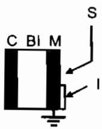</td><td>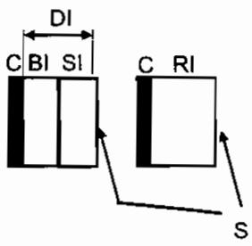</td><td>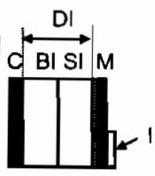 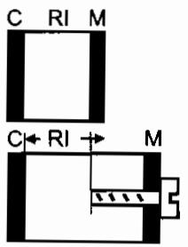</td></tr><tr><td>2) Totally or partially by air clearance</td><td></td><td></td><td> </td></tr><tr><td>3) Insulation for adjacent circuits:Circuit A:DVC-A or -BCircuit C: DVC-CSubscript refers to which circuit insulation is based on</td><td></td><td></td><td></td></tr><tr><td>4) Requirements for apertures in enclosures</td><td></td><td></td><td></td></tr><tr><td>C live part or circuit of DVC-CA adjacent circuit of DVC-A or -BM conductive partBI basic insulationDI double insulation</td><td>LB clearance for basic insulationLR clearance for reinforced insulationI Insulation less than BasicSI supplementary insulation</td><td colspan="2">T test probe per 7.3.4.2.3S Accessible surfaceFI Functional insulationRI reinforced insulation</td></tr><tr><td colspan="4">NOTE 1: In row 4), the insertion of the test finger is considered to represent the first fault.NOTE 2: This figure shows examples only, and is not intended to cover every situation.</td></tr></table>

Figure 7-5 – Examples for protection against direct contact for DVC-C Circuits

## 7.3.5 Protection in case of direct contact

## 7.3.5.1 General

Protection in case of direct contact is required to ensure that contact with live parts does not produce a shock hazard.

The protection against direct contact according to 7.3.4 is not required if the circuit contacted is separated from other circuits according to 7.3.2.3, and:

• is of decisive voltage class A and complies with 7.3.5.2, or

• is current limited via a protective impedance according to 7.3.5.3, or

• is limited in discharge energy according 7.3.5.4, or

• is limited in voltage according to 7.3.5.5.

In addition to the measures as given in 7.3.5.2 to 7.3.5.5, it shall be ensured that in the event of error or polarity reversal of connectors no voltages that exceed DVC A can be connected into a circuit with protective separation. This applies for example to plug-in-sub-assemblies or other plug-in devices which can be plugged-in without the use of a tool (key) or which are accessible without the use of a tool.

Conformity is checked by visual inspection and trial insertion.

## 7.3.5.2 Protection using decisive voltage class A

Circuits of decisive voltage class A do not require protection in case of direct contact.

  
$U_{M1}$ arbitrary, earthed or unearthed;  
$U_{M2}$ : decisive voltage DVC A, earthed or unearthed

Figure 7-6 – Protection by DCV A with protective separation

## 7.3.5.3 Protection by means of protective impedance

The connection of accessible live parts to circuits of decisive voltage class B or C, shall only be made through protective impedances.

The same constructional provisions as those for protective separation shall be applied for the construction and arrangement of a protective impedance. The current value stated below shall not be exceeded in the event of failure of a single component. The stored charge available between simultaneously accessible parts protected by the protective impedance shall not exceed 50 uC.

The protective impedances shall be designed so that the current available through them to earth and between simultaneously accessible parts, measured at the accessible live parts, does not exceed a value of 3.5 mA a.c. or 10 mA d.c.

Compliance is checked by inspection, by analysis of the relevant circuit diagrams, and by testing, using the circuit of IEC 60990, Figure 4.

NOTE 1 For convenience, IEC 60990 test figure 4 is reproduced provided in (informative) 0J.

NOTE 2 Consideration should be given to the impact on the touch current measurement that capacitance between external test sources and earth could have on the result (for example a d.c. supply with capacitors to earth can increase the measured touch current unless the d.c. supply is not earthed to the same earth as the PCE under test).

The protective impedances shall be designed and tested to withstand the impulse voltages and temporary overvoltage for the circuits to which they are connected. See Table 7-6.

  
Figure 7-7 - Protection by means of protective impedance

## 7.3.5.4 Protection by means of limitation of the discharging energy

The discharging energy available between simultaneously accessible parts protected by PROTECTIVE IMPEDANCE shall not exceed the charging voltage and capacitance limits given in Table 7-4, which applies to wet and dry locations. Refer to Figure 7-8.

NOTE For earthed circuits, the charge limitation is applied from accessible parts to earth, and between simultaneously accessible parts.

Figure 7-8 - Protection by limitation of discharge energy

<table><tr><td>Voltage V</td><td>Capacitance μF</td><td>Voltage kV</td><td>Capacitance nF</td></tr><tr><td>70</td><td>42,4</td><td>1</td><td>8,0</td></tr><tr><td>78</td><td>10,0</td><td>2</td><td>4,0</td></tr><tr><td>80</td><td>3,8</td><td>5</td><td>1,6</td></tr><tr><td>90</td><td>1,2</td><td>10</td><td>0,8</td></tr><tr><td>100</td><td>0,58</td><td>20</td><td>0,4</td></tr><tr><td>150</td><td>0,17</td><td>40</td><td>0,2</td></tr><tr><td>200</td><td>0,091</td><td>60</td><td>0,133</td></tr><tr><td>250</td><td>0,061</td><td></td><td></td></tr><tr><td>300</td><td>0,041</td><td></td><td></td></tr><tr><td>400</td><td>0,028</td><td></td><td></td></tr><tr><td>500</td><td>0,018</td><td></td><td></td></tr><tr><td>700</td><td>0,012</td><td></td><td></td></tr></table>

Table 7-4 Values of accessible capacitance and charging voltage (threshold of pain)

Conformity is checked by performing calculations and/or measurements to determine the voltage and capacitance.

## 7.3.5.5 Protection by means of limited voltages

This type of protection uses a voltage division technique from a circuit protected against direct contact, resulting in a voltage to earth not greater than that of decisive voltage class A.

This circuit shall be designed so that, even in the event of failure of a single component in the voltage division circuit, the voltage across the output of the voltage divider will not become greater than that of decisive voltage class A. The same constructional measures as in protective separation shall be employed in this case.

This type of protection shall not be used in case of protective class II or unearthed circuits, because it relies on protective earth being connected.

  
$U_{1}$ : hazardous voltage, earthed. $U_{2}$ : Decisive Voltage DVC A.  
NOTE To provide protection in single-fault conditions, $U_{2} = U_{1}Z_{2}/(2Z_{1} + Z_{2})$ or $U_{2} = U_{1}Z_{2}/2(Z_{1} + Z_{2}/2)$ .  
Figure 7-9 - Protection by means of voltage limitation

## 7.3.6 Protection against indirect contact

## 7.3.6.1 General

Protection against indirect contact is required to prevent shock-hazardous currents being accessible from conductive parts during an insulation failure. This protection shall comply with the requirements for protective class I (basic insulation plus protective earthing), class II (double or reinforced insulation) or class III (limitation of voltages) as defined in 3.72, 3.73, and 3.74 respectively.

That part of a PCE that meets the requirements of 7.3.6.2 and 7.3.6.3 is defined as protective class I.

That part of a PCE that meets the requirements of 7.3.6.4 is defined as protective class II.

That part of a PCE which meets the requirements of decisive voltage class A and in which no hazardous voltages are derived, is defined as protective class III. No shock hazard is present in such circuits.

Where protection against indirect contact is dependent on means provided during installation, the installation instructions shall provide details of the required means and shall indicate the associated hazards.

## 7.3.6.2 Insulation between live parts and accessible conductive parts

Accessible conductive parts of equipment shall be separated from live parts by insulation meeting the requirements of Table 7-2 or by clearances as specified in 7.3.7.4 and creepages as specified in 7.3.7.5.

Conformity is checked measurement of clearances, creepage distances and/or solid insulation.

## 7.3.6.3 Protective class I - Protective bonding

## 7.3.6.3.1 General

Protective bonding shall be provided between accessible conductive parts of equipment and the means of connection for the external protective earthing conductor, except:

a) where accessible conductive parts are protected by one of the measures in 7.3.5.2 to 7.3.5.5, or

b) where accessible conductive parts are separated from live parts of DVC C using double or reinforced insulation or live parts of DVC B by Basic insulation.

Figure 7-10 shows an example PCE and its associated protective bonding.

1 - PCE subassemblies external protective earthing conductor (dimensioned according to PCE subassemblies requirements)

2 - protective bonding

3 - PCE external protective earthing conductor (dimensioned according to PCE requirements)

4 - Earth bar

EE - other electrical equipment

Electrical contact with the means of connection of the external protective earthing conductor shall be achieved by one or more of the following means:

a) through direct metallic contact;

b) through other conductive parts which are not removed when the PCE or sub-units are used as intended;

c) through a dedicated protective bonding conductor;

d) through other metallic components of the PCE.

NOTE When painted surfaces (in particular powder painted surfaces) are joined together, then a separate connection should be made for reliable contact, unless paint is removed or reliably penetrated in the area of contact.

Where electrical equipment is mounted on lids, doors, or cover plates, continuity of the protective bonding shall be ensured. Dedicated bonding conductors, and fastenings, hinges or sliding contacts designed and maintained to have a low resistance are examples of acceptable means.

Metal ducts of flexible or rigid construction and metallic sheaths shall not be used as protective conductors, unless the device or material has been investigated as suitable for protective bonding purposes.

## 7.3.6.3.2 Rating of protective bonding

Protective bonding shall withstand the highest thermal and dynamic stresses that can occur to the PCE item(s) concerned when they are subjected to a fault connecting live parts to accessible conductive parts.

The protective bonding shall remain effective for as long as a fault to the accessible conductive parts persists or until an upstream protective device removes power from the part.

NOTE In cases where the protective bonding is routed through conductors of low cross-section (for example, PWB tracks), particular care should be taken to ensure that no undetected damage to the bonding circuit can occur in the event of a fault.

These conditions will be satisfied if the cross-section of the protective bonding conductor is the same as that for the external protective earthing conductor according to 7.3.6.3.4. Alternatively, protective bonding may be designed to meet the impedance requirements of 7.3.6.3.3.

## 7.3.6.3.3 Protective bonding impedance

The impedance of the protective bonding shall be sufficiently low that:

\- during normal operation, no voltage exceeding continuously 5 V a.c. or 12 V d.c. can persist between the accessible conductive parts and the means of connection for the external protective earthing conductor, and

• the bond complies with the impedance test of 7.5.4, and

\- under single-fault conditions (see 4.4), no a.c. or d.c. voltage exceeds the limits given in Figure 7-11 between accessible conductive parts and the means of connection for the external protective earthing conductor, from the time of application of the fault until an upstream protective device removes power from the part. Any external upstream protective device considered for this requirement shall have the characteristics required by the installation manual according to 5.3.2.

  
Legend:
AC-W = AC voltages, wet locations, steady state limit 16Vrms
AC-D = AC voltages, dry locations, steady state limit 25Vrms
DC-W = DC voltages, wet locations, steady state limit 35Vdc
DC-D = DC voltages, dry locations, steady state limit 60Vdc

Figure 7-11 - Voltage limits under fault conditions

## 7.3.6.3.4 External protective earthing conductor

An external protective earthing conductor shall be connected at all times when power is supplied to the PCE, unless the PCE complies with the requirements of protective class II (see 7.3.6.4) or III. Unless local wiring regulations state otherwise, the external protective earthing conductor cross-sectional area shall be determined from Table 7-5 or by calculation according to IEC 60364-5-54.

If the external protective earthing conductor is routed through a plug and socket, or similar means of disconnection, it shall not be possible to disconnect it unless power is simultaneously removed from the part to be protected.

Table 7-5 – External protective earthing conductor cross-section

<table><tr><td>Cross-sectional area of phase conductors of the PCE  $S$  $mm^{2}$ </td><td>Minimum cross-sectional area of the corresponding external protective earthing conductor  $S_{p}$  $mm^{2}$ </td></tr><tr><td> $S \leq 16$ </td><td>S</td></tr><tr><td> $16 < S \leq 35$ </td><td>16</td></tr><tr><td> $35 < S$ </td><td>S/2</td></tr><tr><td colspan="2">The values in this table are valid only if the external protective earthing conductor is made of the same metal as the phase conductors. If this is not so, the cross-sectional area of the external protective earthing conductor is to be determined in a manner which produces a conductance equivalent to that which results from the application of this table.</td></tr></table>

The cross-sectional area of every external protective earthing conductor which does not form part of the supply cable or cable enclosure shall, in any case, be not less than:

• 2,5 mm $^{4}$ if mechanical protection is provided;

\- $4\mathrm{mm}^2$ if mechanical protection is not provided.

For cord-connected equipment, provisions shall be made so that the external protective earthing conductor in the cord shall, in the case of failure of the strain-relief mechanism, be the last conductor to be interrupted.

## 7.3.6.3.5 Means of connection for the external protective earthing conductor

7.3.6.3.5.1 General

Every PCE or PCE element requiring connection to earth by protective bonding shall have a means of connection for the external protective earthing conductor, located near the terminals for the respective live conductors. The means of connection shall be corrosion-resistant and shall be suitable for the connection of cables according to 7.3.6.3.4 and of cables in accordance with the wiring rules applicable at the installation.

The means of connection for the external protective earthing conductor shall not be used as a part of the mechanical assembly of the equipment or for other connections.

A separate means of connection shall be provided for each external protective earthing conductor.

Connection and bonding points shall be so designed that their current-carrying capacity is not impaired by mechanical, chemical, or electrochemical influences. Where enclosures and/or conductors of aluminium or aluminium alloys are used, particular attention should be given to the problems of electrolytic corrosion.

The means of connection for the protective conductor shall be marked in an easily recognizable way, with:

\- symbol 7 of Table D-1; or

-the colour coding green-yellow.

Marking shall not be done on easily changeable parts such as screws.

## 7.3.6.3.6 Touch current in case of failure of the protective earthing conductor

The requirements of this sub-clause shall be satisfied to maintain safety in case of damage to or disconnection of the protective earthing conductor.

For plug-connected single phase PCE, not using an industrial connector according to IEC 60309, the touch current measured in accordance with 7.5.5 using the test network of IEC 60990 test figure 4 shall not exceed 3.5 mA a.c. or 10 mA d.c.

Conformity is checked by measurement according to 7.5.5.

NOTE 1 For convenience, IEC 60990 test figure 4 is reproduced provided in (informative) Annex J.

NOTE 2 Consideration should be given to the impact on the touch current measurement that capacitance between external test sources and earth could have on the result (for example a d.c. supply with capacitors to earth can increase the measured touch current unless the d.c. supply is not earthed to the same earth as the PCE under test).

For all other PCE, one or more of the following measures shall be applied, unless the touch current measured in accordance with 7.5.5 using the test network of IEC 60990 test figure 4 shall not exceed 3.5 mA a.c. or 10 mA d.c.

a) A fixed connection and:

\- a cross-section of the protective earthing conductor of at least 10 mm $^{2}$ Cu or 16 mm $^{2}$ Al; or

\- automatic disconnection of the supply in case of discontinuity of the protective earthing conductor;

or

\- provision of an additional terminal for a second protective earthing conductor of the same cross-sectional area as the original protective earthing conductor and installation instructions requiring a second protective earthing conductor to be installed.

## or

b) Connection with an industrial connector according to IEC 60309 and a minimum protective earthing conductor cross-section of 2,5 mm $^{2}$ as part of a multi-conductor power cable. Adequate strain relief shall be provided.

In addition, the caution symbol 15 of Table D-1 shall be fixed to the product and the installation manual shall provide details of the protective earthing measures required in the installation as required in 5.3.2.

When it is intended and allowed to connect two or more PCEs in parallel using one common PE conductor, the above touch current requirements apply to the maximum number of PCEs to be connected in parallel, unless one of the measures in a) or b) above is used. The maximum number of parallel PCEs is used in the testing and has to be stated in the installation manual.

Compliance is checked testing, using the circuit of IEC 60990, Figure 4.

## 7.3.6.4 Protective Class II - Double or Reinforced Insulation

Equipment or parts of equipment designed for protective class II shall have insulation between live parts and accessible surfaces in accordance with 7.3.4.3. The following requirements also apply:

\- equipment designed to protective class II shall not have means of connection for the external protective earthing conductor. However this does not apply if the external protective earthing conductor is passed through the equipment to equipment series-connected beyond it. In the latter event, the external protective earthing conductor and its means for connection shall be insulated with basic insulation from the accessible surface of the equipment and from circuits that employ protective separation, extra-low voltage, protective impedance and limited discharging energy, according to 7.3.5. This basic insulation shall correspond to the rated voltage of the series-connected equipment;

\- metal-encased equipment of protective class II may have provision on its enclosure for the connection of an equipotential bonding conductor;

\- equipment of protective class II may have provision for the connection of an earthing conductor for functional reasons or for the damping of overvoltages; it shall, however, be insulated as though it is a live part;

• equipment employing protective class II shall be marked according to 5.1.8.

7.3.7 Insulation Including Clearance and Creepage Distances

## 7.3.7.1 General

This subclause gives minimum requirements for insulation, based on the principles of IEC 60664.

Manufacturing tolerances shall be taken into account during measurement of creepage, clearance, and insulation distances in the PCE.

Insulation shall be selected after consideration of the following influences:

\- pollution degree

• overvoltage category

• supply earthing system

• insulation voltage

\- location of insulation

• type of insulation

Conformity of insulation, creepage distances, and clearance distances, shall be verified by measurement or visual inspection, and the tests of 7.5.

See Annex A for measurement examples. Where this verification is impossible to perform, an impulse voltage test (see 7.5.1) shall be performed between the considered circuits.

## 7.3.7.1.1 Pollution degree

Insulation, especially when provided by clearances and creepage distances, is affected by pollution that occurs during the expected lifetime of the PCE. The pollution degree rating of the PCE or section of the PCE to be used in judging the requirements of this section shall be the pollution degree determined according to 6.1 and 6.2.

## 7.3.7.1.2 Overvoltage category

The concept of overvoltage categories (based on IEC 60364-4-44 and IEC 60664-1) is applied to each separate circuit in the PCE, including MAINS circuits, PV circuits, and other circuits, whether connected to or isolated from the MAINS and PV circuits, as follows:

a) For equipment or circuits energized from the MAINS, four categories are considered:

\- category IV applies to equipment permanently connected at the origin of an installation (upstream of the main distribution board). Examples are electricity meters, primary overcurrent protection equipment and other equipment connected directly to outdoor open lines

NOTE Outdoor PCE connected downstream of the main distribution board is not considered OV category IV.

\- category III applies to equipment permanently connected in fixed installations (downstream of, and including, the main distribution board). Examples are switchgear and other equipment in an industrial installation;

\- category II applies to equipment not permanently connected to the fixed installation. Examples are appliances, portable tools and other plug-connected equipment;

\- category I applies to equipment connected to a circuit where measures have been taken to reduce transient overvoltages to a low level.

b) For PV circuits isolated from mains circuits by galvanic isolation, Overvoltage Category II is assumed, and Impulse Withstand Voltages are assigned in 7.3.7.1.4.

c) For PV circuits not isolated from mains circuits by galvanic isolation, the overvoltage category of the mains circuit or the Impulse Withstand Voltage of the PV circuit, whichever results in the larger impulse withstand voltages, applies to the combined PV and MAINS circuit.

d) For other circuits the Overvoltage category is the most severe category determined by the relationship of the circuit under consideration to the PV and mains circuits, according to the following:

\- for circuits connected to the MAINS without galvanic isolation, the OVERVOLTAGE CATEGORY of the MAINS circuit applies.

\- for circuits connected to the PV circuit without galvanic isolation, the OVERVOLTAGE CATEGORY of the PV circuit applies.

\- where isolation is provided by means of isolation transformers, optocouplers, or similar galvanic isolation devices, the overvoltage category of the circuit under consideration is reduced by one category from that of the circuit from which the circuit under consideration is isolated - if more than one circuit is involved, the more severe requirement applies

e) The overvoltage categories determined as above apply from circuits to earth. The overvoltage category that applies to functional insulation within each circuit is one category lower (less severe) than the overvoltage category that applies from the circuit to earth.

f) Basic Insulation: If measures are provided which reduce impulses of one overvoltage category to values of a lower category, basic insulation may be designed for one lower over voltage category. If the devices used for such this purpose can be damaged by overvoltages or repeated impulses, thus decreasing their ability to reduce impulses, they shall be monitored and an indication of their status provided.

If measures are provided which reduce impulses of one overvoltage category to values of a lower category, functional insulation may be designed for the reduced values. The reduced values to be used are the highest impulses occurring in the testing of 7.5.1.1.

NOTE For low-voltage applications, IEC 61643-12 provides information on the selection and use of such devices.

g) The requirements for double or reinforced insulation shall not be reduced when measures to reduce impulses are provided.

## 7.3.7.1.3 Supply earthing systems

Three basic types of earthing system are described in IEC 60364-1. They are:

\- TN system: has one point directly earthed, the accessible conductive parts of the installation being connected to that point by protective conductors. Three types of TN system, TN-C, TN-S and TN-C-S, are defined according to the arrangement of the neutral and protective conductors;

\- TT system: has one point directly earthed, the accessible conductive parts of the installation being connected to earth electrodes electrically independent of the earth electrodes of the power system;

\- IT system: has all live parts isolated from earth or one point connected to earth through an impedance, the accessible conductive parts of the installation being earthed independently or collectively to the earthing system.

## 7.3.7.1.4 Insulation voltages

Table 7-6 makes use of the circuit system voltage and overvoltage category to define the impulse withstand voltage and the temporary overvoltage.

Table 7-6 – Insulation voltage for low voltage circuits

<table><tr><td>Column 1</td><td>2</td><td>3</td><td>4</td><td>5</td><td>6</td></tr><tr><td rowspan="3">System voltage(7.3.7.2)V</td><td colspan="4">Impulse withstand voltageV</td><td rowspan="3">Temporary overvoltage (crest value / r.m.s.) $^{(5)}$ V</td></tr><tr><td colspan="4">Overvoltage category</td></tr><tr><td>I</td><td>II</td><td>III</td><td>IV</td></tr><tr><td>50Vrms or 71Vdc</td><td>330</td><td>500</td><td>800</td><td>1 500</td><td>1 770 / 1 250</td></tr><tr><td>100Vrms or 141Vdc</td><td>500</td><td>800</td><td>1 500</td><td>2 500</td><td>1 840 / 1 300</td></tr><tr><td>150Vrms or 213Vdc</td><td>800</td><td>1 500</td><td>2 500</td><td>4 000</td><td>1 910 / 1 350</td></tr><tr><td>300Vrms or 424Vdc</td><td>1 500</td><td>2 500</td><td>4 000</td><td>6 000</td><td>2 120 / 1 500</td></tr><tr><td>600Vrms or 849Vdc</td><td>2 500</td><td>4 000</td><td>6 000</td><td>8 000</td><td>2 550 / 1 800</td></tr><tr><td>1 000Vrms or 1414Vdc</td><td>4 000</td><td>6 000</td><td>8 000</td><td>12 000</td><td>3 110 / 2 200</td></tr><tr><td colspan="6">NOTE 1 Interpolation is not permitted in general (see note 3).NOTE 2 The last row only applies to single-phase systems, or to the phase-to-phase voltage in three-phase systems.NOTE 3 For circuits isolated from the MAINS, Column 6 Temporary overvoltage, does not apply and interpolation is permitted.NOTE 4 PV circuits isolated from the MAINS are considered OV category II but the minimum impulse voltage to be used is 2500V and the system voltage to be used is the max rated PV open circuit voltage.NOTE 5 These values are derived using the formula (1 200 V + system voltage) from IEC 60664-1.</td></tr></table>

## 7.3.7.2 Insulation between a circuit and its surroundings

## 7.3.7.2.1 General

Basic, supplementary, and reinforced insulation between a circuit and its surroundings shall be designed according to:

• the impulse voltage; or

• the temporary overvoltage; or

• the working voltage of the circuit.

For creepage distances, the r.m.s. value of the working voltage is used.

For clearance distances and solid insulation the voltage used is as described in 7.3.7.2.2 to 7.3.7.2.4

The impulse voltage and temporary overvoltage are taken from Table 7-6.

When using Table 7-6, the system voltage in column 1 is:

\- in TN and TT systems: the r.m.s. value of the rated voltage between a phase and earth;

NOTE A corner-earthed system is a TN system with one phase earthed, in which the system voltage is the r.m.s. value of the rated voltage between a non-earthed phase and earth (i.e. the phase-phase voltage).

• in three-phase IT systems:

\- for determination of impulse voltage, the r.m.s. value of the rated voltage between a phase and an artificial neutral point (an imaginary junction of equal impedances from each phase);

NOTE For most systems, this is equivalent to dividing the phase-to-phase voltage by 1.732.

\- for determination of temporary overvoltage, the r.m.s. value of the rated voltage between phases;

\- In single-phase IT systems: the r.m.s. value of the rated voltage between phases.

NOTE 1 Where the supply voltage is rectified a.c., the system voltage is the r.m.s. value of the source a.c. before rectification, taking into account the supply earthing system.

NOTE 2 For PCE having series-connected diode bridges (12-pulse, 18-pulse, etc.), the system voltage is the sum of the a.c. voltages at the diode bridges.

## 7.3.7.2.2 Circuits connected directly to the MAINS

Clearances and solid insulation between circuits connected directly to the MAINS and their surroundings shall be designed according to the impulse voltage, temporary overvoltage, or working voltage, whichever gives the most severe requirement.

NOTE Circuits, which are connected to the MAINS via protective impedances, according to 7.3.5.3, or via means of voltage limitation, according to 7.3.5.5, are not regarded as connected directly to the MAINS.

## 7.3.7.2.3 Circuits other than MAINS circuits

Clearances and solid insulation between circuits other than the MAINS and their surroundings shall be designed according to impulse voltage and recurring peak voltage, according to the following:

\- the system voltage is

\- for PV circuits, the max rated PV open circuit voltage

\- for other circuits, the working voltage

\- the impulse voltage is determined from Table 7-6, using the system voltage above and the appropriate Overvoltage Category from 7.3.7.1.2

\- the working voltage or the impulse voltage, whichever gives the more severe requirement, determines the design of the clearances and solid insulation

## 7.3.7.2.4 Insulation between circuits

Insulation between two circuits shall be designed according to the circuit having the more severe requirement. For clearances and solid insulation, the circuit having the higher impulse voltages determines the requirements. For creepages, the circuit having the higher r.m.s. working voltage determines the requirements.

## 7.3.7.3 Functional insulation

7.3.7.3.1 For insulation within a circuit and for other cases where FUNCTIONAL INSULATION is permitted, the voltage used for insulation requirements is determined as follows:

The OVERVOLTAGE CATEGORY shall be determined as in 7.3.7.1.2.

For parts or circuits that are not significantly affected by external transients, functional insulation shall be designed according to the working voltage across the insulation.

For parts or circuits in OVERVOLTAGE CATEGORY I, II, III, or IV, functional insulation shall be designed according to the applicable impulse voltage as determined by 7.3.7.1.4.

## 7.3.7.4 Clearance distances

## 7.3.7.4.1 Determination

Table 7-7 defines the minimum clearance distances required to provide functional, basic, or supplementary insulation (see Annex A for examples of clearance distances).

Clearances for use in altitudes between 2 000 m and 20 000 m shall be calculated with a correction factor according to Table A.2 of IEC 60664-1, which is reproduced in 0G.

To determine clearances for reinforced insulation from Table 7-7, the value corresponding to the next higher impulse voltage, or twice the temporary overvoltage, or twice the working voltage shall be used, whichever results in the most severe requirement.

The compliance of clearances shall be verified by measurement, visual inspection and if necessary by performing the impulse voltage test of 7.5.1 and the a.c. or d.c voltage test of 7.5.2.

Table 7-7 - Clearance distances

<table><tr><td>Column 1</td><td>2</td><td>3</td><td>4</td><td>5</td><td>6</td></tr><tr><td rowspan="3">Impulse voltage(Table 7-6 and 7.3.7.1.4)V</td><td rowspan="3">Temporary overvoltage(crest value)for determining insulation between circuits and their surroundingsorWorking voltage(recurring peak)for determining functional InsulationV</td><td rowspan="3">Working voltage(recurring peak)for determining insulation between circuits and their surroundingsV</td><td colspan="3">Minimum clearance mm</td></tr><tr><td colspan="3">Pollution degree</td></tr><tr><td>1</td><td>2</td><td>3</td></tr><tr><td></td><td></td><td></td><td></td><td></td><td></td></tr><tr><td>N/A</td><td>≤ 110</td><td>≤ 71</td><td>0,01</td><td> $0,20^a$ </td><td>0,80</td></tr><tr><td>N/A</td><td>225</td><td>141</td><td>0,01</td><td>0,20</td><td>0,80</td></tr><tr><td>330</td><td>340</td><td>212</td><td>0,01</td><td>0,20</td><td>0,80</td></tr><tr><td>500</td><td>530</td><td>330</td><td>0,04</td><td>0,20</td><td>0,80</td></tr><tr><td>800</td><td>700</td><td>440</td><td>0,10</td><td>0,20</td><td>0,80</td></tr><tr><td>1 500</td><td>960</td><td>600</td><td>0,50</td><td>0,50</td><td>0,80</td></tr><tr><td>2 500</td><td>1 600</td><td>1 000</td><td colspan="3">1,5</td></tr><tr><td>4 000</td><td>2 600</td><td>1 600</td><td colspan="3">3,0</td></tr><tr><td>6 000</td><td>3 700</td><td>2 300</td><td colspan="3">5,5</td></tr><tr><td>8 000</td><td>4 800</td><td>3 000</td><td colspan="3">8,0</td></tr><tr><td>12 000</td><td>7 400</td><td>4 600</td><td colspan="3">14</td></tr><tr><td colspan="6">NOTE 1 Interpolation is permitted.NOTE 2 Examples of clearance distances are given in Annex A.NOTE 3 Clearances for Temporary overvoltage and Working voltage have been derived from Table A.1 of IEC 60664-1. In column 2, the voltage is approximately 80 % of the withstand voltage; in column 3, the voltage is approximately 50 % of the withstand voltage.a0,1 mm on PWB</td></tr></table>

## 7.3.7.4.2 Electric field homogeneity

The dimensions in Table 7-7 correspond to the requirements of an inhomogeneous electric field distribution across the clearance, which are the conditions normally experienced in practice. If a homogeneous electric field distribution is known to exist, and the impulse voltage is equal to or greater than 6 000 V for a circuit connected directly to the MAINS or 4 000 V within a circuit, the clearance may be reduced to not less than that required by Table 2 Case B of IEC 60664-1. In this case, however, the impulse voltage test of 7.5.1 shall be performed on the clearance.

## 7.3.7.4.3 Clearance to conductive enclosures

The clearance between any non-insulated live part and the walls of a metal enclosure shall be in accordance with 7.3.7.4.1 following the deformation tests of 13.7.

If the design clearance is at least 12.7 mm and the clearance required by 7.3.7.4.1 does not exceed 8 mm, the deformation tests may be omitted.

## 7.3.7.5 Creepage distances

## 7.3.7.5.1 General

Creepage distances shall be large enough to prevent long-term degradation of the surface of solid insulators, according to Table 7-8.

For functional, basic and supplementary insulation, the values in Table 7-8 apply directly. For reinforced insulation, the distances in Table 7-8 shall be doubled.

When the creepage distance determined from Table 7-8 is less than the clearance required by 7.3.7.4.1 or the clearance determined by impulse testing (see 7.3.7.4.2), then it shall be increased to that clearance.

Creepage distances shall be verified by measurement or inspection (see Annex A for examples of creepage distances).

## 7.3.7.5.2 Voltage

The voltage in column 1 of Table 7-8 is the r.m.s. value of the working voltage across the creepage distance. Interpolation is permitted.

## 7.3.7.5.3 Materials

Insulating materials are classified into four groups corresponding to their comparative tracking index (CTI) when tested according to 6.2 of IEC 60112:

• Insulating material group I CTI ≥ 600;

• Insulating material group II 600 > CTI ≥ 400;

• Insulating material group IIIa 400 > CTI ≥ 175;

• Insulating material group IIIb 175 > CTI ≥ 100.

Creepage distances on printed wiring boards (PWBs) exposed to pollution degree 3 environmental conditions shall be determined based on Table 7-8 Pollution degree 3 under "Other insulators".

If the creepage distance is ribbed, then the creepage distance of insulating material of group I may be applied when using insulating material of group II and the creepage distance of insulating material of group II may be applied when using insulating material of group III. Except at pollution degree 1 the ribs shall be 2 mm high at least. The spacing of the ribs shall equal or exceed the dimension 'X' in Annex A Table A-1.

For inorganic insulating materials, for example glass or ceramic, which do not track, the creepage distance may equal the associated clearance, as determined from Table 7-7.

Table 7-8 - Creepage distances (mm)

<table><tr><td>Column 1</td><td>2</td><td>3</td><td>4</td><td>5</td><td>6</td><td>7</td><td>8</td><td>9</td><td>10</td><td>11</td><td>12</td></tr><tr><td rowspan="5">RMS Working Voltage(7.3.7.5.2)V</td><td colspan="2"> $PWBs^a$ </td><td colspan="9">Other insulators</td></tr><tr><td colspan="2">Pollution degree</td><td colspan="9">Pollution degree</td></tr><tr><td>1</td><td>2</td><td>1</td><td colspan="4">2</td><td colspan="4">3</td></tr><tr><td rowspan="2">b</td><td rowspan="2">c</td><td rowspan="2">b</td><td colspan="4">Insulating material group</td><td colspan="4">Insulating material group</td></tr><tr><td>I</td><td>II</td><td>IIIa</td><td>IIIb</td><td>I</td><td>II</td><td>IIIa</td><td>IIIb</td></tr><tr><td>≤2</td><td>0,025</td><td>0,04</td><td>0,056</td><td>0,35</td><td>0,35</td><td colspan="2">0,35</td><td>0,87</td><td>0,87</td><td colspan="2">0,87</td></tr><tr><td>5</td><td>0,025</td><td>0,04</td><td>0,065</td><td>0,37</td><td>0,37</td><td colspan="2">0,37</td><td>0,92</td><td>0,92</td><td colspan="2">0,92</td></tr><tr><td>10</td><td>0,025</td><td>0,04</td><td>0,08</td><td>0,40</td><td>0,40</td><td colspan="2">0,40</td><td>1,0</td><td>1,0</td><td colspan="2">1,0</td></tr><tr><td>25</td><td>0,025</td><td>0,04</td><td>0,125</td><td>0,50</td><td>0,50</td><td colspan="2">0,50</td><td>1,25</td><td>1,25</td><td colspan="2">1,25</td></tr><tr><td>32</td><td>0,025</td><td>0,04</td><td>0,14</td><td>0,53</td><td>0,53</td><td colspan="2">0,53</td><td>1,3</td><td>1,3</td><td colspan="2">1,3</td></tr><tr><td>40</td><td>0,025</td><td>0,04</td><td>0,16</td><td>0,56</td><td>0,80</td><td colspan="2">1,1</td><td>1,4</td><td>1,6</td><td colspan="2">1,8</td></tr><tr><td>50</td><td>0,025</td><td>0,04</td><td>0,18</td><td>0,60</td><td>0,85</td><td colspan="2">1,20</td><td>1,5</td><td>1,7</td><td colspan="2">1,9</td></tr><tr><td>63</td><td>0,04</td><td>0,063</td><td>0,20</td><td>0,63</td><td>0,90</td><td colspan="2">1,25</td><td>1,6</td><td>1,8</td><td colspan="2">2,0</td></tr><tr><td>80</td><td>0,063</td><td>0,10</td><td>0,22</td><td>0,67</td><td>0,95</td><td colspan="2">1,3</td><td>1,7</td><td>1,9</td><td colspan="2">2,1</td></tr><tr><td>100</td><td>0,10</td><td>0,16</td><td>0,25</td><td>0,71</td><td>1,0</td><td colspan="2">1,4</td><td>1,8</td><td>2,0</td><td colspan="2">2,2</td></tr><tr><td>125</td><td>0,16</td><td>0,25</td><td>0,28</td><td>0,75</td><td>1,05</td><td colspan="2">1,5</td><td>1,9</td><td>2,1</td><td colspan="2">2,4</td></tr><tr><td>160</td><td>0,25</td><td>0,40</td><td>0,32</td><td>0,80</td><td>1,1</td><td colspan="2">1,6</td><td>2,0</td><td>2,2</td><td colspan="2">2,5</td></tr><tr><td>200</td><td>0,40</td><td>0,63</td><td>0,42</td><td>1,0</td><td>1,4</td><td colspan="2">2,0</td><td>2,5</td><td>2,8</td><td colspan="2">3,2</td></tr><tr><td>250</td><td>0,56</td><td>1,0</td><td>0,56</td><td>1,25</td><td>1,8</td><td colspan="2">2,5</td><td>3,2</td><td>3,6</td><td colspan="2">4,0</td></tr><tr><td>320</td><td>0,75</td><td>1,6</td><td>0,75</td><td>1,6</td><td>2,2</td><td colspan="2">3,2</td><td>4,0</td><td>4,5</td><td colspan="2">5,0</td></tr><tr><td>400</td><td>1,0</td><td>2,0</td><td>1,0</td><td>2,0</td><td>2,8</td><td colspan="2">4,0</td><td>5,0</td><td>5,6</td><td colspan="2">6,3</td></tr><tr><td>500</td><td>1,3</td><td>2,5</td><td>1,3</td><td>2,5</td><td>3,6</td><td colspan="2">5,0</td><td>6,3</td><td>7,1</td><td colspan="2">8,0</td></tr><tr><td>630</td><td>1,8</td><td>3,2</td><td>1,8</td><td>3,2</td><td>4,5</td><td colspan="2">6,3</td><td>8,0</td><td>9,0</td><td colspan="2">10,0</td></tr><tr><td>800</td><td>2,4</td><td>4,0</td><td>2,4</td><td>4,0</td><td>5,6</td><td colspan="2">8,0</td><td>10,0</td><td>11</td><td>12,5</td><td rowspan="6">d</td></tr><tr><td>1 000</td><td>3,2</td><td>5,0</td><td>3,2</td><td>5,0</td><td>7,1</td><td colspan="2">10,0</td><td>12,5</td><td>14</td><td>16</td></tr><tr><td>1 250</td><td>4,2</td><td>6,3</td><td>4,2</td><td>6,3</td><td>9</td><td colspan="2">12,5</td><td>16</td><td>18</td><td>20</td></tr><tr><td>1 600</td><td>e</td><td>e</td><td>5,6</td><td>8,0</td><td>11</td><td colspan="2">16</td><td>20</td><td>22</td><td>25</td></tr><tr><td>2 000</td><td></td><td></td><td>7,5</td><td>10,0</td><td>14</td><td colspan="2">20</td><td>25</td><td>28</td><td>32</td></tr><tr><td>2 500</td><td></td><td></td><td>10,0</td><td>12,5</td><td>18</td><td colspan="2">25</td><td>32</td><td>36</td><td>40</td></tr><tr><td>3 200</td><td></td><td></td><td>12,5</td><td>16</td><td>22</td><td colspan="2">32</td><td>40</td><td>45</td><td>50</td><td rowspan="3"></td></tr><tr><td>4 000</td><td></td><td></td><td>16</td><td>20</td><td>28</td><td colspan="2">40</td><td>50</td><td>56</td><td>63</td></tr><tr><td>5 000</td><td></td><td></td><td>20</td><td>25</td><td>36</td><td colspan="2">50</td><td>63</td><td>71</td><td>80</td></tr><tr><td>6 300</td><td></td><td></td><td>25</td><td>32</td><td>45</td><td colspan="2">63</td><td>80</td><td>90</td><td>100</td><td rowspan="3"></td></tr><tr><td>8 000</td><td></td><td></td><td>32</td><td>40</td><td>56</td><td colspan="2">81</td><td>100</td><td>110</td><td>125</td></tr><tr><td>10 000</td><td></td><td></td><td>40</td><td>50</td><td>71</td><td colspan="2">100</td><td>125</td><td>140</td><td>160</td></tr><tr><td colspan="12">aThese columns also apply to components and parts on PWBs, and to other creepage distances with a comparable control of tolerances.</td></tr><tr><td colspan="12">bAll material groups</td></tr><tr><td colspan="12">cAll material groups except IIIb</td></tr><tr><td colspan="12">dInsulating materials of group IIIb are not normally recommended for pollution degree 3 above 630V.eabove 1 250 V use the values from columns 4 to 11, as appropriate.NOTE Interpolation is permitted.</td></tr></table>

## 7.3.7.6 Coating

A coating may be used to provide insulation, to protect a surface against pollution, and to allow a reduction in creepage and clearance distances (see 7.3.7.8.4.2 and 7.3.7.8.6).

## 7.3.7.7 PWB spacings for functional insulation

Spacings for FUNCTIONAL INSULATION on a PWB which do not comply with 7.3.7.4 and 7.3.7.5 are permitted when all the following are satisfied:

• the PWB has flammability rating of V-0 (see IEC 60707 and IEC 60695-11-10); and

• the PWB base material has a minimum CTI of 175; and

• the equipment complies with the PWB short-circuit test (see 4.4.4.14).

On a PWB, creepage and clearance distances for functional insulation at working voltages less than 80 V (r.m.s.) or 110 V (recurring peak) are permitted to be evaluated according to Pollution degree 1 if the tracks are covered with a suitable coating. The coating is not required to be tested.

## 7.3.7.8 Solid insulation

7.3.7.8.1 General

Materials selected for solid insulation shall be able to withstand the stresses occurring in the application. These include mechanical, electrical, thermal and climatic stresses which are to be expected in normal use. Insulation materials shall also be resistant to ageing during the expected lifetime of the PCE.

Tests shall be performed on components and subassemblies using solid insulation, in order to ensure that the insulation performance has not been compromised by the design or manufacturing process.

Components that comply with a relevant component standard that provide equivalent requirements to those of this standard do not require separate evaluation. Assemblies containing such components shall be tested according to the requirements of this standard.

## 7.3.7.8.2 Requirements for electrical withstand capability

## 7.3.7.8.2.1 Basic and supplementary insulation

Basic and supplementary insulation shall withstand the following tests:

a) impulse withstand voltage according to 7.5.1 and Table 7-10 column 2 or column 4;

and

b) a.c. or d.c. voltage according to 7.5.2 and column 2 of Table 7-11 or Table 7-12 as appropriate.

## 7.3.7.8.2.2 Double and reinforced insulation

Double and reinforced insulation shall withstand the following tests:

a) impulse withstand voltage according to 7.5.1 and Table 7-10, column 3 or column 5; and

b) a.c. or d.c. voltage according to 7.5.2 and column 3 of Table 7-11 or Table 7-12 as appropriate.

and

c) partial discharge test according to 7.5.3, if the recurring peak working voltage across the insulation is greater than 700 V and the voltage stress on the insulation is greater than 1 kV/mm.

NOTE The voltage stress is the recurring peak voltage divided by the distance between two parts of different potential.

The tests in a) through c) shall be performed as type tests. Testing at the component or subassembly level is required if testing on the overall PCE does not also fully test the double or reinforced insulation within the component or subassembly.

In addition, a SAMPLE TEST shall be performed if the insulation consists of a single layer of material. The SAMPLE TEST may be omitted on parts that comply with a relevant standard (see 14.1) and are manufactured under a quality control system.

Double insulation shall be designed so that failure of the basic insulation or of the supplementary insulation will not result in reduction of the insulation capability of the remaining part of the insulation.

## 7.3.7.8.2.3 Functional insulation

Functional insulation shall comply with the requirements of 7.3.7.3. Testing is not required.

7.3.7.8.3 Thin sheet or tape material

7.3.7.8.3.1 General

This section applies to the use of thin sheet or tape materials in assemblies such as wound components and bus-bars.

Insulation consisting of thin (less than 0,7 mm) sheet or tape materials is permitted, provided that it is protected from damage and is not subject to mechanical stress under normal use.

Where more than one layer of insulation is used, there is no requirement for all layers to be of the same material.

NOTE One layer of insulation tape wound with more than 50 % overlap is considered to constitute two layers.

## 7.3.7.8.3.2 Material thickness not less than 0,2 mm

\- Basic or supplementary insulation shall consist of at least one layer of material, which will meet the requirements of 7.3.7.8.1 and 7.3.7.8.2.1.

\- Double insulation shall consist of at least two layers of material, each of which will meet the requirements of 7.3.7.8.1, 7.3.7.8.2.1, and the partial discharge requirements of 7.3.7.8.2.2, and both layers together will meet the impulse and a.c. or d.c. voltage requirements of 7.3.7.8.2.2.

\- Reinforced insulation shall consist of a single layer of material, which will meet the requirements of 7.3.7.8.1 and 7.3.7.8.2.2.

NOTE The requirements of this sub-clause indicate that double insulation will be at least 0.4 mm thick, while reinforced insulation is permitted to be 0.2 mm thick.

## 7.3.7.8.3.3 Material thickness less than 0,2 mm

\- Basic or supplementary insulation shall consist of at least one layer of material, which will meet the requirements of 7.3.7.8.1 and 7.3.7.8.2.1.

\- Double insulation shall consist of at least three layers of material. Each layer shall meet the requirements of 7.3.7.8.1 and 7.3.7.8.2.1, and any two layers together shall meet the requirements of 7.3.7.8.2.2.

• Reinforced insulation consisting of a single layer of material is not permitted.

## 7.3.7.8.3.4 Compliance

Compliance is checked by the tests described in 7.5.1 to 7.5.3 applied according to 7.3.7.8.2.

When a component or sub-assembly makes use of thin sheet insulating materials, it is permitted to perform the tests on the component rather than on the material.

## 7.3.7.8.4 Printed wiring boards (PWBs)

## 7.3.7.8.4.1 General

Insulation between conductor layers in double-sided single-layer PWBs, multi-layer PWBs and metal core PWBs, shall meet the requirements of 7.3.7.8.1.

Basic, supplementary, double and reinforced insulation shall meet the appropriate requirements of 7.3.7.8.2.1 or 7.3.7.8.2.2. Functional insulation in PWBs shall meet the requirements of 7.3.7.8.2.3.

For the inner layers of multi-layer PWBs, the insulation between adjacent tracks on the same layer shall be treated as either:

\- a creepage distance for pollution degree 1 and a clearance as in air (see Annex A, figure A-13); or

\- as solid -insulation, in which case it shall meet the requirements of 7.3.7.8.1 and 7.3.7.8.2.

## 7.3.7.8.4.2 Use of coating materials

A coating material used to provide a microenvironment or to provide functional, basic, supplementary and reinforced insulation shall meet the requirement as specified below.

Type 1 protection (as defined in IEC 60664-3) improves the microenvironment (Pollution Degree) of the parts under protection. The clearance and creepage distance of Table 7-7 and Table 7-8 for pollution degree 1 apply under the protection. Between two conductive parts, it is a requirement that one or both conductive parts, together with all the spacing between them, are covered by the protection

Type 2 protection is considered to be similar to solid insulation. Under the protection, the requirements for solid insulation specified in 7.3.7.8 are applicable and spacings shall not be less than those specified in Table 1 of IEC 60664-3. The requirements for clearance and creepage in Table 7-7 and Table 7-8 do not apply. Between two conductive parts, it is a requirement that both conductive parts, together with the spacing between them, are covered by the protection so that no airgap exists between the protective material, the conductive parts and the printed boards.

The coating material used to provide Type 1 and Type 2 protection shall be designed to withstand the stresses anticipated to occur during the expected lifetime of the PCE. A type test on representative PWBs is to be conducted according to IEC 60664-3 clause 5. For the Cold test (5.7.1), a temperature of $-25^{\circ}\mathrm{C}$ shall be used, and for the Rapid change of temperature test (5.7.3): $-25^{\circ}\mathrm{C}$ to $+125^{\circ}\mathrm{C}$ , except that if the temperature rating of the PCE is lower than $-25^{\circ}\mathrm{C}$ , the low temperature limit for the test is reduced to the rating of the PCE.

## 7.3.7.8.5 Wound components

Varnish or enamel insulation of wires shall not be used for basic, supplementary, double or reinforced insulation.

Wound components shall meet the requirements of 7.3.7.8.1 and 7.3.7.8.2.

The component itself shall pass the requirements given in 7.3.7.8.1 and 7.3.7.8.2. If the component has reinforced or double insulation, the voltage test in 7.5.1 shall be performed as a routine test.

## 7.3.7.8.6 Potting materials

A potting material may be used to provide solid insulation or to act as a coating to protect against pollution. If used as solid insulation, it shall comply with the requirements of 7.3.7.8.1 and 7.3.7.8.2. If used to protect against pollution, the requirements for Type 1 protection in 7.3.7.8.4.2 apply.

## 7.3.7.9 Insulation requirements above 30 kHz

Where voltages across insulation have fundamental frequencies greater than 30 kHz, further considerations apply. Requirements for this are provided in IEC 60664-4, and the more severe of these and the requirements of 7.3.7.1 to 7.3.7.8 shall be applied.

0H contains flow-charts for the determination of clearance and creepage distances under these circumstances. For convenience, Tables 1 and 2 of IEC 60664-4 are also included in 0H.

## 7.3.8 Residual Current-operated protective (RCD) or monitoring (RCM) device compatibility

RCD and RCM are used to provide protection against insulation faults in some domestic and industrial installations, additional to that provided by the installed equipment.

An insulation fault or direct contact with certain types of PCE circuits can cause current with a d.c. component to flow in the protective earthing conductor and thus reduce the ability of an RCD or RCM of type A or AC to provide this protection for other equipment in the installation (see IEC 60755 and IEC 62020).

PCE shall be designed so that, under normal and single-fault conditions, any resulting d.c. component of the current in the protective earthing conductor does not exceed the d.c. current withstand requirements in IEC 60755 and IEC 62020 for RCD and RCM of type A.

For PCE for fixed installation or plug-connected using an industrial connector according to IEC 60309, a d.c. current can be present in the protective earthing conductor, if the information required by 5.3.2 item I) is provided in the installation instructions.

NOTE 1 At the time of writing, the requirement in IEC 60755 and IEC 62020 is for type A RCD and RCM to be able to tolerate 6 mA of d.c. current while still maintaining their protective functionality.

NOTE 2 This requirement may be met by protective means in the PCE, for example by incorporating means to disconnect the PCE from the mains in case of excessive d.c. current in the protective earth conductor.

NOTE 3 OF gives guidelines to assist with the selection of the RCD or RCM type.

NOTE 4 For design and construction of electrical installations, care should be taken with RCD or RCM of Type B. All the RCD or RCM upstream from an RCD or RCM of Type B up to the supply transformer should be of Type B.

## 7.3.9 Capacitor discharge

## 7.3.9.1 Operator access area

Equipment shall be so designed that there is no risk of electric shock in operator access areas from charge stored on capacitors after disconnection of the PCE.

In the case of plugs, connectors, or similar devices that can be disconnected without the use of a tool, the withdrawal of which results in the exposure of conductors (e.g. pins), the discharge time to reduce the voltage to DVC A (See 7.3.2.2) or to a stored charge level below the limits specified in 7.3.5.4 shall not exceed 1 s.

Conformity is checked by inspection of the equipment and relevant circuit diagrams, taking into account the possibility of disconnection with any "ON"/"OFF" switch in either position, and if necessary by measuring the voltage with respect to time after disconnection of the source. For a.c. sources, disconnection at the peak of the a.c. voltage waveform is required.

## 7.3.9.2 Service access areas

Capacitors located behind panels that are removable for servicing, installation, or disconnection shall present no risk of electric shock or energy hazard from charge stored on capacitors after disconnection of the PCE.

Capacitors within a PCE shall be discharged to a voltage less than DVC A (See 7.3.2.2), or an energy level below the limits specified in 7.3.5.4, within 10 s after the removal of power from the

PCE. If this requirement is not achievable for functional or other reasons, the warning symbol 21 of Table D-1 and an indication of the discharge time shall be placed in a clearly visible position on the enclosure, the capacitor protective barrier, or at a point close to the capacitor(s) concerned (depending on the construction). The time required for the capacitors to discharge after the removal of power from the PCE shall also be stated in the servicing instructions. See 5.3.4 for marking.

Conformity is checked by inspection of the equipment and relevant circuit diagrams, taking into account the possibility of disconnection with any "ON"/"OFF" switch in either position and non-operation of periodic power consuming devices or components within the PCE. If the capacitor discharge time cannot be accurately calculated, the discharge time shall be measured.

## 7.4 Protection against energy hazards

## 7.4.1 Operator Access Areas

Equipment shall be so designed that there is no risk of energy hazard in operator access areas from accessible circuits.

A risk of injury due to an energy hazard exists if it is likely that two or more bare parts (one of which may be earthed) between which a HAZARDOUS ENERGY LEVEL exists will be bridged by a metallic object.

The likelihood of bridging the parts under consideration is determined by means of the test finger of 0E Figure E-1, in a straight position. If it is possible to bridge the parts with this test finger, a HAZARDOUS ENERGY LEVEL must not exist.

Barriers, guards, and similar means preventing unintentional contact may be provided as an alternative to limiting the energy.

## 7.4.1.1 Determination of HAZARDOUS ENERGY LEVEL

A HAZARDOUS ENERGY LEVEL is considered to exist if:

a) the voltage is 2V or more, and power available after 60 seconds exceeds 240 volt-amperes.

Compliance is checked with the following test:

With the equipment operating under normal operating conditions, a variable resistive load is connected to the parts under consideration and adjusted to obtain a level of 240 VA. Further adjustment is made, if necessary, to maintain 240 VA for a period of 60 s. If the voltage is 2 V or more, the output power is at a HAZARDOUS ENERGY LEVEL, unless an overcurrent protective device opens during the above test, or for any other reason the power cannot be maintained at 240 VA for 60 s;

## Or

b) the stored energy in a capacitor is at a voltage, U of 2 V or more, and the stored energy, E, calculated from the following equation, exceeds 20 J:

$$
E = 0, 5 C U ^ {2}
$$

## where

E is the energy, in joules (J);

C is the capacitance, in farads (F);

U is the measured voltage on the capacitor, in volts (V).

## 7.4.2 Service Access Areas

Capacitors located behind panels that are removable for servicing, installation, or disconnection shall present no risk of electric energy hazard from charge stored on capacitors after disconnection of the PCE.

Capacitors within a PCE shall be discharged to an energy level less than 20J, as in 7.4.1.1, within 10 s after the removal of power from the PCE. If this requirement is not achievable for functional or other reasons, the warning symbol 21 of Table D-1 and an indication of the discharge time shall be placed in a clearly visible position on the enclosure, the capacitor protective barrier, or at a point close to the capacitor(s) concerned (depending on the construction). The time required for the capacitors to discharge after the removal of power from the PCE shall also be stated in the instruction manual. See 5.3.4 for marking.

Conformity is checked by inspection of the equipment and relevant circuit diagrams, taking into account the possibility of disconnection with any "ON"/"OFF" switch in either position and non-operation of periodic power consuming devices or components within the PCE. If the capacitor discharge time cannot be accurately calculated, the discharge time shall be measured.

## 7.4.3 Mechanical hazards resulting from electrical energy

Failure of any component within the PCE shall not release sufficient energy to lead to a hazard, for example, expulsion of material into an area occupied by personnel.

Compliance is checked during the fault testing of 4.4.

## 7.5 Electrical tests related to shock hazard

## 7.5.1 Impulse voltage test (type test)

The impulse voltage test is performed with a voltage having a 1,2/50 $\mu$ s waveform (see Figure 6 of IEC 60060-1) and is intended to simulate overvoltages induced by lightning or due to switching of equipment. See Table 7-9 for conditions of the impulse voltage test.

Tests on clearances smaller than required by Table 7-7 (as allowed by 7.3.7.4.2) and on solid insulation are performed as type tests using appropriate voltages from Table 7-10.

Tests on components and devices for protective separation are performed as a type test before they are assembled into the PCE, unless the test can be performed on the completed PCE without reducing the stress applied to the protective separation. Testing is performed using the impulse withstand voltages listed in column 3 or column 5 of Table 7-10.

Where transient limiting means is used (see 7.3.7.2.2, 7.3.7.2.3, 7.3.7.3) the reduction of overvoltage provided is verified by a type test. The values of column 2 or column 4 in Table 7-10 are applied to the PCE, and measurements are made in the circuit after the transient limiting means, to verify that transients are reduced to below the values corresponding to the next lower voltage of the same column of Table 7-10.

If it is necessary to test a clearance that has been designed for altitudes between 2 000 m and 20 000 m (using Table A.2 of IEC 60664-1), the appropriate test voltage may be determined from the clearance distance, using Table 7-7 in reverse.

Table 7-9 - Impulse voltage test

<table><tr><td>Subject</td><td colspan="2">Test conditions</td></tr><tr><td>Test reference</td><td colspan="2">Clause 19, 20.1.1 and Figure 6 of IEC 60060-1; 4.1.1.2.1 of IEC 60664-1</td></tr><tr><td>Requirement reference</td><td colspan="2">According to 7.3.4.3, 7.3.5.3 and 7.3.7</td></tr><tr><td>Preconditioning</td><td colspan="2">Live parts belonging to the same circuit shall be connected together. Protective impedances shall be disconnected unless required to be tested. Impulse voltage to be applied 1) between circuit under test and the surroundings and 2) between circuits to be tested. Power is not applied to circuits under test.</td></tr><tr><td>Initial measurement</td><td colspan="2">According to specification of PCE, component, or device</td></tr><tr><td>Test equipment</td><td colspan="2">Impulse generator 1,2/50 μs with an effective internal impedance not higher than 2 Ω for testing clearances and 500 Ω for testing solid insulation and components.</td></tr><tr><td rowspan="2">Measurement and verification</td><td>a)Clearances smaller than required by Table 7-7Clearances reduced by overvoltage limiting means or by circuit characteristicsSolid basic or supplementary insulation</td><td>b)Solid reinforced insulationClearances, components and devices for protective separation</td></tr><tr><td colspan="2">Three pulses 1,2/50 μs of each polarity in ≥ 1 s interval, peak voltage (± 5 %) according to:</td></tr><tr><td>Test voltage</td><td colspan="2">column 2 or column 4 of Table 7-10When the test is carried out on a clearance at an altitude less than 2 000 m, the test voltage shall be increased according to Table 5 in 4.1.1.2.1.2 of IEC 60664-1, which is reproduced as Table G. in this international standard.</td></tr></table>

Compliance is checked via application of the impulse voltage test and is successfully passed if no puncture, flashover, or sparkover occurs.

Table 7-10 - Impulse test voltage

<table><tr><td>Column 1</td><td>2</td><td>3</td><td>4</td><td>5</td></tr><tr><td rowspan="2">System voltage(see 7.3.7.2.1)</td><td colspan="2">Impulse withstand voltage for Insulation between circuits not connected directly to the MAINS and their surroundings according to overvoltage category II</td><td colspan="2">Impulse withstand voltage for insulation between circuits connected directly to the MAINS and their surroundings according to overvoltage category III</td></tr><tr><td>Basic or supplementary</td><td>Reinforced</td><td>Basic or supplementary</td><td>Reinforced</td></tr><tr><td>V</td><td>V</td><td>V</td><td>V</td><td>V</td></tr><tr><td>≤50</td><td>500</td><td>800</td><td>800</td><td>1500</td></tr><tr><td>100</td><td>800</td><td>1500</td><td>1500</td><td>2500</td></tr><tr><td>150</td><td>1500</td><td>2500</td><td>2500</td><td>4000</td></tr><tr><td>300</td><td>2500</td><td>4000</td><td>4000</td><td>6000</td></tr><tr><td>600</td><td>4000</td><td>6000</td><td>6000</td><td>8000</td></tr><tr><td>1000</td><td>6000</td><td>8000</td><td>8000</td><td>12000</td></tr><tr><td>-</td><td colspan="2">Interpolation is permitted</td><td colspan="2">Interpolation is not permitted</td></tr><tr><td></td><td colspan="2">NOTE Test voltages for overvoltage categories I and III can be derived in a similar way from Table 7-6.</td><td colspan="2">NOTE Test voltages for overvoltage categories II and IV can be derived in a similar way from Table 7-6.</td></tr></table>

## 7.5.2 Voltage Test (dielectric strength test) (type test and routine test)

## 7.5.2.1 Purpose of test

The test is used to verify that the clearances and solid insulation of components and of assembled PCE has adequate dielectric strength to resist overvoltage conditions. Routine tests are performed to verify that clearances and solid insulation have not been reduced or damaged during the manufacturing operations.

## 7.5.2.2 Value and type of test voltage

The values of the test voltage are determined from column 2 or 3 of Table 7-11, or Table 7-12 depending upon whether the circuit under test is connected to mains or not mains connected.

The test voltage from column 2 is used for testing circuits with basic insulation.

Between circuits with protective separation (double or reinforced insulation), the test voltage of column 3 shall be applied for type tests. For routine tests between circuits with protective separation the values from column 2 shall be applied to prevent damage to the solid insulation by partial discharge.

The values of column 3 shall apply to PCE with protection against direct contact according to 7.3.4. The test is performed between circuits and accessible surfaces of PCE, which are non-conductive or conductive but not connected to the protective earthing conductor.

The voltage test shall be performed with a sinusoidal voltage at 50Hz or 60 Hz. If the circuit contains capacitors the test may be performed with a d.c. voltage of a value equal to the peak value of the specified a.c. voltage.

Table 7-11 - AC or d.c. test voltage for circuits connected directly mains

<table><tr><td rowspan="2">Column 1System voltage(see 7.3.7.2.1)</td><td colspan="2"> $2^b$ Voltage for type testing circuits with basic insulation, and for all routine testing</td><td colspan="2"> $3^b$ Voltage for type testing circuits with protective separation, and between circuits and accessible surfaces (non-conductive or conductive but not connected to protective earth, protective class II according to 7.3.6.4)</td></tr><tr><td>a.c. r.m.s. $^a$ V</td><td>d.c.V</td><td>a.c. r.m.s.V</td><td>d.c.V</td></tr><tr><td>≤ 50</td><td>1 250</td><td>1 770</td><td>2 500</td><td>3 540</td></tr><tr><td>100</td><td>1 300</td><td>1 840</td><td>2 600</td><td>3 680</td></tr><tr><td>150</td><td>1 350</td><td>1 910</td><td>2 700</td><td>3 820</td></tr><tr><td>300</td><td>1 500</td><td>2 120</td><td>3 000</td><td>4 240</td></tr><tr><td>600</td><td>1 800</td><td>2 550</td><td>3 600</td><td>5 090</td></tr><tr><td>1 000</td><td>2 200</td><td>3 110</td><td>4 400</td><td>6 220</td></tr><tr><td colspan="5">NOTE Interpolation is permitted.</td></tr><tr><td colspan="5"> $^a$ Corresponding to 1 200 V + system voltage . $^b$ A voltage source with a short-circuit current of at least 0,1 A according to 5.2.2.2 of IEC 61180-1 is used for this test.</td></tr></table>

Table 7-12 - AC or d.c. test voltage for circuits not connected directly to the mains

<table><tr><td rowspan="2">Column 1Working voltage (recurring peak) (see 7.3.7.2.1)V</td><td colspan="2"> $2^{a)}$ Voltage for type testing circuits with basic insulation, and for all routine testing</td><td colspan="2"> $3^{a)}$ Voltage for type testing circuits with protective separation, and between circuits and accessible surfaces (non-conductive or conductive but not connected to protective earth, protective class II according to 7.3.6.4)</td></tr><tr><td>a.c. r.m.s.V</td><td>d.c.V</td><td>a.c. r.m.s.V</td><td>d.c.V</td></tr><tr><td>≤71</td><td>80</td><td>110</td><td>160</td><td>220</td></tr><tr><td>141</td><td>160</td><td>225</td><td>320</td><td>450</td></tr><tr><td>212</td><td>240</td><td>340</td><td>480</td><td>680</td></tr><tr><td>330</td><td>380</td><td>530</td><td>760</td><td>1 100</td></tr><tr><td>440</td><td>500</td><td>700</td><td>1 000</td><td>1 400</td></tr><tr><td>600</td><td>680</td><td>960</td><td>1 400</td><td>1 900</td></tr><tr><td>1 000</td><td>1 100</td><td>1 600</td><td>2 200</td><td>3 200</td></tr><tr><td>1 600</td><td>1 800</td><td>2 600</td><td>2 900</td><td>4 200</td></tr><tr><td colspan="5">NOTE 1 Interpolation is permitted.NOTE 2 Test voltages in this table are based upon 80% of the withstand voltage for the corresponding clearance of Table 7-7 as provided by Table A.1 of IEC 60664-1.</td></tr><tr><td colspan="5"> $^{a)}$ A voltage source with a short-circuit current of at least 0,1 A according to 5.2.2.2 of IEC 61180-1 is used for this test</td></tr></table>

## 7.5.2.3 Humidity pre-conditioning

For type tests on PCE for which WET LOCATIONS requirements apply, according to 6.1, the humidity pre-conditioning of 4.5 shall be performed immediately prior to the voltage test.

## 7.5.2.4 Performing the voltage test

The test shall be applied as follows, according to Figure 7-12 - Voltage test procedures:

a) Test (1) between accessible conductive part (connected to earth) and each circuit sequentially (except DVC A circuits). Test voltage according to Table 7-11 and Table 7-12, column 2, corresponding to voltage of considered circuit under test.

Test (2) between accessible surface (non conductive or conductive but not connected to earth) and each circuit sequentially (except DVC A circuits). Test voltage according to Table 7-11 and Table 7-12, column 3 (for type test) or column 2 (for routine test), corresponding to voltage of considered circuit under test.

b) Test between each considered circuit sequentially and the other adjacent circuits connected together. Test voltage according to Table 7-11 and Table 7-12, column 2, corresponding to voltage of considered circuit under test.

c) Test between DVC A circuit and each adjacent circuit sequentially. Test voltage according to Table 7-11 and Table 7-12 column 3 (for type test) or column 2 (for routine test), corresponding to the circuit with the higher voltage. Either the adjacent circuit or the DVC A circuit may be earthed for this test. It is necessary to test basic insulation between protectively separated DVC A circuits, but it is not necessary to test functional insulation between adjacent DVC A circuits with only functional or simple separation.

It may not be possible to perform type tests of protective insulation at voltages according to column 3 of Table 7-11 and Table 7-12 without overstressing Basic insulation between the circuits under test and the chassis. In these cases the type test of insulation used for protective separation shall be performed at voltages according to column 2 of the appropriate Table, or it may be necessary to disassemble the PCE.

  
Figure 7-12 - Voltage test procedures

The tests shall be performed with the doors of the enclosure closed.

When the circuit is electrically connected to accessible conductive parts, the voltage test is not relevant, and may be omitted.

To create a continuous circuit for the voltage test on the PCE, terminals, open contacts on switches and semiconductor switching devices, etc. shall be bridged where necessary. Before testing, semiconductors and other vulnerable components within a circuit may be disconnected and/or their terminals bridged to avoid damage occurring to them during the test.

Protective devices designed to reduce impulse voltages on the circuits under test (see 7.3.7.2.2 and 7.3.7.2.3, and circuits belonging to monitoring or protection circuits, not designed to sustain the test overvoltage for the duration of the test, shall be disconnected in order to avoid damage and to ensure that the test voltage can be applied without a false indication of failure.

Wherever practicable, individual components forming part of the insulation under test, for example interference suppression capacitors, should not be disconnected or bridged before the test. In this case, it is recommended to use the d.c. test voltage according to Table 7-11 and Table 7-12.

Protective impedances according to 7.3.5.3 shall either be included in the testing or the connection to the protectively separated part of the circuit shall be opened before testing. In the latter case, the connection shall be carefully restored after the voltage test in order to avoid any damage to the insulation. Protective screens according to 7.3.3 shall remain connected to accessible conductive parts during the voltage test.

Where the PCE is covered totally or partly by a non-conductive accessible surface, a conductive foil to which the test voltage is applied shall be wrapped around this surface for testing. In this case, the insulation test between a circuit and non-conductive accessible surface may be performed as a sample test instead of a routine test.

Routine testing of the assembled PCE is not required if:

\- routine testing of all subassemblies related to the insulation system of the PCE is performed;

and

\- it can be demonstrated that final assembly will not compromise the insulation system; and

• type testing of the fully-assembled PCE was performed successfully.

## 7.5.2.5 Duration of the a.c. or d.c. voltage test

The duration of the test shall be at least 5 s for the type test and 1 s for the routine test. The test voltage may be applied with increasing and/or decreasing ramp voltage but the full voltage shall be maintained for 5 s and 1 s respectively for type and routine tests.

## 7.5.2.6 Verification of the a.c. or d.c. voltage test

The test is successfully passed if no ELECTRICAL BREAKDOWN occurs during the test.

## 7.5.3 Partial discharge test (type test or sample test)

Where required by 7.3.7.8.2.2 c, the partial discharge test shall confirm that the solid insulation used within devices applied for PROTECTIVE SEPARATION of electrical circuits remains partial-discharge-free within the specified voltage range (see Table 7-13).

This test shall be performed as a TYPE TEST and a SAMPLE TEST. It may be deleted for insulating materials, which are not degraded by partial discharge, for example ceramics.

The SAMPLE TEST may be omitted on parts that comply with a relevant standard (see 14.1) and are manufactured under a quality control system.

The partial discharge inception and extinction voltage are influenced by climatic factors (e.g. temperature and moisture), equipment self heating, and manufacturing tolerance. These influencing variables can be significant under certain conditions and shall therefore be taken into account during TYPE TESTING.

Table 7-13 - Partial discharge test

<table><tr><td>Subject</td><td>Test conditions</td></tr><tr><td>Test reference</td><td>4.1.2.4 of IEC 60664-1</td></tr><tr><td>Requirement reference</td><td>7.3.7.8</td></tr><tr><td>Preconditioning</td><td>Samples shall be pre-conditioned according to 4.1.2.1 of IEC 60664-1Live parts belonging to the same circuit shall be connected togetherIt is recommended that the partial discharge test is performed after the impulse voltage test (see 7.5.1) in order that any damage caused by the impulse voltage test is apparentIt is advisable that the partial discharge test is performed before inserting the components or devices into the equipment because partial discharge testing is not normally possible when the equipment is assembled</td></tr><tr><td>Initial measurement</td><td>According to specification of component or device</td></tr><tr><td>Test equipment</td><td>Calibrated charge measuring device or radio interference meter without weighting filters</td></tr><tr><td>Test circuit</td><td>C.1 of IEC 60664-1</td></tr><tr><td>Test voltage</td><td>The peak value of a.c. 50 Hz or 60 Hz</td></tr><tr><td>Test method</td><td>4.1.2.4 of IEC 60664-1:  $F_1 = 1,2; F_2, F_3 = 1,25$ . Test procedure 4.1.2.4.2 of IEC 60664-1</td></tr><tr><td>Calibration of test equipment</td><td>C.4 of IEC 60664-1</td></tr><tr><td>Measurement</td><td>Starting from a voltage below the rated discharge voltage  $U_{PD}{}^a$ , the voltage shall be linearly increased to 1,875 times  $U_{PD}$  and held for a maximum time of 5 sThe voltage shall then be linearly decreased to 1,5 times  $U_{PD} (\pm 5\%)$  and held for a maximum time of 15 s, during which the partial discharge is measured</td></tr><tr><td>Verification</td><td>The test shall be considered to have been successfully passed if the partial discharge is less than 10 pC during the measurement period</td></tr></table>

## 7.5.4 Protective Bonding (type test and routine test)

The impedance of each PROTECTIVE BONDING circuit between the protective conductor terminal and relevant points that are part of each PROTECTIVE BONDING circuit shall be measured with a current of at least 10 A derived from a supply source, the output of which is not earthed, having a maximum no-load voltage of 24 V.

When the PROTECTIVE BONDING has been designed using the cross-section rules of 7.3.6.3.4, the impedance shall not exceed 0.02 $\Omega$ .

NOTE 1 The use of a supply with an earthed output can produce misleading results.

NOTE 2 The use of larger currents increases the accuracy of the test result, especially with low resistance values, i.e. larger cross sectional areas and/or shorter conductor length.

NOTE 3 As this is a very low resistance, care should be exercised in positioning the measuring probes.

When the PROTECTIVE BONDING has been designed using the rules of 7.3.6.3.3, the impedance shall not exceed the value required to meet the time dependent voltage limits of Figure 7-11.

This test shall be performed as a ROUTINE TEST if the continuity of the PROTECTIVE BONDING is achieved at any point by means of a single fastener.

## 7.5.5 Touch current measurement (type test)

The touch current shall be measured if required by 7.3.6.3.6 and shall not be greater than 3.5 mA a.c. or 10 mA d.c. or special measures of protection as given in 7.3.6.3.6 are required.

For type tests on PCE for which WET LOCATIONS requirements apply according to 6.1, the humidity pre-conditioning of 4.5 shall be performed immediately prior to the Touch current test.

Compliance is checked by the following type test. The PCE shall be set up without any connection to the earth and shall be operated at rated voltage. Under these conditions, the touch current shall be measured between the means of connection for the external PROTECTIVE EARTHING CONDUCTOR and the external PROTECTIVE EARTHING CONDUCTOR itself with the probe of Figure 4 of IEC 60990.

NOTE For convenience, IEC 60990 test figure 4 is reproduced provided in (informative) Annex J.

\- For a PCE to be connected to an earthed neutral system, the neutral of the mains of the test site shall be directly connected to the external PROTECTIVE EARTHING CONDUCTOR.

\- For a PCE to be connected to an isolated system or impedance system, the neutral shall be connected through a resistance of 1 kΩ to the external PROTECTIVE EARTHING CONDUCTOR, which shall be connected to each input phase in turn. The highest value will be taken as the definitive result.

\- For a PCE to be connected to a corner earthed system, the external protective earthing conductor shall be connected to each input phase in turn. The highest value will be taken as the definitive result.

\- For a PCE with a particular earthing system, this system shall operate as intended during the test.

\- If a PCE is intended to be connected to more than one system network, each of these different system networks (or the worst-case, if that can be determined) shall be used to make the leakage current measurement.

## 7.5.6 Equipment with multiple sources of supply

Hazards, within the meaning of this standard, shall not be present under normal or single fault conditions due to the presence of multiple sources of supply. Actions such as disconnection or de-energizing of an external supply are considered a normal condition.

Compliance is checked by evaluation of circuit diagrams and by the testing of 4.4.4.6 (for backfeed current) and 4.6 (for backfeed voltage).

Information shall be provided with the equipment indicating the presence of multiple sources of supply and giving disconnection procedures (see 5.3.4).

NOTE 1 Examples of the types of hazards that need to be considered are:

\- backfeed prevention - preventing voltage, current, or energy available within the PCE or one of its sources from being fed back to any of the input terminals for another source, either directly or by a leakage path, in a manner that results in a hazard

\- touch current levels may be higher with multiple sources connected simultaneously (if that is a normal condition for the equipment)

\- hazard resulting from damage to one or more connected sources due to energy from another source

NOTE 2 Specific requirements may be given in other sections of IEC 62109-X

## 8 Protection against mechanical HAZARDS

## 8.1 General

Operation shall not lead to a mechanical HAZARD in NORMAL CONDITION or SINGLE FAULT CONDITION.

Edges, projections, corners, openings, guards, handles and the like, that are accessible to the OPERATOR shall be smooth and rounded so as not to cause injury during normal use of the equipment.

Conformity is checked as specified in 8.2 to 8.6.

## 8.2 Moving parts

Moving parts shall not be able to crush, cut or pierce parts of the body of an OPERATOR likely to contact them, nor severely pinch the OPERATOR's skin. Hazardous moving parts of equipment, that is moving parts which have the potential to cause injury, shall be so arranged, enclosed or guarded as to provide adequate protection against the risk of personal injury.

If, during routine maintenance outside NORMAL USE, it is unavoidable for technical reasons that an OPERATOR has to perform a function, such as adjustment, which requires access to moving parts, which could cause a HAZARD, access is permitted if all of the following precautions have been taken:

a) access is not possible without the use of a TOOL;

b) the instructions for the RESPONSIBLE BODY include a statement that OPERATORS must be trained before being allowed to perform the hazardous operation;

c) there are warning markings (see 5.2) on any covers or parts which have to be removed to obtain access, prohibiting access by untrained OPERATORS.

AUTOMATIC RESET THERMAL CUT-OUTS or overcurrent protection devices, automatic timer starting, etc., shall not be incorporated if unexpected resetting might create a hazard.

Conformity is checked by inspection and where necessary by a test with the test finger, Figure E-1 of 0E, after removal of OPERATOR-detachable parts, and with OPERATOR access doors and covers open. Unless additional measures have been taken as specified above, it shall not be possible to touch hazardous moving parts with the test finger, applied without appreciable force in every possible position.

Openings preventing the entry of the test finger, Figure E-1. are further tested by means of a straight unjointed version of the test finger applied with a force of 30 N. If the unjointed finger enters, the test with the test finger, Figure E-1. is repeated, except that the finger is pushed through the opening using any necessary force up to 30 N.

## 8.2.1 Protection of service persons

Protection shall be provided such that unintentional contact with hazardous moving parts is unlikely during servicing operations. If a guard over a hazardous moving part may need to be removed for servicing, the marking of symbol 15 of Table D-1 shall be applied on or near the guard.

Conformity is checked by inspection, and where necessary, by ensuring that the IP1X probe of IEC 60529 cannot contact the hazardous moving part.

## 8.3 Stability

Equipment and assemblies of equipment not secured to the building structure before operation shall be physically stable in NORMAL USE.

If means are provided to ensure that stability is maintained after the opening of drawers, etc. by an OPERATOR, either these means shall be automatic or there shall be a warning marking (see 5.2).

Conformity is checked by carrying out each of the following tests, if applicable. Containers contain the RATED amount of substance that provides the least favourable conditions of NORMAL USE. Castors are in their least favourable position of NORMAL USE. Doors, drawers, etc. are closed unless otherwise specified.

a) Equipment other than HAND-HELD EQUIPMENT, is tilted in each direction to an angle of $10^{\circ}$ from its normal position.

b) Equipment which has both a height of 1 m or more and a mass of 25 kg or more, and all floor-standing equipment, has a force applied at its top, or at a height of 2 m if the equipment has a height of more than 2 m. The force is 250 N, or 20 % of the weight of the equipment, whichever is less, and is applied in all directions except upwards. Jacks used in NORMAL USE, and doors, drawers, etc., intended to be opened by an OPERATOR, are in their least favourable positions.

c) Floor-standing equipment has a force of 800 N applied downwards at the point of maximum moment to

1) all horizontal working surfaces;

2) other surfaces providing an obvious ledge and which are not more than 1 m above floor level.

During the tests, the equipment shall not overbalance.

Conformity with the marking requirement is checked by inspection.

## 8.4 Provisions for lifting and carrying

If carrying handles or grips are fitted to, or supplied with, the equipment, they shall be capable of withstanding a force of four times the weight of the equipment.

Equipment or parts having a mass of 18 kg or more shall be provided with a means for lifting and carrying or directions shall be given in the manufacturer's documentation.

Conformity is checked by inspection and by the following test.

A single handle or grip is subjected to a force corresponding to four times the weight of the equipment. The force is applied uniformly over a 70 mm width at the centre of the handle or grip, without clamping. The force is steadily increased so that the test value is attained after 10 s and maintained for a period of 1 min.

If more than one handle or grip is fitted, the force is distributed between the handles or grips in the same proportion as in NORMAL USE. If the equipment is fitted with more than one handle or grip but is so designed that it may readily be carried by only one handle or grip, each handle or grip shall be capable of sustaining the total force.

The handles or grips shall not break loose from the equipment and there shall not be any permanent distortion, cracking or other evidence of failure.

## 8.5 Wall mounting

Mounting brackets on equipment intended to be mounted on a wall or ceiling shall withstand a force of four times the weight of the equipment.

Conformity is checked after mounting the equipment in accordance with the manufacturer's instructions, using the fasteners and wall construction specified. Adjustable brackets are adjusted to the position that will give the maximum projection from the wall.

If no wall construction is specified, a 10 mm ± 2 mm thick plaster board (drywall) on nominal 50 mm × 100 mm ± 10 mm studs at 400 mm ± 10 mm centres is to be used as the support surface. Fasteners are applied as specified in the instructions but, if not specified, are positioned in the plasterboard between the studs.

The mounting brackets are then subjected to the weight of the equipment plus a test weight of three times the weight of the equipment, acting vertically through the centre of gravity. The test weight is applied gradually and is increased from zero to full load in 5 s to 10 s, then maintained for 1 min.

After the test, there shall be no damage to the bracket or the mounting surface.

## 8.6 Expelled parts

Equipment shall contain or limit the energy of parts that could cause a HAZARD if expelled in the event of a fault.

The means of protection against expelled parts shall not be removable without the aid of a TOOL.

Conformity is checked by inspection after application of the relevant fault conditions of 4.4.

## 9 Protection Against Fire Hazards

## 9.1 Resistance to fire

This subclause specifies requirements intended to reduce the risk of ignition and the spread of flame, both within the equipment and to the outside, by the appropriate use of materials and components and by suitable construction.

NOTE 1 The risk of ignition is reduced by limiting the maximum temperature of components under normal operating conditions and after a single fault (see 4.4), or by limiting the power available in a circuit.

NOTE 2 The spread of flame in the event of ignition is reduced by the use of flame retardant materials and insulation, or by providing adequate separation.

## 9.1.1 Reducing the risk of ignition and spread of flame

For equipment or a portion of equipment, there are two alternative methods of providing protection against ignition and spread of flame that could affect materials, wiring, wound components and electronic components such as integrated circuits, transistors, thyristors, diodes, resistors and capacitors.

Method 1 – Selection and application of components, wiring and materials that reduce the possibility of ignition and spread of flame and, where necessary, by the use of a FIRE ENCLOSURE. The appropriate requirements are detailed in 9.1.2 and 9.1.3. In addition, the simulated faults of 4.4.4.1 a) and b) are applied, when using this method.

NOTE Method 1 may be preferred for equipment or that portion of equipment with a large number of electronic components.

Method 2 – Application of all of the simulated fault tests in 4.4.4.1 a), b), and c). A FIRE ENCLOSURE is not required for equipment or that portion of equipment for which only Method 2 is used and the fault testing does not result in ignition of components, temperatures that could be sufficient for ignition, or other indication of a risk of fire.

NOTE Method 2 may be preferred for equipment or that portion of equipment with a small number of electronic components.

## 9.1.2 Conditions for a fire enclosure

A FIRE ENCLOSURE is required for equipment or parts of equipment for which Method 2 is not fully applied and complied with.

## 9.1.2.1 Parts requiring a fire enclosure

Except where Method 2 is used, or as permitted in 9.1.2.2, the following are considered to have a risk of ignition and, therefore, require a FIRE ENCLOSURE:

\- components in PRIMARY CIRCUITS;

\- components in SECONDARY CIRCUITS supplied by power sources which exceed the limits for a LIMITED POWER SOURCE as specified in 9.2;

\- components in SECONDARY CIRCUITS supplied by a LIMITED POWER SOURCE as specified in 9.2, but not mounted on material of FLAMMABILITY CLASS v-1;

\- components within a power supply unit or assembly having a limited power output complying with the criteria for a LIMITED POWER SOURCE as specified in 9.2, including overcurrent protective devices, limiting impedances, regulating networks and wiring, up to the point where the LIMITED POWER SOURCE output criteria are met;

\- components having unenclosed arcing parts, such as open switch and relay contacts and commutators, in a circuit at HAZARDOUS VOLTAGE or at a HAZARDOUS ENERGY LEVEL; and

\- insulated wiring, except as permitted in 9.1.2.2.

## 9.1.2.2 Parts not requiring a fire enclosure

The following do not require a FIRE ENCLOSURE:

\- wiring and cables insulated with PVC, TFE, PTFE, FEP, neoprene or polyimide;

\- plugs and connectors forming part of a power supply cord or interconnecting cable;

\- components, including connectors, meeting the requirements of 9.1.3.2, which fill an opening in a FIRE ENCLOSURE;

\- connectors in SECONDARY CIRCUITS supplied by power sources which are limited to a maximum of 15 VA under normal operating conditions and after a single fault in the equipment;

\- connectors in SECONDARY CIRCUITS supplied by a LIMITED POWER SOURCE as specified in 9.2,

\- other components in SECONDARY CIRCUITS:

\- supplied by a LIMITED POWER SOURCE as specified in 9.2, and mounted on materials of FLAMMABILITY CLASS V-1;

\- supplied by internal or external power sources which are limited to a maximum of 15 VA under normal operating conditions and after a single fault in the equipment and mounted on material of FLAMMABILITY CLASS HB.

• complying with Method 2 of 9.1.1;

Conformity with 9.1.2.1 and 9.1.2.2 is checked by inspection and by evaluation of the data provided by the manufacturer, and where necessary by measurements or the tests of 9.2. For determining the risk of ignition in cases not specified in 9.1.2, compliance is checked by Method 2 in 9.1.1.

## 9.1.3 Materials requirements for protection against fire hazard

## 9.1.3.1 General

ENCLOSURES, components and other parts shall be so constructed, or shall make use of such materials, that the propagation of fire is limited.

Materials of FLAMMABILITY CLASSES VTM-0, VTM-1 and VTM-2 are considered to be equivalent to materials of FLAMMABILITY CLASSES V-0, V-1 and V-2, respectively, for their flammability properties. Their electrical and mechanical properties are not necessarily equivalent.

Where material of FLAMMABILITY CLASS HB or FLAMMABILITY CLASS HBF, is required, material passing the glow-wire test at 550 °C according to IEC 60695-2-11 is acceptable as an alternative.

Where it is not practical to protect components against overheating under fault conditions, the components shall be mounted on materials of FLAMMABILITY CLASS V-1. Additionally, such components shall be separated from material of a class lower than FLAMMABILITY CLASS V-1 by at least 13 mm of air, or by a solid barrier of material of FLAMMABILITY CLASS V-1.

Polymeric materials that serve as the outer enclosure and have surface area greater than $1 \, m^{2}$ or a single dimension larger than 2 m, shall have a maximum flame spread index of 100 as determined by ASTM E162 or ANSI/ASTM E84. This requirement applies whether Method 1 or Method 2 is used.

NOTE 1 See also 9.1.3.5.

NOTE 2 In considering how to limit propagation of fire, and what are "small parts", account should be taken of the cumulative effect of small parts when they are adjacent to each other, and also of the possible effect of propagating fire from one part to another.

NOTE 3 The material flammability requirements in 9.1.3 are summarized in Table 9-1.

Conformity is checked by inspection and by evaluation of relevant data provided by the manufacturer.

## 9.1.3.2 Materials for fire enclosures

If an enclosure material is not classified as specified below, a test may be performed on the final enclosure or part of the enclosure, in which case the material shall additionally be subjected to periodic SAMPLE testing.

The material of a FIRE ENCLOSURE, in the thinnest significant wall thickness used, shall be classified as FLAMMABILITY CLASS 5VB according to IEC 60695-11-20 or shall pass the 5VB test in the end product. Whether classified or tested, the test result shall comply with all of the following:

a) the sample shall not release either flaming drops or particles capable of igniting the surgical cotton, and

b) the sample shall not continue to burn for more than 1 min after the fifth application of the test flame, and

c) there shall be no openings greater than 25 mm after the test.

Plastic materials of a FIRE ENCLOSURE shall be located more than 13 mm through air from arcing parts such as unenclosed commutators and unenclosed switch contacts.

Plastic materials of a FIRE ENCLOSURE located less than 13 mm through air from non-arcing parts which, under any condition of normal or abnormal operation, could attain a temperature sufficient to ignite the material, shall be capable of passing the hot-wire ignitability test of IEC 60695-2-20. If a sample melts through without igniting, the dimensions of the hole must comply with the requirements elsewhere in this standard.

Metals, ceramic materials and glass shall be considered to comply without test.

Conformity is checked by inspection of the equipment and material data sheets and, if necessary, by the appropriate test or tests in 9.1.4 or IEC 60695-2-20 and IEC 60695-11-20, as applicable.

## 9.1.3.3 Materials for components and other parts outside fire enclosures

Except as otherwise noted below, materials for components and other parts (including MECHANICAL ENCLOSURES, ELECTRICAL ENCLOSURES and DECORATIVE PARTS), located outside FIRE ENCLOSURES, shall be of FLAMMABILITY CLASS HB.

Requirements for materials in air filters assemblies are in 9.1.3.5.

Connectors shall comply with one of the following:

\- be made of material of FLAMMABILITY CLASS V-2; or

\- comply with the flammability requirements of the relevant IEC component standard; or

\- be mounted on material of FLAMMABILITY CLASS V-1 and be of a small size; or

\- be located in a SECONDARY CIRCUIT supplied by a power source that is limited to a maximum of 15 VA under normal operating conditions and after a single fault in the equipment.

The requirement for materials for components and other parts to be of FLAMMABILITY CLASS HB does not apply to any of the following:

\- electrical components which do not present a fire hazard under abnormal operating conditions when tested according to 4.4.4.1;

\- materials and components within an ENCLOSURE of $0.06\mathrm{m}^3$ or less, consisting totally of metal and having no ventilation openings, or within a sealed unit containing an inert gas;

\- components meeting the flammability requirements of a relevant IEC component standard which includes such requirements;

\- electronic components, such as integrated circuit packages, optocoupler packages, capacitors and other small parts that are:

\- mounted on material of FLAMMABILITY CLASS V-1; or

\- supplied from a power source limited to a maximum of 15 VA under normal operating conditions and after a single fault in the equipment and mounted on material of FLAMMABILITY CLASS HB.

\- wiring, cables and connectors insulated with PVC, TFE, PTFE, FEP, neoprene or polyimide;

\- individual clamps (not including helical wraps or other continuous forms), lacing tape, twine and cable ties used with wiring harnesses;

\- small parts which would contribute negligible fuel to a fire, including DECORATIVE PARTS, labels, mounting feet, key caps, knobs and the like.

Conformity is checked by inspection of the equipment and material data sheets and, if necessary, by the appropriate test or tests in IEC 60695.

## 9.1.3.4 Materials for components and other parts inside fire enclosures

Requirements for materials in air filters assemblies are in 9.1.3.5.

Inside FIRE ENCLOSURES, materials for components and other parts, (including MECHANICAL and ELECTRICAL ENCLOSURES located inside FIRE ENCLOSURES), shall comply with one of the following:

\- be of FLAMMABILITY CLASS V-2 or FLAMMABILITY CLASS HF-2; or

\- meet the flammability requirements of a relevant IEC component standard which includes such requirements.

The above requirement does not apply to any of the following:

\- electrical components which do not present a fire hazard under abnormal operating conditions when tested according to Method 2 of 9.1.1;

\- materials and components within an ENCLOSURE of $0.06\mathrm{m}^3$ or less, consisting totally of metal and having no ventilation openings, or within a sealed unit containing an inert gas;

\- one or more layers of thin insulating material, such as adhesive tape, used directly on any surface within a FIRE ENCLOSURE, including the surface of current-carrying parts, provided that the combination of the thin insulating material and the surface of application complies with the requirements of FLAMMABILITY CLASS V-2, or FLAMMABILITY CLASS HF-2;

NOTE Where the thin insulating material referred to in the above exclusion is on the inner surface of the FIRE ENCLOSURE itself, the requirements in 12.8 continue to apply to the FIRE ENCLOSURE.

\- electronic components, such as integrated circuit packages, optocoupler packages, capacitors and other small parts that are mounted on material of FLAMMABILITY CLASS V-1;

\- wiring, cables and connectors insulated with PVC, TFE, PTFE, FEP, neoprene or polyimide;

\- individual clamps (not including helical wraps or other continuous forms), lacing tape, twine and cable ties used with wiring harnesses;

\- the following parts, provided that they are separated from electrical parts (other than insulated wires and cables) which under fault conditions are likely to produce a temperature that could cause ignition, by at least 13 mm of air or by a solid barrier of material of FLAMMABILITY CLASS V-1:

\- other small parts which would contribute negligible fuel to a fire, including, labels, mounting feet, key caps, knobs and the like;

\- tubing for air or any fluid systems, containers for powders or liquids and foamed plastic parts, provided that they are of FLAMMABILITY CLASS HB.

Conformity is checked by inspection of the equipment and material data sheets and, if necessary, by the appropriate test or tests of IEC 60695.

## 9.1.3.5 Materials for air filter assemblies

Air filter assemblies shall be constructed of materials of FLAMMABILITY CLASS V-2, or FLAMMABILITY CLASS HF-2.

This requirement does not apply to the following constructions:

\- air filter assemblies in air circulating systems, whether or not airtight, that are not intended to be vented outside the FIRE ENCLOSURE;

\- air filter assemblies located inside or outside a FIRE ENCLOSURE, provided that the filter materials are separated by a metal screen from parts that could cause ignition. This screen may be perforated and shall meet the requirements of 9.1.4.3 for the bottoms of FIRE ENCLOSURES;

\- air filter frames constructed of materials of FLAMMABILITY CLASS HB, provided that they are separated from electrical parts (other than insulated wires and cables) which under fault conditions are likely to produce a temperature that could cause ignition, by at least 13 mm of air or by a solid barrier of material of FLAMMABILITY CLASS V-1;

\- air filter assemblies located externally to the FIRE ENCLOSURE, constructed of materials of FLAMMABILITY CLASS HB.

Conformity is checked by inspection of the equipment and material data sheets and, if necessary, by the appropriate test or tests of IEC 60695.

Table 9-1 Summary of material flammability requirements

<table><tr><td>Part</td><td>Requirement</td></tr><tr><td>Large enclosure surface areas 9.1.3.1</td><td>Max. flame spread index of 100</td></tr><tr><td>FIRE ENCLOSURES, 9.1.3.2</td><td>-5VB- Test of IEC 60695-11-20- Hot wire test of IEC 60695-2-20 (If &lt;13 mm of air from parts at high temperatures which could cause ignition)</td></tr><tr><td>Components and parts, including MECHANICAL and ELECTRICAL ENCLOSURES, outside FIRE ENCLOSURES, 9.1.3.3</td><td>-HB or HBF-Glow-wire test 550 °C of IEC 60695-2-11- For connectors, components, and other exceptions see 9.1.3.3</td></tr><tr><td>Components and parts, including MECHANICAL and ELECTRICAL ENCLOSURES, inside FIRE ENCLOSURES, 9.1.3.4</td><td>-V-2 or HF-2- For components and exceptions see 9.1.3.4</td></tr><tr><td>Air filter assemblies 9.1.3.5</td><td>-V-2 or HF-2- For exceptions see 9.1.3.5</td></tr></table>

## 9.1.4 Openings in fire enclosures

## 9.1.4.1 General

For equipment that is intended to be used or installed in more than one orientation as specified in the product documentation, the following requirements apply in each orientation.

These requirements are in addition to those in the following sections:

\- 7.3.4, Protection against direct contact;

\- 7.4, Protection against energy hazards;

\- 13.5, Openings in enclosures.

## 9.1.4.2 Side openings treated as bottom openings

Where a portion of the side of a FIRE ENCLOSURE falls within the area traced out by the 5° angle in Figure 9-1, the limitations in 9.1.4.3 regarding openings in bottoms of FIRE ENCLOSURES also apply to this portion of the side.

## 9.1.4.3 Openings in the bottom of a fire enclosure

The bottom of a FIRE ENCLOSURE or individual barriers, shall provide protection against emission of flaming or molten material under all internal parts, including partially enclosed components or assemblies, for which Method 2 of 9.1.1 has not been fully applied and complied with.

The location and size of the bottom or barrier shall cover area D in Figure 9-1 and shall be horizontal, lipped or otherwise shaped to provide equivalent protection. The area shall be free of openings, except for those protected by a baffle, screen or other means so that molten metal and burning material are unlikely to fall outside the FIRE ENCLOSURE.

A The portion of a component under which a FIRE ENCLOSURE is required, for example, under those openings in a component or assembly through which flaming particles might be emitted. If the component or assembly does not have its own FIRE ENCLOSURE, the area to be protected is the entire area occupied by the component or assembly.

B The outline of the area of A projected vertically downward onto the horizontal plane of the lowest point of the FIRE ENCLOSURE.

C Inclined line that traces an outline D on the same plane as B. Moving around the perimeter of the outline B, this line projects at a 5° angle from the vertical at every point round the perimeter of the openings in A and is oriented to trace out the largest area.

D Minimum outline of the bottom of the FIRE ENCLOSURE. A portion of the side of a FIRE ENCLOSURE which is within the area traced out by the 5° angle is also considered to be part of the bottom of the FIRE ENCLOSURE.

Figure 9-1 Fire enclosure bottom openings below an unenclosed or partially enclosed component

The following constructions are considered to satisfy the requirement without test:

\- no opening in the bottom of a FIRE ENCLOSURE;

\- openings in the bottom of any size under an internal barrier, screen or the like, which itself complies with the requirements for a FIRE ENCLOSURE;

\- openings in the bottom, each not larger than $40 \mathrm{~mm}^2$ , under components and parts meeting the requirements for V-1 CLASS MATERIAL, or HF-1 CLASS FOAMED MATERIAL or under small components that pass the needle-flame test of IEC 60695-11-5 using a 30 s flame application;

\- baffle plate construction as illustrated in Figure 9-2;

\- metal bottoms of FIRE ENCLOSURES conforming to the dimensional limits of any line in Table 9-2 Allowable openings in fire enclosure bottoms;

\- metal bottom screens having a mesh with nominal openings not greater than 2 mm between centre lines and with wire diameters of not less than 0,45 mm.

Constructions other than the above are acceptable if they comply with the hot flaming oil test below.

  
Figure 9-2 Fire enclosure baffle construction

Table 9-2 Allowable openings in fire enclosure bottoms

<table><tr><td colspan="3">Applicable to circular holes</td><td colspan="2">Applicable to other shaped openings</td></tr><tr><td>Metal bottoms minimum thickness</td><td>Maximum diameter of holes</td><td>Minimum spacing of holes centre to centre</td><td>Maximum area</td><td>Minimum spacing of openings border to border</td></tr><tr><td>mm</td><td>mm</td><td>mm</td><td> $mm^2$ </td><td>mm</td></tr><tr><td>0,66</td><td>1,1</td><td>1,7</td><td>1,1</td><td>0,56</td></tr><tr><td>0,66</td><td>1,2</td><td>2,3</td><td>1,2</td><td>1,1</td></tr><tr><td>0,76</td><td>1,1</td><td>1,7</td><td>1,1</td><td>0,55</td></tr><tr><td>0,76</td><td>1,2</td><td>2,3</td><td>1,2</td><td>1,1</td></tr><tr><td>0,81</td><td>1,9</td><td>3,1</td><td>2,9</td><td>1,1</td></tr><tr><td>0,89</td><td>1,9</td><td>3,1</td><td>2,9</td><td>1,2</td></tr><tr><td>0,91</td><td>1,6</td><td>2,7</td><td>2,1</td><td>1,1</td></tr><tr><td>0,91</td><td>2,0</td><td>3,1</td><td>3,1</td><td>1,2</td></tr></table>

<table><tr><td>1,0</td><td>1,6</td><td>2,7</td><td>2,1</td><td>1,1</td></tr><tr><td>1,0</td><td>2,0</td><td>3,0</td><td>3,2</td><td>1,0</td></tr></table>

Compliance is checked by inspection and, where necessary, by the flaming oil test as follows, during which the CHEESECLOTH shall not ignite.

Mounting of samples: A sample of the complete finished bottom of the FIRE ENCLOSURE is securely supported in a horizontal position. Bleached CHEESECLOTH of approximately 40 g/m2 is placed in one layer over a shallow, flat-bottomed pan approximately 50 mm below the sample, and is of sufficient size to cover completely the pattern of openings in the sample, but not large enough to catch any of the oil that runs over the edge of the sample or otherwise does not pass through the openings.

NOTE Use of a metal screen or a wired-glass partition surrounding the test area is recommended.

Test procedure: A small metal ladle (preferably no more than 65 mm in diameter), with a pouring lip and a long handle whose longitudinal axis remains horizontal during pouring, is partially filled with 10 ml of a distillate fuel oil that is a medium volatile distillate having a mass per unit volume between 0,845 g/ml and 0,865 g/ml, a flash point between 43,5 °C and 93,5 °C and an average calorific value of 38 MJ/l. The ladle containing the oil is heated and the oil ignited and permitted to burn for 1 min, at which time all of the hot flaming oil is poured at the rate of approximately 1 ml/s in a steady stream onto the centre of the pattern of openings, from a position approximately 100 mm above the openings.

The test is repeated twice at 5 min intervals, using clean CHEESECLOTH.

## 9.1.4.4 Equipment for use in a CLOSED ELECTRICAL OPERATING AREA

The requirements of 9.1.4.3 do not apply to FIXED EQUIPMENT intended only for use in a CLOSED ELECTRICAL OPERATING AREA and to be mounted on a concrete floor or other non-combustible surface. Such equipment shall be marked as follows:

WARNING: FIRE HAZARD. SUITABLE FOR MOUNTING ON CONCRETE OR OTHER NON-COMBUSTIBLE SURFACE ONLY

## 9.1.4.5 Doors or covers in fire enclosures

If part of a FIRE ENCLOSURE consists of a door or cover leading to an USER ACCESS AREA, it shall comply with one of the following requirements:

\- the door or cover shall be provided with a SAFETY INTERLOCK; or

\- a door or cover, intended to be routinely opened by the USER, shall comply with both of the following conditions:

\- it shall not be removable from other parts of the FIRE ENCLOSURE by the USER; and

\- it shall be provided with a means to keep it closed during normal operation.

A door or cover intended only for occasional use by an INSTALLER, such as for the installation of accessories, is permitted to be removable provided that the equipment instructions include directions for correct removal and reinstallation of the door or cover.

Conformity is checked by inspection.

## 9.1.4.6 Additional requirements for openings in transportable equipment

The risk of ignition caused by small metallic objects, moving around inside TRANSPORTABLE EQUIPMENT during transportation shall be reduced by measures to minimize the likelihood of such objects entering the equipment and bridging bare conductive parts between which the power is not limited in accordance with 9.2.

The bottom of the FIRE ENCLOSURE or individual barriers shall also provide protection against emission of flaming or molten material under all internal parts, including partially enclosed components or assemblies, for which Method 2 of 9.1.1 has not been fully applied and complied with.

The following measures provide acceptable protection against both the likelihood of objects entering the equipment, and the risk of emission of fire hazard from the enclosure:

– providing openings that do not exceed 1 mm in width regardless of length; or

– providing a screen having a mesh with nominal openings not greater than 2 mm between center lines and constructed with a thread or wire diameter of not less than 0,45 mm; or

– providing internal barriers.

Additionally, where metallized parts of a plastic barrier or ENCLOSURE are within 13 mm of parts of circuits where the available power is greater than 15 VA, one of the following requirements applies:

\- access by a foreign metallic object shall be limited in accordance with the above acceptable measures even though the available power meets the limits of 9.2; or

– there shall be a barrier between the bare conductive parts and the ENCLOSURE; or

\- fault testing shall be carried out to simulate bridging along a direct path between a bare conductive part and the nearest metallized part of a barrier or ENCLOSURE that is within 13 mm of the bare conductive part.

NOTE Examples of metallized plastic barriers or ENCLOSURES include those made of conductive composite materials or that are electroplated, vacuum-deposited, painted or foil lined.

Conformity is checked by inspection and measurement and, where appropriate, by test. All doors or covers are closed or in place and peripheral devices or assemblies, such as batteries, etc., are installed as intended during the inspection.

If simulated fault testing is carried out, no ignition of the metallized barrier or ENCLOSURE shall occur.

## 9.2 LIMITED POWER SOURCES

## 9.2.1 General

This clause provides requirements for evaluating Limited Power Sources, as referred to in clause 9.1. A limited power source shall comply with one of the following:

– the output is inherently limited in conformity with Table 9-3; or

\- an impedance limits the output in conformity with Table 9-3. If a positive temperature coefficient device is used, it shall pass the tests specified in IEC 60730-1, clauses 15, 17, J15 and J17; or

\- an overcurrent protective device is used and the output is limited in conformity with Table 9-4; or

\- a regulating network limits the output in conformity with Table 9-3, both under normal operating conditions and after any single fault in the regulating network (open circuit or short circuit); or

\- a regulating network limits the output in conformity with Table 9-3 under normal operating conditions, and an overcurrent protective device limits the output in conformity with Table 9-4 after any single fault in the regulating network (open circuit or short circuit).

Where an overcurrent protective device is used, it shall be a fuse or a non-adjustable, nonautoreset, electromechanical device.

Conformity is checked by the testing of clause 9.2.2

## 9.2.2 Limited power source tests

Conformity with 9.2.1 is checked by inspection and measurement. Batteries shall be fully charged when conducting the measurements for Uoc and Isc according to Table 9-3 and Table 9-4.

The load referenced in items 2) and 3) of Table 9-3 and Table 9-4 is adjusted to develop maximum current and power transfer respectively. Single faults in a regulating network are applied under these maximum current and power conditions.

Table 9-3 Limits for inherently limited power sources

<table><tr><td colspan="2">Output voltage $^{1)}$ (Uoc)</td><td>Output current $^{2)}$ (Isc)</td><td>Apparent power $^{3)}$ (S)</td></tr><tr><td>V a.c.</td><td>V d.c.</td><td>A</td><td>VA</td></tr><tr><td>≤ 20</td><td>≤ 20</td><td>≤ 8,0</td><td>≤ 5 · Uoc</td></tr><tr><td>20 &lt; Uoc ≤ 30</td><td>20 &lt; Uoc ≤ 30</td><td>≤ 8,0</td><td>≤ 100</td></tr><tr><td>-</td><td>30 &lt; Uoc ≤ 60</td><td>≤ 150/Uoc</td><td>≤ 100</td></tr><tr><td colspan="4">1) Uoc: Output voltage measured with all load circuits disconnected. Voltages are for substantially sinusoidal a.c. and ripple free d.c. For non-sinusoidal a.c. and d.c. with ripple greater than 10 % of the peak, the peak voltage shall not exceed 42,4 V</td></tr><tr><td colspan="4">2) Isc: Maximum output current with any non-capacitive load, including a short circuit, measured 60 s after application of the load.</td></tr><tr><td colspan="4">3) S (VA): Maximum output VA with any non-capacitive load measured 60 s after application of the load.</td></tr></table>

Table 9-4 Limits for power sources not inherently limited

<table><tr><td colspan="2">Output voltage $^{1)}$  $(U_{oc})$ </td><td>Output current $^{2)}$  $(I_{sc})$ </td><td>Apparent power $^{3)}$ (S)</td><td>Current rating of overcurrent protective device $^{4)}$ </td></tr><tr><td>Vac</td><td>Vdc</td><td>A</td><td>VA</td><td>A</td></tr><tr><td>≤ 20</td><td>≤ 20</td><td rowspan="3">≤ 1 000/ $U_o$ </td><td rowspan="3">≤ 250</td><td>≤ 5</td></tr><tr><td>20 &lt;  $U_{oc}$  ≤ 30</td><td>20 &lt;  $U_{oc}$  ≤ 30</td><td>≤ 100/ $U_{oc}$ </td></tr><tr><td>-</td><td>30 &lt;  $U_{oc}$  ≤ 60</td><td>≤ 100/ $U_{oc}$ </td></tr><tr><td colspan="5"> $^{1)}$   $U_{oc}$ : Output voltage measured in accordance with 7.3.2 with all load circuits disconnected. Voltages are for substantially sinusoidal a.c. and ripple free d.c. For non-sinusoidal a.c. and for d.c. with ripple greater than 10 % of the peak, the peak voltage shall not exceed 42,4 V. $^{2)}$   $I_{sc}$ : Maximum output current with any non-capacitive load, including a short circuit, measured 60 s after application of the load. Current limiting impedances in the equipment remain in the circuit during measurement, but overcurrent protective devices are bypassed. $^{3)}$  S (VA): Maximum output VA with any non-capacitive load measured 60 s after application of the load. Current limiting impedances in equipment remain in the circuit during measurement, but overcurrent protective devices are bypassed.NOTE The reason for making measurements with overcurrent protective devices bypassed is to determine the amount of energy that is available to cause possible overheating during the operating time of the overcurrent protective devices. $^{4)}$  The current ratings of overcurrent protective devices are based on fuses and circuit breakers that break the circuit within 120 s with a current equal to 210 % of the current rating specified in the table.</td></tr></table>

## 10 Protection Against Sonic Pressure Hazards

## 10.1 General

The equipment shall provide protection against the effects of sonic pressure. Conformity tests are carried out if the equipment is likely to cause such HAZARDS.

## 10.2 Sonic Pressure and Sound level

## 10.2.1 Hazardous Noise Levels

If equipment produces noise at a level that could cause a HAZARD, the noise shall be measured to determine the maximum sound pressure level that the equipment can produce (except that sound from alarms and from parts located remotely are not included). If the measured sound pressure exceeds 85 dBA above a reference sound pressure of 20 $\mu$ P the instructions shall include information regarding how to reduce the risk of hearing damage to safe levels, and the product shall be marked with symbol 22 of Table D-1.

Conformity is checked by inspection, measurement, and calculation of the maximum sound pressure level in accordance with ISO 3746 or ISO 9614-1.

## 11 Protection Against Liquid Hazards

NOTE Battery electrolyte hazards are addressed in 14.8.

## 11.1 Liquid Containment, Pressure and Leakage

The liquid containment system components shall be compatible with the liquid to be used.

There shall be no leakage of liquid onto live parts as a result of:

a) Normal operation, including condensation;

b) Servicing of the equipment; or

c) Inadvertent loosening or detachment of hoses or other cooling system parts over time.

The instruction manual for a PCE that includes a liquid containment system, shall include procedures to prevent the wetting live parts during servicing.

If a reservoir is part of the liquid containment system, a live part shall be located or protected so that it is not subject to dripping during the filling of the reservoir or if the reservoir fails.

Conformity is checked by overfilling the liquid reservoir, which shall not result in the wetting of live parts or electrical insulation that is likely to be adversely affected by the liquid. The intended liquid is to be poured into the reservoir. The reservoir is to be filled to the level recommended, if such level is plainly marked; otherwise, the reservoir is to be filled to maximum capacity. Additional intended liquid, equal to 50 % of the volume already filled, but not more than 2 liters, is then to be poured into the reservoir. Determination of whether uninsulated live parts have become wet as a result of the overflow is to be made by means of visual inspection. If visual inspection is inconclusive, the unit shall be tested in accordance with the voltage test of 7.5.2.

## 11.2 Fluid pressure and leakage

NOTE Equipment meeting the requirements of this subclause will not necessarily be accepted as conforming to national requirements relating to high pressures.

## 11.2.1 Maximum pressure

The maximum pressure to which a part of the equipment can be subjected in NORMAL USE or SINGLE FAULT CONDITION shall not exceed the RATED maximum working pressure for the part.

The maximum pressure shall be considered to be the highest of the following:

a) the rated maximum supply pressure specified for an external source;

b) the pressure setting of an overpressure safety device provided as part of the assembly;

c) the maximum pressure that can be developed by an air compressor that is part of the assembly, unless the pressure is limited by an overpressure safety device.

Conformity is checked by inspection of the RATINGS of the parts and, if necessary, by measuring pressures.

## 11.2.2 Leakage from parts

Leakage from liquid containing parts shall not cause a HAZARD.

Conformity is checked by inspection of the RATINGS of parts and, if necessary, by subjecting the parts to a liquid pressure of two times the maximum pressure in NORMAL USE. No leakage is to occur which could cause a HAZARD.

## 11.2.3 Overpressure safety device

A closed liquid containment system shall be provided with an overpressure safety device that shall not operate in NORMAL USE. The over pressure safety device shall:

a) be connected as close as possible to the liquid-containing parts of the system that it is intended to protect.

b) be installed so as to provide easy access for inspection, maintenance and repair.

c) only be adjustable via the use of a TOOL.

d) have its discharge opening so located and directed that the released material is not directed towards any person.

e) have its discharge opening so located and directed that operation of the device will not deposit liquid on parts that may cause a hazard.

f) have adequate discharge capacity to ensure that, in the event of a failure of the supply pressure control, the pressure does not exceed the rated maximum working pressure of the system.

g) have no shut-off valve between it and the parts that it is intended to protect.

Conformity is checked by inspection and the test in 11.2.2.

## 11.3 Oil and grease

Where internal wiring, windings, commutators, slip-rings and the like, and insulation in general, are exposed to oil, grease or similar substances, the insulation shall have adequate properties to resist deterioration under these conditions.

Conformity is checked by inspection, and by evaluation of the data for the insulating material.

## 12 Chemical Hazards

## 12.1 General

Means shall be provided to reduce the risk of injury resulting from contact with or exposure to hazardous chemicals or from inhalation of their vapours and fumes.

Examples of measures to reduce risks include:

\- avoiding the use of constructional and consumable materials likely to cause injury by contact or inhalation during intended and normal conditions of use;

\- avoiding conditions likely to cause leakage or vaporization;

– provision of markings to warn USERS about the hazards.

If a chemical is in liquid form, the requirements of clause 11 are additionally to be applied.

## 13 Physical Requirements

## 13.1 Handles and manual controls

Handles, knobs, grips, levers and the like shall be reliably fixed so that they will not work loose in normal use, if this might result in a hazard. Sealing compounds and the like, other than self-hardening resins, shall not be used to prevent loosening. If handles, knobs and the like are used to indicate the position of switches or similar components, it shall not be possible to fix them in a wrong position if this might result in a hazard.

Conformity is checked by inspection, by manual test and by trying to remove the handle, knob, grip or lever by applying for 1 min an axial force as follows.

If the shape of these parts is such that an axial pull is unlikely to be applied in normal use, the force is:

\- 15 N for the operating means of electrical components; and

\- 20 N in other cases.

If the shape is such that an axial pull is likely to be applied, the force is:

\- 30 N for the operating means of electrical components; and

\- 50 N in other cases.

## 13.1.1 Adjustable controls

Equipment shall be so constructed that manual adjustment of a control device, such as a device for selection of different supply voltages, requires the use of a TOOL if incorrect setting or inadvertent adjustment might create a hazard.

Conformity is checked by analysis and by the test of 4.4.4.12.

## 13.2 Securing of parts

Screws, nuts, washers, springs or similar parts shall be secured so as to withstand mechanical stresses occurring in normal use if loosening would create a hazard, or if CLEARANCES or CREEPAGE DISTANCES over SUPPLEMENTARY INSULATION or REINFORCED INSULATION would be reduced to less than the values specified in 7.3.7.4 and 7.3.7.5.

Conformity is checked by inspection, by measurement and by manual test.

For the purpose of assessing conformity:

\- it is assumed that two independent fixings will not become loose at the same time; and

\- it is assumed that parts fixed by means of screws or nuts provided with self-locking washers or other means of locking are not liable to become loose.

NOTE Spring washers and the like can provide satisfactory locking.

## 13.3 Provisions for external connections

## 13.3.1 General

Provisions for external connections made during installation, shall comply with the following basic principles:

\- connection means shall be of a type or so located as to comply with the requirements of this standard for protection against fire hazard, shock hazard, and energy hazard;

\- wiring in DVC C circuits must be separated from wiring and bare live parts in DVC A and B circuits if a shock hazard could result from insulation failure;

\- wiring and flexible cables must be securely terminated and provided with strain relief to prevent the transmission of stress to the connections;

\- provisions for fixed wiring must be rated for and suitable for the size and type of wiring that will be required to be used in the installation;

\- disconnecting means must be provided for each supply circuit in the equipment or be specified in the installation instructions, unless connectors are provided that are rated for disconnection under load; and

\- wiring space shall be sufficient for connections to be made and inspected, and shall provide sufficient space for the required size and type of conductors to be installed without risk of damage or reduction of separation from other circuits.

Conformity is checked by inspection, and by applying the requirements of clause 7, clause 9 and the other applicable requirements in this section.

## 13.3.2 Connection to an a.c. MAINS supply

## 13.3.2.1 General

For safe and reliable connection to a MAINS supply, equipment shall be provided with one of the following:

\- terminals or leads or a non-detachable power supply cord for permanent connection to the supply; or

\- a non-detachable power supply cord for connection to the supply by means of a plug; or

NOTE In the United Kingdom, it is required to fit a plug conforming to BS 1363 to the power cord of certain equipment.

\- an appliance inlet for connection of a detachable power supply cord; or

\- a mains plug that is part of DIRECT PLUG-IN EQUIPMENT as in 13.3.8.

Conformity is checked by inspection.

## 13.3.2.2 Permanently connected equipment

PERMANENTLY CONNECTED EQUIPMENT shall be provided with either:

\- a set of terminals as specified in 13.3.3 for connection of supply wires ; or

\- a set of leads suitable for connection to supply wires using standard means such as wire nuts or splicing connectors, or

\- a non-detachable power supply cord for permanent connection to the source.

PERMANENTLY CONNECTED EQUIPMENT having a set of terminals or leads shall:

\- permit the connection of the supply wires after the equipment has been fixed to its support; and

\- be provided with cable entries, conduit entries, knock-outs or glands, which allow connection of the appropriate sizes and types of cables or conduits.

NOTE Sizes and types of cables and conduits are specified in national and local electrical installation codes. Dimensions for entries will vary based on size and type of cable or conduit, and are not given in this standard.

Conduit and cable entries and knock-outs for supply connections shall:

\- not be located on covers that need to be removed to access or inspect wiring;

\- be so designed or located that the introduction of the conduit and cable does not affect the protection against electric shock, or reduce CLEARANCES and CREEPAGE DISTANCES below the values specified in clause 7.3.7.4 and 7.3.7.5.

Leads provided for connection to supply wiring shall be sized according to Table 13-1 and shall be located in wiring space according to 13.3.4.

Conformity is checked by inspection, by a practical installation test, and by measurement.

## 13.3.2.3 Appliance inlets

Appliance inlets shall meet all of the following:

\- be so located or enclosed that parts at HAZARDOUS VOLTAGE are not accessible during insertion or removal of the connector (appliance inlets complying with IEC 60309 or with IEC 60320 are considered to comply with this requirement); and

\- be so located that the connector can be inserted without difficulty; and

\- be so located that, after insertion of the connector, the equipment is not supported by the connector for any position of normal use on a flat surface.

Conformity is checked by inspection and, for accessibility, by means of the test finger specified in Figure E-1 in 0E.

## 13.3.2.4 Power supply cords

A power supply cord for connection to the a.c. MAINS shall comply with all of the following, as appropriate:

\- if rubber insulated, be of synthetic rubber and not lighter than ordinary tough rubber sheathed flexible cord according to IEC 60245 (designation 60245 IEC 53); and

\- if PVC insulated:

\- for equipment provided with a non-detachable power supply cord and having a mass not exceeding 3 kg, be not lighter than light PVC sheathed flexible cord according to IEC 60227 (designation 60227 IEC 52);

\- for equipment provided with a non-detachable power supply cord and having a mass exceeding 3 kg, be not lighter than ordinary PVC sheathed flexible cord according to IEC 60227 (designation 60227 IEC 53);

\- for equipment provided with a detachable power supply cord, be not lighter than light PVC sheathed flexible cord according to IEC 60227 (designation 60227 IEC 52);

NOTE There is no limit on the mass of the equipment if the equipment is intended for use with a DETACHABLE POWER SUPPLY CORD.

and

\- include, for equipment required to have protective earthing, a PROTECTIVE EARTHING CONDUCTOR having green-and-yellow insulation; and

\- have conductors with cross-sectional areas not less than those specified in Table 13-1. Conformity is checked by inspection and by measurement.

Table 13-1 – Sizes of conductors

<table><tr><td>RATED CURRENT of equipment</td><td colspan="4">Minimum conductor sizes</td></tr><tr><td rowspan="2">A</td><td colspan="2">Nominal cross-sectional area</td><td colspan="2">AWG or kcmil [cross-sectional area in mm2]</td></tr><tr><td colspan="2">mm2</td><td colspan="2">see note 2</td></tr><tr><td>Up to and including 6</td><td></td><td>0,751)</td><td>18</td><td>[0,8]</td></tr><tr><td>Over 6 up to and including 10</td><td>(0,75)2</td><td>1,00</td><td>16</td><td>[1,3]</td></tr><tr><td>Over 10 up to and including 13</td><td>(1,0)3</td><td>1,25</td><td>16</td><td>[1,3]</td></tr><tr><td>Over 13 up to and including 16</td><td>(1,0)3</td><td>1,5</td><td>14</td><td>[2]</td></tr><tr><td>Over 16 up to and including 25</td><td></td><td>2,5</td><td>12</td><td>[3]</td></tr><tr><td>Over 25 up to and including 32</td><td></td><td>4,0</td><td>10</td><td>[5]</td></tr><tr><td>Over 32 up to and including 40</td><td></td><td>6,0</td><td>8</td><td>[8]</td></tr><tr><td>Over 40 up to and including 63</td><td></td><td>10</td><td>6</td><td>[13]</td></tr><tr><td>Over 63 up to and including 80</td><td></td><td>16</td><td>4</td><td>[21]</td></tr><tr><td>Over 80 up to and including 100</td><td></td><td>25</td><td>2</td><td>[33]</td></tr><tr><td>Over 100 up to and including 125</td><td></td><td>35</td><td>1</td><td>[42]</td></tr><tr><td>Over 125 up to and including 160</td><td></td><td>50</td><td>0</td><td>[53]</td></tr><tr><td>Over 160 up to and including 190</td><td></td><td>70</td><td>000</td><td>[85]</td></tr><tr><td>Over 190 up to and including 230</td><td></td><td>95</td><td>0000</td><td>[107]</td></tr><tr><td>Over 230 up to and including 260</td><td></td><td>120</td><td>250 kcmil</td><td>[126]</td></tr><tr><td>Over 260 up to and including 300</td><td></td><td>150</td><td>300 kcmil</td><td>[152]</td></tr><tr><td>Over 300 up to and including 340</td><td></td><td>185</td><td>400 kcmil</td><td>[202]</td></tr><tr><td>Over 340 up to and including 400</td><td></td><td>240</td><td>500 kcmil</td><td>[253]</td></tr><tr><td>Over 400 up to and including 460</td><td></td><td>300</td><td>600 kcmil</td><td>[304]</td></tr><tr><td colspan="5">1) For RATED CURRENT up to 3 A, a nominal cross-sectional area of 0,5 mm2 is permitted in some countries provided the length of cord does not exceed 2 m.</td></tr><tr><td colspan="5">2) The value in parentheses applies to DETACHABLE POWER SUPPLY CORDS fitted with the connectors rated 10 A in accordance with IEC 60320 (types C13, C15, C15A, and C17) provided that the length of the cord does not exceed 2 m.</td></tr><tr><td colspan="5">3) The value in parentheses applies to DETACHABLE POWER SUPPLY CORDS fitted with the connectors rated 16 A in accordance with IEC 60320 (types C19, C21, and C23) provided that the length of the cord does not exceed 2 m.</td></tr><tr><td colspan="5">NOTE 1 IEC 60320 specifies acceptable combinations of appliance couplers and flexible cords, including those covered by items 1), 2), and 3). However, a number of countries have indicated that they do not accept all of the values listed in table 3B, particularly those covered by conditions 1), 2), and 3).</td></tr><tr><td colspan="5">NOTE 2 AWG and kcmil sizes are provided for information only. The associated cross-sectional areas, in square brackets, have been rounded to show significant figures only. AWG refers to the American Wire Gage and the term &quot;cmil&quot; refers to circular mils where one circular mil is equal to the area of a circle having a diameter of one mil (one thousandth of an inch). These terms are commonly used to designate wire sizes in North America.</td></tr></table>

## 13.3.2.5 Cord anchorages and strain relief

For equipment with a non-detachable power supply cord, a cord anchorage shall be supplied such that:

– the connecting points of the cord conductors are relieved from strain; and

\- the outer covering of the cord is protected from abrasion.

It shall not be possible to push the cord back into the equipment to such an extent that the cord or its conductors, or both, could be damaged or internal parts of the equipment could be displaced.

For non-detachable power supply cords containing a PROTECTIVE EARTHING CONDUCTOR, the construction shall be such that if the cord should slip in its anchorage, placing a strain on conductors, the PROTECTIVE EARTHING CONDUCTOR will be the last to take the strain.

The cord anchorage shall either be made of insulating material or have a lining of insulating material complying with the requirements for SUPPLEMENTARY INSULATION. However, where the cord anchorage is a bushing that includes the electrical connection to the screen of a screened power cord, this requirement shall not apply.

The construction of the cord anchorage shall be such that:

\- cord replacement does not impair the safety of the equipment; and

– for ordinary replacement cords, it is clear how relief from strain is to be obtained; and

\- the cord is not clamped by a screw which bears directly on the cord, unless the cord anchorage, including the screw, is made of insulating material and the screw is of comparable size to the diameter of the cord being clamped; and

\- methods such as tying the cord into a knot or tying the cord with a string are not used; and

\- the cord cannot rotate in relation to the BODY of the equipment to such an extent that mechanical strain is imposed on the electrical connections.

Conformity is checked by inspection and by applying the following tests, which are made with the type of power supply cord supplied with the equipment.

The cord is subjected to a steady pull of the value shown in Table 13-2 applied in the most unfavourable direction. The test is conducted 25 times, each time for a duration of 1 s.

During the tests, the power supply cord shall not be damaged. This is checked by visual inspection, and by an electric strength test between the power cord conductors and accessible conductive parts, at the test voltage appropriate for REINFORCED INSULATION.

After the tests, the power supply cord shall not have been longitudinally displaced by more than 2 mm nor shall there be appreciable strain at the connections, and CLEARANCES and CREEPAGES shall not be reduced below the values specified in 7.3.7.4 and 7.3.7.5.

Table 13-2 – Physical tests on power supply cords

<table><tr><td>Mass (M) of the equipmentkg</td><td>PullN</td></tr><tr><td> $M \leq 1$ </td><td>30</td></tr><tr><td> $1 < M \leq 4$ </td><td>60</td></tr><tr><td> $M > 4$ </td><td>100</td></tr></table>

## 13.3.2.6 Protection against mechanical damage

Power supply cords shall not be exposed to sharp points or cutting edges within or on the surface of the equipment, or at the inlet opening or inlet bushing.

The overall sheath of a non-detachable power supply cord shall continue into the equipment through any inlet bushing or cord guard and shall extend by at least half the cord diameter beyond the clamp of the cord anchorage.

Inlet bushings, where used, shall:

\- be reliably fixed; and

\- not be removable without the use of a TOOL.

A metallic inlet bushing shall not be used in a non-metallic ENCLOSURE.

An inlet bushing or cord guard secured to a conductive part that is not protectively earthed shall meet the requirements for SUPPLEMENTARY INSULATION.

Conformity is checked by inspection and measurement.

## 13.3.3 Wiring terminals for connection of external conductors

## 13.3.3.1 Wiring terminals

Permanently connected equipment and equipment with non-detachable power supply cords shall be provided with terminals in which connection is made by means of screws, nuts or equally effective devices (see also 7.3.6.3.5)

Conformity is checked by inspection.

## 13.3.3.2 Screw terminals

Screws and nuts which clamp external supply conductors shall have a thread conforming to ISO 261 or ISO 262, or a thread comparable in pitch and mechanical strength (for example, unified threads). The screws and nuts shall not serve to fix any other component, except that they are permitted also to clamp internal conductors provided that the internal conductors are so arranged that they are unlikely to be displaced when fitting the supply conductors.

The terminals of a component (for example, a switch) built into the equipment are permitted for use as terminals for external mains supply conductors, provided that they comply with the requirements of this section.

Conformity is checked by inspection.

## 13.3.3.3 Wiring terminal sizes

Terminals shall be provided which accommodate the conductors specified in the installation documentation provided (see 5.3.1) and in the wiring rules applicable at the installation. The terminals shall meet the temperature rise test of 4.3 when connected using wire sizes as specified in the documentation or in Table 13-1, whichever is smaller.

Conformity is checked by inspection, by the temperature measurements of 4.3, and by trial installation of the smallest and largest conductors required.

## 13.3.3.4 Wiring terminal design

Wiring terminals shall be so designed that they clamp the conductor between metal surfaces with sufficient contact pressure and without damage to the conductor.

Terminals shall be so designed or located that the conductor cannot slip out when the clamping screws or nuts are tightened.

Terminals shall be provided with appropriate fixing hardware for the conductors (for example, nuts and washers).

Terminals shall be so fixed that, when the means of clamping the conductor is tightened or loosened:

\- the terminal itself does not work loose; and

\- internal wiring is not subjected to stress; and

\- CLEARANCE and CREEPAGE distances are not reduced below the values specified in 7.3.7.4 and 7.3.7.5.

Conformity is checked by inspection and measurement.

## 13.3.3.5 Grouping of wiring terminals

Terminals associated with a particular input or output circuit shall be located in proximity to each other. In addition, terminals for connection to the MAINS supply circuit shall be located in proximity to the protective earthing terminal, if any.

Conformity is checked by inspection.

## 13.3.3.6 Stranded wire

Terminals shall be designed, located, guarded or insulated so that, should a strand of a stranded conductor escape when the conductor is fitted, there is no likelihood of accidental contact between such a strand and other parts if a shock, energy, or fire hazard could result.

Conformity is checked by inspection and, unless a special cord is prepared in such a way as to prevent the escape of strands, by the following test:

A piece of insulation approximately 8 mm long is removed from the end of a stranded conductor having the appropriate nominal cross-sectional area. One strand of the stranded conductor is left free and the other strands are fully inserted into, and clamped in the terminal. Without tearing the insulation back, the free strand is bent in every possible direction, but without making sharp bends around the guard.

If the conductor is in a circuit of DVC C, the free strand shall not touch any conductive part that is accessible or is connected to an accessible conductive part or, in the case of double insulated equipment, any conductive part that is separated from accessible conductive parts by supplementary insulation only.

If the conductor is connected to a DVC A circuit or to an earthing terminal, the free strand shall not touch any part at DVC B or C.

## 13.3.4 Supply wiring space

The supply wiring space provided inside, or as part of, the equipment for permanent connection or for connection of a non-detachable power supply cord shall be designed:

\- to allow the conductors to be introduced and connected easily; and

\- so that the uninsulated end of a conductor is unlikely to become free from its terminal, or, should it do so, cannot come into contact with:

\- an accessible conductive part that is not protectively earthed; or

\- an accessible conductive part of hand-held equipment; and

\- to permit checking before fitting the cover, if any, that the conductors are correctly connected and positioned; and

\- so that covers, if any, can be fitted without risk of damage to the supply conductors or their insulation; and

\- so that covers, if any, giving access to the terminals can be removed with a commonly available TOOL.

Conformity is checked by inspection and by an installation test with wires or cables of the largest cross-sectional area required.

## 13.3.5 Wire bending space for wires $10 \, mm^{2}$ and greater

The distance between a terminal for connection to external wiring and an obstruction toward which the wire is directed upon leaving the terminal shall be at least that specified in Table 13-3.

Table 13-3 – Wire bending space from terminals to obstructions

<table><tr><td rowspan="3">Size of wire $mm^2$ </td><td colspan="3">Minimum bending space, terminal to obstructionmm</td></tr><tr><td colspan="3">Wires per terminal</td></tr><tr><td>1</td><td>2</td><td>3</td></tr><tr><td>10-16</td><td>40</td><td>-</td><td>-</td></tr><tr><td>25</td><td>50</td><td>-</td><td>-</td></tr><tr><td>35</td><td>65</td><td>-</td><td>-</td></tr><tr><td>50</td><td>80</td><td>125</td><td>180</td></tr><tr><td>70</td><td>90</td><td>150</td><td>190</td></tr><tr><td>95</td><td>105</td><td>180</td><td>205</td></tr><tr><td>120</td><td>205</td><td>205</td><td>230</td></tr><tr><td>150</td><td>255</td><td>255</td><td>280</td></tr><tr><td>185</td><td>305</td><td>305</td><td>330</td></tr><tr><td>240</td><td>305</td><td>305</td><td>380</td></tr><tr><td>300</td><td>355</td><td>405</td><td>455</td></tr><tr><td>350</td><td>355</td><td>405</td><td>510</td></tr><tr><td>400</td><td>455</td><td>485</td><td>560</td></tr><tr><td>450</td><td>455</td><td>485</td><td>610</td></tr></table>

## 13.3.6 Disconnection from supply sources

To enable servicing, a disconnect device or devices shall be provided to disconnect the equipment from each source of supply that has a HAZARDOUS LIVE voltage or exceeds the values for HAZARDOUS ENERGY OR FROM WHICH A HAZARDOUS LIVE voltage or energy is derived. As an alternative, the installation instructions shall instruct that a disconnect device for each source of supply be provided as part of the installation, and shall indicate the required type and ratings for the device(s).

If the PCE is provided with a connector rated for disconnection under load, and the connector is accessible without requiring the use of a tool to allow emergency disconnection, no further disconnecting means is required.

Where a connector can be disconnected without tools, each of the disconnected or open connector ends, shall comply with the requirements in Clause 7 to prevent access to hazardous parts during or after disconnection.

Conformity is checked by inspection of the equipment and the installation instructions.

## 13.3.7 Connectors, plugs and sockets

Connectors, plugs and sockets shall not be employed in a manner likely to create a hazard due to misconnection.

Where connectors are used it shall not be possible to connect them with reverse polarity if a hazard would result

Use of a connector with a standardized purpose in a circuit type other than that for which it is intended (for example use of an a.c. mains socket for d.c. connections) shall not result in a hazard.

If connectors can be separated without the use of a tool, no hazard shall result from or be exposed, during and after separating the connector parts.

Conformity is checked by inspection.

## 13.3.8 Direct plug-in equipment

DIRECT PLUG-IN EQUIPMENT shall not impose undue stress on the socket-outlet. The mains plug part shall comply with the standard for the relevant mains plug.

Conformity is checked by inspection and, if necessary, by the following test.

The equipment is inserted, as in normal use, into a fixed socket-outlet of a configuration as intended by the manufacturer, which can be pivoted about a horizontal axis intersecting the centre lines of the contacts at a distance of 8 mm behind the engagement face of the socket outlet.

The additional torque which has to be applied to the socket-outlet to maintain the engagement face in the vertical plane shall not exceed 0,25 N·m.

## 13.4 Internal wiring and connections

## 13.4.1 General

The wiring and connections between parts of the equipment and within each part shall be protected from mechanical damage during installation. The insulation, conductors and routing of all wires of the equipment shall be suitable for the electrical, mechanical, thermal and environmental conditions of use. Conductors which are able to contact each other or bare live parts shall be provided with insulation rated for the highest possible working voltage present.

## 13.4.2 Routing

A hole through which insulated wires pass in a conductive wall within the enclosure of the equipment shall be provided with a smooth, well-rounded bushing or grommet or shall have smooth, well-rounded surfaces upon which the wires bear to reduce the risk of abrasion of the insulation.

Wires shall be routed away from sharp edges, screw threads, burrs, fins, moving parts, drawers, and similar parts, which could abrade the wire insulation.

The minimum bend radius specified by the wire manufacturer shall not be violated.

Clamps and guides, either metallic or non-metallic, used for routing internal wiring shall be provided with smooth, well-rounded edges. The clamping action and bearing surface shall be such that abrasion or cold flow of the insulation does not occur. If a metal clamp is used for conductors having thermoplastic insulation less than 0.8 mm thick, non-conducting mechanical protection shall be provided.

## 13.4.3 Colour coding

Insulated conductors, other than those which are integral to ribbon cable or multi-cord signal cable, identified by the colour green with or without one or more yellow stripes shall not be used other than for protective bonding.

## 13.4.4 Splices and connections

All splices and connections shall be mechanically secure and shall provide electrical continuity.

Electrical connections shall be soldered, welded, crimped, or otherwise securely connected. A soldered joint, other than a component on a PWB, shall additionally be mechanically secured.

When stranded internal wiring is connected to a wire-binding screw, the construction shall be such that loose strands of wire do not contact:

\- other uninsulated live parts not always of the same potential as the wire; or

• de-energized metal parts.

When screw terminal connections are used, the resulting connections may require routine maintenance (tightening). Appropriate reference shall be made in the maintenance manual (see 5.3.4).

The end of a stranded conductor shall not be consolidated by soft soldering at places where the conductor is subject to contact pressure unless the method of clamping is designed so as to reduce the likelihood of a bad contact due to cold flow of the solder. Spring terminals that compensate for the cold flow are deemed to satisfy this requirement. Preventing the clamping screws from rotating is not considered to be adequate.

## 13.4.5 Interconnections between parts of the PCE

In addition to complying with the requirements given in 13.4.1 to 13.4.4, the means provided for the interconnection between parts of the PCE shall comply with the following requirements:

Cable assemblies and flexible cords provided for interconnection between sections of equipment or between units of a system shall be suitable for the service or use involved. Cables shall be protected from physical damage as they leave the enclosure and shall be provided with mechanical strain relief.

Misalignment of male and female connectors, insertion of a multipin connector in a connector other than the one intended to receive it, reverse polarity connection, and other manipulations of parts which are accessible without the use of a tool shall not result in mechanical damage or a risk of thermal hazards, electric shock, or injury to persons.

## 13.5 Openings in enclosures

For equipment intended to be used in more than one orientation, the requirements of this clause apply in each orientation.

These requirements are in addition to those in the following sections:

\- 7.3.4, Protection against direct contact;

\- 7.4, Protection against energy hazards;

\- 9.1.4, Openings in fire enclosures.

## 13.5.1 Top and side openings

Openings in the top and sides of ENCLOSURES shall be so located or constructed that it is unlikely that objects will enter the openings and create hazards by contacting bare conductive parts.

Openings, located behind doors, panels, covers, etc., that can be opened or removed by a USER, are not required to comply provided that the equipment openings comply with the doors, panels and covers closed or in place.

Conformity is checked by inspection and measurement. Except for that portion of the side of a FIRE ENCLOSURE that is subject to the requirements of 9.1.4, any one of the following is considered to satisfy the requirements (other constructions are not excluded):

\- openings that do not exceed 5 mm in any dimension;

\- openings that do not exceed 1 mm in width regardless of length;

\- top openings in which vertical entry is prevented (see Figure 13-1 for examples);

\- side openings provided with louvers that are shaped to deflect outwards an external vertically falling object (see Figure 13-2 for examples);

\- top or side openings, as shown in Figure 13-3, that are not located vertically, or within a volume V bounded by a $5^{\circ}$ vertical projection up to the size of opening L, above bare conductive parts:

NOTE The examples of Figure 13-1, Figure 13-2, and Figure 13-3 are not intended to be used as engineering drawings but are only shown to illustrate the intent of these requirements.

  
Slanted openings

  
Vertical openings  
DEC 441/09

Figure 13-1 - Examples of cross-sections of designs of openings preventing vertical access

  
Figure 13-2 - Examples of louver design

A ENCLOSURE opening.

B Vertical projection of the outer edges of the opening.

C Inclined lines that project at a $5^{\circ}$ angle from the edges of the opening to points located E distance from B.

D Line which is projected straight downward in the same plane as the ENCLOSURE side wall.

E Projection of the outer edge of the opening (B) and the inclined line (C) (not to be greater than L).

L Maximum dimension of the ENCLOSURE opening.

V Volume in which bare parts at HAZARDOUS VOLTAGE or HAZARDOUS ENERGY are not located.

Figure 13-3 - Enclosure openings

## 13.6 Polymeric Materials

## 13.6.1 General

Polymeric materials shall comply with 9.1.3 regarding materials selection for fire enclosures and for protection against fire hazard, with the relative thermal index requirements in 13.6.1.1, and with the applicable requirements in 13.6.2, 13.6.3, and 13.6.4 as follows:

\- section 13.6.2 for polymers serving as enclosures or barriers to provide protection against access to hazards (for example protection against direct contact according to 7.3.4.2 or protection against moving parts according to 8.2);

\- section 13.6.3 for polymers serving as solid insulation;

\- section 13.6.4 for resistance of polymeric parts to UV exposure.

A polymeric material or part that serves more than one of the above functions shall comply with all applicable requirements.

## 13.6.1.1 Relative thermal index

All polymeric materials relied upon for compliance with this standard shall have a relative thermal index (electrical and mechanical as defined by IEC 60216-5) at least as high as the maximum measured operating temperature of the material in the application, as measured during the temperature test of 4.3.

## 13.6.2 Polymers serving as enclosures or barriers preventing access to hazards

A polymeric material serving as an enclosure or barrier to prevent access to a hazard shall comply with the following requirements.

## 13.6.2.1 Stress relief test

ENCLOSURES of moulded or formed thermoplastic materials shall be so constructed that any shrinkage or distortion of the material due to release of internal stresses caused by the moulding or forming operation does not result in the exposure of hazardous parts or in the reduction of CREEPAGE DISTANCES or CLEARANCES below the minimum required.

Conformity is checked by the test procedure described below or by the inspection of the construction and the available data where appropriate. One sample consisting of the complete equipment, or of the complete ENCLOSURE together with any supporting framework, is placed in a circulating air oven (according to IEC 60216-4-1) at a temperature 10 K higher than the maximum temperature observed on the ENCLOSURE during the test of 4.3, but not less than 70 °C, for a period of 7 h, then permitted to cool to room temperature.

With the concurrence of the manufacturer, it is permitted to increase the above time duration. For large equipment where it is impractical to condition a complete ENCLOSURE, it is permitted to use a portion of the ENCLOSURE representative of the complete assembly with regard to thickness and shape, including any mechanical support members.

NOTE Relative humidity need not be maintained at a specific value during this test.

There shall be no exposure of hazardous parts or reduction of CREEPAGE DISTANCES or CLEARANCES below the minimum required.

## 13.6.3 Polymers serving as solid insulation

A polymeric material serving as solid insulation shall comply with the requirements of 7.3.7.8, and the following.

## 13.6.3.1 Resistance to abnormal heat

Thermoplastic parts on which parts at HAZARDOUS VOLTAGE are directly mounted shall be resistant to abnormal heat.

Conformity is checked by subjecting the part to the ball pressure test according to IEC 60695-10-2. The test is not made if it is clear from examination of the physical characteristics of the material that it will meet the requirements of this test.

The test is made in a heating cabinet at a temperature of $(T - \text{Tamb} + 40\ ^{\circ}\text{C}) \pm 2\ ^{\circ}\text{C}$ . However, a thermoplastic part supporting parts in a PRIMARY CIRCUIT is tested at a minimum of 125 ${}^{\circ}$ C.

## 13.6.4 UV resistance

Polymeric parts of an OUTDOOR ENCLOSURE required for compliance with this standard shall be sufficiently resistant to degradation by ultra-violet (UV) radiation.

Compliance is checked by examination of the construction and of available data regarding the UV resistance characteristics of the ENCLOSURE material and any associated protective coating. If such data is not available, the following tests are to be carried out.

Samples taken from the parts, or consisting of identical material, are prepared according to the standard for the test to be carried out. They are then UV conditioned according to Annex L.

After conditioning, the samples shall show no signs of significant deterioration, such as crazing or cracking. They are then kept at room ambient conditions for not less than 16 h and not more than 96 h, after which they are tested according to the standard for the relevant test.

In order to evaluate the percent retention of properties after test, samples that have not been conditioned according to Annex L are tested at the same time as the conditioned samples. The retention shall be as specified in Table 13-4.

Table 13-4 Minimum property retention limits after UV exposure

<table><tr><td>Parts to be tested</td><td>Property</td><td>Standard for the test method</td><td>Minimum retention after test</td></tr><tr><td rowspan="2">Parts providing mechanical support</td><td rowspan="2">Tensile strengtha or Flexural strengtha, b</td><td>ISO 527</td><td>70%</td></tr><tr><td>ISO 178</td><td>70%</td></tr><tr><td rowspan="3">Parts providing impact resistance</td><td rowspan="3">Charpy impactcor Izod impactcor Tensile impactc</td><td>ISO 179</td><td>70 %</td></tr><tr><td>ISO 180</td><td>70 %</td></tr><tr><td>ISO 8256</td><td>70 %</td></tr><tr><td>All parts</td><td>Flammability classification</td><td>Section 9.1.3</td><td>note d</td></tr><tr><td colspan="4">a Tensile strength and flexural strength tests are to be conducted on specimens no thicker than the actual thicknesses.b The side of the sample exposed to UV radiation is to be in contact with the two loading points when using the three-point loading method.c Tests conducted on 3,0 mm thick specimens for Izod impact and tensile impact tests, and 4,0 mm thick specimens for Charpy impact tests, are considered representative of other thicknesses, down to 0,8 mm.d The flammability classification may change as long as it does not fall below that specified in 9.1.3.</td></tr></table>

## 13.7 Mechanical resistance to deflection, impact, or drop

## 13.7.1 General

The mechanical deflection, impact, or drop likely to occur in NORMAL USE shall not result in a hazard or reduction of protection provided in the PCE. Equipment shall have adequate mechanical strength, components shall be reliably secured, and electrical connections shall be secure.

Conformity is checked by the following tests, as applicable:

\- the 250N deflection test of 13.7.2 - applies to PCE with metal enclosures, except for direct plug-in, handheld, and transportable equipment.

\- the 7J impact test of 13.7.3 - applies to PCE with polymeric enclosures, except for direct plug-in, handheld, and transportable equipment.

\- the drop test of 13.7.4 - applies to direct plug-in, handheld, and transportable PCE.

For impact and drop tests on polymeric parts, the test shall be performed after the part under test or the complete PCE is brought to the lowest temperature for which the PCE is rated for use.

The PCE or part is not energized during this temperature conditioning, and the impact or drop test is performed immediately upon removal from the temperature chamber.

At the conclusion of the applicable test, the PCE shall pass the voltage test of 7.5.2 and shall be inspected to check that:

\- live parts have not become accessible,;

\- enclosures show no cracks or openings which could cause a hazard;

\- clearances are not less than their minimum permitted values and other insulation is undamaged; clearances are to be verified using the impulse test of 7.5.1 unless they can be inspected and determined not to have been reduced;

\- barriers have not been damaged or loosened;

\- no moving parts which could cause a hazard are exposed.

The PCE is not required to be operational after testing and the enclosure may be deformed to such an extent that its original IP classification is not maintained.

## 13.7.2 250-N deflection test for metal enclosures

The enclosure shall be held firmly against a rigid support and subjected to a steady force of 250 N applied for 5 s through the end of a rod having a 12,7 mm by 12,7 mm square, flat steel face.

## 13.7.3 7-J impact test for polymeric enclosures

A sample consisting of the enclosure or a portion thereof representing the largest non-reinforced area shall be supported in its normal position. A solid smooth steel sphere, approximately 50 mm in diameter and with a mass of $500 \, g \pm 25 \, g$ , shall be permitted to fall freely from rest through a vertical distance of 1 300 mm onto the sample. Vertical surfaces are exempt from this test.

In addition, the steel sphere shall be suspended by a cord and swung as a pendulum in order to apply a horizontal impact, dropping through a vertical distance of 1 300 mm. Horizontal surfaces are exempt from this test.

If the pendulum test is inconvenient, it is permitted to simulate horizontal impacts on vertical or sloping surfaces by mounting the sample at $90^{\circ}$ to its normal position and applying the vertical impact test instead of the pendulum test.

## 13.7.4 Drop test

The drop test applies to HAND-HELD, DIRECT PLUG-IN, and TRANSPORTABLE equipment.

A sample of the complete equipment is subjected to three drops onto a horizontal surface in positions likely to produce the most adverse results.

The height of the drops shall be 1 000 mm ± 10 mm.

The horizontal surface consists of hardwood at least 13 mm thick, mounted on two layers of plywood each 19 mm to 20 mm thick, all supported on a concrete or equivalent non-resilient floor.

## 13.8 Thickness requirements for metal enclosures

## 13.8.1 General

Metal enclosures shall have a thickness as specified in 13.8.2 or 13.8.3. This does not apply to enclosures that comply with the applicable tests of 13.7.

## 13.8.2 Cast metal

Die-cast metal, except at threaded holes for conduit, where a minimum of 6.4 mm is required, shall be:

\- not less than 2,0 mm thick for an area larger than 155 cm $^{2}$ or having any dimension larger than 150 mm;

\- not less than 1,2 mm thick for an area of $155 \, cm^{2}$ or less and having no dimension larger than 150 mm.

The area under evaluation may be bounded by reinforcing ribs subdividing a larger area.

Malleable iron or permanent-mould cast aluminium, brass, bronze, or zinc shall be:

\- at least 2,4 mm thick for an area greater than 155 cm $^{2}$ or having any dimension more than 150 mm; and

\- at least 1,5 mm thick for an area of $155 \, cm^{2}$ or less having no dimension more than 150 mm; and

\- at least 6.4 mm thick at threaded holes for conduit.

A sand-cast metal enclosure shall be a minimum of 3,0 mm thick except at locations for threaded holes for conduit, where a minimum of 6,4 mm is required.

## 13.8.3 Sheet metal

The thickness of a sheet-metal enclosure at points to which a wiring system is to be connected shall be not less than 0.8 mm thick for uncoated steel, 0.9 mm thick for zinc-coated steel, and 1.2 mm thick for non-ferrous metal.

Enclosure thickness at points other than where a wiring system is to be connected shall be not less than that specified in Table 13-5 or Table 13-6.

With reference to Table 13-5 and Table 13-6, a supporting frame is a structure of angle or channel or folded section of sheet metal, which is attached to and has the same outside dimensions as the enclosure surface, and which has torsional rigidity to resist the bending moments that are applied by the enclosure surface when it is deflected.

A structure that is as rigid as one built with a frame of angles or channels has equivalent reinforcing. Constructions without supporting frame include:

\- a single sheet with single formed flanges or edges;

\- a single sheet which is corrugated or ribbed;

\- an enclosure surface loosely attached to a frame, for example, with spring clips; and

\- an enclosure surface having an unsupported edge.

Table 13-5 – Thickness of sheet metal for enclosures:  
Carbon steel or stainless steel

<table><tr><td colspan="2">Without supporting framea</td><td colspan="2">With supporting framea</td><td rowspan="2">Minimum thickness mm</td></tr><tr><td>Maximum width  $mm^b$ </td><td>Maximum length  $mm^c$ </td><td>Maximum width  $mm^c$ </td><td>Maximum length  $mm^c$ </td></tr><tr><td>100</td><td>Not limited</td><td>160</td><td>Not limited</td><td> $0,6^d$ </td></tr><tr><td>120</td><td>150</td><td>170</td><td>210</td><td></td></tr><tr><td>150</td><td>Not limited</td><td>240</td><td>Not limited</td><td> $0,75^d$ </td></tr><tr><td>180</td><td>220</td><td>250</td><td>320</td><td></td></tr><tr><td>200</td><td>Not limited</td><td>310</td><td>Not limited</td><td>0,9</td></tr><tr><td>230</td><td>290</td><td>330</td><td>410</td><td></td></tr><tr><td>320</td><td>Not limited</td><td>500</td><td>Not limited</td><td>1,2</td></tr><tr><td>350</td><td>460</td><td>530</td><td>640</td><td></td></tr><tr><td>460</td><td>Not limited</td><td>690</td><td>Not limited</td><td>1,4</td></tr><tr><td>510</td><td>640</td><td>740</td><td>910</td><td></td></tr><tr><td>560</td><td>Not limited</td><td>840</td><td>Not limited</td><td>1,5</td></tr><tr><td>640</td><td>790</td><td>890</td><td>1 090</td><td></td></tr><tr><td>640</td><td>Not limited</td><td>990</td><td>Not limited</td><td>1,8</td></tr><tr><td>740</td><td>910</td><td>1 040</td><td>1 300</td><td></td></tr><tr><td>840</td><td>Not limited</td><td>1 300</td><td>Not limited</td><td>2,0</td></tr><tr><td>970</td><td>1 200</td><td>1 370</td><td>1 680</td><td></td></tr><tr><td>1 070</td><td>Not limited</td><td>1 630</td><td>Not limited</td><td>2,5</td></tr><tr><td>1 200</td><td>1 500</td><td>1 730</td><td>2 130</td><td></td></tr><tr><td>1 320</td><td>Not limited</td><td>2 030</td><td>Not limited</td><td>2,8</td></tr><tr><td>1 520</td><td>1 880</td><td>2 130</td><td>2 620</td><td></td></tr><tr><td>1 600</td><td>Not limited</td><td>2 460</td><td>Not limited</td><td>3,0</td></tr><tr><td>1 850</td><td>2 290</td><td>2 620</td><td>3 230</td><td></td></tr><tr><td colspan="5">a See 13.8.3b The width is the smaller dimension of a rectangular piece of sheet metal which is part of an enclosure. Adjacent surfaces of an enclosure are able to have supports in common and be made of a single sheet.c Not limited applies only when the edge of the surface is flanged at least 12,7 mm or fastened to adjacent surfaces not normally removed in use.d Sheet steel for an enclosure intended for outdoor use shall be not less than 0,86 mm thick.</td></tr></table>

Table 13-6 – Thickness of sheet metal for enclosures: aluminium, copper or brass

<table><tr><td colspan="2">Without supporting frame $^a$ </td><td colspan="2">With supporting frame $^a$ </td><td rowspan="2">Minimum thicknessmm</td></tr><tr><td>Maximum width,  $mm^b$ </td><td>Maximum length,  $mm^c$ </td><td>Maximum width,  $mm^b$ </td><td>Maximum length,  $mm^c$ </td></tr><tr><td>75</td><td>Not limited</td><td>180</td><td>Not limited</td><td> $0.6^d$ </td></tr><tr><td>90</td><td>100</td><td>220</td><td>240</td><td></td></tr><tr><td>100</td><td>Not limited</td><td>250</td><td>Not limited</td><td>0.75</td></tr><tr><td>125</td><td>150</td><td>270</td><td>340</td><td></td></tr><tr><td>150</td><td>Not limited</td><td>360</td><td>Not limited</td><td>0.9</td></tr><tr><td>165</td><td>200</td><td>380</td><td>460</td><td></td></tr><tr><td>200</td><td>Not limited</td><td>480</td><td>Not limited</td><td>1.2</td></tr><tr><td>240</td><td>300</td><td>530</td><td>640</td><td></td></tr><tr><td>300</td><td>Not limited</td><td>710</td><td>Not limited</td><td>1.5</td></tr><tr><td>350</td><td>400</td><td>760</td><td>950</td><td></td></tr><tr><td>450</td><td>Not limited</td><td>1 100</td><td>Not limited</td><td>2.0</td></tr><tr><td>510</td><td>640</td><td>1 150</td><td>1 400</td><td></td></tr><tr><td>640</td><td>Not limited</td><td>1 500</td><td>Not limited</td><td>2.4</td></tr><tr><td>740</td><td>1 000</td><td>1 600</td><td>2 000</td><td></td></tr><tr><td>940</td><td>Not limited</td><td>2 200</td><td>Not limited</td><td>3.0</td></tr><tr><td>1 100</td><td>1 350</td><td>2 400</td><td>2 900</td><td></td></tr><tr><td>1 300</td><td>Not limited</td><td>3 100</td><td>Not limited</td><td>3.9</td></tr><tr><td>1 500</td><td>1 900</td><td>3 300</td><td>4 100</td><td></td></tr><tr><td colspan="5"> $^a$  See 13.8.3 $^b$  The width is the smaller dimension of a rectangular piece of sheet metal which is part of an enclosure. Adjacent surfaces of an enclosure are able to have supports in common and be made of a single sheet. $^c$  Not limited applies only when the edge of the surface is flanged at least 12.7 mm or fastened to adjacent surfaces not normally removed in use. $^d$  Sheet aluminium, copper or brass for an enclosure intended for outdoor use shall be not less than 0.74 mm thick.</td></tr></table>

## 14 Components

## 14.1 General

Where safety is involved, components shall be used in accordance with their specified RATINGS unless a specific exception is made. They shall conform to one of the following:

a) applicable safety requirements of a relevant IEC standard. Conformity with other requirements of the component standard is not required. If necessary for the application, components shall be subjected to the tests of this standard, except that it is not necessary to carry out identical or equivalent tests already performed to check conformity with the component standard;

b) the requirements of this standard and, where necessary for the application, any additional applicable safety requirements of the relevant IEC component standard;

c) if there is no relevant IEC standard, the requirements of this standard;

d) applicable safety requirements of a non-IEC standard which are at least as high as those of the applicable IEC standard, provided that the component has been approved to the non-IEC standard by a recognized testing authority.

Components such as optocouplers, capacitors, transformers, and relays connected across basic, supplemental, reinforced, or double insulation shall comply with the requirements applicable for the grade of insulation being bridged, and if not previously certified to the applicable component safety standard shall be subjected to the voltage test of 7.5.2 as a routine test.

NOTE 1 Tests performed by a recognized testing authority which confirm conformity with applicable safety requirements need not be retested, even if the tests were performed using a standard other than an IEC standard.

NOTE 2 An IEC component standard is considered relevant only if the component in question clearly falls within its scope.

Figure 13A is a flow chart showing methods of conformity verification.

Conformity is checked by inspection and, if necessary, by test.

  
Figure 13A - Methods of conformity verification

## 14.2 Motor Overtemperature Protection

Motors which, when stopped or prevented from starting (see 4.4.4.3), would present an electric shock HAZARD, a temperature HAZARD, or a fire HAZARD, shall be protected by an overtemperature or thermal protection device meeting the requirements of 14.3.

Conformity is checked by the fault test of 4.4.4.3.

## 14.3 Overtemperature protection devices

Overtemperature protection devices are devices operating in SINGLE FAULT CONDITION and shall meet all of the following requirements:

a) be constructed so that reliable function is ensured;

b) be RATED to interrupt the maximum voltage and current of the circuit in which they are employed;

c) not operate in NORMAL USE.

Overtemperature protection devices which operate in case of failure of a temperature control system shall be self-resetting only if the protected part of the equipment cannot continue to function.

Conformity is checked by studying the operating principle of the device and by the following tests, with the equipment operated in SINGLE FAULT CONDITION (see 4.4). The number of operations is as follows:

a) Self-resetting overtemperature protection devices are caused to operate 200 times.

b) Non-self-resetting overtemperature protection devices, except thermal fuses, are reset after each operation and thus caused to operate 10 times.

c) Non-resetting overtemperature protective devices are caused to operate once.

NOTE Forced cooling and resting periods may be introduced to prevent damage to the equipment.

During the test, resetting devices shall operate each time the SINGLE FAULT CONDITION is applied and non-resetting devices shall operate once. After the test, resetting devices shall show no sign of damage that could prevent their operation in a further SINGLE FAULT CONDITION.

## 14.4 Fuse holders

Fuse holders with fuses intended to be replaceable by an OPERATOR shall not permit access to parts that are HAZARDOUS LIVE during fuse replacement.

Conformity is checked by testing according to 7.3.4.

## 14.5 MAINS voltage selecting devices

Devices shall be constructed so that a change from one voltage or one type of supply to another cannot occur accidentally. The markings of voltage selecting devices are specified in 5.1.4 and 5.1.6.

Conformity is checked by inspection and manual test.

## 14.6 Printed circuit boards

Printed circuit boards shall be made of material with a flammability classification of V-1 of IEC 60707 or better.

This requirement does not apply to thin-film flexible printed circuit boards that contain only circuits powered from limited power sources meeting the requirements of 9.2.

Conformity of the flammability RATING is checked by inspection of data on the materials. Alternatively, conformity is checked by performing the V-1 tests specified in IEC 60707 on three samples of the relevant parts.

## 14.7 Circuits or components used as transient overvoltage limiting devices

If control of transient overvoltage is employed in the equipment, any overvoltage limiting component or circuit shall be tested with the applicable impulse withstand voltage of Table 7-10 using the test method from 7.5.1 except 10 positive and 10 negative impulses are to be applied and may be spaced up to 1 min apart.

Conformity is checked by the above test. After the test there shall be no sign of overload, nor degradation of performance of a component.

NOTE Circuits or components used to control the temporary overvoltages described in IEC 60364-4-442 cannot be tested by the above test.

## 14.8 Batteries

Equipment containing batteries shall be designed to reduce the risk of fire, explosion and chemical leaks under normal conditions and after a single fault in the equipment including a fault in circuitry within the equipment battery pack.

## 14.8.1 Battery Enclosure Ventilation

## 14.8.1.1 Ventilation requirements

PCE Enclosures for NON-SEALED and VALVE-REGULATED batteries shall comply with all the following:

a) the enclosure or compartment housing the batteries shall be vented to reduce the accumulation of explosive gasses;

b) arcing parts such as the contacts of switches, circuit breakers, and relays shall not be located in the battery compartment; and

c) the battery compartment shall not vent into compartments with enclosed spaces that contain arcing parts.

To reduce the risk of explosion, the PCE ENCLOSURE or compartment enclosing a battery shall be vented to provide sufficient airflow to reduce the build-up of hazardous pressure or accumulation of gases, such as hydrogen-air, during heavy discharge, overcharging, or similar type of usage. The venting means shall limit prevent hazardous concentrations of the liberated gasses. Hydrogen concentrations shall not exceed 2% by volume.

Constructions that incorporate fans or filters on a battery ENCLOSURE or a compartment shall also prevent hazardous concentrations of the liberated gasses under blocked fan and blocked filter conditions.

NOTE A lead-acid battery at full charge, when most of the charging energy goes into gas, will generate approximately 1 ft $^{3}$ (28.3 L) of hydrogen gas per cell for each 63 ampere-hours of input.

Conformity is verified by inspection, and by the following tests.

## 14.8.1.2 Ventilation testing

Conformity with 14.8.1.1 is verified by inspection, and by subjecting a fully charged battery bank to an overcharging condition for 7 h. Any adjustable controls associated with the charger or charging circuit are to be adjusted for the most severe charging rate that that does not cause a thermal or overcurrent protective device to operate.

Samples of the atmosphere within the battery compartment are to be taken at the location where the greatest concentration of hydrogen gas is likely, using an aspirator bulb provided with the concentration measurement equipment, or other equivalent means.

During and at the conclusion of the test, the maximum hydrogen gas concentration shall not be more than 2 % by volume. Measurements are to be made by sampling the atmosphere inside the battery compartment at periods of 2, 4, 6, and 7 h during the test.

Conformity with the requirements for prevention of hazardous accumulation with blocked fan or fan filters is verified by performing the above test with the fan or filter blocked. It is not necessary to perform the test in both the blocked and unblocked conditions, if the EUT passes the test in the blocked condition(s).

## 14.8.1.3 Ventilation instructions

The PCE shall be provided with installation instructions requiring ventilation of the space in which the PCE is installed, as per 5.3.

Conformity is verified by inspection.

## 14.8.2 Battery Mounting

A battery shall be located and mounted so that the terminals of cells are not able to come into contact with terminals of adjacent cells, or with metal parts of the battery compartment, as the result of shifting of the battery.

Compartments, racks and trays used to contain and support batteries shall comply with the following as applicable:

a) Metallic racks and trays shall employ non-conductive members directly supporting the batteries or include a continuous insulating material, other than paint, between conductive support members and the batteries.

b) The materials used for nonmetallic racks and trays or for a polymeric enclosure or compartment housing a NON-SEALED or VALVE-REGULATED battery shall be constructed of materials resistant to corrosion by acids or alkalis, as applicable for the battery type.

The battery mounting means shall not cause undue stress or damage to the battery case and shall be constructed to accommodate a variance in the case dimensions of the battery as a result of case expansion and dimensional tolerances.

A metallic battery rack or tray intended to support one or more storage batteries is to be constructed to withstand a force equal to two times the weight of the heaviest battery specified, based on the rack or tray containing the maximum number of batteries specified by the manufacturer. As a result of the loading, there shall not be permanent deformation, breakage, dislocation, cracking, or other damage to the battery rack or tray and there shall be a reduction in CREEPAGE or CLEARANCE to the battery terminals.

Compliance is verified by the application of the force to the battery's mounting surface. The test force is to be increased gradually so as to reach the required value in 5 to 10 s, and is to be maintained at that value for 1 min. A nonmetallic rack or tray shall be tested at the highest normal condition operating temperature.

## 14.8.3 Electrolyte spillage

Battery trays and cabinets shall have an electrolyte-resistant coating.

The ENCLOSURE or compartment housing a VENTED BATTERY shall be constructed so that spillage or leakage of the electrolyte from one battery will be contained within the ENCLOSURE and be prevented from:

a) reaching the PCE outer surfaces that can be contacted by the USER;

b) contaminating adjacent electrical components or materials; and

c) bridging required electrical distances.

NOTE Enclosures rated only for sealed cell batteries need not comply with this requirement.

Conformity is checked by inspection.

## 14.8.4 Battery Connections

Reverse battery connection of the terminals shall be prevented if reverse connection could result in a hazard within the meaning of this Standard.

Conformity is checked by inspection, and if necessary by the test of 4.4.4.11.

## 14.8.5 Battery Maintenance instructions

The information and instructions listed in 5.3.4.1 shall be included in the Operator manual for equipment in which battery maintenance is performed by the operator, or in the service manual if battery maintenance is to be performed by service personnel only.

## 14.8.6 Battery accessibility and maintainability

Battery terminals and connectors shall be accessible for maintenance with the correct TOOLS. Batteries with liquid electrolyte, requiring maintained shall be so located that the battery cell caps are accessible for electrolyte tests and readjusting of electrolyte levels.

Conformity is checked by inspection and application of the TOOLS and measuring equipment supplied or recommended by the battery manufacturer.

Annex A
(normative)
Measurement of clearances and creepage distances
(see 7.3.7.4 and 7.3.7.5.)

The methods of measuring CLEARANCES and CREEPAGE DISTANCES, WHICH ARE SPECIFIED IN THE FOLLOWING FIGURES, are used in interpreting the requirements of this standard.

In the following figures, the value of X is given in Table A-1 where the distance shown is less than X; the depth of the gap or groove is disregarded when measuring a CREEPAGE DISTANCE.

Table A-1 is valid only if the required minimum CLEARANCE is 3 mm or more. If the required minimum CLEARANCE is less than 3 mm, the value of X is the lesser of:

– the relevant value in table A-1; or

\- one third of the required minimum CLEARANCE.

- Value of X

<table><tr><td>Pollution Degree</td><td>Xmm</td></tr><tr><td>1</td><td>0,25</td></tr><tr><td>2</td><td>1,0</td></tr><tr><td>3</td><td>1,5</td></tr></table>

In the following figures, CLEARANCES and CREEPAGE DISTANCES are shown as follows:

Condition: Path under consideration includes a parallel or converging-sided groove of any depth with width less than X mm.

CLEARANCE and CREEPAGE DISTANCE are measured directly across the groove.

Figure A-1 - Narrow groove

CLEARANCE

CREEPAGE DISTANCE

Condition: Path under consideration includes a parallel-sided groove of any depth, and equal to or more than X mm wide.

Rule: CLEARANCE is the "line of sight" distance. CREEPAGE DISTANCE path follows the contour of the groove.

Figure A-2 - Wide groove

IEC 03495

Condition: Path under consideration includes a V-shaped groove with internal angle of less than $80^{\circ}$ and a width greater than X mm.

Rule: CLEARANCE is "line of sight" distance. CREEPAGE DISTANCE path follows the contour of the groove but "short circuits" the bottom of the groove by a link X mm long.

Figure A-3 - V-shaped groove

Condition: Path under consideration includes a rib.

CLEARANCE is the shortest direct air path over the top of the rib. CREEPAGE DISTANCE path follows the contour of the rib.

Figure A-4 - Rib

CLEARANCE

CREEPAGE DISTANCE

Condition: Path under consideration includes an uncemented joint with grooves less than X mm wide on either side.

Rule: CLEARANCE and CREEPAGE DISTANCE path is the "line of sight" distance shown.

Figure A-5 - Uncemented joint with narrow groove

Condition: Path under consideration includes an uncemented joint with a groove equal to or more than X mm wide each side.

Rule: CLEARANCE is the "line of sight" distance. CREEPAGE DISTANCE path follows the contour of the groove.

Figure A-6 - Uncemented joint with wide groove

Condition: Path under consideration includes an uncemented joint with a groove on one side less than X mm wide and a groove on the other equal to or more than X mm wide.

Rule: CLEARANCE and CREEPAGE DISTANCE path are as shown.

Figure A-7 - Uncemented joint with narrow and wide grooves

CLEARANCE

CREEPAGE DISTANCE

Gap between head of screw and wall of recess too narrow to be taken into account.

Figure A-8 - Narrow recess

Gap between head of screw and wall of recess wide enough to be taken into account.  
Figure A-9 - Wide recess  
  
Figure A-10 - Coating around terminals

Figure A-12 -Intervening, unconnected conductive part

Rule: For the inner layer(s), the distance between adjacent tracks on the same layer is treated as creepage distance for pollution degree 1 and clearance as in air (see 7.3.7.8.4.1).

## Figure A-13 - Distance for multilayer PWBs

# Annex B (normative) Programmable Equipment

## B.1 Software Or Firmware That Perform Safety Critical Functions

B.1.1 Firmware or Software that performs a critical safety function/s, such as protection from excessive temperature, over current or improper synchronization of AC sources, where failure of which can result in a risk of fire, electric shock or other hazard as specified by this document, shall be evaluated by one of the following means.

a) All software or firmware limit or control shall be disabled before the test to evaluate the hardware circuitry during the abnormal test condition of the safety function, and the hardware sensor component that is monitored by the firmware or software is modified or disabled to prevent the software or firmware from reading or responding to the abnormal condition.

b) Protective Controls employing software or firmware to perform their function(s), shall be so constructed that they comply with IEC 60730-1 Annex H to address the risks identified in B2.1. Each combination of microprocessor model, manufacturer and firmware/software version used in the production of a PCE shall be evaluated as specified in the remainder of Annex B.

Exception: For units with firmware/software that has been found to be compliant with the remainder of Annex B, subsequent firmware/software revisions may be entitled to a limited revaluation for the revised firmware or software. The scope of the re-evaluation shall be defined by the potential impact of the firmware or software revisions and the applicable portions of IEC 60730-1 Annex H shall be reapplied.

## B.2. Evaluation of Controls Employing Software

## B.2.1 Risk Analysis

B.2.1.1 A risk analysis shall be conducted to determine a set of risks and that the software addresses the identified risks. The risk analysis shall be conducted based on the safety requirements for the programmable component.

B.2.1.3 An analysis shall be conducted to identify the critical, non-critical, and supervisory parts of the software.

B.2.1.4 An analysis shall be conducted to identify transitions or states that can result in a risk.

B.2.1.5 Risks to be considered include, but are not limited to functions associated with the following:

a) Temperature control, monitoring and response (i.e. coolant, internal ambient, device)

b) Safety interlocks

c) Synchronization between multiple AC sources

e) Emergency stop of operation (including staged shutdown / sequencing)

f) Connection / Disconnection – from an input source and output source

g) RCD functions

h) Over current protection or control

i) The software must detect a hardware or software malfunction and place the device in a safe state as indicated per the "Risks Addressed State" definition.

B: basic insulation for the circuit of higher voltage if protection against direct contact is applied to the considered circuit by basic or supplementary insulation for the circuit of higher voltage.
R/D: Reinforced or double insulation.

  
Annex C
(informative)
Parts between which Insulation Requirements are Specified

## Annex D (normative) Symbols to be used in Equipment Markings

Table D-1 - Symbols

<table><tr><td>Number</td><td>Symbol</td><td>Reference</td><td>Description</td></tr><tr><td>1</td><td></td><td>IEC 60417 – 5031</td><td>Direct current</td></tr><tr><td>2</td><td></td><td>IEC 60417 – 5032</td><td>Alternating current</td></tr><tr><td>3</td><td></td><td>IEC 60417 – 5033</td><td>Both direct and alternating current</td></tr><tr><td>4</td><td>3~</td><td>IEC 60417 – 5032 –1</td><td>Three-phase alternating current</td></tr><tr><td>5</td><td>3N~</td><td>IEC 60417 – 5032 – 2</td><td>Three-phase alternating current with neutral conductor</td></tr><tr><td>6</td><td></td><td>IEC 60417 – 5017</td><td>Earth (ground) TERMINAL</td></tr><tr><td>7</td><td></td><td>IEC 60417 – 5019</td><td>PROTECTIVE CONDUCTOR TERMINAL</td></tr><tr><td>8</td><td></td><td>IEC 60417 – 5020</td><td>Frame or chassis TERMINAL</td></tr><tr><td>9</td><td></td><td>ISO 7000-1641</td><td>Refer to the operating instructions</td></tr><tr><td>10</td><td></td><td>IEC 60417 – 5007</td><td>On (Supply)</td></tr><tr><td>11</td><td></td><td>IEC 60417 – 5008</td><td>Off (Supply)</td></tr><tr><td>12</td><td></td><td>IEC 60417 – 5172</td><td>Equipment protected throughout by DOUBLE INSULATION or REINFORCED INSULATION</td></tr><tr><td>13</td><td></td><td>ISO 3864 – 5036</td><td>Caution, risk of electric shock</td></tr><tr><td>14</td><td></td><td>IEC 60417 – 5041</td><td>Caution, hot surface</td></tr><tr><td>15</td><td></td><td>ISO 7000 – 0434</td><td>Caution, risk of danger</td></tr><tr><td>16</td><td></td><td>IEC 60417 – 5268</td><td>In position of a bi-stable push control</td></tr><tr><td>17</td><td></td><td>IEC 60417 – 5269</td><td>Out position of a bi-stable push control</td></tr><tr><td>18</td><td></td><td>IEC 60417 - 5034</td><td>Input terminal or rating</td></tr><tr><td>19</td><td></td><td>IEC 60417 - 5035</td><td>Output terminal or rating</td></tr><tr><td>20</td><td></td><td>IEC 60417 - 5448</td><td>Bidirectional terminal or rating</td></tr><tr><td>21</td><td></td><td>IEC 60417 - 5036 and 5416</td><td>Caution, risk of electric shock, Energy storage timed discharge(time to be indicated adjacent to the symbol)</td></tr><tr><td>22</td><td></td><td></td><td>Caution risk of hearing damage, wear hearing protection</td></tr></table>

When any of the symbols described in table D-1 is used, an explanation of the symbol has to be provided as part of the documentation.

# Annex E (informative) Test Probes for Determining Access

The following diagrams are re-created from the source standards for convenience only. The source standards are referred to by undated normative reference in this standard, so these diagrams may no longer be valid. Refer to the current edition of the referenced standards.

Linear dimensions in millimetres

Tolerances on dimensions without specific tolerances:

\- for $14^{\circ}$ and $37^{\circ}$ angles

-on radii:

\- on linear dimensions:

≤ 15 mm:
> 15 mm ≤ 25 mm
> 25 mm:

± 15'
± 0,1 mm

+0/-0,1 mm
± 0,1 mm
± 0,3 mm

Both joints of this finger can be bent through an angle of $90^{\circ}$ (+10°, -0°) and the same direction only. NOTE 1 Using the pin and groove solution is only one of the possible approaches in order to limit the bending angle to $90^{\circ}$ . For this reason, dimensions and tolerances of these details are not given in the drawing. The actual design must insure a $90^{\circ}$ bending angle with a $0^{\circ}$ to +10° tolerance.

NOTE 2 Dimensions in parentheses are for information only.

NOTE 3 The test finger is taken from IEC 61032, figure 2, test probe B. In some cases, the tolerances are different.

Figure E-1 - Test finger  

Dimensions in millimetres

S2962D

The handle dimensions ( $\varnothing$ 10 and 20) are not critical.

NOTE The test pin dimensions are those given in IEC 61032, figure 8, test probe 13. In some cases the tolerances are different.

Figure E-2 - Test pin  
  
Figure E-3 - Straight Un-Jointed Test Finger

# Annex F (informative) RCDs

## F.1 Selection of RCD type in AC circuits

Depending on the supply circuitry and the type of RCD (type A, AC or B – see IEC 60755), PCE and RCD/RCM can be compatible or incompatible (see 7.3.8). If circuits which can cause current with a d.c. component to flow in the protective earthing conductor during normal operation or during failure are not separated from the environment by double or reinforced insulation, it is considered that the PCE itself can cause smooth d.c. current and is therefore incompatible with RCDs of type A and AC.

The flow chart of Figure F-1 will help with the selection of the RCD type when using a PCE downstream of the RCD.

  
Figure F-1- Flow chart leading to selection of the RCD/RCM type upstream of a PCE

RCDs suitable to be triggered by differing waveforms of residual current are marked with the following symbols, as defined in IEC 60755:

Type AC: - a.c. current sensitive (suitable for circuits 8 and 9 of F.2)

Type A: - a.c. current sensitive and pulse current sensitive (suitable for circuits 1, 4, 5, 8, 9 of F.2)

Type B: - universal current sensitive (suitable for all circuits of F.2)

## F.2 Fault current waveforms

The following figure shows typical fault current waveforms for different PCE circuit configurations, used to determine RCD compatibility.

<table><tr><td></td><td>Connection</td><td>Normal supply current</td><td>Fault earth current</td></tr><tr><td>1</td><td>Single-phase</td><td></td><td></td></tr><tr><td>2</td><td>Single-phase with smoothing</td><td></td><td></td></tr><tr><td>3</td><td>Three-phase star</td><td></td><td></td></tr><tr><td>4</td><td>Two-pulse bridge</td><td></td><td></td></tr><tr><td>5</td><td>Two-pulse bridge, half-controlled</td><td></td><td></td></tr></table>

IEC 283/03

<table><tr><td></td><td>Connection</td><td>Normal supply current</td><td>Fault earth current</td></tr><tr><td>6</td><td>Two-pulse bridge between phases</td><td></td><td></td></tr><tr><td>7</td><td>Six-pulse bridge</td><td></td><td></td></tr><tr><td>8</td><td>Phase control</td><td></td><td></td></tr><tr><td>9</td><td>Burst control</td><td></td><td></td></tr></table>

# Annex G (informative) Altitude correction for clearances

Table G.1 – Correction factor for clearances at altitudes between 2 000 m and 20 000 m (see 7.3.7.4.1)

<table><tr><td>Altitude (m)</td><td>Normal barometric pressure (kPa)</td><td>Multiplication factor for clearances</td></tr><tr><td>2 000</td><td>80,0</td><td>1,00</td></tr><tr><td>3 000</td><td>70,0</td><td>1,14</td></tr><tr><td>4 000</td><td>62,0</td><td>1,29</td></tr><tr><td>5 000</td><td>54,0</td><td>1,48</td></tr><tr><td>6 000</td><td>47,0</td><td>1,70</td></tr><tr><td>7 000</td><td>41,0</td><td>1,95</td></tr><tr><td>8 000</td><td>35,5</td><td>2,25</td></tr><tr><td>9 000</td><td>30,5</td><td>2,62</td></tr><tr><td>10 000</td><td>26,5</td><td>3,02</td></tr><tr><td>15 000</td><td>12,0</td><td>6,67</td></tr><tr><td>20 000</td><td>5,5</td><td>14,50</td></tr></table>

Table G.2 - Test voltages for verifying clearances at different altitudes  
The voltage values of Table G.2 apply for the verification of clearances only.

<table><tr><td>Impulse voltage (from Table 7-6)kV</td><td>Impulse test voltage at sea levelkV</td><td>Impulse test voltage at 200 m altitudekV</td><td>Impulse test voltage at 500 m altitudekV</td></tr><tr><td>0,33</td><td>0,36</td><td>0,36</td><td>0,35</td></tr><tr><td>0,50</td><td>0,54</td><td>0,54</td><td>0,53</td></tr><tr><td>0,80</td><td>0,93</td><td>0,92</td><td>0,90</td></tr><tr><td>1,50</td><td>1,8</td><td>1,7</td><td>1,7</td></tr><tr><td>2,50</td><td>2,9</td><td>2,9</td><td>2,8</td></tr><tr><td>4,00</td><td>4,9</td><td>4,8</td><td>4,7</td></tr><tr><td>6,00</td><td>7,4</td><td>7,2</td><td>7,0</td></tr><tr><td>8,00</td><td>9,8</td><td>9,6</td><td>9,4</td></tr><tr><td>12,00</td><td>15</td><td>14</td><td>14</td></tr><tr><td colspan="4">NOTE 1 Explanations concerning the influencing factors (air pressure, altitude, temperature, humidity) with respect to electric strength of clearances are given in 4.1.1.2.1.2 of IEC 60664-1.NOTE 2 When testing clearances, associated solid insulation will be subjected to the test voltage. As the impulse test voltage is increased with respect to the rated impulse voltage, solid insulation will have to be designed accordingly. This results in an increased impulse withstand capability of the solid insulation.NOTE 3 Values given above have been rounded from the calculation in clause 4.1.1.2.1.2 of IEC 60664-1.</td></tr></table>

# Annex H (informative)

# Clearance and creepage distance determination for frequencies greater than 30 kHz

H.1 - Clearance  

NOTE For frequencies exceeding 30 kHz, an approximately homogeneous field is considered to exist when the radius of curvature r of the conductive parts is equal or greater than 20 % of the clearance. The necessary radius of curvature can only be specified at the end of the dimensioning procedure.

Figure H1 - Clearance distance determination for frequencies greater than 30 kHz

Table H-1 - Minimum values of clearances in air at atmospheric pressure for inhomogeneous field conditions (Table 1 of IEC 60664-4)

<table><tr><td> $Peak\ voltage^{a)}$ kV</td><td>Clearancemm</td></tr><tr><td> $\le 0,6^{b)}$ </td><td>0,065</td></tr><tr><td>0,8</td><td>0,18</td></tr><tr><td>1,0</td><td>0,5</td></tr><tr><td>1,2</td><td>1,4</td></tr><tr><td>1,4</td><td>2,35</td></tr><tr><td>1,6</td><td>4,0</td></tr><tr><td>1,8</td><td>6,7</td></tr><tr><td>2,0</td><td>11,0</td></tr><tr><td colspan="2">a) For voltages between the values stated in this table, interpolation is permitted.b) No data is available for peak voltages less than 0,6 kV.</td></tr></table>

H.2 - Creepage distance  
  
Figure H2 - Creepage distance determination for frequencies greater than 30 kHz

Table H-2 - Minimum values of creepage distances for different frequency ranges (Table 2 of IEC 60664-4)

<table><tr><td rowspan="2">Peak voltagekV</td><td colspan="7">Creepage distance a) b)mm</td></tr><tr><td>30 kHz &lt; f ≤ 100 kHz</td><td>f ≤ 0,2 MHz</td><td>f ≤ 0,4 MHz</td><td>f ≤ 0,7 MHz</td><td>f ≤ 1 MHz</td><td>f ≤ 2 MHz</td><td>f ≤ 3 MHz</td></tr><tr><td>0,1</td><td>0,0167</td><td></td><td></td><td></td><td></td><td></td><td>0,3</td></tr><tr><td>0,2</td><td>0,042</td><td></td><td></td><td></td><td></td><td>0,15</td><td>2,8</td></tr><tr><td>0,3</td><td>0,083</td><td>0,09</td><td>0,09</td><td>0,09</td><td>0,09</td><td>0,8</td><td>20</td></tr><tr><td>0,4</td><td>0,125</td><td>0,13</td><td>0,15</td><td>0,19</td><td>0,35</td><td>4,5</td><td></td></tr><tr><td>0,5</td><td>0,183</td><td>0,19</td><td>0,25</td><td>0,4</td><td>1,5</td><td>20</td><td></td></tr><tr><td>0,6</td><td>0,267</td><td>0,27</td><td>0,4</td><td>0,85</td><td>5</td><td></td><td></td></tr><tr><td>0,7</td><td>0,358</td><td>0,38</td><td>0,68</td><td>1,9</td><td>20</td><td></td><td></td></tr><tr><td>0,8</td><td>0,45</td><td>0,55</td><td>1,1</td><td>3,8</td><td></td><td></td><td></td></tr><tr><td>0,9</td><td>0,525</td><td>0,82</td><td>1,9</td><td>8,7</td><td></td><td></td><td></td></tr><tr><td>1</td><td>0,6</td><td>1,15</td><td>3</td><td>18</td><td></td><td></td><td></td></tr><tr><td>1,1</td><td>0,683</td><td>1,7</td><td>5</td><td></td><td></td><td></td><td></td></tr><tr><td>1,2</td><td>0,85</td><td>2,4</td><td>8,2</td><td></td><td></td><td></td><td></td></tr><tr><td>1,3</td><td>1,2</td><td>3,5</td><td></td><td></td><td></td><td></td><td></td></tr><tr><td>1,4</td><td>1,65</td><td>5</td><td></td><td></td><td></td><td></td><td></td></tr><tr><td>1,5</td><td>2,3</td><td>7,3</td><td></td><td></td><td></td><td></td><td></td></tr><tr><td>1,6</td><td>3,15</td><td></td><td></td><td></td><td></td><td></td><td></td></tr><tr><td>1,7</td><td>4,4</td><td></td><td></td><td></td><td></td><td></td><td></td></tr><tr><td>1,8</td><td>6,1</td><td></td><td></td><td></td><td></td><td></td><td></td></tr><tr><td colspan="8">a) The values for the creepage distances in the table apply for pollution degree 1. For pollution degree 2 a multiplication factor of 1,2 and for pollution degree 3 a multiplication factor 1,4 shall be used.b) Interpolation between columns is permitted.</td></tr></table>

## Annex I (informative) List of Test Requirements

The following list contains references to all tests in this standard. Not all tests are required on all PCE. Refer to the referenced section for requirements.

<table><tr><td>Test</td><td>Type</td><td>Routine</td><td>Sample</td><td>Requirement(s)</td><td>Specification</td></tr><tr><td>General conditions for testing</td><td>X</td><td>X</td><td>X</td><td>General 4.1, 4.2</td><td></td></tr><tr><td>Humidity preconditioning</td><td>X</td><td></td><td></td><td>4.5</td><td></td></tr><tr><td>Thermal Testing</td><td>X</td><td></td><td></td><td>4.3</td><td></td></tr><tr><td>Testing in single fault condition</td><td>X</td><td></td><td></td><td>4.4</td><td></td></tr><tr><td>Component fault tests</td><td>X</td><td></td><td></td><td>4.4.4.1</td><td></td></tr><tr><td>Equipment or parts for short-term or intermittent operation</td><td>X</td><td></td><td></td><td>4.4.4.2</td><td></td></tr><tr><td>Motors</td><td>X</td><td></td><td></td><td>4.4.4.3</td><td></td></tr><tr><td>Transformer short circuit tests</td><td>X</td><td></td><td></td><td>4.4.4.4</td><td></td></tr><tr><td>Output short circuit</td><td>X</td><td></td><td></td><td>4.4.4.5</td><td></td></tr><tr><td>Backfeed current test for equipment with more than one source of supply</td><td>X</td><td></td><td></td><td>4.4.4.6</td><td></td></tr><tr><td>Output overload</td><td>X</td><td></td><td></td><td>4.4.4.7</td><td></td></tr><tr><td>Cooling system failure</td><td>X</td><td></td><td></td><td>4.4.4.8</td><td></td></tr><tr><td>Heating devices</td><td>X</td><td></td><td></td><td>4.4.4.9</td><td></td></tr><tr><td>Safety interlock systems</td><td>X</td><td></td><td></td><td>4.4.4.10</td><td></td></tr><tr><td>Reverse d.c. connections</td><td>X</td><td></td><td></td><td>4.4.4.11</td><td></td></tr><tr><td>Voltage selector mismatch</td><td>X</td><td></td><td></td><td>4.4.4.12</td><td></td></tr><tr><td>Mis-wiring with incorrect phase sequence or polarity</td><td>X</td><td></td><td></td><td>4.4.4.13</td><td></td></tr><tr><td>PWB short-circuit test</td><td>X</td><td></td><td></td><td>4.4.4.14</td><td></td></tr><tr><td>Voltage Backfeed Protection</td><td>X</td><td></td><td></td><td>4.6</td><td></td></tr><tr><td>Electrical Ratings Tests</td><td>X</td><td></td><td></td><td>4.7</td><td></td></tr><tr><td>Protection against direct contact</td><td>X</td><td></td><td></td><td>7.3.4</td><td></td></tr><tr><td>Access probe tests</td><td>X</td><td></td><td></td><td>7.3.4.2.3</td><td></td></tr><tr><td>Protection in case of direct contact</td><td>X</td><td></td><td></td><td>7.3.5</td><td></td></tr><tr><td>Protection by means of protective impedance</td><td>X</td><td></td><td></td><td>7.3.5.3</td><td></td></tr><tr><td>Protection by means of limitation of the discharging energy</td><td>X</td><td></td><td></td><td>7.3.5.4</td><td></td></tr><tr><td>Protection against indirect contact</td><td>X</td><td></td><td></td><td>7.3.6</td><td></td></tr><tr><td>Insulation between live parts and accessible conductive partsClearance distancesCreepage distancesSolid insulation</td><td>X</td><td>X</td><td>X</td><td>7.3.6.27.3.7.47.3.7.57.3.7.8</td><td></td></tr><tr><td>Insulation Including Clearance and Creepage DistancesClearance distancesCreepage distances</td><td>X</td><td>X</td><td>X</td><td>7.3.77.3.7.47.3.7.5</td><td></td></tr><tr><td>Electrical tests</td><td></td><td></td><td></td><td>7.5</td><td></td></tr><tr><td>Impulse voltage test (type test)</td><td>X</td><td></td><td></td><td>7.5.1</td><td></td></tr><tr><td>Partial discharge test (type test or sample test)</td><td>X</td><td>X</td><td></td><td>7.5.3</td><td></td></tr><tr><td>Protective Bonding (type test and routine test)</td><td>X</td><td></td><td>X</td><td>7.5.4</td><td></td></tr><tr><td>Touch current measurement (type test)</td><td>X</td><td></td><td></td><td>7.5.5</td><td>7.3.6.3.6</td></tr></table>

# Annex J (informative)

# Measuring Instrument for Touch Current Measurements (See 7.5.5)

## J.1 Measuring instrument

The measuring instrument of Figure J.1 is from Figure 4 of IEC 60990.

Voltmeter or oscilloscope (r.m.s. or peak reading)

Input resistance: >1 MΩ

Input capacitance: <200 pF

Frequency range: 15 Hz up to 1 MHz (appropriate for the highest frequency of interest)

Electrical measuring instruments shall have adequate bandwidth to provide accurate readings, taking into account all components (d.c., AC MAINS SUPPLY frequency, high frequency and harmonic content) of the parameter being measured. If the r.m.s. value is measured, care shall be taken that measuring instruments give true r.m.s. readings of non-sinusoidal waveforms as well as sinusoidal waveforms.

Figure J.1 - Measuring instrument

The measuring instrument is calibrated by comparing the frequency factor of U2 with the solid line in Figure F.2 of IEC 60990 at various frequencies. A calibration curve is constructed showing the deviation of U2 from the ideal curve as a function of frequency.

## J.2 Alternative measuring instrument

The measuring instrument of Figure J.2 is from Figure D.2 of IEC 60950.

  
Figure J.2 - Alternative measuring instrument

The instrument comprises a rectifier/moving coil meter with additional series resistance, the two being shunted by a capacitor, as shown in Figure J.2. The effect of the capacitor is to reduce the sensitivity to harmonics and other frequencies above the power frequency. The instrument should also include a × 10 range obtained by shunting the meter coil by a non-inductive resistor. It is also permitted to include overcurrent protection, provided that the method used does not affect the basic characteristics of the instrument.

Rv1 is adjusted for the desired value of total resistance at 0,5 mA d.c.

The meter is calibrated at the following calibration points on the maximum sensitivity range at 50 Hz to 60 Hz sinusoidal:

0,25 mA, 0,5 mA, 0,75 mA.

The following response is checked at the 0,5 mA calibration point: Sensitivity at 5 kHz sinusoidal: 3,6 mA ± 5 %.

# Annex K (informative)

# Examples of Protection, Insulation, and Overvoltage Category Requirements for PCE

## K.1 Protection, Insulation, and Overvoltage

The following Figures are intended as illustrations of the requirements in (7.3.2.3).

They are not intended as indications of good design practice.

Protection against direct contact

— — — — Conductive accessible parts

\- - - - - - Protective separation

SPD Surge Protection Device (example of measure to reduce transient overvoltages)

OVC Overvoltage category

Basic insulation\*: O.V.C III based on the mains system voltage and PV O.V.C I. The most severe of these requirement applies.
Basic insulation\*\*: O.V.C II based on the mains system voltage and PV O.V.C I. The most severe of these requirement applies.

The transformer providing galvanic isolation decreases the O.V.C by one for mains as well as PV supply. Basic as well as functional.

Figure K.1 - Transformer (Basic) isolated PV inverter

  
Func. Insulation: Functional insulation is based on max. impulse voltage limited by circuit characteristic incl. SPD. The SPD does not give any reduction for basic insulation because it is located between phases.

Figure K.2 - Transformer (Basic) isolated PV inverter with SPD to reduce impulse voltage for functional insulation.  
  
Basic Insulation: Basic insulation is decreased by one level and might be reduced further based on max. impulse voltage limited by circuit characteristic incl. SPD. The SPO does not give any reduction for functional insulation because it is located between phases and protective, unless the SPD provides this function.

Figure K.3 - Transformer (Basic) isolated PV inverter with SPD to reduce impulse voltage for basic insulation.

  
Figure K.4 - Transformer (Basic) isolated PV inverter with SPD to reduce impulse voltage for basic insulation.

  
Figure K.5 - Transformerless isolated PV inverter

  
Figure K.6 – Functional transformer isolated PV inverter with PV power input of DVC A or B.

  
Figure K.7 - Transformerless PV inverter with PV power input of DVC A or B.

  
Basic insulation\*: O.V.C III based on the mains system voltage and O.V.C II from PV. The most severe of these requirement applies. No reduction of the impulse voltage or Ovar Voltage Category for mains or PV.
Functional insulation: O.V.C II based on the mains system voltage or PV impulse voltage.

Figure K.8 - Transformerless PV inverter with battery backup.  
  
Figure K.9 - Charge controller.

# Annex L (normative) Ultraviolet light conditioning test

# (see 13.6.4)

## L.1 Test apparatus

Samples are exposed to ultraviolet light by using one of the following apparatus:

a) a twin enclosed carbon-arc, (see Clause L.3), with continuous exposure. The test apparatus shall operate with a black-panel temperature of 63 °C ± 3 °C in a relative humidity of 50 % ± 5 %; or

b) a xenon-arc (see Clause L.4), with continuous exposure. The test apparatus shall operate with a 6 500 W, water-cooled xenon-arc lamp, a spectral irradiance of 0,35 W/m $_{2}$ at 340 nm, a black-panel temperature of 65 °C ± 3 °C in a relative humidity of 50 % ± 5 %.

## L.2 Mounting of test samples

The samples are mounted vertically on the inside of the cylinder of the light exposure apparatus, with the widest portion of the sample facing the arcs. They are mounted so that they do not touch each other.

## L.3 Carbon-arc light-exposure apparatus

The apparatus described in ISO 4892-4, or equivalent, is used in accordance with the procedures given in ISO 4892-1 and ISO 4892-4 using a type 1 filter, with water spray.

## L.4 Xenon-arc light-exposure apparatus

The apparatus described in ISO 4892-2, or equivalent, is used in accordance with the procedures given in ISO 4892-1 and ISO 4892-2 using method A, with water spray.