Incorporating Corrigendum No. 1

# Electronic equipment for use in power installations

## National foreword

This British Standard is the English language version of EN 50178:1997.

The UK participation in its preparation was entrusted to Technical Committee PEL/22, Static power convertor equipment, which has the responsibility to:

Ð aid enquirers to understand the text;

Ð present to the responsible European committee any enquiries on the interpretation, or proposals for change, and keep the UK interests informed;

Ð monitor related international and European developments and promulgate them in the UK.

A list of organizations represented on this committee can be obtained on request to its secretary.

## Cross-references

The British Standards which implement international or European publications referred to in this document may be found in the BSI Standards Catalogue under the section entitled ªInternational Standards Correspondence Indexº, or by using the ªFindº facility of the BSI Standards Electronic Catalogue.

A British Standard does not purport to include all the necessary provisions of a contract. Users of British Standards are responsible for their correct application.

Compliance with a British Standard does not of itself confer immunity from legal obligations.

## Summary of pages

This document comprises a front cover, an inside front cover, the EN title page, pages 2 to 99 and a back cover.

The BSI copyright notice displayed throughout this document indicates when the document was last issued.

Sidelining in this document indicates the most recent changes by amendment.

This British Standard, having been prepared under the direction of the Electrotechnical Sector Committee, was published under the authority of the Standards Committee and comes into effect on 15 December 1998

 BSI 08-1999

Amendments issued since publication

<table><tr><td>Amd. No.</td><td>Date</td><td>Comments</td></tr><tr><td>10604 Corrigendum</td><td>August 1999</td><td>Correction to Table 10</td></tr><tr><td></td><td></td><td></td></tr><tr><td></td><td></td><td></td></tr><tr><td></td><td></td><td></td></tr></table>

ICS 29.240.00

Descriptors: electrical installation, industrial electrical installation, electronic equipment, definitions, design, safety, protection against electric shocks, protection against live parts, climatic conditions, electrical properties, mechanical properties, tests, marking

# English version Electronic equipment for use in power installations

E quipement eÂlectronique utilise dans les installations de puissance

AusruÈstung von Starkstromanlagen mit elektronischen Betriebsmitteln

This European Standard was approved by CENELEC on 1997-07-01. CENELEC members are bound to comply with the CEN/CENELEC Internal Regulations which stipulate the conditions for giving this European Standard the status of a national standard without any alteration. Up-to-date lists and bibliographical references concerning such national standards may be obtained on application to the Central Secretariat or to any CENELEC member.

This European Standard exists in three official versions (English, French, German). A version in any other language made by translation under the responsibility of a CENELEC member into its own language and notified to the Central Secretariat has the same status as the official versions.

CENELEC members are the national electrotechnical committees of Austria, Belgium, Czech Republic, Denmark, Finland, France, Germany, Greece, Iceland, Ireland, Italy, Luxembourg, Netherlands, Norway, Portugal, Spain, Sweden, Switzerland and United Kingdom.

## CENELEC

European Committee for Electrotechnical Standardization Comite EuropeÂen de Normalisation Electrotechnique EuropaÈisches Komitee fuÈr Elektrotechnische Normung

Central Secretariat: rue de Stassart 36, B-1050 Brussels

## Foreword

## Contents

This European Standard was prepared by the Task Force CENELEC BTTF 60-1, Assembly of electronic equipment.
A first draft was submitted to CENELEC enquiry (6MP) in August 1994 but failed to be accepted. A second draft was submitted to CENELEC enquiry (2MP) in September 1995 and was accepted. The text of the final draft was submitted to the Unique Acceptance Procedure and was approved by CENELEC as EN 50178 on 1997-07-01.
The following dates were fixed:
— latest date by which the EN has to be implemented at national level by publication of an identical national standard or by endorsement (dop) 1998-06-01
— latest date by which the national standards conflicting with the EN have to be withdrawn (dow) 2003-06-01
Annexes designated “informative” are given for information only. In this standard annexes A and B are informative.
Annex A offers additional information e.g. as a basis for design purposes. It also indicated items where new standards are expected to be established. Functions or characteristics presented in the informative annex A may be used as options of the electronic equipment, provided that test methods are specified and test equipment is available. In any case, these points have to be discussed and clarified between customer and manufacturer.
Annex B is under consideration. It is intended to contain tables with all important figures and values. It shows a condensed overview on the conditions and requirements for convenience of the user of the standard.
The requirements of this European Standard are based on basic or generic standards issued by IEC or CLC where these standards exist. This is valid especially for safety and environmental requirements. Additional requirements are stipulated where necessary.
This European Standard is a harmonized standard for electronic equipment for use in power installations according to the Low Voltage Directive 73/23/EEC. No additional requirements are to be met for compliance with this directive.
Foreword
1 Scope
2 Normative references
3 Definitions
4 Requirements for entire system
Normal function
4.1 Damage to persons or material
4.2 EE connected to unearthed supply mains under condition of earth fault
4.3 Earthing requirements (grounding, earthing and screening)
4.4 Wires and cables for interconnection
4.5 Fuses in neutral and protective conductors
4.6 Safety requirements
5 General requirements
5.1 General requirements
5.2 Requirements for EE with regard to protection against electric shock
5.2.1 Requirements for protection against electric shock
5.2.2 Protection against direct contact
5.2.3 Protection by means of insulation of live parts
5.2.4 Protection by means of enclosures and barriers
5.2.4.1 Distances
5.2.5 Discharge of capacitors
5.2.6 Built-in devices
5.2.7 EE for closed electrical operating areas
5.2.8 Protection in the case of direct contact
5.2.8.1 Protection by means of extra-low voltage with protective separation (SELV- and PELV-system)
5.2.8.2 Protection by means of limitation of the discharging energy
5.2.8.3 Protection by means of protective impedance
5.2.8.4 Protection by using limited voltages in control circuits
5.2.8.5 Connectors
5.2.9 Protection with regard to indirect contact

5.2.9.1 Insulation between live parts and exposed conductive parts 23 5.2.18.6 Components and other electrical sub-assemblies 47
5.2.9.2 Protective bonding 23 5.3 Requirements for EEs in installations with regard to protection against electric shock 47
5.2.9.3 Rating of protective bonding 24
5.2.9.4 Protection against corrosion 24 5.3.1 Protection with regard to direct contact 47
5.2.9.5 Protective bonding conductor with low cross-section 24 5.3.1.1 Cables and leads 47
5.2.9.6 EE with voltage above a.c. 1 400 V or d.c. 2 000 V 24 5.3.1.2 Connection of EE with protective separation 47
5.2.9.7 Interruption 24 5.3.1.3 Built-in devices in installations 47
5.2.9.8 Marking 24 5.3.1.4 EE in closed electrical operating areas 48
5.2.10 Means of connection for the protective conductor 24 5.3.2 Protection with regard to indirect contact 48
5.2.11 Leakage current and fault current 24 5.3.2.1 Leakage current through the protective conductor 48
5.2.11.1 High leakage current 24
5.2.11.2 Compatibility with residual-current-operated protective devices in case of low leakage current 25 5.3.2.2 Permissible touch voltage 48
5.2.12 Special features in EE for protective class II 26 6 Environmental requirements and conditions 48
5.2.13 Decisive voltage 27
5.2.14 Solid insulation, insulation of circuits 29 6.1 Climatic conditions 48
5.2.14.1 Between circuits and exposed conductive parts or accessible surfaces of EE 29 6.1.1 Temperature Ambient air temperature 49
5.2.14.2 Between circuits 29 6.1.1.1 Cooling medium temperature 50
5.2.14.3 Bridging of the insulation via conductive parts 29 6.1.3 Pollution Mechanical requirements (general) 50
5.2.15 Clearances and creepage distances, pollution degree 29 6.2 Mechanical shock Mechanical vibration Mechanical vibration
5.2.15.1 Clearances and creepage distances 29 6.2.2 Immunity requirement to mechanical vibration
5.2.15.2 Pollution degree 37
Clearances 37 6.2.2 Mechanical vibration emission constraints
5.2.16 Clearances between mains-circuits and their environment 38 6.2.3 Sealing in case of liquid cooling 50
5.2.16.2 Clearances between non-mains-circuits and their environment 39 6.2.4 Sealing against dust ingress to EE Electrical and electromagnetic requirements
5.2.16.3 Clearances within a circuit 40
Creepage distances 40 6.3.1 Conditions in the system (immunity level for EE)
5.2.17 Constructive measures 45 6.3.2 EE connected to a.c. supply mains (immunity) 51
5.2.18 Proteinseparation by double or reinforced insulation 45 6.3.2.1 Supply voltage variation 51
5.2.18.3 Protective separation by protective screening 45 6.3.2.Frequency EE connected to d.c.supply mains (immunity) 51
5.2.18.4 Clearances and creepage distances in case of protective separation 46 6.3.4 Short-circuit withstand capability (immunity) 52
5.2.18.5 Partial discharge 46

6.3.5 Immunity from electromagnetic disturbance 52 8 Requirements for the assembly of EE(s) in power installations 56
6.3.6 Effects of EE(s) on the system (emission) 52 8.1 General 56
6.3.7 Rating of power electronic equipment 52 8.2 Fitting tolerances after assembly 56
7 Requirements for electronic equipment 52 8.3 Supply mains 56
7.1 Design and construction 52 8.3.1 Monitoring of insulation 56
7.1.1 General 52 8.3.2 Functional earthing 56
7.1.2 Quality and reliability 52 8.3.3 Design and protection of conductors to and in EE 56
7.1.3 Working life 52 8.3.3.1 Power input conductors to EE 56
7.1.4 Insulation 52 8.3.3.2 Conductors between separated parts of an EE 57
7.1.5 Component selection and use 53
7.1.5.1 Selection criteria for components 53 8.3.3.3 Conductors on the load side of EE 57
7.1.5.2 Hazards arising from components 53 8.3.3.4 Protective conductors 57
7.1.6 Power supply switching, fusing and usage 53 9 Testing 57
7.1.6.1 Fire protection and fire risk 53 9.1.1 General 57
7.1.6.2 Operation under fault conditions 53 9.1.1.1 Type test 57
7.1.7 Construction 53 9.1.1.2 Routine test 58
7.1.7.1 EE mounting practice — general 53 9.1.1.3 Sample test 58
7.1.7.2 Cooling 53 9.1.1.4 Site test 58
7.1.7.3 Mechanical protection of equipment and sub-units 53 9.1.2 General conditions for testing 58
7.1.7.4 Layout of components and equipment 53 9.1.3 Verification procedure 58
7.1.7.5 Temperature of accessible parts 54 9.2 Compliance with this European Standard 59
7.1.7.6 Fixing (mechanical retention of components and sub-units) 54 9.3 Overview of tests 59
7.1.8 Electrical connections 54 9.4 Performance of the tests 61
7.1.9 Multiple connectors and plug-and-socket devices 54 9.4.1 Visual inspections 61
7.1.10 Electrical conductors 54 9.4.2 Climatic environmental tests 61
7.1.10.1 Wires and cables for interconnection 54 9.4.2 Dry heat test 62
7.1.10.2 Conventional wiring within EE 54 9.4.3 Damp heat test 62
7.1.11 Reference conductor, functional earthing 54 9.4.3 Mechanical tests 63
7.2 Marking, identification, documentation 54 9.4.3.1 Topple test 63
7.2.1 Marking Identification of equipment, sub-units, position and terminals 54 9.4.3.2 Vibration test 63
7.2.2 Identification of equipment, sub-units, position and terminals 54 9.4.3.3 Seal test for liquid cooled EE 63
7.2.3 Documentation 55 9.4.4 Safety related mechanical tests 64
7.2.3.1 General 55 9.4.4 Fair Suitability test of varnish or coating 64
7.2.3.2 Operating documents 55 9.4.5 Safety related electrical (dielectric) tests 64
7.2.3.3 Instructions for transport, maintenance, fault finding, repair 56 9.4.5.1 Impulse voltage test 65
7.2.3.4 Test records 56 9.4.5.2 A.c.or d.c.voltage insulation test 66
7.2.4 Drawings and diagrams 56

9.4.5.2.1 Relation of a.c. or d.c. test voltage to rated insulation voltage 66
9.4.5.2.2 Value and type of insulation test voltage 66
9.4.5.2.3 Performing the insulation voltage test 67
9.4.5.2.4 Duration and verification of the a.c. or d.c. voltage test 69
9.4.5.3 Partial discharge test 69
9.4.5.4 Insulation resistance test in the power installation 69
9.4.5.5 Protective impedance, protective screening 70
9.4.6 Electrical environmental tests 70
9.4.6.1 Emission of electromagnetic disturbance 70
9.4.6.2 Immunity from electromagnetic disturbance 70
9.4.6.3 Short-circuit withstand capability 70
9.4.7 Performance test 71
Annex A (informative) Additional information 72
A.2 Bibliography 72
A.4 Requirements for entire system 72
A.4.4 Earthing requirements (grounding, earthing and screening) 72
A.4.4.1 Functional grounding/earthing 73
A.4.4.1.1 Cable screens 73
A.4.4.1.2 Armoring, conduits and cable trays 73
A.4.4.1.3 Reference conductors 73
A.4.4.1.4 Transformer screens 74
A.4.4.1.5 Filter returns 74
A.4.4.1.6 Radio frequency (RF) screens 74
A.4.7 Acoustic noise 74
A.5 Safety requirements 74
A.5.2.4 Protection by means of enclosures and barriers 74
A.5.2.4.2 Mechanical fault 74
A.5.2.4.3 Mechanical durability 74
A.5.2.4.4 Screws 74
A.5.2.4.5 Opening of enclosures 75
A.5.2.8 Protection in the case of direct contact 75
A.5.2.8.2 Protection by means of limitation of discharging energy 77
A.5.2.8.3 Protection by means of protective impedance 77
A.5.2.9.2 Bonding connection arrangements 77
A.5.2.9.3 Rating of protective bonding 77

A.5.2.9.4 Protection against corrosion 77
A.5.2.11.2 Compatibility with residual-current-operated protective devices 77
A.5.2.13 Decisive voltage 79
A.5.2.14.1 Between circuits and exposed conductive parts or accessible surfaces of EE 79
A.5.2.16 Clearances 82
A.5.2.18 Protective separation 83
A.5.2.18.1 Constructive measures 83
A.5.2.18.7 Coil devices 84
A.5.2.18.8 Switchgear and electromechanical components 85
A.5.2.18.9 Semiconductor components and semiconductor configurations 85
A.5.2.18.10 Connectors and terminal blocks 85
A.5.3 Requirements for EEs in installations with regard to protection against electric shock 85
A.5.3.2.4 Equipotential bonding between reference conductor and protective conductor 85
A.6 Environmental requirements and conditions 85
A.6.1.2 Humidity and air pressure 86
A.6.1.3 Pollution (atmospheric) 86
A.6.1.4 Special stress 86
A.6.2.2.1 Immunity requirement to mechanical vibration 86
A.6.3 Electrical and electromagnetic requirements 86
A.6.3.2 EE connected to a.c. supply mains (immunity) 87
A.6.3.2.3 Voltage dips and short supply interruptions 87
A.6.3.2.4 Harmonic and interharmonic voltages 87
A.6.3.2.5 Voltage notches 87
A.6.3.2.6 Voltage unbalance 88
A.6.3.3 EE connected to d.c. supply mains (immunity) 88
A.6.3.5 Immunity from electromagnetic disturbance 88
A.6.3.5.1 Types of interference 88
A.6.3.5.2 Electrical isolation of process I/O and telecommunication ports 88
A.6.3.6 Effects of EE(s) on the system (emission) 89
A.7 Requirements for electronic equipment 89

A.7.1.2 Quality and reliability 89 A.7.2.4.2 Diagrams 94
A.7.1.5 Component selection and use 89 A.7.3 Setting-up, calibration and maintenance 94
A.7.1.5.3 Rating 89 A.7.3.1 Objectives 94
A.7.1.5.4 Tolerance of components 89 A.7.3.2 Preset controls and adjustable components 94
A.7.1.5.5 Storage 89 A.7.3.3 Removal and replacement of sub-units 95
A.7.1.5.6 Failure mechanism 90 A.7.3.4 Test points and other maintenance aids 95
A.7.1.5.7 Semiconductor devices, including integrated circuits 90 A.7.3.5 Special tools 95
A.7.1.5.8 Indicating devices 90 A.7.3.6 Power sources for test equipment 95
A.7.1.5.9 Storage/transportation 90 A.7.3.7 Loose items 95
A.7.1.6 Power supply switching, fusing and usage 90 A.8 Requirements for the assembly of EE(s) in power installations 95
A.7.1.6.1 Fire protection and fire risk 90 A.8.3.3.1 Power input conductors to EE 95
A.7.1.6.3 Power supply units 90 A.9 Testing 95
A.7.1.6.4 Power supply unit usage 90 A.9.1.1.1 Type test 95
A.7.1.6.5 Batteries 91 A.9.1.1.5 Integration tests 96
A.7.1.7 Construction 91 A.9.4 Additional tests 96
A.7.1.7.2 Cooling 91 A.9.4.2.3 Low temperature test 96
A.7.1.7.7 Component mounting (avoidance of excessive mechanical stressing) 91 A.9.4.2.4 Salt corrosion test 96
A.7.1.8 Electrical connections 91 A.9.4.2.5 Humidity cycling test 96
A.7.1.8.1 Soldered connections 91 A.9.4.2.6 Mould growth test 96
A.7.1.8.2 Component soldering 91 A.9.4.2.7 Industrial atmosphere test 96
A.7.1.8.3 Solderless wrapped connections 91 A.9.4.3.4 Drop test 96
A.7.1.8.4 Screwtype connections 91 A.9.4.3.5 Seismic test 96
A.7.1.85 Current carrying parts and their connections 91 A.9.4.5.3 Partial discharge test 96
A.7.1.86 Crimped connections 91 A.9.4.6.4 High frequency disturbance test 96
A.7.1.87 Insulation displacement connections 91 A.9.4.6.5 Insulation tests for process I/O and telecommunication ports with electrical isolation 96
A.7.1.88 Terminal blocks 92 A.A.A.A.A.A.A.A.A.A.A.A.A.A.A.A.A.A.A.A.A.A.A.A.A.A.A.A.A.A.A.A.A.A.A.A.A.A.A.A.A.A.A.A.A.A.A.A.A.A.A.A.A.A.A.A.A.A.A.A.A.A.A.A.A.A.A.A.A.A.A.A.A.A.A.A.A.A.A.A.A.A.A.A.A.A.A.A.A.A.A.A.A.A.A.A.A.A.A.A.A.C.
A7.1.9 Multiple connectors and plug-and-socket devices 92 A.NEX B (informative) Tables and figures 99
A7.1.9 .1 Printed circuit board connection 92 Annex B (informative) Tables and figures 99
A7 .1 .10 Electrical conductors 92 Figure 1 — Arrangement of fuses in sub-assemblies and in installations 18
A7 .1 .10 .2 Conventional wiring within EE 92 Figure 2 — Functional summary of protective measures against electric shock 19
A7 .1 .10 .3 Materials and finishes 93 Figure 3 — Examples for protection against direct contact 20
A7 .1 .12 Programmable equipment 93 Figure 4 — Flow chart leading to requirements when using EE(s) behind an RCD 26
A7 .1 .12 .1 Software and firmware 93 Figure 5 — Typical waveform for case a) a.c.voltage 27
A7 .1 .12 .2 Software/firmware support 93 Figure 6 — Typical waveform for case b) d.c.voltage 27
A7 .2 Marking, identification, documentation 93 Figure 7 — Typical waveform for case c) pulsating voltage 28
A7 .2 .2 Component identification 93 Figure 8 A.F.V.V.V.V.V.V.V.V.V.V.V.V.V.V.V.V.V.V.V.V.V.V.V.V.V.V.V.V.V.V.V.V.V.V.V.V.V.V.V.V.V.V.V.V.V.V.V.V.V.V.V.V.V.V.V.V.V.V.V.V.V.V.V.V.V.V.V.V.V.V.V.V.V.V.V.V.V.V.V.V.V.V.V.V.V.V.V.V.V.V.V.V.V.V.V.V.V.V.V.V

Figure 8 — Determination of insulation within a circuit 31
Figure 9 — Determination of insulation between live parts and accessible surfaces 32
Figure 10 — Determination of insulation between circuits and environment and of insulation between circuits 33
Figure 11 — Determination of functional insulation 34
Figure 12 — Determination of basic insulation 35
Figure 13 — Determination of double or reinforced insulation 36
Figure 14 Protective separation (with the respective subclauses in parentheses) 44
Figure 15 — Clearances and creepage distances for protective separation 46
Figure 16 — Voltage test procedures 68
Figure A.1 — Examples for protection in the case of direct contact 76
Figure A.2 — Fault-current in connections with semiconductor devices. 78
Figure A.3 — Planning example for application of RCD Type B 79
Figure A.4 — Examples of subdivided insulation against accessible surfaces of EE 80
Figure A.5 — Examples for the insulation of control elements 81
Figure A.6 — Examples for the design of clearances (continued) 82
Figure A.7 — Correlation between humidity and temperature of the air 86
Figure A.8 — Periodical momentary dips of a.c. mains voltage caused by converters 88
Figure A.9 — Insulation displacement connection with flat cable 92
Figure A.10 — Test set-up for EE grounded via a dedicated earthing connection 98
Figure A.11 — Test set-up for EE grounded via the power cord 98
Figure A.12 — Application of the test voltage to a single port and to grouping of ports 99
Table 1 — Summary of the limits of the decisive voltage $U_{\text{M}}$ 28
Table 2 — Definitions of pollution degrees 37
Table 3 — Clearances between mains-circuits and their environment 38
Table 4 — Clearances between non-mains-circuits and their environment 39
Table 5 — Clearances within a circuit 40
Table 6 — Minimum creepage distances 42

Table 7 — Climatic conditions 49
Table 8 — Heating of accessible parts 54
Table 9 — General test conditions 58
Table 10 — Overview of tests 60
Table 11 — Dry heat test 62
Table 12 — Damp heat test 62
Table 13 — Topple test 63
Table 14 — Vibration test 63
Table 15 — Non-accessibility test 64
Table 16 — Impulse voltage test 65
Table 17 — Impulse test voltage 66
Table 18 — A.c. or d.c. insulation test voltage 67
Table 19 — Partial discharge test 69
Table 20 — Minimum value of insulation resistance 70
Table 21 — Short-circuit withstand capability 71
Table A.1 — Values of accessible capacitance and charging voltage (threshold of pain) 77
Table A.2 — Maximum concentration of corrosive gases 86

## Introduction

As the title indicates this European Standard applies where electronic equipment is to be installed or is used in power installations. The term electronic equipment denotes equipment which may contain information technology equipment as well as power electronic equipment and non-electronic components. Electronic equipment may be designed and used as stand-alone-equipment or as sub-assemblies built as cubicles, plug-in-units or assembled printed circuit boards. However, the EMC requirements are always to be fulfilled on the apparatus or system level.

The term power installation as used in this European Standard denotes an installation with assembled electrical and electronic equipment in a given location and designed for coordinated operation and connected to an electricity supply system. Although the use of the installation is not specified it is expected that the main purpose will be controlling, regulating and converting electrical energy. In all cases within this European Standard a power installation is interacting with the electricity supply system, either directly e.g. by means of control, regulating and protection system, or indirectly e.g. by means of measurements leading to intervention by personnel. However, power installation as used in other standards may have other definitions.

As the title ªElectronic equipment for use in power installationsº implies the standard mainly applies where electronic equipment is integrated into or is used in power installations. As the standard is also concerned with the design and testing of electronic equipment, the appropriate clauses within it apply in cases where no other applicable specifications exist in individual product standards.

Beyond that the main intention of the standard is to stipulate minimum requirements for the design and manufacture of electronic equipment, for protection against electric shock, for testing and for the integration into systems for power installations. Right from the beginning and reflecting the experiences of the experts it seems necessary to use minimum requirements in order to achieve a certain technical level with respect to safety and reliability. This is especially true where electronic equipment is assembled into power installations.

In all cases where more severe requirements are defined in individual product standards or purchasing specifications they shall take precedence over the requirements of this European Standard. This may be true for special safety related applications of electronic equipment or applications under special environmental conditions.

In the other cases where a product standard does not meet the minimum requirements of this European Standard and therefore prevents the direct use of electronic equipment designed and manufactured fulfilling the requirements of those product standards additional means has to be considered in power installations. One possibility is to influence the

environmental conditions in which the electronic equipment is operating so that they are compatible with the requirements of this European Standard. This can be done by special casing or means of filtering for example. The other possibility is to improve the electronic equipment so that it meets the requirements of this European Standard.

## 1 Scope

This European Standard applies to the use of electronic equipment (EE) in power installations where a uniform technical level with respect to safety and reliability is necessary. This standard also applies to EE which are not covered by a specific product standard. This European Standard defines the minimum requirements for the design and manufacture of EE, for protection against electric shock, for testing and its integration into systems for power installations. This European Standard does not cover the following applications: electrical accessories and electrical appliances for household and similar purposes, medical equipment, electric railway equipment, data processing without control on systems and processes, public and private non-industrial telecommunication and radio communication equipment and networks, protection relays, residual-current-operated protective devices, uninterruptible power supplies, lighting equipment and public charging equipment for electrical vehicles.

## 2 Normative references

This European Standard incorporates by dated or undated reference, provisions from other publications. These normative references are cited at the appropriate places in the text and the publications are listed hereafter. For dated references, subsequent amendments to or revisions of any of these publications apply to this standard only when incorporated in it by amendment or revision. For undated references the latest edition of the publication referred to applies.

## European Standards

EN 29000:1988, Quality management and quality assurance Ð Guidelines for selection and use.

EN 50081-1, Electromagnetic compatibility Ð Generic emission standard Ð Part 1: Residential, commercial and light industry.

EN 50081-2, Electromagnetic compatibility Ð Generic emission standard Ð Part 2: Industrial environment. EN 50082-1, Electromagnetic compatibility Ð Generic immunity standard Ð Part 1: Residential, commercial and light industry

EN 50082-2, Electromagnetic compatibility Ð Generic immunity standard Ð Part 2: Industrial environment.

prEN 50093:1991, Basic immunity standard for voltage dips, short interruptions and voltage variations.

EN 60068-2-2 :1993, Basic environmental testing procedures Ð Part 2: Tests Ð Tests B: Dry heat (+A1:1993 +A2:1994). (IEC 68-2-2:1974 +IEC 68-2-2/A1:1993 +IEC 68-2-2/A2:1994)

EN 60068-2-6:1995, Basic environmental testing procedures Ð Part 2: Tests Ð Test Fc and guidance: Vibration (sinusoidal). (IEC 68-2-6:1995)

EN 60068-2-31:1993, Basic environmental testing procedures Ð Part 2: Tests Ð Test Ec: Drop and topple, primarily for equipment-type specimens. (IEC 68-2-31:1969 +A1:1982)

EN 60071-1:1995, Insulation coordination Ð Part 1: Terms, definitions, principle and rules (IEC 71-1:1993)

EN 60146-1-1:1993, Semiconductor convertors Ð General requirements and line commutated convertors Ð Part 1-1: Specifications of basic requirements. (IEC 146-1-1:1991)

EN 60269-1:1989, Low-voltage fuses Ð Part 1: General requirements. (IEC 269-1:1986)

EN 60352-1:1994, Solderless connections Ð Part 1: Solderless wrapped connections Ð General requirements, test methods and practical guidance. (IEC 352-1:1983)

EN 60352-2:1994, Solderless connections Ð Part 2: Solderless crimped connections Ð General requirements, test methods and practical guidance. (IEC 352-2:1990)

EN 60529:1991, Degrees of protection provided by enclosures (IP-Code). (IEC 529:1989)

EN 60721-3-1:1993, Classification of environmental conditions Ð Part 3: Classification of groups of environmental parameters and their severities Ð Storage.

EN 60721-3-2:1993, Classification of environmental conditions Ð Part 3: Classification of groups of environmental parameters and their severities Ð Transportation. (IEC 721-3-2:1985 +A1:1991)

EN 60721-3-3:1995, Classification of environmental conditions Ð Part 3: Classification of groups of environmental parameters and their severities Ð Stationary use at weatherprotected locations. (IEC 721-3-3:1994)

EN 60721-3-4:1995, Classification of environmental conditions Ð Part 3: Classification of groups of environmental parameters and their severities Ð Stationary use at non weatherprotected locations. (IEC 721-3-4:1995)

EN 61008-1:1994, Residual current operated circuit-breakers without integral overcurrent protection for household and similar uses (RCCB's) Ð Part 1: General rules. (IEC 1008-1:1990 +A1:1992)

EN 61136-1:1995, Semiconductor power convertors Ð Adjustable speed electric drive systems Ð General requirements Ð Part 1: Rating specifications, particularly for d.c. motor drives. (IEC 1136-1:1992, modified)

EN 61180-1:1994, High-voltage test technique for low-voltage equipment Ð Part 1: Definitions, test and procedure requirements. (IEC 1180-1:1992)

EN 61800-3:1996, Adjustable speed electrical power drive systems Ð Part 3: EMC product standard including specific test methods. (IEC 1800-3:1996)

ENV 61000-2-2:1993, Electromagnetic compatibility (EMC) Ð Part 2: Environment Ð Section 2: Compatibility levels for low-frequency conducted disturbances and signalling in public low-voltage power supply systems. (IEC 1000-2-2:1990, modified)

## Harmonization Documents

HD 21.7 S1:1990, Polyvinyl chloride insulated cables of rated voltages up to and including 450/750 V Ð Part 7: Single core non-sheathed cables for internal wiring for a conductor temperature of 90 8C.

HD 193 S2:1982, Voltage bands for electrical installation of buildings. (IEC 449:1973 +A1:1979)

HD 214 S2:1980, Method for determining the comparative and the proof tracking indices of solid insulation materials under moist conditions. (IEC 112:1979)

HD 243 S12:1995, Graphical symbols for use on equipment. (IEC 417:1973 +IEC 417A:1974 to IEC 417M:1994)

HD 323.2.3 S2:1987, Basic environmental testing procedures Ð Part 2: Tests Ð Test Ca: Damp heat, steady state. (IEC 68-2-3:1969 +A1:1984)

HD 323.2.28 S1:1988, Basic environmental testing procedures Ð Part 2: Tests Ð Guidance for damp heat tests. (IEC 68-2-28:1980)

HD 366 S1:1977, Classification of electrical and electronic equipment with regard to protection against electric shock. (IEC 536:1976)

HD 384.2 S1:1986, International Electrotechnical Vocabulary (IEV) Ð Chapter 826: Electrical installations of buildings. (IEC 50(826):1982)

HD 384.3 S2:1995, Electrical installation of buildings Ð Part 3: Assessment of general characteristics. (IEC 364-3:1993, modified)

HD 384.4.41 S2:1996, Electrical installation of buildings Ð Part 4: Protection for safety Ð Chapter 41: Protection against electric shock. (IEC 364-4-41:1992, modified)

HD 384.4.43 S1:1980, Electrical installation of buildings Ð Part 4: Protection for safety Ð Chapter 43: Protection against overcurrent. (IEC 364-4-43:1977, modified)

HD 384.4.47 S2:1995, Electrical installation of buildings Ð Part 4: Protection for safety Ð Chapter 47: Application of protective measures for safety Ð Section 470: General Ð Section 471: Measures of protection against electric shock.

(IEC 364-4-47:1981 +A1:1993, modified)

HD 384.4.473 S1:1980, Electrical installation of buildings Ð Part 4: Protection for safety Ð Chapter 47: Application of protective measures for safety Ð Section 473: Measures of protection against overcurrent. (IEC 364-4-473:1977, modified)

HD 384.5.523 S1:1991, Electrical installation of buildings Ð Part 5: Selection and erection of electrical equipment Ð Chapter 52: Wiring systems Ð Section 523: Current-carrying capacities. (IEC 364-5-523:1983, modified)

HD 384.5.54 S1:1988, Electrical installation of buildings Ð Part 5: Selection and erection of electrical equipment Ð Chapter 54: Earthing arrangements and protective conductors. (IEC 364-5-54:1980, modified)

HD 384.6.61 S1:1992, Electrical installation of buildings Ð Part 6: Verification Ð Chapter 61: Initial verification. (IEC 364-6-61:1986, modified)

HD 413.3 S1:1987, Operating conditions for industrial-process measurement and control equipment Ð Part 3: Mechanical influences. (IEC 654-3:1983)

HD 472 S1:1989, Nominal voltages for low voltage public electricity supply systems. (IEC 38:1983, modified)

HD 493.1 S1:1988, Dimensions and mechanical structures of 482,6 mm (19 in) series Ð Part 1: Panels and racks. (IEC 297-1:1986)

HD 540.2 S1:1991, Insulation co-ordination Ð Part 2: Application guide. (IEC 71-2:1976)

HD 540.3 S1:1991, Insulation co-ordination Ð Part 3: Phase-to-phase insulation co-ordination Ð Principle, rules and application guide. (IEC 71-3:1982)

HD 588.1 S1:1991, High voltage test techniques Ð Part 1: General definitions and test requirements. (IEC 60-1:1989)

HD 625.1 S1:1996, Insulation coordination for equipment within low-voltage systems Ð Part 1: Principles, requirements and tests. (IEC 664-1:1992, modified)

## IEC-Publications

IEC 50 (151):1978, International Electrotechnical Vocabulary (IEV) Ð Chapter 151: Electrical and magnetic devices.

IEC 50 (161):1990, International Electrotechnical Vocabulary (IEV) Ð Chapter 161: Electromagnetic compatibility.

IEC 364-6-61, Electrical installation of buildings Ð Part 6: Verification Ð Chapter 61: Initial verification (+Amendment 1:1993).

IEC 536-2:1992, Classification of electrical and electronic equipment with regard to protection against electric shock Ð Part 2: Guidelines to requirements for protection against electric shock.

IEC 664-3:1992, Insulation coordination for equipment within low-voltage systems Ð Part 3: Use of coatings to achieve insulation coordination of printed board assemblies.

IEC 747 series, Semiconductor devices, discrete devices. IEC 748 series, Semiconductor devices, integrated circuits.

IEC 755:1983, General requirements for residual-current-operated protective devices (+Amendment 1:1988, +Amendment 2:1992).

IEC 990:1990, Methods of measurement of touch current and protective conductor current.

IEC 1000-2-1:1990, Electromagnetic compatibility (EMC) Ð Part 2: Environment Ð

Section 1: Description of the environment Ð Electromagnetic environment for low-frequency conducted disturbances and signalling in public power supply systems.

IEC 1140:1992, Protection against electric shock Ð Common aspects for installation and equipment. IEC 1201:1992, Extra low voltage (ELV) Ð Limit values.

IEC-Guide 106:1989, Guide for specifying environmental conditions for equipment performance rating.

## 3 Definitions

For the purposes of this European Standard, the following definitions apply.

## 3.1

## adjacent circuits

electric circuits which are separated from the considered circuit by the necessary basic or double/reinforced insulation. Circuits which are separated by far more than double or reinforced insulation are not regarded to be adjacent

## 3.2

## ambient air temperature

temperature measured at half the distance from any neighbouring equipment, but not more than 300 mm distance from the enclosure, at middle height of the equipment, protected from direct heat radiation from the equipment

[EN 60146-1-1]

## 3.3

## apparatus

finished product with an intrinsic function intended for the final user and intended to be placed on the market or put into service as a single commercial unit

## 3.4

## basic insulation

insulation applied to live parts to provide basic protection against electric shock [HD 366 S1]

## 3.5

## (electrical) circuit

current paths of components or assemblies, conductors, terminals and items of equipment located within the EE and connected to each other by electrically conducting connections. If electrical systems are conductively connected via earth only, then they are regarded as separate circuits

NOTE The clause ªconductively connectedº means the direct electrical connection and the connection via components such as resistors, capacitors, choke-coils, semiconductor-devices, switches and fuses, but not, however, coupling by means of transformers or opto-electronic devices or similar.

A protectively separated circuit of EE has protective separation from all adjacent circuits.

## 3.6

## closed electrical operating area

rooms or locations which are exclusively used as enclosure for operation of electrical installations and are kept locked. The lock is only opened by authorized persons. Access is only allowed to skilled persons whilst energized

NOTE To these locations belong e.g. closed switchplants, distribution plants, switchgear cells, transformer cells, distribution systems in metal-sheet enclosures or in other closed installations.

## 3.7

## (electromagnetic) compatibility

ability of an equipment or system to function satisfactorily in its electromagnetic environment without introducing intolerable electromagnetic disturbance to anything in that environment [IEV 161-01-07]

## 3.8

## (electromagnetic) compatibility level

specified disturbance level at which an acceptable, high probability of electromagnetic compatibility should exist [IEV 161-03-10/A]

## 3.9

## component

any item used in the composition of a device or apparatus and without intrinsic function for the final user

[1(IEV 161)(Sec)1318]

## 3.10

## considered circuit

electrical circuit which is in particular under consideration concerning its dielectric tests or its insulation to accessible surface or to adjacent circuits

## 3.11

## control (action)

includes in this European Standard manual and automatic control of processes. It would apply to EE in which control action is incorporated within supervisory control and data acquisition systems and other process control systems

## 3.12

## cooling medium

liquid (for example water) or gas (for example air) which removes the heat from the equipment

## 3.13

## cooling medium temperature for air or gas cooling

average temperature measured outside the equipment at points 50 mm from the inlet to the equipment

## 3.14

cooling medium temperature for liquid cooling temperature measured in the liquid pipe 100 mm upstream from the liquid inlet

## 3.15 decisive voltage

voltage, taking into account non-sinusoidal waveforms (see 5.2.13), defining the borderlines to be used between extra-low-voltage, low voltage and high voltage. These borderlines are used to determine the requirements of protective earthing when designing clearances and creepage distances for the arrangement of protective measures

## 3.16

## device

combination of components having a given function, forming a part of a piece of equipment, apparatus or system

NOTE 1 For example, thermostat, relay, push buttons, switch or contactor. [1(IEV 161Sec)1318]

NOTE 2 The terms ªcomponentº and ªdeviceº are used side by side in this European Standard.

## 3.17

## direct contact

contact of persons or livestock with live parts [HD 384.2 S103-05]

## 3.18

## (electromagnetic) disturbance

any electromagnetic phenomenon which may degrade the performance of a device, equipment or system, or adversely affect living or inert matter

NOTE An electromagnetic disturbance may be noise, an unwanted signal or a change in the propagation medium itself. [IEV 161-01-05]

## 3.19

## double insulation

insulation comprising both basic insulation and supplementary insulation

NOTE Basic and supplementary insulation are separate, each designed for basic protection against electric shock. [HD 366 S1]

## 3.20

## electrical equipment

any items used for such purposes as generation, conversion, transmission, distribution or utilization of electrical energy, such as machines, transformers, apparatus, measuring instruments, protective devices, equipment for wiring systems, appliances

NOTE This includes sub-assemblies, equipment (such as assembled printed circuit boards, plug-in units, cubicles) and installations as defined in the contract. [HD 384.2 S1-07-01 modified]

## 3.21

## electricity supply system

distribution system through which various electricity users are fed from one or more electricity producers NOTE The users may be independent of each other, their number and type are various and they may be connected or disconnected arbitrarily.

## 3.22

## electronic equipment (EE)

electrical equipment, the main function of which is performed by the use of components using electron or ion conduction in semiconductors, in vacuum or in gases

NOTE 1 Electronic equipment contains data processing equipment and/or power electronic equipment according to its main function. It may contain non-electronic components or equipment.

NOTE 2 This includes sub-assemblies and equipment, such as assembled printed circuit boards, plug-in units, cubicles.

## 3.23

## ELV (Extra Low Voltage)

any voltage not exceeding a limit which is generally accepted to be a.c. 50 V and d.c. 120 V (ripple free)

## 3.24

## (electromagnetic) emission

phenomenon by which electromagnetic energy emanates from a source

## 3.25

## (electromagnetic) emission level (of a disturbing source)

level of a given electromagnetic disturbance emitted from a particular device, equipment or system, measured in a specified way [IEV 161-03-11]

## 3.26

## equipotential bonding

electrical connection putting various exposed conductive parts and extraneous conductive parts at a substantially equal potential [HD 384.2 S1-04-09]

## 3.27

## exposed conductive parts

conductive part of electrical equipment, which can be touched and which is not normally live, but which may become live under fault conditions [HD 384.2 S1-03-02]

## 3.28

## extraneous conductive parts

conductive part not forming part of the electrical installation and liable to introduce a potential, generally the earth potential [HD 384.2 S1-03-03]

## 3.29

## FELV-system (Functional Extra Low Voltage) electrical system

Ð in which the voltage cannot exceed ELV; and Ð in which the safety requirements for SELV- or PELV-systems are not complied with

## 3.30

## forced circulation of the cooling medium or the heat transfer agent (forced cooling)

method of circulating the cooling medium or heat transfer agent by means of blower(s), fan(s) or pump(s)

## 3.31

## functional earthing

earthing of a point in an equipment or in a system which is necessary for a purpose other than safety

## 3.32

## functional insulation

insulation between conductive parts which is necessary only for the proper functioning of the equipment [HD 625.1 S1]

## 3.33

## heat transfer agent

liquid (for example water) or gas (for example air) within the equipment to transfer the heat from its source to a heat exchanger from where the heat is removed by the cooling medium

## 3.34

## (electromagnetic) immunity (to a disturbance)

ability of a device, equipment or system to perform without degradation in the presence of an electromagnetic disturbance [IEV 161-01-20]

## 3.35

## (electromagnetic) immunity level

maximum level of a given electromagnetic disturbance, incident in a specified way on a particular device equipment or system, at which no degradation of operation occurs [IEV 161 03 14/A]

## 3.36

## (electromagnetic) immunity margin

ratio of the immunity limit to the electromagnetic compatibility level [IEV 161-03-16/A]

## 3.37

## indirect contact

contact of persons or livestock with exposed conductive parts which have become live under fault conditions [HD 384.2 S1-03-06]

## 3.38

## indirect cooling

method of cooling in which the heat transfer agent is used to transfer heat from the part to be cooled to the cooling medium

## 3.39

## installation

several combined items of apparatus or systems put together at a given place to fulfil a specific objective but not intended to be placed on the market as a single functional unit

## 3.40

## (electromagnetic) interference

degradation of the performance of the equipment, transmission channel or system caused by an electromagnetic disturbance [IEV 161-01-06]

## 3.41

## leakage current (in an installation)

current which, in the absence of a fault, flows to earth or to extraneous conductive parts in a circuit [HD 384.2 S1-03-08]

NOTE This current may have a capacitive component including that resulting from the deliberate use of capacitors.

## 3.42

## live parts

conductor or conductive part intended to be energized in normal use, including a neutral conductor, but, by convention, not a PEN conductor [HD 384.2 S1-03-01]

## 3.43

## mains-circuit

electrical circuit which is conductively connected to and energized directly from the supply mains

## 3.44

## malfunction

operation of EE which is outside of the specification

## 3.45

## natural circulation of the cooling medium or the heat transfer agent (convection)

method of circulating the cooling fluid (cooling medium or heat transfer agent) which uses the change of volumetric mass (density) with temperature

## 3.46

## nominal value

suitable approximate quantity value used to designate or identify a component, device or equipment [IEV 151-04-01]

## 3.47

## non-mains-circuit

electrical circuit which is not energized directly from the supply mains but is e.g. isolated by a transformer for particular EE(s) or supplied by a battery

## 3.48

## overvoltage category

numeral defining an impulse withstand level [HD 625.1 S1] NOTE Overvoltage categories I, II, III and IV are used, see 5.2.16.

## 3.49

## PELV-system (protective extra low voltage) electrical system

Ð in which the voltage cannot exceed ELV; and Ð with protective separation from systems other than PELV; and

Ð with provisions for earthing of the PELV-system, or its exposed conductive parts, or both

## 3.50

## PEN conductor

earthed conductor combining the functions of both protective conductor and neutral conductor NOTE The acronym PEN results from the combination of both symbols PE for the protective conductor and N for the neutral conductor. [HD 384.2 S1-04-06]

## 3.51

## performance criteria

performance specification for the operation of the EE throughout the environmental conditions stated in this specification namely

Ð mechanical;

Ð climatic;

Ð electrical conditions

## 3.52

## power electronic equipment

EE, the main function of which is conversion of energy NOTE A static switch, where the main switching function is carried out by electronic components, converts the energy from input to output:

Ð without any transformation (except introduction of losses) in the ON state;

Ð to no energy available on the output in the OFF state.

This is a power electronic equipment.

NOTE 2 A switch gear, using electronics for triggering protection is not a power electronic equipment and is not an EE. (The main function is to establish or eliminate a contact performed by use of mechanical components.)

## 3.53

## power installation

installation with assembled electrical equipment or electronic equipment or a combination of electric and electronic equipment in a given location and designed for coordinated operation and connected to an electricity supply system. The use of the installation is not specified, but it is interacting with the electricity supply system, either directly e.g. by means of control, regulating and protection equipment, or indirectly e.g. by means of measurements leading to intervention by personnel

NOTE Instead of ªpower installationº sometimes the wording ªelectrical installationº may be used.

## 3.54

## protective bonding

electrical connection of exposed-conductive-parts or of protective screening to provide electrical continuity by means of connection to an external protective conductor which is securely returned to earth [IEC 536-2, modified]

## 3.55

## protective class 0

equipment in which protection against electric shock relies upon basic insulation; this implies that there are no means for the connection of accessible conductive parts, if any, to the protective conductor in the fixed wiring of the installation, reliance in the event of a failure of the basic insulation being placed upon the environment

[HD 366 S1]

## 3.56

## protective class I

equipment in which protection against electric shock does not rely on basic insulation only, but which includes an additional safety precaution in such a way that means are provided for the connection of accessible conductive parts to the protective (earthing) conductor in the fixed wiring of the installation in such a way that accessible conductive parts cannot become live in the event of a failure of the basic

insulation

[HD 366 S1]

## 3.57

## protective class II

equipment in which protection against electric shock does not rely on basic insulation only, but in which additional safety precautions such as double insulation or reinforced insulation are provided, there being no provision for protective earthing or reliance upon installation conditions

[HD 366 S1]

## 3.58

## protective class III

equipment in which protection against electric shock relies on supply at safety extra-low voltage (SELV) and in which voltages higher than those of SELV are not generated

[HD 366 S1]

## 3.59

## protective conductor

conductor required for protection against electric shock by electrically connecting any of the following parts:

Ð exposed conductive parts;

Ð extraneous conductive parts;

Ð main earthing terminal;

Ð earth electrode;

Ð earthed point of the source or artifical neutral [HD 384.2 S1-04-05, modified]

## 3.60

## protective earthing

earthing of a point in a system, installation or equipment for protection against electric shock in case of a fault

## 3.61

## protective impedance device

component or assembly of components the impedance and construction of which are such that it reliably limits steady-state current and discharge to a non-hazardous level

[IEC 1140]

## 3.62

## protective screening

separation of circuits from hazardous live-parts by means of an interposed conductive screen, connected to the means of connection for an external protective conductor

[IEC 536-2]

## 3.63

## protective separation

separation between circuits by means of basic and supplementary protection (basic insulation plus supplementary insulation or protective screening) or by an equivalent protective provision (e.g. reinforced insulation)

[IEC 536-2]

## 3.64

## rated insulation voltage (RIV)

withstand voltage value assigned by the manufacturer to the equipment or to a part of it, characterizing the specified (long-term) withstand capability of its insulation

NOTE 1 The rated insulation voltage is higher or equal to the rated voltage of the equipment, or to the rated voltage of the concerned part of the equipment, which is primarily related to functional performance.

## [HD 625.1 S1, modified]

NOTE 2 The rated insulation voltage refers to the insulation between electric circuits, between live parts and exposed conductive parts and within an electric circuit.

NOTE 3 For clearances and solid insulation the peak value of the voltage occurring across the insulation or clearance is the determining value for the rated insulation voltage. For creepage distances the r.m.s. value is the determining value.

## 3.65

## rated value

quantity value assigned, generally by a manufacturer, for a specified operating condition of a component, device or equipment

[IEV 151-04-03]

## 3.66

## rated voltage

value of voltage assigned by the manufacturer, to a component, device or equipment and to which operation and performance characteristics are referred NOTE Equipment may have more than one rated voltage value or may have a rated voltage range.

[HD 625.1 S1]

## 3.67

## reference conductor

conductor to which the potential of other conductors is related

## 3.68

## reinforced insulation

single insulation system applied to live-parts, which provides a degree of protection against electric shock equivalent to double insulation under the conditions specified in the relevant IEC standard

NOTE The term ªinsulation systemº does not imply that the insulation must be one homogeneous piece. It may comprise several layers which cannot be tested singly as supplementary or basic insulation.

[HD 366 S1]

## 3.69

## relative short-circuit power

ratio of the short-circuit power of the source to the fundamental apparent power on the line side of the convertor(s). It refers to a given point of the network, for specified operating conditions and specified network configuration

[EN 60146-1-1]

## 3.70

## SELV-system (safety extra low voltage)

electrical system

Ð in which the voltage cannot exceed ELV; and Ð with protective separation from systems other than SELV; and

Ð with no provisions for earthing the SELV-system, or its exposed conductive parts; and

Ð with simple separation from earth

## 3.71

## shields/screens

fully or partly closed electrically or magnetically conductive coverings which prevents the reception or radiation of noise signals to some defined level

## 3.72

## short supply interruption

disappearance of the supply voltage for a period of time not exceeding 1 min. Short supply interruptions can be considered as voltage dips with 100 % amplitude [IEC 10002-1]

## 3.73

## simultaneity factor

ratio of the sum of the fundamental apparent power of power convertors connected to a section of the supply mains which inevitably commutates during the same time, to the sum of the rated values of the fundamental apparent power of all power convertors connected to the same section of the supply mains

## 3.74

## supplementary insulation

independent insulation applied in addition to basic insulation in order to provide protection against electric shock in the event of a failure of basic insulation

NOTE Basic and supplementary insulation are separate, each designed for basic protection against electric shock. [HD 366 S1]

## 3.75

## supply voltage variation

change of the supply voltage to a higher or lower value than the nominal voltage. The duration of the change can be short or long

[prEN 50093]

## 3.76

## system

several items of apparatus combined to fulfil a specific objective and intended to be placed on the market as a single functional unit

## 3.77

## used as intended

powered up, and in the operational state(s) stated in the relevant performance specifications of the EE concerned

## 3.78

## voltage dip

sudden reduction of the voltage at a point in the electrical system, followed by voltage recovery after a short period of time, from half a cycle to a few seconds

[ENV 61000-2-2]

## 3.79

## voltage notch

voltage change with a duration much shorter than the a.c. period, which may appear on an a.c. voltage e.g. due to the commutation process in a convertor [IEV 161-08-12]

## 3.80

## voltage unbalance

in a polyphase system, a condition in which the r.m.s values of the phase voltages or the phase angles between consecutive phases are not all equal [IEV 161-08-09]

## 3.81

## withstand

state of survival of the EE to the related imposed environmental or test condition (e.g. impulse withstand voltage)

## 3.82

## working life

defined for EE by all the following factors:

Ð equipment maintenance has not yet reached the stage of being uneconomic;

Ð replacement parts are still available;

Ð failure rate is still in a specified level;

Ð the performance of the equipment has not degraded to a point where even with replacement of components and application of maintenance procedures, it no longer meets its specification requirements.

EE is considered to have come to the end of its working life when any of the above criteria is no longer true.

## 4 Requirements for entire system

The requirements of this European Standard are minimum requirements and apply to the design and manufacture of EE and for its erection in power installations.

To achieve a uniform technical level with respect to safety and reliability this European Standard defines the minimum requirements which are necessary when EE(s) are assembled into power installations.

Ð Where an EE has to meet more severe requirements as defined in its individual product standards, these requirements shall take precedence over the requirements of this European Standard.

Ð Where an EE does not meet sufficient safety requirements, that is to say the minimum requirements of this European Standard, and therefore prevents its direct use in a power installation,

a) either the environmental conditions for the EE shall be made compatible by additional means; or b) the equipment shall be improved after agreement between the manufacturers of the EE and of the power installation, or selected to meet the requirements of this European Standard.

## 4.1 Normal function

Electronic equipment shall be designed and manufactured so that it fulfils its function and does not endanger persons and property in normal operation when set up as specified and used as intended. This also applies to the interaction of EE(s) with the entire installation.

For testing see 9.1.3 and 9.4.7.

## 4.2 Damage to persons or material

## Damage to persons

The requirements for limiting the effects of fault conditions are the same for EE as for other equipment. However, in the context of EE the breakdown/shorting of components (such as semiconductor junctions) shall be taken into account in a design. The application of safety techniques shall be considered such as

Ð within EE itself by safe practice, circuit arrangement and other measures, for example, fail-safe techniques, redundancy, diversity; and/or

Ð by additional independent EE or measures (e.g. by another EE which adopts the function of the failed EE); or

Ð by electrical or non-electrical protective arrangements (for example, interlocks in the power section, mechanical lock-out); or

Ð by measures that cover the entire system (e.g. automatic disconnection in case of fire); or

Ð by human action (where this is not the only measure).

When designing the entire installation, it shall be determined which safe practice measures should be applied assuming that no such safe practice measure has been applied within EE itself.

NOTE The use of measure ªhuman actionº assumes that the person assigned for this purpose can recognize a fault function which endangers persons and immediately can take measures to avoid danger.

## Material damage

Depending on the requirements, measures shall be taken to avoid material damage in the event of failure of an EE.

## 4.3 EE connected to unearthed supply mains under condition of earth fault

According to 8.3.1 a monitoring device for the insulation resistance is required in an IT-network giving an alarm signal in case of an earth fault. This limits the risk that another earth fault occurs before the first earth fault is attended to.

NOTE It is assumed here that the EE is connected to a supply mains with normal earth capacitances not exceeding 5 mF per phase and that the overvoltages caused by the earth fault do not exceed the values referred to in A.6.3.5.1. Special agreements would be required in the case of extensively large supply mains with higher earth capacitances.

## Earth fault in the supply mains

An earth fault in the supply mains to which the EE is connected with or without electrical isolation (transformer), shall neither cause any damage to the EE nor cause any protective device (e.g. fuse) of the EE to operate. The EE should be able to continue its operation trouble-free when an earth fault occurs, throughout the fault condition and when it is cleared.

## Earth fault at the output

If required in the purchasing specification a single earth fault at the power output of an EE connected to unearthed supply mains shall neither cause any damage to the EE nor cause any protective device (e.g. fuse) of the EE to operate, regardless whether the power output is conductively coupled to the supply mains or not. The EE should be able to continue its operation when an earth fault occurs, during the earth fault and when it is cleared. However, the tolerance limits of the normal operation may be exceeded.

Tripping or fuse blowing in the EE caused e.g. by double earth fault in the installation shall be accepted in agreed cases.

## 4.4 Earthing requirements (grounding, earthing and screening)

Earthing in EE is required not only to reduce the effects of interference, but also, and more importantly, for reasons of personnel safety. Where there is any conflict between these two requirements, personnel safety shall always take precedence (see annex A).

## 4.5 Wires and cables for interconnection

Wires and cables specified in accordance with IEC standards for telecommunication systems and broadcasting systems may be used between components, sub-assemblies and equipment; etched printed wiring may also be used inside sub-assemblies.

The following shall apply for connections between components, sub-assemblies and equipment:

Conductors and their cross sections shall comply with the electrical, mechanical and climatic requirements of this European Standard. Furthermore, the structure of the conductors and their cross sections shall be matched to the connection method used (e.g. connection method without screws or soldering shall be according to the series of EN 60352-1 or EN 60352-2).

## 4.6 Fuses in neutral and protective conductors

Fuses in protective conductors are not permitted. Neutral and protective conductors shall not be connected together in any assembly or piece of equipment.

Generally it is not permitted to use a fuse in a neutral conductor. However, the following exceptions are permitted.

a) A fuse may be used in the neutral conductor if the phase conductors are automatically disconnected at the same time as the neutral conductor.

b) Fuses which function as overload protection in EE which is designed for connection to any type of mains-circuit, may be located in any live conductor. Short-circuit protection shall be ensured by other means (see Figure 1).

(see annex A for A.4.7 Acoustic noise)

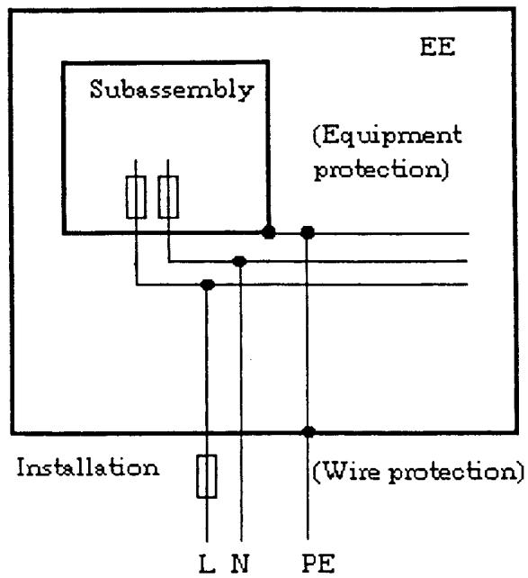

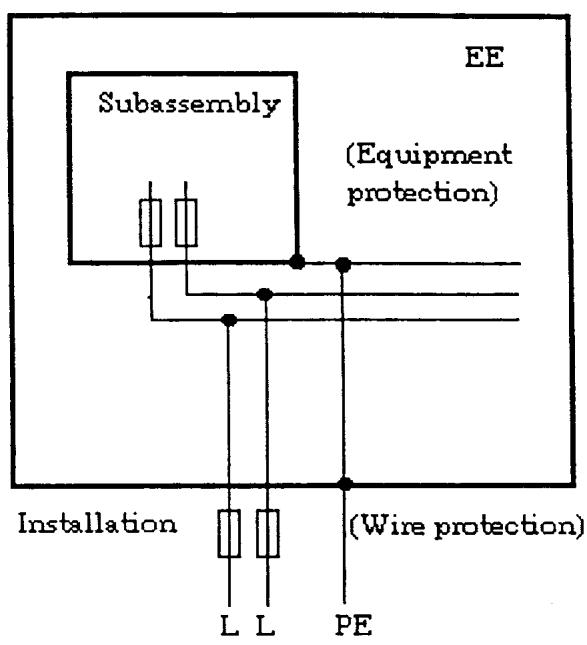  
Figure 1 Ð Arrangement of fuses in sub-assemblies and in installations

## 5 Safety requirements

## 5.1 General requirements

The protection of persons against electric shock shall be arranged so in the case of EE that a single fault does not cause a hazard. This is considered to be fulfilled if the requirements of 5.2 and 5.3 are complied with.

Figure 2 presents a summary for the design, construction and assembly of EE with regard to protection against electric shock arising from direct and indirect contact.

This figure is expanded upon, and complemented by Figures 8 to 13, (see 5.2.15.1) which lead to identification of the grade of insulation which together with Tables 3 to 6 (see 5.2.16 to 5.2.17) lead to the selection of the clearance, creepage distance and puncture strength of solid insulation which are required to satisfy this European Standard.

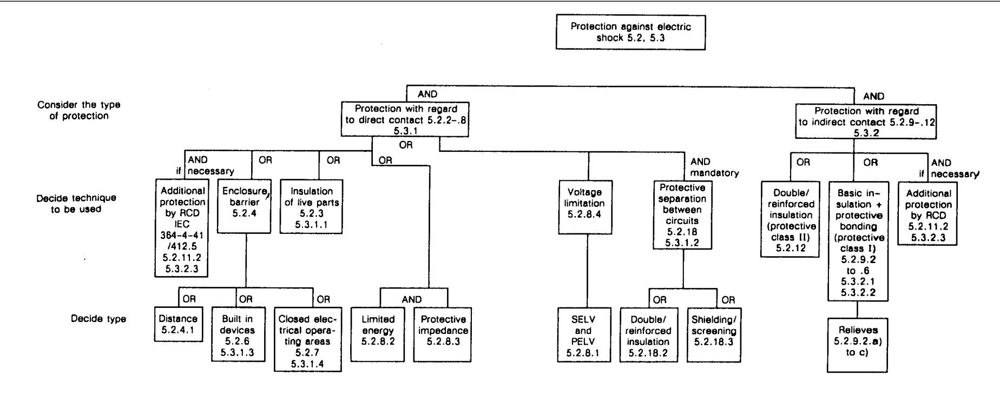  
RCD Ð residual current operated protective device  
Figure 2 Ð Functional summary of protective measures against electric shock

## 5.2 Requirements for EE with regard to protection against electric shock

## 5.2.1 Requirements for protection against electric shock

HD 384.4.41 S2 covers protection against electric shock within electrical installations of buildings and HD 366 S1 covers protection against electric shock from electrical equipment. The documents IEC 536-2 and IEC 1140 contain guidelines for the requirements for installation and equipment with regard to protection against electric shock. This European Standard provides additional requirements regarding special operational conditions for EE where the relevant information is not available within the above or other international standards.

The principle of the above mentioned standards is: The protection of persons and livestock against electric shock shall be maintained in single fault conditions as well as under normal conditions. This protection shall be achieved by the application of 5.2 to the design and construction of EE.

The testing of components and equipment with regard to protection against electric shock shall be conducted as type tests and routine tests as defined in clause 9.

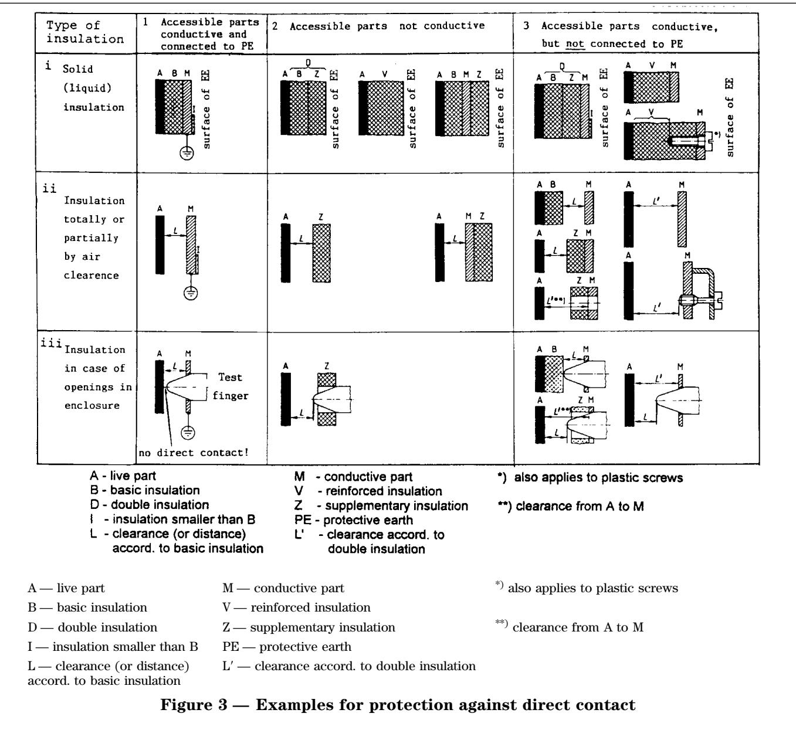

## 5.2.2 Protection against direct contact

Protection against direct contact is employed to prevent the live parts of EE being touched by persons. It shall be provided by one or more of the measures given in 5.2.2 to 5.2.7.

Any conductive part that is not separated from the live parts by at least basic insulation shall be considered to be a live part.

A metallic accessible part is considered to be conductive, if its surface is bare or is covered by an insulating layer which does not comply with the requirements of basic insulation.

With respect to testing of components and equipment, the measures taken in accordance with 5.2.2 to 5.2.7 shall be checked for compliance by visual inspection. These requirements shall also apply to devices constructed or installed during the implementation of the installation.

## 5.2.3 Protection by means of insulation of live parts

Live parts shall be completely surrounded with permanent (non removable) insulation. This insulation shall be designed for a rated insulation voltage (RIV) according to

Ð Table 3 in 5.2.16.1; (according to Tables 1 and 2 Ð Table 4 in 5.2.16.2; of HD 625.1 S1)

Ð 5.2.14.1.

The grade of insulation Ð basic, double or reinforced Ð depends upon:

Ð the decisive voltage U (see 5.2.13) of the circuit under consideration;

Ð the limits for extra-low voltage a.c. 50 V or d.c. 120 V;

Ð the use of extra-low voltage systems (SELV or PELV);

in accordance with 411.1.1, 411.1.4, 411.1.5 of HD 384.4.41 S2, HD 193 S2 and IEC 1201.

The choice of insulation shall be determined from list a) or b)1), b)2), b)3) and b)4) below (referring also to Figure 3).

a) Basic Insulation with the rated insulation voltage (RIV) of the circuit (case i 1)

Ð when it is positioned between live parts and accessible conductive parts of EE that are connected to the protective conductor via protective bonding.

b)1) Double or reinforced insulation with the rated insulation voltage of the circuit (cases i 2 or i 3)

Ð when it is located between live parts and the surface of accessible parts of EE that are non-conductive or conductive, but are not connected to the protective conductor; and

Ð when live parts have a decisive voltage UM a.c. 50 V or d.c. 120 V.

b)2) Basic insulation for the rated insulation voltage (RIV) corresponding to the highest RIV of adjacent circuits

Ð when it is positioned between live parts and the surface of accessible parts of EE that are non-conductive or conductive, but are not connected to the protective conductor; and

Ð when live parts have a decisive voltage $U _ { \mathbf { M } } \leq$ a.c. 50 V or d.c. 120 V and are separated by basic insulation from adjacent circuits which have a $U _ { \mathbf { M } } \ > \ \mathbf { a . c . }$ . 50 V or d.c. 120 V.

b)3) Basic insulation for the rated insulation voltage of the circuit corresponding to a.c. 25 V or d.c $\therefore 6 0 { \mathrm { V } } < U _ { \mathrm { M } } \leq \mathrm { a . c } ,$ . 50 V or d.c. 120 V

Ð when it is positioned between live parts and the surface of accessible parts of EE that are non-conductive or conductive, but are not connected to the protective conductor; and

Ð with live parts of the circuits at a.c. 25 V or d. $\mathrm { c } . 6 0 \mathrm { V } < \bar { U _ { \mathrm { M } } } \leq \mathrm { a . c . }$ . 50 V or d.c. 120 V that have protective separation (see 5.2.18) from adjacent circuits with decisive voltage UM a.c. 50 V or d.c. 120 V.

b)4) No insulation required for live parts designed according to 5.2.8 with a decisive voltage of $U _ { \mathrm { M } } \leq \mathbf { a . c . }$ 25 V or d.c. 60 V that have protective separation from adjacent circuits.

A flow chart for determination of insulation between live parts and accessible surface is given in Figure 9 of 5.2.15.1.

NOTE Examples for insulation between live and accessible parts are shown in Figure 3 and for insulation between separate electrical circuits and accessible parts are shown in Figures A.4 and A.5 of A.5.2.14.1.

Basic insulation and double or reinforced insulation shall be subjected to voltage tests as given in Table 17 of 9.4.5.1 and/or Table 18 of 9.4.5.2.2.

## 5.2.4 Protection by means of enclosures and barriers

EE shall comply with the relevant requirements of HD 384.4.41 S2 and IEC 536-2.

Live parts shall be arranged in enclosures or located behind barriers that meet at least the requirements of the Protective Type IP2X according to 5.1 of EN 60529. The top surfaces of enclosures or barriers that are easily accessible shall meet at least the requirements of the Protective Type IP4X.

The minimum protection provided shall take account of the particular circumstances of the installation and in addition, such protection shall be provided in accordance with the expected environmental conditions as given in clause 6 (see annex A).

Testing shall be by visual inspection. In case of doubt, re-measurement of the enclosure openings and testing with a probe according to clause 12 of EN 60529 shall be conducted. In this context, the test procedure laid down in 12.2 of EN 60529 (i.e., with test lamp and voltage at least 40 V) can be used when it is ensured that contact of the probe with a live part of the circuit in the EE to be tested will in fact result in a test indication. If this is not the case, then non-contact of the probe with live parts shall be determined in another manner.

## 5.2.4.1 Distances

As an alternative to insulation according to 5.2.3, a clearance according to 5.2.15.1 and 5.2.16 or a distance corresponding to a clearance as shown by L and L9 in Figure 3 of 5.2.3, cases ii, may be totally or partially provided (see Figure 3, case ii 1 or cases ii 2 and ii 3).

Testing shall be by visual inspection and/or if necessary by applying the probe test according to clause 12 of EN 60529.

## 5.2.5 Discharge of capacitors

After switching-off the EE, capacitors shall be discharged down within 5 s to a residual charge of 50 mC (see A.5.2.8.2) or to a voltage of 60 V. If such a measure interferes with the operation of the EE, a warning sign shall be placed where it is easily observable, indicating that the discharging time is greater than 5 s. In the case of installed EE, where the voltage at the plug-and-socket devices of EE can be touched and these devices may be pulled out when live without the use of tools, the capacitors shall be discharged within 1 s to a charge of 50 mC, or to a voltage of 60 V (see 5.1.2 of IEC 536-2).

With respect to the above two discharge cases, testing shall be by re-calculation of the energy or measurement of the voltage 5 s or 1 s after switching off of the EE. Where several capacitors are interconnected throughout the circuit, this shall be allowed for in such calculations.

## 5.2.6 Built-in devices

Sub-assemblies and devices that are intended for inclusion within a larger device or enclosure which offers the required protection do not need themselves a protective measure against direct contact. However, where there are components requiring manual operation on or closer to them, 5.1.1 of IEC 536-2 shall be taken into consideration.

## 5.2.7 EE for closed electrical operating areas 5.2.7 EE for closed electrical operating areas

EE which is intended for installation in closed electrical operating areas need not have a protective measure itself against direct contact (however, see note 2 in A.5.2.8). Where EE requires manual intervention (e.g. for repair, replacements of bulbs, fuses, batteries etc.), 412.2.1 of HD 384.4.41 S2 shall be consulted.

5.2.8 Protection in the case of direct contact Protection in the case of direct contact is required to ensure that contact with live parts of EE does not produce any dangerous shock current.

The protection against direct contact according to 5.2.2 through 5.2.7 may be waived if the contact with the live parts does not produce any dangerous shock current. This applies to circuits according to one of the measures given in 5.2.8.1 to 5.2.8.5 provided that protective separation according to 5.2.18 from all other circuits is ensured.

Any external terminals which belong to EE circuits dealt with in 5.2.8 shall be identified in the operating manuals.

These clauses apply to the entire circuit including power supplies and if necessary associated peripheral devices (see annex A).

Testing for protective separation shall be according to 9.4.5.1, 9.4.5.2.2, 9.4.5.2.3, 9.4.5.3 and 9.4.5.5 if applicable.

5.2.8.1 Protection by means of extra-low voltage with protective separation (SELV- and PELV-system) Where SELV- or PELV-systems are applied in EE or in parts of EE, the respective requirements shall be fulfilled.

When the decisive voltage according to 5.2.13 is not higher than a.c. 25 V or d.c. 60 V [see Figure A.1a) in A.5.2.8], and equipment is used within a zone of equipotential bonding, then protection against direct contact is not necessary.

In an area of limited space where the live parts are protected against direct contact according to 5.2.2 the decisive a.c. voltage may vary between 25 V and 50 V to produce a supply voltage of up to d.c. 60 V.

For testing protection using extra-low voltage with protective separation, the decisive voltage (as determined by 5.2.13) shall, in case of doubt be re-measured. If applicable, the area of limited space as defined in paragraph 3 above shall be tested for protection against direct contact in accordance with 5.2.2 to 5.2.5.

## 5.2.8.2 Protection by means of limitation of the discharging energy

The stored charge available between simultaneously accessible parts protected by protective impedance shall not exceed 50 mC (see 4.4.3.2 of IEC 536-2). According to 6.5 of IEC 1201 the charging voltage and capacitance should be limited as given in Table A.1 of A.5.2.8.2 (see annex A).

When testing protection which uses limitation of the discharging energy, calculations and/or measurements shall be performed to determine the charge or the voltage and capacitance.

## 5.2.8.3 Protection by means of protective impedance

The connection of accessible live parts to a circuit having a higher decisive voltage (5.2.13) than a.c. 25 V or d.c. 60 V as mentioned in 5.2.8.1 shall only be made through a protective impedance (411.1.2.4 of HD 384.4.41 S2, 4.4.1 of IEC 5362).

The same constructional provisions as those for protective separation (see 5.2.18) shall be applied for the construction and arrangement of protective impedance. The current value stated below shall not be exceeded in the event of failure of a single part. When capacitors are connected to the protective impedance, the residual charge shall be in accordance with 5.2.5.

The protective impedance shall be designed so that the current through the protective impedance does not exceed a value of a.c. 3,5 mA or d.c. 10 mA. It shall be noted that the decisive voltage (see 5.2.13) of the circuit having the higher voltage appears across the protective impedance (see 4.4.3.1 of IEC 5362).

The voltage endurance for the protective impedance shall be designed in such a manner that the protective impedance withstands the impulse withstand voltage 1,2/50 ms in accordance with column 8 in Table 3 of 5.2.16.1 respectively column 8 in Table 4 of 5.2.16.2 (see annex A).

This protection method shall be verified by visual inspection and by fault simulation. During fault simulation, calculations shall be performed to determine whether the current remains below the limits laid down in paragraph 2 and 3 above. For details of testing see 9.4.5.1 and 9.4.5.5.

## 5.2.8.4 Protection by using limited voltages in control circuits

This type of protection is applicable only in control circuits for the purpose of forming reference and actual values [see Figure A.1d) of A.5.2.8]. This type of protection shall not be used in EE of protective class II as given in 3.3 of HD 366 S1, because of the provision of earthing (PE) at the basepoint of the voltage divider. This part of control circuit shall be designed reliably in such a way that, even if a fault occurs in the EE, the voltage across its output terminals as well as the voltage to earth will not become higher than the decisive voltage of a.c. 25 V or d.c. 60 V according to 5.2.8.1. The same constructive measures as in protective separation (see 5.2.18) shall be employed in this case.

When providing disconnection points for a circuit with protective separation, A.5.2.8.3 should apply, where relevant.

When testing protection by means of voltage limitation, it shall be verified by visual inspection and by fault simulation. During fault simulation, calculations shall be performed to determine whether the voltage remains below the limits laid down in paragraph 2 above.

## 5.2.8.5 Connectors

In addition to the measures as given in 5.2.8.1 to 5.2.8.4, Ð SELV, PELV, limited discharging energy, protective impedance, limited voltage Ð it shall be ensured that in the event of error or polarity reversal of connectors no voltages that exceed a.c. 25 V or d.c. 60 V can be connected into a circuit with protective separation. This applies e.g. to plug-in-sub-assemblies or other plug-in devices which can be plugged-in without the use of a tool (key) or which are accessible without the use of a tool. This does not apply to EE which is intended for assembly in closed electrical operating areas (see 5.2.7). See also 7.1.9.

If required, testing of non-interchangeability and protection against polarity reversal of connectors, plugs and socket outlets shall be confirmed by visual inspection and trial insertion.

5.2.9 Protection with regard to indirect contact Protection against indirect contact is required to prevent shock currents which can result from exposed conductive parts of EE during an insulation failure.

This protection shall be designed according to the following requirements:

For EE constructed to protective class I (see 3.2 of HD 366 S1) the requirements as given in 5.2.9.1 to 5.2.11 apply.

The content of 5.2.12 deals with particular aspects of protective class II.

Protective class III is rarely applicable for EE. Protective class 0 is not acceptable for EE.

At a decisive voltage higher than a.c. 1 400 V or d.c. 2 000 V only protective class I is acceptable.

All conductive parts which are not separated from live parts by at least basic insulation (see HD 366 S1) shall be treated as live parts.

With respect to testing of components and equipment, the measures taken according to 5.2.9 to 5.2.12 shall be checked for compliance by means of visual inspection. These requirements shall also apply to devices constructed or installed during the implementation of the installation.

5.2.9.1 Insulation between live parts and exposed conductive parts

Exposed conductive parts of EE shall be separated from live parts at least by basic insulation or by clearances in accordance with Table 3 or 4 of 5.2.16.1 to 5.2.16.2 respectively.

Testing shall be by visual inspection. In cases of doubt re-measurement of clearances, creepage distances and solid insulation, shall be made.

## 5.2.9.2 Protective bonding

Protective bonding shall always be provided between exposed conductive parts of EE and the means of connection for the protective conductor; it is not however essential when the following apply:

a) when exposed conductive parts are exclusively related to electrical circuits with protection in case of direct contact according to 5.2.8, with the limiting value of the decisive voltage increased to a.c. 50 V or d.c. 120 V (413.1.1.1 of HD 384.4.41 S2) for SELV- or PELV-systems (see 5.2.8.1), alternatively where protection is provided by means of voltage limitation (see 5.2.8.4); or

b) when magnet cores are used, for example, transformers, chokes and contactors; or c) when exposed conductive parts of small dimensions (about 50 mm 3 50 mm) cannot be touched or grasped when the EE is used as intended and which have a low probability of contact. Such exposed conductive parts are, for example, screws, rivets, nameplates and cable clamps (see 471.2.2 of HD 384.4.47 S2).

NOTE Conductive parts which are separated from live parts using double or reinforced insulation (see 5.2.18.2) they are no longer considered to be exposed conductive parts and therefore, require no protective bonding.

Testing shall be by visual inspection. When claiming one of the exceptions from the requirements of providing protective bonding in accordance with a), b) or c), it shall be confirmed by documentation that these requirements are met.

(For bonding connection arrangements see A.5.2.9.2.)

## 5.2.9.3 Rating of protective bonding

Protective bonding shall withstand the highest thermal and dynamic stresses that can occur to the EE item(s) concerned when they are subjected to a fault connecting to exposed conductive parts (according to 4.1.2 of IEC 536-2).

In order to avoid thermal overload, the requirements of 8.3.3.4 shall be applied to the design of the protective bonding (4.1.4 of IEC 536-2) (see annex A). For testing, the resistance of protective bonding shall in case of doubt be measured in accordance with paragraph 3 of A.5.2.9.3, the voltage drop in case of short-circuit with respect to an exposed conductive part shall then be determined from this measurement.

## 5.2.9.4 Protection against corrosion

Protective connections shall be protected against corrosion under the specified ambient conditions (4.1.4 of IEC 536-2) (see annex A).

## 5.2.9.5 Protective bonding conductor with low cross-section

Where the exposed conductive parts of EE are connected to the protective conductor of EE using a protective bonding conductor with small cross-section, care shall be taken that a fault between these exposed conductive parts and live parts with larger cross-section is prevented. This can be achieved by a suitable construction or by double or reinforced insulation.

NOTE This applies for example for data processing equipment within power electronic equipment.

## 5.2.9.6 EE with voltage above a.c. 1 400 V or d.c. 2 000 V

In EE with a decisive voltage (5.2.13) of more than a.c. 1 400 V or d.c. 2 000 V, accessible and non-accessible conductive parts which are not live parts shall be included within the protective bonding. Excepted are conductive parts with small dimensions or those assigned to circuits with protective separation and extra-low voltage or magnet cores according to 5.2.9.2a) to c).

## 5.2.9.7 Interruption

The protective bonding of EE shall be permanently connected and not be interrupted by a switch or an electronic device (4.1.8 of IEC 536-2).

Where the protective connection to a sub-assembly of EE is made by a plug-and-socket device when it is live or conducting, the protective connection shall not be broken before the live conductors. On re-connection the protective conductor shall re-connect before the live connection, or at the latest, together with the live conductors (4.1.7 of IEC 536-2).

## 5.2.9.8 Marking

Protective bonding conductors shall be easily recognizable from their shape, location (e.g. short visible pieces of conductors) or colour coding; exceptions are the protective bonding conductors on printed circuit boards and such protective bonding conductors in wire-wrap and similar back wiring of electronic sub-assemblies which cannot be unfastened without destruction. When marking by colours, the colour combination green-yellow shall be used. Insulated single-core protective bonding conductors shall be green-yellow along their entire length. The colour coding green-yellow shall be used only for the protective bonding conductors and for the protective conductors (4.1.9 of IEC 536-2).

## 5.2.10 Means of connection for the protective conductor

EE with internal protective bonding shall have means of connection for the external protective conductor near the terminals for the respective live conductors. They shall be corrosion-resistant and shall be suitable for the connection of the protective conductor cross-section which is determined from the dimension of the live conductors according to Table 54F of HD 384.5.54 S1, unless a larger cross-section is required according to 8.3.3.4. The means of connection for the protective conductor shall not be used as a part of the mechanical assembly of the EE.

The means of connection for the protective conductor should be marked in a well recognizable way with

Ð the symbol No. 5019 according to HD 243 S10; or Ð the letters ªPEº; or

Ð the colour coding green-yellow.

Marking should not be done on easily changeable fixtures such as screws. This marking is not necessary for connectors (5.2.2.4 of IEC 536-2). The content of 7.1.9 applies to the external connectors.

## 5.2.11 Leakage current and fault current

## 5.2.11.1 High leakage current

Where an EE has a continuous leakage current of more than a.c. 3,5 mA or d.c. 10 mA in normal use, a fixed connection is required for protection; this shall be stated in the operating manuals.

The combination of a residual-current-operated protective device (RCD) with in particular several EEs may be incompatible if the resulting leakage current drawn by their radio frequency filters is so high that the RCD is triggered.

When several items of EE are connected to a source of supply, the total leakage current of a.c. 3,5 mA or d.c. 10 mA in the protective conductor may be exceeded. In these cases and where the protective conductor is interrupted, it is possible for a person to become exposed to a leakage current higher than the limit a.c. 3,5 mA or d.c. 10 mA. Under such conditions, and as long as no international standard exists on the measures to be taken to prevent this, the following shall be provided:

Ð duplication of the protective conductor; or Ð automatic disconnection of the supply in case of discontinuity of the protective conductor; or Ð incorporation of a double-wound transformer (or equivalent) in the supply with the circuit protective conductor connected to the exposed conductive parts of the EE and to the secondary winding of the transformer.

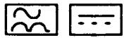

Measurement of leakage current is required on EE which is not intended for permanent connection: The EE shall be set up in an insulated state without connection of the protective earth conductor and shall be operated at rated voltage. Under these conditions, the current shall be measured at the following points:

a) for an EE which is intended for connection to a TT- or TN-system, between the protective terminal conductor and the protective earth conductor itself; b) for an EE which is intended for connection to an IT-system, between the protective terminal conductor and each outer conductor.

The current measuring circuit shall be performed according to Figure 3 in 5.1 of IEC 990.

NOTE New limits for the leakage current are expected in 7.5 of IEC 1140.

## 5.2.11.2 Compatibility with residual-current-operated protective devices in case of low leakage current

A residual-current-operated protective device (RCD) may be used to provide protection in case of indirect contact or/and with rated fault current I # 30 mA according to 412.5 of HD 384.4.41 S2 supplementary protection in case of direct contact. It is presupposed that the leakage current of the EE(s) according to 5.2.11.1 is low enough not to trigger unintendedly the RCD connected in series.

Before connecting an EE to a supply protected by an RCD, the compatibility of the EE with the RCD shall be verified, by reference to Figure 4 and the paragraphs below. Depending on the supply side circuitry of the EE and the type of RCD (type A or AC according to amendment 2 of IEC 755), EE and RCD may be compatible or incompatible. Figure 4 indicates:

1) when an EE is required to be compatible with the RCD;

2) when a design notice as given below shall be fitted to the EE requiring the use of an RCD Type B or of another protection (Type B according to amendment 2 of IEC 755).

Design notice: Where residual-current-operated protective device (RCD) is used for protection in case of direct or indirect contact, only RCD of Type B is allowed on the supply side of this Electronic Equipment (EE). Otherwise another protective measure shall be applied such as separation of the EE from the environment by double or reinforced insulation or isolation of EE and supply system by a transformer.

a) Movable EE with rated input # 4 kVA shall be designed to be compatible with RCD of type A Ð protection in case of indirect or/and direct contact. b) Movable EE with rated input < 4 kVA, shall have the design notice (see above) fitted to the equipment and written in the operating manual.

c) Permanently connected EE shall have the design notice (see above) fitted to the equipment and written in the operating manual.

In particular, operation of an RCD connected in series with EE shall not be prevented by a d.c. component in the fault current.

Circuits 2, 3, 6 and 7 in Figure A.2 of A.5.2.11.2, may contain a high d.c. component in the residual current and reduce the sensitivity of the RCDs of type A and AC, therefore these combinations are unacceptable. Suitable and acceptable are combinations of the circuits mentioned with RCDs of type B, which are triggered by all waveforms of residual current occurring (see Figure A.2 of A.5.2.11.2)

NOTE RCDs suitable to be triggered by differing waveforms of residual current should be marked with symbols as defined in amendment 2 of IEC 755 as follows:

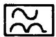

: Type A Ð a.c. current sensitive and pulse current sensitive (suitable for circuits 1, 4, 5, 8, 9 according to Figure A.2 of A.5.2.11.2)

: Type B Ð universal current sensitive (suitable for all circuits according to Figure A.2 of A.5.2.11.2)

For design and construction of electrical installations care shall be taken with RCDs of type B, see 5.3.2.3 and design example in Figure A.3 of A.5.2.11.2.

If necessary, re-checking should be carried out to confirm the compatibility of the RCD (according to EN 610081 respectively to amendment 2 of IEC 755) with the circuitry employed in the EE (see Figure A.2 of A.5.2.11.2).

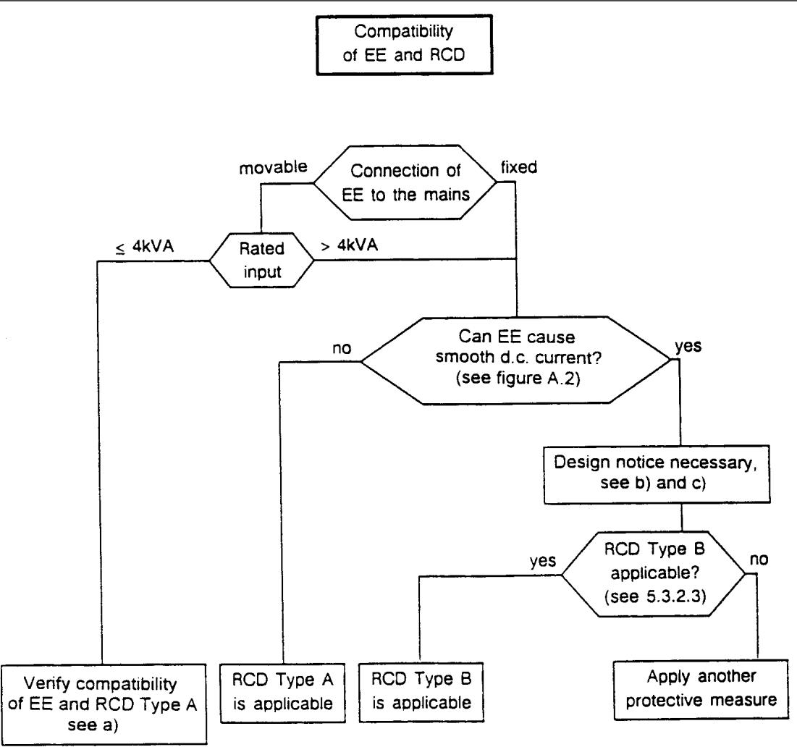  
Figure 4 Ð Flow chart leading to requirements when using EE(s) behind an RCD

## 5.2.12 Special features in EE for protective class II

If EE is designed to use double or reinforced insulation between live parts and accessible surfaces of an EE in accordance with 5.2.3b)1) or 5.2.4, then the design is considered equivalent to protective class II if the following also apply (5.2.3.1.1 of IEC 536-2).

Ð EE designed to protective class II shall not have means of connection for the protective conductor (PE or PEN). However this does not apply if the protective conductor is passed through the EE to equipment series-connected beyond it. In the latter event, the protective conductor and its means for connection shall be insulated with basic insulation against the accessible surface of the EE and against circuits, which employ protective separation, extra-low voltage, protective impedance and limited discharging energy, according to 5.2.8. This basic insulation shall correspond to the rated insulation voltage of the series-connected equipment.

Ð Metal-encased EE of protective class II may have provision on its enclosure for the connection of an equipotential bonding conductor (413.4 of HD 384.4.41 S2 and Note 4 in 3.3 of HD 366 S1).

Ð EE of protective class II may have provision for the connection of a functional earthing conductor or for the damping of overvoltages; it shall, however, be insulated as though it is a live part.

Ð EE of protective class II shall be classified on the name plate ith the symbol No. 5172 according to HD 243 S10.

## 5.2.13 Decisive voltage

The decisive voltage of a circuit in respect of the protective measures to be employed against electric shock is the highest voltage which occurs continuously between any two arbitrary live parts of the EE during rated worst operating conditions when used as intended. If continuous direct earthing of the circuit of EE is provided through conductors of sufficiently low impedance, then the decisive voltage is the highest voltage which occurs continuously between any arbitrary live part of this circuit and earth (e.g. circuits connected to an earthed three-phase supply).

The decisive voltage applies to all parts of circuits of the EE under consideration.

No agreed procedure is available for the calculation of the decisive voltage at the present time. Therefore the method of calculation which follows shall be used to determine the measures to be taken to provide adequate protection. These measures fall into categories described by the limit levels according to the classifications in column 1 of Table 1.

The actual classification of a circuit of EE with regard to protection against electric shock is dependent upon the decisive voltage $U _ { \mathbf { M } }$ which relates to the a.c. and d.c. voltage of the circuit. $U _ { \mathbf { M } }$ is also affected by the nature of the voltage waveforms and these shall be taken into consideration when calculations are performed (i.e. the ripple voltage, chopped voltage, and recurring overshoots that may occur).

It should be understood that the method of calculation in the procedure to be adopted below does not lead to a definite solution for a value for decisive voltage $U _ { \mathbf { M } } .$ It does however allow a decision to be made as to which classification of Table 1 the value of $U _ { \mathbf { M } }$ fits. Three cases a), b) and c) of waveforms are given for deciding which classification of a circuit shall be chosen from Table 1.

Case a) for a.c. voltage (see Figure 5) where $U _ { \mathrm { A C } } = \mathbf { a n }$ a.c. voltage (r.m.s.) in volts with; $U _ { \mathrm { A C P } } = \mathbf { a }$ repetitive peak value in volts, and a value of;

$U _ { \mathrm { A C L } } =$ the limit of the a.c. voltage (r.m.s.) chosen from column a) of Table 1.

$$
\text {   If   } \frac {U _ {\mathrm{AC}}}{U _ {\mathrm{ACL}}} \leq 1 \text {   and   } \frac {U _ {\mathrm{ACP}}}{\sqrt {2 U _ {\mathrm{ACL}}}} \leq 1 \text {   then   } U _ {\mathrm{M}} \leq U _ {\mathrm{ACL}}
$$

But if one or both conditions are not true, then repeat the calculation with the next higher value of $U _ { \mathrm { A C L } }$ in Table 1.

The value for $U _ { \mathrm { A C L } }$ for which both conditions are true shall be used to decide which range applies in Table 1 to the circuit considered. If one of the conditions is not true even with $U _ { \mathrm { A C L } } = \mathbf { a . c . 1 4 0 0 V } ,$ then the higher voltage range applies (Table 1, last row).

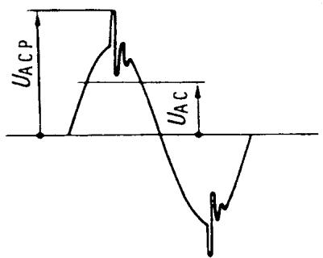  
Figure 5 Ð Typical waveform for case a) a.c. voltage

Case b) for d.c. voltage (see Figure 6) where $U _ { \mathrm { D C } } = \mathbf { a }$ d.c. voltage of mean value in which the ripple content giving rise to $U _ { \mathrm { D C P } }$ is not more than 10 % (10 % r.m.s. ripple content resulting from the ratio of the r.m.s. values of the superimposed a.c. voltage and of the smooth d.c. voltage);

$U _ { \mathrm { D C P } } =$ the repetitive peak value of the d.c. voltage in volts;

$U _ { \mathrm { D C L } }$ = the limit of the d.c. voltage mean value in volts, chosen from column b) of Table 1.

$$
\text {   If   } \frac {U _ {\mathrm{DC}}}{U _ {\mathrm{DCL}}} \geq 1 \text {   and   } \frac {U _ {\mathrm{DCP}}}{1 , 1 7 U _ {\mathrm{DCL}}} \geq 1 \text {   then   } U _ {\mathrm{M}} \leq U _ {\mathrm{DCL}}
$$

But if one or both conditions are not true, then repeat the calculation with the next higher value of $U _ { \mathrm { D C L } }$ in Table 1.

The value for $U _ { \mathrm { D C L } }$ for which both conditions are true shall be used to decide which range applies in Table 1 to the circuit considered. If one of the conditions is not true even with $U _ { \mathrm { D C L } } = \mathbf { d . c . } 2 0 0 0 \mathrm { V } ,$ then the higher voltage range applies (Table 1, last row).

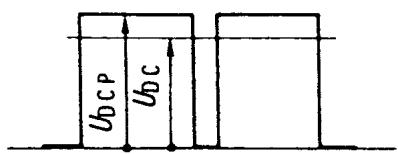  
Figure 6 Ð Typical waveform for case b) d.c. voltage

Case c) for pulsating voltage (see Figure 7)

For a pulsating voltage (d.c. voltage where the ripple content is more than 10 %) the evaluation of both components is made separately according to the formula below where:

$U _ { \mathrm { A C } } = \mathbf { a . c }$ . voltage component (r.m.s. value), in volts; $U _ { \mathrm { D C } } = \mathrm { d } . \mathrm { c }$ . voltage component (mean value), in volts; $U _ { \mathrm { A C P } } =$ repetitive peak value of the a.c. voltage component, in volts.

$$
\text {   If   } \frac {U _ {\mathrm{AC}}}{U _ {\mathrm{ACL}}} + \frac {U _ {\mathrm{DC}}}{U _ {\mathrm{DCL}}} \leq 1 \text {   and   } \frac {U _ {\mathrm{ACP}}}{\sqrt {2} U _ {\mathrm{ACL}}} + \frac {U _ {\mathrm{DC}}}{1 , 1 7 U _ {\mathrm{DCL}}} \leq
$$

1 then $U _ { \mathbf { M } } \leq U _ { \mathrm { D C L } }$ and $U _ { \mathrm { A C L } }$

But if one or both conditions are not true, then repeat the calculation with the next higher values of $U _ { \mathrm { A C I } }$ and $U _ { \mathrm { D C L } }$ in Table 1.

The values for $U _ { \mathrm { A C I } }$ and $U _ { \mathrm { D C L } }$ for which both conditions are true shall be used to decide which range applies in Table 1 to the circuit considered. If one of the conditions is not true even with $U _ { \mathrm { A C L } } =$ a.c. 1 400 V or $U _ { \mathrm { D C L } } = \mathbf { d . c . } 2 0 0 0 \mathrm { V } ,$ then the higher voltage range applies (Table 1, last row).

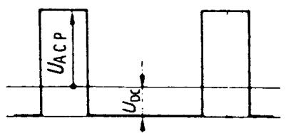  
Figure 7 Ð Typical waveform for case c) pulsating voltage

The following give additional information relating to the limit voltages of cases a), b) and c) of Table 1:

$U _ { \mathrm { A C L } } -$ limit of a.c. voltage (see Table 1):

$U _ { \mathrm { A C L } } = 2 5 \ : \mathrm { V }$ as upper limit of protective extra-low voltage (SELV or PELV) according to 5.2.8.1 and $\mathbf { 5 . 2 . 8 . 4 . }$

$U _ { \mathrm { A C L } } = 5 0 \mathrm { V }$ as upper limit for circuits with exposed conductive parts without protective bonding according to 5.2.9.2a).

$U _ { \mathrm { A C L } } = 1 4 0 0 \mathrm { V }$ as limit of the a.c. voltage according to ${ \bf 5 . 2 . 9 , }$ , 5.2.9.6 and 5.2.14.2.

$U _ { \mathrm { D C L } }$ Ð limit of d.c. voltage (see Table 1):

$U _ { \mathrm { D C L } } = 6 0 \mathrm { V }$ as upper limit of protective extra-low voltage (SELV or PELV) according to 5.2.8.1

and 5.2.8.4.

$U _ { \mathrm { D C L } } = 1 2 0 \mathrm { V }$ as upper limit for circuits with exposed conductive parts without protective bonding according to 5.2.9.2a).

$U _ { \mathrm { D C L } } = 2 0 0 0 \mathrm { V }$ as limit of the d.c. voltage according to 5.2.9, 5.2.9.6 and 5.2.14.2.

These voltages are mean values allowing for a ripple content of not more than 10 % r.m.s.

Table 1 gives a summary of the limits of the decisive voltage. According to the three limit levels for the decisive voltage in Table 1 four voltage ranges exist:

1) $U _ { \mathrm { M } } \leq \mathbf { a . c . }$ . 25 V or d.c. 60 V

applies to circuits without protection against direct contact, but with protective separation to adjacent circuits with $U _ { \mathbf { M } }$ a.c. 50 V or d.c. 60 V;

2) a.c. 25 V or d.c. 60 $\mathrm { V } < U _ { \mathrm { M } } \leq \mathrm { a . c . 5 0 V }$ or d.c. 120 V applies to circuits with protection against direct contact and protective separation to adjacent circuits with $U _ { \mathbf { M } }$ a.c. 50 V or d.c. 120 V, but without protective bonding of the exposed conductive parts;

3) a.c. 50 V or d.c. 120 $\begin{array} { r } { \mathrm { V } < U _ { \mathrm { M } } \leq \mathrm { a . c . } } \end{array}$ 1 400 V or d.c. 2 000 V

applies to circuits with protection against direct contact and protective separation to adjacent circuits with $U _ { \mathbf { M } }$ a.c. 1 400 V or d.c. 2 000 V and with protective bonding or double or reinforced insulation of exposed conductive parts. Basic insulation is required from adjacent circuits with a.c. 50 V or d.c. 120 $\begin{array} { r } { \mathrm { V } < U _ { \mathrm { M } } \le \mathrm { a . c . } } \end{array}$ . 1 400 V or d.c. 2 000 V;

4) U a.c. 1 400 V or d.c. 2 000 V

applies to circuits with protection against direct contact, with protective bonding of exposed conductive parts and with basic insulation to adjacent circuits with $U _ { \mathbf { M } }$ a.c. 1 400 V or d.c. 2 000 V.

For the design of the insulation depending on these

Table 1 Ð Summary of the limits of the decisive voltage $U _ { \mathbf { M } }$

<table><tr><td rowspan="2">Classification of a circuit in EE</td><td colspan="3">Limit of decisive voltage  $U_{\text{M}}$ </td><td rowspan="2">Subclause</td></tr><tr><td>a)a.c. voltage (r.m.s. value) $U_{\text{ACL}}$ V</td><td>b)d.c. voltage (mean value) $U_{\text{DCL}}$ V</td><td>c)a.c. voltage (peak value) $U_{\text{ACL}}*\sqrt{2}$ V</td></tr><tr><td>Electric circuits with protective separation and without protection against direct contact</td><td>25</td><td>60</td><td>35</td><td>5.2.8.1, 5.2.8.4</td></tr><tr><td>Exposed conductive parts of circuits with protective separation and without protective bonding</td><td>50</td><td>120</td><td>71</td><td>5.2.9.2a)</td></tr><tr><td>Circuits with higher voltage</td><td>1400</td><td>2000</td><td>2000</td><td>5.2.9, 5.2.9.6, 5.2.14.2</td></tr></table>

NOTE The extra-low-voltage limits of decisive voltage are those from 411.1.4.3 and 411.1.5.2 of HD 384.4.41 S2.

voltage ranges see Figures 9 and 10 (see annex A).

## 5.2.14 Solid insulation, insulation of circuits

Solid insulation shall be designed to resist the stresses occurring, especially mechanical, electrical, thermal and climatic stresses that are to be expected in normal use and, it shall have a sufficient resistance to ageing during the life time of EE. This applies also to liquid insulation. Thin, easily damageable materials such as coating with lacquer or oxides and anode coatings are considered insufficient to satisfy these requirements (412.1 of HD 384.4.41 S2).

The design of solid insulation as for clearances and creepage distances results from Figures 11 to 13 in relation to Figures 8 to 10. Additional requirements are given in 5.2.14.1 to 5.2.14.3.

Testing shall be by visual inspection. In case of doubt measurement of the thickness of the insulation and re-calculation of its dielectric strength shall be made.

5.2.14.1 Between circuits and exposed conductive parts or accessible surfaces of EE

Basic, supplementary, double or reinforced insulation shall be applied for the protection against electric shock.

This insulation shall be designed according to the rated insulation voltage (RIV) for an impulse withstand voltage, determined from Table 3 or 4, column 6 or 8, according to 5.2.16.1 or 5.2.16.2.

Where the appropriate clearances are not designed to meet overvoltage category III (see Table 1 of HD 625.1 S1) as set out in column 6 of Table 3 according to 5.2.16.1, and it is decided to choose alternative clearances according to paragraph 3 or 4 of 5.2.16.1, then the impulse withstand voltage appropriate to these clearances determines the RIV. The following shall apply for the insulation between live parts and the surface of accessible parts of EE according to 5.2.3b)1) to b)4).

When a design involves subdivided basic and supplementary insulation or subdivided double insulation with an electrical circuit in between, then the highest of the RIVs shall be employed for design purposes, and not the voltage of the particular circuit. Figure A.4 in A.5.2.14.1 shows an example.

The foregoing paragraph does not apply to parts with small dimension (approximately 50 mm 3 50 mm) which Ð when the EE is used as intended Ð are not required to be touched or cannot be grasped or where the danger of touch is not significant (471.2.2 of HD 384.4.47 S2).

Figure A.5 in A.5.2.14.1, shows examples for the insulation required for control elements. For voltage tests see 9.4.5.1 and 9.4.5.2.

## 5.2.14.2 Between circuits

Basic insulation shall be applied between separate circuits of an EE.

## Exceptions are:

Ð between circuits designed according to 5.2.8 and other circuits not designed according to 5.2.8;

Ð between circuits designed for a decisive voltage of more than a.c. 1 400 V or d.c. 2 000 V and other

circuits designed for a lower decisive voltage. These circuits shall be insulated to the requirements of protective separation (see 5.2.18; double or reinforced insulation or protective screening).

NOTE In this case earthing of transformer secondary is not necessary.

The insulation shall be designed for an impulse withstand voltage which corresponds to the respective rated insulation voltage, determined from columns 6 or 8 in Tables 3 or 4 of 5.2.16.1 or 5.2.16.2. For voltage tests see 9.4.5.

## 5.2.14.3 Bridging of the insulation via conductive parts

Conductive parts, for example resistors and capacitors, which bridge over an insulation according to 5.2.14.1 or 5.2.14.2 shall withstand the same electric stress as that defined for the insulation concerned. If these components bridge over a double or reinforced insulation, then they shall correspond additionally to the requirements of protective impedance according to 5.2.8.3 (4.4.1 of IEC 536-2).

For voltage tests see 9.4.5.

## 5.2.15 Clearances and creepage distances, pollution degree

## 5.2.15.1 Clearances and creepage distances

Clearances and creepage distances shall be selected according to the principles of HD 625.1 S1.

The determined clearances and creepage distances are minimum values. Manufacturing tolerances shall be taken into account, when installing or connecting EE on site. Greater clearances and creepage distances shall be provided particularly, when they may be newly created or changed by the kind of mounting or method of wiring during installation or connection of the EE on site (see 8.2). The defined minimum values shall not diminish during the working life of the EE.

The design of clearances and creepage distances shall make allowance for the total degradation to be expected during the working life in the expected environment.

In addition, where there is a requirement for enhanced reliability, it is appropriate to increase the distances considerably.

The determination of clearances and creepage distances does not apply to the interior of enclosures which provide a sealed environment which has been proven to be impervious to pollution, or precipitation of moisture.

Also the determination of clearances and creepage distances does not apply to active or passive components when pollution, or precipitation of moisture is avoided by suitable construction methods. Examples are semiconductors, capacitors, and printed circuit boards which have been covered with varnish or protective coating of adequate and proven quality for protection of the item against pollution and moisture to the requirements of 4.1 of IEC 664-3. In

the case of use of items which have been covered with varnish or protective coating the test of 9.4.4.4 shall be applied.

Eleven examples showing how to measure a clearance or a creepage distance are contained in 4.2 of HD 625.1 S1.

Clearances and creepage distances shall be selected under consideration of the following influences:

Ð pollution degree;

Ð overvoltage category;

Ð rated insulation voltage;

Ð kind of insulation;

Ð location of insulation;

Ð kind of circuit considered.

The type of insulation and the rated insulation voltage shall be determined using the flow charts in Figures 8 to 10.

The clearances and creepage distances shall be determined using the flow charts in Figures 11 to 13 and Tables 3 to 6 (see 5.2.16 to 5.2.17).

Tests shall be made by visual inspection. In case of doubt, re-measurement of clearances and creepage distances shall be made according to 9.4.4.1.

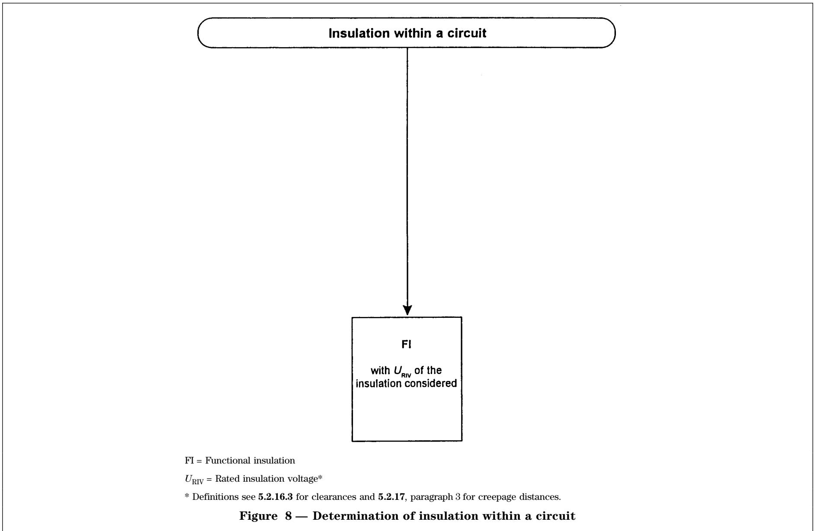

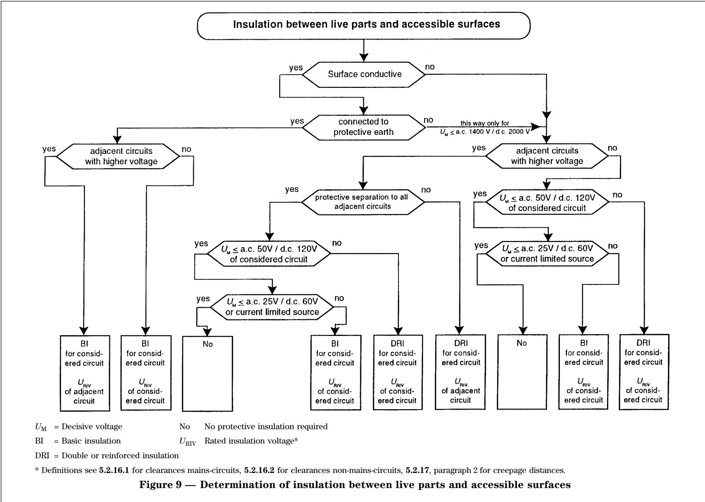

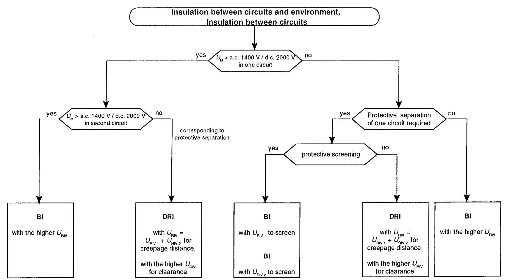

$U _ { \mathbf { M } }$ = Decisive voltage

BI = Basic insulation

$U _ { \mathrm { R I V } }$ = Rated insulation voltage\*

DRI = Double or reinforced insulation

\* Definitions see 5 .2 . 16. 1 paragraph 1 for clearances mains-circuits 5 .2 . 16.2 paragraph 1 for clearances non-mains-circuits 5 .2 . 1 7 paragraph 2 for creepage distances between circuits

Figure 10 Ð Determination of insulation between circuits and environmental and of insulation between circuits

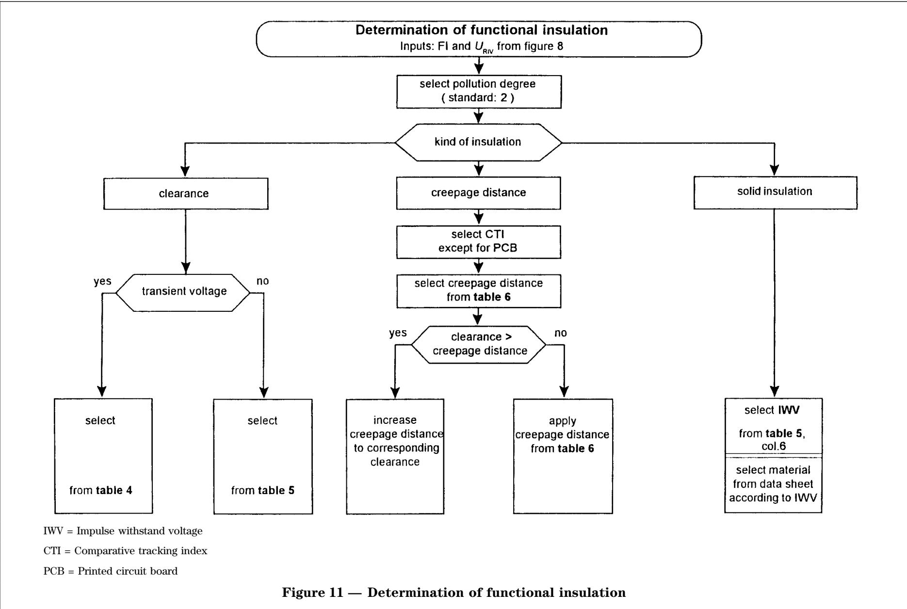

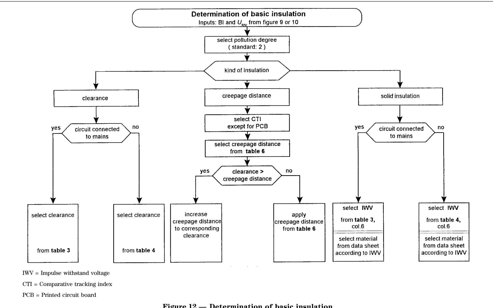  
Figure 12 Ð Determination of basic insulation

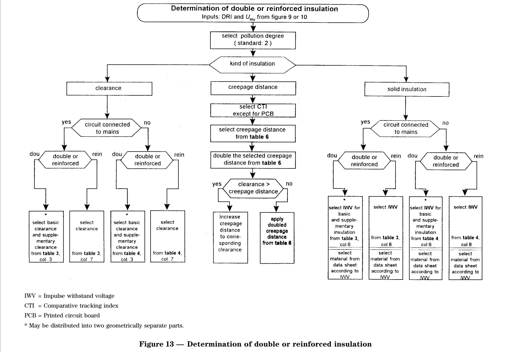

## 5.2.15.2 Pollution degree

The effect of pollution on clearances and creepage distances which occur during the service life of EE shall be considered in determining the pollution degree (2.5.1 of HD 625.1 S1). Therefore the micro-environmental conditions at the respective clearance or creepage distance shall be applied according to Table 2. Other pollution degrees may be applicable to the place where the EE is to be installed. EE shall normally be designed according to pollution degree 2. If an alternative design value is used, the alternative pollution degree value shall be stated in the documentation.

NOTE In unfavourable conditions of application, compliance with the required micro-environmental conditions of clearances and creepage distances can be ensured by means of the following measures:

Ð protection against water penetrating from outside and conductive pollution by using enclosures (see 6.1.3);

Ð protection against condensation, for example, by heating;

Ð cleaning of clearances and creepage distances such that additional pollution is removed. This necessity shall be stated in the documentation.

This cleaning should not be considered for the design of clearances and creepage distances ensuring protective separation and/or total insulation (protective class II equipment).

NOTE The specification for pollution degree 2 deviates from that given in 2.5.1 of HD 625.1 S1 regarding a short term condensation, when e.g. a printed circuit board is brought from a low temperature area (i.e. outside) into the operating area of the EE.

## 5.2.16 Clearances

Clearances shall be designed:

Ð between mains-circuits and their environment according to Table 3 of 5.2.16.1;

Mains-circuits are circuits of an EE which are energized directly from the supply mains. Circuits which are linked to the supply mains only via protective impedances according to 5.2.8.3 or via means of voltage limitation according to 5.2.8.4 are not regarded as mains-circuits.

Ð between non-mains-circuits and their environment according to Table 4 (see 5.2.16.2);

Non-mains-circuits are all circuits which are not directly energized from the supply mains.

Ð within a circuit according to Table 5 (see 5.2.16.3).

Specification of a specific impulse withstand category (overvoltage category) shall be based on the following general explanation (HD 625.1 S1).

Ð Equipment of impulse withstand category I is equipment which is intended to be connected to the fixed electrical installations of buildings. Protective means are taken outside of the equipment Ð either in the fixed installation or between the fixed installation and the equipment Ð to limit transient overvoltages to the specific level.

Ð Equipment of impulse withstand category II is equipment to be connected to the fixed electrical installations of buildings.

NOTE Examples of such equipment are appliances, portable tools and other household and similar loads.

Ð Equipment of impulse withstand category III is equipment which is part of the fixed electrical installations and other equipment where a higher degree of availability is expected.

NOTE Examples of such equipment are distribution boards, circuit breakers, wiring systems (06-01 of HD 384.2 S1, including cables, bus-bars, junction boxes, switches, socket outlets) in the fixed installation, and equipment for industrial use and some other equipment e.g. stationary motors with permanent connection to the fixed installation.

Ð Equipment of impulse withstand category IV is for use at or in the proximity of the origin of the electrical installations of buildings upstream of the main distribution board.

NOTE Examples of such equipment are electricity meters, primary overcurrent protection devices and ripple control units. Examples for the design of clearances are given in Figure A.6 (see A.5.2.16).

The design of a clearance between two circuits shall conform to that circuit which requires the longer clearance.

Clearances for use in altitudes higher than 2 000 m shall be calculated with a correction factor according to Table A.2 of HD 625.1 S1.

For checking the dimensions see 9.4.4.1.

Table 2 Ð Definitions of pollution degrees

<table><tr><td>Pollution degree</td><td>Micro-environment</td></tr><tr><td>1</td><td>No pollution or only dry, non-conductive pollution occurs. The pollution has no influence.</td></tr><tr><td>2</td><td>Normally, only non-conductive pollution occurs. Occasionally, however, a temporary conductivity caused by condensation is to be expected, when the EE is out of operation.</td></tr><tr><td>3</td><td>Conductive pollution or dry non-conductive pollution occurs which becomes conductive due to condensation which is to be expected.</td></tr><tr><td>4</td><td>The pollution generates persistent conductivity caused e.g. by conductive dust or rain or snow.</td></tr></table>

5.2.16.1 Clearances between mains-circuits and their environment

The rated insulation voltage in column 1 of Table 3 is: Ð in case of earthed-neutral systems the peak value of the rated voltage between phase and earthed neutral point;

Ð in case of non-earthed three phase systems the peak value of the rated voltage between a phase and an artificial neutral point;

Ð in case of non-earthed single phase a.c.- or d.c.-systems the peak value of the rated voltage between the phases.

Column 1 applies to a.c.- and d.c.-systems with tolerances as given in 6.3.2.1 and 6.3.3. Interpolation up to 1 000 V is not permitted. However, above√2 1 000 V interpolation is permitted.2

Overvoltage category III according to Table 1 of HD 625.1 S1 is normally taken as a basis for the clearance of basic insulation (columns 2 to 5 of Table 3). This applies to all equipments permanently connected to the mains-circuit and plug-in equipments connected to an industrial network which may feed heavy, rapidly changing loads with inductive or capacitive components. Overvoltage category IV shall be used, when EE is connected directly to outdoor open lines.

Plug-in equipment connected to a network for non-industrial purposes without special requirements with regard to reliability and availability may be designed using overvoltage category II (2.2.2.1.1 of HD 625.1 S1).

As an alternative to the values of Table 3, columns 2 to 5, the clearances between mains-circuits of an EE and its environment may be designed in accordance with overvoltage category II, if facilities are provided which reduce overvoltages of category III to values of category II. This shall be verified by an impulse voltage test according to 19.1 of HD 588.1 S1, with a 2 V internal impedance of the test-generator. However, the clearances for reinforced insulation according to column 7 shall not be reduced. For testing see 9.4.5.1.

In case of rated insulation voltages up to 1 000 V the√2 clearances of Table 3 correspond to the requirements of inhomogeneous distribution of the electric field across the electrodes of the clearance. This corresponds to the conditions in practice. In case of homogeneous field distribution and rated insulation voltages above 1 000 V the clearances may be√2 selected corresponding to the given lower values. In this case, however, an impulse voltage test is required according to clause 19 of HD 588.1 S1 with a 2V internal impedance of the test generator. For testing see 9.4.5.1.

Table 3 Ð Clearances between mains-circuits and their environment  
(Impulse withstand voltages according to overvoltage category III)

<table><tr><td>1</td><td>2</td><td>3</td><td>4</td><td>5</td><td>6</td><td colspan="2">7</td><td>8</td></tr><tr><td rowspan="3">Rated insulation voltage(Definition see 5.2.16.1, para. 1)</td><td colspan="5">Basic insulation, supplementary insulation</td><td colspan="3">Reinforced insulation</td></tr><tr><td colspan="4">Pollution degree</td><td rowspan="2">Impulse withstand voltage1,2/50 μskV</td><td rowspan="2" colspan="2">mm</td><td rowspan="2">Impulse withstand voltage1,2/50 μskV</td></tr><tr><td>1mm</td><td>2mm</td><td>3mm</td><td>4mm</td></tr><tr><td>≤50  $\sqrt{2}$  V = 71 V</td><td>0,1</td><td>0,2</td><td>0,8</td><td>1,6</td><td>0,8</td><td colspan="2">0,5</td><td>1,5</td></tr><tr><td>100  $\sqrt{2}$  V = 141 V</td><td>0,5</td><td>0,5</td><td>0,8</td><td>1,6</td><td>1,5</td><td colspan="2">1,5</td><td>2,5</td></tr><tr><td>150  $\sqrt{2}$  V = 212 V</td><td>1,5</td><td>1,5</td><td>1,5</td><td>1,6</td><td>2,5</td><td colspan="2">3,0</td><td>4,0</td></tr><tr><td>300  $\sqrt{2}$  V = 424 V</td><td colspan="4">3,0</td><td>4,0</td><td colspan="2">5,5</td><td>6,0</td></tr><tr><td>600  $\sqrt{2}$  V = 849 V</td><td colspan="4">5,5</td><td>6,0</td><td colspan="2">8,0</td><td>8,0</td></tr><tr><td rowspan="2">1  $\sqrt{2}$  kV = 1,41 kV</td><td colspan="4">8,0</td><td rowspan="2">8,0</td><td colspan="2">14,0</td><td rowspan="2">12,0</td></tr><tr><td colspan="2">Inhomogeneous field</td><td colspan="2">Homogeneous field</td><td>Inhomogeneous field</td><td>Homogeneous field</td></tr><tr><td>1,5  $\sqrt{2}$  kV = 2,12 kV</td><td colspan="2">11,5</td><td colspan="2">4,0</td><td>10,5</td><td>20</td><td>6,5</td><td>16,5</td></tr><tr><td>3  $\sqrt{2}$  kV = 4,24 kV</td><td colspan="2">21,0</td><td colspan="2">6,5</td><td>17,0</td><td>36</td><td>11</td><td>27,0</td></tr><tr><td>6  $\sqrt{2}$  kV = 8,49 kV</td><td colspan="2">47,0</td><td colspan="2">14,0</td><td>33,0</td><td>80</td><td>24</td><td>53,0</td></tr><tr><td>10  $\sqrt{2}$  kV= 14,1 kV</td><td colspan="2">78,0</td><td colspan="2">23,0</td><td>52,0</td><td>135</td><td>36</td><td>83,0</td></tr><tr><td>Above 10 *  $\sqrt{2}$  kV</td><td colspan="8">According to EN 60071-1, HD 540.2 S1 and HD 540.3 S1.</td></tr><tr><td colspan="9">Interpolation up to 1 000  $\sqrt{2}$  V not permitted, above 1 000  $\sqrt{2}$  V permitted.</td></tr></table>

For clearances in mains-circuits corresponding to reinforced insulation the values of the next higher overvoltage category apply.

Clearances corresponding to reinforced insulation according to column 7 of Table 3 shall not be exposed to environmental conditions of pollution degrees 3 and 4 (see also paragraph 2 of 5.2.18.4).

NOTE 1 Homogeneous field is an electric field which has an essentially constant voltage gradient between electrodes (uniform field), such as that between two spheres where the radius of each sphere is greater than the distance between them.

NOTE 2 Inhomogeneous field is an electric field which does not have an essentially constant voltage gradient between electrodes (non-uniform field)

## 5.2.16.2 Clearances between non-mains-circuits and their environment

The rated insulation voltage in column 1 of Table 4 is the recurring peak value of the highest voltage appearing continuously (at rated operation) across any two live parts of the circuit of the EE during the most unfavourable operational condition and when the EE is used as intended. If continuous direct earthing of the circuit through conductors of sufficient current carrying capacity is employed, the peak value of the

highest voltage occurring between any live part and earth shall be taken as the rated insulation voltage in column 1. Interpolation between the values is permitted. The clearances given in the columns 2 to 5 of Table 4 sustain at least the impulse withstand voltages given in column 6. Where transient surge voltages are expected to be higher than those given in column 6, then the clearances in columns 2 to 5 shall be determined based on this (higher) value in column 6. The clearances in column 7 for reinforced insulation shall also be chosen according to this line of Table 4 if required. Interpolation is permitted.

In case of rated insulation voltages up to 1 000 V the√2 clearances of Table 4 correspond to the requirements of inhomogeneous distribution of the electric field across the electrodes of the clearance. This corresponds to the conditions of practice. In case of homogeneous field distribution and rated insulation voltages above 1 000 V the clearances may be√2 selected corresponding to the given lower values. In this case, however, an impulse voltage test is required according to clause 19 of HD 588.1 S1 with a 2V internal impedance of the test generator. For testing see 9.4.5.1.

Table 4 Ð Clearances between non-mains-circuits and their environmentxx)  
(Impulse withstand voltages according to overvoltage category II)

<table><tr><td>1</td><td>2</td><td>3</td><td>4</td><td>5</td><td>6</td><td colspan="2">7</td><td>8</td></tr><tr><td rowspan="3">Rated insulation voltage(Definition see 5.2.16.2, para. 1)</td><td colspan="5">Basic insulation, supplementary insulation</td><td colspan="3">Reinforced insulation</td></tr><tr><td colspan="4">Pollution degree</td><td rowspan="2">Impulse withstand voltage1,2/50 skV</td><td rowspan="2" colspan="2">mm</td><td rowspan="2">Impulse withstand voltage1,2/50 skV</td></tr><tr><td>1mm</td><td>2mm</td><td>3mm</td><td>4mm</td></tr><tr><td>≤50  $\sqrt{2}$  V = 71 V</td><td>0,04</td><td> $\mathbf{0,2^{x)}$ </td><td>0,8</td><td>1,6</td><td>0,5</td><td colspan="2">0,2</td><td>0,8</td></tr><tr><td>100  $\sqrt{2}$  V = 141 V</td><td>0,1</td><td>0,2</td><td>0,8</td><td>1,6</td><td>0,8</td><td colspan="2">0,3</td><td>1,3</td></tr><tr><td>150  $\sqrt{2}$  V = 212 V</td><td>0,5</td><td>0,5</td><td>0,8</td><td>1,6</td><td>1,5</td><td colspan="2">1,3</td><td>2,4</td></tr><tr><td>300  $\sqrt{2}$  V = 424 V</td><td>1,5</td><td>1,5</td><td>1,5</td><td>1,6</td><td>2,5</td><td colspan="2">3,0</td><td>4,0</td></tr><tr><td>600  $\sqrt{2}$  V = 849 V</td><td colspan="4">3,0</td><td>4,0</td><td colspan="2">6,0</td><td>6,4</td></tr><tr><td rowspan="2">1  $\sqrt{2}$  kV = 1,41 kV</td><td colspan="4">5,5</td><td rowspan="2">6,0</td><td colspan="2">10,4</td><td rowspan="2">9,6</td></tr><tr><td colspan="2">Inhomogeneous field</td><td colspan="2">Homogeneous field</td><td>Inhomogeneous field</td><td>Homogeneous field</td></tr><tr><td>1,5  $\sqrt{2}$  kV = 2,12kV</td><td colspan="2">8,0</td><td colspan="2">3,0</td><td>8,0</td><td>15</td><td>4,8</td><td>12,8</td></tr><tr><td>3  $\sqrt{2}$  kV = 4,24 kV</td><td colspan="2">17,0</td><td colspan="2">5,2</td><td>14,0</td><td>29</td><td>9</td><td>22,4</td></tr><tr><td>6  $\sqrt{2}$  kV = 8,49 kV</td><td colspan="2">33,0</td><td colspan="2">10,0</td><td>25,0</td><td>60</td><td>17</td><td>40,0</td></tr><tr><td>10  $\sqrt{2}$  kV= 14,1 kV</td><td colspan="2">55,0</td><td colspan="2">16,0</td><td>38,0</td><td>92</td><td>27</td><td>60,8</td></tr><tr><td>Above 10  $\sqrt{2}$  kV</td><td colspan="8">According to EN 60071-1, HD 540.2 S1 and HD 540.3 S1.</td></tr><tr><td colspan="9">Interpolation permitted.x) On PCBs 0,1 mm.xx) This table also applies to clearances between live parts at the connections of the EE to the supply mains according to the last sentence in paragraph 2 of 5.2.16.3.</td></tr></table>

Clearances corresponding to reinforced insulation according to column 7 of Table 4 shall not be exposed to environmental conditions of pollution degree 3 and 4 (see also paragraph 2 of 5.2.18.4).

## 5.2.16.3 Clearances within a circuit

The rated insulation voltage in column 1 of Table 5 is the recurring peak value of the voltage which appears continuously (at rated operation) between the exposed conductors with the designed clearance during the most unfavourable operational condition and when the EE is used as intended. Interpolation between the values in Table 5 is permitted (2.2.2.3.2 of HD 625.1 S1).

When at a clearance according to columns 2 to 5 of Table 5 a transient peak voltage is expected higher than that given in column 6, then the clearances in columns 2 to 5 shall be determined based on this (higher) value in column 6. Interpolation is permitted. At the connections of the EE to the supply mains, where transient surge voltages can act upon the circuit, the clearances between live parts of the circuit shall be selected according to columns 2 to 5 in Table 4 of 5.2.16.2.

For the rating of clearances according to the values of Table 5 for homogeneous electric field the content of paragraph 3 in 5.2.16.2 applies correspondingly.

## 5.2.17 Creepage distances

The rating of all creepage distances results from Table 6 (Table 4 of HD 625.1 S1).

Ð Table 6 applies directly to creepage distances corresponding to basic and functional insulation (see Figures 11 and 12 of 5.2.15.1).

NOTE For electronic circuits, operating with very low currents, higher creepage distances may be necessary for functional reasons.

Ð For creepage distances corresponding to reinforced insulation the values of Table 6 shall be doubled (Figure 13 of 5.2.15.1) (3.2.3 of HD 625.1 S1).

The rated insulation voltage in column 1 of Table 6 is the r.m.s. value of the highest voltage appearing continuously at rated operation between any two live parts of the circuit of the EE during the most unfavourable operational condition and when the EE is used as intended. If continuous direct earthing of the circuit through sufficiently high cross section conductors is employed, the r.m.s. value of the highest voltage occurring between any live part and earth shall be taken as the rated insulation voltage. Interpolation is permitted (3.2.1.1 of HD 625.1 S1).

For creepage distances within a circuit the rated insulation voltage of the creepage distance according to Table 6 is the r.m.s. value of the highest voltage which appears continuously (at rated operation) at the designed creepage distance during the most unfavourable operational condition and EE used as intended. Interpolation is permitted (3.2.2 of HD 625.1 S1).

Table 5 Ð Clearances within a circuit  
(Impulse withstand voltage according to overvoltage category I)

<table><tr><td>1</td><td>2</td><td>3</td><td>4</td><td>5</td><td>6</td></tr><tr><td rowspan="3">Rated insulation voltage(Definition see 5.2.16.3, paragraph. 1)</td><td colspan="5">Functional insulation</td></tr><tr><td colspan="4">Pollution degree</td><td rowspan="2">Impulse withstand voltage $1,2/50 \mu s$ kV</td></tr><tr><td>1mm</td><td>2mm</td><td>3mm</td><td>4mm</td></tr><tr><td> $\leq 50 \sqrt{2} V = 71 V$ </td><td>0,01</td><td> $\mathbf{0,2^{x)}}$ </td><td>0,8</td><td>1,6</td><td>0,33</td></tr><tr><td> $100 \sqrt{2} V = 141 V$ </td><td>0,04</td><td> $\mathbf{0,2^{x)}}$ </td><td>0,8</td><td>1,6</td><td>0,5</td></tr><tr><td> $150 \sqrt{2} V = 212 V$ </td><td>0,1</td><td> $\mathbf{0,2}$ </td><td>0,8</td><td>1,6</td><td>0,8</td></tr><tr><td> $300 \sqrt{2} V = 424 V$ </td><td>0,5</td><td> $\mathbf{0,5}$ </td><td>0,8</td><td>1,6</td><td>1,5</td></tr><tr><td> $600 \sqrt{2} V = 849 V$ </td><td>1,5</td><td> $\mathbf{1,5}$ </td><td>1,5</td><td>1,6</td><td>2,5</td></tr><tr><td rowspan="2"> $1 \sqrt{2} V = 1,41 kV$ </td><td colspan="4">3</td><td rowspan="2">4</td></tr><tr><td colspan="2">Inhomogeneous field</td><td colspan="2">Homogeneous field</td></tr><tr><td> $1,5 \sqrt{2} kV = 2,12 kV$ </td><td colspan="2">5,5</td><td colspan="2">2</td><td>6</td></tr><tr><td> $3 \sqrt{2} kV = 4,24 kV$ </td><td colspan="2">8</td><td colspan="2">3</td><td>8</td></tr><tr><td> $6 \sqrt{2} kV = 8,49 kV$ </td><td colspan="2">17</td><td colspan="2">5,2</td><td>14</td></tr><tr><td> $10 \sqrt{2} kV = 14,1 kV$ </td><td colspan="2">33</td><td colspan="2">10</td><td>25</td></tr><tr><td> $> 10 \sqrt{2} kV$ </td><td colspan="5">According to EN 60071-1, HD 540.2 S1 and HD 540.3 S1.</td></tr><tr><td colspan="6">Interpolation permitted. $^x)$  On PCBs 0,1 mm.</td></tr></table>

Insulating materials are classified in four groups corresponding to their comparative tracking index (CTI) (2.7.1 of HD 625.1 S1).

Ð Insulating material group I 600 # CTI;

Ð Insulating material group II 400 # CTI < 600;

Ð Insulating material group III a 175 # CTI < 400;

Ð Insulating material group III b 100 # CTI < 175.

The CTI value shall have been determined

corresponding to 6.2 of HD 214 S2, applying test solution A to specially manufactured test samples.

NOTE Epoxy glass-fibre laminate for printed circuit boards (PCB) is an insulating material of group III a.

Creepage distances on PCB and creepage distances for reinforced insulation shall not be exposed directly to environmental conditions of pollution degree 3 or 4.

If the creepage distance is ribbed, then the creepage distance of insulating material of group I may be applied using insulating material of group II and the creepage distance of insulating material of group II may be applied using insulating material of group III. Except at pollution degree 1 the ribs shall be 2 mm high at least.

For anorganic insulating materials, e.g. glass or ceramic which do not track, the creepage distance may equal the associated clearance (2.7.1.5 of HD 625.1 S1).

When the creepage distance determined in Table 6 is less than the associated clearance, then it shall be increased to the clearance (3.2.1.5 of HD 625.1 S1).

For checking the dimensions see 9.4.4.1.

Table 6 Ð Minimum creepage distances

(Table 4 of HD 625. 1 S 1)

Dimensions in millimetres

<table><tr><td>Column 1</td><td>2</td><td>3</td><td>4</td><td>5</td><td>6</td><td>7</td><td>8</td><td>9</td><td>10</td><td>11</td><td>12</td><td>13</td><td>14</td><td>15</td><td>16</td></tr><tr><td rowspan="5">Rated insulated voltage $V_{rms}$ </td><td colspan="2">PCBs*)</td><td colspan="13">Other equipment</td></tr><tr><td rowspan="2" colspan="2">Pollution degree</td><td colspan="5">Pollution degree</td><td colspan="4">Pollution degree</td><td colspan="4">Pollution degree</td></tr><tr><td>1</td><td colspan="4">2</td><td colspan="4">3</td><td colspan="4">4</td></tr><tr><td>1</td><td>2</td><td rowspan="2">2)</td><td colspan="4">Insulating material group</td><td colspan="4">Insulating material group</td><td colspan="4">Insulating material group</td></tr><tr><td>2)5)</td><td>3)</td><td>I</td><td>II</td><td>IIIa</td><td>IIIb</td><td>I</td><td>II</td><td>IIIa</td><td>IIIb</td><td>I</td><td>II</td><td>IIIa</td><td>IIIb</td></tr><tr><td>10</td><td>0,025</td><td>0,04</td><td>0,08</td><td>0,4</td><td>0,4</td><td colspan="2">0,4</td><td>1</td><td>1</td><td colspan="2">1</td><td>1,6</td><td>1,6</td><td>1,6</td><td></td></tr><tr><td>12,5</td><td>0,025</td><td>0,04</td><td>0,09</td><td>0,42</td><td>0,42</td><td colspan="2">0,42</td><td>1,05</td><td>1,05</td><td colspan="2">1,05</td><td>1,6</td><td>1,6</td><td>1,6</td><td></td></tr><tr><td>16</td><td>0,025</td><td>0,04</td><td>0,1</td><td>0,45</td><td>0,45</td><td colspan="2">0,45</td><td>1,1</td><td>1,1</td><td colspan="2">1,1</td><td>1,6</td><td>1,6</td><td>1,6</td><td></td></tr><tr><td>20</td><td>0,025</td><td>0,04</td><td>0,11</td><td>0,48</td><td>0,48</td><td colspan="2">0,48</td><td>1,2</td><td>1,2</td><td colspan="2">1,2</td><td>1,6</td><td>1,6</td><td>1,6</td><td></td></tr><tr><td>25</td><td>0,025</td><td>0,04</td><td>0,125</td><td>0,5</td><td>0,5</td><td colspan="2">0,5</td><td>1,25</td><td>1,25</td><td colspan="2">1,25</td><td>1,7</td><td>1,7</td><td>1,7</td><td></td></tr><tr><td>32</td><td>0,025</td><td>0,04</td><td>0,14</td><td>0,53</td><td>0,53</td><td colspan="2">0,53</td><td>1,3</td><td>1,3</td><td colspan="2">1,3</td><td>1,8</td><td>1,8</td><td>1,8</td><td></td></tr><tr><td>40</td><td>0,025</td><td>0,04</td><td>0,16</td><td>0,56</td><td>0,8</td><td colspan="2">1,1</td><td>1,4</td><td>1,6</td><td colspan="2">1,8</td><td>1,9</td><td>2,4</td><td>3</td><td></td></tr><tr><td>50</td><td>0,025</td><td>0,04</td><td>0,18</td><td>0,6</td><td>0,85</td><td colspan="2">1,2</td><td>1,5</td><td>1,7</td><td colspan="2">1,9</td><td>2</td><td>2,5</td><td>3,2</td><td></td></tr><tr><td>63</td><td>0,04</td><td>0,063</td><td>0,2</td><td>0,63</td><td>0,9</td><td colspan="2">1,25</td><td>1,6</td><td>1,8</td><td colspan="2">2</td><td>2,1</td><td>2,6</td><td>3,4</td><td></td></tr><tr><td>80</td><td>0,063</td><td>0,1</td><td>0,22</td><td>0,67</td><td>0,95</td><td colspan="2">1,3</td><td>1,7</td><td>1,9</td><td colspan="2">2,1</td><td>2,2</td><td>2,8</td><td>3,6</td><td></td></tr><tr><td>100</td><td>0,1</td><td>0,16</td><td>0,25</td><td>0,71</td><td>1</td><td colspan="2">1,4</td><td>1,8</td><td>2</td><td colspan="2">2,2</td><td>2,4</td><td>3,0</td><td>3,8</td><td></td></tr><tr><td>125</td><td>0,16</td><td>0,25</td><td>0,28</td><td>0,75</td><td>1,05</td><td colspan="2">1,5</td><td>1,9</td><td>2,1</td><td colspan="2">2,4</td><td>2,5</td><td>3,2</td><td>4</td><td></td></tr><tr><td>160</td><td>0,25</td><td>0,4</td><td>0,32</td><td>0,8</td><td>1,1</td><td colspan="2">1,6</td><td>2</td><td>2,2</td><td colspan="2">2,5</td><td>3,2</td><td>4</td><td>5</td><td></td></tr><tr><td>200</td><td>0,4</td><td>0,63</td><td>0,42</td><td>1</td><td>1,4</td><td colspan="2">2</td><td>2,5</td><td>2,8</td><td colspan="2">3,2</td><td>4</td><td>5</td><td>6,3</td><td></td></tr><tr><td>250</td><td>0,56</td><td>1</td><td>0,58</td><td>1,25</td><td>1,8</td><td colspan="2">2,5</td><td>3,2</td><td>3,6</td><td colspan="2">4</td><td>5</td><td>6,3</td><td>8</td><td>4)</td></tr><tr><td>320</td><td>0,75</td><td>1,6</td><td>0,75</td><td>1,6</td><td>2,2</td><td colspan="2">3,2</td><td>4</td><td>4,5</td><td colspan="2">5</td><td>6,3</td><td>8</td><td>10</td><td></td></tr><tr><td>400</td><td>1</td><td>2</td><td>1</td><td>2</td><td>2,8</td><td colspan="2">4</td><td>5</td><td>5,6</td><td colspan="2">6,3</td><td>8</td><td>10</td><td>12,5</td><td></td></tr><tr><td>500</td><td>1,3</td><td>2,5</td><td>1,3</td><td>2,5</td><td>3,6</td><td colspan="2">5</td><td>6,3</td><td>7,1</td><td colspan="2">8,0</td><td>10</td><td>12,5</td><td>16</td><td></td></tr><tr><td>630</td><td>1,8</td><td>3,2</td><td>1,8</td><td>3,2</td><td>4,5</td><td colspan="2">6,3</td><td>8</td><td>9</td><td colspan="2">10</td><td>12,5</td><td>16</td><td>20</td><td></td></tr><tr><td>800</td><td>2,4</td><td>4</td><td>2,4</td><td>4</td><td>5,6</td><td colspan="2">8</td><td>10</td><td>11</td><td>12,5</td><td></td><td>16</td><td>20</td><td>25</td><td></td></tr><tr><td>1 000</td><td>3,2</td><td>5</td><td>3,2</td><td>5</td><td>7,1</td><td colspan="2">10</td><td>12,5</td><td>14</td><td>16</td><td></td><td>20</td><td>25</td><td>32</td><td></td></tr><tr><td>1 250</td><td></td><td>6,3</td><td>4,2</td><td>6,3</td><td>9</td><td colspan="2">12,5</td><td>16</td><td>18</td><td>20</td><td></td><td>25</td><td>32</td><td>40</td><td></td></tr><tr><td>1 600</td><td></td><td>86)</td><td>5,6</td><td>8</td><td>11</td><td colspan="2">16</td><td>20</td><td>22</td><td>25</td><td></td><td>32</td><td>40</td><td>50</td><td></td></tr><tr><td>2 000</td><td></td><td>10</td><td>7,5</td><td>10</td><td>14</td><td colspan="2">20</td><td>25</td><td>28</td><td>32</td><td></td><td>40</td><td>50</td><td>63</td><td></td></tr></table>

## Table 6 Ð Minimum creepage distances (continued)

(Table 4 of HD 625. 1 S 1)

Dimensions in millimetres

<table><tr><td>Column 1</td><td>2</td><td>3</td><td>4</td><td>5</td><td>6</td><td>7</td><td>8</td><td>9</td><td>10</td><td>11</td><td>12</td><td>13</td><td>14</td><td>15</td><td>16</td></tr><tr><td rowspan="5">Rated insulated voltage $V_{rms}$ </td><td colspan="2">PCBs*)</td><td colspan="13">Other equipment</td></tr><tr><td rowspan="2" colspan="2">Pollution degree</td><td colspan="5">Pollution degree</td><td colspan="4">Pollution degree</td><td colspan="4">Pollution degree</td></tr><tr><td>1</td><td colspan="4">2</td><td colspan="4">3</td><td colspan="4">4</td></tr><tr><td>1</td><td>2</td><td rowspan="2">2)</td><td colspan="4">Insulating material group</td><td colspan="4">Insulating material group</td><td colspan="4">Insulating material group</td></tr><tr><td>2) 5)</td><td>3)</td><td>I</td><td>II</td><td>IIIa</td><td>IIIb</td><td>I</td><td>II</td><td>IIIa</td><td>IIIb</td><td>I</td><td>II</td><td>IIIa</td><td>IIIb</td></tr><tr><td>2 500</td><td></td><td>12,5</td><td>10</td><td>12,5</td><td>18</td><td colspan="2">25</td><td>32</td><td>36</td><td>40</td><td>4)</td><td>50</td><td>63</td><td>80</td><td></td></tr><tr><td>3 200</td><td></td><td>16</td><td>12,5</td><td>16</td><td>22</td><td colspan="2">32</td><td>40</td><td>45</td><td>50</td><td></td><td>63</td><td>80</td><td>100</td><td></td></tr><tr><td>4 000</td><td></td><td>20</td><td>16</td><td>20</td><td>28</td><td colspan="2">40</td><td>50</td><td>56</td><td>63</td><td></td><td>80</td><td>100</td><td>125</td><td></td></tr><tr><td>5 000</td><td></td><td>25</td><td>20</td><td>25</td><td>36</td><td colspan="2">50</td><td>63</td><td>71</td><td>80</td><td></td><td>100</td><td>125</td><td>160</td><td></td></tr><tr><td>6 300</td><td></td><td>32</td><td>25</td><td>32</td><td>45</td><td colspan="2">63</td><td>80</td><td>90</td><td>100</td><td></td><td>125</td><td>160</td><td>200</td><td></td></tr><tr><td>8 000</td><td></td><td>40</td><td>32</td><td>40</td><td>56</td><td colspan="2">80</td><td>100</td><td>110</td><td>125</td><td></td><td>160</td><td>200</td><td>250</td><td></td></tr><tr><td> $10\ 000^{1)}$ </td><td></td><td>50</td><td>40</td><td>50</td><td>71</td><td colspan="2">100</td><td>125</td><td>140</td><td>160</td><td></td><td>200</td><td>250</td><td>320</td><td></td></tr><tr><td colspan="16">1) Values for voltages above 10 kV shall be determined according to IEC 71-1 to -3.2) Insulating material group I, II, IIIa, IIIb.3) Insulating material group I, II, IIIa.4) Values for creepage distances are not determined for this range. Insulating materials of group IIIb normally are not recommended for pollution degree 3 above 630 V or for pollution degree 4.5) Below type A coating (4.3.1 of IEC 664-3) only.6) For &gt;1 000 V as drafted in IEC 28A/108A/CDV.*) These columns apply also to components and parts on PCBs and to other insulation arrangements with a comparable control of tolerances.</td></tr></table>

## 5.2.18 Protective separation

Figure 14 below provides an overview for the applications of protective separation. Protective separation is required at all the following interfaces (according to 5.3 and 5.4 of IEC 1140):

Ð between extra-low-voltage circuits according to 5.2.8 (SELV or PELV) and circuits other than those according to 5.2.8;

Ð between high-voltage circuits with a decisive voltage according to 5.2.13 which is more than a.c. 1 400 V or d.c. 2 000 V, and circuits with a lower decisive voltage.

Protective separation of the circuits shall take place through the following (4.3 of IEC 536-2):

## either

Ð by double or reinforced insulation;

or

Ð by protective screening: i.e., by a conductive screen connected to the protective bonding of the EE, or connected to the protective earth conductor itself, whereby the screen is separated from live parts by at least basic insulation (4.2 of IEC 536-2); or

Ð by protective impedance according to 5.2.8.3 as shown in Figure A.1 (see A.5.2.8) comprising limitation of discharge energy and of current according to 5.2.8.2 [see Figure A.1b) and c)] or limitation of voltage according to 5.2.8.4 [see Figure A.1d)];

## and

Ð by application of materials resistant to ageing, as well as by special constructive measures.

Protective separation shall be implemented at all interfaces between the above-stated circuits: i.e. components for the transmission of energy or information, relays, switches, adjacent electrical lines or adjacent conductors on circuit boards, terminals and connectors.

The protective separation shall be fully and effectively maintained under all the operating conditions stated in 6.1, 6.2 and 6.3; these include conditions from the following aspects:

Ð ambient temperature;

Ð humidity;

Ð pollution;

Ð special climatic stress as agreed with the user;

Ð mechanical stress;

Ð heat, but not under conditions of extraordinary effects such as flame or incandescence;

Ð electrical operating conditions, including special conditions as agreed with the user.

The content of paragraphs 1 and 2 of 5.2.14 shall apply for the insulation employed for protective separation.

The coupling of circuits by additional means (protective impedance, see 5.2.8.3, limitation of discharging energy, see 5.2.8.2, and voltage limitation, see 5.2.8.4) is considered equivalent to protective separation.

For circuits with protective separation, basic insulation shall be provided against exposed conductive parts and against electric circuits for which protective separation is not required.

<table><tr><td colspan="4">Protective separation</td></tr><tr><td colspan="4">Required between:</td></tr><tr><td>Extra-low-voltage circuits according to 5.2.8 (SELV or PELV, no protection against direct contact!) and other circuits</td><td colspan="3">High-voltage circuits (with  $U_{M}$ &gt;a.c. 1 400 V or d.c. 2 000 V) and circuits with lower voltage (5.2.14.2)</td></tr><tr><td></td><td colspan="3"></td></tr><tr><td colspan="4">Implemented by:</td></tr><tr><td colspan="2">General constructive measures;</td><td colspan="2">(5.2.18.1)</td></tr><tr><td colspan="2">insulation and routing of wiring,</td><td colspan="2">(5.3.1.1 + 5.3.1.2)</td></tr><tr><td colspan="2">Clearance and creepage distances</td><td colspan="2">(5.2.18.4 + Figure 10 of 5.2.15.1)</td></tr><tr><td colspan="4"></td></tr><tr><td>Double/reinforced insulation</td><td>(5.2.18.2)</td><td>Protective screening</td><td>(5.2.18.3)</td></tr><tr><td>Freedom from partial discharge</td><td>(5.2.18.5)</td><td></td><td></td></tr><tr><td colspan="4"></td></tr><tr><td colspan="4">Additional requirements for:</td></tr><tr><td>Coil devices</td><td>Switchgears</td><td>Semiconductors</td><td>Plugs and terminals</td></tr><tr><td>(A.5.2.18.7)</td><td>(A.5.2.18.8)</td><td>(A.5.2.18.9)</td><td>(A.5.2.18.10)</td></tr></table>

Figure 14 Ð Protective separation (with the respective subclauses in parentheses)

The following shall apply to conductive or non-conductive accessible surfaces of EE which are not connected to the protective conductor [except those parts according to paragraph c) of 5.2.9.2; see also Figure 9 in 5.2.15.1]:

$- U _ { \mathrm { M } } \leq \mathrm { a . c . 2 5 }$ V or d.c. 60 V: No insulation required; Ð a.c. 25 V or d.c. 60 V <

$U _ { \mathrm { { M } } } \leq \mathrm { { a . c . } } 5 0 \mathrm { { V } }$ or d.c. 120 V: Basic insulation;

$- U _ { \mathrm { M } } > \mathrm { a . c . } \ 5 0 \mathrm { V }$ or d.c. 120 V: Double or reinforced insulation

where: $U _ { \mathbf { M } } -$ decisive voltage according to 5.2.13. Operating documents and manuals shall describe the provision made for protective separation between circuits.

## 5.2.18.1 Constructive measures

Materials employed in conjunction with the protective separation of circuits shall feature chemical and physical properties such that the protective separation characteristics are fully and effectively maintained even considering effects of ageing.

Circuits which feature protective separation with respect to each other shall be configured in such a manner that mutual electrical connection cannot occur, neither directly nor indirectly by means of metal parts not incorporated into the protective bonding (see 5.2.9.2). Such metal parts can include iron cores, relay armatures, screws and bolts, and similar items. If, in the event of insulation failure, electrical connection could occur between protectively separated circuits via such metal parts, then the following shall be implemented:

## either

Ð the live parts of that circuit with the greater decisive voltage (see 5.2.13) which are adjacent to the above-stated metal parts shall be insulated with double or reinforced insulation;

## or

Ð the live parts adjacent to the above-stated metal parts shall in all cases be insulated in both circuits with basic insulation which is designed in accordance with that circuit having the higher decisive voltage.

NOTE ªInsulation failureº here shall be construed so as to mean only the failure of one basic or of one supplementary insulation element, and not the total failure of a double or a reinforced insulation (see annex A).

Compliance of the constructive measures with the requirements for protective separation shall be checked within type test by visual inspection of the EE and if necessary verified in the manufacturing documents. For electrical tests see 9.4.5.

## 5.2.18.2 Protective separation by double or reinforced insulation

The solid insulation employed shall withstand the following voltage stress (3.3.3.2.1 of HD 625.1 S1):

a) basic insulation:

Ð impulse withstand voltage, as results from column 6 of Table 3 or 4 respectively (see 5.2.16.1 or 5.2.16.2) and testing according to column 4 respectively column 2 in Table 17 of 9.4.5.1; Ð test voltage according to column 2 in Table 18 of 9.4.5.2.2;

b) supplementary insulation:

Ð the same as basic insulation;

c) double and reinforced insulation:

Ð impulse withstand voltage, as results from column 8 of Table 3 or 4 respectively (see 5.2.16.1 or 5.2.16.2) and testing according to column 5 and column 3 respectively in Table 17 of 9.4.5.1;

Ð test with a.c. or d.c. voltage according to column 2 in Table 18 of 9.4.5.2.2;

Ð and partial discharge test if required according to 9.4.5.3.

The double insulation shall, furthermore, be designed in such a matter that failure of the basic insulation or of the supplementary insulation will not result in reduction of the insulation capability of the remaining part of the insulation.

NOTE The double or reinforced insulation shall also be tested only with the test voltage according to column 2 in Table 18 of 9.4.5.2, because higher test voltage can cause damage to the insulation. As a result, the double or reinforced insulation of the components or other electrical sub-assemblies is subjected to a partial discharge test (see 9.4.5.3).

## 5.2.18.3 Protective separation by protective screening

The conductive screening may comprise, for example, of sheet metal, metal foil or sheeting, wire mesh, or printed conductors. The screen shall be configured and implemented in such a manner that it Ð in the event of failure of insulation Ð prevents direct electrical connection of the live parts of protectively separated circuits. The protective screen shall extend laterally between the live parts to such a degree that the insulation between the live parts corresponds to double or reinforced insulation (4.2 of IEC 536-2).

The protective screen shall be connected to the protective bonding of the EE. The content of 5.2.9.3 shall apply for the design of the protective screen and its protective bonding conductor in the event that a live part comes into electrical contact with the protective screen as a result of insulation failure. See also A.5.2.9.3.

Where interruption of the fault current is required in the event of a short-circuit with the protective screen, then the manufacturer of the EE shall indicate in his instructions what overcurrent protective device is to be provided for this requirement, if such a device is not already contained in the EE.

In cases where EE is designed to be ready to plug in (i.e. items with low power rating) and the current carrying capacity of the protective screening or protective bonding does not correspond to the rated current of the supply socket outlet, then overcurrent protective devices shall be installed within the EE itself or permanently attached to the EE.

Basic insulation of the associated circuit shall be sufficient to meet the required insulation of the live parts against the intermediate protective screen [see 5.2.18.2a)].

5.2.18.4 Clearances and creepage distances in case of protective separation

The content of 5.2.15.1 shall apply for clearances and creepage distances.

EE which is to be used under conditions of pollution degree 3 or 4 shall be designed and implemented in such a manner that the requirements of pollution degree 2 are not exceeded at clearances and creepage distances for protective separation as implemented by means of double or reinforced insulation (in accordance with 5.2.18.2). See 5.2.15.2 for measures required in this instance.

Clearances and creepage distances are also permissible for protective separation by means of protective screening (see 5.2.18.3) under considerations of pollution degree 3 or 4, provided that a direct connection of the protectively separated circuits by electrically conductive pollution is reliably prevented by the protective screening provided in accordance with 5.2.18.3.

Figure 15 shows an example for a printed circuit board. For testing the dimensions see 9.4.4.1.

## 5.2.18.5 Partial discharge

Double and reinforced insulation for protective separation in components and in other electrical sub-assemblies including basic material of printed circuit boards shall be free of partial discharge, or shall be capable to tolerate partial discharges. Such parts shall be considered to be discharge-free if the peak value of the partial-discharge extinction voltage is greater than 1,25 times the rated value (3.3.2.2.1 of HD 625.1 S1).

The rated value is the sum of the recurring peak values of the highest voltage in each of the two circuits, measured under conditions of rated operation between any two points of the circuit. If it is ensured that a circuit is always directly earthed with an earthing conductor of sufficient cross-section (e.g. a TN system in accordance with 312.2.1 of HD 384.3 S2), the recurring peak value at the point with the highest voltage in the circuit with respect to earth shall apply (instead of the above-stated voltage between two points within the circuit).

For testing see 9.4.5.3.

Example 1: Only for pollution degrees 1 and 2.  
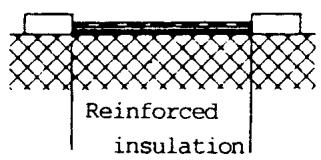  
Example 2: Also for pollution degree 3 and 4.

Circuit-board conductor as protective screen according to 5.2.18.3

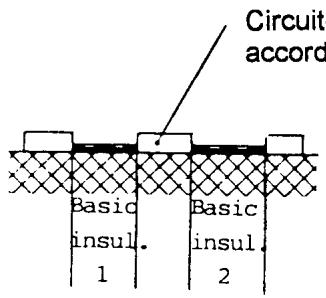

Ciearance

Creepage distance

Figure 15 Ð Clearances and creepage distances for protective separation

## 5.2.18.6 Components and other electrical sub-assemblies

The requirements as given in 5.2.18 are supplemented for components and other electrical sub-assemblies by those given below.

The internal wiring of components and other electrical sub-assemblies shall be implemented in such a manner that, neither through mechanical action nor through breaking, unfastening, or detachment of a wire, the insulation of the protective separation can be impaired to such an extent that the insulation no longer fulfils the requirements for basic insulation (see annex A for A.5.2.18.7 to A.5.2.18.10).

## 5.3 Requirements for EEs in installations with regard to protection against electric shock

The requirements of the standards in the series HD 384.4.41 S2 shall apply except in installations with a decisive voltage above a.c. 1 400 V or d.c. 2 000 V (see 5.2.13) where the accessible conductive parts of EE shall be connected to protective earth.

Testing of EE in installations to check the provision of protection against electric shock shall be performed for each installation. This testing does not refer to the EEs but to the parts for the interconnection of the EEs. Furthermore, 612 of HD 384.6.61 S1 and Amendment 1 of IEC 364-6-61 (comprising e.g. tests for continuity of protective conductor, insulation resistance, function) shall apply for the testing of parts in low-voltage installations (with decisive voltage according to 5.2.13 greater than a.c. 50 V or d.c. 120 V). The implementation on parts in high-voltage installations (decisive voltage greater than a.c. 1 400 V or d.c. 2 000 V) shall be checked by visual inspection or in case of doubt by measurement.

## 5.3.1 Protection with regard to direct contact

In installations, visual inspection shall be conducted to ensure that the measures performed in accordance with 5.3.1.1 to 5.3.1.4 have been properly carried out.

## 5.3.1.1 Cables and leads

The cables and leads (except the protective conductors) used in the erection of an EE in an installation which are accessible for contact without opening or removing a barrier or are laid on extraneous conductive parts shall have double or reinforced insulation between the core and the surface or shall be surrounded by a metal screen having a satisfactory current-carrying capacity in the event of a short-circuit between the core and the screen.

This does not apply to cables and leads which contain only circuits with protective separation according to 5.2.8 and are laid separately from cables and leads of other circuits; and this also does not apply to bare conductors in closed electrical operating areas.

Circuits with protective separation according to 5.2.8 shall be wired within their own cables or leads and shall be laid separately from cables and leads of other circuits so, that they do not touch each other.

If circuits with protective separation according to 5.2.8 have been wired with integrity within their own cables or leads but without special separation from other cables and leads, then the cables and leads of circuits with protective separation shall be wired according to paragraph 1 above. This shall apply even if they are not accessible for contact without opening or removing a barrier or are not laid on extraneous conductive parts. If circuits with protective separation according to 5.2.8 are wired within multi-core cables or leads together with other circuits, then the insulation of each core shall be designed for the highest rated insulation voltage of the adjacent circuits according to 5.2.3.

## 5.3.1.2 Connection of EE with protective separation

When installing EE into its operating location, it shall be ensured that any existing protective separation according to 5.2.18 is maintained throughout the entire length of the circuit in question. Circuits with protective separation according to 5.2.8 shall therefore be connected with circuits of other equipment only when these circuits are also constructed according to 5.2.8. When sub-units of EE are connected together by plugs and sockets etc., continuity of the required protective separation throughout the interconnections shall be maintained. The manufacturer shall ensure that the design is such that the chance of polarity errors occurring shall not be existent when the plugs and socket connections are re-mated following disconnections.

When connecting external interconnecting leads of EE, care shall be taken that the clearances and creepage distances required for protective separation are still effectively maintained (e.g. when using cable lugs), and that they are not reduced as a result of bending of the interconnecting lines.

For circuits according to 5.2.8 where protective separation is required the installer shall ascertain whether protective separation is provided. If it is not provided, then double insulation according to Figure A.5 of A.5.2.14.1 shall be provided. Where adjacent circuits have a higher RIV, then supplementary insulation shall be added (see also Figure 9 and Figure 13 of 5.2.15.1).

In installations the compliance of the measures for protective separation according to paragraph 3 of 5.3.1.1 and 5.3.1.2 shall be checked by visual inspection.

## 5.3.1.3 Built-in devices in installations

The content of 5.3.1.1 and 5.3.1.2 applies to the fitting of a built-in device as described in 5.2.6. Care shall be taken to ensure that the larger device or the enclosure which accommodates the built-in device provides the protection against direct contact according to 5.2.2 to 5.2.7. Where extra-low voltage system PELV or SELV is used (see 5.2.8.1), the above protection is not required.

5.3.1.4 EE in closed electrical operating areas EE which does not have its own protection against direct contact may be erected in closed electrical operating areas if a protection against direct contact is available or assigned for by means of obstacles and/or a distance according to 412.3 and 412.4 of HD 384.4.41 S2.

5.3.2 Protection with regard to indirect contact The means of connection for the protective conductor of EE of an installation shall be connected to the protective conductor. In case of a decisive voltage (see 5.2.13) above a.c. 1 400 V or d.c. 2 000 V they shall be connected to the earthing conductor (see also 5.2.9.6).

With respect to EE(s) in installations, the measures taken according to 5.3.2 to 5.3.2.3 shall be checked for conformity with the requirements by visual inspection. If required, calculation shall again be performed to confirm whether the requirements concerning permissible touch voltage according to 5.3.2.2 are satisfied. If an EE is installed via a residual-current-operated protective device as the only protective measure in case of indirect contact, then confirmation shall be made by consulting the operating instructions and the inscriptions on the EE as to whether operation under these conditions is permissible (see Figure 4 in 5.2.11.2).

## 5.3.2.1 Leakage current through the protective conductor

No special measures are necessary if a leakage current of a.c. 3.5 mA or d.c. 10 mA (for example originating from filters) from EE is not exceeded, or exceeded only in the case of failure of one or two line-to-neutral voltages of the supply mains or in the case of a fault. If the normal leakage current in fixed connected EE exceeds a.c. 3.5 mA or d.c. 10 mA, then one of the following conditions shall be satisfied:

a) a cross-section of the protective conductor of at least 10 mm2 Cu;

NOTE The minimum cross section was determined with regard to the mechanical strength.

b) monitoring of the protective conductor by means of a device which automatically disconnects the EE in the case of a fault;

c) laying of a second conductor through separate terminals and electrically parallel to the protective conductor. This conductor shall itself satisfy the requirements for protective conductors as given in 543 of HD 384.5.54 S1.

For measurement of leakage current see 5.2.11.1.

## 5.3.2.2 Permissible touch voltage

Earthing shall be carried out according to HD 384.5.54 S1 in such a manner that sustained hazardous touch voltages (values higher than a.c. 50 V or d.c. 120 V) are prevented even when inductive and capacitive components of the impedance of the protective conductor, neutral conductor, earthing conductor and the earth electrode are taken into account.

## 5.3.2.3 Protection of EE by residual-current-operated protective device

Before connecting EE to a branch of the supply mains where the line-side protection in case of indirect contact is achieved by means of an RCD, their appropriate function/combination shall be verified (see 5.2.11.2). If necessary, the line-side protection against indirect contact shall be established by other means, for example, by means of an overcurrent protective device.

NOTE Convertors in six-pulse bridge connection, directly connected to the supply mains are often used in EE. Care shall be taken with the application of RCDs in such circuits since the operation of RCDs type A and AC (see 5.2.9 of EN 61008) can be blocked by smooth residual d.c. current. RCDs type B are suitable in that case (IEC 755, Amendment 2).

When designing and constructing an electrical installation care shall be taken that EE which can cause smooth earth fault currents are attached to the supply system by a separate branch together with RCD of type B. The branching of RCDs of type B behind RCDs of type A or AC is not acceptable (see design example in Figure A.3 of A.5.2.11.2).

## 6 Environmental requirements and conditions

The requirements stated in this European Standard are regarded as normal conditions which represent the minimum environmental conditions to which EE is exposed. The EE shall operate within its performance specification throughout the environmental conditions stated in this clause namely:

Ð climatic;

Ð mechanical;

Ð electrical conditions.

Where EE is required to operate in conditions outside the range of values given in this European Standard then this shall be by agreement between the supplier and the customer, as defined in the particular individual, enquiry or purchasing specification.

NOTE That the agreement may provide for wider or narrower conditions of operation.

For functional test of EE see 9.4.7.

## 6.1 Climatic conditions

Climatic conditions of EE denote the conditions in the immediate environment.

EE shall be designed to operate within its performance specification over the range of the specified climatic requirements as listed in the groups of Table 7. No degradation of performance or loss of function, as defined in the performance specification of the EE, is allowed at or within the limits defined. The manufacturer shall state the climatic class for the EE in the operating documents.

For convenience, the locations in which EE may be installed have been divided into three climatic classes (as shown vertically in Table 7).

The parameters of temperature, relative humidity, and air pressure assigned to each climatic class are selected from a range of environmental conditions, which are expected to comply with the climatic conditions of the majority of the EE applications.

## 6.1.1 Temperature

The temperature to which EE will be subjected throughout its life depends upon the location in which it is sited. The temperature classification of Table 7 in 6.1 are grouped to provide a useful guide indicating the types of site which are to be found in practical applications.

## 6.1.1.1 Ambient air temperature

Climatic conditions as listed in the groups of column 2 in Table 7 of 6.1 apply to the range of values of temperature to which EE is exposed outside its enclosure (e.g. cubicle) if any. It does not refer to the values of air temperature within a cubicle or enclosure. Because the working temperature of EE is affected by adjacent radiant heat sources (as well as ambient temperature) allowance shall be made for any such radiant heat sources when they exist.

Where assemblies, units or sub-units e.g. printed circuit boards are to be installed within enclosures housing other items of EE (e.g. inside a cubicle), the temperatures at the mounting position shall be measured. In this case the ambient air for assemblies, units and subunits (affected by the internal air within the cubicle or the cabinet) shall be considered as a heat transfer agent and not as a cooling medium. If this is not possible, an increase of at least 15 K

Table 7 Ð Climatic conditions

<table><tr><td>Type</td><td>Typical site</td><td>Temperature(Note 1)</td><td>Relative humidity(Note 1)</td><td>Air pressure(Notes 1, 2 and 3)</td></tr><tr><td>A</td><td>Commercial locations, computer and equipment rooms with controlled environments (Note 4)</td><td>Class 3K2+ 15 °C to + 30 °C</td><td>Class 3K210 % to 75%2 g/m3to 22 g/m3</td><td>Class 3K286 kPa to 106 kPa</td></tr><tr><td>B</td><td>Weatherprotected, e.g. control rooms and equipment rooms not fully air conditioned (Note 4)</td><td>Class 3K3+ 5 °C to + 40 °C</td><td>Class 3K35 % to 85%1 g/m3to 25 g/m3(Note 7, 9)</td><td>Class 3K386 kPa to 106 kPa</td></tr><tr><td>C</td><td>Outdoors, light weatherprotected and non-weatherprotected locations, separately rack or cubicle mounted equipment, mounted away from high temperature plant</td><td>Class 4K4H-20 °C to + 55 °C</td><td>Class 4K4H4 % to 100%0,9 g/m3to 36 g/m3(Note 7, 8)</td><td>Class 4K4H86 kPa to 106 kPa</td></tr><tr><td>D</td><td>In storage</td><td>Class 1K4-25 °C to + 55 °C</td><td>Class 1K35 % to 95%1 g/m3to 29 g/m3</td><td>Class 1K486 kPa to 106 kPa</td></tr><tr><td>E</td><td>During transportation</td><td>Class 2K3-25 °C to + 70 °C</td><td>Class 2K3a) b) 95%c) 60 g/m3(Note 5, 6)</td><td>Class 2K370 kPa to 106 kPa</td></tr><tr><td colspan="5">NOTE 1 Class definitions in columns 2, 3, 4 from Table 1 of EN 60721-3-1, EN 60721-3-2, EN 60721-3-3, EN 60721-3-4, partly modified, see note 3.NOTE 2 When EE is used at an air pressure lower than 86 kPa (e.g. at elevated altitude), it is necessary to reduce the high temperature limit as given in 6.1.1 or the performance of the EE. It is advisable to consult the manufacturer.NOTE 3 The low air pressure limit is defined in 7.3 of IEC-Guide 106, except for transport. The guide recommends that the low limit be equivalent to 1 000 m altitude instead of the 3 000 m altitude defined in Table 1 of EN 60721-3-1 to EN 60721-3-4.NOTE 4 Where EE is required to continue functioning despite failure of air conditioning plant, the environment which would result should be ascertained and the relevant class specified accordingly. Fans and air conditioning plant may be used to prolong the life of EE in normal operation.NOTE 5 A light condensation of short duration may occur occasionally when EE is out of operation, for example when a small piece of EE such as a printed circuit board assembly is taken from a vehicle into an indoor location.NOTE 6 a) Maximum relative humidity when EE temperature slowly increases by 40 K;b) Maximum relative humidity when EE moves directly from -25 °C to +30 °C;c) Maximum absolute humidity when EE moves directly from +70 °C to +15 °C.NOTE 7 No condensation, no formation of ice.NOTE 8 Outside of the enclosure a light condensation of short duration may occur occasionally.NOTE 9 Correlation between air temperature and humidity is shown in Figure A.7 of A.6.1.2.</td></tr></table>

should be applied to the upper temperature limit appropriate to the environmental class as in Table 7.

## 6.1.1.2 Cooling medium temperature

For natural circulation (convection) and for forced circulation (forced cooling) of the cooling medium the extreme temperatures shall be:

Ð cooling medium temperature min. +5 8C,

for air and gas cooling: max. +35 8C;

Ð cooling medium temperature min. +5 8C,

for liquid cooling: max. +25 8C.

In case of higher cooling medium temperature the manufacturer will give the extent of the reduced performance of the EE.

For testing see 9.4.2.1.

## 6.1.2 Humidity and air pressure

## Humidity

Climatic conditions as listed in 6.1, Table 7, column 4, apply to the range of values of humidity to which EE is exposed for each group in the table.

The EE shall be designed such that it can effectively withstand the conditions of humidity given in column 4 of Table 7 for the group selected.

For testing see 9.4.2.2.

## Air pressure

Climatic conditions as listed in column 5 in Table 7 of 6.1 apply to the normal range of values of air pressure to which EE is exposed for the group selected.

## 6.1.3 Pollution

Normally the EE is designed according to pollution degree 2 (2.5.1 of HD 625.1 S1), but the permitted temporary condensation, expected occasionally, may occur only when the EE is out of operation.

When placing an order, the user of EE shall draw attention to any appreciable degree of contamination and coolant admixtures which are likely to promote corrosion.

If the environment of the EE (e.g. cooling air, cooling liquid) contains impurities which can endanger the normal function of the EE, adequate countermeasures shall be taken, for example, by means of appropriate enclosures (5.2 and 6 of EN 60529), air ducts,

installation of filters, ion exchangers or by periodical cleaning of the installation (see annex A for A.6.1.3 and A.6.1.4).

## 6.2 Mechanical requirements (general)

The performance or working life of EE can be reduced by mechanical damage occurring during manufacture, transportation, erection, operation and maintenance. Such mechanical damage can be sustained as a result of shocks, impacts, or vibrations.

It is concluded from experience, that EE will be immune to the stresses occurring during continuous operation and transportation if the mechanical tests according to 9.4.3.1 and 9.4.3.2 have been passed without damage.

## 6.2.1 Mechanical shock

It is not possible to quantify fully the shocks and impacts to which EE may be subjected during manufacture, transportation, erection, operation and maintenance. A supplier shall therefore make such recommendations and take all sensible precautions to ensure avoidance of any damage.

EE is subject to mechanical shock during transportation. Protection against such damage occurring shall be by the provision of appropriate protection, packaging and labelling suitable for usual forms of transportation.

It is a requirement of EN 60721-3-2 (Table V, class 2M1) that EE with a weight of less than 20 kg shall endure toppling around the edges.

EE which is required to be handled during its working life e.g. sub-assemblies of EE, plug-in items, portable equipment etc. are considered to be a risk in respect of mechanical shock e.g. while being serviced on a bench, and as such shall be subject to topple tests as described in EN 60068-2-31, test Ec. The topple tests shall be chosen in accordance with the guidance given in EN 60068-2-31 and tested in accordance with 9.4.3.1. In the event of any other immunity levels being required (e.g. special stresses, seismic requirements), these shall be by agreement between the supplier and the customer, as defined in the particular individual, enquiry or purchasing specification.

## 6.2.2 Mechanical vibration

Vibration levels will vary depending upon where the EE is installed. In power stations the predominant frequency is likely to be 50 Hz, though in the vicinity of rotating plant, lower frequencies may be experienced.

## 6.2.2.1 Immunity requirement to mechanical vibration

This requirement is guided by class V.H.2 in Table II of HD 413.3 S1.

To comply with the immunity requirement of this standard, the EE shall have passed the vibration test Fc of EN 60068-2-6 according to 9.4.3.2.

At locations where higher immunity levels are required, they shall be agreed between the supplier and the customer.

## 6.2.2.2 Mechanical vibration emission constraints

EE shall not itself generate any vibration at a level which could be detrimental to its own performance either directly or through long term fatigue, or to any other EE, or which could cause annoyance, discomfort or harm to personnel.

Where levels of emission are likely to be significant, they shall be declared by the supplier and any constraints required by the user shall be by agreement between the supplier and the customer.

## 6.2.3 Sealing in case of liquid cooling

For EE with liquid cooling, the sealing of the cooling circuit shall be ensured when the EE is used as intended.

For testing see 9.4.3.3.

## 6.2.4 Sealing against dust ingress to EE

Where there is a requirement for the protection of EE against dust ingress, (for example in pulverized fuel plants or cement works,) the purchasing documents shall specify the need for enclosure of the EE in dust tight enclosure(s) giving the appropriate IP classification.

For test requirements see 9.4.4.3.

## 6.3 Electrical and electromagnetic requirements

The EMC requirements shall be fulfilled on the apparatus or the system level.

The apparatus or the system shall be designed so that it complies:

Ð with the requirements given in the relevant EMC product or EMC product family standard such as EN 61800-3;

Ð or if not available with the EMC generic standards:

EN 50081-1 and EN 50082-1

or

EN 50081-2 and EN 50082-2.

NOTE Generic standards EN 50081-X and EN 50082-X do not cover the whole electromagnetic environments which may occur; special environments (e.g. high voltage units) should be subject to particular provisions.

(See Annex A.)

## 6.3.1 Conditions in the system (immunity level for EE)

In some cases the immunity level equals the compatibility level. This is the minimum requirement. The parties involved, manufacturer and user, may choose an immunity margin if necessary between these levels in order to ensure reliable operation.

The variety and the diversity of the apparatus (electronic equipment) within the scope of this document makes it impossible to define precise criteria for the evaluation of the immunity test results.

Apparatus (EE) shall not become dangerous or unsafe as a result of the application of the tests defined in European EMC standards to verify the immunity from electromagnetic disturbance.

A functional description and a definition of performance criteria, during or as a consequence of the EMC testing, shall be provided by the manufacturer and noted in the test report.

The term apparatus includes equipment and systems, whereas components and installations are excluded.

## 6.3.2 EE connected to a.c. supply mains (immunity) (valid for line-to-neutral voltage and line-to-line voltage)

NOTE The conditions laid down in these subclauses shall be understood not as requirements for supply mains but as those for EE except where the supply source is an integral part of the EE.

## 6.3.2.1 Supply voltage variation

Data processing equipment with control on EE shall satisfy the requirements of this European Standard when it is continuously operated with r.m.s. values between 86 % and 110 % of the rated supply voltage at its supply terminals.

NOTE 1 Voltage dips and interruptions should be considered as given in A.6.3.2.3.

NOTE 2 Tables I and III of HD 472 S1 and A.4.3 of EN 50082-2 limit voltage variations at the supply terminals (of the consumer's installation) to ±10 % of the nominal system voltage but an additional 4 % voltage drop can occur between the origin of the consumer's installation and the socket-outlets and equipment terminals respectively (8.1.1 of IEC Guide 106).

See 9.4.6.2 for applicable standards with supply voltage variation tests.

For operation of line-commutated power convertors the lower limit of the supply voltage is restricted to 90 %. This value applies to the coupling point of the power electronic equipment to the supply system. Power electronic equipment includes the line-side conductors and transformer or reactors.

## 6.3.2.2 Frequency

EE shall be designed to operate at a rated supply frequency of 50 Hz.

EE shall satisfy the requirements of this European Standard if the frequency of the electricity supply system deviates by up to ±1 % from the nominal value. In the particular case of EE used in electricity generation, transmission and distribution applications the frequency deviation may be 26 % to +4 % under ªblack startº conditions or during major system disturbances possibly leading to load disconnection, EE shall continue to perform to full specification in this situation in order to ensure the safe operation of the plant being controlled (see annex A for A.6.3.2.3 to A.6.3.2.6).

## 6.3.3 EE connected to d.c. supply mains (immunity)

## Rectifier supplied mains

Where d.c. is generated by use of rectifiers (without energy storage e.g. battery, capacitor, smoothing reactor), the details of 6.3.2 shall be applied as appropriate to the design.

In the case where supply output voltage variation below 85 % of the rated voltage can occur, there shall be no damage to the EE, when its operation is interrupted by the operation of protective devices.

Where d.c. is generated from three phase uncontrolled rectifiers, the peak to peak ripple voltage superimposed on the d.c. output shall not exceed 15 % (see annex A for A.6.3.3).

## 6.3.4 Short-circuit withstand capability (immunity)

For EE output circuits which are designed as short-circuit-proof the following applies: a short-circuit of any duration which occurs at rated operation at any EE output terminals shall not cause unacceptable heating or any damage to EE or its parts. After elimination of the short-circuit the EE shall be again completely operable without replacing any components or without taking any other measures (for example switching operations). Where there is a requirement for several outputs to be short-circuit-proof simultaneously, this should be separately specified.

NOTE The short-circuit withstand capability of a power convertor can be achieved in cooperation with electronic protective equipment. The short-circuit may occur owing to a single or multiple earth fault.

In the case of a short-circuit at the conditionally short-circuit-proof outputs of EE only the prescribed protective devices for example fuses, switches, electronic interlocks, electronic current limiter shall respond.

non-short-circuit-proof outputs of EE some damage in the EE may occur, but however, the requirements as given in 4.2 (damage to persons) shall be complied with.

For testing see 9.4.6.3.

## 6.3.5 Immunity from electromagnetic disturbance

These requirements apply to immunity of the EE interfaces to RF transients, high frequency, or power frequency disturbances. Minimum requirements are specified in the standards quoted in 6.3.

For testing see 9.4.6.2.

(See annex A.)

## 6.3.6 Effects of EE(s) on the system (emission) Reaction on the supply mains

These requirements refer to low frequency conducted emission (see annex A.6.3.6).

## Emission of radio frequency disturbance

EE is likely to emit conducted or radiated radio frequency disturbance. These shall be kept limited as given in 6.3 in order to avoid interference with other equipment.

For testing see 9.4.6.1.

(See annex A.6.3.6.)

## 6.3.7 Rating of power electronic equipment

In the case of rated supply voltage, power electronic equipment shall comply with the rated operational data, i.e. rated output voltage, rated output current and rated output power (3.2.1.1 of EN 61136-1).

## 7 Requirements for electronic equipment

## 7.1 Design and construction

This clause contains requirements for the design, manufacturing and assembly of EE.

## 7.1.1 General

A number of factors must be considered in the design of the EE so that it performs reliably and as specified when it is installed in its operating environment. Of particular importance is constancy of quality of the selected EE. Clause 7 highlights some of the criteria which shall be implemented, additionally the content of A.7 should be considered.

Where there is a choice between different constructional techniques or different materials, finishes, etc. the choice should be made on the required reliability and life considerations.

## 7.1.2 Quality and reliablility

To achieve the high reliability required for EE, good design is essential, entailing the use of components and parts of the requisite quality which shall comply with the relevant product standards.

In this context quality assurance is guided by international standards of EN 29000 series (see annex A).

## 7.1.3 Working life

The EE shall be designed for a working life of no less than five years in the specified environment and application. At least during that time the supplier shall ensure full support with regard to:

Ð servicing;

Ð repair and replacement of components;

Ð support/updating of software and firmware. Normal routine and breakdown shall be assumed and it is accepted that certain consumable components and modules may need periodical replacement or adjustment. However, the manufacturer shall state the expected frequency of such replacement or adjustment. NOTE This period of five years is based on the restrictions in the definition of working life. If one or more of these restrictions are neglected the operation of the installation is given for a longer period.

## 7.1.4 Insulation

The insulation within the EE shall be designed such, that in normal use, within its working life in the specified environment, it will not degrade to the extent that the function of the EE is impaired.

Insulation necessary for the protection of persons against electric shock shall comply with the requirements of clause 5.

Additionally, insulation shall meet the test requirements as given in 9.4.5.1 to 9.4.5.3 wherever applicable.

## 7.1.5 Component selection and use

The criteria presented in this subclause for the selection of components for EE are supplemented by additional information in the informative part of this standard. Whilst the informative material is not obligatory unless specifically called up in the purchasing specification, it should be considered with this subclause when applying this standard.

For components relevant to protective separation see also 5.2.8.3 and 5.2.14.3.

Where applicable, all components shall be to the relevant standards i.e. series of IEC 747, IEC 748 etc..

## 7.1.5.1 Selection criteria for components

Component types shall be selected to ensure high reliability and stability of the EE.

The design should not depend on individual selection to obtain a specific value of particular component. It is the manufacturer's responsibility, to do his utmost to use standard components.

When non-standard components are used, they should be clearly indicated, their reliability specified in accordance with 7.1.2, and their availability guaranteed on a contractual basis.

The future availability of all components and parts should be established at the design stage. Where possible, components should be available from more than one source.

## 7.1.5.2 Hazards arising from components

Components which could be a hazard to personnel, either in use or under failure conditions, or which could be a hazard during disposal shall be avoided. In the very rare instances where this is not possible the supplier shall draw attention to the possibility prior to EE purchase/delivery (see annex A for A.7.1.5.3 to A.7.1.5.9).

## 7.1.6 Power supply switching, fusing and usage

## 7.1.6.1 Fire protection and fire risk

The minimization of fire risk, both within the EE and to cabling and wiring, shall be a major consideration. Protection consistent with reliability and operational requirements shall be provided.

All circuits shall be designed so that in the event of a component failure, no damage occurs to any interconnecting cabling, wiring or mounting, and that any other damage that does occur is confined as closely as possible to the fault unit, e.g. to a single cubicle.

Components shall be chosen and used so that there is negligible risk of a fire being caused due to component failure or possible short-circuit. In instances where this is not possible as a result of fault conditions (e.g. coupling capacitors and zener diodes which give short-circuit conditions):

Ð suitable protection shall be provided;

Ð the supplier shall draw attention to the possibility. (See annex A.)

## 7.1.6.2 Operation under fault conditions

The manufacturer shall provide sufficient information about the worst case fault conditions to enable the installer to select the correct cross section of conductors and the required setting of overload protection devices (see 8.3.3 and 9.4.6.3).

The above is of particular importance when:

Ð under use as intended, a fault in the EE can cause the rated output current of the EE to be exceeded, resulting in thermal overload of the protective conductor or other equipment fed by the EE;

## AND

Ð when the EE fault does not automatically cause a disconnection to its supply.

NOTE Failures or faults may be short-circuits in the EE, or to exposed conductive parts, earth faults, or short-circuit in the output circuits, failure in the control circuits, or blocking of a motor fed by power EE.

(See annex A for A.7.1.6.3 to A.7.1.6.5.)

## 7.1.7 Construction

## 7.1.7.1 EE mounting practice Ð general

The construction of EE shall take account of the requirements for mechanical strength as given in 6.2. Where EE is mounted in sub-racks, the mechanical details shall comply with HD 493.1 S1.

## 7.1.7.2 Cooling

EE shall be designed with sufficient cooling to prevent localized regions of high temperature.

When determining the temperature rating required of components, account shall be taken of 6.1.1.1, paragraph 3 and 4 (see annex A).

7.1.7.3 Mechanical protection of equipment and sub-units

It shall be possible to lay equipment and plug-in sub-units, e.g. printed circuit boards, for the purpose of inspection on any of their faces without causing damage to any components or controls, etc.. Where necessary, mechanical guards shall be fitted.

NOTE Care should be taken during handling to protect the equipment and sub-units from damage which could arise from static discharges.

Both during insertion and when in their working position, sub-units shall have adequate clearance between all adjacent items of EE so that no fouling occurs.

## 7.1.7.4 Layout of components and equipment Heat dissipation in normal operation:

Components generating a significant amount of heat shall be adequately spaced both from their mounting board and from other components, particularly those whose life might be shortened or stability impaired by being operated at a temperature higher than necessary. Heat from neighbouring parts shall be taken into account.

Heat dissipation under fault conditions: The design/layout shall be such that under fault conditions the spread of fire will be minimized.

## 7.1.7.5 Temperature of accessible parts

The temperature limit values given in Table 8 for covers within arm's reach and for actuating elements shall not be exceeded during normal operation and at the highest permissible ambient temperature.

Protection against direct contact as required by 5.2.2, creepage distances, clearances and distances through insulation as specified in 5.2.14 and 5.2.15 shall not be impaired due to the heat occurring in normal operation.

## For testing see 9.4.2.1.

NOTE A warning label is required if the temperature during operation becomes higher than the values given in Table 8.

## 7.1.7.6 Fixing (mechanical retention of components and sub-units)

All components shall be mounted in EE in such a manner that neither they nor their fixings or connections are affected as a result of the EE being subjected to the tests specified in 9.4.3.1 and 9.4.3.2. Screwed connections shall be locked against unintentional loosening e.g. by lock-washers, spring-washers (see annex A for A.7.1.7.7 Component mounting).

## 7.1.8 Electrical connections

The design of electrical terminations and connection points shall be such that the expected reliability will be maintained during the service life of the EE. Allowance shall be made for the conditions normally encountered in service, e.g. corrosion, shocks, heat and creep. (For corrosive atmosphere see A.6.1.3.)

The establishment of electrical connections according to 4.5, 7.1.8 and A.7.1.8 if applicable shall be verified by visual inspection (see annex A).

## 7.1.9 Multiple connectors and plug-and-socket devices

For devices which may be connected or disconnected in normal use, that is when live or conducting, it shall not be possible to interchange them or reverse their polarity thereby causing hazard to equipment or personnel. Where a protective conductor connection is required, it shall not separate before all the live conductors are disconnected, and the live conductors shall not connect before the protective conductors (see annex A).

## 7.1.10 Electrical conductors

The conductors shall at least be designed according to HD 384.5.523. See also 8.3.3 for the design and protection of conductors to and in EE.

## 7.1.10.1 Wires and cables for interconnection

Wires and cables for connections between components, sub-assemblies and equipments shall comply with the electrical, mechanical and environmental requirements of this European Standard. Furthermore, the construction of the wires and cables and their cross sections shall be suited to the particular connection method used.

Etched flexible printed wiring may also be used within sub-assemblies. However such wiring shall not carry components other than connectors.

## 7.1.10.2 Conventional wiring within EE

The type of wire used including its insulation shall be chosen so that it is suitable for the conditions of operation and the method of termination. Crimped connections are preferred for multi-stranded conductors. For internal PVC-insulated conductors see HD 21.7 (see annex A).

## 7.1.11 Reference conductor, functional earthing

The protective conductor on the EE shall not be opened during any condition of operation (see annex A for A.7.1.12 Programmable equipment).

## 7.2 Marking, identification, documentation

Compliance with the requirements for marking, inscriptions, operating manuals and documentation shall be verified by visual inspection during testing.

## 7.2.1 Marking

Equipment, sub-units and plug-in parts of EE shall be provided by the manufacturer with the following durable indications:

a) name or mark of origin of the manufacturer or the supplier;

b) unique type designation.

Where applicable, the following shall be marked on the EE or on parts of the EE:

Ð supply voltage, kind of voltage and frequency; Ð on EE of protective class II: the symbol No. 5172 as given in HD 243 S10 (see 5.2.12);

Ð where not possible to identify the protective conductor by its shape or position, it shall be coloured green-yellow (see also 5.2.9.8);

Ð the need to earth the supply neutral, particularly when an earthed supply system has been assumed, when determining the decisive voltage or rated insulation voltage. (see paragraph 1 of 5.2.13; paragraph 1 of 5.2.16.2; paragraph 2 of 5.2.17);

Table 8 Ð Heating of accessible parts

<table><tr><td>Accessible parts</td><td>Material of accessible surfaces</td><td>Temperature limits °C</td></tr><tr><td rowspan="2">Covers within arm&#x27;s reach</td><td>Metal</td><td>70</td></tr><tr><td>Insulating material</td><td>80</td></tr><tr><td rowspan="2">Hand operated devices (knobs, switches)</td><td>Metal</td><td>55</td></tr><tr><td>Insulating material</td><td>65</td></tr></table>

Ð the connection point for the protective conductor with the symbol No. 5019 as given in HD 243 S10 or with letters PE or with colours green/yellow (see 5.2.10);

Ð modification of the EE made by the manufacturer during the commissioning, particularly in safety related applications with modification number or reference; Ð short-circuit-proof outputs (see 6.3.4);

Ð a warning sign, if the capacitors are not discharged within 5 s after switching-off (see 5.2.5);

Ð connecting points for incoming conductors according to the specifications given in the respective diagrams (see 7.2.2);

Ð a design notice pointing to type B in case of use of RCD or to another protective measure if required according to 5.2.11.2 and/or 5.3.2.3;

Ð precautionary warning concerning special requirements for storage or handling (see A.7.1.5.5 and A.7.1.5.7).

## 7.2.2 Identification of equipment, sub-units, position and terminals

## Equipment identification

Labelling on EE should be in accordance with good ergonomic principles so that warning notices, controls, indications, test facilities, fuses, etc., are sensibly placed and logically grouped to facilitate correct and unambiguous identification.

## Sub-unit and position identification

Each mounting position shall be marked to indicate the sub-unit to be located in that position. Where this is not practicable, a diagrammatic label shall show the mounting position and be fixed in an appropriate position.

Sub-units which have been individualized by the manufacturer during the commissioning shall be marked, particularly in safety related applications.

## Terminal identification

Each terminal shall be clearly and unambiguously identified by suitable marking which is on or adjacent to it. Individual terminals within a connector shall be unambiguously identifiable.

Markings for the connection points for conductors led in from outside the EE shall agree with the particulars on the relevant drawings. Protective conductor terminals shall be marked according to 5.2.10 (see annex A for A.7.2.2 Component identification).

## 7.2.3 Documentation

## 7.2.3.1 General

Unless specifically agreed, documentation shall be supplied to cover each item of EE on a contract, so that EE can be identified properly and safely understood, installed, commissioned, operated, checked, calibrated, maintained, periodically serviced by the user, dismantled and disposed of.

Documentation should relate to the actual equipment supplied. It should not include any

irrelevant/superfluous information (e.g. relating to variants not supplied on the contract). Where this is not practicable, relevant information should be clearly differentiated from the irrelevant by some convenient method.

The documentation shall be in a language agreed between customer and supplier. If no language is specified, an official CENELEC language shall be used. The documentation shall include details of any individualization.

A list of spare parts and a list of special tools shall be provided.

For documentation of software, firmware and programmable logic see A.7.2.3.5.

## 7.2.3.2 Operating documents

The instruction manual shall include information relating to any hazardous materials, such as handling and disposal procedures, and any implosion, explosion and associated risks, where unexpected danger (even to expert staff) could result.

As far as it is applicable, the following shall be indicated in the operating documents, for example, instructions for use, circuit diagrams and the like:

Ð all information necessary for the safety and normal operation and maintenance of EE (for example according to 5.2.7, 5.3.1.3, 5.3.1.4);

Ð necessity of earthing for the neutral conductor of a circuit (see paragraph 1 of 5.2.13; paragraph 1 of 5.2.16.2; paragraph 2 of 5.2.17);

Ð external connections of circuits with protective separation which are not dangerous to be touched (see paragraph 3 of 5.2.8);

Ð necessity of fixed connection if leakage current exceeds a.c. 3,5 mA or d.c. 10 mA (see 5.2.11.1); Ð acoustic noise generation above 70 dB — acoustic noise generation above 70 dB

(see A.4.7);

Ð type of climatic conditions according to Table 7 of 6.1;

Ð a design notice pointing to type B in case of use of RCD or to another protective measure if required according to 5.2.11.2 and/or 5.3.2.3;

Ð circuits with explicitly specified electrical isolation [paragraph 3 of 5.2.8 and Figure 16c) of 9.4.5.2.3];

Ð overcurrent protection devices required for protective screening (see paragraph 3 of 5.2.18.3);

Ð existing protective separation with respect to other circuits (see last paragraph of 5.2.18);

Ð if necessary information on the continuously flowing current in the EE in case of a fault according to 7.1.6.2.

7.2.3.3 Instructions for transport, maintenance, fault finding, repair

Instructions for transport

Instructions for transport shall be prepared as far as necessary.

## Instructions for maintenance

Maintenance procedures shall be described. Criteria for preventive maintenance and/or relevant maintenance intervals shall be given.

## Instructions for fault finding and repair

Instructions for fault finding and repair shall be given to the extent that is relevant for operation and maintenance personnel.

## 7.2.3.4 Test records

Records of final routine and commissioning tests shall be provided. A list of type test records shall be kept available by the supplier.

## 7.2.4 Drawings and diagrams

Equipment drawings and installation drawings shall be included in the documentation where they are necessary to meet the requirements of 7.2.3.1 or 7.2.3.2.

All drawings and associated component lists shall bear an appropriate drawing number, issue number, title and modification details (see annex A for A.7.2.4 and A.7.3 Setting-up, calibration, maintenance).

## 8 Requirements for the assembly of EE(s) in power installations

## 8.1 General

Clause 8 is concerned with the assembly of EE(s) into a power installation and its interaction and integration with other equipment in that installation.

For functional test of EE(s) in installations see 9.4.7 (Performance tests).

## 8.2 Fitting tolerances after assembly

EE shall be installed so that when assembled and connected as stipulated, the clearances and creepage distances do not fall below those according to 5.2.16 and 5.2.17.

## 8.3 Supply mains

## 8.3.1 Monitoring of insulation

A monitoring device applied for checking the condition of insulation on an unearthed supply is required to indicate when the insulation resistance falls below a minimum value. The insulation monitoring shall include the supply mains, all EE(s) connected without electrical separation to the supply and the loads connected to EE(s).

NOTE Insulation monitoring devices using superimposed d.c. voltage can be made inoperative by an extraneous d.c. voltage originating from an earth fault occurring at the output of power electronic equipment.

## 8.3.2 Functional earthing

Where a reference conductor is electrically connected to the functional earth, care shall be taken to ensure that the reference conductive circuit remains free of electrical disturbances.

The protective conductor terminal of EE may be used for functional earthing, but under no circumstances shall such action impair the protective measures and safety of personnel and the installation.

NOTE Possible suitable earths are, for example:

Ð the protective earth;

Ð the earth specially laid for functional earthing;

Ð earthed conductors in buildings, except where this is the lightning conductor.

## 8.3.3 Design and protection of conductors to and in EE

These requirements are derived from the standards HD 384.4.43 S1 and HD 384.4.473 S1.

In all cases however, appropriate earth resistance checks, insulation voltage and conductivity tests shall be performed (or evidence of such testing provided) to check that such connections are satisfactory.

## 8.3.3.1 Power input conductors to EE

The line-side conductors of EE shall be designed for the rated input current. In case of alternating load, the load duty types according to 3.5 of EN 61136-1 shall be applied. The conductors shall be protected in case of overload or short-circuit (433 and 434 of HD 384.4.43 S1).

Fuses for the protection of semiconductors are acceptable for protection in case of overload provided that:

Ð the conductors and the fuses for the protection of semiconductors are designed for the rated current of the EE;

AND

Ð the fuses are full-range breaking-capacity fuse-links (breaking range g according to 5.7.1 of EN 60269-1);

AND

Ð the particular EE is the only load connected to these conductors.

An automatic electronic blocking device is acceptable for overload protection.

No particular overload protective device is necessary for the conductors between a convertor transformer or commutating reactors and the convertor equipment (1.2 of HD 384.4.473 S1).

The protective device for protection in case of short-circuit shall be arranged at the line side connection of the branch to the EE.

Provided that the conductors between a convertor transformer or commutating reactor and convertor equipment, are laid in a short-circuit-proof and earth-fault-proof manner and they are not close to inflammable materials, specific protection against short-circuit is not required.

The laying of conductors is regarded to be short-circuit-proof and earth-fault-proof when they have double or reinforced insulation between the cores and between core and exposed conductive parts as well as extraneous conductive parts (see annex A).

8.3.3.2 Conductors between separated parts of an EE Conductors which form the interconnection between separately mounted parts of a power EE (e.g. convertor and smoothing reactor; rectifier, invertor and filter) shall be selected according to the instructions of the manufacturer of the EE. Specific protection for overload or short-circuit is not necessary for these conductors.

## 8.3.3.3 Conductors on the load side of EE

Conductors connecting a power EE to a load fed by this EE (e.g. a motor) are normally sized for the rated output current of the EE. In case of non-uniform load, it is necessary to consider the load duty cycle of the EE in accordance with 3.5 of EN 61136-1.

The conductors shall have short-circuit protection facilities.

When the conductors are not rated for the fault current as specified by the manufacturer of the EE (see 7.1.6.2), overload protection shall be provided (see also A.8.3.3.1).

Fuses or circuit breakers for protection of semiconductors, to be effective on the load side of the EE are acceptable for protection in the event of overload or short-circuit. However, for overload protection only, full-range breaking-capacity fuse-links (breaking range g in accordance with 5.7.1 of EN 60269-1) are acceptable.

A suitable automatic electronic blocking device is also acceptable for protection in the event of overload and/or short-circuit.

NOTE Protection devices arranged on the supply side of EE may not be suitable for protection in case of overload or short-circuit on its load side because of the kind of operation of the EE.

The above listed paragraphs apply also to the rating and protection of the common conductors, when a power EE feeds several loads (e.g. uninterruptable power supplies, group drives). The branch conductors to the individual loads shall be rated according to their rated load currents. The branch conductors shall have protection against overload and short-circuit.

## 8.3.3.4 Protective conductors

The cross section of protective conductors shall be designed to the corresponding phase conductors in accordance with 543.1 of HD 384.5.54 S1.

When, however, the manufacturer of EE has specified fault currents which can flow continuously (see 7.1.6.2) through the protective conductor of the EE, or through the protective conductor of the equipment fed by the particular EE and where overload protective devices are not provided by the installer, then the protective conductors shall be rated at least for this continuous current.

NOTE The design of the protective device for a phase conductor shall take into account that the current in the protective conductor may become higher than the current in the phase conductor under fault conditions. Attention shall be paid to any instructions from the manufacturer concerning this fault condition.

## 9 Testing

Testing as defined in this clause, is required to demonstrate that EE is fully in accordance with its requirements as specified in this European Standard.

## 9.1 General

The subclauses in this section describe the procedures to be adopted for the testing of EE. They describe:

Ð type tests;

Ð routine tests;

Ð sample tests;

Ð site tests;

Ð individual tests which when combined in a sequence, form the above tests.

The tests detailed in this clause are basic and may be supplemented where necessary by additional tests agreed upon between manufacturer and user (e.g. acceptance test). Examples of these tests are given in A.9. The test conditions shall be as stated in the appropriate IEC standard unless otherwise stated in this European Standard.

Unless otherwise agreed, testing shall be performed in accordance with the standards of EN 29000 series and the applicable basic standards e.g. from the series of EN 60068-2 and EN 61000-4 or corresponding HD- or IEC-documents.

Witnessing and recording of the tests shall be carried out in accordance with EN 29000 series.

Actions required in the event of failure of EE during testing and requiring retest shall be performed according to the series of EN 29000 standards.

The manufacturer and/or test house, shall ensure that the specified maximum and/or minimum environmental (or test) values are imposed, when a test is applied, having already taken tolerances and measurement inaccuracies fully into account. This task shall be carried out by the manufacturer or the test house by agreement with the customer.

## 9.1.1 Tests and methods of testing

## 9.1.1.1 Type test

Type tests are carried out in order to verify the design characteristics of a particular design of EE. It shall be verified by tests that the design specification is fulfilled as specified. If not otherwise specified the type test may be carried out in any appropriate sequence. The type test may be carried out on a preproduction sample or on different samples of the same type.

Unless otherwise agreed, type tests shall be performed on all EEs which have not previously been the subject of satisfactory type testing, or which have been the subject of modifications which could affect the performance of the EE.

Where certain details of EE are altered, the particular type test(s) whose results could be affected by the alterations shall be repeated on the EE. In the case of a single unit of EE being manufactured, it shall also be subjected to a type test.

The type test may be carried out by the manufacturer and the manufacturer shall provide documentary evidence of satisfactory results to the customer when required to do so. Alternatively the test may be carried out by an independent test house if agreed between manufacturer and customer. In this case the test house shall provide documentary evidence of satisfactory results to the customer when required to do so.

All the type tests in column 2 of Table 10 (see 9.3) shall be performed on components and all of column 4 on EE unless otherwise specifically agreed (see annex A).

## 9.1.1.2 Routine test

Routine testing comprises a series of tests and shall confirm that each individual EE has been correctly manufactured and set up and shall ensure that protection against electric shock is provided and that the functional requirements are met. If not otherwise specified these tests may be carried out in any sequence.

## 9.1.1.3 Sample test

A sample test is a test in which a sufficient sample of devices is tested. This test is repeated at appropriate time intervals in order to enable reliable conclusion on the uniformity of the manufacturing process to be assessed.

9.1.1.4 Site test

Site testing is required to check that:

Ð no damage to the EE has occurred in transit and that it has been properly integrated in the installation;

Ð the EE is suitable for and functions correctly in its environment;

Ð the protective and control devices operate as intended.

Where site testing is specified on EE which is interfaced with other equipment in an installation, it shall be carried out with the EE correctly installed in its final location and shall demonstrate that the EE:

Ð is compatible with other connected equipment; Ð is capable of performing its specified function when interconnected;

Ð has sufficient range in its variable and interrelated controls.

Where site testing is required, it will include tests from those listed in column 6 of Table 10 (see 9.3).

Where several EEs are integrated to a system, it will be necessary to perform a system test at site to check that the EEs comprising the system, together with their interconnecting cabling:

Ð have been properly installed;

± function properly in their installed environment;

Ð are compatible with other interconnected

equipments;

Ð perform their specified functions;

Ð are not adversely affected by

electrical/electromagnetic interference on site;

Ð have been properly earthed.

The site test shall be performed on each installation of EE(s) set up on site.

## 9.1.2 General conditions for testing

The tests shall be performed under the common test conditions given in Table 9 unless otherwise specified. The following data required for each test to be conducted, shall be made available from the manufacturer/test house on request:

Ð all information relating to correct installation and external connections;

Ð the correct verification procedures to be adopted; Ð measurement accuracy and tolerance permitted for all measurements.

These data shall be provided for:

Ð initial measurement;

Ð measurement during the individual test;

Ð final measurement.

Table 9 Ð General test conditions

<table><tr><td>Supplies and environment</td><td>Test condition</td></tr><tr><td>Mains power supply</td><td>Rated voltage and frequency</td></tr><tr><td>Temperature</td><td>Room temperature between 15 °C and 35 °C</td></tr><tr><td>Relative humidity</td><td>45 % to 75 %</td></tr><tr><td>Barometric pressure</td><td>86 kPa to 106 kPa</td></tr></table>

## 9.1.3 Verification procedure

The verification procedure shall ensure that the EE is in accordance with its specification and that it functions correctly during the initial measurement at the beginning of the test sequence and maintains its design characteristics throughout all the individual tests which follow (where this has been specified). Verification requires that the following measurements are made.

Initial measurement, measurement during the individual test, final measurement.

These measurements comprise a visual inspection and a shortened performance test.

In a test sequence where the final measurement of the previous test corresponds to the initial measurement of the succeeding individual test, it is not necessary to do these measurements twice, i.e. once is sufficient.

Performance criteria for the above mentioned measurements are:

Ð operation as intended within the specification of the EE;

Ð no destruction of any component of the EE;

Ð no erratic or unintendend behaviour of the EE and its software;

Ð no sign of component overheating;

Ð no live part shall become accessible;

Ð no cracks in the enclosure and no damaged or loose insulators.

## 9.2 Compliance with this European Standard

Compliance with the minimum requirements specified in clauses 4 to 8 shall be verified by carrying out the appropriate tests specified in this clause 9.

Compliance can only be claimed, if all tests have been performed and verified according to 9.1.3. Moreover, the manufacturer's obligations expressed in this part are not waived if no type test is required, or if the test conditions are restricted for practical reasons.

Compliance with constructional requirements and information to be provided by the manufacturer shall be verified by suitable examination, visual inspection, and/or measurement and the results recorded by the manufacturer/test house.

Where the design requirements within this European Standard are not covered by a test described in clause 9, then the design requirement shall be verified by means of a test or other procedure agreed between the manufacturer and the customer.

It is the manufacturer's responsibility to ensure that delivered EE and associated peripherals are technically identical to the sample(s) which have been type-tested according to this standard and therefore, that they comply with all requirements of this European Standard.

Significant modifications shall be indicated on the EE through the use of suitable revision level indices and markings, and a new type test may be required to confirm compliance.

## 9.3 Overview of tests

Type tests shall be performed wherever stipulated in this standard. Additionally where specified by agreement, sample tests and/or routine tests shall be carried out as a normal part of production quality assurance of EE.

Table 10 provides an overview of the type, routine and site testing of electronic components/devices, EE and EE(s) in installations with indication of the appropriate subclauses to be consulted.

Table 10 Ð Overview of tests

<table><tr><td>1</td><td>2</td><td>3</td><td>4</td><td>5</td><td>6</td></tr><tr><td rowspan="2">Requirements</td><td colspan="2">Components/devices for protective separation only</td><td colspan="2">Equipment (EE)</td><td> $EE in power^{1)}$ installation</td></tr><tr><td>Type test 9.1.1.1</td><td>Routine test 9.1.1.2</td><td>Type test 9.1.1.1</td><td>Routine test 9.1.1.2</td><td>Site test 9.1.1.4</td></tr><tr><td colspan="6">9.4 Performance of the tests</td></tr><tr><td>9.4.1 Visual inspections</td><td>9.4.1</td><td>9.4.1</td><td>9.4.1</td><td>9.4.1</td><td>9.4.1</td></tr><tr><td>9.4.2 Climatic environmental tests</td><td></td><td></td><td></td><td></td><td></td></tr><tr><td>Dry heat test</td><td></td><td></td><td>9.4.2.1</td><td></td><td></td></tr><tr><td>Damp heat test</td><td></td><td></td><td>9.4.2.2</td><td></td><td></td></tr><tr><td>9.4.3 Mechanical tests</td><td></td><td></td><td></td><td></td><td></td></tr><tr><td>Topple test</td><td></td><td></td><td>9.4.3.1</td><td></td><td></td></tr><tr><td>Vibration test</td><td></td><td></td><td>9.4.3.2</td><td></td><td></td></tr><tr><td>Seal test for liquid cooled EE</td><td></td><td></td><td>9.4.3.3</td><td>9.4.3.3</td><td>9.4.3.3</td></tr><tr><td>9.4.4 Safety related mechanical tests</td><td></td><td></td><td></td><td></td><td></td></tr><tr><td>Clearance and creepage distance</td><td></td><td></td><td>9.4.4.1</td><td></td><td></td></tr><tr><td>Non-accessibility test</td><td></td><td></td><td>9.4.4.2</td><td></td><td>9.4.4.2</td></tr><tr><td>Enclosure test</td><td></td><td></td><td>9.4.4.3</td><td></td><td></td></tr><tr><td>Suitability test for varnish or coating</td><td>9.4.4.4</td><td></td><td></td><td></td><td></td></tr><tr><td>9.4.5 Safety related electrical (dielectric) tests</td><td></td><td></td><td></td><td></td><td></td></tr><tr><td>Impulse voltage test</td><td>9.4.5.1</td><td>(9.4.5.1)</td><td>(9.4.5.1)</td><td></td><td></td></tr><tr><td>A.c. or d.c. voltage test</td><td></td><td></td><td>9.4.5.2</td><td>9.4.5.2</td><td></td></tr><tr><td>Partial discharge test</td><td>(9.4.5.3) $^{2)}$ </td><td></td><td></td><td></td><td></td></tr><tr><td>Insulation resistance test in the power installation</td><td></td><td></td><td></td><td></td><td>9.4.5.4</td></tr><tr><td>Protective impedance, protective screening</td><td></td><td></td><td>9.4.5.5</td><td>9.4.5.5</td><td></td></tr><tr><td>9.4.6 Electrical environmental tests</td><td></td><td></td><td></td><td></td><td></td></tr><tr><td>Emission of electromagnetic disturbance</td><td></td><td></td><td>9.4.6.1</td><td></td><td></td></tr><tr><td>Immunity from electromagnetic disturbance</td><td></td><td></td><td>9.4.6.2</td><td></td><td></td></tr><tr><td>Short-circuit withstand capability</td><td></td><td></td><td>9.4.6.3</td><td></td><td></td></tr><tr><td>9.4.7 Performance test</td><td></td><td></td><td>9.4.7</td><td>9.4.7</td><td>9.4.7</td></tr><tr><td colspan="6">Subclause number in brackets: Test only if required according to the particular subclause. $^{1)}$  If the manufacturer of the EE is not the installer, site test responsibility should be defined in the contract. $^{2)}$  Additionally sample test (9.1.1.3).</td></tr></table>

## 9.4 Performance of the tests

Preconditioning as used in the tables which follow means preparation of the EE to be tested before commencement of the test.

In 9.4.1 to 9.4.7 details of the individual tests are given which shall be performed on components/devices, EE and systems within power installations. An individual test normally commences with an initial measurement and ends with the final measurement (see 9.1.3). The test requirements and measurements required during the individual tests are described in Tables 11 to 21 (see annex A).

## 9.4.1 Visual inspections

## During type testing

The initial visual inspection shall be carried out to ensure that the EE is of sound construction and, so far as can be ascertained, meets all the specified requirements. Before starting type testing, a visual inspection shall be made to check features such as adequacy of labelling, accessibility for maintenance, safety, etc.. A check shall be made that the EE delivered for type test is as expected in respect of supply voltage, input and output ranges, etc..

Intermediate visual inspections are required to be carried out to check that an EE has survived the particular test to which it has just been subjected and that testing may continue to the next stage.

After all tests have been completed a further visual inspection should be carried out to check whether the tests have had any adverse effects on the EE. Signs of component overheating, loosening of fasteners, damage of insulation and any sign of damage or deterioration should be noted.

## During routine testing

A visual inspection shall be carried out to ensure that EE complies with the specified requirements.

## During site testing

Visual inspections are required to establish that the EE has been delivered to site without damage. Such inspections will sometimes cross the boundaries of more than one contract and when this happens, acceptance will be required at each stage in order to establish and record each definitive part of the installation program.

Visual test shall also establish compliance with the requirements of following subclauses:

Ð 5.2.1 Requirements for protection against electric shock; Ð 5.2.2 Protection against direct contact; Ð 5.2.4 Protection by means of enclosures and barriers; Ð 5.2.4.1 Distances; Ð 5.2.8.3 Protection by means of protective impedance; Ð 5.2.8.4 Protection by using limited voltage in control circuits; Ð 5.2.9 Protection with regard to indirect contact; Ð 5.2.9.1 Insulation between live parts and exposed conductive parts; Ð 5.2.9.2 Protective bonding; Ð 5.2.14 Solid insulation, insulation of circuits; Ð 5.2.15.1 Clearances and creepage distances; Ð 5.2.18.1 Constructive measures; Ð 5.3 Requirements for EEs in installations with regard to protection against electric shock; Ð 5.3.1 Protection with regard to direct contact; Ð 5.3.1.2 Connection of EE with protective separation; Ð 5.3.2 Protection with regard to indirect contact; Ð 7.1.8 Electrical connections; Ð 7.2 Marking, identification, documentation.

## 9.4.2 Climatic environmental tests

Climatic testing is required to establish the suitability of EE to function correctly to its specification at the extremes of the environmental classification to which it will be subjected as defined in Table 7 of 6.1. (See annex A for A.9.4.2.3 to A.9.4.2.7.)

Table 11 ÐDry heat test

<table><tr><td>Subject</td><td>Test conditions</td></tr><tr><td>Test reference</td><td>Test Bd of EN 60068-2-2</td></tr><tr><td>Requirement reference</td><td>According to 6.1.1, extreme temperature according to classification in Table 7</td></tr><tr><td>Preconditioning</td><td>According to manufacturer&#x27;s specification</td></tr><tr><td>Initial measurement</td><td>According to 9.1.3, verification procedure</td></tr><tr><td>Conditions</td><td>Operating at rated load/current (e.g. 4.2.3 of EN 60146-1-1)</td></tr><tr><td>Temperature</td><td>According to 6.1, Table 7, column 3</td></tr><tr><td>Humidity</td><td>According to EN 60068-2-2, Test Bd</td></tr><tr><td>Accuracy</td><td>±2 °C (see 37.1 of EN 60068-2-2)</td></tr><tr><td>Duration of exposure</td><td>(16 ± 1) h</td></tr><tr><td>Measuring and/or loading</td><td>Correct function at rated load/current (see also 6.1.1.1)</td></tr><tr><td>Recovery procedure:</td><td></td></tr><tr><td>— Time</td><td>1h minimum</td></tr><tr><td>— Climatic conditions</td><td>According to 9.1.2</td></tr><tr><td>— Power supply</td><td>Power supply unconnected</td></tr><tr><td>Final measurements</td><td>According to 9.1.3, verification procedure</td></tr></table>

## 9.4.2.1 Dry heat test

The dry heat test shall be performed according to Table 11 to prove resistance of the EE to heat. If a dry heat test cannot be carried out due to reasons of construction or operation, the EE shall be operated under its rated conditions until thermal equilibrium is reached. The temperatures reached shall be measured and used to establish by calculation the final steady state temperatures which could have been reached under the case operating conditions (at the climatic condition applicable in Table 7 of 6.1). The temperatures so calculated shall not exceed the limits for the EE components as specified in 7.1.7.4

and 7.1.7.5. Where relevant, account of the 15 K (see 6.1.1.1) shall be included in the temperature conditions of the test.

## 9.4.2.2 Damp heat test

To prove the resistance to humidity, the EE shall be subjected to a damp heat test according to Table 12. The requirements of the test are also regarded as fulfilled if the EE is composed of sub-assemblies, components and parts which have already passed this test in a comparable test combination. If necessary, a test of those sub-assemblies which have not yet been tested is sufficient.

Table 12 Ð Damp heat test

<table><tr><td>Subject</td><td>Test conditions</td></tr><tr><td>Test reference</td><td>Test Ca of HD 323.2.3 S2</td></tr><tr><td>Requirement reference</td><td>According to 6.1.2, humidity according to classification in Table 7</td></tr><tr><td>PreconditioningInitial measurement</td><td>According to manufacturer&#x27;s specificationAccording to 9.1.3, verification procedure</td></tr><tr><td>ConditionsSpecial precautionsHumidityTemperatureDuration of exposureMeasuring and/or loading</td><td>NonePower supply disconnected, internal voltage sources may remain connected if the heat produced by them in the specimen is negligible(93 +2-3) %(40 ± 2) °C (according to HD 323.2.3 S2)4 daysNone</td></tr><tr><td>Recovery procedure:— Time— Climatic conditions— Power supply</td><td>1 h to 2 hAccording to 9.1.2Power supply disconnected</td></tr><tr><td>Final measurements</td><td>According to 9.1.3, verification procedure and in addition, the a.c. or d.c. voltage test according to 9.4.5.2 to measure dielectric strength</td></tr><tr><td colspan="2">NOTE 1 All external and internal condensation shall be removed by air flow prior to re-connecting the EE to a power supply.NOTE 2 Guidance should be sought from HD 323.2.28 S1 when deciding upon the heat test to be applied.</td></tr></table>

Where the dimensions of the test chamber permit, the complete EE shall be subjected to this test. If not, the individual parts shall be tested separately.

## 9.4.3 Mechanical tests

## 9.4.3.1 Topple test

To verify sufficient mechanical strength for transportation EE shall be subjected to a topple test according to Table 13.

## 9.4.3.2 Vibration test

To verify the mechanical strength a vibration test shall be carried out according to Table 14 as a type test using a sliding frequency.

For EE with a weight more than 50 kg, this test may be limited to the test of individual plug-in or easily detachable sub-assemblies (e.g. modules, equipped sub-racks).

If the number of electronic subassemblies which comprise the EE is very small and it is shown that all subassemblies have withstood the vibration test according to this subclause, then the test may be waived.

NOTE See also A.6.2.2.1 for action resulting from the detection of undesirable resonances.

(See annex A for A.9.4.3.4.)

9.4.3.3 Seal test for liquid-cooled EE

Liquid-cooled EE shall be tested for sealing by using the specified coolant and/or heat transfer agent or water. The test pressure shall be at double the

Table 13 Ð Topple test

<table><tr><td>Subject</td><td>Test conditions</td></tr><tr><td>Test reference</td><td>3.2.3 of EN 60068-2-31</td></tr><tr><td>Requirement reference</td><td>According to 6.2.1, mechanical shock</td></tr><tr><td>Preconditioning</td><td>According to manufacturer&#x27;s specification</td></tr><tr><td>Initial measurement</td><td>According to 9.1.3, verification procedure</td></tr><tr><td>Conditions</td><td>None</td></tr><tr><td>Special precautions</td><td>The EE is not in operation and is packed for transportation</td></tr><tr><td>Mass of EE</td><td>&lt; 20 kg</td></tr><tr><td>Toppling about any of the bottom edges</td><td>This test is intended to be carried out on EEs which are portable and on units and sub-assemblies. It is not intended that it be carried out on complete racks of equipment.</td></tr><tr><td>Measuring and/or loading</td><td>None</td></tr><tr><td>Final measurements</td><td>According to 9.1.3, verification procedure and in addition, the non-accessibility test according to 9.4.4.2</td></tr></table>

Table 14 Ð Vibration test

<table><tr><td>Subject</td><td>Test conditions</td></tr><tr><td>Test reference</td><td>Test Fc of EN 60068-2-6</td></tr><tr><td>Requirement reference</td><td>According to 6.2.2.1, immunity requirement to mechanical vibration</td></tr><tr><td>Preconditioning</td><td>According to manufacturer&#x27;s specification</td></tr><tr><td>Initial measurement</td><td>According to 9.1.3, verification procedure</td></tr><tr><td>Conditions</td><td>Power supply unconnected</td></tr><tr><td>Motion</td><td>Sinusoidal</td></tr><tr><td>Vibration amplitude/acceleration</td><td></td></tr><tr><td>10 Hz ≤ f ≤ 57 Hz</td><td>0,075 mm amplitude</td></tr><tr><td>57 Hz ≤ f ≤ 150 Hz</td><td>1 g</td></tr><tr><td>Vibration duration</td><td>10 sweep cycles per axis on each of three mutually perpendicular axes</td></tr><tr><td>Details of mounting</td><td>According to manufacturer&#x27;s specification</td></tr><tr><td>Measurement verification test</td><td>Visual inspection as far as possible</td></tr><tr><td>Final measurements</td><td>According to 9.1.3, verification procedure and in addition, the non-accessibility test according to 9.4.4.2</td></tr></table>

operating pressure but at least at 1 bar. During test, only reservoirs operating by gravity may be shut-off. For test purposes the coolant and/or heat transfer agent need not be brought up to the operating temperature. The pressure shall be maintained until the EE has been checked for sealing at all points, and at least for 10 min.

## 9.4.4 Safety related mechanical tests

## 9.4.4.1 Clearances and creepage distances

It shall be verified by visual inspection and in case of doubt by measurement that the clearances and creepage distances are carried out as specified in Tables 3 to 6 of 5.2.16 to 5.2.17. Clearances and distances applied for protective separation shall always be measured.

## 9.4.4.2 Non-accessibility test

This test is intended to show that live parts are protected by means of enclosures and barriers so that they are not accessible.

This test shall be carried out as a type test for an EE as listed in Table 15 in accordance with those tests specified in EN 60529 for the enclosure classification. The most applicable test shall be chosen.

This test shall additionally be carried out as a site test to ensure that no unacceptable alterations of the EE have occurred and that the necessary distances are retained when the EE is assembled in the power installation.

## 9.4.4.3 Enclosure test

Unless otherwise agreed, tests shall be carried out to confirm that the EE enclosure is correct for the IP classification. The tests shall be in accordance with those specified in EN 60529 for the enclosure classification. The most applicable test shall be chosen.

## 9.4.4.4 Suitability test of varnish or coating

The suitability of varnish or coating on printed circuit boards where the requirements for clearances and creepage distances do not apply (see paragraph 6 of 5.2.15.1) shall be tested according to clause 6 of IEC 664-3 with degree of severity 2.

## 9.4.5 Safety related electrical (dielectric) tests

The safety related dielectric tests are to be conducted according to the particular product or product family standards. For equipment without these standards the following tests shall apply.

These tests shall determine that the insulation, protective separation, protective impedance or protective screening applied to the EE, possesses the properties required to avoid electric shock and to ensure safe function while operating under transient conditions.

Safety related electrical tests relying on the testing of insulation comprise:

Ð the impulse voltage test;

Ð the a.c. or d.c. voltage test;

Ð the partial discharge test;

Ð the insulation resistance test in the power installation.

They are performed according to 9.4.5.1 to 9.4.5.4. In determining the amplitude of the test voltages, the pilot standard HD 625.1 S1 has been followed.

As HD 625.1 S1 points out care has to be taken to avoid overstress of solid insulation during routine tests. Therefore the time and amplitude of the test voltages have been chosen accordingly.

Special care shall be taken for components/devices used for protective separation. Tests shall be carried out for impulse withstand behaviour and partial discharge behaviour.

Routine testing is performed with a.c. (or d.c.) voltage under conditions which allow easy detection of insulation failure occurring during assembly of EE.

Table 15 Ð Non-accessibility test

<table><tr><td>Subject</td><td>Test conditions</td></tr><tr><td>Test reference</td><td>Clause 12 of EN 60529, additional information is contained in Figure 3 of 5.2.3 and in A.5.2.4</td></tr><tr><td>Requirement reference</td><td>According to 5.2.4 and 5.2.4.1, protection by enclosures, barriers, distances</td></tr><tr><td>Selection of samples</td><td>EE with and without moving parts</td></tr><tr><td>Preconditioning</td><td>EE shall pass this test twice, with the EE de-energized:1) as received from the manufacturer2) after the mechanical tests</td></tr><tr><td>Details of mounting/support</td><td>According to manufacturer&#x27;s specification</td></tr><tr><td>Drain/ventilation holes</td><td>Configuration used in operating conditions</td></tr><tr><td>Moving parts test</td><td>EE energized and operating</td></tr><tr><td>Test description</td><td>The test-finger (IP2X) and, where applicable, the test pin wire (IP4X) shall not make contact with any live part (except for SELV or PELV circuits) or any moving part (except smooth rotating parts</td></tr></table>

## 9.4.5.1 Impulse voltage test

The purpose of this test is to verify that clearance and solid insulation will withstand specified transient overvoltages. The impulse withstand test is carried out with a voltage having a 1,2/50 ms waveform (see Figure 6 of HD 588.1 S1) and is intended to simulate overvoltages of atmospheric origin. It also covers overvoltages due to switching of equipment. For conditions of the impulse voltage test see Table 16. The impulse voltage test shall verify that:

Ð reduced clearances designed for homogeneous field and

Ð double or reinforced insulation of

components/devices applied for protective separation withstand the specified transient overvoltages occurring occasionally during operation and that:

Ð overvoltage limiting devices, if used in combination with an EE built only for overvoltage category II, are able to reduce overvoltages of category III to values of overvoltage category II (see paragraph 4 of 5.2.16.1).

To ensure that the limiting devices are able to reduce the overvoltage, the values of column 4 in Table 17 shall be applied to the EE and the reduced values of column 2 in Table 17 shall be verified as a type test. If clearances are designed without reduction according to 5.2.16.1, 5.2.16.2, 5.2.16.3 (inhomogeneous field,

case A in 3.1.2.1 of HD 625.1 S1) and if their mechanical dimensions are measured according to 9.4.4.1, then no impulse voltage test on clearances of the EE is required.

If clearances are selected according to paragraph 5 of 5.2.16.1 with reduced values (homogeneous field, case B in 3.1.2.2 of HD 625.1 S1), the impulse voltage test shall be carried out on the EE with the impulse withstand voltages as listed in column 4 of Table 17 as a type test.

If clearances are selected according to paragraph 3 of 5.2.16.2 with reduced values (homogeneous field, case B in 3.1.2.2 of HD 625.1 S1), the impulse voltage test shall be carried out on the EE with the impulse withstand voltage as listed in column 2 of Table 17 as a type test.

The test on components/devices for protective separation shall be carried out before they are assembled into the EE with the impulse withstand voltages listed in column 3 or column 5 of Table 17 as a type test and a routine test.

Provided that the clearances for the component/device used for protective separation are designed and manufactured such that the clearances are sufficiently high (according to Table 3 of 5.2.16.1 and Table 4 of 5.2.16.2, columns 7, for an inhomogeneous electrical field), remain constant and will not deviate (e.g. connector, terminal block, all-or-nothing relay, contactor), this test as a routine test may be waived.

Table 16 Ð Impulse voltage test

<table><tr><td>Subject</td><td colspan="3">Test conditions</td></tr><tr><td>Test reference</td><td colspan="3">Clause 19, 20.1.1 and Figure 6 of HD 588.1 S1, 4.1.1.2.1 of HD 625.1 S1</td></tr><tr><td>Requirement reference</td><td colspan="3">According to 5.2.16.1, 5.2.16.2, 5.2.18</td></tr><tr><td>Preconditioning</td><td colspan="3">Live parts belonging to the same circuit shall be connected togetherProtective impedances shall be handled according to paragraph 7 of 9.4.5.2.3</td></tr><tr><td>Initial measurement</td><td colspan="3">According to specification of component/device or EE</td></tr><tr><td rowspan="2">Test equipment</td><td colspan="3">Impulse generator 1,2/50 μs with internal resistance not higher than:</td></tr><tr><td>2 Ω</td><td>2 Ω</td><td>500 Ω</td></tr><tr><td rowspan="4">Measurement and verification</td><td>a)Selected for overvoltage category II, voltage limiting devices addedAccording to 5.2.16.1, paragraph 4</td><td>b)Clearances selected for homogeneous fieldAccording to 5.2.16.2, paragraph 3 or according to 5.2.16.1, paragraph 5</td><td>c)Components/devices for protective separationAccording to 5.2.8.3, 5.2.18.6 and A.5.2.18.7 to A.5.2.18.10</td></tr><tr><td colspan="3">3 pulses 1,2/50 μs of each polarity in ≥ 1 s interval, peak voltage (± 5%) according to:</td></tr><tr><td>Column 4 of Table 17Column 6 of Table 3 (5.2.16.1)Verify that the impulse voltage applied between live parts (connected together) and environment is reduced to a value corresponding to overvoltage category II, column 2 of Table 17 column 6 of Table 4</td><td>Column 2 of Table 17Column 6 of Table 4 (5.2.16.2) orColumn 4 of Table 17Column 6 of Table 3 (5.2.16.1)Verify that the insulation between circuit and exposed conductive parts and adjacent circuits withstands the impulse voltage applied</td><td>Column 3 resp. 5, of Table 17Column 8 of Table 3 resp. Table 4Verify that insulation of components/devices used for protective separation of adjacent circuits withstands the impulse voltage applied</td></tr><tr><td colspan="3">The impulse voltage test is successfully passed if neither puncture nor flashover occurs and, in addition in case of components/devices for protective separation if the partial discharge test (see 9.4.5.3) following this test is successfully passed</td></tr></table>

Table 17 Ð Impulse test voltage

<table><tr><td>Column 1Rated insulation voltage (definition as given in 5.2.16.1 to 5.2.16.3)</td><td>Column 2Impulse withstand voltage for basic insulation of non-mains-circuits and environment according to overvoltage category II (see also 5.2.16.2, Table 4, column 6) kV</td><td>Column 3Impulse withstand voltage for reinforced insulation of non-mains-circuits and environment according to overvoltage category II (see also 5.2.16.2, Table 4, column 8) kV</td><td>Column 4Impulse withstand voltage for basic insulation of mains-circuits and environment according to overvoltage category III (see also 5.2.16.1, Table 3, column 6) kV</td><td>Column 5Impulse withstand voltage for reinforced insulation of mains-circuits and environment according to overvoltage category III (see also 5.2.16.1, Table 3, column 8) kV</td></tr><tr><td>≤ 50  $\sqrt{2}$  V = 71 V</td><td>0,5</td><td>0,8</td><td>0,8</td><td>1,5</td></tr><tr><td>100  $\sqrt{2}$  V = 141 V</td><td>0,8</td><td>1,3</td><td>1,5</td><td>2,5</td></tr><tr><td>150  $\sqrt{2}$  V = 212 V</td><td>1,5</td><td>2,4</td><td>2,5</td><td>4,0</td></tr><tr><td>300  $\sqrt{2}$  V = 424 V</td><td>2,5</td><td>4,0</td><td>4,0</td><td>6,0</td></tr><tr><td>600  $\sqrt{2}$  V = 849 V</td><td>4,0</td><td>6,4</td><td>6,0</td><td>8,0</td></tr><tr><td>1  $\sqrt{2}$  kV = 1,41 kV</td><td>6,0</td><td>9,6</td><td>8,0</td><td>12,0</td></tr><tr><td>1,5  $\sqrt{2}$  kV =2,12 kV</td><td>8,0</td><td>12,8</td><td>10,5</td><td>16,5</td></tr><tr><td>3  $\sqrt{2}$  kV = 4,24 kV</td><td>14,0</td><td>22,4</td><td>17,0</td><td>27,0</td></tr><tr><td>6  $\sqrt{2}$  kV = 8,49 kV</td><td>25,0</td><td>40,0</td><td>33,0</td><td>53,0</td></tr><tr><td>10  $\sqrt{2}$  kV =14,14 kV</td><td>38,0</td><td>60,8</td><td>52,0</td><td>83,0</td></tr><tr><td></td><td colspan="2">Interpolation permitted</td><td colspan="2">Interpolation up to 1  $\sqrt{2}$  kV not permitted, above 1  $\sqrt{2}$  kV permitted</td></tr></table>

## 9.4.5.2 A.c. or d.c. voltage insulation test

The test is used to verify that the insulation of assembled EE possesses adequate dielectric strength. This test shall be performed both as type and routine test.

9.4.5.2.1 Relation of a.c. or d.c. test voltage to rated insulation voltage

The test voltage is based on the rated insulation voltage of each respective circuit of the EE. This rated insulation voltage shall be determined according to 5.2.16.2 both for mains-circuits and non-mains-circuits:

The rated insulation voltage in column 1 of Table 18 (see 9.4.5.2.2) is the recurring peak value of the highest voltage appearing continuously at rated operation between any two live parts of the circuit of the EE during the most unfavourable operational condition with the EE used as intended. If continuous direct earthing of the circuit through conductors of sufficient current carrying capacity is provided, the peak value of the highest voltage occurring between any live part and earth is taken as the rated insulation voltage. Interpolation between the values is permitted. The test voltage between two circuits of EE shall have the value corresponding to that circuit with the higher rated insulation voltage.

## 9.4.5.2.2 Value and type of insulation test voltage

The values of the test voltage are determined from column 2 or 3 of Table 18.

The test voltage from column 2 is used for testing circuits with basic or supplementary insulation. Between circuits with protective separation (double or reinforced insulation) no higher test voltage than stipulated in column 2 should be applied. This is to prevent damage to the solid insulation by partial discharge.

The values of column 3 belong to EE with protection against direct contact according to 5.2.3 and 5.2.12 (EE for protective class II), where the test is carried out between circuit and accessible surface of EE, which is non-conductive or conductive but not connected to the protective conductor.

The voltage test shall be carried out with sinusoidal voltage of 50 Hz. If the circuit contains capacitors the test may also be carried out with a d.c. voltage of a value equal to the peak value of the specified a.c. voltage.

The r.m.s. value of a.c. or d.c. test voltage shall not deviate from the required value by more than ±5 %, in case of d.c. test voltage the instantaneous values shall not deviate more than ±5 % from the mean value.

When capacitors are in non-mains-circuits which have a rated insulation voltage not exceeding a.c. 50 V or d.c. 120 V, any exposed conductive part connected to the capacitor shall be tested by application of a test voltage equivalent to the rated insulation voltage of the circuit.

Table 18 Ð A.c. or d.c. insulation test voltage

<table><tr><td rowspan="4">Column 1Rated insulation voltage (definition as given in 9.4.5.2.1)</td><td colspan="2"> $Column\ 2^{4)}$ </td><td colspan="2"> $Column\ 3^{4)}$ </td></tr><tr><td colspan="2">Test voltage, a.c. and d.c., for testing circuits with basic insulation and circuits with protective separation</td><td colspan="2">Test voltage, a.c. and d.c., for testing between circuits and accessible surface (non-conductive or conductive but not connected to protective earth, protective class II according to 5.2.12)</td></tr><tr><td>a.c. r.m.s.</td><td>d.c.</td><td>a.c. r.m.s.</td><td>d.c.</td></tr><tr><td>kV</td><td>kV</td><td>kV</td><td>kV</td></tr><tr><td>≤50  $\sqrt{2}$  V = 71 V</td><td>0,35 $^{1)}$ </td><td>0,5</td><td>0,35 $^{1)}$ </td><td>0,5</td></tr><tr><td>100  $\sqrt{2}$  V = 141 V</td><td>0,5 $^{1)}$ </td><td>0,7</td><td>0,7 $^{3)}$ </td><td>1,0</td></tr><tr><td>150  $\sqrt{2}$  V = 212 V</td><td>0,8 $^{1)}$ </td><td>1,1</td><td>1,3 $^{3)}$ </td><td>1,8</td></tr><tr><td>230  $\sqrt{2}$  V = 325 V</td><td>1,1 $^{2)}$ </td><td>1,6</td><td>1,8 $^{3)}$ </td><td>2,5</td></tr><tr><td>300  $\sqrt{2}$  V = 424 V</td><td>1,2 $^{2)}$ </td><td>1,7</td><td>2,2 $^{3)}$ </td><td>3,1</td></tr><tr><td>400  $\sqrt{2}$  V = 566 V</td><td>1,35 $^{2)}$ </td><td>1,9</td><td>2,6 $^{3)}$ </td><td>3,7</td></tr><tr><td>600  $\sqrt{2}$  V = 849 V</td><td>1,65 $^{2)}$ </td><td>2,3</td><td>3,5 $^{3)}$ </td><td>5,0</td></tr><tr><td>690  $\sqrt{2}$  V = 976 V</td><td>1,8 $^{2)}$ </td><td>2,5</td><td>3,8 $^{3)}$ </td><td>5,4</td></tr><tr><td>1  $\sqrt{2}$  kV = 1,41 kV</td><td>2,25 $^{2)}$ </td><td>3,2</td><td>5,0 $^{3)}$ </td><td>7,1</td></tr><tr><td>1,5  $\sqrt{2}$  kV = 2,12 kV</td><td>3,0 $^{2)}$ </td><td>4,2</td><td>6,4 $^{3)}$ </td><td>9,1</td></tr><tr><td>3  $\sqrt{2}$  kV = 4,24 kV</td><td>5,25 $^{2)}$ </td><td>7,4</td><td>11,2 $^{3)}$ </td><td>15,8</td></tr><tr><td>6  $\sqrt{2}$  kV = 8,4 kV</td><td>9,75 $^{2)}$ </td><td>13,8</td><td>17,5 $^{3)}$ </td><td>24,8</td></tr><tr><td>10  $\sqrt{2}$  kV = 14,14 kV</td><td>15,75 $^{2)}$ </td><td>22,3</td><td>34,0 $^{3)}$ </td><td>48,1</td></tr><tr><td colspan="5">Interpolation permitted throughout all ranges</td></tr><tr><td colspan="5"> $^{1)}$ Corresponding to 50 Hz-withstand voltage for basic insulation according to Table 1 and Table A.1 of HD 625.1 S1 (overvoltage category II).</td></tr></table>

2) Corresponding to 1,5 U + 750 V according to 3.3.3.2.2 of HD 625.1 S1 (U in V a.c. r.m.s.).  
3) Corresponding to 50 Hz-withstand voltage for reinforced insulation according to 3.3.3.2.1 and Table A.1 of HD 625.1 S1.  
4) A voltage source with a short-circuit current of at least 0,1 A according to 5.2.2.2 of EN 61180-1 is used for this test.

## 9.4.5.2.3 Performing the insulation voltage test

The test shall be applied as follows according to Figure 16. Normally the tests shall be performed with the doors of the enclosure shut. The voltage test to exposed conductive parts is not relevant when the circuit is electrically connected to exposed conductive parts and may be omitted.

To create a continuous circuit for the voltage test on the EE, terminals and open contacts on switches etc. shall be bridged where necessary. Before testing, semiconductors and other vulnerable components may be disconnected and their terminals bridged to avoid damage occurring to them during the test.

the test voltage is applied. In this case the insulation voltage test between circuit and non-conductive accessible surface may be carried out as a sample test instead of a routine test.

Individual components, in particular interference suppression capacitors, shall not be disconnected or bridged before the test. In this case it is recommended to use the d.c. test voltage according to 9.4.5.2.2.

Where EE is covered totally or partly by non-conductive accessible surface, around this surface for testing a conductive foil shall be wrapped to which

For reasons of safety it is necessary that EE, as a whole, be subjected at least once to a final check using the specified test voltages, even when this means that the sub-assemblies and equipment incorporated into the EE as a whole are subjected for a second or third time to tests at the rated test voltage.

Protective impedances according to 5.2.8.3 shall either be included in the testing or the connection to the protectively separated part of the circuit shall be opened at the joints before testing. In the latter case the connection shall be restored after the voltage test carefully in order to avoid any damage to the insulation. Protective screens according to 5.2.18.3 shall remain connected to exposed conductive parts during the voltage test.

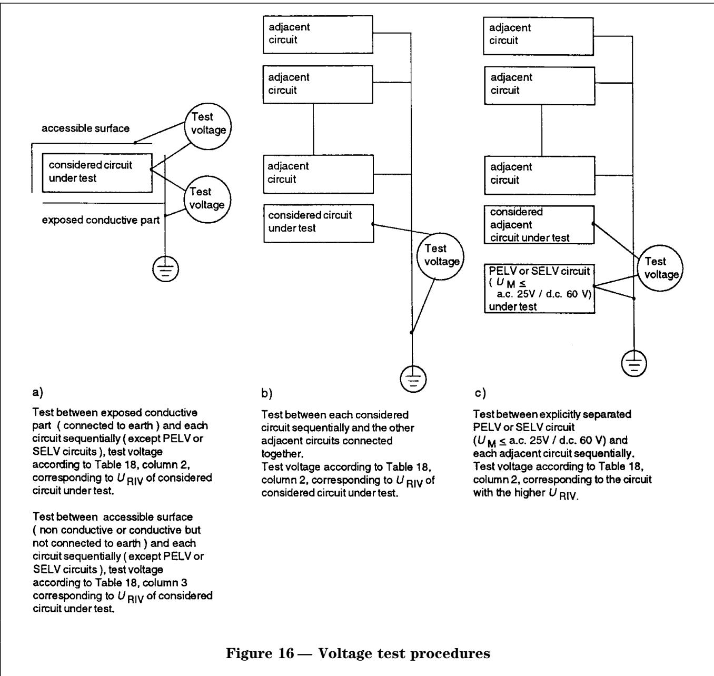

9.4.5.2.4 Duration and verification of the a.c. or d.c. voltage test

The duration of the test shall be 5 s for the type test and 1 s for the routine test. The test voltage may be applied with increasing and/or decreasing ramp voltage but the full amount shall be maintained 5 s and 1 s respectively for type and routine tests. The duration of the test may be reduced to 50 ms for type and routine test of wiring.

The test is successfully passed, if neither puncture nor flashover nor sparkover has occurred during the test.

9.4.5.3 Partial discharge test

The partial discharge test shall confirm that the double or reinforced insulation within components/devices (5.2.18.6 and A.5.2.18.7 to A.5.2.18.10) applied for protective separation of electrical circuits remains partial-discharge-free within the specified voltage range.

This test is to be carried out according to Table 10 as a type test and a sample test. It may be deleted for insulating materials which are free of partial discharge, e.g. ceramics.

Variables which influence the partial discharge inception and extinction voltage are climatic factors (e.g. temperature and moisture), equipment self heating and manufacturing tolerance. These influencing variables are significant under certain conditions and shall therefore be taken into account during type testing. (See annex A.)

9.4.5.4 Insulation resistance test in the power installation

This test shall be performed on site as given in 5.3. According to 612.3 of HD 384.6.61 S1 the insulation resistance of interconnecting conductors shall be measured:

Ð between the live conductors during the erection of the power installation before the connection of the appliances;

Ð between each live conductor and earth.

The insulation resistance, measured with the test voltage values indicated in Table 20, is acceptable if each circuit (with the appliances disconnected) has an insulation resistance not less than the appropriate value given in Table 20.

Table 19 Ð Partial discharge test

<table><tr><td>Subject</td><td>Test conditions</td></tr><tr><td>Test reference</td><td>4.1.2.4 of HD 625.1 S1</td></tr><tr><td>Requirement reference</td><td>According to 5.2.18.5</td></tr><tr><td>Preconditioning</td><td>Live parts belonging to the same circuit shall be connected together.It is recommended to conduct the partial discharge test after the impulse voltage test in order to recognize any damage caused by the impulse voltage test according to 9.4.5.1.It is advisable to perform the partial discharge test before inserting the components/ devices into the equipment as mostly no conclusion is possible on the reason of partial discharge when the equipment is assembled.</td></tr><tr><td>Initial measurement</td><td>According to specification of component/device</td></tr><tr><td>Test equipment</td><td>Calibrated charge measuring device or radio interference meter without weighting filters</td></tr><tr><td>Test circuit</td><td>C.1 of HD 625.1 S1</td></tr><tr><td>Test method</td><td>4.1.2.4 of HD 625.1 S1, F1, F3 and F4 reduced to 1; test procedure in 4.1.2.4.2 of HD 625.1 S1 replaced by D.1 of HD 625.1 S1</td></tr><tr><td>Calibration of test equipment</td><td>C.4 of HD 625.1 S1</td></tr><tr><td>Measurement</td><td>According to C.2.1 and D.1 of HD 625.1 S1, starting from a value below the rated value according to paragraph 2 of 5.2.18.5 up to the point at which partial discharge takes place (inception voltage).The test voltage shall then be further increased by 10 %, but the peak value shall not exceed 1,875 times the rated insulation voltage in accordance with 9.4.5.2.2 (column 1 of Table 18).</td></tr><tr><td>Extinction voltage</td><td>The voltage shall then be lowered to the point at which the partial discharge extinction voltage is reached. The extinction voltage shall be considered to be reached once the charge intensity has dropped to a value of 10 pC. This voltage shall be measured at ± 5 %.</td></tr><tr><td>Verification</td><td>The test shall be considered to be successfully passed if the peak value of the partial discharge extinction voltage is greater than 1,25 times the rated value defined in 5.2.18.5.</td></tr></table>

Table 20 Ð Minimum value of insulation resistance

<table><tr><td>Nominal circuit voltage</td><td>Test voltageV d.c.</td><td>Insulation resistanceMΩ</td></tr><tr><td>PELV, SELV and FELV, when the circuit is supplied from a safety transformer (411.1.2.1 of HD 384.4.41 S2) and also fulfils the requirements of 411.1.3.3 of HD 384.4.41 S2</td><td>250</td><td> $\geq 0,25$ </td></tr><tr><td>Up to and including 500 V, with the exception of the above cases</td><td>500</td><td> $\geq 0,5$ </td></tr><tr><td>Above 500 V</td><td>1 000</td><td> $\geq 1,0$ </td></tr><tr><td colspan="3">NOTE This table refers to power cables only. For signal carrying cables, see A.9.4.6.5 Insulation requirements.</td></tr></table>

## 9.4.5.5 Protective impedance, protective screening

In the course of type and routine testing the value of the protective impedance shall be measured. During type test it shall be ascertained according to 5.2.8.3 that the value measured is sufficiently high.

Instructions for the testing of protective screening are under consideration.

## 9.4.6 Electrical environmental tests

EMC type tests shall establish that the EE achieves with adequate margin the compatibility level required in its final working environment, in order that it performs satisfactorily according to its specification.

Whilst the component parts of a system may have to comply individually with the relevant EMC standard, their integration into a system shall fulfil the EMC requirement when applicable.

At the moment EMC standards apply only to EE connected to supply voltage under 1 000 V, and most generally refer to limits measured in laboratory tests. These standards therefore do not apply to large EE(s) or systems, which can only be tested by appropriate in situ methods, or assessed by agreed calculation or simulation.

## (See A.9.4.6.4 to A.9.4.6.5.)

## 9.4.6.1 Emission of electromagnetic disturbance

The standards listed below contain the necessary type tests or refer to basic standards where the tests are defined for emission of conducted and radiated disturbances:

Ð EMC product or EMC product family standards such as EN 61800-3;

Ð or if not available EMC generic emission standards:

EN 50081-1: Residential, commercial and light industry;

or

EN 50081-2: Industrial environment.

## 9.4.6.2 Immunity from electromagnetic disturbance

The standards listed below contain the necessary type tests or refer to basic standards where the tests are defined for immunity from electromagnetic disturbances:

Ð EMC product or EMC product family standards such as EN 61800-3;

Ð or if not available EMC generic immunity standard:

EN 50082-1: Residential, commercial and light industry;

or

EN 50082-2: Industrial environment.

The tests shall be carried out as type tests when the EE is used as intended (e.g. with cubicle doors closed).

## 9.4.6.3 Short-circuit withstand capability

The conditions for this test are listed in Table 21 below.

Table 21 Ð Short-circuit withstand capability

<table><tr><td>Subject</td><td colspan="3">Test conditions</td></tr><tr><td>Test reference</td><td colspan="3">None</td></tr><tr><td>Requirement reference</td><td colspan="3">According to 6.3.4</td></tr><tr><td>PreconditioningInitial measurement</td><td colspan="3">According to manufacturer&#x27;s specificationAccording to 9.1.3, verification procedure</td></tr><tr><td>ConditionsDuration of test</td><td colspan="3">With the worst combination of supply voltage and temperatureUntil steady state temperature is attained, however ≥ 10 min</td></tr><tr><td rowspan="3">Measurement and verification</td><td colspan="3">Output terminals</td></tr><tr><td>Short-circuit-proof</td><td>Conditionally short-circuit-proof</td><td>Non-short-circuit-proof</td></tr><tr><td>EE still operates as intended after removal of the short-circuit.</td><td>It shall be ensured whether in addition to the response of protective device any damage has occurred. After removal of the short-circuit and resetting protective device the EE operates as intended.</td><td>It shall be ensured that the requirements as specified in 6.3.4, paragraph 3, are complied with.</td></tr><tr><td></td><td>Where the worst combinaion is not practicable, the test may be carried out at rated values.</td><td colspan="2">Where this is not practicable, a calculation would be acceptable and shall be provided.</td></tr></table>

## 9.4.7 Performance test

Performance tests shall be designed to demonstrate that the EE functions correctly for all performance aspects of its functional specification. The test shall be performed under the conditions given in 9.1.2.

## Performance test (type testing)

The performance test shall consist of a comprehensive series of measurements and observations of the characteristics and performance of the EE to demonstrate by comparison with the initial performance test according to 9.1.3 that no unacceptable deterioration has occurred as a result of the type testing.

During the performance test (type testing) the flawless functioning of EE shall be verified within the limits stated in 6.1 and 6.3. This also applies to supply voltage variations according to 6.3.2.1 and 6.3.3. In agreed cases (e.g. such as high power EE and also where no accredited test house exists capable of the test) full testing within the limits stated may be replaced by proven calculation.

## Performance test (routine testing)

It shall be ascertained by performance test (routine testing) that the EE operates as intended and the protective and monitoring devices operate properly (Exception: fuses).

## Performance test (site testing)

The performance test (site testing) will be carried out with the EE fully installed and powered from the supplies as specified and correctly interfaced with all its associated parts of the plant and equipment. It should be established that all associated parts of the plant and EE has undergone separate tests before final system tests proceed.

Verification of the functioning of the EE in the installation during commissioning is regarded as a performance test.

NOTE A performance test of large assemblies of EE(s) in power installation is not always possible in the test set-up because of the volume of the assembly and/or the high power necessary for testing.

(See annex A for A.9.4.8 Soak test.)

## Annex A (informative)

## Additional information

This annex contains additional information on the subclauses of the normative part.

For convenience the clauses in annex A and in the normative part have the same numbering.

## A.2 Bibliography

The following standards are referred to only in annex A:

EN 41003:1993, Particular safety requirements for equipment to be connected to telecommunication networks.

EN 60068-2-1:1993, Environmental testing Ð Part 2: Tests ± Tests A: Cold (IEC 68-2-1:1990).

EN 60068-2-52:1996, Basic environmental testing procedures Ð Part 2: Tests Ð Test Kb: Salt mist, cyclic (IEC 68-2-52:1996).

EN 60439-1:1994, Low-voltage switchgear and controlgear assemblies Ð Part 1: Requirements for type-tested and partially type-tested assemblies (IEC 439-1:1992 +corr. 1993).

EN 60742:1995, Isolating transformers and safety isolating transformers Ð Requirements (IEC 742:1983 +A1:1992, modified).

EN 61000-2-4:1994, Electromagnetic compatibility (EMC) Ð Part 2: Environment Ð Section 4: Compatibility levels in industrial plants for low-frequency conducted disturbances (IEC 1000-2-4:1994 + corr. 1994).

EN 61000-4-2:1995, Electromagnetic compatibility (EMC) Ð Part 4: Testing and measurement techniques Ð Section 2: Electrostatic discharge immunity tests (IEC 1000-4-2:1995).

EN 61000-4-3:1996, Electromagnetic compatibility (EMC) Ð Part 4: Testing and measurement techniques Ð Section 3: Radiated, radio-frequency, electromagnetic field immunity test (IEC 1000-4-3:1995, modified).

EN 61000-4-4:1995, Electromagnetic compatibility (EMC) Ð Part 4: Testing and measurement techniques Ð Section 4: Electrical fast transient/burst immunity test (IEC 1000-4-4:1995).

EN 61000-4-5:1995, Electromagnetic compatibility (EMC) Ð Part 4: Testing and measurement techniques Ð Section 5: Surge immunity test (IEC 1000-4-5:1995).

EN 61082-1:1993, Preparation of documents used in electrotechnology Ð Part 1: General requirements. (IEC 1082-1:1991).

HD 323.2.10 S3:1988, Basic environmental testing procedures Ð Part 2: Tests Ð Test J and guidance: Mould growth (IEC 68-2-10:1988).

HD 323.2.30 S3:1988, Basic environmental testing procedures Ð Part 2: Tests Ð Test Db and guidance: Damp heat, cyclic (12 + 12 hours cycle) (IEC 68-2-30:1980 +A1:1985).

IEC 68-2-42:1982, Basic environmental testing procedures Ð Part 2: Tests Ð Test Kc: Sulphur dioxide test for contact and connections.

IEC 146-1-2:1991, Semiconductor convertors Ð General requirements and line commutated convertors Ð Part 1-2: Application guide.

IEC 255-1-00:1975, All-or-nothing electrical relays.

IEC 255-5:1977, Electrical relays Ð Part 5: Insulation tests for electrical relays.

IEC 255-22-1:1988, Electrical relays Ð Part 22: Electrical disturbance tests for measuring relays and protection equipment ±Section 1: 1 MHz burst disturbance tests.

IEC 478-1:1974, Stabilized power supplies, d.c. output Ð Part 1: Terms and definitions.

IEC 617 series, Graphical symbols for diagrams. IEC 1000-2-6 1995, Electromagnetic compatibility (EMC) Ð Part 2: Environment Ð Section 6: Assessment of the emission levels in the power supply of industrial plants as regards low-frequency conducted disturbances.

## A.4 Requirements for entire system

## A.4.4 Earthing requirements (grounding, earthing and screening)

## Grounding/earthing

In the most general sense a ground can be defined as an equipotential point or plane which serves as a reference voltage for a circuit or system. It may or may not be at the earth potential.

Earth is the conductive mass of the Earth, whose electrical potential at any point is conventionally taken as zero.

Earthing in EE is used not only to reduce the effects of interference but also and more importantly, for reasons of personal safety and protection of property. Where there is any conflict between these two requirements, personal safety always takes precedence. It is convenient to consider grounding and earthing under the following headings:

Ð functional grounding/earthing;

Ð protective earthing.

Protective earthing is dealt with in 5.2.9.2 to 5.2.9.8 and 5.3.2.

However, the functional and the protective requirements can be combined which is preferable from the EMC point of view.

## A.4.4.1 Functional grounding/earthing

Conductors provided for functional earthing may also carry signal or operating currents, or may provide a screening function for such signals. In no circumstances should functional grounding/earthing conductors impair the protective measures as specified in HD 384.4.41 S2.

NOTE In some cases grounding via impedances (HF/HV capacitors) or groundless operation is advantageous.

A conductor or bonding link for functional earthing is only marked green/yellow if it is used simultaneously for protective earthing. Conductors and bonding links which solely provide functional grounding have different marking.

Functional grounding/earthing is obtained by providing a low impedance path which acts to short-circuit any external interfering electromagnetic field enclosing the operating conductors. However attention should be paid to the design of the following:

Ð cable screens;

Ð armoring, conduits and cable trays;

Ð reference conductors;

Ð transformer screens;

Ð filter returns;

Ð radio frequency screens.

## A.4.4.1.1 Cable screens

In the discussion of cable shields and relative ground connection the following aspects should be considered:

Ð characteristic of the electromagnetic environment (e.g. transient disturbances, HF electromagnetic field, LF ground potential rise, etc.);

Ð type of circuit involved (low level signals, controls (process input/output, communications), power supply etc.);

Ð type of shield (e.g. copper foil or braid, tin foil etc.).

In general, the following guidelines should be followed. For signal circuits operating at low frequencies and at low level: Where circuits are equipped with an EMC filter-barrier, a single point earthing system is preferred. This requires consideration of the following design points.

a) Cable screens should be kept electrically separate throughout an installation until they are deliberately grounded or earthed (e.g. at the central earth point of the installation).

b) Cubicles may be fitted with a non-insulated or insulated metallic grounding bar to which all cable screens, but nothing else are connected. This latter should be connected to the chassis by means of HF/HV capacitors. Provision should be made for connecting this bar to the central earth point via an internal link which may be removed for test/maintenance purposes.

c) Where a signal is grounded, then the cable screen should also be grounded at the ªgrounded signalº end of the cable. The grounding of all signal circuits in one multicore cable should be provided at the same end.

Because single point earthing system does not reduce transient common mode disturbances, e.g. due to lightning or switching, whenever necessary for EE safety, the use of double shielded cables, metallic trays or conduits as in A.4.4.1.2 should be considered.

## For signal circuits operating at high

frequencies: A single point grounding system will not be effective. It is preferred to ground the cable screen directly at one end (as for the single point ground) but with a very short connection, and directly or at least indirectly at the other end by a suitable high frequency, high voltage capacitor. This also applies to co- and tri-axial cables.

For communication and power supply cables: Single or multiple ground connection can be adopted; multiple ground connection is sometimes preferred to reduce high level of common mode transient disturbances.

It is possible to connect both ends of a cable screen directly to ground/earth where the connections are in the same earth line system (i.e. plates, mat or grid). This type of screening should never be used for low frequency analogue applications (signals) outside the cubicle (zero volt plane). The connection of the screens should be as short as possible.

When the shield is directly connected to ground at the ends, its current carrying capability should be verified. Improvement of the ground network, with additional ground conductors installed in the cable path, can be considered as improvement to the safety of the cables under ground fault condition in the installation.

## A.4.4.1.2 Armoring, conduits and cable trays

In general, cable armoring is used only for mechanical protection; however it may also be used to provide additional screening, in which case the requirements, defined for cable screens will also apply.

The design of the installation should provide for cable armoring to be kept electrically separate throughout the installation, for instance by the use of insulated glands, until the armoring is deliberately earthed.

Conduits and metallic cable trays can provide shielding of cables; the shielding efficiency can be improved by provision of good electrical bonding between adjacent parts and to ground.

## A.4.4.1.3 Reference conductors

The reference conductors (alternatively called signal zero lines, zero voltage reference lines, high quality earths or signal earths and commons) which may be carrying signal currents should be individually insulated and returned to the reference point of the related power supply. This rule does not apply for zero volt planes. Occasionally screening may be required to reduce pick-up on these lines in which case A.4.4.1.1 will also apply.

## A.4.4.1.4 Transformer screens

Inter-winding screens of supply frequency transformers should be connected via a substantially inductance free connection to the local protective ground (chassis).

## A.4.4.1.5 Filter returns

Filters include shunt components which provide a low impedance diversion path for interference signals. In general, power supply filters should be connected to the local ground (chassis) and RF filters should be connected to the power supply reference point (chassis) both via substantially inductance free connections (see note at A.4.4.1.6).

## A.4.4.1.6 Radio frequency (RF) screens

Metalwork used for radio frequency shielding purposes should normally be connected to the adjacent metal structure, e.g. a reference plane on a printed wiring board, at as many points as are necessary to secure adequate shielding.

NOTE Digital circuits are radiators of RF power and multiple, good quality zero volt reference conductors are generally required. Multi-layer printed circuit boards, with the reference (zero volt) line and power supply provided by complete metal planes, are preferred.

## A.4.7 Acoustic noise

The Council Directive 89/392/EEC on machines contains limits for acoustic noise in 1.7.4f) of annex I, requiring a statement on the acoustic noise in the operating documents, if a weighed sound pressure level of 70 dB is exceeded.

## A.5 Safety requirements

A.5.2.4 Protection by means of enclosures and barriers

The following requirements apply to the openings in enclosures and barriers.

Ð The following test applies to enclosures or barriers that are conductive and connected to the protective conductor: A test finger (see Figure 3 of EN 60529) should be inserted into the openings with a test force of 10 N according to clause 12 of EN 60529. The test finger should not touch any live part belonging to an electric circuit with a decisive voltage (see 5.2.13) of at most a.c. 1 400 V or d.c. 2 000 V (case iii 1 in Figure 3 of 5.2.3). The test finger should not be able to approach any live part closer than the clearance for basic insulation (see 5.2.16.2) which have a decisive voltage exceeding a.c. 1 400 V or d.c. 2 000 V.

Ð The following test applies to enclosures or barriers which are non-conductive or conductive but not connected to the protective conductor: A test finger should be inserted into the openings of the enclosure or barrier with a test force of 10 N. The test finger should not be able to approach any live part closer than the clearance for basic insulation (see 5.2.16.2).

NOTE It is recommended that the dimension of allowable opening of the enclosure according to IP2X should be slightly reduced so that the test finger according to Figure 1 of EN 60529 can not touch the live part. Depth of penetration of the test finger (from the outer edge of the hole) is given by:

Ð hole of 12 mm ù: 80,0 mm;

Ð hole of 11 mm ù: ≈ 16,5 mm;

Ð hole of 10 mm ù: ≈ 13,0 mm;

Ð hole of 9 mm ù: ≈ 8,0 mm;

Ð hole of 8 mm ù: ≈ 4,0 mm

For testing see 9.4.4.2.

## A.5.2.4.2 Mechanical fault

## EE with conductive parts that can be touched AND

Ð that are not connected to the means of connection for the protective conductor of EE;

## AND

Ð that do not come under the exceptions of 5.2.9.2c) because of their small dimensions;

## AND

Ð that are separated from live parts by a clearance designed corresponding to a double or reinforced insulation (case ii 3 in Figure 3 of 5.2.3) except those with protection in case of direct contact (see 5.2.8, SELV, PELV, etc.),

should be constructed so that a single mechanical fault in EE does not reduce the clearance according to 5.2.4.1 to an extent that the said clearance no longer satisfies the requirements of basic insulation.

NOTE Examples for mechanical faults are a distorted soldering pin, a loosened screw- or solder-connection or an unscrewed nut.

## A.5.2.4.3 Mechanical durability

Enclosures and barriers should be fixed firmly. The enclosures and barriers should possess adequate strength and durability, to maintain the required degree of protection and clearances or distances under the expected stress. They should also prevent the parts in the enclosure or those behind the barriers from being warped or damaged.

## A.5.2.4.4 Screws

The following applies to the use of screws for enclosures or barriers or to parts of them which are either non-conductive or conductive but not connected to the protective conductor terminal:

Ð where the clearances or the creepage distances to the live parts are determined by the length of these screws, then captive screws should be used (case ii 3 in Figure 3 of 5.2.3);

Ð where these screws consist of insulation material, the required insulation should be maintained even when the screws are replaced by metal screws (case i 3 in Figure 3 of 5.2.3).

## A.5.2.4.5 Opening of enclosures

Opening and closing of enclosures or barriers should be possible only

a) with the help of a key or a tool;

OR

b) after switching-off the voltage of all live parts against which the enclosure or the barrier provides a protection; a reclose should be possible only if the enclosure or the barrier is at its original position or if it is closed, i.e. using an interlock.

An intermediate barrier may be used instead of measures a) or b); this barrier should only be removable using a tool and it should prevent any contact with live parts.

## A.5.2.8 Protection in the case of direct contact

As stated in 5.2.8 protection in the case of direct contact is required to ensure that contact with the live parts of EE does not produce any dangerous shock current.

The circuit may be earthed. Another electric circuit may be connected to a circuit with protective separation through protective measures based on protective impedance devices (see 5.2.8.3) or voltage limiting (see 5.2.8.4). They do not eliminate its existing protective separation.

Figure A.1 shows examples for protection in the case of direct contact.

NOTE 1 It is recommended that the protection by means of extra-low voltage with protective separation (SELV or PELV) should be given preference over the other possibilities.

NOTE 2 Depending on the design of EE, a barrier can be required due to other reasons, for example, as a mechanical protection or against the deposition of extraneous particles or as a protection against arcs.

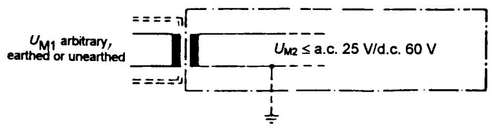

a) Protection by SELV (unearthed circuit) or PELV (earthed circuit) with protective separation  
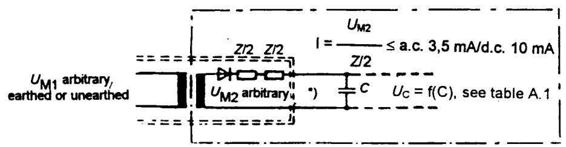

b) Protection by limitation of the discharging energy  
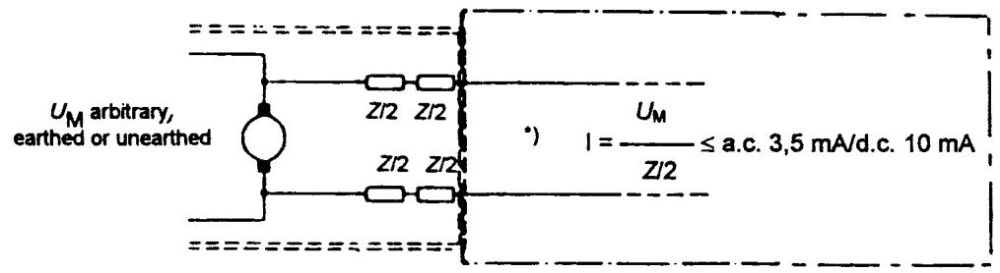

c) Protection by means of protective impedance  
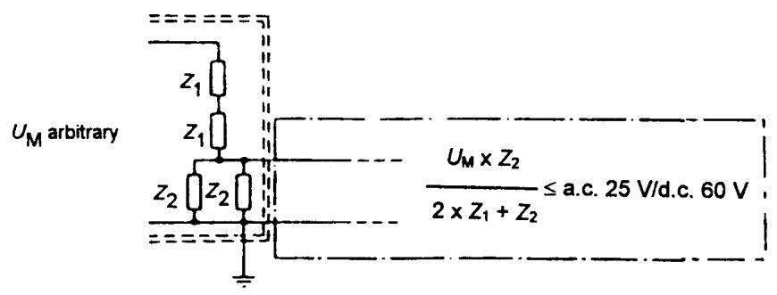

d) Protection by means of voltage limitation

Protective separation from all circuits for which a protection against direct contact is required

Protection against direct contact

\*) The voltage between these conductors may be high; the functional insulation should be adequate.

(UM = decisive voltage)

Figure A.1 Ð Examples for protection in the case of direct contact

## A.5.2.8.2 Protection by means of limitation of discharging energy

The charge limit of 50 mC given in 4.4.3.2 of IEC 536-2 (see 5.2.8.2) is below the threshold of fibrillation. For accessible live parts, the values determined by the voltage U and the capacitance C given in Table A.1 below according to 6.5 of IEC 1201 should apply.

Table A.1 Ð Values of accessible capacitance and charging voltage (threshold of pain)

<table><tr><td>Voltage V</td><td>Capacitance μF</td><td>Voltage kV</td><td>Capacitance nF</td></tr><tr><td>70</td><td>42,4</td><td>1</td><td>8,0</td></tr><tr><td>78</td><td>10,0</td><td>2</td><td>4,0</td></tr><tr><td>80</td><td>3,8</td><td>5</td><td>1,6</td></tr><tr><td>90</td><td>1,2</td><td>10</td><td>0,8</td></tr><tr><td>100</td><td>0,58</td><td>20</td><td>0,4</td></tr><tr><td>150</td><td>0,17</td><td>40</td><td>0,2</td></tr><tr><td>200</td><td>0,091</td><td>60</td><td>0,133</td></tr><tr><td>250</td><td>0,061</td><td></td><td></td></tr><tr><td>300</td><td>0,041</td><td></td><td></td></tr><tr><td>400</td><td>0,028</td><td></td><td></td></tr><tr><td>500</td><td>0,018</td><td></td><td></td></tr><tr><td>700</td><td>0,012</td><td></td><td></td></tr></table>

For testing see 5.2.8.2.

## A.5.2.8.3 Protection by means of protective impedance

For the purpose of making voltage checks (see 9.4.5.1, 9.4.5.2 and 9.4.5.3) in a circuit with protective separation, with respect to an adjacent circuit via protective impedance, disconnection points should - in the event that the protective impedance is not intended to be checked along with the voltage - be provided at the interface between the circuits (see also Figure A.1 c, in A.5.2.8) and should enable complete separation of the protectively separated circuit and should be easily accessible in the item of EE which is ready to be tested, in order to eliminate the danger of damage to the insulation during reconnection after the checking procedures. Examples of such disconnection points are as follows: Leads which can be rewired or resoldered, jumpered solder pins, connectors, and easily removable sub-assemblies and modules.

## A.5.2.9.2 Bonding connection arrangements

The protective bonding to the terminal point of the protective conductor should be achieved:

Ð either through direct metallic contact; Ð or through other exposed conductive parts which are not removed when EE is used as intended; Ð or through its own protective bonding conductor; Ð or through other metallic components of EE; Ð or by means of a combination of these methods (4.1.1 of IEC 536-2).

NOTE When painted surfaces or in particular powder painted surfaces are joined together, then a separate connection should be made for reliable contact.

## A.5.2.9.3 Rating of protective bonding

The protective bonding should remain effective for as long as a fault to the exposed conductive parts persists.

Live conductors of small cross-section such as those on printed circuit boards may be destroyed by the fault current caused by a fault to exposed conductive parts. In this event the protective bonding conductor may also be destroyed finally. It should be noted that in printed circuit boards the energy may be supplied through several (parallel) conductors.

The electrical resistance of the protective bonding should be so low that during a fault to exposed conductive parts no voltage exceeding a.c. 5 V or d.c. 12 V can persist between the exposed conductive parts and the means of connection for the protective conductor (4.1.3 of IEC 536-2).

NOTE This condition is generally satisfied if the cross-section of protective bonding conductor is the same as that for the protective conductor according to Table 54F in 543.1 of HD 384.5.54 S1.

## A.5.2.9.4 Protection against corrosion

Where no electrical equipment is fixed to covers, doors and cover plates of the EE, the normal metal screws and locking devices as well as conducting corrosion-proof hinges are considered to be sufficient protective bonding. Where electrical equipment is attached to these movable parts of EE, the exposed conductive parts of the particular electrical equipment need a protective bonding. The protective bonding to these movable parts of EE should be made via a protective bonding conductor. Alternatively, sliding and pressure contacts (for example, conducting corrosion-proof hinges) may be used in devices if it has been proven by a previous type test that the required conductance has not been impaired during its working life (7.4.3.1.5 of EN 60439-1).

## A.5.2.11.2 Compatibility with

## residual-current-operated protective devices

For common line-side circuit configurations of EE (e.g. for power electronic equipment and switched mode power supplies), Figure A.2 shows waveforms of the fault currents and when a d.c. component can occur in the fault current in the event of a fault connection to earth. Circuits 1, 4 and 5 can only be protected by an RCD which can be triggered both by residual a.c. currents and pulsating d.c. currents (Type A or B according to Amendment 2 of IEC 755). For sensing and disconnection of all residual currents which may result from faults in the circuits 1 to 9 of Figure A.2 RCDs of Type B are appropriate. For their installation see Figure A.3.

In circuits 8 and 9 the fault current does not contain a d.c. component and all types of RCD (Type A, Type B, or Type AC) may be used.

<table><tr><td></td><td>Connection</td><td>Mains current in normal operation</td><td>Fault current</td></tr><tr><td>1</td><td>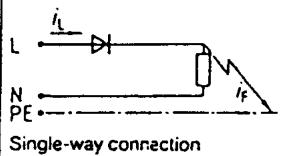</td><td>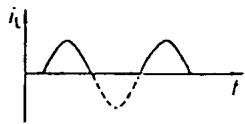</td><td>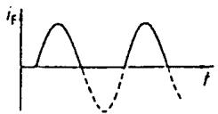</td></tr><tr><td>2</td><td>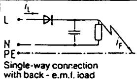</td><td>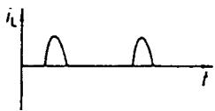</td><td>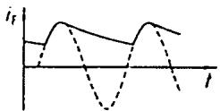</td></tr><tr><td>3</td><td>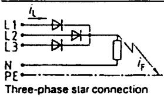</td><td>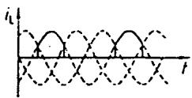</td><td>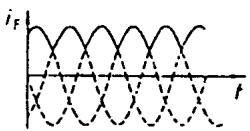</td></tr><tr><td>4</td><td>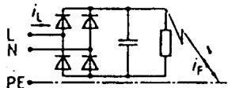Two-pulse bridge connection</td><td>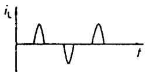</td><td>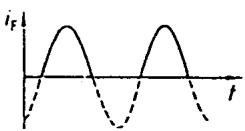</td></tr><tr><td>5</td><td>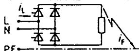Two-pulse bridge connection half-controlled</td><td>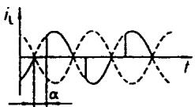</td><td>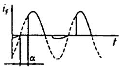</td></tr><tr><td>6</td><td>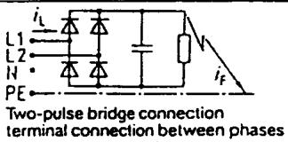</td><td>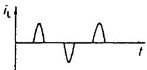</td><td>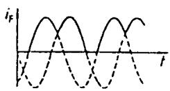</td></tr><tr><td>7</td><td>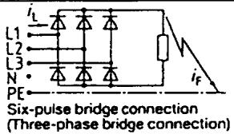</td><td>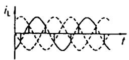</td><td>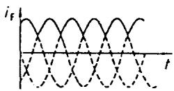</td></tr><tr><td>8</td><td>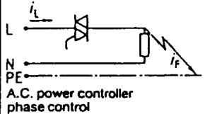</td><td>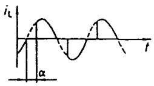</td><td>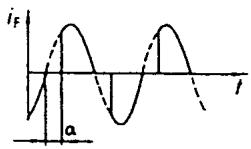</td></tr><tr><td>9</td><td>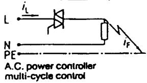</td><td>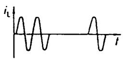</td><td>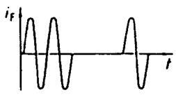</td></tr></table>

The RCD embraces all live conductors (L1, L2, L3, N) except the protective earth conductors PE. The residua current $i _ { \mathrm { F } }$ excites and operates the RCD

Figure A.2 Ð Fault-current in connections with semiconductor devices

Figure A.3 Ð Planning example for application of RCD Type B  
  
a) Circuits with EE where in case of earth fault residual a.c. current or/and residual pulsating d.c. current may occur. b) Circuits with EE where in case of earth fault residual a.c. current or/and residual pulsating d.c. current or/and residual smooth d.c. current may occur.

## A.5.2.13 Decisive voltage

The lower limits of the decisive voltage take into account the pathophysiological impact on persons touching that voltage. The limits for a.c. and d.c. voltage are rather different, therefore a.c.- and d.c.-component of a pulsating voltage circuit should be evaluated separately and compared with the limits using the formulae proposed in 5.2.13a), b) and c). The limits of the decisive voltage are selected such that the majority of power electronic equipment is included in the range below these limits.

The decisive voltage does not directly determine the rated insulation voltage, but it is a criterion to be taken into account when considering if basic or double/reinforced insulation is required.

## A.5.2.14.1 Between circuits and exposed conductive parts or accessible surfaces of EE

An example of subdivided insulation between a live part and accessible surface is shown in Figure A.4. Six examples for insulation of control elements are given in Figure A.5.

Legend to Figure A.4:

The insulation arrangements provided for the circuit shown in examples of Figure A.4 are as follows:

Insulation 1 Between the live a.c. 230 V circuit and the a.c. 24 V circuit;

Insulation 2 Between the accessible surface of the momentary contact switch and the a.c. 24 V circuit;

Insulation 3 Between the accessible surface of the lamp and the a.c. 24 V circuit.

The purpose of each insulation barrier is described as follows:

Insulation 1 Positioned in the transformer is basic insulation provided for protection against a.c. 230 V on the transformer primary passing into the a.c. 24 V circuit under fault conditions. Insulation is designed for a.c. 230 V.

Insulation 2 Positioned on the accessible surface of the momentary contact switch is supplementary insulation provided to achieve double insulation between the a.c. 230 V circuit and the accessible surface of the switch. Insulation is also designed for a.c. 230 V.

Insulation 3 Positioned on the accessible surface of the lamp need only be designed for a.c. 24 V functional extra low voltage (FELV) since the lamp is not required to be touched or grasped when the EE is used as intended.

Figure A.4 Ð Examples of subdivided insulation against accessible surfaces of EE

a) Conductive control element which is connected to the protective bonding of the EE

b) Conductive or non-conductive control element which is not connectedn to the protective bonding of the EE

1) The basic insulation in the transformer together with the basic insulation of the switch results in double insulation for the accessible surface of the switch with respect to input voltage of a.c. 230 V

2) For creepage distances and for partial discharge extinction the rated insulation voltage is a.c. 230 V + U

U Ð Voltage a.c. r.m.s

PELV Ð Extra low voltage with protective separation (optionally earthed system)

SELV Ð Extra low voltage with protective separation (unearthed system)

FELV Ð Extra low voltage without protective separation

The insulation includes solid insulation, air clearances, and creepage distances:

BI = Basic insulation

DRI = Double/reinforced insulation

## Figure A.5 Ð Examples for the insulation of control elements

(e.g. small toggle switches or momentary-contact switches), depending on the voltage and insulation of the circuit itself and of the adjacent circuit.

A.5.2.16 Clearances

Four examples for the design of clearance are shown in Figure A.6:

  
Example 3

  
\*) Following paragraph 2 of 5.2.16.3 these clearances are designed according to Table 4 which applies to the supply mains side of the choke (clearance of 1 mm) and Table 5 which applies to the load side of the choke (clearance of 0,36 mm).  
Figure A.6 Ð Examples for the design of clearances

  
Fiure A.6 Ð Examples for the design of clearances (continued)

## A.5.2.18 Protective separation

## A.5.2.18.1 Constructive measures

An EE, the electrical circuits of which are protectively separated should be designed in such a manner that a single mechanical fault Ð (e.g., a bent or detached conductive part such as a bent solder pin, a broken winding (coil) wire, detached soldering point, a loosened and fallen screw) Ð should not have the result of impairing the insulation to such a degree that it no longer fulfils the requirements for basic insulation. The design, however, need not consider the simultaneous bending, unfastening, or detachment of two mutually independent parts.

This recommendation can be fulfilled by the following: Ð measures taken against bending or unintentional unfastening or detachment of conductive parts; Ð and/or protection against bridging of clearances and creepage distances which serve to provide protective separation.

Measures against bending of conductive parts include the following:

Ð sufficient mechanical stability;

Ð impregnation or casting of components;

Ð mechanical barriers.

Measures taken against the unintentional unfastening or detachment of conductive parts include the following:

Ð securing of screws and nuts by means of locking paint, spring lock washers, tooth lock washers, and the like; employment of captive screws;

Ð fastening of soldered, clamped, screwed-down, crimped, or plug-connected wires by means of tying-off, impregnation, or casting techniques;

Ð securing of plug connections and plug-in components/devices or sub-assemblies by means of locking or screwing techniques.

The following are measures for the protection of clearances or creepage distances against bridging by unfastened or detached conductive parts:

Ð suitable arrangement, e.g., vertical or hanging arrangements;

Ð mechanical barriers.

Enclosures and barriers (see 5.2.4) should apply for protection against extraneous conductive parts which could fall into the EE.

Conductors with the requirement of protective separation should preferably be laid physically separated from each other. Also see A.7.1.10.2 with respect to the effective routing of conductors and protective measures in conjunction herewith. If such a physically separate installation is not feasible, then the following should apply.

Ð For purposes of protective separation with respect to each other, leads should be provided with double or reinforced insulation (in accordance with 5.2.18.2) or protective screening (according to 5.2.18.3). For the purpose of protective separation in multi-core cables, leads, and clusters of leads (e.g., wiring harnesses), double isolation is achieved, for example, by ensuring that the insulation for each core conforms with the requirements of the greatest operating voltage occurring in the cable, lead, or cluster of leads.

Ð Leads which have the task of providing protective separation by their insulation, should not lie against sharp edges. If, in the case of a wirewrap arrangement, for example, where the turning or bending of a lead at a sharp pin cannot be avoided, then the lead should be protected from the sharp edge of the pin by means covering the pin with an insulating sleeve which provides sufficient mechanical strength to prevent cutting action occurring.

NOTE In termination panels Ð for wrapped wiring, for example Ð protective separation is particularly endangered by the possibility of the excessive bending of a pin.

Ð Connections of the item of EE as well as of its components/devices and sub-assemblies should be configured and designed in such a manner that the clearances and creepage distances required for protective separation are effectively maintained and are not reduced even after the proper connection of the required connecting leads, and even after bending of the connecting leads. This stipulation also applies to printed conductors on circuit boards.

## A.5.2.18.7 Coil devices

Coil devices (transformers, instrument transformers and transducers, reactors, and operating coils of relays and contactors with multiple windings).

In order to ensure protective separation of windings, measures should be implemented which prevent the following:

Ð undesirable shifting of the windings or of their turns, especially at the edge of the winding layers; Ð undesirable shifting of turns or of the inner wiring, in the case of breakage near connections or of unfastening or detachment of connections.

Measures taken against undesirable shifting of windings or wires can include the following:

Ð windings with or without coil form, on different limbs of the core;

Ð windings in different chambers of the coil form. In the event that the partition walls of the chambers are merely inserted into place, sufficient coverage of the intervening joint should be ensured;

Ð intermediate layers made of stiff insulation material (e.g., presspan board) which extend sufficiently far beyond the windings when used with flangeless windings, or which completely fill the clearance width between flanges when used with coil forms with flanges. In the latter case, the intervening joint space up to the flange should also be sufficiently covered;

Ð filling out of not completely wound winding layers by means of insulating material;

Ð intermediate layer consisting of several thicknesses of feathered sheeting of such a width that the feathering lies flush against the flange of the coil form and thereby prevents individual edge windings from slipping through;

Ð layer-by-layer winding with insulating intermediate layers, e.g., with feathered sheeting;

Ð securing of the edge windings by means of adhesive tape or other suitable means of fastening; Ð impregnation or casting of the windings with material which hardens, and completely fills out the intermediate spaces, and which securely holds the edge windings. Vacuum impregnation or casting is recommended, in order to extensively exclude the formation of gas bubbles (the presence of which could promote partial discharge). Such impregnation or casting fulfils the purpose required, but, only if sufficient care is taken to ensure that undesirable shifting of a winding does not occur before hardening. Production faults, mechanical action, or thermal effects can cause such undesired shifting

Care should be taken that any clearances or creepage distances Ð (which may develop over gaps and separating joints of the coil forms, or over intermediate layers, and which may not be able to be reliably eliminated by impregnation or casting) Ð comply at least with the values stipulated in 5.2.15.1.

If insulating foil is to be used for insulation, then this foil should consist of at least two layers for basic insulation purposes. For purposes of reinforced insulation, it should consist of at least three layers. Varnish or enamel insulation of the wires should not be considered as insulation with respect to another circuit or to an exposed conductive part.

The protective screen between concentrically configured windings should cover the adjacent windings over the entire width and the entire extent. The protective screen may also consist of an appropriately designed shielding winding.

Safety isolating transformers in accordance with EN 60742 may be employed Ð (with observance of the restrictions of the scope of application of EN 60742 (e.g., rated frequency < 500 Hz)) Ð under the condition

Ð that the double or reinforced insulation between the protectively separated circuits, does not produce partial discharge;

## OR

Ð that it be capable of withstanding partial discharge according to 5.2.18.5;

## AND

Ð that the partial discharge test be successfully passed according to 9.4.5.3 for the type test and the sample tests conducted after the voltage test according to 17.3 or IA C of EN 60742.

For partial discharge test and impulse voltage test see 9.4.5.3 and 9.4.5.1.

Safety isolation transformers above 500 Hz are under consideration.

NOTE When conducting the voltage test of safety isolating transformers in accordance with EN 60742, there is the danger that the test will damage the insulation between the input and output side as a result of the partial discharge which occurs. The stipulated partial-discharge test mentioned above serves to identify unsuitable transformers.

## A.5.2.18.8 Switchgear and electromechanical components

Switchgear and electromechanical components which form an interface between different circuits (switches, all-or-nothing relays, contactors, circuit breakers).

It is especially important in cases of encapsulated switchgear and electromechanical components (e.g., all-or-nothing relays, see IEC 255-1-00) to ensure that the unfastening or detachment of a movable part (e.g., contact pieces, contact springs, and the like) will not result in damage of the insulation provided for purposes of protective separation.

In the case of switchgear which generates strong electrical arcs during operation (as intended), the creepage distances which serve for protective separation should be configured in such a manner that they maintain their long term insulation function. Protection can be afforded, for example, by ensuring sufficient physical separation, or by encapsulation.

## A.5.2.18.9 Semiconductor components and semiconductor configurations

Semiconductor junctions for use as protective separation of circuits are not permitted.

Semiconductor configurations, also including hybrids, e.g., semiconductor contactors, electronic transformers and convertors, optical couplers, isolation amplifiers, and compact power supplies are permitted for protective separation if they are designed and implemented according to 5.2.18. The energy- or information-transfer interfaces for protective separation should then satisfy the requirements for coil devices (according to A.5.2.18.7) or for optical coupler elements.

For voltage insulation test see 9.4.5.2, for partial discharge test see 9.4.5.3 and for impulse voltage test see 9.4.5.1.

## A.5.2.18.10 Connectors and terminal blocks

Insulation for protective separation may be provided within connectors for connecting leads, or for electrical connection of sub-assemblies by omitting or not connecting contact tips or points (e.g. creating space). A bent or broken-off contact tip/point should not impair the insulation for protective separation to the extent that it no longer fulfils the requirements for basic insulation.

The requirements of 5.2.8.5 and 7.1.9 apply for the non-interchangeability and for protection against polarity reversal of connectors.

In the case of terminal blocks for the connection of sub-assemblies and devices, additional measures are required Ð in addition to those for sufficient clearances and creepage distances Ð to effectively prevent the unintentional false connection of such EE. These measures should be implemented by the following:

Ð either a separation interval of at least the width of one terminal clamp;

Ð or one terminal clamp which is not connected;

Ð or one terminal clamp connected to the protective earth conductor;

Ð or one intermediate insulating piece which extends above the terminals on the connection sides; Ð or one protective screen which extends above the terminals on the connection sides;

Ð or employment of terminals of different sizes for these circuits;

Ð or employment of highly obvious designation, e.g., by apparent colour coding.

## (See also 7.1.8, 7.1.10.2 and 7.2.1.)

When breaking the connection of connectors and terminal blocks and there is a danger through mechanical action of breaking a lead or unfastening or detaching a lead, the insulation serving as protective separation could be damaged to the extent that the requirements for basic insulation are no longer satisfied, then effective measures should be taken to prevent such damage.

## A.5.3 Requirements for EEs in installations with regard to protection against electric shock

## A.5.3.2.4 Equipotential bonding between reference conductor and protective conductor

If several EEs of an installation have a common reference conductor and, if this is connected to the protective conductor more than once, then these protective conductor terminals should be included in an equipotential bonding in order to avoid overloading the reference conductor during a short-circuit to exposed conductive parts.

## A.6 Environmental requirements and conditions General requirement for compatibility of EE to its environment

It is a further requirement that the compatibility of the EE to all its environments, should be maintained despite adverse combinations of environmental conditions, provided that these are individually still within the ranges set by this standard and despite any rates of change of these environmental conditions to which the EE may be subjected throughout its specified working life.

## General aspects for compatibility of EE to its environment

The compatibility of EE to its environment is defined as its ability to perform all its specified functions throughout the specified range of environmental conditions and not to sustain any temporary or lasting damage due to the imposition of these environments whatever their combination. In this respect, the compatibility of an EE to its total environment is the sum of the immunity levels provided against each environmental condition when simultaneously applied in their most adverse combinations and rates of change.

A.6.1.2 Humidity and air pressure Figure A.7 shows the correlation of humidity and temperature of the air.  
  
Figure A.7 Ð Correlation between humidity and temperature of the air Range for normal conditions of operation according to 6.1, Table 7, class 3K3.

## A.6.1.3 Pollution (atmospheric)

Particular attention should be given to the exclusion of corrosive gases in installations where EE is necessarily located in areas where the atmosphere is likely to be heavily corrosive.

Informative data relating to the limiting values are uncertain but Table A.2 may be used as a guide, in relation to the cooling air used in standard enclosures. Indirect cooling may however be necessary in some applications.

Table A.2 Ð Maximum concentration of corrosive gases

<table><tr><td>Gas</td><td>Limits</td></tr><tr><td>Humidity</td><td>50 % RH</td></tr><tr><td>Humidity rate of change</td><td>0,1 %/min</td></tr><tr><td>Temperature</td><td>40 °C</td></tr><tr><td>Temperature rate of change</td><td>0,1 K/min</td></tr><tr><td>Sulphur dioxide (SO2)</td><td>30 × 10-9</td></tr><tr><td>Hydrogen sulphide (H2S)</td><td>10 × 10-9</td></tr><tr><td>Nitrous fumes (NOx)</td><td>30 × 10-9</td></tr><tr><td>Chlorine (Cl2)</td><td>10 × 10-9</td></tr><tr><td>Hydrogen fluoride (HF)</td><td>10 × 10-9</td></tr><tr><td>Ammonia (NH3)</td><td>500 × 10-9</td></tr><tr><td>Ozone (O3)</td><td>5 × 10-9</td></tr><tr><td colspan="2">NOTE The humidity and temperature values shown in this Table are not to be confused with the values given in Table 7 of 6.1.</td></tr></table>

If the customer expects any of the values given above to be exceeded in the areas where EE is necessarily to be located, measures should be taken to regulate the environment to restrict them to acceptable levels (e.g. by choice of enclosure, dehumidification or gas cleaning with chemical filters etc.).

Copper corrosion should not be higher than 30 nm over 28 days.

## A.6.1.4 Special stress

Where the climate groups in Table 7 of 6.1 do not apply, then the EE should be designed so that it satisfies the requirements of this European Standard also under these special stresses. In special cases, such as neighbouring steam generation, high ambient temperature, operation in high altitude, in chemically polluted or dusty air, conducting dust etc. the user should state the special climatic stresses to which the EE will be subjected in normal use.

## A.6.2.2.1 Immunity requirement to mechanical vibration

The vibration test of EN 60068-2-6, test Fc, is intended to reveal the mechanical resonances severe enough to cause possible damage or malfunction of the EE. Susceptibility of the EE to any such resonances should be removed by suitable modifications to the design of the EE.

## A.6.3 Electrical and electromagnetic requirements

Some application areas are not or not yet dealt with in the standards mentioned in 6.3 and some standards have not yet been ratified. In the case of low frequency phenomena EMC standard EN 61000-2-4 should be applied.

Additional work is offered in IEC 1000-2-6 and in progress at IEC SC77A e.g. the draft ªInstallation and mitigation guidelines and methodsº.

A.6.3.2 EE connected to a.c. supply mains (immunity)

## A.6.3.2.3 Voltage dips and short supply interruptions

Most supplies will have occasional short-term voltage dips between less than 10 and several 100 ms. These voltage dips may result from partial or full

short-circuits, caused e.g. by insulation failures, or may result in partially open circuits caused by the operation of protection in the distribution system, e.g. the effect of auto-reclosing.

## EE should generally comply with the

requirements A.4.1 and A.4.2 defined in the generic EMC immunity standard EN 50082-2 for equipment in industrial environment.

More generally some EE behaviour resulting from the occurrence of voltage dips are very dependent on its load and its application. If no specific standard applies, it may require agreement between user and manufacturer.

NOTE In the case of line-commutated convertors operating in the invertor mode, the allowance of even a short-time voltage dip exceeding 10 % requires special design and increased reactive power. An invertor-fault may cause an interruption of operation in the event of fuse blowing or tripping of circuit breakers.

## A.6.3.2.4 Harmonic and interharmonic voltages

EE should comply with the requirements of immunity if the waveform of its supply voltage corresponds to the values given in the compatibility level class 3 of EN 61000-2-4.

## A.6.3.2.5 Voltage notches

Voltage notches are deviations of a.c. mains voltage from the instantaneous value of the fundamental (for example during the commutation of a power convertor). Different values for their characteristics are identified in:

Ð 2.5.4.1 of EN 60146-1-1 for the steady state values of the commutation notches;

Ð 3.10 of IEC 146-1-2 for the choice of the immunity class;

Ð 3.8.1.1 of EN 61136-1 for electrical service conditions.

Figure A.8 shows an example of commutation notches in the mains voltage.

  
Figure A.8 Ð Periodical momentary dips of a.c. mains voltage caused by convertors  
The illustration shows the occurrence of dips in the line to line voltage when a power convertor is connected in six-pulse bridge connection.

## A.6.3.2.6 Voltage unbalance

The immunity from voltage unbalance should correspond to compatibility level class 3 of EN 61000-2-4.

A.6.3.3 EE connected to d.c. supply mains (immunity)

## Battery supplied mains

In battery networks the EE is fed from a battery or from a parallel connection of the charging device and the battery.

EE should comply with the requirements of A.3.2 of generic EMC immunity standard EN 50082-2 concerning voltage variation.

In case of battery supplies which are subject to boost charge, the equipment terminal voltage may rise to 125 % of the nominal supply voltage.

A.6.3.5 Immunity from electromagnetic disturbance As far as applicable the requirements of EMC product standards or generic EMC immunity standard EN 50082-2 should be adopted in this standard.

The EE should comply at least with the requirements of the normative part of the above generic standard. In applications of EE used in electricity generation and transmission more severe requirements will apply.

## A.6.3.5.1 Types of interference

In addition to the interferences in the supply-mains (see 6.3.2, 6.3.3, A.6.3.2 and A.6.3.3) the following types of interference should be considered when designing for immunity of EE from electrical disturbance:

Ð electrostatic discharge (EN 61000-4-2);

Ð fast transient/burst (EN 61000-4-4);

Ð transient overvoltage (EN 61000-4-5); (surge)

Ð radiated electromagnetic (IEC 1000-4-3); field

Ð conducted disturbances (under consideration > 9 kHz at IEC SC77B).

## A.6.3.5.2 Electrical isolation of process I/O and telecommunication ports

Process input/output (I/O) and telecommunication ports of EE should be provided with suitable interfaces, designed to ensure functional and electrical separation between circuits and to each circuit and ground.

The I/O interfaces may be located inside the EE, or in a dedicated unit installed in the near proximity.

The use of such interfaces is recommended for connecting EE to industrial process and to other remote electronic equipment/systems.

NOTE The inclusion of isolation interfaces in the EE helps in the improvement of EMC performance. Furthermore advantages are obtained in preventing propagation of hardware failure of an I/O port to other nearby ports, and also in preventing long term damage due to conducted disturbances. Reference should also be made to EN 41003 Particular safety requirements for equipment to be connected to telecommunication networks.

For testing see A.9.4.6.5.

A.6.3.6 Effects of EE(s) on the system (emission) Reaction on the supply mains

The following requirements should be met.

a) The total effect of all equipment connected to the supply mains including equipment planned to be connected and making allowance for disturbances arising from the HV grid system, should not be permitted to exceed the compatibility level class 3 of industrial electromagnetic environment as defined in EN 61000-2-4.

b) The following should be taken into consideration when line-commutated power convertors are connected to the mains:

Ð the minimum relative short-circuit power (see definitions) which can arise;

Ð the relative short-circuit voltage of the convertor transformer or commutating reactors;

Ð the simultaneity factor (see definitions).

c) In order to confirm compliance with the service conditions specified in A.6.3.2.5 the minimum ratio of the total resulting commutating reactance and the reactance of the supply system should be calculated.

A relative short-circuit power of not less than 100 at a simultaneity factor of 1 may be assumed as a usual example. Then transformers or commutating reactors of controlled line-commutated convertors should have a relative short-circuit voltage (inductive component) of at least 4 %, if the depth of the voltage notch should not exceed 20 %.

NOTE These values are based on the assumption that all connected convertors commutate simultaneously (simultaneity factor one). If this can be excluded because of the type and intended use of the convertors, then the simultaneity factor is lower than one and the relative short-circuit voltage of the convertor may be reduced. In this case, however, manufacturer and user should clarify in advance whether such conditions exist. Deviations from the normal values of c) are possible when particular measures ensure (e.g. by convertor connections with higher pulse number, higher relative short-circuit voltages) that requirements of A.6.3.2.5 are complied with, or when the owner of the supply mains agrees.

d) An interharmonic voltage caused should not exceed 0,2 % in the range of a ripple control frequency if any applied in this network.

## Emission of radio frequency disturbance

The limiting values for different ports of the EE are given in EMC product and generic emission standards as listed in 6.3.

For testing see 9.4.6.1.

## A.7 Requirements for electronic equipment

## A.7.1.2 Quality and reliability

Where required by the individual, enquiry or purchasing specification, assurance of quality and reliability should be ensured through the manufacturer's operation of a Quality System which conforms with an international standard (EN 29000).

Additionally, the supplier should show separately how the EE meets the requirements relating to reliability, principally by reference to reliability information obtained from installed EE.

For specially designed components or parts, the supplier should show how the EE's specified overall reliability is maintained.

## A.7.1.5 Component selection and use

## A.7.1.5.3 Rating

Components and materials should be chosen, rated and used so that, taking into account the expected operating conditions (e.g. thermal cycling), both the equipment life and the reliability requirements can be met. As component failure rates are accelerated by increased temperature, their operating temperatures should be minimized by derating, optimum physical arrangements, etc.. Any other factors which may be relevant to a particular constructional technique (e.g. encapsulation) should be taken into consideration in the design of the EE.

## A.7.1.5.4 Tolerance of components

The design of circuits should take into account the variations which can occur between component values and characteristics as a result of the factors listed below:

Ð initial selection tolerance;

Ð temperature coefficient allowance;

Ð allowance for drift (ageing) during operation life;

Ð allowance for drift (ageing) during storage

The final design should take account of all these effects, allow for the worst-case combination, and the immunity level stated by the manufacturer. Statistical assumptions that only certain combinations occur simultaneously should not be used unless the relevant parameters involved are invariably independent. The design achieved should be such that changes The design achieved should be such that changes which occur are either inconsequential (i.e. of no effect) which occur are either inconsequential (i.e. of no effect)

or they are fully compensated for.

## A.7.1.5.5 Storage

Components whether stored as individual items or as parts of completed equipments may be subject to environments exceeding the operational ones (see 6.1.1, and 6.1.2). However, when removed from storage they will be expected to be fully functional and comply with their specifications.

The supplier should advise the customer whether any items require special storage conditions, have limited storage life or need precautions to be taken in storage. In addition, the items should be labelled so that these facts are apparent whether the packaging has been removed or not.

## A.7.1.5.6 Failure mechanism

In choosing components, the mechanisms by which the components fail (both catastrophic and by degradation) should be established and the consequences upon the equipment performance which will result should be considered.

## A.7.1.5.7 Semiconductor devices, including integrated circuits

Semiconductors devices and integrated circuits should meet the requirements of, and be used in accordance with the recommendations contained in the relevant sections of IEC 747 or IEC 748.

Care should be taken in the design, manufacture and testing of circuits which include active components to ensure that the components are at all times protected from damage which could arise from causes such as thermal stresses, electrical transients, static discharges caused by handling or the use of test probes, electrical leakage from soldering irons, etc..

Any special precautions which may be necessary in the handling of sub-units and components should be included in the maintenance handbook, and a suitable precautionary warning attached to the EE or sub-unit. Circuit design should ensure adequate de-rating to take account of duty cycle, frequency of operation and nearby heat sources.

Supply lines should be de-coupled locally where necessary and care taken in the routing of earth signal lines, particularly in low level analogue and high speed digital circuits.

## A.7.1.5.8 Indicating devices

Light emitting diodes are generally preferred as indicating devices to filament lamps, because of their longer life and their more robust construction.

Filament lamps may only be used for applications where they are more suitable by virtue of their greater total light output. When used, types of lower voltage are preferred to types of higher voltage of the same power.

## A.7.1.5.9 Storage/transportation

The manufacturer/supplier should advise the customer, if any components:

Ð need special storage conditions;

Ð have limited storage life;

Ð need any special precautions to be taken during storage.

Consideration should be given to the storage environment during the design phase (see Table 7 of 6.1) because of the need for components to be fully functional and comply with their functional specification after removal from the store.

## A.7.1.6 Power supply switching, fusing and usage

## A.7.1.6.1 Fire protection and fire risk

Where EEs are grouped physically, e.g. within a cubicle, fire detection indicators if required by the individual, purchasing or enquiry specification should be grouped so that it may easily be established which device has operated, in order to facilitate resetting or replacement. Where cubicles are arranged in a suite having internal partitions between sections, each section should have its own group of fire detective devices if required by the individual, purchasing or enquiry specification.

## A.7.1.6.3 Power supply units

Units designed to transform supply voltages (a.c. or d.c.) into one or more voltages suitable for supplying electronic sub-units should be such that:

a) where current limiting is incorporated, the protection should be such that any overload of the output up to and including short-circuit should not damage any components within the power supply unit;

b) where current limiting is incorporated and the power supply unit supplies a number of individually protected loads, the available current under fault conditions in any of the loads should be sufficient to operate the protective device;

c) where voltage limit protection is incorporated, it should be suitable for the components which comprise the output load;

## d) normal inrush current should not

1) cause operation of protective devices (e.g. fuse, MCB, etc.);

2) exceed the surge rating of the primary source or that of any device or equipment interposed between the source and the load;

3) cause excessive supply transients beyond the values given in A.6.3.2.3;

e) they do not generate vibration or acoustic noise (noise exceeding the values specified in A.4.7 should be specified in the operational documents); f) in the event of a power supply failure or a protection facility/device operating resulting in unacceptable loss of function of the EE and where required in the individual, purchasing or enquiry specification an alarm signal should be provided.

Where it is shown that switched mode power supplies comply with IEC 478-1 Ð Stabilized power supplies, d.c. output Ð the withstand voltage test of A.9.4.6.5 may be waived.

## A.7.1.6.4 Power supply unit usage

Where a number of loads operate from one power supply unit, the paths should be such that there is no unwanted interaction between circuits due to common impedance.

This is particularly important where additions are made to existing installations.

## A.7.1.6.5 Batteries

Batteries should only be used within EE where it is essential to preserve a supply to the circuitry, either to maintain operation in the event of supply failure, or to maintain the contents of a volatile memory, e.g. a RAM.

Where continuity of EE operation is required, the battery should be of the rechargeable type and charging arrangements should be incorporated. It is important that the circuit employed does not result in overcharging of the battery.

Where the battery is required for the purpose of memory retention, primary cells may be used, provided that they are of a suitable type, preferably having a service life of several years.

Either some means announcing the approaching end of the battery charge should be provided or an indication (e.g. a label) should be supplied showing when the battery should be replaced.

Where a lithium battery is used, care should be taken to install a type which cannot explode in the event of a short-circuit.

## A.7.1.7 Construction

## A.7.1.7.2 Cooling

Where forced cooling is required, means should be provided to prevent overheating in the event of malfunction or failure of the cooling system. This can be by raising an alarm signal and by any of the following:

Ð load disconnection;

Ð load reduction.

The full requirements of the performance specification should be maintained until the protective device operates.

## A.7.1.7.7 Component mounting (avoidance of excessive mechanical stressing)

No stresses which might have a deleterious effect on component life or performance should result from the connections to or the mounting of a component or from bending and shearing operations which prepare the component for mounting.

Component manufacturer's recommendations concerning connection, minimum lead length, spacing, etc., should be complied with.

## A.7.1.8 Electrical connections

## A.7.1.8.1 Soldered connections

The soldered connection should be made in such a way that disconnection is possible without causing overheating of or disturbance to, either adjacent soldered connections or components or insulating materials. Soldering conductors or the leads of components to the legs of integrated circuits or to the leads of other components should be avoided as much as possible.

Equipment manufacturers should ensure that there is compatibility between the solder and the finishes on surfaces to which soldered connections are made.

## A.7.1.8.2 Component soldering

Soldered connections should be made only to components specifically designed for that purpose. The soldering operation should not subject the components or any insulation to temperatures, or temperature shocks (i.e. rapid changes of temperature) beyond the component's specification.

## A.7.1.8.3 Solderless wrapped connections

Unless otherwise approved, solderless wrapped connections should be made in accordance with EN 60352-1 or in an equivalent method.

Reuse of wrapping wire is not good engineering practice.

## A.7.1.8.4 Screwtype connections

Where electrical connections are made by means of screws (other than self-tapping screws), bolts or nuts to a chassis, a busbar or a structural member, connections should be made via lock washers.

Protective conductor connections which are clamped to metalwork should not be made via fixing screws which may have to be removed during servicing.

## A.7.1.8.5 Current carrying parts and their connections

Current-carrying parts should have the necessary mechanical strength and current-carrying capacity for their intended use.

For electrical connections, no contact pressure should be transmitted through insulating material other than ceramic or other material with characteristics no less suitable, unless there is sufficient resilience in the metallic parts to compensate for any possible shrinkage or yielding of the insulation material.

## A.7.1.8.6 Crimped connections

Crimped connectors should be made in accordance with EN 60352-2 or by an equivalent method. The correct length and position of the strands should be ensured. Care should be taken to minimize the build-up of corrosion products caused by the possible ingress of atmospheric pollution.

## A.7.1.8.7 Insulation displacement connections

Insulation displacement connections (IDC), also called ribbon cable connections, flat cable connections (see Figure A.9), should only be used in those applications where their long term reliability can be ensured.

NOTE In high temperature situations, stress relaxation of the copper conductors may reduce the life of the connection and other forms of connection not subject to the same failure mechanism should be used.

The type of connector should be one which grips the insulation or employs a strain relief clamp. Where possible ejector latches should be incorporated.

  
Figure A.9 Ð Insulation displacement connection with flat cable

## A.7.1.8.8 Terminal blocks

Fine and very fine-strand conductors in clamp or screw terminals should be secured so that individual strands cannot unfasten (e.g. by means of cable lugs, end sleeves or by appropriate design of the terminal clips). Soldering as a way of preventing individual strands from unfastening is not good engineering practice.

Where it is proposed to incorporate electronic components or assemblies inside a terminal block, the requirements of this standard should prevail.

## A.7.1.9 Multiple connectors and plug-and-socket devices

Connectors should be provided with means whereby each free plug or socket can be locked in the mated position, except where the contact-force is so high that unintentional loosening is impossible during normal operation. Movable connectors should also incorporate means for clamping the incoming cable so that the conductors are relieved of any stress. The design of clamps should be such that the cable is not compressed sufficiently to cause creep in the insulation.

In considering the suitability of contact finishes, the normal atmospheric environment should be taken into consideration, especially with materials used in circuits with very low voltage and current, see 6.1.3, A.6.1.3 and A.6.1.4.

## A.7.1.9.1 Printed circuit board connection

All plug-in printed wiring boards which cannot easily be extracted by hand should be provided with means of extraction from its parent unit or housing, preferably as part of the board, or else by an extraction tool which can be inserted into the board.

Depending on the requirements the plug-in printed wiring boards should be provided with connectors according to 7.1.9.

NOTE All printed circuit boards for process input, output and communications should be replaceable without switching off the system.

## A.7.1.10 Electrical conductors

## A.7.1.10.2 Conventional wiring within EE

In general the following requirements should apply. Wiring and cabling should be adequately supported and clamped. The resulting deformation should not cause the insulation properties to be outside its specified performance limits.

NOTE 1 Where the ambient temperature may drop to 225 8C preference should be given to the use of PTFE insulation. Where wire wrapping is used or where toughness is important, polyvinylidene fluoride (Kynar) insulation may be used.

NOTE 2 Segregation may be required in addition to screening to minimize the risk of electromagnetic interference.

Internal connections within the EE, to assemblies or sub-assemblies should be protected against damage to themselves and to associated sub-assemblies or components as follows.

a) Protection should limit the extent of damage to the connections and associated components caused by overcurrents resulting from insulation failure. b) The safety system required for this purpose should give the maximum protective priority to those connections which would take the longest time to replace in order to minimize the time the EE is out of service.

c) Connections liable to overload should be placed so that in the event of failure extensive damage to other connections cannot be caused.

d) Connections liable to overload should be placed so that if their insulation is damaged, no voltage can be transmitted to other circuits.

e) One or more of the following precautions should be taken in addition to the requirements as given in 7.1.6.2 and 7.1.7.4:

Ð use of overcurrent protective devices;

Ð use of power supply units with power limiting current/voltage characteristics or with overload disconnection;

Ð appropriate allocation of sub-assemblies to individual power supply units with separate supply leads;

Ð provision of rupture points on printed circuit boards;

Ð avoidance of long cables which are liable to overload in cable harnesses or ducts.

Additionally details of 5.2.8.5 concerning connectors should be observed.

## A.7.1.10.3 Materials and finishes

Materials and finishes should be suitable for conditions of use, taking into account environmental, wear and ageing factors. They should be either non-ignitable or self-extinguishing.

## A.7.1.12 Programmable equipment

Equipments with different software are regarded to be different although they may have the same hardware. Programmable equipment should be extendable, reprogrammable and possible to test without vast shutdown of the primary process or neighbouring equipment.

Electronic equipment depending on any type of computer programs should have ªWatchdogsº giving clear messages for system errors.

## A.7.1.12.1 Software and firmware

Programmable equipment (where the function or performance is determined or modified by stored instructions) should, unless otherwise agreed, have these instructions held in, and executed directly from, a non-volatile read only memory. Memories which can be erased by exposure to ultra violet light or which are electrically alterable are acceptable, provided that they are employed in such a manner that the information is not subject to accidental loss or corruption.

Where the equipment is specially designed for the customer, any read only memories should be plug-in, so as to facilitate replacement.

Any reprogramming or additional programming which the user may have to do should be easily achieved by the use of a user-friendly language preferably having a correlation between instructions and system operations. This may necessitate structuring the program into modules, each associated with a particular activity or characteristic of the equipment or system.

Where an equipment incorporates firmware, i.e. a program stored in a read only memory, whether reprogrammable or not, the issue number of the firmware should be clearly marked on the component, as well as being documented in the instruction manual. The firmware should be in a plug-in package so as to facilitate updating.

Where a program is stored on disk or tape, normally two copies will be required, one marked ªmaster copyº and the other ªback-up copyº. The back-up should be kept in a fireproof safe. All copies should be clearly marked with the name of the program and the software issue number. Any instructions relating to conditions of storage should be included not only in the instruction manual, but also with the disk or tape. It should be agreed between the producer and the customer:

Ð whether or not there should be any anti-copying protection built into the software output medium;

Ð how any legal copyright should be applied.

All software written to satisfy contractual requirements should, unless otherwise agreed, be the property of the customer.

Software documentation should conform to A.7.2.3.5, or as otherwise specified.

## A.7.1.12.2 Software/firmware support

Some of the more complex computer type equipments may utilize software which has not been proved over a number of years. In the event of any troubles arising with a program, support from the equipment manufacturer and the programming organization (if different), may be required.

So that the customer can ensure that the level of software support is adequate, tenderers should include information regarding the extent to which they are prepared to offer software support and the time for which it will be available. Also included should be details of the procedures adopted for dealing with customer problems, together with a statement of their normal practice in advising software users of any troubles which can occur, and the proposed solutions. Tenderers/suppliers should also provide details regarding the methods adopted for updating of software and firmware, and the costs involved.

A.7.2 Marking, identification, documentation The documents should be prepared in accordance with EN 61082-1.

## A.7.2.2 Component identification

When it is intended that EE should be repairable by the customer, component reference letters and numbers should be marked adjacent to each component. Alternatively, a detailed component layout drawing may be supplied.

## The following should apply in all instances:

a) The identification of each control or indicating device and fuse should be marked adjacent to the item. A fuse should be marked with its rating.

b) The function of each control and indicating device on the surface of the EE should be marked.

c) Identification, as appropriate, should be marked on or adjacent to each movable connector.

d) Test points, necessary for the user, should be individually marked with the circuit diagram reference.

e) The polarity of any polarized devices (e.g. diodes and batteries), should be marked adjacent to the device. This is not required for power devices.

f) Where links, tuned circuits, switches, ROMs and other programmable devices are provided for the purpose of individualizing a generic or common type of unit or sub-unit, clear and unambiguous legends should be affixed to, or printed on the board, to indicate the purpose of each individualizing device. Where this is not practicable, single symbol markings should refer to the circuit diagram.

g) The diagram reference and if possible the function should be marked adjacent to each pre-set control in a position where it is clearly visible while the adjustment is being made.

## A.7.2.3.5 Documentation for software, firmware and programmable logic

For programmable equipment, the documentation to be supplied will depend not only on the complexity of the equipment and its function, but also on the extent to which it may be necessary to modify its function or performance.

a) For relatively simple programmable equipments where it may be possible for an operator to make relatively simple changes such as the alteration of set point values, trip levels, etc., from the front panel of the equipment, the documentation should describe the function of all such facilities.

Where such equipment provides the facility for reconfiguring its transfer function, explanatory material should be included in the instruction manual to make this task as easy as possible. Instructions should also be included regarding the usage of any programming units which are necessary to effect changes to stored parameters or which are used in programming or initializing the equipment.

## b) For more complex computer type

equipment, the software documentation supplied should be sufficiently detailed for the supplier or his agent to carry out functional adaptions and changing parameters and ranges. The extent of the documentation will depend not only on the complexity of the equipment and its software, but also on any specific requirement. (See also A.7.1.12.1.)

Sufficient explanatory material should be included in the instruction manual to make functional adaptions and input of parameters as easy as possible. A description should be included of how the program works, and details should be given of how changes of parameters can be carried out for such items as limit values, dead bands, scanning rates etc..

## A.7.2.4 Drawings and diagrams

## A.7.2.4.1 Drawings

Where a system extends over a number of drawings, care should be taken to ensure that the common factors are:

Ð related by a drawing/indexing system which is designed for ease of understanding;

Ð clearly identified by unambiguous and compatible legends.

Dimensions, weights, etc., should be in metric units.

## A.7.2.4.2 Diagrams

Where practicable, all diagrams should be drawn so that the main sequence of events is from left to right (and, where necessary for arrangement purposes, from top to bottom), and should be suitably annotated.

The diagram for any one unit should be readily related to other diagrams and should include relevant information such as supply voltage values,

interconnection details, etc.. Components external to a unit or sub-unit, but essential to its operation, should be shown on the diagram enclosed in dotted lines and be appropriately identified.

Diagrams from the following list should be considered for inclusion in the documentation as far as they are necessary for operation of the EE:

Ð circuit diagrams;

Ð cubicle wiring diagrams;

Ð interconnection diagrams.

Graphical symbols should comply with IEC 617.

## A.7.3 Setting-up, calibration and maintenance A.7.3.1 Objectives

EE should be designed so that the routine maintenance required is reduced to a minimum, both in accumulated time and frequency.

To maximize the availability of the EE, the design should be such that fault location and rectification can be carried out as quickly as possible, preferably with the unit in situ. Fault rectification should preferably be achieved by sub-unit replacement, the faulty module being repaired in the instrument maintenance section or sent back to the manufacturer.

## A.7.3.2 Pre-set controls and adjustable components

The circuit design and components chosen should be such that the initial setting of pre-set components maximizes the use of their operating range throughout the life of the EE. The components should have adequate resolution and stability.

Pre-set controls and adjustable components which may require periodic adjustment should be mounted in such a manner that access to them can be obtained while the unit is in its normal operating position with the EE and also adjacent equipments fully operational. Such adjustments should not require the use of insulated tools for personnel safety.

Where necessary, means should be provided for preventing pre-set controls from being inadvertently altered.

## A.7.3.3 Removal and replacement of sub-units

The overall system design and the design of the sub-units e.g. printed circuit boards should be such that it is unnecessary to switch off power supplies while removing or replacing sub-units from an assembly. However, if this is not possible and the power needs to be switched off, then an appropriate, clear and unambiguous legend should be prominently displayed on or near the sub-units concerned. Facilities should be provided to prevent the incorrect insertion and connection of a sub-unit.

## A.7.3.4 Test points and other maintenance aids

To facilitate setting-up, fault location and maintenance, EE should be provided with a sufficient number of easily accessible test points. The way in which these test points are incorporated, should be such that no damage to susceptible components (e.g. MOS), results due to static discharges either from test equipment or from human contact.

Where required, maintenance aids such as extension printed wire boards, jumper leads and special tools, etc., should be provided. The number of sets offered and the stowage arrangements intended should be detailed in the tender or contract documents.

Where test facilities are built into an EE, the operation of the facility should be designed to prevent the generation of unwanted outputs and spurious alarms. Test points connected to components which might be damaged by static discharges (e.g. MOS devices) should be designed to provide suitable protection.

## A.7.3.5 Special tools

The prior approval of the customer should be obtained regarding the use of special tools.

## A.7.3.6 Power sources for test equipment

Where test equipment is required for in situ servicing and testing of any EE, it is the responsibility of the contractor to advise the customer regarding the power sources required, so that he can arrange for them to be locally available.

## A.7.3.7 Loose items

Loose items, such as the mating halves for all connectors, should be supplied with the EE or should be forwarded (suitably identified) to the site or contractor nominated by the customer.

## A.8 Requirements for the assembly of EE(s) in power installations

## A.8.3.3.1 Power input conductors to EE

Protection is ensured even without particular overload protective device, provided that:

Ð the conductors are designed for the maximum continuous fault current which is specified by the manufacturer of the EE (see 7.1.6.2);

Ð or in the case where a maximum fault current is not specified by the manufacturer of the EE, the conductors should be designed for the rated current of the EE taking into account its duty and duty cycle.

NOTE In this case it is assumed according to 7.1.6.2 that the EE will carry a continuous current no greater than the rated current and in the event of overcurrent it will be disconnected in good time. This applies in case of a fault in the EE or in the installation.

## A.9 Testing

Additional information and examples of tests are offered in this clause. Their application depends upon agreement between manufacturer and customer.

## A.9.1.1.1 Type test

## Objectives

The chief objectives of the type tests detailed in this standard are:

Ð to demonstrate that the EE does not have any inherent design faults which could adversely affect its performance, life or reliability;

Ð to check that the manufacturer's production processes, including testing, setting-up and quality assurance are satisfactory;

Ð to establish the stability of the EE when subjected to various influence factors such as supply voltage changes, temperature changes, etc.;

Ð to provide evidence that the EE complies with the requirements of this European Standard and that it meets its specification.

## Type test exclusions

Type testing may be waived for a particular EE on a particular contract provided that:

Ð evidence is offered of equivalent tests carried out on substantially similar EE with satisfactory results, provided that the test results are available in the form of a fully documented and certified test report. This report should clearly show compliance with all relevant requirements;

## OR

Ð well documented and satisfactory field data which has been obtained from EEs which have been used in a similar application is provided. This data should relate to identical EEs which are of an established design, in production and compliant with the specified requirements. Its suitability for the application should be supported by the manufacturer as well as the tenderer.

## Type test. Sequence of individual tests

The sequence of type tests should be chosen so that potentially destructive tests are deferred to the end of the program. Electrical tests are programmed early so that any modifications required as a result of a systematic failure are made before the climatic testing is carried out, and mechanical tests come at the end of the sequence.

## A.9.1.1.5 Integration tests

These tests (sometimes known as systems/works tests) are independent of, and in addition to, any type or routine testing which may have been carried out. Tests are mostly applicable to systems and consist of the performing of agreed tests on a number of associated equipments connected together to check chiefly for satisfactory overall performance (in so far as this check may be possible) and for equipment/module interchangeability, thus checking the compatibility of all module interfaces.

Such tests should be performed at the contractor's works and should be witnessed at the discretion of the customer. Often, this will be the first time that the various items of EE have been connected together in that particular configuration.

Where possible, the functions performed should be similar to those which the system is designed to perform when installed.

## A.9.4 Additional tests

Additional tests with test conditions in accordance with statements laid down in respective product standards (e.g. EN 60146-1-1) can be necessary. They should be agreed upon between customer and manufacturer. As far as possible these tests should be selected from available standards. Examples of such tests are given in A.9.4.2.3 to A.9.4.8.

## A.9.4.2.3 Low temperature test

Where specified a low temperature test should be carried out on individual sub-units, units and where applicable, on the complete EE or assembly with all doors and covers in place. Test conditions should be in accordance with test Ad of EN 60068-2-1.

## A.9.4.2.4 Salt corrosion test

This test is for the particular application where the EE is for coastal and off-shore installations. The test should be carried out in accordance with test Kb of HD 323.2.52 S1.

## A.9.4.2.5 Humidity cycling test

Where specified, this test should be carried out on an agreed number of samples of components, materials or finishes not already approved, or when the effects of humidity are unknown. The test should be carried out in accordance with test Db of HD 323.2.30 S3.

## A.9.4.2.6 Mould growth test

The test may be required on samples of components, materials and finishes where their resistance to mould growth is unknown or suspect.

The test should be carried out in accordance with test J of HD 323.2.10 S3.

## A.9.4.2.7 Industrial atmosphere test

This test may be required on samples of components, materials and finishes where they are not already approved or are of unknown performance.

The test should be carried out in accordance with test Kc of IEC 68-2-42.

## A.9.4.3.4 Drop test

This test is intended to be carried out on EEs which are portable and on units and sub-assemblies. It is not intended that it be carried out on complete sub-racks of EE.

This test should be carried out in accordance with EN 60068-2-31.

## A.9.4.3.5 Seismic test

Where seismic testing is required, details will be specified in the particular individual, enquiry or purchasing specification.

## A.9.4.5.3 Partial discharge test

Printed circuit boards and multilayer boards containing circuits with protective separation are also classified with components to be used for protective separation.

If protective separation of circuits is realized on circuit boards (also multilayer boards), then their basic material should be tested for PD -freedom or PD -resistance.

Within air partial discharge cannot appear below 300 V (Paschen minimum). In practice it appears hardly below 500 V.

## A.9.4.6.4 High frequency disturbance test

This test is required to demonstrate that the EE will function correctly when the 1MHz damped oscillatory waveform is applied to the fully energized EE. The test is based on IEC 255-22-1.

A.9.4.6.5 Insulation tests for process I/O and telecommunication ports with electrical isolation The requirements for this test are specified in IEC 255-5 together with the acceptance criteria.

## Insulation requirements

The following requirements are recommended for the electrical isolation of a single port or grouping of ports to ground and to other ports (see A.6.3.5.2):

Ð insulation resistance: 100 MV;

Ð dielectric strength: a.c. 1 kV or d.c. 1,5 kV (60 s duration);

Ð pulse withstandability: 1,2/50 ms, 2 kV (peak value). The d.c. dielectric strength requirement is recommended for I/O interfaces including filters or capacitors connected to ground, according to the product specification.

## Test generators and test procedures

The insulation tests in the following should be carried out before the conducted disturbances immunity tests. Three different tests are foreseen to verify the isolation requirements; the specific test equipments are:

Ð insulation measuring instrument, output voltage d.c. 500 V;

Ð dielectric strength test generator, a.c. and d.c. output voltage;

Ð 1,2/50 ms standard pulse generator, internal impedance 500V.

Details on the characteristics of the different test generators are reported in appendix D of IEC 255-5.

The equipment under test should be fully assembled and equipped, as in final installation; disassembling of sub-system, modules, cabling or components is not allowed.

Examples of the test set-up, common to the three kinds of test, are represented in

Ð Figure A.10 Ð Test set-up for EE grounded via a dedicated earthing connection;

Ð Figure A.11 Ð Test set-up for EE grounded via the power cord.

Details on the test procedures are reported in clause 8 of IEC 255-5.

In order to speed-up the test procedure, the insulation of a single port or grouping of ports to ground and to other ports can be tested at the same time, applying the test voltage as specified in:

Ð Figure A.12 Ð Application of the test voltage to a single port and to grouping of ports.

Test results and acceptance criteria

The insulation resistance meets the requirement if the values measured for the different ports are higher than the specified limit. During the test, instability in the value of the insulation resistance, as well as discrepancies among the insulation resistance value of ports of the same category, should be investigated and justified.

The dielectric strength meets the requirement if no discharge is detected during the whole test period (including oscilloscope investigation), and expected leakage/insulation current (a.c./d.c.) is observed.

The pulse withstanding capability meets the requirement if no discharge is detected (including oscilloscope investigation). Any modification of the pulse test waveform, due to e.g. the presence of surge protection devices, should be justified. The verification should refer to the waveform at no load condition of the test generator.

At the end of the insulation test cycle, the EE should be fully exercised to verify its integrity and capability to satisfy the functional requirements.

EUT: Equipment under test G: Ground plate

M: I/O terminals/connectors H: Test generator

E: Ground terminal O: Oscilloscope

T: Protective earth

Figure A.10 Ð Test set-up for EE grounded via a dedicated earthing connection

EUT: Equipment under test G: Ground plate

M: I/O terminals/connectors H: Test generator

E: Ground terminal O: Oscilloscope

T: Protective earth

Figure A.11 Ð Test set-up for EE grounded via the power cord

a) Testing a single I/O port  

b) Testing grouping of I/O ports

A: I/O single ended interface H: Test generator

B: I/O isolation interface G: Ground plate

C: Grouping of I/O single ended interfaces E: Ground terminal

D: Grouping of I/O isolation interfaces T: Protective earth

Figure A.12 Ð Application of the test voltage to a single port and to grouping of ports

## A.9.4.8 Soak test

Unless otherwise agreed, EE should be set up in a manner to simulate normal operating conditions, switched on, and allowed to operate continuously for a minimum period of 100 h. This period may by agreement, be broken down into shorter periods if compatible with the function of the EE.

During the test, measurements and observations should be made to demonstrate that the EE fulfils its functional requirement, has adequate stability, and is capable of operating without frequent attention. The extent of performance monitoring required will depend upon the nature of the EE under test.

If any failures occur or adjustments are made, full details should be recorded for the customer who will require evidence that there are no inherent design or manufacturing faults and will decide whether the test may be restarted or should be repeated.

## Soak test (routine testing)

The EE should be powered for a period of at least 100 h. The input and output conditions and the function performed throughout this period should, unless otherwise agreed, be determined by the manufacturer. As one of the main functions of the test is to ªburn inº the components, the test should if possible exercise all components.

Soak test (site testing)

Where required, this test will be specified.

## Annex B (informative)

## Tables and Figures

Under consideration.

# BSI Ð British Standards Institution

BSI is the independent national body responsible for preparing British Standards. It presents the UK view on standards in Europe and at the international level. It is incorporated by Royal Charter.

## Revisions

British Standards are updated by amendment or revision. Users of British Standards should make sure that they possess the latest amendments or editions.

It is the constant aim of BSI to improve the quality of our products and services. We would be grateful if anyone finding an inaccuracy or ambiguity while using this British Standard would inform the Secretary of the technical committee responsible, the identity of which can be found on the inside front cover. Tel: 020 8996 9000. Fax: 020 8996 7400.

BSI offers members an individual updating service called PLUS which ensures that subscribers automatically receive the latest editions of standards.

## Buying standards

Orders for all BSI, international and foreign standards publications should be addressed to Customer Services. Tel: 020 8996 9001. Fax: 020 8996 7001.

In response to orders for international standards, it is BSI policy to supply the BSI implementation of those that have been published as British Standards, unless otherwise requested.

## Information on standards

BSI provides a wide range of information on national, European and international standards through its Library and its Technical Help to Exporters Service. Various BSI electronic information services are also available which give details on all its products and services. Contact the Information Centre. Tel: 020 8996 7111. Fax: 020 8996 7048.

Subscribing members of BSI are kept up to date with standards developments and receive substantial discounts on the purchase price of standards. For details of these and other benefits contact Membership Administration. Tel: 020 8996 7002. Fax: 020 8996 7001.

## Copyright

Copyright subsists in all BSI publications. BSI also holds the copyright, in the UK, of the publications of the international standardization bodies. Except as permitted under the Copyright, Designs and Patents Act 1988 no extract may be reproduced, stored in a retrieval system or transmitted in any form or by any means ± electronic, photocopying, recording or otherwise ± without prior written permission from BSI.

This does not preclude the free use, in the course of implementing the standard, of necessary details such as symbols, and size, type or grade designations. If these details are to be used for any other purpose than implementation then the prior written permission of BSI must be obtained.

If permission is granted, the terms may include royalty payments or a licensing agreement. Details and advice can be obtained from the Copyright Manager. Tel: 020 8996 7070.