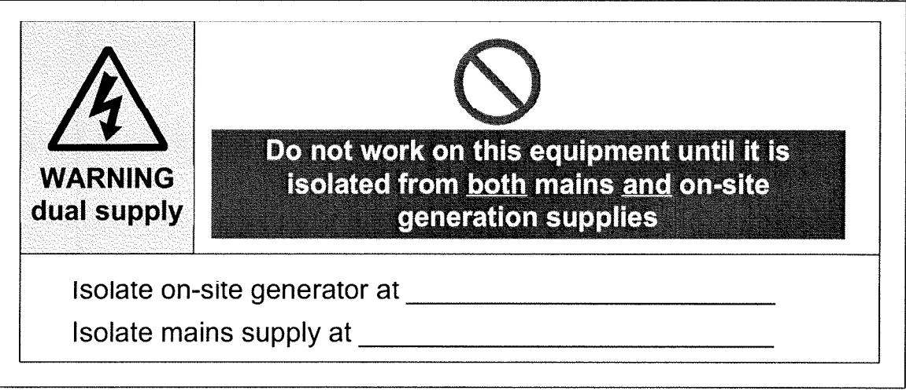
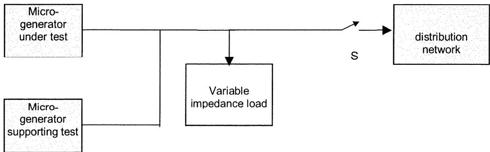
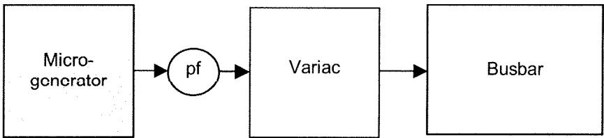

English version

# Requirements for the connection of micro-generators in parallel with public low-voltage distribution networks

Prescriptions pour le raccordement de micro-générateurs en parallèle avec les réseaux publics de distribution à basse tension

Anforderungen für den Anschluss von Kleinst-Generatoren an das öffentliche Niederspannungsnetz

This European Standard was approved by CENELEC on 2007-09-11. CENELEC members are bound to comply with the CEN/CENELEC Internal Regulations which stipulate the conditions for giving this European Standard the status of a national standard without any alteration.

Up-to-date lists and bibliographical references concerning such national standards may be obtained on application to the Central Secretariat or to any CENELEC member.

This European Standard exists in three official versions (English, French, German). A version in any other language made by translation under the responsibility of a CENELEC member into its own language and notified to the Central Secretariat has the same status as the official versions.

CENELEC members are the national electrotechnical committees of Austria, Belgium, Bulgaria, Cyprus, the Czech Republic, Denmark, Estonia, Finland, France, Germany, Greece, Hungary, Iceland, Ireland, Italy, Latvia, Lithuania, Luxembourg, Malta, the Netherlands, Norway, Poland, Portugal, Romania, Slovakia, Slovenia, Spain, Sweden, Switzerland and the United Kingdom.

European Committee for Electrotechnical Standardization
Comité Européen de Normalisation Electrotechnique
Europäisches Komitee für Elektrotechnische Normung

Central Secretariat: rue de Stassart 35, B - 1050 Brussels

## Foreword

This European Standard was prepared by WG 2 of the Technical Committee CENELEC TC 8X, System aspects for electrical energy supply.

The text of the draft was submitted to the formal vote and was approved by CENELEC as EN 50438 on 2007-09-11.

This European Standard supersedes CWA 14642:2003.

The following dates were fixed:

\- latest date by which the EN has to be implemented

at national level by publication of an identical

national standard or by endorsement

– latest date by which the national standards conflicting with the EN have to be withdrawn

(dop) 2008-10-01

(dow) 2010-10-01

## Contents

1 Scope .... 5
2 Normative references.... 6
3 Terms and definitions.... 7
4 Connection requirements.... 9
4.1 The electrical installation.... 9
4.1.1 Installation instructions.... 9
4.1.2 Over-current protection.... 9
4.1.3 Earthing.... 9
4.2 Interface protection.... 10
4.2.1 General.... 10
4.2.2 Interface protection settings.... 11
4.2.3 Loss of Mains (LoM) protection.... 11
4.2.4 Automatic reconnection after a network outage.... 12
4.2.5 Synchronisation.... 12
5 Power quality.... 12
5.1 Electromagnetic emission / immunity.... 12
5.2 DC injection.... 12
5.3 Power factor.... 12
6 Operation and safety of the micro-generator.... 13
6.1 General.... 13
6.2 Safety.... 13
6.3 Information plate.... 13
6.4 Labelling.... 13
6.5 Maintenance and routine testing.... 14
7 Commissioning.... 14
7.1 General.... 14
7.2 Installation.... 15
7.3 Notification procedure.... 15
7.3.1 Inform and Fit for a single installation.... 15
7.3.2 Multiple / planned installation.... 15
7.4 Decommission arrangements.... 15
7.5 Replacement arrangements.... 16
Annex A (normative) Interface protection settings, national deviations.... 17
AT – Austria.... 17
BE – Belgium.... 18
CH – Switzerland.... 20
CY – Cyprus.... 21
CZ – Czech Republic.... 22
DE – Germany.... 23
DK – Denmark.... 24
ES – Spain.... 25
FI – Finland.... 27
FR – France.... 28

GB – United Kingdom....29
IE – Ireland....30
IT – Italy....31
NL – The Netherlands....32
NO – Norway....33
PL – Poland....34
SE – Sweden....35
SI – Slovenia....36
Annex B (informative) Notification sheets....37
B.1 Notification of a micro-generation installation....37
B.2 Application for connection of multiple micro-generators....39
B.3 Notification of micro-generator decommissioning....41
Annex C (informative) Interface protection – Compliance type testing general arrangements....42
C.1 Compliance testing....42
C.2 Type testing of the interface protection....42
C.3 Type testing....45
Annex D (informative) Type certification test results sheet....46
Annex E (normative) Countries allowing extension of the scope > 16 A....50
CY – Cyprus....50
FI Finland....50
IE – Ireland....50
Annex F (informative) Abbreviations....51
Annex G (informative) A-deviations....52
Bibliography....53
Figure 1 – Example of a warning label both for size and content....14
Figure C.1 – LoM test arrangement....44
Figure C.2 – Power factor test arrangement....45
Table 1 – Countries allowing or not allowing Inform and Fit....5
Table 2 – Default interface protection settings....11
Table 3 – Product family emission standards....12

## 1 Scope

This European Standard specifies technical requirements for connection and operation of fixed installed micro-generators and their protection devices, irrespective of the micro-generators primary source of energy, in parallel with public low-voltage distribution networks, where micro-generation refers to equipment rated up to and including 16 A per phase, single or multi phase 230/400 V or multi phase 230 V (phase-to-phase voltage).

This European Standard is intended for installation mainly in the domestic market.

In some countries this document may be applied to generators with higher ratings used mostly in domestic and small commercial installations. These countries are listed in Annex E.

Whenever the scope is extended to equipment rated greater than 16 A per phase additional standards could be applicable.

Inform and Fit is the recommended procedure for installation of micro-generation except in those countries where legislation precludes this approach e.g. where it is mandatory for the DNO to give prior permission for the connection.

Table 1 – Countries allowing or not allowing Inform and Fit

<table><tr><td colspan="4">Inform and Fit</td><td colspan="4">Inform and Fit</td></tr><tr><td>Code</td><td>Country</td><td>Allowed</td><td>Not allowed</td><td>Code</td><td>Country</td><td>Allowed</td><td>Not allowed</td></tr><tr><td>AT</td><td>Austria</td><td></td><td>x</td><td>IS</td><td>Iceland</td><td>x</td><td></td></tr><tr><td>BE</td><td>Belgium</td><td>x</td><td></td><td>IT</td><td>Italy</td><td></td><td>x</td></tr><tr><td>CH</td><td>Switzerland</td><td></td><td>x</td><td>LT</td><td>Lithuania</td><td>x</td><td></td></tr><tr><td>CY</td><td>Cyprus</td><td>x</td><td></td><td>LU</td><td>Luxembourg</td><td>x</td><td></td></tr><tr><td>CZ</td><td>Czech Republic</td><td></td><td>x</td><td>LV</td><td>Latvia</td><td>x</td><td></td></tr><tr><td>DE</td><td>Germany</td><td></td><td>x</td><td>MT</td><td>Malta</td><td>x</td><td></td></tr><tr><td>DK</td><td>Denmark</td><td>x</td><td></td><td>NL</td><td>Netherlands</td><td>x</td><td></td></tr><tr><td>EE</td><td>Estonia</td><td>x</td><td></td><td>NO</td><td>Norway</td><td></td><td>x</td></tr><tr><td>ES</td><td>Spain</td><td></td><td>x</td><td>PL</td><td>Poland</td><td></td><td>x</td></tr><tr><td>FI</td><td>Finland</td><td></td><td>x</td><td>PT</td><td>Portugal</td><td>x</td><td></td></tr><tr><td>FR</td><td>France</td><td></td><td>x</td><td>RO</td><td>Romania</td><td>x</td><td></td></tr><tr><td>GB</td><td>United Kingdom</td><td>x</td><td></td><td>SI</td><td>Slovenia</td><td>x</td><td></td></tr><tr><td>GR</td><td>Greece</td><td>x</td><td></td><td>SE</td><td>Sweden</td><td></td><td>x</td></tr><tr><td>HU</td><td>Hungary</td><td>x</td><td></td><td>SK</td><td>Slovakia</td><td>x</td><td></td></tr><tr><td>IE</td><td>Ireland</td><td>x</td><td></td><td></td><td></td><td></td><td></td></tr></table>

The electrical interface is the principal focus and this includes the method of connection, the settings and protection requirements for connection, the operation of the electrical interface under normal conditions, emergency shutdown, distribution network-independent operation, start-up and distribution network synchronisation.

The provisions of this European Standard are not intended to ensure by themselves the safety of DNO personnel or their contracted parties.

The intention of this European Standard is to ensure that the micro-generator satisfies appropriate provisions for

\- the requirements of the DNO e.g. the distribution network protection,

• information to electricians working inside the house,

\- quality of supply.

The following aspects are included in the scope:

\- all micro-generation technologies are applicable.

The following aspects are excluded from the scope:

\- multiple units that for one installation, in aggregate, exceed 16 A;

\- issues of revenue rebalancing, metering or other commercial matters;

\- generators never to be connected to the supply networks;

\- requirements related to the primary energy source e.g. matters related to gas fired generator units;

• intended network independent operation.

NOTE If independent operation is intended, generally preliminary agreement of the DNO shall be obtained, however this is out of the scope of this document. Specific additional requirements most likely could be applicable.

## 2 Normative references

The following referenced documents are indispensable for the application of this document. For dated references, only the edition cited applies. For undated references, the latest edition of the referenced document (including any amendments) applies.

<table><tr><td>EN 50110 series</td><td></td><td>Operation of electrical installations</td></tr><tr><td>EN 50160</td><td></td><td>Voltage characteristics of electricity supplied by public distribution systems</td></tr><tr><td>EN 60255-6</td><td></td><td>Electrical relays – Part 6 : Measuring relays and protection equipment (IEC 60255-6)</td></tr><tr><td>EN 60664-1</td><td></td><td>Insulation coordination for equipment within low-voltage systems – Part 1: Principles, requirements and tests (IEC 60664-1)</td></tr><tr><td>EN 61000-3-2</td><td></td><td>Electromagnetic compatibility (EMC) – Part 3-2: Limits - Limits for harmonic current emissions (equipment input current ≤ 16 A per phase) (IEC 61000-3-2)</td></tr><tr><td>EN 61000-3-3</td><td></td><td>Electromagnetic compatibility (EMC) – Part 3-3: Limits – Limitation of voltage changes, voltage fluctuations and flicker in public low-voltage supply systems, for equipment with rated current ≤ 16 A per phase and not subject to conditional connection (IEC 61000-3-3)</td></tr><tr><td>EN 61000-6-1</td><td></td><td>Electromagnetic compatibility (EMC) – Part 6-1: Generic standards – Immunity for residential, commercial and light-industrial environments (IEC 61000-6-1, mod.)</td></tr><tr><td rowspan="2">EN 61000-6-3 + A11</td><td>2001</td><td rowspan="2">Electromagnetic compatibility (EMC) – Part 6-3: Generic standards – Emission standard for residential, commercial and light-industrial environments (IEC 61000-6-3.1996, mod.)</td></tr><tr><td>2004</td></tr><tr><td>HD 384 / HD 60364 series</td><td></td><td>Electrical installations of buildings (IEC 60364 series, mod.)</td></tr><tr><td>IEC 60364-5-55</td><td></td><td>Electrical installations of buildings – Part 5-55: Selection and erection of electrical equipment - Other equipment</td></tr></table>

## 3 Terms and definitions 1)

For the purposes of this document, the following terms and definitions apply.

## 3.1

## clearance time

total duration between the instant when the protection system is initiated and the instant when the cessation of supply to the network or disconnection of the micro-generator takes place

## 3.2

## cease to energize the distribution network

termination of the operational state where the micro-generator supplies power to the distribution network

## 3.3

## cogeneration

## combined heat and power (CHP)

combined generation of electricity and heat by an energy conversion system and the concurrent use of the electric and thermal energy from the conversion system

NOTE In the context of small-scale generation this concept is sometimes referred to as "domestic CHP".

## 3.4

## commissioning

process of putting into operation a micro-generator, apparatus, equipment, building, or facility in accordance with the manufacturers instruction

## 3.5 user 2)

person with responsibility for the premises in which the micro-generator is installed, normally referred to in other documentation as the customer / consumer / network user

## 3.6

## decommissioning

process of removing a micro-generator, apparatus, equipment, building, or facility from operation

## 3.7

## disconnection

separation of the active parts of the micro-generator from the network with mechanical contacts providing at least basic insulation

NOTE Passive components like filters, auxiliary power supply to the micro-generator and sense lines can remain connected.

## 3.8

## LV distribution network

low voltage part of the electric power system used for the transfer of electricity within an area of consumption to consumers

## 3.9

## distribution network operator (DNO)

natural or legal person responsible for operating, ensuring the maintenance of and, if necessary, developing the distribution network in a given area and, when applicable, its interconnections with other systems and for ensuring the long term ability of the system to meet reasonable demands for the distribution of electricity (DNO equals DSO, Distribution System Operator)

## 3.10

## electrical installation

assembly of wiring and electrical equipment that is used within the domestic premises for the distribution and/or use of electric energy

## 3.11

## inform & fit

process of installing and commissioning a micro-generator with prior notification of the DNO, followed by commencement of operation without the need of prior formal approval of the DNO

## 3.12

## fuel cell

electrochemical device that converts chemical energy directly into heat and electricity

## 3.13

## installer 3)

person who has received sufficient training to apply safe methods of work to install a micro-generator in compliance with the requirements of this standard (in some countries it may be necessary to have recognized qualification and/or accreditation)

## 3.14

## interface protection

electric protection required to ensure that the micro-generator is disconnected and/or ceases to energize for any event that could impair the integrity or degrade the safety of the distribution network

## 3.15

## islanding

situation where a section of the electricity network, containing generation, becomes physically disconnected from the rest of distribution network or user's network and one or more generators maintain a supply of electrical energy to the isolated network

## 3.16

## isolation

cut off for reasons of safety from all or a discrete section of the electrical installation by separating the electrical installation or section from every source of electrical energy

## 3.17

## Loss of Mains (LoM) protection

protection system that will disconnect the micro-generator from the distribution network and/or ceases to energize in the event of loss of that supply

NOTE LoM protection will invariably involve sampling of the voltage wave form. In the event of a LoM situation, this sampling will introduce a time delay before a protection initiation signal can be issued.

## 3.18

## low voltage (LV)

for the purpose of this standard a voltage, used for the supply of electricity, whose upper limit of nominal r.m.s. value is 1 kV

## 3.19

## nominal voltage

single phase 230 V, multi phase 230/400 V or multi phase 230 V (phase-to-phase voltage)

## 3.20

micro-generator

source of electrical energy including all interface units with a rated line-conductor electric current of up to and including 16 A low-voltage AC and designed to operate normally in parallel with a low voltage distribution network

## 3.21

## notification

process of informing the DNO of the commissioning of a micro-generation system, or its decommissioning

## 4 Connection requirements

## 4.1 The electrical installation

The unit shall be connected in compliance with HD 384 series and the relevant national standards.

Low voltage electrical installations shall comply with national and local regulation whether the installation is supplied by generation running in parallel with the distribution network, solely by the distribution network or islanded.

## 4.1.1 Installation instructions

The micro-generator shall be installed and maintained in accordance with the instructions issued by the manufacturer.

## 4.1.2 Over-current protection

The micro-generator installation shall be protected against over-current according to HD 384 series. When selecting the overcurrent protection within the domestic installation it is necessary to ensure correct discrimination with the DNO's protection devices.

## 4.1.3 Earthing

Earthing shall be according to HD 384.5.54 / IEC 60364-5-55 and the relevant national standards.

When a micro-generator is operating in parallel with the distribution network, there shall be no direct connection between the generator winding (or pole of the primary energy source in the case of a DC sourced micro-generator) and the DNO's earth terminal. For installations where the customer provides his own earth terminal, e.g. when connected to a TT system, it is also advisable to avoid connecting the generator winding to this earth terminal. The reason for this precaution is to avoid damage to the generator during faults on the distribution network and to ensure correct operation of protective devices.

For a micro-generator which is designed to operate in parallel with a distribution network but which is connected via an inverter (e.g. a PV array or fuel cell) it is permissible to connect one pole of the DC side of the inverter to the distribution network if the insulation between the AC and the DC sides of the inverter meets the requirements of over voltage category IV as specified in EN 60664-1. In such cases the installer / Manufacturer shall take all reasonable precautions to ensure that the micro-generator unit will not impair the integrity of the distribution network and will not suffer unacceptable damage for all credible operating conditions, including faults on the distribution network.

## 4.2 Interface protection

## 4.2.1 General

The purpose of the interface protection is to ensure that the connection of a micro-generator unit will not impair the integrity or degrade the safety of the distribution network. The interface protection shall be insensitive to normal voltage and frequency variations in the distribution network.

The interface protection, monitoring and control functions may be incorporated into the micro-generator control system, or may be fitted as discrete separate mounted devices.

## 4.2.1.1 Default settings versus national settings

If no national settings are provided for a particular country (Annex A), the default settings in Table 2 shall be applied.

## 4.2.1.2 Response to protection operation

The interface protection shall ensure that the micro-generator ceases to energize the distribution network when any parameter exceeds the applied operating setting. Disconnection is required in case of any hardware malfunctioning.

The micro-generator shall cease to energize the network in response to an interface protection operation, this shall be achieved either by the separation of suitably rated mechanical contacts or by the operation of a suitably rated solid state switching device. Where a solid state switching device is used the micro-generator shall monitor the proper functioning of the device. In the event the solid state switching device fails to interrupt the current, the micro-generator shall disconnect or cease to energize. The solid state switching device shall be specified in accordance with the over-voltage category of the micro-generator as specified by the manufacturer and the leakage current in the off-state shall not be more than 0.1 mA regardless of the terminal voltage.

## 4.2.1.3 Accessibility of isolation switching devices

Under HD 384 series there is a requirement that means shall be provided to enable a generator set to be isolated from the public supply. Where this means of isolation is not accessible for the DNO at all times it is acceptable to provide two means of automatic disconnection, with a single control. At least one of the means of disconnection must be afforded by the separation of mechanical contacts.

## 4.2.1.4 Place of the interface protection

The interface protection can either be incorporated within the micro-generator or afforded by separate devices. In either case the interface protection shall meet the relevant requirements of EN 60255-6 or equivalent and the manufacturer of the micro-generator shall declare that the combined devices fulfil these requirements.

## 4.2.1.5 Changing settings of the interface protection

The interface protection settings may only be altered, from those in place at the time of commissioning, with the written agreement of the DNO and then only in accordance with the manufacturer instructions.

It shall not be permissible for the user to alter the interface protection settings.

NOTE Alteration of the settings of the interface protection may cause a breach of the type-certificate making re-testing necessary unless the micro-generator is type-tested on the full setting range of the interface protection.

## 4.2.1.6 Combined protection device for multiple generators

It is allowed to use a protection device that affords interface protection for 2 or more micro-generators up to and including 16 A per phase in aggregate. However the possibility to use Inform and Fit then depends on the conditions of the type certificate of the protection device.

If two or more micro-generators, each with their own interface device, are placed in parallel, the proper combined working of the protection devices shall be ensured.

In the case of adding a generator to the combined protection device the DNO shall be consulted.

## 4.2.2 Interface protection settings

National settings are listed in Annex A. If no national settings are provided for a particular country, the default settings in Table 2 should be applied. The trip settings and clearance time in Table 2 and Annex A are maximum range values. Other values may be applied, subject to any national requirements given in Annex A. Settings should be as close as possible to the limits to avoid nuisance tripping.

The measurement point can be inside the micro-generator or anywhere between the micro-generator terminals and up to but not including the connection to the DNO network.

Table 2 – Default interface protection settings

<table><tr><td>Parameter</td><td>Maximum clearance time</td><td>Trip setting</td></tr><tr><td>Over voltage – stage 1a(if required)</td><td>See Annex A</td><td>See Annex A</td></tr><tr><td>Over voltage – stage 2</td><td>0,2 s</td><td>230 V + 15 %</td></tr><tr><td>Under voltage</td><td>1,5 s</td><td>230 V - 15 %</td></tr><tr><td>Over frequency</td><td>0,5 s</td><td>51 Hz</td></tr><tr><td>Under frequency</td><td>0,5 s</td><td>47 Hz</td></tr><tr><td>LoM (if required)</td><td>See Annex A</td><td>See Annex A</td></tr><tr><td colspan="3">The stated currents and voltages are ‘true r.m.s.’-values.The voltages in this table are- phase-to-neutral in 230 V single phase systems and 230/400 V systems,- phase-to-phase in a multiphase 230 V system.</td></tr><tr><td colspan="3">a Over voltage – stage 1: 10 min mean value corresponding to EN 50160.Tolerances on trip values:- voltage: ± 1 % of the nominal voltage;- frequency: ± 0,5 % of the nominal frequency;- clearance time: ± 10 %.</td></tr></table>

NOTE Voltage and frequency is referenced to the supply terminals.

## 4.2.3 Loss of Mains (LoM) protection

Where LoM protection is required (see Annex A) it shall use rate of change of frequency or vector shift or any other method not precluded under the national requirements in Annex A. The trip setting shall ensure cease energizing within the prescribed clearance time irrespective of where the LoM takes place on the distribution network. This requirement is deemed to be satisfied by passing the test in C.2.3.

A LoM protection shall not disturb other LoM protections.

## 4.2.4 Automatic reconnection after a network outage

The interface protection shall ensure that feeding power to the distribution network will only commence, after the voltage and frequency on the distribution network have been within the limits of the interface protection settings for a minimum of

• 3 min for mechanical AC generation,

• 20 s for inverter based systems.

In order to facilitate such automatic reconnection power input, the interface protection equipment and sensing connections to the interface protection may be made on the DNO side of the disconnector (but on the micro-generator side of the isolator) that is initiated by the interface micro generator protection.

## 4.2.5 Synchronisation

The operation of synchronising a micro-generator with the distribution network shall be fully automatic i.e. it shall not be possible to manually close the switch between the two systems to carry out synchronisation.

## 5 Power quality

## 5.1 Electromagnetic emission / immunity

The micro-generator shall comply with the requirements of the EMC Directive. As no product specific EMC requirements are available in standards for micro-generators the generic EMC standards are applicable, in particular EN 61000-6-1 on immunity and EN 61000-6-3 (including A11) on emission.

In these standards reference is made to the product family emission standards listed in Table 3 below.

Table 3 – Product family emission standards

<table><tr><td>Parameter</td><td>Micro-generator rating</td><td>Standard</td><td>Requirement</td></tr><tr><td>Harmonics</td><td> $\leq 16$  A</td><td>EN 61000-3-2</td><td>Class A</td></tr><tr><td>Voltage fluctuations and flicker</td><td> $\leq 16$  A</td><td>EN 61000-3-3</td><td> $d_{c} = 3,3 \% \max.$ </td></tr></table>

NOTE The emission limits relate to the level of emissions from the micro-generator towards the distribution network.

## 5.2 DC injection

For inverter based systems only symmetrical control as defined in IEV 161-07-11 is permitted. Systems which inject DC current by design (e.g. half wave operation) are not permitted.

NOTE This requirement prohibits all systems which inject DC into the network by construction and will therefore lead to a minimal impact on the network. This technical requirement can be fulfilled with reasonable effort for a broad range of technologies.

## 5.3 Power factor

The power factor of the micro-generator at normal steady-state operating conditions across the statutory tolerance band of nominal voltage shall be between 0,95 leading and 0,95 lagging, provided the output active power of the micro-generator is above 20 % the rated output power of the unit.

NOTE Leading power factor is VARs absorbed by the micro-generator.

## 6 Operation and safety of the micro-generator

## 6.1 General

The micro-generator shall operate safely over the entire designed and declared operating range.

## 6.2 Safety

This standard does not cover the safety of DNO personnel or their contracted parties, as their safety is a combination of electrical conditions and working instructions.

General requirements for safety of persons at work in or near and operation of electrical installations are given in EN 50110, also national regulations can be applicable.

## 6.3 Information plate

The following information shall appear on the micro-generator information plate:

• manufacturer's name or trade mark;

\- type designation or identification number, or any other means of identification making it possible to obtain relevant information from the manufacturer:

\- rated power;

\- nominal voltage;

• nominal frequency;

\- phases;

\- power factor.

This information must be provided on a plate on or in the micro-generator and in the documentation. This information shall be copied in the users' manual as well. In addition a serial number may be added to the plate only.

This information could be part of the information plate of the entire micro-generator system.

All the information shall be given in the language and in accordance with the practice of the country in which the micro-generator is intended to be installed.

## 6.4 Labelling

A warning notice shall be placed in such a position that any person gaining access to live parts will be warned in advance of the need to isolate those live parts from all points of supply.

Special attention should be paid that the power supply, measuring circuits (sense lines) and other parts may not be isolated from the network when the switch of the interface protection is open.

As a minimum, warning labels shall be placed:

\- on the switchboard (DNO panel and consumer unit) that has the micro-generator connected to it;

\- on all switchboards in between the consumer unit and the micro-generator itself;

• on, or in the micro-generator itself;

• at all points of isolation for the micro-generator.

All the information shall be given in the language and in accordance with the practice of the country in which the micro-generator is intended to be installed.

Do not work on this equipment until it is isolated from both mains and on-site generation supplies

Isolate on-site generator at \_\_\_\_

Isolate mains supply at \_\_\_\_

Figure 1 – Example of a warning label both for size and content

## 6.5 Maintenance and routine testing

The manufacturer shall provide a time frame for maintenance and/or routine testing.

The user is responsible for the proper maintenance and routine testing.

Maintenance and routine testing must be carried out by qualified service technicians.

## 7 Commissioning

## 7.1 General

This standard provides for the installation of type-tested $^{4)}$ micro-generators.

The following conditions must be met for such an installation:

\- the micro-generator (including the interface protection) shall fulfil the requirements of this standard and the other applicable standards;

\- the manufacturer shall provide an installation instruction in accordance with this standard and national or regional requirements;

\- access to the interface protection settings shall be tamper-proof;

\- in the absence of product standards the micro-generator shall be type tested against the interface requirements of this standard;

\- the installation shall be carried out by installers with recognised and approved qualification related to the fuels used, general electrical installations and a particular qualification relating to installation of micro-generators.

NOTE The installer / user should be aware that in addition to the DNO the energy supplier and or the metering authority will need to be informed for contractual reasons.

In those countries where Inform and Fit is allowed without prior consent from the DNO, the DNO shall be notified in accordance with the procedure described in 7.3. In all other countries prior consent of the DNO is necessary.

## 7.2 Installation

The micro-generator shall be installed in accordance with all of the following requirements:

\- this standard;

• HD 384 or the national implementation of it;

• national regulations;

\- the manufacturer's installation instructions.

## 7.3 Notification procedure

## 7.3.1 Inform and Fit for a single installation

The installation of a single micro-generator unit within a single customer's installation can be connected in parallel with the public distribution network without the prior permission of the local DNO. The installer is to ensure that the local DNO is made aware of the micro-generator installation at or before the time of commissioning. In addition the installer shall provide the DNO with information on the installation, within 30 days of the micro-generator unit being commissioned, using a format similar to that shown in B.1.

NOTE 1 The DNO and/or Energy Supplier and/or the metering authority might require contractual modifications of the existing connection agreement with the customer following the installation of the micro-generator.

## 7.3.2 Multiple / planned installation

In the case of a planned installation project where the proposal is to install multiple micro-generator units in a close geographic region it will be necessary for the installer to obtain the prior approval of the local DNO. The DNO will need to assess the impact that these connections may have on the Network and specify conditions for connection. The initial application will need to be in a format similar to that shown in B.2. The confirmation of commissioning will need to be made within 30 days of commissioning, using a format similar to that shown in B.1. Examples of these projects could be

– as part of a housing refurbishment programme in the same road / street, or

– as part of a new housing development.

The DNO may request the type-test information pro-forma when the application for connection pro-forma is submitted if they do not have previous records. The installer shall supply a copy within 30 working days of the request.

## 7.4 Decommission arrangements

If the micro-generator is removed or decommissioned for any reason, the DNO must be informed. The following requirements apply:

\- the decommissioning shall be carried out by installers with recognised and approved qualification relating to the fuels used, general electrical installations and a particular qualification relating to installation of micro-generation;

\- the property's electrical wiring and fuel systems shall be reinstated to a safe condition;

\- the notification of micro-generator decommissioning procedure is completed and a copy supplied to the DNO within 5 working days of completion of the work;

\- the notification can be carried out by using a similar format to the decommissioning form as shown in B.3.

## 7.5 Replacement arrangements

If the micro-generator is replaced, the DNO must be informed, followed by commencement of operation. This procedure can be carried out by completing the notification of micro-generator decommissioning form and the notification of micro-generation installation form (see Annex B).

If during the lifetime of the micro-generator it is necessary to replace a major component, it is only necessary to notify the DNO if the operating characteristics of the micro-generator or the interface protection have been altered when compared against the unit that was originally commissioned.

On replacement the current standards and documents will apply.

## Annex A (normative)

# Interface protection settings, national deviations

If no specific national settings for the Interface Protection are supplied in Annex A, the default settings in 4.2.2, Table 2 are applicable.

## AT – Austria

The following national requirements are to be kept $^{5)}$ :

\- technical and organizational rules for transmission and Distribution Supply Operators (TOR) especially parts
D1:2004 "Netzrückwirkungsrelevante elektrische Betriebsmittel; Schwellwerte für die notwendige Beurteilung durch den Netzbetreiber und festlegungen zur elektromagnetischen Verträglichkeit" and
D4:2001 "Parallelbetrieb von Eigenerzeugungsanlagen";

• market rules and the general conditions of network operators.

Both documents are published by the Austrian Energy Regulator - Energie-Control GmbH (ECG) - on the website http://www.e-control.at.

Interface protection settings in compliance with ÖVE/ÖNORM E 2750 and TOR, in particular Part D4.

<table><tr><td>Parameter</td><td>Maximum clearance times</td><td>Maximum trip setting</td></tr><tr><td>Over voltage</td><td>0,2</td><td>230 V + 11 %</td></tr><tr><td>Under voltage</td><td>0,2</td><td>230 V - 15 %</td></tr><tr><td>Over frequencya</td><td>0,2</td><td>51 Hz</td></tr><tr><td>Under frequencya</td><td>0,2</td><td>47 Hz</td></tr><tr><td>LoMb</td><td>5</td><td>b</td></tr><tr><td colspan="3">NOTE Voltage and frequency are referred to the micro-generator.</td></tr><tr><td colspan="3">aThis function has to operate at least in the range of maximum trip settings of voltage.bLoM protection and test procedures have to be conform with ÖVE/ÖNORM E 2750.</td></tr></table>

## BE – Belgium

Settings must be in compliance with the technical legislation regulating the distribution networks. On date of publication of this standard, the national settings were:

Option 1:

<table><tr><td>Parameter</td><td>Maximum clearance time</td><td>Trip setting</td></tr><tr><td>Over voltage</td><td>Instant (max. 120 ms)</td><td>230 V + 6 %</td></tr><tr><td>Under voltage (stage 1)</td><td>1,5 s</td><td>230 V - 15 % (... - 50 %) $^a$ </td></tr><tr><td>Under voltage (stage 2)</td><td>Instant (max. 120 ms)</td><td>230 V - 50 % (... - 75 %) $^a$ </td></tr><tr><td>Over frequency</td><td>Instant (max. 120 ms)</td><td>50,5 Hz</td></tr><tr><td>Under frequency</td><td>Instant (max. 120 ms)</td><td>49,5 Hz</td></tr><tr><td colspan="3">+ one of the following if the generator is technically capable to function in an islanding mode.</td></tr><tr><td>Vector jump</td><td>Instant (max. 120 ms)</td><td> $7^{\circ}$ b</td></tr><tr><td>Df/dt</td><td>100 ms</td><td>1 Hz / s</td></tr><tr><td>Over and under frequency</td><td>Instant (max. 120 ms)</td><td>50 Hz ± 0,3 Hz</td></tr><tr><td colspan="3"> $^a$  Most severe settings could be changed after DNO&#x27;s approval. $^b$  This function can be blocked when all the supply voltages are under 230 V - 20 %.</td></tr></table>

Option 2 (only if the generator is technically not capable to function in an islanding mode):

<table><tr><td>Parameter</td><td>Maximum clearance time</td><td>Trip setting</td></tr><tr><td>Over voltage</td><td>Instant (max. 120 ms)</td><td>230 V + 6 %</td></tr><tr><td>Under voltage</td><td>Instant (max. 120 ms)</td><td>230 V - 15 %</td></tr></table>

Option 3 (in combination with an automatic isolation switching device):

<table><tr><td>Parameter</td><td>Maximum clearance time</td><td>Trip setting</td></tr><tr><td>Over voltage</td><td>200 ms</td><td>230 V + 6 %</td></tr><tr><td>Under voltage</td><td>200 ms</td><td>230 V - 20 %</td></tr><tr><td>Over frequency</td><td>200 ms</td><td>50,2 Hz</td></tr><tr><td>Under frequency</td><td>200 ms</td><td>49,8 Hz</td></tr><tr><td>LoM</td><td>5 s</td><td></td></tr></table>

For single phase connected PV-installations $\leq$ 5 kW, option 3 is mandatory.

On date of publication of this standard, further information and most legal documents are available on the websites of the regional authorities:

\- VREG (Regulator of the Flemish Region): http://www.vreg.be;

\- CWAPE (Regulator of the Walloon Region): http://www.cwape.be;

— IBCE-BIM (Regulator of the Brussels Region): http://www.ibgebim.be.

## CH – Switzerland

## National requirements:

The ESTI (Eidgenössisches Starkstrom Inspektorat) is still in consultation of a legal directive concerning the connection of generators in parallel with low voltage distribution networks. The Swiss national technical committee TK 77 will discuss the subject at the next meeting.

When the situation is cleared, the NSB will supply the information for Switzerland.

## CY - Cyprus

<table><tr><td>Parameter</td><td>Clearance times</td><td>Trip setting</td></tr><tr><td>Over voltage</td><td>0,5</td><td>230 V + 10 %</td></tr><tr><td>Under voltage</td><td>0,5</td><td>230 V - 10 %</td></tr><tr><td>Over frequency</td><td>0,5</td><td>50 Hz + 4 %</td></tr><tr><td>Under frequency</td><td>0,5</td><td>50 Hz - 6 %</td></tr><tr><td>LoM</td><td>0,5</td><td>a</td></tr><tr><td colspan="3"> $^{a}$  Based on ROCOF (Rate Of Change Of Frequency), trip value currently 0,6 Hz/s, final to be announced.</td></tr></table>

## CZ – Czech Republic

In compliance with “Operational rules for distribution networks” of the Energy Regulatory Office.

<table><tr><td>Parameter</td><td>Maximum clearance times</td><td>Maximum trip setting</td></tr><tr><td>Over voltage</td><td>0,2</td><td>230 V + 15 %</td></tr><tr><td>Under voltage</td><td>0,2</td><td>230 V - 15 %</td></tr><tr><td>Over frequency</td><td>0,2</td><td>50,5 Hz</td></tr><tr><td>Under frequency</td><td>0,2</td><td>49,5 Hz</td></tr></table>

Document “Operational rules for distribution networks” is published by the Czech Regulator – Energy Regulatory Office – on the website http://www.eru.cz.

## DE – Germany

In compliance with DIN V VDE V 0126.

With reference to clause 4.2.4, the interface protection shall ensure that feeding power to the distribution network will only commence, after the voltage and frequency on the distribution network have been within the limits of the interface protection settings for a minimum of 30 s for any generation system.

## DK – Denmark

<table><tr><td>Parameter</td><td>Clearance times</td><td>Trip settinga</td></tr><tr><td>Over voltage (stage 2)b</td><td>0,2</td><td>230 V + 15 %</td></tr><tr><td>Over voltage (stage 1)</td><td>40</td><td>230 V + 10 %</td></tr><tr><td>Under voltage (stage 1)</td><td>10</td><td>230 V – 10 %</td></tr><tr><td>Over frequency</td><td>0,2</td><td>53 Hz</td></tr><tr><td>Under frequency</td><td>0,2</td><td>47 Hz</td></tr><tr><td>ROCOFc</td><td>0,2</td><td>2,5 Hz/s</td></tr><tr><td colspan="3">aAll values arc truc RMS values. The micro-generator shall disconnect or cease to energize if a parameter deviates more from its nominal value than the trip setting. A parameter must not initiate a disconnection or a cease to energize, if it is between the nominal value and the trip setting.bA stage 2 protection is required if the micro-generator can generate voltages in excess of 230 V + 15%.cThe use of phase shift relay as LoM protection is not allowed.Disconnection of the micro-generator in response to an interface protection operation shall be achieved either by the separation of mechanical contacts or by the operation of a suitably rated solid state switching device.</td></tr></table>

## ES – Spain

## National requirements:

In Spain (ES), the following Laws and Decrees deal with requirements for the connections to the public distribution network:

<table><tr><td>Ley 54/1997, Electricity Sector law</td><td>General rules for the interconnection of RES and CHP plants to the grid. Utilities are bound to buy the surplus of electricity generated by these installations and to pay for that energy higher price.</td></tr><tr><td>ORDEN 5/9/1985, Administrative technical rules for the operation and interconnection to the grid of hydroelectric power plants up to 5 MVA and “autogeneration plants”</td><td>General rules for the interconnection of RES and CHP plants to the grid. Utilities are bound to buy the surplus of electricity generated by these installations and to pay for that energy higher price.</td></tr><tr><td>RD 1955/2000, Gives rules for transmission, distribution, commercialisation, supply and permission procedures or electric energy plants</td><td>It establishes the legal system that will be applicable to the activities of transmission, distribution, marketing and electricity supply.</td></tr><tr><td>RD 1663/2000, interconnection of PV installations to the low voltage grid Resolution 31/5/2001 - Annex</td><td>Interconnection of PV installations to the low voltage grid: application, technical conditions, contract, connection and first verification,...</td></tr><tr><td>RD 2818/1998, production of electric energy by installations fed by RES. waste and CHP RD 436/2004 substitutes the previous one</td><td>It defines the requirements and procedures to invoke the &quot;Special Regime&quot; (RES + CHP), procedures for registration, energy supply conditions and economic rules. Incentives are set depending on technologies.</td></tr><tr><td colspan="2">National grid-code or similar documents in ES (Spain)</td></tr><tr><td>RD 842/2002, Spanish Low Voltage Code, part: ICT-BT 40, “Low voltage generating installations”</td><td>Complementary instruction (ICT) applicable to generating installations, namely installations aimed at the transformation of any kind of non-electric energy into electric energy.</td></tr><tr><td colspan="2">International standards</td></tr><tr><td>UNE – EN 50160: Voltage characteristics of electricity supplied by public distribution systems.</td><td>Power quality limits of the electricity supplied in the network.</td></tr></table>

## Interfaces protection settings:

For the particular case of photovoltaic systems: Interfaces protection settings in Spain arc:

<table><tr><td>Parameter</td><td>Clearance times</td><td>Trip setting</td></tr><tr><td>Over voltage</td><td> $^a$ </td><td>230 V + 10 %</td></tr><tr><td>Under voltage</td><td> $^a$ </td><td>230 V - 15 %</td></tr><tr><td>Over frequency</td><td> $^a$ </td><td>50 Hz + 2 %</td></tr><tr><td>Under frequency</td><td> $^a$ </td><td>50 Hz - 2 %</td></tr><tr><td colspan="3"> $^a$  No clearance times are specified on any case.</td></tr></table>

## FI – Finland

<table><tr><td>Parameter</td><td>Clearance times</td><td>Maximum trip setting</td></tr><tr><td>Over voltage (stage 1)</td><td>1,5</td><td> $U_{n}+10\%$ </td></tr><tr><td>Over voltage (stage 2)</td><td>0,15</td><td> $U_{n}+15\%$ </td></tr><tr><td>Under voltage (stage 1)</td><td>5</td><td> $U_{n}-15\%$ </td></tr><tr><td>Under voltage (stage 2)</td><td>0,15</td><td> $U_{n}-50\%$ </td></tr><tr><td>Over frequency</td><td>0,2</td><td>51,0 Hz</td></tr><tr><td>Under frequency</td><td>0,5</td><td>48,0 Hz</td></tr><tr><td> $LoM^{a}$ </td><td>0,15</td><td></td></tr><tr><td colspan="3"> $^{a}$  LoM protection shall use recognized techniques suitable for the distribution network protection.REMARK Isolation of the micro-generator shall be achieved by the separation of mechanical contacts. This mechanical device shall be a lockable isolation switch.</td></tr></table>

## FR – France

## Inform and Fit (See Clause 1 and 7.3):

In France, the series of regulatory texts (Décret 2003-229 du 13 mars 2003 et ses Arrêtés "consommateur" et "producteur" du 17 mars 2003) dealing with connection of users to the power system do not allow connection of a generator to the network without prior setting up of a new connection agreement with the DNO.

<table><tr><td>Parameter</td><td>Maximum clearance times</td><td>Maximum trip setting</td></tr><tr><td>Over voltage</td><td>0,2</td><td>230 V + 15 %</td></tr><tr><td>Under voltage</td><td>0,2</td><td>230 V - 15 %</td></tr><tr><td>Over frequency</td><td>0,2</td><td>50,5 Hz</td></tr><tr><td>Under frequency</td><td>0,2</td><td>49,5 Hz</td></tr><tr><td> $LoM^a$ </td><td></td><td>a</td></tr><tr><td colspan="3"> $^a$  Notes for France:- The here above stated values apply for a design with protection relays external to the generator, requiring individual verification of the operating settings by the DNO. The LoM protection is not present.- For generators &lt; 5 kvA in the case of a protection incorporated within the generator, without verification of the setting by the DNO, the protection shall comply with VDE 0126 and encompass a LoM protection.</td></tr></table>

## GB – United Kingdom

In compliance with Electricity Association Engineering Recommendations G83/1.

In the United Kingdom there is a legal requirement (under Electricity Safety, Quality and Continuity Regulations) for the installer to notify the DNO at or before the time of installation of the micro-generator (Inform and Fit).

<table><tr><td>Parameter</td><td>Maximum clearance times</td><td>Maximum trip setting</td></tr><tr><td>Over voltage (stage 1)</td><td>1,5</td><td>264 V</td></tr><tr><td>Under voltage (stage 1)</td><td>1,5</td><td>207 V</td></tr><tr><td>Over frequency</td><td>0,5</td><td>50,5 Hz</td></tr><tr><td>Under frequency</td><td>0,5</td><td>47,0 Hz</td></tr><tr><td> $LoM^a$ </td><td>0,5</td><td></td></tr><tr><td colspan="3"> $^a$  Notes for the United Kingdom:– LoM protection shall use a recognised technique suitable for the micro-generator technology employed such as ROCOF, Vector shift or Frequency shift.– Active methods for detecting LoM which inject current pulses into the distribution network are not accepted in the United Kingdom.– In the United Kingdom it is only necessary to provide a single stage for under / over voltage and frequency protection.– The protection settings can be increased to 5,0 s for those SSEG units that can withstand being energised from a source that is  $180^\circ$  out of phase with the SSEG output.</td></tr></table>

## IE – Ireland

<table><tr><td>Parameter</td><td>Clearance times</td><td>Trip setting</td></tr><tr><td>Over voltage</td><td>0,5</td><td>230 V + 10 %</td></tr><tr><td>Under voltage</td><td>0,5</td><td>230 V - 10 %</td></tr><tr><td>Over frequency</td><td>0,5</td><td>50 Hz + 1 %</td></tr><tr><td>Under frequency</td><td>0,5</td><td>50 Hz - 4 %</td></tr><tr><td colspan="3">An explicit Loss of Mains functionality must be included. Established methods such as, but not limited to, Rate of Change of Frequency, Vector Shift or Source Impedance Measurement may be used. Where Source Impedance is measured, this shall be achieved by purely passive means, Any implementation which involves the injection of pulses onto the distribution network, shall not be permitted.</td></tr><tr><td>ROCOF (where used)</td><td>0,5</td><td>0,4 Hz/s</td></tr><tr><td>Vector Shift (where used)</td><td>0,5</td><td>6°</td></tr></table>

## IT - Italy

<table><tr><td>Parameter</td><td>Maximum clearance times</td><td>Maximum trip setting</td></tr><tr><td>Over voltage</td><td>0,1</td><td>230 V + 20 %</td></tr><tr><td>Under voltage</td><td>0,2</td><td>230 V - 20 %</td></tr><tr><td>Over frequency</td><td>0,1</td><td>51 Hz</td></tr><tr><td>Under frequency</td><td>0,1</td><td>49 Hz</td></tr><tr><td>LoM</td><td>0,1</td><td></td></tr></table>

## NL – The Netherlands

<table><tr><td rowspan="2">Parameter</td><td>Time</td><td rowspan="2">Setting</td></tr><tr><td>s</td></tr><tr><td>Over voltage</td><td>2,0</td><td>230 V + 10 %</td></tr><tr><td>Under  $voltage^a$ </td><td>2,0</td><td>230 V - 20 %</td></tr><tr><td>Over frequency</td><td>2,0</td><td>50,0 Hz + 2 %</td></tr><tr><td>Under frequency</td><td>2,0</td><td>50,0 Hz - 4 %</td></tr><tr><td>LoM</td><td></td><td></td></tr><tr><td colspan="3"> $^\text{a}$  For synchronous generators the disconnecting time is 0,2 s, or a shorter time depending on the Critical Short-circuit Time of the generator.In The Netherlands it is only necessary to provide a single stage for under/over voltage and for frequency protection.</td></tr></table>

## NO – Norway

## National requirements:

In Norway, the Regulation REG. N° 301 of 11 March 1999: “Regulations governing metering, settlement and coordinated action in connection with electricity trading and invoicing of network services.” do not allow connection of a generator to the network without prior setting up of a new connection agreement with the DNO.

The default setting of 4.2.2, Table 2 are applicable excepted as follows:

\- Footnote $^{a}$ for Norway:

$^{a}$ Over voltage – stage 1: 1 min mean value corresponding to regulation 1557.

(national deviation due to regulation Reg. N° 1557 of 30 November 2004: Regulations relating to the quality of supply in the Norwegian power system).

## PL – Poland

## National requirements:

If no specific national settings for the Interface Settings are supplied by the Polish National Committee, the default settings in 4.2.2, Table 2 are applicable.

In Poland, the following regulatory text deals with general requirements for the connections to the public distribution network:

\- Rozporządzenie Ministra Gospodarki i Pracy z dnia 20 grudnia 2004 r. w sprawie szczegółowych warunków przyłączenia podmiotów do sieci elektroenergetycznych, ruchu i eksploatacji tych sieci (Journal of Laws 05.02.06) (Decree of the Minister of Economy and Labour of December 20, 2004, concerning detailed conditions of connecting subjects to power networks, operation and exploitation of these networks).

## SE – Sweden

<table><tr><td>Parameter</td><td>Clearance times</td><td>Trip setting</td></tr><tr><td>Over voltage (stage 2)</td><td>60</td><td>230 V + 6 %</td></tr><tr><td>Ovcr voltage (stage 1)</td><td>0,2</td><td>230 V + 15 %</td></tr><tr><td>Under voltage (stage 2)</td><td>60</td><td>230 V - 10 %</td></tr><tr><td>Under voltage (stage 1)</td><td>0,2</td><td>230 V - 15 %</td></tr><tr><td>Over frequency</td><td>0,5</td><td>51 Hz</td></tr><tr><td>Under frequency</td><td>0,5</td><td>47 Hz</td></tr></table>

## Inform and Fit procedure

Based on conflict with national legal requirements the Inform and Fit procedure according to EN 50438 "Requirements for the connection of micro-generators in parallel with public low-voltage distribution networks" is not allowed.

Reasons are found in the following Swedish laws and regulations:

\- SFS 1997:857, in particular 3 kap 10 § and 8 kap 6 § and 10 kap 1 §;

SFS 1999:716, in particular 4 §;

\- ELSÄK-FS 1996:2, in particular 21-23 §§.

The Swedish laws SFS 1997:857 and SFS 1997:716 are issued by the Swedish parliament and can be found at http://www.riksdagen.se/webbnav/index.aspx?nid=3920 by using the search function.

The regulation ELSÄK-FS 1996:2 is issued by the Swedish National Electrical Safety Board and can be found at http://www.elsak.se/download/18.fc40aefe938efb7180003084/1996\_2.pdf.

The DNO is obliged to measure the electrical energy produced and distributed to the network according to SFS 1997:857 3 kap 10 §. Thus the DNO must be informed before connection in order to be able to install an energy meter, which is suitable to measure production as well as consumption.

An electricity supplier, who will begin to deliver electricity in a point of the network, shall immediately inform the DNO concerned according to SFS 1997:857 8 kap 6 §.

The owner of a generator less than 50 kVA has according to SFS 1997:857 very limited liability for damages caused by current from the generator. Thus it is reasonable that the DNO, who probably will be responsible for possible damages, is informed before connection of the generator.

ELSÄK-FS 1996:2, 21-23 §§ regulates the duty to inform the DNO before beginning of some kinds of installation works. In this case the meter may have to be changed and thus the DNO has to be informed. In case of single-phase generators, the dimensioning of the service cable may have to be considered.

## SI – Slovenia

Slovenian national rules for the connection of generators into the distribution network are in the process of validation. After validation the national rules will be officially announced in the Uradni list RS (Official Gazzette of the Republic of Slovenia) and published on the website of the Slovenian Energy Regulator – Javna agencija RS za energijo http://www.agen-rs.si/.

Interface protection settings in compliance with Slovenian national rules for the connection of generators into the distribution network:

<table><tr><td>Parameter</td><td>Max. clearance times</td><td>Trip setting</td></tr><tr><td>Over voltage (stage 2)</td><td>0,2</td><td>230 V + 11 % ... + 15 %</td></tr><tr><td>Over voltage (stage 1)a</td><td>1,5</td><td>230 V + 11 %</td></tr><tr><td>Under voltage (stage 1)b</td><td>1,5</td><td>230 V – 15 %</td></tr><tr><td>Under voltage (stage 2)</td><td>0,2</td><td>230 V – 15 % ... – 30 %</td></tr><tr><td>Over frequencyc</td><td>0,2</td><td>51 Hz</td></tr><tr><td>Under frequencyc</td><td>0,2</td><td>47 Hz</td></tr><tr><td>LoMd</td><td>d</td><td>d</td></tr><tr><td colspan="3">a Over voltage (stage 1) protection is not required if the setting of over voltage (stage 2) is set to 230 V + 11%.b Under voltage (stage 1) protection is not required if the setting of under voltage (stage 2) is set to 230 V – 15%.c This function has to operate at least in the range of maximum trip settings of voltage.d LoM protection can be required by DNO. Clearance time and trip setting is provided by DNO.</td></tr></table>

Requirements regarding reactive power management are provided by the DNO. All the other requirements including general requirements for reactive power management will be provided in the Slovenian national rules for the connection of generators into the distribution network.

## Annex B (informative)

# Notification sheets

In countries where Inform and Fit is allowed form B.1 can be used to notify the DNO of a single micro-generation installation.

In case of multiple micro-generation units Inform and Fit is not permitted and prior to installation the DNO has to be requested for permission for the connection of the micro-generator units using form B.2 'Application for connection of multiple micro-generators'.

## B.1 Notification of a micro-generation installation

Notification of the installation and commissioning of a single micro-generator in parallel with the public distribution network – in accordance with EN 50438.

This information is to be provided to the DNO on the installation of a micro-generator in order that the DNO can assess the potential impact that the connection will have on the Network.

This notification form should be used for all microgenerator installations i.e. single installations or installations that form part of a multiple installation (see B.2).

Confirmation of installation and commissioning of a single micro-generator connected in parallel with the distribution network

<table><tr><td colspan="2">Project details</td></tr><tr><td>Site / project address (inc. post code)</td><td></td></tr><tr><td>Telephone number</td><td></td></tr><tr><td>Distribution network operator</td><td></td></tr><tr><td>DNO supply number (if available)</td><td></td></tr><tr><td>Name, address, phone number of customer (if different)</td><td></td></tr><tr><td>Name, address, phone number of the system owner</td><td></td></tr><tr><td>Name, address, phone number of the system user (if different)</td><td></td></tr></table>

<table><tr><td colspan="3">Installer details</td></tr><tr><td>Installer</td><td colspan="2"></td></tr><tr><td>Accreditation / Qualification (if relevant)</td><td colspan="2"></td></tr><tr><td>Address (inc. post code)</td><td colspan="2"></td></tr><tr><td>Contact person</td><td colspan="2"></td></tr><tr><td>Telephone number</td><td colspan="2"></td></tr><tr><td>Fax number</td><td colspan="2"></td></tr><tr><td>E-mail address</td><td colspan="2"></td></tr><tr><td colspan="3">Micro-generation details</td></tr><tr><td>Micro-generator location within the installation</td><td colspan="2"></td></tr><tr><td>Micro-generation manufacturer / model type</td><td colspan="2"></td></tr><tr><td>Micro-generation rating (kVA) and power factor</td><td colspan="2"></td></tr><tr><td>Single or Multi phase</td><td colspan="2"></td></tr><tr><td>Maximum peak short circuit current (A)</td><td colspan="2"></td></tr><tr><td>Type of prime mover and fuel source</td><td colspan="2"></td></tr><tr><td>Serial number of micro-generator</td><td colspan="2"></td></tr><tr><td>Electricity meter reading when micro-generation fitted (if more meter registers: give all register rates)</td><td colspan="2"></td></tr><tr><td>Meter registration number</td><td colspan="2"></td></tr><tr><td colspan="3">Declaration to be completed by installer</td></tr><tr><td colspan="3">Comments</td></tr><tr><td colspan="3">I declare that this installation has been designed to comply with the manufacturer&#x27;s requirements, instructions, the relevant sections of the national Wiring Regulations and Earthing requirements (HD 384 / HD 60364 - IEC 60364).</td></tr><tr><td>Name:</td><td>Signature:</td><td>Date:</td></tr></table>

## B.2 Application for connection of multiple micro-generators

Application for the connection of multiple micro-generators in parallel with the public distribution network – in accordance with EN 50438. It is only necessary to submit one Application Pro-forma per multiple installation project.

This information is to be provided to the DNO prior to the installation of multiple micro-generators in order that the DNO can assess the potential impact that the connection will have on the Network.

<table><tr><td colspan="2">Application for connection of multiple micro-generators in parallel with the distribution network</td></tr><tr><td colspan="2"></td></tr><tr><td colspan="2">Project details</td></tr><tr><td>Site / project address (inc. post code)</td><td></td></tr><tr><td>Telephone number</td><td></td></tr><tr><td>Customer supply number(s) (if available)</td><td></td></tr><tr><td>distribution network operator</td><td></td></tr><tr><td colspan="2">Installer details</td></tr><tr><td>Installer</td><td></td></tr><tr><td>Accreditation / Qualification (if relevant)</td><td></td></tr><tr><td>Address (inc. post code)</td><td></td></tr><tr><td>Contact person</td><td></td></tr><tr><td>Telephone number</td><td></td></tr><tr><td>Fax number</td><td></td></tr><tr><td>E-mail address</td><td></td></tr></table>

<table><tr><td colspan="3">Micro-generation details</td></tr><tr><td>Number of Micro-generator</td><td colspan="2"></td></tr><tr><td>Micro-generator location within the installation</td><td colspan="2"></td></tr><tr><td>Micro-generation manufacturer / model type</td><td colspan="2"></td></tr><tr><td>Micro-generation rating (kVA) and power factor</td><td colspan="2"></td></tr><tr><td>Single or Multi phase</td><td colspan="2"></td></tr><tr><td>Micro-generator maximum peak short circuit current (A)</td><td colspan="2"></td></tr><tr><td>Copy of system circuit diagram within the installation</td><td colspan="2"></td></tr><tr><td>Earthing arrangements</td><td colspan="2"></td></tr><tr><td>Site layout plan showing location of the micro-generators (if applicable)</td><td colspan="2"></td></tr><tr><td>Type of prime mover and fuel source</td><td colspan="2"></td></tr><tr><td colspan="3">Declaration to be completed by installer</td></tr><tr><td colspan="3">Comments</td></tr><tr><td colspan="3">I declare that this installation has been designed to comply with the manufacturer&#x27;s requirements, instructions, the relevant sections of the national Wiring Regulations and Earthing requirements (HD 384 / HD 60364 – IEC 60364).</td></tr><tr><td>Name:</td><td>Signature:</td><td>Date:</td></tr></table>

<table><tr><td colspan="3">DNO comments – to be completed by DNO representative following application</td></tr><tr><td colspan="2">A representative of the DNO will wish to witness the commissioning</td><td>Yes/no</td></tr><tr><td colspan="2">As a representative of the DNO, I give, in principle, permission for the connection of these micro-generators. If “no”, see comments below</td><td></td></tr><tr><td colspan="3">Comments</td></tr><tr><td>DNO</td><td>Contact</td><td>Date</td></tr></table>

## B.3 Notification of micro-generator decommissioning

<table><tr><td colspan="2">Site details</td></tr><tr><td>Site address</td><td></td></tr><tr><td>Telephone number</td><td></td></tr><tr><td>distribution network operator</td><td></td></tr><tr><td>System owner</td><td></td></tr><tr><td colspan="2">Micro-generation details</td></tr><tr><td>Micro-generation rating (kVA)</td><td></td></tr><tr><td>Micro-generation manufacturer / model type</td><td></td></tr><tr><td>Serial number of micro-generator</td><td></td></tr><tr><td>Meter reading when micro-generator is removed</td><td></td></tr><tr><td>Meter serial number</td><td></td></tr></table>

<table><tr><td colspan="2">Contractor details</td></tr><tr><td>Contractor/Company</td><td></td></tr><tr><td>Address</td><td></td></tr><tr><td>Contact person</td><td></td></tr><tr><td>Telephone number</td><td></td></tr><tr><td>Fax number</td><td></td></tr><tr><td colspan="2">Information to be enclosed</td></tr></table>

<table><tr><td colspan="3">Declaration to be completed by contractor</td></tr><tr><td colspan="2">The micro-generator has been removed in compliance with the manufacturer&#x27;s requirements (where specified), and the wiring of the premises has been reinstated to a satisfactory condition.</td><td></td></tr><tr><td colspan="3">Comments</td></tr><tr><td>Name:</td><td>Signature:</td><td>Date:</td></tr></table>

# Annex C (informative)

# Interface protection – Compliance type testing general arrangements

At this time, with micro generation development still in its infancy, it is only possible for this annex to provide guidance for a methodology how a micro-generator could comply with the applicable requirements of this standard.

Where alternative test methodologies are used these should be documented and where relevant referenced in the test report.

The default values in this annex have to be replaced by the specific national values in Annex A if supplied.

## C.1 Compliance testing

The interface protection, monitoring and control functions may be incorporated into the micro-generator control system, or may be fitted as discrete separate mounted devices. In both cases the micro-generator unit should be submitted for compliance testing with the interface protection either as a part of the appliance or as a separate control.

This annex defines the requirements for compliance testing of the interface protection.

An example of a Type certification test result sheet is presented in Annex D.

## C.2 Type testing of the interface protection

The tests will verify that the operation of the micro-generator interface protection shall result in the cessation of energizing the distribution network when the network parameters are exceeded or LoM occurs.

Wherever possible the type verification testing of a particular micro-generator should be proved under normal conditions (as declared by the manufacturer and documented in the test report) of operation for that technology (unless otherwise noted). This will require that the chosen micro-generator Interface Protection is either already incorporated into the system controls or the discrete device is connected to the micro-generator for the LoM protection test.

Testing the voltage and frequency functions may be carried out either on the discrete protection device independently or on the micro-generator unit complete. In either case it will be necessary to verify that a protection operation will cease energize the distribution network.

The manufacturer must declare the ambient operating temperature range of the micro-generator and verify where appropriate that the interface protection control system operates satisfactory throughout this temperature range.

## C.2.1 Over / Under voltage

The operation of the micro-generator under/over voltage protection can be verified either under normal operating conditions (i.e. tripping the generator) or independently of the generator if suitable test attachments are provided. Operation of the under/over voltage protection will be demonstrated for each of the voltage ranges defined in 4.2.2. For each trip setting (upper and lower) the operation of the protection within the specified clearance time shall be demonstrated for an increase or decrease of voltage within 2.3 V around the trip setting. In either case it will be necessary to verify that a protection operation will cease energize the distribution network.

The test voltages shall be 230 V plus and minus n times 1 % of the nominal voltage for a duration that is longer than the trip time delay, for example 2 s in the case of a delay setting of 1,5 s. It will be necessary to carry out five tests for each trip setting, the longest trip time is to be recorded as the certificated trip time.

The highest deviations from the voltage settings are to be recorded as the certificated trip settings.

## C.2.2 Over / Under frequency

The operation of the micro-generator under/over frequency protection can be verified either under normal operating conditions (i.e. tripping the generator) or independently of the generator if suitable test attachments are provided. In either case it will be necessary to verify that a protection operation will cease energize the distribution network.

Operation of the under/over frequency protection will be demonstrated for an increase or decrease of frequency within $\pm0.5\%$ of the trip settings.

The test frequency shall be applied in steps of 0,5 % of setting for a duration that is longer than the clearance time delay, for example 1 s in the case of a delay setting of 0,5 s.

For both the upper and lower limits, the time to trip from the point at which the frequency reaches the limit will be recorded for five separate tests and the longest trip time recorded as the declared trip time. It should not be necessary to disable LoM protection as the approach rates are deliberately specified to be less than the LoM trip settings.

The highest deviations from the frequency settings are to be recorded as the certificated trip settings.

## C.2.3 Loss of Mains (LoM) protection

In case of loss of supply from the distribution network, the LoM protection shall ensure that the micro-generator ceases energize the distribution network until all DNO protection operations have cleared and normal network supplies have been restored.

Examples of micro-generator protection systems suitable for LoM detection and protection include but are not limited to existing accepted techniques such as Rate of Change of Frequency (ROCOF) and Vector Shift. Irrespective of which protection system is used, protection settings shall be applied that ensure cessation of energy supply within 0,5 s (unless for a country a national value is specified in the national requirements in Annex A) for a change in load at the micro-generator appliance terminals in excess of ±25 % of maximum rated power.

To model the interaction between local load and multiple parallel connected micro-generator units the micro-generator unit under test shall be connected to a network combining two similar micro-generator units and a variable load; the value of the load should have a power factor of 0,95 lagging. See Figure C.1. To facilitate the test for LoM there shall be a switch (S) placed between the test load and micro-generator combination and the distribution network, as shown below:

  
Figure C.1 - LoM test arrangement

The purpose of the test is to demonstrate the LoM protection equipment is able to recognize a change in load condition associated with a LoM event and to cease energizing within the required time.

The micro-generator equipment should be started in the usual manner and operated until steady state conditions have been achieved. If the micro-generator equipment is designed to operate at different power levels i.e. a modulating design then the micro-generator equipment is to be tested at three levels of output power: minimum load, maximum load and at a point midway between the two. If the micro-generator equipment is designed to operate at one output power level then only the maximum load test is carried out. Each test is to be repeated five times.

The micro-generator and the supporting micro-generator on the test shall be of a similar type and size. The LoM protection of each unit shall be enabled and the units to be expected to load share during the test.

For positive load change the variable impedance load is set at 125% ( $\pm$ 1%) of load match of the above power levels. For negative load change the variable impedance load is set at 75% ( $\pm$ 1%) of load match of the above power levels. Load match conditions are defined as being when the power from the micro-generator appliance connected generator meets the requirements of the test load i.e. there is no appreciable export or import of power to or from the distribution network.

The tests will record the micro-generator output voltage and frequency from at least 2 cycles before the switch is opened. The time from the test switch opening until cease energizing occurs is to be measured and must comply with the requirements of Annex A, under all conditions of output power.

NOTE The Testing of LoM Protection for PV systems is defined in EN 62116 "Testing procedure of islanding prevention measures for utility interactive photovoltaic inverters", which is at draft stage at the time of writing. A reference to this standard for the LoM testing methods is under consideration.

## C.2.4 Re-connection

Following a protection initiated cessation of the energy supply the micro-generator is to remain passive until the voltage and frequency at the supply terminals has remained within the permissible tolerances of the nominal voltage and frequency (see 4.2.4).

## C.2.5 Verification of disconnection in the event of failure of solid-state switching device

Where cease energise in response to interface protection is achieved by the operation of a suitably rated solid-state switching device, 4.2.1.3 stipulates that disconnection shall be achieved in the event that the solid-state switching device fails to interrupt current if called upon to do so. The achievement of disconnection in such circumstances should be verified by the deliberate simulation of a static 1 failure mode, on the solid-state devices while housed in the interface. This should be explicitly recorded on the type-test certificate.

If the intended means of disconnection for the micro-generator is not an integral part of the interface unit, then as per C.1, any discrete separate devices which comprise the intended means of disconnection in such circumstances should be submitted for compliance testing and connected in series with the micro-generator and interface during the test.

## C.2.6 Verification of leakage current of solid-state switching devices on off state

Where cease energise in response to interface protection is achieved by the operation of a suitably rated solid-state switching device, 4.2.1.3 stipulates that such devices shall have a leakage current of not more than 0,1 mA in the off state. The leakage current of these devices should be measured as part of the type test. The measurement should take place with the interface energised at rated voltage and the devices in question, housed in their normal position. The measured value of leakage current should be recorded on the type test certificate.

## C.3 Type testing

## C.3.1 Power factor

For this test, the micro-generator supplies nominal active power at steady state conditions to a busbar lower or equal to the reference impedance in IEC/TR 60725 via the power factor (pf) meter and a Variac of rating equal to or greater than the micro-generator as shown below. The micro-generator pf should be in the range 0,95 lagging and 0,95 leading inclusive, for three test voltages 230 V - 8 %, 230 V and 230 V + 8 %. The test circuit is shown below:

  
NOTE For reasons of clarity the points of disconnection are not shown.  
Figure C.2 - Power factor test arrangement

## C.3.2 Short-circuit current contribution

\- The micro-generator short-circuit parameters shall be determined by means of a short-circuit test carried out in a similar manner to that for larger alternators as described in EN 60034 series.

\- For electronic inverters manufacturers shall declare the short circuit contribution.

## C.3.3 Harmonic current emission

Manufacturers to declare their test procedure to demonstrate compliance with the emission limits of class A of EN 61000-3-2.

## C.3.4 Voltage fluctuations and flicker

Manufacturers to declare their test procedure to demonstrate compliance with the emission limits of EN 61000-3-3.

## Annex D (informative)

## Type certification test results sheet

Micro-generator details

<table><tr><td colspan="3">MICRO-GENERATOR Type reference</td></tr><tr><td colspan="3">Maximum continuous rating 6)</td></tr><tr><td rowspan="2">Manufacturer</td><td>Tel</td><td rowspan="2">Address</td></tr><tr><td>Fax</td></tr><tr><td colspan="3">Technical file reference No.</td></tr></table>

Test house details

<table><tr><td>Name and address of test house</td><td></td></tr><tr><td>Telephone number</td><td></td></tr><tr><td>Facsimile number</td><td></td></tr><tr><td>E-mail address</td><td></td></tr></table>

Test details

<table><tr><td>Date of test</td><td></td></tr><tr><td>Name of test Engineer</td><td></td></tr><tr><td>Signature of test Engineer</td><td></td></tr><tr><td>Test location (if different from above)</td><td></td></tr></table>

## Power quality

<table><tr><td colspan="9">Harmonic current emission</td></tr><tr><td></td><td colspan="8">Maximum permissible harmonic current as per EN 61000-3-2 Class A</td></tr><tr><td>Harmonic</td><td> $2^{nd}$ </td><td> $3^{rd}$ </td><td> $5^{th}$ </td><td> $7^{th}$ </td><td> $9^{th}$ </td><td> $11^{th}$ </td><td> $13^{th}$ </td><td> $15^{th} \leq n \leq 39^{th}$ </td></tr><tr><td>Limit</td><td>1,08</td><td>2,3</td><td>1,14</td><td>0,77</td><td>0,4</td><td>0,33</td><td>0,21</td><td> $0,15^a (15/n)$ </td></tr><tr><td>Test value</td><td></td><td></td><td></td><td></td><td></td><td></td><td></td><td></td></tr><tr><td colspan="9"> $^a$  50 % or some other declared value close to the mid point between minimum and maximum.</td></tr></table>

<table><tr><td colspan="5">Voltage fluctuations and flicker</td></tr><tr><td></td><td colspan="4">Maximum permissible voltage fluctuation (expressed as a percentage of nominal voltage at 100 % power) and flicker as per EN 61000-3-3</td></tr><tr><td></td><td>Starting</td><td>Stopping</td><td colspan="2">Running</td></tr><tr><td>Limit</td><td>3,3 %</td><td>3,3 %</td><td> $P_{st} = 1,0$ </td><td> $P_{lt} = 0,65$ </td></tr><tr><td>Test value</td><td></td><td></td><td></td><td></td></tr></table>

<table><tr><td></td><td colspan="3">Power factor</td></tr><tr><td>Protection limit</td><td colspan="3">+ 0,95 - 0,95 at three voltage levels</td></tr><tr><td></td><td>210 V</td><td>230 V</td><td>250 V</td></tr><tr><td>Test value</td><td></td><td></td><td></td></tr></table>

## Under / Over frequency tests

<table><tr><td></td><td colspan="2">Under frequency</td><td colspan="2">Over frequency</td></tr><tr><td>Parameter</td><td>Frequency</td><td>Time</td><td>Frequency</td><td>Time</td></tr><tr><td>Protection limit (from Table 2 or Annex A)</td><td>XX Hz</td><td>XX s</td><td>XX Hz</td><td>XX s</td></tr><tr><td>Actual setting (as applied to interface protection)</td><td></td><td></td><td></td><td></td></tr><tr><td>Trip value (test result)</td><td></td><td></td><td></td><td></td></tr></table>

Under / Over voltage tests (single stage protection)

<table><tr><td></td><td colspan="2">Under voltage</td><td colspan="2">Over voltage</td></tr><tr><td>Parameter</td><td>Voltage</td><td>Time</td><td>Voltage</td><td>Time</td></tr><tr><td>Protection limit (from Table 2 or Annex A)</td><td>XX V</td><td>XX s</td><td>XXX V</td><td>XX s</td></tr><tr><td>Actual setting (as applied to interface protection)</td><td></td><td></td><td></td><td></td></tr><tr><td>Trip value (test result)</td><td></td><td></td><td></td><td></td></tr></table>

LoM test

<table><tr><td>Method used</td><td colspan="3"></td></tr><tr><td>Output power levela</td><td>Min.</td><td>Medium</td><td>Max.</td></tr><tr><td>Trip setting clearance time</td><td></td><td></td><td></td></tr><tr><td>Trip value clearance time</td><td></td><td></td><td></td></tr><tr><td colspan="4">aIndicative values are shown for minimum, medium and maximum power levels.</td></tr></table>

## Fault level contribution

<table><tr><td>Short-circuit current at micro-generator terminals</td></tr><tr><td>Short-circuit applied to micro-generator at normal running condition</td></tr><tr><td>0 - 2,0 s plot</td></tr></table>

Micro-generator short-circuit parameters 7)

<table><tr><td>Parameter</td><td>Symbol</td><td>Value 1</td><td>Value 2</td><td>Value 3</td><td>Value 4</td><td>Value 5</td></tr><tr><td>Peak short-circuit current</td><td> $i_p$ </td><td></td><td></td><td></td><td></td><td></td></tr><tr><td>Initial value of aperiodic component</td><td>A</td><td></td><td></td><td></td><td></td><td></td></tr><tr><td>Initial symmetrical short-circuit current</td><td> $I_k$ </td><td></td><td></td><td></td><td></td><td></td></tr><tr><td>Decaying (aperiodic) component of short-circuit current</td><td> $i_{DC}$ </td><td></td><td></td><td></td><td></td><td></td></tr><tr><td>Reactance/Resistance ratio of source</td><td> $x/R$ </td><td></td><td></td><td></td><td></td><td></td></tr></table>

## Comments

<table><tr><td></td></tr></table>

# Annex E (normative)

# Countries allowing extension of the scope > 16 A

In some countries there is a national deviation to extend the scope of this standard for equipment rated greater than 16 A. These countries are listed in this annex.

Whenever the scope is extended to equipment rated greater than 16 A additional standards could be applicable.

## CY - Cyprus

The scope of this standard is extended for generation rated up to and including 25 A per phase. In terms of rated power is 5,75 kVA for a single phase equipment and 17,3 kVA for three phase equipment.

## FI – Finland

The scope of this standard is extended to a rated power of up to 30 kVA for three phase equipment.

## IE – Ireland

The scope of this standard is extended to 25 A at low voltage, when the distribution network connection is single-phase.

The scope of this standard remains unchanged at 16 A at low voltage, when the distribution network connection is three-phase.

## Annex F (informative)

## Abbreviations

<table><tr><td>CC</td><td>collation of comments</td></tr><tr><td>CEN</td><td>Comité Européen de Normalisation</td></tr><tr><td>CENELEC</td><td>Comité Européen de Normalisation ELECtrotechnique</td></tr><tr><td>CHP</td><td>Combined Heat and Power</td></tr><tr><td>CLC</td><td>CENELEC</td></tr><tr><td>COGEN Europe</td><td>European association for the promotion of cogeneration</td></tr><tr><td>CS</td><td>Central Secretariat (CENELEC)</td></tr><tr><td>CWA</td><td>CEN/CENELEC Workshop Agreement</td></tr><tr><td>DN</td><td>distribution network</td></tr><tr><td>DNO</td><td>distribution network operator</td></tr><tr><td>DSO</td><td>distribution system operator (DSO = DNO)</td></tr><tr><td>EN</td><td>European Standard</td></tr><tr><td>IEC</td><td>International Electrotechnical Commission</td></tr><tr><td>EMC</td><td>ElectroMagnetic Compatibility</td></tr><tr><td>HD</td><td>Harmonization Document (CENELEC)</td></tr><tr><td>ISO</td><td>International Organization for Standardization</td></tr><tr><td>LoM</td><td>Loss of Mains</td></tr><tr><td>LV</td><td>low voltage</td></tr><tr><td>MCCB</td><td>Moulded Case Circuit Breaker</td></tr><tr><td>NEN</td><td>Nederlands Normalisatie-instituut</td></tr><tr><td>ROCOF</td><td>Rate Of Change Of Frequency</td></tr><tr><td>TC</td><td>Technical Committee (standardization)</td></tr><tr><td>WG</td><td>Working Group</td></tr></table>

## Annex G (informative)

## A-deviations

A-deviation: National deviation due to regulations, the alteration of which is for the time being outside the competence of the CENELEC national member.

This European Standard does not fall under any Directive of the EC.

In the relevant CENELEC countries these A-deviations are valid instead of the provisions of the European Standard until they have been removed.

Clause Deviation

## General Italy

(Italian law No. 239 of August 23rd, 2004, modified by the government decree No. 20 of February 8th, 2007, Clause 11, Paragraph d))

The above Italian law applies to all microgenerators which are in parallel to LV networks and states:

Within six months from the date of coming into effect of this law the Ministero delle Attività Produttive in agreement with the Ministero dell'Ambiente e della Protezione del Territorio and the Ministero degli Interni will enact a specific Decree concerning the homologation of microgeneration systems. This Decree will fix the emission and noise limits and safety criteria for microgeneration systems.

## Bibliography

European Standards (ENs)

Available at each National Standardization Body, see for instance the electronic shop on www.nen.nl

IEC Multilingual Dictionary on CD ROM, fourth edition 2001-01,

for an impression see also www.iec.ch, [resource area], [IEV on line]

IEC Publications: see Catalogue on www.iec.ch

Available at each National Standardization Body, see for instance the electronic shop on www.nen.nl

## Cogeneration Directive

Directive 2004/8/EC of the European Parliament and of the Council of 11 February 2004 on the promotion of cogeneration based on a useful heat demand in the internal energy market and amending Directive 92/42/EEC, Official Journal L 052, 21/02/2004 P. 0050 - 0060

IEC/TR 60725 Consideration of reference impedances and public supply network impedances for use in determining disturbance characteristics of electrical equipment having a rated current ≤ 75 A per phase

EN 60034 series Rotating electrical machines (IEC 60034 series)