# 中华人民共和国国家标准

GB/T 16935.1—2008/IEC 60664-1:2007

代替 GB/T 16935.1—1997

# 低压系统内设备的绝缘配合 第 1 部分: 原理、要求和试验

# Insulation coordination for equipment within low-voltage systems—Part 1: Principles, requirements and tests

(IEC 60664-1:2007, IDT)

2008-04-24 发布

2008-12-01 实施

## 目次

前言 …… I
1 范围和目的 …… 1
2 规范性引用文件 …… 1
3 术语和定义 …… 2
4 绝缘配合的基本原理 …… 7
5 要求及确定尺寸的规则 …… 13
6 试验和测量 …… 19
附录 A（资料性附录）电气间隙耐受特性的基本参数 …… 31
附录 B（资料性附录）不同过电压控制方式的电源系统的标称电压 …… 36
附录 C（规范性附录）局部放电试验方法 …… 38
附录 D（资料性附录）局部放电试验方法补充资料 …… 42
附录 E（资料性附录）表 F.4 中规定的爬电距离和表 A.1 中电气间隙的比较 …… 44
附录 F（规范性附录）表 …… 45
参考文献 …… 54

## 前言

GB/T 16935《低压系统内设备的绝缘配合》预计分为 5 个部分：

——第 1 部分: 原理、要求和试验;

——第 2 部分: 应用指南;

——第 3 部分: 利用涂层、罐封和模压进行防污保护;

——第 4 部分: 高频电压应力的考虑事项;

——第 5 部分: 不超过 2 mm 的电气间隙和爬电距离的确定方法。

本部分等同采用 IEC 60664-1:2007《低压系统内设备的绝缘配合 第1部分：原理、要求和试验》。本部分代替标准：GB/T 16935.1—1997。

本部分与 GB/T 16935.1—1997 相比，主要存在以下技术差异：

——增加了日本电网单相系统的标称电压 100 V 或 100 V～200 V，涉及到额定冲击电压，合理化电压和不同过电压控制方式的电源系统的标称电压；

——在表 A.1 中增加了小于 0.01 mm 电气间隙耐受特性的基本参数；

——增加了表 F.7“耐受稳态电压、暂时过电压或再现峰值电压的电气间隙”；

——表 F.4 增加了相对于 12 500 V 至 63 000 V 电压有效值的最小爬电距离；

——修改了原图 1“对材料组别 I 以电压和污染等级确定爬电距离的尺寸”，并将它作为附录 E 的内容，图题改为“表 F.4 中规定的爬电距离和表 A.1 中电气间隙的比较”；

——修改了涉及到筋的爬电距离的规定，增加了图2“筋的宽度和高度尺寸确定”；

——修改了表 F.5(原标题为“海平面处验证电气间隙的试验电压”，现改为“不同海拔处验证电气间隙的试验电压”)，增加了海拔 200 m、500 m 处的试验电压值；

——修改了原第4章(现第6章)“试验和测量”，对试验、试验目的以及试验设备和可能的替代试验进行了更详细的描述；

——原附录 A、附录 B、附录 D 为规范性附录，现根据 IEC 改为资料性附录；

——删去了与验证电气间隙无关的 $2Un + 1\ 000\ V$ 持续 1 min 的介电试验；

-表F.4及原4.2(现6.2)删去了污染等级4。

本部分的附录 C 和附录 F 为规范性附录，附录 A、附录 B、附录 D 和附录 E 为资料性附录。

本部分由中国电器工业协会提出。

本部分由全国低压电器标准化技术委员会(SAC/TC 189)归口。

本部分负责起草单位:上海电器科学研究所(集团)有限公司。

本部分参加起草单位:杭申控股集团有限公司、浙江德力西电器股份有限公司、浙江正泰电器股份有限公司、施耐德电气(中国)投资有限公司。

本部分主要起草人：黄兢业、吴庆云、栗惠。

本部分参加起草人:贺贵兵、黄蓉蓉、叶苏锋、张萍。

本部分所代替标准的历次版本发布情况为:GB/T 16935.1—1997。

# 低压系统内设备的绝缘配合 第 1 部分: 原理、要求和试验

## 1 范围和目的

GB/T 16935 的本部分规定了低压系统中设备的绝缘配合, 本部分适用于海拔至 2000 m, 额定电压交流至 1000 V、额定频率至 30 kHz 或直流至 1500 V 的设备。

根据设备的性能标准,本部分对设备的电气间隙、爬电距离和固体绝缘的要求作了规定。本部分包括有关绝缘配合的电气试验方法。

本部分规定的最小电气间隙不适用于具有电离气体之处。有关这种情况的特殊要求可由相应的产品标准技术委员会自行处理。

本部分不涉及确定以下几种距离：

——通过液体的绝缘；

——通过除空气以外的气体；

——通过压缩空气。

注1：额定频率高于30 kHz的低压系统内设备的绝缘配合按IEC 60664-4规定。

注 2：设备内部电路可能会出现较高的电压。

注 3: 海拔高于 2 000 m 的尺寸确定指南见表 A.2。

本部分是电气基础安全标准，旨在指导有关产品标准技术委员会对其负责的各种设备合理地制定有关要求，达到绝缘配合的目的。

本部分为各产品标准技术委员会确定设备在空气中的电气间隙、爬电距离和固体绝缘提供了必要的指导资料。

制造商和产品标准技术委员会有责任应用本基础安全标准规定的要求,如有必要,在设备标准的范围中引用这些要求。

如相关产品标准没有规定电气间隙、爬电距离的数值以及对固体绝缘的要求，或在没有标准的情况下，本部分适用。

## 2 规范性引用文件

下列文件中的条款通过 GB/T 16935.1 的本部分的引用而成为本部分的条款。凡是注日期的引用文件，其随后所有的修改单（不包括勘误的内容）或修订版均不适用于本部分，然而，鼓励根据本部分达成协议的各方研究是否可使用这些文件的最新版本。凡是不注日期的引用文件，其最新版本适用于本部分。

GB 156—2003 标准电压(neq IEC 60038-1983)

GB/T 1408.1—2006 绝缘材料电气强度试验方法 第1部分:工频下试验(idt IEC 60243-1:1998)

GB/T 2421—1999 电工电子产品环境试验 第1部分:总则(idt IEC 60068-1:1988)

GB/T 2423.2—2001 电工电子产品环境试验 第2部分：试验方法 试验B:高温(idt IEC 60068-2-2:1974)

GB/T 2423.3—2006 电工电子产品环境试验 第2部分:试验方法 试验Cab:恒定湿热试验(idt IEC 60068-2-78:2001)

GB/T 2423.22—2002 电工电子产品基本环境试验 第2部分:试验方法 试验N:温度变化

(idt IEC 60068-2-14:1984)

GB/T 2900.5—2002 电工术语 绝缘固体、液体和气体(eqv IEC 60050(212):1990)

GB/T 2900.57—2002 电工术语 发电、输电及配电 运行(eqv IEC 60050(604):1987)

GB/T 4207—2003 固体绝缘材料在潮湿条件下相比电痕化指数和耐电痕化指数的测定方法 (idt IEC 60112:1979)

GB/T 7354—2003 局部放电测量(idt IEC 60270:2000)

GB/T 11021—1989 电气绝缘的耐热性评定和分级(eqv IEC 60085:1984)

GB/T 16499—1996 编制电气安全标准的导则(eqv IEC 导则 104:1984)

GB/T 17045—2006 电击防护装置和设备的通用部分(idt IEC 61140:2001)

GB/T 17627.1—1998 低压电气设备的高电压试验技术 第一部分:定义和试验要求 (eqv IEC 61180-1:1992)

GB/T 17627.2—1998 低压电气设备的高电压试验技术 第二部分:测量系统和试验设备 (eqv IEC 61180-2:1994)

IEC 60050(151):2001 国际电工词汇(IEV) 第 151 章:电和磁的器件

IEC 60050(826):2004 国际电工词汇(IEV) 第 826 章:电气设施

IEC 60085:2004 电气绝缘 耐热性分级

IEC 60099-1:1991 避雷器 第1部分:交流系统用有间隙阀式避雷器

IEC 60112:2003 固体绝缘材料在潮湿条件下相比电痕化指数和耐电痕化指数的测定方法

IEC 60216(所有部分) 电气绝缘材料 耐热性能

IEC 60364-4-44:2001 建筑物的电气设施 第 4-44 部分: 安全防护 电压干扰和电磁干扰的保护修正件 1(2003)

IEC 60664-4:2005 低压系统内设备的绝缘配合 第4部分:高频电压应力的考虑事项

IEC 60664-5:2007 低压系统内设备的绝缘配合 第5部分:不超过2 mm的电气间隙和爬电距离的确定方法 $^{1)}$

IEC 指南 104:1997 安全出版物的编写和基础安全出版物及专业安全出版物的应用

## 3 术语和定义

本部分采用下列定义。

## 3.1

绝缘配合 insulation coordination

考虑了预期微观环境及其他影响作用的情况下电气设备绝缘特性的相互关系。

注：按3.5至3.7规定的特性来表示预期电压应力。

## 3.2

电气间隙 clearance

两导电部件之间在空气中的最短距离。

## 3.3

爬电距离 creepage distance

两导电部件之间沿固体绝缘材料表面的最短距离。

(IEV 151-15-50)

## 3.4

固体绝缘 solid insulation

插在两导电部件之间的固体绝缘材料。

## 3.5

## 工作电压 working voltage

在额定电压下，在设备的任何特定绝缘两端可能产生的交流电压或直流电压的最高有效值。

注1：不考虑瞬时现象。

注 2：开路和正常运行二种情况都要考虑。

## 3.6

## 再现峰值电压 recurring peak voltage

## $U_{\mathbf{r}\mathbf{p}}$

由于交流电压畸变或由于叠加在直流电压上的交流分量使电压波形发生周期性偏移的最大峰值电压。

注：随机的过电压(例如，由于偶尔操作产生的过电压)不认为是再现峰值电压。

## 3.7

## 过电压 overvoltage

峰值大于在正常运行下最大稳态电压的相应峰值的任何电压。

## 3.7.1

暂时过电压 temporary overvoltage

持续相对长时间(对应于瞬时过电压)的工频过电压。

## 3.7.2

## 瞬时过电压 transient overvoltage

振荡的或非振荡的、通常为高阻尼的持续时间只有几毫秒或更短的短时间过电压。(IEV 604-03-13)

## 3.7.3

操作过电压 switching overvoltage

因特定通断操作或故障通断，在系统中的任何位置上出现的瞬时过电压。

## 3.7.4

雷电过电压 lightning overvoltage

因特定的雷电放电，在系统中的任何位置上出现的瞬时过电压。

## 3.7.5

## 功能过电压 functional overvoltage

为了电器的功能所需,有意识地施加的过电压。

## 3.8

## 耐受电压 withstand voltage

在规定的试验条件下施加在样品上的电压,该电压不会引起样品的击穿和/或闪络。(IEV 212-01-31)

## 3.8.1

冲击耐受电压 impulse withstand voltage

在规定的条件下,不造成绝缘击穿、具有一定形状和极性的冲击电压最高峰值。

## 3.8.2

有效值耐受电压 r. m. s withstand voltage

在规定的条件下,不造成绝缘击穿的电压的最高有效值。

## 3.8.3

## 再现峰值耐受电压 recurring peak withstand voltage

在规定的条件下,不造成绝缘击穿的再现电压的最高峰值。

## 3.8.4

## 暂时耐受过电压 temporary withstand voltage

在规定的条件下,不造成绝缘击穿的暂时过电压的最高有效值。

## 3.9

## 额定电压 rated voltage

制造商对元件、电器或设备规定的电压值，它与运行(包括操作)和性能等特性有关。

注：设备可有一个以上的额定电压或可具有额定电压范围。

## 3.9.1

## 额定绝缘电压 rated insulation voltage

制造商对设备或其部件规定的耐受电压有效值，以表征其绝缘规定的(长期)耐受能力。

注：额定绝缘电压不一定等于设备的额定电压。而额定电压主要与设备的操作性能有关。

## 3.9.2

额定冲击电压 rated impulse voltage

制造商对设备或其部件规定的冲击耐受电压值，以表征其绝缘规定的耐受瞬时过电压的能力。

## 3.9.3

## 额定再现峰值电压 rated recurring peak voltage

制造商对设备或其部件规定的再现峰值耐受电压值，以表征其绝缘规定的耐受再现峰值电压的能力。

## 3.9.4

额定暂时过电压 rated temporary overvoltage

制造商对设备或其部件规定的暂时耐受过电压值，以表征其绝缘规定的短时耐受交流电压的能力。

## 3.10

## 过电压类别 overvoltage category

用数字表述瞬时过电压条件。

注1：用I、II、III和IV表示过电压类别，见4.3.3.2。

注2：本标准术语“过电压类别”与用于IEC60364-4-44中443条的“冲击耐受类别”同义。

## 3.11

## 污染 pollution

使绝缘的电气强度和表面电阻率下降的外来物质(固体、液体或气体)的任何组合。

## 3.12

## 环境 environment

可能影响设备或系统性能的周围情况。

注：如气压、温度、湿度、污染、辐射和振动。

(IEV 151-16-03, 经修改)

## 3.12.1

## 宏观环境 macro-environment

设备安装或使用的房间或其他场所的环境。

## 3.12.2

## 微观环境 micro-environment

特别会影响确定爬电距离尺寸的绝缘附近的环境。

## 3.13

## 污染等级 pollution degree

用数字表征微观环境受预期污染程度。

注：用 1、2、3 和 4 表示污染等级，见 4.6.2。

## 3.14

## 均匀电场 homogeneous field

电极之间的电压梯度基本恒定的电场(一致电场)，例如两个球之间每一球的半径均大于二者间的距离的电场。

注：均匀电场条件被称为情况 B。

## 3.15

## 非均匀电场 inhomogeneous field

电极之间的电压梯度基本上不恒定的电场(非一致电场)。

注：关于电压耐受能力，尖端对平面电极结构的非均匀电场条件是最差的情况，被称为情况 A。它可以由一个具有半径为 $30 \mu m$ 的点电极和一个 $1 m \times 1 m$ 的平面电极来代表。

## 3.16

## 受控过电压条件 controlled overvoltage condition

电气系统内预期瞬时过电压被限制在规定水平的条件。

## 3.17

## 绝缘 insulation

电工产品中用于分离具有不同电势的导电部件。

(IEV 212-01-05)

## 3.17.1

## 功能绝缘 functional insulation

导电部件之间仅适用于设备特定功能所需要的绝缘。

## 3.17.2

## 基本绝缘 basic insulation

设置在危险的带电部件上，提供基本保护的绝缘。

注：本概念不适用于专门用作功能目的之绝缘。

(IEV 826-12-14)

## 3.17.3

## 附加绝缘 supplementary insulation

除了用于故障保护的基本绝缘外，另外再设置的独立绝缘。

(IEV 826-12-15)

## 3.17.4

## 双重绝缘 double insulation

由基本绝缘和附加绝缘两者组成的绝缘。

(IEV 826-12-16)

## 3.17.5

## 加强绝缘 reinforced insulation

设置在危险的带电部分上，提供与双重绝缘相等的电击防护等级的绝缘。

注：加强绝缘可有多层组成，而这些层次不能按基本绝缘或附加绝缘单独地进行试验。

## (IEV 826-12-17)

## 3.18

## 局部放电 partial discharge

## PD

部分桥接绝缘两端的放电。

## 3.18.1

## 视在电荷 apparent charge

q

在试品接线端子处能够测量到的电荷。

注1：视在电荷比局部放电小。

注 2：测量视在电荷要求在试品接线端子处有一个短路条件(见 D.2)。

## 3.18.2

## 规定的放电量 specified discharge magnitude

根据本部分规定的作为极限值的视在电荷量。

注：应计算最大幅度的脉冲。

## 3.18.3

## 脉冲重复率 pulse repetition rate

视在电荷量大于测量水平的每秒钟脉冲平均数。

注：在本部分范围内，不允许用脉冲重复率来估算放电量。

## 3.18.4

## 局部放电初始电压 partial discharge inception voltage

$U_{\mathrm{i}}$

当试验电压上升至高于未发生放电的下限值，而视在电荷大于规定的放电量的试验电压最小峰值。注：对于交流试验，可用有效值。

## 3.18.5

## 局部放电熄灭电压 partial discharge extinction voltage

$U_{\mathrm{e}}$

当试验电压降至低于发生放电的上限值，而视在电荷小于规定的放电量的试验电压最小峰值。注：对于交流试验，可用有效值。

## 3.18.6

## 局部放电试验电压 partial discharge test voltage

$U_{\mathrm{t}}$

## 3.19

## 试验 test

按照规定的程序,用于确定已给定产品、过程或服务的一个或多个特性值的技术操作。

(ISO/IEC 指南 2:1996 中 13.1) $^{2)}$

注：对某一实体施加一组环境和操作条件和/或要求进行试验，以此对该实体的特性或性质进行测量或分类。(IEV 151-16-13)

## 3.19.1

型式试验 type test

对按某一设计而制造的一个或多个电器进行的试验，以表明这一设计符合某些规范。

## 3.19.2

## 常规试验 routine test

对每个电器在制造中和/或制造后进行的试验，以判断其是否符合某些准则。

## 3.19.3

## 抽样试验 sampling test

从一批电器中随机抽取若干个电器所进行的试验。

## 3.20

## 电击穿 electrical breakdown

当放电完全桥接绝缘时在电应力下绝缘失效，导致电极间的电压下降接近至零。

## 3.20.1

## 击穿跳火 sparkover

在气体或液体介质中的电击穿。

## 3.20.2

## 闪络 flashover

在气体或液体介质中沿着固体绝缘表面的电击穿。

## 3.20.3

## 击穿 puncture

贯穿固体绝缘的电击穿。

## 4 绝缘配合的基本原理

## 4.1 概述

绝缘配合意指根据设备的使用及其周围的环境来选择设备的电气绝缘特性。

只有设备的设计基于在其期望寿命中所承受的应力(例如电压)时才能实现绝缘配合。

## 4.2 关于电压的绝缘配合

## 4.2.1 概述

应考虑下列内容：

——在系统中可能出现的电压；

——设备产生的电压(该电压可能会反过来影响系统中的其他设备);

——要求的持续运行等级；

——人身和财产安全，电压应力可能造成的事故不能导致不可接受的损害危险。

## 4.2.2 关于长期交流或直流电压的绝缘配合

长期电压的绝缘配合主要基于：

——额定电压；

——额定绝缘电压；

——工作电压。

## 4.2.3 关于瞬时过电压的绝缘配合

瞬时过电压的绝缘配合主要依据受控过电压的条件。主要有下面两种控制：

——内在控制:要求电气系统特性能将预期瞬时过电压限制在规定水平的条件;

——保护控制:要求电气系统中特定的过电压衰减措施能将预期瞬时过电压限制在规定水平的条件。

注1：大型系统和复杂系统(例如低压电力系统,该系统可能会受到多种和多变因素的影响)中的过电压只能根据统计法来评定,这种方法对大气产生的过电压特别实用,同时对于无论通过内在控制或通过保护控制来实现受控条件也适用。

注 2：建议用概率分析法来评定是否存在内在控制或是否需要保护控制。该分析要求了解电气系统的特性，雷击水平、瞬时过电压水平等。这种方法已被 IEC 60364-4-44 用在与低压电力系统连接的建筑物电气装置中。

注3：特定的过电压衰减措施可以是具有储能和耗能措施的器件，并在规定的条件下能无害地消耗预期位置上过

电压的能量。

为了应用绝缘配合概念,必须区别以下二种瞬时过电压来源:

——来自系统的瞬时过电压，该系统是与设备的接线端子连接的；

——设备自身产生的瞬时过电压。

绝缘配合采用的额定冲击电压优选值如下：

330 V, 500 V, 800 V, 1 500 V, 2 500 V, 4 000 V, 6 000 V, 8 000 V, 12 000 V.

## 4.2.4 关于再现峰值电压的绝缘配合

应考虑固体绝缘内可能发生的局部放电(见 5.3.2.3.1)或沿绝缘表面可能发生的局部放电(见表 F.7b)的程度。

## 4.2.5 关于暂时过电压的绝缘配合

有关暂时过电压的绝缘配合以 IEC 60364-4-44 中 442(见本部分 5.3.3.2.3)规定的暂时过电压为基础。

注：目前的电涌保护器(SPD)不能充分吸收暂时过电压所产生的能量。

## 4.2.6 关于环境条件的绝缘配合

应以量化的污染等级考虑绝缘的微观环境条件。

微观环境条件主要取决于设备所处的宏观环境条件，在许多情况下，这些微观和宏观环境是相同的。但是，微观环境可能会好于或坏于宏观环境。例如，外壳、加热、通风或灰尘可能会影响微观环境。

注：符合IEC60529[2]规定的外壳防护等级的电气设备可不必改善有关污染的微观环境。

最重要的环境参数如下：

——对于电气间隙：

\- 气压，

温度,如果变化较大;

——对于爬电距离：

\- 污染，

\- 相对湿度，

冷凝作用；

——对于固体绝缘：

\- 温度，

\- 相对湿度。

## 4.3 电压及其额定值

## 4.3.1 概述

为了按绝缘配合确定设备绝缘结构的尺寸,各产品标准技术委员会应规定:

——基本电压额定值；

——根据设备预期的用途规定过电压类别,需考虑预期与设备连接的系统特性。

## 4.3.2 长期作用电压的确定

## 4.3.2.1 概述

设定设备的额定电压不低于电源系统的标称电压。

## 4.3.2.2 确定基本绝缘的电压

## 4.3.2.2.1 直接由低压电网供电的设备

表 F.3a 和表 F.3b(见 5.2.2.2) 中已将低压电网的标称电压转化为合理化电压, 此电压可以作为选定爬电距离的电压最小值, 也可用来选定设备的额定绝缘电压。

电气设备可以有几个额定电压以便可以使用在不同标称电压的低压电网中,这种设备电压应选取其最高额定电压。

各产品标准技术委员会应考虑如何选定电压：

——以“线对线”电压为基础；或

——以“线对中性点”电压为基础。

对于后者，产品标准技术委员会应规定如何使用户知道该设备只能用于中性点接地系统中的方法。

## 4.3.2.2.2 非直接由低压电网供电的系统、设备和内部电路

系统、设备和内部电路中的基本绝缘应考虑各自可能出现的最高有效值电压。此电压的确定要考虑电源标称电压以及设备在额定值范围内其他条件的最严重的组合情况。

注：故障条件不考虑。

## 4.3.2.3 确定功能绝缘的电压

实际工作电压可用来确定功能绝缘所要求的尺寸。

## 4.3.3 额定冲击电压的确定

## 4.3.3.1 概述

瞬时过电压可作为确定额定冲击电压的基础。

## 4.3.3.2 过电压类别

## 4.3.3.2.1 概述

直接由低压电网供电的设备要采用过电压类别的概念。

过电压类别具有概率含义,并非指下游设备内瞬时过电压的物理衰减。

注 1：该过电压类别概念已被 IEC 60364-4-44 采用。

注2：本部分术语“过电压类别”与用于IEC60364-4-44中443的“冲击耐受类别”同义。

连接其他系统(例如,电信和数据系统)的设备也能采用类似概念。

## 4.3.3.2.2 直接由电网供电的设备

各产品标准技术委员会应以下列过电压类别的基本说明为基础来确定过电压类别(也可见IEC 60364-4-44中443):

——过电压类别Ⅳ的设备是使用在配电装置电源端的设备；

注1：此类设备包含如测量仪和前级过电流保护设备。

——过电压类别Ⅲ的设备是固定式配电装置中的设备，以及设备的可靠性和适用性必需符合特殊要求者；

注2：此类设备包含如安装在固定式配电装置中的开关电器和永久连接至固定式配电装置的工业用设备。

——过电压类别Ⅱ的设备是由固定式配电装置供电的耗能设备；

注3：此类设备包含如器具、可移动式工具及其他家用和类似用途负载。

如果此类设备的可靠性和适用性具有特殊要求时，则采用过电压类别Ⅲ。

——过电压类别Ⅰ的设备是连接至具有限制瞬时过电压至相当低水平措施的电路的设备。

这些措施应确保能够充分限制所产生的暂时过电压,其峰值不能超过表 F.1 中的相关额定冲击电压。

注 4：此类设备包含如保护电子线路达到此水平的设备，见 4.2.5 注。

注5：除非电路设计时考虑了暂时过电压，否则过电压类别为I的设备不能直接连接于电网中。

## 4.3.3.2.3 非直接由低压电网供电的系统和设备

如适合,建议各产品标准技术委员会规定该系统和设备的过电压类别或额定冲击电压。推荐采用4.2.3中的优选值。

注：此类系统可以是电信或工业控制系统或载运装置中的独立系统。

## 4.3.3.3 设备额定冲击电压的选择

设备的额定冲击电压应按表 F.1 用相应规定的过电压类别和该设备额定电压来选择。

注1：具有特定的额定冲击电压和具有一个以上额定电压的设备可适用于不同过电压类别；

注 2：考虑操作过电压见 4.3.3.5。

## 4.3.3.4 设备内部冲击电压的绝缘配合

## 4.3.3.4.1 受外来瞬时过电压影响显著的设备内部的部件或电路

采用设备的额定冲击电压。设备操作运行可能产生的瞬时过电压对外部电路状态的影响应不超过4.3.3.5规定的条件。

## 4.3.3.4.2 具有特定瞬时过电压保护的设备内部的部件或电路

由于受外来瞬时过电压影响不大,这些部件的基本绝缘要求的冲击耐受电压与设备的额定冲击电压无关,但与该部件或电路的实际条件有关,推荐应用4.2.3列出的冲击电压优选值使之标准化,其他情况,可用表F.2之值的插入值法得到。

## 4.3.3.5 设备产生的操作过电压

对于可能在其接线端处产生过电压的设备,例如开关电器,当根据有关标准和制造商说明书使用该设备时,该设备产生的过电压不应大于额定冲击电压。

注1：如电压超过额定冲击电压，则会发生漏电(剩余电流)危险，这种情况与线路的条件有关。

如果具有特定额定冲击电压或过电压类别的开关电器产生的过电压不高于较低过电压类别对应之值，则该电器有两个额定冲击电压或两个过电压类别：高者与开关电器的冲击耐受电压有关，而低者与其产生的过电压有关。

注 2：额定冲击电压的给定值是指达到该幅值的过电压值可能会对系统产生影响，因此该设备不能用于较低过电压类别或要求有适用于较低过电压类别的抑制过电压措施。

## 4.3.3.6 交界面的要求

设备可在较高过电压类别的条件下使用,但必须将该处的过电压适当地降低。适当降低过电压可采用以下措施:

——过电压保护电器；

——具有隔离绕组的变压器；

——具有(能转移电涌能量的)多分支电路的配电系统；

——能吸收电涌能量的电容；

——能消耗电涌能量的电阻或类似的阻尼器件。

注：必须注意装置或设备中的过电压保护电器可能会比安装在装置电源端的具有较高钳位电压的过电压保护电器消耗更多的能量。此情况特别适用于具有最低钳位电压的过电压保护器件。

## 4.3.4 再现峰值电压的确定

可以通过具有足够带宽的示波器测量电压波形,如图1所示,从波形上可以确定电压峰值。

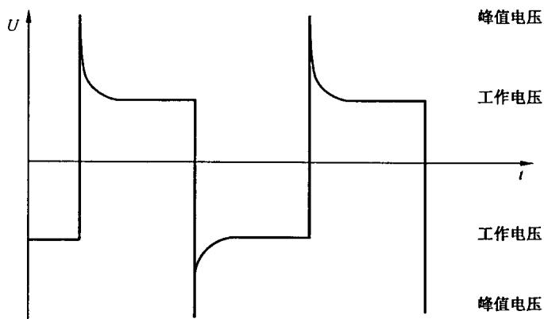  
图1 再现峰值电压

## 4.3.5 暂时过电压的确定

## 4.3.5.1 概述

由于电源系统故障而引起的最严重的暂时过电压情况在 IEC 60364-4-44 中考虑。

注：IEC 60364-4-44 中涉及了如果在高压系统和低压系统的供电变压器的接地之间发生故障时低压系统中人和设备的安全问题。

## 4.3.5.2 故障电压

由于高压系统中的接地故障而引起的故障电压或接触电压的大小及持续时间在 IEC 60364-4-44 的图 44A 中给出。

## 4.3.5.3 暂时过电压引起的应力

低压设备由于高压系统的接地故障而引起的暂时过电压的大小及持续时间在5.3.3.2.3中给出。

## 4.4 频率

本部分适用于 30 kHz 及以下的频率。

注：30 kHz 以上频率的尺寸确定在 IEC 60664-4 中规定。

## 4.5 承受电压作用的时间

就爬电距离而言,电压作用时间影响到在干燥时可能发生表面闪烁(其能量大的足以引起电痕化)的次数。当这类事件次数足够多时会在以下几个方面引起电痕化:

——预期持续使用并且产生的热量不足以使其绝缘表面干燥的设备内；

——承受长期在凝露作用下频繁接通、分断操作的设备内；

——直接连至电网的开关设备输入侧以及该开关设备的进线端和负载端之间。

对预期长时间承受电压作用的绝缘,按表 F.4 确定其爬电距离。

注：如果设备内绝缘仅承受短时电压作用，各产品标准技术委员会可以考虑允许降低用于功能绝缘的爬电距离，例如比表 F.4 中规定低一个电压等级。

## 4.6 污染

## 4.6.1 概述

微观环境决定污染对绝缘的影响,然而在考虑微观环境时必须注意到宏观环境。

有效地使用外壳,封闭式或气密封闭式等措施可减少对绝缘的污染。这些减少污染的措施对设备受凝露或正常运行中其本身产生的污染时可能无效。

固体微粒、尘埃和水能完全桥接小的电气间隙，因此凡微观环境可存在污染之处都要规定最小电气间隙。

注1：在潮湿的情况下污染将会变为导电性污染。由污染的水、油烟、金属尘埃、碳尘埃引起的污染是常见的导电性污染。

注 2：电离气体或金属沉积物引起的导电性污染仅在特定的情况下发生，例如开关设备和控制设备的灭弧室，这种情况不包括在本部分中。

## 4.6.2 微观环境的污染等级

为了计算爬电距离和电气间隙,微观环境的污染等级规定有以下4级:

——污染等级1

无污染或仅有干燥的、非导电性的污染，该污染没有任何影响；

——污染等级 2

一般仅有非导电性污染，然而必须预期到凝露会偶然发生短暂的导电性污染；

——污染等级3

有导电性污染或由于预期的凝露使干燥的非导电性污染变为导电性污染；

——污染等级 4

造成持久的导电性污染，例如由于导电尘埃或雨或其他潮湿条件所引起的污染。

## 4.6.3 导电性污染条件

当持久导电污染存在时(污染等级4)，无法规定爬电距离的尺寸。对于暂时导电污染(污染等级3)，绝缘表面应通过筋或槽的形式，避免导电污染的连续通路(见5.2.2.5和5.2.5)。

## 4.7 设备提供的资料

各产品标准技术委员会应规定设备必须提供的有关资料及提供资料的方式。

## 4.8 绝缘材料

## 4.8.1 相比电痕化指数(CTI)

## 4.8.1.1 闪烁作用下绝缘材料的性能

关于电痕化,由于污染表面干燥使表面泄漏电流分断而产生闪烁时,其闪烁过程中集中释放的能量使绝缘材料受到损伤,绝缘材料的特性可根据其损伤程度大致显现出来。在闪烁作用下绝缘材料可能有以下性能:

——绝缘材料性能不发生衰变；

——放电作用使绝缘材料蚀损(电腐蚀);

——绝缘材料表面上电介质导电性污染和电场强度的综合效应，在其表面上逐渐形成导电通道（电痕化）。

注：电痕化或电腐蚀发生在以下条件：

——承载表面泄漏电流的液膜破裂时，和

——外施电压足以击穿小间隙，该间隙在液膜破裂时形成，和

——表面泄漏电流必须大于限值，以便提供足够能量，以热的方式局部地分解液膜下的绝缘材料。

绝缘的恶化随着电流通过的时间增长而加剧。

## 4.8.1.2 用于绝缘材料分类的 CTI 值

根据 4.8.1.1 规定的性能无法对绝缘材料进行分类，在各种不同的污染和电压下绝缘材料的性能是非常复杂的。在各种不同条件下许多材料可能呈现出两种甚至三种上述特性。绝缘材料与 4.8.1.3 所述材料组别实际上无直接关系。然而，经验和试验表明，具有较高相关性能的绝缘材料的排列也与按相比电痕化指数(CTI)相应等级的排列大致相同。因此本部分采用 CTI 值进行绝缘材料分类。

## 4.8.1.3 材料组别

本部分将绝缘材料按其 CTI 值划分为四组, CTI 值是根据 GB/T 4207—2003 使用溶液 A 所测得的。具体分组如下:

绝缘材料组别 I $600 \leqslant CTI;$

绝缘材料组别Ⅱ $400 \leqslant CTI < 600$ ;

绝缘材料组别Ⅲa $175 \leqslant CTI < 400$ ;

绝缘材料别组Ⅲb $100 \leqslant CTI < 175$ 。

绝缘材料可采用耐电痕化指数(PTI)来表明耐电痕化性能。某一绝缘材料属于上述四种绝缘材料组别之一是基于其PTI值不小于该材料组别规定的较小值来决定。根据GB/T4207—2003规定的方法使用溶液A验证PTI值。

## 4.8.1.4 相比电痕化指数(CTI)试验

按 GB/T 4207—2003 中相比电痕化指数(CTI)试验比较各种绝缘材料在试验条件下的性能,可提供定性比较,同时就绝缘材料具有形成漏电痕迹的趋向来说,相比电痕化指数试验也可给出定量比较。

## 4.8.1.5 无电痕化材料

对于玻璃、陶瓷或其他无机绝缘材料，不会发生电痕化，爬电距离无须大于其相应的为实现绝缘配合而要求的电气间隙。表 F.2 中用于非均匀电场条件的尺寸适用。

## 4.8.2 电气强度特性

绝缘材料的电气强度特性应由产品标准技术委员会考虑，并考虑 5.3.1、5.3.2.2.1 和 5.3.2.3.1 中规定的应力影响。

## 4.8.3 热特性

绝缘材料的热特性由产品标准技术委员会考虑，并考虑5.3.2.2.2、5.3.2.3.2和5.3.3.5中规定的应力影响。

注：也见 IEC 60216。

## 4.8.4 机械和化学特性

绝缘材料的机械和化学特性由产品标准技术委员会考虑，并考虑5.3.2.2.3、5.3.2.3.3和5.3.2.4中规定的应力影响。

## 5 要求及确定尺寸的规则

## 5.1 电气间隙的确定

## 5.1.1 概述

电气间隙应以承受所要求的冲击耐受电压来确定。对于直接接至低压电网供电的设备，其所要求的冲击耐受电压是在4.3.3.3基础上确定的额定冲击电压。如果稳态有效值电压、暂时过电压或再现峰值电压比冲击耐受电压所要求的电气间隙更大，则表F.7a中的相应值适用。应在综合考虑冲击耐受电压、稳态有效值电压、暂时过电压和再现峰值电压之后，选择最大的电气间隙。

注：对于稳态有效值电压或再现峰值电压，电气间隙的确定应保证在这些电压连续施加时无击穿现象发生，产品标准技术委员会应考虑这情况。

## 5.1.2 确定准则

## 5.1.2.1 概述

在确定电气间隙时应考虑以下影响因素：

——功能绝缘的冲击耐受电压要求按 5.1.5，基本绝缘、附加绝缘和加强绝缘的冲击耐受电压要求按 5.1.6；

——稳态耐受电压和暂时过电压(见5.1.2.3);

——再现峰值电压(见 5.1.2.3);

——电场条件(见 5.1.3);

——海拔:表 F.2 及表 F.7a 规定的电气间隙,对用于海拔 2000 m 及以下的设备具有耐受能力,对用在高于海拔 2000 m 的设备,5.1.4 适用;

——微观环境中的污染等级(见 4.6.2)。

机械影响,例如振动和外施力等,则要求有较大的电气间隙。

## 5.1.2.2 耐受瞬时过电压的确定

应根据表 F.2 来确定能够承受所要求冲击耐受电压的电气间隙。对于直接连接于电网的设备，所要求的冲击耐受电压为 4.3.3.3 基础上的额定冲击电压。

注：IEC 60664-5 提供了电气间隙不超过 2 mm 的可供选择的更为精确的确定方法。

## 5.1.2.3 耐受稳态电压、暂时过电压或再现峰值电压的确定

应根据表 F.7a 确定耐受稳态电压(直流或 50/60 Hz)、暂时过电压或再现峰值电压等电压峰值的电气间隙。

根据表 F.7 确定的尺寸应与表 F.2(考虑到污染等级)的值进行比较,两者取较大的电气间隙。

注：高于 30 kHz 频率的尺寸确定要求在 IEC 60664-4 中规定。

## 5.1.3 电场条件

## 5.1.3.1 概述

导电部件(电极)的形状和布置会影响电场的均匀性,进而影响到耐受规定的电压所需要的电气间隙(见表 F.2、表 F.7a 和表 A.1)。

## 5.1.3.2 非均匀电场条件(表 F.2 中情况 A)

选用不小于表 F.2 中非均匀电场的电气间隙可不必考虑导电部件的形状结构,也不必用电压耐受试验进行验证。

由于不能控制形状结构,可能会对电场的均匀性产生不利影响,因此通过绝缘材料的外壳中缝隙的电气间隙应不小于非均匀电场条件规定的电气间隙。

## 5.1.3.3 均匀电场条件(表 F.2 中情况 B)

表 F.2 中情况 B 的电气间隙之值仅适用于均匀电场。只有当导电部件(电极)的形状结构设计成使该处电场强度基本上为恒定的电压梯度时才能采用此值。

电气间隙小于非均匀电场条件要求之值,需要通过电压耐受试验进行验证(见6.1.2)。

注：对于小电气间隙，污染存在可能会影响电场的均匀性，必须增大电气间隙至大于情况 B 之值。

## 5.1.4 海拔

表 F.2 及表 F.7 中规定的电气间隙对从海平面至 2000 m 之处是有效的，表 A.2 规定的海拔修正系数适用于海拔高于 2000 m 以上的电气间隙。

注：对于均匀电场(表 A.1 中情况 B 的耐受电压)，根据帕邢定律，空气中电气间隙的击穿电压正比于电极间距离和大气压的乘积。因此在接近海平面记录的经验数据是按海拔 2000 m 与海平面之间的大气压差异进行修正。对于非均匀电场也采用同样的修正。

## 5.1.5 功能绝缘的电气间隙的确定

对于功能绝缘的电气间隙,要求的耐受电压应是设备在额定条件下(特别是额定电压和额定冲击电压,参见表 F.2)跨电气间隙两端预期发生的最大冲击电压或稳态电压(参见表 F.7)或再现峰值电压(参见表 F.7)。

## 5.1.6 基本绝缘、附加绝缘和加强绝缘的电气间隙的确定

基本绝缘和附加绝缘的电气间隙应按表 F.2 规定各自对应如下电压予以确定：

——按 4.3.3.3 或 4.3.3.4.1 的额定冲击电压；或

——按 4.3.3.4.2 的冲击耐受电压要求。

及按表 F.7a 规定各自对应如下电压予以确定：

——按 4.3.2.2 的稳态电压；

——按 4.3.4 的再现峰值电压；

——按 4.3.5 的暂时过电压。

对于冲击电压,加强绝缘的电气间隙应按表 F.2 对应于比基本绝缘确定的额定冲击耐压高一级 (4.2.3 所列优选值序列)之值来确定,如果按 4.3.3.4.2 基本绝缘要求的冲击耐受电压不是优选值,则加强绝缘应按能承受基本绝缘要求的冲击耐受电压的 160% 来确定。

注1：在绝缘配合的系统中，电气间隙大于要求的最小值对要求的冲击耐受电压而言没有必要，但是对于除绝缘配合以外的原因(例如由于机械影响)增大电气间隙是必要的。在此情况下试验电压仍应保持在设备的额定冲击电压基础上，否则有关的固体绝缘可能会出现过高的应力。

对于稳态电压、再现峰值电压和暂时过电压，加强绝缘的电气间隙按表 F.7a 规定的值确定，以承受 160% 基本绝缘要求的耐受电压。

对具有双重绝缘的设备,在基本绝缘和附加绝缘不能分开进行试验之处,则该绝缘系统可考虑如同加强绝缘。

注 2：在确定可触及的绝缘材料表面的电气间隙时，可设想为该表面覆盖金属箔。具体细节由产品标准技术委员会规定。

## 5.1.7 隔离距离

见 GB/T 17045—2006 中 8.3.2。

## 5.2 爬电距离的确定

## 5.2.1 概述

表 F.4 中的值适用于大多数用途。如果需要更精确地确定不大于 2 mm 的爬电距离的值，可参照 IEC 60664-5 的规定。

## 5.2.2 影响因素

## 5.2.2.1 概述

爬电距离应从表 F.4 中选取,且必须考虑以下影响因素:

——电压按 4.3.2(也可见 5.2.2.2);

——微观环境(见 5.2.2.3);

——爬电距离的方向和位置(见 5.2.2.4);

——绝缘表面的形状(见4.6.3和5.2.2.5);

——绝缘材料(见 4.8.1);

——电压作用的时间(见 4.5)。

注：表 F.4 中的数值来自现有实验数据，且适合大多数用途，然而对于功能绝缘，可选取其他爬电距离数值。

## 5.2.2.2 电压

确定爬电距离以作用在跨接爬电距离两端的长期电压有效值为基础。此电压为实际工作电压(见5.2.3)、额定绝缘电压(见5.2.4)或额定电压(5.2.4)。

瞬时过电压通常不会影响电痕化现象,因此忽略不计。然而对暂时过电压和功能过电压,如果他们的持续时间和出现的频度对电痕化有影响的话,则必须要考虑。

## 5.2.2.3 污染

微观环境的污染等级(已在4.6.2中规定)对确定爬电距离的尺寸的影响在表F.4中考虑。

注：设备中可能存在不同的微观环境条件。

## 5.2.2.4 爬电距离的方向和位置

如有必要,制造商应指明设备或元件预期使用的方位,以便在设计时考虑污染的积累对爬电距离的不利影响。

注：必须考虑长期存放的情况。

## 5.2.2.5 绝缘表面的形状

绝缘表面的形状仅在污染等级3情况下对确定爬电距离有影响。固体绝缘表面应尽可能设置横向的筋和槽，用来阻断污染引起连续性的漏电路径。同时，筋和槽也可在受电压作用的绝缘上用来引水。应避免导电部件间插入槽和接缝，因为它们可能会使污染累积或积水。

注：必须考虑长期存放的情况。爬电路径长度的计算在6.2中列出。

## 5.2.2.6 爬电距离与电气间隙的关系

爬电距离不能小于相关的电气间隙,因此最小的爬电距离有可能等于要求的电气间隙。然而,除此选定尺寸极限外,空气中的最小电气间隙与容许的最小爬电距离之间并无物理联系。

在爬电距离能够承受相关电气间隙(表 F.2)所要求的电压情况下,爬电距离小于表 F.2 中情况 A 要求的电气间隙仅能在污染等级 1 和 2 的条件下使用。用试验验证爬电距离耐受相关电气间隙的电压时应考虑海拔修正系数(见 6.1.2.2)。

最小电气间隙和爬电距离的比较见附录 E。

## 5.2.2.7 多种材料或多种污染等级情况下的爬电距离

如果爬电距离的某部分是按耐受全部电压来确定,或全部爬电距离是按具有最低的 CTI 和最高的污染等级的材料来确定,则一个爬电距离可以分成几个不同的材料部分和/或具有不同的污染等级。

## 5.2.2.8 被浮动导电部件分开的爬电距离

由相同材料组成的爬电距离可以分成几个部分，包括浮动导电部件或被浮动导电部件分开的部分，

只要各单独部分的爬电距离之和等于或大于假定浮动导电部件不存在时所需值。

各个单独部分爬电距离最小值 X 在 6.2 中规定(见例 11)。

## 5.2.3 功能绝缘的爬电距离的确定

功能绝缘的爬电距离应按表 F.4 规定的对应于跨接爬电距离两端的实际工作电压予以确定。

当用实际工作电压来确定爬电距离时，允许用插入值确定中间电压的爬电距离。应使用线性插入法求插入值，并将所得值的位数圆整到表中之值的相同位数。

## 5.2.4 基本绝缘、附加绝缘和加强绝缘的爬电距离的确定

基本绝缘和附加绝缘的爬电距离应根据下述电压从表 F.4 确定。

——在表 F.3a 中第 2 和 3 栏和表 F.3b 第 2、3 和 4 栏中以对应于低压电网标称电压给出的合理化电压(见 4.3.2.2);

——根据 4.3.2.2.1 的额定绝缘电压；

——在 4.3.2.2.2 规定的电压。

注1：附加绝缘所采用的污染等级、绝缘材料、机械强度和环境条件均可与基本绝缘所采用的有所不同。

当用 4.3.2.2.2 规定的电压确定爬电距离时，允许用插入值确定中间电压的爬电距离。应使用线性插入法求插入值，并将所得值的位数圆整到表中之值的相同位数。

双重绝缘的爬电距离是基本绝缘之值和附加绝缘之值的总和,因双重绝缘是由基本绝缘和附加绝缘组成。

加强绝缘的爬电距离应为表 F.4 中对应于基本绝缘所确定值的二倍。

注 2：在确定可触及绝缘材料表面的爬电距离时，可假定为该表面覆盖有金属箔。具体细节由各产品标准技术委员会规定。

## 5.2.5 使用筋减小爬电距离

在污染等级3情况下，当所需的爬电距离等于或大于 $8\mathrm{mm}$ 时，可通过使用筋减小爬电距离。减小的爬电距离值列于表F.4的括号内(见表F.4注4)。筋的最小宽度 $(W)$ 和最小高度 $(H)$ 分别为所需爬电距离(包括筋)的 $20\%$ 和 $25\%$ （见图2）。

在使用多根筋情况下，爬电距离应分成与所需筋相同数量的几个部分，每部分爬电距离均应符合上述要求。各根筋之间的最小爬电距离应等于用于每个部分的筋从底部测得的最小宽度。

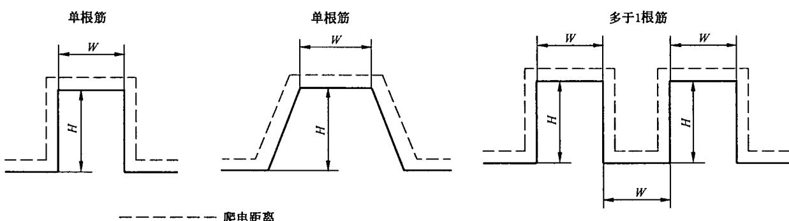  
图 2 筋的宽度(W)和高度(H)尺寸

## 5.3 固体绝缘的设计要求

## 5.3.1 概述

由于固体绝缘的电气强度远远大于空气的电气强度，故在设计低压绝缘系统时可能不会引起注意。另一方面，通过固体绝缘材料的绝缘距离通常大大地小于电气间隙而产生高的电应力。另一点需考虑的是实际上很少采用高电气强度的材料。在绝缘系统中，电极与绝缘之间和不同的绝缘层之间均可能会产生间隙，或绝缘材料本身有气隙。在这些间隙或气隙中，在电压远小于击穿水平时，仍可能发生局部放电，这就会影响固体绝缘的使用寿命。然而当峰值电压小于500 V时，一般不可能发生局部放电。

具有同等重要意义的事实是与气体相比,固体绝缘不是一种可恢复的绝缘介质,例如偶尔发生的高压峰值就可能对固体绝缘造成破坏性影响。这种情况会发生在使用及常规高电压试验中。

许多不利影响会在固体绝缘的使用寿命期间累积。由此形成复杂的过程，且最终导致绝缘老化。所以电应力和其他应力(例如热、环境)的叠加会造成绝缘老化。

可用短期试验结合适当的条件处理(见6.1.3.2)来模拟固体绝缘的长期性能。

如果固体绝缘承受高频作用,则固体绝缘的介电损耗及局部放电现象将会加剧。在开关型供电电源中该处绝缘材料在频率至 500 kHz 下重复承受峰值电压,就能观察到这一情况。

固体绝缘的厚度与前面所述的失效机理之间存在一定的联系。当固体绝缘的厚度减少，电场强度随之增加，失效的风险也随之上升。由于不可能计算出固体绝缘的所需厚度，因此只能通过试验来验证性能。

## 5.3.2 应力

## 5.3.2.1 概述

施加在固体绝缘上的应力可分为：

——短期；和

——长期。

除 5.3.2.2 和 5.3.2.3 列出的应力外，其他应力（见 5.3.2.4）在使用中也可能施加在固体绝缘上。

## 5.3.2.2 短期应力及其影响

## 5.3.2.2.1 电压的频率

外施电压的频率会极大地影响电气强度。介质发热和热不稳定性的概率大约与频率成正比。按GB/T 1408.1—2006在工频下测量时，厚度为3 mm固体绝缘的击穿电场强度在10 kV/mm～40 kV/mm之间。提高施加的电压频率会降低大多数绝缘材料的电气强度。

注：高于 30 kHz 的频率对电气强度的影响见 IEC 60664-4。

## 5.3.2.2.2 发热

发热可以造成：

——由于内应力的消除造成机械上的变形；

——在高于环境温度(例如温度高于 $60^{\circ}C$ )的较低温升下热塑性材料软化；

——由于塑化剂损失造成某些材料脆裂；

——如果超过材料的玻璃化转变温度，尤其会软化某些交联材料；

——增大的介电损耗导致热不稳定性和损坏。

高温度梯度(例如短路过程中)会造成机械故障。

## 5.3.2.2.3 机械冲击

如果材料不具有足够的抗撞击强度,机械冲击会造成绝缘损坏。下述原因引起的材料撞击强度降低也会造成机械冲击的损坏:

——当温度下降至低于其玻璃化转变温度时,材料就会变脆;

——长期暴露在高温下会造成材料的塑化剂损失或造成原料聚合物老化。

各产品标准技术委员会在规定运输、贮存、安装和使用的环境条件时要考虑此情况。

## 5.3.2.3 长期应力及其影响

## 5.3.2.3.1 局部放电(PD)

在空气中,当峰值电压大于 300 V(帕邢最小值)时就可能会发生局部放电(PD)。损坏主要是由于逐渐的腐蚀或金属沉积而造成击穿或表面闪络。

绝缘系统具有不同的特性:某些绝缘(例如陶瓷绝缘子)在其整个预期寿命期间能承受放电现象,而其他一些绝缘(例如电容器)是不允许有放电现象。电压、放电重复率以及放电量均是重要的参数。

局部放电特性受外施电压的频率的影响。在增高频率的条件下进行加速寿命试验，可证实失效时间大约与外施电压的频率成反比。然而，实际经验仅包括 5 kHz 及以下的频率，因为在较高的频率下，也会存在其他一些失效机理，例如电介质发热。

注：高于 30 kHz 的频率对局部放电的影响见 IEC 60664-4。

## 5.3.2.3.2 发热

发热会引起绝缘的挥发、氧化或长期化学反应，结果造成绝缘性能下降。但是失效通常是由于物理上的原因(如脆裂)造成的，导致断裂和电击穿，这种过程是个长期的过程，不能用短时试验进行模拟，因为它需要几千小时的试验时间(见 IEC 60216)。

## 5.3.2.3.3 机械应力

在运行、贮存或运输过程中，由于震动或冲击产生的机械应力会造成绝缘材料的脱层、断裂或断开。注：产品标准技术委员会在规定试验条件时应考虑上述应力。

## 5.3.2.3.4 湿度

有水蒸气的地方可能会影响绝缘电阻和放电熄灭电压，加剧表面污染，发生腐蚀和外形变化。对于某些材料，高湿度会大大地降低电气强度。在某些情况下，低湿度也可能是不利的，例如会增大静电电荷的滞留，且会降低某些材料（如聚酰胺）的机械强度。

## 5.3.2.4 其他应力

许多其他应力均会损坏绝缘，各产品标准技术委员会必须考虑。

这些应力包括如下举例：

——紫外线辐射和电离辐射；

——暴露于溶剂或活性化学剂中造成的应力裂纹或应力断裂；

——塑化剂迁移作用；

——细菌、霉菌或菌类的作用；

——机械塑性变形。

尽管上述诸项应力的影响不怎么重要或影响较小，但在特定情况下，还是应引起注意。

## 5.3.3 要求

## 5.3.3.1 概述

基本绝缘、附加绝缘和加强绝缘的固体绝缘应能持久地承受电场强度和机械应力，并能在设备的预期寿命期间承受可能产生的热影响和环境影响。

注：在考虑可触及的固体绝缘表面的电应力时，可假定为该表面覆盖有金属箔。具体细节由各产品标准技术委员会规定。

在实际工作电压为具有定期再现峰值的非正弦电压情况下，应特别考虑可能发生的局部放电。同样在有绝缘层和模压绝缘件上有气隙的情况下，要考虑可能发生局部放电使固体绝缘老化。

## 5.3.3.2 耐受电压应力

## 5.3.3.2.1 概述

各产品标准技术委员会对其设备应规定合适的电压额定值。

## 5.3.3.2.2 瞬时过电压

基本绝缘和附加绝缘应具有：

——按表 F.1 对应于电网标称电压和相关过电压类别的冲击耐受电压要求(见 4.3.3.3);或

——按电路中预期的瞬时过电压规定的设备内部电路的冲击耐受电压(见4.3.3.4)。

加强绝缘应具有对应于额定冲击电压但比基本绝缘规定值高一级(4.2.3所列优选值序列)的冲击耐受电压。如果根据4.3.3.4.2基本绝缘要求的冲击耐受电压不是优选值中的数值，则应规定加强绝缘承受基本绝缘要求的冲击耐受电压的160%。

验证试验见 6.1.3.3。

## 5.3.3.2.3 暂时过电压

基本固体绝缘和附加固体绝缘应能承受下列暂时过电压：

—— $U_{n}+1\ 200\ V$ 短期暂时过电压时间至5 s;

—— $U_{n}+250\ V$ 长期暂时过电压时间大于5 s。

式中：

$U_{n}$ ——中性点接地的电源系统的标称线对中性点的电压。

加强绝缘应能承受 2 倍的基本绝缘所规定的暂时过电压值。

验证试验见 6.1.3。

注1：这些数值取自IEC60364-4-44中442，其中 $U_{\mathrm{n}}$ 被称作 $U_{\circ}$ 。

注2：这些值为有效值。

## 5.3.3.2.4 再现峰值电压

假定低压电网发生的最大再现峰值电压可暂定为 $F_{4} \times \sqrt{2} U_{n}$ ，即 $U_{n}$ 峰值的 1.1 倍。当出现再现峰值电压时，放电熄灭电压应至少为：

—— $F_{1}\times F_{4}\times\sqrt{2}U_{n}$ ，即基本绝缘和附加绝缘各为 $1.32\sqrt{2}U_{n}$ ，和

—— $F_{1}\times F_{3}\times F_{4}\times\sqrt{2}U_{n}$ ，即加强绝缘为 $1.65\sqrt{2}U_{n}$ 。

注： $\sqrt{2}U_{n}$ 是中性点接地系统中电网标称电压下的线对中性点的基波(不失真)电压的峰值。本条中倍率的应用见附录D规定。

系数 F 的解释见 6.1.3.5。

对于内部电路,必须计算其最高的再现峰值电压以取代 $F_{4} \times \sqrt{2} U_{n}$ , 且固体绝缘应满足相应的要求。

验证试验见 6.1.3.5。

## 5.3.3.2.5 高频电压

对于频率大于工频的电压,应根据 5.3.2.2.1 和 5.3.2.3.1 考虑频率的影响。高于 1 kHz 的频率在本部分范围内被看作为高频。

各产品标准技术委员会应规定是否有必要按 6.1.3.7 进行试验。

## 5.3.3.3 承受短期热应力

在正常使用和非正常使用(适当时)中可能发生的短期热应力不应损坏固体绝缘。各产品标准技术委员会应规定严酷水平。

注：标准严酷水平在 IEC 60068 中规定。

## 5.3.3.4 承受机械应力

在预期使用中可能出现的机械振动或冲击不应损坏固体绝缘。各产品标准技术委员会应规定严酷水平。

注：标准严酷水平在 IEC 60068 中规定。

## 5.3.3.5 承受长期热应力

固体绝缘的热老化不应在设备预期的寿命期间损坏绝缘配合。各产品标准技术委员会应规定是否有必要进行试验(也可见 IEC 60085 和 IEC 60216)。

## 5.3.3.6 承受湿度影响

设备在规定的湿度条件下应保持绝缘配合(也可见6.1.3.2)。

## 5.3.3.7 承受其他应力

设备可能承受其他应力,例如,5.3.2.4列出的应力,这些应力可能会对固体绝缘产生不利的影响。各产品标准技术委员会应规定这些应力并规定试验方法。

## 6 试验和测量

## 6.1 试验

## 6.1.1 概述

下列试验程序适用于型式试验。允许试品劣化并假定试品不再进行使用。

注1：如果试品需要或打算进一步使用，各产品标准技术委员会应特别考虑。在这种情况下任何高压试验应结合

6.1.3.5 中及附录 C 的局部放电测量一起进行。

试验程序规定如下：

——电气间隙验证(见 6.1.2);

——固体绝缘验证(见 6.1.3);

——整台设备介电试验(见 6.1.4);

——其他试验(见 6.1.5)。

由瞬时过电压引起的对于电气间隙和固体绝缘的应力可通过冲击电压试验评估，此试验也可用一个交流电压试验或直流电压试验来代替。电气间隙等于或大于表 F.2 中情况 A 的可通过测量或通过电压试验验证，如果小于表 F.2 中情况 A 的值，必须通过电压试验验证。

在任何情况下，固体绝缘耐受电压应力的能力必须通过电压试验验证。由瞬时过电压引起的应力通过冲击电压试验评估，此试验可由交流电压试验或直流电压试验代替。由交流稳态电压引起的应力仅能通过交流电压试验评估。由于固体绝缘对交流和直流有不同的耐受特性，所以具有与交流峰值电压相同的试验电压的直流电压试验不完全等同于交流电压试验。然而在纯直流电压应力情况下，直流电压试验是合适的。

注2：尽管可以用一个交流电压试验或直流电压试验代替冲击电压试验以验证电气间隙，但对于固体绝缘原则上不能用冲击电压试验代替交流电压试验。其主要原因在于冲击电压与工频电压的传播方式不同（特别是在复杂电路中），以及固体绝缘的耐受特性取决于电压应力的形状和时间。

## 6.1.2 验证电气间隙的试验

## 6.1.2.1 概述

当电气设备进行电气试验来验证电气间隙时，试验应依据5.1中规定的耐受电压要求进行。适合验证电气间隙的试验是冲击电压试验，但正如5.1.3的规定，试验仅在电气间隙小于表F.2中情况A时需要进行。

根据 5.1, 如果耐受稳态电压、再现峰值电压或暂时过电压对于确定电气间隙是决定性的, 而且确定的电气间隙小于表 F.7a 情况 A 时, 需要根据 6.1.2.2.2 规定的交流试验电压进行试验。

当通过冲击电压试验来验证设备内的电气间隙时,必须保证所规定的冲击电压施加在被试电气间隙之间。

注 1: 电气间隙的电气试验也会作用到相关的固体绝缘上。

注 2：某些情况下上述试验也适用于爬电距离，见 5.2.2.6。

注3：整台设备的试验见6.1.4。

## 6.1.2.2 试验电压

## 6.1.2.2.1 冲击电压介电试验

## 6.1.2.2.1.1 概述

本试验的目的是验证电气间隙能否承受规定的瞬时过电压。用 $1.2/50 \mu s$ 波形及表 F.5 中规定的电压值进行冲击耐受电压试验。GB/T 17627.1—1998 中 6.1 和 6.2 规定的波形适用。本试验模拟大气的过电压，同时也适用于由于低压设备操作所产生的过电压。

由于冲击电压试验结果的分散性,试验应每极性至少各施压3次,二次试验间的间隔时间至少1 s。

注1：冲击发生器的输出阻抗应不大于 $500\Omega$ 。对装有跨接在试验电路的元件的设备进行试验时，应规定更低的实际的冲击发生器阻抗值(见GB/T17627.2—1998中9.2)。在这种情况下，由于可能的共振作用，会导致试验电压峰值升高，因此在规定试验电压值时应予以考虑。

各产品标准技术委员会可按 6.1.2.2.2 规定替代的介电试验。

注2：表F.5中规定的值是根据6.1.2.2.1.3计算得出。为确保准确性这些值以高的精确度给出。各产品标准技术委员会在实际使用时，可选择圆整这些数值。

## 6.1.2.2.1.2 冲击试验电压的选择

如果设备的绝缘配合要求对于电气间隙(电气间隙小于表 F.2 规定的情况 A)进行介电试验,则该设备应以 4.3.3 规定的额定冲击电压相对应的冲击试验电压进行试验。应采用表 F.5 中的冲击试验电压。

对于试验条件,各产品标准技术委员会应规定温度和湿度值。

各产品标准技术委员会应考虑除型式试验外，是否还必须进行抽样或常规试验。

## 6.1.2.2.1.3 表 F.5 的说明

下面给出表 F.5 中数据的一些说明：

## a) 冲击电压试验的修正系数

根据 1, 额定冲击电压对使用在海拔 2 000 m 及以下的设备是有效的。在海拔 2 000 m 处正常的气压为 80 kPa, 而在海平面处之值为 101.3 kPa, 因此安装在低于 2 000 m 海拔处的被试设备要用较高的冲击试验电压进行试验, 表 F.5 中列出了验证不同海拔电气间隙的冲击试验电压值。海平面处和其他试验地点确定试验电压值的计算基于如下:

表 A.2 给出的海拔修正系数认为与图 A.1 的曲线有关,他们的关系如下:

$$
K _ {\mathrm{u}} = \left(\frac {1}{K _ {\mathrm{d}}}\right) ^ {m}
$$

式中：

d——电气间隙,单位为毫米(mm);

$K_{u}$ ——电压的海拔修正系数；

$K_{d}$ ——距离的海拔修正系数(见表 F.8);

m——图 A.1 中曲线 1 的有关直线之斜率(二坐标轴上对数刻度),为下列值:

采用海拔修正系数作为距离修正其结果在图 A.1 中曲线 1 列出, 不同的四个阶梯的电压仅随一个阶梯的距离变化。这个运算的数学公式如上所示。表 F.5 所列出值包括此计算值。

## b) 电气间隙介电强度的影响因素的一般探讨

影响介电强度的因素如下：

——气压；

——温度；

——湿度。

试验时,只要是正常的实验室条件,可不考虑温度、湿度和正常气压的变化。

GB/T 2421—1999 规定了正常的实验室条件：

——温度: $15^{\circ} \mathrm{C} \sim 35^{\circ} \mathrm{C}$ ;

——气压:海平面处 86 kPa\~106 kPa;

——相对湿度:25%\~75%。

## 6.1.2.2.2 冲击电压介电试验的代替试验

## 6.1.2.2.2.1 概述

对于特定设备，各产品标准技术委员会可规定交流或直流电压试验来代替冲击电压介电试验。

注：当以交流或直流电压(其峰值等同于表 F.5 中规定的冲击试验电压)来验证电气间隙的电压耐受能力时，由于试验电压施加时间较长，固体绝缘也承受了较严的考核。它们可能过负荷并损伤某些固体绝缘。当规定用交流或直流电压试验代替 6.1.2.2.1 所列冲击耐受电压介电试验时，各产品标准技术委员会应考虑到这些情况。

## 6.1.2.2.2.2 交流电压介电试验

正弦工频试验电压应基本上为正弦波形。当峰值和有效值之比为 $\sqrt{2}(1\pm3\%)$ 时符合本要求。峰值应等于表F.5中的冲击试验电压，且交流试验电压应施加3周波。

## 6.1.2.2.2.3 直流电压介电试验

直流试验电压应基本上没有纹波。当电压的峰值和平均值之比为 $1.0(1 \pm 3\%)$ 时符合本要求。直流试验电压的平均值应等于表 F.5 中的冲击试验电压，每极性各施加电压三次，每次持续时间 10 ms。

## 6.1.3 固体绝缘的验证试验

## 6.1.3.1 试验选择

在运行、贮存、运输或安装过程中可能承受机械应力的固体绝缘应在进行介电试验之前先进行有关的振动和机械冲击试验。各产品标准技术委员会可规定有关的试验方法。

注：标准试验方法在 IEC 60068 的相关部分中规定。

绝缘配合试验是型式试验。试验目的如下：

a) 用冲击电压耐受试验验证固体绝缘耐受额定冲击电压的能力(见5.3.3.2.2);

b) 用交流电压试验验证固体绝缘耐受下述电压的能力：

——短时暂时过电压(见 5.3.3.2.3);

——最高稳态电压；

——再现峰值电压(见 5.3.3.2.4);

如果交流试验电压的峰值等于或大于额定冲击电压值,则冲击电压试验可以由交流电压试验代替;

如果承受应力的时间持续增加，则固体绝缘相比于电气间隙有不同的耐受特性。通常耐受能力会显著下降。因此规定用于验证固体绝缘耐受能力的交流电压试验不允许由冲击电压试验来代替；

c) 用局部放电试验验证固体绝缘在下列电压下不会持续局部放电：

——最大稳态电压；

——长期暂时过电压(见 5.3.3.2.3);

——再现峰值电压(见 5.3.3.2.4);

d) 高频电压试验是按 5.3.3.2.5 规定验证不会由于电介质发热而发生故障。

各产品标准技术委员会应就设备中发生的有关应力需要进行哪些型式试验作出规定。

如果 c) 中所列电压的峰值超过 700 V 并且平均电场强度高于 1 kV/mm，应规定对固体绝缘进行局部放电试验。平均电场强度是峰值电压除以两个不同电位的部件之间的距离。

上述试验也可用作抽样试验或常规试验。然而，各产品标准技术委员会应负责规定哪些试验应作为抽样试验和常规试验以便保证生产过程中的绝缘质量。应规定试验和合适的条件，所用试验参数足以检测出故障且不会引起绝缘损坏。

如在整台设备上进行试验,则采用 6.1.4 的试验程序。

## 6.1.3.2 环境条件试验

如果没有其他规定,试验应以新的试品进行。试品应以温度和湿度条件进行处理,其目的是:

——代表其最繁重的正常工作条件；

——暴露其在新的情况下可能不会出现的弱点。

各产品标准技术委员会应从下面推荐的方法中规定合适的环境条件处理方法：

a) 干热(GB/T 2423.2—2001)，用以达到稳定的条件，该条件可能在产品制造后不会立即存在；

b) 干热循环(GB/T 2423.2—2001)，用以诱发气隙的产生，该气隙可能在贮存，运输和正常使用中产生；

c) 热冲击(GB/T 2423.22—2002)，用以诱发绝缘系统内的绝缘脱层，该脱层可能在贮存、运输和正常使用过程中发生；

d) 湿热(GB/T 2423.3—2006)，用以评价材料吸水性对固体绝缘电气性能的影响。

对于冲击电压试验、交流工频电压试验和高频电压试验，最有效的环境条件处理方法是 a) 和 d) 项的方法。对于局部放电试验，环境条件处理方法 b) 和 c) 项最有效。

如果对固体绝缘的环境条件有要求的话,则应在型式试验前进行有关试验。有关的温度,湿度和时间之值应从表 F.6 中选取。

在电气试验之前可以适当地对元件(例如:电气部件、分装组件、绝缘部件或材料)进行环境条件试验。如果元件已按本条款进行过型式试验,那么就不再要求进行环境条件试验。

## 6.1.3.3 冲击电压试验

## 6.1.3.3.1 试验方法

除表 F.5 中海拔修正系数不适用之外，6.1.2.2.1 中有关冲击电压试验的方法同样适用于固体绝缘，每极性各施加冲击电压五次，各次间隔时间至少为 1 s。应记录每个脉冲的波形(见 6.1.3.3.2)。

## 6.1.3.3.2 合格判别

试验期间固体绝缘应无击穿或局部击穿，但允许有局部放电。局部击穿现象(该现象发生在逐次脉冲前期)将在记录结果的波形图上的电压梯级上显示出来。第一个脉冲出现击穿则既可表明绝缘系统完全损坏，也可表明设备中的过电压限制装置动作。

注1：如果设备中装有过电压限制装置，则必须注意检查波形以确认它的动作不是指绝缘损坏。冲击电压畸变（脉冲与脉冲之间不产生变化）可能是由这类过电压限制装置动作造成的，并不显示固体绝缘(局部)击穿。

注2：气隙中的局部放电可能会导致极短时间的局部凹痕，而它可能在脉冲过程中重复发生。

## 6.1.3.4 交流工频电压试验

## 6.1.3.4.1 试验方法

正弦工频试验电压应基本上为正弦波形。当峰值和有效值之比为 $\sqrt{2}(1 \pm 3\%)$ 时符合本要求。峰值应与6.1.3.1中b)项提及的电压最高值相等。

对于基本绝缘和附加绝缘,试验电压值与 6.1.3.1 中 b)项提及的电压值相同。对于加强绝缘,试验电压值是用于基本绝缘试验电压值的二倍。

将交流试验电压在不大于 5 s 内均匀地从 0 V 上升至 5.3.3.2 中规定的电压值，并在此电压下保持 60 s。

在短期暂时过电压导致试验电压幅值至最严酷的情况下,产品标准技术委员会可考虑减少试验时间,最低为 5 s。

注1：对特殊型式的绝缘，可能需要更长时间的试验以测定固体绝缘内的薄弱点。

注 2：在高稳态应力(包括高再现峰值电压)试验情况下，产品标准技术委员会宜考虑试验电压的安全余量。

在某些情况下,交流试验电压需由等于交流电压峰值的直流试验电压代替,然而此试验的严酷度比交流电压试验低。产品标准技术委员会应考虑此情况(见6.1.3.6)。

试验设备在 GB/T 17627.2—1998 中规定。推荐发生器的短路输出电流不小于 200 mA。

注 3：对超过 3 kV 的试验电压，试验设备的额定功率应等于或大于 600 VA。

发生器的脱扣电流应调整至 100 mA, 对于超过 6 kV 的试验电压, 脱扣电流应调整至可能的最高值。

注 4：对于常规试验，脱扣电流可以调整至较低水平，但不得小于 3.5 mA。

## 6.1.3.4.2 合格判别

固体绝缘不应发生击穿。

## 6.1.3.5 局部放电试验

## 6.1.3.5.1 概述

正弦工频试验电压应基本上为正弦波形。当峰值和有效值之比为 $\sqrt{2}(1 \pm 3\%)$ 时符合本要求。 $U_{\mathrm{t}}$ 的峰值(见图3)应与6.1.3.1中c)项提及的电压(根据实际情况乘上系数 $F_{1}, F_{3}$ 和 $F_{4}$ ) 的最高值相等。局部放电试验方法在附录C中规定。试验时，应采用以下倍率系数。这些举例适用于再现峰值电压 $U_{\mathrm{rp}}$ ，例中的系数同样也适用于最高稳态电压和长期暂时过电压。

$F_{1}$ ——局部放电试验和确定基本绝缘和附加绝缘尺寸的基础安全系数。

环境条件(诸如温度)可能会影响局部放电熄灭电压。考虑了上述影响因素取基础安全系数 $F_{1}$ 为1.2。因此基本绝缘或附加绝缘局部放电熄灭电压至少为 $1.2U_{rp}$ 。

$F_{2}$ ——局部放电滞后系数。

滞后现象发生在局部放电初始电压 $U_{i}$ 与局部放电熄灭电压 $U_{e}$ 之间。实际经验表明 $F_{2}$ 不会大于 1.25。因此，对于基本绝缘和附加绝缘，试验电压的初始值为 $F_{1} \times F_{2} \times U_{rp}$ ，即 $1.2 \times 1.25 U_{fp} = 1.5 U_{fp}$ 。

注：上述系数已考虑到局部放电可能被大于 $U_{i}$ 的瞬时过电压所引发并被如大于 $U_{e}$ 的再现峰值电压值所维持。这种情况要求用冲击电压和交流电压的组合进行试验。但这难以实行。因此进行交流试验时应具有初始上升的电压。

$F_{3}$ ——局部放电试验和确定加强绝缘尺寸的附加安全系数。

对于加强绝缘，需要更严谨的危险评估。因此，要求附加安全系数 $F_{3}=1.25$ 。试验电压的初始值为 $F_{1}\times F_{2}\times F_{3}\times U_{rp}$ ，即 $1.2\times1.25\times1.25U_{rp}=1.875U_{rp}$ 。

$F_{4}$ ——低压电网标称电压偏移系数。

对于接至低压电网(主干线)的电路,本系数考虑了电网电压与其标称电压值之间的最大偏差。因此,标称电压 $U_{n}$ 的峰值需乘上 $F_{4}=1.1$ 。

## 6.1.3.5.2 验证

本试验是验证在下列最大电压值下不会维持局部放电：

——在最大稳态电压的峰值下；

——在长期暂时过电压峰值下(见5.3.3.2.3);

——在再现峰值电压下(见 5.3.3.2.4)。

注：对于某些情况，所要求的是局部放电的初始电压实际值和熄灭电压的实际值，他们的测量程序在 D.1 中规定。试验时，通常将局部放电试验电压施加在元件、小组件和小型设备上。对复杂设备进行试验时，必须注意当在该设备接线端子处测量时，要估计到局部放电信号会有明显衰减。

最小放电熄灭电压要求的值乘上 $F_{1}$ 系数后应大于上述所列最高电压值。

根据试品的种类,各产品标准技术委员会应规定:

——试验电路(C.1);

——测量设备(C.3 和 D.2);

——测量频率(C.3.1 和 D.3.3);

——试验程序(6.1.3.5.3)。

## 6.1.3.5.3 试验程序

试验电压 $U_{t}$ 值为所要求的局部放电熄灭电压值 $U_{e}$ 的 1.2 倍。根据局部放电滞后现象（见 6.1.3.5.1）应施加 1.25 倍试验电压的初始值。

电压应均匀地从 0 V 升至初始试验电压 $F_{2} \times U_{t}$ ，即 $1.5(F_{1} \times F_{2} = 1.2 \times 1.25 = 1.5)$ 倍 6.1.3.5.2 所列电压最高值。在电压 $F_{2} \times U_{t}$ 下保持规定时间 $t_{1}$ ，但不超过 5 s。如果不发生局部放电，则试验电压在经过 $t_{1}$ 之后降至 0。如果发生局部放电，则把电压降至试验电压 $U_{t}$ ，在该值下保持规定时间 $t_{2}$ 直至测量到局部放电量为止。

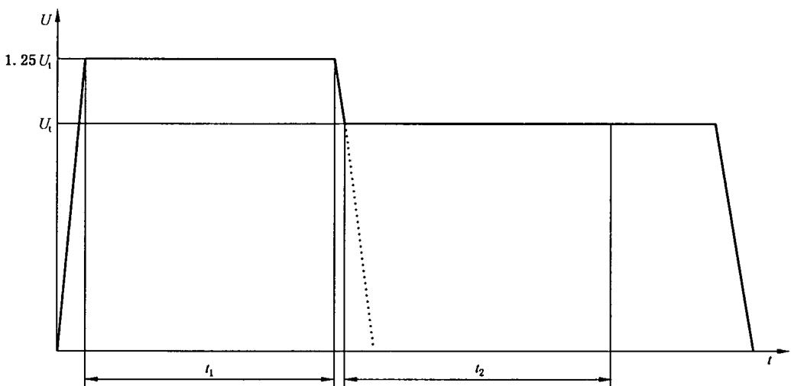  
图3 试验电压

## 6.1.3.5.4 合格判别

## 6.1.3.5.4.1 规定的放电量

由于试验目的是在正常使用条件下没有持续的局部放电,所以应规定出最低的实际可行之值(见D.3)。

注1：除了空气中电晕放电造成的放电(例如在非模压的变压器中)外，大于 $10\mathrm{pC}$ 的值是不合适的。

注 2：就目前的电气设备而言，小于 2 pC 值是可行的。

干扰电平不应从局部放电仪的读数中减掉。

## 6.1.3.5.4.2 试验结果

如果符合下列规定,则认为固体绝缘试验合格

——没有发生绝缘击穿；和

——施加试验电压时没有发生局部放电，或在 $t_{2}$ 后测得的放电量不大于规定值。

## 6.1.3.6 直流电压试验

由于固体绝缘对不同类型电压的耐受特性不同,试验电压与交流电压峰值相等的直流电压试验不完全等同于交流电压试验。然而在纯直流电压应力情况下,直流电压试验是合适的。

直流试验电压应基本上没有纹波。当电压的峰值和平均值之比为 $1.0(1 \pm 3\%)$ 时符合本要求。直流试验电压的平均值应该等于6.1.3.1中b)项提及的交流试验电压的峰值。

对于基本绝缘和附加绝缘,试验电压与6.1.3.1中b)项提及的试验电压相同。对于加强绝缘,试验电压是基本绝缘试验电压的二倍。

直流试验电压应在 5 s 内从 0 V 均匀地上升至 5.3.3.2 规定之值，并在此值下保持至少 60 s。

注1：某些情况下，由于电容原因充电电流可能太高，电压上升可能需要更长时间。

试验设备在 GB/T 17627.2—1998 中规定。推荐发生器的短路输出电流不小于 200 mA。

注 2：对超过 3 kV 的试验电压，试验设备的额定功率应等于或大于 600 VA。

发生器的脱扣电流应调整至 100 mA, 对于超过 6 kV 的试验电压, 脱扣电流应调整至可能的最高值。

注 3：对于常规试验，脱扣电流可以调整至较低水平，但不得小于 10 mA。

## 6.1.3.7 高频电压试验

对于 5.3.3.2.5 规定的高频电压, 可能需要附加试验或替代试验, 这些试验是按 6.1.3.4 规定的交流试验或按 6.1.3.5 规定的局部放电试验。

注：关于高频绝缘耐受性能的信息和试验方法在 IEC 60664-4 中规定。

## 6.1.4 整台设备进行介电试验

## 6.1.4.1 概述

当整台设备进行冲击电压试验时,应考虑试验电压的衰减或增幅。必须保证试验电压的要求值施加在受试设备的两端。

在进行介电试验前,应断开电涌保护装置(SPD)。

注：在具有高电容的电容器与进行电压试验的部件并联的情况下，由于充电电流可能超过高压试验器(200 mA)的容量，此时进行交流电压试验是困难的或甚至不可能的。如果是后一种情况，试验前宜将并联的电容器拆开。如还不行，可考虑直流试验。

## 6.1.4.2 部件的试验

介电试验电压应施加于设备的电气上相互分离的部分之间。

这些部分举例如下：

——带电部件；

——分离电路；

——接地电路；

——可触及表面。

可触及表面的非导电部分应覆盖金属箔。

注：如果大型外壳不能实现完全覆盖金属箔，则只要将试验电压施加的并具有电击保护的部分局部覆盖金属箔就足够了。

## 6.1.4.3 设备电路的准备

为了试验,设备的每个电路应作如下准备:

——电路的外部接线端子(如有)应连接在一起；

——设备内的开关装置或控制装置应处于闭合位置或被旁路；

——电压阻断元件(如整流二极管)的接线端子应连接在一起；

——类似射频干扰滤波器的元件可包括在冲击试验中，但在交流试验时可能有必要将它们断开。

注1：可通过将端子短路使设备的任何电路中的电压传感元件(这些元件不桥接基本绝缘或加强绝缘)旁路。

注 2：已试验过的插入式印制电路板和具有多点连接的模块可以取出、拆开或用模拟试品代替，以便保证试验电压传送到设备内绝缘试验所必须考核的范围。

## 6.1.4.4 试验电压值

对接至低压电网的电路根据 6.1.2 和 6.1.3 规定进行试验。

设备的两个电路间的试验电压应采用对应于这些电路之间实际可能发生的最高电压值。

## 6.1.4.5 试验结果判别

试验过程中应无破坏性放电(击穿跳火、闪络或绝缘击穿)。除非各产品标准技术委员会另有规定，电气间隙中不发生击穿的局部放电可忽略不计。

注：推荐用示波器来观察冲击电压以便检测破坏性放电。

## 6.1.5 其他试验

## 6.1.5.1 用于绝缘配合目的以外的试验

各产品标准技术委员会可规定除用来验证绝缘配合以外的电气试验,规定的试验电压不应高于绝缘配合所要求的电压值。

## 6.1.5.2 抽样试验和常规试验

抽样试验和常规试验是为了保证产品质量而进行的试验。有关产品标准技术委员会(特别是制造商)负责规定这些试验。进行这些试验所用的电压水平和波形应能检查到缺陷且不会损伤电气设备(包括固体绝缘和元件)。

在规定抽样试验和常规试验时,产品标准技术委员会在任何情况下都不应规定高于型式试验要求的试验电压值。

## 6.1.6 试验参数测量精度

为了提供详尽的和可比较的试验结果,全部重要的试验参数应具有高的测量精度。为此目的,本部

分规定用于测量下述试验参数的仪器测量精度：

a) 试验电压(交流/直流) ±3%;
试验电压(冲击) ±5%;

b) 电流 ±1.5%;

c) 频率 $\pm0.2\%$ ;

d) 温度：
——100℃以下 $\pm2K$ ;
——100℃到500℃ $\pm3\%$ ;

e) 相对湿度 ±3%相对湿度；

注：规定的精度是指湿度测量仪器的精度。它不包括箱内的湿度均匀性和/或试品对湿度均匀性的影响。箱内的湿度仅在样品试验前在一个适当的位置测量。

f) 局部放电量： ±10%或±1 pC(两者取大者)；

g）时间(冲击电压) ±20%;
时间(试验时间) ±1%。

## 6.2 电气间隙和爬电距离的测量

下列举例中的尺寸 X 是根据相应的污染等级规定的最小值。

<table><tr><td>污染等级</td><td>尺寸X的最小值</td></tr><tr><td>1</td><td>0.25 mm</td></tr><tr><td>2</td><td>1.0 mm</td></tr><tr><td>3</td><td>1.5 mm</td></tr></table>

如果有关的电气间隙小于 $3 \, mm$ ，则尺寸 X 的最小值可减小至该电气间隙的 1/3。

测量爬电距离和电气间隙的方法示于以下例 1～例 11 中, 这些举例对在气隙和槽之间或在各种绝缘型式之间没有区别。

可作以下假定：

——假定任意凹槽被长度等于规定宽度为 X 的绝缘接线在最不利的位置下桥接(见例 3);

——当横跨槽的顶部的距离为 X 或更大时，沿着槽的轮廓测量爬电距离(见例 2)；

——假定相对运动的部件处于最不利的位置时，测定它们之间的爬电距离和电气间隙。

例1

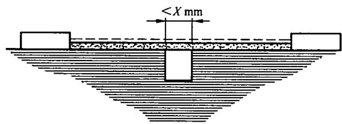

条件:所考虑的路径包括宽度小于 X mm 而深度为任意的平行边或收敛形边的槽。

规则:爬电距离和电气间隙如图所示,直接跨过槽测量。

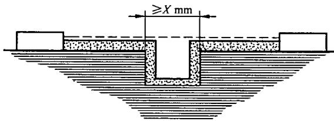

条件:所考虑的路径包括任意深度而宽度等于或大于 X mm 的平行边的槽。

规则:电气间隙是“虚线”距离,爬电路径沿着槽的轮廓。

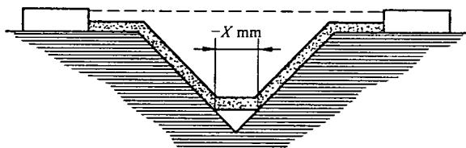

条件:所考虑的路径包括一个宽度大于 X mm 的 V 形槽。

规则:电气间隙是“虚线”的距离,爬电路径沿着槽的轮廓但被 X mm 接线把槽底“短路”。例 4

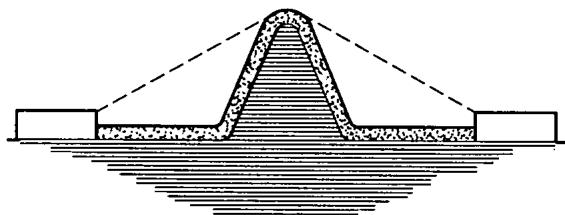

条件:所考虑的路径包括一条筋。

规则:电气间隙是通过筋顶的最短直接空气途径。爬电路径沿着筋的轮廓。

--------电气间隙

爬电距离

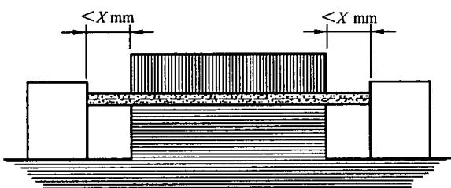

条件:所考虑的路径包括一未黏合的接缝以及每边的宽度小于 X mm 的槽。
规则:爬电距离和电气间隙的路径是所示的“虚线”距离。
例 6

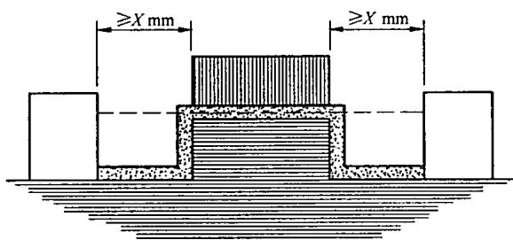

条件:所考虑的路径包括一未黏合的接缝以及每边的宽度等于或大于 X mm 的槽。
规则:电气间隙为“虚线”距离,爬电路径沿着槽的轮廓。
例 7

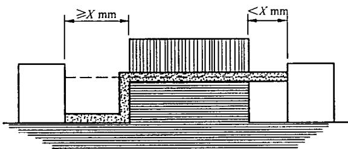

条件:所考虑的路径包括一未黏合的接缝以及一边的宽度小于 X mm, 另一边的宽度等于或大于 X mm 的槽。

规则:电气间隙和爬电路径如图所示。

例8

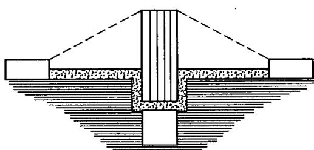

条件:穿过未黏合的接缝的爬电距离小于跨过隔栏的爬电距离。
规则:电气间隙是通过隔栏顶的最短直接空气路径。

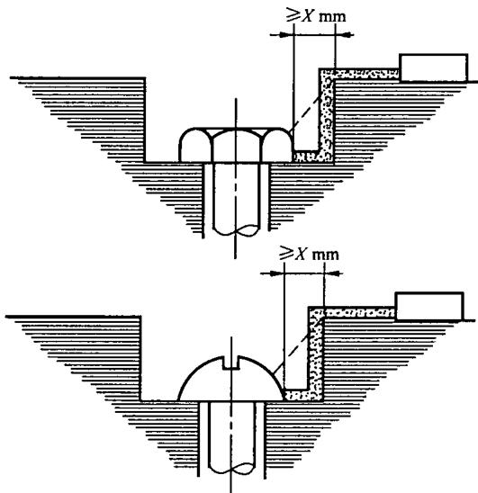

螺钉头与凹壁之间的间隙足够宽应加以考虑。例 10

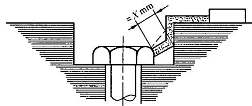

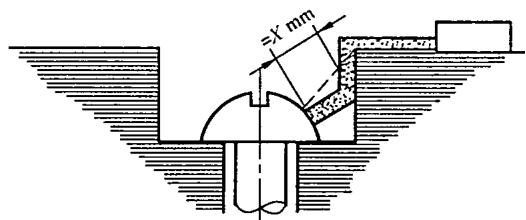

螺钉头与凹壁之间的间隙过分窄小而不被考虑。
当距离等于 X mm 时, 测量从螺钉至壁的爬电距离。
例 11

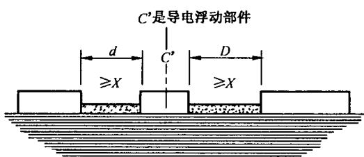

电气间隙是距离 $d + D$ 爬电距离也是 $d + D$

## 附录 A

(资料性附录)

电气间隙耐受特性的基本参数

表 A.1 海拔 2000 m 处的耐受电压(kV)

<table><tr><td rowspan="2">电气间隙</td><td colspan="3">情况A非均匀电场</td><td colspan="2">情况B均匀电场</td></tr><tr><td colspan="2">交流(50/60 Hz)</td><td>冲击(1.2/50)</td><td>交流(50/60 Hz)</td><td>交流(50/60 Hz)和冲击(1.2/50)</td></tr><tr><td>mm</td><td> $U_{r.m.s}$ </td><td> $\hat{U}$ </td><td> $\hat{U}$ </td><td> $U_{r.m.s}$ </td><td> $\hat{U}$ </td></tr><tr><td>0.001</td><td>0.028</td><td>0.040</td><td>0.040</td><td>0.028</td><td>0.04</td></tr><tr><td>0.002</td><td>0.053</td><td>0.075</td><td>0.075</td><td>0.053</td><td>0.07</td></tr><tr><td>0.003</td><td>0.078</td><td>0.110</td><td>0.110</td><td>0.078</td><td>0.11</td></tr><tr><td>0.004</td><td>0.102</td><td>0.145</td><td>0.145</td><td>0.102</td><td>0.14</td></tr><tr><td>0.005</td><td>0.124</td><td>0.175</td><td>0.175</td><td>0.124</td><td>0.17</td></tr><tr><td>0.006 25</td><td>0.152</td><td>0.215</td><td>0.215</td><td>0.152</td><td>0.21</td></tr><tr><td>0.008</td><td>0.191</td><td>0.270</td><td>0.270</td><td>0.191</td><td>0.27</td></tr><tr><td>0.010</td><td>0.23</td><td>0.33+</td><td>0.33+</td><td>0.23</td><td>0.33</td></tr><tr><td>0.012</td><td>0.25</td><td>0.35</td><td>0.35</td><td>0.25</td><td>0.35</td></tr><tr><td>0.015</td><td>0.26</td><td>0.37</td><td>0.37</td><td>0.26</td><td>0.37</td></tr><tr><td>0.020</td><td>0.28</td><td>0.40</td><td>0.40</td><td>0.28</td><td>0.40</td></tr><tr><td>0.025</td><td>0.31</td><td>0.44</td><td>0.44</td><td>0.31</td><td>0.44</td></tr><tr><td>0.030</td><td>0.33</td><td>0.47</td><td>0.47</td><td>0.33</td><td>0.47</td></tr><tr><td>0.040</td><td>0.37</td><td>0.52</td><td>0.52</td><td>0.37</td><td>0.52</td></tr><tr><td>0.050</td><td>0.40</td><td>0.56</td><td>0.56</td><td>0.40</td><td>0.56</td></tr><tr><td>0.062 5</td><td>0.42</td><td>0.60+</td><td>0.60+</td><td>0.42</td><td>0.60</td></tr><tr><td>0.080</td><td>0.46</td><td>0.65</td><td>0.70</td><td>0.50</td><td>0.70</td></tr><tr><td>0.10</td><td>0.50</td><td>0.70</td><td>0.81</td><td>0.57</td><td>0.81</td></tr><tr><td>0.12</td><td>0.52</td><td>0.74</td><td>0.91</td><td>0.64</td><td>0.91</td></tr><tr><td>0.15</td><td>0.57</td><td>0.80</td><td>1.04+</td><td>0.74</td><td>1.04</td></tr><tr><td>0.20</td><td>0.62</td><td>0.88</td><td>1.15</td><td>0.89</td><td>1.26</td></tr><tr><td>0.25</td><td>0.67</td><td>0.95</td><td>1.23</td><td>1.03</td><td>1.45</td></tr><tr><td>0.30</td><td>0.71</td><td>1.01</td><td>1.31</td><td>1.15</td><td>1.62</td></tr><tr><td>0.40</td><td>0.78</td><td>1.11</td><td>1.44</td><td>1.38</td><td>1.95</td></tr><tr><td>0.50</td><td>0.84</td><td>1.19</td><td>1.55</td><td>1.59</td><td>2.25</td></tr><tr><td>0.60</td><td>0.90</td><td>1.27</td><td>1.65</td><td>1.79</td><td>2.53</td></tr><tr><td>0.80</td><td>0.98</td><td>1.39</td><td>1.81</td><td>2.15</td><td>3.04</td></tr><tr><td>1.0</td><td>1.06</td><td>1.50+</td><td>1.95</td><td>2.47</td><td>3.50</td></tr><tr><td>1.2</td><td>1.20</td><td>1.70</td><td>2.20</td><td>2.89</td><td>4.09</td></tr><tr><td>1.5</td><td>1.39</td><td>1.97</td><td>2.56</td><td>3.50</td><td>4.95</td></tr><tr><td>2.0</td><td>1.68</td><td>2.38</td><td>3.09</td><td>4.48</td><td>6.33</td></tr><tr><td>2.5</td><td>1.96</td><td>2.77</td><td>3.60</td><td>5.41</td><td>7.65</td></tr><tr><td>3.0</td><td>2.21</td><td>3.13</td><td>4.07</td><td>6.32</td><td>8.94</td></tr><tr><td>4.0</td><td>2.68</td><td>3.79</td><td>4.93</td><td>8.06</td><td>11.4</td></tr><tr><td>5.0</td><td>3.11</td><td>4.40</td><td>5.72</td><td>9.76</td><td>13.8</td></tr><tr><td>6.0</td><td>3.51</td><td>4.97</td><td>6.46</td><td>11.5</td><td>16.2</td></tr><tr><td>8.0</td><td>4.26</td><td>6.03</td><td>7.84</td><td>14.6</td><td>20.7</td></tr><tr><td>mm</td><td> $U_{\text{r.m.s}}$ </td><td> $\hat{U}$ </td><td> $\hat{U}$ </td><td> $U_{\text{r.m.s}}$ </td><td> $\hat{U}$ </td></tr><tr><td>10.0</td><td>4.95</td><td>7.00+</td><td>9.10</td><td>17.7</td><td>25.0+</td></tr><tr><td>12.0</td><td>5.78</td><td>8.18</td><td>10.6</td><td>20.9</td><td>29.6</td></tr><tr><td>15.0</td><td>7.00</td><td>9.90</td><td>12.9</td><td>25.7</td><td>36.4</td></tr><tr><td>20.0</td><td>8.98</td><td>12.7</td><td>16.4</td><td>33.5</td><td>47.4</td></tr><tr><td>25.0</td><td>10.8</td><td>15.3</td><td>19.9</td><td>41.2</td><td>58.3</td></tr><tr><td>30.0</td><td>12.7</td><td>17.9</td><td>23.3</td><td>48.8</td><td>69.0</td></tr><tr><td>40.0</td><td>16.2</td><td>22.9</td><td>29.8</td><td>63.6</td><td>90.0</td></tr><tr><td>50.0</td><td>19.6</td><td>27.7</td><td>36.0</td><td>78.5</td><td>111.0</td></tr><tr><td>60.0</td><td>22.8</td><td>32.3</td><td>42.0</td><td>92.6</td><td>131.0</td></tr><tr><td>80.0</td><td>29.2</td><td>41.3</td><td>53.7</td><td>120.9</td><td>171.0</td></tr><tr><td>100.0</td><td>35.4</td><td>50.0+</td><td>65.0</td><td>148.5</td><td>210.0+</td></tr><tr><td colspan="6">注:0.001 mm至0.008 mm的电气间隙资料来源于P. Hartherz, Ken Yahia, L. Muller, R. pfendtner和W. Pfeiffer的文献《大气中各种气压下对微米级气隙的电击穿实验》,该文献在2001年美国马里兰州Ellicot城举行的有关气体介电的国际学术会上发表,并被收集在同名的论文集的第333~338页。更详细的资料可参见P. Hartherz论文《用于在周期冲击电压负载下固体绝缘故障分析的局部放电测量技术》,该论文刊载于Shaker出版社2002年出版的达姆施塔特工业大学论文集中。</td></tr></table>

为了简化，以双对数坐标图(图 A.1)中本表“+”值之间的直线代替本表的统计测量值，该图考虑了0 m\~2 000 m 海拔修正系数。从图 A.1 取得的中间值围绕测量值具有小的安全裕度。表中的交流有效值 $U_{r.m.s}$ 是从交流峰值 $\hat{U}$ 除以 $\sqrt{2}$ 后获得的。

表 A.2 海拔修正系数

<table><tr><td>海拔/m</td><td>正常气压/kPa</td><td>电气间隙的倍增系数</td></tr><tr><td>2 000</td><td>80.0</td><td>1.00</td></tr><tr><td>3 000</td><td>70.0</td><td>1.14</td></tr><tr><td>4 000</td><td>62.0</td><td>1.29</td></tr><tr><td>5 000</td><td>54.0</td><td>1.48</td></tr><tr><td>6 000</td><td>47.0</td><td>1.70</td></tr><tr><td>7 000</td><td>41.0</td><td>1.95</td></tr><tr><td>8 000</td><td>35.5</td><td>2.25</td></tr><tr><td>9 000</td><td>30.5</td><td>2.62</td></tr><tr><td>10 000</td><td>26.5</td><td>3.02</td></tr><tr><td>15 000</td><td>12.0</td><td>6.67</td></tr><tr><td>20 000</td><td>5.5</td><td>14.5</td></tr></table>

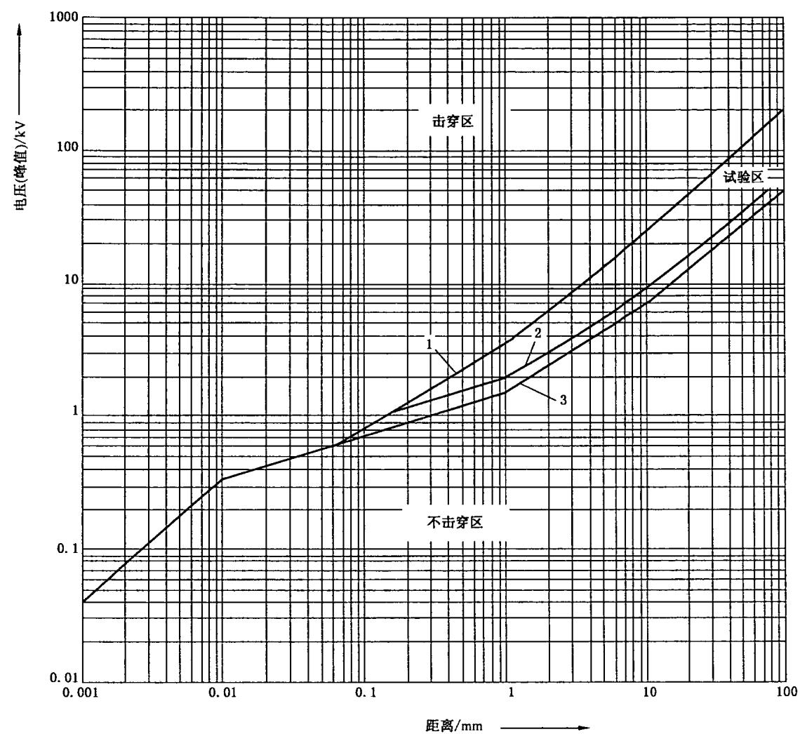

$$
\mathrm{A}: \hat {U} 5 0 / 6 0 \mathrm{Hz}
$$

图A.1 在高于海平面 $2000\mathrm{m}$ 处的耐受电压

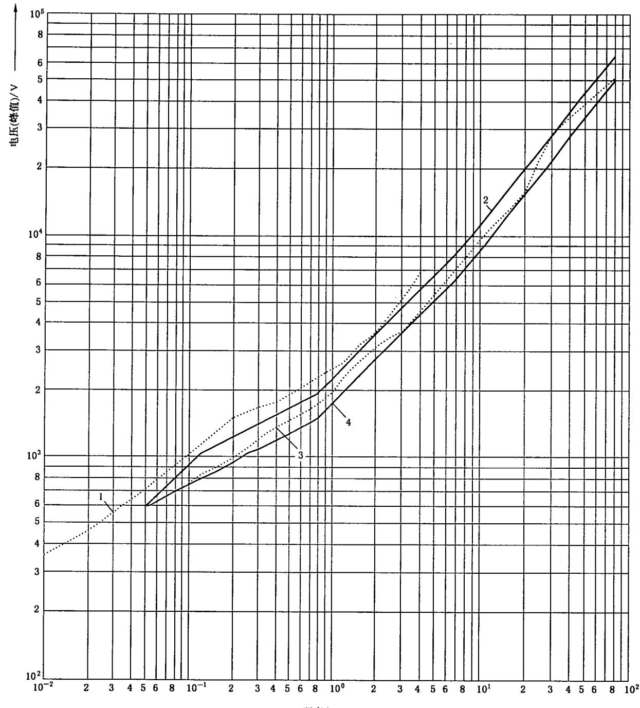  
图A.2 在接近海平面处测得的非均匀电场实验数据及其下限值

2 $\hat{U} 50\mathrm{Hz}$ 根据Electra,1974pp61-82[5]

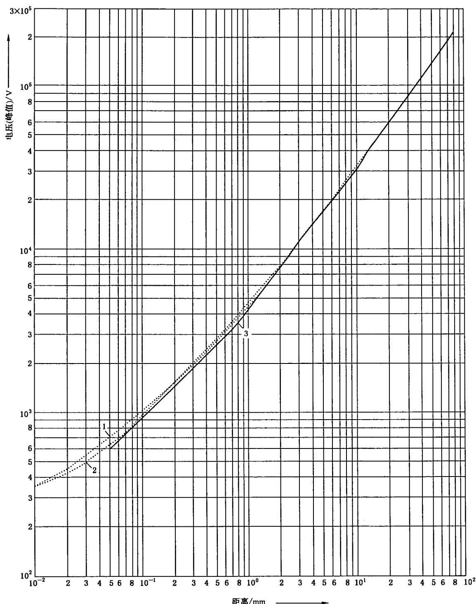  
3 $\hat{U} 1.2 / 50\mathrm{Hz}$ 和 $\hat{U} 50\mathrm{Hz}$ 下限值

图A.3 在接近海平面处测得的均匀电场实验数据及其下限值

附录B

(资料性附录)

不同过电压控制方式的电源系统的标称电压

表 B.1 内在控制或相当的保护控制

<table><tr><td rowspan="4">从交流或直流标称电压导出线对中性点电压 $^{1)}$ (小于或等于)/V</td><td colspan="4">世界上目前使用的标称电压</td><td rowspan="2" colspan="4">设备额定冲击电压 $^{1)}$ /V</td></tr><tr><td rowspan="3">三相四线系统中性点接地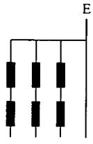V</td><td rowspan="3">三相三线系统不接地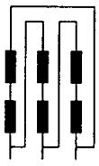V</td><td rowspan="3">单相二线系统交流或直流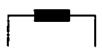V</td><td rowspan="3">单相三线系统交流或直流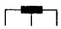V</td></tr><tr><td colspan="4">过电压类别</td></tr><tr><td>I</td><td>II</td><td>III</td><td>IV</td></tr><tr><td>50</td><td></td><td></td><td>12.5 2425 3042 48</td><td>30~60</td><td>330</td><td>500</td><td>800</td><td>1500</td></tr><tr><td>100</td><td>66/115</td><td>66</td><td>60</td><td></td><td>500</td><td>800</td><td>1500</td><td>2500</td></tr><tr><td>150</td><td>120/208*127/220</td><td>115,120,127</td><td>100**,110,120</td><td>100~200**110~220120~240</td><td>800</td><td>1500</td><td>2500</td><td>4000</td></tr><tr><td>300</td><td>220/380,230/400240/415,260/440277/480</td><td>200**,220,230,240,260,277,347380,400,415440,480</td><td>220</td><td>220~440</td><td>1500</td><td>2500</td><td>4000</td><td>6000</td></tr><tr><td>600</td><td>347/600,380/660400/690,417/720480/830</td><td>500,577,600</td><td>480</td><td>480~960</td><td>2500</td><td>4000</td><td>6000</td><td>8000</td></tr><tr><td>1000</td><td></td><td>660690,720830,1000</td><td>1000</td><td></td><td>4000</td><td>6000</td><td>8000</td><td>12000</td></tr><tr><td colspan="9">1)表中这几栏来自表F.1(该表规定了额定冲击电压)。*美国和加拿大实施。**日本实施。</td></tr></table>

表 B.2 需要保护控制的情况及由浪涌抑制器控制  
(钳位电压与额定电压之比不小于 IEC 60099-1 规定值)的情况

<table><tr><td rowspan="4">从交流或直流标称电压导出线对中性点电压 $^{1)}$ (小于或等于)/V</td><td colspan="4">世界上目前使用的标称电压</td><td rowspan="2" colspan="4">设备额定冲击电压 $^{1)}$ /V</td></tr><tr><td rowspan="3">三相四线系统中性点接地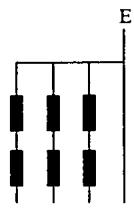V</td><td rowspan="3">三相三线系统接地或不接地-(E)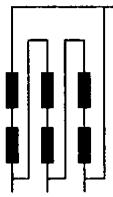V</td><td rowspan="3">单相二线系统交流或直流V</td><td rowspan="3">单相三线系统交流或直流V</td></tr><tr><td colspan="4">过电压类别</td></tr><tr><td>I</td><td>II</td><td>III</td><td>IV</td></tr><tr><td>50</td><td></td><td></td><td>12.5 2425 3042 48</td><td>30~60</td><td>330</td><td>500</td><td>800</td><td>1500</td></tr><tr><td>100</td><td>66/115</td><td>66</td><td>60</td><td></td><td>500</td><td>800</td><td>1500</td><td>2500</td></tr><tr><td>150</td><td>120/208*127/220</td><td>115,120,127</td><td>100**110,120</td><td>100~200**110~220120~240</td><td>800</td><td>1500</td><td>2500</td><td>4000</td></tr><tr><td>300</td><td>220/380,230/400240/415,260/440277/480</td><td>200**,220,230,240260,277</td><td>220</td><td>220~440</td><td>1500</td><td>2500</td><td>4000</td><td>6000</td></tr><tr><td>600</td><td>347/600,380/660400/690,417/720480/830</td><td>347,380,400,415,440,480500,577,600</td><td>480</td><td>480~960</td><td>2500</td><td>4000</td><td>6000</td><td>8000</td></tr><tr><td>1000</td><td></td><td>660690,720830,1000</td><td>1000</td><td></td><td>4000</td><td>6000</td><td>8000</td><td>12000</td></tr><tr><td colspan="9">1)表中这几栏来自表F.1(该表规定了额定冲击电压)。*美国和加拿大实施。**日本实施。</td></tr></table>

## 附录 C

(规范性附录)

# 局部放电试验方法

## C.1 试验电路

## C.1.1 概述

试验电路应按 GB/T 7354—2003 规定布置。本附录给出的下述电路作为举例并符合该标准要求。

注1：在大多数情况下，按本附录举例设计的试验设备足以满足要求。特殊情况(如存在极高的环境干扰)有必要参见GB/T7354—2003。

注2：基本操作的说明见D.2。

## C.1.2 接地试品的试验电路

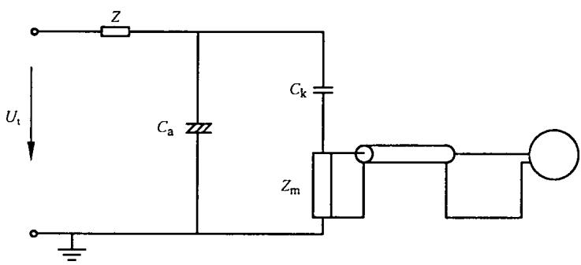

$U_{t}$ ——试验电压；

Z——滤波器；

$C_{a}$ ——试品(通常可看作为电容);

$C_{k}$ ——耦合电容器；

$Z_{\mathrm{m}}$ ——测量阻抗。

图C.1 接地的试品

## C.1.3 不接地试品的试验电路

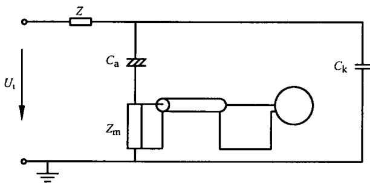  
图 C.2 不接地试品

## C.1.4 选择依据

两个电路基本上是一样的,但是试品的杂散电容影响灵敏度是不一样的。试品高压端的对地电容按 C.1.2 的电路会降低电路的灵敏度,而按 C.1.3 的电路会提高电路的灵敏度,因此,应根据情况选合适者。

## C.1.5 测量阻抗

测量用阻抗在试验频率下应产生一个可忽略不计的低电压降。为了提供合理的灵敏度，根据 D.2 应选取对应测量频率的阻抗。

如果采用电压限制元件，则这些元件不应影响测量范围内的数值。

## C.1.6 耦合电容器 $C_{\mathbf{k}}$

该电容器应为低感型,其谐振频率大于 $3f_{2}$ (见 C.3),且在所用的最高试验电压及以下不应有局部放电。

## C.1.7 滤波器

不作强制要求。如果使用的话，则对于测量频率的阻抗应为高阻抗。

## C.2 试验参数

## C.2.1 概述

各有关产品标准技术委员会应规定：

——试验电压的频率 $f_{1}$ (C.2.2);

——规定的放电量(6.1.3.5.4.1);

——局部放电的环境条件(C.2.3)。

注：对型式试验和常规试验，可能需要不同的规范。

## C.2.2 试验电压的要求

通常采用交流电压。总谐波畸变应小于3%。

注 1: 正弦波小的畸变允许用标准的电压表测量,且以有效值读数计算出峰值。对于较高的畸变,必须用峰值电压表测量。

通常在工频下进行试验。如果设备中有其他频率，则产品标准技术委员会应考虑频率可能对放电量的影响。

注 2：不推荐用直流电压进行局部放电试验，因为很难达到完全没有电干扰的环境。另外，应注意到交流和直流的电压分布是大不相同的。

## C.2.3 环境条件

建议在室温和平均湿度(23℃,50%相对湿度,见 GB/T 2421—1999 中 5.3)下进行试验。

## C.3 测量仪器的要求

## C.3.1 概述

可采用宽频带电荷测量仪也可采用窄频带测量仪(见 C.3.3)。根据 C.3.2 给定的保护措施，只可采用无线电干扰电压表。

试验电压的频率 $f_{t}$ 和测量阻抗 $Z_{m}$ 的频率特性(见 C.1.5)确定测量频率的下限值。它不应小于 $10f_{t}$ 。

测量频率的上限值由局部放电脉冲的形状及试验电路频率特性决定。它不需大于2 MHz。对于窄频带局部放电测量仪，应根据窄频带的干扰源来选择测量频率(见D.3.3)。

注：推荐使用窄频带局部放电测量仪。

## C.3.2 局部放电仪表的分类

对流过测量阻抗 $Z_{m}$ 的电流积分, 给出一个与 $q_{m}$ 成比率的读数(见图 D.1)。

积分可通过测量阻抗来实现。在这种情况下，对高于测量频率下限值的所有频率测量阻抗代表一个电容。电容两端的电压(与 $q_{m}$ 成比率)由脉冲放大器放大。同时还应给出周期性放电。

对高于测量频率下限值的所有频率来讲,如果测量阻抗是电阻性的话,则应在脉冲放大器内进行积分。

应测量单个脉冲并应估算具有最大值的脉冲。为限制由于脉冲重叠造成的误差，脉冲的分辨时间应小于 $100 \mu s$ 。

无线电干扰测量仪表应为窄频带峰值电压表。可用该表来测量无线电信号的干扰。该测量仪内有一个特殊的滤波电路，该电路能根据噪声对人耳的主观效应创立读数对脉冲重叠率的依赖关系。

就测量局部放电而言,如果不接滤波电路,那么仅可使用无线电干扰测量仪。同时还要求一个合适的测量阻抗。

## C.3.3 试验电路的频带宽度

局部放电测量仪通常会限制试验电路的频带宽度。局部放电测量仪根据他们的频带宽度可分为宽频或窄频。

a) 下限截止频率 $f_{1}$ 和上限截止频率 $f_{2}$ 是当采用宽频测量仪时频率特性比恒定值降低 3 dB。而当采用窄频测量仪时，频率响应从峰值降低 6 dB；

b) 对于窄频测量仪, 测量频率 $f_{0}$ 与频率响应中的谐振峰值是相等的;

c) 频宽度 $\Delta f$ 为：

$$
\Delta f = f _ {2} - f _ {1}
$$

对于宽频带测量仪， $\Delta f$ 与 $f_{2}$ 是同一个数量级。对于窄频带测量仪， $\Delta f$ 比 $f_{0}$ 小得多。

## C.4 校准

## C.4.1 干扰电平测量前的放电量校准

试验电路(图 C.3 或图 C.4)应在规定的放电量下用没有局部放电的电容器 $C_{x}$ 取代试品 $C_{a}$ 进行校准。电容器 $C_{x}$ 的阻抗应与试品 $C_{a}$ 的阻抗相似。

变压器应按照规定的局部放电试验电压进行调整，但不激励，且其初级绕组应短路。用校准过的脉冲发生器将规定的放电量施加在电容器的端子上。放电探测器上的放电量显示应调整到对应于校准信号。

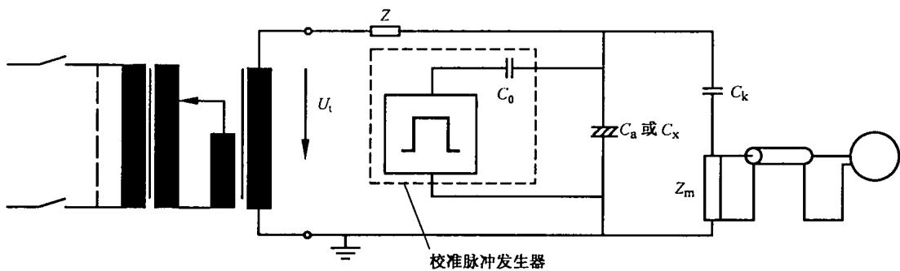

$U_{t}$ ——试验电压；

Z——滤波器；

$C_{0}$ ——校准脉冲发生器的电容；

$C_{a}$ 或 $C_{x}$ ——试品(通常可看作为电容);

$C_{k}$ ——耦合电容器；

$Z_{m}$ ——测量阻抗。

图 C.3 接地试品的校准

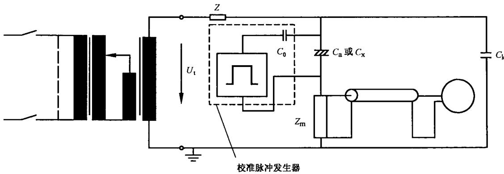  
图 C.4 不接地试品的校准

## C.4.2 验证干扰电平

采用 C.4.1 的布置,局部放电试验电压应上升至最高试验电压。最大干扰电平应小于规定放电量的 50%。否则要求按 D.3 进行测量。

## C.4.3 局部放电试验的校准

将试品接入电路中,重复 C.4.1 的程序。

如改变试验电路或更换试品,则需重新校准。对于许多相似的试品,如满足下列要求,偶尔进行重新校准可能就足够了:

——耦合电容器的阻抗小于试品阻抗的 1/10; 或

——试品的阻抗与校准期间的数值偏差不超过±10%。

注：在规定重新校准的时间间隔时，各产品标准技术委员会应考虑到在局部放电测量仪的灵敏度不够的情况下，可能检测不到潜在的有害放电。

## C.4.4 校准脉冲发生器

基本上由一小电容 $C_{0}$ (该电容已经充电至 $U_{0}$ ) 组成。

脉冲发生器产生的电流脉冲的上升时间应小于 $0.03/f_{2}$ 。 $C_{0}$ 值不应大于 $0.1C_{k}$ 。脉冲的尾部时间应大于 $100 \mu s$ 。

为了验证局部放电测量仪的性能,应对其在所有测量范围内进行校准。测量用的阻抗和连接用的电缆应包括在该程序中。

下列特性应进行检验：

——校准用的脉冲发生器的精度和稳定性；

——在脉冲重复率为 $100 \, Hz$ 下各种幅度脉冲的读数；

——采用恒定幅度脉冲和提高脉冲重复率的脉冲分辨时间；

——下限截止频率 $f_{1}$ 和上限截止频率 $f_{2}$ 。

局部放电测量仪每次修理后均应进行上述检验，但是在任何情况下每年至少检验一次。

## 附录 D

(资料性附录)

局部放电试验方法补充资料

## D.1 局部放电初始电压和熄灭电压的测量

试验电压从低于局部放电初始电压的值开始上升直至发生局部放电(局部放电初始电压 $U_{i}$ )止。试验电压再上升10%后，将该电压下降至局部放电小于规定的放电量(局部放电熄灭电压 $U_{e}$ )止。因此，可以不超过试品所规定的绝缘试验电压。

注：局部放电熄灭电压可能会受到大于局部放电初始电压值的电压作用时间的影响。在连续测量中， $U_{i}$ 和 $U_{e}$ 可能均会受到影响。

本试验程序也适用于研究性测量。

## D.2 局部放电试验电路的说明

每个电路由下列器件组成：

——试品 $C_{a}$ (在特殊情况下,也可以是阻抗 $Z_{a}$ );

——耦合电容器 $C_{k}$ ;

——由测量阻抗 $Z_{m}$ ，连接电缆和局部放电测量仪组成的测量电路；

——任选的滤波器 Z(用于减小由试验电压源旁路的电荷)。

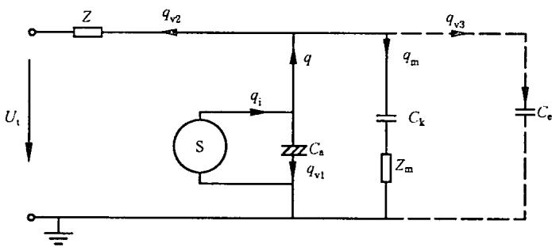

$U_{t}$ ——试验电压； $q_{i}$ ——内部电荷(不能测量)；

Z——滤波器；q——视在电荷；

S——局部放电电流源； $q_{m}$ ——可测量的电荷；

$C_{a}$ ——试品电容； $q_{vl}$ ——试品的两端损耗的电荷；

$C_{k}$ ——耦合电容器； $q_{v2}$ ——试验电压源两端损耗的电荷；

$Z_{m}$ ——测量阻抗； $q_{v3}$ ——对地杂散电容两端损耗的电荷。

$C_{e}$ ——对地杂散电容；

图 D.1 局部放电试验电路

直接测量视在电荷 q 要求在试品接线端子处进行短路以测量频率。这种条件可用下列方式近似实现：

$C_{k}>(C_{a}+C_{e})$ ;

——高阻抗 Z;

——低测量阻抗 $Z_{m}$ 。

否则会发生电荷 $q_{v2}$ 和 $q_{v3}$ 显著损耗。在校准时应考虑到这些电荷的损耗，而他们会限制灵敏度。如果试品具有高的电容，这种情况会更加严重。

## D.3 降低干扰的保护措施

## D.3.1 概述

局部放电测量结果可能会极大地受到干扰的影响。这种干扰可能由电导耦合或电磁干扰引入。在没有屏蔽的工业性试验场所，由于干扰单个电荷脉冲可能会高达100 pC。即使在良好的条件下，可能预计不小于20 pC。

可实现小至 1 pC 的干扰电平,但要求对试验电路进行屏蔽,注意接地措施并对低压电网的输入进行滤波。

## D.3.2 干扰源

基本上有两种不同的干扰源。

## D.3.2.1 非激励试验电路中的干扰源

这些干扰是由于例如接通分断邻近电路造成的。在电导耦合情况下，只有当与低压电网电源连接时才会发生干扰。在电磁耦合的情况下，在分断电网电源(包括保护导体)的情况下，也会发生干扰。

## D.3.2.2 激励试验电路中的干扰源

通常干扰是随着试验电压的增大而增大的，且由试品外面的局部放电造成。在试验变压器中，高压连接引线，衬套以及不良连接点处均可能发生局部放电。试验电压的谐波也可能影响干扰水平。

## D.3.3 降低干扰的措施

在试验电路的中间馈线处采用线路滤波器能降低电导耦合造成的干扰。但不应有对地回路。

电磁干扰,例如无线电信号,对于窄频带局部放电测量仪用简单的方法即改变一下测量频率 $f_{e}$ 就可排除。对于宽频带局部放电测量仪,可能需要有频带抑制滤波器,只有采取屏蔽措施才能抑制宽频带信号。采用高电导率的全密封屏蔽措施是最有效的方法。

## D.4 试验电压倍率系数的应用

## D.4.1 概述

6.1.3.5 定义的和 5.3.3.2.4 及 6.1.3.5 采用的倍率系数值的计算方法如下：

注：这些举例适用于再现峰值电压 $U_{rp}$ ，例中的系数同样也适用于最高稳态电压和长期暂时过电压。

## D.4.2 例1

接至低压电网的电路。

D.4.2.1 最大再现峰值电压 $U_{rp}$

$$
U _ {\mathrm{rp}} = \sqrt {2} U _ {\mathrm{n}} \times F _ {4} = 1. 1 \sqrt {2} U _ {\mathrm{n}}
$$

D.4.2.2 局部放电熄灭电压 $U_{e}$ (基本绝缘)

$$
\begin{array}{c} U _ {\mathrm{e}} = \sqrt {2} U _ {\mathrm{n}} \times F _ {4} \times F _ {1} \\ U _ {\mathrm{e}} = \sqrt {2} U _ {\mathrm{n}} \times 1. 1 \times 1. 2 = 1. 3 2 \sqrt {2} U _ {\mathrm{n}} \end{array}
$$

D.4.2.3 局部放电试验电压初始值 $U_{1}$ (基本绝缘)

$$
\begin{array}{r l} & U _ {1} = \sqrt {2} U _ {\mathrm{n}} \times F _ {4} \times F _ {1} \times F _ {2} \\ & U _ {1} = \sqrt {2} U _ {\mathrm{n}} \times 1. 3 2 \times 1. 2 5 = 1. 6 5 \sqrt {2} U _ {\mathrm{n}} \end{array}
$$

## D.4.3 例2

带有最大再现峰值电压 $U_{rp}$ 的内部电路。

D.4.3.1 局部放电熄灭电压 $U_{e}$ (基本绝缘)

$$
U _ {\mathrm{e}} = U _ {\mathrm{rp}} \times F _ {1} = U _ {\mathrm{rp}} \times 1. 2
$$

D. 4.3.2 局部放电试验电压的初始值(基本绝缘)

$$
U _ {1} = U _ {\mathrm{rp}} \times F _ {1} \times F _ {2} = U _ {\mathrm{rp}} \times 1. 5
$$

## 附录E

## (资料性附录)

表 F.4 中规定的爬电距离和表 A.1 中电气间隙的比较  
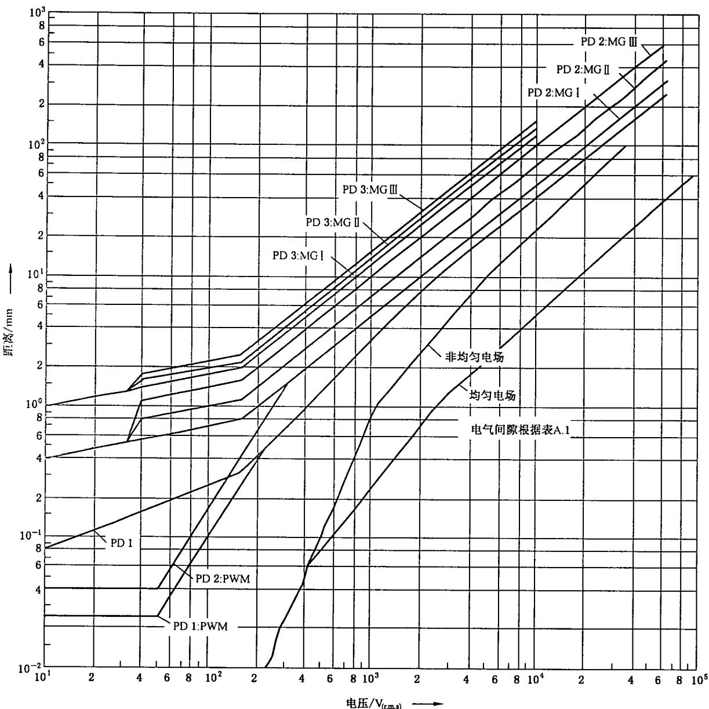  
PD——污染等级；  
MG——材料组别；  
PWM——印制线路材料。

图 E.1 表 F.4 中规定的爬电距离和表 A.1 中电气间隙的比较

附录F

(规范性附录)

表

表 F.1 直接由低压电网供电的设备的额定冲击电压

<table><tr><td rowspan="2" colspan="2">基于GB 1563)电源系统1)的标称电压</td><td rowspan="3">从交流或直流标称电压导出线对中性点的电压(小于等于)/V</td><td colspan="4">额定冲击电压2)</td></tr><tr><td colspan="4">过电压类别4)</td></tr><tr><td>三相/V</td><td>单相/V</td><td>I V</td><td>II V</td><td>III V</td><td>IV V</td></tr><tr><td rowspan="3"></td><td rowspan="2"></td><td>50</td><td>330</td><td>500</td><td>800</td><td>1500</td></tr><tr><td>100</td><td>500</td><td>800</td><td>1500</td><td>2500</td></tr><tr><td>120~240</td><td>1505)</td><td>800</td><td>1500</td><td>2500</td><td>4000</td></tr><tr><td>230/400 277/480</td><td></td><td>300</td><td>1500</td><td>2500</td><td>4000</td><td>6000</td></tr><tr><td>400/690</td><td></td><td>600</td><td>2500</td><td>4000</td><td>6000</td><td>8000</td></tr><tr><td>1000</td><td></td><td>1000</td><td>4000</td><td>6000</td><td>8000</td><td>12000</td></tr><tr><td colspan="7">1)现有不同低压电网及其标称电压见附录B。2)有这类额定冲击电压的设备可用于IEC 60364-4-44规定的装置中。3)三相四线配电系统用符号“/”表示,较低值为线对中性点电压,较高值为线对线电压,仅有一个值的表示三相三线系统,并规定为线对线值。4)过电压类别的解释见4.3.3.2.2。5)在日本,单相系统的标称电压是100V或100V~200V。然而,相对于该电压的额定冲击电压由线对中性点电压150V的那一栏确定(见附录B)。</td></tr></table>

表 F.2 耐受瞬时过电压的电气间隙

<table><tr><td rowspan="4">要求的冲击耐受电压1)5)/kV</td><td colspan="6">大气中海拔从海平面至2000m的最小电气间隙</td></tr><tr><td colspan="3">情况A非均匀电场(见3.15)</td><td colspan="3">情况B均匀电场(见3.14)</td></tr><tr><td colspan="3">污染等级6)</td><td colspan="3">污染等级6)</td></tr><tr><td>1mm</td><td>2mm</td><td>3mm</td><td>1mm</td><td>2mm</td><td>3mm</td></tr><tr><td>0.332)</td><td>0.01</td><td rowspan="6">0.23)4)</td><td rowspan="8">0.84)</td><td>0.01</td><td rowspan="7">0.23)4)</td><td rowspan="11">0.84)</td></tr><tr><td>0.40</td><td>0.02</td><td>0.02</td></tr><tr><td>0.502)</td><td>0.04</td><td>0.04</td></tr><tr><td>0.60</td><td>0.06</td><td>0.06</td></tr><tr><td>0.802)</td><td>0.10</td><td>0.10</td></tr><tr><td>1.0</td><td>0.15</td><td>0.15</td></tr><tr><td>1.2</td><td>0.25</td><td>0.25</td><td>0.2</td></tr><tr><td>1.52)</td><td>0.5</td><td>0.5</td><td>0.3</td><td>0.3</td></tr><tr><td>2.0</td><td>1.0</td><td>1.0</td><td>1.0</td><td>0.45</td><td>0.45</td></tr><tr><td>2.52)</td><td>1.5</td><td>1.5</td><td>1.5</td><td>0.60</td><td>0.60</td></tr><tr><td>3.0</td><td>2.0</td><td>2.0</td><td>2.0</td><td>0.80</td><td>0.80</td></tr><tr><td>4.02)</td><td>3.0</td><td>3.0</td><td>3.0</td><td>1.2</td><td>1.2</td><td>1.2</td></tr><tr><td>5.0</td><td>4.0</td><td>4.0</td><td>4.0</td><td>1.5</td><td>1.5</td><td>1.5</td></tr><tr><td>6.02)</td><td>5.5</td><td>5.5</td><td>5.5</td><td>2.0</td><td>2.0</td><td>2.0</td></tr><tr><td>8.02)</td><td>8.0</td><td>8.0</td><td>8.0</td><td>3.0</td><td>3.0</td><td>3.0</td></tr><tr><td>10.0</td><td>11</td><td>11</td><td>11</td><td>3.5</td><td>3.5</td><td>3.5</td></tr><tr><td>122)</td><td>14</td><td>14</td><td>14</td><td>4.5</td><td>4.5</td><td>4.5</td></tr><tr><td>15</td><td>18</td><td>18</td><td>18</td><td>5.5</td><td>5.5</td><td>5.5</td></tr><tr><td>20</td><td>25</td><td>25</td><td>25</td><td>8.0</td><td>8.0</td><td>8.0</td></tr><tr><td>25</td><td>33</td><td>33</td><td>33</td><td>10</td><td>10</td><td>10</td></tr><tr><td>30</td><td>40</td><td>40</td><td>40</td><td>12.5</td><td>12.5</td><td>12.5</td></tr><tr><td>40</td><td>60</td><td>60</td><td>60</td><td>17</td><td>17</td><td>17</td></tr><tr><td>50</td><td>75</td><td>75</td><td>75</td><td>22</td><td>22</td><td>22</td></tr><tr><td>60</td><td>90</td><td>90</td><td>90</td><td>27</td><td>27</td><td>27</td></tr><tr><td>80</td><td>130</td><td>130</td><td>130</td><td>35</td><td>35</td><td>35</td></tr><tr><td>100</td><td>170</td><td>170</td><td>170</td><td>45</td><td>45</td><td>45</td></tr><tr><td colspan="7">1)此电压————对功能绝缘而言是预期发生在跨电气间隙两端的最大冲击电压(见5.1.5);————对直接承受低压电网瞬时过电压的基本绝缘(见4.3.3.3,4.3.3.4.1和5.1.6)是指设备的额定冲击电压;————对其他基本绝缘而言(见4.3.3.4.2)是指电路中可能发生的最大冲击电压。对加强绝缘见5.1.6。2)优选值规定在4.2.3。3)印制电路材料可用表F.4中污染等级1的规定值,但其值应不小于0.04mm。4)表中给出的污染等级2和3的最小电气间隙是在潮湿条件下(见IEC 60664-5)相关爬电距离耐受特性降低的基础上提出的。5)根据4.3.3.4.2,对有冲击电压要求的设备中的部件或线路,允许采用插值法。但标准的方法应该是采用4.2.3中规定的系列优选值。6)除了最小电气间隙为1.6mm外,污染等级4的电气间隙同污染等级3。</td></tr></table>

表 F.3a 单相(三线或二线)交流或直流系统

<table><tr><td rowspan="3">电源系统的标称电压*/V</td><td colspan="2">表F.4中的合理化电压</td></tr><tr><td>线对线绝缘1)</td><td>线对地绝缘1)</td></tr><tr><td>所有系统/V</td><td>三线中性点接地系统/V</td></tr><tr><td>12.5</td><td>12.5</td><td></td></tr><tr><td>2425</td><td>25</td><td></td></tr><tr><td>30</td><td>32</td><td></td></tr><tr><td>424850**</td><td>50</td><td></td></tr><tr><td>60</td><td>63</td><td></td></tr><tr><td>30~60</td><td>63</td><td>32</td></tr><tr><td>100**</td><td>100</td><td></td></tr><tr><td>110120</td><td>125</td><td></td></tr><tr><td>150**</td><td>160</td><td></td></tr><tr><td>200</td><td>200</td><td></td></tr><tr><td>100~200</td><td>200</td><td>100</td></tr><tr><td>220</td><td>250</td><td></td></tr><tr><td>110~220120~240</td><td>250</td><td>125</td></tr><tr><td>300**</td><td>320</td><td></td></tr><tr><td>220~440</td><td>500</td><td>250</td></tr><tr><td>600**</td><td>630</td><td></td></tr><tr><td>480~960</td><td>1 000</td><td>500</td></tr><tr><td>1 000**</td><td>1 000</td><td></td></tr><tr><td colspan="3">1)不接地系统或阻抗接地系统的线对地绝缘水平等于线对线绝缘水平,因为该系统任何线对地的工作电压实际上可能接近线对线全电压。这是因为线对地实际电压是由每个线对地的绝缘电阻和容抗所决定,因此绝缘电阻低(但是允许)的一线在效果上可认为接地,并把其他二线对地电压升高至线对线全电压。*与额定电压的关系见4.3.2。**这些数值对应于表F.1所列值。</td></tr></table>

表 F.3b 三相(四线或三线)交流系统

<table><tr><td rowspan="3">电源系统的标称电压*/V</td><td colspan="3">表F.4中的合理化电压</td></tr><tr><td>线对线绝缘</td><td colspan="2">线对地绝缘</td></tr><tr><td>所有系统/V</td><td>三相四线系统中性点接地2)/V</td><td>三相三线系统不接地1)或(电源)二线接地/V</td></tr><tr><td>60</td><td>63</td><td>32</td><td>63</td></tr><tr><td>110</td><td></td><td></td><td></td></tr><tr><td>120</td><td>125</td><td>80</td><td>125</td></tr><tr><td>127</td><td></td><td></td><td></td></tr><tr><td>150**</td><td>160</td><td>-</td><td>160</td></tr><tr><td>200</td><td>200</td><td></td><td>200</td></tr><tr><td>208</td><td>200</td><td>125</td><td>200</td></tr><tr><td>220</td><td></td><td></td><td></td></tr><tr><td>230</td><td>250</td><td>160</td><td>250</td></tr><tr><td>240</td><td></td><td></td><td></td></tr><tr><td>300**</td><td>320</td><td>-</td><td>320</td></tr><tr><td>380</td><td></td><td></td><td></td></tr><tr><td>400</td><td>400</td><td>250</td><td>400</td></tr><tr><td>415</td><td></td><td></td><td></td></tr><tr><td>440</td><td>500</td><td>250</td><td>500</td></tr><tr><td>480</td><td></td><td></td><td></td></tr><tr><td>500</td><td>500</td><td>320</td><td>500</td></tr><tr><td>575</td><td>630</td><td>400</td><td>630</td></tr><tr><td>600**</td><td>630</td><td>-</td><td>630</td></tr><tr><td>660</td><td></td><td></td><td></td></tr><tr><td>690</td><td>630</td><td>400</td><td>630</td></tr><tr><td>720</td><td></td><td></td><td></td></tr><tr><td>830</td><td>800</td><td>500</td><td>800</td></tr><tr><td>960</td><td>1 000</td><td>630</td><td>1 000</td></tr><tr><td>1 000**</td><td>1 000</td><td>-</td><td>1 000</td></tr><tr><td colspan="4">1)不接地系统或阻抗接地系统的线对地绝缘水平等于线对线绝缘水平,因为该系统任何线对地的工作电压实际上可能接近线对线全电压。这是因为线对地实际电压是由每个线对地的绝缘电阻和容抗所决定,因此绝缘电阻低(但是允许)的一线在效果上可认为接地,并把其他二线对地电压升高至线对线全电压。2)如果设备可兼用于接地和不接地、三相三线和三相四线供电电源,则仅用三相三线系统中的数据。*与额定电压的关系见4.3.2。**这些数值对应于表F.1所列值。</td></tr></table>

表 F.4 避免由于电痕化故障的爬电距离

<table><tr><td rowspan="6">电压有效值1)/V</td><td colspan="9">最小爬电距离</td></tr><tr><td colspan="2">印制线路材料</td><td colspan="7"></td></tr><tr><td colspan="9">污染等级</td></tr><tr><td>1</td><td>2</td><td>1</td><td colspan="3">2</td><td colspan="3">3</td></tr><tr><td rowspan="2">所有材料组别/mm</td><td rowspan="2">所有材料组别,除IIIb/mm</td><td rowspan="2">所有材料组别/mm</td><td colspan="3">材料组别</td><td colspan="3">材料组别</td></tr><tr><td>I mm</td><td>II mm</td><td>III mm</td><td>I mm</td><td>II mm</td><td>III2)mm</td></tr><tr><td>10</td><td>0.025</td><td>0.040</td><td>0.080</td><td>0.400</td><td>0.400</td><td>0.400</td><td>1.000</td><td>1.000</td><td>1.000</td></tr><tr><td>12.5</td><td>0.025</td><td>0.040</td><td>0.090</td><td>0.420</td><td>0.420</td><td>0.420</td><td>1.050</td><td>1.050</td><td>1.050</td></tr><tr><td>16</td><td>0.025</td><td>0.040</td><td>0.100</td><td>0.450</td><td>0.450</td><td>0.450</td><td>1.100</td><td>1.100</td><td>1.100</td></tr><tr><td>20</td><td>0.025</td><td>0.040</td><td>0.110</td><td>0.480</td><td>0.480</td><td>0.480</td><td>1.200</td><td>1.200</td><td>1.200</td></tr><tr><td>25</td><td>0.025</td><td>0.040</td><td>0.125</td><td>0.500</td><td>0.500</td><td>0.500</td><td>1.250</td><td>1.250</td><td>1.250</td></tr><tr><td>32</td><td>0.025</td><td>0.040</td><td>0.14</td><td>0.53</td><td>0.53</td><td>0.53</td><td>1.30</td><td>1.30</td><td>1.30</td></tr><tr><td>40</td><td>0.025</td><td>0.040</td><td>0.16</td><td>0.56</td><td>0.80</td><td>1.10</td><td>1.40</td><td>1.60</td><td>1.80</td></tr><tr><td>50</td><td>0.025</td><td>0.040</td><td>0.18</td><td>0.60</td><td>0.85</td><td>1.20</td><td>1.50</td><td>1.70</td><td>1.90</td></tr><tr><td>63</td><td>0.04</td><td>0.063</td><td>0.20</td><td>0.63</td><td>0.90</td><td>1.25</td><td>1.60</td><td>1.80</td><td>2.00</td></tr><tr><td>80</td><td>0.063</td><td>0.100</td><td>0.22</td><td>0.67</td><td>0.95</td><td>1.30</td><td>1.70</td><td>1.90</td><td>2.10</td></tr><tr><td>100</td><td>0.100</td><td>0.160</td><td>0.25</td><td>0.71</td><td>1.00</td><td>1.40</td><td>1.80</td><td>2.00</td><td>2.20</td></tr><tr><td>125</td><td>0.160</td><td>0.250</td><td>0.28</td><td>0.75</td><td>1.05</td><td>1.50</td><td>1.90</td><td>2.10</td><td>2.40</td></tr><tr><td>160</td><td>0.250</td><td>0.400</td><td>0.32</td><td>0.80</td><td>1.10</td><td>1.60</td><td>2.00</td><td>2.20</td><td>2.50</td></tr><tr><td>200</td><td>0.400</td><td>0.630</td><td>0.42</td><td>1.00</td><td>1.40</td><td>2.00</td><td>2.50</td><td>2.80</td><td>3.20</td></tr><tr><td>250</td><td>0.560</td><td>1.000</td><td>0.56</td><td>1.25</td><td>1.80</td><td>2.50</td><td>3.20</td><td>3.60</td><td>4.00</td></tr><tr><td>320</td><td>0.750</td><td>1.60</td><td>0.75</td><td>1.6</td><td>2.20</td><td>3.20</td><td>4.00</td><td>4.50</td><td>5.00</td></tr><tr><td>400</td><td>1.0</td><td>2.0</td><td>1.0</td><td>2.0</td><td>2.8</td><td>4.0</td><td>5.0</td><td>5.6</td><td>6.3</td></tr><tr><td>500</td><td>1.3</td><td>2.5</td><td>1.3</td><td>2.5</td><td>3.6</td><td>5.0</td><td>6.3</td><td>7.1</td><td>8.0(7.9)4)</td></tr><tr><td>630</td><td>1.8</td><td>3.2</td><td>1.8</td><td>3.2</td><td>4.5</td><td>6.3</td><td>8.0(7.9)4)</td><td>9.0(8.4)4)</td><td>10.0(9.0)4)</td></tr><tr><td>800</td><td>2.4</td><td>4.0</td><td>2.4</td><td>4.0</td><td>5.6</td><td>8.0</td><td>10.0(9.0)4)</td><td>11.0(9.6)4)</td><td>12.5(10.2)4)</td></tr><tr><td>1 000</td><td>3.2</td><td>5.0</td><td>3.2</td><td>5.0</td><td>7.1</td><td>10.0</td><td>12.5(10.2)4)</td><td>14.0(11.2)4)</td><td>16.0(12.8)4)</td></tr><tr><td>1 250</td><td></td><td></td><td>4.2</td><td>6.3</td><td>9.0</td><td>12.5</td><td>16.0(12.8)4)</td><td>18.0(14.4)4)</td><td>20.0(16.0)4)</td></tr><tr><td>1 600</td><td></td><td></td><td>5.6</td><td>8.0</td><td>11.0</td><td>16.0</td><td>20.0(16.0)4)</td><td>22.0(17.6)4)</td><td>25.0(20.0)4)</td></tr><tr><td>2 000</td><td></td><td></td><td>7.5</td><td>10.0</td><td>14.0</td><td>20.0</td><td>25.0(20.0)4)</td><td>28.0(22.4)4)</td><td>32.0(25.6)4)</td></tr><tr><td>2 500</td><td></td><td></td><td>10.0</td><td>12.5</td><td>18.0</td><td>25.0</td><td>32.0(25.6)4)</td><td>36.0(28.8)4)</td><td>40.0(32.0)4)</td></tr><tr><td>3 200</td><td></td><td></td><td>12.5</td><td>16.0</td><td>22.0</td><td>32.0</td><td>40.0(32.0)4)</td><td>45.0(36.0)4)</td><td>50.0(40.0)4)</td></tr><tr><td>4 000</td><td></td><td></td><td>16.0</td><td>20.0</td><td>28.0</td><td>40.0</td><td>50.0(40.0)4)</td><td>56.0(44.8)4)</td><td>63.0(50.4)4)</td></tr><tr><td>5 000</td><td></td><td></td><td>20.0</td><td>25.0</td><td>36.0</td><td>50.0</td><td>63.0(50.4)4)</td><td>71.0(56.8)4)</td><td>80.0(64.0)4)</td></tr><tr><td>6 300</td><td></td><td></td><td>25.0</td><td>32.0</td><td>45.0</td><td>63.0</td><td>80.0(64.0)4)</td><td>90.0(72.2)4)</td><td>100.0(80.0)4)</td></tr><tr><td>8 000</td><td></td><td></td><td>32.0</td><td>40.0</td><td>56.0</td><td>80.0</td><td>100.0(80.0)4)</td><td>110.0(88.0)4)</td><td>125.0(100.0)4)</td></tr><tr><td>10 000</td><td></td><td></td><td>40.0</td><td>50.0</td><td>71.0</td><td>100.0</td><td>125.0(100.0)4)</td><td>140.0(112.0)4)</td><td>160.0(128.0)4)</td></tr><tr><td>12 500</td><td></td><td></td><td>50.03)</td><td>63.03)</td><td>90.03)</td><td>125.03)</td><td></td><td></td><td></td></tr><tr><td>16 000</td><td></td><td></td><td>63.03)</td><td>80.03)</td><td>110.03)</td><td>160.03)</td><td></td><td></td><td></td></tr><tr><td>20 000</td><td></td><td></td><td>80.03)</td><td>100.03)</td><td>140.03)</td><td>200.03)</td><td></td><td></td><td></td></tr><tr><td>25 000</td><td></td><td></td><td>100.03)</td><td>125.03)</td><td>180.03)</td><td>250.03)</td><td></td><td></td><td></td></tr><tr><td>32 000</td><td></td><td></td><td>125.03)</td><td>160.03)</td><td>220.03)</td><td>320.03)</td><td></td><td></td><td></td></tr><tr><td>40 000</td><td></td><td></td><td>160.03)</td><td>200.03)</td><td>280.03)</td><td>400.03)</td><td></td><td></td><td></td></tr><tr><td>50 000</td><td></td><td></td><td>200.03)</td><td>250.03)</td><td>360.03)</td><td>500.03)</td><td></td><td></td><td></td></tr><tr><td>63 000</td><td></td><td></td><td>250.03)</td><td>320.03)</td><td>450.03)</td><td>600.03)</td><td></td><td></td><td></td></tr><tr><td colspan="10">1)此电压————对功能绝缘是工作电压;————对直接由电网供电的电路的基本绝缘和附加绝缘(见4.3.2.2.1)是设备额定电压通过表F.3a或表F.3b转化成的合理化电压或者是额定绝缘电压;————对非直接由电网供电的系统,设备和内部电路的基本绝缘和附加绝缘(见4.3.2.2.2)是在设备额定值范围内运行条件的最繁重的组合情况下和外施额定电压时可能发生在系统、设备或内部电路中的最高有效值电压。2)材料组别IIIb不推荐用于污染等级3、电压超过630V。3)基于外推法获得的临时数据,各产品标准技术委员会如果有其他的经验数据也可用其自己的数据。4)括号中值适合于使用筋时减小的爬电距离(见5.2.5)。</td></tr><tr><td colspan="10">注:本表爬电距离的高精确性并不意味测量误差必须保持同样的精度级别。</td></tr></table>

表 F.5 中的电压值仅适用于验证电气间隙。  
表 F.5 不同海拔处验证电气间隙的试验电压

<table><tr><td>额定冲击电压U/kV</td><td>在海平面的冲击试验电压U/kV</td><td>在海拔200m处的冲击试验电压U/kV</td><td>在海拔500m处的冲击试验电压U/kV</td></tr><tr><td>0.33</td><td>0.357</td><td>0.355</td><td>0.350</td></tr><tr><td>0.5</td><td>0.541</td><td>0.537</td><td>0.531</td></tr><tr><td>0.8</td><td>0.934</td><td>0.920</td><td>0.899</td></tr><tr><td>1.5</td><td>1.751</td><td>1.725</td><td>1.685</td></tr><tr><td>2.5</td><td>2.920</td><td>2.874</td><td>2.808</td></tr><tr><td>4.0</td><td>4.923</td><td>4.824</td><td>4.675</td></tr><tr><td>6.0</td><td>7.385</td><td>7.236</td><td>7.013</td></tr><tr><td>8.0</td><td>9.847</td><td>9.648</td><td>9.350</td></tr><tr><td>12.0</td><td>14.770</td><td>14.471</td><td>14.025</td></tr><tr><td colspan="4">注1:关于电气间隙的电气强度的影响因素(气压、海拔、温度、湿度)的有关说明见6.1.2.2.1.3。注2:电气间隙试验时,相关的固体绝缘会承受试验电压。由于表F.5的冲击试验电压对额定冲击电压而言有所增加,因此固体绝缘必须照此电压设计。其结果是增加固体绝缘承受冲击耐受能力。</td></tr></table>

表 F.6 固体绝缘试验环境条件严酷度

<table><tr><td>试验</td><td>温度/°C</td><td>相对湿度/%</td><td>时间/h</td><td>循环次数</td></tr><tr><td>a)干热</td><td>+55</td><td>—</td><td>48</td><td>1</td></tr><tr><td>b)干热循环</td><td>-10~+55</td><td>—</td><td>循环时间24</td><td>3</td></tr><tr><td>c)热冲击(温度突变)</td><td>-10~+55</td><td>—</td><td>2)</td><td></td></tr><tr><td>d)湿热</td><td> $30/40^{1)}$ </td><td>93</td><td>96</td><td>1</td></tr><tr><td colspan="5">1)湿热试验的标准温度按IEC 60068-2-78。2)温度变化时间与试品的发热时间常数有关,见GB/T 2423.22—2002。</td></tr><tr><td colspan="5">注:对于湿热试验,一些产品标准仍使用25°C。</td></tr></table>

表 F.7 耐受稳态电压、暂时过电压或再现峰值电压的电气间隙  
表 F.7a 耐受稳态电压、暂时过电压或  
再现峰值电压的电气间隙的确定

<table><tr><td rowspan="2">电压 $^{1)}$ (峰值) $^{2)}$ /kV</td><td colspan="2">大气中海拔从海平面至2000m的最小电气间隙</td></tr><tr><td>情况A非均匀电场条件(见3.15)/mm</td><td>情况B均匀电场条件(见3.14)/mm</td></tr><tr><td>0.04</td><td>0.001 $^{3)}$ </td><td>0.001 $^{3)}$ </td></tr><tr><td>0.06</td><td>0.002 $^{3)}$ </td><td>0.002 $^{3)}$ </td></tr><tr><td>0.1</td><td>0.003 $^{3)}$ </td><td>0.003 $^{3)}$ </td></tr><tr><td>0.12</td><td>0.004 $^{3)}$ </td><td>0.004 $^{3)}$ </td></tr><tr><td>0.15</td><td>0.005 $^{3)}$ </td><td>0.005 $^{3)}$ </td></tr><tr><td>0.20</td><td>0.006 $^{3)}$ </td><td>0.006 $^{3)}$ </td></tr><tr><td>0.25</td><td>0.008 $^{3)}$ </td><td>0.008 $^{3)}$ </td></tr><tr><td>0.33</td><td>0.01</td><td>0.01</td></tr><tr><td>0.4</td><td>0.02</td><td>0.02</td></tr><tr><td>0.5</td><td>0.04</td><td>0.04</td></tr><tr><td>0.6</td><td>0.06</td><td>0.06</td></tr><tr><td>0.8</td><td>0.13</td><td>0.1</td></tr><tr><td>1.0</td><td>0.26</td><td>0.15</td></tr><tr><td>1.2</td><td>0.42</td><td>0.2</td></tr><tr><td>1.5</td><td>0.76</td><td>0.3</td></tr><tr><td>2.0</td><td>1.27</td><td>0.45</td></tr><tr><td>2.5</td><td>1.8</td><td>0.6</td></tr><tr><td>3.0</td><td>2.4</td><td>0.8</td></tr><tr><td>4.0</td><td>3.8</td><td>1.2</td></tr><tr><td>5.0</td><td>5.7</td><td>1.5</td></tr><tr><td>6.0</td><td>7.9</td><td>2</td></tr><tr><td>8.0</td><td>11.0</td><td>3</td></tr><tr><td>10</td><td>15.2</td><td>3.5</td></tr><tr><td>12</td><td>19</td><td>4.5</td></tr><tr><td>15</td><td>25</td><td>5.5</td></tr><tr><td>20</td><td>34</td><td>8</td></tr><tr><td>25</td><td>44</td><td>10</td></tr><tr><td>30</td><td>55</td><td>12.5</td></tr><tr><td>40</td><td>77</td><td>17</td></tr><tr><td>50</td><td>100</td><td>22</td></tr><tr><td>60</td><td rowspan="3"></td><td>27</td></tr><tr><td>80</td><td>35</td></tr><tr><td>100</td><td>45</td></tr><tr><td colspan="3">1)其他电压的电气间隙值可采用插值法获得。2)再现峰值电压见图1。3)这些值根据大气压下的实验数据得出。</td></tr></table>

表 F.7b 避免局部放电的电气间隙的确定的附加资料

<table><tr><td rowspan="2">电压1)(峰值)2)/kV</td><td>大气中海拔从海平面至2000m的最小电气间隙</td></tr><tr><td>情况A非均匀电场条件(见3.15)/mm</td></tr><tr><td>0.04</td><td rowspan="16">同表F.7a中情况A的规定</td></tr><tr><td>0.06</td></tr><tr><td>0.1</td></tr><tr><td>0.12</td></tr><tr><td>0.15</td></tr><tr><td>0.20</td></tr><tr><td>0.25</td></tr><tr><td>0.33</td></tr><tr><td>0.4</td></tr><tr><td>0.5</td></tr><tr><td>0.6</td></tr><tr><td>0.8</td></tr><tr><td>1.0</td></tr><tr><td>1.2</td></tr><tr><td>1.5</td></tr><tr><td>2.0</td></tr><tr><td>2.5</td><td>2.0</td></tr><tr><td>3.0</td><td>3.2</td></tr><tr><td>4.0</td><td>11</td></tr><tr><td>5.0</td><td>24</td></tr><tr><td>6.0</td><td>64</td></tr><tr><td>8.0</td><td>184</td></tr><tr><td>10</td><td>290</td></tr><tr><td>12</td><td>320</td></tr><tr><td>15</td><td rowspan="9">3)</td></tr><tr><td>20</td></tr><tr><td>25</td></tr><tr><td>30</td></tr><tr><td>40</td></tr><tr><td>50</td></tr><tr><td>60</td></tr><tr><td>80</td></tr><tr><td>100</td></tr><tr><td colspan="2">1)其他电压的电气间隙值可采用插值法获得。2)再现峰值电压见图1。3)非均匀电场条件下确定电气间隙不可能没局部放电现象。</td></tr></table>

注：如果电气间隙受到稳态电压 2.5 kV(峰值)及以上的电压作用，依据表 F.7a 中击穿值确定的尺寸可能不能提供没有电晕放电(局部放电)的操作，特别是在非均匀电场中。为了提供无电晕放电操作，采用表 F.7b 中给出的较大电气间隙或改善电场分布是很有必要的。

表 F.8 海拔修正系数

<table><tr><td>海拔/m</td><td>距离修正系数  $K_{d}$ </td></tr><tr><td>0</td><td>0.784</td></tr><tr><td>200</td><td>0.803</td></tr><tr><td>500</td><td>0.833</td></tr><tr><td>1 000</td><td>0.844</td></tr><tr><td>2 000</td><td>1</td></tr></table>

## 参考文献

[1] ISO/IEC Guide 2:1996, Standardization and related activities-General vocabulary

[2] IEC 60529:1989, Degrees of protection provided by enclosures (IP Code) Amendment 1 (1999)

[3] PFEIFFER, W. "Die Stoßspannungsfestigkeit von Luftstrecken kleiner Schlagweite". Elektrotechnische Zeitschrift B; Vol. 28(1976), pp300-302

[4] HERMSTEIN, W. Bemessung von Luftstrecken, Insbesondere für 50 Hz Wechselspannung, Elektrotechnische Zeitschrift; Vol. 90(1969), pp251-255

[5] DAKIN, T., LUXA, G., OPPERMANN, G., VIGREUX, J., WIND, G. WINKELNKEMPER, H. "Breakdown of gases in uniform fields, paschen curves for nitrogen, air and sulfur hexafluoride"; Electra(issued by CIGRE), Vol. 32(1974), pp61-82

中华人民共和国

国家标准

低压系统内设备的绝缘配合

第 1 部分: 原理、要求和试验

GB/T 16935.1—2008/IEC 60664-1:2007

中国标准出版社出版发行
北京复兴门外三里河北街16号

邮政编码:100045

网址 www.spc.net.cn

电话:68523946 68517548

中国标准出版社秦皇岛印刷厂印刷
各地新华书店经销

开本 880×1230 1/16 印张 3.75 字数 106 千字

2008年7月第一版 2008年7月第一次印刷