# 中华人民共和国国家标准

GB/T 34133—XXXX

代替 GB/T 34133-2017

# 储能变流器检测技术规程

# Testing code for power conversion system of electrochemical energy storage system

（征求意见稿）

XXXX - XX - XX 发布

XXXX - XX - XX 实施

国家市督管 管理委 总员 局会 发 布

## 目 次

前言....II
1 范围....1
2 规范性引用文件....1
3 术语和定义....1
4 基本规定....2
5 检测条件....2
6 检测装置....3
7 外观检查....6
8 通信功能检查....7
9 保护功能检测....7
10 电气性能检测....9
11 安全性能检测....31
12 环境适应性检测....37
13 电磁兼容检测....38
14 标识、包装检测....40
附录 A（规范性）储能变流器硬件在环仿真测试模型校验方法....41
附录 B（规范性）功率设定值控制响应时间及控制偏差判定方法....43
附录 C（规范性）惯量及一次调频测试参数判定方法....45
附录 D（规范性）接触电流测试仪....46

## 前 言

本文件按照GB/T 1.1—2020《标准化工作导则 第1部分：标准化文件的结构和起草规则》的规定起草。

本文件代替GB/T 34133—2017《储能变流器检测技术规程》，与GB/T 34133—2017相比，除结构调整和编辑性改动外，主要技术变化以下：

a) 更改了标准适用范围（见第一章，2017年版的第1章）；

b) 增加了储能变流器控制器硬件在环仿真测试方法（见4.3）；

c) 更改了“电气安全要求”（见5.2.2，2017年版的4.2.2），增加了试验过程中的操作及安全设施配置要求（见5.2.2）；

d) 增加了“高电压穿越故障发生装置”、“控制器硬件在环仿真测试平台”、“其他测试设备”（见6.4、6.9、6.10），删除了“电池模拟装置”、“直流负载”、“孤岛模拟负载”（见2017年版的5.5、5.6、5.7）；

e) 增加了“外观结构检查”、“通信功能”、“保护功能”的检测方法（见第7章、第8章、第9章）；

f) 更改了“过载能力”检测方法（见10.4，2017年版的6.4）；

g) 更改了“有功功率控制”检测方法（见10.5，2017年版的6.6.1）；

h) 增加了“一次调频” 检测方法（见10.6）；

i) 增加了“转动惯量特性”检测方法（见10.7）；

j) 增加了“电压/无功控制”检测方法（见10.8.1）；

k) 更改了“恒功率因数控制”检测方法（见9.6.2，2017 年版 6.6.3）；

l) 更改了“主动并网转离网切换时间”、“主动离网转并网切换时间”检测方法（见10.10.2、10.10.3，2017 年版 6.2.2）；

m) 更改了“直流充电性能”检测方法（见10.11.8，2017 年版 6.1.3）；

n) 增加了“高电压穿越”检测方法（见10.12.2）；

o) 增加了“连续故障穿越”检测方法（见10.12.3）；

p) 更改了“电网适应性”检测方法（见10.13，2017年版 6.7）；

q) 更改了“电气安全”检测方法（见11.1，2017年版6.10.1）；

r) 增加了“结构安全”检测方法（见 10.2）；

s) 更改了“低温环境工作”、“高温环境工作”和“湿热环境”检测方法（见12.2、12.3、12.4，2017年版的6.10.4、6.10.5、6.10.6），增加了“盐雾适应性”检测方法（见12.5）；

t) 更改了“电磁兼容性”检测方法（见第13章，2017 年版6.12）。

请注意本文件的某些内容可能涉及专利。本文件的发布机构不承担识别专利的责任。

本文件由中国电力企业联合会提出。

本文件由全国电力储能标准化技术委员会（SAC/TC 550）归口。

本文件起草单位：中国电力科学研究院有限公司。

本文件主要起草人：。

本文件及其所代替文件的历次版本发布情况为：

——2017年首次发布为GB/T 34133—2017；

——本次为第一次修订。

# 储能变流器检测技术规程

## 1 范围

本文件规定了电化学储能变流器的检测条件、检测装置、外观检查、通信功能检查、保护功能检测、电气性能检测、安全性能检测、环境适应性检测、电磁兼容性检测、标识、包装检测等要求。

本文件适用于以电化学电池作为储能载体，直接输出交流电压在35kV及以下并离网用储能变流器的试验和检测。

## 2 规范性引用文件

下列文件中的内容通过文中的规范性引用而构成本文件必不可少的条款。其中，注日期的引用文件，仅该日期对应的版本适用于本文件；不注日期的引用文件，其最新版本（包括所有的修改单）适用于本文件。

GB/T 2423.3 电工电子产品环境试验 第2 部分：试验方法 试验 Cab：恒定湿热试验

GB/T 2423.4 电工电子产品环境试验 第2 部分：试验方法 试验Db：交变湿热(12h+12h 循环)

GB/T 2423.18 电工电子产品环境试验 第 2 部分：试验方法 试验 Kb：盐雾，交变（氯化钠溶液）

GB/T 4208 外壳防护等级（IP 代码）（IEC 60529:2001）

GB 4793.1 测量、控制和实验室用电气设备的安全要求 第一部分 通用要求

GB 4824 工业、科学和医疗（ISM）射频设备 骚扰特性 限值和测量方法

GB 7251.1 低压成套开关设备和控制设备 第1部分 型式试验和部分型式试验成套设备

GB/T 12325 电能质量 供电电压偏差

GB/T 14549 电能质量 公用电网谐波

GB/T 15543 电能质量 三相电压不平衡

GB/T 15945 电能质量 电力系统频率偏差

GB/T 16422.1 塑料 实验室光源暴露试验方法 第1部分：总则

GB/T 16422.2 塑料 实验室光源暴露试验方法 第2部分：氙弧灯

GB/T 16422.4 塑料 实验室光源暴露试验方法 第4部分：开放式碳弧灯

GB/T 17626.2 电磁兼容 检测和测量技术 静电放电抗扰度检测

GB/T 17626.3 电磁兼容 检测和测量技术 射频电磁场辐射抗扰度检测

GB/T 17626.4 电磁兼容 检测和测量技术 电快速瞬变脉冲群抗扰度检测

GB/T 17626.5 电磁兼容 检测和测量技术 浪涌（冲击）抗扰度检测

GB/T 17626.6 电磁兼容 检测和测量技术 射频场感应的传导骚扰抗扰度

GB 20840.2 互感器 第 2部分：电流互感器的补充技术要求

GB 20840.3 互感器 第 3部分：电磁式电压互感器的补充技术要求

GB 26861 电力安全工作规程 高压试验室部分

GB/T34120 电化学储能系统储能变流器技术要求

GB/T 36291.1 电力安全设施配置技术规范第 1部分：变电站

DL/T 2528 电力储能基本术语

## 3 术语和定义

GB/T 34120、DL/T 2528界定的以及下列术语和定义适用于本文件。

## 3.1

电网模拟装置 grid simulator

模拟电网输出特性的可控交流电源。

## 3.2

直流电源 battery simulator

模拟电池输出特性的可控双向直流电源。

## 3.3

控制器硬件在环仿真测试平台 hardware-in-the-loop simulation testing platform for controller

采用实时数字仿真器模拟变流器运行状态，通过实时信号接口实现实时数字仿真器与变流器控制器闭环连接，对变流器开展实时仿真测试的系统。

## 3.4

## 最小功率系统 Minimum power system

通过减少功率模块或者电平模块，保持储能变流器全部控制与保护功能不变，保持功率模块或者电平模块的额定电流电压不变，且储能变流器可正常工频输出的最小系统。

## 4 基本规定

检测项目应该包括外观检查、通信功能检查、保护功能检测、电气性能检测、安全性能检测、环境适应性检测、电磁兼容性检测、标志、包装、振动检测等。

储能变流器分类应符合 GB/T 34120的要求。

GB/T 34120 中界定的 A2 类储能变流器，当无法使用完整样机开展全部检测时，保护功能检测和电气性能检测可通过最小功率系统测试结合控制器硬件在环仿真测试开展，控制器硬件在环仿真测试前应使用最小功率系统测试数据对仿真测试模型进行校验，校验方法见附录A。

## 5 检测条件

## 环境条件

除另有规定，检测环境应满足以下要求：

a) 环境温度：20℃～30℃；

b) 相对湿度：≤95%；

c) 环境气压：86kPa～106kPa。

## 电气条件

## 5.2.1 电网电能质量条件

当直接接入公共电网时，电网电能质量应满足以下要求：

a) 谐波电压不超过 GB/T 14549 规定的限值；

b) 间谐波电压不超过GB/T 24337规定的限值；

c) 电网电压偏差不超过 GB/T12325规定的限值；

d) 电压波动和闪变值不超过GB/T 12326规定的限值；

e) 三相电压不平衡度不超过GB/T 15543规定的限值；

f) 电网频率偏差不超过 GB/T 15945规定的限值。

## 5.2.2 电气安全要求

测试场地电气安全应满足GB 4793.1的要求，试验过程中的操作应满足GB 26861中所规定的要求，安全设施配置应满足GB/T 36291.1中所规定的要求。

## 6 检测装置

## 测量仪器仪表

电压/电流传感器、温湿度计和数据采集装置的精度等级应至少满足表 1 的要求，试验仪器仪表应满足以下要求：

a) 电压传感器应符合 GB 20840.3 的规定；

b) 电流传感器应符合 GB 20840.2 的规定；

c) 传感器响应时间不应大于100μs，截止频率不小于 400Hz；

d) 数据采集装置的采样频率不应小于 10kHz，电能质量测量时不应小于 20kHz；

e) 频率测量精度应至少达到0.01Hz。

表1 测量设备仪器精度要求

<table><tr><td>名称</td><td>精度等级</td></tr><tr><td>电压传感器</td><td>0.2级</td></tr><tr><td>电流传感器</td><td>0.2级</td></tr><tr><td>温度计</td><td>±0.5°C</td></tr><tr><td>湿度计</td><td>±3%</td></tr><tr><td>数据采集装置</td><td>0.2级</td></tr></table>

## 电网模拟装置

## 6.2.1 功能要求

电网模拟装置应至少具备以下功能：

a) 各相电压值可独立调节及编程控制；

b) 频率值可调节及编程控制；

c) 电能可双向流动。

## 6.2.2 性能要求

电网模拟装置的性能指标应符合以下要求：

a) 与储能变流器连接侧的电压谐波应小于GB/T 14549中谐波允许值的50％；

b) 向电网注入的电流谐波应小于GB/T 14549中谐波允许值；

c) 输出电压基波偏差值应小于 0.2%，输出电压可调节步长不应大于被测设备可调节步长的 1/2；

d) 输出频率偏差值应小于 0.01Hz，可调节步长至少为 0.05Hz；

e) 响应时间应小于0.02s；

f) 三相电压不平衡度应小于1%，相位偏差应小于1%；

g) 额定功率不应小于储能变流器的额定功率的1.2 倍。

## 低电压故障发生装置

低电压故障发生装置宜使用无源电抗器模拟电网电压跌落，测试装置结构见图1，应满足以下要求：

a) 装置应能模拟三相对称电压跌落、相间电压跌落和单相电压跌落；

b) 限流电抗器X1和短路电抗器X2均应可调，装置应能在A 点产生不同深度的电压跌落；

c) 电抗值与电阻值之比（X/R）应至少大于10；

d) 三相对称短路容量应为储能变流器额定功率的3 倍及以上；

e) 开关 S1、S2应使用机械断路器或电力电子开关；

f) 电压跌落时间与恢复时间应小于 20ms。

L1——限流电抗器

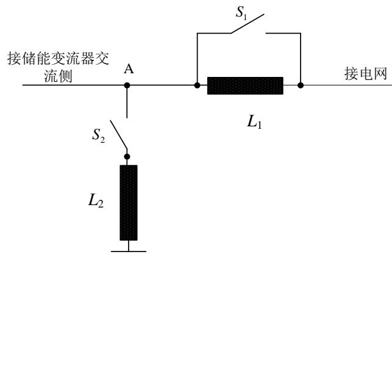  
图1 低电压故障发生装置示意图

## 高电压故障发生装置

高电压故障发生装置宜采用无源装置，测试装置结构见图2，应满足下述要求：

a) 装置应能模拟110%Un～130%Un三相对称电压抬升；

b) 限流电抗器L的电抗值与电阻值之比应至少大于 3；

c) A 点三相对称短路容量应为储能变流器额定有功功率的 3倍以上；

d) 模拟电压抬升和电压恢复时，电压阶跃时间应小于20ms。

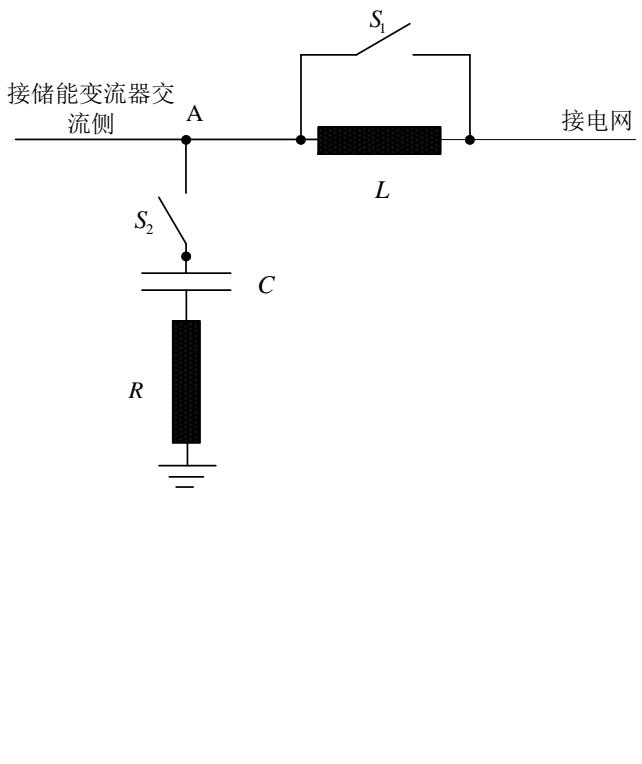

说明：

L——限流电抗器

C——升压电容器

R——阻尼电阻器

$\mathrm { S } _ { \mathrm { l } ^ { - } }$ ——旁路断路器

$S _ { 2 ^ { - } }$ ——短路断路器

图2 高电压故障发生装置示意图

## 直流电源

直流电源除应满足6.1规定的电压、电流精度要求外，还应满足以下要求：

a) 电压调节范围应能覆盖储能变流器工作电压范围，功率应至少为储能变流器额定功率的1.2倍；

b) 电压响应时间不应大于 20ms；

c) 动态电压瞬变值应小于电压设定值的 $\pm 1 0 \%$

d) 能量应能双向流动。

## 交流负载

交流负载除应满足6.1规定的电压、电流精度要求外，还应满足以下功能和性能要求：

a) 阻性负载、感性负载、容性负载调节精度不应大于0.2%，调节步长不应大于额定功率的0.05%；

b) 品质因数 $\mathrm { Q _ { f } }$ 的调整范围不小于 1；

c) 应具备三相独立调节功能。

## 温度检测设备

温度检测设备应满足以下要求：

a) 应能够存储检测过程中的全部温度数据；

b) 应具有足够的通道数量满足测温点的需要；

c) 测温通道的测温范围应至少满足 ${ } - 2 0 ^ { \circ } \mathrm { C } { \sim } 1 6 0 ^ { \circ } \mathrm { C }$ ，测温精度应不低于 $0 . 5 ^ { \circ } \mathrm { C } ;$

d) 各测温通道应有统一的时基信号；

e) 采样频率不应低于 $1 \mathrm { H z } / \mathbf { s } .$

## 电磁兼容性测试设备

电磁兼容性测试设备应满足GB/T 17626.2、GB/T 17626.3、GB/T 17626.4、GB/T 17626.5、GB/T17626.6、GB/T 17626.8、GB 4824的要求。

## 控制器硬件在环仿真测试平台

储能变流器控制器硬件在环仿真测试平台结构及仿真测试接口见图3，平台应具备以下功能：

a) 主电路仿真模块：储能变流器主电路的电气特性，主要包含 IGBT（绝缘栅双极型晶体管）模块、晶闸管等功率器件的仿真，可模拟主电路故障，验证主电路对控制器指令的响应；

b) 储能变流器试验回路仿真模块：试验回路模块中包含储能电池、电力电缆、变压器和电网故障模拟装置等，可模拟储能电池出力特性，模拟各种类型电网故障；

c) 光纤转换接口：将储能变流器控制器发出的脉冲转换为仿真平台便于接收、处理的信号形式；将装置的主电路信号发送给控制器；

d) 电平转换接口：将策略验证需要的储能变流器控制点/连接点的电压、电流及并网开关状态等返送至装置控制器；将装置控制器发出的并网开关跳合闸命令等发送给仿真验证平台。

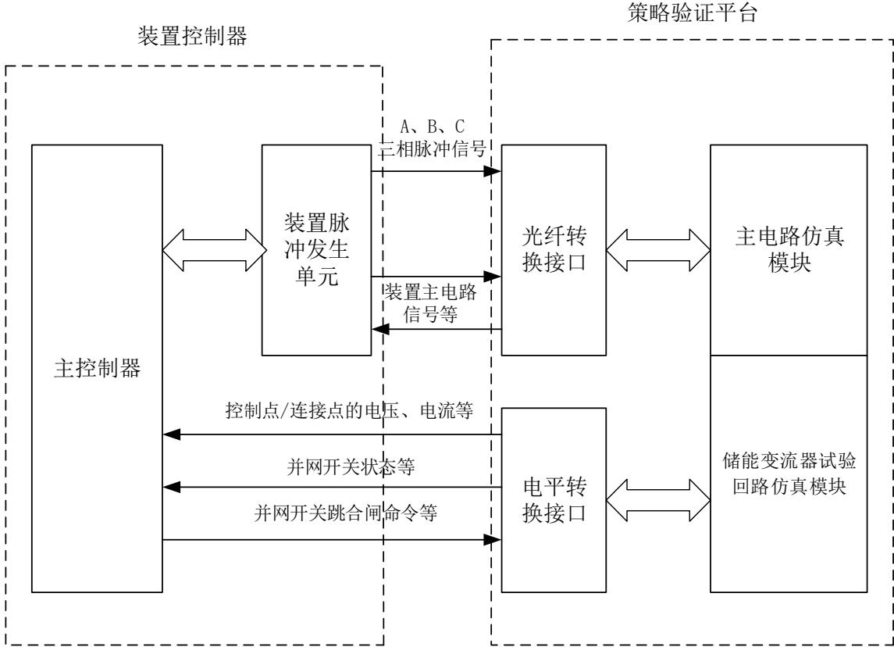  
图3 控制器硬件在环仿真测试平台结构及接口示意图

## 其他测试设备

防止人接近危险部件的触及试具应满足GB/T 4208的要求，碳弧灯应满足GB/T 16422.4的要求，氙弧灯应满足GB/T 16422.2的要求。

## 7 外观检查

检查储能变流器的外观应符合下列要求：

——外壳表面油漆及电镀涂层是否牢固、平整，无剥落、锈蚀及裂痕等现象；

——控制面板平整，文字和符号是否清楚、整齐、规范、正确；

——标牌、标志、标记是否完整清晰；

——各关键零部件是否符合对应的零部件标准要求；

——各种开关是否便于操作，灵活可靠。

## 8 通信功能检查

通信功能检查应按以下步骤进行：

a) 将储能变流器和信号发生及采集装置连接，连接储能变流器控制系统的供电电源线；

b) 接通储能变流器控制系统供电电源并启动控制系统，检查储能变流器的显示信息；

c) 通过信号发生及采集装置发送并接收30s 报文ID或相关指令，监测CAN、RS-485串口和网口30s报文，记录储能变流器的通信接口和通信协议。

## 9 保护功能检测

## 短路保护

短路保护检测应按以下步骤进行：

a) 对于A1和B 类储能变流器，按图4 连接检测电路；对于A2类储能变流器，在控制器硬件在环仿真测试平台中按图4搭建检测电路模型；

b) 调节储能变流器工作在正常放电模式；

c) 在图 4短路故障点模拟短路故障；

d) 记录短路电流波形与数据，记录储能变流器保护动作时间，查看储能变流器是否发出报警信号和显示故障类型；

e) 分别对储能变流器的相间、相对零（如有）、相对地和三相之间进行短路保护检测。

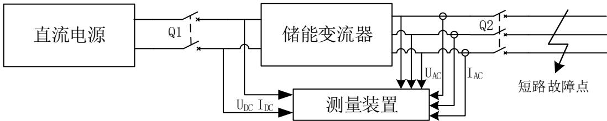  
图4 短路保护检测电路示意图

## 极性反接保护

极性反接保护检测应按以下步骤进行：

对于A1和B 类储能变流器，按图5 连接检测电路；对于A2类储能变流器，使用最小功率系统按图 5搭建检测电路；

b) 将储能变流器的直流输入极性反接；

c) 启动储能变流器，查看储能变流器是否发出报警信号和显示故障类型。

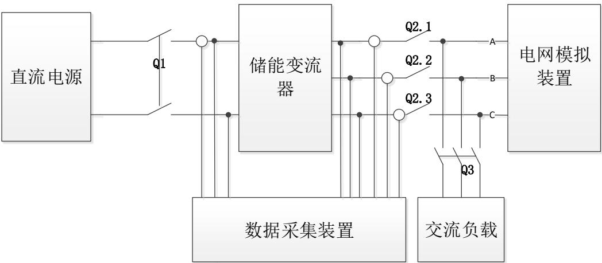  
图5 检测电路示意图

## 直流电压保护

## 9.3.1 直流过压保护

直流过压保护检测应按以下步骤进行：

对于A1和B 类储能变流器，按图5 连接检测电路；对于A2类储能变流器，使用最小功率系统按图 5搭建检测电路；

b) 将直流电源输出电压调整至储能变流器直流电压额定值；

c) 调节储能变流器工作在放电模式，输出额定功率；

d) 调节直流电源输出电压升至直流过压保护值，记录储能变流器直流过压动作值和保护动作时间；

e) 查看储能变流器是否发出报警信号和显示故障类型；

f) 调节直流电源输出电压至储能变流器直流电压额定值，确认储能变流器能否正常开机；

g) 调节储能变流器工作在充电模式，重复步骤d)～e)。

## 9.3.2 直流欠压响应

直流欠压响应检测应按以下步骤进行：

a) 对于A1和B 类储能变流器，按图5 连接检测电路；对于A2类储能变流器，使用最小功率系统按图 5搭建检测电路；

b) 将直流电源输出电压调整至储能变流器直流电压额定值；

c) 调节储能变流器工作在放电模式，输出额定功率；

d) 调节直流电源输出电压降至直流欠压值，记录储能变流器直流欠压动作值和响应动作时间；

e) 查看储能变流器是否发出报警信号和显示故障类型；

f) 调节直流电源输出电压至储能变流器直流电压额定值，确认储能变流器能否正常开机；

g) 调节储能变流器工作在充电模式，重复步骤d)～e)。

## 离网过流保护

离网过流保护检测应按以下步骤进行：

a) 对于A1和B 类储能变流器，按图6 连接检测电路；对于A2类储能变流器，使用最小功率系统按图 6搭建检测电路；

b) 设置储能变流器运行在离网模式；

c) 将直流电源输出电压调整至储能变流器直流电压额定值；

d) 调节储能变流器工作在放电模式，输出额定功率；

e) 调节交流负载，使储能变流器交流端口输出电流高于储能变流器交流允许最大电流值，记录储能变流器交流端口过流保护动作值和保护动作时间；

f) 查看储能变流器是否发出报警信号和显示故障类型。

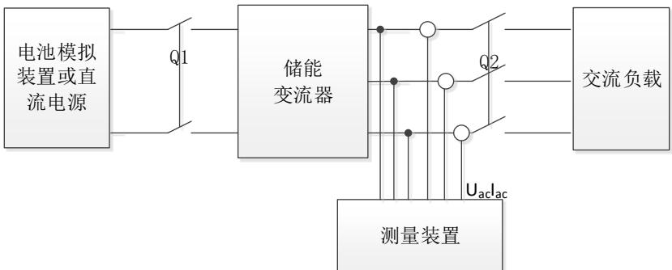  
图6 离网检测电路框图

## 过温保护

过温保护检测可使用真实过温和模拟过温两种方式，应按以下步骤进行：

a) 对于A1和B 类储能变流器，按图5 连接检测电路；对于A2类储能变流器，使用最小功率系统按图 5搭建检测电路；

b) 设置储能变流器运行在放电模式；

c) 停止或部分限制冷却液系统工作制造过温工况；也可通过将温度检测元件加热至预期的保护动作点或降低过温保护限值模拟过温，但应保证温度传感器等电路在预期过温范围内的有效性；

d) 查看储能变流器是否发出报警信号和显示故障类型。

## 通讯故障保护

通讯故障保护检测应按以下步骤进行：

a) 连接储能变流器控制系统的供电电源线；

b) 接通储能变流器控制系统供电电源并启动控制系统，检查储能变流器的显示信息；

c) 采用故障模拟的方法使储能变流器与监控系统及电池管理系统之间的通信发生通讯故障；

d) 查看储能变流器是否发出报警信号和显示故障类型。

## 冷却系统故障保护

冷却系统故障保护检测应按以下步骤进行：

a) 对于A1和B 类储能变流器，按图5 连接检测电路；对于A2类储能变流器，使用最小功率系统按图 5搭建检测电路；

b) 设置储能变流器运行在放电模式；

c) 停止或部分限制冷却液系统工作：

——风冷系统：完全堵住或部分堵住进风口，堵转或断开冷却风扇；

——水冷系统：停止或部分限制冷却液系统工作；

d) 查看储能变流器是否发出报警信号和显示故障类型。

## 10 电气性能检测

## 启停机

启停机检测应按以下步骤进行：

a) 对于A1和B 类储能变流器，按图5 连接检测电路；对于A2类储能变流器，在控制器硬件在环仿真测试平台中按图5搭建检测电路模型；

b) 设置储能变流器运行在放电模式；

c) 启动储能变流器至额定功率，稳定运行2min 后停机；

d) 记录启动和停机过程中储能变流器交流端口有功功率，每间隔 0.2s 计算一个有功功率值，绘制实测曲线；

e) 设置储能变流器运行在充电模式，重复步骤c)～d)。

## 相序检测及自适应

相序检测及自适应检测应按以下步骤进行：

a) 对于A1和B 类储能变流器，按图5 连接检测电路；对于A2类储能变流器，在控制器硬件在环仿真测试平台中按图 5搭建检测电路模型；

b) 将储能变流器交流端口进线A 和B 相序反接；

c) 启动储能变流器，查看储能变流器状态和指示信息。

## 功率输出范围

功率输出范围检测应按以下步骤进行：

a) 对于A1和B 类储能变流器，按图5 连接检测电路；对于A2类储能变流器，在控制器硬件在环仿真测试平台中按图5搭建检测电路模型；

b) 将储能变流器直流端口和交流端口设置为额定电压；

c) 控制储能变流器交流有功功率从充电最大功率开始，以每 10%额定功率作为一个区间到放电最大功率结束进行测试；

d) 调节储能变流器无功功率至感性无功功率输出限值，记录至少2 个1min 无功功率和有功功率数据；

e) 调节储能变流器无功功率至容性无功功率输出限值，记录至少2 个1min 无功功率和有功功率数据；

每间隔 0.2s计算一个无功功率值和有功功率值，利用 0.2s功率值绘制无功功率-有功功率特性曲线。

## 过载能力

过载能力检测应按以下步骤进行：

对于A1和B 类储能变流器，按图5 连接检测电路；对于A2类储能变流器，使用最小功率系统按图5搭建检测电路；

b) 将储能变流器直流端口和交流端口设置为额定电压；

c) 控制储能变流器稳定运行在 110%额定功率，保持 10min；

d) 调节电网模拟装置，使储能变流器交流端口电压为 90%额定电压，控制储能变流器稳定运行在110%额定功率，保持 1min；

e) 记录测试过程中储能变流器交流端口有功功率。

## 有功功率控制

有功功率控制检测应按以下步骤进行：

a) 对于A1和B 类储能变流器，按图5 连接检测电路；对于A2类储能变流器，在控制器硬件在环仿真测试平台中按图 5搭建检测电路模型；

b) 设置储能变流器运行在放电模式；

c) 按照图7的设定曲线控制储能变流器有功功率，并应在每个功率基准值上保持 2min；

d) 记录储能变流器交流有功功率，数据点时间间隔不大于 20ms；

e) 按附录B对响应时间、调节时间和控制偏差进行计算；

f) 设置储能变流器运行在放电模式，重复步骤 $\mathrm { c } ) \mathrm { \sim } { \mathrm { e } } )$

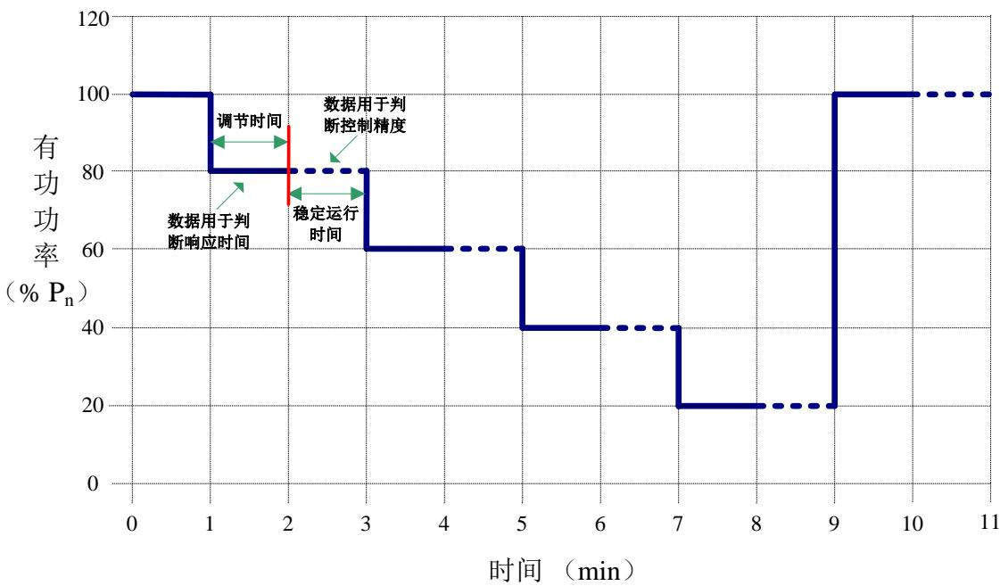  
图7 有功功率控制曲线  
注： P 为储能变流器额定功率。

## 一次调频

一次调频检测应按以下步骤进行：

a) 对于A1和B 类储能变流器，按图5 连接检测电路；对于A2类储能变流器，在控制器硬件在环仿真测试平台中按图 5搭建检测电路模型；

b) 调节电网模拟装置使储能变流器运行在额定电压和频率下，并设置为放电模式；

c) 控制储能变流器有功功率在 $2 0 \% \sim 3 0 \% \mathrm { P _ { n } }$ 范围内；

d) 设置储能变流器的一次调频调差率和死区在GB/T 34120规定的范围内；

e) 调节电网模拟装置按照表2设置频率阶跃曲线；

f) 记录储能变流器交流端口频率和有功功率，数据采样间隔不大于20ms；

按照附录C 计算一次调频控制滞后时间、响应时间、调节时间和控制偏差；

h) 控制储能变流器有功功率在 $7 0 \% \sim 8 0 \% \mathrm { P _ { n } }$ 范围内，重复步骤 $\mathrm { d } ) { \sim } \mathrm { g } )$

i) 设置储能变流器为充电模式，重复步骤c)～h)。

表2 一次调频测试点

<table><tr><td>序号</td><td>频率Hz</td><td>持续时间s</td><td>频率波动波形</td></tr><tr><td>1</td><td>48.0</td><td>15</td><td></td></tr><tr><td>2</td><td>49.8</td><td>15</td><td></td></tr><tr><td>3</td><td>49.9</td><td>15</td><td></td></tr><tr><td>4</td><td>49.95</td><td>15</td><td></td></tr><tr><td>5</td><td>49.98</td><td>15</td><td></td></tr><tr><td>6</td><td>50.02</td><td>15</td><td></td></tr><tr><td>7</td><td>50.05</td><td>15</td><td></td></tr><tr><td>8</td><td>50.15</td><td>15</td><td></td></tr><tr><td>9</td><td>50.3</td><td>15</td><td></td></tr><tr><td>10</td><td>51.5</td><td>15</td><td></td></tr></table>

注： P 为储能变流器额定功率。

## 惯量响应

惯量响应检测应按以下步骤进行：

a) 对于A1和B 类储能变流器，按图5 连接检测电路；对于A2类储能变流器，在控制器硬件在环仿真测试平台中按图 5搭建检测电路模型；

b) 调节电网模拟装置使储能变流器运行在额定电压和频率下，关闭一次调频功能，并设置为放电模式；

c) 控制储能变流器有功功率在20%～30%P 范围内；

d) 设置储能变流器的惯性时间常数在GB/T 34120规定的范围内；

e) 调节电网模拟装置按照图 8 设置频率变化曲线，在 t0\~t1、t2\~t3、t4\~t5、t6\~t7内频率变化率保持 为 $0 . 5 \mathrm { H z / s } , \mathrm { t _ { 4 } - t _ { 3 } } \geqslant 2 \mathrm { m i n } , \mathrm { t _ { 6 } - t _ { 5 } = t _ { 2 } - t _ { 1 } = 1 \mathrm { m i n } } ;$

f) 记录储能变流器交流端口频率和有功功率，数据采样间隔不大于 20ms；

g) 按照附录C 计算惯量响应控制滞后时间、响应时间和控制偏差。

h) 控制储能变流器有功功率在70%～80%Pn范围内，重复步骤d)～g)；

i) 设置储能变流器为充电模式，重复步骤c)～h)。

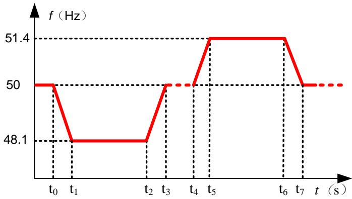  
图8 惯量响应特性测试曲线  
注： Pn为储能变流器额定功率。

## 无功功率控制

## 10.8.1 电压/无功控制

电压/无功控制检测应按以下步骤进行：

a) 对于A1和B 类储能变流器，按图5 连接检测电路；对于A2类储能变流器，在控制器硬件在环仿真测试平台中按图 5搭建检测电路模型；

b) 将储能变流器直流端口和交流端口设置为额定电压；

c) 设定储能变流器输出有功功率为 $5 0 \% \mathrm { { P } _ { n } }$ ，无功调压系数 $\mathrm { K } _ { \mathrm { v } }$ 为 2；

d) 调节电网模拟装置，使输出电压从 $\mathrm { U } _ { \mathrm { n } }$ 分别阶跃至 $9 1 \% \mathrm { { U _ { n } } . 9 5 \% U _ { n } . 1 0 5 \% U _ { n } }$ 和 $1 0 9 \% \mathrm { U _ { n } } ,$ ，至少保持 2min 后恢复到 $\mathrm { U } _ { \mathrm { n } } ;$

e) 记录储能变流器交流端口电压和无功功率，数据采样间隔不大于 20ms；

f) 按照附录B 的要求计算电压/无功功率控制的响应时间、调节时间和控制误差。

注： P 为储能变流器额定功率，U 为储能变流器额定电压。

## 10.8.2 恒功率因数控制

恒功率因数控制检测应按以下步骤进行：

a) 对于A1和B 类储能变流器，按图5 连接检测电路；对于A2类储能变流器，在控制器硬件在环仿真测试平台中按图 5搭建检测电路模型；

b) 将储能变流器直流端口和交流端口设置为额定电压；

c) 设定储能变流器输出有功功率为 $5 0 \% \mathrm { P _ { n } } ;$

d) 按照图9的曲线设定储能变流器交流端口功率因数；

e) 记录储能变流器交流端口电压、无功功率和功率因数，数据采样间隔不大于20ms；

f) 按照附录B 的要求计算功率因数控制的响应时间、调节时间和控制误差。

注1：Q 和Q 为有功功率为 $1 0 0 \% \mathrm { P _ { n } }$ 工况下，储能变流器输出的最大感性无功和最大容性无功。注2：P 为储能变流器额定功率。

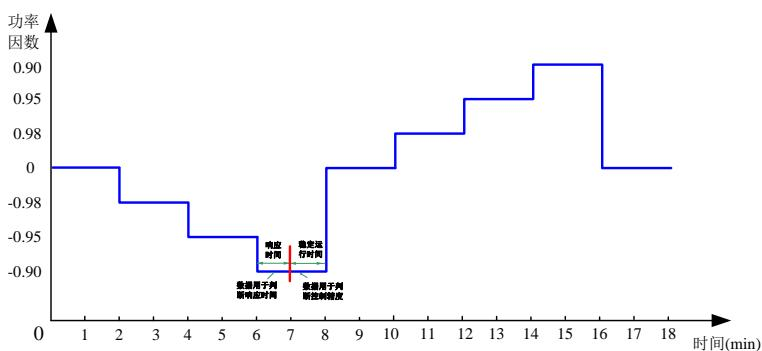  
图9 功率因数控制曲线  
注： Pn为储能变流器额定功率。

## 10.8.3 恒无功功率控制

恒无功功率控制检测应按以下步骤进行：

对于A1和B 类储能变流器，按图5 连接检测电路；对于A2类储能变流器，在控制器硬件在环仿真测试平台中按图 5搭建检测电路模型；

b) 将储能变流器直流端口和交流端口设置为额定电压；

c) 设定储能变流器输出有功功率为 $5 0 \% \mathrm { { P } _ { n } }$

d) 按照图 10 的曲线设定储能变流器输出的无功功率；

e) 记录储能变流器交流端口电压和无功功率，数据采样间隔不大于20ms；

f) 按照附录B 的要求计算无功功率控制的响应时间、调节时间和控制误差。

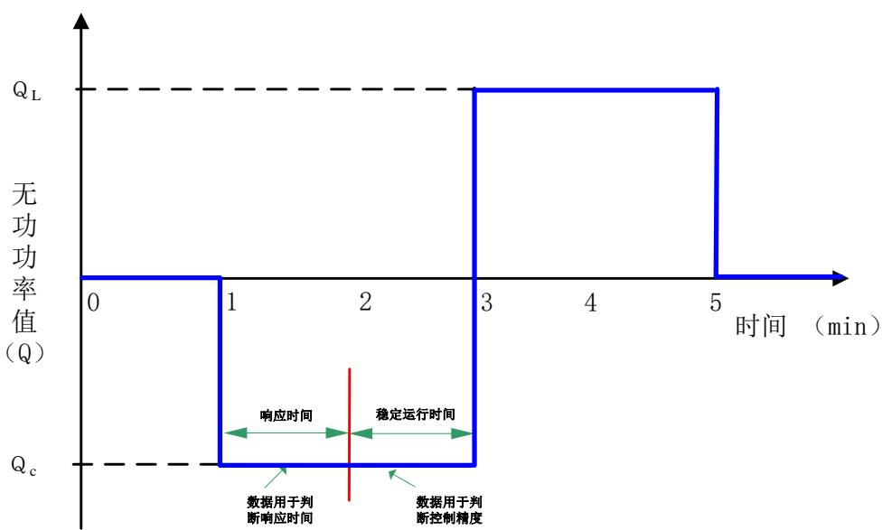  
图10 无功功率控制曲线

## 充放电转换时间

充放电转换时间检测应按以下步骤进行：

对于A1和B 类储能变流器，按图5 连接检测电路；对于A2类储能变流器，在控制器硬件在环仿真测试平台中按图 5搭建检测电路模型；

b) 将储能变流器直流端口和交流端口设置为额定电压；

c) 储能变流器在额定充电功率状态下运行至少3分钟，向储能变流器发额定功率放电指令，放电功率达到额定功率后运行至少3分钟，再向储能变流器发额定功率充电指令，充电功率达到额定功率后运行至少 3分钟；

记录储能变流器交流端口有功功率，数据采样间隔不大于 20ms，计算从 90%额定充电功率状态切换到 90%额定放电功率状态的时间间隔 t1，从 90%额定放电功率状态切换到 90%额定充电功率状态的时间间隔 t2；

e) 按公式（1）计算平均充放电切换时间 t。

$$
t = \frac {t _ {1} + t _ {2}}{2}\tag{1}
$$

## 并离网切换时间

## 10.10.1 被动并网转离网切换时间

被动并网转离网切换时间检测应按以下步骤进行：

a) 对于 A1 和 B 类储能变流器，按图 11 连接检测电路；对于 A2 类储能变流器，在控制器硬件在环仿真测试平台中按图11搭建检测电路模型；

b) 将储能变流器直流端口和交流端口设置为额定电压；

c) 设置储能变流器运行在放电模式；

d) 调节交流负载为阻感性负载 $\scriptstyle ( \mathrm { P F = } 0 . 8 )$ ；

e) 调节交流负载视在功率到储能变流器额定功率；

f) 待储能变流器运行稳定后断开并网开关；

g) 记录 $\mathrm { { U } _ { \mathrm { { L o a d } } } , \ \mathrm { { U } _ { \mathrm { { a c } } } } }$ 和I ，计算从并网开关断开时刻起到储能变流器放电电流I 达到负载稳态电流90%的时间间隔；

h) 分别调整交流负载视在功率为储能变流器额定功率的30%和 60%，重复步骤 $\operatorname { f } ) \sim \operatorname { g } ) ;$

i) 调节交流负载为阻容性负载 $\scriptstyle ( \mathrm { P F = } 0 . 8 )$ ，重复步骤 e)～h)；

j) 设置储能变流器运行在额定充电功率，重复步骤 $\mathrm { d } ) { \sim } \mathrm { i } )$ 。

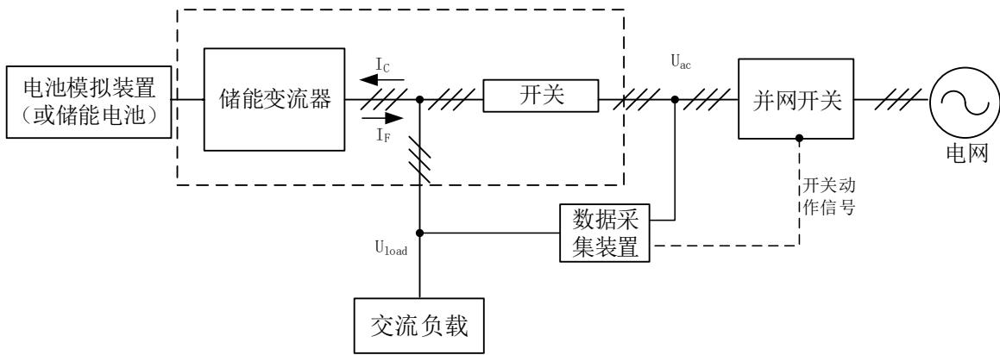  
图11 并离网切换检测电路示意图  
注： $\mathrm { U } _ { \mathrm { L o a d } }$ 为负载电压， $\mathrm { U } _ { \mathrm { a c } }$ 为网侧电压，I 为储能变流器放电电流。

## 10.10.2 主动并网转离网切换时间

主动并网转离网切换时间检测应按以下步骤进行：

对于 A1 和 B 类储能变流器，按图 11 连接检测电路；对于 A2 类储能变流器，在控制器硬件在环仿真测试平台中按图11搭建检测电路模型；

b) 将储能变流器直流端口和交流端口设置为额定电压；

c) 设置储能变流器运行在额定放电功率；

d) 调节交流负载为阻感性负载 $\scriptstyle ( \mathrm { P F = } 0 . 8 )$

e) 调节交流负载视在功率到储能变流器额定功率；

f) 待储能变流器运行稳定后，向其发离网运行指令；

g) 记录 $\mathrm { { U } _ { \mathrm { { L o a d } } } , \ \mathrm { { U } _ { \mathrm { { a c } } } } }$ 和 ${ \mathrm { I } } _ { \mathrm { F } } ,$ ，计算从离网运行指令下发时刻起到储能变流器放电电流 $\mathrm { I _ { F } }$ 达到负载稳态电流 90%的时间间隔；

h) 分别调整交流负载视在功率为储能变流器额定功率的30%和 60%，重复步骤 $\mathrm { f } ) \sim \mathrm { g } )$ ；

i) 调节交流负载为阻容性负载（PF=0.8），重复步骤 $\mathrm { e ) \mathord { \sim } \mathrm { h } } )$

j) 设置储能变流器运行在额定充电功率，重复步骤 $\mathrm { d } ) { \sim } \mathrm { i } )$ 。

注： PF为储能变流器的功率因数。

## 10.10.3 主动离网转并网切换时间

主动离网转并网切换时间检测应按以下步骤进行：

a) 对于 A1 和 B 类储能变流器，按图 11 连接检测电路；对于 A2 类储能变流器，在控制器硬件在环仿真测试平台中按图11搭建检测电路模型；

b) 设置储能变流器为离网运行模式；

c) 将储能变流器直流端口和交流端口设置为额定电压；

d) 调节交流负载为阻感性负载（PF=0.8）；

e) 调节交流负载视在功率到储能变流器额定功率；

f) 待储能变流器运行稳定后，向其发并网运行指令；

g) 记录 $\mathrm { { U } _ { \mathrm { { L o a d } } } , \mathrm { { U } _ { \mathrm { { a c } } } } }$ 和 ${ \mathrm { I } } _ { \mathrm { F } } ,$ ，计算从并网运行指令下发时刻起到储能变流器交流端口电压稳定在（100±5） $\% \mathrm { U _ { n } }$ 的时间间隔；

h) 分别调整交流负载视在功率为储能变流器额定功率的30%和 60%，重复步骤 $\mathrm { f } ) \sim \mathrm { g } )$ ；

i) 调节交流负载为阻容性负载（PF=0.8），重复步骤 $\mathrm { e ) \mathord { \sim } \mathrm { h } } )$

注： U 为储能变流器额定电压。

## 电能质量

## 10.11.1 电流谐波

电流谐波检测应按以下步骤进行：

a) 对于A1和B 类储能变流器，按图5 连接检测电路；对于A2类储能变流器，在控制器硬件在环仿真测试平台中按图 5搭建检测电路模型；

b) 将储能变流器直流端口和交流端口设置为额定电压；

c) 设置储能变流器运行在放电模式；

d) 从储能变流器持续正常运行的最小功率开始，以 $1 0 \% \mathrm { { P _ { n } } }$ 为一个区间，每个区间内连续运行10min；

e) 按公式 2 取时间窗 $\mathrm { T _ { w } }$ 测量并计算电流谐波子群的有效值，取 3s 内的 15 个电流谐波子群有效值计算方均根值；

f) 计算 10min内所包含的各3s电流谐波子群的方均根值；

电流谐波子群应记录到第50次，利用公式3计算电流谐波子群总畸变率并记录。

h) 设置储能变流器运行在充电模式，重复步骤 ${ \mathrm { d } } ) { \sim } { \mathrm { g } } )$

注： h次谐波子群的有效值。

$$
G _ {h} = \sqrt {\sum_ {i = - 1} ^ {1} C _ {1 0 h + i} ^ {2}}\tag{2}
$$

式中：

$\mathrm { C _ { 1 0 h + i } }$ ——DFT输出对应的第10h+i根频谱分量的有效值；

注： 谐波子群总畸变率：

$$
T H D S _ {i} = \sqrt {\sum_ {h = 2} ^ {50} \left(\frac {G _ {h}}{G _ {1}}\right) ^ {2}} \times 100 \%\tag{3}
$$

式中：

Gh——在10min内h次谐波子群的方均根值；

G1——在10min内基波子群的方均根值。

注： P 为储能变流器额定功率。

## 10.11.2 电压谐波

电压谐波检测应按以下步骤进行：

a) 对于A1和B 类储能变流器，按图6 连接检测电路；对于A2类储能变流器，在控制器硬件在环仿真测试平台中按图 6搭建检测电路模型；

b) 设置储能变流器运行在离网模式，将储能变流器直流端口和交流端口设置为额定电压；

c) 将交流负载设置为纯阻性，从 $1 0 \% \mathrm { { P _ { n } } }$ 开始以 $1 0 \% \mathrm { P _ { n } }$ 步长增加交流负载，每个功率区间内连续运行 10min；

d) 按照10.10.1中步骤 $\mathbf { \dot { e } } ) { \sim } \mathbf { g } )$ 开展电压谐波检测。

## 10.11.3 $\mathsf { P } _ { \mathsf { n } }$ 为储能变流器额定功率。电压间谐波

电压间谐波检测应按以下步骤进行：

a) 对于A1和B 类储能变流器，按图6 连接检测电路；对于A2类储能变流器，在控制器硬件在环仿真测试平台中按图 6搭建检测电路模型；

b) 设置储能变流器运行在离网模式，将储能变流器直流端口和交流端口设置为额定电压；

c) 将交流负载设置为纯阻性，从 $1 0 \% \mathrm { { P _ { n } } }$ 开始以 $1 0 \% \mathrm { P _ { n } }$ 步长增加交流负载，每个功率区间内连续运行 10min；

d) 按公式 4 取时间窗 $\mathrm { T _ { w } }$ 测量并计算电压间谐波中心子群的有效值，取 3s 内的 15 个电压间谐波中心子群有效值计算方均根值；

e) 计算 10min内所包含的各 $3 \mathrm { s }$ 电压间谐波中心子群的方均根值；

f) 电压间谐波测量最高频率应达到 2kHz；

注： h次间谐波中心子群的有效值；

$$
G _ {h} = \sqrt {\sum_ {i = 2} ^ {8} C _ {1 0 h + i} ^ {2}}\tag{4}
$$

式中：C10h+i——DFT输出对应的第10h+i根频谱分量的有效值。

注： P 为储能变流器额定功率。

## 10.11.4 直流分量

直流分量检测应按以下步骤进行：

a) 对于A1和B 类储能变流器，按图5 连接检测电路；对于A2类储能变流器，在控制器硬件在环仿真测试平台中按图 5搭建检测电路模型；

b) 将储能变流器直流端口和交流端口设置为额定电压；

c) 设置储能变流器运行在放电模式；

d) 调节储能变流器交流端口有功功率至 $\mathrm { { P _ { n } } , }$ ，连续运行 10min，测量并记录储能变流器交流端口电流；

e) 按0.2s窗口计算储能变流器交流端口电流直流分量，使用10min内的0.2s有效值计算平均值；

f) 设置储能变流器运行在放电模式，重复步骤 d)～e)；

注： Pn为储能变流器额定功率。

## 10.11.5 电压偏差

电压偏差检测应按以下步骤进行：

a) 对于A1和B 类储能变流器，按图6 连接检测电路；对于A2类储能变流器，在控制器硬件在环仿真测试平台中按图 6搭建检测电路模型；

b) 设置储能变流器运行在离网模式，将储能变流器交流端口设置为额定电压；

c) 调节直流电源输出电压至储能变流器直流端口最大电压值，储能变流器交流端口空载，测量并 记录储能变流器交流端口电压值；

d) 调节直流电源输出电压至储能变流器直流端口最小电压值，分别调节交流负载视在功率至 $\mathrm { { \cal P } _ { n } }$ （三相纯阻性）、 $\mathrm { { \cal P } _ { n } }$ （三相阻感性，PF=0.7）和 $\mathrm { { \cal P } _ { n } }$ （三相阻容性， $\mathrm { P F } { = } 0 . 7 )$ ，测量并记录储能变流器交流端口电压值；

e) 调节直流电源输出电压至储能变流器直流端口最小电压值，调节交流负载中一相至 33%Pn（纯阻性），另外两相空载，测量并记录储能变流器交流端口电压值；

f) 调节直流电源输出电压至储能变流器直流端口最小电压值，调节交流负载中两相至 33%Pn（纯阻性），另外一相空载，测量并记录储能变流器交流端口电压值；

g) 按公式（5）计算电压偏差。

$$
U _ {\delta} = \frac {U _ {r e} - U _ {N}}{U _ {N}} \times 100 \%\tag{……(5}
$$

式中：

$U _ { \delta }$ ——电压偏差；

$U _ { r e }$ ——交流端口实测电压值；

$U _ { N }$ ——交流端口额定电压值。

注： P 为储能变流器额定功率。

## 10.11.6 电压不平衡度

## 10.11.6.1 并网模式

并网模式下电压不平衡度检测应按以下步骤进行：

对于A1和B 类储能变流器，按图5 连接检测电路；对于A2类储能变流器，在控制器硬件在环仿真测试平台中按图 5搭建检测电路模型；

b) 将储能变流器直流端口和交流端口设置为额定电压；

c) 设置储能变流器运行在放电模式；

d) 从储能变流器持续正常运行的最小功率开始，以 $1 0 \% \mathrm { P _ { n } }$ 为一个区间逐渐增加至 $\mathrm { { P _ { n } } ; }$ ，每个区间内连续运行 10min，测量并记录储能变流器交流端口电压；

e) 按0.2s窗口计算储能变流器交流端口电压不平衡度，使用10min内的0.2s有效值计算平均值；

f) 设置储能变流器运行在充电模式，重复步骤 ${ \mathrm { d } } ) { \sim } { \mathrm { e } } )$ C

注： P 为储能变流器额定功率。

## 10.9.6.2 离网模式

离网模式下电压不平衡度检测应按以下步骤进行：

a) 对于A1和B 类储能变流器，按图6 连接检测电路；对于A2类储能变流器，在控制器硬件在环仿真测试平台中按图 6搭建检测电路模型；

b) 将储能变流器直流端口和交流端口设置为额定电压；

c) 设置储能变流器运行在离网模式；

d) 将交流负载设置为纯阻性，从 $1 0 \% \mathrm { { P _ { n } } }$ 开始以 $1 0 \% \mathrm { P _ { n } }$ 步长增加交流负载，每个功率区间内连续运行 10min，测量并记录储能变流器交流端口电压；

e) 按0.2s窗口计算储能变流器交流端口电压不平衡度，使用10min内的0.2s有效值计算平均值。

注： P 为储能变流器额定功率。

## 10.11.7 电压波动和闪变

## 10.11.7.1 并网稳态运行

并网稳态运行工况下电压波动和闪变检测应按以下步骤进行：

a) 对于A1和B 类储能变流器，按图5 连接检测电路；对于A2类储能变流器，在控制器硬件在环仿真测试平台中按图 5搭建检测电路模型；

b) 将储能变流器直流端口和交流端口设置为额定电压；

c) 设置储能变流器运行在放电模式；

d) 从储能变流器持续正常运行的最小功率开始，以 $1 0 \% \mathrm { P _ { n } }$ 为一个区间逐渐增加至 $\mathrm { { P _ { n } } , }$ ，每个区间内连续运行 10min，其中 $\mathrm { P _ { n } } \ I \langle \ / \hbar \rangle \mathrm { i } \overline { { \Delta } }$ 行 20min，共计 120min，测量并记录储能变流器交流端口电压；

e) 按 10min 窗口计算储能变流器交流端口电压短时闪变值 $\mathrm { P _ { s t } }$ ，使用 12 个短时闪变值 $\mathrm { P _ { s t } }$ 计算长时闪变值 $\mathrm { P _ { l t } } ;$ ；

f) 设置储能变流器运行在充电模式，重复步骤 ${ \mathrm { d } } ) { \sim } { \mathrm { e } } )$ 。

注： P 为储能变流器额定功率。

## 10.11.7.2 启停机

启停机工况下电压波动和闪变检测应按以下步骤进行：

a) 对于A1和B 类储能变流器，按图5 连接检测电路；对于A2类储能变流器，在控制器硬件在环仿真测试平台中按图 5搭建检测电路模型；

b) 将储能变流器直流端口和交流端口设置为额定电压；

c) 设置储能变流器运行在放电模式；

d) 设置储能变流器交流端口有功功率为 $\mathrm { { P _ { n } } , }$ ，每10min 内启动储能变流器1次，持续运行5min后关机，连续操作12次，测量并记录储能变流器交流端口电压；

e) 按 10min 窗口计算储能变流器交流端口电压短时闪变值 $\mathrm { P _ { s t } }$ ，使用 12 个短时闪变值 $\mathrm { P _ { s t } }$ 计算长时闪变值 $\mathrm { P _ { l t } } ;$ ；

f) 设置储能变流器运行在充电模式，重复步骤 ${ \mathrm { d } } ) { \sim } { \mathrm { e } } )$ 。

注： Pn为储能变流器额定功率。

## 10.11.7.3 离网稳态运行

离网稳态运行工况下电压波动和闪变检测应按以下步骤进行：

a) 对于A1和B 类储能变流器，按图6 连接检测电路；对于A2类储能变流器，在控制器硬件在环仿真测试平台中按图 6搭建检测电路模型；

b) 将储能变流器直流端口和交流端口设置为额定电压；

c) 设置储能变流器运行在离网模式；

d) 将交流负载设置为纯阻性，从 10% $\mathrm { { \cal P } _ { n } }$ 开始以 $1 0 \% \mathrm { { P r } _ { n } }$ 步长增加交流负载，每个功率区间内连续运行 10min，其中 $\mathrm { { \cal P } _ { n } }$ 工况运行30min，共计 120min，测量并记录储能变流器交流端口电压；

e) 按 10min 窗口计算储能变流器交流端口电压短时闪变值 $\mathrm { P _ { s t } }$ ，使用 12 个短时闪变值 $\mathrm { P _ { s t } }$ 计算长时闪变值 $\mathrm { P _ { l t } }$ 。

注： P 为储能变流器额定功率。

## 10.11.8 直流充电性能

## 10.11.8.1 恒功率控制精度

恒功率控制精度检测应按以下步骤进行：

a) 对于A1和B 类储能变流器，按图5 连接检测电路；对于A2类储能变流器，使用最小功率系统按图5搭建检测电路；

b) 设置储能变流器工作在恒功率充电状态；

c) 设定储能变流器直流端口功率为 $\mathrm { { \cal P } _ { n } } { : }$ ；

d) 调整储能变流器直流端口电压分别为当前充电功率下可运行电压范围的最大值、中间值和最小值，每个工况连续运行 10min，

e) 计算储能变流器直流端口实时功率值并记录，记录10min 内的极限值，利用公式（6）计算储能变流器恒功率控制精度；

f) 设定储能变流器直流端口功率为 $7 0 \% \mathrm { P _ { n } } . 5 0 \% \mathrm { P _ { n } }$ 和 $2 0 \% \mathrm { { P _ { n } } }$ ，重复步骤 ${ \mathrm { d } } ) { \sim } { \mathrm { e } } )$

g) 设置储能变流器工作在恒功率放电状态，重复步骤 $\mathrm { c ) \mathord { \sim } } \mathrm { f } )$ 。

$$
\delta_ {P} = \left[ \left(P _ {M} - P _ {S}\right) / P _ {S} \right] \times 100 \%\tag{……(6}
$$

式中：

$\delta _ { { \scriptscriptstyle P } }$ 恒功率控制精度；

$P _ { M }$ ——充电功率的实测值（10min 内极限值），单位： $\mathbf { W } :$ ；

$P _ { s }$ ——充电功率的设定值，单位：W。

$\mathsf { P } _ { \mathsf { n } }$ 为储能变流器或最小功率系统额定功率。10.11.8.2稳流精度和电流纹波

稳流精度和电流纹波检测应按以下步骤进行：

对于A1和B 类储能变流器，按图5 连接检测电路；对于A2类储能变流器，使用最小功率系统按图5搭建检测电路；

b) 将储能变流器交流端口设置为额定电压；

c) 设置储能变流器工作在恒流充电状态；

d) 设定储能变流器直流端口电流为最大运行值；

e) 调整储能变流器直流端口电压分别为当前电流下可运行电压范围的最大值、中间值和最小值，每个工况连续运行 10min；

测量储能变流器直流端口电流实时值并记录，记录10min 内的极限值，利用公式（7）计算储能变流器稳流精度；

g) 按 0.2s 窗口计算储能变流器直流端口电流除直流以外的交流分量有效值并记录，使用 10min内的 0.2s有效值计算平均值，利用公式（8）计算储能变流器电流纹波；

h) 设定储能变流器直流端口电流为最大运行值的 70%、50%和20%，重复步骤 $\operatorname { e } ) { \sim } \ g )$ ；

i) 设置储能变流器工作在恒流放电状态，重复步骤 d)～h)。

$$
\delta_ {I} = \left[ \left(I _ {M} - I _ {S}\right) / I _ {S} \right] \times 100\%\tag{7}
$$

$$
X _ {I r m s} = \frac {I _ {r m s}}{I _ {S}} \times 100 \%\tag{8}
$$

式中：

$\delta _ { \scriptscriptstyle I }$ ——稳流精度；

$I _ { u }$ ——直流端口电流的实测值（10min 内极限值），单位：A；

$I _ { s }$ ——直流端口电流的设定值，单位：A；

$X _ { _ { I r m s } }$ ——电流纹波有效值系数；

$I _ { r m s }$ ——直流端口电流交流分量有效值，单位：A。

10.11.8.3 稳压精度和电压纹波

稳压精度和电压纹波检测应按以下步骤进行：

a) 对于A1和B 类储能变流器，按图5 连接检测电路；对于A2类储能变流器，使用最小功率系统按图5搭建检测电路；

b) 将储能变流器交流端口设置为额定电压；

c) 设置储能变流器工作在恒压充电状态；

d) 设定储能变流器直流端口电压为最大运行值；

调整储能变流器直流端口电流分别为当前电压下可运行电流最大值的100%、70%、50%和20%，每个工况连续运行 10min；

f) 测量储能变流器直流端口电压实时值并记录，记录10min 内的极限值，利用公式（9）计算储能变流器稳压精度；

g) 按 0.2s 窗口计算储能变流器直流端口电压除直流以外的交流分量有效值并记录，使用 10min内的 0.2s有效值计算平均值，利用公式（10）计算储能变流器电压纹波；

h) 设定储能变流器直流端口电压为运行范围中值和最低值，重复步骤 $\operatorname { e } ) { \sim } \ g )$

i) 设置储能变流器工作在恒压放电状态，重复步骤 d)～h)。

$$
\delta_ {U} = [ (U _ {M} - U _ {S}) / U _ {S} ] \times 100 \%\tag{.... (9}
$$

$$
X _ {U r m s} = \frac {U _ {r m s}}{U _ {s}} \times 100 \%\tag{...... (10}
$$

式中：

$\delta _ { U }$ ——稳压精度；

$U _ { M }$ ——直流端口电压的实测值（10min 内极限值），单位： ${ \mathrm { V } } ;$

$U _ { s }$ ——直流端口电压的设定值，单位： $\mathrm { v } { \mathrm { ; } }$ ；

$X _ { { _ { U r m s } } }$ ——电压纹波有效值系数；

$U _ { r m s }$ ——直流端口电压交流分量有效值，单位： $\textrm { V } _ { \textrm { c } }$ 。

## 10.11.9 动态电压瞬变

动态电压瞬变检测应按以下步骤进行：

a) 对于A1和B 类储能变流器，按图6 连接检测电路；对于A2类储能变流器，在控制器硬件在环仿真测试平台中按图 6搭建检测电路模型；

b) 设置储能变流器运行在离网模式，交流端口电压为额定电压；

c) 设定交流负载为纯阻性，设定交流负载从 $2 0 \% \mathrm { { P } _ { n } }$ 突增到 $1 0 0 \% \mathrm { P _ { n } }$ ，记录储能变流器的交流端口出电压波形和数据；

d) 设定交流负载从 $1 0 0 \% \mathrm { P _ { n } }$ 突减到 $2 0 \% \mathrm { { P } _ { n } , }$ ，记录储能变流器的交流端口出电压波形和数据；

e) 按公式（11）计算负荷突减时输出电压动态瞬变值，其中电压有效值计算使用 20ms窗口；

$$
U _ {d i v} = \frac {\Delta U}{U _ {N}} \times 100 \%\tag{.... (11}
$$

式中：

$U _ { d i \nu }$ ——动态电压瞬变系数；

$\Delta U$ ——储能变流器交流端口电压有效值与额定值的最大偏差，单位： $\mathrm { V } ;$ ；

$U _ { n }$ ——储能变流器交流端口额定电压，单位：V。

注： P 为储能变流器额定功率。

## 故障穿越

## 10.12.1 低电压穿越

## 10.12.1.1 检测准备

a) 对于A1类储能变流器，按图 12连接检测电路；对于A2类储能变流器，在控制器硬件在环仿真测试平台中按图 12搭建检测电路模型；

b) 检测应至少选取5个跌落点，其中应包含 $0 \% \mathrm { U } _ { \mathrm { n } }$ 和 $2 0 \% \mathrm { U } _ { \mathrm { n } }$ 跌落点，其他各点应在 $( 3 0 \% \sim 5 0 \% ) \mathrm { U _ { n } }$ $( 5 0 \% \sim 7 0 \% ) \mathrm { U _ { n } . ~ ( 7 0 \% \sim 9 0 \% ) U _ { n } }$ 三个区间内均有分布，并按照图13曲线要求选取跌落时间。

注： $\mathrm { U } _ { \mathrm { n } } \not \mathcal { H }$ 储能变流器额定电压。

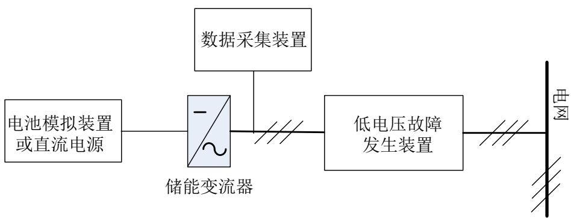  
图12 低电压穿越检测示意图

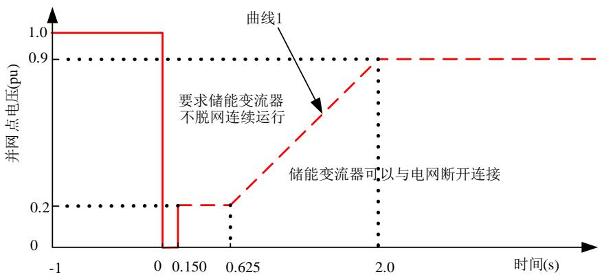  
图13 低电压穿越曲线

## 10.12.1.2 空载检测

空载检测应按以下步骤进行：

a) 确定储能变流器处于停机状态；

b) 调节低电压故障发生装置，模拟线路三相对称故障，电压跌落点应满足10.12.1.1的要求；

c) 调节低电压故障发生装置，随机模拟表 3 中的一种线路不对称故障，电压跌落点应满足10.12.1.1 的要求；

d) 测量并调整检测装置参数，使得电压跌落幅值和跌落时间满足图 14的容差要求。

表3 线路不对称故障类型

<table><tr><td>故障类型</td><td colspan="3">故障相</td></tr><tr><td>单相接地短路</td><td>A相</td><td>B相</td><td>C相</td></tr><tr><td>两相相间短路</td><td>AB相间</td><td>BC相间</td><td>CA相间</td></tr><tr><td>两相接地短路</td><td>AB两相</td><td>BC两相</td><td>CA两相</td></tr></table>

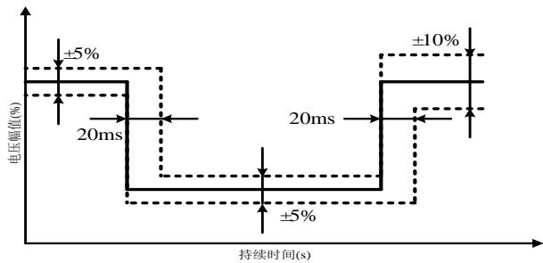  
图14 电压跌落容差  
注1：0%U 和20%U 跌落点电压跌落幅值容差为±5%。  
注2：Un为储能变流器额定电压。

## 10.12.1.3 负载检测

在空载测试结果满足要求的情况下，可进行低电压穿越负载测试。负载检测时低电压故障发生装置的配置和故障模拟工况的选择应与空载检测保持一致。

负载检测应按以下步骤进行：

a) 将储能变流器接入测试电路，直流端口和交流端口设置为额定电压；

b) 设置储能变流器运行在放电模式；

c) 调节储能变流器交流端口有功功率在 $0 . 1 \mathrm { P _ { n } } { \sim } 0 . 3 \mathrm { P _ { n } } ;$

d) 控制低电压故障发生装置进行三相对称电压跌落；

e) 记录储能变流器交流端口电压和电流的波形，应至少记录电压跌落前3s到电压恢复正常后 6s之间的数据；

f) 重复步骤 $\mathrm { d } ) { \sim } \mathsf { e } ) 1$ 次；

控制低电压故障发生装置进行不对称电压跌落；

h) 记录储能变流器交流端口电压和电流的波形，应至少记录电压跌落前3s到电压恢复正常后 6s之间的数据；

i) 重复步骤 e)～f)1 次；

j) 调节储能变流器运行在不小于 $0 . 7 \mathrm { P _ { n } }$ 的工况下，重复步骤 d)～i)；

k) 调节储能变流器充电模式运行，重复步骤c)～j)。

注： $\mathrm { { P } _ { n _ { \ell } } }$ 为储能变流器额定功率。

## 10.12.2 高电压穿越

## 10.12.2.1 检测准备

a) 对于A1类储能变流器，按图 15连接检测电路；对于A2类储能变流器，在控制器硬件在环仿真测试平台中按图 15搭建检测电路模型；

b) 高电压穿越检测应至少选取 3 个点，分别为 $1 2 0 \% \pm 3 \% \mathrm { U _ { n } } . 1 2 5 \% \pm 3 \% \mathrm { U _ { n } }$ 和 $1 3 0 \% \pm 3 \% \mathrm { U _ { n } } ,$ ，并按照图16曲线要求选取跌落时间。

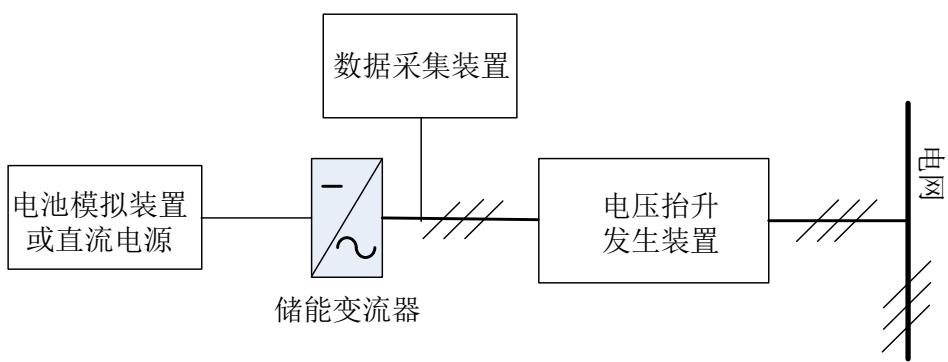

图15 高电压穿越检测示意图  
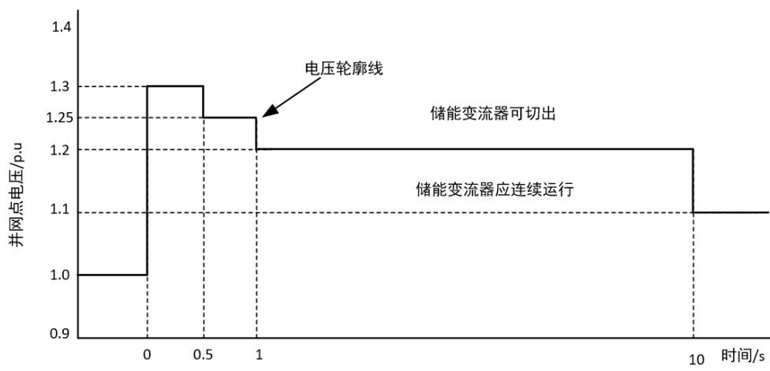  
图16 高电压穿越曲线  
注： Un为储能变流器额定电压。

## 10.12.2.2 空载检测

空载检测应按以下步骤进行：

a) 确定储能变流器处于停机状态；

b) 调节高电压故障发生装置，模拟线路三相电压抬升，电压抬升点应满足 10.12.2.1节的要求；

c) 测量并调整检测装置参数，使得电压抬升幅值和抬升时间满足图 17的容差要求。

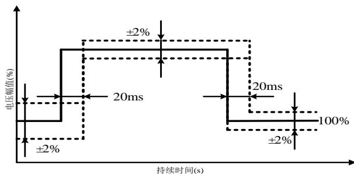  
图17 电压抬升容差

## 10.12.2.3 负载检测

在空载测试结果满足要求的情况下，开展高电压穿越负载测试。负载检测时电压抬升装置的配置和故障模拟工况的选择应与空载检测保持一致。

负载检测应按以下步骤进行：

a) 将储能变流器接入测试电路，交流端口设置为额定电压

b) 储能变流器直流端口电压设置为最低运行电压；

c) 设置储能变流器运行在放电模式；

d) 调节储能变流器交流端口有功功率在 $0 . 1 \mathrm { P _ { n } } { \sim } 0 . 3 \mathrm { P _ { n } } ;$

e) 控制高电压故障发生装置进行三相对称电压抬升；

记录储能变流器交流端口电压和电流的波形，记录应包含电压跌落前3s到电压恢复正常后 ${ 6 s }$ 之内的数据；

g) 重复步骤 $\mathbf { e } ) \sim \mathbf { f } )$ 1 次；

h) 调节储能变流器运行在不小于 0.7Pn的工况下，重复步骤 ${ \bf e } ) \sim { \bf g } )$

i) 设置储能变流器运行在充电模式，重复步骤d）～h）；

j) 储能变流器直流端口电压设置为最高运行电压，重复步骤 c）～i）。

注： P 为储能变流器额定功率。

## 10.12.3 连续故障穿越

## 10.12.3.1 检测准备

检测准备包括以下内容：

a) 对于A1类储能变流器，按图 18连接检测电路；对于A2类储能变流器，在控制器硬件在环仿真测试平台中按图 18搭建检测电路模型；

b) 低-高连续穿越检测应至少选取表 4 中规定的故障曲线，并按照图19曲线要求选取跌落和抬升时间。

表4 低-高连续穿越检测故障曲线

<table><tr><td>序号</td><td>低压区间</td><td>高压区间</td></tr><tr><td>1</td><td rowspan="2"> $0\%U_{n}$ </td><td> $(110\% \sim 120\%)U_{n}$ </td></tr><tr><td>2</td><td> $(120\% \sim 130\%)U_{n}$ </td></tr><tr><td>3</td><td rowspan="2"> $20\%U_{n}$ </td><td> $(110\% \sim 120\%)U_{n}$ </td></tr><tr><td>4</td><td> $(120\% \sim 130\%)U_{n}$ </td></tr></table>

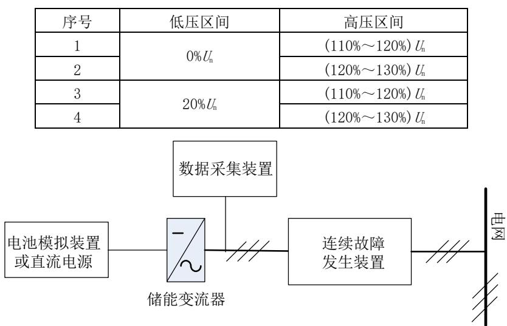  
图18 连续故障穿越检测示意图

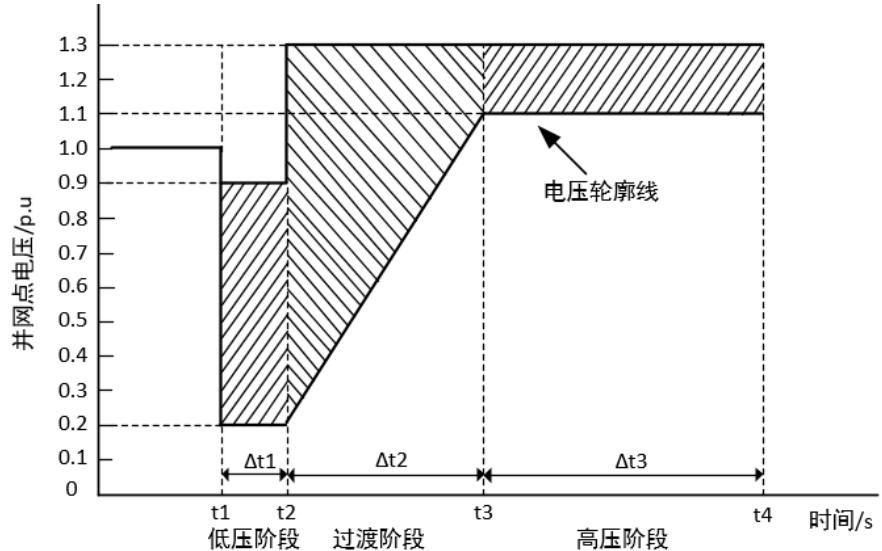  
图19 连续故障穿越曲线

注1：对需要储能变流器实现低-高电压穿越要求的地区,低压阶段时间Δt1、过渡阶段时间 Δt2、高压阶段时间Δt3以及两次连续穿越时间间隔等，应根据电力系统实际需要通过专题研究确定。

注2：U 为储能变流器额定电压。

## 10.12.3.2 空载检测

空载检测应按以下步骤进行：

a) 确定储能变流器处于停机状态；

b) 调节连续故障发生装置，模拟线路三相电压低-高连续故障，故障曲线应满足本规程 10.12.3.1节的要求；

c) 测量并调整检测装置参数，使得电压跌落/抬升幅值和跌落/抬升时间分别满足图 13和图16的容差要求。

## 10.12.3.3 负载检测

在空载测试结果满足要求的情况下，可进行低-高连续故障穿越负载测试。负载检测时连续故障发生装置的配置和故障模拟工况的选择应与空载检测保持一致。

负载检测应按以下步骤进行：

a) 将储能变流器接入测试电路，交流端口和直流端口设置为额定电压；

b) 设置储能变流器运行在放电模式；

c) 调节储能变流器运行在 $0 . 1 \mathrm { P _ { n } } { \sim } 0 . 3 \mathrm { P _ { n } }$ 的工况下；

d) 控制连续故障发生装置发生装置进行三相对称电压低-高连续故障；

e) 记录储能变流器交流端口电压和电流的波形，记录应包含故障前3s到电压恢复正常后 6s之内的数据；

f) 重复步骤d）～d）1次；

g) 调节储能变流器运行在不小于 0.7Pn的工况下，重复步骤 d）～f）；

h) 调节储能变流器充电模式运行，重复步骤 $\mathrm { c } ) { \sim } \mathrm { g } )$ 。

注： P 为储能变流器额定功率。

## 电网适应性

## 10.13.1 频率适应性

频率适应性检测应按以下步骤进行：

a) 对于A1和B 类储能变流器，按图5 连接检测电路；对于A2类储能变流器，在控制器硬件在环仿真测试平台中按图 5搭建检测电路模型；

b) 将储能变流器直流端口和交流端口设置为额定电压；

c) 设置储能变流器运行在放电模式；

d) 储能变流器交流端口有功功率不低于 $7 0 \% \mathrm { { P _ { n } } ; }$

e) 调节储能变流器交流端口频率从 50Hz 分别阶跃至 46.55Hz、48.45Hz 和 46.55Hz～48.45Hz 之间的任意值保持至少 0.5s后恢复到50Hz；

调节储能变流器交流端口频率从 50Hz 分别阶跃至 48.55Hz、50.45Hz 和 48.55Hz～50.45Hz 之间的任意值保持至少 10min 后恢复到50Hz；

g) 调节储能变流器交流端口频率从 50Hz 分别阶跃至 50.55Hz、51.45Hz 和 50.55Hz～51.45Hz 之间的任意值保持0.5s后恢复到50Hz；

h) 记录储能变流器交流端口电压、电流和频率的波形、储能变流器运行状态及相应动作频率、动作时间；

i) 设置储能变流器运行在放电模式，重复步骤d)～h)。

注： P 为储能变流器额定功率。

## 10.13.2 电压适应性

电压适应性检测应按以下步骤进行：

a) 对于A1和B 类储能变流器，按图5 连接检测电路；对于A2类储能变流器，在控制器硬件在环仿真测试平台中按图 5搭建检测电路模型；

b) 将储能变流器直流端口和交流端口设置为额定电压；

c) 设置储能变流器运行在放电模式；

d) 储能变流器交流端口有功功率不低于 $7 0 \% \mathrm { { P _ { n } } ; }$

e) 调节储能变流器交流端口电压从 $\mathrm { U } _ { \mathrm { n } }$ 分别阶跃至 $9 1 \% \mathrm { U _ { n } } , 9 9 \% \mathrm { U _ { n } }$ 和 $9 1 \% \mathrm { U _ { n } } { \sim } 9 9 \% \mathrm { U _ { n } }$ 之间的任意值保持至少20min 后恢复到 $\mathrm { U } _ { \mathrm { n } }$ ；

f) 调节储能变流器交流端口电压从 $\mathrm { U } _ { \mathrm { n } }$ 分别阶跃至 $1 0 1 \% \mathrm { U _ { n } } \mathrm { . ~ } 1 0 9 \% \mathrm { U _ { n } }$ 和 101% $\mathrm { U _ { n } } { \sim } 1 0 9 \% \mathrm { U _ { n } }$ 之间的任意值保持至少20min 后恢复到 $\mathrm { { U } _ { n } } ;$

g) 记录储能变流器交流端口电压和电流的波形、储能变流器运行状态及相应动作电压、动作时间；

h) 设置储能变流器运行在放电模式，重复步骤 ${ \mathrm { d } } ) { \sim } { \mathrm { g } } )$ 。

注： P 为储能变流器额定功率，U 为储能变流器额定电压。

## 10.14 效率

## 10.14.1 检测电路

储能变流器整流效率和逆变效率检测电路见图20。

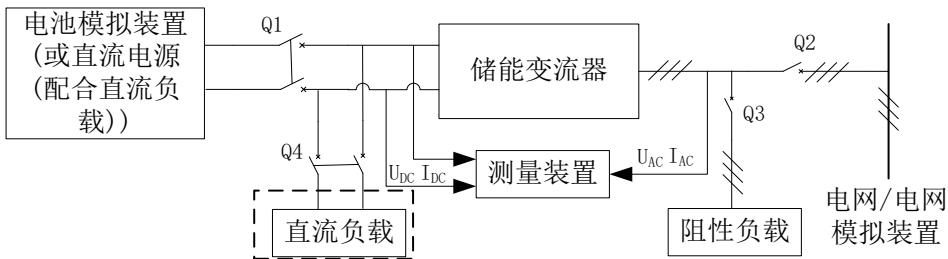  
图20 储能变流器效率检测电路框图

## 10.14.2 整流效率

整流效率检测应按以下步骤进行：

a) 对于A1和B 类储能变流器，按图5 连接检测电路；对于A2类储能变流器，使用最小功率系统按图5搭建检测电路；

b) 设置储能变流器运行在充电模式；

c) 设置储能变流器直流端口电压为满载直流电压运行范围上限值；

d) 使储能变流器从 10%Pn 开始，以10%Pn为间隔改变交流端口有功功率，每个功率点连续运行10min；

e) 每间隔0.2s计算和记录直流端口电压、电流和功率、交流端口电压、电流和有功功率数据；

f) 按公式（12）计算储能变流器整流效率；

g) 调节储能变流器直流端口电压分别为直流电压调节范围的中间值和下限值，重复步骤 $\mathrm { d } ) \sim \mathrm { f } )$ o

$$
\eta_ {1} = \frac {p _ {D C}}{p _ {A C}} \times 100 \%\tag{.... (12}
$$

式中：

$\eta _ { I ^ { - } }$ ——整流效率；

$P _ { D C }$ ——直流端口功率，单位W；

$P _ { A C }$ ——交流端口有功功率，单位W。

注1：对于A2类储能变流器，效率可使用最小功率系统的检测结果和系统部件电气参数、系统运行参数进行计算评估。

注2：P 为储能变流器或最小功率系统额定功率。

## 10.14.3 逆变效率

逆变效率检测应按以下步骤进行：

a) 对于A1和B 类储能变流器，按图5 连接检测电路；对于A2类储能变流器，使用最小功率系统按图5搭建检测电路；

b) 设置储能变流器运行在放电模式；

c) 设置储能变流器直流端口电压为满载直流电压运行范围上限值；

d) 使储能变流器从 $1 0 \% \mathrm { { P } _ { n } }$ 开始，以 $1 0 \% \mathrm { { P r } _ { n } }$ 为间隔改变交流端口有功功率，每个功率点连续运行10min；

e) 每间隔0.2s计算和记录直流端口电压、电流和功率、交流端口电压、电流和有功功率数据；

f) 按公式（13）计算储能变流器逆变效率；

g) 调节储能变流器直流端口电压分别为直流电压调节范围的中间值和下限值，重复步骤 $\mathrm { d } ) \sim \mathrm { f } )$ 。

$$
\eta_ {2} = \frac {p _ {A C}}{p _ {D C}} \times 100 \%\tag{……(13}
$$

式中：

$\eta _ { 2 }$ ——逆变效率；

$P _ { D C }$ ——直流端口功率，单位W；

$P _ { A C }$ ——交流输出有功功率，单位W。

注 1：对于 类储能变流器，效率可使用最小功率系统的检测结果和系统部件电气参数、系统运行参数进行计算评估。

注2：P 为储能变流器或最小功率系统额定功率。

## 非计划性孤岛保护

## 10.15.1 检测电路

孤岛保护检测电路见图21。

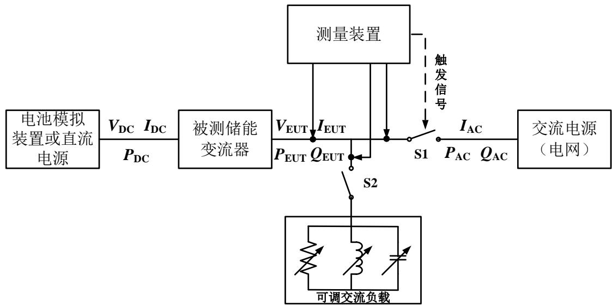  
图21 防孤岛保护检测电路示意图

## 10.15.2 检测步骤

孤岛保护检测应按以下步骤进行：

a) 对于 A1 和 B 类储能变流器，按图 21 连接检测电路；对于 A2 类储能变流器，在控制器硬件在环仿真测试平台中按图21搭建检测电路模型；

b) 闭合 S1、S2，启动储能变流器。通过调节直流电源，使储能变流器的输出功率 $\mathrm { P _ { E U T } }$ 等于额定交流输出功率，并测量储能变流器输出无功功率 $\mathrm { Q _ { E U T } } ;$

c) 调节感性负载使加载值等于 $\mathrm { Q _ { L } }$ ，并满足 $\mathrm { Q _ { L } } { = } \mathrm { Q _ { f } } { \times } \mathrm { P _ { E U T } } { = } 1 . 0 { \times } \mathrm { P _ { E U T } } { ; }$

d) 调节容性负载使加载值等于 $\mathrm { Q _ { C } }$ ，并满足 $\mathrm { Q _ { C } } \mathrm { = Q _ { E U T } + Q _ { L } }$ ；

e) 调节阻性负载使加载值等于 $\mathrm { P _ { E U T } } ;$

f) 调节RLC 可调交流负载使流过 S1的基波电流小于稳态时储能变流器额定输出电流 1%，无功功率趋于零；

g) 开断 S1，利用测量装置记录从 S1断开至储能变流器输出电流下降并维持在额定输出电流 1%以下时的波形，计算相应时间间隔；

h) 根据表 5 中的功率偏差值要求，调整可调交流负载的电阻值、电感值和电容值，断开 S1，记录从 S1 断开至储能变流器输出电流下降并维持在额定输出电流 1%以下时的波形，计算相应时间间隔；

i) 若计算的时间呈持续上升趋势，则应继续以 1%的增量扩大偏差范围，直至检测计算的时间呈下降趋势。

注1：检测过程中品质因数 Q 允许有不超过±0.05 的偏差，即 $\mathrm { Q } \mathrm { = } 1 { \pm } 0 . 0 5$ 。

注2：对于有自动并离网切换功能的变流器需要屏蔽自动并离网切换功能。

表5 防孤岛检测条件表

<table><tr><td>序号</td><td>储能变流器输出功率</td><td>加载的无功</td><td>加载的有功偏差</td><td>加载的无功偏差</td></tr><tr><td>1</td><td>100</td><td>100</td><td>0</td><td>0</td></tr><tr><td>2</td><td>66</td><td>66</td><td>0</td><td>0</td></tr><tr><td>3</td><td>33</td><td>33</td><td>0</td><td>0</td></tr><tr><td>4</td><td>100</td><td>100</td><td>-5</td><td>-5</td></tr><tr><td>5</td><td>100</td><td>100</td><td>-5</td><td>0</td></tr><tr><td>6</td><td>100</td><td>100</td><td>-5</td><td>+5</td></tr><tr><td>7</td><td>100</td><td>100</td><td>0</td><td>-5</td></tr><tr><td>8</td><td>100</td><td>100</td><td>0</td><td>+5</td></tr><tr><td>9</td><td>100</td><td>100</td><td>+5</td><td>-5</td></tr><tr><td>10</td><td>100</td><td>100</td><td>+5</td><td>0</td></tr><tr><td>11</td><td>100</td><td>100</td><td>+5</td><td>+5</td></tr><tr><td>12</td><td>66</td><td>66</td><td>0</td><td>-5</td></tr><tr><td>13</td><td>66</td><td>66</td><td>0</td><td>-4</td></tr><tr><td>14</td><td>66</td><td>66</td><td>0</td><td>-3</td></tr><tr><td>15</td><td>66</td><td>66</td><td>0</td><td>-2</td></tr><tr><td>16</td><td>66</td><td>66</td><td>0</td><td>-1</td></tr><tr><td>17</td><td>66</td><td>66</td><td>0</td><td>1</td></tr><tr><td>18</td><td>66</td><td>66</td><td>0</td><td>2</td></tr><tr><td>19</td><td>66</td><td>66</td><td>0</td><td>3</td></tr><tr><td>20</td><td>66</td><td>66</td><td>0</td><td>4</td></tr><tr><td>21</td><td>66</td><td>66</td><td>0</td><td>5</td></tr><tr><td>22</td><td>33</td><td>33</td><td>0</td><td>-5</td></tr><tr><td>23</td><td>33</td><td>33</td><td>0</td><td>-4</td></tr><tr><td>24</td><td>33</td><td>33</td><td>0</td><td>-3</td></tr><tr><td>25</td><td>33</td><td>33</td><td>0</td><td>-2</td></tr><tr><td>26</td><td>33</td><td>33</td><td>0</td><td>-1</td></tr><tr><td>27</td><td>33</td><td>33</td><td>0</td><td>1</td></tr><tr><td>28</td><td>33</td><td>33</td><td>0</td><td>2</td></tr><tr><td>29</td><td>33</td><td>33</td><td>0</td><td>3</td></tr><tr><td>30</td><td>33</td><td>33</td><td>0</td><td>4</td></tr><tr><td>31</td><td>33</td><td>33</td><td>0</td><td>5</td></tr></table>

## 11 安全性能检测

## 电气安全

## 11.1.1 电气间隙和爬电距离

电气间隙和爬电距离检测应按GB 7251.1中的规定进行检测。

## 11.1.2 介质强度

## 11.1.2.1 绝缘电阻

绝缘电阻检测应按以下步骤进行：

a) 确认储能变流器对外连线已拆除或断开，并接地放电；

b) 断开过电压保护器件（如压敏电阻等）；

c) 在储能变流器各独立电路与外露的可导电部分之间，以及与各独立电路之间施加试验电压，试验电压电压见表6；

d) 记录测得绝缘电阻值。

表6 绝缘电阻试验电压等级  
单位为伏

<table><tr><td>额定绝缘电压等级 $U_{\text{N}}$ </td><td>绝缘电阻表电压</td></tr><tr><td>≤60</td><td>250</td></tr><tr><td> $60500</td><td>500</td></tr><tr><td>\(2501000</td><td>1000</td></tr><tr><td>\(U_{\text{N}}>1000$ </td><td>2500</td></tr><tr><td colspan="2">注: $U_{\text{N}}$ 为被测电路最高电压。</td></tr></table>

## 11.1.2.2 工频耐压

工频耐压检测应按以下步骤进行：

a) 确认储能变流器对外连线已拆除或断开，并接地放电；

b) 断开过电压保护器件（如压敏电阻等）；

c) 在储能变流器各独立电路与外露的可导电部分之间，以及与各独立电路之间施加试验电压；

d) 试验电压的波形为 50Hz 标准正弦波形，试验时间为 60s，施加试验电压时可以逐渐上升或下降，试验持续时间为达到规定试验电压后保持的时间，如果试验路径中有电容器，试验可采用直流电压，直流电压值应等于规定的交流电压峰值，试验电压见表 7；

e) 记录是否击穿或者其他破坏性放电现象。

表7 储能变流器工频耐受电压试验电压  
单位为伏

<table><tr><td rowspan="2">工作电压交流</td><td colspan="2">对基本绝缘电路进行型式试验和所有出厂试验电压值</td><td colspan="2">对双重绝缘或加强绝缘电路进行型式试验电压值</td></tr><tr><td>交流有效值</td><td>直流</td><td>交流有效值</td><td>直流</td></tr><tr><td>≤50</td><td>1250</td><td>1770</td><td>2500</td><td>3540</td></tr><tr><td>100</td><td>1300</td><td>1840</td><td>1600</td><td>3680</td></tr><tr><td>150</td><td>1350</td><td>1910</td><td>2700</td><td>3820</td></tr><tr><td>300</td><td>1500</td><td>2120</td><td>3000</td><td>4240</td></tr><tr><td>600</td><td>1800</td><td>2550</td><td>3600</td><td>5090</td></tr><tr><td>1000</td><td>2200</td><td>3110</td><td>4400</td><td>6220</td></tr><tr><td>3600</td><td>10000</td><td>14150</td><td>16000</td><td>22650</td></tr><tr><td>7200</td><td>20000</td><td>28300</td><td>32000</td><td>45300</td></tr><tr><td>12000</td><td>28000</td><td>39600</td><td>44800</td><td>63350</td></tr><tr><td>17500</td><td>38000</td><td>53700</td><td>60800</td><td>85900</td></tr><tr><td>24000</td><td>50000</td><td>70700</td><td>80000</td><td>113100</td></tr><tr><td>36000</td><td>70000</td><td>99000</td><td>112000</td><td>158400</td></tr></table>

## 11.1.2.3 冲击耐压

冲击耐压检测应按以下步骤进行：

a) 确认储能变流器对外连线已拆除或断开，并接地放电；

b) 断开过电压保护器件（如压敏电阻等）；

c) 在储能变流器各独立电路与外露的可导电部分之间，以及与各独立电路之间施加试验电压；

d) 电压波形为1.2/50μs的脉冲电压波形，试验电压见表8；

e) 试验 3次后更换试验电压正负极性，再次试验 3 次，每次试验电压的时间间隔不应小于 30s；

f) 记录是否击穿或者其他破坏性放电现象。

表8 储能变流器冲击耐受电压试验电压  
单位为伏

<table><tr><td rowspan="2">系统电压(交流有效值/直流)(见表4)</td><td colspan="2">过电压等级II(直流端口)</td><td colspan="2">过电压等级III(交流端口)</td></tr><tr><td>基本绝缘或附加绝缘</td><td>加强绝缘</td><td>基本绝缘或附加绝缘</td><td>加强绝缘</td></tr><tr><td>50/75</td><td>500</td><td>800</td><td>800</td><td>1500</td></tr><tr><td>100/150</td><td>800</td><td>1500</td><td>1500</td><td>2500</td></tr><tr><td>150/225</td><td>1500</td><td>2500</td><td>2500</td><td>4000</td></tr><tr><td>300/450</td><td>2500</td><td>4000</td><td>4000</td><td>6000</td></tr><tr><td>600/900</td><td>4000</td><td>6000</td><td>6000</td><td>8000</td></tr><tr><td>1000/1500</td><td>6000</td><td>8000</td><td>8000</td><td>12000</td></tr><tr><td>3600/5400</td><td>16000</td><td>20000</td><td>20000</td><td>40000</td></tr><tr><td>7200/10800</td><td>29000</td><td>40000</td><td>40000</td><td>60000</td></tr><tr><td>12000/18000</td><td>42500</td><td>60000</td><td>60000</td><td>75000</td></tr><tr><td>17500/26250</td><td>55000</td><td>75000</td><td>75000</td><td>95000</td></tr><tr><td>24000/36000</td><td>75000</td><td>95000</td><td>95000</td><td>125000</td></tr><tr><td>36000/54000</td><td>95000</td><td>125000</td><td>125000</td><td>145000</td></tr><tr><td colspan="5">注:直流端口允许插值,交流端口不允许插值。</td></tr></table>

## 11.1.3 保护连接

保护连接检测应按以下步骤进行：

a) 在储能变流器不带电的工况下，断开接地端子与外部接地线之间的保护连接；

b) 将接地电阻试验仪的两极分别接在保护接地端子和可接触导电部位，宜选取距离保护接地端子最远端的金属导体；

c) 试验电流应为过电流保护值 2 倍和 32A 中的较大值；

d) 试验电流持续时间见表 9；

e) 测量记录保护连接的电阻值或压降，试验电流小于等于 32A 时，记录保护连接电阻，试验电流大于32A时，记录保护连接压降。

表9 保护连接试验持续时间

<table><tr><td>过电流保护装置等级A</td><td>试验持续时间min</td></tr><tr><td>&lt;16</td><td>2</td></tr><tr><td>16~30</td><td>2</td></tr><tr><td>31~60</td><td>4</td></tr><tr><td>61~100</td><td>6</td></tr><tr><td>101~200</td><td>8</td></tr><tr><td>&gt;200</td><td>10</td></tr></table>

## 11.1.4 接触电流

接触电流检测应按以下步骤进行：

a) 储能变流器断开所有外部接地线，将接触电流测试仪输入侧 A 端连接到储能变流器的接地端子，输入侧B端与外部接地导线连接，接触电流测试仪应满足附录D 的相关要求；

b) 对于连接中性点接地系统的储能变流器，测试中应保持中性点接地状态，对于连接中性点悬浮系统的储能变流器，测试时中性点通过 1kΩ电阻与地连接，对于连接一角接地系统的储能变流器，测试时应依次模拟每相接地进行测试，取最大值作为测试结果；

c) 设置储能变流器运行在额定功率下，记录接触电流有效值。

## 11.1.5 存储电荷放电

存储电荷放电检测应按以下步骤进行：

a) 设置储能变流器在最高直流输入电压的工况下待机保持 10min；

b) 依次断开交流输出侧断路器、直流输入侧断路器；

c) 采集测试端口的电压波形，记录应包含从断路器断开前 3s到电压接近为零的数据；

d) 计算储能变流器从直流断路器断开到端口放电至安全电压以下或存储能量低于 20J 的放电时间。

注： 测试端口包括但不限于直流正负极、直流正负极对地、交流相与相之间、交流相对地及维修人员可能接触的内部电容。

## 11.1.6 绝缘电阻检测

绝缘电阻检测应按以下步骤进行：

a) 对于 A1 和 B 类储能变流器，按图 22 连接检测电路；对于 A2 类储能变流器，使用最小功率系统按图 22搭建检测电路；

b) 将可调电阻的阻抗调节为 $\mathrm { V } _ { \mathrm { m a x B a } } / 3 0 \mathrm { m A } ;$

c) 闭合接地开关，使储能变流器直流端口的“﹢”极和“﹣”极通过可调电阻接地；

d) 调节直流电源直流电压为储能变流器的直流端口最大允许电压值；

e) 检测储能变流器是否并网，储能变流器是否提示故障状态。

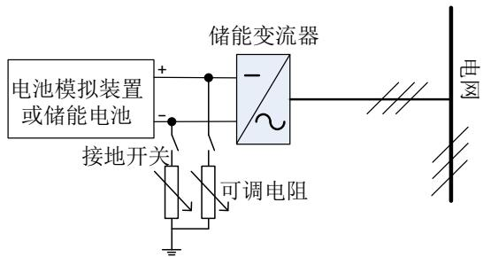  
图22 直流端口绝缘电阻检测功能试验电路示意图

注： $\mathrm { \Delta V _ { m a x B a } }$ 为储能变流器的直流端口最大工作电压值。

## 机械安全

## 11.2.1 防护等级

储能变流器厢体的IP防护等级检测应按GB/T 4208中规定的方法进行。

注： 大型储能变流器防护等级检测可采用提供样柜的方法进行等效检测。

## 11.2.2 可触及性

可触及性检测应按以下步骤进行：

a) 移除不用工具即可拆卸或打开的零部件，打开所有允许操作人员打开的门和盖板；

b) 对于无需工具即可断开的连接器或连接端子，应在断开过程中和断开后分别进行检测，任何可移动零部件要置于对结果最不利的位置；

c) 使用试验指和试验针在不施加明显力的情况下对每个开孔进行各个方向的测试；

d) 对于带关节试验指不能进入的开孔，再用不带关节的试验指施加 30N 的力进行测试，如不带关节的试验指能够进入开孔，再用带关节试验指用30N的力重复测试。

## 11.2.3 紫外暴露

紫外暴露检测应按以下步骤进行：

a) 分别使用碳弧灯和氙弧灯，按GB/T 16422.1中规定的方法对储能变流器外壳进行紫外暴露；

b) 测试后检查是否出现明显的退化迹象（包括裂纹和破裂），也可通过检查设备的结构和外壳材料的防紫外线报告（或者保护涂层的相关数据）判断是否满足要求。

## 11.2.4 外壳和支架强度

## 11.2.5.1 壁挂或支架强度

壁挂或支架强度检测应按以下步骤进行：

对已安装储能变流器的安装支架施加储能变流器自重三倍的力，力的方向沿重心处垂直向下，试验力在5s至10s内从零逐渐增加到预定大小，并保持1min；

b) 检查支架是否出现永久性变形、破裂或其他失效现象。

## 11.2.5.2 把手强度

把手强度检测应按以下步骤进行：

a) 对把手施加大小等于储能变流器重力 4 倍的力，不用夹具，直接将力均匀地施加在把手中间70mm宽的范围内，如果储能变流器安装了多个把手，力按正常使用的比例分配到各个把手上；如果储能变流器安装了多个把手但预定可以通过一个把手来搬运，则不能进行力的分配，而要求每个把手都需要承受全部的力；

b) 力逐渐地增加，10s后达到预定大小，并保持1min；

c) 检查把手是否从储能变流器上松脱，或者出现永久性变形、破裂或其他失效现象。

## 11.2.5.3 搬运或吊装部件强度

搬运或吊装部件强度应按以下步骤进行：

a) 对于通过机械设备进行搬运和安装的储能变流器，对搬运或吊装部件施加储能变流器自重 1.5倍的力，力逐渐地增加，力的方向沿重心处垂直向下，并保持1min；

b) 检查搬运或吊装部件是否出现永久性变形、破裂或其他失效现象。

## 11.2.5 结构稳定性

结构稳定性检测应按以下步骤进行：

a) 将储能变流器的各箱柜置于其额定容积范围内对试验结果最不利条件的位置，脚轮置于正常使用范围内对试验结果最不利的位置，除非另有规定，门和抽屉等试验时需关紧；

b) 对于非手持式储能变流器，将储能变流器从正常垂直位置向各方向倾斜10º；

c) 对于高度超过 1m 且质量不小于 25kg 的储能变流器以及所有其他落地储能变流器，在储能变流器顶部或距地面 2m 处（如果设备高度不低于 2m），在柜体各立面施加 250N 或储能变流器重力20%的力，两者取较小值，力的方向与柜体立面垂直；

d) 记录测试期间储能变流器是否失去平衡、翻倒等。

注： 对于固定安装在地面的落地式储能变流器无需进行测试。

## 11.3 温升

温升检测应按以下步骤进行：

a) 确定储能变流器的温度测量点；

b) 分别在额定输出功率时最高工作温度和降额输出工况的最高温度两个环境温度下进行试验；

c) 对于最高工作温度为 50℃的储能变流器，试验可在 $0 ^ { \circ } \mathrm { C } \sim 5 0 ^ { \circ } \mathrm { C }$ 之间的任意环境温度下进行，对于最高工作温度为 $5 0 \mathrm { ^ \circ C }$ 以上的储能变流器，试验应在工作最高温度的环境条件下进行；

d) 试验时每隔半小时取一次温度数据，连续3次同一位置温度变化不超过±1℃时，则认定为储能变流器的稳定运行工况；

e) 记录温度测量结果 t4'，以 ${ \bf { t } } _ { 4 } { = } { \bf { t } } _ { 4 } { ' } { + } \delta _ { \mathrm { t } }$ 对最终温度测量结果进行修正。

注：δt为储能变流器最高工作温度减去测试环境温度。

## 辅助系统

辅助系统检测应按以下步骤进行：

a) 将储能变流器控制系统供电电源的输入端连接至模拟电网；

b) 调节模拟电网输出电压为储能变流器控制系统供电电源的输入额定电压；

c) 启动能变流器控制系统，检查储能变流器的显示信息；

d) 分别调节模拟电网输出电压为储能变流器控制系统供电电源输入额定电压的0.8倍、1.15倍；

e) 查看储能变流器是否稳定运行。

## 11.5 噪声

噪声检测应按以下步骤进行：

a) 调节储能变流器工作在额定功率状态；

b) 在距离设备水平位置 1m处，用声级计测量储能变流器噪声，声级计测量采用A 记权方式；

c) 测试时至少应保证实测噪声与背景噪声的差值大于3dB，否则应采取措施使测试环境满足测试条件要求；

d) 当测得噪声值与背景噪声相差大于 10dB 时，测量值不做修正；当实测噪声与背景噪声的差值在3dB-10dB之间时，应按表 10进行噪声值修正。

表10 背景噪声修正值

<table><tr><td>差值dB</td><td>3</td><td>4~5</td><td>6~10</td></tr><tr><td>修正值dB</td><td>-3</td><td>-2</td><td>-1</td></tr></table>

## 12 环境适应性检测

## 一般规定

具有空气调节部件的储能变流器环境适应性检测，可通过对变流器本体的发热量和空气调节部件的环境温湿度调节能力匹配性计算，结合变流器关键部件和空气调节部件的环境适应性开展。

## 低温适应性

低温适应性检测应按以下步骤进行：

a) 储能变流器无包装、不通电放置于试验箱中，试验箱温度调节至-20℃；

b) 待温度稳定后通电保持额定功率运行 2h；

c) 试验后在室温下恢复 2h；

d) 恢复后进行额定功率充/放电运行，查看储能变流器是否正常运行。

## 高温适应性

高温适应性检测应按以下步骤进行：

a) 储能变流器无包装、不通电放置于试验箱中，试验箱温度调节至50℃；

b) 待温度稳定后通电保持额定功率运行 2h；

c) 试验后在室温下恢复 2h；

d) 恢复后进行额定功率充/放电运行，查看储能变流器是否正常运行。

## 湿热适应性

## 12.4.1 交变湿热

交变湿热检测应按GB/T 2423.4中规定的方法进行，试验后测量其绝缘电阻是否满足GB/T 34120中的规定。

## 12.4.2 恒定湿热

恒定湿热检测应按GB/T 2423.3中规定的方法进行，试验后测量其绝缘电阻是否满足GB/T 34120中的规定。

## 盐雾适应性

盐雾适应性检测应按GB/T2423.18中规定的方法进行。

注： 大型储能变流器防护等级检测可采用提供样柜的方法进行等效检测。

## 13 电磁兼容检测

## 一般规定

A1类和B类储能变流器应对整机进行电磁兼容检测，A2类储能变流器可只对其控制保护系统进行电磁兼容检测。

## 电磁骚扰

## 13.2.1 传导骚扰

传导骚扰检测应按以下步骤进行：

a) 被测设备布置要求应满足 GB 4824 的要求。壁挂式储能变流器应使用木质挂架，储能变流器底部对参考地平面垂直高度0.8m，线缆自然下垂；

b) 测试前关闭带有主动发射通讯装置，按照典型应用要求配置有线通信/控制功能；

c) 应按照GB 4824 规定的方法测试交直流端口传导骚扰值，应按照GB 9524规定的方法测试电信端口有线网络端口和信号/控制端口（仅针对实际使用长度大于 30m）的传导骚扰值。测试应至少包含以下典型工况：

带载运行，额定交流电压，最低直流电压

带载运行，额定交流电压，最高直流电压

额定交流电压，无直流输入

## 13.2.2 辐射骚扰

辐射骚扰检测应按以下步骤进行：

a) 被测设备布置要求应满足 GB 4824 的要求。壁挂式储能变流器应使用木质挂架，储能变流器底部对参考地平面垂直高度0.8m，线缆自然下垂；

应按照图23的方法在参考地平面或辅助设备侧布置共模吸收装置进行去耦，在测试结果中记录共模吸收装置的相关参数；

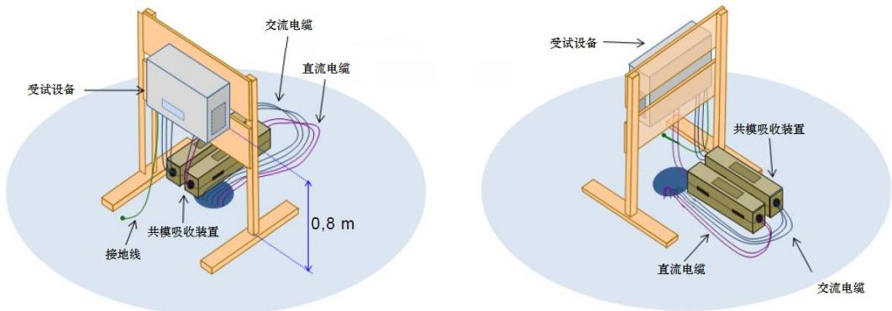  
图23 壁挂式储能变流器辐射骚扰测试布置图

c) 测试前关闭带有主动发射通讯装置，按照典型应用要求配置有线通信/控制功能；

d) 应按照 GB 4824 中规定的方法测试辐射骚扰值；当储能变流器的圆柱体测试区域尺寸直径超过1.2 m或高超过 1.5 m时，应使用 10m及以上测试距离并对测量数据进行归一化处理。测试应至少包含以下典型工况：

正常运行工况下，额定交流电压，最低直流电压

正常运行工况下，额定交流电压，最高直流电压

额定交流电压，无直流输入

## 抗扰度检测

## 13.3.1 静电放电抗扰度

静电放电抗扰度检测应按以下步骤进行：

a) 应按照GB/T 17626.2 中的规定要求并应按照储能变流器典型安装方式要求进行布置，壁挂式储能变流器应使用木质挂架，储能变流器底部对参考地平面垂直高度0.8m，线缆自然下垂；

b) 在储能变流器正常运行工况下采用GB/T 17626.2 规定的方法进行测试。

## 13.3.2 射频电磁场辐射抗扰度

射频电磁场辐射抗扰度检测应按以下步骤进行：

a) 按照GB/T 17626.3中的规定要求并应按照储能变流器典型安装方式要求进行布置，壁挂式储能变流器应使用木质挂架，储能变流器底部对参考地平面垂直高度0.8m，线缆自然下垂；

b) 在储能变流器正常运行工况下采用GB/T 17626.3 规定的方法进行测试并满足下列要求：

 测试频段：80MHz-6000MHz

 调制方式：AM 1kHz 80%

## 13.3.3 电快速瞬变脉冲群抗扰度

电快速瞬变脉冲群抗扰度检测应按以下步骤进行：

a) 按照GB/T 17626.4中的规定要求并应按照储能变流器典型安装方式要求进行布置。壁挂式储能变流器应使用木质挂架，储能变流器底部对参考地平面垂直高度0.1m，线缆自然下垂。

b) 在储能变流器正常运行工况下采用GB/T 17626.4 规定的方法进行测试并满足下列要求：

测试端口：输入输出电源端口、有线网络端口和信号/连接长度大于 3m的控制端口

 重复频率：5kHz 和 100kHz

## 13.3.4 浪涌（冲击）抗扰度

浪涌（冲击）抗扰度检测应按以下步骤进行：

按照GB/T 17626.5中的规定要求并应按照储能变流器典型安装方式要求进行布置，壁挂式储能变流器可垂直或水平放置，线缆自然下垂。

b) 在储能变流器正常运行工况下采用GB/T 17626.5 中规定的方法进行测试并满足下列要求：

测试端口：输入输出电源端口、有线网络端口和信号/连接长度大于 10m 的控制端口

 超出电源网络耐压极限时，可通过端口降压的方式进行测试

## 13.3.5 射频场感应的传导骚扰抗扰度

浪涌（冲击）抗扰度检测应按以下步骤进行：

a) 按照GB/T 17626.6中的规定要求并应按照储能变流器典型安装方式要求进行布置，壁挂式储能变流器应使用木质挂架，储能变流器底部对参考地平面垂直高度0.1m，线缆自然下垂。

b) 在储能变流器正常运行工况下采用 GB/T 17626.6 中规定的方法进行测试并满足下列要求：

测试端口：输入输出电源端口、有线网络端口和信号/连接长度大于 3m控制端口；

 测试频段：0.15MHz\~80MHz；调制方式：AM 1kHz 80%；

 超出电源网络耐压极限时，可采用钳注入或者通过端口降压的方式进行测试。

## 13.3.6 工频磁场抗扰度

工频磁场抗扰度检测应按以下步骤进行：

a) 按照GB/T 17626.8中的规定要求并应按照储能变流器典型安装方式要求进行布置。壁挂式储能变流器应使用木质挂架，线缆自然下垂。

b) 在储能变流器正常运行工况下采用GB/T 17626.8 中规定的方法进行测试。

## 14 标识、包装检测

## 铭牌检查

检查储能变流器的铭牌安装位置是否显著易发现位置，是否包含下列内容：

a) 产品名称、型号、商标或产品代号；

b) 产品主要技术参数：

1) 额定功率（kW）；

2) 直流端口电压工作范围（V）；

3) 交流端口额定电压（V）；

4) 过载能力；

5) 防护等级；

6) 制造依据(标准号)。

c) 出厂编号；

d) 制造日期(批号)；

e) 制造厂名、厂址；

## 标识耐久性

标识耐久性检测应按以下步骤进行：

a) 将棉纱布用水浸润，在不额外施加垂直压力的工况下来回擦拭标识 15秒钟；

b) 将另一块棉纱布用正己烷或异丙醇等有机溶剂浸润，在不额外施加垂直压力的工况下来回擦拭标识 15秒钟；

c) 检查标识是否出现掉色和模糊现象。

## 包装防振

按照GB/T 4857.10 中规定的恒定加速度垂直正弦振动方法，采用0.5倍重力加速度进行测试，测试完成后恢复10分钟后，检查储能变流器包装及本体是否满足以下要求：

a) 包装使用的纸箱的搬运部位、封口和支撑部位不应破损；

b) 包装使用的木箱应无外观断裂或部位缺失；

c) 包装使用的缓冲材料应无不可恢复严重变形或完全断裂脱落或部位损失；

d) 储能变流器应无人眼可见的凹坑、掉漆、划痕、擦伤、丝印脱落等问题；

e) 储能变流器使用的机械固定和连接处零部件不应产生松动、断裂或脱落等问题；

f) 储能变流器的性能不应产生影响。

## 附 录 A

## （规范性）

## 储能变流器硬件在环仿真测试模型校验方法

## A.1 硬件在环仿真测试模型校验

硬件在环仿真测试模型校验应基于硬件在环仿真测试数据与最小功率系统测试数据的开展，步骤以下：

a) 按照图3连接测试系统和储能变流器控制器；

b) 调整实时数字仿真器中各仿真模块参数设置与运行方式，与最小功率系统测试时储能变流器运行方式一致；

c) 按照最小功率系统测试工况开展硬件在环仿真测试，测试项目包括故障穿越、运行适应性，记录测试数据，对比硬件在环仿真测试与最小功率系统测试数据。同一测试工况下，两组储能变流器测试数据的误差应符合表 1的要求。计算误差的物理量应包括基波正序电压、基波正序电流、无功电流、有功功率、无功功率。

表A.1 允许最大偏差值

<table><tr><td>电气参数</td><td> $F_{1max}$ </td><td> $F_{2max}$ </td><td> $F_{3max}$ </td></tr><tr><td>电压, $\Delta U_S/U_n$ </td><td>0.02</td><td>0.05</td><td>0.05</td></tr><tr><td>电流, $\Delta I/I_n$ </td><td>0.05</td><td>0.20</td><td>0.10</td></tr><tr><td>无功电流, $\Delta I_q/I_n$ </td><td>0.05</td><td>0.20</td><td>0.10</td></tr><tr><td>有功功率, $\Delta P/P_n$ </td><td>0.05</td><td>0.20</td><td>0.10</td></tr><tr><td>无功功率, $\Delta Q/P_n$ </td><td>0.05</td><td>0.15</td><td>0.10</td></tr><tr><td colspan="4">注1: $F_{1max}$ —稳态区间平均偏差允许值;注2: $F_{2max}$ —暂态区间平均偏差允许值;注3: $F_{3max}$ —稳态区间最大偏差允许值;注4: $U_n$ —额定电压;注5: $I_n$ —额定电流;注6: $P_n$ —额定功率。</td></tr></table>

## A.2 误差计算方法

数据对比区间包括电网故障发生前2s到故障消除后功率恢复至稳定运行后2s内的稳态区间及暂态区间，区间划分应符合GB32892的要求，误差计算方法以下：

## a) 稳态区间的平均偏差 $F _ { 1 }$

两组测试数据在稳态区间内偏差的算术平均值。

$$
F _ {1} = \left| \frac {1}{\mathrm{K} _ {\mathrm{S} \_ \text {End}} - \mathrm{K} _ {\mathrm{S} \_ \text {Start}} + 1} \sum_ {i = \mathrm{K} _ {\mathrm{S} \_ \text {Start}}} ^ {\mathrm{K} _ {\mathrm{S} \_ \text {End}}} X _ {s} (i) - \frac {1}{\mathrm{K} _ {\mathrm{M} \_ \text {End}} - \mathrm{K} _ {\mathrm{M} \_ \text {Start}} + 1} \sum_ {i = \mathrm{K} _ {\mathrm{M} \_ \text {Start}}} ^ {\mathrm{K} _ {\mathrm{M} \_ \text {End}}} X _ {M} (i) \right|\tag{A.1}
$$

式中：

$F _ { I }$ 稳态区间的平均偏差；

$X _ { S }$ ——待考核电气量的第一组测试数据标幺值；

$X _ { \mathrm { M } }$ ——待考核电气量的第二组测试数据的标幺值；

$\mathrm { K } _ { \mathrm { S \_ S t a r t } } , ~ \mathrm { K } _ { \mathrm { S \_ E n d } }$ ——计算误差区间内第一组测试数据的第一个和最后一个序号；

$\mathrm { K _ { M \_ S t a r t } , ~ K _ { M \_ E n d } }$ ——计算误差区间内第二组测试数据的第一个和最后一个序号。

b) 暂态区间的平均偏差 $F _ { 2 }$

两组测试数据在暂态区间内偏差的算术平均值。

$$
F _ {2} = \left| \frac {1}{\mathrm{K} _ {\mathrm{S} \_ \text {End}} - \mathrm{K} _ {\mathrm{S} \_ \text {Start}} + 1} \sum_ {i = \mathrm{K} _ {\mathrm{S} \_ \text {Start}}} ^ {\mathrm{K} _ {\mathrm{S} \_ \text {End}}} X _ {s} (i) - \frac {1}{\mathrm{K} _ {\mathrm{M} \_ \text {End}} - \mathrm{K} _ {\mathrm{M} \_ \text {Start}} + 1} \sum_ {i = \mathrm{K} _ {\mathrm{M} \_ \text {Start}}} ^ {\mathrm{K} _ {\mathrm{M} \_ \text {End}}} X _ {M} (i) \right|\tag{A.2}
$$

式中：

$F _ { 2 }$ 暂态区间的平均偏差；

$X _ { S }$ ——待考核电气量的第一组测试数据标幺值；

$X _ { \mathrm { M } }$ ——待考核电气量的第二组测试数据的标幺值；

$\mathrm { K } _ { \mathrm { S \_ S t a r t } } , ~ \mathrm { K } _ { \mathrm { S \_ E n d } }$ ——计算误差区间内第一组测试数据的第一个和最后一个序号；

$\mathrm { K _ { M \_ S t a r t } , ~ K _ { M \_ E n d } }$ ——计算误差区间内第二组测试数据的第一个和最后一个序号。

c) 稳态区间的最大偏差 $F _ { 3 }$

两组测试数据在稳态区间的偏差的最大值。

$$
F _ {3} = \max _ {\mathrm{i} = \mathrm{K} _ {\mathrm {M\_ {S} art}} \dots \mathrm{K} _ {\mathrm {M\_ {E} nd}}} \left(\left| X _ {S} (i) - X _ {M} (i) \right|\right)\tag{A.3}
$$

式中：

$F _ { 3 }$ 稳态区间的最大偏差；

$X _ { \mathrm { { S } } }$ ——待考核电气量的第一组测试数据标幺值；

$X _ { \mathrm { M } }$ ——待考核电气量的第二组测试数据的标幺值；

$\mathrm { K } _ { \mathrm { S \_ S t a r t } } , ~ \mathrm { K } _ { \mathrm { S \_ E n d } ^ { - } }$ ——计算误差区间内第一组测试数据的第一个和最后一个序号；

$\mathrm { K _ { M \_ S t a r t } , ~ \ K _ { M \_ E n d } }$ ——计算误差区间内第二组测试数据的第一个和最后一个序号。

## 附 录 B

（规范性）

## 功率设定值控制响应时间及控制偏差判定方法

## B.1 功率设定值控制响应时间判定

图B.1为储能变流器有功功率设定值响应时间判定方法示意图。参照图B.1，可以得出储能变流器有功功率设定值响应时间和控制相关特性参数以下：

有功功率设定值控制响应时间 $t _ { { \mathrm p } , r e s }$

$$
t _ {\mathrm{p}, r e s} = t _ {\mathrm{p}, 1} - t _ {\mathrm{p}, 0}\tag{B.1}
$$

有功功率设定值控制调节时间 $t _ { \mathrm { p } , r e g }$ ：

$$
t _ {\mathrm{p}, r e g} = t _ {\mathrm{p}, 2} - t _ {\mathrm{p}, 0}\tag{B.2}
$$

设定值控制期间有功功率允许运行范围：

$$
\begin{array}{l} P _ {\max} = (1 + 0. 0 5) P _ {2} \\ P _ {\min} = (1 - 0. 0 5) P _ {2} \end{array}\tag{B.3}
$$

有功功率设定值控制超调量：

$$
\sigma = \frac{\left|P_{3} - P_{2}\right|}{P_{2}}\times 100\%\tag{B.4}
$$

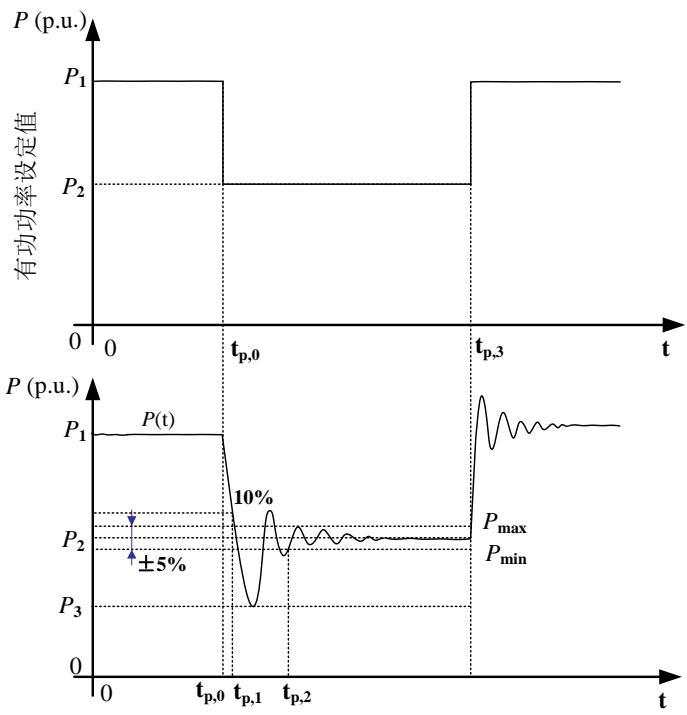  
图 B.1 功率控制响应时间和响应精度判断示意图

说明：

$P _ { 1 }$ ——储能变流器有功功率初始运行值；

$P _ { 2 } { \mathrm { \Delta } }$ ——储能变流器有功功率设定值控制目标值；

$P _ { 3 } \mathrm { \cdot }$ ——控制期间光伏发电站有功功率偏离控制目标的最大值；

$P ( \mathrm { t } )$ ——有功功率设定值运行期间储能变流器有功功率曲线；

$t _ { \mathrm { p } , 0 }$ ——设定值控制开始时刻(前一设定值控制结束时刻)；

$t _ { \mathrm { p , l } }$ ——有功功率变化第一次达到设定阶跃值90%的时刻；

$t _ { \mathrm { p } , 2 }$ ——设定值控制期间储能变流器有功功率持续运行在允许范围内的开始时刻。

注：无功功率设定值控制响应时间也可参照本章内容进行判断。

## B.2 功率设定值控制偏差判定

功率设定值控制偏差可用式B.5进行判定。

$$
\Delta P \% = \frac {\left| P _ {s e t} - P _ {m e s} \right|}{P _ {s e t}} \times 100 \%\tag{B.5}
$$

式中：

$\mathrm { P _ { s e t } } { \cdot }$ ——设定的有功功率值；

$\mathrm { P _ { m e s } }$ ——实际测量每次阶跃后第2个1min有功功率平均值；

$\Delta P \%$ ——功率设定值控制偏差。

附 录 C

（规范性）

惯量及一次调频测试参数判定方法

储能变流器调整参数判定应符合图C.1的要求。

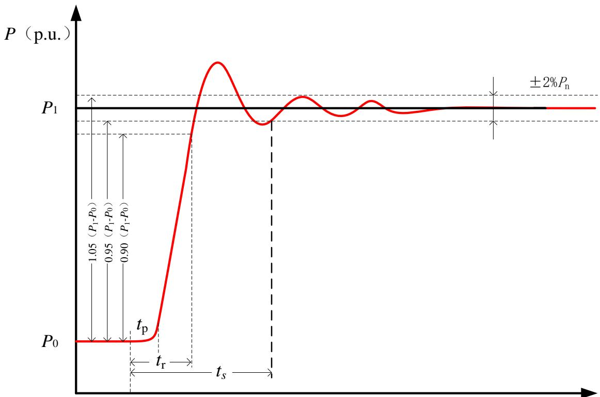

符号：

$P _ { 0 ^ { - } }$ ——有功功率初始值；

$P _ { 1 ^ { - } }$ ——有功功率目标值；

$t _ { 0 ^ { - } }$ ——频率阶跃起始时间；

$t _ { \Gamma }$ ——响应时间；

$t _ { S }$ ——调节时间。

图C.1 惯量及一次调频测试参数判定示意图

附 录 D

（规范性）

# 接触电流测试仪

## D.1 接触电流测试仪结构

接触电流测试仪结构见图D.1。

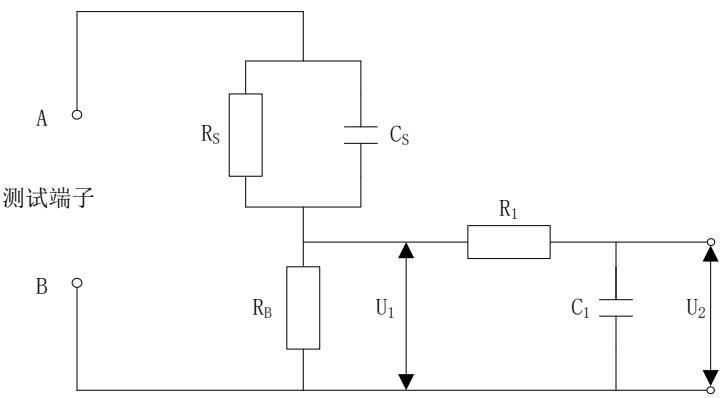

说明：

Rs——1500Ω

RB——500Ω

R1——10KΩ

Cs——0.22μf

C1——0.022μf

电压表或示波器

输入电阻：＞1MΩ

输入电容：＜200ρF

频率范围：15Hz-1MHz

图 D.1 测量仪器