INTERNATIONAL STANDARD

IEC CEI

NORME INTERNATIONALE

60664-1

Deuxième edition Second édition 2007-04

BASIC SAFETY PUBLICATION PUBLICATION FONDAMENTALE DE SÉCURITÉ

Insulation coordination for equipment within low-voltage systems –

Part 1: Principles, requirements and tests

Coordination de l’isolement des matériels dans les systèmes (réseaux) à basse tension –

Partie 1: Principes, exigences et essais

# THIS PUBLICATION IS COPYRIGHT PROTECTED

# Copyright © 2007 IEC, Geneva, Switzerland

All rights reserved. Unless otherwise specified, no part of this publication may be reproduced or utilized in any form or by any means, electronic or mechanical, including photocopying and microfilm, without permission in writing from either IEC or IEC's member National Committee in the country of the requester.

If you have any questions about IEC copyright or have an enquiry about obtaining additional rights to this publication, please contact the address below or your local IEC member National Committee for further information.

Droits de reproduction réservés. Sauf indication contraire, aucune partie de cette publication ne peut être reproduite ni utilisée sous quelque forme que ce soit et par aucun procédé, électronique ou mécanique, y compris la photocopie et les microfilms, sans l'accord écrit de la CEI ou du Comité national de la CEI du pays du demandeur.

Si vous avez des questions sur le copyright de la CEI ou si vous désirez obtenir des droits supplémentaires sur cette publication, utilisez les coordonnées ci-après ou contactez le Comité national de la CEI de votre pays de résidence.

IEC Central Office

3, rue de Varembé

CH-1211 Geneva 20

Switzerland

Email: inmail@iec.ch

Web: www.iec.ch

## About the IEC

The International Electrotechnical Commission (IEC) is the leading global organization that prepares and publishes International Standards for all electrical, electronic and related technologies.

## About IEC publications

The technical content of IEC publications is kept under constant review by the IEC. Please make sure that you have the latest edition, a corrigenda or an amendment might have been published.

ƒ Catalogue of IEC publications: www.iec.ch/searchpub

The IEC on-line Catalogue enables you to search by a variety of criteria (reference number, text, technical committee,…). It also gives information on projects, withdrawn and replaced publications.

ƒ IEC Just Published: www.iec.ch/online\_news/justpub

Stay up to date on all new IEC publications. Just Published details twice a month all new publications released. Available on-line and also by email.

ƒ Customer Service Centre: www.iec.ch/webstore/custserv

If you wish to give us your feedback on this publication or need further assistance, please visit the Customer Service Centre FAQ or contact us:

Email: csc@iec.ch

Tel.: +41 22 919 02 11

Fax: +41 22 919 03 00

## A propos de la CEI

La Commission Electrotechnique Internationale (CEI) est la première organisation mondiale qui élabore et publie des normes internationales pour tout ce qui a trait à l'électricité, à l'électronique et aux technologies apparentées.

## A propos des publications CEI

Le contenu technique des publications de la CEI est constamment revu. Veuillez vous assurer que vous possédez l’édition la plus récente, un corrigendum ou amendement peut avoir été publié.

ƒ Catalogue des publications de la CEI: www.iec.ch/searchpub/cur\_fut-f.htm

Le Catalogue en-ligne de la CEI vous permet d’effectuer des recherches en utilisant différents critères (numéro de référence, texte, comité d’études,…). Il donne aussi des informations sur les projets et les publications retirées ou remplacées.

ƒ Just Published CEI: www.iec.ch/online\_news/justpub

Restez informé sur les nouvelles publications de la CEI. Just Published détaille deux fois par mois les nouvelles publications parues. Disponible en-ligne et aussi par email.

ƒ Service Clients: www.iec.ch/webstore/custserv/custserv\_entry-f.htm

Si vous désirez nous donner des commentaires sur cette publication ou si vous avez des questions, visitez le FAQ du Service clients ou contactez-nous:

Email: csc@iec.ch

Tél.: +41 22 919 02 11

Fax: +41 22 919 03 00

INTERNATIONAL STANDARD

IEC CEI

NORME INTERNATIONALE

60664-1

Deuxième edition Second édition 2007-04

BASIC SAFETY PUBLICATION PUBLICATION FONDAMENTALE DE SÉCURITÉ

Insulation coordination for equipment within low-voltage systems –

Part 1: Principles, requirements and tests

Coordination de l’isolement des matériels dans les systèmes (réseaux) à basse tension –

Partie 1: Principes, exigences et essais

## CONTENTS

1 Scope and object....7
2 Normative references....7
3 Terms and definitions....9
4 Basis for insulation coordination....14
4.1 General....14
4.2 Insulation coordination with regard to voltage....14
4.2.1 General....14
4.2.2 Insulation coordination with regard to long-term a.c. or d.c. voltages....15
4.2.3 Insulation coordination with regard to transient overvoltage....15
4.2.4 Insulation coordination with regard to recurring peak voltage....15
4.2.5 Insulation coordination with regard to temporary overvoltage....15
4.2.6 Insulation coordination with regard to environmental conditions....16
4.3 Voltages and voltage ratings....16
4.3.1 General....16
4.3.2 Determination of voltage for long-term stresses....16
4.3.3 Determination of rated impulse voltage....17
4.3.4 Determination of recurring peak voltage....19
4.3.5 Determination of temporary overvoltage....19
4.4 Frequency....20
4.5 Time under voltage stress....20
4.6 Pollution....20
4.6.1 General....20
4.6.2 Degrees of pollution in the micro-environment....21
4.6.3 Conditions of conductive pollution....21
4.7 Information supplied with the equipment....21
4.8 Insulating material....21
4.8.1 Comparative tracking index (CTI)....21
4.8.2 Electric strength characteristics....22
4.8.3 Thermal characteristics....22
4.8.4 Mechanical and chemical characteristics....22
5 Requirements and dimensioning rules....23
5.1 Dimensioning of clearances....23
5.1.1 General....23
5.1.2 Dimensioning criteria....23
5.1.3 Electric field conditions....24
5.1.4 Altitude....24
5.1.5 Dimensioning of clearances of functional insulation....24
5.1.6 Dimensioning of clearances of basic, supplementary and reinforced insulation....24
5.1.7 Isolating distances....25
5.2 Dimensioning of creepage distances....25
5.2.1 General....25
5.2.2 Influencing factors....25
5.2.3 Dimensioning of creepage distances of functional insulation....27
5.2.4 Dimensioning of creepage distances of basic, supplementary and reinforced insulation....27
5.2.5 Reduction of creepage distances with the use of a rib (ribs)....27

5.3 Requirements for design of solid insulation 28
5.3.1 General 28
5.3.2 Stresses 28
5.3.3 Requirements 30
6 Tests and measurements 32
6.1 Tests 32
6.1.1 General 32
6.1.2 Test for verification of clearances 33
6.1.3 Tests for the verification of solid insulation 36
6.1.4 Performing dielectric tests on complete equipment 41
6.1.5 Other tests 42
6.1.6 Measurement accuracy of test parameters 42
6.2 Measurement of creepage distances and clearances 43
Annex A (informative) Basic data on withstand characteristics of clearances 48
Annex B (informative) Nominal voltages of supply systems for different modes of overvoltage control 53
Annex C (normative) Partial discharge test methods 55
Annex D (informative) Additional information on partial discharge test methods 60
Annex E (informative) Comparison of creepage distances specified in Table F.4 and clearances in Table A.1 63
Annex F (normative) Tables 64
Bibliography 73
Figure 1 – Recurring peak voltage 19
Figure 2 – Determination of the width (W) and height (H) of a rib 28
Figure 3 – Test voltages 40
Figure A.1 – Withstand voltage at 2 000 m above sea level 50
Figure A.2 – Experimental data measured at approximately sea level and their low limits for inhomogeneous field 51
Figure A.3 – Experimental data measured at approximately sea level and their low limits for homogeneous field 52
Figure C.1 – Earthed test specimen 55
Figure C.2 – Unearthed test specimen 55
Figure C.3 – Calibration for earthed test specimen 58
Figure C.4 – Calibration for unearthed test specimen 58
Figure D.1 – Partial discharge test circuits 60

Figure E.1 – Comparison of creepage distances specified in Table F.4 and clearances in Table A.1 ....63
Table A.1 – Withstand voltages in kilovolts for an altitude of 2 000 m above sea level ....48
Table A.2 – Altitude correction factors ....49
Table B.1 – Inherent control or equivalent protective control....53
Table B.2 – Cases where protective control is necessary and control is provided by surge arresters having a ratio of clamping voltage to rated voltage not smaller than that specified by IEC 60099-1 ....54
Table F.1 – Rated impulse voltage for equipment energized directly from the low-voltage mains ....64
Table F.2 – Clearances to withstand transient overvoltages....65
Table F.3a – Single-phase three or two-wire a.c. or d.c. systems....66
Table F.3b – Three-phase four or three-wire a.c. systems....67
Table F.4 – Creepage distances to avoid failure due to tracking ....68
Table F.5 – Test voltages for verifying clearances at different altitudes....70
Table F.6 – Severities for conditioning of solid insulation....70
Table F.7 – Clearances to withstand steady-state voltages, temporary overvoltages or recurring peak voltages....71
Table F.7a – Dimensioning of clearances to withstand steady-state voltages, temporary overvoltages or recurring peak voltages....71
Table F.7b – Additional information concerning the dimensioning of clearances to avoid partial discharge....71
Table F.8 – Altitude correction factors....72

# INSULATION COORDINATION FOR EQUIPMENT WITHIN LOW-VOLTAGE SYSTEMS –

Part 1: Principles, requirements and tests

## FOREWORD

1) The International Electrotechnical Commission (IEC) is a worldwide organization for standardization comprising all national electrotechnical committees (IEC National Committees). The object of IEC is to promote international co-operation on all questions concerning standardization in the electrical and electronic fields. To this end and in addition to other activities, IEC publishes International Standards, Technical Specifications, Technical Reports, Publicly Available Specifications (PAS) and Guides (hereafter referred to as “IEC Publication(s)”). Their preparation is entrusted to technical committees; any IEC National Committee interested in the subject dealt with may participate in this preparatory work. International, governmental and nongovernmental organizations liaising with the IEC also participate in this preparation. IEC collaborates closely with the International Organization for Standardization (ISO) in accordance with conditions determined by agreement between the two organizations

2) The formal decisions or agreements of IEC on technical matters express, as nearly as possible, an international consensus of opinion on the relevant subjects since each technical committee has representation from all interested IEC National Committees.

3) IEC Publications have the form of recommendations for international use and are accepted by IEC National Committees in that sense. While all reasonable efforts are made to ensure that the technical content of IEC Publications is accurate, IEC cannot be held responsible for the way in which they are used or for any misinterpretation by any end user.

4) In order to promote international uniformity, IEC National Committees undertake to apply IEC Publications transparently to the maximum extent possible in their national and regional publications. Any divergence between any IEC Publication and the corresponding national or regional publication shall be clearly indicated in the latter.

5) IEC provides no marking procedure to indicate its approval and cannot be rendered responsible for any equipment declared to be in conformity with an IEC Publication.

6) All users should ensure that they have the latest edition of this publication.

7) No liability shall attach to IEC or its directors, employees, servants or agents including individual experts and members of its technical committees and IEC National Committees for any personal injury, property damage or other damage of any nature whatsoever, whether direct or indirect, or for costs (including legal fees) and expenses arising out of the publication, use of, or reliance upon, this IEC Publication or any other IEC Publications.

8) Attention is drawn to the Normative references cited in this publication. Use of the referenced publications is indispensable for the correct application of this publication.

9) Attention is drawn to the possibility that some of the elements of this IEC Publication may be the subject of patent rights. IEC shall not be held responsible for identifying any or all such patent rights.

International Standard IEC 60664 has been prepared by technical committee 109: Insulation coordination for low-voltage equipment.

This second edition cancels and replaces the first edition, published in 1992, amendments 1 (2000) and 2 (2002) and a corrigendum (2002).

It has the status of a basic safety publication in accordance with IEC Guide 104.

In addition to a number of editorial improvements, the following main changes have been made with respect to the previous edition:

Amendment of Japanese mains conditions with regard to the rated impulse voltages, the rationalized voltages and the nominal voltages of supply systems for different modes of overvoltage control

• Amendment of dimensioning of clearances smaller than 0,01 mm • Alignment of the table and the corresponding formula regarding test voltages for verifying clearances at different altitudes

• Amendment of interpolation of the creepage distance values for functional insulation

• Amendment of creepage distance dimensioning taking into account ribs

Revision of the former Clause 4 "Tests and measurements" (now Clause 6) to achieve a more detailed description of the tests and their purpose, the test equipment and possible alternatives

Change of Annex C "Partial discharge test methods" from a former technical report, Type 2 (now called TS), to a normative Annex C.

The text of this standard is based on the following documents:

<table><tr><td>CDV</td><td>Report on voting</td></tr><tr><td>109/58/CDV</td><td>109/62/RVC</td></tr></table>

Full information on the voting for the approval of this standard can be found in the report on voting indicated in the above table.

This publication has been drafted in accordance with the ISO/IEC Directives, Part 2.

A list of all parts in the IEC 60664 series, under the general title Insulation coordination for equipment within low-voltage systems, can be found on the IEC website.

The committee has decided that the contents of this publication will remain unchanged until the maintenance result date indicated on the IEC web site under "http://webstore.iec.ch" in the data related to the specific publication. At this date, the publication will be

• reconfirmed;

• withdrawn;

• replaced by a revised edition, or

• amended.

# INSULATION COORDINATION FOR EQUIPMENT WITHIN LOW-VOLTAGE SYSTEMS –

# Part 1: Principles, requirements and tests

## 1 Scope and object

This part of IEC 60664 deals with insulation coordination for equipment within low-voltage systems. It applies to equipment for use up to 2 000 m above sea level having a rated voltage up to a.c. 1 000 V with rated frequencies up to 30 kHz, or a rated voltage up to d.c. 1 500 V.

It specifies the requirements for clearances, creepage distances and solid insulation for equipment based upon their performance criteria. It includes methods of electric testing with respect to insulation coordination.

The minimum clearances specified in this standard do not apply where ionized gases occur. Special requirements for such situations may be specified at the discretion of the relevant technical committee.

This standard does not deal with distances

– through liquid insulation,

– through gases other than air,

– through compressed air.

NOTE 1 Insulation coordination for equipment within low-voltage systems with rated frequencies above 30 kHz is given in IEC 60664-4.

NOTE 2 Higher voltages may exist in internal circuits of the equipment.

NOTE 3 Guidance for dimensioning for altitudes exceeding 2 000 m is given in Table A.2.

The object of this basic safety standard is to guide technical committees responsible for different equipment in order to rationalize their requirements so that insulation coordination is achieved.

It provides the information necessary to give guidance to technical committees when specifying clearances in air, creepage distances and solid insulation for equipment.

Care should be taken to see that manufacturers and technical committees are responsible for application of the requirements, as specified in this basic safety publication, or make reference to it, where necessary, in standards for equipment within their scope.

In the case of missing specified values for clearances, creepage distances and requirements for solid insulation in the relevant product standards, or even missing standards, this standard is applicable.

## 2 Normative references

The following referenced documents are indispensable for the application of this document. For dated references, only the edition cited applies. For undated references, the latest edition of the referenced document (including any amendments) applies.

IEC 60050(151):2001, International Electrotechnical Vocabulary (IEV) – Chapter 151: Electrical and magnetic devices

IEC 60050(212):1990, International Electrotechnical Vocabulary – Chapter 212: Insulating solids, liquids and gases

IEC 60050(604):1987, International Electrotechnical Vocabulary (IEV) – Chapter 604: Generation, transmission and distribution of electricity – Operation Amendment 1 (1998)

IEC 60050(826):2004, International Electrotechnical Vocabulary (IEV) – Part 826: Electrical installations

IEC 60068-1:1988, Environmental testing – Part 1: General and guidance

IEC 60068-2-2:1974, Environmental testing – Part 2: Tests – Tests B: Dry heat

IEC 60068-2-14:1984, Environmental testing – Part 2: Tests – Test N: Change of temperature

IEC 60068-2-78:2001, Environmental testing – Part 2-78: Tests – Test Cab: Damp heat, steady state

IEC 60085:2004, Electrical insulation – Thermal classification

IEC 60099-1:1991, Surge arresters – Part 1: Non-linear resistor type gapped surge arresters for a.c. systems

IEC 60112:2003, Method for the determination of the proof and the comparative tracking indices of solid insulating materials

IEC 60216, (all parts) Electrical insulating materials – Properties for thermal endurance

IEC 60243-1:1998, Electrical strength of insulating materials – Test methods – Part 1: Tests at power frequencies

IEC 60270:2000, High-voltage test techniques – Partial discharge measurements

IEC 60364-4-44:2001, Electrical installations of buildings – Part 4-44: Protection for safety – Protection against voltage disturbances and electromagnetic disturbances Amendment 1 (2003)

IEC 60664-4:2005, Insulation coordination for equipment within low-voltage systems – Part 4: Consideration of high-frequency voltage stress

IEC 60664-5, Insulation coordination for equipment within low-voltage systems – Part 5: A comprehensive method for determining clearances and creepage distances equal to or less than 2 mm 1

IEC 61140:2001, Protection against electric shock – Common aspects for installation and equipment Amendment 1 (2004)

IEC 61180-1:1992, High-voltage test techniques for low-voltage equipment – Part 1: Definitions, test and procedure requirements

IEC 61180-2:1994, High-voltage test techniques for low-voltage equipment – Part 2: Test equipment

IEC Guide 104:1997, The preparation of safety publications and the use of basic safety publications and group safety publications

## 3 Terms and definitions

For the purposes of this document, the following definitions apply.

## 3.1

## insulation coordination

mutual correlation of insulation characteristics of electrical equipment taking into account the expected micro-environment and other influencing stresses

NOTE Expected voltage stresses are characterized in terms of the characteristics defined in 3.5 to 3.7.

## 3.2

clearance

shortest distance in air between two conductive parts

## 3.3

## creepage distance

shortest distance along the surface of a solid insulating material between two conductive parts

(IEV 151-15-50)

## 3.4

## solid insulation

solid insulating material interposed between two conductive parts

## 3.5

## working voltage

highest r.m.s. value of the a.c. or d.c. voltage across any particular insulation which can occur when the equipment is supplied at rated voltage

NOTE 1 Transients are disregarded.

NOTE 2 Both open-circuit conditions and normal operating conditions are taken into account.

## 3.6

## recurring peak voltage

## Urp

maximum peak value of periodic excursions of the voltage waveform resulting from distortions of an a.c. voltage or from a.c. components superimposed on a d.c. voltage

NOTE Random overvoltages, for example due to occasional switching, are not considered to be recurring peak voltages.

## 3.7

## overvoltage

any voltage having a peak value exceeding the corresponding peak value of maximum steady-state voltage at normal operating conditions

## 3.7.1

## temporary overvoltage

overvoltage at power frequency of relatively long duration

## 3.7.2

## transient overvoltage

short duration overvoltage of a few milliseconds or less, oscillatory or non-oscillatory, usually highly damped

(IEV 604-03-13)

## 3.7.3

## switching overvoltage

transient overvoltage at any point of the system due to specific switching operation or fault

## 3.7.4

## lightning overvoltage

transient overvoltage at any point of the system due to a specific lightning discharge

## 3.7.5

## functional overvoltage

deliberately imposed overvoltage necessary for the function of a device

## 3.8

## withstand voltage

voltage to be applied to a specimen under prescribed test conditions which does not cause breakdown and/or flashover of a satisfactory specimen

(IEV 212-01-31)

## 3.8.1

## impulse withstand voltage

highest peak value of impulse voltage of prescribed form and polarity which does not cause breakdown of insulation under specified conditions

## 3.8.2

## r.m.s. withstand voltage

highest r.m.s. value of a voltage which does not cause breakdown of insulation under specified conditions

## 3.8.3

## recurring peak withstand voltage

highest peak value of a recurring voltage which does not cause breakdown of insulation under specified conditions

## 3.8.4

## temporary withstand overvoltage

highest r.m.s. value of a temporary overvoltage which does not cause breakdown of insulation under specified conditions

## 3.9

## rated voltage

value of voltage assigned by the manufacturer, to a component, device or equipment and to which operation and performance characteristics are referred

NOTE Equipment may have more than one rated voltage value or may have a rated voltage range.

## 3.9.1

## rated insulation voltage

r.m.s. withstand voltage value assigned by the manufacturer to the equipment or to a part of it, characterizing the specified (long-term) withstand capability of its insulation

NOTE The rated insulation voltage is not necessarily equal to the rated voltage of equipment which is primarily

related to functional performance.

## 3.9.2

## rated impulse voltage

impulse withstand voltage value assigned by the manufacturer to the equipment or to a part of it, characterizing the specified withstand capability of its insulation against transient overvoltages

## 3.9.3

## rated recurring peak voltage

recurring peak withstand voltage value assigned by the manufacturer to the equipment or to a part of it, characterizing the specified withstand capability of its insulation against recurring peak voltages

## 3.9.4

## rated temporary overvoltage

temporary withstand overvoltage value assigned by the manufacturer to the equipment, or to a part of it, characterizing the specified short-term withstand capability of its insulation against a.c. voltages

## 3.10

## overvoltage category

numeral defining a transient overvoltage condition

NOTE 1 Overvoltage categories I, II, III and IV are used, see 4.3.3.2.

NOTE 2 The term ‘overvoltage category’ in this standard is synonymous with ‘impulse withstand category’ used in IEC 60364-4-44, Clause 443.

## 3.11

## pollution

any addition of foreign matter, solid, liquid, or gaseous that can result in a reduction of electric strength or surface resistivity of the insulation

## 3.12

## environment

surrounding which may affect performance of a device or system

NOTE Examples are pressure, temperature, humidity, pollution, radiation and vibration.

(IEV 151-16-03, modified)

## 3.12.1

## macro-environment

environment of the room or other location in which the equipment is installed or used

## 3.12.2

## micro-environment

immediate environment of the insulation which particularly influences the dimensioning of the creepage distances

## 3.13

## pollution degree

numeral characterizing the expected pollution of the micro-environment

NOTE Pollution degrees 1, 2, 3 and 4 are established in 4.6.2.

## 3.14

## homogeneous field

electric field which has an essentially constant voltage gradient between electrodes (uniform field), such as that between two spheres where the radius of each sphere is greater than the distance between them

NOTE The homogeneous field condition is referred to as case B.

## 3.15

## inhomogeneous field

electric field which does not have an essentially constant voltage gradient between electrodes (non-uniform field)

NOTE The inhomogeneous field condition of a point-plane electrode configuration is the worst case with regard to voltage withstand capability and is referred to as case A. It is represented by a point electrode having a 30 μm radius and a plane of 1 m × 1 m.

## 3.16

## controlled overvoltage condition

condition within an electrical system wherein the expected transient overvoltages are limited to a defined level

## 3.17

## insulation

that part of an electrotechnical product which separates the conducting parts at different electrical potentials

(IEV 212-01-05)

## 3.17.1

## functional insulation

insulation between conductive parts which is necessary only for the proper functioning of the equipment

## 3.17.2

## basic insulation

insulation of hazardous-live-parts which provides basic protection

NOTE The concept does not apply to insulation used exclusively for functional purposes. (IEV 826-12-14)

## 3.17.3

supplementary insulation independent insulation applied in addition to basic insulation for fault protection

(IEV 826-12-15)

## 3.17.4

double insulation insulation comprising both basic insulation and supplementary insulation

(IEV 826-12-16)

## 3.17.5

## reinforced insulation

insulation of hazardous-live-parts which provides a degree of protection against electric shock equivalent to double insulation

NOTE Reinforced insulation may comprise several layers which cannot be tested singly as basic insulation or supplementary insulation.

(IEV 826-12-17)

## 3.18

partial discharge PD electric discharge that partially bridges the insulation

## 3.18.1

## apparent charge

## q

electric charge which can be measured at the terminals of the specimen under test

NOTE 1 The apparent charge is smaller than the partial discharge.

NOTE 2 The measurement of the apparent charge requires a short-circuit condition at the terminals of the specimen (see Clause D.2) under test.

## 3.18.2

## specified discharge magnitude

magnitude of the apparent charge which is regarded as the limiting value according to the objective of this standard

NOTE The pulse with the maximum amplitude should be evaluated.

## 3.18.3

## pulse repetition rate

average number of pulses per second with an apparent charge higher than the detection level

NOTE Within the scope of this standard it is not permitted to weigh discharge magnitudes according to the pulse repetition rate.

## 3.18.4

## partial discharge inception voltage

## Ui

lowest peak value of the test voltage at which the apparent charge becomes greater than the specified discharge magnitude when the test voltage is increased above a low value for which no discharge occurs

NOTE For a.c. tests the r.m.s. value may be used.

## 3.18.5

## partial discharge extinction voltage

## Ue

lowest peak value of the test voltage at which the apparent charge becomes less than the specified discharge magnitude when the test voltage is reduced below a high level where such discharges have occurred

NOTE For a.c. tests the r.m.s. value may be used.

## 3.18.6

## partial discharge test voltage

## Ut

peak value of the test voltage for the procedure of 6.1.3.5.3 where the apparent charge is less than the specified discharge magnitude

NOTE For a.c. tests the r.m.s. value may be used.

## 3.19

## test

technical operation that consists of the determination of one or more characteristics of a given product, process or service according to a specified procedure

(13.1 of ISO/IEC Guide 2:1996) [1]2

NOTE A test is carried out to measure or classify a characteristic or a property of an item by applying to the item a set of environmental and operating conditions and/or requirements.

(IEV 151-16-13)

## 3.19.1

## type test

test of one or more devices made to a certain design to show that the design meets certain specifications

## 3.19.2

## routine test

test to which each individual device is subjected during or after manufacture to ascertain whether it complies with certain criteria

## 3.19.3

## sampling test

test on a number of devices taken at random from a batch

## 3.20

## electrical breakdown

failure of insulation under electric stress when the discharge completely bridges the insulation, thus reducing the voltage between the electrodes almost to zero

## 3.20.1

## sparkover

electrical breakdown in a gaseous or liquid medium

## 3.20.2

## flashover

electrical breakdown along a surface of solid insulation located in a gaseous or liquid medium

## 3.20.3

electrical breakdown through solid insulation

## 4 Basis for insulation coordination

## 4.1 General

Insulation coordination implies the selection of the electric insulation characteristics of the equipment with regard to its application and in relation to its surroundings.

Insulation coordination can only be achieved if the design of the equipment is based on the stresses to which it is likely to be subjected during its anticipated lifetime.

## 4.2 Insulation coordination with regard to voltage

## 4.2.1 General

Consideration shall be given to

– the voltages which can appear within the system,

the voltages generated by the equipment (which could adversely affect other equipment in the system),

– the degree of continuity of service desired,

the safety of persons and property, so that the probability of undesired incidents due to voltage stresses does not lead to an unacceptable risk of harm.

## 4.2.2 Insulation coordination with regard to long-term a.c. or d.c. voltages

Insulation coordination with regard to long-term voltages is based on

– rated voltage,

– rated insulation voltage,

– working voltage.

## 4.2.3 Insulation coordination with regard to transient overvoltage

Insulation coordination with regard to transient overvoltage is based on controlled overvoltage conditions. There are two kinds of control:

inherent control: the condition within an electrical system wherein the characteristics of the system can be expected to limit the prospective transient overvoltages to a defined level;

protective control: the condition within an electrical system wherein specific overvoltage attenuating means can be expected to limit the prospective transient overvoltages to a defined level.

NOTE 1 Overvoltages in large and complex systems, such as low-voltage mains subjected to multiple and variable influences, can only be assessed on a statistical basis. This is particularly true for overvoltages of atmospheric origin and applies whether the controlled condition is achieved as a consequence of inherent control or by means of protective control.

NOTE 2 A probabilistic analysis is recommended to assess whether inherent control exists or whether protective control is needed. This analysis requires knowledge of the electrical system characteristics, the keraunic levels, transient overvoltage levels, etc. This approach has been used in IEC 60364-4-44 for electrical installations of buildings connected to low-voltage mains.

NOTE 3 The specific overvoltage attenuating means may be a device having means for storage or dissipation of energy and, under defined conditions, capable of harmlessly dissipating the energy of the overvoltages expected at the location.

In order to apply the concept of insulation coordination, distinction is made between transient overvoltages from two different sources:

transient overvoltages originating in the system to which the equipment is connected through its terminals;

– transient overvoltages originating in the equipment.

Insulation coordination uses a preferred series of values of rated impulse voltage:

330 V, 500 V, 800 V, 1 500 V, 2 500 V, 4 000 V, 6 000 V, 8 000 V, 12 000 V.

## 4.2.4 Insulation coordination with regard to recurring peak voltage

Consideration shall be given to the extent that partial discharges can occur in solid insulation (see 5.3.2.3.1) or along surfaces of insulation (see Table F.7b).

## 4.2.5 Insulation coordination with regard to temporary overvoltage

Insulation coordination with regard to temporary overvoltages is based on the temporary overvoltage specified in Clause 442 of IEC 60364-4-44 (see 5.3.3.2.3 of this standard).

NOTE Currently available surge protective devices (SPDs) are not able to adequately deal with the energy associated with temporary overvoltages.

## 4.2.6 Insulation coordination with regard to environmental conditions

The micro-environmental conditions for the insulation shall be taken into account as quantified by pollution degree.

Micro-environmental conditions depend primarily on the macro-environmental conditions in which the equipment is located and in many cases the environments are identical. However, the micro-environment can be better or worse than the macro-environment where, for example, enclosures, heating, ventilation or dust influence the micro-environment.

NOTE Protection by enclosures provided according to the classes specified in IEC 60529 [2] does not necessarily improve the micro-environment with regard to pollution.

The most important environmental parameters are as follows:

– for clearances:

• air pressure,

• temperature, if it has a wide variation;

– for creepage distances:

• pollution,

• relative humidity,

• condensation;

– for solid insulation:

• temperature,

• relative humidity.

## 4.3 Voltages and voltage ratings

## 4.3.1 General

For the purpose of dimensioning equipment in accordance with insulation coordination, technical committees shall specify:

– the basis for voltage ratings;

an overvoltage category according to the expected use of the equipment, taking into account the characteristics of the system to which it is intended to be connected.

## 4.3.2 Determination of voltage for long-term stresses

## 4.3.2.1 General

It is assumed that the rated voltage of equipment is not lower than the nominal voltage of the supply system.

## 4.3.2.2 Voltage for dimensioning basic insulation

## 4.3.2.2.1 Equipment energized directly from the low-voltage mains

The nominal voltages of the low-voltage mains have been rationalized according to Tables F.3a and F.3b (see 5.2.2.2) and these voltages are the minimum to be used for the selection of creepage distances. They may also be used for the selection of rated insulation voltages.

For equipment having several rated voltages so that it may be used at different nominal voltages of the low-voltage mains, the voltage selected shall be appropriate for the highest rated voltage of the equipment.

Technical committees shall consider whether the voltage is to be selected

– based on line-to-line voltage, or

– based on line-to-neutral voltage.

In the latter case the technical committee shall specify how the user is to be informed that the equipment is for use on neutral-earthed systems only.

## 4.3.2.2.2 Systems, equipment and internal circuits not energized directly from the low-voltage mains

The highest r.m.s. voltage which can occur in the system, equipment or internal circuits shall be used for basic insulation. The voltage is determined for supply at rated voltage and under the most onerous combination of other conditions within the rating of the equipment.

NOTE Fault conditions are not taken into account.

## 4.3.2.3 Voltage for dimensioning functional insulation

The working voltage is used for determining the dimensions required for functional insulation.

## 4.3.3 Determination of rated impulse voltage

## 4.3.3.1 General

The transient overvoltages are taken as the basis for determining the rated impulse voltage.

## 4.3.3.2 Overvoltage categories

## 4.3.3.2.1 General

The concept of overvoltage categories is used for equipment energized directly from the lowvoltage mains.

The overvoltage categories have a probabilistic implication rather than the meaning of physical attenuation of the transient overvoltage downstream in the installation.

NOTE 1 This concept of overvoltage categories is used in Clause 443 of IEC 60364-4-44.

NOTE 2 The term ‘overvoltage category’ in this standard is synonimous with ‘impulse withstand category’ used in Clause 443 of IEC 60364-4-44.

A similar concept can also be used for equipment connected to other systems, for example telecommunication and data systems.

## 4.3.3.2.2 Equipment energized directly from the supply mains

Technical committees shall specify the overvoltage category as based on the following general explanation of overvoltage categories (see also Clause 443 of IEC 60364-4-44):

– Equipment of overvoltage category IV is for use at the origin of the installation.

NOTE 1 Examples of such equipment are electricity meters and primary overcurrent protection equipment.

Equipment of overvoltage category III is equipment in fixed installations and for cases where the reliability and the availability of the equipment is subject to special requirements.

NOTE 2 Examples of such equipment are switches in the fixed installation and equipment for industrial use with permanent connection to the fixed installation

Equipment of overvoltage category II is energy-consuming equipment to be supplied from the fixed installation.

NOTE 3 Examples of such equipment are appliances, portable tools and other household and similar loads.

If such equipment is subjected to special requirements with regard to reliability and availability, overvoltage category III applies.

Equipment of overvoltage category I is equipment for connection to circuits in which measures are taken to limit transient overvoltages to an appropriately low level.

These measures shall ensure that the temporary overvoltages that could occur are sufficiently limited so that their peak value does not exceed the relevant rated impulse voltage of Table F.1.

NOTE 4 Examples of such equipment are those containing electronic circuits protected to this level, however see the note in 4.2.5.

NOTE 5 Unless the circuits are designed to take the temporary overvoltages into account, equipment of overvoltage category 1 cannot be directly connected to the supply mains.

## 4.3.3.2.3 Systems and equipment not energized directly from the low-voltage mains

It is recommended that technical committees specify overvoltage categories or rated impulse voltages as appropriate. Application of the preferred series of 4.2.3 is recommended.

NOTE Telecommunication or industrial control systems or independent systems on vehicles are examples of such systems.

## 4.3.3.3 Selection of rated impulse voltage for equipment

The rated impulse voltage of the equipment shall be selected from Table F.1 corresponding to the overvoltage category specified and to the rated voltage of the equipment.

NOTE 1 Equipment with a particular rated impulse voltage and having more than one rated voltage may be suitable for use in different overvoltage categories.

NOTE 2 For consideration of the switching overvoltage aspect, see 4.3.3.5.

## 4.3.3.4 Impulse voltage insulation coordination within equipment

4.3.3.4.1 Parts or circuits within equipment significantly influenced by external transient overvoltages

The rated impulse voltage of the equipment applies. Transient overvoltages which can be generated by the operation of the equipment shall not influence external circuit conditions beyond that specified in 4.3.3.5.

## 4.3.3.4.2 Parts or circuits within equipment specifically protected against transient overvoltages

For such parts that are not significantly influenced by external transient overvoltages, the impulse withstand voltage required for basic insulation is not related to the rated impulse voltage of the equipment but to the actual conditions for that part or circuit. Application of the preferred series of impulse voltage values as introduced in 4.2.3 is, however, recommended to permit standardization. In other cases, interpolation of Table F.2 values is allowed.

## 4.3.3.5 Switching overvoltage generated by the equipment

For equipment capable of generating an overvoltage at the equipment terminals, for example switching devices, the rated impulse voltage implies that the equipment shall not generate overvoltage in excess of this value when used in accordance with the relevant standard and instructions of the manufacturer.

If a switching device with a particular rated impulse voltage or overvoltage category does not generate overvoltages higher than those of a lower overvoltage category, it has two rated impulse voltages or two overvoltage categories: the higher one referring to its impulse withstand voltage, the lower one referring to the generated overvoltage.

NOTE 2 A given value of rated impulse voltage implies that overvoltages up to that magnitude may become effective in the system and that, as a consequence, the equipment may be unsuitable for use in lower overvoltage categories or require suppression means suitable for the lower category.

## 4.3.3.6 Interface requirements

Equipment may be used under the conditions of a higher overvoltage category where appropriate overvoltage reduction is provided. Appropriate overvoltage attenuation can be achieved by

– an overvoltage protective device,

– a transformer with isolated windings,

– a distribution system with a multiplicity of branch circuits (capable of diverting energy of surges),

– a capacitance capable of absorbing energy of surges,

– a resistance or similar damping device capable of dissipating the energy of surges.

NOTE Attention is drawn to the fact that any overvoltage protective device within the installation or within equipment may have to dissipate more energy than any overvoltage protective device at the origin of the installation having a higher clamping voltage. This applies particularly to the overvoltage protective device with the lowest clamping voltage.

## 4.3.4 Determination of recurring peak voltage

The waveshape of the voltage is measured by an oscilloscope of sufficient bandwidth, from which the peak amplitude is determined according to Figure 1.

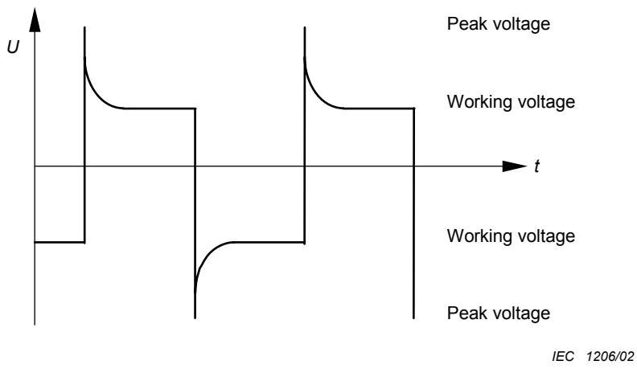  
Figure 1 – Recurring peak voltage

## 4.3.5 Determination of temporary overvoltage

## 4.3.5.1 General

Situations related to the most onerous temporary overvoltages due to faults in the supply system are considered in IEC 60364-4-44.

NOTE IEC 60364-4-44 deals with the safety of persons and equipment in a low-voltage system in the event of a fault between the high-voltage system and earth of transformers that supply low-voltage systems.

## 4.3.5.2 Fault voltage

The magnitude and the duration of the fault voltage or the touch voltage due to an earth fault in the high-voltage system are shown in Figure 44A of IEC 60364-4-44.

## 4.3.5.3 Stress due to temporary overvoltages

The magnitude and duration of a temporary overvoltage in low-voltage equipment due to an earth fault in the high-voltage system are given in 5.3.3.2.3.

## 4.4 Frequency

This standard applies for frequencies up to 30 kHz.

NOTE Dimensioning for frequencies above 30 kHz is specified in IEC 60664-4.

## 4.5 Time under voltage stress

With regard to creepage distances, the time under voltage stress influences the number of occasions when drying out can result in surface scintillations with energy high enough to entail tracking. The number of such occasions is considered to be sufficiently large to cause tracking

in equipment intended for continuous use but not generating sufficient heat to keep the surface of the insulation dry,

in equipment subjected to condensation for extended periods during which it is frequently switched on and off,

on the input side of a switching device, and between its line and load terminals, that is connected directly to the supply mains.

The creepage distances shown in Table F.4 have been determined for insulation intended to be under voltage stress during a long period of time.

NOTE Technical committees responsible for equipment in which insulation is under voltage stress for only a short time may consider allowing reduced creepage distances for functional insulation, for example of one voltage step lower than specified in Table F.4.

## 4.6 Pollution

## 4.6.1 General

The micro-environment determines the effect of pollution on the insulation. The macroenvironment, however, has to be taken into account when considering the micro-environment.

Means may be provided to reduce pollution at the insulation under consideration by effective use of enclosures, encapsulation or hermetic sealing. Such means to reduce pollution may not be effective when the equipment is subject to condensation or if, in normal operation, it generates pollutants itself.

Small clearances can be bridged completely by solid particles, dust and water and therefore minimum clearances are specified where pollution may be present in the micro-environment.

NOTE 1 Pollution will become conductive in the presence of humidity. Pollution caused by contaminated water, soot, metal or carbon dust is inherently conductive.

NOTE 2 Conductive pollution by ionized gases and metallic depositions occurs only in specific instances, for example in arc chambers of switchgear or controlgear, and is not covered by this part of IEC 60664.

## 4.6.2 Degrees of pollution in the micro-environment

For the purpose of evaluating creepage distances and clearances, the following four degrees of pollution in the micro-environment are established:

– Pollution degree 1

No pollution or only dry, non-conductive pollution occurs. The pollution has no influence.

– Pollution degree 2

Only non-conductive pollution occurs except that occasionally a temporary conductivity caused by condensation is to be expected.

– Pollution degree 3

Conductive pollution occurs or dry non-conductive pollution occurs which becomes conductive due to condensation which is to be expected.

– Pollution degree 4

Continuous conductivity occurs due to conductive dust, rain or other wet conditions.

## 4.6.3 Conditions of conductive pollution

The dimensions for creepage distance cannot be specified where permanently conductive pollution is present (pollution degree 4). For temporarily conductive pollution (pollution degree 3), the surface of the insulation may be designed to avoid a continuous path of conductive pollution, e.g. by means of ribs and grooves (see 5.2.2.5 and 5.2.5).

## 4.7 Information supplied with the equipment

Technical committees shall specify the relevant information to be supplied with the equipment and the way this is to be provided.

## 4.8 Insulating material

## 4.8.1 Comparative tracking index (CTI)

## 4.8.1.1 Behaviour of insulating material in the presence of scintillations

With regard to tracking, an insulating material can be roughly characterized according to the damage it suffers from the concentrated release of energy during scintillations when a surface leakage current is interrupted due to the drying-out of the contaminated surface. The following behaviour of an insulating material in the presence of scintillations can occur:

– no decomposition of the insulating material;

the wearing away of insulating material by the action of electrical discharges (electrical erosion);

the progressive formation of conductive paths which are produced on the surface of insulating material due to the combined effects of electric stress and electrolytically conductive contamination on the surface (tracking).

NOTE Tracking or erosion will occur when

– a liquid film carrying the surface leakage current breaks, and

– the applied voltage is sufficient to break down the small gap formed when the film breaks, and

一 the current is above a limiting value which is necessary to provide sufficient energy locally to thermally decompose the insulating material beneath the film.

Deterioration increases with the time for which the current flows.

## 4.8.1.2 CTI values to categorize insulating materials

A method of classification for insulating materials according to 4.8.1.1 does not exist. The behaviour of the insulating material under various contaminants and voltages is extremely complex. Under these conditions, many materials may exhibit two or even all three of the characteristics stated. A direct correlation with the material groups of 4.8.1.3 is not practical. However, it has been found by experience and tests that insulating materials having a higher relative performance also have approximately the same relative ranking according to the comparative tracking index (CTI). Therefore, this standard uses the CTI values to categorize insulating materials.

## 4.8.1.3 Material groups

For the purposes of this standard, materials are classified into four groups according to their CTI values. These values are determined in accordance with IEC 60112 using solution A. The groups are as follows:

– material group I: 600 ≤ CTI;

material group II: 400 ≤ CTI < 600;

– material group IIIa: 175 ≤ CTI < 400;

– material group IIIb: 100 ≤ CTI < 175.

The proof tracking index (PTI) is used to verify the tracking characteristics of materials. A material may be included in one of these four groups on the basis that the PTI, verified by the method of IEC 60112 using solution A, is not less than the lower value specified for the group.

## 4.8.1.4 Test for comparative tracking index (CTI)

The test for comparative tracking index (CTI) in accordance with IEC 60112 is designed to compare the performance of various insulating materials under test conditions. It gives a qualitative comparison and in the case of insulating materials having a tendency to form tracks, it also gives a quantitative comparison.

## 4.8.1.5 Non tracking materials

For glass, ceramics or other inorganic insulating materials which do not track, creepage distances need not be greater than their associated clearance for the purpose of insulation coordination. The dimensions of Table F.2 for inhomogeneous field conditions are appropriate.

## 4.8.2 Electric strength characteristics

The electric strength characteristics of insulating material shall be considered by the technical committees, taking into account the stresses described in 5.3.1, 5.3.2.2.1 and 5.3.2.3.1.

## 4.8.3 Thermal characteristics

The thermal characteristics of insulating material shall be considered by the technical committees taking into account the stresses described in 5.3.2.2.2, 5.3.2.3.2 and 5.3.3.5.

NOTE See also IEC 60216.

## 4.8.4 Mechanical and chemical characteristics

The mechanical and chemical characteristics of insulating material shall be considered by the technical committees, taking into account the stresses described in 5.3.2.2.3, 5.3.2.3.3 and 5.3.2.4.

## 5 Requirements and dimensioning rules

## 5.1 Dimensioning of clearances

## 5.1.1 General

Clearances shall be dimensioned to withstand the required impulse withstand voltage. For equipment directly connected to the low-voltage mains the required impulse withstand voltage is the rated impulse voltage established on the basis of 4.3.3.3. If a steady-state r.m.s. voltage, a temporary overvoltage or a recurring peak voltage requires larger clearances than required for the impulse withstand voltage, the corresponding values of Table F.7a shall be used. The largest clearance shall be selected, resulting from consideration of impulse withstand voltage, steady-state r.m.s. voltage, temporary overvoltage and recurring peak voltage.

NOTE Dimensioning for steady-state r.m.s. or recurring peak voltage leads to a situation in which there is no margin with respect to breakdown with the continuous application of these voltages. Technical committees should take this into account.

## 5.1.2 Dimensioning criteria

## 5.1.2.1 General

Clearance dimensions shall be selected, taking into account the following influencing factors:

impulse withstand voltage according to 5.1.5 for functional insulation and 5.1.6 for basic, supplementary and reinforced insulation;

– steady-state withstand voltages and temporary overvoltages (see 5.1.2.3);

– recurring peak voltages (see 5.1.2.3);

– electric field conditions (see 5.1.3);

altitude: the clearance dimensions specified in Table F.2 and Table F.7a give withstand capability for equipment for use in altitudes up to 2 000 m. For equipment for use at higher altitudes 5.1.4 applies;

– degrees of pollution in the micro-environment (see 4.6.2).

Larger clearances may be required due to mechanical influences such as vibration or applied forces.

## 5.1.2.2 Dimensioning to withstand transient overvoltages

Clearances shall be dimensioned to withstand the required impulse withstand voltage, according to Table F.2. For equipment directly connected to the supply mains, the required impulse withstand voltage is the rated impulse voltage established on the basis of 4.3.3.3.

NOTE IEC 60664-5 provides an alternative and more precise dimensioning procedure for clearances equal to or less than 2 mm.

## 5.1.2.3 Dimensioning to withstand steady-state voltages, temporary overvoltages or recurring peak voltages

Clearances shall be dimensioned according to Table F.7a to withstand the peak value of the steady-state voltage (d.c. or 50/60 Hz), the temporary overvoltage or the recurring peak voltage.

The dimensioning according to Table F.7 shall be compared with Table F.2, taking into account the pollution degree. The larger clearance shall be selected.

NOTE Dimensioning requirements for frequencies higher than 30 kHz are specified in IEC 60664-4.

## 5.1.3 Electric field conditions

## 5.1.3.1 General

The shape and arrangement of the conductive parts (electrodes) influence the homogeneity of the field and consequently the clearance needed to withstand a given voltage (see Table F.2, Table F.7a and Table A.1).

## 5.1.3.2 Inhomogeneous field conditions (case A of Table F.2)

Clearances not less than those specified in Table F.2 for inhomogeneous field conditions can be used irrespective of the shape and arrangement of the conductive parts and without verification by a voltage withstand test.

Clearances through openings in enclosures of insulating material shall not be less than those specified for inhomogeneous field conditions since the configuration is not controlled, which may have an adverse effect on the homogeneity of the electric field.

## 5.1.3.3 Homogeneous field conditions (case B of Table F.2)

Values for clearances in Table F.2 for case B are only applicable for homogeneous fields. They can only be used where the shape and arrangement of the conductive parts is designed to achieve an electric field having an essentially constant voltage gradient.

Clearances smaller than those for inhomogeneous field conditions require verification by a voltage withstand test (see 6.1.2).

NOTE For small values of clearances, the uniformity of the electric field can deteriorate in the presence of pollution, making it necessary to increase the clearances above the values of case B.

## 5.1.4 Altitude

As the dimensions in Table F.2 and Table F.7 are valid for altitudes up to 2 000 m above sea level, the altitude correction factors specified in Table A.2 are applicable for clearances for altitudes above 2 000 m.

NOTE The breakdown voltage of a clearance in air for a homogeneous field (withstand voltage case B in Table A.1) is, according to Paschen's Law, proportional to the product of the distance between electrodes and the atmospheric pressure. Therefore experimental data recorded at approximately sea level is corrected according to the difference in atmospheric pressure between 2 000 m and sea level. The same correction is made for inhomogeneous fields.

## 5.1.5 Dimensioning of clearances of functional insulation

For a clearance of functional insulation, the required withstand voltage is the maximum impulse voltage or steady-state voltage (with reference to Table F.7) or recurring peak voltage (with reference to Table F.7) expected to occur across it, under rated conditions of the equipment, and in particular the rated voltage and rated impulse voltage (refer to Table F.2).

## 5.1.6 Dimensioning of clearances of basic, supplementary and reinforced insulation

Clearances of basic and supplementary insulation shall each be dimensioned as specified in Table F.2 corresponding to

– the rated impulse voltage, according to 4.3.3.3 or 4.3.3.4.1, or

– the impulse withstand voltage requirements according to 4.3.3.4.2;

and as specified in Table F.7a corresponding to

– the steady-state voltage according to 4.3.2.2,

– the recurring peak voltage according to 4.3.4,

– and the temporary overvoltage according to 4.3.5.

With respect to impulse voltages, clearances of reinforced insulation shall be dimensioned as specified in Table F.2 corresponding to the rated impulse voltage but one step higher in the preferred series of values in 4.2.3 than that specified for basic insulation. If the impulse withstand voltage required for basic insulation according to 4.3.3.4.2, is other than a value taken from the preferred series, reinforced insulation shall be dimensioned to withstand 160 % of the impulse withstand voltage required for basic insulation.

NOTE 1 In a coordinated system, clearances above the minimum required are unnecessary for a required impulse withstand voltage. However, it may be necessary, for reasons other than insulation coordination, to increase clearances (for example due to mechanical influences). In such instances, the test voltage is to remain based on the rated impulse voltage of the equipment, otherwise undue stress of associated solid insulation may occur.

With respect to steady-state voltages, recurring peak voltages and temporary overvoltages clearances of reinforced insulation shall be dimensioned as specified in Table F.7a to withstand 160 % of the withstand voltage required for basic insulation.

For equipment provided with double insulation where basic insulation and supplementary insulation cannot be tested separately, the insulation system is considered as reinforced insulation.

NOTE 2 When dimensioning clearances to accessible surfaces of insulating material, such surfaces are assumed to be covered by metal foil. Further details can be specified by technical committees.

## 5.1.7 Isolating distances

See 8.3.2 of IEC 61140.

## 5.2 Dimensioning of creepage distances

## 5.2.1 General

The values of Table F.4 are suitable for the majority of applications. If more precise dimensioning of creepage distances not greater than 2 mm is needed, IEC 60664-5 is relevant.

## 5.2.2 Influencing factors

## 5.2.2.1 General

Creepage distances shall be selected from Table F.4. The following influencing factors are taken into account:

– voltage according to 4.3.2 (see also 5.2.2.2);

– micro-environment (see 5.2.2.3);

– orientation and location of creepage distance (see 5.2.2.4);

– shape of insulating surface (see 4.6.3 and 5.2.2.5);

– insulating materials (see 4.8.1);

– time under voltage stress (see 4.5).

NOTE The values of Table F.4 are based upon existing empirical data and are suitable for the majority of applications. However, for functional insulation, values of creepage distances other than those of Table F.4 may be appropriate.

## 5.2.2.2 Voltage

The basis for the determination of a creepage distance is the long-term r.m.s. value of the voltage existing across it. This voltage is the working voltage (see 5.2.3), the rated insulation voltage (see 5.2.4) or the rated voltage (see 5.2.4).

Transient overvoltages are neglected since they will normally not influence the tracking phenomenon. However, temporary and functional overvoltages have to be taken into account if their duration and frequency of occurrence can influence tracking.

## 5.2.2.3 Pollution

The influence of the degrees of pollution in the micro-environment, specified in 4.6.2, on the dimensioning of creepage distances is taken into account in Table F.4.

NOTE In an equipment, different micro-environmental conditions can exist.

## 5.2.2.4 Orientation and location of a creepage distance

If necessary, the manufacturer shall indicate the intended orientation of the equipment or component in order that creepage distances be not adversely affected by the accumulation of pollution for which they were not designed.

NOTE Long-term storage has to be taken into account.

## 5.2.2.5 Shape of insulating surface

Shaping of insulating surfaces is effective for dimensioning of creepage distances under pollution degree 3 only. Preferably, the surface of solid insulation should include transverse ribs and grooves that break the continuity of the leakage path caused by pollution. Likewise, ribs and grooves may be used to divert any water away from insulation which is electrically stressed. Joints or grooves joining conductive parts should be avoided since they can collect pollution or retain water.

NOTE Long-term storage should be taken into account. The evaluation of the length of a creepage path is given in 6.2.

## 5.2.2.6 Relationship to clearance

A creepage distance cannot be less than the associated clearance so that the shortest creepage distance possible is equal to the required clearance. However, there is no physical relationship, other than this dimensional limitation, between the minimum clearance in air and the minimum acceptable creepage distance.

Creepage distances less than the clearances required in case A of Table F.2 may only be used under conditions of pollution degrees 1 and 2 when the creepage distance can withstand the voltage required for the associated clearance (Table F.2). The test to demonstrate that the creepage distance will withstand the voltage for the associated clearance shall take into account the altitude correction factor (see 6.1.2.2).

Comparison of the minimum clearances and creepage distances specified in this standard is described in Annex E.

## 5.2.2.7 Creepage distances where more than one material is used or more than one pollution degree occurs

A creepage distance may be split in several portions of different materials and/or have different pollution degrees if one of the creepage distances is dimensioned to withstand the total voltage or if the total distance is dimensioned according to the material having the lowest CTI and the highest pollution degree.

## 5.2.2.8 Creepage distances split by floating conductive part

A creepage distance may be split into several parts, made with the same insulation material, including or separated by floating conductors as long as the sum of the distances across each individual part is equal or greater than the creepage distance required if the floating part did not exist.

The minimum distance X for each individual part of the creepage distance is given in 6.2 (see also Example 11).

## 5.2.3 Dimensioning of creepage distances of functional insulation

Creepage distances of functional insulation shall be dimensioned as specified in Table F.4 corresponding to the working voltage across the creepage distance considered.

When the working voltage is used for dimensioning, it is allowed to interpolate values for intermediate voltages. When interpolating, linear interpolation shall be used and values shall be rounded to the same number of digits as the values picked up from the tables.

## 5.2.4 Dimensioning of creepage distances of basic, supplementary and reinforced insulation

Creepage distances of basic and supplementary insulation shall be selected from Table F.4 for:

the rationalized voltages (see 4.3.2.2) given in columns 2 and 3 of Table F.3a and columns 2, 3 and 4 of Table F.3b, corresponding to the nominal voltage of the supply lowvoltage mains;

– the rated insulation voltage according to 4.3.2.2.1;

– the voltage specified in 4.3.2.2.2.

NOTE 1 For supplementary insulation, the pollution degree, insulating material, mechanical stresses and environmental conditions of use may be different from those for basic insulation.

When the voltage specified in 4.3.2.2.2 is used for dimensioning, it is allowed to interpolate values for intermediate voltages. When interpolating, linear interpolation shall be used. In case of interpolation values shall be rounded to the same number of digits as the values picked up from the tables.

Creepage distances of double insulation are the sum of the values of the basic and supplementary insulation which make up the double insulation system.

Creepage distances for reinforced insulation shall be twice the creepage distance for basic insulation from Table F.4.

NOTE 2 When dimensioning creepage distances to accessible surfaces of insulating material, such surfaces are assumed to be covered by metal foil. Further details can be specified by technical committees.

## 5.2.5 Reduction of creepage distances with the use of a rib (ribs)

Required creepage distances equal to or larger than 8 mm under pollution degree 3, may be reduced by the use of a rib. The values of these reduced creepage distances are those values listed in Table F.4 in brackets (see Note 4 of Table F.4). The rib shall have a minimum width (W) of 20 % and a minimum height (H) of 25 % of the required creepage distance including the rib as measured in Figure 2.

Where more than one rib is used, the required creepage distance shall be divided into sections equal to the number of wanted ribs. For each section the requirements of the above paragraph shall apply. The minimum distance between the multiple ribs shall be equal to the minimum width of the rib applicable for each section, measured from the base of the rib.

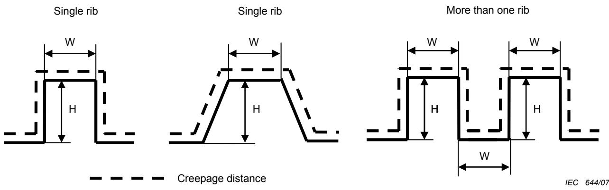  
Figure 2 – Determination of the width (W) and height (H) of a rib

## 5.3 Requirements for design of solid insulation

## 5.3.1 General

As the electric strength of solid insulation is considerably greater than that of air, it may receive little attention during the design of low-voltage insulation systems. On the other hand, the insulating distances through solid insulating material are, as a rule, much smaller than the clearances so that high electric stresses result. Another point to be considered is that the high electric strength of material is seldom made use of in practice. In insulation systems gaps may occur between electrodes and insulation and between different layers of insulation, or voids may be present in the insulation. Partial discharges can occur in these gaps or voids at voltages far below the level of puncture and this may influence decisively the service life of the solid insulation. However, partial discharges are unlikely to occur below a peak voltage of 500 V.

Of equally fundamental importance is the fact that solid insulation, as compared with gases, is not a renewable insulating medium so that, for example, high voltage peaks which may occur infrequently can have a very damaging effect on solid insulation. This situation can occur while in service and during routine high-voltage testing.

A number of detrimental influences accumulate over the service life of solid insulation. These follow complex patterns and result in ageing. Therefore, electrical and other stresses (e.g. thermal, environmental) are superimposed and contribute to ageing.

The long-term performance of solid insulation can be simulated by a short-term test in combination with suitable conditioning (see 6.1.3.2).

If solid insulation is subjected to high frequencies, the dielectric losses of solid insulation and partial discharges become increasingly important. This condition has been observed in switched-mode power supplies where the insulation is subjected to repetitive voltage peaks at frequencies up to 500 kHz.

There is a general relationship between the thickness of solid insulation and the aforesaid failure mechanisms. By a reduction of the thickness of solid insulation the field strength is increased and leads to a higher risk of failure. As it is not possible to calculate the required thickness of solid insulation the performance can only be verified by testing.

## 5.3.2 Stresses

## 5.3.2.1 General

The stresses applied to solid insulation are divided into

– short-term, and

– long-term.

Other stresses, see 5.3.2.4, than those listed in 5.3.2.2 and 5.3.2.3 below may be applied to solid insulation in use.

## 5.3.2.2 Short-term stresses and their effects

## 5.3.2.2.1 Frequency of the voltage

The electric strength is greatly influenced by the frequency of the applied voltage. Dielectric heating and the probability of thermal instability increase approximately in proportion to the frequency. The breakdown field strength of insulation having a thickness of 3 mm when measured at power frequency according to IEC 60243-1 is between 10 kV/mm and 40 kV/mm. Increasing the frequency will reduce the electric strength of most insulating materials.

NOTE The influence of frequencies greater than 30 kHz on the electric strength is described in IEC 60664-4.

## 5.3.2.2.2 Heating

Heating can cause

– mechanical distortion due to the release of locked-in stress,

– softening of thermoplastics at comparatively low temperature-rise above ambient, for example temperatures above 60 °C,

– embrittlement of some materials due to loss of plasticiser,

softening of some cross-linked materials particularly if the glass transition temperature of the material is exceeded,

– increased dielectric losses leading to thermal instability and failure.

High temperature gradients, for example during short-circuits, may cause mechanical failure.

## 5.3.2.2.3 Mechanical shock

In the case of inadequate impact strength, mechanical shock may cause insulation failure. Failure from mechanical shock could also occur due to reduced impact strength of materials:

due to material becoming brittle when the temperature falls below its glass transition temperature;

after prolonged exposure to high temperature that has caused loss of plasticiser or degradation of the base polymer.

Technical committees shall consider this when specifying environmental conditions for transportation, storage, installation and use.

## 5.3.2.3 Long-term stresses and their effects

## 5.3.2.3.1 Partial discharges (PD)

In air, partial discharges (PD) can occur at peak voltages in excess of 300 V (the Paschen minimum). Failure is by gradual erosion or treeing leading to puncture or surface flashover.

Insulation systems have different properties: some can tolerate discharges throughout their anticipated life (e.g. ceramic insulators), while others have to be discharge-free (e.g. capacitors). Voltage, repetition rate of discharges and discharge magnitude are important parameters.

The PD behaviour is influenced by the frequency of the applied voltage. It is established from accelerated life tests at increased frequency that the time to failure is approximately inversely proportional to the frequency of the applied voltage. However, practical experience only covers frequencies up to 5 kHz since, at higher frequencies, other failure mechanisms may also be present, for example dielectric heating.

NOTE The influence of frequencies greater than 30 kHz on the PD behaviour is described in IEC 60664-4.

## 5.3.2.3.2 Heating

Heating causes degradation of the insulation, for example, by volatilization, oxidation or other long-term chemical changes. However, failure is often due to mechanical reasons, for example embrittlement, leading to cracking and electric breakdown. This process is continuous and cannot be simulated by short-time testing since several thousand hours testing time would be required (see IEC 60216).

## 5.3.2.3.3 Mechanical stresses

Mechanical stresses caused by vibration or shock during operation, storage or transportation may cause delamination, cracking or breaking-up of the insulating material.

NOTE Technical committees should consider these stresses when specifying conditions for testing.

## 5.3.2.3.4 Humidity

The presence of water vapour can influence the insulation resistance and the discharge extinction voltage, aggravate the effect of surface contamination, produce corrosion and dimensional changes. For some materials, high humidity will significantly reduce the electric strength. Low humidity can be unfavourable in some circumstances, for example by increasing the retention of electrostatic charge and by decreasing the mechanical strength of some materials, such as polyamide.

## 5.3.2.4 Other stresses

Many other stresses can damage insulation and will have to be taken into account by technical committees.

Examples of such stresses include

– radiation, both ultraviolet and ionizing,

– stress-crazing or stress-cracking caused by exposure to solvents or active chemicals,

– the effect of migration of plasticizers,

– the effect of bacteria, moulds or fungi,

– mechanical creep.

The effect of these stresses is of less importance or they will apply less often but require consideration in particular cases.

## 5.3.3 Requirements

## 5.3.3.1 General

Solid insulation of basic, supplementary and reinforced insulation shall be capable of durably withstanding electrical and mechanical stresses as well as thermal and environmental influences which may occur during the anticipated life of the equipment.

NOTE When considering electrical stresses to accessible surfaces of solid insulation, such surfaces are assumed to be covered by metal foil. Further details can be specified by technical committees.

In those instances where working voltages are non-sinusoidal with periodically recurring peaks, special consideration shall be given to possible occurrence of partial discharges.

Similarly, where insulation layers may exist and where voids in moulded insulation may exist, consideration shall be given to possible occurrence of partial discharges with resultant degradation of solid insulation.

## 5.3.3.2 Withstand of voltage stresses

## 5.3.3.2.1 General

Technical committees shall specify which voltage ratings are to be assigned to their equipment.

## 5.3.3.2.2 Transient overvoltages

Basic and supplementary insulation shall have

an impulse withstand voltage requirement corresponding to the nominal of the mains voltage (see 4.3.3.3), and the relevant overvoltage category according to Table F.1; or

an impulse withstand voltage of an internal circuit of an equipment which has been specified according to the transient overvoltages to be expected in the circuit (see 4.3.3.4).

Reinforced insulation shall have an impulse withstand voltage corresponding to the rated impulse voltage but one step higher in the preferred series of values in 4.2.3 than that specified for basic insulation. If, according to 4.3.3.4.2, the impulse withstand voltage required for basic insulation is other than a value taken from the preferred series, reinforced insulation shall be dimensioned to withstand 160 % of the value required for basic insulation.

For verification by testing, see 6.1.3.3.

## 5.3.3.2.3 Temporary overvoltages

Basic and supplementary solid insulation shall withstand the following temporary overvoltages:

– short-term temporary overvoltages of $U _ { \mathfrak { n } } + \mathfrak { 1 } \ 2 0 0 \ \vee$ with durations up to 5 s;

– long-term temporary overvoltages of $U _ { \mathrm { n } } + 2 5 0 ~ \mathrm { V }$ with durations longer than 5 s;

where $U _ { \mathfrak { n } }$ is the nominal line-to-neutral voltage of the neutral-earthed supply system.

Reinforced insulation shall withstand twice the temporary overvoltages specified for basic insulation.

For verification by testing see 6.1.3.

NOTE 1 These values are from Clause 442 of IEC 60364-4-44, where $U _ { \mathfrak { n } }$ is called $U _ { \circ }$

NOTE 2 The values are r.m.s. values.

## 5.3.3.2.4 Recurring peak voltages

The maximum recurring peak voltages occurring on the low-voltage mains can be assumed provisionally to be $F _ { 4 } \times { \sqrt { 2 } } U _ { \mathsf { n } }$ , i.e. 1,1 times the peak value at $U _ { \mathfrak { n } }$ . Where recurring peak voltages are present, the discharge extinction voltage shall be at least:

$\begin{array} { r l } { - } & { { } F _ { 1 } \times F _ { 4 } \times \sqrt { 2 } U _ { \mathrm { n } } , \mathrm { i } . e . \ 1 , 3 2 \ \sqrt { 2 } U _ { \mathrm { n } } } \end{array}$ for each basic and supplementary insulation, and

$\begin{array} { r l } { - } & { { } F _ { 1 } \times F _ { 3 } \times F _ { 4 } \times \sqrt { 2 } U _ { \mathsf { n } } , } \end{array}$ i.e. 1,65 ${ \sqrt { 2 } } \ U _ { \mathsf { n } }$ for reinforced insulation.

NOTE $\sqrt { 2 } ~ U _ { \mathfrak { n } }$ is in neutral-earthed systems the peak value of the line-to neutral fundamental (undistorted) voltage at nominal voltage of mains. The application of the multiplying factors used in this subclause is described in

Annex D.

For an explanation of factors F, see 6.1.3.5.

In internal circuits, the highest recurring peak voltages have to be evaluated in place of $F _ { 4 } \times$ ${ \sqrt { 2 } } \ U _ { \mathsf { n } }$ and solid insulation shall meet the requirements correspondingly.

For verification by testing see 6.1.3.5.

## 5.3.3.2.5 High-frequency voltage

For voltages with frequencies above power frequency, the influence of frequency according to 5.3.2.2.1 and 5.3.2.3.1 shall be taken into account. Frequencies above 1 kHz shall be considered as high frequencies within the scope of this standard.

Technical committees shall specify whether a test according to 6.1.3.7 is necessary.

## 5.3.3.3 Withstand of short-term heating stresses

Solid insulation shall not be impaired by short-term heating stresses which may occur in normal and, where appropriate, abnormal use. Technical committees shall specify severity levels.

NOTE Standard severity levels are specified in IEC 60068.

## 5.3.3.4 Withstand of mechanical stresses

Solid insulation shall not be impaired by mechanical vibration or shock which can be expected in use. Technical committees shall specify severity levels.

NOTE Standard severity levels are specified in IEC 60068.

## 5.3.3.5 Withstand of long-term heating stresses

Thermal degradation of solid insulation shall not impair insulation coordination during the anticipated life of the equipment. Technical committees shall specify whether a test is necessary. (See also IEC 60085 and IEC 60216.)

## 5.3.3.6 Withstand of the effects of humidity

Insulation coordination shall be maintained under the humidity conditions as specified for the equipment. (See also 6.1.3.2.)

## 5.3.3.7 Withstand of other stresses

Equipment may be subjected to other stresses, for example as indicated in 5.3.2.4, which may adversely affect solid insulation. Technical committees shall state such stresses and specify test methods.

## 6 Tests and measurements

## 6.1 Tests

## 6.1.1 General

The following test procedures apply to type testing, so that a possible deterioration of the test specimen may be tolerated. It is assumed that further use of the test specimen is not intended.

NOTE 1 If further use of the test specimen is intended or required, particular consideration is necessary by the technical committee. In such cases any high-voltage test should be combined with a partial discharge measurement according to 6.1.3.5 and Annex C.

Test procedures are specified for

– the verification of clearances (see 6.1.2),

– the verification of solid insulation (see 6.1.3),

– dielectric tests on complete equipment (see 6.1.4) and

– other tests (see 6.1.5).

The stresses for clearances and solid insulation caused by transient overvoltages are assessed by the impulse voltage test, which may be substituted by an a.c. voltage test or a d.c. voltage test. Clearances equal to or larger than case A of Table F.2 may be verified by measurement or by a voltage test. If they are smaller than the values according to the values of case A of Table F.2, they have to be verified by a voltage test.

The ability of solid insulation to withstand the voltage stresses has to be verified by a voltage test in any case. The stresses caused by transient overvoltages are assessed by the impulse voltage test, which may be substituted by an a.c. voltage test or a d.c. voltage test. The stresses caused by an a.c. steady-state voltage stress can only be assessed by an a.c. voltage test. The d.c. voltage test with a test voltage equal to the peak value of the a.c. voltage is not fully equivalent to the a.c. voltage test due to the different withstand characteristics of solid insulation for these types of voltages. However in case of a pure d.c. voltage stress, the d.c. voltage test is appropriate.

NOTE 2 While it is possible to substitute an impulse voltage test for clearances by an a.c. voltage test or by a d.c. voltage test, it is in principle not possible to substitute an a.c. voltage test for solid insulation by an impulse voltage test. The main reasons for this are the different propagation of the impulse voltages compared to power frequency voltages, especially in complex circuits, and the dependency of the withstand characteristics of solid insulation on the shape and the duration of the voltage stress.

## 6.1.2 Test for verification of clearances

## 6.1.2.1 General

When electrical equipment is subjected to electric tests for verifying clearances, the test shall be in accordance with withstand voltage requirements specified in 5.1. The appropriate test for the verification of clearances is the impulse voltage test, but as stated in 5.1.3, the test is only required for clearances smaller than case A values of Table F.2.

If the withstand against steady state voltages, recurring peak voltages or temporary overvoltages according to 5.1 is decisive for the dimensioning of clearances and if those clearances are smaller than the case A values of Table F.7a an a.c. test voltage according to 6.1.2.2.2.2 test is required.

When verifying clearances within equipment by an impulse voltage test, it is necessary to ensure that the specified impulse voltage appears at the clearance under test.

NOTE 1 The electric testing of clearances will also stress the associated solid insulation.

NOTE 2 For some cases, these tests also have to be applied to creepage distances, see 5.2.2.6.

NOTE 3 For testing complete equipment, see 6.1.4.

## 6.1.2.2 Test voltages

## 6.1.2.2.1 Impulse voltage dielectric test

## 6.1.2.2.1.1 General

The purpose of this test is to verify that clearances will withstand specified transient overvoltages. The impulse withstand test is carried out with a voltage having a 1,2/50 µs waveform with the values specified in Table F.5. For the waveform 6.1 and 6.2 of IEC 61180-1 apply. It is intended to simulate overvoltages of atmospheric origin and covers overvoltages due to switching of low-voltage equipment.

Due to the scatter of the test results of any impulse voltage test, the test shall be conducted for a minimum of three impulses of each polarity with an interval of at least 1 s between pulses.

NOTE 1 The output impedance of the impulse generator should not be higher than 500 Ω. When carrying out tests on equipment incorporating components across the test circuit, a much lower virtual impulse generator impedance should be specified (see 9.2 in IEC 61180-2). In such cases, possible resonance effects, which can increase the peak value of the test voltage, should be taken into account when specifying test voltage values.

Technical committees may specify alternative dielectric tests according to 6.1.2.2.2.

NOTE 2 Values given in Table F.5 are derived from the calculation in 6.1.2.2.1.3. For accuracy of information, they are given with a high level of precision. For practical application, technical committees may choose to round the values.

## 6.1.2.2.1.2 Selection of impulse test voltage

If an electric test for insulation coordination of equipment with respect to clearances is required (for clearances smaller than case A as specified in Table F.2), the equipment shall be tested with the impulse test voltage corresponding to the rated impulse voltage specified in accordance with 4.3.3. The impulse test voltages of Table F.5 apply.

For the test conditions, technical committees shall specify temperature and humidity values.

Technical committees shall consider whether sampling tests or routine tests have to be carried out in addition to type tests.

## 6.1.2.2.1.3 Explanations to Table F.5

The following gives some explanation on how to interpret the data in Table F.5:

a) Correction factors for impulse voltage testing

According to 1.1, the rated impulse voltage is valid for equipment used up to 2 000 m above sea level. At 2 000 m, the normal barometric pressure is 80 kPa, while at sea level the value is 101,3 kPa. Therefore, the equipment tested at locations lower than 2 000 m is tested using higher impulse test voltages. Table F.5 gives the impulse test voltage value for verifying clearances at different altitudes.

The basis for the calculation of the sea level values and data for determining test values for other test locations is as follows:

The altitude correction factors given in Table A.2 are considered in relation to the curve of Figure A.1. The relationship is as follows:

$$
k _ {\mathrm{u}} = \left(\frac {1}{k _ {\mathrm{d}}}\right) ^ {m}
$$

where

d is the clearance under consideration in millimetres;

$k _ { \mathrm { u } }$ is the altitude factor for voltage correction;

$k _ { \mathrm { d } }$ is the altitude factor for distance correction (see Table F.8);

m is the gradient of the relevant straight line in curve 1 in Figure A.1 (logarithmic scales on the two co-ordinate axes) and has the value.

$$
m = 0, 9 1 6 3 \quad \text { for } 0, 0 0 1 <   d \leq 0, 0 1 \mathrm{mm}
$$

$$
m = 0, 3 3 0 5 \quad \text {   for   } 0, 0 1 \quad <   d \leq 0, 0 6 2 5 \mathrm{mm};
$$

$$
m = 0, 6 3 6 1 \mathrm{for} 0, 0 6 2 5 <   d \leq 1 \mathrm{mm};
$$

$$
m = 0, 8 5 3 9 \quad \text {   for   } 1 \quad <   d \leq 1 0 \mathrm{mm};
$$

$$
m = 0, 9 2 4 3 \quad \text {   for   } 1 0 \quad <   d \leq 1 0 0 \mathrm{mm}.
$$

Applying altitude correction factors for distance correction results in curve 1 of Figure A.1, the voltages will be changed with four different steps at only one shifting step for distance. The mathematical formula for this operation is shown above. Table F.5 includes this calculation as described.

b) General discussion of factors influencing the electric strength of clearances

The influencing factors are as follows:

– air pressure;

– temperature;

– humidity.

For the purpose of testing the factors of temperature, humidity and climatic variations of air pressure are not taken into account provided that normal laboratory conditions exist.

Normal laboratory conditions are specified in IEC 60068-1:

− Temperature: $1 5 ^ { \circ } \complement$ to ${ } ^ { 3 5 } \ ^ { \circ } \mathsf { C } ;$

− Air pressure: 86 kPa to 106 kPa at sea level;

− Relative humidity: 25 % to 75 %.

## 6.1.2.2.2 Alternatives to impulse voltage dielectric tests

## 6.1.2.2.2.1 General

Technical committees may specify an a.c. or d.c. voltage test for particular equipment as an alternative method.

NOTE While tests with a.c. and d.c. voltages of the same peak value as the impulse test voltage specified in Table F.5 verify the withstand capability of clearances, they more highly stress solid insulation because the voltage is applied for longer duration. They can overload and damage certain solid insulations. Technical committees should therefore consider this when specifying tests with a.c. or d.c. voltages as an alternative to the impulse voltage test given in 6.1.2.2.1.

## 6.1.2.2.2.2 Dielectric test with a.c. voltage

The waveshape of the sinusoidal power frequency test voltage shall be substantially sinusoidal. This requirement is fulfilled if the ratio between the peak value and the r.m.s. value is $\sqrt { 2 } \pm 3 \%$ . The peak value shall be equal to the impulse test voltage of Table F.5 and applied for three cycles of the a.c. test voltage.

## 6.1.2.2.2.3 Dielectric test with d.c. voltage

The d.c. test voltage shall be substantially free of ripple. This requirement is fulfilled if the ratio between the peak values of the voltage and the average value is $1 , 0 \pm 3 \%$ . The average value of the d.c. test voltage shall be equal to the impulse test voltage of Table F.5 and

applied three times for 10 ms in each polarity.

## 6.1.3 Tests for the verification of solid insulation

## 6.1.3.1 Selection of tests

Solid insulation that may be subjected to mechanical stresses during operation, storage, transportation or installation shall be tested with respect to vibration and mechanical shock before the dielectric testing. Technical committees may specify test methods.

NOTE Standard test methods are specified in the relevant part of IEC 60068.

The tests for insulation coordination are type tests. They have the following objectives:

a) The impulse voltage withstand test is to verify the capability of the solid insulation to withstand the rated impulse voltage (see 5.3.3.2.2).

b) The a.c. voltage test is to verify the capability of the solid insulation to withstand

– the short-term temporary overvoltage (see 5.3.3.2.3);

– the highest steady-state voltage;

– the recurring peak voltage (see 5.3.3.2.4).

If the peak value of the a.c. test voltage is equal to or higher than the rated impulse voltage, the impulse voltage test is covered by the a.c. voltage test.

Solid insulation has a different withstand characteristic compared to clearances if the time of stress is being increased. In general the withstand capability will be decreased significantly. Therefore the a.c. voltage test, which is specified for the verification of the withstand capability of solid insulation, is not allowed to be replaced by an impulse voltage test.

c) The partial discharge test is to verify that no partial discharges are maintained in the solid insulation:

– at the highest steady-state voltage;

– at the long-term temporary overvoltage (see 5.3.3.2.3);

– at the recurring peak voltage (see 5.3.3.2.4).

d) The high-frequency voltage test is to verify the absence of failure due to dielectric heating according to 5.3.3.2.5.

Technical committees shall specify which type tests are required for the respective stresses occurring in the equipment.

Partial discharge tests for solid insulation shall be specified if the peak value of the voltages listed under c) exceeds 700 V and if the average field strength is higher than 1 kV/mm. The average field strength is the peak voltage divided by the distance between two parts of different potential.

The above tests may also be suitable as sample or routine tests. It is, however, the responsibility of the technical committees to specify which tests shall be performed as sample and routine tests in order to ensure the quality of the insulation during production. The tests and conditioning, as appropriate, shall be specified with test parameters adequate to detect faults without causing damage to the insulation.

When performing tests on complete equipment, the procedure of 6.1.4 applies.

## 6.1.3.2 Conditioning

If not otherwise specified, the test shall be performed with a new test specimen. Conditioning of the specimen by temperature and humidity treatment is intended to

– represent the most onerous normal service conditions,

– expose possible weaknesses which are not present in the new condition.

Technical committees shall specify the appropriate conditioning method from the following recommended methods:

a) dry heat (IEC 60068-2-2), in order to achieve a stable condition which may not exist immediately after manufacture;

b) dry heat cycle (IEC 60068-2-2), in order to induce the creation of voids which could develop in storage, transportation and normal use;

c) thermal shock (IEC 60068-2-14), in order to induce delamination within the insulation system which may develop in storage, transportation and normal use;

d) damp heat (IEC 60068-2-78), in order to evaluate the effect of water absorption on the electric properties of the solid insulation.

For impulse voltage, a.c. power frequency voltage and high frequency voltage tests, the most significant conditioning methods are those in a) and d). For partial discharge testing, the conditioning methods b) and c) are most relevant.

If conditioning of solid insulation is required, it shall be performed prior to type testing. The values of temperature, humidity and time shall be selected from Table F.6.

It may be appropriate to subject components, for example electrical parts, sub-assemblies, insulating parts and materials, to conditioning before electric testing. When components have already been type tested according to this subclause, such conditioning is not required.

## 6.1.3.3 Impulse voltage test

## 6.1.3.3.1 Test method

The methods for impulse voltage testing of 6.1.2.2.1 apply also to solid insulation, except that the altitude correction factors as listed in Table F.5 are not applicable. The test shall be conducted for five impulses of each polarity with an interval of at least 1 s between impulses. The waveshape of each impulse shall be recorded (see 6.1.3.3.2).

## 6.1.3.3.2 Acceptance criteria

No puncture or partial breakdown of solid insulation shall occur during the test, but partial discharges are allowed. Partial breakdown will be indicated by a step in the resulting waveshape which will occur earlier in successive impulses. Breakdown on the first impulse may either indicate a complete failure of the insulation system or the operation of overvoltage limiting devices in the equipment.

NOTE 1 If overvoltage limiting devices are included in the equipment, care should be taken to examine the waveshape to ensure that their operation is not taken to indicate insulation failure. Distortions of the impulse voltage which do not change from impulse to impulse may be caused by operation of such overvoltage limiting device and do not indicate a (partial) breakdown of solid insulation.

NOTE 2 Partial discharges in voids can lead to partial notches of extremely short durations which may be repeated in the course of an impulse.

## 6.1.3.4 A.C. power frequency voltage test

## 6.1.3.4.1 Test method

The waveshape of the sinusoidal power frequency test voltage shall be substantially sinusoidal. This requirement is fulfilled if the ratio between the peak value and the r.m.s. value is $\sqrt { 2 } ~ \pm 3 ~ \%$ . The peak value shall be equal to the highest of the voltages mentioned in 6.1.3.1 b).

For basic insulation and supplementary insulation, the test voltage has the same value as the voltages mentioned in 6.1.3.1 b). For reinforced insulation, the test voltage is twice the value used for basic insulation.

The a.c. test voltage shall be raised uniformly from 0 V to the value specified in 5.3.3.2 within not more than 5 s and held at that value for at least 60 s.

In those cases where the short term temporary overvoltage leads to the most stringent requirements with respect to the amplitude of the test voltage, a reduction of the duration of the test to a minimum value of 5 s can be considered by technical committees.

NOTE 1 For particular types of insulation, longer periods of testing can be required to detect weakness within the solid insulation.

NOTE 2 In case of testing with respect to high, steady-state stresses including high recurring peak voltage, technical committees should consider introducing a safety margin on the test voltage.

In some cases the a.c. test voltage needs to be substituted by a d.c. test voltage of a value equal to the peak value of the a.c. voltage, however this test will be less stringent than the a.c. voltage test. Technical committees shall consider this situation (see 6.1.3.6).

Test equipment is specified in IEC 61180-2. It is recommended that the short-circuit output current of the generator is not less than 200 mA.

NOTE 3 For test voltages exceeding 3 kV, it is sufficient that the rated power of the test equipment is equal to or greater than 600 VA.

The tripping current of the generator shall be adjusted to a tripping current of 100 mA or for test voltages above 6 kV to the highest possible value.

NOTE 4 For routine testing, the tripping current may be adjusted to lower levels but not less than 3,5 mA.

## 6.1.3.4.2 Acceptance criteria

No breakdown of solid insulation shall occur.

## 6.1.3.5 Partial discharge test

## 6.1.3.5.1 General

The waveshape of the sinusoidal power frequency test voltage shall be substantially sinusoidal. This requirement is fulfilled if the ratio between the peak value and the r.m.s. value is $\sqrt { 2 } \pm 3 \%$ . The peak value of $U _ { \mathfrak { t } }$ (see Figure 3) shall be equal to the highest of the voltages mentioned in 6.1.3.1 c) taking into account the multiplying factors $F _ { 1 } , F _ { 3 }$ and $F _ { 4 }$ as far as applicable.

Partial discharge test methods are described in Annex C. When performing the test, the following multiplying factors apply. These examples are given for the recurring peak voltage $U _ { \mathsf { r p } } .$ the factors similarly apply to the highest steady-state voltage and to the long-term temporary overvoltage.

$F _ { 1 }$ Basic safety factor for PD testing and dimensioning basic and supplementary insulation.

The PD extinction voltage may be influenced by environmental conditions, such as temperature. These influences are taken into account by a basic safety factor $F _ { 1 }$ of 1,2. The PD extinction voltage for basic or supplementary insulation is therefore at least 1,2 $U _ { \Gamma \rho }$

$F _ { 2 }$ PD hysteresis factor.

Hysteresis occurs between the PD inception voltage $U _ { \mathrm { i } }$ and the PD extinction voltage $U _ { \mathsf { e } }$ Practical experience shows that $F _ { 2 }$ is not greater than 1,25. For basic and supplementary insulation, the initial value of the test voltage is therefore $F _ { 1 } \times F _ { 2 } \times U _ { \mathrm { r p } } , \mathsf { i . e . } \ 1 , 2 \times 1 , 2 5 \ U _ { \mathrm { r p } }$ $= 1 , 5 \upsilon _ { \mathsf { r p } }$

NOTE This takes into account that PD might be initiated by transient overvoltages exceeding $U _ { \mathrm { { j } } }$ and could be maintained, for example, by values of the recurring peak voltage exceeding $U _ { \mathrm { e } } .$ This situation would require the combination of impulse and a.c. voltages for the test, which is impractical. Therefore, an a.c. test is performed with an initially increased voltage.

$F _ { 3 }$ Additional safety factor for PD testing and dimensioning reinforced insulation.

For reinforced insulation a more stringent risk assessment is required. Therefore, an additional safety factor $F _ { 3 } = 1 , 2 5$ is required. The initial value of the test voltage is $F _ { 1 } \times F _ { 2 }$ $\times F _ { 3 } \times U _ { \mathrm { r p } } , \mathrm { i . e . } \ i , 2 \times 1 , 2 5 \times 1 , 2 5 \ U _ { \mathrm { r p } } = 1 , 8 7 5 \ U _ { \mathrm { r p } } .$

$F _ { 4 }$ Factor covering the deviation from the nominal voltage $U _ { \mathfrak { n } }$ of the low-voltage mains.

For circuits connected to the low-voltage mains, this factor takes into account the maximum deviation of the mains voltage from its nominal value. Therefore, the crest voltage at nominal voltage $U _ { \mathfrak { n } }$ shall be multiplied by $F _ { 4 } = 1 , 1$

## 6.1.3.5.2 Verification

The test is to verify that no partial discharges are maintained at the highest of the following values:

– the peak value of the maximum steady-state voltage;

– the peak value of the long-term temporary overvoltage (see 5.3.3.2.3);

– the recurring peak voltage (see 5.3.3.2.4).

NOTE For cases where, additionally, the actual values of PD inception and extinction voltage are of interest, the measuring procedure is described in Clause D.1.

When testing, the PD test is generally applied to components, small assemblies and small equipment. When testing complex equipment, care shall be taken to allow for excessive attenuation of PD signals when measured at the equipment terminals.

The minimum required discharge extinction voltage shall be higher, by factor $F _ { 1 }$ , than the highest of the voltages listed above.

According to the kind of test specimen, technical committees shall specify

– the test circuit (Clause C.1),

– the measuring equipment (Clause C.3 and Clause D.2),

– the measuring frequency (C.3.1 and D.3.3),

– the test procedure (6.1.3.5.3).

## 6.1.3.5.3 Test procedure

The value of the test voltage $U _ { \mathrm { t } }$ is 1,2 times the required partial discharge extinction voltage $U _ { \mathsf { e } }$ . According to the partial discharge hysteresis (see 6.1.3.5.1) an initial value of 1,25 times the test voltage shall be applied.

The voltage shall be raised uniformly from 0 V up to the initial test voltage $F _ { 2 } \times U _ { \mathrm { t } } , \mathsf { i . e . } F _ { 1 } \times F _ { 2 }$ $= ~ 1 , 2 \times 1 , 2 5 ~ = ~ 1 , 5$ times the highest of the voltages listed under 6.1.3.5.2. It is then kept constant for a specified time $t _ { 1 }$ not exceeding 5 s. If no partial discharges have occurred, the test voltage is reduced to zero after $t _ { 1 }$ . If a partial discharge has occurred, the voltage is decreased to the test voltage $U _ { \mathrm { t } }$ , which is kept constant for a specified time $t _ { 2 }$ until the partial discharge magnitude is measured.

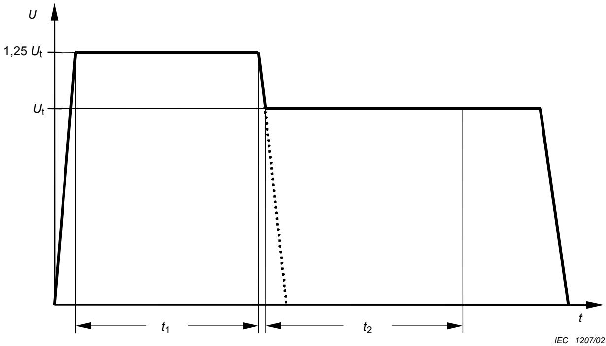  
Figure 3 – Test voltages

## 6.1.3.5.4 Acceptance criteria

## 6.1.3.5.4.1 Specified discharge magnitude

As the objective is to have no continuous partial discharges under normal service conditions, the lowest practicable value shall be specified (see Clause D.3).

NOTE 1 Except for discharges caused by corona discharges in air (e.g. in non-moulded transformers), values in excess of 10 pC are not suitable.

NOTE 2 Values as small as 2 pC are possible with currently available apparatus.

The noise level shall not be subtracted from the reading of the partial discharge meter.

## 6.1.3.5.4.2 Test result

The solid insulation complies if

– no insulation breakdown has occurred, and

during the application of the test voltage, partial discharges have not occurred, or after $t _ { 2 }$ the magnitude of the discharge is not higher than specified.

## 6.1.3.6 DC voltage test

The d.c. voltage test with a test voltage equal to the peak value of the a.c. voltage is not fully equivalent to the a.c. voltage test due to the different withstand characteristics of solid insulation for these types of voltages. However in case of a pure d.c. voltage stress, the d.c. voltage test is appropriate.

The d.c. test voltage shall be substantially free of ripple. This requirement is fulfilled if the ratio between the peak values of the voltage and the average value is $1 , 0 \% \pm 3 \%$ . The average value of the d.c. test voltage shall be equal to the peak value of the a.c. test voltage mentioned in 6.1.3.1 b).

For basic insulation and supplementary insulation, the test voltage has the same value as the voltages mentioned in 6.1.3.1 b). For reinforced insulation, the test voltage is twice the value

used for basic insulation.

The d.c. test voltage shall be raised uniformly from 0 V to the value specified in 5.3.3.2 within not more than 5 s and held at that value for at least 60 s.

NOTE 1 In certain cases, the charging current due to capacitances may be too high and a longer rise time may be necessary.

Test equipment is specified in IEC 61180-2. It is recommended that the short-circuit output current of the generator is not less than 200 mA.

NOTE 2 For test voltages exceeding 3 kV, it is sufficient that the rated power of the test equipment is equal or greater than 600 VA.

The tripping current of the generator shall be adjusted to a tripping current of 100 mA or for test voltages above 6 kV to the highest possible value.

NOTE 3 For routine testing, the tripping current may be adjusted to lower levels but not less than 10 mA.

## 6.1.3.7 High-frequency voltage test

For high-frequency voltages according to 5.3.3.2.5, additional or alternative a.c. voltage tests according to 6.1.3.4 or partial discharge tests according to 6.1.3.5 may be necessary.

NOTE Information about the withstand characteristics of insulation at high frequency and methods of testing is given in IEC 60664-4.

## 6.1.4 Performing dielectric tests on complete equipment

## 6.1.4.1 General

When performing the impulse voltage test on complete equipment, the attenuation or amplification of the test voltage shall be taken into account. It needs to be assured that the required value of the test voltage is applied across the terminals of the equipment under test.

Surge protective devices (SPDs) shall be disconnected before dielectric testing.

NOTE If capacitors with high capacitance are parallel to the parts between which the test voltage needs to be applied, it may be difficult, or even impossible, to perform the a.c. voltage test because the charging current would exceed the capacity of the high voltage tester (200 mA). In the latter case, those parallel capacitors should be disconnected before testing. If this is also impossible, d.c. testing can be taken into consideration.

## 6.1.4.2 Parts to be tested

The test voltage shall be applied between parts of the equipment which are electrically separate from each other.

Examples of such parts include

– live parts,

– separate circuits,

– earthed circuits,

– accessible surfaces.

Non-conductive parts of accessible surfaces shall be covered with metal foil.

NOTE If a complete covering of large enclosures with metal foil is not practicable, a partial covering is sufficient if applied to those parts which provide protection against electric shock.

## 6.1.4.3 Preparation of equipment circuits

For the test, each circuit of the equipment shall be prepared as follows:

– external terminals of the circuit, if any, shall be connected together;

– switchgear and controlgear within equipment shall be in the closed position or bypassed;

the terminals of voltage blocking components (such as rectifier diodes) shall be connected together;

components such as RFI filters shall be included in the impulse test but it may be necessary to disconnect them during a.c. tests.

NOTE 1 Voltage sensitive components within any circuit of the equipment, which do not bridge basic or reinforced insulation, may be bypassed by shorting the terminals.

NOTE 2 Pre-tested plug-in printed circuit boards and pre-tested modules with multipoint connectors may be withdrawn, disconnected or replaced by dummy samples to ensure that the test voltage is propagated inside the equipment to the extent necessary for the insulation tests.

## 6.1.4.4 Test voltage values

Circuits connected to the low-voltage mains are tested according to 6.1.2 and 6.1.3.

The test voltage between two circuits of the equipment shall have the value corresponding to the highest voltage that actually can occur between these circuits.

## 6.1.4.5 Test criteria

There shall be no disruptive discharge (sparkover, flashover or puncture) during the test. Partial discharges in clearances which do not result in breakdown are disregarded, unless otherwise specified by the technical committees.

NOTE It is recommended that an oscilloscope be used to observe the impulse voltage in order to detect disruptive discharge.

## 6.1.5 Other tests

## 6.1.5.1 Test for purposes other than insulation coordination

Technical committees specifying electric tests for purposes other than verification of insulation coordination shall not specify test voltages higher than those required for insulation coordination.

## 6.1.5.2 Sampling and routine tests

Sampling tests and routine tests are intended to ensure production quality. It is the responsibility of the relevant technical committee, and in particular of the manufacturer, to specify these tests. They shall be carried out with the waveforms and voltage levels such that faults are detected without causing damage to the equipment (solid insulation or components).

Technical committees specifying sampling and routine tests shall in no case specify test voltages higher than those required for type testing.

## 6.1.6 Measurement accuracy of test parameters

All important test parameters shall be measured with high accuracy in order to provide well defined and comparable test results. For the purpose of harmonization, the accuracy of measurement of the measuring devices used for the following test parameters is given in this standard as follows:

a) test voltage (a.c./d.c.): ±3 %; test voltage (impulse): ±5 %;

b) current: ±1,5 %;

c) frequency: ±0,2 %;

d) temperature:

– below 100 °C ±2 K;

– 100 °C up to 500 °C ±3 %;

e) relative humidity: ±3 % r.h.

NOTE The given accuracy refers to that of the humidity measuring device. It does not include the humidity uniformity within the chamber and/or the influence of the test sample on the humidity uniformity. The humidity in the chamber is measured only at one place before testing the sample.

f) partial discharge magnitude: ±10 % or ±1 pC (the greater values applies);

g) time (impulse voltage) ±20 %;

time (test duration) ±1 %.

## 6.2 Measurement of creepage distances and clearances

The dimension X, specified in the following examples, has a minimum value depending on the pollution degree as follows:

<table><tr><td>Pollution degree</td><td>Dimension X minimum value</td></tr><tr><td>1</td><td>0,25 mm</td></tr><tr><td>2</td><td>1,0 mm</td></tr><tr><td>3</td><td>1,5 mm</td></tr></table>

If the associated clearance is less than 3 mm, the minimum dimension X may be reduced to one-third of this clearance.

The methods of measuring creepage distances and clearances are indicated in the following Examples 1 to 11. These cases do not differentiate between gaps and grooves or between types of insulation.

The following assumptions are made:

any recess is assumed to be bridged with an insulating link having a length equal to the specified width X and being placed in the most unfavourable position (see Example 3);

where the distance across a groove is equal to or larger than the specified width X, the creepage distance is measured along the contours of the groove (see Example 2);

creepage distances and clearances measured between parts which can assume different positions in relation to each other, are measured when these parts are in their most unfavourable position.

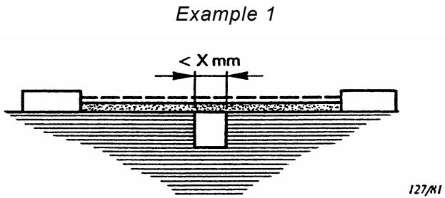

Condition: Path under consideration includes a parallel- or converging-sided groove of any depth with a width less than X mm.

Rule: Creepage distance and clearance are measured directly across the groove as shown.

Example 2  
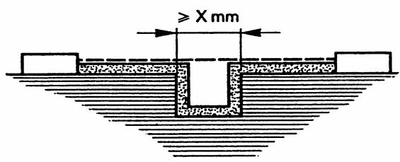  
128/81

Condition: Path under consideration includes a parallel-sided groove of any depth and equal to or more than X mm. Rule: Clearance is the "line of sight" distance. Creepage path follows the contour of the groove.

Example 3  
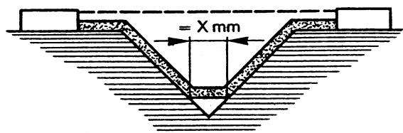  
129/81

Condition: Path under consideration includes a V-shaped groove with a width greater than X mm.

Rule: Clearance is the "line of sight" distance. Creepage path follows the contour of the groove but "short-circuits" the bottom of the groove by X mm link.

Clearance

Creepage distance

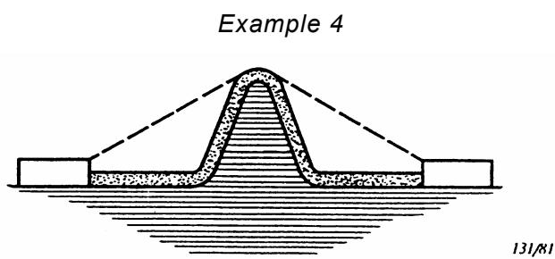

Condition: Path under consideration includes a rib.

Rule: Clearance is the shortest direct air path over the top of the rib. Creepage path follows the contour of the rib.

Example 5  
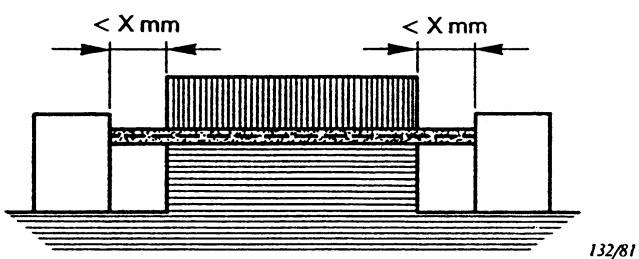

Condition: Path under consideration includes an uncemented joint with grooves less than X mm wide on each side. Rule: Creepage and clearance path is the "line of sight" distance shown.

Example 6  
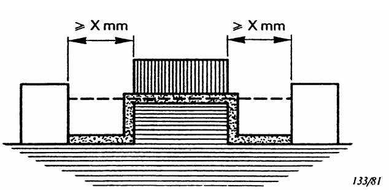

Condition: Path under consideration includes an uncemented joint with grooves equal to or more than X mm wide on each side.

Rule: Clearance is the "line of sight" distance. Creepage path follows the contour of the grooves.

Clearance

Creepage distance

Example 7  
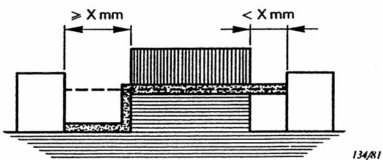

Condition: Path under consideration includes an uncemented joint with a groove on one side less than X mm wide and the groove on the other side equal to or more than X mm wide.

Rule: Clearance and creepage paths area as shown.

Example 8  
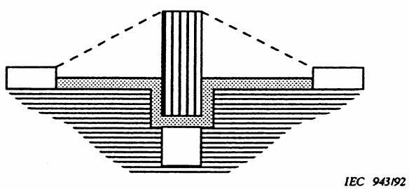

Condition: Creepage distance through uncemented joint is less than creepage distance over barrier. Rule: Clearance is the shortest direct air path over the top of the barrier.

Clearance

Creepage distance

Example 9  
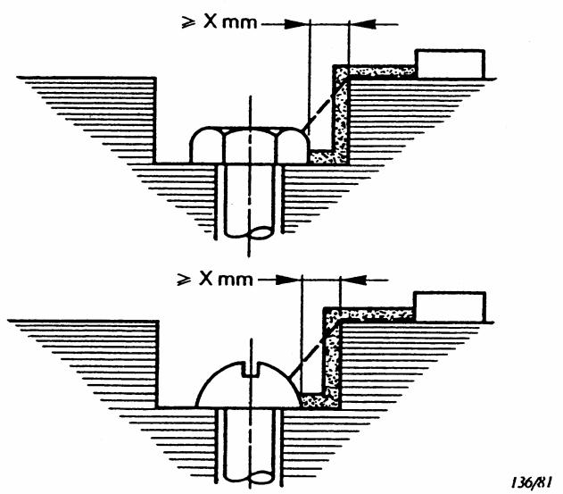

Gap between head of screw and wall of recess wide enough to be taken into account.

Example 10

Gap between head of screw and wall of recess too narrow to be taken into account.

Measurement of creepage distance is from screw to wall when the distance is equal to X mm.

Clearance

Creepage distance

Example 11

Conductive floating part

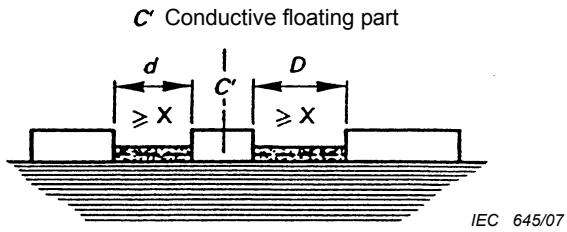

Clearance is the distance = d + D

Creepage distance is also = d + D

## Annex A (informative)

## Basic data on withstand characteristics of clearances

Table A.1 – Withstand voltages in kilovolts for an altitude of 2 000 m above sea level

<table><tr><td rowspan="2">Clearance</td><td colspan="3">Case AInhomogeneous field</td><td colspan="2">Case BHomogeneous field</td></tr><tr><td colspan="2">AC(50/60 Hz)</td><td>Impulse(1,2/50)</td><td>AC(50/60 Hz)</td><td>AC(50/60 Hz) andimpulse (1,2/50)</td></tr><tr><td>mm</td><td>U r.m.s.</td><td> $\hat{U}$ </td><td> $\hat{U}$ </td><td>U r.m.s.</td><td> $\hat{U}$ </td></tr><tr><td>0,001</td><td>0,028</td><td>0,040</td><td>0,040</td><td>0,028</td><td>0,04</td></tr><tr><td>0,002</td><td>0,053</td><td>0,075</td><td>0,075</td><td>0,053</td><td>0,07</td></tr><tr><td>0,003</td><td>0,078</td><td>0,110</td><td>0,110</td><td>0,078</td><td>0,11</td></tr><tr><td>0,004</td><td>0,102</td><td>0,145</td><td>0,145</td><td>0,102</td><td>0,14</td></tr><tr><td>0,005</td><td>0,124</td><td>0,175</td><td>0,175</td><td>0,124</td><td>0,17</td></tr><tr><td>0,006 25</td><td>0,152</td><td>0,215</td><td>0,215</td><td>0,152</td><td>0,21</td></tr><tr><td>0,008</td><td>0,191</td><td>0,270</td><td>0,270</td><td>0,191</td><td>0,27</td></tr><tr><td>0,010</td><td>0,23</td><td>0,33+</td><td>0,33+</td><td>0,23</td><td>0,33</td></tr><tr><td>0,012</td><td>0,25</td><td>0,35</td><td>0,35</td><td>0,25</td><td>0,35</td></tr><tr><td>0,015</td><td>0,26</td><td>0,37</td><td>0,37</td><td>0,26</td><td>0,37</td></tr><tr><td>0,020</td><td>0,28</td><td>0,40</td><td>0,40</td><td>0,28</td><td>0,40</td></tr><tr><td>0,025</td><td>0,31</td><td>0,44</td><td>0,44</td><td>0,31</td><td>0,44</td></tr><tr><td>0,030</td><td>0,33</td><td>0,47</td><td>0,47</td><td>0,33</td><td>0,47</td></tr><tr><td>0,040</td><td>0,37</td><td>0,52</td><td>0,52</td><td>0,37</td><td>0,52</td></tr><tr><td>0,050</td><td>0,40</td><td>0,56</td><td>0,56</td><td>0,40</td><td>0,56</td></tr><tr><td>0,062 5</td><td>0,42</td><td>0,60+</td><td>0,60+</td><td>0,42</td><td>0,60</td></tr><tr><td>0,080</td><td>0,46</td><td>0,65</td><td>0,70</td><td>0,50</td><td>0,70</td></tr><tr><td>0,10</td><td>0,50</td><td>0,70</td><td>0,81</td><td>0,57</td><td>0,81</td></tr><tr><td>0,12</td><td>0,52</td><td>0,74</td><td>0,91</td><td>0,64</td><td>0,91</td></tr><tr><td>0,15</td><td>0,57</td><td>0,80</td><td>1,04+</td><td>0,74</td><td>1,04</td></tr><tr><td>0,20</td><td>0,62</td><td>0,88</td><td>1,15</td><td>0,89</td><td>1,26</td></tr><tr><td>0,25</td><td>0,67</td><td>0,95</td><td>1,23</td><td>1,03</td><td>1,45</td></tr><tr><td>0,30</td><td>0,71</td><td>1,01</td><td>1,31</td><td>1,15</td><td>1,62</td></tr><tr><td>0,40</td><td>0,78</td><td>1,11</td><td>1,44</td><td>1,38</td><td>1,95</td></tr><tr><td>0,50</td><td>0,84</td><td>1,19</td><td>1,55</td><td>1,59</td><td>2,25</td></tr><tr><td>0,60</td><td>0,90</td><td>1,27</td><td>1,65</td><td>1,79</td><td>2,53</td></tr><tr><td>0,80</td><td>0,98</td><td>1,39</td><td>1,81</td><td>2,15</td><td>3,04</td></tr><tr><td>1,0</td><td>1,06</td><td>1,50+</td><td>1,95</td><td>2,47</td><td>3,50</td></tr><tr><td>1,2</td><td>1,20</td><td>1,70</td><td>2,20</td><td>2,89</td><td>4,09</td></tr><tr><td>1,5</td><td>1,39</td><td>1,97</td><td>2,56</td><td>3,50</td><td>4,95</td></tr><tr><td>2,0</td><td>1,68</td><td>2,38</td><td>3,09</td><td>4,48</td><td>6,33</td></tr><tr><td>2,5</td><td>1,96</td><td>2,77</td><td>3,60</td><td>5,41</td><td>7,65</td></tr><tr><td>3,0</td><td>2,21</td><td>3,13</td><td>4,07</td><td>6,32</td><td>8,94</td></tr><tr><td>4,0</td><td>2,68</td><td>3,79</td><td>4,93</td><td>8,06</td><td>11,4</td></tr><tr><td>5,0</td><td>3,11</td><td>4,40</td><td>5,72</td><td>9,76</td><td>13,8</td></tr><tr><td>6,0</td><td>3,51</td><td>4,97</td><td>6,46</td><td>11,5</td><td>16,2</td></tr><tr><td>8,0</td><td>4,26</td><td>6,03</td><td>7,84</td><td>14,6</td><td>20,7</td></tr><tr><td>10,0</td><td>4,95</td><td>7,00+</td><td>9,10</td><td>17,7</td><td>25,0+</td></tr><tr><td>12,0</td><td>5,78</td><td>8,18</td><td>10,6</td><td>20,9</td><td>29,6</td></tr><tr><td>15,0</td><td>7,00</td><td>9,90</td><td>12,9</td><td>25,7</td><td>36,4</td></tr><tr><td>20,0</td><td>8,98</td><td>12,7</td><td>16,4</td><td>33,5</td><td>47,4</td></tr><tr><td>25,0</td><td>10,8</td><td>15,3</td><td>19,9</td><td>41,2</td><td>58,3</td></tr><tr><td>30,0</td><td>12,7</td><td>17,9</td><td>23,3</td><td>48,8</td><td>69,0</td></tr><tr><td>40,0</td><td>16,2</td><td>22,9</td><td>29,8</td><td>63,6</td><td>90,0</td></tr><tr><td>50,0</td><td>19,6</td><td>27,7</td><td>36,0</td><td>78,5</td><td>111,0</td></tr><tr><td>60,0</td><td>22,8</td><td>32,3</td><td>42,0</td><td>92,6</td><td>131,0</td></tr><tr><td>80,0</td><td>29,2</td><td>41,3</td><td>53,7</td><td>120,9</td><td>171,0</td></tr><tr><td>100,0</td><td>35,4</td><td>50,0+</td><td>65,0</td><td>148,5</td><td>210,0+</td></tr><tr><td colspan="6">NOTE The information for clearances from 0,001 mm to 0,008 mm, is issued from document “Electricalbreakdown experiments in air for micrometer gaps under various pressures” from P. Hartherz, K. en Yahia, L.Müller, R. Pfendtner and W. Pfeiffer and issued during the  $9^{th}$  International Symposium on Gaseous Dielectrics,Ellicot City, Maryland, USA 2001, pp333-338.More details can be found in the thesis of P. Hartherz “Anwendung der Teilentladungsmeßtechnik zurFehleranalyse in festen Isolierungen unter periodischer Impulsspannungsbelastung“. Dissertation TU Darmstadt;Shaker Verlag, 2002.</td></tr></table>

For simplification, the statistical measured values according to Table A.1 above are replaced by straight lines between the values marked "+" in a double logarithmic diagram taking into account the correction factors from 0 m to 2 000 m altitude. The intermediate values are taken from that diagram (see Figure A.1) so that they enclose the measured values with a small safety margin. The values of U r.m.s. are found by dividing the values of Û by 2 .

Table A.2 – Altitude correction factors

<table><tr><td>Altitude m</td><td>Normal barometric pressure kPa</td><td>Multiplication factor for clearances</td></tr><tr><td>2 000</td><td>80,0</td><td>1,00</td></tr><tr><td>3 000</td><td>70,0</td><td>1,14</td></tr><tr><td>4 000</td><td>62,0</td><td>1,29</td></tr><tr><td>5 000</td><td>54,0</td><td>1,48</td></tr><tr><td>6 000</td><td>47,0</td><td>1,70</td></tr><tr><td>7 000</td><td>41,0</td><td>1,95</td></tr><tr><td>8 000</td><td>35,5</td><td>2,25</td></tr><tr><td>9 000</td><td>30,5</td><td>2,62</td></tr><tr><td>10 000</td><td>26,5</td><td>3,02</td></tr><tr><td>15 000</td><td>12,0</td><td>6,67</td></tr><tr><td>20 000</td><td>5,5</td><td>14,5</td></tr></table>

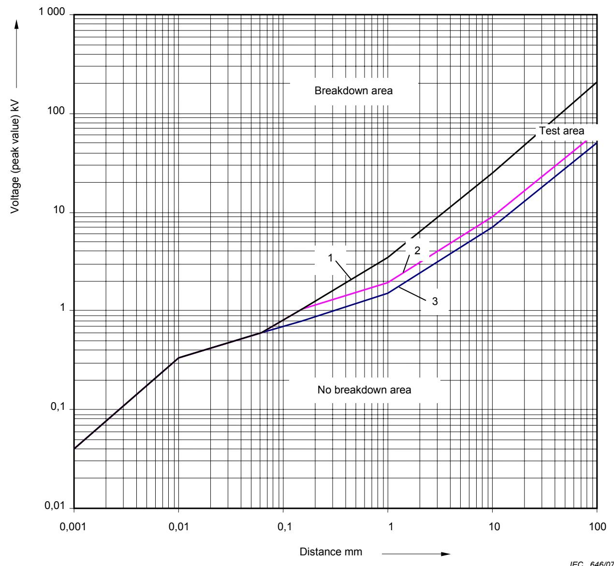  
Figure A.1 – Withstand voltage at 2 000 m above sea level

Key 1 Û 1,2/50 according to ETZ-B, 1976 pp300-302 [3] 2 Low limits for Û 1,2/50 3 Û 50 Hz according to ETZ-A, 1969 pp251-255 [4] 4 Low limits for Û 50 Hz

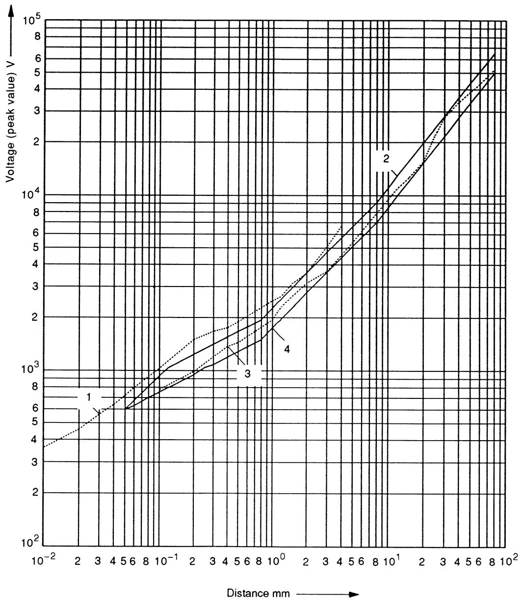  
Figure A.2 – Experimental data measured at approximately sea level and their low limits for inhomogeneous field

2 Û50 Hz according to Electra, 1974 pp61-82 [5]

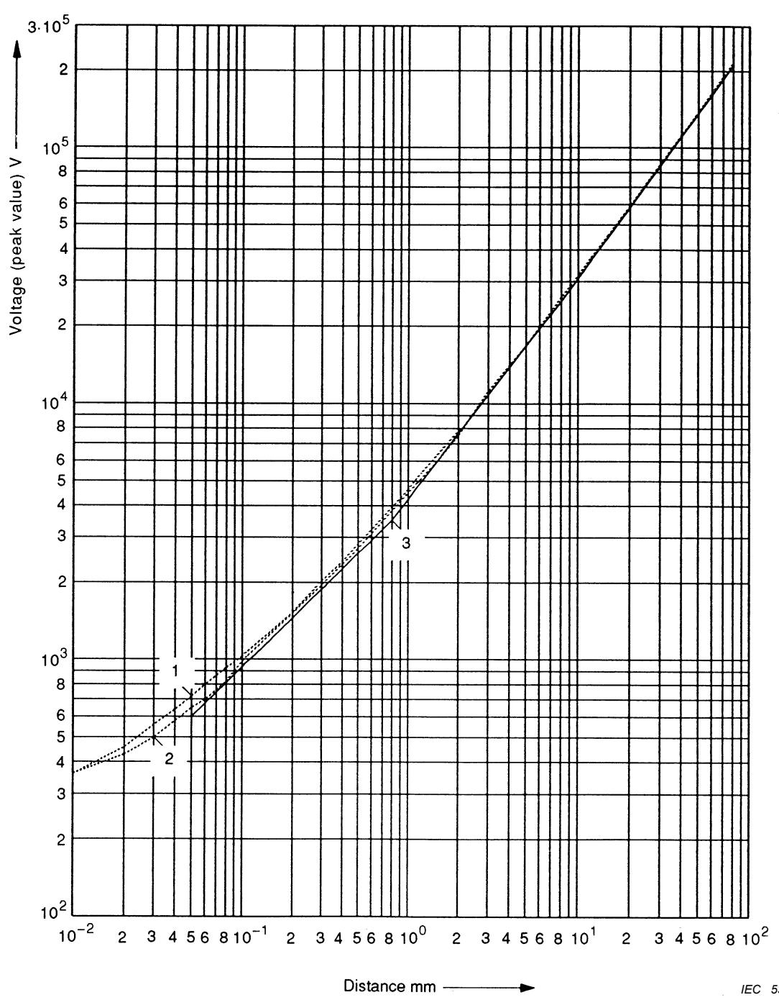  
3 Low limits for Û 1,2/50 and Û 50 Hz

Figure A.3 – Experimental data measured at approximately sea level and their low limits for homogeneous field

# Annex B (informative)

# Nominal voltages of supply systems for different modes of overvoltage control

Table B.1 – Inherent control or equivalent protective control

<table><tr><td rowspan="13">Voltage line-to-neutral derived from nominal voltages a.c. or d.c. up to and including 1)</td><td colspan="4">Nominal voltages presently used in the world</td><td rowspan="11" colspan="4">Rated impulse voltage for equipment 1) V</td></tr><tr><td rowspan="12">Three-phase four-wire systems with earthed neutral 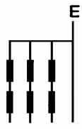</td><td rowspan="12">Three-phase three-wire systems unearthed 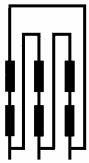</td><td rowspan="12">Single-phase two-wire systems a.c. or d.c.</td><td rowspan="12">Single-phase three-wire systems a.c. or d.c.</td></tr><tr></tr><tr></tr><tr></tr><tr></tr><tr></tr><tr></tr><tr></tr><tr></tr><tr></tr><tr><td colspan="4">Overvoltage category</td></tr><tr><td>I</td><td>II</td><td>III</td><td>IV</td></tr><tr><td>50</td><td></td><td></td><td>12,5 24 25 30 42 48</td><td>30-60</td><td>330</td><td>500</td><td>800</td><td>1 500</td></tr><tr><td>100</td><td>66/115</td><td>66</td><td>60</td><td></td><td>500</td><td>800</td><td>1 500</td><td>2 500</td></tr><tr><td>150</td><td>120/208 * 127/220</td><td>115, 120, 127</td><td>100 **, 110, 120</td><td>100-200 ** 110-220 120-240</td><td>800</td><td>1 500</td><td>2 500</td><td>4 000</td></tr><tr><td>300</td><td>220/380, 230/400 240/415, 260/440 277/480</td><td>200 **, 220, 230, 240, 260, 277, 347 380, 400, 415 440, 480</td><td>220</td><td>220-440</td><td>1 500</td><td>2 500</td><td>4 000</td><td>6 000</td></tr><tr><td>600</td><td>347/600, 380/660 400/690, 417/720 480/830</td><td>500, 577, 600</td><td>480</td><td>480-960</td><td>2 500</td><td>4 000</td><td>6 000</td><td>8 000</td></tr><tr><td>1 000</td><td></td><td>660 690, 720 830, 1 000</td><td>1 000</td><td></td><td>4 000</td><td>6 000</td><td>8 000</td><td>12 000</td></tr><tr><td colspan="9">1) These columns are taken from Table F.1 in which the rated impulse voltage values are specified. * Practice in the United States of America and in Canada. ** Practice in Japan.</td></tr></table>

Table B.2 – Cases where protective control is necessary and control is provided by surge arresters having a ratio of clamping voltage to rated voltage not smaller than that specified by IEC 60099-1

<table><tr><td rowspan="4">Voltage line-to-neutral derived from nominal voltages a.c. or d.c. up to and including 1)</td><td colspan="4">Nominal voltages presently used in the world</td><td rowspan="2" colspan="4">Rated impulse voltage for equipment 1) V</td></tr><tr><td rowspan="3">Three-phase four-wire systems with earthed neutral E V</td><td rowspan="3">Three-phase three-wire systems earthed or unearthed (E) V</td><td rowspan="3">Single-phase two-wire systems a.c. or d.c. V</td><td rowspan="3">Single-phase three-wire systems a.c. or d.c. V</td></tr><tr><td colspan="4">Overvoltage category</td></tr><tr><td>I</td><td>II</td><td>III</td><td>IV</td></tr><tr><td>50</td><td></td><td></td><td>12,5 24 25 30 42 48</td><td>30-60</td><td>330</td><td>500</td><td>800</td><td>1500</td></tr><tr><td>100</td><td>66/115</td><td>66</td><td>60</td><td></td><td>500</td><td>800</td><td>1500</td><td>2500</td></tr><tr><td>150</td><td>120/208 * 127/220</td><td>115, 120, 127</td><td>100 ** 110, 120</td><td>100-200 ** 110-220 120-240</td><td>800</td><td>1500</td><td>2500</td><td>4000</td></tr><tr><td>300</td><td>220/380, 230/400 240/415, 260/440 277/480</td><td>200 **, 220, 230, 240 260, 277</td><td>220</td><td>220-440</td><td>1500</td><td>2500</td><td>4000</td><td>6000</td></tr><tr><td>600</td><td>347/600, 380/660 400/690, 417/720 480/830</td><td>347, 380, 400 415, 440, 480 500, 577, 600</td><td>480</td><td>480-960</td><td>2500</td><td>4000</td><td>6000</td><td>8000</td></tr><tr><td>1000</td><td></td><td>660 690, 720 830, 1000</td><td>1000</td><td></td><td>4000</td><td>6000</td><td>8000</td><td>12000</td></tr><tr><td colspan="9">1) These columns are taken from Table F.1 in which the rated impulse voltage values are specified. * Practice in the United States of America and in Canada. ** Practice in Japan.</td></tr></table>

# Annex C (normative)

# Partial discharge test methods

## C.1 Test circuits

## C.1.1 General

Test circuits shall perform as described in IEC 60270. The following circuits given in this annex meet those requirements and are given as examples.

NOTE 1 In the majority of cases, testing equipment designed in accordance with the examples given in this annex will be sufficient. In special cases, for example in presence of extremely high ambient noise, it may be necessary to refer to IEC 60270.

NOTE 2 For an explanation of the basic operation, see Clause D.2.

## C.1.2 Test circuit for earthed test specimen

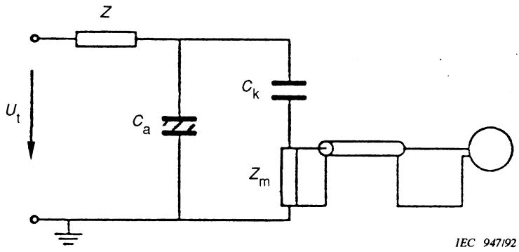

$U _ { \mathrm { t } }$ test voltage

$Z$ filter

$C _ { a }$ test specimen (usually it can be regarded as a capacitance)

$C _ { \mathsf { k } }$ coupling capacitor

$Z _ { \mathsf { m } }$ measuring impedance

Figure C.1 – Earthed test specimen

## C.1.3 Test circuit for unearthed test specimen

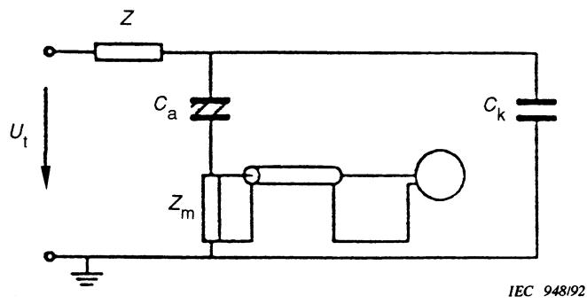  
Figure C.2 – Unearthed test specimen

## C.1.4 Selection criteria

Basically both circuits are equivalent. However the stray capacitances of the test specimen have a different influence upon sensitivity. The earth capacitance of the high-voltage terminal of the test specimen tends to reduce the sensitivity of the circuit according to C.1.2 and tends to increase the sensitivity of the circuit according to C.1.3 which therefore should be preferred.

## C.1.5 Measuring impedance

The measuring impedance shall provide a negligibly low voltage drop at test frequency. The impedance for the measuring frequency shall be selected in order to provide a reasonable sensitivity according to Clause D.2.

If voltage limiting components are used they shall not be effective within the measuring range.

## C.1.6 Coupling capacitor $\pmb { C } _ { \mathbf { k } }$

This capacitor shall be of low inductance type with a resonant frequency in excess of $3 \ f _ { 2 }$ (see Clause C.3). It shall be free of partial discharges up to the highest test voltage used.

## C.1.7 Filter

The use of a filter is not mandatory. If used, its impedance shall be high for the measuring frequency.

## C.2 Test parameters

## C.2.1 General

Technical committees shall specify

– the frequency $\pmb { f } _ { \mathrm { f } }$ of the test voltage (C.2.2),

– the specified discharge magnitude (6.1.3.5.4.1),

– the climatic conditions for the PD test (C.2.3).

NOTE It may be necessary to have different specifications for the type test and the routine test.

## C.2.2 Requirements for the test voltage

Normally a.c. voltages are used. The total harmonic distortion shall be less than 3 %.

NOTE 1 Low distortion of the sine wave allows the use of standard voltmeters and the calculation of the peak value from the r.m.s. reading. In the case of higher distortion, peak voltmeters should be used.

Tests are normally made at power frequency. If other frequencies are present in the equipment, technical committees shall consider the possible effect of frequency on discharge magnitude.

NOTE 2 PD testing with d.c. voltage is not recommended because of the difficulty of achieving an environment which is completely free of electrical noise. In addition it should be noted that the voltage distribution is greatly different for a.c. and d.c.

## C.2.3 Climatic conditions

It is recommended to perform the test at room temperature and average humidity $( 2 3 \ ^ { \circ } \mathsf { C }$ 50 % r.h., see 5.3 of IEC 60068-1).

## C.3 Requirements for measuring instruments

## C.3.1 General

Both wideband and narrowband charge measuring instruments may be used (see C.3.3). Radio interference voltmeters may only be used according to the precautions given in C.3.2.

The lower limit of the measuring frequency is determined by the frequency $\pmb { f } _ { \mathrm { f } }$ of the test voltage and the frequency characteristic of the measuring impedance $Z _ { \mathsf { m } }$ (see C.1.5). It should not be lower than 10 $\pmb { f } _ { \mathrm { f } } .$

The upper limit of the measuring frequency is determined by the shape of the PD pulses and the frequency response of the test circuit. It does not need to be higher than 2 MHz. For narrowband PD meters the measuring frequency shall be selected with regard to narrowband noise sources (see D.3.3).

NOTE Narrowband PD meters are recommended.

## C.3.2 Classification of PD meters

The current through the measuring impedance $Z _ { \mathsf { m } }$ is integrated to provide a reading proportional to $q _ { \mathsf { m } }$ (see Figure D.1).

The integration can be effected by the measuring impedance. In this case it shall represent a capacitance for all frequencies above the lower limit of the measuring frequency. The voltage across the capacitance, which is proportional to $q _ { \mathsf { m } }$ , is amplified by a pulse amplifier. Periodic discharging shall also be provided.

If the measuring impedance is resistive for all frequencies above the lower limit of the measuring frequency, the integration shall be done within the pulse amplifier.

Single pulses shall be measured and the pulse with the maximum amplitude shall be evaluated. In order to limit errors due to pulse overlap, the pulse resolution time shall be less than 100 μs.

Radio interference meters are narrowband peak voltage meters. They are used to measure interference of radio signals. They incorporate a special filter circuit which creates dependency of the reading on the pulse repetition rate according to the subjective effect of noise to the human ear.

For measuring partial discharges, radio interference meters may only be used if the filter circuit is disconnected. Also a suitable measuring impedance is required.

## C.3.3 Bandwidth of the test circuit

Usually, the PD meter limits the bandwidth of the test circuit. PD meters are classified according to their bandwidth as wideband or narrowband.

a) The lower and the upper cut-off frequencies $\pmb { f } _ { 1 }$ and $f _ { 2 }$ are those where the frequency response has dropped by 3 dB of the constant value in the case of a wideband meter and by 6 dB from the peak value in the case of a narrowband meter.

b) For narrowband meters, the measuring frequency $f _ { 0 }$ is identical with the resonance peak in the frequency response.

c) The bandwidth $\Delta { \sf f }$ is:

$$
\Delta f = f _ {2} - f _ {1}
$$

For wideband meters, Δf is in the same order of magnitude as $f _ { 2 }$ . For narrowband meters,

Δf is much less than $f _ { 0 }$ .

## C.4 Calibration

## C.4.1 Calibration of discharge magnitude before the noise level measurement

The calibration of the test circuit (Figure C.3 or Figure C.4) shall be carried out at the specified discharge magnitude replacing the test specimen $C _ { \mathsf { a } }$ by a capacitor $C _ { \times }$ which exhibits no partial discharge. The impedance of the capacitor $C _ { \times }$ shall be similar to that of the test specimen $C _ { \mathsf { a } }$

The transformers shall be adjusted according to the specified PD test voltage but not energized and their primary windings shall be short-circuited. The specified discharge magnitude shall be applied to the terminals of the capacitor by means of the calibration pulse generator. The indication of the discharge magnitude on the discharge detector shall be adjusted to correspond with the calibration signal.

Key $U _ { \mathrm { t } }$ test voltage $Z$ filter $C _ { 0 }$ capacitance of the calibration impulse generator $\mathsf C _ { \mathsf { a } } \mathsf { o r } \mathsf C _ { \mathsf { x } }$ test specimen (usually it can be regarded as a capacitance) $C _ { \mathsf { k } }$ coupling capacitor $Z _ { \mathsf { m } }$ measuring impedance

Figure C.3 – Calibration for earthed test specimen  
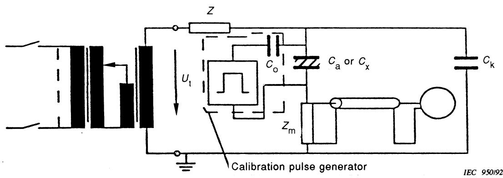  
Figure C.4 – Calibration for unearthed test specimen

## C.4.2 Verification of the noise level

With the arrangement used in C.4.1 the PD test voltage shall be raised up to the highest test voltage. The maximum noise level shall be less than 50 % of the specified discharge magnitude. Otherwise measures according to Clause D.3 are required.

## C.4.3 Calibration for the PD test

With the test specimen in circuit, the procedure of C.4.1 shall be repeated.

Changes in test circuit or test specimen require recalibration. In the case of many similar test specimens, occasional recalibration may be sufficient if:

– the impedance of the coupling capacitor is less than 1/10 of that of the test specimen, or

– the impedance of the test specimen does not deviate from the value during calibration by more than ±10 %.

NOTE When specifying time intervals for recalibration, technical committees should bear in mind that, in case of insufficient sensitivity at the PD meter, potentially harmful discharges cannot be detected.

## C.4.4 Calibration pulse generator

Basically it consists of a small capacitance $C _ { 0 }$ which has been charged to $U _ { 0 }$

The current pulses caused by the pulse generator should have a rise time of less than $0 , 0 3 / f _ { 2 } . C _ { \circ }$ shall have no higher value than $0 , 1 \ C _ { \mathsf { k } }$ . The tail time of the pulse should be greater than 100 μs.

To verify the performance of the PD meter, it shall be calibrated in all measuring ranges. The measuring impedance and the connecting cables shall be included in the procedure.

The following characteristics shall be checked:

– the precision and the stability of the calibration pulse generator;

– the reading for pulses of different amplitudes at a pulse repetition rate of 100 Hz;

the pulse resolution time by using pulses of constant amplitude and increasing repetition rate;

– the lower and upper cut-off frequencies $\pmb { f } _ { 1 }$ and $f _ { 2 }$ .

This procedure shall follow each time repairs are carried out on the PD meter but it shall in any case take place at least once a year.

# Annex D (informative)

# Additional information on partial discharge test methods

## D.1 Measurement of PD inception and extinction voltage

The test voltage is increased from a value below the partial discharge inception voltage until partial discharges occur (PD inception voltage Ui). After further increase of the test voltage by 10 %, the voltage is decreased until PD is smaller than the specified discharge magnitude (PD extinction voltage $U _ { \mathsf { e } } )$ . Thereby the insulation test voltage specified for the test specimen may not be exceeded.

NOTE It may occur that the partial discharge extinction voltage is influenced by the time of the voltage stress with values exceeding the partial discharge inception voltage. During successive measurements, both $U _ { \mathrm { i } }$ and $U _ { \mathrm { e } }$ may be influenced.

This procedure is appropriate for investigation measurements.

## D.2 Description of PD test circuits

Each circuit consists of the following devices:

– the test specimen $C _ { \mathsf { a } }$ (in special cases it may also be an impedance $\mathsfit { Z } _ { \mathsf { a } } )$ ;

– the coupling capacitor $C _ { \mathsf { k } } ;$

the measuring circuit consisting of measuring impedance $Z _ { \mathsf { m } }$ , the connecting cable and the PD meter;

– optionally a filter Z to reduce charge being bypassed by the test voltage source.

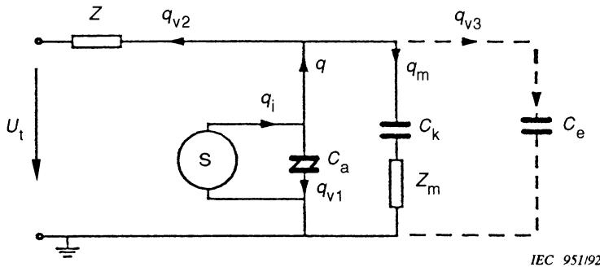

Key

$U _ { \mathrm { t } }$ test voltage $q _ { \mathrm { i } }$ internal charge (not measurable)

$Z$ filter q apparent charge

$s$ PD current source

$q _ { \mathsf { m } }$ measurable charge

$C _ { \mathsf { a } }$ capacitance of the test specimen

$q _ { \vee 1 }$ charge loss across the test specimen

$C _ { \mathsf { k } }$ coupling capacitor

$q _ { \mathsf { v } 2 }$ charge loss across the test voltage source

$Z _ { \mathsf { m } }$ measuring impedance

$q _ { \mathsf { v } 3 }$ charge loss across the earth stray capacitance

$C _ { \mathfrak { e } }$ earth stray capacitance

Figure D.1 – Partial discharge test circuits

The direct measurement of the apparent charge q would require a short-circuit at the terminals of the test specimen for the measuring frequency. This condition can be approximated as follows:

$$
- C _ {\mathrm{k}} > (C _ {\mathrm{a}} + C _ {\mathrm{e}});
$$

– high impedance $z ;$

– low measuring impedance $Z _ { \mathsf { m } }$

Otherwise significant charge losses $q _ { \mathsf { v } 2 }$ and $q _ { \mathsf { v } 3 }$ may occur. These charge losses are taken into account by the calibration but they will limit the sensitivity. The situation is aggravated if the test specimen has a high capacitance.

## D.3 Precautions for reduction of noise

## D.3.1 General

The results of PD measurements may be greatly influenced by noise. Such noise may be introduced by conductive coupling or by electromagnetic interference. In unscreened industrial test sites, single charge pulses as high as 100 pC may occur due to noise. Even under favourable conditions, not less than 20 pC may be expected.

A noise level as low as 1 pC may be achieved, but this will require screening of the test circuit, careful earthing measures and filtering of the low-voltage mains input.

## D.3.2 Sources of noise

Basically there are two different kinds of noise sources.

## D.3.2.1 Sources in the non-energized test circuit

These are caused for instance by switching in adjacent circuits. In case of conductive coupling they only occur if connection to the low-voltage mains supply is provided. In case of electromagnetic coupling they also occur if the mains supply is switched off (including the protective conductor).

## D.3.2.2 Sources in the energized test circuit

Usually, noise increases with the test voltage and is caused by partial discharges outside the test specimen. PD may occur in the test transformer, the high-voltage connecting leads, bushings and points of poor contact. Harmonics of the test voltage may also contribute to the noise level.

## D.3.3 Measures for reduction of noise

Noise caused by conductive coupling can be reduced by use of line filters in the central feeding of the test circuit. No earth loops should be present.

Electromagnetic interference, for instance by radio signals, can be excluded in a simple manner by variation of the measuring frequency $f _ { 0 }$ for narrowband PD meters. For wideband PD meters, band-stop-filters may be required, wideband signals can only be suppressed by screening. The highest efficiency is provided by a fully enclosed screen with high electrical conductivity.

## D.4 Application of multiplying factors for test voltages

## D.4.1 General

The values of the multiplying factors defined in 6.1.3.5 and used in 5.3.3.2.4 and 6.1.3.5 are calculated as follows:

NOTE These examples are given for the recurring peak voltage $U _ { \Gamma \mathsf { p } }$ . The factors similarly apply to the highest steady-state voltage and to the long-term temporary overvoltage.

## D.4.2 Example 1

Circuit connected to the low-voltage mains.

D.4.2.1 Maximum recurring peak voltage $U _ { \Gamma \rho }$

$$
U _ {\mathrm{rp}} = \sqrt {2} U _ {\mathrm{n}} \times F _ {4} = 1, 1 \sqrt {2} U _ {\mathrm{n}}
$$

D.4.2.2 PD extinction voltage $\pmb { U _ { \ominus } }$ (basic insulation)

$$
U _ {\mathrm{e}} = \sqrt {2} U _ {\mathrm{n}} \times F _ {4} \times F _ {1}
$$

$$
U _ {\mathrm{e}} = \sqrt {2} U _ {\mathrm{n}} \times 1, 1 \times 1, 2 = 1, 3 2 \sqrt {2} U _ {\mathrm{n}}
$$

D.4.2.3 Initial value of the PD test voltage $\pmb { U } _ { 1 }$ (basic insulation)

$$
U _ {1} = \sqrt {2} U _ {\mathrm{n}} \times F _ {4} \times F _ {1} \times F _ {2}
$$

$$
U _ {1} = \sqrt {2} U _ {\mathrm{n}} \times 1, 3 2 \times 1, 2 5 = 1, 6 5 \sqrt {2} U _ {\mathrm{n}}
$$

## D.4.3 Example 2

Internal circuit with maximum recurring peak voltage $U _ { \Gamma \mathsf { p } }$

D.4.3.1 PD extinction voltage $\pmb { U _ { \ominus } }$ (basic insulation)

$$
U _ {\mathrm{e}} = U _ {\mathrm{rp}} \times F _ {1} = U _ {\mathrm{rp}} \times 1, 2
$$

$$
U _ {1} = U _ {\mathrm{rp}} \times F _ {1} \times F _ {2} = U _ {\mathrm{rp}} \times 1, 5
$$

D.4.3.2 Initial value of the PD test voltage (basic insulation)

Annex E (informative)  
Comparison of creepage distances specified in Table F.4 and clearances in Table A.1  
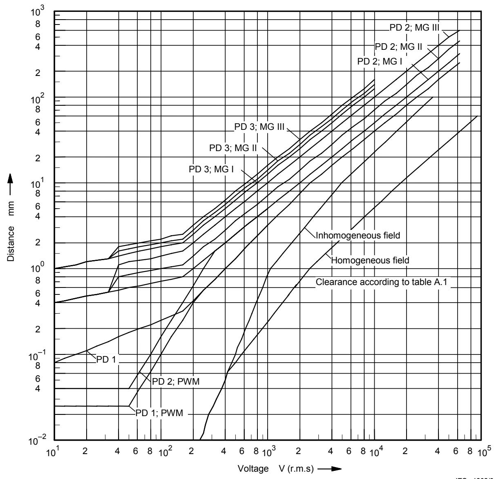  
Key PD pollution degree MG material group PWM printed wiring materia

Figure E.1 – Comparison between creepage distances specified in Table F.4 and clearances in Table A.1

## Annex F (normative)

## Tables

Table F.1 – Rated impulse voltage for equipment energized directly from the low-voltage mains

<table><tr><td rowspan="2" colspan="2">Nominal voltage of the supply system1) based on IEC 600383)</td><td rowspan="2">Voltage line to neutral derived from nominal voltages a.c. or d.c. up to and including</td><td colspan="4">Rated impulse voltage2)</td></tr><tr><td colspan="4">Overvoltage category4)</td></tr><tr><td>Three phaseV</td><td>Single phaseV</td><td>V</td><td>IV</td><td>IIV</td><td>IIIV</td><td>IVV</td></tr><tr><td rowspan="3"></td><td rowspan="2"></td><td>50</td><td>330</td><td>500</td><td>800</td><td>1500</td></tr><tr><td>100</td><td>500</td><td>800</td><td>1500</td><td>2500</td></tr><tr><td>120-240</td><td> $150^{5)}$ </td><td>800</td><td>1500</td><td>2500</td><td>4000</td></tr><tr><td>230/400 277/480</td><td></td><td>300</td><td>1500</td><td>2500</td><td>4000</td><td>6000</td></tr><tr><td>400/690</td><td></td><td>600</td><td>2500</td><td>4000</td><td>6000</td><td>8000</td></tr><tr><td>1000</td><td></td><td>1000</td><td>4000</td><td>6000</td><td>8000</td><td>12000</td></tr><tr><td colspan="7">1) See Annex B for application to existing different low-voltage mains and their nominal voltages.2) Equipment with these rated impulse voltages can be used in installations in accordance with IEC 60364-4-44.3) The / mark indicates a four-wire three-phase distribution system. The lower value is the voltage line-to-neutral, while the higher value is the voltage line-to-line. Where only one value is indicated, it refers to three-wire, three-phase systems and specifies the value line-to-line.4) See 4.3.3.2.2 for an explanation of the overvoltage categories.5) Nominal voltages for single-phase systems in Japan are 100 V or 100-200 V. However, the value of the rated impulse voltage for the voltages is determined from columns applicable to the voltage line to neutral of 150 V (See Annex B).</td></tr></table>

Table F.2 – Clearances to withstand transient overvoltages

<table><tr><td rowspan="4">Requiredimpulse withstandvoltage 1) 5)</td><td colspan="6">Minimum clearances in air up to 2000 m above sea level</td></tr><tr><td colspan="3">Case AInhomogeneous field(see 3.15)</td><td colspan="3">Case BHomogeneous field(see 3.14)</td></tr><tr><td colspan="3">Pollution degree 6)</td><td colspan="3">Pollution degree 6)</td></tr><tr><td>1mm</td><td>2mm</td><td>3mm</td><td>1mm</td><td>2mm</td><td>3mm</td></tr><tr><td>0,33 2)</td><td>0,01</td><td rowspan="6">0,2 3) 4)</td><td rowspan="8">0,8 4)</td><td>0,01</td><td rowspan="7">0,2 3) 4)</td><td rowspan="11">0,8 4)</td></tr><tr><td>0,40</td><td>0,02</td><td>0,02</td></tr><tr><td>0,50 2)</td><td>0,04</td><td>0,04</td></tr><tr><td>0,60</td><td>0,06</td><td>0,06</td></tr><tr><td>0,80 2)</td><td>0,10</td><td>0,10</td></tr><tr><td>1,0</td><td>0,15</td><td>0,15</td></tr><tr><td>1,2</td><td>0,25</td><td>0,25</td><td>0,2</td></tr><tr><td>1,5 2)</td><td>0,5</td><td>0,5</td><td>0,3</td><td>0,3</td></tr><tr><td>2,0</td><td>1,0</td><td>1,0</td><td>1,0</td><td>0,45</td><td>0,45</td></tr><tr><td>2,5 2)</td><td>1,5</td><td>1,5</td><td>1,5</td><td>0,60</td><td>0,60</td></tr><tr><td>3,0</td><td>2,0</td><td>2,0</td><td>2,0</td><td>0,80</td><td>0,80</td></tr><tr><td>4,0 2)</td><td>3,0</td><td>3,0</td><td>3,0</td><td>1,2</td><td>1,2</td><td>1,2</td></tr><tr><td>5,0</td><td>4,0</td><td>4,0</td><td>4,0</td><td>1,5</td><td>1,5</td><td>1,5</td></tr><tr><td>6,0 2)</td><td>5,5</td><td>5,5</td><td>5,5</td><td>2,0</td><td>2,0</td><td>2,0</td></tr><tr><td>8,0 2)</td><td>8,0</td><td>8,0</td><td>8,0</td><td>3,0</td><td>3,0</td><td>3,0</td></tr><tr><td>10</td><td>11</td><td>11</td><td>11</td><td>3,5</td><td>3,5</td><td>3,5</td></tr><tr><td>12 2)</td><td>14</td><td>14</td><td>14</td><td>4,5</td><td>4,5</td><td>4,5</td></tr><tr><td>15</td><td>18</td><td>18</td><td>18</td><td>5,5</td><td>5,5</td><td>5,5</td></tr><tr><td>20</td><td>25</td><td>25</td><td>25</td><td>8,0</td><td>8,0</td><td>8,0</td></tr><tr><td>25</td><td>33</td><td>33</td><td>33</td><td>10</td><td>10</td><td>10</td></tr><tr><td>30</td><td>40</td><td>40</td><td>40</td><td>12,5</td><td>12,5</td><td>12,5</td></tr><tr><td>40</td><td>60</td><td>60</td><td>60</td><td>17</td><td>17</td><td>17</td></tr><tr><td>50</td><td>75</td><td>75</td><td>75</td><td>22</td><td>22</td><td>22</td></tr><tr><td>60</td><td>90</td><td>90</td><td>90</td><td>27</td><td>27</td><td>27</td></tr><tr><td>80</td><td>130</td><td>130</td><td>130</td><td>35</td><td>35</td><td>35</td></tr><tr><td>100</td><td>170</td><td>170</td><td>170</td><td>45</td><td>45</td><td>45</td></tr><tr><td colspan="7">1) This voltage is- for functional insulation, the maximum impulse voltage expected to occur across the clearance (see5.1.5),- for basic insulation directly exposed to or significantly influenced by transient overvoltages from thelow-voltage mains (see 4.3.3.3, 4.3.3.4.1 and 5.1.6), the rated impulse voltage of the equipment,- for other basic insulation (see 4.3.3.4.2), the highest impulse voltage that can occur in the circuit.For reinforced insulation see 5.1.6.2) Preferred values as specified in 4.2.3.3) For printed wiring material, the values for pollution degree 1 apply except that the value shall not be lessthan 0,04 mm, as specified in Table F.4.4) The minimum clearances given for pollution degrees 2 and 3 are based on the reduced withstandcharacteristics of the associated creepage distance under humidity conditions (see IEC 60664-5).5) For parts or circuits within equipment subject to impulse voltages according to 4.3.3.4.2, interpolation ofvalues is allowed. However, standardization is achieved by using the preferred series of impulse voltagevalues in 4.2.3.6) The dimensions for pollution degree 4 are as specified for pollution degree 3, except that the minimumclearance is 1,6 mm.</td></tr></table>

Table F.3a – Single-phase three or two-wire a.c. or d.c. systems

<table><tr><td rowspan="3">Nominal voltage of the supply system *V</td><td colspan="2">Voltages rationalized for Table F.4</td></tr><tr><td>For insulation line-to-line 1)</td><td>For insulation line-to-earth 1)</td></tr><tr><td>All systemsV</td><td>Three-wire systems mid-point earthedV</td></tr><tr><td>12,5</td><td>12,5</td><td></td></tr><tr><td>2425</td><td>25</td><td></td></tr><tr><td>30</td><td>32</td><td></td></tr><tr><td>424850 **</td><td>50</td><td></td></tr><tr><td>60</td><td>63</td><td></td></tr><tr><td>30-60</td><td>63</td><td>32</td></tr><tr><td>100 **</td><td>100</td><td></td></tr><tr><td>110120</td><td>125</td><td></td></tr><tr><td>150 **</td><td>160</td><td></td></tr><tr><td>200</td><td>200</td><td></td></tr><tr><td>100-200</td><td>200</td><td>100</td></tr><tr><td>220</td><td>250</td><td></td></tr><tr><td>110-220120-240</td><td>250</td><td>125</td></tr><tr><td>300 **</td><td>320</td><td></td></tr><tr><td>220-440</td><td>500</td><td>250</td></tr><tr><td>600 **</td><td>630</td><td></td></tr><tr><td>480-960</td><td>1 000</td><td>500</td></tr><tr><td>1 000 **</td><td>1 000</td><td></td></tr><tr><td colspan="3">1) Line-to-earth insulation level for unearthed or impedance-earthed systems equals that for line-to-line because the operating voltage to earth of any line can, in practice, approach full line-to-line voltage. This is because the actual voltage to earth is determined by the insulation resistance and capacitive reactance of each line to earth; thus, low (but acceptable) insulation resistance of one line can in effect earth it and raise the other two to full line-to-line voltage to earth.* For relationship to rated voltage see 4.3.2.** These values correspond to the values given in Table F.1.</td></tr></table>

Table F.3b – Three-phase four or three-wire a.c. systems

<table><tr><td rowspan="3">Nominal voltage of the supply system *V</td><td colspan="3">Voltages rationalized for Table F.4</td></tr><tr><td>For insulation line-to-line</td><td colspan="2">For insulation line-to-earth</td></tr><tr><td>All systemsV</td><td>Three-phase four-wire systems neutral-earthed 2)V</td><td>Three-phase three-wire systems unearthed 1) or corner-earthed V</td></tr><tr><td>60</td><td>63</td><td>32</td><td>63</td></tr><tr><td>110120127</td><td>125</td><td>80</td><td>125</td></tr><tr><td>150 **</td><td>160</td><td>-</td><td>160</td></tr><tr><td>200</td><td>200</td><td></td><td>200</td></tr><tr><td>208</td><td>200</td><td>125</td><td>200</td></tr><tr><td>220230240</td><td>250</td><td>160</td><td>250</td></tr><tr><td>300 **</td><td>320</td><td>-</td><td>320</td></tr><tr><td>380400415</td><td>400</td><td>250</td><td>400</td></tr><tr><td>440</td><td>500</td><td>250</td><td>500</td></tr><tr><td>480500</td><td>500</td><td>320</td><td>500</td></tr><tr><td>575</td><td>630</td><td>400</td><td>630</td></tr><tr><td>600 **</td><td>630</td><td>-</td><td>630</td></tr><tr><td>660690</td><td>630</td><td>400</td><td>630</td></tr><tr><td>720830</td><td>800</td><td>500</td><td>800</td></tr><tr><td>960</td><td>1 000</td><td>630</td><td>1 000</td></tr><tr><td>1 000 **</td><td>1 000</td><td>-</td><td>1 000</td></tr><tr><td colspan="4">1) Line-to-earth insulation level for unearthed or impedance-earthed systems equals that for line-to-line because the operating voltage to earth of any line can, in practice, approach full line-to-line voltage. This is because the actual voltage to earth is determined by the insulation resistance and capacitive reactance of each line to earth; thus, low (but acceptable) insulation resistance of one line can in effect earth it and raise the other two to full line-to-line voltage to earth.2) For equipment for use on both three-phase four-wire and three-phase three-wire supplies, earthed and unearthed, use the values for three-wire systems only.* For relationship to rated voltage see 4.3.2.** These values correspond to the values given in Table F.1.</td></tr></table>

Table F.4 – Creepage distances to avoid failure due to tracking

<table><tr><td rowspan="5">Voltage r.m.s.1)</td><td colspan="9">Minimum creepage distances</td></tr><tr><td colspan="2">Printed wiring material</td><td colspan="7"></td></tr><tr><td colspan="9">Pollution degree</td></tr><tr><td>1</td><td>2</td><td>1</td><td colspan="3">2</td><td colspan="3">3</td></tr><tr><td>All material groups mm</td><td>All material groups, except IIIb mm</td><td>All material groups mm</td><td>Material group I mm</td><td>Material group II mm</td><td>Material group III mm</td><td>Material group I mm</td><td>Material group II mm</td><td>Material group III 2) mm</td></tr><tr><td>10</td><td>0,025</td><td>0,040</td><td>0,080</td><td>0,400</td><td>0,400</td><td>0,400</td><td>1,000</td><td>1,000</td><td>1,000</td></tr><tr><td>12,5</td><td>0,025</td><td>0,040</td><td>0,090</td><td>0,420</td><td>0,420</td><td>0,420</td><td>1,050</td><td>1,050</td><td>1,050</td></tr><tr><td>16</td><td>0,025</td><td>0,040</td><td>0,100</td><td>0,450</td><td>0,450</td><td>0,450</td><td>1,100</td><td>1,100</td><td>1,100</td></tr><tr><td>20</td><td>0,025</td><td>0,040</td><td>0,110</td><td>0,480</td><td>0,480</td><td>0,480</td><td>1,200</td><td>1,200</td><td>1,200</td></tr><tr><td>25</td><td>0,025</td><td>0,040</td><td>0,125</td><td>0,500</td><td>0,500</td><td>0,500</td><td>1,250</td><td>1,250</td><td>1,250</td></tr><tr><td>32</td><td>0,025</td><td>0,040</td><td>0,14</td><td>0,53</td><td>0,53</td><td>0,53</td><td>1,30</td><td>1,30</td><td>1,30</td></tr><tr><td>40</td><td>0,025</td><td>0,040</td><td>0,16</td><td>0,56</td><td>0,80</td><td>1,10</td><td>1,40</td><td>1,60</td><td>1,80</td></tr><tr><td>50</td><td>0,025</td><td>0,040</td><td>0,18</td><td>0,60</td><td>0,85</td><td>1,20</td><td>1,50</td><td>1,70</td><td>1,90</td></tr><tr><td>63</td><td>0,040</td><td>0,063</td><td>0,20</td><td>0,63</td><td>0,90</td><td>1,25</td><td>1,60</td><td>1,80</td><td>2,00</td></tr><tr><td>80</td><td>0,063</td><td>0,100</td><td>0,22</td><td>0,67</td><td>0,95</td><td>1,30</td><td>1,70</td><td>1,90</td><td>2,10</td></tr><tr><td>100</td><td>0,100</td><td>0,160</td><td>0,25</td><td>0,71</td><td>1,00</td><td>1,40</td><td>1,80</td><td>2,00</td><td>2,20</td></tr><tr><td>125</td><td>0,160</td><td>0,250</td><td>0,28</td><td>0,75</td><td>1,05</td><td>1,50</td><td>1,90</td><td>2,10</td><td>2,40</td></tr><tr><td>160</td><td>0,250</td><td>0,400</td><td>0,32</td><td>0,80</td><td>1,10</td><td>1,60</td><td>2,00</td><td>2,20</td><td>2,50</td></tr><tr><td>200</td><td>0,400</td><td>0,630</td><td>0,42</td><td>1,00</td><td>1,40</td><td>2,00</td><td>2,50</td><td>2,80</td><td>3,20</td></tr><tr><td>250</td><td>0,560</td><td>1,000</td><td>0,56</td><td>1,25</td><td>1,80</td><td>2,50</td><td>3,20</td><td>3,60</td><td>4,00</td></tr><tr><td>320</td><td>0,75</td><td>1,60</td><td>0,75</td><td>1,60</td><td>2,20</td><td>3,20</td><td>4,00</td><td>4,50</td><td>5,00</td></tr><tr><td>400</td><td>1,0</td><td>2,0</td><td>1,0</td><td>2,0</td><td>2,8</td><td>4,0</td><td>5,0</td><td>5,6</td><td>6,3</td></tr><tr><td>500</td><td>1,3</td><td>2,5</td><td>1,3</td><td>2,5</td><td>3,6</td><td>5,0</td><td>6,3</td><td>7,1</td><td>8,0 (7,9) 4)</td></tr><tr><td>630</td><td>1,8</td><td>3,2</td><td>1,8</td><td>3,2</td><td>4,5</td><td>6,3</td><td>8,0 (7,9) 4)</td><td>9,0 (8,4) 4)</td><td>10,0 (9,0) 4)</td></tr><tr><td>800</td><td>2,4</td><td>4,0</td><td>2,4</td><td>4,0</td><td>5,6</td><td>8,0</td><td>10,0 (9,0) 4)</td><td>11,0 (9,6) 4)</td><td>12,5 (10,2) 4)</td></tr><tr><td>1 000</td><td>3,2</td><td>5,0</td><td>3,2</td><td>5,0</td><td>7,1</td><td>10,0</td><td>12,5 (10,2) 4)</td><td>14,0 (11,2) 4)</td><td>16,0 (12,8) 4)</td></tr><tr><td>1 250</td><td></td><td></td><td>4,2</td><td>6,3</td><td>9,0</td><td>12,5</td><td>16,0 (12,8) 4)</td><td>18,0 (14,4) 4)</td><td>20,0 (16,0) 4)</td></tr><tr><td>1 600</td><td></td><td></td><td>5,6</td><td>8,0</td><td>11,0</td><td>16,0</td><td>20,0 (16,0) 4)</td><td>22,0 (17,6) 4)</td><td>25,0 (20 0) 4)</td></tr><tr><td>2 000</td><td></td><td></td><td>7,5</td><td>10,0</td><td>14,0</td><td>20,0</td><td>25,0 (20,0) 4)</td><td>28,0 (22,4) 4)</td><td>32,0 (25,6) 4)</td></tr><tr><td>2 500</td><td></td><td></td><td>10,0</td><td>12,5</td><td>18,0</td><td>25,0</td><td>32,0 (25,6) 4)</td><td>36,0 (28,8) 4)</td><td>40,0 (32 0) 4)</td></tr><tr><td>3 200</td><td></td><td></td><td>12,5</td><td>16,0</td><td>22,0</td><td>32,0</td><td>40,0 (32,0) 4)</td><td>45,0 (36,0) 4)</td><td>50,0 (40,0) 4)</td></tr><tr><td>4 000</td><td></td><td></td><td>16,0</td><td>20,0</td><td>28,0</td><td>40,0</td><td>50,0(40,0)4)</td><td>56,0(44,8)4)</td><td>63,0(50,4)4)</td></tr><tr><td>5 000</td><td></td><td></td><td>20,0</td><td>25,0</td><td>36,0</td><td>50,0</td><td>63,0(50,4)4)</td><td>71,0(56,8)4)</td><td>80,0(64,0)4)</td></tr><tr><td>6 300</td><td></td><td></td><td>25,0</td><td>32,0</td><td>45,0</td><td>63,0</td><td>80,0(64,0)4)</td><td>90,0(72,0)4)</td><td>100,0(80,0)4)</td></tr><tr><td>8 000</td><td></td><td></td><td>32,0</td><td>40,0</td><td>56,0</td><td>80,0</td><td>100,0(80,0)4)</td><td>110,0(88,0)4)</td><td>125,0(100,0)4)</td></tr><tr><td>10 000</td><td></td><td></td><td>40,0</td><td>50,0</td><td>71,0</td><td>100,0</td><td>125,0(100,0)4)</td><td>140,0(112,0)4)</td><td>160,0(128,0)4)</td></tr><tr><td>12 500</td><td></td><td></td><td>50,03)</td><td>63,03)</td><td>90,03)</td><td>125,03)</td><td></td><td></td><td></td></tr><tr><td>16 000</td><td></td><td></td><td>63,03)</td><td>80,03)</td><td>110,03)</td><td>160,03)</td><td></td><td></td><td></td></tr><tr><td>20 000</td><td></td><td></td><td>80,03)</td><td>100,03)</td><td>140,03)</td><td>200,03)</td><td></td><td></td><td></td></tr><tr><td>25 000</td><td></td><td></td><td>100,03)</td><td>125,03)</td><td>180,03)</td><td>250,03)</td><td></td><td></td><td></td></tr><tr><td>32 000</td><td></td><td></td><td>125,03)</td><td>160,03)</td><td>220,03)</td><td>320,03)</td><td></td><td></td><td></td></tr><tr><td>40 000</td><td></td><td></td><td>160,03)</td><td>200,03)</td><td>280,03)</td><td>400,03)</td><td></td><td></td><td></td></tr><tr><td>50 000</td><td></td><td></td><td>200,03)</td><td>250,03)</td><td>360,03)</td><td>500,03)</td><td></td><td></td><td></td></tr><tr><td>63 000</td><td></td><td></td><td>250,03)</td><td>320,03)</td><td>450,03)</td><td>600,03)</td><td></td><td></td><td></td></tr><tr><td colspan="10">1) This voltage is– for functional insulation, the working voltage,– for basic and supplementary insulation of the circuit energized directly from the supply mains (see 4.3.2.2.1), the voltage rationalized through Table F.3a or Table F.3b, based on the rated voltage of the equipment, or the rated insulation voltage,– for basic and supplementary insulation of systems, equipment and internal circuits not energized directly from the mains (see 4.3.2.2.2), the highest r.m.s. voltage which can occur in the system, equipment or internal circuit when supplied at rated voltage and under the most onerous combination of conditions of operation within equipment rating.2) Material group IIIb is not recommended for application in pollution degree 3 above 630 V.3) Provisional data based on extrapolation. Technical committees who have other information based on experience may use their dimensions.4) The values given in brackets may be applied to reduce the creepage distance in case of using a rib (see 5.2.5).</td></tr><tr><td colspan="10">NOTE The high precision for creepage distances given in this table does not mean that the uncertainty of measurement has to be in the same order of magnitude.</td></tr></table>

## Table F.5 – Test voltages for verifying clearances at different altitudes

The voltage values of Table F.5 apply for the verification of clearances only.

<table><tr><td>Rated impulse voltage $\hat{U}$ kV</td><td>Impulse test voltage at sea level $\hat{U}$ kV</td><td>Impulse test voltage at 200 m altitude $\hat{U}$ kV</td><td>Impulse test voltage at 500 m altitude $\hat{U}$ kV</td></tr><tr><td>0,33</td><td>0,357</td><td>0,355</td><td>0,350</td></tr><tr><td>0,5</td><td>0,541</td><td>0,537</td><td>0,531</td></tr><tr><td>0,8</td><td>0,934</td><td>0,920</td><td>0,899</td></tr><tr><td>1,5</td><td>1,751</td><td>1,725</td><td>1,685</td></tr><tr><td>2,5</td><td>2,920</td><td>2,874</td><td>2,808</td></tr><tr><td>4,0</td><td>4,923</td><td>4,824</td><td>4,675</td></tr><tr><td>6,0</td><td>7,385</td><td>7,236</td><td>7,013</td></tr><tr><td>8,0</td><td>9,847</td><td>9,648</td><td>9,350</td></tr><tr><td>12,0</td><td>14,770</td><td>14,471</td><td>14,025</td></tr><tr><td colspan="4">NOTE 1 Explanations concerning the influencing factors (air pressure, altitude, temperature, humidity) with respect to electric strength of clearances are given in 6.1.2.2.1.3.NOTE 2 When testing clearances, associated solid insulation will be subjected to the test voltage. As the impulse test voltage of Table F.5 is increased with respect to the rated impulse voltage, solid insulation will have to be designed accordingly. This results in an increased impulse withstand capability of the solid insulation.</td></tr></table>

Table F.6 – Severities for conditioning of solid insulation

<table><tr><td>Test</td><td>Temperature °C</td><td>Relative humidity %</td><td>Time h</td><td>Number of cycles</td></tr><tr><td>a) Dry heat</td><td>+55</td><td>-</td><td>48</td><td>1</td></tr><tr><td>b) Dry heat cycle</td><td>-10 to +55</td><td>-</td><td>Cycle duration 24</td><td>3</td></tr><tr><td>c) Thermal shock (rapid change of temperature)</td><td>-10 to +55</td><td>-</td><td>2)</td><td></td></tr><tr><td>d) Damp heat</td><td>30/40 1)</td><td>93</td><td>96</td><td>1</td></tr><tr><td colspan="5">1) Standard temperature of damp heat test appears in IEC 60068-2-78.2) Duration of the temperature change depends on the thermal time constant of the test specimen, see IEC 60068-2-14.</td></tr></table>

NOTE For the damp heat test ${ } ^ { 2 5 } { } ^ { \circ } \mathsf { C }$ is still used in some product standards.

Table F.7 – Clearances to withstand steady-state voltages, temporary overvoltages or recurring peak voltages  
Table F.7a – Dimensioning of clearances to withstand steady-state voltages, temporary overvoltages or recurring peak voltages  
Table F.7b – Additional information concerning the dimensioning of clearances to avoid partial discharge

<table><tr><td rowspan="2"> $Voltage^{1)}$ (peak value) $^{2)}$ kV</td><td colspan="2">Minimum clearances in air up to 2000 m above sea level</td><td rowspan="15"></td><td rowspan="2"> $Voltage^{1)}$ (peak value) $^{2)}$ kV</td><td>Minimum clearances in air up to 2000 m above sea level</td></tr><tr><td>Case A Inhomogeneous field conditions (see 3.15)mm</td><td>Case B Homogeneous field conditions (see 3.14)mm</td><td>Case A Inhomogeneous field conditions (see 3.15)mm</td></tr><tr><td>0,04</td><td> $0,001 ^{3)}$ </td><td> $0,001 ^{3)}$ </td><td>0,04</td><td rowspan="16">As specified for case A in Table F.7a</td></tr><tr><td>0,06</td><td> $0,002 ^{3)}$ </td><td> $0,002 ^{3)}$ </td><td>0,06</td></tr><tr><td>0,1</td><td> $0,003 ^{3)}$ </td><td> $0,003 ^{3)}$ </td><td>0,1</td></tr><tr><td>0,12</td><td> $0,004 ^{3)}$ </td><td> $0,004 ^{3)}$ </td><td>0,12</td></tr><tr><td>0,15</td><td> $0,005 ^{3)}$ </td><td> $0,005 ^{3)}$ </td><td>0,15</td></tr><tr><td>0,20</td><td> $0,006 ^{3)}$ </td><td> $0,006 ^{3)}$ </td><td>0,2</td></tr><tr><td>0,25</td><td> $0,008 ^{3)}$ </td><td> $0,008 ^{3)}$ </td><td>0,25</td></tr><tr><td>0,33</td><td>0,01</td><td>0,01</td><td>0,33</td></tr><tr><td>0,4</td><td>0,02</td><td>0,02</td><td>0,4</td></tr><tr><td>0,5</td><td>0,04</td><td>0,04</td><td>0,5</td></tr><tr><td>0,6</td><td>0,06</td><td>0,06</td><td>0,6</td></tr><tr><td>0,8</td><td>0,13</td><td>0,1</td><td>0,8</td></tr><tr><td>1,0</td><td>0,26</td><td>0,15</td><td>1,0</td></tr><tr><td>1,2</td><td>0,42</td><td>0,2</td><td></td><td>1,2</td></tr><tr><td>1,5</td><td>0,76</td><td>0,3</td><td rowspan="4"></td><td>1,5</td></tr><tr><td>2,0</td><td>1,27</td><td>0,45</td><td>2,0</td></tr><tr><td>2,5</td><td>1,8</td><td>0,6</td><td>2,5</td><td>2,0</td></tr><tr><td>3,0</td><td>2,4</td><td>0,8</td><td>3,0</td><td>3,2</td></tr><tr><td>4,0</td><td>3,8</td><td>1,2</td><td></td><td>4,0</td><td>11</td></tr><tr><td>5,0</td><td>5,7</td><td>1,5</td><td rowspan="4"></td><td>5,0</td><td>24</td></tr><tr><td>6,0</td><td>7,9</td><td>2</td><td>6,0</td><td>64</td></tr><tr><td>8,0</td><td>11,0</td><td>3</td><td>8,0</td><td>184</td></tr><tr><td>10</td><td>15,2</td><td>3,5</td><td>10</td><td>290</td></tr><tr><td>12</td><td>19</td><td>4,5</td><td></td><td>12</td><td>320</td></tr><tr><td>15</td><td>25</td><td>5,5</td><td rowspan="3"></td><td>15</td><td rowspan="9">3)</td></tr><tr><td>20</td><td>34</td><td>8</td><td>20</td></tr><tr><td>25</td><td>44</td><td>10</td><td>25</td></tr><tr><td>30</td><td>55</td><td>12,5</td><td></td><td>30</td></tr><tr><td>40</td><td>77</td><td>17</td><td></td><td>40</td></tr><tr><td>50</td><td>100</td><td>22</td><td rowspan="4"></td><td>50</td></tr><tr><td>60</td><td rowspan="3"></td><td>27</td><td>60</td></tr><tr><td>80</td><td>35</td><td>80</td></tr><tr><td>100</td><td>45</td><td>100</td></tr><tr><td colspan="3">1) The clearances for other voltages are obtained by interpolation.2) See Figure 1 for recurring peak voltage.3) These values are based on experimental data obtained at atmospheric pressure.</td><td></td><td colspan="2">1) The clearances for other voltages are obtained by interpolation.2) See Figure 1 for recurring peak voltage.3) Dimensioning without partial discharge is not possible under inhomogeneous field conditions.</td></tr></table>

NOTE If clearances are stressed with steady-state voltages of 2,5 kV (peak) and above, dimensioning according to the breakdown values in Table F.7a may not provide operation without corona (partial discharges), especially for inhomogeneous fields. In order to provide corona-free operation, it is either necessary to use larger clearances, as given in Table F.7b, or to improve the field distribution.

Table F.8 – Altitude correction factors

<table><tr><td>Altitude m</td><td>Factor  $k_{\text{d}}$  for distance correction</td></tr><tr><td>0</td><td>0,784</td></tr><tr><td>200</td><td>0,803</td></tr><tr><td>500</td><td>0,833</td></tr><tr><td>1 000</td><td>0,844</td></tr><tr><td>2 000</td><td>1</td></tr></table>

## Bibliography

[1] ISO/IEC Guide 2:1996, Standardization and related activities – General vocabulary

[2] IEC 60529:1989, Degrees of protection provided by enclosures (IP Code) Amendment 1 (1999)

[3] PFEIFFER, W. “Die Stoßspannungsfestigkeit von Luftstrecken kleiner Schlagweite“. Elektrotechnische Zeitschrift B; Vol.28(1976), pp300-302

[4] HERMSTEIN, W. Bemessung von Luftstrecken, Insbesondere für 50 Hz-Wechselspannung, Elektrotechnische Zeitschrift; Vol.90(1969), pp251-255

[5] DAKIN, T., LUXA, G., OPPERMANN, G., VIGREUX, J., WIND, G. WINKELNKEMPER, H. “Breakdown of gases in uniform fields, paschen curves for nitrogen, air and sulfur hexafluoride”; Electra (issued by CIGRE), Vol.32(1974), pp61-82.

## SOMMAIRE

1 Domaine d'application et objet....79
2 Références normatives....80
3 Termes et définitions....81
4 Bases de la coordination de l'isolement....87
4.1 Généralités....87
4.2 Coordination de l'isolement relative aux tensions....87
4.2.1 Généralités....87
4.2.2 Coordination de l'isolement relative aux tensions en c.a. ou en c.c. pour des longues durées....87
4.2.3 Coordination de l'isolement relative aux surtensions transitoires....87
4.2.4 Coordination de l'isolement relative aux tensions de crête répétitive....88
4.2.5 Coordination de l'isolement relative aux surtensions temporaires....88
4.2.6 Coordination d'isolement relative aux conditions d'environnement....88
4.3 Tensions et caractéristiques assignées de tension....89
4.3.1 Généralités....89
4.3.2 Détermination de la tension pour des contraintes de longues durées....89
4.3.3 Détermination de la tension assignée de tenue aux chocs....90
4.3.4 Détermination de la tension de crête répétitive....92
4.3.5 Détermination de la surtension temporaire....92
4.4 Fréquence....93
4.5 Durée d'application de la contrainte de tension....93
4.6 Pollution....93
4.6.1 Généralités....93
4.6.2 Degrés de pollution dans le micro-environnement....94
4.6.3 Conditions de pollution conductrice....94
4.7 Information fournie avec le matériel....94
4.8 Matériau isolant....94
4.8.1 Indice de résistance au cheminement (IRC)....94
4.8.2 Caractéristiques de rigidité diélectrique....95
4.8.3 Caractéristiques thermiques....95
4.8.4 Caractéristiques mécaniques et chimiques....96
5 Exigences et règles de dimensionnement....96
5.1 Dimensionnement des distances d'isolement....96
5.1.1 Généralités....96
5.1.2 Critères de dimensionnement....96
5.1.3 Conditions de champ électrique....97
5.1.4 Altitude....97
5.1.5 Dimensionnement des distances d'isolement de l'isolation fonctionnelle....98
5.1.6 Dimensionnement des distances d'isolement de l'isolation principale, supplémentaire et renforcée....98
5.1.7 Distances de sectionnement....98
5.2 Dimensionnement des lignes de fuite....99
5.2.1 Généralités....99
5.2.2 Facteurs d'influence....99
5.2.3 Dimensionnement des lignes de fuite de l'isolation fonctionnelle....100

5.2.4 Dimensionnement des lignes de fuite de l'isolation principale supplémentaire et renforcée .... 100
5.2.5 Réduction des lignes de fuite avec l'utilisation d'une nervure (de nervures).... 101
5.3 Exigences pour la conception de l'isolation solide .... 101
5.3.1 Généralités.... 101
5.3.2 Contraintes.... 102
5.3.3 Exigences.... 104
6 Essais et mesures.... 107
6.1 Essais.... 107
6.1.1 Généralités.... 107
6.1.2 Essai pour la vérification des distances dans l'air.... 107
6.1.3 Essais pour la vérification de l'isolation solide.... 110
6.1.4 Exécution des essais diélectriques sur des matériels complets.... 116
6.1.5 Autres essais.... 117
6.1.6 Précision de mesurage des paramètres d'essai.... 118
6.2 Mesure des lignes de fuite et des distances d'isolement.... 118

Annexe A (informative) Données fondamentales des caractéristiques de tenue des distances d'isolement.... 123
Annexe B (informative) Tensions nominales des réseaux d'alimentation pour différents modes de contrôle des surtensions.... 128
Annexe C (normative) Méthodes d'essai de décharge partielle.... 130
Annexe D (informative) Informations complémentaires sur les méthodes d'essai de décharges partielles.... 135
Annexe E (informative) Comparaison entre les lignes de fuite spécifiées au Tableau F.4 et les distances d'isolement du Tableau A.1.... 138
Annexe F (normative) Tableaux.... 139

Bibliographie.... 148

Figure 1 – Tension de crête répétitive.... 92
Figure 2 – Détermination de la largeur (W) et de la hauteur (H) d'une nervure.... 101
Figure 3 – Tensions d'essai.... 115
Figure A.1 – Tension de tenue à 2 000 m au-dessus du niveau de la mer.... 125
Figure A.2 – Valeurs expérimentales mesurées approximativement au niveau de la mer avec leurs limites inférieures pour les champs hétérogènes.... 126
Figure A.3 – Valeurs expérimentales mesurées approximativement au niveau de la mer avec leurs limites inférieures pour les champs homogènes.... 127
Figure C.1 – Spécimen d'essai relié à la terre.... 130
Figure C.2 – Spécimen d'essai non relié à la terre.... 130
Figure C.3 – Etalonnage pour un spécimen relié à la terre.... 133
Figure C.4 – Etalonnage d'un spécimen d'essai non relié à la terre.... 134
Figure D.1 – Circuits d'essai de décharge partielle.... 135
Figure E.1 – Comparaison entre les lignes de fuite spécifiées au tableau F.4 et les distances d'isolement du tableau A.1.... 138

Tableau A.1 – Tensions de tenue en kilovolts pour une altitude de 2 000 m au-dessus du niveau de la mer .... 123
Tableau A.2 – Facteurs de correction d'altitude .... 124
Tableau B.1 – Situation naturelle ou situation contrôlée équivalente .... 128
Tableau B.2 – Cas où une situation contrôlée est nécessaire et où le contrôle est procuré par des parafoudres dont le rapport de la tension résiduelle à la tension assignée n'est pas inférieur à celui spécifié par la CEI 60099-1 .... 129
Tableau F.1 – Tension assignée de choc pour les matériels alimentés directement par le réseau basse tension .... 139
Tableau F.2 — Distances d'isolement pour supporter les surtensions transitoires .... 140
Tableau F.3a – Réseaux monophasés 3 ou 2 fils c.a. ou c.c. .... 141
Tableau F.3b – Réseaux c.a. triphasés 4 ou 3 fils .... 142
Tableau F.4 – Lignes de fuite pour éviter les défaillances dues au cheminement .... 143
Tableau F.5 – Tensions d'essai pour vérifier les distances d'isolement dans l'air à différentes altitudes .... 145
Tableau F.6 – Sévérités pour le conditionnement de l'isolation solide .... 145
Tableau F.7 – Distances d'isolement pour résister aux tensions en régime permanent, aux surtensions temporaires ou aux tensions de crête répétitives .... 146
Tableau F.7a – Dimensionnement des distances d'isolement pour résister aux tensions en régime permanent, aux surtensions temporaires ou aux tensions de crête répétitives .... 146
Tableau F.7b – Informations complémentaires pour le dimensionnement des distances d'isolement pour éviter les décharges partielles .... 146
Tableau F.8 – Facteurs de correction d'altitude .... 147

# COMMISSION ÉLECTROTECHNIQUE INTERNATIONALE

# COORDINATION DE L’ISOLEMENT DES MATÉRIELS DANS LES SYSTÈMES (RÉSEAUX) À BASSE TENSION –

Partie 1: Principes, exigences et essais

## AVANT-PROPOS

1) La Commission Electrotechnique Internationale (CEI) est une organisation mondiale de normalisation composée de l'ensemble des comités électrotechniques nationaux (Comités nationaux de la CEI). La CEI a pour objet de favoriser la coopération internationale pour toutes les questions de normalisation dans les domaines de l'électricité et de l'électronique. A cet effet, la CEI – entre autres activités – publie des Normes internationales, des Spécifications techniques, des Rapports techniques, des Spécifications accessibles au public (PAS) et des Guides (ci-après dénommés "Publication(s) de la CEI"). Leur élaboration est confiée à des comités d'études, aux travaux desquels tout Comité national intéressé par le sujet traité peut participer. Les organisations internationales, gouvernementales et non gouvernementales, en liaison avec la CEI, participent également aux travaux. La CEI collabore étroitement avec l'Organisation Internationale de Normalisation (ISO), selon des conditions fixées par accord entre les deux organisations.

2) Les décisions ou accords officiels de la CEI concernant les questions techniques représentent, dans la mesure du possible, un accord international sur les sujets étudiés, étant donné que les Comités nationaux intéressés sont représentés dans chaque comité d’études.

3) Les Publications de la CEI se présentent sous la forme de recommandations internationales et sont agréées comme telles par les Comités nationaux de la CEI. Tous les efforts raisonnables sont entrepris afin que la CEI s'assure de l'exactitude du contenu technique de ses publications; la CEI ne peut pas être tenue responsable de l'éventuelle mauvaise utilisation ou interprétation qui en est faite par un quelconque utilisateur final.

4) Dans le but d'encourager l'unification internationale, les Comités nationaux de la CEI s'engagent à appliquer de façon transparente, dans toute la mesure possible, les normes internationales de la CEI dans leurs normes nationales et régionales. Toutes divergences entre toutes Publications de la CEI et toutes publications nationales ou régionales correspondantes doivent être indiquées en termes clairs dans ces dernières.

5) La CEI n’a prévu aucune procédure de marquage valant indication d’approbation et n'engage pas sa responsabilité pour les équipements déclarés conformes à une de ses Publications.

6) Tous les utilisateurs doivent s'assurer qu'ils sont en possession de la dernière édition de cette publication.

7) Aucune responsabilité ne doit être imputée à la CEI, à ses administrateurs, employés, auxiliaires ou mandataires, y compris ses experts particuliers et les membres de ses comités d'études et des Comités nationaux de la CEI, pour tout préjudice causé en cas de dommages corporels et matériels, ou de tout autre dommage de quelque nature que ce soit, directe ou indirecte, ou pour supporter les coûts (y compris les frais de justice) et les dépenses découlant de la publication ou de l'utilisation de cette Publication de la CEI ou de toute autre Publication de la CEI, ou au crédit qui lui est accordé.

8) L'attention est attirée sur les références normatives citées dans cette publication. L'utilisation de publications référencées est obligatoire pour une application correcte de la présente publication.

9) L’attention est attirée sur le fait que certains des éléments de la présente Publication de la CEI peuvent faire l’objet de droits de propriété intellectuelle ou de droits analogues. La CEI ne saurait être tenue pour responsable de ne pas avoir identifié de tels droits de propriété et de ne pas avoir signalé leur existence.

La Norme internationale CEI 60664 a été établie par le comité d’études 109: Coordination de l'isolement pour le matériel à basse tension, de la CEI.

Cette deuxième édition annule et remplace la première édition publiée en 1992, ses amendements 1 (2000) et 2 (2002) et son corrigendum (2002).

Elle a le statut de publication fondamentale de sécurité, conformément au Guide CEI 104.

Outre un certain nombre d’améliorations rédactionnelles, les principales modifications suivantes ont été apportées à l’édition antérieure:

Modification des conditions du réseau électrique au Japon en ce qui concerne les tensions assignées de choc, les tensions rationalisées et les tensions nominales des réseaux d’alimentation pour différents modes de contrôle des surtensions

Modification du dimensionnement des distances d’isolement dans l’air inférieures à 0,01 mm

Alignement du tableau et des formules correspondantes concernant les tensions d’essai pour la vérification des distances d’isolement dans l’air à différentes altitudes

• Modification de l’interpolation des valeurs de ligne de fuite pour l'isolation fonctionnelle

• Modification du dimensionnement des lignes de fuite tenant compte des nervures

Révision de l’ancien Article 4 "Essais et mesures" (désormais Article 6) pour obtenir une description plus détaillée des essais et de leur objet, du matériel d’essai et des alternatives existantes

Transformation de l’Annexe C "Méthodes d’essai de décharge partielle" d’un ancien rapport technique de type 2 (désigné désormais TS) en une Annexe C normative.

Le texte de cette norme est issu des documents suivants:

<table><tr><td>CDV</td><td>Rapport de vote</td></tr><tr><td>109/58/CDV</td><td>109/62/RVC</td></tr></table>

Le rapport de vote indiqué dans le tableau ci-dessus donne toute information sur le vote ayant abouti à l'approbation de cette norme.

Cette publication a été rédigée selon les Directives ISO/CEI, Partie 2.

Une liste de toutes les parties de la série CEI 60664, présentées sous le titre général Coordination de l’isolement des matériels dans les systèmes (réseaux), peut être consultée sur le site web de la CEI.

Le comité a décidé que le contenu de cette publication ne sera pas modifié avant la date de maintenance indiquée sur le site web de la CEI sous "http://webstore.iec.ch" dans les données relatives à la publication recherchée. A cette date, la publication sera

• reconduite;

• supprimée;

• remplacée par une édition révisée, ou

• amendée.

# COORDINATION DE L’ISOLEMENT DES MATÉRIELS DANS LES SYSTÈMES (RÉSEAUX) À BASSE TENSION –

# Partie 1: Principes, exigences et essais

## 1 Domaine d’application et objet

La présente partie de la CEI 60664 traite de la coordination de l'isolement des matériels dans les systèmes (réseaux) à basse tension. Elle s'applique au matériel utilisé jusqu'à 2 000 m au-dessus du niveau de la mer, ayant une tension assignée ne dépassant pas 1 000 V en courant alternatif, de fréquences assignées ne dépassant pas 30 kHz, ou une tension assignée ne dépassant pas 1 500 V en courant continu.

Elle définit les exigences pour des distances d'isolement dans l'air, des lignes de fuite et l'isolation solide des matériels, à partir de leurs critères de performance. Elle comprend les méthodes d'essais diélectriques concernant la coordination de l'isolement.

Les distances minimales d'isolement dans l'air spécifiées dans la présente norme ne s'appliquent pas en présence de gaz ionisés. Les exigences particulières dans de telles conditions peuvent être spécifiées, comme ils l'entendent, par les comités d'études compétents.

La présente norme ne traite pas des distances

– à travers l'isolation liquide,

– à travers les gaz autres que l'air,

– à travers l'air comprimé.

NOTE 1 La coordination de l’isolement des matériels dans les systèmes à basse tension dont les fréquences assignées sont supérieures à 30 kHz est donnée dans la CEI 60664-4.

NOTE 2 Des tensions plus élevées peuvent exister dans les circuits internes des matériels.

NOTE 3 Un guide pour le dimensionnement pour les altitudes supérieures à 2 000 m est donné au Tableau A.2.

L’objet de la présente norme fondamentale de sécurité est de guider les comités d’études responsables de matériels différents, de manière à rationaliser leurs spécifications, afin de réaliser la coordination de l’isolement.

Elle fournit les informations nécessaires pour guider les comités d'études ayant à spécifier les distances d'isolement dans l'air, des lignes de fuite et l'isolation solide des matériels.

On doit veiller à ce que les fabricants et les comités d’études soient responsables de l’application des exigences telles qu’elles sont spécifiées dans la présente publication fondamentale de sécurité ou y fassent référence lorsque cela est nécessaire dans les domaines d’application des normes applicables aux matériels.

En l’absence de valeurs spécifiées pour les distances d'isolement dans l'air, les lignes de fuite et les exigences pour les isolations solides dans les normes de produits applicables, ou même en l'absence de normes, la présente norme est applicable.

## 2 Références normatives

Les documents de référence suivants sont indispensables pour l'application du présent document. Pour les références datées, seule l'édition citée s'applique. Pour les références non datées, la dernière édition du document de référence s'applique (y compris les éventuels amendements).

CEI 60038:1983, Tensions normales de la CEI

CEI 60050(151):2001, Vocabulaire Électrotechnique International (VEI) – Chapitre 151: Dispositifs électriques et magnétiques

CEI 60050(212):1990, Vocabulaire Électrotechnique International (VEI) – Chapitre 212: Isolants solides, liquides et gazeux

CEI 60050(604):1987, Vocabulaire Electrotechnique International (VEI) – Chapitre 604: Génération, transmission et distribution d’électricité - Fonctionnement Amendement 1 (1998)

CEI 60050(826):2004, Vocabulaire Electrotechnique International (VEI) – Partie 826: Installations électriques

CEI 60068-1:1988, Essais d'environnement – Partie 1: Généralités et guide

CEI 60068-2-2:1974, Analyse environnementale – Partie 2-2: Essais – Essais B: Chaleur sèche

CEI 60068-2-14:1984, Analyse environnementale – Partie 2-14: Essais – Essai N: Variations de température

CEI 60068-2-78:2001, Essais d’environnement – Partie 2-78: Essais – Essai Cab: Chaleur humide, essai continu

CEI 60085:2004, Isolation électrique – Classification thermique

CEI 60099-1:1991, Parafoudres – Partie 1: Parafoudres à résistance variable avec éclateurs pour réseaux à courant alternatif

CEI 60112:2003, Méthode de détermination des indices de résistance et de tenue au cheminement des matériaux isolants solides

CEI 60216 (toutes les parties), Matériaux isolants électriques – Propriétés d'endurance thermique

CEI 60243-1:1998, Rigidité diélectrique des matériaux isolants solides – Méthodes d'essai – Partie 1: Essais aux fréquences industrielles

CEI 60270:2000, Techniques des essais à haute tension – Mesures des décharges partielles

CEI 60364-4-44:2001, Installations électriques des bâtiments – Partie 4-44: Protection pour assurer la sécurité – Protection contre les perturbations de tension et les perturbations électromagnétiques Amendement 1 (2003)

CEI 60664-4:2005, Coordination de l'isolement des matériels dans les systèmes (réseaux) à basse tension – Partie 4: Considérations sur les contraintes de tension à hautes fréquences

CEI 60664-5, Coordination de l'isolement des matériels dans les systèmes (réseaux) à basse tension – Partie 5: Méthode détaillée de détermination des distances d’isolement dans l’air et des lignes de fuite inférieures ou égales à 2 mm1

CEI 61140:2001, Protection contre les chocs électriques – Aspects communs pour les installations et les matériels Amendement 1 (2004)

CEI 61180-1:1992, Techniques des essais à haute tension pour matériels à basse tension – Partie 1: Définitions, prescriptions et modalités relatives aux essais

CEI 61180-2:1994, Techniques des essais à haute tension pour matériels à basse tension – Partie 2: Matériel d’essai

Guide CEI 104:1997, Elaboration des publications de sécurité et utilisation des publications fondamentales de sécurité et publications groupées de sécurité

## 3 Termes et définitions

Pour les besoins du présent document, les définitions suivantes s'appliquent.

## 3.1

## coordination de l'isolement

correspondance mutuelle des caractéristiques d'isolement du matériel électrique en tenant compte du micro-environnement prévu et des autres contraintes ayant une influence

NOTE Les contraintes de tension prévues sont caractérisées en termes de caractéristiques définies de 3.5 à 3.7.

## 3.2

distance d’isolement dans l’air (distance d’isolement) distance la plus courte dans l’air entre deux parties conductrices

## 3.3

ligne de fuite distance la plus courte, le long de la surface d’un isolant solide, entre deux parties conductrices

(VEI 151-15-50)

## 3.4

## isolation solide

matériau isolant solide interposé entre deux parties conductrices

## 3.5

## tension locale

valeur efficace la plus élevée de la tension en courant alternatif ou continu qui peut apparaître à travers n'importe quelle isolation lorsqu'un matériel est alimenté sous la tension assignée

NOTE 1 Les surtensions transitoires sont négligées.

NOTE 2 Il est tenu compte à la fois des conditions à vide et des conditions normales de fonctionnement.

## 3.6

## tension de crête répétitive

## Urp

valeur de crête maximale des excursions périodiques de la forme d'onde de tension résultant des déformations d'une tension en c.a. ou de composantes alternatives superposées à la tension en c.c.

NOTE Les surtensions aléatoires dues par exemple à des manœuvres occasionnelles ne sont pas considérées comme des tensions de crête répétitive.

## 3.7

## surtension

toute tension ayant une valeur de crête dépassant la valeur de crête correspondante de la tension maximale en régime permanent dans les conditions normales de fonctionnement

## 3.7.1

## surtension temporaire

surtension à fréquence industrielle de durée relativement longue

## 3.7.2

## surtension transitoire

surtension de courte durée, ne dépassant pas quelques millisecondes, oscillatoire ou non, généralement fortement amortie

(VEI 604-03-13)

## 3.7.3

## surtension de (type) manœuvre surtension de (type) manœuvre

surtension transitoire apparaissant en un point d'un réseau et engendrée par une manœuvre ou un défaut

## 3.7.4

## surtension de (type) foudre

surtension transitoire apparaissant en un point d'un réseau et engendrée par une décharge atmosphérique

## 3.7.5

## surtension fonctionnelle

surtension intentionnelle nécessaire au fonctionnement d'un appareil

## 3.8

## tension de tenue

tension à laquelle doit être soumise une éprouvette dans des conditions d’essai prescrites et qui ne produit pas de claquage ou de contournement d’une éprouvette satisfaisante

(VEI 212-01-31)

## 3.8.1

## tension de tenue aux chocs

valeur de crête la plus élevée d'une tension de choc, de forme et de polarité prescrites, qui ne provoque pas de claquage dans des conditions d'essai spécifiées

## 3.8.2

tension de tenue en valeur efficace valeur efficace la plus élevée d'une tension qui ne provoque pas de claquage de l'isolation dans des conditions d'essai spécifiées

## 3.8.3

## tension de tenue aux crêtes répétitives

valeur de crête la plus élevée d'une tension de crête répétitive qui ne provoque pas de claquage de l'isolation dans des conditions spécifiées

## 3.8.4

## tension de tenue aux surtensions temporaires

valeur efficace la plus élevée d'une surtension temporaire qui ne provoque pas de claquage de l'isolation dans des conditions spécifiées

## 3.9

## tension assignée

valeur de la tension, fixée par le fabricant à un composant, à un dispositif ou à un matériel et à laquelle on se réfère pour le fonctionnement et pour les caractéristiques fonctionnelles

NOTE Les matériels peuvent avoir plusieurs valeurs ou une plage de tensions assignées.

## 3.9.1

## tension assignée d'isolement

valeur efficace de tension de tenue fixée par le fabricant aux matériels ou à une partie d'entre eux, caractérisant la capacité de tenue spécifiée (à long terme) de son isolation

NOTE La tension assignée d'isolement n'est pas nécessairement égale à la tension assignée des matériels qu est principalement liée aux caractéristiques fonctionnelles.

## 3.9.2

## tension assignée de tenue aux chocs

valeur de tension de tenue aux chocs fixée par le fabricant aux matériels ou à une partie d'entre eux, caractérisant la capacité de tenue spécifiée de son isolation contre des surtensions transitoires

## 3.9.3

## tension assignée de tenue aux crêtes répétitives

valeur de la tension de tenue aux crêtes répétitives fixée par le fabricant aux matériels ou à une partie d'entre eux caractérisant la capacité de tenue spécifiée de son isolation contre les tensions de crêtes répétitives

## 3.9.4

## surtension temporaire assignée

valeur de la tension de tenue aux surtensions temporaires fixée par le fabricant aux matériels ou à une partie d'entre eux, caractérisant la capacité de tenue spécifiée pour de courtes durées de son isolation contre les tensions en c.a.

## 3.10

## catégorie de surtension

nombre définissant une condition de surtension transitoire

NOTE 1 Les catégories de surtension I, II, III, IV sont utilisées, voir 4.3.3.2.

NOTE 2 Le terme ‘catégorie de surtension’ de la présente norme est un synonyme du terme catégorie de tenue aux chocs utilisé dans la CEI 60364-4-44, Article 443.

## 3.11

## pollution

tout apport de matériau étranger solide, liquide ou gazeux (gaz ionisés), qui peut entraîner une réduction de la rigidité diélectrique ou de la résistivité de la surface de l'isolation

## 3.12

## environnement

environnement qui peut influer sur le fonctionnement d’un dispositif ou d’un système

NOTE Des exemples sont la pression, la température, l’humidité, la pollution, les rayonnements et les vibrations.

(VEI 151-16-03, modifiée)

## 3.12.1

## macro-environnement

environnement de la pièce ou de tout autre endroit dans lequel le matériel est installé ou utilisé

## 3.12.2

## micro-environnement

environnement immédiat de l'isolation qui influence en particulier le dimensionnement des lignes de fuite

## 3.13

## degré de pollution

nombre caractérisant la pollution prévue du micro-environnement

NOTE Les degrés de pollution 1, 2, 3 et 4 sont donnés en 4.6.2.

## 3.14

## champ homogène

champ électrique dont le gradient de tension est essentiellement constant entre les électrodes (champ uniforme), tel que celui existant entre deux sphères dont le rayon de chacune est plus grand que la distance qui les sépare

NOTE Une condition de champ homogène est intitulée cas B.

## 3.15

## champ hétérogène

champ électrique dont le gradient de tension entre électrodes n'est pas essentiellement constant (champ non uniforme)

NOTE La condition de champ hétérogène d'une configuration point par rapport à une électrode plane est le cas le plus contraignant vis-à-vis de la tenue aux surtensions et est représenté par le cas A. Elle est représentée par une électrode point ayant un rayon de 30 µm et une surface plane de 1 m × 1 m.

## 3.16

## situation de maîtrise des surtensions

situation dans un système (réseau) électrique où les surtensions transitoires prévues sont limitées à un niveau défini

## 3.17

## isolation

partie d’un produit électrotechnique qui sépare les pièces conductrices portées à des potentiels différents

(VEI 212-01-05)

## 3.17.1

## isolation fonctionnelle

isolation entre parties conductrices qui est uniquement nécessaire au bon fonctionnement du matériel

## 3.17.2

## isolation principale

isolation des parties actives dangereuses qui assure la protection principale

NOTE Cette notion n'est pas applicable à l'isolation exclusivement utilisée à des fins fonctionnelles

(VEI 826-12-14)

## 3.17.3

## isolation supplémentaire

isolation indépendante prévue, en plus de l’isolation principale, en tant que protection en cas de défaut

(VEI 826-12-15)

## 3.17.4

## doublé isolation

isolation comprenant à la fois une isolation principale et une isolation supplémentaire

(VEI 826-12-16)

## 3.17.5

## isolation renforcée

isolation des parties actives dangereuses assurant un degré de protection contre les chocs électriques équivalent à une double isolation

NOTE L’isolation renforcée peut comporter plusieurs couches qui ne peuvent pas être essayées séparément en tant qu’isolation principale ou isolation supplémentaire.

(VEI 826-12-17)

## 3.18

## décharge partielle

## DP

décharge électrique qui court-circuite partiellement l'isolation

## 3.18.1

## charge apparente

## q

charge électrique qu'il est possible de mesurer à la borne du spécimen en essai

NOTE 1 La charge apparente est inférieure à la décharge partielle.

NOTE 2 La mesure de la charge apparente nécessite un état de court-circuit aux bornes du spécimen en essa (voir l’Article D.2).

## 3.18.2

## grandeur de décharge spécifiée

grandeur de la charge apparente considérée comme la valeur limite au sens de la présente norme

NOTE Il convient d'évaluer l'impulsion d'amplitude maximale.

## 3.18.3

## fréquence de répétition d'impulsions

le nombre moyen d'impulsions par seconde, avec une charge apparente supérieure au niveau de détection

NOTE Dans le cadre de cette norme, il n'est pas permis de pondérer les grandeurs de décharge en fonction de la fréquence de répétition d'impulsions.

## 3.18.4

## tension de seuil de décharge partielle

## Ui

la plus faible valeur de crête de la tension d'essai à laquelle la charge apparente est supérieure à la grandeur de décharge spécifiée, si la tension d'essai est augmentée à partir d'une faible valeur pour laquelle aucune décharge ne se produit

NOTE Pour les essais en courant alternatif, il est également possible d'utiliser la valeur efficace.

## 3.18.5

## tension d'extinction de décharge partielle

## Ue

la plus faible valeur de crête de la tension d'essai à laquelle la charge apparente est inférieure à la grandeur de décharge spécifiée, si la tension d'essai est diminuée à partir d'une valeur élevée où de telles décharges sont susceptibles de se produire

NOTE Pour les essais en courant alternatif, il est également possible d'utiliser la valeur efficace.

## 3.18.6

## tension d'extinction de décharge partielle

## Ut

la valeur de crête de la tension d'essai pour la procédure décrite en 6.1.3.5.3, à laquelle la charge apparente est inférieure à la grandeur de décharge spécifiée

NOTE Pour les essais en courant alternatif, il est également possible d'utiliser la valeur efficace.

## 3.19

## essai

opération technique qui consiste à déterminer une ou plusieurs caractéristiques d’un produit, processus ou service donné, selon un mode opératoire spécifié

(13.1 de l’ISO/CEI Guide 2:1996) [1]2

NOTE Un essai est destiné à mesurer ou à classer une caractéristique ou une propriété d’une entité en appliquant à celle-ci un ensemble d’exigences et de conditions d’environnement et de fonctionnement.

(VEI 151-16-13)

## 3.19.1

## essai de type

essai effectué sur un ou plusieurs dispositifs réalisés selon une conception donnée pour vérifier que cette conception répond à certaines spécifications

## 3.19.2

## essai individuel de série

essai auquel est soumis chaque dispositif en cours ou en fin de fabrication pour vérifier qu'il satisfait à des critères définis

## 3.19.3

## essai sur prélèvement

essai effectué sur un certain nombre de dispositifs prélevés au hasard dans un lot

## 3.20

## claquage électrique

défaillance de l'isolation en cas de contrainte électrique lorsque la décharge court-circuite complètement l'isolation, réduisant pratiquement à zéro la tension entre les électrodes

3.20.1

amorçage

claquage électrique dans un milieu liquide ou gazeux

## 3.20.2

contournement

claquage électrique à la surface d'une isolation solide dans un milieu liquide ou gazeux

3.20.3

perforation

claquage électrique à travers une isolation solide

## 4 Bases de la coordination de l’isolement

## 4.1 Généralités

La coordination de l'isolement implique le choix des caractéristiques de l'isolation électrique du matériel, compte tenu de sa mise en œuvre et en relation avec son environnement.

La coordination de l'isolement peut uniquement être réalisée à la condition que la conception du matériel prenne en compte les contraintes auxquelles celui-ci sera soumis pendant sa durée de vie escomptée.

## 4.2 Coordination de l'isolement relative aux tensions

## 4.2.1 Généralités

On doit prendre en considération

– les tensions qui peuvent apparaître dans le système (réseau),

les tensions produites par le matériel (qui pourraient endommager d'autres matériels dans le système),

– le degré de continuité du service désiré,

la sécurité des personnes et des biens, afin que la probabilité d'incidents fortuits dus aux contraintes de tension ne conduise pas à un risque de dommage inacceptable.

## 4.2.2 Coordination de l'isolement relative aux tensions en c.a. ou en c.c. pour des longues durées

La coordination de l'isolement en ce qui concerne les tensions pour des longues durées est fonction de

– la tension assignée,

– la tension assignée d'isolement,

– la tension locale.

## 4.2.3 Coordination de l'isolement relative aux surtensions transitoires

La coordination de l'isolement relative aux surtensions transitoires est fondée sur des situations de maîtrise des surtensions. Il y a deux sortes de situations:

situation naturelle: situation d'un système (réseau) électrique où grâce aux caractéristiques mêmes du système (réseau) on peut s'attendre à ce que les surtensions transitoires présumées soient inférieures à un niveau défini;

situation contrôlée: situation d'un système (réseau) électrique où grâce à des moyens spécifiques de réduction des surtensions on peut s'attendre à ce que les surtensions transitoires présumées soient inférieures à un niveau défini.

NOTE 1 Les surtensions produites dans des systèmes (réseaux) grands et complexes, tels les systèmes (réseaux) de distribution publique d'énergie, soumis à des influences multiples et variables, peuvent être seulement estimées sur une base statistique. Ceci est particulièrement vrai pour les surtensions d'origine atmosphérique et s'applique, que la maîtrise des surtensions soit réalisée au moyen d'une situation naturelle ou d'une situation contrôlée.

NOTE 2 Une analyse probabiliste est recommandée pour estimer si une situation naturelle existe ou si une situation contrôlée est nécessaire. Cette analyse exige la connaissance des caractéristiques du système (réseau) électrique, des niveaux kérauniques, des niveaux de surtension transitoire, etc. Cette approche a été utilisée dans la CEI 60364-4-44 pour les installations électriques des bâtiments raccordées aux réseaux de distribution basse tension.

NOTE 3 Les moyens spécifiques de réduction des surtensions peuvent consister en un dispositif susceptible de stocker ou de dissiper l'énergie, et capable, dans des conditions définies, de dériver sans danger l'énergie des surtensions prévues à cet endroit.

Afin d'appliquer le concept de la coordination de l'isolement, une distinction est faite entre deux sources de surtensions transitoires:

surtensions transitoires provenant du système (réseau) auquel le matériel est raccordé par ses bornes;

– surtensions transitoires produites dans le matériel.

La coordination de l'isolement est fondée sur une série préférentielle de valeurs de tension assignée de tenue aux chocs:

330 V, 500 V, 800 V, 1 500 V, 2 500 V, 4 000 V, 6 000 V, 8 000 V, 12 000 V.

## 4.2.4 Coordination de l'isolement relative aux tensions de crête répétitive

On doit tenir compte de la probabilité d'occurrence de décharges partielles dans l'isolation solide (voir 5.3.2.3.1) ou le long des surfaces de l'isolation (voir Tableau F.7b).

## 4.2.5 Coordination de l'isolement relative aux surtensions temporaires

La coordination de l’isolement relative aux surtensions temporaires est fondée sur la surtension temporaire spécifiée dans à l’Article 442 de la CEI 60364-4-44 (voir 5.3.3.2.3 de la présente norme).

NOTE Les dispositifs de protection contre les surtensions actuellement disponibles ne sont pas capables de traiter de manière appropriée l’énergie associée aux surtensions temporaires.

## 4.2.6 Coordination d'isolement relative aux conditions d'environnement

Les conditions du micro-environnement de l'isolation doivent être prises en compte quantifiées en termes de degrés de pollution.

Les conditions du micro-environnement dépendent principalement des conditions du macroenvironnement dans lequel le matériel est situé et dans de nombreux cas les environnements sont identiques. Cependant, le micro-environnement peut être meilleur ou moins bon que le macro-environnement, par exemple lorsque les enveloppes, le chauffage et la ventilation ou la poussière influencent le micro-environnement.

NOTE La protection procurée par les enveloppes conformément aux classes spécifiées dans la CEI 60529 [2] n'améliore pas nécessairement le micro-environnement en ce qui concerne la pollution.

Les paramètres d'environnement les plus importants sont les suivants:

– pour les distances d'isolement dans l'air:

• la pression de l'air,

• la température, si elle varie sur une grande plage;

– pour les lignes de fuite:

• la pollution,

• l'humidité relative,

• la condensation;

– pour l'isolation solide:

• la température,

• l'humidité relative.

## 4.3 Tensions et caractéristiques assignées de tension

## 4.3.1 Généralités

Pour le dimensionnement du matériel, selon la coordination de l'isolement, les comités d'études doivent spécifier:

– les caractéristiques assignées de tension;

une catégorie de surtension selon l'utilisation prévue du matériel, en tenant compte des caractéristiques du système (réseau) auquel il est prévu de le raccorder.

## 4.3.2 Détermination de la tension pour des contraintes de longues durées

## 4.3.2.1 Généralités

On suppose que la tension assignée du matériel n'est pas inférieure à la tension nominale du réseau d'alimentation.

## 4.3.2.2 Tension pour le dimensionnement de l'isolation principale

## 4.3.2.2.1 Matériel alimenté directement par le réseau basse tension

Les tensions nominales du réseau basse tension ont été rationalisées selon les Tableaux F.3a et F.3b (voir 5.2.2.2) et ces tensions constituent les valeurs minimales à utiliser pour le choix des lignes de fuite. Elles peuvent aussi être utilisées pour le choix de la tension assignée d'isolement.

Pour un matériel ayant plusieurs tensions assignées, permettant son utilisation pour différentes tensions nominales du réseau d'alimentation basse tension, la tension choisie doit être appropriée pour la tension assignée la plus élevée du matériel.

Les comités d'études doivent examiner comment la tension doit être choisie:

– en fonction de la tension entre phases, ou

– en fonction de la tension entre phase et neutre.

Dans ce dernier cas, le comité d’études doit spécifier comment l’utilisateur doit être informé que le matériel est destiné à être utilisé dans des réseaux à neutre à la terre uniquement.

## 4.3.2.2.2 Systèmes (réseaux), matériels et circuits internes non alimentés directement par le réseau basse tension

La valeur efficace la plus élevée de la tension susceptible d'apparaître dans le système (réseau), le matériel ou les circuits internes doit être utilisée pour l'isolation principale. La tension est déterminée pour une alimentation sous tension assignée et dans les conditions les plus sévères prévues dans les caractéristiques assignées du matériel.

NOTE Il n'est pas tenu compte des conditions de défauts.

## 4.3.2.3 Tension pour le dimensionnement de l'isolation fonctionnelle

La tension locale est utilisée pour déterminer les dimensions exigées pour l'isolation fonctionnelle.

## 4.3.3 Détermination de la tension assignée de tenue aux chocs

## 4.3.3.1 Généralités

Les surtensions transitoires constituent la base pour la détermination de la tension assignée de tenue aux chocs.

## 4.3.3.2 Catégories de surtension

## 4.3.3.2.1 Généralités

Le concept de catégories de surtension est utilisé pour un matériel alimenté directement par le réseau basse tension.

Les catégories de surtension ont une implication probabiliste plutôt qu'une signification d'atténuation physique de la surtension transitoire en aval dans l'installation.

NOTE 1 Ce concept de catégories de surtension est utilisé dans l'Article 443 de la a CEI 60364-4-44.

NOTE 2 Le terme catégorie de surtension de la présente norme est un synonyme du terme catégorie de tenue aux chocs utilisé dans l’Article 443 de la CEI 60364-4-44.

Un concept similaire peut aussi être utilisé pour des matériels raccordés à d'autres systèmes (réseaux), par exemple des réseaux de télécommunications et de transmissions de données.

## 4.3.3.2.2 Matériel alimenté directement par le réseau

Les comités d'études doivent spécifier la catégorie de surtension en se fondant sur l'explication générale suivante des catégories de surtension (voir aussi l’Article 443 de la CEI 60364-4-44):

– Les matériels de catégorie de surtension IV sont utilisés à l'origine de l'installation.

NOTE 1 Des exemples de tels matériels sont les compteurs électriques et les matériels principaux de protection contre les surintensités.

Les matériels de catégorie de surtension III sont les matériels des installations fixes et dans le cas où la fiabilité et la disponibilité du matériel font l'objet de spécifications particulières.

NOTE 2 Des exemples de tels matériels sont les interrupteurs de l'installation fixe et des matériels à usage industriel avec raccordement permanent à l'installation fixe.

Les matériels de catégorie de surtension II sont des matériels consommateurs d'énergie, alimentés à partir de l'installation fixe.

NOTE 3 Des exemples de tels matériels sont les appareils électrodomestiques, les outils portatifs et les autres charges électrodomestiques et analogues.

Si ce matériel est, cependant, soumis à des exigences particulières concernant la fiabilité et la disponibilité, la catégorie de surtension III est applicable.

Les matériels de catégorie de surtension I sont des matériels pour raccordement aux circuits dans lesquels des mesures sont prises pour limiter les surtensions transitoires à un niveau faible approprié.

Ces mesures doivent assurer que les surtensions temporaires qui pourraient apparaître sont suffisamment limitées de manière à ce que leur valeur de crête ne soit pas supérieure à la tension assignée de tenue aux chocs correspondante donnée au Tableau F.1.

NOTE 4 On peut donner comme exemples de tels matériels, ceux qui contiennent des circuits électroniques protégés à ce niveau, voir cependant la note de 4.2.5.

NOTE 5 A moins que les circuits ne soient conçus pour traiter les surtensions temporaires, les matériels de catégorie 1 ne peuvent pas être directement raccordés au réseau.

## 4.3.3.2.3 Systèmes (réseaux) et matériels non alimentés directement par le réseau basse tension

Il est recommandé que les comités d’études spécifient les catégories de surtension ou les tensions assignées de tenue aux chocs appropriées. L'application de la série préférentielle de 4.2.3 est recommandée.

NOTE De tels systèmes (réseaux) sont, par exemple, des systèmes de télécommunication, des systèmes de commande industrielle ou des systèmes indépendants placés sur des véhicules.

## 4.3.3.3 Choix de la tension assignée de tenue aux chocs pour le matériel

La tension assignée de tenue aux chocs du matériel doit être choisie dans le Tableau F.1 correspondant à la catégorie de surtension spécifiée et à la tension assignée du matériel.

NOTE 1 Le matériel ayant une tension assignée de tenue particulière aux chocs et plus d'une tension assignée peut être utilisé dans différentes conditions de catégories de surtension.

NOTE 2 Pour l'étude de l'aspect surtension de manœuvre, voir 4.3.3.5.

## 4.3.3.4 Coordination de l'isolement de la tension de tenue aux chocs dans le matériel

## 4.3.3.4.1 Parties ou les circuits situés à l'intérieur d'un matériel sont sensiblement influencés par les surtensions transitoires externes

La tension assignée de tenue aux chocs du matériel est applicable. Les surtensions transitoires qui peuvent être produites par le fonctionnement du matériel ne doivent pas influencer les conditions des circuits externes au-delà de celles indiquées en 4.3.3.5.

## 4.3.3.4.2 Autres parties ou circuits situés à l'intérieur d'un matériel spécifiquement protégés contre les surtensions transitoires

Pour les parties qui ne sont pas influencés de manière significative par les surtensions transitoires externes, la tension de tenue aux chocs prescrite pour l'isolation principale n'est pas liée à la tension assignée de choc des matériels mais aux conditions réelles concernant cette partie ou ce circuit. L'application des séries préférentielles des valeurs de tension de tenue aux chocs, comme celles introduites en 4.2.3, est cependant recommandée pour permettre une normalisation. Dans d'autres cas, l'interpolation des valeurs du Tableau F.2 est autorisée.

## 4.3.3.5 Surtension de manœuvre produite par le matériel

Pour un matériel susceptible de créer des surtensions aux bornes du matériel, comme par exemple les appareils de connexion, la tension assignée de tenue aux chocs implique que le matériel ne doit pas produire de surtension supérieure à cette valeur lorsqu'il est utilisé conformément à la norme correspondante et aux instructions du fabricant.

NOTE 1 Le risque résiduel que des tensions supérieures à la tension assignée de choc puissent être engendrées dépend des conditions du circuit.

Si un appareil de connexion de tension de choc assignée ou de catégorie de surtension particulière est tel qu'il n'engendre pas de surtensions supérieures à celle d'une catégorie de surtension inférieure, il a deux tensions de choc assignées ou deux catégories de surtension: la plus élevée se rapportant à sa tension de tenue aux chocs, la plus faible se rapportant aux surtensions produites.

NOTE 2 Une valeur donnée de la tension assignée de tenue aux chocs implique que des surtensions inférieures ou égales à cette amplitude pourraient devenir effectives dans le réseau et que, par conséquent, le matériel ne conviendrait pas pour une utilisation dans des catégories de surtension inférieures ou pourrait nécessiter des moyens de réduction appropriés à cette catégorie inférieure.

## 4.3.3.6 Exigences d'interface

Le matériel peut être utilisé suivant les conditions d'une catégorie de surtension supérieure avec une réduction appropriée de la surtension. L'amortissement de surtension approprié peut être réalisé par

– un dispositif de protection contre les surtensions,

– un transformateur à enroulements isolés,

un réseau de distribution possédant un grand nombre de branches (capables de dériver l'énergie des chocs),

– une capacité capable d'absorber l'énergie des chocs,

une résistance ou un dispositif d'amortissement similaire capable de dissiper l'énergie des chocs.

NOTE L'attention est attirée en particulier sur le fait que tout dispositif de protection contre les surtensions placé dans l'installation ou dans le matériel peut devoir dissiper plus d'énergie que tout dispositif de protection contre les surtensions placé à l'origine de l'installation ayant une tension résiduelle plus élevée. Ceci s'applique en particulier au dispositif de protection contre les surtensions dont la tension résiduelle est la plus faible.

## 4.3.4 Détermination de la tension de crête répétitive

La forme d’onde de la tension est mesurée au moyen d’un oscilloscope ayant une bande passante suffisante, servant à déterminer l’amplitude de crête conformément à la Figure 1.

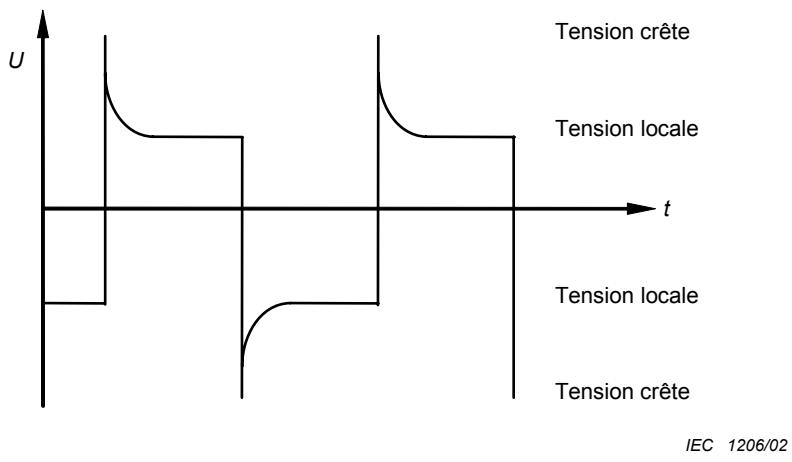  
Figure 1 – Tension de crête répétitive

## 4.3.5 Détermination de la surtension temporaire

## 4.3.5.1 Généralités

Les situations relatives aux surtensions temporaires les plus sévères dues aux perturbations d'alimentation sont traitées dans la CEI 60364-4-44.

NOTE La CEI 60364-4-44 traite de la sécurité des personnes et des biens dans un système à basse tension dans le cas d’un défaut entre le système à haute tension et la terre des transformateurs qui alimentent les systèmes à basse tension.

## 4.3.5.2 Tension de défaut

L’amplitude et la durée d’une tension de défaut ou de la tension de contact due à un défaut à la terre dans un système à haute tension sont montrées à la Figure 44A de la CEI 60364-4-44.

## 4.3.5.3 Contraintes dues à des surtensions temporaires

L’amplitude et la durée d’une surtension temporaire dans un équipement à basse tension due à un défaut à la terre dans un système à haute tension sont données en 5.3.3.2.3.

## 4.4 Fréquence

La présente norme s’applique aux fréquences jusqu’à 30 kHz inclus.

NOTE Le dimensionnement des fréquences supérieures à 30 kHz est spécifié dans la CEI 60664-4.

## 4.5 Durée d'application de la contrainte de tension

En ce qui concerne les lignes de fuite, la durée d'application de la contrainte de tension influe sur le nombre de cas où le séchage peut produire des scintillations de surface d'une énergie suffisamment importante pour entraîner le cheminement. Le nombre de ces cas est considéré comme suffisamment important pour entraîner le cheminement

dans les matériels destinés à un usage continu mais qui ne produisent pas suffisamment de chaleur pour maintenir sèche la surface de l’isolation,

dans les matériels sujets à condensation sur de longues périodes pendant lesquelles ils sont fréquemment fermés et coupés,

dans les appareils de connexion, côté entrée et entre les bornes de ligne et de charge, qui sont directement raccordés au réseau.

Les lignes de fuite indiquées dans le Tableau F.4 ont été déterminées pour une isolation destinée à être soumise à une contrainte de tension de longue durée.

NOTE Les comités d'études concernés par des matériels dont l'isolation est soumise à des contraintes de tension de courte durée uniquement peuvent envisager de permettre l'utilisation de lignes de fuite plus courtes pour l’isolation fonctionnelle, par exemple correspondant à un niveau de tension inférieur à ceux spécifiés au Tableau F.4.

## 4.6 Pollution

## 4.6.1 Généralités

Le micro-environnement détermine l'effet de la pollution sur l'isolation. Cependant le macroenvironnement doit être pris en considération lors de l'étude du micro-environnement.

Des moyens tels que l'utilisation efficace d'enveloppes, d'enrobage ou de scellements hermétiques peuvent être employés pour réduire la pollution de l'isolation considérée. De tels moyens pour réduire la pollution peuvent ne pas être efficaces lorsque le matériel est sujet à la condensation ou si, en fonctionnement normal, le matériel produit lui-même des éléments polluants.

Les faibles distances d'isolement peuvent se trouver complètement pontées par des particules solides, des poussières et de l'eau et, en conséquence, des distances minimales sont spécifiées lorsqu'il peut y avoir de la pollution dans le micro-environnement.

NOTE 1 La pollution devient conductrice en présence d'humidité. La pollution due à de l'eau contaminée, de la suie, de la poussière de métal ou de carbone est naturellement conductrice.

NOTE 2 La pollution conductrice par gaz ionisés et dépôts métalliques est limitée à des cas spécifiques, par exemple dans les chambres à arc de l'appareillage, et n'est pas traitée dans cette partie de la CEI 60664.

## 4.6.2 Degrés de pollution dans le micro-environnement

Afin d'évaluer les lignes de fuite et les distances d'isolement, les quatre degrés de pollution suivants sont définis pour le micro-environnement:

## – Degré de pollution 1

Il n'existe pas de pollution ou il se produit seulement une pollution sèche, non conductrice. La pollution n'a pas d'influence.

## – Degré de pollution 2

Il ne se produit qu'une pollution non conductrice. Cependant, on doit s'attendre de temps en temps à une conductivité temporaire provoquée par de la condensation.

## – Degré de pollution 3

Présence d'une pollution conductrice ou d'une pollution sèche, non conductrice, qui devient conductrice par suite de la condensation qui peut se produire.

## – Degré de pollution 4

Une conductivité persistante apparaît qui est due à la poussière conductrice, à la pluie ou à d’autres conditions humides.

## 4.6.3 Conditions de pollution conductrice

Les dimensions des lignes de fuite ne peuvent pas être spécifiées en présence d’une pollution qui est en permanence conductrice (degré de pollution 4). Dans le cas d’une pollution conductrice temporaire (degré de pollution 3), la surface de l’isolation peut être conçue pour éviter tout chemin continu de pollution conductrice, par exemple au moyen de nervures et de rainures (voir 5.2.2.5 and 5.2.5).

## 4.7 Information fournie avec le matériel

Les comités d'études doivent spécifier quelle information appropriée doit être fournie avec le matériel et de quelle manière celle-ci doit être donnée.

## 4.8 Matériau isolant

## 4.8.1 Indice de résistance au cheminement (IRC)

## 4.8.1.1 Comportement du matériau isolant en présence de scintillations

En ce qui concerne le cheminement, les matériaux isolants peuvent être sommairement caractérisés selon les dommages subis de par la libération localisée d'énergie résultant de scintillations lors de l'interruption d'un courant de fuite superficiel en raison du séchage de la surface contaminée. En présence de scintillations, le matériau isolant peut avoir les comportements suivants:

– aucune décomposition du matériau isolant;

– usure du matériau isolant par action des décharges électriques (électroérosion);

formation progressive de chemins conducteurs à la surface du matériau isolant en raison des effets conjugués de la contrainte électrique et de la contamination conductrice électrolytique en surface (cheminement).

NOTE Le cheminement ou l'érosion apparaît lorsque

– un film liquide conduisant le courant de fuite superficiel se rompt, et que

la tension appliquée est suffisante pour provoquer le claquage du petit intervalle formé lorsque le film se rompt, et que

le courant est supérieur à une valeur limite qui est nécessaire pour fournir localement une énergie suffisante pour décomposer thermiquement le matériau isolant sous le film.

La détérioration s'accroît avec le temps d'écoulement du courant.

## 4.8.1.2 Valeurs IRC pour caractériser les matériaux isolants

Une méthode de classification des matériaux isolants selon 4.8.1.1 n'existe pas. Le comportement du matériau isolant sous l'action de divers agents de contamination et des tensions est extrêmement complexe. Dans ces conditions, de nombreux matériaux peuvent présenter deux ou même trois des caractéristiques indiquées. Une corrélation directe avec les groupes de matériaux de 4.8.1.3 n'est pas utilisable. Cependant, il a été démontré à l'expérience et par des essais que les matériaux isolants ayant une meilleure performance relative ont approximativement le même classement relatif d'après l'indice de résistance de cheminement (IRC). C'est pourquoi la présente norme utilise les valeurs d'IRC pour caractériser les matériaux isolants.

## 4.8.1.3 Groupes de matériau

Dans le cadre de la présente norme, les matériaux sont classés comme suit en quatre groupes selon les valeurs de l'IRC. Ces valeurs sont déterminées en référence à la solution A de la CEI 60112. Les groupes sont les suivants:

– groupe de matériau I: 600 ≤ IRC;

– groupe de matériau II: 400 ≤ IRC < 600;

– groupe de matériau IIIa: 175 ≤ IRC < 400;

– groupe de matériau IIIb: 100 ≤ IRC < 175.

L'indice de tenue au cheminement (ITC) est utilisé pour vérifier les caractéristiques de cheminement des matériaux. Il est possible d'inclure un matériau dans l'un des quatre groupes ci-dessus lorsque son ITC, établi selon les méthodes de la CEI 60112 et en utilisant la solution A, est supérieur ou égal à la valeur inférieure spécifiée pour le groupe.

## 4.8.1.4 Essai pour l’indice de résistance au cheminement (IRC)

L'essai pour déterminer l'indice de résistance au cheminement (IRC) conformément à la CEI 60112 est conçu de façon à comparer la performance des divers matériaux isolants placés dans les conditions d'essai. Cet essai donne une comparaison qualitative et, dans le cas où les matériaux isolants ont tendance à former des cheminements, cet essai peut également donner une comparaison quantitative de l'indice de résistance au cheminement.

## 4.8.1.5 Matériaux non sujets au cheminement

Pour le verre, les céramiques et d'autres matériaux isolants inorganiques qui ne sont pas sujets au cheminement, les lignes de fuite n'ont pas besoin d'être plus grandes que les distances d'isolement associées dans le cadre de la coordination de l'isolement. Le dimensionnement du Tableau F.2 est donc approprié dans des conditions de champ hétérogène.

## 4.8.2 Caractéristiques de rigidité diélectrique

Les comités d’études doivent prendre en compte les caractéristiques de rigidité diélectrique des matériaux isolants, en se référant aux contraintes décrites en 5.3.1, 5.3.2.2.1 et 5.3.2.3.1.

## 4.8.3 Caractéristiques thermiques

Les comités d’études doivent prendre en compte les caractéristiques thermiques des matériaux isolants, en se référant aux contraintes décrites en 5.3.2.2.2, 5.3.2.3.2 and 5.3.3.5.

NOTE Voir également la CEI 60216.

## 4.8.4 Caractéristiques mécaniques et chimiques

Les comités d’études doivent prendre en compte les caractéristiques mécaniques et chimiques des matériaux isolants, en se référant aux contraintes décrites en 5.3.2.2.3, 5.3.2.3.3 et 5.3.2.4.

## 5 Exigences et règles de dimensionnement

## 5.1 Dimensionnement des distances d'isolement

## 5.1.1 Généralités

Les distances d'isolement doivent être dimensionnées pour supporter la tension de tenue aux chocs prescrite. Pour les matériels directement raccordés au réseau basse tension, la tension de tenue aux chocs requise est la tension assignée de choc établie sur la base du 4.3.3.3. Si une tension efficace en régime permanent, une surtension temporaire ou une tension de crête répétitive exige des distances d'isolement supérieures à celles requises pour la tension de tenue aux chocs, les valeurs correspondantes du Tableau F.7a doivent être utilisées. La distance d’isolement la plus importante doit être choisie, suite à la prise en compte de la tension de tenue aux chocs, de la tension efficace en régime permanent, des surtensions temporaires et des tensions de crête répétitives.

NOTE Dimensionner pour la tension efficace en régime permanent ou pour la tension de crête répétitive conduit à une situation où il n'existe aucune marge pour le claquage en cas d'application continue de ces tensions. Il convient que les comités d'études tiennent compte de ce fait.

## 5.1.2 Critères de dimensionnement

## 5.1.2.1 Généralités

Les dimensions des distances d'isolement doivent être choisies en tenant compte des facteurs d'influence suivants:

tension de tenue aux chocs spécifiée en 5.1.5 pour l'isolation fonctionnelle et en 5.1.6 pour l'isolation principale, supplémentaire et renforcée;

– tensions de tenue en régime permanent et surtensions temporaires (voir 5.1.2.3);

– tensions de crête répétitives (voir 5.1.2.3);

– conditions de champ électrique (voir 5.1.3);

altitude: les dimensions des distances d’isolement spécifiées au Tableau F.2 et au Tableau F.7a donnent des capacités de tenue aux chocs pour des matériels destinés à être utilisés à des altitudes jusqu’à 2 000 m. Pour un matériel utilisé à des altitudes plus élevées, le 5.1.4 est applicable ;

– degrés de pollution du micro-environnement (voir 4.6.2).

Les influences mécaniques telles que vibrations ou les forces appliquées peuvent exiger des distances d'isolement plus importantes.

## 5.1.2.2 Dimensionnement pour résister aux surtensions transitoires

Les distances d'isolement doivent être dimensionnées de manière à résister à la tension de tenue aux chocs prescrite conformément au Tableau F.2. Pour les matériels directement raccordés au réseau, la tension de tenue aux chocs prescrite est la tension assignée tenue aux chocs établie sur la base de 4.3.3.3.

NOTE La CEI 60664-5 donne une procédure de rechange et plus précise de dimensionnement pour les distances d’isolement inférieures ou égales à 2 mm.

## 5.1.2.3 Dimensionnement pour résister aux tensions en régime permanent, aux surtensions temporaires ou aux tensions de crête répétitives

Les distances d’isolement doivent être dimensionnées selon le Tableau F.7a pour résister à la valeur de crête de la tension en régime permanent (courant continu ou 50/60 Hz), à la surtension temporaire ou à la tension de crête répétitive.

Le dimensionnement selon le Tableau F.7 doit être comparé au Tableau F.2 en prenant en compte le degré de pollution. C’est la distance d’isolement la plus importante qui doit être choisie.

NOTE Les exigences de dimensionnement pour les fréquences supérieures à 30 kHz sont spécifiées dans la CEI 60664-4.

## 5.1.3 Conditions de champ électrique

## 5.1.3.1 Généralités

La forme et la disposition des parties conductrices (électrodes) influent sur l'homogénéité du champ et, par conséquent, sur la distance d’isolement requise pour tenir une tension donnée (voir Tableau F.2, Tableau F.7a et Tableau A.1).

## 5.1.3.2 Conditions de champ hétérogène (cas A du Tableau F.2)

Des distances d'isolement au moins égales à celles du Tableau F.2 pour des conditions de champ hétérogène peuvent être utilisées indépendamment de la forme et de la disposition des parties conductrices, et sans vérification par un essai de tenue au choc.

Les distances d'isolement à travers des fentes dans des enveloppes en matériau isolant ne doivent pas être inférieures à celles concernant la tenue aux conditions de champ hétérogène car les configurations ne peuvent être vérifiées, ce qui peut influencer de manière contraire l'homogénéité du champ électrique.

## 5.1.3.3 Conditions de champ homogène (cas B du Tableau F.2)

Les valeurs de distances d'isolement du cas B du Tableau F.2 sont applicables uniquement dans des conditions de champ homogène. Elles peuvent uniquement être utilisées lorsque la forme et la disposition des parties conductrices sont conçues pour obtenir un champ électrique ayant essentiellement un gradient de tension constant.

Les distances d'isolement inférieures à celles indiquées pour des conditions de champ hétérogène nécessitent une vérification par essai de tenue de tension (voir 6.1.2).

NOTE Pour les faibles valeurs des distances d'isolement, la présence de la pollution peut détruire l'uniformité du champ électrique en rendant nécessaire d'augmenter les distances d'isolement au-delà des valeurs du cas B.

## 5.1.4 Altitude

Comme les dimensions données dans le Tableau F.2 et dans le Tableau F.7 sont valables pour des altitudes jusqu’à 2 000 m au-dessus du niveau de la mer, les facteurs de correction d'altitude spécifiés au Tableau A.2 sont applicables aux distances d'isolement pour des altitudes supérieures à 2 000 m.

NOTE La tension disruptive d'une distance d'isolement dans l'air, pour un champ homogène (tension de tenue, cas B, dans le Tableau A.1), est, selon la loi de Paschen, proportionnelle au produit de la distance entre électrodes par la pression atmosphérique. En conséquence, les valeurs expérimentales relevées approximativement au niveau de la mer sont calculées en tenant compte de la différence de pression atmosphérique entre 2 000 m et le niveau de la mer. La même correction est effectuée pour les champs non homogènes.

## 5.1.5 Dimensionnement des distances d'isolement de l'isolation fonctionnelle

Pour une distance d'isolement de l'isolation fonctionnelle, la tension de tenue aux chocs prescrite est la tension de choc maximale ou la tension de régime établi (avec référence au Tableau F.7) ou la tension de crête répétitive (avec référence au Tableau F.7) supposée se produire à travers celle-ci dans les conditions assignées du matériel, et en particulier la tension assignée et la tension assignée de tenue aux chocs du matériel (avec référence au Tableau F.2).

## 5.1.6 Dimensionnement des distances d'isolement de l'isolation principale, supplémentaire et renforcée

Les distances d'isolement de l'isolation principale et supplémentaire doivent être dimensionnées chacune conformément au Tableau F.2 correspondant à:

– à la tension assignée de tenue aux chocs suivant 4.3.3.3 ou 4.3.3.4.1, ou

– aux exigences de tension de tenue aux chocs suivant 4.3.3.4.2;

et comme spécifié au Tableau F.7a correspondant à

– la tension en régime établi selon 4.3.2.2,

– la tension de crête répétitive selon 4.3.4,

– et la surtension temporaire selon 4.3.5.

En ce qui concerne les tensions de tenue aux chocs, les distances d'isolement de l'isolation renforcée doivent être dimensionnées comme spécifié dans le Tableau F.2 correspondant à la tension assignée de tenue aux chocs immédiatement supérieure dans la série préférentielle de 4.2.3 à celle indiquée pour l'isolation principale. Si, conformément à 4.3.3.4.2, la tension de tenue aux chocs prescrite pour l'isolation principale diffère d'une valeur de la série préférentielle, l'isolation renforcée doit être dimensionnée pour supporter 160 % de la tension de tenue aux chocs exigée pour l'isolation principale.

NOTE 1 Dans un système (réseau) coordonné, l'augmentation des distances d'isolement au-dessus du minimum exigé ne procure pas de possibilités supplémentaires pour une tension de tenue aux chocs prescrite. Cependant, pour des raisons différentes de la coordination de l'isolement, il peut être nécessaire d'augmenter les distances d'isolement (par exemple, pour des raisons mécaniques). Dans de tels cas, la tension d'essai reste fondée sur la tension assignée de tenue aux chocs du matériel, faute de quoi il pourrait se produire une contrainte anormale sur l'isolation solide associée.

En ce qui concerne les tensions en régime permanent, les tensions de crête répétitives et les surtensions transitoires, les distances d’isolement de l’isolation renforcée doivent être dimensionnées comme spécifié au Tableau F.7a pour supporter 160 % de la tension de tenue exigée pour l’isolation principale.

Pour un matériel pourvu d'une double isolation où l'isolation principale et l'isolation supplémentaire ne peuvent pas être essayées séparément, le système d'isolation est traité comme une isolation renforcée.

NOTE 2 Lors du dimensionnement de distances d'isolement par rapport à des surfaces accessibles en matériau isolant, de telles surfaces sont supposées être recouvertes d'une feuille métallique. De plus amples détails peuvent être spécifiés par les comités d’études.

## 5.1.7 Distances de sectionnement

Voir 8.3.2 de la CEI 61140.

## 5.2 Dimensionnement des lignes de fuite

## 5.2.1 Généralités

Les valeurs du Tableau F.4 sont adaptées à la majorité des applications. Si un dimensionnement plus précis des lignes de fuite de 2 mm ou moins est nécessaire, la CEI 60664-5 s’applique.

## 5.2.2 Facteurs d'influence

## 5.2.2.1 Généralités

Les lignes de fuite doivent être choisies dans le Tableau F.4. Les facteurs d'influence suivants doivent être pris en considération:

– tension conforme à 4.3.2 (voir également 5.2.2.2);

– micro-environnement (voir 5.2.2.3);

– orientation et localisation de la ligne de fuite (voir 5.2.2.4);

– forme de la surface isolante (voir 4.6.3 et 5.2.2.5);

– matériaux isolants (voir 4.8.1);

– durée d'application de la contrainte de tension (voir 4.5).

NOTE Les valeurs du Tableau F.4 sont fondées sur des données empiriques existantes et conviennent à une majorité d'applications. Cependant, pour l’isolation fonctionnelle, des valeurs de lignes de fuite différentes de celles du Tableau F.4 peuvent être appropriées.

## 5.2.2.2 Tension

La base de la détermination d'une ligne de fuite est la valeur efficace de longue durée de la tension existant le long de la ligne de fuite. Cette tension est la tension locale (voir 5.2.3), la tension assignée d'isolement (voir 5.2.4) ou la tension assignée (voir 5.2.4).

Les surtensions transitoires sont négligées car elles n'influencent normalement pas le phénomène de cheminement. Cependant, les surtensions temporaires et fonctionnelles doivent être prises en considération si leur durée et leur fréquence d'occurrence peuvent influencer le cheminement.

## 5.2.2.3 Pollution

L'influence des degrés de pollution dans le micro-environnement indiqués en 4.6.2 sur le dimensionnement des lignes de fuite est prise en considération dans le Tableau F.4.

NOTE Différentes conditions de micro-environnement peuvent exister dans un matériel.

## 5.2.2.4 Orientation et emplacement d'une ligne de fuite

Si nécessaire, le fabricant doit indiquer l'orientation prévue du matériel ou du composant afin que les lignes de fuite ne soient pas dangereusement affectées par une accumulation de pollution anormale pour laquelle elles ne sont pas conçues.

NOTE Il convient que le stockage de longue durée soit pris en considération.

## 5.2.2.5 Forme de la surface isolante

La mise en forme des surfaces isolantes est efficace pour le dimensionnement des distances d’isolement uniquement avec le degré de pollution 3. Il convient que la surface de l’isolation solide comprenne, de préférence, des nervures et des rainures transversales destinées à rompre la continuité du chemin de fuite dû à la pollution. Les nervures et les rainures peuvent également être utilisées pour détourner l'écoulement d'eau de l'isolation qui est électriquement contrainte. Il convient que les joints ou les rainures reliant des parties conductrices soient évités car ils peuvent accumuler de la pollution ou retenir l'eau.

NOTE Il convient que le stockage de longue durée soit pris en considération. L'évaluation de la longueur d'un chemin de fuite est donnée en 6.2.

## 5.2.2.6 Relation avec la distance d'isolement

Une ligne de fuite ne peut pas être inférieure à la distance d'isolement associée, de sorte que la ligne de fuite la plus courte possible est égale à la distance d'isolement prescrite. Cependant, il n'existe aucune relation physique entre la distance minimale d'isolement dans l'air et la ligne de fuite minimale acceptable, sauf cette limitation dimensionnelle.

Des lignes de fuite inférieures aux distances d'isolement prescrites dans le cas A du Tableau F.2 ne peuvent être utilisées que dans des conditions de degrés de pollution 1 et 2 lorsque la ligne de fuite peut résister à la tension requise pour la distance d’isolement associée (Tableau F.2). L’essai pour démontrer que la ligne de fuite résistera à la tension pour la distance d’isolement associée doit tenir compte du facteur de correction d’altitude (voir 6.1.2.2).

La comparaison entre les distances minimales d’isolement et les lignes de fuite spécifiées dans cette norme est donnée à l’Annexe E.

## 5.2.2.7 Lignes de fuite lorsque plus d’un matériau est utilisé ou en présence de plus d’un degré de pollution

Une ligne de fuite peut être divisée en plusieurs parties de différents matériaux et/ou peut avoir différents degrés de pollution si une des lignes de fuite est dimensionnée pour résister à la tension totale ou si la distance totale est dimensionnée en fonction du matériau ayant l'IRC le plus faible et le degré de pollution le plus élevé.

## 5.2.2.8 Lignes de fuite coupées par des parties conductrices flottantes

Une ligne de fuite peut être divisée en plusieurs parties, dans le même matériau isolant, y compris ou séparée par des conducteurs flottants sous réserve que la somme des distances le long de chaque partie individuelle soit supérieure ou égale à la ligne de fuite exigée si la partie flottante n'existait pas.

La distance minimale X pour chaque partie individuelle de la ligne de fuite est donnée en 6.2 (voir aussi l’Exemple 11).

## 5.2.3 Dimensionnement des lignes de fuite de l'isolation fonctionnelle

Les lignes de fuite de l'isolation fonctionnelle doivent être dimensionnées comme indiqué au Tableau F.4 correspondant à la tension locale le long de la ligne de fuite considérée.

Lorsque la tension locale est utilisée pour le dimensionnement, il est autorisé d'interpoler les valeurs des tensions intermédiaires. Lors de l’interpolation, l’interpolation linéaire doit être utilisée et les valeurs doivent être arrondies au même nombre de chiffres que les valeurs prises dans les tableaux.

## 5.2.4 Dimensionnement des lignes de fuite de l'isolation principale supplémentaire et renforcée

Les lignes de fuite de l'isolation principale et supplémentaire doivent être choisies dans le Tableau F.4 pour:

les tensions rationalisées (voir 4.3.2.2) données dans les colonnes 2 et 3 du Tableau F.3a et les colonnes 2, 3 et 4 du Tableau F.3b, correspondant à la tension nominale du réseau d'alimentation;

– la tension assignée d'isolement conformément à 4.3.2.2.1;

– la tension spécifiée en 4.3.2.2.2.

NOTE 1 Pour l'isolation supplémentaire, le degré de pollution, le matériau isolant, les contraintes mécaniques et les conditions d'environnement d'utilisation peuvent être différents de ceux de l'isolation principale.

Lorsque la tension spécifiée en 4.3.2.2.2 est utilisée pour le dimensionnement, il est autorisé d'interpoler les valeurs des tensions intermédiaires. Lors de l’interpolation, l’interpolation linéaire doit être utilisée. En cas d’interpolation, les valeurs doivent être arrondies au même nombre de chiffres que les valeurs prises dans les tableaux.

Les lignes de fuite de la double isolation sont la somme des valeurs de l'isolation principale et supplémentaire qui composent le système de double isolation.

Les lignes de fuite pour l’isolation renforcée doivent être égales au double de celles déterminées pour l’isolation principale comme cela est indiqué au Tableau F.4.

NOTE 2 Lors du dimensionnement des lignes de fuite par rapport à des surfaces accessibles d'un matériau isolant, de telles surfaces sont supposées être recouvertes d'une feuille métallique. De plus amples détails peuvent être spécifiés par les comités d’études.

## 5.2.5 Réduction des lignes de fuite avec l’utilisation d’une nervure (de nervures)

Les lignes de fuite exigées qui sont supérieures ou égales à 8 mm avec un degré de pollution 3 peuvent être réduites par l’utilisation d’une nervure. Les valeurs de ces lignes de fuite réduites sont celles données dans le Tableau F.4 entre parenthèses (voir Note 4 du Tableau F.4). La nervure doit avoir une largeur minimale (W) de 20 % et une hauteur minimale (H) de 25 % de la ligne de fuite exigée y compris la nervure telle qu’elle est mesurée à la Figure 2.

Lorsque plus d’une nervure est utilisée, la ligne de fuite exigée doit être divisée en sections égales au nombre de nervures désirées. Pour chaque section, les exigences de l’alinéa cidessus doivent s’appliquer. La distance minimale entre les nervures multiples doit être égale à la largeur minimale de la nervure applicable pour chaque section mesurée à partir de la base de la nervure.

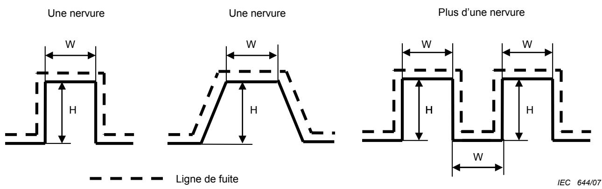  
Figure 2 – Détermination de la largeur (W) et de la hauteur (H) d’une nervure

## 5.3 Exigences pour la conception de l'isolation solide

## 5.3.1 Généralités

Etant donné que la rigidité diélectrique d'une isolation solide est bien plus importante que celle de l'air, il est permis d'y prêter une moindre attention pendant la conception de systèmes d'isolation à basse tension. D'autre part, les distances d'isolement à travers le matériau isolant solide sont, en règle générale, très inférieures aux distances d'isolement dans l'air, ce qui donne lieu à des contraintes électriques importantes. On doit également considérer le fait que, dans la pratique, la rigidité diélectrique élevée d'un matériau est rarement utilisée. Dans les systèmes d'isolation, des intervalles peuvent se produire entre les électrodes et l'isolation d'une part, et entre les différentes couches d'isolation d'autre part, ou bien des soufflures peuvent être présentes dans le matériau isolant. Des décharges partielles peuvent se produire dans ces intervalles ou dans ces soufflures, à des tensions bien en dessous du niveau de perforation, ce qui risque d'affecter de façon décisive la longévité de l'isolation solide. Cependant, il est peu vraisemblable de voir des décharges partielles pour des tensions de crête inférieures à 500 V.

Un autre point crucial réside dans le fait que, comparativement aux gaz, l'isolation solide n'est pas un support renouvelable, si bien que des crêtes de tensions élevées, susceptibles de se produire quelquefois, peuvent avoir un effet très néfaste sur l'isolation solide. Une telle situation peut se présenter pendant le fonctionnement ou lors des essais diélectriques individuels.

Un certain nombre d'influences néfastes s'accumule tout au long de la durée de fonctionnement d'une isolation solide. Ces influences suivent des étapes complexes avant d'aboutir au vieillissement. Par conséquent, les contraintes électriques et autres (par exemple thermiques, climatiques) superposent leurs effets et contribuent au vieillissement.

Les performances à long terme d'une isolation solide peuvent être simulées par un essai à court terme. Le but est d'y parvenir par un conditionnement adapté (voir 6.1.3.2).

Si l'isolation solide est soumise à des fréquences élevées, les pertes diélectriques de l'isolation solide et les décharges partielles deviennent de plus en plus importantes. Cette situation a été observée dans des sources de puissance commutées où l'isolation est soumise à des crêtes de tensions répétitives, à des fréquences pouvant atteindre 500 kHz.

Il y a en général une relation entre l’épaisseur d’un matériau isolant solide et les mécanismes de défaillances mentionnés ci-dessus. Une réduction de l’épaisseur d’un matériau isolant solide entraîne l’augmentation de la contrainte et conduit à un risque de défaillance plus élevé. Puisqu’il n’est pas possible de calculer l’épaisseur requise d’un matériau isolant solide, la performance peut uniquement être vérifiée par des essais.

## 5.3.2 Contraintes

## 5.3.2.1 Généralités

On distingue deux types de contraintes appliquées à l'isolation solide

– les contraintes à court terme, et

– les contraintes à long terme.

D'autres contraintes, voir 5.3.2.4, différentes de celles décrites en 5.3.2.2 et 5.3.2.3 cidessous, peuvent être appliquées à l'isolation solide en cours d'utilisation.

## 5.3.2.2 Les contraintes à court terme et leurs effets

## 5.3.2.2.1 Fréquence de la tension

La rigidité diélectrique est fortement influencée par la fréquence de la tension appliquée. L'échauffement diélectrique et la probabilité d'instabilité thermique augmentent de façon approximativement proportionnelle à la fréquence. La contrainte de champ de claquage d'une isolation classique, mesurée à fréquence industrielle conformément à la CEI 60243-1 pour un spécimen de 3 mm d'épaisseur, est comprise entre 10 kV/mm et 40 kV/mm. L'augmentation de la fréquence entraînera une réduction de la rigidité diélectrique de la plupart des matériaux isolants.

NOTE L’influence des fréquences supérieures à 30 kHz sur la rigidité diélectrique est décrite dans la CEI 60664-4.

## 5.3.2.2.2 Echauffement

L'échauffement est capable de provoquer

– une déformation mécanique due à la relaxation d'une contrainte interne,

un ramollissement des thermoplastiques pour des échauffements relativement peu élevés, par exemple températures au-dessus de 60 °C,

– une fragilisation de certains matériaux due à une perte de plastifiant,

un ramollissement de certains matériaux réticulés, notamment si la température de transition vitreuse du matériau est dépassée,

– des pertes diélectriques accrues entraînant instabilité thermique et défaillance.

Les variations rapides de température, par exemple pendant les courts-circuits, sont susceptibles de provoquer une défaillance mécanique.

## 5.3.2.2.3 Choc mécanique

En cas de résistance inadéquate aux chocs, un choc mécanique est susceptible de provoquer une défaillance de l'isolation. Une défaillance, sous l'effet d'un choc mécanique, pourrait aussi se produire en raison de la diminution de la résistance aux chocs des matériaux:

due au matériau devenu fragile si sa température est passée en dessous de sa température de transition vitreuse;

après une exposition prolongée sous une température élevée ayant entraîné une perte de plastifiant ou une détérioration du polymère de base.

Les comités d'études doivent tenir compte de tous ces points lors de la spécification des conditions ambiantes relatives au transport, au stockage, à l'installation et à l'utilisation.

## 5.3.2.3 Contraintes à long terme et leurs effets

## 5.3.2.3.1 Décharges partielles (DP)

Dans l'air, des décharges partielles peuvent se produire à des tensions de crête supérieures à 300 V (le minimum de Paschen). La défaillance se produit par érosion progressive et/ou par arborescence, conduisant à une perforation ou à un contournement.

Les systèmes d'isolation peuvent avoir des propriétés différentes: certains sont capables de supporter des décharges tout au long de leur durée de vie prévue (par exemple isolateurs en céramique), alors que d'autres doivent être impérativement exempts de toute décharge (par exemple les condensateurs). La tension, la fréquence de répétition des décharges et l'amplitude des décharges constituent des paramètres importants.

Le comportement des DP est influencé par la fréquence de la tension appliquée. Des essais de vieillissement accéléré par augmentation de la fréquence ont permis d'établir que le temps nécessaire pour aboutir à une défaillance est approximativement inversement proportionnel à la fréquence de la tension appliquée. Cependant, les expériences pratiques relatives aux DP ne concernent que des fréquences maximales de 5 kHz car, à des fréquences plus élevées, d'autres mécanismes de défaillance sont également susceptibles d'apparaître, par exemple échauffement diélectrique.

NOTE L’influence des fréquences supérieures à 30 kHz sur le comportement des DP est décrite dans la CEI 60664-4.

## 5.3.2.3.2 Echauffement

L'échauffement entraîne une détérioration de l'isolation, par exemple par évaporation, oxydation ou d'autres modifications chimiques à long terme. Cependant la défaillance est souvent mécanique, par exemple fragilisation et conduit à une fissuration et à une rupture diélectrique. Ce mécanisme est un processus continu qu'il n'est pas possible de simuler par un essai de courte durée, car plusieurs milliers d'heures d'essai seraient nécessaires (se reporter à la CEI 60216).

## 5.3.2.3.3 Contraintes mécaniques

Les contraintes mécaniques dues aux vibrations ou aux chocs en cours de fonctionnement ou les contraintes produites durant le stockage ou le transport peuvent provoquer un délaminage, une fissuration ou la rupture du matériau isolant.

NOTE Il convient que les comités d’études tiennent compte de ces contraintes lors de la spécification des conditions d’essai.

## 5.3.2.3.4 Humidité

La présence de vapeur d'eau peut influer sur la résistance d'isolement et sur la tension d'extinction de décharge, accentuer l'effet de contamination superficielle, provoquer la corrosion et entraîner des variations dimensionnelles. Un taux d'humidité élevé entraînera une diminution significative de la rigidité diélectrique de certains matériaux. Un faible taux d'humidité peut, dans certains cas, être défavorable, par exemple en augmentant la capacité de conservation des charges électrostatiques et en diminuant la résistance mécanique de certains matériaux, tels que le polyamide.

## 5.3.2.4 Autres contraintes

Beaucoup d'autres contraintes sont en mesure de détériorer l'isolation et doivent être prises en compte par les comités d'études.

Parmi ces contraintes, il est possible de citer

– les rayonnements ultraviolets et ionisants,

– le craquèlement ou la fissuration provoqués par une exposition à des solvants ou à des agents chimiques actifs,

– l'effet lié à la migration des plastifiants,

– l'effet des bactéries, des moisissures ou des champignons,

– le fluage mécanique.

L'effet de ces contraintes est de moindre importance ou elles s'appliquent moins souvent mais nécessitent d'être prises en compte dans des cas particuliers.

## 5.3.3 Exigences

## 5.3.3.1 Généralités

L'isolant solide de l'isolation principale, de l'isolation supplémentaire et de l'isolation renforcée doit être capable de supporter durablement les contraintes électriques et mécaniques ainsi que les effets thermiques et d'environnement susceptibles de se produire pendant la durée de vie escomptée des matériels.

NOTE Lors de la prise en compte des contraintes électriques de surfaces accessibles en isolation solide, de telles surfaces sont supposées être recouvertes d'une feuille métallique. De plus amples détails peuvent être spécifiés par les comités d’études.

Dans les cas où les tensions locales ne sont pas sinusoïdales et qu'elles présentent des crêtes répétitives, une attention particulière doit être prêtée à l'apparition d'éventuelles décharges partielles. De la même manière, lorsque l'existence de couches d'isolation et la présence de soufflures dans le matériau isolant moulé ne sont pas exclues, une attention particulière doit être prêtée à l'apparition d'éventuelles décharges partielles susceptibles de détériorer l'isolation solide.

## 5.3.3.2 Tenue aux contraintes de tension

## 5.3.3.2.1 Généralités

Les comités d'études doivent spécifier quelles caractéristiques assignées de tension sont appropriées à leurs matériels.

## 5.3.3.2.2 Surtensions transitoires

L'isolation principale et l'isolation supplémentaire doivent avoir:

une exigence relative à la tension de tenue aux chocs correspondant à la tension d'alimentation nominale (voir 4.3.3.3) et à la catégorie de surtension appropriée, conformément au Tableau F.1 ; ou

une tension de tenue aux chocs, relative à un circuit interne d'un matériel, qui a été spécifiée conformément aux surtensions transitoires prévisibles dans le circuit (voir 4.3.3.4).

L'isolation renforcée doit avoir une tension de tenue aux chocs correspondant à la tension assignée de tenue aux chocs mais un cran plus haut dans la série préférentielle de valeurs en 4.2.3 que celle spécifiée pour l'isolation principale. Si, conformément à 4.3.3.4.2, la tension de tenue aux chocs prescrite pour l'isolation principale n'est pas une valeur de la série préférentielle, l'isolation renforcée doit être dimensionnée pour supporter 160 % de la valeur prescrite pour l'isolation principale.

Pour ce qui concerne la vérification par des essais, se reporter à 6.1.3.3.

## 5.3.3.2.3 Surtensions temporaires

L’isolation solide principale et l'isolation supplémentaire doivent supporter les surtensions temporaires suivantes:

surtensions temporaires de courte durée d’amplitude $\begin{array} { r } { U _ { \mathfrak { n } } + \mathrm { ~ 1 ~ } 2 0 0 \mathrm { ~ V } , } \end{array}$ avec une durée inférieure ou égale à 5 s;

– surtensions temporaires de longue durée d’amplitude $U _ { \mathfrak { n } } + 2 5 0 \ V ,$ , avec une durée supérieure à 5 s;

où $U _ { \mathfrak { n } }$ est la tension nominale phase neutre du réseau d’alimentation à la terre.

L’isolation renforcée doit résister à des valeurs égales au double des valeurs des surtensions temporaires spécifiées pour l’isolation principale.

Pour la vérification au moyen d’essais, voir 6.1.3.

NOTE 1 Ces valeurs sont issues de l’Article 442 de la CEI 60364-4-44, dans lequel $U _ { \mathsf { n } }$ est désignée $U _ { 0 } .$

NOTE 2 Les valeurs sont des valeurs efficaces.

## 5.3.3.2.4 Tensions de crête répétitives

Il est possible de supposer provisoirement que les tensions de crête répétitives maximales du réseau d'alimentation sont égales à $F _ { 4 } \times { \sqrt { 2 } } U _ { \mathsf { n } }$ , c'est-à-dire à 1,1 fois la valeur de crête de $U _ { \mathsf { n } }$ . En cas de présence de tensions de crête répétitives, la tension d'extinction de décharge doit être au moins égale à:

$\begin{array} { r l } { - } & { { } F _ { 1 } \times F _ { 4 } \times \sqrt { 2 } U _ { \mathsf { n } } } \end{array}$ , c'est-à-dire 1,32 ${ \sqrt { 2 } } \ U _ { \mathsf { n } }$ pour chaque isolation principale et isolation supplémentaire, et

$\begin{array} { r l } { - } & { { } F _ { 1 } \times F _ { 3 } \times F _ { 4 } \times \sqrt { 2 } \ U _ { \mathrm { n } } , \ \mathrm { c } ^ { \ast } e s t - \dot { a } - \mathrm { d i r e } \ 1 , 6 5 \ \sqrt { 2 } \ U _ { \mathrm { n } } } \end{array}$ pour l'isolation renforcée.

NOTE $\sqrt { 2 } ~ U _ { \mathfrak { n } }$ est, dans les réseaux avec neutre à la terre, la valeur de crête de la tension phase-neutre fondamentale (non déformée) à la tension nominale du réseau d'alimentation secteur. L'application des facteurs de multiplication utilisés dans le paragraphe ci-dessus est décrite à ‘Annexe D.

Pour explication des facteurs F, voir 6.1.3.5.

Dans les circuits internes, il est nécessaire d'évaluer les tensions de crête répétitives les plus élevées à la place de $F _ { 4 } \times { \sqrt { 2 } } U _ { \mathsf { n } }$ et l'isolation solide doit également satisfaire aux exigences correspondantes.

Pour la vérification au moyen d’essais, voir 6.1.3.5.

## 5.3.3.2.5 Tension à haute fréquence

Pour les tensions ayant des fréquences supérieures à la fréquence industrielle, on doit tenir compte de l'influence de la fréquence au sens de 5.3.2.2.1 et 5.3.2.3.1. Dans le cadre de la présente norme, les fréquences supérieures à 1 kHz doivent être considérées comme des fréquences élevées.

Les comités d'études doivent spécifier si un essai conforme à 6.1.3.7 est nécessaire.

## 5.3.3.3 Tenue aux contraintes thermiques à court terme

L'isolation solide ne doit pas être affectée par des contraintes thermiques à court terme qui peuvent se produire en cours d'utilisation normale et, le cas échéant, en cours d'utilisation anormale. Les comités d'études doivent spécifier des niveaux de sévérité.

NOTE Des niveaux de sévérité normalisés sont spécifiés dans la CEI 60068.

## 5.3.3.4 Tenue aux contraintes mécaniques

L'isolation solide ne doit pas être affectée par une vibration ou un choc mécanique susceptible de se produire en cours d'utilisation. Les comités d'études doivent spécifier des niveaux de sévérité.

NOTE Des niveaux de sévérité normalisés sont spécifiés dans la CEI 60068.

## 5.3.3.5 Tenue aux contraintes thermiques à long terme

La dégradation thermique d'une isolation solide ne doit pas affecter la coordination de l'isolement, pendant la durée de vie escomptée des matériels. Les comités d'études doivent spécifier si l'exécution d'un essai est nécessaire. (Se reporter également à la CEI 60085 et à la CEI 60216.)

## 5.3.3.6 Tenue aux effets de l'humidité

La coordination de l'isolement doit être maintenue sous les conditions d'humidité, conformément aux exigences relatives aux matériels. (Voir aussi 6.1.3.2.)

## 5.3.3.7 Tenue aux autres contraintes

Les matériels peuvent être soumis à d'autres contraintes, comme celles indiquées, par exemple, en 5.3.2.4, qui peuvent influer sur la coordination de l'isolement. Les comités d'études doivent définir ces contraintes et spécifier les méthodes d'essai.

## 6 Essais et mesures

## 6.1 Essais

## 6.1.1 Généralités

Les procédures d’essai suivantes s’appliquent aux essais de type, de telle manière qu’une détérioration potentielle du spécimen d’essai puisse être tolérée. On suppose qu’il n’est pas prévu d’utiliser ultérieurement le spécimen d’essai.

NOTE 1 S’il est prévu ou nécessaire d’utiliser ensuite le spécimen d’essai, il est recommandé que le comité d’études y accorde une attention particulière. Dans de tels cas, il convient de combiner tout essai à haute tension avec une mesure de décharge partielle selon 6.1.3.5 et l’Annexe C.

Des procédures d’essai sont spécifiées pour

– la vérification des distances d’isolement (voir 6.1.2);

– la vérification de l’isolation solide (voir 6.1.3);

– les essais diélectriques sur un matériel complet (voir 6.1.4) et

– d’autres essais (voir 6.1.5).

Les contraintes pour les distances d’isolement et l’isolation solide causées par les surtensions transitoires sont évaluées par l’essai de tension de tenue aux chocs, qui peut être remplacé par un essai en tension alternative ou continue. Les distances d’isolement dans l’air supérieures ou égales au cas A du Tableau F.2 peuvent être vérifiées par des mesures ou par un essai de tension. Si elles sont inférieures aux valeurs indiquées dans le cas A du Tableau F.2, elles doivent être vérifiées par un essai de tension.

La capacité de résistance aux contraintes de tension de l’isolation solide doit être vérifiée par un essai de tension dans tous les cas. Les contraintes causées par les surtensions transitoires sont évaluées par l’essai de tension de tenue aux chocs, qui peut être remplacé par un essai en tension alternative ou continue. Les contraintes causées par une contrainte de tension de régime établi en courant alternatif ne peuvent être évaluées que par un essai de tension en courant alternatif. L’essai de tension en courant continu avec une tension d’essai égale à la valeur de crête de la tension en courant alternatif n’est pas entièrement équivalent à l’essai de tension en courant alternatif en raison des différentes caractéristiques de résistance de l’isolation solide pour ces types de tensions. Cependant, dans le cas d’une simple contrainte de tension en courant continu, l’essai de tension en courant continu est approprié.

NOTE 2 Alors qu’il est possible de remplacer un essai de tension de tenue aux chocs pour les distances d’isolement par un essai en tension alternative ou continue, il n’est en principe pas possible de remplacer un essai en tension alternative pour isolation solide par un essai en tension de tenue aux chocs. Les raisons essentielles sont la propagation différente des tensions de tenue aux chocs par rapport aux tensions à puissance industrielle, en particulier dans les circuits complexes et le fait que les caractéristiques de résistance de l’isolation solide dépendent de la forme et de la durée de la contrainte de tension.

## 6.1.2 Essai pour la vérification des distances dans l'air

## 6.1.2.1 Généralités

Lorsqu'un matériel électrique est soumis à des essais électriques pour vérifier les distances d’isolement, l’essai doit être en accord avec les exigences de tension de tenue aux chocs spécifiées en 5.1. L’essai approprié pour la vérification des distances d’isolement est l’essai de tension de tenue aux chocs mais comme cela est indiqué en 5.1.3, cet essai est uniquement exigé pour des distances d’isolement inférieures aux valeurs du cas A du Tableau F.2.

Si la résistance aux tensions en régime permanent, aux tensions de crête répétitive ou aux surtensions temporaires selon 5.1 est décisive pour le dimensionnement des distances d'isolement et si ces distances d'isolement sont inférieures aux valeurs du cas A dans le

Tableau F.7a, un essai à la tension d’essai en courant alternatif selon le paragraphe 6.1.2.2.2.2 est exigé.

Lorsqu’on vérifie les distances d’isolement à l’intérieur d’un matériel avec un essai de tension de tenue aux chocs, il est nécessaire de s’assurer que la tension de tenue aux chocs spécifiée apparaît pour la distance d’isolement en essai.

NOTE 1 L'essai diélectrique des distances d’isolement dans l'air contraindra aussi l'isolation solide associée.

NOTE 2 Dans certains cas, ces essais doivent également être appliqués aux lignes de fuite, voir 5.2.2.6.

NOTE 3 Pour soumettre des matériels complets aux essais, voir 6.1.4.

## 6.1.2.2 Tensions d'essai

## 6.1.2.2.1 Essai diélectrique de tension de choc

## 6.1.2.2.1.1 Généralités

Le but de cet essai est de vérifier que les distances d’isolement dans l'air supporteront les surtensions transitoires spécifiées. L’essai de tenue aux chocs est effectué avec une tension ayant une forme d'onde de 1,2/50 µs avec les valeurs spécifiées au Tableau F.5. Pour la forme d’onde, 6.1 et 6.2 de la CEI 61180-1 s’appliquent. Il est prévu pour simuler des surtensions d'origine atmosphérique et il tient aussi compte des surtensions dues aux manœuvres de l'appareillage basse tension.

Compte tenu de la dispersion des résultats d’essai de tout essai de tension de tenue aux chocs, l'essai doit être effectué pour un minimum de trois chocs de chaque polarité, avec un intervalle d'au moins 1 s entre les impulsions.

NOTE 1 Il convient que l'impédance de sortie du générateur de choc ne soit pas supérieure à 500 Ω. Lors de l'essai d'un matériel comprenant des composants en dérivation sur le circuit d'essai, il convient qu’une impédance de générateur de choc virtuelle nettement plus faible soit spécifiée (voir 9.2 de la CEI 61180-2). Dans de tels cas, il convient de tenir compte des effets de résonance potentiels qui peuvent augmenter la valeur de crête de la tension d’essai, lorsqu’on spécifie les valeurs de tension d’essai.

Les comités d'études peuvent spécifier d'autres essais diélectriques, conformément à 6.1.2.2.2.

NOTE 2 Les valeurs données au Tableau F.5 sont déduites des calculs de 6.1.2.2.1.3. Dans un souci de précision des informations, elles sont données avec un niveau élevé de précision. Pour l’application pratique, les comités d'études peuvent choisir d’arrondir les valeurs.

## 6.1.2.2.1.2 Choix de la tension d'essai de choc

Si un essai diélectrique pour la coordination de l'isolement du matériel relativement aux distances dans l'air est exigé (pour des distances dans l'air inférieures à celles du cas A comme spécifié au Tableau F.2), le matériel doit être essayé avec des tensions d'essai de choc correspondant à sa tension assignée de tenue aux chocs spécifiée conformément à 4.3.3. Les tensions d'essai de choc du Tableau F.5 sont applicables.

Les comités d'études doivent spécifier des valeurs de température et d'humidité pour les conditions d'essai.

Les comités d'études doivent étudier si des essais sur prélèvement ou des essais de série doivent être effectués en complément aux essais de type.

## 6.1.2.2.1.3 Explications relatives au Tableau F.5

Les explications suivantes indiquent comment interpréter les données du Tableau F.5 :

a) Facteurs de correction pour essai de tenue au choc

Conformément à 1.1, les valeurs assignées des tensions de tenue aux chocs sont valables pour le matériel utilisé jusqu'à 2 000 m au-dessus du niveau de la mer. A 2 000 m, la pression atmosphérique normale est de 80 kPa alors qu'au niveau de la mer, sa valeur est de 101,3 kPa. En conséquence, le matériel essayé à des emplacements d'altitude inférieure à 2 000 m est soumis à des tensions d'essai de choc plus élevées. Le Tableau F.5 donne la valeur de la tension d’essai de tenue aux chocs pour vérifier les distances d’isolement à différentes altitudes.

La base de calcul des valeurs au niveau de la mer et les données pour déterminer les valeurs d'essai à d'autres emplacements est la suivante:

Les facteurs de correction pour l'altitude donnés au Tableau A.2 sont étudiés en rapport avec la courbe de la Figure A.1. La relation est la suivante:

$$
k _ {\mathrm{u}} = \left(\frac {1}{k _ {\mathrm{d}}}\right) ^ {m}
$$

où

d est la distance d’isolement examinée en millimètres;

$k _ { \mathrm { u } }$ est le facteur d'altitude pour la correction de tension;

$k _ { \mathsf { d } }$ est le facteur d'altitude pour la correction de distance (voir Tableau F.8);

m est la pente du segment de droite approprié de la courbe 1 de la Figure A.1 (échelles logarithmiques sur les deux axes de coordonnées) et à la valeur:

$$
m = 0, 9 1 6 3 \quad \text { pour } 0, 0 0 1 <   d \leq 0, 0 1 \mathrm{mm};
$$

$$
m = 0, 3 3 0 5 \quad \text { pour } 0, 0 1 <   d \leq 0, 0 6 2 5 \mathrm{mm};
$$

$$
m = 0, 6 3 6 1 \quad \text { pour } 0, 0 6 2 5 <   d \leq 1 \mathrm{mm};
$$

$$
m = 0, 8 5 3 9 \quad \text { pour } 1 \quad <   d \leq 1 0 \mathrm{mm};
$$

$$
m = 0, 9 2 4 3 \quad \text { pour } 1 0 \quad <   d \leq 1 0 0 \mathrm{mm}.
$$

Il résulte de l'application des facteurs d'altitude pour la correction des distances que pour la courbe 1 de la Figure A.1, les tensions seront changées avec quatre pas différents pour un seul pas de décalage de la distance. La formule mathématique pour cette opération est indiquée ci-dessus. Le Tableau F.5 inclut ce calcul comme décrit précédemment.

b) Discussion générale des facteurs influençant la contrainte diélectrique des distances dans l'air

les facteurs d’influence sont les suivants:

– la pression de l'air;

– la température;

– l'humidité.

Pour la réalisation de l’essai, les facteurs de température, les variations d’humidité et climatiques de la pression de l’air ne sont pas pris en compte sous réserve qu’il existe des conditions normales de laboratoire.

Les conditions normales de laboratoire sont spécifiées dans la CEI 60068-1:

− Température: $1 5 ^ { \circ } \mathsf { C } \textsf { a } 3 5 ^ { \circ } \mathsf { C } ;$

− Pression de l’air: 86 kPa à 106 kPa au niveau de la mer;

− Humidité relative: 25 % à 75 %

## 6.1.2.2.2 Variantes aux essais diélectriques de tension de choc

## 6.1.2.2.2.1 Généralités

Les comités d’études peuvent spécifier un essai en tension alternative ou continue, en variante, pour des matériels particuliers.

NOTE Alors que des essais avec des tensions alternatives et continues de même valeur crête que les tensions d'essai de choc spécifiées au Tableau F.5 vérifient la capacité de tenue des distances dans l'air, ils contraignent plus sévèrement l'isolation solide car la tension est appliquée pendant une durée plus importante. Ils peuvent surcharger et détériorer certaines isolations solides. Il convient que les comités d'études prennent en principe ceci en considération s'ils spécifient des essais avec une tension alternative ou continue en variante à l'essai de tenue aux chocs décrit en 6.1.2.2.1.

## 6.1.2.2.2.2 Essai diélectrique avec une tension alternative

La forme d’onde de la tension sinusoïdale d’essai à fréquence industrielle doit être pratiquement sinusoïdale. Cette exigence est satisfaite si le rapport entre la valeur crête et la valeur efficace est égal à $\sqrt { 2 } \pm 3 \%$ . La valeur crête doit être égale à la tension d’essai de choc du Tableau F.5 et appliquée pour trois périodes de la tension d'essai en courant alternatif.

## 6.1.2.2.2.3 Essai diélectrique avec une tension continue

La tension d’essai en courant continu doit être en grande partie exempte d’ondulation. Cette exigence est satisfaite si le rapport entre les valeurs crêtes de la tension et la valeur moyenne est égal à 1,0 ±3 %. La valeur moyenne de la tension d'essai en courant continu doit être égale à la tension d’essai de choc du Tableau F.5 et appliquée trois fois durant 10 ms de chaque polarité.

## 6.1.3 Essais pour la vérification de l’isolation solide

## 6.1.3.1 Choix des essais

L'isolation solide susceptible d'être exposée à des contraintes mécaniques pendant le fonctionnement, le stockage, le transport ou l'installation doit être soumise à l'essai en ce qui concerne les vibrations et les chocs mécaniques avant d'effectuer les essais diélectriques. Les comités d'études peuvent spécifier des méthodes d'essai.

NOTE Les méthodes d'essai normalisées sont spécifiées dans la partie applicable de la CEI 60068.

Les essais concernant la coordination de l'isolement sont des essais de type. Ils ont pour objectifs:

a) L'essai de tenue à la tension de choc, pour vérifier l'aptitude de l'isolation solide à supporter la tension assignée de tenue aux chocs (voir 5.3.3.2.2).

b) L’essai en tension alternative doit vérifier l'aptitude de l'isolation solide à supporter

– la surtension temporaire de courte durée (voir 5.3.3.2.3),

– la tension maximale de régime établi,

– la tension de crête répétitive (voir 5.3.3.2.4).

Si la valeur de crête de la tension d’essai en courant alternatif est supérieure ou égale à la tension assignée de tenue aux chocs, l’essai de tension de choc est couvert par l’essa de tension en courant alternatif.

L’isolation solide a des caractéristiques de résistance différentes par rapport aux distances dans l’air si la durée de contrainte est augmentée. En général, la capacité de résistance diminuera de manière significative. C’est pourquoi il n’est pas permis de remplacer l’essai de tension en courant alternatif, qui est spécifié pour la vérification de la capacité de résistance de l’isolation solide, par un essai de tension de choc.

c) L'essai de décharge partielle doit vérifier qu'aucune décharge partielle n'est maintenue dans l'isolation solide:

– à la tension maximale de régime établi;

– à la surtension temporaire de longue durée (voir 5.3.3.2.3);

– à la tension de crête répétitive (voir 5.3.3.2.4).

d) L'essai diélectrique à haute fréquence doit vérifier l'absence de défaillance due à un échauffement au sens de 5.3.3.2.5.

Les comités d'études doivent spécifier quels essais de type sont à prescrire, selon les contraintes respectives susceptibles de se produire dans les matériels.

Les essais de décharge partielle pour l’isolation solide doivent être spécifiés si la valeur de crête des tensions indiquées en c) dépasse 700 V et si la contrainte moyenne de champ est supérieure à 1 kV/mm. La contrainte moyenne de champ est la tension de crête divisée par la distance entre deux parties de potentiel différent.

Les essais mentionnés ci-dessus peuvent également servir d'essais sur prélèvement ou d'essais individuels de série. Il appartient, toutefois, aux comités d'études de spécifier les essais qui doivent être exécutés en tant qu'essais sur prélèvement ou en tant qu'essais individuels de série, de sorte que la qualité de l'isolement soit assurée pendant le fonctionnement. Les essais et le conditionnement, si nécessaire, doivent être spécifiés avec des paramètres d'essais adéquats permettant la détection de défauts sans détérioration de l'isolation.

La procédure de 6.1.4 s'applique lorsque les essais sont exécutés sur des matériels complets.

## 6.1.3.2 Conditionnement

Sauf spécification contraire, les essais doivent être effectués sur un nouveau spécimen d'essai. Le conditionnement du spécimen à température et humidité élevées est destiné à

– reproduire les conditions les plus sévères en fonctionnement normal,

– mettre en évidence les faiblesses éventuelles qui ne sont pas présentes dans les nouvelles conditions.

Les comités d’études doivent spécifier les méthodes de conditionnement appropriées parmi les méthodes recommandées suivantes:

a) chaleur sèche (CEI 60068-2-2), afin de permettre au spécimen d'atteindre un état de stabilité thermique qui peut ne pas exister immédiatement après sa fabrication;

b) cycle de chaleur sèche (CEI 60068-2-2), afin de provoquer la formation de soufflures qui peuvent apparaître durant le stockage, le transport et l'utilisation normale;

c) choc thermique (CEI 60068-2-14), afin de provoquer dans le système d'isolation un décollement interlaminaire qui est susceptible de se produire durant le stockage, le transport et l'utilisation normale;

d) chaleur humide (CEI 60068-2-78), afin d’évaluer l'effet de l'absorption d'eau dans l'isolation solide et ses conséquences sur les propriétés diélectriques.

Pour ce qui concerne les essais de tension de choc, de tension alternative à fréquence industrielle et de tension à haute fréquence, les méthodes de conditionnement a) et d) sont les plus importantes. Pour ce qui concerne les essais de décharges partielles, les méthodes de conditionnement b) et c) sont les plus appropriées.

Si le conditionnement d'une isolation solide est prescrit, cette procédure doit être effectuée avant les essais de type. Les valeurs de température, d'humidité et de durée doivent être choisies parmi celles indiquées au Tableau F.6.

Il peut être approprié de soumettre des composants au conditionnement avant les essais diélectriques, par exemple des éléments électriques, sous-ensembles, matériaux isolants et matériaux. Un tel conditionnement n'est pas exigé dans la mesure où les composants ont fait l'objet d'essai de type conformément à ce paragraphe.

## 6.1.3.3 Essai de tension de choc

## 6.1.3.3.1 Méthode d'essai

Les méthodes d'essai de tension de choc de 6.1.2.2.1 s'appliquent aussi à l'isolation solide avec comme seule différence que les facteurs de correction d’altitude du Tableau F.5 ne sont pas applicables. L'essai doit être effectué pour cinq chocs de chaque polarité, avec un intervalle d'au moins 1 s entre les impulsions de choc. La forme d'onde de chaque impulsion de choc doit être enregistrée (voir 6.1.3.3.2).

## 6.1.3.3.2 Critères d'acceptation

Aucune perforation ou claquage partiel de l'isolation solide ne doit se produire pendant l'essai, mais des décharges partielles sont admises. Un claquage partiel sera indiqué par un échelon dans la forme d'onde résultante et cet échelon apparaîtra prématurément dans les tensions de choc successives. Un claquage sur la première impulsion peut indiquer soit une défaillance complète du système d'isolation, soit le fonctionnement de dispositifs limiteurs de surtensions présents dans le matériel.

NOTE 1 Si le matériel comporte des dispositifs limiteurs de surtensions, il convient de prendre des précautions pour examiner la forme d'onde afin de s'assurer que leur fonctionnement ne conduit pas à l'interpréter comme une défaillance de l'isolation. Les distorsions de la tension de chocs qui ne varient pas d'une impulsion à l'autre, peuvent être occasionnées par le fonctionnement de dispositifs limiteurs de surtension et n'indiquent pas un claquage (partiel) de l'isolation solide.

NOTE 2 Des décharges partielles au niveau des soufflures peuvent entraîner, lorsque l'on examine la forme d'onde, des discontinuités d'une durée extrêmement brève qui peuvent se répéter au cours d'une impulsion.

## 6.1.3.4 Essai diélectrique en tension alternative à fréquence industrielle

## 6.1.3.4.1 Méthode d'essai

La forme d’onde de la tension sinusoïdale d’essai à fréquence industrielle doit être pratiquement sinusoïdale. Cette exigence est satisfaite si le rapport entre la valeur crête et la valeur efficace est égal à 2 ±3 %. La valeur de crête doit être égale à la valeur la plus élevée des tensions mentionnées en 6.1.3.1 b).

Pour l’isolation principale et l’isolation supplémentaire, la tension d’essai a la même valeur que les tensions mentionnées en 6.1.3.1 b). Pour l’isolation renforcée, la tension d’essai est le double de la valeur utilisée pour l’isolation principale.

La tension d'essai alternative doit être uniformément augmentée de 0 V à la valeur spécifiée en 5.3.3.2 dans un intervalle de temps maximal de 5 s et elle doit être maintenue à cette valeur pendant au moins 60 s.

Dans les cas où la surtension temporaire de courte durée constitue la contrainte la plus sévère en ce qui concerne l'amplitude de la tension d'essai, une réduction de la durée de l'essai à la valeur minimale de 5 s peut être envisagée par les comités d’études.

NOTE 1 Pour des types particuliers d’isolation, des durées d’essai plus longues peuvent être exigées pour détecter une faiblesse à l’intérieur de l’isolation solide.

NOTE 2 En cas d’essai vis à vis de contraintes importantes en régime permanent comprenant des tensions de crête répétitives élevées, il convient que les comités d’études envisage l’introduction d’une marge de sécurité pour la tension d’essai.

Dans certains cas, on doit remplacer la tension d'essai alternative par une tension d'essai continue d'une valeur égale à la valeur de crête de la tension alternative, cependant cet essai sera moins strict que l’essai de tension alternative. Les comités d’études doivent tenir compte de cette situation (voir 6.1.3.6).

Le matériel d’essai est spécifié dans la CEI 61180-2. Il est recommandé que le courant de sortie de court-circuit du générateur ne soit pas inférieur à 200 mA.

NOTE 3 Pour les tensions d’essai supérieures à 3 kV, il est suffisant que la puissance assignée du matériel d’essai soit supérieure ou égale à 600 VA.

Le courant de déclenchement du générateur doit être réglé sur une valeur de 100 mA ou pour les tensions d’essai supérieures à 6 kV sur la valeur la plus élevée possible.

NOTE 4 Pour les essais individuels de série, le courant de déclenchement peut être réglé à des niveaux inférieurs mais pas à moins de 3,5 mA.

## 6.1.3.4.2 Critères d'acceptation

Aucun claquage de l'isolation solide ne doit se produire.

## 6.1.3.5 Essai de décharge partielle

## 6.1.3.5.1 Généralités

La forme d’onde de la tension sinusoïdale d’essai à fréquence industrielle doit être pratiquement sinusoïdale. Cette exigence est satisfaite si le rapport entre la valeur crête et la valeur efficace est égal à $\sqrt { 2 }$ ±3 %. La valeur de crête de $U _ { \mathrm { t } }$ (voir Figure 3) doit être égale à la valeur la plus élevée des tensions mentionnées en 6.1.3.1 c) en tenant compte des facteurs de multiplication $F _ { 1 } , F _ { 3 }$ et $F _ { 4 }$ dans la limite de ce qui est applicable.

Les procédures d'essai de décharge partielle sont décrites à l'Annexe C. Pendant l'exécution de l'essai, les facteurs de multiplication suivants sont utilisés. Ces exemples sont donnés pour la tension de crête répétitive $U _ { \mathsf { r p } } .$ , les facteurs s’appliquent de la même manière à la tension de régime établi la plus élevée et à la surtension temporaire à long terme.

$F _ { 1 }$ Facteur de sécurité de base pour les essais de DP et le dimensionnement des isolations principale et supplémentaire.

La tension d'extinction de DP est susceptible d'être influencée par les conditions d'environnement, telles que la température. Ces influences sont prises en compte par un facteur de sécurité de base $F _ { 1 }$ , égal à 1,2. Pour ce qui concerne l'isolation principale ou l'isolation supplémentaire, la tension d'extinction de DP est donc supérieure ou égale à $1 , 2 U _ { \mathsf { r p } } .$

$F _ { 2 }$ Facteur d'hystérésis de DP.

Une hystérésis se produit entre la tension de seuil de décharge partielle $U _ { \mathrm { i } }$ et la tension d'extinction de décharge partielle $U _ { \mathsf { e } }$ . L'expérience pratique montre que ce facteur $F _ { 2 }$ n'est pas supérieur à 1,25. Pour l'isolation principale et supplémentaire, la valeur initiale de la tension d'essai est donc $F _ { 1 } \times F _ { 2 } \times U _ { \mathsf { r p } } ,$ c'est-à-dire $1 , 2 \times 1 , 2 5 ~ U _ { \mathrm { r p } } = 1 , 5 ~ U _ { \mathrm { r p } }$

NOTE Ceci tient compte du fait que la $\mathsf { D P }$ pourrait être engendrée par des surtensions transitoires supérieures à U et maintenue, par exemple, par les valeurs de tension de crête répétitive supérieures à $U _ { \mathsf { e } } .$ Une telle situation nécessiterait une combinaison entre les tensions de choc et les tensions alternatives durant l'essai ce qui n’est pas réalisable. C’est pourquoi un essai avec une tension alternative est exécuté en prenant une tension d'essai initialement augmentée.

$F _ { 3 }$ Facteur de sécurité supplémentaire pour les essais de DP et le dimensionnement d'une isolation renforcée.

Pour ce qui concerne l'isolation renforcée, il est nécessaire de déterminer un facteur de risque plus rigoureux. Par conséquent, un facteur supplémentaire de sécurité $F _ { 3 } = 1 , 2 5$ est nécessaire. La valeur initiale de la tension d'essai est $F _ { 1 } \times F _ { 2 } \times F _ { 3 } \times U _ { \mathsf { r p } }$ , c'est-à-dire $1 , 2 \times 1 , 2 5 \times 1 , 2 5 U _ { \mathrm { r p } } = 1 , 8 7 5 U _ { \mathrm { r p } }$

$F _ { 4 }$ Facteur couvrant les écarts par rapport à la tension nominale $U _ { \mathfrak { n } }$ du réseau basse tension.

Pour ce qui concerne les circuits reliés au réseau basse tension, ce facteur tient compte de l'écart maximum par rapport à la tension nominale. Par conséquent, la tension de crête, à la tension nominale $U _ { \mathfrak { n } }$ , doit être multipliée par $F _ { 4 } = 1 , 1$

## 6.1.3.5.2 Vérification

L'essai est effectué pour vérifier qu'aucune décharge partielle n'est maintenue à la plus élevée des valeurs suivantes:

– la valeur de crête de la tension maximale de régime établi;

– la valeur de crête de la surtension temporaire à long terme (voir 5.3.3.2.3);

– la tension de crête répétitive (voir 5.3.3.2.4).

NOTE Dans des cas où, en complément, les valeurs réelles de tension de seuil et d'extinction de DP sont recherchées, la procédure de mesure est décrite à l’Article D.1.

L'essai de décharge partielle est généralement utilisé pour vérifier les composants, les petits ensembles et les petits matériels. Si des matériels complexes sont soumis aux essais, des précautions doivent être prises pour tenir compte d'un affaiblissement excessif des signaux de DP lorsque ces derniers sont mesurés aux bornes du matériel.

La valeur minimale requise pour la tension d'extinction de décharge doit être supérieure d'un facteur $F _ { 1 }$ à la plus élevée des valeurs mentionnées ci-dessus.

Selon le type de spécimen, les comités d'études doivent spécifier

– le circuit d’essai (Article C.1),

– l’équipement de mesurage (Article C.3 et Article D.2),

– la fréquence de mesurage (C.3.1 et D.3.3),

– le mode opératoire (6.1.3.5.3).

## 6.1.3.5.3 Mode opératoire

La valeur de la tension d'essai $U _ { \mathrm { t } }$ est 1,2 fois la tension d'extinction de décharge partielle requise $U _ { \mathsf { e } } .$ . Conformément à l’hystérésis de la décharge partielle (voir 6.1.3.5.1) une valeur initiale de 1,25 fois la tension d’essai doit être appliquée.

La tension doit être augmentée uniformément de 0 V à la valeur initiale de la tension d'essai $F _ { 2 } \times U _ { \mathrm { t } }$ c'est-à-dire $F _ { 1 } \times F _ { 2 } = 1 , 2 \times 1 , 2 5 = 1 , 5$ fois la tension la plus élevée parmi celles énumérées en 6.1.3.5.2. Cette valeur est ensuite maintenue constante pendant une durée spécifiée $t _ { 1 }$ , ne dépassant pas 5 s. Si aucune décharge partielle n’est apparue, la tension d’essai est ensuite abaissée à zéro après $t _ { 1 }$ . En présence d’une décharge partielle, la tension est abaissée à la tension d'essai $U _ { \mathrm { { t } } } ,$ , qui est maintenue constante pendant une durée spécifiée $t _ { 2 }$ , jusqu'à ce que la grandeur de la décharge partielle soit mesurée.

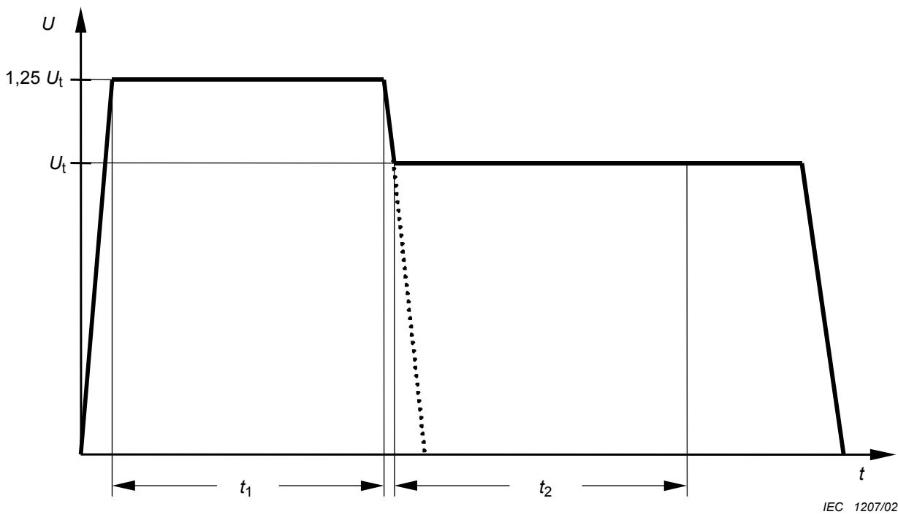  
Figure 3 – Tensions d’essai

## 6.1.3.5.4 Critères d'acceptation

## 6.1.3.5.4.1 Grandeur de décharge spécifiée

Le but étant l'absence de décharges partielles permanentes en conditions de fonctionnement normal, la plus faible valeur, possible en pratique, doit être spécifiée (voir l’Article D.3).

NOTE 1 A l'exception des décharges provoquées par des décharges par effluves dans l'air (par exemple des transformateurs non moulés), les valeurs au-dessus de 10 pC ne sont pas convenables.

NOTE 2 Les valeurs aussi faibles que 2 pC sont possibles avec les appareils généralement disponibles.

Le niveau de bruit ne doit pas être déduit de la valeur de lecture de l’appareil de mesure des décharges partielles.

## 6.1.3.5.4.2 Résultat d'essai

L’isolation solide est considérée comme conforme si

– aucun claquage ne s'est produit au niveau de l'isolation, et

durant l'application de la tension d'essai des décharges partielles n'ont pas eu lieu, ou si après $t _ { 2 } ,$ la grandeur de décharge mesurée n'est pas supérieure à la grandeur de décharge spécifiée.

## 6.1.3.6 Essai sous tension continue

L’essai de tension en courant continu avec une tension d’essai égale à la valeur de crête de la tension en courant alternatif n’est pas entièrement équivalent à l’essai de tension en courant alternatif en raison des différentes caractéristiques de résistance de l’isolation solide pour ces types de tensions. Cependant, dans le cas d’une simple contrainte de tension en courant continu, l’essai de tension en courant continu est approprié.

La tension d’essai en courant continu doit être en grande partie exempte d’ondulation. Cette exigence est satisfaite si le rapport entre les valeurs crêtes de la tension et la valeur moyenne est égal à 1,0 % ±3 %. La valeur moyenne de la tension d’essai continue doit être égale à la valeur de crête de la tension d’essai alternative mentionnée en 6.1.3.1 b).

Pour l’isolation principale et l’isolation supplémentaire, la tension d’essai a la même valeur que les tensions mentionnées en 6.1.3.1 b). Pour l’isolation renforcée, la tension d’essai est le double de la valeur utilisée pour l’isolation principale.

La tension d'essai continue doit être uniformément augmentée de 0 V à la valeur spécifiée en 5.3.3.2 dans un intervalle de temps maximal de 5 s et elle doit être maintenue à cette valeur pendant au moins 60 s.

NOTE 1 Dans certains cas, le courant de charge dû aux capacités peut être trop élevé et un temps de montée plus long peut être nécessaire.

Le matériel d’essai est spécifié dans la CEI 61180-2. Il est recommandé que le courant de sortie de court-circuit du générateur ne soit pas inférieur à 200 mA.

NOTE 2 Pour les tensions d’essai supérieures à 3 kV, il est suffisant que la puissance assignée du matériel d’essai soit supérieure ou égale à 600 VA.

Le courant de déclenchement du générateur doit être réglé sur une valeur de 100 mA ou pour les tensions d’essai supérieures à 6 kV sur la valeur la plus élevée possible.

NOTE 3 Pour les essais individuels de série, le courant de déclenchement peut être réglé à des niveaux inférieurs mais pas à moins de 10 mA.

## 6.1.3.7 Essai de tension à haute fréquence

Pour les tensions à haute fréquence selon 5.3.3.2.5, des essais de tension alternative supplémentaires ou de substitution conformément à 6.1.3.4 ou des essais de décharges partielles conformément à 6.1.3.5 peuvent être nécessaires.

NOTE Les informations concernant les caractéristiques de résistance de l’isolation à haute fréquence et les méthodes d’essai sont données dans la CEI 60664-4.

## 6.1.4 Exécution des essais diélectriques sur des matériels complets

## 6.1.4.1 Généralités

Lorsqu’on réalise l’essai de tension de choc sur des matériels complets, l’affaiblissement ou l’amplification de la tension d’essai doivent être pris en compte. On doit s’assurer que la valeur exigée de la tension d’essai est appliquée aux bornes du matériel en essai.

Les dispositifs de protection contre les surtensions doivent être déconnectés avant les essais diélectriques.

NOTE Si des condensateurs avec une capacité élevée sont parallèles aux parties entre lesquelles la tension d’essai doivent être appliqués, il peut être difficile voire même impossible d'exécuter l'essai de tension alternative parce que le courant de charge dépasserait les capacités du dispositif d'essai à haute tension (200 mA). Dans ce dernier cas, il convient que ces condensateurs parallèles soient déconnectés avant l'essai. Si cela est impossible, l’essai en courant continu peut être pris en considération.

## 6.1.4.2 Parties à soumettre à l’essai

La tension d'essai doit être appliquée entre les parties du matériel qui sont séparées électriquement l'une de l'autre.

Ces parties sont, par exemple

– des parties actives,

– des circuits séparés,

– des circuits mis à la terre,

– des surfaces accessibles.

Les parties non conductrices des surfaces accessibles doivent être couvertes d'une feuille métallique.

NOTE Si un revêtement complet de grandes enveloppes avec une feuille métallique n'est pas réalisable, un revêtement partiel est suffisant s'il est appliqué aux parties qui procurent la protection contre les chocs électriques.

## 6.1.4.3 Préparation des circuits du matériel

Pour l'essai, chaque circuit du matériel doit être préparé comme suit:

– les bornes externes du circuit, s'il y en a, doivent être connectées ensemble;

– l'appareillage à l’intérieur du matériel doit être en position fermée ou shunté;

les bornes des composants bloquant la tension (tels que les diodes de redressement) doivent être connectées ensemble;

les composants tels que les filtres contre les perturbations radioélectriques doivent être inclus dans l'essai au choc, mais il peut être nécessaire de les déconnecter pendant les essais en courant alternatif.

NOTE 1 Les composants sensibles à la tension d'un circuit quelconque du matériel qui ne court-circuitent pas l'isolation principale ou renforcée peuvent être shuntés en court-circuitant les bornes.

NOTE 2 Les cartes de circuits imprimés enfichables préessayées et les modules préessayés comportant des connecteurs multipôles peuvent être retirés, déconnectés ou remplacés par des éléments factices, afin d'assurer que la tension d'essai se propage à l'intérieur du matériel pour les essais d'isolement avec l'ampleur nécessaire.

## 6.1.4.4 Valeurs de la tension d'essai

Les circuits raccordés au réseau d'alimentation basse tension sont essayés conformément à 6.1.2 et 6.1.3.

La tension d'essai entre deux circuits du matériel doit avoir la valeur correspondant à la tension la plus élevée qui peut réellement apparaître entre ces circuits.

## 6.1.4.5 Critères d'essai

Il ne doit pas y avoir décharge disruptive (amorçage, claquage ou perforation) pendant ces essais. Les décharges partielles dans les distances dans l'air qui ne provoquent pas de claquage ne sont pas retenues, à moins qu'il n'en soit spécifié autrement par le comité d'études.

NOTE Il est recommandé d'utiliser un oscilloscope pour observer la tension de choc afin de détecter une décharge disruptive.

## 6.1.5 Autres essais

## 6.1.5.1 Essai dans un but autre que la coordination de l'isolement

Les comités d'études spécifiant des essais diélectriques à des fins autres que la vérification de la coordination de l’isolement ne doivent pas spécifier des tensions d'essai plus élevées que celles exigées pour la coordination de l'isolement.

## 6.1.5.2 Essais individuels de série et sur prélèvement

Les essais individuels de série et sur prélèvement sont prévus afin d'assurer la qualité de la production. Il est de la responsabilité du comité d'études compétent, et en particulier du fabricant, de spécifier ces essais. Ils doivent être effectués avec les formes d'onde et les niveaux de tension, de sorte que les défauts soient détectés sans occasionner de dommage au matériel (isolation solide ou composants).

Les comités d’études qui spécifient des essais individuels de série et sur prélèvement ne doivent en aucun cas spécifier des tensions d’essai supérieures à celles exigées pour les essais de type.

## 6.1.6 Précision de mesurage des paramètres d’essai

Tous les paramètres d’essai importants doivent être mesurés avec grande précision afin de donner des résultats d'essai bien définis et comparables. Dans un souci d’harmonisation, la précision de mesurage des dispositifs de mesure utilisés pour les paramètres de l’essai suivant est donnée dans la présente norme:

a) tension d’essai (c.a/c.c.): ±3 %; tension d’essai (choc): ±5 %;

b) courant: ±1,5 %;

c) fréquence: ±0,2 %;

d) température: – inférieure à 100 °C ±2 K; – 100 °C jusqu’à 500 °C ±3 %;

e) une humidité relative de: ±3 % h.r.

NOTE La précision donnée fait référence à celle du dispositif de mesure de l’humidité. Elle n’inclut pas l’uniformité d’humidité dans l’enceinte ni/ou l’influence de l’échantillon d’essai sur l’uniformité d’humidité. L’humidité de l’enceinte est mesurée à un seul emplacement avant l’essai de l’échantillon.

f) grandeur de décharge partielle: ±10 % ou ±1 pC (les valeurs les plus élevées s’appliquent);

g) durée (tension de choc) ±20 %; durée (durée d’essai) ±1 %.

## 6.2 Mesure des lignes de fuite et des distances d'isolement

La dimension X, spécifiée dans les exemples suivants, a une valeur minimale dépendant du degré de pollution:

<table><tr><td>Degré de pollution</td><td>Valeur minimale de la dimension X</td></tr><tr><td>1</td><td>0,25 mm</td></tr><tr><td>2</td><td>1,0 mm</td></tr><tr><td>3</td><td>1,5 mm</td></tr></table>

Si la distance d'isolement associée est inférieure à 3 mm, la largeur X minimale peut être réduite au tiers de la valeur de cette distance d'isolement.

Les méthodes de mesure des lignes de fuite et des distances d'isolement sont indiquées dans les Exemples 1 à 11. Ces exemples ne font pas de différence entre les intervalles et les rainures ou entre les types d'isolation.

Les suppositions suivantes ont été faites:

tout puits est supposé être ponté par une liaison isolante de longueur égale à la largeur X spécifiée et placée dans la position la plus défavorable (voir Exemple 3);

lorsque la distance au-dessus d’une rainure est supérieure ou égale à la largeur spécifiée X, la ligne de fuite est mesurée le long des contours de la rainure (voir Exemple 2);

les lignes de fuite et les distances d'isolement mesurées entre les parties mobiles l'une par rapport à l'autre sont mesurées lorsque ces parties se trouvent dans leurs positions les plus défavorables.

Exemple 1  
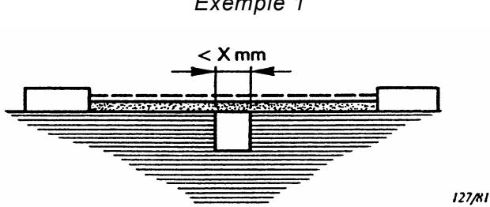

Condition: Ce chemin de ligne de fuite comprend une rainure à flancs parallèles ou convergents, de profondeur quelconque et de largeur inférieure à X mm.

Règle: La ligne de fuite et la distance d'isolement sont mesurées en ligne droite au-dessus de la rainure, comme indiqué ci-dessus.

Exemple 2  
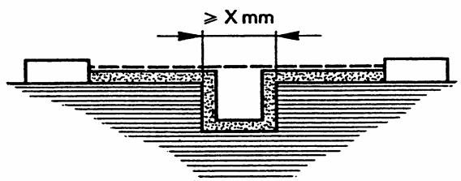

Condition: Ce chemin de ligne de fuite comprend une rainure à flancs parallèles, de profondeur quelconque et de largeur égale ou supérieure à X mm.

Règle: La distance d'isolement est la distance en ligne droite. Le chemin de la ligne de fuite longe le profil de la rainure.

Exemple 3  
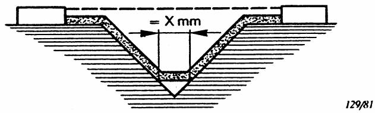

Condition: Ce chemin de ligne de fuite comprend une rainure en V dont la largeur est supérieure à X mm.

Règle: La distance d'isolement est la distance en ligne droite. Le chemin de la ligne de fuite longe le profil de la rainure, mais «court-circuite» le bas de la rainure par un tronçon de X mm.

Distance d’isolemen

Exemple 4

Ligne de fuite

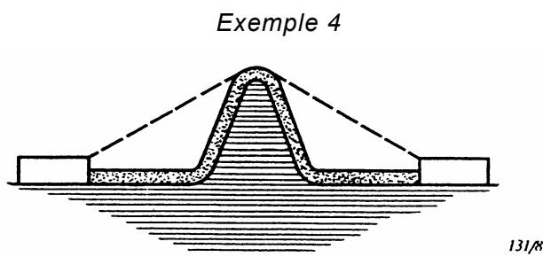

131/81

Condition: Ce chemin de ligne de fuite comprend une nervure.

Règle: La distance d'isolement est le chemin dans l'air le plus court par-dessus le sommet de la nervure. Le chemin de la ligne de fuite longe le profil de la nervure.

Exemple 5  
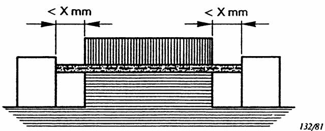

Condition: Ce chemin de ligne de fuite comprend deux parties non collées avec des rainures de largeur inférieure à X mm de chaque côté.

Règle: Le chemin de la ligne de fuite et de la distance d'isolement est la distance en ligne droite indiquée cidessus.

Exemple 6  
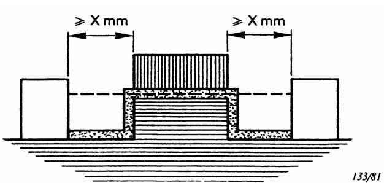

Condition: Ce chemin de ligne de fuite comprend deux parties non collées avec des rainures de largeur égale ou supérieure à X mm de chaque côté.

Règle: La distance d'isolement est la distance en ligne droite. Le chemin de la ligne de fuite longe le profi des rainures.

Distance d’isolemen

Ligne de fuite

Exemple 7  
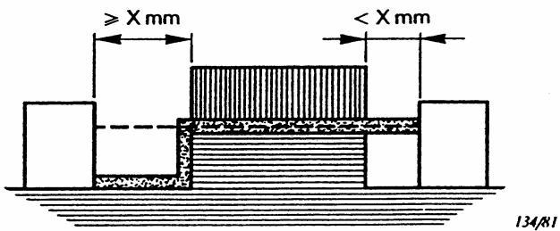

Condition: Ce chemin de ligne de fuite comprend deux parties non collées avec, d'un côté une rainure de largeur inférieure à X mm et, de l'autre côté, une rainure de largeur égale ou supérieure à X mm.

Règle: Les chemins de la distance d'isolement et de la ligne de fuite sont indiqués ci-dessus.

Exemple 8  
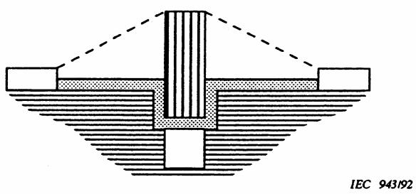

Condition: La ligne de fuite à travers le joint non collé est inférieure à la ligne de fuite par dessus la barrière. Règle: La distance d'isolement est le chemin dans l'air le plus court par dessus le sommet de la barrière.

Distance d’isolemen

Ligne de fuite

Exemple 9  
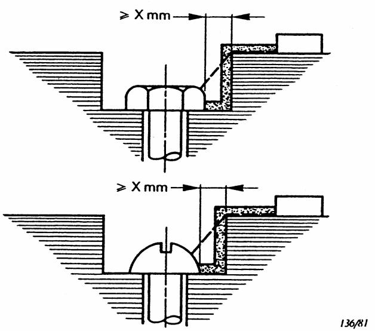  
Distance suffisante entre tête de vis et paroi du logement pour être prise en compte.

## Exemple 10

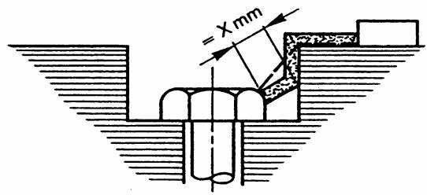

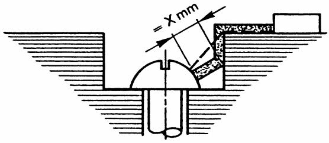

Distance trop faible entre tête de vis et paroi du logement pour être prise en compte.

La mesure de la ligne de fuite s'effectue de la vis à la paroi quand la distance est égale à X mm.

Distance d'isolement

Ligne de fuite

Exemple 11

Partie conductrice flottante

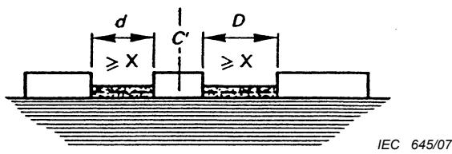

Distance d'isolement = d + D Ligne de fuite = d + D

## Annexe A (informative)

## Données fondamentales des caractéristiques de tenue des distances d'isolement

Tableau A.1 – Tensions de tenue en kilovolts pour une altitude de 2 000 m au-dessus du niveau de la mer

<table><tr><td rowspan="2">Distance d&#x27;isolement</td><td colspan="3">Cas A Champ non homogène</td><td colspan="2">Cas B Champ homogène</td></tr><tr><td colspan="2">CA (50/60 Hz)</td><td>Choc (1,2/50)</td><td>CA (50/60 Hz)</td><td>CA (50/60 Hz) et choc (1,2/50)</td></tr><tr><td>mm</td><td>U r.m.s.</td><td>Û</td><td>Û</td><td>U r.m.s.</td><td>Û</td></tr><tr><td>0,001</td><td>0,028</td><td>0,040</td><td>0,040</td><td>0,028</td><td>0,04</td></tr><tr><td>0,002</td><td>0,053</td><td>0,075</td><td>0,075</td><td>0,053</td><td>0,07</td></tr><tr><td>0,003</td><td>0,078</td><td>0,110</td><td>0,110</td><td>0,078</td><td>0,11</td></tr><tr><td>0,004</td><td>0,102</td><td>0,145</td><td>0,145</td><td>0,102</td><td>0,14</td></tr><tr><td>0,005</td><td>0,124</td><td>0,175</td><td>0,175</td><td>0,124</td><td>0,17</td></tr><tr><td>0,006 25</td><td>0,152</td><td>0,215</td><td>0,215</td><td>0,152</td><td>0,21</td></tr><tr><td>0,008</td><td>0,191</td><td>0,270</td><td>0,270</td><td>0,191</td><td>0,27</td></tr><tr><td>0,010</td><td>0,23</td><td>0,33+</td><td>0,33+</td><td>0,23</td><td>0,33</td></tr><tr><td>0,012</td><td>0,25</td><td>0,35</td><td>0,35</td><td>0,25</td><td>0,35</td></tr><tr><td>0,015</td><td>0,26</td><td>0,37</td><td>0,37</td><td>0,26</td><td>0,37</td></tr><tr><td>0,020</td><td>0,28</td><td>0,40</td><td>0,40</td><td>0,28</td><td>0,40</td></tr><tr><td>0,025</td><td>0,31</td><td>0,44</td><td>0,44</td><td>0,31</td><td>0,44</td></tr><tr><td>0,030</td><td>0,33</td><td>0,47</td><td>0,47</td><td>0,33</td><td>0,47</td></tr><tr><td>0,040</td><td>0,37</td><td>0,52</td><td>0,52</td><td>0,37</td><td>0,52</td></tr><tr><td>0,050</td><td>0,40</td><td>0,56</td><td>0,56</td><td>0,40</td><td>0,56</td></tr><tr><td>0,062 5</td><td>0,42</td><td>0,60+</td><td>0,60+</td><td>0,42</td><td>0,60</td></tr><tr><td>0,080</td><td>0,46</td><td>0,65</td><td>0,70</td><td>0,50</td><td>0,70</td></tr><tr><td>0,10</td><td>0,50</td><td>0,70</td><td>0,81</td><td>0,57</td><td>0,81</td></tr><tr><td>0,12</td><td>0,52</td><td>0,74</td><td>0,91</td><td>0,64</td><td>0,91</td></tr><tr><td>0,15</td><td>0,57</td><td>0,80</td><td>1,04+</td><td>0,74</td><td>1,04</td></tr><tr><td>0,20</td><td>0,62</td><td>0,88</td><td>1,15</td><td>0,89</td><td>1,26</td></tr><tr><td>0,25</td><td>0,67</td><td>0,95</td><td>1,23</td><td>1,03</td><td>1,45</td></tr><tr><td>0,30</td><td>0,71</td><td>1,01</td><td>1,31</td><td>1,15</td><td>1,62</td></tr><tr><td>0,40</td><td>0,78</td><td>1,11</td><td>1,44</td><td>1,38</td><td>1,95</td></tr><tr><td>0,50</td><td>0,84</td><td>1,19</td><td>1,55</td><td>1,59</td><td>2,25</td></tr><tr><td>0,60</td><td>0,90</td><td>1,27</td><td>1,65</td><td>1,79</td><td>2,53</td></tr><tr><td>0,80</td><td>0,98</td><td>1,39</td><td>1,81</td><td>2,15</td><td>3,04</td></tr><tr><td>1,0</td><td>1,06</td><td>1,50+</td><td>1,95</td><td>2,47</td><td>3,50</td></tr><tr><td>1,2</td><td>1,20</td><td>1,70</td><td>2,20</td><td>2,89</td><td>4,09</td></tr><tr><td>1,5</td><td>1,39</td><td>1,97</td><td>2,56</td><td>3,50</td><td>4,95</td></tr><tr><td>2,0</td><td>1,68</td><td>2,38</td><td>3,09</td><td>4,48</td><td>6,33</td></tr><tr><td>2,5</td><td>1,96</td><td>2,77</td><td>3,60</td><td>5,41</td><td>7,65</td></tr><tr><td>3,0</td><td>2,21</td><td>3,13</td><td>4,07</td><td>6,32</td><td>8,94</td></tr><tr><td>4,0</td><td>2,68</td><td>3,79</td><td>4,93</td><td>8,06</td><td>11,4</td></tr><tr><td>5,0</td><td>3,11</td><td>4,40</td><td>5,72</td><td>9,76</td><td>13,8</td></tr><tr><td>6,0</td><td>3,51</td><td>4,97</td><td>6,46</td><td>11,5</td><td>16,2</td></tr><tr><td>8,0</td><td>4,26</td><td>6,03</td><td>7,84</td><td>14,6</td><td>20,7</td></tr><tr><td>10,0</td><td>4,95</td><td>7,00+</td><td>9,10</td><td>17,7</td><td>25,0+</td></tr><tr><td>12,0</td><td>5,78</td><td>8,18</td><td>10,6</td><td>20,9</td><td>29,6</td></tr><tr><td>15,0</td><td>7,00</td><td>9,90</td><td>12,9</td><td>25,7</td><td>36,4</td></tr><tr><td>20,0</td><td>8,98</td><td>12,7</td><td>16,4</td><td>33,5</td><td>47,4</td></tr><tr><td>25,0</td><td>10,8</td><td>15,3</td><td>19,9</td><td>41,2</td><td>58,3</td></tr><tr><td>30,0</td><td>12,7</td><td>17,9</td><td>23,3</td><td>48,8</td><td>69,0</td></tr><tr><td>40,0</td><td>16,2</td><td>22,9</td><td>29,8</td><td>63,6</td><td>90,0</td></tr><tr><td>50,0</td><td>19,6</td><td>27,7</td><td>36,0</td><td>78,5</td><td>111,0</td></tr><tr><td>60,0</td><td>22,8</td><td>32,3</td><td>42,0</td><td>92,6</td><td>131,0</td></tr><tr><td>80,0</td><td>29,2</td><td>41,3</td><td>53,7</td><td>120,9</td><td>171,0</td></tr></table>

Tableau A.1 (suite)

<table><tr><td rowspan="2">Distance d&#x27;isolement</td><td colspan="3">Cas AChamp non homogène</td><td colspan="2">Cas BChamp homogène</td></tr><tr><td colspan="2">CA(50/60 Hz)</td><td>Choc(1,2/50)</td><td>CA(50/60 Hz)</td><td>CA(50/60 Hz) et choc (1,2/50)</td></tr><tr><td>mm</td><td>U r.m.s.</td><td>Û</td><td>Û</td><td>U r.m.s.</td><td>Û</td></tr><tr><td>100,0</td><td>35,4</td><td>50,0+</td><td>65,0</td><td>148,5</td><td>210,0+</td></tr><tr><td colspan="6">NOTE Les informations pour les distances d&#x27;isolement de 0,001 mm à 0,008 mm, sont tirées du document « Electrical breakdown experiments in air for micrometer gaps under various pressures » de P. Hartherz, K. en Yahia, L. Müller, R. Pfendtner et W. Pfeiffer publié à l&#x27;occasion du  $9^{ième}$  Symposium international sur les diélectriques gazeux, Ellicot City, Maryland, USA 2001, pp333-338.Plus de détails peuvent être trouvés dans la thèse de P. Hartherz « Anwendung der Teilentladungsmeßtechnik zur Fehleranalyse in festen Isolierungen unter periodischer Impulsspannungsbelastung ». Dissertation TU Darmstadt; Shaker Verlag, 2002.</td></tr></table>

Pour simplifier, les valeurs mesurées statistiquement selon le Tableau A.1 ci-dessus sont remplacées par une ligne droite entre les valeurs marquées «+» sur un diagramme log-log tenant compte des facteurs de correction de 0 m à 2 000 m d'altitude. Les valeurs intermédiaires sont tirées de ce diagramme (voir Figure A.1) de sorte qu'elles comprennent les valeurs mesurées avec une faible marge de sécurité. Les valeurs de U eff. s'obtiennent en divisant les valeurs de $\hat { U } \mathsf { p a r } \sqrt { 2 }$

Tableau A.2 – Facteurs de correction d'altitude

<table><tr><td>Altitude m</td><td>Pression atmosphérique normale kPa</td><td>Facteur de multiplication pour les distances d&#x27;isolement</td></tr><tr><td>2 000</td><td>80,0</td><td>1,00</td></tr><tr><td>3 000</td><td>70,0</td><td>1,14</td></tr><tr><td>4 000</td><td>62,0</td><td>1,29</td></tr><tr><td>5 000</td><td>54,0</td><td>1,48</td></tr><tr><td>6 000</td><td>47,0</td><td>1,70</td></tr><tr><td>7 000</td><td>41,0</td><td>1,95</td></tr><tr><td>8 000</td><td>35,5</td><td>2,25</td></tr><tr><td>9 000</td><td>30,5</td><td>2,62</td></tr><tr><td>10 000</td><td>26,5</td><td>3,02</td></tr><tr><td>15 000</td><td>12,0</td><td>6,67</td></tr><tr><td>20 000</td><td>5,5</td><td>14,5</td></tr></table>

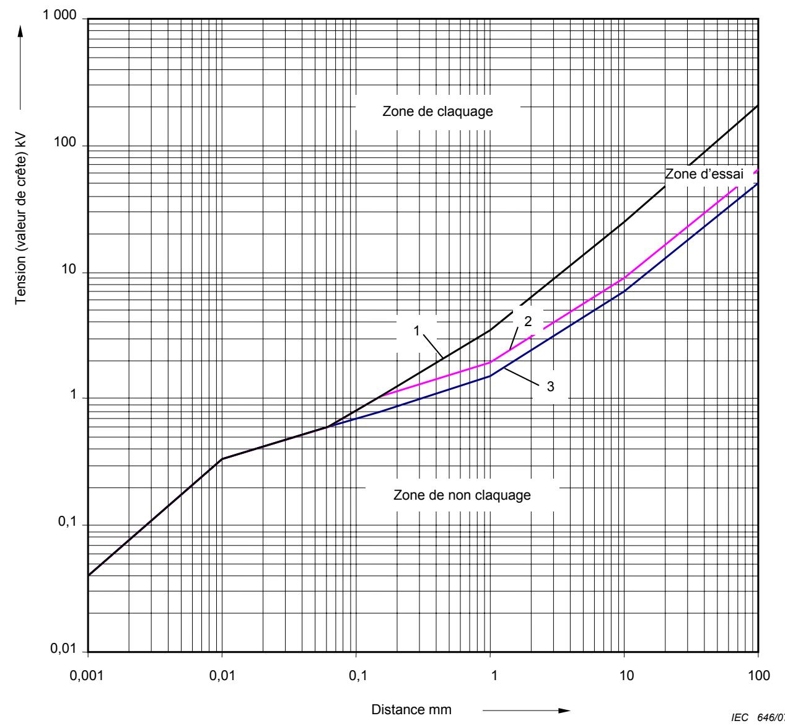

Légende 1 cas B; Û 1,2/50 et Û 50/60 Hz 2 cas A; Û 1,2/50 3 cas A; Û 50/60 Hz

Figure A.1 – Tension de tenue à 2 000 m au-dessus du niveau de la mer

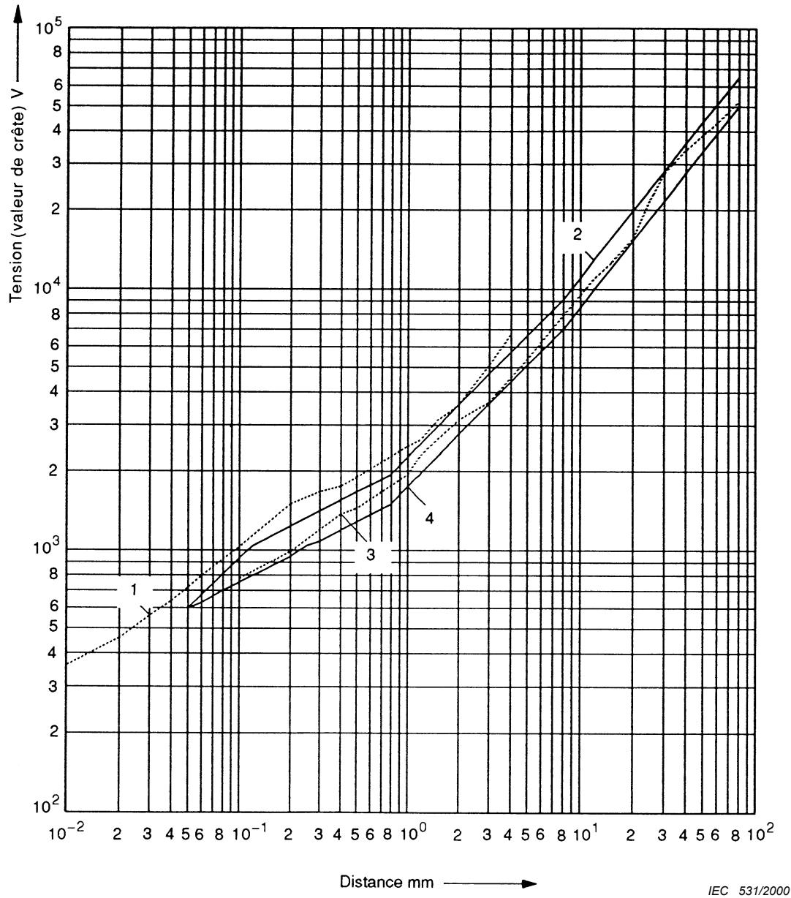

Légende 1 Û 1,2/50 d’après ETZ-B, 1976 pp300-302 [3] 2 Limites inférieures pour Û 1,2/50 3 Û 50 Hz d’après ETZ-A, 1969 pp251-255 [4] 4 Limites inférieures pour Û 50 Hz

Figure A.2 – Valeurs expérimentales mesurées approximativement au niveau de la mer avec leurs limites inférieures pour les champs hétérogènes

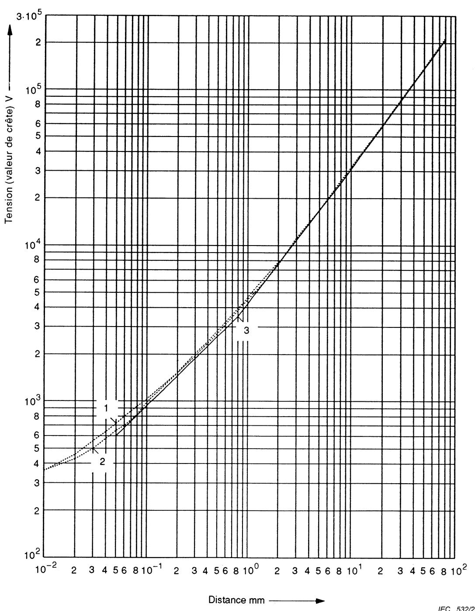  
Figure A.3 – Valeurs expérimentales mesurées approximativement au niveau de la mer avec leurs limites inférieures pour les champs homogènes

# Annexe B (informative)

# Tensions nominales des réseaux d'alimentation pour différents modes de contrôle des surtensions

Tableau B.1 – Situation naturelle ou situation contrôlée équivalente

<table><tr><td rowspan="3">Tension phase-neutre déduite des tensions nominales c.a. ou c.c. jusqu&#x27;à y compris 1)V</td><td colspan="4">Tensions nominales utilisées actuellement dans le monde</td><td colspan="4">Tension assignée de choc pour les matériels1)V</td></tr><tr><td rowspan="2">Réseaux triphasés 4 filsavec neutre à la terre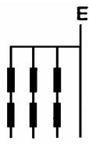V</td><td rowspan="2">Réseaux triphasés 3 filsnon raccordés à la terreV</td><td rowspan="2">Réseaux mono-phasés 2 filsc.a. ou c.c.[IMAGE]V</td><td rowspan="2">Réseaux mono-phasés 3 filsc.a. ou c.c.[IMAGE]V</td><td colspan="4">Catégorie de surtension</td></tr><tr><td>I</td><td>II</td><td>III</td><td>IV</td></tr><tr><td>50</td><td></td><td></td><td>12,5 2425 3042 48</td><td>30-60</td><td>330</td><td>500</td><td>800</td><td>1 500</td></tr><tr><td>100</td><td>66/115</td><td>66</td><td>60</td><td></td><td>500</td><td>800</td><td>1 500</td><td>2 500</td></tr><tr><td>150</td><td>120/208*127/220</td><td>115, 120,127</td><td>100**,110, 120</td><td>100-200**110-220120-240</td><td>800</td><td>1 500</td><td>2 500</td><td>4 000</td></tr><tr><td>300</td><td>220/380, 230/400240/415, 260/440277/480</td><td>200**, 220,230, 240, 260,277, 347380, 400, 415440, 480</td><td>220</td><td>220-440</td><td>1 500</td><td>2 500</td><td>4 000</td><td>6 000</td></tr><tr><td>600</td><td>347/600, 380/660400/690, 417/720480/830</td><td>500, 577, 600</td><td>480</td><td>480-960</td><td>2 500</td><td>4 000</td><td>6 000</td><td>8 000</td></tr><tr><td>1 000</td><td></td><td>660690, 720830, 1 000</td><td>1 000</td><td></td><td>4 000</td><td>6 000</td><td>8 000</td><td>12 000</td></tr><tr><td colspan="9">1) Ces colonnes sont tirées du Tableau F.1 dans lequel les valeurs de tension assignée de tenue aux chocs sont spécifiées.* Utilisée aux Etats-Unis d&#x27;Amérique et au Canada.** Utilisée au Japon.</td></tr></table>

Tableau B.2 – Cas où une situation contrôlée est nécessaire et où le contrôle est procuré par des parafoudres dont le rapport de la tension résiduelle à la tension assignée n'est pas inférieur à celui spécifié par la CEI 60099-1

<table><tr><td rowspan="3">Tension phase-neutre déduite des tensions nominales c.a. ou c.c. jusqu&#x27;à y compris 1)V</td><td colspan="4">Tensions nominales utilisées actuellement dans le monde</td><td colspan="4">Tension assignée de choc pour les matériels 1)V</td></tr><tr><td rowspan="2">Réseaux triphasés 4 filsavec neutre à la terre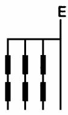V</td><td rowspan="2">Réseaux triphasés 3 filsraccordés ou non à la terre-(E)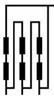V</td><td rowspan="2">Réseaux mono-phasés 2 filsc.a. ou c.c.[IMAGE]V</td><td rowspan="2">Réseaux mono-phasés 3 filsc.a. ou c.c.[IMAGE]V</td><td colspan="4">Catégorie de surtension</td></tr><tr><td>I</td><td>II</td><td>III</td><td>IV</td></tr><tr><td>50</td><td></td><td></td><td>12,5 2425 3042 48</td><td>30-60</td><td>330</td><td>500</td><td>800</td><td>1 500</td></tr><tr><td>100</td><td>66/115</td><td>66</td><td>60</td><td></td><td>500</td><td>800</td><td>1 500</td><td>2 500</td></tr><tr><td>150</td><td>120/208 * 127/220</td><td>115, 120, 127</td><td>100 **110, 120</td><td>100-200 **110-220120-240</td><td>800</td><td>1 500</td><td>2 500</td><td>4 000</td></tr><tr><td>300</td><td>220/380, 230/400240/415, 260/440277/480</td><td>200 **, 220, 230, 240260, 277</td><td>220</td><td>220-440</td><td>1 500</td><td>2 500</td><td>4 000</td><td>6 000</td></tr><tr><td>600</td><td>347/600, 380/660400/690, 417/720480/830</td><td>347, 380, 400415, 440, 480500, 577, 600</td><td>480</td><td>480-960</td><td>2 500</td><td>4 000</td><td>6 000</td><td>8 000</td></tr><tr><td>1 000</td><td></td><td>660690, 720830, 1 000</td><td>1 000</td><td></td><td>4 000</td><td>6 000</td><td>8 000</td><td>12 000</td></tr><tr><td colspan="9">1) Ces colonnes sont tirées du Tableau F.1 dans lequel les valeurs de tension assignée de tenue aux chocs sont spécifiées.* Utilisée aux Etats-Unis d&#x27;Amérique et au Canada.** Utilisée au Japon.</td></tr></table>

# Annexe C (normative)

# Méthodes d'essai de décharge partielle

## C.1 Circuits d'essai

## C.1.1 Généralités

Les circuits d’essai doivent fonctionner comme cela est décrit dans la CEI 60270. Les circuits suivants donnés dans cette annexe satisfont aux exigences et sont donnés comme exemples.

NOTE 1 Dans la majorité des cas, les appareils d’essai conçus conformément aux exemples donnés dans cette annexe seront suffisants. Dans des cas spéciaux, par exemple en présence de bruit ambiant extrêmement élevé, il peut être nécessaire de se référer à la CEI 60270.

NOTE 2 Pour l'explication de l'opération de base, voir l’Article D.2.

## C.1.2 Circuit d'essai pour spécimen d'essai relié à la terre

Légende

$U _ { \mathrm { t } }$ tension d'essai

$Z$ filtre

$\mathsf { C } _ { \mathsf { a } }$ spécimen d’essai (peut être habituellement considéré comme une capacité)

$C _ { \mathsf { k } }$ condensateur de couplage

$Z _ { \mathsf { m } }$ impédance de mesurage

Figure C.1 – Spécimen d'essai relié à la terre

## C.1.3 Circuit d'essai pour spécimen non relié à la terre

  
Figure C.2 – Spécimen d'essai non relié à la terre

## C.1.4 Critères de sélection

Les deux circuits sont fondamentalement équivalents. Cependant, les capacités réparties du spécimen d'essai ont une influence différente sur la sensibilité. La capacité par rapport à la terre de la borne de haute tension du spécimen d’essai tend à réduire la sensibilité du circuit conformément à C.1.2 et tend à augmenter la sensibilité du circuit conformément à C.1.3. Par conséquent, il convient de choisir ce circuit.

## C.1.5 Impédance de mesurage

L'impédance de mesurage doit assurer une chute de tension négligeable à la fréquence d'essai. L'impédance, pour la fréquence de mesurage, doit être sélectionnée de manière à assurer une sensibilité convenable, conformément à l’Article D.2.

Si des composants limiteurs de tension sont utilisés, ils ne doivent pas intervenir dans l'intervalle de mesurage.

## C.1.6 Condensateur de couplage $\pmb { C } _ { \mathbf { k } }$

Ce condensateur doit avoir un type d'inductance faible, avec une fréquence de résonance audessus de 3 $f _ { 2 }$ (voir l’Article C.3). Aucune décharge partielle n'est permise à la plus haute tension d'essai utilisée.

## C.1.7 Filtre

L'utilisation d'un filtre n'est pas impérative. S’il est utilisé, son impédance doit être élevée pour la fréquence de mesurage.

## C.2 Paramètres d’essai

## C.2.1 Généralités

Les comités d'études doivent spécifier

– la fréquence $\pmb { f _ { \mathrm { f } } }$ de la tension d'essai (C.2.2),

– la grandeur de la décharge spécifiée (6.1.3.5.4.1),

– les conditions climatiques pour l'essai de DP (C.2.3).

NOTE Deux spécifications différentes pour l'essai de type et l'essai individuel de série peuvent s'avérer nécessaires.

## C.2.2 Exigences relatives à la tension d'essai

Normalement, les tensions utilisées sont alternatives. Le taux d'harmoniques doit être inférieur à 3 %.

NOTE 1 La faible distorsion de l'onde sinusoïdale permet l'utilisation de voltmètres normalisés ainsi que le calcul de la valeur de crête à partir de la valeur efficace lue. En cas de distorsion supérieure, il convient d'utiliser des voltmètres de crête.

Les essais sont normalement effectués à fréquence industrielle. Si d'autres fréquences sont présentes dans les matériels, les comités d'études doivent tenir compte de l'effet éventuel de ces fréquences sur la grandeur de décharge.

NOTE 2 Il convient de ne pas effectuer les essais de DP avec une tension continue, en raison de la difficulté liée à la réalisation d'un environnement totalement exempt de bruit électrique. En outre, il convient de noter que la répartition de la tension est très différente selon qu'il s'agit d'un courant alternatif ou d'un courant continu.

## C.2.3 Conditions climatiques

Il est recommandé de réaliser l'essai à la température ambiante et au taux d'humidité moyen (23 °C, h.r. 50 %, se reporter à 5.3 de la CEI 60068-1).

## C.3 Exigences relatives aux appareils de mesurage

## C.3.1 Généralités

Il est permis d'utiliser des appareils de mesurage à bande étroite et des appareils de mesurage à large bande (se reporter à C.3.3). L'utilisation des voltmètres de mesurage d'interférence radioélectrique est soumise aux précautions spécifiées en C.3.2.

La limite inférieure de la fréquence de mesurage est déterminée par la fréquence de la tension d'essai $\pmb { f } _ { \mathrm { f } }$ et par la caractéristique de fréquence de l'impédance de mesurage $Z _ { \mathsf { m } }$ (se reporter à C.1.5). Il est recommandé que cette limite inférieure soit supérieure ou égale à 10 $\pmb { f _ { \mathrm { f } } } .$

La limite supérieure de la fréquence de mesurage est déterminée par la forme des ondes d'impulsion de DP et par la réponse en fréquence du circuit d'essai. Cette limite n’a pas à être supérieure à 2 MHz. Pour ce qui concerne les appareils de mesurage de DP à bande étroite, on doit sélectionner la fréquence de mesurage par rapport aux sources de bruit à bande étroite (voir D.3.3).

NOTE Il est recommandé d'utiliser des appareils de mesurage de DP à bande étroite.

## C.3.2 Classification des appareils de mesurage de DP

Le courant qui traverse l'impédance de mesurage $Z _ { \mathsf { m } }$ est intégré pour fournir une valeur de lecture proportionnelle à $q _ { \mathsf { m } }$ (voir la Figure D.1).

L'intégration peut être faite par l'impédance de mesurage. Dans ce cas, elle doit représenter une capacité pour toutes les fréquences au-dessus de la limite inférieure de la fréquence de mesurage. La tension proportionnelle à la charge $q _ { \mathsf { m } }$ à travers la capacité est amplifiée par un amplificateur d'impulsion. Il est également impératif d'assurer une décharge périodique.

Si l'impédance de mesurage est résistive pour toutes les fréquences au-dessus de la limite inférieure de la fréquence de mesurage, l'intégration doit être effectuée au niveau de l'amplificateur d'impulsion.

Les impulsions doivent être mesurées individuellement et l'impulsion d'amplitude maximale doit être évaluée. Afin de limiter les erreurs dues au recouvrement des impulsions, le temps de résolution des impulsions doit être inférieur à 100 μs.

Les appareils de mesurage d'interférence radioélectrique sont des appareils de mesurages de tension de crête à bande étroite. Ils sont utilisés pour mesurer les interférences des signaux radioélectriques. Ces appareils comprennent un circuit filtrant spécial qui assure une dépendance entre la lecture et la fréquence de récurrence, selon l'effet subjectif du bruit sur l'oreille humaine.

Pour le mesurage de décharges partielles, les appareils de mesurage de niveau d'interférence ne peuvent être utilisés que si le circuit filtrant est coupé. Une impédance de mesurage adaptée est donc nécessaire.

## C.3.3 Bande passante du circuit d'essai

Habituellement, l'appareil de mesurage de DP limite la bande passante du circuit d'essai. Les appareils de mesurage de DP sont classés suivant leur bande passante dans les appareils de mesurage à large bande et à bande étroite.

a) Les fréquences de coupure inférieure et supérieure $f _ { 1 }$ et $f _ { 2 }$ sont celles où la réponse en fréquence a chuté de 3 dB par rapport à la valeur constante dans le cas d'un appareil de mesurage à large bande et de 6 dB par rapport à la valeur de crête dans le cas d'un appareil de mesurage à bande étroite.

b) Pour ce qui concerne les appareils mesureurs à bande étroite, la fréquence de mesurage $f _ { 0 }$ est identique à la crête de résonance dans la réponse en fréquence.

c) La bande passante Δf est donnée par la relation:

$$
\Delta f = f _ {2} - f _ {1}
$$

Pour ce qui concerne les appareils de mesurage à large bande, $\Delta \bar { f }$ est du même ordre de grandeur que $f _ { 2 } .$ . Pour ce qui concerne les appareils de mesurage à bande étroite, Δf est très inférieure à $f _ { 0 }$ .

## C.4 Etalonnage

## C.4.1 Etalonnage de la grandeur de décharge avant mesurage du niveau de bruit

L'étalonnage du circuit d'essai (Figure C.3 ou Figure C.4) doit être effectué à la grandeur de décharge spécifiée, en remplaçant le spécimen d'essai $C _ { \mathsf { a } }$ par un condensateur $C _ { \times }$ au niveau duquel aucune décharge partielle ne se produit. L'impédance du condensateur $C _ { \times }$ doit être similaire à celle du spécimen $C _ { \mathsf { a } }$

Les transformateurs doivent être ajustés selon la tension d'essai de DP spécifiée mais ne sont pas excités et le côté primaire du transformateur doit être court-circuité. La grandeur de décharge spécifiée doit être fournie aux bornes du condensateur par le générateur d'impulsions d'étalonnage. L'indication de la grandeur de décharge sur le détecteur de décharge doit être ajustée pour correspondre au signal d'étalonnage.

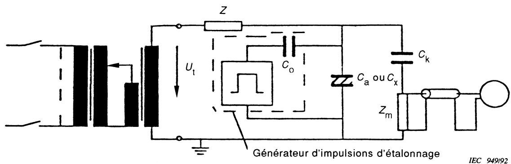

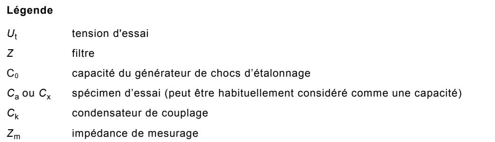  
Figure C.3 – Etalonnage pour un spécimen relié à la terre

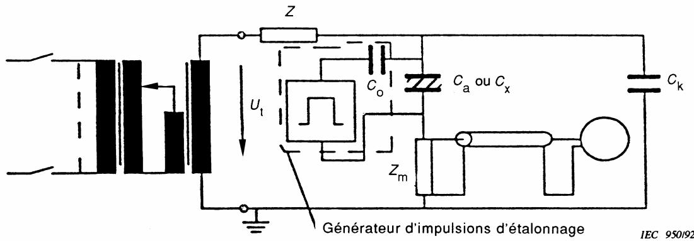  
Figure C.4 – Etalonnage d'un spécimen d’essai non relié à la terre

## C.4.2 Vérification du niveau de bruit

Avec l'arrangement utilisé en C.4.1, la tension d'essai de DP doit être augmentée jusqu'à la plus haute valeur de la tension d'essai. Le niveau de bruit maximal doit être inférieur à 50 % de la grandeur de décharge spécifiée. Sinon, des mesures conformes à l'Article D.3 sont nécessaires.

## C.4.3 Etalonnage pour l'essai de DP

Le spécimen d’essai étant en circuit, la procédure décrite en C.4.1 doit être répétée.

Des modifications dans le circuit d'essai ou dans le spécimen d’essai nécessitent un réétalonnage. S'il y a plusieurs spécimens d’essai similaires, un réétalonnage est susceptible d'être suffisant si:

– l'impédance du condensateur de couplage est inférieure à 1/10 de celle du spécimen, ou

l'impédance du spécimen d’essai ne diffère pas de plus de ±10 % de la valeur pendant l'étalonnage.

NOTE Lors de la spécification des intervalles de temps pour le réétalonnage, il convient que les comités d'études sachent que si la sensibilité est insuffisante au niveau de l'appareil mesureur de DP, il est possible que d'éventuelles décharges nuisibles ne puissent pas être détectées.

## C.4.4 Générateur d'impulsions d'étalonnage

Il se compose essentiellement d'une petite capacité $C _ { \circ }$ qui a été chargée à $U _ { 0 }$ .

Il convient d'avoir, pour les impulsions engendrées par le générateur d'impulsions, un temps de montée inférieur $\dot { \textbf { a } } 0 , 0 3 / \textbf { \em f } _ { 2 } . \textbf { \em C } _ { 0 }$ ne doit avoir aucune valeur supérieure à 0,1 $C _ { \mathsf { k } } .$ Il convient d'avoir un temps de queue d'impulsion supérieur à 100 μs.

Pour vérifier les performances de l'appareil de mesurage de DP, celui-ci doit être étalonné dans toutes les étendues de mesurage. L'impédance de mesurage et les câbles de raccordement doivent être inclus dans la procédure.

Les caractéristiques suivantes doivent être vérifiées:

– la précision et la stabilité du générateur d'impulsions d'étalonnage;

la lecture pour les impulsions de différentes amplitudes, à une fréquence de récurrence de 100 Hz;

le temps de résolution des impulsions en utilisant des impulsions d'amplitude constante et une fréquence de récurrence croissante;

– les fréquences de coupure supérieure et inférieure $\pmb { f } _ { 1 }$ et $f _ { 2 }$ .

Cette procédure doit être effectuée après chaque réparation de l'appareil de mesurage de DP mais, dans tous les cas, au moins une fois par an.

# Annexe D (informative)

# Informations complémentaires sur les méthodes d'essai de décharges partielles

## D.1 Mesurage de la tension de seuil de DP et de la tension d'extinction de DP

La tension d'essai est augmentée à partir d'une valeur inférieure à la tension de seuil de décharge partielle, jusqu'à ce que des décharges partielles se produisent (tension de seuil de décharge partielle Ui). Après une augmentation ultérieure de 10 %, la tension est abaissée jusqu'à ce que la décharge partielle soit inférieure à la grandeur de décharge spécifiée (tension d'extinction de décharge partielle $U _ { \mathsf { e } } )$ . De ce fait, il n'est pas permis de dépasser la tension d'essai diélectrique spécifiée pour le spécimen.

NOTE La tension d'extinction de décharge partielle peut être influencée par la durée de la contrainte de tension, avec des valeurs dépassant les tensions de seuil de décharge partielle. Pendant des mesurages successifs, les tensions $U _ { \mathrm { i } }$ et $U _ { \mathfrak { e } }$ peuvent être influencées.

Cette procédure est adéquate pour des mesures d'investigation.

## D.2 Description des circuits d'essai de décharge partielle

Chaque circuit se compose des dispositifs suivants:

le spécimen d'essai $C _ { \mathsf { a } }$ (dans certains cas spéciaux, il est possible que ce soit une impédance $\mathsfit { Z } _ { \mathsf { a } } )$ ;

– le condensateur de couplage $C _ { \mathsf { k } } ;$ ;

le circuit de mesurage, composé de l'impédance de mesurage $Z _ { \mathsf { m } }$ , le câble de raccordement et l'appareil de mesurage de décharge partielle;

– de manière facultative, un filtre Z pour réduire la charge en cours de dérivation par la source de la tension d'essai.

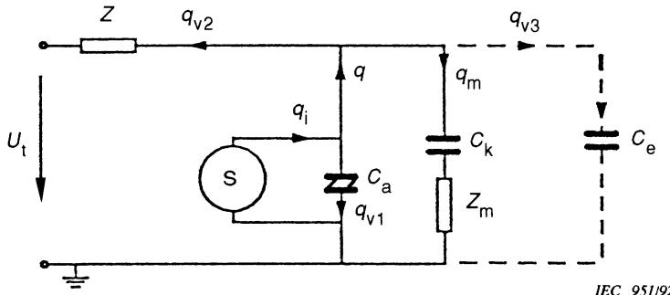

Légende

$U _ { \mathrm { t } }$ tension d'essai qi charge interne (non mesurable)

$Z$ filtre

$s$ source de courant de décharge partielle

$q$ charge apparente

$\mathsf { C } _ { \mathsf { a } }$ capacité du spécimen d’essai

$Z _ { \mathsf { m } }$ impédance de mesurage

$C _ { \mathsf { k } }$ condensateur de couplage

$q _ { \mathsf { m } }$ charge mesurable

${ \sf C } _ { \sf e }$ capacité répartie par rapport à la terre

$q _ { \mathrm { v } 1 }$ perte de charge à travers le spécimen d’essai

$q _ { \mathrm { v } 2 }$ perte de charge à travers la source de tension d'essai

$$
q _ {\mathrm{v3}}
$$

perte de charge à travers la capacité répartie par rapport à la terre

Le mesurage direct de la charge apparente q nécessiterait un court-circuit aux bornes du spécimen pour la fréquence de mesurage. Il est possible d'approcher de cette situation comme suit:

$$
- C _ {\mathrm{k}} > (C _ {\mathrm{a}} + C _ {\mathrm{e}});
$$

– impédance élevée $z ;$

– faible impédance de mesurage $Z _ { \mathsf { m } }$

Sinon, d'importantes pertes de charges $q _ { \mathsf { v } 2 }$ et $q _ { \mathsf { v } 3 }$ sont susceptibles de se produire. Ces pertes de charges sont prises en compte par l'étalonnage, mais elles limitent la sensibilité. La situation est aggravée si le spécimen d'essai a une capacité élevée.

## D.3 Précautions à prendre pour la réduction du bruit

## D.3.1 Généralités

Les résultats des mesurages de DP peuvent être fortement influencés par le bruit. Un tel bruit peut être introduit par un couplage conducteur ou par une interférence électromagnétique. Dans les domaines des essais industriels sans écran électrique, des impulsions de charges individuelles de l'ordre de 100 pC peuvent apparaître à cause du bruit. Même dans des conditions favorables, une valeur d’au moins 20 pC est prévisible.

Un niveau de bruit aussi faible que 1 pC peut être obtenu, mais cela nécessitera une protection du circuit d'essai par un écran ainsi que des mesures précises concernant la mise à la terre et le filtrage à l'arrivée de l'alimentation basse tension.

## D.3.2 Sources de bruit

On distingue principalement deux types de bruit différents.

## D.3.2.1 Sources dans le circuit d'essai en état de repos

Ces sources sont, par exemple, provoquées par la commutation de circuits adjacents. En cas de couplage conducteur, elles ne se produisent qu’avec une liaison au réseau d’alimentation basse tension. En cas de couplage électromagnétique, ces sources se produisent également si le réseau d'alimentation est coupé (y compris la mise à la terre de protection).

## D.3.2.2 Sources dans le circuit d'essai sous tension

Habituellement, le bruit augmente avec la tension d'essai et il est provoqué par des décharges partielles à l'extérieur du spécimen d'essai. Les décharges partielles sont susceptibles de se produire dans le transformateur d'essai, dans les cordons de raccordement haute tension, dans les traversées et aux points de mauvais contact. Les harmoniques de la tension d'essai sont également susceptibles de contribuer au niveau de bruit.

## D.3.3 Mesures à prendre pour la réduction du bruit

Il est possible de réduire le bruit provoqué par un couplage conducteur en utilisant des filtres en ligne dans l'alimentation centrale du circuit d'essai. Aucune boucle de mise à la terre ne devrait se produire.

Il est possible d'éliminer le brouillage électromagnétique provoqué, par exemple, par les signaux radioélectriques en faisant simplement varier la fréquence de mesurage f pour les appareils de mesurage de DP à bande étroite. Pour ce qui est des appareils de mesurage à large bande, les filtres coupe-bande peuvent s'avérer nécessaires, car seul un écran électrique est en mesure de supprimer les signaux à large bande. Un écran entièrement blindé, avec une haute conductivité électrique, constitue le moyen le plus efficace.

## D.4 Application des facteurs de multiplication aux tensions d'essai

## D.4.1 Généralités

Les valeurs des facteurs de multiplication définis en 6.1.3.5 et utilisés en 5.3.3.2.4 et en 6.1.3.5 sont calculées comme suit:

NOTE Ces exemples sont donnés pour la tension de crête répétitive $U _ { \Gamma \mathsf { p } }$ . Les facteurs s’appliquent de la même manière à la tension de régime établi la plus élevée et à la surtension temporaire à long terme.

## D.4.2 Exemple 1

Circuit connecté au réseau d'alimentation basse tension.

D.4.2.1 Tension de crête répétitive maximale $U _ { \Gamma \rho }$

$$
U _ {\mathrm{rp}} = \sqrt {2} U _ {\mathrm{n}} \times F _ {4} = 1, 1 \sqrt {2} U _ {\mathrm{n}}
$$

D.4.2.2 Tension d'extinction de décharge partielle $\pmb { U _ { \ominus } }$ (isolation principale)

$$
U _ {\mathrm{e}} = \sqrt {2} U _ {\mathrm{n}} \times F _ {4} \times F _ {1}
$$

$$
U _ {\mathrm{e}} = \sqrt {2} U _ {\mathrm{n}} \times 1, 1 \times 1, 2 = 1, 3 2 \sqrt {2} U _ {\mathrm{n}}
$$

D.4.2.3 Valeur initiale de la tension d'essai de DP $\pmb { u } _ { 1 }$ (isolation principale)

$$
U _ {1} = \sqrt {2} U _ {\mathrm{n}} \times F _ {4} \times F _ {1} \times F _ {2}
$$

$$
U _ {1} = \sqrt {2} U _ {\mathrm{n}} \times 1, 3 2 \times 1, 2 5 = 1, 6 5 \sqrt {2} U _ {\mathrm{n}}
$$

## D.4.3 Exemple 2

Circuit interne avec tension de crête répétitive maximale $U _ { \Gamma \mathsf { p } }$

D.4.3.1 Tension d'extinction de décharge partielle $\pmb { U _ { \ominus } }$ (isolation principale)

$$
U _ {\mathrm{e}} = U _ {\mathrm{rp}} \times F _ {1} = U _ {\mathrm{rp}} \times 1, 2
$$

D.4.3.2 Valeur initiale de la tension d'essai de DP (isolation principale)

$$
U _ {1} = U _ {\mathrm{rp}} \times F _ {1} \times F _ {2} = U _ {\mathrm{rp}} \times 1, 5
$$

Annexe E (informative)  
Comparaison entre les lignes de fuite spécifiées au Tableau F.4 et les distances d’isolement du Tableau A.1  
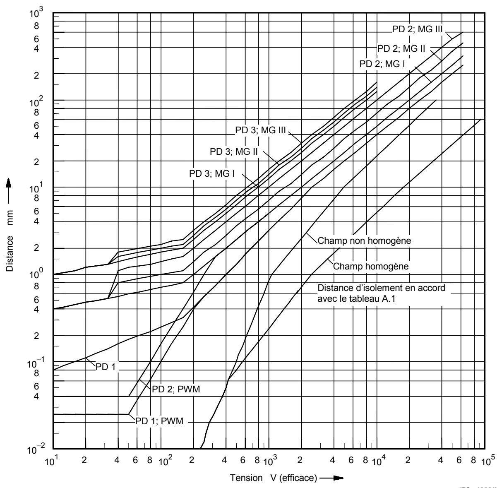

PD degré de pollution

MG groupe de matériau

PWM matériaux pour circuits imprimés

Figure E.1 – Comparaison entre les lignes de fuite spécifiées au Tableau F.4 et les distances d’isolement du Tableau A.1

## Annexe F (normative)

## Tableaux

Tableau F.1 – Tension assignée de choc pour les matériels alimentés directement par le réseau basse tension

<table><tr><td rowspan="2" colspan="2">Tension nominale du réseau d&#x27;alimentation 1) fondée sur la CEI 60038 3)</td><td rowspan="2">Tension phase-neutre déduite des tensions nominales c.a. ou c.c. jusqu&#x27;à et y compris</td><td colspan="4">Tension assignée de choc 2)</td></tr><tr><td colspan="4">Catégorie de surtension 4)</td></tr><tr><td>TriphaséV</td><td>MonophaséV</td><td>V</td><td>IV</td><td>IIIV</td><td>IIIIV</td><td>IVV</td></tr><tr><td rowspan="3"></td><td rowspan="2"></td><td>50</td><td>330</td><td>500</td><td>800</td><td>1 500</td></tr><tr><td>100</td><td>500</td><td>800</td><td>1 500</td><td>2 500</td></tr><tr><td>120-240</td><td> $150^{5)}$ </td><td>800</td><td>1 500</td><td>2 500</td><td>4 000</td></tr><tr><td>230/400 277/480</td><td></td><td>300</td><td>1 500</td><td>2 500</td><td>4 000</td><td>6 000</td></tr><tr><td>400/690</td><td></td><td>600</td><td>2 500</td><td>4 000</td><td>6 000</td><td>8 000</td></tr><tr><td>1 000</td><td></td><td>1 000</td><td>4 000</td><td>6 000</td><td>8 000</td><td>12 000</td></tr><tr><td colspan="7">1) Voir l&#x27;Annexe B pour l&#x27;application aux différents réseaux de distribution électrique basse tension existants et leurs tensions nominales.2) Les matériels avec ces tensions assignées de tenue aux chocs peuvent être utilisés dans les installations conformes à la CEI 60364-4-44.3) La marque / indique un réseau électrique triphasé à 4 fils. La valeur inférieure est la tension entre phase et neutre, alors que la valeur supérieure est la tension entre phases. Lorsqu&#x27;une seule valeur est indiquée, elle se rapporte à des réseaux triphasés à 3 fils, et spécifie la valeur entre phases.4) Voir 4.3.3.2.2 pour une explication relative aux catégories de surtension.5) Au Japon, les tensions nominales pour les réseaux monophasés sont 100 V ou 100-200 V. Cependant, la valeur de la tension assignée de tenue aux chocs est déterminée à partir des colonnes applicables à la tension entre phase et neutre de 150 V (voir l&#x27;Annexe B).</td></tr></table>

Tableau F.2 — Distances d’isolement pour supporter les surtensions transitoires

<table><tr><td rowspan="4">Tension de tenue aux chocs prescrite 1) 5)</td><td colspan="6">Distances minimales d&#x27;isolement dans l&#x27;air jusqu&#x27;à 2 000 m au-dessus du niveau de la mer</td></tr><tr><td colspan="3">Cas AChamp hétérogène(voir 3.15)</td><td colspan="3">Cas BChamp homogène(voir 3.14)</td></tr><tr><td colspan="3">Degré de pollution 6)</td><td colspan="3">Degré de pollution 6)</td></tr><tr><td>1mm</td><td>2mm</td><td>3mm</td><td>1mm</td><td>2mm</td><td>3mm</td></tr><tr><td>0,33 2)</td><td>0,01</td><td rowspan="6">0,2 3) 4)</td><td rowspan="8">0,8 4)</td><td>0,01</td><td rowspan="7">0,2 3) 4)</td><td rowspan="11">0,8 4)</td></tr><tr><td>0,40</td><td>0,02</td><td>0,02</td></tr><tr><td>0,50 2)</td><td>0,04</td><td>0,04</td></tr><tr><td>0,60</td><td>0,06</td><td>0,06</td></tr><tr><td>0,80 2)</td><td>0,10</td><td>0,10</td></tr><tr><td>1,0</td><td>0,15</td><td>0,15</td></tr><tr><td>1,2</td><td>0,25</td><td>0,25</td><td>0,2</td></tr><tr><td>1,5 2)</td><td>0,5</td><td>0,5</td><td>0,3</td><td>0,3</td></tr><tr><td>2,0</td><td>1,0</td><td>1,0</td><td>1,0</td><td>0,45</td><td>0,45</td></tr><tr><td>2,5 2)</td><td>1,5</td><td>1,5</td><td>1,5</td><td>0,60</td><td>0,60</td></tr><tr><td>3,0</td><td>2,0</td><td>2,0</td><td>2,0</td><td>0,80</td><td>0,80</td></tr><tr><td>4,0 2)</td><td>3,0</td><td>3,0</td><td>3,0</td><td>1,2</td><td>1,2</td><td>1,2</td></tr><tr><td>5,0</td><td>4,0</td><td>4,0</td><td>4,0</td><td>1,5</td><td>1,5</td><td>1,5</td></tr><tr><td>6,0 2)</td><td>5,5</td><td>5,5</td><td>5,5</td><td>2,0</td><td>2,0</td><td>2,0</td></tr><tr><td>8,0 2)</td><td>8,0</td><td>8,0</td><td>8,0</td><td>3,0</td><td>3,0</td><td>3,0</td></tr><tr><td>10</td><td>11</td><td>11</td><td>11</td><td>3,5</td><td>3,5</td><td>3,5</td></tr><tr><td>12 2)</td><td>14</td><td>14</td><td>14</td><td>4,5</td><td>4,5</td><td>4,5</td></tr><tr><td>15</td><td>18</td><td>18</td><td>18</td><td>5,5</td><td>5,5</td><td>5,5</td></tr><tr><td>20</td><td>25</td><td>25</td><td>25</td><td>8,0</td><td>8,0</td><td>8,0</td></tr><tr><td>25</td><td>33</td><td>33</td><td>33</td><td>10</td><td>10</td><td>10</td></tr><tr><td>30</td><td>40</td><td>40</td><td>40</td><td>12,5</td><td>12,5</td><td>12,5</td></tr><tr><td>40</td><td>60</td><td>60</td><td>60</td><td>17</td><td>17</td><td>17</td></tr><tr><td>50</td><td>75</td><td>75</td><td>75</td><td>22</td><td>22</td><td>22</td></tr><tr><td>60</td><td>90</td><td>90</td><td>90</td><td>27</td><td>27</td><td>27</td></tr><tr><td>80</td><td>130</td><td>130</td><td>130</td><td>35</td><td>35</td><td>35</td></tr><tr><td>100</td><td>170</td><td>170</td><td>170</td><td>45</td><td>45</td><td>45</td></tr><tr><td colspan="7">1) Cette tension est- pour l&#x27;isolation fonctionnelle, la tension de choc maximale susceptible d&#x27;apparaître au travers de la distance d&#x27;isolement (voir 5.1.5),- pour l&#x27;isolation principale directement exposée ou influencée significativement par les surtensions transitoires provenant du réseau à basse tension (voir 4.3.3.3, 4.3.3.4.1 et 5.1.6), la tension assignée de tenue aux chocs du matériel,- pour les autres isolations principales (voir 4.3.3.4.2), la tension de tenue aux chocs la plus élevée qui peut apparaître dans le circuit.Pour l&#x27;isolation renforcée voir 5.1.6.2) Valeurs préférentielles spécifiées en 4.2.3.3) Pour les matériaux de circuits imprimés, les valeurs pour le degré de pollution 1 s&#x27;appliquent avec pour exception que les valeurs ne doivent pas être inférieures à 0,04 mm, comme spécifié dans le Tableau F.4.4) Les distances d&#x27;isolement minimales données pour les degrés de pollution 2 et 3 sont fondées sur les caractéristiques de résistance réduites de la ligne de fuite associée dans des conditions d&#x27;humidité (voir CEI 60664-5).5) Pour les parties ou circuits à l&#x27;intérieur des matériels qui sont soumis à des tensions de choc selon 4.3.3.4.2, l&#x27;interpolation des valeurs est autorisée. Cependant, on obtient une harmonisation en utilisant la série préférentielle des valeurs de tension de tenue aux chocs de 4.2.3.6) Les dimensions pour le degré de pollution 4 sont celles spécifiées pour le degré de pollution 3, à l&#x27;exception de la distance d&#x27;isolement minimale qui est de 1,6 mm.</td></tr></table>

Tableau F.3a – Réseaux monophasés 3 ou 2 fils c.a. ou c.c.

<table><tr><td rowspan="3">Tension nominale du réseau d&#x27;alimentation *V</td><td colspan="2">Tensions rationalisées pour le tableau F.4</td></tr><tr><td>Pour l&#x27;isolement entre phases 1)</td><td>Pour l&#x27;isolement phase-terre 1)</td></tr><tr><td>Tous réseauxV</td><td>Réseaux à 3 fils point milieu à la terreV</td></tr><tr><td>12,5</td><td>12,5</td><td></td></tr><tr><td>2425</td><td>25</td><td></td></tr><tr><td>30</td><td>32</td><td></td></tr><tr><td>424850 **</td><td>50</td><td></td></tr><tr><td>60</td><td>63</td><td></td></tr><tr><td>30-60</td><td>63</td><td>32</td></tr><tr><td>100 **</td><td>100</td><td></td></tr><tr><td>110120</td><td>125</td><td></td></tr><tr><td>150 **</td><td>160</td><td></td></tr><tr><td>200</td><td>200</td><td></td></tr><tr><td>100-200</td><td>200</td><td>100</td></tr><tr><td>220</td><td>250</td><td></td></tr><tr><td>110-220120-240</td><td>250</td><td>125</td></tr><tr><td>300 **</td><td>320</td><td></td></tr><tr><td>220-440</td><td>500</td><td>250</td></tr><tr><td>600 **</td><td>630</td><td></td></tr><tr><td>480-960</td><td>1 000</td><td>500</td></tr><tr><td>1 000 **</td><td>1 000</td><td></td></tr><tr><td colspan="3">1) Le niveau d&#x27;isolement phase-terre pour des réseaux non reliés à la terre ou reliés à la terre à travers une impédance est égal au niveau d&#x27;isolement entre phases, car la tension de service par rapport à la terre de toute phase peut, en pratique, tendre vers la pleine tension entre phases. Cela est dû au fait que la tension réelle par rapport à la terre est déterminée par la résistance d&#x27;isolement et la réactance capacitive de chaque phase par rapport à la terre; c&#x27;est ainsi qu&#x27;une valeur faible (mais acceptable) de la résistance d&#x27;isolement d&#x27;une phase peut effectivement la mettre au potentiel de la terre et élever les tensions des deux autres phases à la pleine tension entre phases par rapport à la terre.* Pour la relation avec la tension assignée voir 4.3.2.** Ces valeurs correspondent aux valeurs données au Tableau F.1.</td></tr></table>

Tableau F.3b – Réseaux c.a. triphasés 4 ou 3 fils

<table><tr><td rowspan="3">Tension nominale du réseau d&#x27;alimentation *V</td><td colspan="3">Tensions rationalisées pour le Tableau F.4</td></tr><tr><td>Pour l&#x27;isolement entre phases</td><td colspan="2">Pour l&#x27;isolement phase-terre</td></tr><tr><td>Tous réseauxV</td><td>Réseaux triphasés 4 fils neutre à la terre2)V</td><td>Réseaux triphasés 3 fils non reliés à la terre1) ou une phase reliée à la terreV</td></tr><tr><td>60</td><td>63</td><td>32</td><td>63</td></tr><tr><td>110120127</td><td>125</td><td>80</td><td>125</td></tr><tr><td>150 **</td><td>160</td><td>-</td><td>160</td></tr><tr><td>200</td><td>200</td><td></td><td>200</td></tr><tr><td>208</td><td>200</td><td>125</td><td>200</td></tr><tr><td>220230240</td><td>250</td><td>160</td><td>250</td></tr><tr><td>300 **</td><td>320</td><td>-</td><td>320</td></tr><tr><td>380400415</td><td>400</td><td>250</td><td>400</td></tr><tr><td>440</td><td>500</td><td>250</td><td>500</td></tr><tr><td>480500</td><td>500</td><td>320</td><td>500</td></tr><tr><td>575</td><td>630</td><td>400</td><td>630</td></tr><tr><td>600 **</td><td>630</td><td>-</td><td>630</td></tr><tr><td>660690</td><td>630</td><td>400</td><td>630</td></tr><tr><td>720830</td><td>800</td><td>500</td><td>800</td></tr><tr><td>960</td><td>1 000</td><td>630</td><td>1 000</td></tr><tr><td>1 000 **</td><td>1 000</td><td>-</td><td>1 000</td></tr><tr><td colspan="4">1) Le niveau d&#x27;isolement phase-terre pour des réseaux non reliés à la terre ou reliés à la terre à travers une impédance est égal au niveau d&#x27;isolement entre phases, car la tension de service par rapport à la terre de toute phase peut, en pratique, tendre vers la pleine tension entre phases. Cela est dû au fait que la tension réelle par rapport à la terre est déterminée par la résistance d&#x27;isolement et la réactance capacitive de chaque phase par rapport à la terre; c&#x27;est ainsi qu&#x27;une valeur faible (mais acceptable) de la résistance d&#x27;isolement d&#x27;une phase peut effectivement la mettre au potentiel de la terre et élever les tensions des deux autres phases à la pleine tension entre phases par rapport à la terre.2) Pour les matériels destinés à être utilisés à la fois en alimentations triphasées 4 fils et triphasées 3 fils, reliées ou non à la terre, il y a lieu d&#x27;utiliser uniquement les valeurs pour les réseaux 3 fils.* Pour la relation avec la tension assignée voir 4.3.2.** Ces valeurs correspondent aux valeurs données au Tableau F.1.</td></tr></table>

Tableau F.4 – Lignes de fuite pour éviter les défaillances dues au cheminement

<table><tr><td rowspan="4">Tension efficace 1)</td><td colspan="9">Lignes de fuite minimales</td></tr><tr><td colspan="2">Matériau pour circuit imprimé</td><td colspan="7"></td></tr><tr><td>1</td><td>2</td><td>1</td><td colspan="3">2</td><td colspan="3">3</td></tr><tr><td>Tous les groupes de matériaux</td><td>Tous les groupes de matériaux, sauf IIIb</td><td>Tous les groupes de matériaux</td><td>Groupe de matériau I</td><td>Groupe de matériau II</td><td>Groupe de matériau III</td><td>Groupe de matériau I</td><td>Groupe de matériau II</td><td>Groupe de matériau III 2)</td></tr><tr><td>V</td><td>mm</td><td>mm</td><td>mm</td><td>mm</td><td>mm</td><td>mm</td><td>mm</td><td>mm</td><td>mm</td></tr><tr><td>10</td><td>0,025</td><td>0,040</td><td>0,080</td><td>0,400</td><td>0,400</td><td>0,400</td><td>1,000</td><td>1,000</td><td>1,000</td></tr><tr><td>12,5</td><td>0,025</td><td>0,040</td><td>0,090</td><td>0,420</td><td>0,420</td><td>0,420</td><td>1,050</td><td>1,050</td><td>1,050</td></tr><tr><td>16</td><td>0,025</td><td>0,040</td><td>0,100</td><td>0,450</td><td>0,450</td><td>0,450</td><td>1,100</td><td>1,100</td><td>1,100</td></tr><tr><td>20</td><td>0,025</td><td>0,040</td><td>0,110</td><td>0,480</td><td>0,480</td><td>0,480</td><td>1,200</td><td>1,200</td><td>1,200</td></tr><tr><td>25</td><td>0,025</td><td>0,040</td><td>0,125</td><td>0,500</td><td>0,500</td><td>0,500</td><td>1,250</td><td>1,250</td><td>1,250</td></tr><tr><td>32</td><td>0,025</td><td>0,040</td><td>0,14</td><td>0,53</td><td>0,53</td><td>0,53</td><td>1,30</td><td>1,30</td><td>1,30</td></tr><tr><td>40</td><td>0,025</td><td>0,040</td><td>0,16</td><td>0,56</td><td>0,80</td><td>1,10</td><td>1,40</td><td>1,60</td><td>1,80</td></tr><tr><td>50</td><td>0,025</td><td>0,040</td><td>0,18</td><td>0,60</td><td>0,85</td><td>1,20</td><td>1,50</td><td>1,70</td><td>1,90</td></tr><tr><td>63</td><td>0,040</td><td>0,063</td><td>0,20</td><td>0,63</td><td>0,90</td><td>1,25</td><td>1,60</td><td>1,80</td><td>2,00</td></tr><tr><td>80</td><td>0,063</td><td>0,100</td><td>0,22</td><td>0,67</td><td>0,95</td><td>1,30</td><td>1,70</td><td>1,90</td><td>2,10</td></tr><tr><td>100</td><td>0,100</td><td>0,160</td><td>0,25</td><td>0,71</td><td>1,00</td><td>1,40</td><td>1,80</td><td>2,00</td><td>2,20</td></tr><tr><td>125</td><td>0,160</td><td>0,250</td><td>0,28</td><td>0,75</td><td>1,05</td><td>1,50</td><td>1,90</td><td>2,10</td><td>2,40</td></tr><tr><td>160</td><td>0,250</td><td>0,400</td><td>0,32</td><td>0,80</td><td>1,10</td><td>1,60</td><td>2,00</td><td>2,20</td><td>2,50</td></tr><tr><td>200</td><td>0,400</td><td>0,630</td><td>0,42</td><td>1,00</td><td>1,40</td><td>2,00</td><td>2,50</td><td>2,80</td><td>3,20</td></tr><tr><td>250</td><td>0,560</td><td>1,000</td><td>0,56</td><td>1,25</td><td>1,80</td><td>2,50</td><td>3,20</td><td>3,60</td><td>4,00</td></tr><tr><td>320</td><td>0,75</td><td>1,60</td><td>0,75</td><td>1,60</td><td>2,20</td><td>3,20</td><td>4,00</td><td>4,50</td><td>5,00</td></tr><tr><td>400</td><td>1,0</td><td>2,0</td><td>1,0</td><td>2,0</td><td>2,8</td><td>4,0</td><td>5,0</td><td>5,6</td><td>6,3</td></tr><tr><td>500</td><td>1,3</td><td>2,5</td><td>1,3</td><td>2,5</td><td>3,6</td><td>5,0</td><td>6,3</td><td>7,1</td><td>8,0 (7,9) 4)</td></tr><tr><td>630</td><td>1,8</td><td>3,2</td><td>1,8</td><td>3,2</td><td>4,5</td><td>6,3</td><td>8,0 (7,9) 4)</td><td>9,0 (8,4) 4)</td><td>10,0 (9,0) 4)</td></tr><tr><td>800</td><td>2,4</td><td>4,0</td><td>2,4</td><td>4,0</td><td>5,6</td><td>8,0</td><td>10,0 (9,0) 4)</td><td>11,0 (9,6) 4)</td><td>12,5 (10,2) 4)</td></tr><tr><td>1 000</td><td>3,2</td><td>5,0</td><td>3,2</td><td>5,0</td><td>7,1</td><td>10,0</td><td>12,5 (10,2) 4)</td><td>14,0 (11,2) 4)</td><td>16,0 (12,8) 4)</td></tr><tr><td>1 250</td><td></td><td></td><td>4,2</td><td>6,3</td><td>9,0</td><td>12,5</td><td>16,0 (12,8) 4)</td><td>18,0 (14,4) 4)</td><td>20,0 (16,0) 4)</td></tr><tr><td>1 600</td><td></td><td></td><td>5,6</td><td>8,0</td><td>11,0</td><td>16,0</td><td>20,0 (16,0) 4)</td><td>22,0 (17,6) 4)</td><td>25,0 (20 0) 4)</td></tr><tr><td>2 000</td><td></td><td></td><td>7,5</td><td>10,0</td><td>14,0</td><td>20,0</td><td>25,0 (20,0) 4)</td><td>28,0 (22,4) 4)</td><td>32,0 (25,6) 4)</td></tr><tr><td>2 500</td><td></td><td></td><td>10,0</td><td>12,5</td><td>18,0</td><td>25,0</td><td>32,0 (25,6) 4)</td><td>36,0 (28,8) 4)</td><td>40,0 (32 0) 4)</td></tr><tr><td>3 200</td><td></td><td></td><td>12,5</td><td>16,0</td><td>22,0</td><td>32,0</td><td>40,0 (32,0) 4)</td><td>45,0 (36,0) 4)</td><td>50,0 (40,0) 4)</td></tr></table>

Tableau F.4 (suite)

<table><tr><td rowspan="4">Tension efficace1)</td><td colspan="9">Lignes de fuite minimales</td></tr><tr><td colspan="2">Matériau pour circuit imprimé</td><td colspan="7"></td></tr><tr><td>1</td><td>2</td><td>1</td><td colspan="3">2</td><td colspan="3">3</td></tr><tr><td>Tous les groupes de matériauxmm</td><td>Tous les groupes de matériaux,sauf IIIbmm</td><td>Tous les groupes de matériauxmm</td><td>Groupe de matériauImm</td><td>Groupe de matériauIImm</td><td>Groupe de matériauIIImm</td><td>Groupe de matériauImm</td><td>Groupe de matériauIImm</td><td>Groupe de matériauIIImm</td></tr><tr><td>4 000</td><td></td><td></td><td>16,0</td><td>20,0</td><td>28,0</td><td>40,0</td><td>50,0(40,0)4)</td><td>56,0(44,8)4)</td><td>63,0(50,4)4)</td></tr><tr><td>5 000</td><td></td><td></td><td>20,0</td><td>25,0</td><td>36,0</td><td>50,0</td><td>63,0(50,4)4)</td><td>71,0(56,8)4)</td><td>80,0(64,0)4)</td></tr><tr><td>6 300</td><td></td><td></td><td>25,0</td><td>32,0</td><td>45,0</td><td>63,0</td><td>80,0(64,0)4)</td><td>90,0(72,0)4)</td><td>100,0(80,0)4)</td></tr><tr><td>8 000</td><td></td><td></td><td>32,0</td><td>40,0</td><td>56,0</td><td>80,0</td><td>100,0(80,0)4)</td><td>110,0(88,0)4)</td><td>125,0(100,0)4)</td></tr><tr><td>10 000</td><td></td><td></td><td>40,0</td><td>50,0</td><td>71,0</td><td>100,0</td><td>125,0(100,0)4)</td><td>140,0(112,0)4)</td><td>160,0(128,0)4)</td></tr><tr><td>12 500</td><td></td><td></td><td>50,03)</td><td>63,03)</td><td>90,03)</td><td>125,03)</td><td></td><td></td><td></td></tr><tr><td>16 000</td><td></td><td></td><td>63,03)</td><td>80,03)</td><td>110,03)</td><td>160,03)</td><td></td><td></td><td></td></tr><tr><td>20 000</td><td></td><td></td><td>80,03)</td><td>100,03)</td><td>140,03)</td><td>200,03)</td><td></td><td></td><td></td></tr><tr><td>25 000</td><td></td><td></td><td>100,03)</td><td>125,03)</td><td>180,03)</td><td>250,03)</td><td></td><td></td><td></td></tr><tr><td>32 000</td><td></td><td></td><td>125,03)</td><td>160,03)</td><td>220,03)</td><td>320,03)</td><td></td><td></td><td></td></tr><tr><td>40 000</td><td></td><td></td><td>160,03)</td><td>200,03)</td><td>280,03)</td><td>400,03)</td><td></td><td></td><td></td></tr><tr><td>50 000</td><td></td><td></td><td>200,03)</td><td>250,03)</td><td>360,03)</td><td>500,03)</td><td></td><td></td><td></td></tr><tr><td>63 000</td><td></td><td></td><td>250,03)</td><td>320,03)</td><td>450,03)</td><td>600,03)</td><td></td><td></td><td></td></tr><tr><td colspan="10">1) Cette tension est– pour l&#x27;isolation fonctionnelle, la tension locale,– pour l&#x27;isolation principale et l&#x27;isolation supplémentaire du circuit alimenté directement par le réseau (voir 4.3.2.2.1), la tension rationalisée par l&#x27;intermédiaire des Tableaux F.3a et F.3b, sur la base de la tension assignée du matériel, ou la tension assignée d&#x27;isolement,– pour l&#x27;isolation principale et l&#x27;isolation supplémentaire de réseaux, de matériels ou de circuits internes non directement alimentés par le réseau (voir 4.3.2.2.2), la valeur efficace la plus élevée de la tension pouvant apparaître dans le réseau, le matériel ou le circuit interne lorsque ces derniers sont alimentés sous la tension assignée et dans la combinaison des conditions d&#x27;emploi les plus sévères prévues aux caractéristiques assignées du matériel.2) Le groupe de matériaux IIIb n&#x27;est pas recommandé pour les applications en degrés de pollution 3 au-dessus de 630 V.3) Données provisoires obtenues par extrapolation. Les comités d&#x27;études qui possèdent d&#x27;autres informations par expérience sont autorisés à utiliser leurs dimensions.4) Les valeurs données en parenthèses peuvent être appliquées pour réduire la ligne de fuite en cas d&#x27;utilisation d&#x27;une nervure (voir 5.2.5).</td></tr><tr><td colspan="10">NOTE La précision élevée donnée pour les lignes de fuite dans ce tableau ne signifie pas qu&#x27;il faille que l&#x27;incertitude de mesure soit du même ordre d&#x27;amplitude.</td></tr></table>

Tableau F.5 – Tensions d’essai pour vérifier les distances d’isolement dans l’air à différentes altitudes  
Les valeurs de tension du Tableau F.5 s’appliquent uniquement pour la vérification des distances d’isolement dans l’air.

<table><tr><td>Tension de choc assignée</td><td>Tension d&#x27;essai de choc au niveau de la mer</td><td>Tension d&#x27;essai de choc à 200 m d&#x27;altitude</td><td>Tension d&#x27;essai de choc à 500 m d&#x27;altitude</td></tr><tr><td> $\hat{U}$ kV</td><td> $\hat{U}$ kV</td><td> $\hat{U}$ kV</td><td> $\hat{U}$ kV</td></tr><tr><td>0,33</td><td>0,357</td><td>0,355</td><td>0,350</td></tr><tr><td>0,5</td><td>0,541</td><td>0,537</td><td>0,531</td></tr><tr><td>0,8</td><td>0,934</td><td>0,920</td><td>0,899</td></tr><tr><td>1,5</td><td>1,751</td><td>1,725</td><td>1,685</td></tr><tr><td>2,5</td><td>2,920</td><td>2,874</td><td>2,808</td></tr><tr><td>4,0</td><td>4,923</td><td>4,824</td><td>4,675</td></tr><tr><td>6,0</td><td>7,385</td><td>7,236</td><td>7,013</td></tr><tr><td>8,0</td><td>9,847</td><td>9,648</td><td>9,350</td></tr><tr><td>12,0</td><td>14,770</td><td>14,471</td><td>14,025</td></tr><tr><td colspan="4">NOTE 1 Les explications concernant les facteurs d&#x27;influence (pression de l&#x27;air, altitude, température, humidité) pour les contraintes diélectriques des distances d&#x27;isolement dans l&#x27;air sont données en 6.1.2.2.1.3.NOTE 2 Lors de l&#x27;essai des distances d&#x27;isolement dans l&#x27;air, l&#x27;isolation solide associée sera soumise à la tension d&#x27;essai. Comme la tension d&#x27;essai de choc du Tableau F.5 est augmentée par rapport à la tension assignée de tenue aux chocs, l&#x27;isolation solide sera conçue en conséquence. Cela conduit à un accroissement de la capacité de tenue aux chocs de l&#x27;isolation.</td></tr></table>

Tableau F.6 – Sévérités pour le conditionnement de l’isolation solide

<table><tr><td>Essai</td><td>Température°C</td><td>Humidité relative%</td><td>Duréeh</td><td>Nombre de cycles</td></tr><tr><td>a) Chaleur sèche</td><td>+55</td><td>-</td><td>48</td><td>1</td></tr><tr><td>b) Cycle de chaleur sèche</td><td>-10 à +55</td><td>-</td><td>Durée du cycle24</td><td>3</td></tr><tr><td>c) Choc thermique (variations rapides de température)</td><td>-10 à +55</td><td>-</td><td>2)</td><td></td></tr><tr><td>d) Chaleur humide</td><td>30/40 1)</td><td>93</td><td>96</td><td>1</td></tr><tr><td colspan="5">1) Température normalisée de l&#x27;essai de chaleur humide apparaissant dans la CEI 60068-2-78.2) La durée de la variation de température dépend de l&#x27;inertie thermique du spécimen soumis à l&#x27;essai,voir la CEI 60068-2-14.</td></tr></table>

NOTE Dans certaines normes de produits, on utilise encore ${ } ^ { 2 5 } { } ^ { \circ } \mathsf { C }$ pour l’essai de chaleur humide.

Tableau F.7 – Distances d'isolement pour résister aux tensions en régime permanent, aux surtensions temporaires ou aux tensions de crête répétitives  
Tableau F.7a – Dimensionnement des distances d’isolement pour résister aux tensions en régime permanent, aux surtensions temporaires ou aux tensions de crête répétitives  
Tableau F.7b – Informations complémentaires pour le dimensionnement des distances d’isolement pour éviter les décharges partielles

<table><tr><td rowspan="2">Tension1)(valeur de crête)2)kV</td><td colspan="2">Distances minimales d&#x27;isolement dans l&#x27;air jusqu&#x27;à 2 000 m au-dessus du niveau de la mer</td><td rowspan="15"></td><td rowspan="2">Tension1)(valeur de crête)2)kV</td><td>Distances minimales d&#x27;isolement dans l&#x27;air à partir de 2 000 m au-dessus du niveau de la mer</td></tr><tr><td>Cas A Conditions de champ hétérogène, (voir 3.15)mm</td><td>Cas B Conditions de champ homogène, (voir 3.14)mm</td><td>Cas A Conditions de champ hétérogène, (voir 3.15)mm</td></tr><tr><td>0,04</td><td>0,0013)</td><td>0,0013)</td><td>0,04</td><td rowspan="16">Comme spécifié au cas A Dans le Tableau F.7a</td></tr><tr><td>0,06</td><td>0,0023)</td><td>0,0023)</td><td>0,06</td></tr><tr><td>0,1</td><td>0,0033)</td><td>0,0033)</td><td>0,1</td></tr><tr><td>0,12</td><td>0,0043)</td><td>0,0043)</td><td>0,12</td></tr><tr><td>0,15</td><td>0,0053)</td><td>0,0053)</td><td>0,15</td></tr><tr><td>0,20</td><td>0,0063)</td><td>0,0063)</td><td>0,2</td></tr><tr><td>0,25</td><td>0,0083)</td><td>0,0083)</td><td>0,25</td></tr><tr><td>0,33</td><td>0,01</td><td>0,01</td><td>0,33</td></tr><tr><td>0,4</td><td>0,02</td><td>0,02</td><td>0,4</td></tr><tr><td>0,5</td><td>0,04</td><td>0,04</td><td>0,5</td></tr><tr><td>0,6</td><td>0,06</td><td>0,06</td><td>0,6</td></tr><tr><td>0,8</td><td>0,13</td><td>0,1</td><td>0,8</td></tr><tr><td>1,0</td><td>0,26</td><td>0,15</td><td>1,0</td></tr><tr><td>1,2</td><td>0,42</td><td>0,2</td><td></td><td>1,2</td></tr><tr><td>1,5</td><td>0,76</td><td>0,3</td><td rowspan="4"></td><td>1,5</td></tr><tr><td>2,0</td><td>1,27</td><td>0,45</td><td>2,0</td></tr><tr><td>2,5</td><td>1,8</td><td>0,6</td><td>2,5</td><td>2,0</td></tr><tr><td>3,0</td><td>2,4</td><td>0,8</td><td>3,0</td><td>3,2</td></tr><tr><td>4,0</td><td>3,8</td><td>1,2</td><td></td><td>4,0</td><td>11</td></tr><tr><td>5,0</td><td>5,7</td><td>1,5</td><td rowspan="4"></td><td>5,0</td><td>24</td></tr><tr><td>6,0</td><td>7,9</td><td>2</td><td>6,0</td><td>64</td></tr><tr><td>8,0</td><td>11,0</td><td>3</td><td>8,0</td><td>184</td></tr><tr><td>10</td><td>15,2</td><td>3,5</td><td>10</td><td>290</td></tr><tr><td>12</td><td>19</td><td>4,5</td><td></td><td>12</td><td>320</td></tr><tr><td>15</td><td>25</td><td>5,5</td><td rowspan="4"></td><td>15</td><td rowspan="9">3)</td></tr><tr><td>20</td><td>34</td><td>8</td><td>20</td></tr><tr><td>25</td><td>44</td><td>10</td><td>25</td></tr><tr><td>30</td><td>55</td><td>12,5</td><td>30</td></tr><tr><td>40</td><td>77</td><td>17</td><td></td><td>40</td></tr><tr><td>50</td><td>100</td><td>22</td><td rowspan="4"></td><td>50</td></tr><tr><td>60</td><td rowspan="3"></td><td>27</td><td>60</td></tr><tr><td>80</td><td>35</td><td>80</td></tr><tr><td>100</td><td>45</td><td>100</td></tr><tr><td colspan="3">1) Les distances d&#x27;isolement pour les autres tensions sont obtenues par interpolation.2) Voir la Figure 1 pour la tension de crête répétitive.3) Ces valeurs sont fondées sur des données expérimentales obtenues à la pression atmosphérique.</td><td></td><td colspan="2">1) Les distances d&#x27;isolement pour les autres tensions sont obtenues par interpolation.2) Voir la figure 1 pour la tension de crête répétitive.3) Dimensionnement sans décharge partielle impossible dans des conditions de champ hétérogène.</td></tr></table>

NOTE Si les distances d’isolement sont soumises à des contraintes avec des tensions en régime permanent de 2,5 kV (valeur de crête) et supérieures, le dimensionnement selon les valeurs de claquage du Tableau F.7a peut ne pas assurer un fonctionnement sans couronne (décharges partielles), en particulier pour les champs hétérogènes. Pour assurer un fonctionnement sans couronne, il est nécessaire soit d’utiliser des distances d’isolement plus importantes comme indiqué au Tableau F.7b, soit d’améliorer la distribution de champ.

Tableau F.8 – Facteurs de correction d'altitude

<table><tr><td>Altitude m</td><td>Facteur  $k_{d}$  pour la correction de distance</td></tr><tr><td>0</td><td>0,784</td></tr><tr><td>200</td><td>0,803</td></tr><tr><td>500</td><td>0,833</td></tr><tr><td>1 000</td><td>0,844</td></tr><tr><td>2 000</td><td>1</td></tr></table>

## Bibliographie

[1] ISO/IEC Guide 2:1996, Normalisation et activités connexes -- Vocabulaire général

[2] CEI 60529:1989, Degrés de protection procurés par les enveloppes (Code IP) Amendement 1 (1999)

[3] PFEIFFER, W. “Die Stoßspannungsfestigkeit von Luftstrecken kleiner Schlagweite“. Elektrotechnische Zeitschrift B; Vol.28(1976), pp300-302

[4] HERMSTEIN, W., Bemessung von Luftstrecken, Insbesondere für 50 Hz-Wechselspannung, Elektrotechnische Zeitschrift; Vol.90(1969), pp251-255

[5] DAKIN, T., LUXA, G., OPPERMANN, G., VIGREUX, J., WIND, G. WINKELNKEMPER, H. “Breakdown of gases in uniform fields, paschen curves for nitrogen, air and sulfur hexafluoride”; Electra (issued by CIGRE), Vol.32(1974), pp61-82.

ISBN 2-8318-9137-X