# 中华人民共和国国家标准

GB/T 34120—2023

代替GB/T34120—2017

# 电化学储能系统储能变流器技术要求

# Technical requirements for power conversion system of electrochemical energy storage system

## 目次

前言 …… I
1 范围 …… 1
2 规范性引用文件 …… 1
3 术语和定义 …… 1
4 分类和编码 …… 2
5 正常工作条件 …… 4
6 外观和防护等级 …… 5
7 基本功能 …… 5
8 性能指标 …… 6
9 电磁兼容 …… 21
10 辅助系统 …… 25
11 检验规则 …… 25
12 标志、包装、运输和贮存 …… 28
附录 A（资料性） 储能变流器典型拓扑 …… 30
附录 B（规范性） 设备标志符号 …… 32
附录 C（规范性） 电气间隙和爬电距离 …… 34
参考文献 …… 38

## 前言

本文件按照GB/T1.1—2020《标准化工作导则 第1部分：标准化文件的结构和起草规则》的规定起草。

本文件代替GB/T34120—2017《电化学储能系统储能变流器技术规范》，与GB/T34120—2017相比，除结构调整和编辑性改动外，主要技术变化如下：

——更改了文件的使用范围，将“输出交流电压”上限确定为 $35\mathrm{kV}$ （见第1章，2017年版的第1章）；

——增加了“交流端口”“直流端口”“故障穿越”“低电压穿越”“高电压穿越”“一次调频”“惯量响应”和“接触电流”等术语，删除了与DL/T2528重复的术语（见第3章，2017年版的第3章）；

——增加了“按与电网的连接关系”“按接入电压等级”“按安装使用环境”“按冷却方式”“按拓扑结构”等产品分类以及“产品编码”（见第4章）；

——更改了“并网运行电气条件”，增加了“离网运行条件”（见5.2和5.3，2017年版的5.1）；

——增加了“外观和防护等级”（见第6章）；

——增加了“启停机”“报警和保护”“绝缘电阻检测”“运行信息监测”“统计”和“数据显示和存储”等功能要求（见7.1、7.4、7.5、7.7、7.8和7.9）；

——增加了“功率输出范围”“一次调频”“惯量响应”“高电压穿越”“连续故障穿越”“运行适应性”和“设备可用性”等电气性能要求（见8.1.1.1、8.1.1.3、8.1.1.4、8.1.8.1.2、8.1.8.4、8.1.9和8.1.14）；  
——更改了“电气安全距离”和“绝缘要求”，增加了“等电位连接和保护接地”“电容残余能量危险防护”和“机械防护”等安全性能要求（见8.2.1.1、8.2.1.2、8.2.1.3、8.2.1.4、8.2.4，2017年版的5.7和5.8）；

——更改了“低温适应性”“高温适应性”和“湿热适应性”的要求，增加了“盐雾适应性”要求（见8.2.3.1～8.2.3.4，2017年版的5.4.20）；

——更改了“电磁兼容”要求，按不同接入电压等级提出了相应的要求（见第9章，2017年版的5.8）；  
——增加了“辅助系统”（见第10章）；

——更改了“检验规则”要求，根据产品分类和新增技术要求调整进行了试验项目（见第11章，2017年版的第6章）。

请注意本文件的某些内容可能涉及专利。本文件的发布机构不承担识别专利的责任。

本文件由中国电力企业联合会提出。

本文件由全国电力储能标准化技术委员会(SAC/TC 550)归口。

本文件起草单位:中国电力科学研究院有限公司、国家电网有限公司、阳光电源股份有限公司、华为数字能源技术有限公司、新疆金风科技股份有限公司、深圳市科陆电子科技股份有限公司、南京南瑞继保电气有限公司、广州智光储能科技有限公司、远景能源有限公司、中电普瑞电力工程有限公司、许昌开普检测研究院股份有限公司、上能电气股份有限公司。

本文件主要起草人:惠东、许守平、杜荣华、赵明权、陈志磊、杨波、王军立、李刚、阮海明、黄晓阁、石本星、李旭、胡娟、温进、燕翚、陈卓、张盈、辛凯、陈方林、陈西涛、杨幸辰、刘云峰、葛树征、杨猛、刘贺、詹雄、李宗原、高俊娥、付珊珊、闫雪生、毛海波、黎忠琼、李泽洋。

本文件及其所代替文件的历次版本发布情况为：

——2017年首次发布为 GB/T 34120—2017；

——本次为第一次修订。

# 电化学储能系统储能变流器技术要求

## 1 范围

本文件规定了电化学储能系统用储能变流器(以下简称“储能变流器”)启停机、功率控制、并离网切换、报警和保护、绝缘电阻检测、通信、运行信息监测、统计、数据显示和存储等功能要求，电气性能和安全性能等性能要求，以及分类和编码、正常工作条件、外观和防护等级、电磁兼容、辅助系统、检验规则、标志、包装、运输和贮存等要求。

本文件适用于以电化学电池作为储能载体，交流端口电压在 $35\mathrm{kV}$ 及以下储能变流器的设计、制造、试验、检测、运行、维护和检修。

## 2 规范性引用文件

下列文件中的内容通过文中的规范性引用而构成本文件必不可少的条款。其中，注日期的引用文件，仅该日期对应的版本适用于本文件；不注日期的引用文件，其最新版本（包括所有的修改单）适用于本文件。

GB/T191 包装储运图示标志

GB/T 4208 外壳防护等级(IP代码)

GB/T4798.2 环境条件分类 环境参数组分类及其严酷程度分级 第2部分：运输和装卸

GB/T12325 电能质量 供电电压偏差

GB/T12326 电能质量 电压波动和闪变

GB/T 13384 机电产品包装通用技术条件

GB/T14549 电能质量 公用电网谐波

GB/T15543 电能质量 三相电压不平衡

GB/T 15945 电能质量 电力系统频率偏差

GB/T17626.2 电磁兼容 试验和测量技术 静电放电抗扰度试验

GB/T17626.3 电磁兼容 试验和测量技术 射频电磁场辐射抗扰度试验

GB/T17626.4 电磁兼容 试验和测量技术 电快速瞬变脉冲群抗扰度试验

GB/T17626.5 电磁兼容 试验和测量技术 浪涌(冲击)抗扰度试验

GB/T17626.6 电磁兼容 试验和测量技术 射频场感应的传导骚扰抗扰度

GB/T17626.8 电磁兼容 试验和测量技术 工频磁场抗扰度试验

GB/T17799.2 电磁兼容通用标准第2部分：工业环境中的抗扰度标准

GB/T20626.1 特殊环境条件 高原电工电子产品 第1部分：通用技术要求

GB/T 24337 电能质量 公用电网间谐波

GB/T34133 储能变流器检测技术规程

DL/T860（所有部分）电力自动化通信网络和系统

DL/T2528 电力储能基本术语

## 3 术语和定义

DL/T2528界定的以及下列术语和定义适用于本文件。

## 3.1

交流端口 AC terminal

储能变流器中用于连接工频交流电网或交流负载的端口。

## 3.2

## 直流端口 DC terminal

储能变流器中用于连接电池簇、电池阵列或电堆直流母线的端口。

## 3.3

## 并网运行模式 grid-connected mode

储能变流器与电网通过交流端口正常连接，可与电网进行能量交换的运行模式。

## 3.4

## 离网运行模式 grid-disconnected mode

储能变流器与电网在交流端口或电网侧断开连接，独立建立电压和频率，并与负载或其他设备进行能量供给或交换的运行模式。

## 3.5

## 故障穿越 fault ride through

当电力系统事故或扰动引起储能变流器交流端口电压偏离正常运行范围时，在规定的电压变化范围和时间间隔内，储能变流器能不脱网连续运行的能力。

## 3.6

## 低电压穿越 low voltage ride through

当电力系统事故或扰动引起储能变流器交流端口电压跌落时，在规定的电压跌落范围和时间间隔内，储能变流器能不脱网连续运行的能力。

## 3.7

## 高电压穿越 high voltage ride through

当电力系统事故或扰动引起储能变流器交流端口电压升高时，在规定的电压升高范围和时间间隔内，储能变流器能不脱网连续运行的能力。

## 3.8

## 一次调频 primary frequency control

当电力系统频率偏离目标频率时，储能变流器响应于电力系统频率偏差自动调节有功功率的控制功能。

[来源:GB/T 40595—2021,3.1,有修改]

## 3.9

## 惯量响应 inertia response

当电力系统频率快速变化时，储能变流器响应于电力系统频率变化率调整有功功率的控制功能。

## 3.10

## 接触电流 touch current

当人或家畜触及电气装置或电气设备的一个或多个可触及部分时，通过其躯体的电流。

[来源:GB/T 17045—2020,3.9]

## 4 分类和编码

## 4.1 产品分类

## 4.1.1 按与电网的连接关系

储能变流器按与电网的连接关系可分为：

——并离网切换型储能变流器；

——并网型储能变流器；

——离网型储能变流器。

## 4.1.2 按接入电压等级

储能变流器按接入电压等级可分为：

—A1 类储能变流器,应用于通过 $10(6)$ kV 及以上电压等级接入电网的储能电站,且储能变流器交流端口电压不大于 1 000 V 的储能变流器;

—A2类储能变流器，应用于通过 $10(6)\mathrm{kV}$ 及以上电压等级接入电网的储能电站，且储能变流器交流端口电压大于 $1000\mathrm{V}$ 的储能变流器；

——B1 类储能变流器，应用于通过 $10(6)$ kV 接入配电网的储能变流器；

——B2 类储能变流器，应用于通过 380 V 接入配电网的储能变流器；

——B3类储能变流器，应用于通过 $220\mathrm{V}$ 接入配电网的储能变流器。

## 4.1.3 按安装使用环境

储能变流器按安装使用环境可分为：

——户内型储能变流器，安装于建筑或IP54及以上防护等级外壳内的储能变流器；

——户外型储能变流器，完全或部分结构暴露在户外的储能变流器。

## 4.1.4 按冷却方式

储能变流器按冷却方式可分为：

——自然冷却型储能变流器；

——风冷型储能变流器；

——液冷型储能变流器。

## 4.1.5 按拓扑结构

储能变流器按拓扑结构可分为：

——单级变换拓扑：由双向直流/交流变换器组成，典型拓扑见附录A的图A.1；

——双级变换拓扑:由双向直流/直流变换器和双向直流/交流变换器串并联组成,典型拓扑见图A.2;

——级联拓扑：由双向直流/交流功率变换单元在交流端口串联组成，典型拓扑见图A.3和图A.4。

## 4.2 产品编码

储能变流器的编码规则见图1。

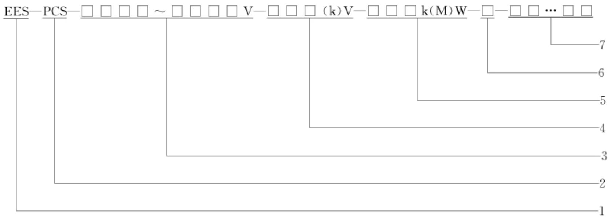

标引序号说明：

1——电力储能用；

2——储能变流器；

3——额定功率直流端口电压工作范围，用2位～4位数字表示，单位为伏(V)；

4——交流端口额定电压，用1位～3位数字表示，单位为伏(V)或千伏(kV)；

5——额定功率，用1位～3位数字表示，单位为千瓦(kW)或兆瓦(MW)；

6——拓扑结构，用1位字母表示，其中：S表示单级变换拓扑，D表示双级变换拓扑，H表示级联拓扑；

7——产品其他标志信息，用4位～8位数字和字母的组合表示。

## 图1 储能变流器编码规则

示例1：

储能变流器，直流电压范围为 $580\mathrm{V}\sim 1500\mathrm{V}$ ，交流额定电压 $400\mathrm{V}$ ，额定功率 $50~\mathrm{kW}$ ，拓扑结构为单级变换拓扑。标志为：EES-PCS- $580\sim 1500\mathrm{V - }400\mathrm{V - }50\mathrm{kW - S - }\times \times \times \times \times$ 。

示例2：

储能变流器，直流电压范围 $350\mathrm{V}\sim 700\mathrm{V}$ ，交流额定电压 $800\mathrm{V}$ ，额定功率 $200\mathrm{kW}$ ，拓扑结构为双级变换拓扑。标志为：EES-PCS- $350\sim 700\mathrm{V - }800\mathrm{V - }200\mathrm{kW - D - }\times \times \times \times \times$ 。

示例3：

储能变流器，直流工作电压范围 $500\mathrm{V}\sim 1200\mathrm{V}$ ，交流额定电压 $10\mathrm{kV}$ .额定功率5MW.拓扑结构为级联拓扑。标志为：EES-PCS-500～1200V-10kV-5MW-H-×××××。

## 5 正常工作条件

## 5.1 环境条件

储能变流器应在下列环境条件下正常工作：

a) 温度： $-20^{\circ}\mathrm{C} \sim +40^{\circ}\mathrm{C}$

b) 相对湿度： $\leqslant 95\%$

c) 对于应用于 $2000\mathrm{m}$ 以上高海拔条件的储能变流器，符合GB/T20626.1的相关规定；

d) 对于应用在海洋性气候的储能变流器，满足耐盐雾要求。

## 5.2 并网运行电气条件

并离网切换型和并网型储能变流器应在下列电网条件下正常工作：

a）谐波电压不大于 GB/T 14549 规定的限值；

b）间谐波电压不大于GB/T24337规定的限值；

c) 电网电压偏差不大于GB/T12325规定的限值；

d) 电压波动和闪变值不大于 GB/T 12326 规定的限值；

e）三相电压不平衡度不大于GB/T15543规定的限值；

f) 电网频率偏差不大于GB/T15945规定的限值。

## 5.3 离网运行条件

并离网切换型和离网型储能变流器应在下列条件下正常工作：

a）负载额定功率不大于储能变流器额定输出功率；

b）负载启动电流不大于1.2倍储能变流器额定电流。

## 6 外观和防护等级

## 6.1 外观

储能变流器的外观应满足下列要求：

a）外观完整，无结构变形、剥落、锈蚀及裂痕等现象；

b) 柜门和开关操作灵活；

c) 铭牌、标志、标记完整清晰；

d）文字和符号整齐、规范、正确。

## 6.2 防护等级

储能变流器外壳的防护等级应满足下列要求：

a）户内型储能变流器不低于GB/T4208规定的IP20；

b) 户外型储能变流器不低于GB/T4208规定的IP54。

## 7 基本功能

## 7.1 启停机

储能变流器应具备启停机控制功能，能根据控制开关或指令实现储能变流器的启动和停机。

## 7.2 功率控制

储能变流器应具备有功功率控制、无功功率控制功能，能根据控制模式或接收的功率控制指令，实现有功功率和无功功率的连续平滑调节以及充放电切换。A1类和A2类储能变流器宜具有一次调频和惯量响应控制功能。

## 7.3 并离网切换

并离网切换型储能变流器应具备并离网切换功能，能按照设定条件由并网运行模式转入离网运行模式，并建立稳定的频率和电压，能按照上级指令由离网运行模式转入并网运行模式，满足相应的功率要求。

## 7.4 报警和保护

7.4.1 储能变流器应具备故障诊断功能，应能在出现异常情况时进行报警，报警宜采用声、光等提示方式。报警内容应包含：极性反接、交流进线相序错误、直流电压异常、过电流、过温、通信故障和冷却系统故障等。

7.4.2 储能变流器发出报警信号后，应进入异常运行或故障保护状态。

7.4.3 储能变流器应具有故障信息记录功能，能记录故障和报警信息，并进行信息的存储。

## 7.5 绝缘电阻检测

7.5.1 储能变流器应具备直流端口绝缘电阻检测功能，可根据需要启用或停用该功能。

7.5.2 储能变流器检测的绝缘电阻值小于设定的保护值时，应报警并停止运行。

注：保护值默认可选取最大直流电压与 $30\mathrm{mA}$ 的比值。

## 7.6 通信

7.6.1 储能变流器应具有与电池管理系统、监控系统等设备进行信息交互的功能。

7.6.2 储能变流器与电池管理系统可采用控制器局域网(CAN)、RS-485、以太网、无线等通信接口，支持CAN2.0B、Modbus、DL/T860(所有部分)、消息队列遥测传输(MQTT)等通信协议。

7.6.3 储能变流器与监控系统可采用以太网通信接口，支持 ModbusTCP、DL/T 860（所有部分）等通信协议，宜采用双网冗余通信。

## 7.7 运行信息监测

7.7.1 储能变流器应能实时监测储能变流器直流端口的电压、电流、功率和电池状态信息以及交流端口的电压、电流、频率和功率信息。

7.7.2 储能变流器应能实时监测储能变流器与电池管理系统、监控系统等设备的通信状态。

## 7.8 统计

7.8.1 储能变流器应具备故障信息统计功能，实现故障信息的查询。

7.8.2 储能变流器宜具备充电能量和放电能量统计功能，实现充放电能量信息的查询。

## 7.9 数据显示和存储

7.9.1 储能变流器应具备数据显示功能，能够显示运行状态、运行参数、保护参数、事件记录等信息。

7.9.2 储能变流器应能存储运行状态、事件记录等信息，本地存储不小于 $180\mathrm{d}$ 的数据信息。

## 8 性能指标

## 8.1 电气性能

## 8.1.1 功率控制

## 8.1.1.1 功率输出范围

储能变流器在交流端口额定电压、额定频率时，有功功率和无功功率的输出范围应在图2所示实线框内四象限动态可调，宜在图2所示虚线框内四象限动态可调。

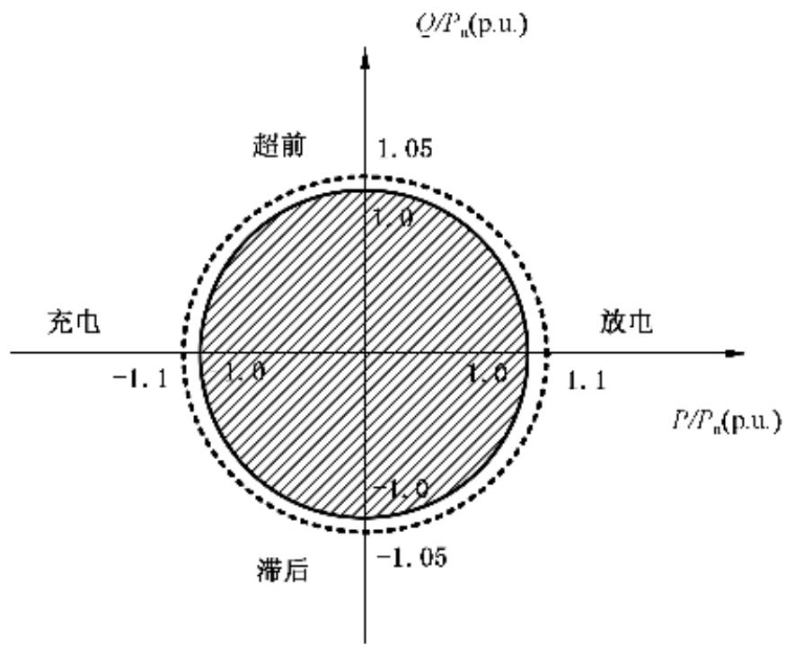  
注： $P_{\mathrm{n}}$ 为储能变流器额定有功功率。

图2 储能变流器功率输出范围

## 8.1.1.2 有功功率控制

储能变流器有功功率控制应满足下列要求：

a) A1类、A2类和B1类储能变流器工作在恒功率充放电模式下，储能变流器的交流端口有功功率控制偏差不大于额定功率的 $\pm 1\%$

b) A1类、A2类和B1类储能变流器有功功率控制响应时间不大于 $100\mathrm{ms}$ ；储能变流器有功功率控制调节时间不大于 $300~\mathrm{ms}$

c) B2 类和 B3 类储能变流器宜与 A1 类、A2 类和 B1 类储能变流器的要求相同。

## 8.1.1.3 一次调频

A1类、A2类和B1类储能变流器参与一次调频控制时，应满足下列要求。

a）储能变流器在充电和放电状态均具备一次调频能力。

b) 一次调频死区宜设定为 $\pm (0.03\sim 0.05)\mathrm{Hz}$

c) 一次调频有功功率控制满足公式(1)，限幅不小于 $20\%$ 额定有功功率：

$$
\Delta P = - \frac {1}{\delta} \times \frac {\Delta f}{f _ {\mathrm{n}}} \times P _ {\mathrm{n}}\tag{……(1}
$$

式中：

$\Delta P$ ——储能变流器有功功率变化量，单位为千瓦 $(\mathrm{kW})$ 或兆瓦(MW)；

$\delta$ ——一次调频调差率；

$\Delta f$ ——储能变流器交流端口或一次调频控制装置检测到的频率与系统额定频率的偏差，单位为赫兹 $(\mathrm{Hz})$ ；

$f_{n}$ ——系统额定频率,单位为赫兹(Hz);

$P_{\mathrm{n}}$ ——储能变流器额定有功功率，单位为千瓦 $(\mathrm{kW})$ 或兆瓦(MW)。

d) 一次调频调差率应为 $0.5\% \sim 3\%$ 。

e） 参与一次调频控制时，一次调频响应时间不大于 $100\mathrm{ms}$ ，一次调频调节时间不大于 $300~\mathrm{ms}$ 。

## 8.1.1.4 惯量响应

A1 类和 A2 类储能变流器参与惯量响应控制时，应满足下列要求。

a）储能变流器在充电和放电状态均具备惯量响应能力。

b) 惯量响应频率变化死区宜设定为 $\pm (0.03\sim 0.1)\mathrm{Hz}$ ，计算频率变化率的时间窗口宜为 $100~\mathrm{ms}\sim 200~\mathrm{ms}$ 。

c) 储能变流器在满足公式(2)的条件下提供惯量响应,有功功率控制满足公式(3):

$$
\Delta f \times \frac {\mathrm{d} f}{\mathrm{d} t} > 0\tag{……(2}
$$

$$
\Delta P = - \frac {T _ {j}}{f _ {\mathrm{n}}} \frac {\mathrm{d} f}{\mathrm{d} t} P _ {\mathrm{n}}\tag{……(3}
$$

式中：

$\Delta f$ ——储能变流器交流端口频率与系统额定频率的偏差，单位为赫兹 $(\mathrm{Hz})$

f ——储能变流器交流端口检测到的频率,单位为赫兹(Hz);

t ——时间,单位为秒(s);

$\Delta P$ ——储能变流器有功功率变化量,单位为千瓦(kW)或兆瓦(MW);

$T_{j}$ ——惯性时间常数，单位为秒(s)，宜设置为 $4\mathrm{s}\sim 14\mathrm{s}$

$f_{n}$ ——系统额定频率,单位为赫兹(Hz);

$P_{\mathrm{n}}$ ——储能变流器额定有功功率，单位为千瓦 $(\mathrm{kW})$ 或兆瓦(MW)。

d) 参与惯量响应控制时，其响应时间不大于 $100\mathrm{ms}$ ，调节时间不大于 $300\mathrm{ms}$ 。

## 8.1.1.5 无功功率控制

储能变流器无功功率控制应满足下列要求。

a）储能变流器具有多种无功控制模式，包括电压/无功控制、功率因数控制和恒无功功率控制等，具备多种控制模式在线切换的能力。

b) A1类、A2类和B1类储能变流器工作在恒功率充放电模式下时，储能变流器的交流端口无功功率不小于 $20\%$ 额定功率时，无功功率控制偏差不大于额定功率的 $\pm 1\%$ 。储能变流器交流端口无功功率小于 $20\%$ 额定功率时，无功功率控制偏差不大于额定功率的 $\pm 3\%$ 。

c) A1类、A2类和B1类储能变流器无功功率控制的响应时间不大于 $100\mathrm{ms}$ ；储能变流器无功功率控制调节时间不大于 $300~\mathrm{ms}$ 。

d) B2 类和 B3 类储能变流器宜与 A1 类、A2 类和 B1 类储能变流器的要求相同。

## 8.1.2 过载能力

在额定电压下，储能变流器交流端口电流在 $110\%$ 额定电流下，持续运行时间应不小于 $10\mathrm{min}$ ；储能变流器交流端口电流在 $120\%$ 额定电流下，持续运行时间应不小于 $1\mathrm{min}$ 。

## 8.1.3 充放电转换时间

储能变流器从 $90\%$ 额定功率充电到 $90\%$ 额定功率放电的转换时间以及从 $90\%$ 额定功率放电到 $90\%$ 额定功率充电的转换时间均应不大于 $100~\mathrm{ms}$ 。

## 8.1.4 并离网切换时间

8.1.4.1 并离网切换型储能变流器的并网转离网切换时间应满足下列要求：

a）储能变流器接收外部计划性孤岛指令时，从接收到切换指令到完成建立负载额定电压的主动并网转离网切换时间不大于 $200\mathrm{ms}$

b) 储能变流器自主识别计划性孤岛时，从电网中断到完成建立负载额定电压的被动并网转离网切换时间不大于 $2\mathrm{s}$ 。

8.1.4.2 储能变流器由离网转为并网模式时，应在交流端口电压和频率满足同期条件后，切换时间宜不

大于 $200\mathrm{ms}$ 。

## 8.1.5 电流纹波

储能变流器工作在恒功率充放电模式下时，直流端口的交流电流纹波有效值应不大于 $3\%$ 最大直流电流。

## 8.1.6 电压纹波

储能变流器工作在恒功率充放电模式下时，直流端口的交流电压纹波有效值应不大于 $2\%$ 最大直流电压。

## 8.1.7 电能质量

## 8.1.7.1 谐波电流

储能变流器在并网运行条件下，交流端口注入的总谐波电流应不大于交流端口额定电流的 $5\%$ ，各次谐波限值应满足表1的要求，注入的谐波电流不应包括交流电网谐波电压畸变引起的谐波电流。

表 1 电流谐波限值

<table><tr><td>奇次谐波次数</td><td>谐波限值</td><td>偶次谐波次数</td><td>谐波限值</td></tr><tr><td> $3^{rd} \sim 9^{th}$ </td><td>4% $I_N$ </td><td> $2^{nd} \sim 10^{th}$ </td><td>1% $I_N$ </td></tr><tr><td> $11^{th} \sim 15^{th}$ </td><td>2% $I_N$ </td><td> $12^{th} \sim 16^{th}$ </td><td>0.5% $I_N$ </td></tr><tr><td> $17^{th} \sim 21^{st}$ </td><td>1.5% $I_N$ </td><td> $18^{th} \sim 22^{th}$ </td><td>0.375% $I_N$ </td></tr><tr><td> $23^{th} \sim 33^{th}$ </td><td>0.6% $I_N$ </td><td> $24^{th} \sim 34^{th}$ </td><td>0.15% $I_N$ </td></tr><tr><td> $35^{th} \sim 49^{th}$ </td><td>0.3% $I_N$ </td><td> $36^{th}$ 以上</td><td>0.075% $I_N$ </td></tr></table>

## 8.1.7.2 谐波电压

8.1.7.2.1 储能变流器在并网运行条件下，交流端口的电压总谐波畸变率应满足GB/T14549的要求，间谐波电压应满足GB/T24337的要求。

8.1.7.2.2 储能变流器在离网运行条件下，在空载和额定平衡阻性负载条件下，交流端口的电压总谐波畸变率应不大于 $3\%$ 。

## 8.1.7.3 直流分量

储能变流器在并网运行条件下，在额定功率条件下，交流端口电流中的直流电流分量应不大于交流端口额定电流的 $0.5\%$ 。

## 8.1.7.4 电压偏差

8.1.7.4.1 储能变流器在并网运行条件下，交流端口的电压偏差应满足GB/T12325的要求。

8.1.7.4.2 储能变流器在离网运行条件下，在空载和额定平衡阻性负载条件下，交流端口的电压偏差应不大于额定电压的 $\pm 5\%$ ，相位偏差应小于 $\pm 3^{\circ}$ 。

## 8.1.7.5 电压不平衡度

8.1.7.5.1 储能变流器在并网运行时，交流端口的电压不平衡度应满足GB/T15543的要求。

8.1.7.5.2 储能变流器在离网运行时，在空载和额定平衡阻性负载条件下，交流端口的电压不平衡度应

小于 $2\%$ ，短时应不大于 $4\%$ 。

## 8.1.7.6 电压波动和闪变

储能变流器在并网运行条件下，交流端口的电压波动和闪变应满足GB/T12326的要求。

## 8.1.7.7 动态电压瞬变

储能变流器在离网运行和阻性负载条件下，当负载从 $20\%$ 上升至 $100\%$ 或从 $100\%$ 下降至 $20\%$ 时，储能变流器输出电压有效值在 $100~\mathrm{ms}$ 内与额定电压值的偏差绝对值应不大于 $30\%$ 额定电压， $100~\mathrm{ms}$ 后与额定电压值的偏差应不大于 $\pm 10\%$ 额定电压。

## 8.1.8 故障穿越

## 8.1.8.1 故障穿越能力

## 8.1.8.1.1 低电压穿越

储能变流器低电压穿越要求如下：

a) A1 类和 A2 类储能变流器交流端口电压在图 3 所示的电压轮廓线及以上的区域内时, 储能变流器应不脱网连续运行。储能变流器低电压穿越应满足下列要求:

1）交流端口电压跌落至0时，储能变流器不脱网连续运行 $150~\mathrm{ms}$

2）交流端口电压跌落至额定电压的 $20\%$ 时，储能变流器不脱网连续运行625ms；

3）交流端口电压跌落至额定电压的 $90\%$ 时，储能变流器不脱网连续运行 $2\mathrm{s}$

4）交流端口电压跌至电压轮廓线以下时，储能变流器与电网断开。

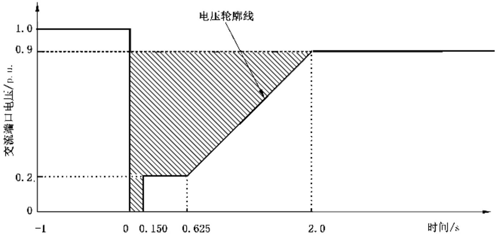  
注：储能变流器交流端口发生三相短路故障和两相短路故障时，低电压穿越考核电压为交流端口线电压；储能变流器交流端口发生单相接地短路故障时，低电压穿越考核电压为交流端口相电压。  
图3A1和A2类储能变流器低电压穿越能力要求

b) B1 类和 B2 类储能变流器交流端口电压在图 4 所示的电压轮廓线及以上的区域内时，储能变流器应不脱网连续运行。储能变流器低电压穿越应满足下列要求：

1）交流端口电压跌落至0时，储能变流器不脱网连续运行 $150~\mathrm{ms}$

2）交流端口电压跌落至额定电压的 $20\%$ 时，储能变流器不脱网连续运行 $625~\mathrm{ms}$

3）交流端口电压跌落至额定电压的 $85\%$ 时，储能变流器不脱网连续运行 $2\mathrm{s}$

4）交流端口电压跌至电压轮廓线以下时，储能变流器与电网断开。

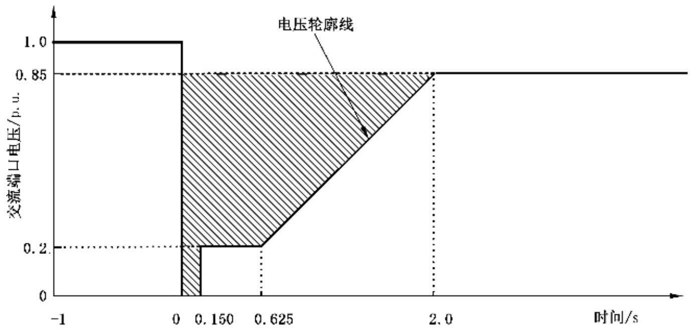  
注：储能变流器交流端口发生三相短路故障和两相短路故障时，低电压穿越考核电压为交流端口线电压；储能变流器交流端口发生单相接地短路故障时，低电压穿越考核电压为交流端口相电压。

图4B1类和B2类储能变流器低电压穿越能力要求

## 8.1.8.1.2 高电压穿越

A1类、A2类、B1类和B2类储能变流器交流端口电压在图5所示的电压轮廓线及以下的区域内时，储能变流器应不脱网连续运行。储能变流器高电压穿越应满足下列要求：

a）交流端口电压升高至1.3倍额定电压时，储能变流器不脱网连续运行0.5s；

b）交流端口电压升高至1.25倍额定电压时，储能变流器不脱网连续运行 $1\mathrm{s}$

c）交流端口电压升高至1.2倍额定电压时，储能变流器不脱网连续运行 $10\mathrm{s}$

d) 交流端口电压高出电压轮廓线时，储能变流器与电网断开。

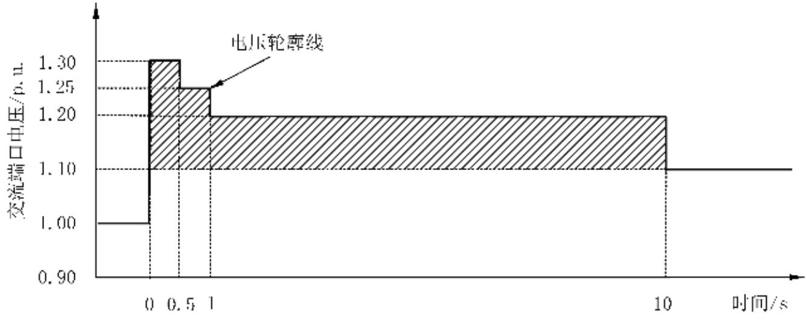  
图5 储能变流器高电压穿越能力要求

## 8.1.8.2 动态无功支撑

## 8.1.8.2.1 对称低电压故障时的动态无功支撑能力

A1类、A2类和B1类储能变流器对称低电压故障时的动态无功支撑能力应满足下列要求。

a) 当电力系统发生故障，交流端口三相电压跌落，A1类和A2类储能变流器电压正序分量低于额定电压的 $90\%$ 或B1类储能变流器电压正序分量低于额定电压的 $85\%$ 时，储能变流器具有动态无功支撑能力。

b) A1 类和 A2 类储能变流器动态无功电流增量满足公式(4)，B1 类储能变流器动态无功电流增量满足公式(5):

$$
\Delta I _ {\mathrm{t}} = K _ {1} \times (0. 9 - U _ {\mathrm{t}}) \times I _ {\mathrm{N}} (0 \leqslant U _ {\mathrm{t}} \leqslant 0. 9)\tag{……(4}
$$

$$
\Delta I _ {\mathrm{t}} = K _ {1} \times (0. 8 5 - U _ {\mathrm{t}}) \times I _ {\mathrm{N}} (0 \leqslant U _ {\mathrm{t}} \leqslant 0. 8 5)\tag{……(5}
$$

式中：

$\Delta I_{t}$ ——储能变流器输出动态无功电流增量；

$K_{1}$ ——储能变流器输出动态无功电流比例系数， $K_{1}$ 不小于1.5，宜不大于3；

$U_{\mathrm{t}}$ ——储能变流器交流端口实际电压与额定电压的比值；

$I_{\mathrm{N}}$ ——储能变流器交流端口额定输出电流值。

c) 电压跌落期间，储能变流器输出无功电流为电压跌落前正常运行时的输出无功电流 $I_{0}$ 与动态无功电流增量 $\Delta I_{\mathrm{t}}$ 之和，无功电流的最大输出能力不低于储能变流器额定电流的1.05倍，动态无功电流控制偏差不大于 $\pm 10\% I_{\mathrm{N}}$ 。

d) 自交流端口电压异常时刻起 $(U_{\mathrm{t}} < 0.9$ 或 $U_{\mathrm{t}} < 0.85)$ ，储能变流器动态无功电流的响应时间不大于 $30~\mathrm{ms}$ ，调节时间不大于 $60~\mathrm{ms}$ ；自交流端口电压恢复至额定电压的 $90\%$ 或 $85\%$ 以上的时刻起，储能变流器在 $30~\mathrm{ms}$ 内退出主动提供的动态无功电流增量。

## 8.1.8.2.2 不对称低电压故障时的动态无功支撑能力

A1类、A2类和B1类储能变流器不对称低电压故障时的动态无功支撑能力应满足下列要求。

a）当电力系统发生不对称短路故障时，储能变流器在低电压穿越过程中具有动态无功支撑能力。

b) 当 A1 类和 A2 类储能变流器交流端口电压正序分量在额定电压的 60%\~90% 之间或 B1 类储能变流器交流端口电压正序分量在额定电压的 60%\~85% 之间时，储能变流器能输出正序动态无功电流支撑正序电压恢复，从电网吸收负序动态无功电流抑制负序电压升高。A1 类和 A2 类储能变流器动态无功电流增量满足公式(6)，B1 类储能变流器动态无功电流增量满足公式(7)：

$$
\left\{ \begin{array}{c} {\Delta I _ {\mathrm{t}} ^ {+} = K _ {2} ^ {+} \times (0. 9 - U _ {\mathrm{t}} ^ {+}) \times I _ {\mathrm{N}}, (0. 6 \leqslant U _ {\mathrm{t}} ^ {+} \leqslant 0. 9)} \\ {\Delta I _ {\mathrm{t}} ^ {-} = K _ {2} ^ {-} \times U _ {\mathrm{t}} ^ {-} \times I _ {\mathrm{N}}} \end{array} \right.\tag{……(6}
$$

$$
\left\{ \begin{array}{c} \Delta I _ {\mathrm{t}} ^ {+} = K _ {2} ^ {+} \times (0. 8 5 - U _ {\mathrm{t}} ^ {+}) \times I _ {\mathrm{N}}, (0. 6 \leqslant U _ {\mathrm{t}} ^ {+} \leqslant 0. 8 5) \\ \Delta I _ {\mathrm{t}} ^ {-} = K _ {2} ^ {-} \times U _ {\mathrm{t}} ^ {-} \times I _ {\mathrm{N}} \end{array} \right.\tag{……(7}
$$

式中：

$\Delta I_{t}^{+}$ ——储能变流器注入的正序动态无功电流增量；

$K_{2}^{+}$ ——储能变流器动态正序无功电流比例系数， $K_{2}^{+}$ 取值不小于1.0；

$U_{\mathrm{t}}^{+}$ ——储能变流器交流端口电压正序分量标幺值；

$I_{N}$ ——储能变流器额定电流；

$\Delta I_{\mathrm{t}}^{-}$ ——储能变流器吸收的负序动态无功电流增量；

$K_{2}^{-}$ ——储能变流器动态负序无功电流比例系数， $K_{2}^{-}$ 取值不小于1.0；

$U_{\mathrm{t}}^{-}$ ——储能变流器交流端口电压负序分量标幺值。

c) 交流端口电压正序分量小于额定电压的 $60\%$ 时，储能变流器在不助增交流端口电压不平衡度的前提下，注入适量的正序动态无功电流、吸收适量的负序动态无功电流。

d) 电压跌落期间，储能变流器输出正序无功电流为电压跌落前输出无功电流 $I_{0}$ 与正序动态无功电流增量 $\Delta I_{\mathrm{t}}^{+}$ 之和，储能变流器无功电流的最大输出能力不小于额定电流的1.05倍，宜通过减少 $\Delta I_{\mathrm{t}}^{+}$ 和 $\Delta I_{\mathrm{t}}^{-}$ 来满足无功电流最大输出能力的限制。

## 8.1.8.2.3 对称高电压故障时的动态无功支撑能力

A1类、A2类和B1类储能变流器对称高电压故障时的动态无功支撑能力应满足下列要求。

a）当交流端口电压正序分量在额定电压的 $110\% \sim 130\%$ 之间时，储能变流器动态无功电流增量响应满足公式(8)：

$$
\Delta I _ {\mathrm{t}} = K _ {3} \times (U _ {\mathrm{t}} - 1. 1) \times I _ {\mathrm{N}} (1. 1 \leqslant U _ {\mathrm{t}} \leqslant 1. 3)\tag{……(8}
$$

式中：

$\Delta I_{t}$ ——储能变流器输出动态无功电流增量；

$K_{3}$ ——储能变流器动态无功电流比例系数， $K_{3}$ 取值不小于1.5；

$U_{\mathrm{t}}$ ——储能变流器交流端口电压标幺值；

$I_{N}$ ——储能变流器额定电流。

b) 交流端口电压升高期间，储能变流器输出无功电流为交流端口电压升高前输出无功电流 $I_{0}$ 与动态无功电流增量 $\Delta I_{\mathrm{t}}$ 之差，储能变流器无功电流的最大输出能力不小于额定电流的1.05倍，动态无功电流控制偏差不大于 $\pm 10\% I_{\mathrm{N}}$ 。

c) 自交流端口电压异常时刻起 $(U_{\mathrm{t}} > 1.1)$ ，储能变流器动态无功电流的响应时间不大于 $30~\mathrm{ms}$ ，调节时间不大于 $60~\mathrm{ms}$ ；自交流端口电压恢复至额定电压的 $110\%$ 以下的时刻起，储能变流器在 $30~\mathrm{ms}$ 内退出主动提供的动态无功电流增量。

d) 故障穿越期间在满足动态无功电流支撑能力的前提下，宜保持故障前的有功功率值，且储能变流器的最大输出电流能力不小于额定电流 $I_{\mathrm{N}}$ 的1.05倍。

## 8.1.8.3 有功功率恢复能力

A1类、A2类、B1类和B2类储能变流器故障穿越过程中有功功率的恢复能力应满足下列要求：

a）对于低电压穿越期间没有切出的储能变流器，其有功功率在故障清除后能快速恢复，自故障清除时刻开始，以不小于 $30\%$ 额定有功功率 $/s$ 的功率变化率恢复至故障前的值；

b) 对于高电压穿越期间没有保持故障前有功功率值的储能变流器，其有功功率在故障清除后能快速恢复，自故障清除时刻开始，以不小于 $30\%$ 额定功率 $/s$ 的功率变化率恢复至故障前的值。

## 8.1.8.4 连续故障穿越

## 8.1.8.4.1 连续低电压穿越

A1 和 A2 类储能变流器应具备连续两次低电压穿越的能力，相邻低电压穿越的时间间隔宜支持 0.2 s～2 s；每次低电压穿越的特性和支撑能力应满足 8.1.8.1～8.1.8.3 的要求。

## 8.1.8.4.2 连续低-高电压穿越

A1和A2类储能变流器应具备连续三次低-高电压穿越能力，对于连续低-高电压穿越期间没有保持故障前有功功率值的储能变流器，其有功功率在故障清除后应能快速恢复，自故障清除时刻开始，以不小于 $30\%$ 额定功率/s的功率变化率恢复至故障前的值。

## 8.1.9 运行适应性

## 8.1.9.1 电压适应性

A1类、A2类、B1类和B2类储能变流器电压适应性应满足表2要求。

表 2 A1 类、A2 类、B1 类和 B2 类储能变流器电压适应性要求

<table><tr><td>交流端口电压(U)</td><td>运行要求</td></tr><tr><td>A1和A2类储能变流器:U&lt;90%UNB1类和B2类储能变流器:U&lt;85%UN</td><td>满足低电压穿越要求</td></tr><tr><td>A1和A2类储能变流器:90%UN≤U≤110%UNB1类和B2类储能变流器:85%UN≤U≤110%UN</td><td>正常运行</td></tr><tr><td>110%UN满足高电压穿越要求</td><td>满足高电压穿越要求</td></tr><tr><td colspan="2">注:UN为储能变流器的交流端口额定电压。</td></tr></table>

B3类储能变流器电压适应性应满足表3要求。

表 3 B3 类储能变流器电压适应性要求

<table><tr><td>交流端口电压(U)</td><td>运行要求</td></tr><tr><td>U&lt;50%UN</td><td>储能变流器应在0.2s内转为停机状态</td></tr><tr><td>50%UN≤U&lt;85%UN</td><td>储能变流器不应处于充电状态,应运行不小于2s</td></tr><tr><td>85%UN≤U≤110%UN</td><td>正常运行</td></tr><tr><td>110%UN储能变流器不应处于放电状态,应运行不小于2s</td><td>储能变流器不应处于放电状态,应运行不小于2s</td></tr><tr><td>120%UN储能变流器应在0.2s内转为停机状态</td><td>储能变流器应在0.2s内转为停机状态</td></tr><tr><td colspan="2">注: UN为储能变流器的交流端口额定电压。</td></tr></table>

## 8.1.9.2 频率适应性

储能变流器频率适应性应能按表4要求运行。

表 4 频率适应性要求

<table><tr><td>频率范围</td><td>运行要求</td></tr><tr><td>f&lt;46.5 Hz</td><td>储能变流器不应处于充电状态,储能变流器应根据允许运行的最低频率或电网调度机构要求确定是否与电网脱离</td></tr><tr><td>46.5 Hz≤f&lt;48.5 Hz</td><td>处于充电状态的储能变流器应在0.2s内转为放电状态,对于不具备放电条件或其他特殊情况,应在0.2s内与电网脱离,处于放电状态的储能变流器应能连续运行</td></tr><tr><td>48.5 Hz≤f≤50.5 Hz</td><td>正常充电或放电运行</td></tr><tr><td>50.5 Hz&lt; f≤51.5 Hz</td><td>处于放电状态的储能变流器应在0.2s内转为充电状态,对于不具备充电条件或其他特殊情况,应在0.2s内与电网脱离,处于充电状态的储能变流器应能连续运行</td></tr><tr><td>f&gt;51.5 Hz</td><td>储能变流器不应处于放电状态,储能变流器应根据允许运行的最高频率确定是否与电网脱离</td></tr><tr><td colspan="2">注:f为储能变流器交流端口的电网频率。</td></tr></table>

## 8.1.9.3 频率变化率适应性

储能变流器在正常运行频率范围内，在 $500~\mathrm{ms}$ 的时间窗口内频率变化率不大于 $2\mathrm{Hz / s}$ 时应不脱网连续运行。

## 8.1.10 防孤岛保护

防孤岛保护应满足下列要求：

a）除A1类和A2类以外的储能变流器具备防孤岛保护功能；

b) B1类、B2类和B3类储能变流器防孤岛保护动作时间不大于 $2\mathrm{s}$ ，防孤岛保护与电网侧线路保护相配合。当启用并离网切换功能时，闭锁防孤岛保护功能。

## 8.1.11 效率

在额定功率条件下，A1类、A2类和B1类储能变流器的最大充电效率和最大放电效率均应不小于 $96\%$ ，B2类储能变流器的最大充电效率和最大放电效率均应不小于 $95\%$ ，B3类储能变流器的最大充电效率和最大放电效率均应不小于 $94\%$ 。

注：计算以上效率时，包含所有辅助电源及控制用电损耗，不含隔离变压器损耗。

## 8.1.12 损耗

储能变流器的待机损耗应不大于额定功率的 $0.5\%$ ，空载损耗应不大于额定功率的 $0.8\%$ 。

注1：计算损耗时，包含所有辅助电源及控制用电损耗，不含隔离变压器损耗。

注2：待机为储能变流器交直端口分断设备闭合，储能变流器处于停机状态。

注3：空载为储能变流器交直端口分断设备闭合，储能变流器处于最小功率运行状态。

## 8.1.13 噪声

储能变流器在额定功率运行时，在距离储能变流器水平位置 $1\mathrm{m}$ 处声压级噪声大于 $70~\mathrm{dB}$ 时，应在外壳上标注附录B中表B.1的“保护听力”标识符号。

## 8.1.14 设备可用性

8.1.14.1 储能变流器的运行寿命应不小于20年。

8.1.14.2 储能变流器平均无故障工作时间应不小于 20 000 h。

## 8.2 安全性能

## 8.2.1 电气安全

## 8.2.1.1 电气安全距离

## 8.2.1.1.1 冲击耐受电压和暂态过电压

储能变流器各电路的绝缘应能承受附录C中表C.1规定的冲击耐受电压和暂时过电压。

## 8.2.1.1.2 电气间隙

储能变流器各电路的绝缘的电气间隙应满足下列要求：

a）储能变流器满足在污染等级3级的条件下正常使用，采用IP54及以上防护等级外壳的储能变流器，外壳内部环境按照污染等级2要求。

b) 储能变流器各电路之间以及带电部件、接地部件之间的功能绝缘、基本绝缘或附加绝缘的最小电气间隙满足表C.2的要求或满足8.2.1.2.3规定的冲击耐受电压的要求。海拔 $2000\mathrm{m}$ 及以上使用的储能变流器，电气间隙根据表C.3的修正因子进行修正。

c) 加强绝缘的电气间隙根据基本绝缘更高一级的冲击耐受电压、1.6倍的暂时过电压、1.6倍的工作电压三者中最严酷的工况确定。

## 8.2.1.1.3 爬电距离

储能变流器各电路的绝缘的爬电距离应满足下列要求：

a）功能绝缘、基本绝缘和附加绝缘的爬电距离满足表C.4的要求，加强绝缘的爬电距离为基本绝缘爬电距离的两倍。

b) 当根据表C.4确定的爬电距离小于根据表C.2确定的电气间隙时，此时爬电距离按照电气间隙执行。

c) 印制电路板上功能绝缘的电气间隙和爬电距离不满足表 C.2 和表 C.4 的要求时, 满足下列要求:

——印制电路板的阻燃等级为 V-0 及以上；

——印制电路板的材料 CTI 值最少为 100；

——印制电路板功能绝缘短路时不会起火且不会对其他绝缘造成破坏。

## 8.2.1.2 绝缘要求

## 8.2.1.2.1 绝缘电阻

储能变流器各独立电路与外露的可导电部分之间，以及与各独立电路之间，应能承受绝缘电阻试验设备持续施加 $1\mathrm{min}$ 按照表5规定的直流电压，测得的绝缘电阻值应满足下列要求：

a）A1类、B1类、B2类和B3类储能变流器不小于 $1\mathrm{M}\Omega$

b) A2类储能变流器不小于 $1000\Omega /\mathrm{V}$

表 5 绝缘电阻试验电压等级  
单位为伏

<table><tr><td>额定绝缘电压等级( $U_i$ )</td><td>绝缘电阻试验电压</td></tr><tr><td> $U_i \leqslant 60$ </td><td>250</td></tr><tr><td> $60 < U_i \leqslant 250$ </td><td>500</td></tr><tr><td> $250 < U_i \leqslant 1\,000$ </td><td>1 000</td></tr><tr><td> $U_i > 1\,000$ </td><td>2 500</td></tr><tr><td colspan="2">注: $U_i$ 为被测电路工作电压的交流有效值或直流电压值。</td></tr></table>

## 8.2.1.2.2 工频耐受电压

储能变流器不同电路之间、电路与可接触外壳之间，应能承受工频耐受电压试验设备施加按照表6规定的工频耐受电压持续 $1\mathrm{min}$ ，电路绝缘不应发生击穿。

注：对于出厂检验，持续时间为 $1\mathrm{s}$

表 6 储能变流器工频耐受电压试验电压  
单位为伏

<table><tr><td rowspan="2">系统电压</td><td colspan="2">基本绝缘电路进行型式检验和所有出厂检验电压值</td><td colspan="2">双重绝缘或加强绝缘电路进行型式检验电压值</td></tr><tr><td>交流有效值</td><td>直流</td><td>交流有效值</td><td>直流</td></tr><tr><td>≤50</td><td>1 250</td><td>1 770</td><td>2 500</td><td>3 540</td></tr><tr><td>100</td><td>1 300</td><td>1 840</td><td>1 600</td><td>3 680</td></tr><tr><td>150</td><td>1 350</td><td>1 910</td><td>2 700</td><td>3 820</td></tr><tr><td>300</td><td>1 500</td><td>2 120</td><td>3 000</td><td>4 240</td></tr><tr><td>600</td><td>1 800</td><td>2 550</td><td>3 600</td><td>5 090</td></tr><tr><td>1 000</td><td>2 200</td><td>3 110</td><td>4 400</td><td>6 220</td></tr><tr><td>3 600</td><td>10 000</td><td>14 150</td><td>16 000</td><td>22 650</td></tr><tr><td>7 200</td><td>20 000</td><td>28 300</td><td>32 000</td><td>45 300</td></tr><tr><td>12 000</td><td>28 000</td><td>39 600</td><td>44 800</td><td>63 350</td></tr><tr><td>17 500</td><td>38 000</td><td>53 700</td><td>60 800</td><td>85 900</td></tr><tr><td>24 000</td><td>50 000</td><td>70 700</td><td>80 000</td><td>113 100</td></tr><tr><td>36 000</td><td>70 000</td><td>99 000</td><td>112 000</td><td>158 400</td></tr><tr><td colspan="5">注:系统电压为交流有效值,见表C.1。</td></tr></table>

## 8.2.1.2.3 冲击耐受电压

储能变流器各电路的绝缘的电气间隙小于表C.2确定的电气间隙时，应能承受冲击耐受电压试验设备施加按照表7规定的 $1.2 / 50\mu \mathrm{s}$ 冲击耐受电压值，电路绝缘不应发生击穿。

表 7 储能变流器冲击耐受电压试验电压  
单位为伏

<table><tr><td rowspan="2">系统电压</td><td colspan="2">直流端口过电压等级II</td><td colspan="2">交流端口过电压等级III</td></tr><tr><td>基本绝缘或附加绝缘</td><td>加强绝缘</td><td>基本绝缘或附加绝缘</td><td>加强绝缘</td></tr><tr><td>50/75</td><td>500</td><td>800</td><td>800</td><td>1 500</td></tr><tr><td>100/150</td><td>800</td><td>1 500</td><td>1 500</td><td>2 500</td></tr><tr><td>150/225</td><td>1 500</td><td>2 500</td><td>2 500</td><td>4 000</td></tr><tr><td>300/450</td><td>2 500</td><td>4 000</td><td>4 000</td><td>6 000</td></tr><tr><td>600/900</td><td>4 000</td><td>6 000</td><td>6 000</td><td>8 000</td></tr><tr><td>1 000/1 500</td><td>6 000</td><td>8 000</td><td>8 000</td><td>12 000</td></tr><tr><td>3 600/5 400</td><td>16 000</td><td>20 000</td><td>20 000</td><td>40 000</td></tr><tr><td>7 200/10 800</td><td>29 000</td><td>40 000</td><td>40 000</td><td>60 000</td></tr><tr><td>12 000/18 000</td><td>42 500</td><td>60 000</td><td>60 000</td><td>75 000</td></tr><tr><td>17 500/26 250</td><td>55 000</td><td>75 000</td><td>75 000</td><td>95 000</td></tr><tr><td>24 000/36 000</td><td>75 000</td><td>95 000</td><td>95 000</td><td>125 000</td></tr><tr><td>36 000/54 000</td><td>95 000</td><td>125 000</td><td>125 000</td><td>145 000</td></tr><tr><td colspan="5">注1:系统电压为交流有效值或直流电压值,见表C.1。注2:直流端口允许插值,交流端口不允许插值。</td></tr></table>

## 8.2.1.3 等电位连接和保护接地

## 8.2.1.3.1 接地部位

储能变流器所有可接触导电部件应通过内部等电位保护连接与外部保护接地极连接，外部保护接地极可位于储能变流器内部或外部，在安装时通过外部保护接地导体接入安装场所的接地网络。

## 8.2.1.3.2 内部等电位保护连接

储能变流器内部等电位保护连接应采用下列连接方式之一：

a）通过金属部件直接接触；

b）通过使用时不会被拆卸的其他导电部件连接；

c）通过专用等电位保护连接导体连接；

d) 可接触导电部件通过等电位保护连接到外部保护接地极的电阻应不大于 $0.1\Omega$ 。

## 8.2.1.3.3 外部保护接地导体

储能变流器外部保护接地导体应保持可靠连接，导体的横截面积应满足表8的要求。当外部保护接地导体不是电源电缆或电缆外层的一部分时，在有机械保护情况下横截面积应不小于 $2.5\mathrm{mm}^2$ ，在无机械保护情况下横截面积应不小于 $4\mathrm{mm}^2$ 。

表 8 外部保护接地电缆的横截面积  
单位为平方毫米

<table><tr><td>变流器相导体的横截面积(S)</td><td>外部保护接地导体的最小横截面积(Sp)</td></tr><tr><td>S≤16</td><td>S</td></tr><tr><td>16&lt;S≤35</td><td>16</td></tr><tr><td>S&gt;35</td><td>S/2</td></tr><tr><td colspan="2">注:本表数值仅针对外部保护接地导体与相导体使用相同金属材料有效。当材质不同时,外部保护接地导体横截面积需使其载流量和本表规定截面积等效。</td></tr></table>

## 8.2.1.3.4 接地标志

储能变流器外部保护接地导体应为专用连接，不应用于其他用途，外部保护接地导体应使用表B.1

的“保护接地”标志符号，保护接地线缆应使用黄绿色进行标识。

## 8.2.1.3.5 防雷

储能变流器应在交流端口配置浪涌保护器。

## 8.2.1.3.6 接触电流

储能变流器外壳的接触电流超过交流 $3.5\mathrm{mA}$ 或直流 $10\mathrm{mA}$ 时，应采用下列一个或多个保护措施并标注表B.1的“注意危险”标识符号：

——外部保护接地导体采用固定连接，且导体横截面积不小于 $10\mathrm{mm}^2$ 铜线或 $16\mathrm{mm}^2$ 铝线；

——当外部保护接地导体断开时，储能变流器能同时自动断开发生接地故障的电源；

——提供一个附加的横截面积相同的外部保护接地导体，并在安装说明书中说明。

## 8.2.1.4 电容残余能量危险防护

储能变流器电容残余能量危险防护应提供下列措施中的一项：

a）储能变流器断电后，在维修人员接触区域，内部电容器电压降低到直流 $60\mathrm{V}$ 以下或能量低于 $20\mathrm{J}$ 所需的放电时间不大于5s；

b) 储能变流器外壳或电容器保护挡板等明显位置标注表 B.1 的“电击危险及放电时间”标识符号。

## 8.2.2 温升

储能变流器及其部件在正常工作时的温度不应超过表9和表10的温度限值。

表 9 材料和零部件的温度限值  
单位为摄氏度

<table><tr><td colspan="2">材料和零部件</td><td>热电偶测试法温度限值</td><td>电阻变化测试法温度限值</td></tr><tr><td colspan="2">橡胶或热塑性绝缘导体</td><td>75</td><td>-</td></tr><tr><td colspan="2">现场接线端子和其他可能与绝缘导线接触的部分</td><td>端子温度限值或绝缘导线温度限值,取小值</td><td>-</td></tr><tr><td colspan="2">铜排</td><td>140,或接触的绝缘材料温度限值</td><td>-</td></tr><tr><td rowspan="8">磁性元件绝缘系统</td><td>Class A (105)</td><td>90</td><td>100</td></tr><tr><td>Class E (120)</td><td>105</td><td>115</td></tr><tr><td>Class B (130)</td><td>110</td><td>120</td></tr><tr><td>Class F (155)</td><td>130</td><td>140</td></tr><tr><td>Class H (180)</td><td>155</td><td>165</td></tr><tr><td>Class N (200)</td><td>165</td><td>175</td></tr><tr><td>Class R (220)</td><td>180</td><td>190</td></tr><tr><td>Class S (240)</td><td>195</td><td>205</td></tr><tr><td colspan="2">酚醛类合成材料</td><td>165</td><td>-</td></tr><tr><td colspan="2">电容</td><td>最高温度限值</td><td>-</td></tr><tr><td colspan="2">电力电子器件</td><td>最大壳温限值</td><td>-</td></tr><tr><td colspan="2">印制电路板</td><td>电路板最高运行温度</td><td>—</td></tr><tr><td colspan="2">内部的绝缘导线</td><td>导线最高温度</td><td>—</td></tr><tr><td colspan="2">冷却液</td><td>冷却液最高温度</td><td>—</td></tr><tr><td colspan="4">注:标注了使用温度范围的零部件不受此表限制,温度限值为标注的使用温度范围最高值。</td></tr></table>

表 10 接触表面总温度限值

单位为摄氏度

<table><tr><td rowspan="2">位置</td><td colspan="3">表面部分</td></tr><tr><td>金属</td><td>玻璃材料</td><td>塑料、橡胶</td></tr><tr><td>旋钮、手柄、开关、显示器等需要持续操作设备的位置(约10s)</td><td>55</td><td>65</td><td>70</td></tr><tr><td>旋钮、手柄、开关、显示器等短时操作设备的位置(约1s)</td><td>65</td><td>75</td><td>80</td></tr><tr><td>偶尔接触外壳的位置(约1s)</td><td>70</td><td>80</td><td>85</td></tr><tr><td colspan="4">注:设备易接触部分的表面标注有表B.1的“灼热表面”标识符号时,易接触部件发热作为设备预期功能的一部分(如散热器),允许表面最高温度为100°C。</td></tr></table>

## 8.2.3 环境适应性

## 8.2.3.1 低温适应性

在 $-40^{\circ}\mathrm{C}$ 环境温度条件下贮存 $16\mathrm{h}$ 后恢复至 $-20^{\circ}\mathrm{C}$ 保持 $2\mathrm{h}$ ，储能变流器应能正常启动运行，且持续额定运行时间应不小于 $2\mathrm{h}$ 。

## 8.2.3.2 高温适应性

在 $70^{\circ}\mathrm{C}$ 环境温度条件下贮存 $16\mathrm{h}$ 后恢复至 $40^{\circ}\mathrm{C}$ 保持 $2\mathrm{h}$ ，储能变流器应能正常启动运行，且持续额定运行时间应不小于 $2\mathrm{h}$ 。

## 8.2.3.3 湿热适应性

在恒定湿热和交变湿热环境条件下保持 $48\mathrm{h}$ 后恢复至正常运行环境条件保持 $2\mathrm{h}$ ，储能变流器的绝缘电阻应不小于 $0.5\mathrm{M}\Omega$ ，储能变流器应能正常启动运行。

## 8.2.3.4 盐雾适应性

应用在海洋性气候的储能变流器，在规定的盐雾试验环境条件下保持 $7\mathrm{d}$ ，外壳表面不应出现脱落、锈蚀。

## 8.2.4 机械防护

## 8.2.4.1 直接接触防护

储能变流器的直接接触防护应满足下列要求：

a）储能变流器内部带电部件和运动部件只有通过工具打开后才能被接触；

b）外壳和防护挡板的防护等级不低于GB/T4208规定的IP2X。

## 8.2.4.2 紫外线照射

户外型储能变流器外壳上的塑料材料和聚合物材料应能耐受紫外线照射，在正常使用情况下，不应出现裂纹或破裂等迹象，其防护性能不应降低。

## 8.2.4.3 外壳和支架强度

8.2.4.3.1 储能变流器的外壳和结构强度应在正常使用及运输条件下不应发生变形。

8.2.4.3.2 质量在 $18\mathrm{kg}$ 以下的储能变流器应提供搬运和安装的把手或支架，把手或支架应能承受储能变流器4倍重力。

8.2.4.3.3 壁挂安装的储能变流器安装支架应能承受储能变流器4倍的重力。

8.2.4.3.4 质量为 $18\mathrm{kg}$ 及以上的储能变流器，应配备搬运指导说明。

## 8.2.4.4 结构稳定性

落地安装的储能变流器应具备稳定结构，在下列条件中的一项发生时均不应发生倾倒：

a） 柜体倾斜 $10^{\circ}$

b）水平施加 $20\%$ 储能变流器重力，最大不大于 $250~\mathrm{N}$ 的推力。

## 8.2.4.5 抛射零部件

储能变流器在故障条件下不应抛射对人产生伤害的零部件。当储能变流器不可避免带有抛射零部件时，则应限制其抛射能量。储能变流器对抛射零部件的防护措施，应使用工具才能拆卸。

## 9 电磁兼容

9.1 A1类、B1类、B2类和B3类储能变流器电磁骚扰限值

## 9.1.1 交直流端口传导骚扰电压限值

A1类、B1类、B2类和B3类储能变流器交流端口传导骚扰电压限值分别见表11和表12，直流端口传导骚扰电压限值分别见表13和表14。

注：在产品说明书中标注“警告——此设备不用于居住环境中，在此环境下不能为无线电接收提供足够的保护。”的情况下，B2类储能变流器可采用A1类和B1类储能变流器传导骚扰电压限值。

表 11 A1 类和 B1 类储能变流器交流端口传导骚扰电压限值

<table><tr><td rowspan="2">频率范围MHz</td><td colspan="2">额定功率≤20 kVA</td><td colspan="2">20 kVA&lt;额定功率≤75 kVA</td><td colspan="2">额定功率&gt;75 kVAa</td></tr><tr><td>准峰值dB(μV)</td><td>平均值dB(μV)</td><td>准峰值dB(μV)</td><td>平均值dB(μV)</td><td>准峰值dB(μV)</td><td>平均值dB(μV)</td></tr><tr><td>0.15~0.5</td><td>79</td><td>66</td><td>100</td><td>90</td><td>130</td><td>120</td></tr><tr><td>0.5~5</td><td>73</td><td>60</td><td>86</td><td>76</td><td>125</td><td>115</td></tr><tr><td>5~30</td><td>73</td><td>60</td><td>90~73随频率的对数线性减小</td><td>80~60随频率的对数线性减小</td><td>115</td><td>105</td></tr><tr><td colspan="7">注1:当储能变流器连接到中性点不接地或经高阻抗接地的系统时,用额定功率大于75kVA的限值。注2:在频率过渡处采用较低的限值。</td></tr><tr><td colspan="7">a此列限值仅适用于安装在距居住环境大于30m或与居住环境有建筑阻隔的储能变流器。</td></tr></table>

表 12 B2 类和 B3 类储能变流器交流端口传导骚扰电压限值

<table><tr><td>频率范围MHz</td><td>准峰值dB(μV)</td><td>平均值dB(μV)</td></tr><tr><td>0.15~0.5</td><td>66~56随频率的对数呈线性减小</td><td>56~46随频率的对数呈线性减小</td></tr><tr><td>0.5~5</td><td>56</td><td>46</td></tr><tr><td>5~30</td><td>60</td><td>50</td></tr><tr><td colspan="3">注:在频率过渡处采用较低的限值。</td></tr></table>

表 13 A1 类和 B1 类储能变流器直流端口传导骚扰电压限值

<table><tr><td rowspan="2">频率范围MHz</td><td colspan="2">额定功率≤20 kVA</td><td colspan="2">20 kVA&lt;额定功率≤75 kVA</td><td colspan="2">额定功率&gt;75 kVA</td></tr><tr><td>准峰值dB(μV)</td><td>平均值dB(μV)</td><td>准峰值dB(μV)</td><td>平均值dB(μV)</td><td>准峰值dB(μV)</td><td>平均值dB(μV)</td></tr><tr><td>0.15~5</td><td>97~89</td><td>84~76</td><td>116~106</td><td>106~96</td><td>132~122</td><td>122~112</td></tr><tr><td>5~30</td><td>89</td><td>76</td><td>106~89</td><td>96~76</td><td>122~105</td><td>112~92</td></tr><tr><td colspan="7">注:在频率过渡处采用较低的限值。</td></tr></table>

表 14 B2 类和 B3 类储能变流器直流端口传导骚扰电压限值

<table><tr><td>频率范围MHz</td><td>准峰值dB(μV)</td><td>平均值dB(μV)</td></tr><tr><td>0.15~0.5</td><td>84~74随频率的对数呈线性减小</td><td>74~64随频率的对数呈线性减小</td></tr><tr><td>0.5~30</td><td>74</td><td>64</td></tr><tr><td colspan="3">注:在频率过渡处采用较低的限值。</td></tr></table>

## 9.1.2 有线网络端口和信号/控制端口的共模传导骚扰限值

A1类、B1类、B2类和B3类储能变流器有线网络端口和线缆长度超过 $30\mathrm{m}$ 控制端口的共模传导骚扰限值分别见表15和表16。

表 15 A1 类和 B1 类储能变流器的有线网络端口和信号/控制端口的共模传导骚扰限值

<table><tr><td>频率范围MHz</td><td>准峰值dB(μV)/dB(μA)</td><td>平均值dB(μV)/dB(μA)</td></tr><tr><td>0.15~0.5</td><td>97~87/53~43随频率的对数呈线性减小</td><td>84~74/40~30随频率的对数呈线性减小</td></tr><tr><td>0.5~30</td><td>87/43</td><td>74/30</td></tr></table>

表 16 B2 类和 B3 类储能变流器的有线网络端口和信号/控制端口的共模传导骚扰限值

<table><tr><td>频率范围MHz</td><td>准峰值dB(μV)/dB(μA)</td><td>平均值dB(μV)/dB(μA)</td></tr><tr><td>0.15~0.5</td><td>84~74/40~30随频率的对数呈线性减小</td><td>74~64/30~20随频率的对数呈线性减小</td></tr><tr><td>0.5~30</td><td>74/30</td><td>64/20</td></tr></table>

## 9.1.3 辐射骚扰限值

A1类、B1类、B2类和B3类储能变流器辐射骚扰限值分别见表17和表18。

注：在产品说明书中标注“警告——此设备不用于居住环境中，在此环境下不能为无线电接收提供足够的保护。”的情况下，B2类储能变流器可采用A1类和B1类储能变流器辐射骚扰限值。

表 17 A1 类和 B1 类储能变流器的辐射骚扰限值

<table><tr><td rowspan="3">频率范围MHz</td><td colspan="2">10m测量距离</td><td colspan="2">3m测量距离a</td></tr><tr><td>额定功率≤20kVA</td><td>额定功率&gt;20kVAb</td><td>额定功率≤20kVA</td><td>额定功率&gt;20kVA</td></tr><tr><td>准峰值dB(μV/m)</td><td>准峰值dB(μV/m)</td><td>准峰值dB(μV/m)</td><td>准峰值dB(μV/m)</td></tr><tr><td>30~230</td><td>40</td><td>50</td><td>50</td><td>60</td></tr><tr><td>230~1000</td><td>47</td><td>50</td><td>57</td><td>60</td></tr><tr><td colspan="5">注:在频率过渡处采用较低的限值。</td></tr><tr><td colspan="5">a3m测试距离只适用于圆柱体测试区域直径不大于1.2m且高不大于1.5m的小型设备。b该限值适用于第三方无线电通信设施距离大于30m的设备。当无法满足上述条件时,使用额定功率不大于20kVA的限值要求。</td></tr></table>

表 18 B2 类和 B3 类储能变流器的辐射骚扰限值

<table><tr><td rowspan="2">频率范围MHz</td><td>10m测量距离</td><td>3m测量距离a</td></tr><tr><td>准峰值dB(μV/m)</td><td>准峰值dB(μV/m)</td></tr><tr><td>30~230</td><td>30</td><td>40</td></tr><tr><td>230~1000</td><td>37</td><td>47</td></tr><tr><td colspan="3">注:在频率过渡处采用较低的限值。</td></tr><tr><td colspan="3">a 3m测试距离只适用于圆柱体测试区域直径不大于1.2m且高不大于1.5m的小型设备。</td></tr></table>

## 9.2 A1类、B1类、B2类和B3类储能变流器抗扰度试验等级

## 9.2.1 静电放电抗扰度试验等级

静电放电抗扰度试验等级应满足GB/T17626.2中所规定的严酷度等级，并满足下列要求：

a）试验等级最低要求：3级；

b）性能判据满足GB/T17799.2性能判据B的要求。

## 9.2.2 射频电磁场辐射抗扰度试验等级

射频电磁场辐射抗扰度试验等级应满足GB/T17626.3中所规定的严酷度等级，并满足下列要求：

a）试验等级最低要求：80 MHz～1 000 MHz 3 级，1.4 GHz～6 GHz 2 级；

b）性能判据满足GB/T17799.2性能判据A的要求。

## 9.2.3 电快速瞬变脉冲群抗扰度试验等级

电快速瞬变脉冲群抗扰度试验等级应满足GB/T17626.4中规定的严酷度等级，并满足下列要求：

a）试验等级最低要求：3级；

b）性能判据满足GB/T17799.2性能判据B的要求。

## 9.2.4 浪涌(冲击)抗扰度试验等级

浪涌(冲击)抗扰度试验等级应满足 GB/T 17626.5 中所规定的严酷度等级，并满足下列要求：

a）试验等级最低要求：3级；

b）性能判据满足GB/T17799.2性能判据B的要求。

## 9.2.5 射频场感应的传导骚扰抗扰度试验等级

射频场感应的传导骚扰抗扰度试验等级应满足GB/T17626.6中所规定的严酷度等级，并满足下列要求：

a）试验等级最低要求：3级；

b）性能判据满足GB/T17799.2性能判据A的要求。

## 9.2.6 工频磁场抗扰度试验等级

工频磁场抗扰度试验等级应满足GB/T17626.8中规定的严酷度等级，并满足下列要求：

a）试验等级最低要求：4级；

b）性能判据满足GB/T17799.2性能判据B的要求。

## 9.3 A2 类储能变流器控制保护系统电磁兼容

9.3.1 A2类储能变流器控制保护系统的电磁骚扰限值应满足下列要求：

a）传导骚扰电压限值符合表11中额定功率 $\leqslant 20\mathrm{kVA}$ 设备的要求；

b) 辐射骚扰限值符合表17中额定功率 $\leqslant 20\mathrm{kVA}$ 设备的要求。

9.3.2 A2类储能变流器控制保护系统的抗扰度试验应满足9.2的要求。

## 10 辅助系统

## 10.1 冷却系统

10.1.1 风冷型储能变流器的冷却系统应满足下列要求：

a）风扇的使用和储存温度与储能变流器的运行和储存温度相适应；

b) 风扇具有防止维修或操作人员接触旋转部件的外壳；

c) 当风扇出现故障停止运行时，储能变流器能检测故障并发出故障报警信号。

10.1.2 液冷型储能变流器的冷却系统应满足下列要求：

a）冷却液与储存和运行期间的预期环境温度相适应；

b) 冷却液在温升测试时不超出冷却液的最高温度；

c) 冷却系统的所有零部件不因长时间接触冷却剂和/或空气而腐蚀；

d) 冷却系统的管道、接头和密封件不在设备使用寿命或维护周期期间发生泄漏，整个冷却系统满足压力试验的要求；

e）冷却系统正常操作或维修时冷却液不会泄漏到带电部件上；

f) 冷却液不足时进行报警保护。

## 10.2 辅助供电电源

10.2.1 外部供电储能变流器控制系统的辅助供电电源应在额定工作电压的 $80\% \sim 115\%$ 范围内保持供电稳定性。

10.2.2 A1类、A2类、B1类和B2类储能变流器的辅助供电电源应在交流端口发生故障穿越期间保持供电稳定性。

## 11 检验规则

## 11.1 一般规定

储能变流器的检验类型分为型式检验和出厂检验。

## 11.2 型式检验

型式检验应由具备相关检测资质的第三方检测机构开展，并出具检测报告。当有下列情况之一时，应进行型式检验：

a）新产品或老产品转厂的试验定型鉴定时；

b) 当产品的设计、工艺或所用零部件的改变会影响产品性能时；

c) 出厂检验结果与型式检验有较大差异时；

d）国家质量监督机构提出进行型式检验要求时。

## 11.3 出厂检验

每套储能变流器产品均应进行出厂检验。

## 11.4 检验项目

储能变流器检验项目按表19进行，型式检验应按照GB/T34133中规定的方法进行。

表 19 储能变流器检验项目

<table><tr><td rowspan="2">序号</td><td colspan="2" rowspan="2">检测项目</td><td rowspan="2">技术要求</td><td colspan="3">型式检验</td><td colspan="3">出厂检验</td></tr><tr><td>并网型</td><td>离网型</td><td>并离网型</td><td>并网型</td><td>离网型</td><td>并离网型</td></tr><tr><td>1</td><td colspan="2">外观检查</td><td>6.1</td><td>√</td><td>√</td><td>√</td><td>√</td><td>√</td><td>√</td></tr><tr><td>2</td><td colspan="2">防护等级</td><td>6.2</td><td>√</td><td>√</td><td>√</td><td>—</td><td>—</td><td>—</td></tr><tr><td>3</td><td rowspan="7">基本功能</td><td>启停机</td><td>7.1</td><td>√</td><td>√</td><td>√</td><td>√</td><td>√</td><td>√</td></tr><tr><td>4</td><td>报警和保护</td><td>7.4</td><td>√</td><td>√</td><td>√</td><td>—</td><td>—</td><td>—</td></tr><tr><td>5</td><td>绝缘电阻检测功能</td><td>7.5</td><td>√</td><td>√</td><td>√</td><td>—</td><td>—</td><td>—</td></tr><tr><td>6</td><td>通信功能</td><td>7.6</td><td>√</td><td>√</td><td>√</td><td>√</td><td>√</td><td>√</td></tr><tr><td>7</td><td>运行信息监测</td><td>7.7</td><td>√</td><td>√</td><td>√</td><td>—</td><td>—</td><td>—</td></tr><tr><td>8</td><td>统计</td><td>7.8</td><td>√</td><td>√</td><td>√</td><td>—</td><td>—</td><td>—</td></tr><tr><td>9</td><td>数据显示和存储</td><td>7.9</td><td>√</td><td>√</td><td>√</td><td>—</td><td>—</td><td>—</td></tr><tr><td>10</td><td rowspan="18">电气性能</td><td>功率输出范围</td><td>8.1.1.1</td><td>√</td><td>—</td><td>√</td><td>—</td><td>—</td><td>—</td></tr><tr><td>11</td><td>有功功率控制</td><td>8.1.1.2</td><td>√</td><td>—</td><td>√</td><td>√</td><td>√</td><td>√</td></tr><tr><td>12</td><td>一次调频功能</td><td>8.1.1.3</td><td>√</td><td>—</td><td>√</td><td>—</td><td>—</td><td>—</td></tr><tr><td>13</td><td>惯量响应功能</td><td>8.1.1.4</td><td>√</td><td>—</td><td>√</td><td>—</td><td>—</td><td>—</td></tr><tr><td>14</td><td>无功功率控制</td><td>8.1.1.5</td><td>√</td><td>—</td><td>√</td><td>—</td><td>—</td><td>—</td></tr><tr><td>15</td><td>过载能力</td><td>8.1.2</td><td>√</td><td>√</td><td>√</td><td>—</td><td>—</td><td>—</td></tr><tr><td>16</td><td>充放电转换时间</td><td>8.1.3</td><td>√</td><td>—</td><td>√</td><td>—</td><td>—</td><td>—</td></tr><tr><td>17</td><td>并离网切换时间</td><td>8.1.4</td><td>—</td><td>—</td><td>√</td><td>—</td><td>—</td><td>—</td></tr><tr><td>18</td><td>电流纹波</td><td>8.1.5</td><td>√</td><td>√</td><td>√</td><td>—</td><td>—</td><td>—</td></tr><tr><td>19</td><td>电压纹波</td><td>8.1.6</td><td>√</td><td>√</td><td>√</td><td>—</td><td>—</td><td>—</td></tr><tr><td>20</td><td>谐波电流</td><td>8.1.7.1</td><td>√</td><td>—</td><td>√</td><td>—</td><td>—</td><td>—</td></tr><tr><td>21</td><td>谐波电压</td><td>8.1.7.2</td><td>—</td><td>√</td><td>√</td><td>—</td><td>—</td><td>—</td></tr><tr><td>22</td><td>直流分量</td><td>8.1.7.3</td><td>√</td><td>√</td><td>√</td><td>—</td><td>—</td><td>—</td></tr><tr><td>23</td><td>电压偏差</td><td>8.1.7.4</td><td>—</td><td>√</td><td>√</td><td>—</td><td>—</td><td>—</td></tr><tr><td>24</td><td>电压不平衡度</td><td>8.1.7.5</td><td>√</td><td>√</td><td>√</td><td>—</td><td>—</td><td>—</td></tr><tr><td>25</td><td>电压波动和闪变</td><td>8.1.7.6</td><td>√</td><td>√</td><td>√</td><td>—</td><td>—</td><td>—</td></tr><tr><td>26</td><td>动态电压瞬变</td><td>8.1.7.7</td><td>—</td><td>√</td><td>√</td><td>—</td><td>—</td><td>—</td></tr><tr><td>27</td><td>低电压穿越</td><td>8.1.8</td><td>√</td><td>—</td><td>√</td><td>—</td><td>—</td><td>—</td></tr><tr><td>28</td><td rowspan="9">电气性能</td><td>高电压穿越</td><td>8.1.8</td><td>✓</td><td>-</td><td>✓</td><td>-</td><td>-</td><td>-</td></tr><tr><td>29</td><td>连续故障穿越</td><td>8.1.8</td><td>✓</td><td>-</td><td>✓</td><td>-</td><td>-</td><td>-</td></tr><tr><td>30</td><td>电压适应性</td><td>8.1.9.1</td><td>✓</td><td>-</td><td>✓</td><td>-</td><td>-</td><td>-</td></tr><tr><td>31</td><td>频率适应性</td><td>8.1.9.2</td><td>✓</td><td>-</td><td>✓</td><td>-</td><td>-</td><td>-</td></tr><tr><td>32</td><td>频率变化率适应性</td><td>8.1.9.3</td><td>✓</td><td>-</td><td>✓</td><td>-</td><td>-</td><td>-</td></tr><tr><td>33</td><td>防孤岛保护</td><td>8.1.10</td><td>✓</td><td>-</td><td>✓</td><td>-</td><td>-</td><td>-</td></tr><tr><td>34</td><td>效率</td><td>8.1.11</td><td>✓</td><td>✓</td><td>✓</td><td>-</td><td>-</td><td>-</td></tr><tr><td>35</td><td>损耗</td><td>8.1.12</td><td>✓</td><td>✓</td><td>✓</td><td>-</td><td>-</td><td>-</td></tr><tr><td>36</td><td>噪声</td><td>8.1.13</td><td>✓</td><td>✓</td><td>✓</td><td>-</td><td>-</td><td>-</td></tr><tr><td>37</td><td rowspan="8">电气安全</td><td>电气间隙和爬电距离</td><td>8.2.1.1</td><td>✓</td><td>✓</td><td>✓</td><td>-</td><td>-</td><td>-</td></tr><tr><td>38</td><td>绝缘电阻</td><td>8.2.1.2.1</td><td>✓</td><td>✓</td><td>✓</td><td>✓</td><td>✓</td><td>✓</td></tr><tr><td>39</td><td>工频耐受电压</td><td>8.2.1.2.2</td><td>✓</td><td>✓</td><td>✓</td><td>✓</td><td>✓</td><td>✓</td></tr><tr><td>40</td><td>冲击耐受电压</td><td>8.2.1.2.3</td><td>✓</td><td>✓</td><td>✓</td><td>-</td><td>-</td><td>-</td></tr><tr><td>41</td><td>保护连接</td><td>8.2.1.3.2</td><td>✓</td><td>✓</td><td>✓</td><td>✓</td><td>✓</td><td>✓</td></tr><tr><td>42</td><td>接触电流</td><td>8.2.1.3.6</td><td>✓</td><td>✓</td><td>✓</td><td>-</td><td>-</td><td>-</td></tr><tr><td>43</td><td>电容残余能量</td><td>8.2.1.4</td><td>✓</td><td>✓</td><td>✓</td><td>-</td><td>-</td><td>-</td></tr><tr><td>44</td><td>温升</td><td>8.2.2</td><td>✓</td><td>✓</td><td>✓</td><td>-</td><td>-</td><td>-</td></tr><tr><td>45</td><td rowspan="4">环境适应性</td><td>低温适应性</td><td>8.2.3.1</td><td>✓</td><td>✓</td><td>✓</td><td>-</td><td>-</td><td>-</td></tr><tr><td>46</td><td>高温适应性</td><td>8.2.3.2</td><td>✓</td><td>✓</td><td>✓</td><td>-</td><td>-</td><td>-</td></tr><tr><td>47</td><td>湿热适应性</td><td>8.2.3.3</td><td>✓</td><td>✓</td><td>✓</td><td>-</td><td>-</td><td>-</td></tr><tr><td>48</td><td>盐雾适应性</td><td>8.2.3.4</td><td>✓</td><td>✓</td><td>✓</td><td>-</td><td>-</td><td>-</td></tr><tr><td>49</td><td rowspan="4">机械防护</td><td>直接接触防护</td><td>8.2.4.1</td><td>✓</td><td>✓</td><td>✓</td><td>-</td><td>-</td><td>-</td></tr><tr><td>50</td><td>紫外线照射</td><td>8.2.4.2</td><td>✓</td><td>✓</td><td>✓</td><td>-</td><td>-</td><td>-</td></tr><tr><td>51</td><td>外壳和支架强度</td><td>8.2.4.3</td><td>✓</td><td>✓</td><td>✓</td><td>-</td><td>-</td><td>-</td></tr><tr><td>52</td><td>结构稳定性</td><td>8.2.4.4</td><td>✓</td><td>✓</td><td>✓</td><td>-</td><td>-</td><td>-</td></tr><tr><td>53</td><td rowspan="3">电磁兼容</td><td>电磁骚扰限值</td><td>9.1</td><td>✓</td><td>✓</td><td>✓</td><td>-</td><td>-</td><td>-</td></tr><tr><td>54</td><td>抗扰度试验等级</td><td>9.2</td><td>✓</td><td>✓</td><td>✓</td><td>-</td><td>-</td><td>-</td></tr><tr><td>55</td><td>保护系统电磁兼容</td><td>9.3</td><td>✓</td><td>✓</td><td>✓</td><td>-</td><td>-</td><td>-</td></tr><tr><td>56</td><td>辅助系统</td><td>辅助供电电源</td><td>10.2</td><td>✓</td><td>✓</td><td>✓</td><td>-</td><td>-</td><td>-</td></tr><tr><td colspan="10">注:检验项目根据储能变流器产品分类和对应功能确定。</td></tr></table>

## 12 标志、包装、运输和贮存

## 12.1 标志

## 12.1.1 产品标志

储能变流器应有明显的标志，铭牌应在整个使用期内不易磨灭，铭牌宜放在显著位置，应包含下列内容。

a）产品名称、编码、型号、商标。

b）产品主要技术参数：

1）额定功率 $(\mathrm{kW})$

2）直流端口电压工作范围(V)；

3）交流端口额定电压(V)；

4）交流端口额定频率(Hz)；

5）工作温度范围；

6）防护等级；

7）保护等级；

8）制造依据（标准号）；

9）重量 $(\mathrm{kg}$ 或t）。

c) 出厂编号。

d）制造厂名、厂址。

## 12.1.2 包装标志

12.1.2.1 储能变流器的包装上应有包装储运标志和警示标志，标志应满足GB/T191的规定。

12.1.2.2 对于 $50\mathrm{kg}$ 以上的储能变流器，宜在包装上标注重心的标志。

## 12.2 包装

## 12.2.1 技术文件

随同产品供应的技术文件应包括：

a） 装箱清单；

b）产品使用说明书；

c) 安装说明书；

d）产品质量合格证；

e）电气接线图；

f) 电气原理图；

g）出厂检验记录；

h）交货明细表；

i) 保修卡。

## 12.2.2 产品包装

产品包装应符合GB/T13384的规定。

## 12.2.3 产品附件

随同产品供应的产品附件可包括：

a）机柜钥匙及特殊工器具；

b) 备品备件；

c) 安装支架或吊装附件。

## 12.3 运输

储能变流器在运输过程中不应有剧烈的震动、冲击和倒置，运输的环境条件应符合GB/T4798.2的规定。储能变流器在运输过程中应满足下列要求：

a）包装使用的纸箱的搬运部位、封口和支撑部位没有破损；

b）包装使用的木箱无外观断裂或部位缺失；

c）包装使用的缓冲材料无不可恢复严重变形或完全断裂脱落或部位损失；

d) 储能变流器无肉眼可见的凹坑、掉漆、划痕、擦伤、丝印脱落等问题；

e）储能变流器使用的机械固定和连接处零部件无松动、断裂或脱落等问题。

## 12.4 贮存

储能变流器贮存应满足下列条件：

a）包装好的产品贮存在环境温度为 $-40^{\circ}\mathrm{C} \sim +70^{\circ}\mathrm{C}$ ，相对湿度不大于 $95\%$ ，周围空气中不含有腐蚀性、火灾及爆炸性物质的室内；

b) 对于附带有冷却液的设备，结合冷却液冰点和贮存环境温度确定是否需要排出冷却液或添加防冻剂；

c）产品运到安装场所后，按产品手册规定贮存，长期存放时按产品技术条件进行维护。

附录A

(资料性)

储能变流器典型拓扑

储能变流器各架构典型拓扑结构如图 A.1～图 A.4 所示。

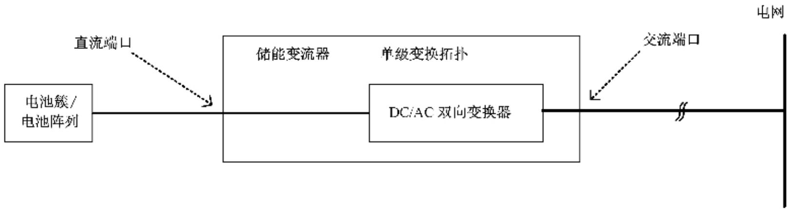  
图 A.1 单级变换架构典型拓扑

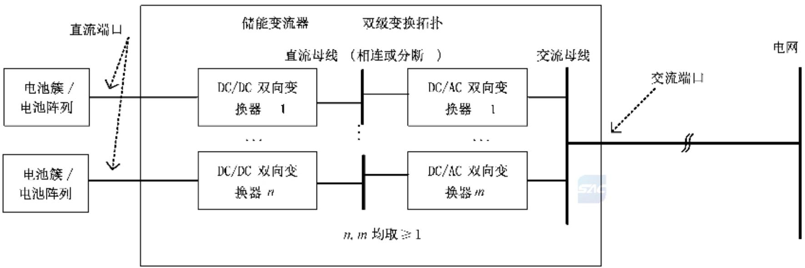  
图A.2 双级变换架构典型拓扑

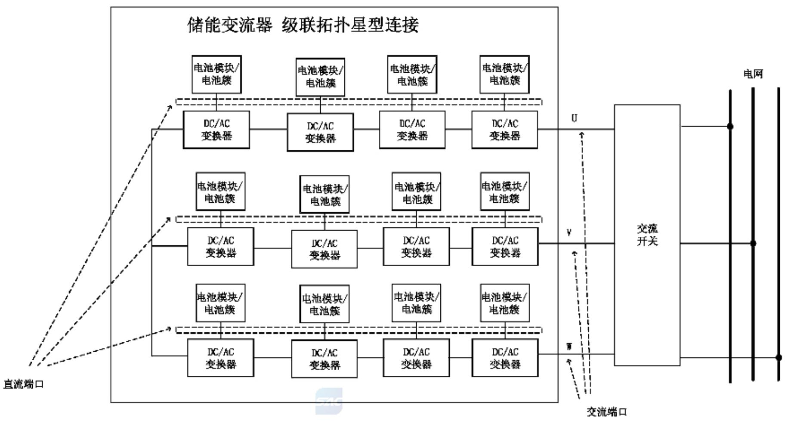

图A.3 级联架构典型拓扑-星型连接  
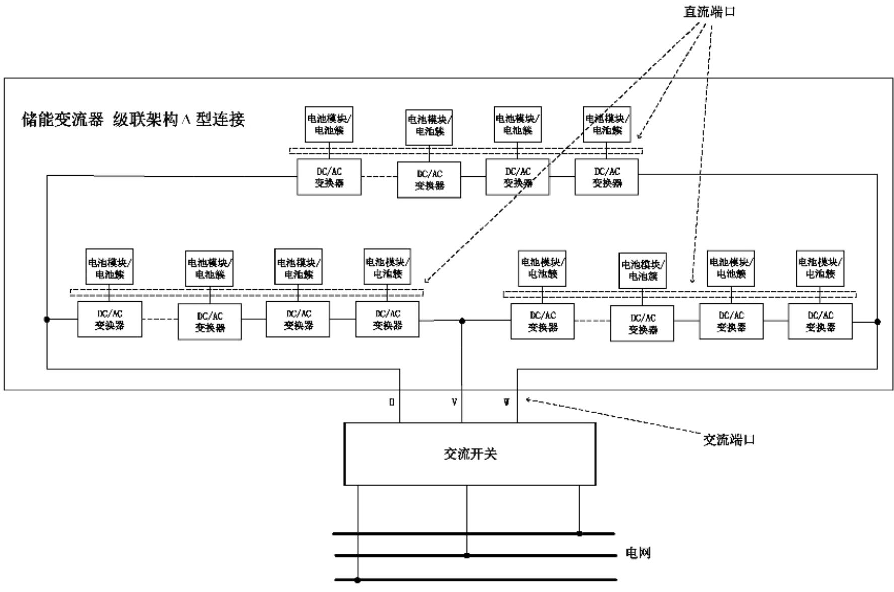  
图A.4 级联架构典型拓扑- $\Delta$ 型连接

附录B

(规范性)

设备标志符号

设备标志符号见表B.1。

表 B.1 设备标志符号

<table><tr><td>编号</td><td>符号</td><td>描述</td></tr><tr><td>1</td><td></td><td>直流</td></tr><tr><td>2</td><td></td><td>交流</td></tr><tr><td>3</td><td></td><td>交直流</td></tr><tr><td>4</td><td>3~</td><td>三相交流</td></tr><tr><td>5</td><td>3N~</td><td>三相交流带中线</td></tr><tr><td>6</td><td></td><td>接地</td></tr><tr><td>7</td><td></td><td>保护接地</td></tr><tr><td>8</td><td></td><td>框架或底座端子</td></tr><tr><td>9</td><td></td><td>详见操作说明书a</td></tr><tr><td>10</td><td></td><td>开(电源)</td></tr><tr><td>11</td><td></td><td>关(电源)</td></tr><tr><td>12</td><td></td><td>通过双重绝缘或加强绝缘保护的设备</td></tr><tr><td>13</td><td></td><td>电击危险b</td></tr><tr><td>14</td><td></td><td>灼热表面b</td></tr><tr><td>15</td><td></td><td>注意危险b</td></tr><tr><td>16</td><td></td><td>按键开启</td></tr><tr><td>17</td><td></td><td>按键关闭</td></tr><tr><td>18</td><td>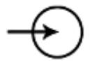</td><td>输入端子或定额</td></tr><tr><td>19</td><td>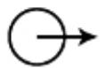</td><td>输出端子或定额</td></tr><tr><td>20</td><td>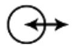</td><td>双向端子或定额</td></tr><tr><td>21</td><td>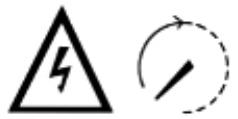</td><td>注意,电击危险及电容残余能量放电时间b</td></tr><tr><td>22</td><td></td><td>噪声危险,佩戴听力保护装置</td></tr><tr><td colspan="3">a采用蓝色安全色。b采用黄色安全色。</td></tr></table>

附录C

(规范性)

电气间隙和爬电距离

## C.1 冲击耐受电压和暂时过电压

冲击耐受电压和暂时过电压的确定见表 C.1。

表 C.1 冲击耐受电压和暂时过电压

<table><tr><td rowspan="3">序号</td><td rowspan="2" colspan="2">系统电压V</td><td colspan="4">冲击耐受电压V</td><td rowspan="2" colspan="2">暂时过电压V</td></tr><tr><td colspan="4">过电压等级</td></tr><tr><td>交流有效值</td><td>直流电压值</td><td>I</td><td>II</td><td>III</td><td>IV</td><td>峰值</td><td>有效值</td></tr><tr><td>1</td><td>50</td><td>75</td><td>330</td><td>500</td><td>800</td><td>1 500</td><td>1 770</td><td>1 250</td></tr><tr><td>2</td><td>100</td><td>150</td><td>500</td><td>800</td><td>1 500</td><td>2 500</td><td>1 840</td><td>1 300</td></tr><tr><td>3</td><td>150</td><td>225</td><td>800</td><td>1 500</td><td>2 500</td><td>4 000</td><td>1 910</td><td>1 350</td></tr><tr><td>4</td><td>300</td><td>450</td><td>1 500</td><td>2 500</td><td>4 000</td><td>6 000</td><td>2 120</td><td>1 500</td></tr><tr><td>5</td><td>600</td><td>900</td><td>2 500</td><td>4 000</td><td>6 000</td><td>8 000</td><td>2 550</td><td>1 800</td></tr><tr><td>6</td><td>1 000</td><td>1 500</td><td>4 000</td><td>6 000</td><td>8 000</td><td>12 000</td><td>3 110</td><td>2 200</td></tr><tr><td>7</td><td>3 600</td><td>5 400</td><td>9 000</td><td>16 000</td><td>20 000</td><td>40 000</td><td>14 150</td><td>10 000</td></tr><tr><td>8</td><td>7 200</td><td>10 800</td><td>17 500</td><td>29 000</td><td>40 000</td><td>60 000</td><td>28 300</td><td>20 000</td></tr><tr><td>9</td><td>12 000</td><td>18 000</td><td>29 000</td><td>42 500</td><td>60 000</td><td>75 000</td><td>39 600</td><td>28 000</td></tr><tr><td>10</td><td>17 500</td><td>26 300</td><td>40 000</td><td>55 000</td><td>75 000</td><td>95 000</td><td>53 750</td><td>38 000</td></tr><tr><td>11</td><td>24 000</td><td>36 000</td><td>52 000</td><td>75 000</td><td>95 000</td><td>125 000</td><td>70 700</td><td>50 000</td></tr><tr><td>12</td><td>36 000</td><td>54 000</td><td>75 000</td><td>95 000</td><td>125 000</td><td>145 000</td><td>99 000</td><td>70 000</td></tr><tr><td colspan="9">注1:储能变流器直流端口按照过电压等级II,交流端口按照过电压等级III判定。注2:直流端口系统电压指最大直流电压。注3:直接与电网连接的电路不允许插值,其他电路允许插值。注4:确定冲击耐受电压时,对于交流端口有中性点的储能变流器,系统电压为额定相电压(相对地)有效值。注5:确定冲击耐受电压时,对于交流端口无中性点的储能变流器,序号1行~6行系统电压为相对虚拟中性点间的额定相电压(相对地)有效值,序号7行~12行系统电压为额定线电压(相对相)有效值。注6:确定过暂时过电压时,系统电压为额定线电压(相对相)有效值。</td></tr></table>

## C.2 电气间隙

电气间隙的确定见表C.2。

表 C.2 电气间隙

<table><tr><td rowspan="3">冲击耐受电压V</td><td rowspan="3">暂时过电压(峰值)V</td><td rowspan="3">工作电压(重复峰值)V</td><td colspan="4">最小电气间隙mm</td></tr><tr><td colspan="4">污染等级</td></tr><tr><td>1</td><td>2</td><td>3</td><td>4</td></tr><tr><td>330</td><td>330</td><td>260</td><td>0.01</td><td rowspan="3"> $0.20^a$ </td><td rowspan="4">0.80</td><td rowspan="5">1.6</td></tr><tr><td>500</td><td>500</td><td>400</td><td>0.04</td></tr><tr><td>800</td><td>710</td><td>560</td><td>0.10</td></tr><tr><td>1 500</td><td>1 270</td><td>1 010</td><td colspan="2">0.50</td></tr><tr><td>2 500</td><td>2 220</td><td>1 770</td><td colspan="3">1.5</td></tr><tr><td>4 000</td><td>3 430</td><td>2 740</td><td colspan="4">3.0</td></tr><tr><td>6 000</td><td>4 890</td><td>3 910</td><td colspan="4">5.5</td></tr><tr><td>8 000</td><td>6 060</td><td>4 840</td><td colspan="4">8.0</td></tr><tr><td>12 000</td><td>9 430</td><td>7 540</td><td colspan="4">14</td></tr><tr><td>20 000</td><td>12 000</td><td>7 600</td><td colspan="4">25</td></tr><tr><td>40 000</td><td>26 000</td><td>16 000</td><td colspan="4">60</td></tr><tr><td>60 000</td><td>37 000</td><td>23 000</td><td colspan="4">90</td></tr><tr><td>75 000</td><td>48 000</td><td>30 000</td><td colspan="4">120</td></tr><tr><td>95 000</td><td>61 000</td><td>38 000</td><td colspan="4">160</td></tr><tr><td>125 000</td><td>80 000</td><td>50 000</td><td colspan="4">220</td></tr><tr><td>145 000</td><td>99 000</td><td>60 000</td><td colspan="4">270</td></tr><tr><td colspan="7">注1:按冲击耐受电压查表时,直接与电网连接的电路不宜插值,其他电路允许插值。注2:按暂时过电压和工作电压查表时允许使用插值。注3:根据冲击耐受电压、暂时过电压和工作电压的值查表,取电气间隙最大值。</td></tr><tr><td colspan="7"> $^a$ 印制电路板的限值应为0.04mm。</td></tr></table>

## C.3 电气间隙海拔修正

海拔在 $2000\mathrm{m}\sim 20000\mathrm{m}$ 的电气间隙修正因子见表C.3。

表 C.3 海拔在 ${2000}\mathrm{\;m} \sim  {20000}\mathrm{\;m}$ 的电气间隙修正因子

<table><tr><td>海拔
m</td><td>标准大气压强
kPa</td><td>电气间隙的修正因子</td></tr><tr><td>2 000</td><td>80.0</td><td>1.00</td></tr><tr><td>3 000</td><td>70.0</td><td>1.14</td></tr><tr><td>4 000</td><td>62.0</td><td>1.29</td></tr><tr><td>5 000</td><td>54.0</td><td>1.48</td></tr><tr><td>6 000</td><td>47.0</td><td>1.70</td></tr><tr><td>7 000</td><td>41.0</td><td>1.95</td></tr><tr><td>8 000</td><td>35.5</td><td>2.25</td></tr><tr><td>9 000</td><td>30.5</td><td>2.62</td></tr><tr><td>10 000</td><td>26.5</td><td>3.02</td></tr><tr><td>15 000</td><td>12.0</td><td>6.67</td></tr><tr><td>20 000</td><td>5.5</td><td>14.50</td></tr></table>

## C.4 爬电距离

爬电距离的确定见表 C.4。

表 C.4 爬电距离  
单位为毫米

<table><tr><td rowspan="3">工作电压有效值V</td><td colspan="2">印制电路板a的爬电距离</td><td colspan="9">其他绝缘部位的爬电距离</td></tr><tr><td rowspan="2">污染等级1b</td><td rowspan="2">污染等级2c</td><td rowspan="2">污染等级1b</td><td colspan="4">污染等级2</td><td colspan="4">污染等级3</td></tr><tr><td>绝缘材料I</td><td>绝缘材料II</td><td>绝缘材料IIIa</td><td>绝缘材料IIIb</td><td>绝缘材料I</td><td>绝缘材料II</td><td>绝缘材料IIIa</td><td>绝缘材料IIIb</td></tr><tr><td>≤2</td><td>0.025</td><td>0.04</td><td>0.056</td><td>0.35</td><td>0.35</td><td colspan="2">0.35</td><td>0.87</td><td>0.87</td><td colspan="2">0.87</td></tr><tr><td>5</td><td>0.025</td><td>0.04</td><td>0.065</td><td>0.37</td><td>0.37</td><td colspan="2">0.37</td><td>0.92</td><td>0.92</td><td colspan="2">0.92</td></tr><tr><td>10</td><td>0.025</td><td>0.04</td><td>0.08</td><td>0.40</td><td>0.40</td><td colspan="2">0.40</td><td>1.0</td><td>1.0</td><td colspan="2">1.0</td></tr><tr><td>25</td><td>0.025</td><td>0.04</td><td>0.125</td><td>0.50</td><td>0.50</td><td colspan="2">0.50</td><td>1.25</td><td>1.25</td><td colspan="2">1.25</td></tr><tr><td>32</td><td>0.025</td><td>0.04</td><td>0.14</td><td>0.53</td><td>0.53</td><td colspan="2">0.53</td><td>1.3</td><td>1.3</td><td colspan="2">1.3</td></tr><tr><td>40</td><td>0.025</td><td>0.04</td><td>0.16</td><td>0.56</td><td>0.80</td><td colspan="2">1.1</td><td>1.4</td><td>1.6</td><td colspan="2">1.8</td></tr><tr><td>50</td><td>0.025</td><td>0.04</td><td>0.18</td><td>0.60</td><td>0.85</td><td colspan="2">1.20</td><td>1.5</td><td>1.7</td><td colspan="2">1.9</td></tr><tr><td>63</td><td>0.04</td><td>0.063</td><td>0.20</td><td>0.63</td><td>0.90</td><td colspan="2">1.25</td><td>1.6</td><td>1.8</td><td colspan="2">2.0</td></tr><tr><td>80</td><td>0.063</td><td>0.10</td><td>0.22</td><td>0.67</td><td>0.95</td><td colspan="2">1.3</td><td>1.7</td><td>1.9</td><td colspan="2">2.1</td></tr><tr><td>100</td><td>0.10</td><td>0.16</td><td>0.25</td><td>0.71</td><td>1.0</td><td colspan="2">1.4</td><td>1.8</td><td>2.0</td><td colspan="2">2.2</td></tr><tr><td>125</td><td>0.16</td><td>0.25</td><td>0.28</td><td>0.75</td><td>1.05</td><td colspan="2">1.5</td><td>1.9</td><td>2.1</td><td colspan="2">2.4</td></tr><tr><td>160</td><td>0.25</td><td>0.40</td><td>0.32</td><td>0.80</td><td>1.1</td><td colspan="2">1.6</td><td>2.0</td><td>2.2</td><td colspan="2">2.5</td></tr><tr><td>200</td><td>0.40</td><td>0.63</td><td>0.42</td><td>1.0</td><td>1.4</td><td colspan="2">2.0</td><td>2.5</td><td>2.8</td><td colspan="2">3.2</td></tr><tr><td>250</td><td>0.56</td><td>1.0</td><td>0.56</td><td>1.25</td><td>1.8</td><td colspan="2">2.5</td><td>3.2</td><td>3.6</td><td colspan="2">4.0</td></tr><tr><td>320</td><td>0.75</td><td>1.6</td><td>0.75</td><td>1.6</td><td>2.2</td><td colspan="2">3.2</td><td>4.0</td><td>4.5</td><td colspan="2">5.0</td></tr><tr><td>400</td><td>1.0</td><td>2.0</td><td>1.0</td><td>2.0</td><td>2.8</td><td colspan="2">4.0</td><td>5.0</td><td>5.6</td><td colspan="2">6.3</td></tr><tr><td>500</td><td>1.3</td><td>2.5</td><td>1.3</td><td>2.5</td><td>3.6</td><td colspan="2">5.0</td><td>6.3</td><td>7.1</td><td colspan="2">8.0</td></tr><tr><td>630</td><td>1.8</td><td>3.2</td><td>1.8</td><td>3.2</td><td>4.5</td><td colspan="2">6.3</td><td>8.0</td><td>9.0</td><td colspan="2">10.0</td></tr><tr><td>800</td><td>2.4</td><td>4.0</td><td>2.4</td><td>4.0</td><td>5.6</td><td colspan="2">8.0</td><td>10.0</td><td>11</td><td>12.5</td><td rowspan="3">-</td></tr><tr><td>1 000</td><td>3.2</td><td>5.0</td><td>3.2</td><td>5.0</td><td>7.1</td><td colspan="2">10.0</td><td>12.5</td><td>14</td><td>16</td></tr><tr><td>1 250</td><td>4.2</td><td>6.3</td><td>4.2</td><td>6.3</td><td>9</td><td colspan="2">12.5</td><td>16</td><td>18</td><td>20</td></tr><tr><td>1 600</td><td rowspan="3">-</td><td rowspan="3">-</td><td>5.6</td><td>8.0</td><td>11</td><td colspan="2">16</td><td>20</td><td>22</td><td>25</td><td rowspan="3">-</td></tr><tr><td>2 000</td><td>7.5</td><td>10.0</td><td>14</td><td colspan="2">20</td><td>25</td><td>28</td><td>32</td></tr><tr><td>2 500</td><td>10.0</td><td>12.5</td><td>18</td><td colspan="2">25</td><td>32</td><td>36</td><td>40</td></tr><tr><td>3 200</td><td rowspan="3">-</td><td rowspan="3">-</td><td>12.5</td><td>16</td><td>22</td><td colspan="2">32</td><td>40</td><td>45</td><td>50</td><td rowspan="3">-</td></tr><tr><td>4 000</td><td>16</td><td>20</td><td>28</td><td colspan="2">40</td><td>50</td><td>56</td><td>63</td></tr><tr><td>5 000</td><td>20</td><td>25</td><td>36</td><td colspan="2">50</td><td>63</td><td>71</td><td>80</td></tr><tr><td>6 300</td><td rowspan="3">-</td><td rowspan="3">-</td><td>25</td><td>32</td><td>45</td><td colspan="2">63</td><td>80</td><td>90</td><td>100</td><td rowspan="3">-</td></tr><tr><td>8 000</td><td>32</td><td>40</td><td>56</td><td colspan="2">81</td><td>100</td><td>110</td><td>125</td></tr><tr><td>10 000</td><td>40</td><td>50</td><td>71</td><td colspan="2">100</td><td>125</td><td>140</td><td>160</td></tr><tr><td>12 500</td><td rowspan="3">-</td><td rowspan="3">-</td><td>50</td><td>63</td><td>90</td><td colspan="2">125</td><td rowspan="3">-</td><td rowspan="3">-</td><td colspan="2" rowspan="3">-</td></tr><tr><td>16 000</td><td>63</td><td>80</td><td>110</td><td colspan="2">150</td></tr><tr><td>20 000</td><td>80</td><td>100</td><td>140</td><td colspan="2">200</td></tr><tr><td>25 000</td><td rowspan="2">-</td><td rowspan="2">-</td><td>100</td><td>125</td><td>180</td><td colspan="2">250</td><td rowspan="2">-</td><td rowspan="2">-</td><td colspan="2" rowspan="2">-</td></tr><tr><td>32 000</td><td>125</td><td>160</td><td>220</td><td colspan="2">320</td></tr><tr><td colspan="12">注1:允许使用插值法。注2:污染等级3,630V以上,不推荐使用绝缘材料IIIb。注3:1250V以上印制电路板的爬电距离选取参照其他绝缘材料的爬电距离。注4:绝缘材料分为以下四组:——对于绝缘材料组别I,CTI≥600;——对于绝缘材料组别II,600&gt;CTI≥400;——对于绝缘材料组别IIIa,400&gt;CTI≥175;——对于绝缘材料组别IIIb,175&gt;CTI≥100。</td></tr><tr><td colspan="12">a适用于印制电路板上的元器件和零部件。b适用于所有类型的绝缘材料。c适用于除IIIb以外的绝缘材料。</td></tr></table>

## 参考文献

[1] GB/T 17045—2020 电击防护 装置和设备的通用部分

[2] GB/T 40595—2021 并网电源一次调频技术规定及试验导则

\_\_\_\_