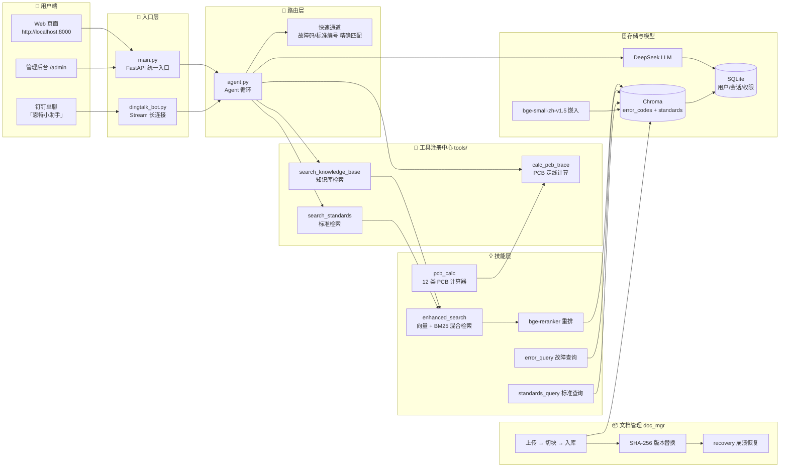
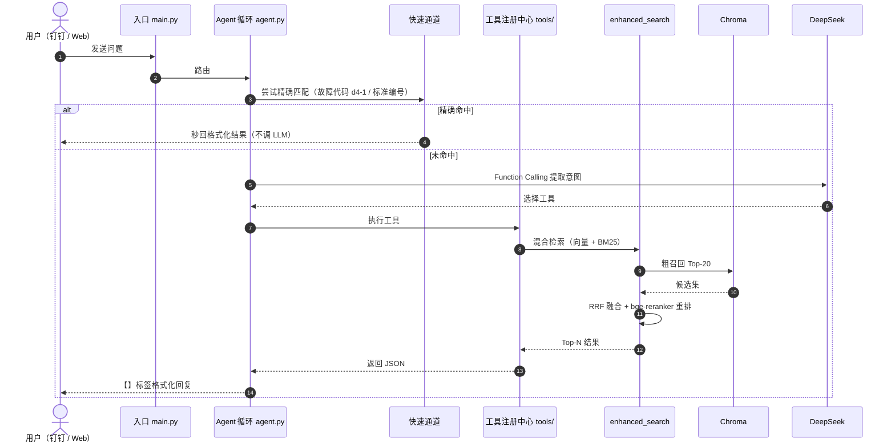
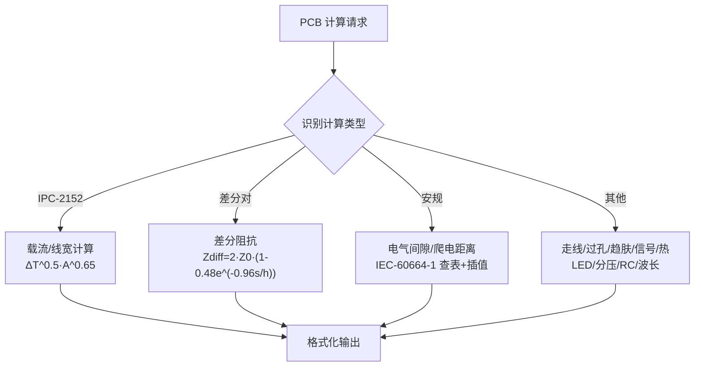

# 恩特小助手 · 当前架构逻辑图（Mermaid 示例）

> 生成时间：2026-08-04｜对应版本：v1.4.1
> **怎么看这张图**：在 VS Code 里装好 `Markdown Preview Mermaid Support` 插件，打开本文件后按 `Ctrl+Shift+V` 预览，即可看到渲染后的图形。

---

## 一、系统架构总览



---

## 二、一次查询的完整流程（时序）



---

## 三、PCB 计算技能内部（v1.4.1）



---

## 附：VS Code 预览 Mermaid 的配置步骤


1. 打开 VS Code 扩展面板（`Ctrl+Shift+X`）
2. 搜索安装 **`Markdown Preview Mermaid Support`**（作者 bierner）
3. 打开任意含 ` ```mermaid ` 代码块的 `.md` 文件
4. 按 `Ctrl+Shift+V`（或右上角「预览」图标）即可看到渲染后的图形
5. 编辑 mermaid 代码实时刷新，改完即所见

> 想直接在终端/GitHub 看效果：GitHub 的 Markdown 原生支持 Mermaid，提交后网页上直接显示。
