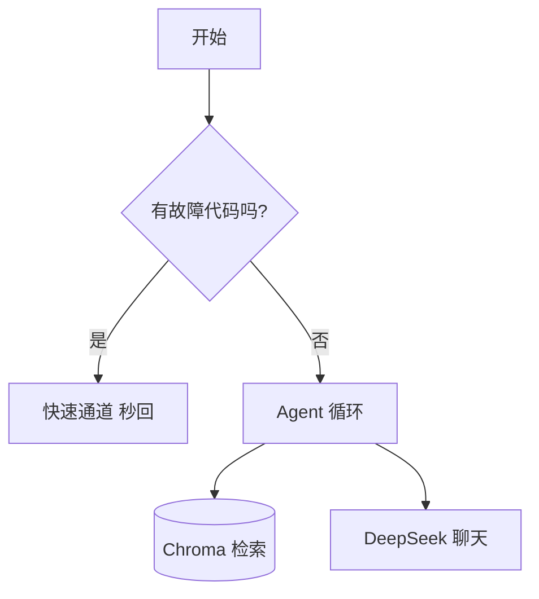
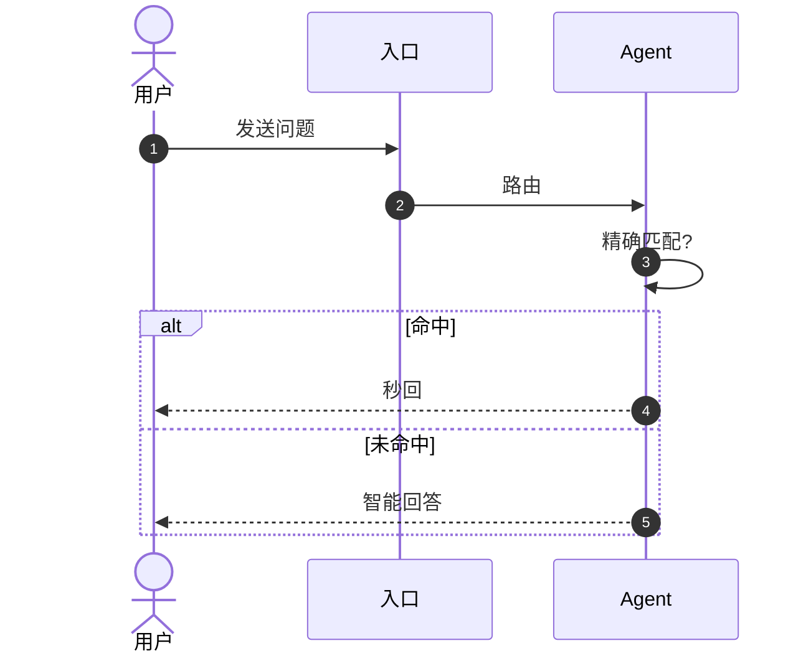
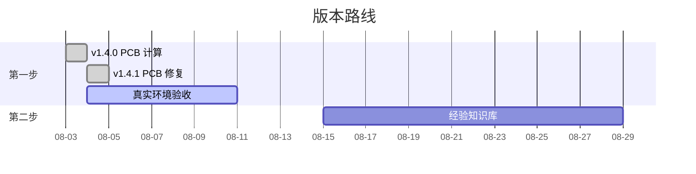
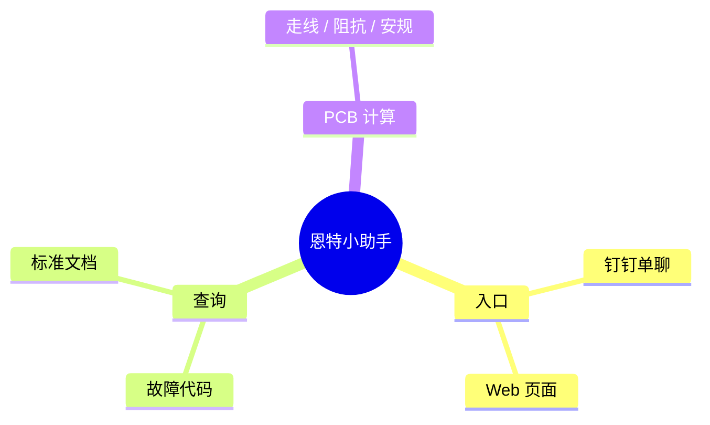
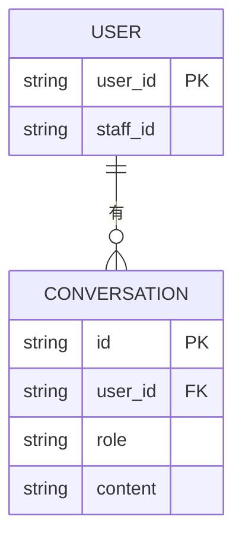

# 🎨 逻辑图绘制速查手册

> 生成时间：2026-08-04｜适用工具：VS Code + Mermaid / draw\.io
> 前置：已安装插件 `Markdown Preview Mermaid Support`（bierner）和 `Draw.io Integration`（hediet）

---

## 一、Mermaid — 代码式画图（首选）

**核心思路**：用纯文本描述图 → 插件实时渲染。图随代码走，可以进 git。

### 0. 如何在 VS Code 里看图

1. 打开 `.md` 文件
2. 在代码块里写 ` ```mermaid ` ... ` ``` `
3. 按 `Ctrl+Shift+V` 打开预览，或点右上角「预览」图标
4. 修改 mermaid 代码 → 预览自动刷新

### 1. 流程图 flowchart（最常用）



**语法速记**：
| 写法 | 含义 |
|------|------|
| `flowchart LR / TB / RL / BT` | 方向：左右 / 上下 / 右左 / 下上 |
| `A[文字]` | 矩形节点 |
| `A(文字)` | 圆角节点 |
| `A{文字}` | 菱形判断 |
| `A((文字))` | 圆形节点 |
| `A --> B` | 实线箭头 |
| `A --- B` | 实线（无箭头） |
| `A -.-> B` | 虚线箭头 |
| `A ==> B` | 粗线箭头 |
| \`A --> | 是 | B`或`A --> B\` | 带标签连线 |
| `A & B --> C` | 多条线汇聚 |

### 2. 时序图 sequenceDiagram（讲流程交互）



### 3. 甘特图 gantt（版本规划 / 进度）



### 4. 思维导图 mindmap（梳理思路）



### 5. 类图 / 数据库 ER 图



### 6. 其他常用图

- `pie` — 饼图（数据占比）
- `stateDiagram-v2` — 状态机（staging → active → retired）
- `subgraph` — 给一组节点分组（画架构分层非常好用，见架构图示例）

---

## 二、draw\.io — 拖拽式画图（精美对外图）

适合：对外精美的架构图、带品牌色和真实图标的图。您仓库已有 `docs/恩特小助手架构图.drawio`。

### 基本操作

1. 新建文件：`文件名.drawio`（VS Code 里双击直接进入编辑器，无需另装桌面版）
2. **左侧图形库**拖拽节点到画布；双击节点输入文字
3. 从节点边缘**拖出连线**；连线双击可加文字
4. 点选节点 → 右侧面板改样式（颜色/圆角/阴影/字体）
5. 右键节点 → `Edit` 可改 `style`（高级定制）
6. `Ctrl+S` 保存；菜单 → File → Export as → PNG / SVG

### 小技巧

- `Ctrl+拖拽` 快速复制节点
- `Ctrl+Z` 撤销；`Shift` 多选
- 用 `container` 属性做分组/分层框
- 想统一风格：先用模板（File → From Template → Basic/Flowchart）

---

## 三、选型建议

| 场景 | 用哪个 |
|------|--------|
| 画逻辑流程 / 时序 / 甘特，要进 git | **Mermaid**（写入 .md 直接进仓库） |
| 对外精美架构图、要调颜色图标 | **draw\.io** |
| 快速头脑风暴草图 | Excalidraw（在线） |
| 团队协作评审、要在线评论 | ProcessOn / 亿图 |

**最佳实践**：Mermaid 画「逻辑正确」的图放文档里；draw\.io 画「视觉精美」的图放介绍/交付材料里。两者互补。

---

## 四、常见问题

- **预览空白？** 确认代码块是 ` ```mermaid ` 且内容缩进正确；改完代码预览会刷新
- **中文乱码？** 直接写中文即可，Mermaid 原生支持 UTF-8
- **图太大看不清？** 预览页右上角可缩放；flowchart 用 `flowchart TB`（纵向）通常更易读
- **draw\.io 双击没进编辑器？** 确认 `Draw.io Integration` 已启用，右键文件 → Open With → draw\.io Diagram
