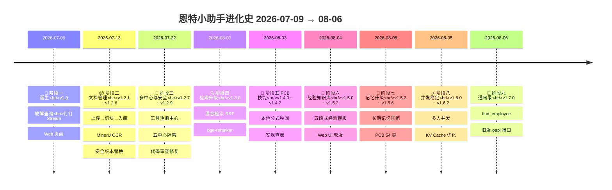

# 🗺️ 恩特小助手 版本演进时间线

> 生成时间：2026-08-06｜覆盖范围：v1.0（诞生）→ v1.7.0（当前）｜共 10 阶段 24 版本
> **版本记录唯一事实源**：[CHANGELOG.md](../CHANGELOG.md)，本图是其可视化投影，发版后如需更新请回 CHANGELOG 追加。
> **怎么看这张图**：VS Code 装好 `Markdown Preview Mermaid Support` 插件后按 `Ctrl+Shift+V` 预览；GitHub 网页直接渲染。
> **怎么读这张图**：上半部分 Mermaid 时间线按阶段聚合；下半部分按阶段展开「版本内容 + 学到的新知识（含踩坑）」。

---

## 一、版本演进时间线（Mermaid）

---

## 二、各阶段学到的新知识（按阶段展开）

> 每个阶段列「做了什么」与「学到了什么」。「学到」里标 ⭐ 的是该阶段最有价值的教训或认知升级。

### 🚀 阶段一：诞生（v1.0，2026-07-09）

**做了什么**：PCS 故障代码精确匹配 + 语义搜索、通用聊天托底、技能注册中心、钉钉 Stream 模式单聊、Web 页面、云服务器 7×24 部署。

**学到的新知识**：

- **RAG 两级查询策略**：精确码匹配（metadata 过滤，不调 LLM，毫秒级）与语义搜索（Chroma + bge-small-zh）双通道，「能本地匹配就不调 API」
- ⭐ **钉钉 Stream 模式**：主动连钉钉（WebSocket 长连接），不需要公网 IP / 防火墙白名单 / SSL 证书 / 域名——中小企业零部署成本接入钉钉
- **技能注册中心**：`@register` 装饰器注册路由，从第一天就避免了硬编码 if-elif 技能路由

**踩坑**：Windows 控制台 GBK 编码无法输出 emoji，日志统一用纯文本符号。

---

### 🧠 阶段二：Agent 化（v1.1，2026-07-09）

**做了什么**：会话记忆持久化（SQLite）、用户名绑定记忆、DeepSeek Function Calling 让 LLM 自主决策是否查库（替代双技能硬路由）、Docker CPU torch。

**学到的新知识**：

- ⭐ **Agent = LLM + 工具 + 记忆 + 循环**：统一路由范式确立——精确问题走快速通道，模糊问题由 LLM 判断调工具还是直接回答，这是后续所有工具能力的骨架
- **记忆去重**：连续重复消息不重复记录，节约 token
- **Docker 镜像瘦身**：CPU 版 PyTorch 省 ~13GB

**踩坑**：`.pyc` 缓存坑——改代码后旧进程不释放端口，需强杀进程 + 清 `__pycache__`。

---

### 📦 阶段三：文档管理子系统（v1.2.1 ~ v1.2.6，2026-07-13 ~ 07-21）

**做了什么**：doc_mgr 文档全生命周期管理（上传→切块→入库）、MinerU VLM OCR、钉钉文件接收、SQLite 用户存储、Web 同步管理、SHA-256 指纹 + 安全版本替换、崩溃恢复。

**学到的新知识**：

- **存储抽象层**（`VectorStore` ABC → `ChromaStore`）：换向量库（如 Qdrant）只需改一处，隔离第三方依赖
- **PyMuPDF 结构切块**：章节号 + 字体名 + 左边界多信号融合识别章节层级，替代 Unstructured，零新依赖且对中文标准更可靠
- ⭐ **MinerU VLM 路线**：扫描 PDF 用大模型视觉识别转 Markdown（而非传统 OCR），质量更高；配合 MarkdownChunker 按标题层级切块
- **SHA-256 内容指纹**：替代修改时间判断内容变化，避免时间戳未变或复制工具改写时误判
- ⭐ **staging/active/retired 安全版本替换**：新版本先 staging 分批写入并校验 → 切换 active → 失败清理并保留旧版本；查询层自动隐藏 staging/retired——「宁可旧，不可错」
- **SQLite 并发模型**：WAL 模式 + `threading.local()` 每线程独立连接 + RLock 写互斥

**踩坑**：Excel 行 ID 冲突（不同目录同名工作簿行号相互覆盖）→ 行 ID 加入稳定文档身份；大 PDF 分段必须全部成功才合并，避免半份文档入库。

---

### 🏢 阶段四：多中心与安全（v1.2.7 ~ v1.2.9，2026-07-22 ~ 08-03）

**做了什么**：工具注册中心重构、上传审核工作流（主动推送 + 审批口令）、五中心组织架构与部门隔离、代码审查集中修复。

**学到的新知识**：

- ⭐ **工具注册中心**（`@register`）：工具定义与执行逻辑同文件，新增工具「建文件 + 一行装饰器」即生效，`agent.py` 精简 96 行——此后 find_employee 等新工具零改动接入，全是这个架构的红利
- **审核工作流**：文件上传后主动单聊固定审核人 + 一次性审批口令（`同意同步 申请编号`），状态机防重复入库
- **多中心部门隔离**：五中心（PMO/研发/制造/商业/运营）+ 公共区，chunk 级 `department` 标签 + `$in` 过滤 + 无标签数据自动无条件回退（不产生权限黑洞）
- ⭐ **代码审查的价值**：v1.2.9 一次审查修复 6 类问题（部门隔离失效、/admin 鉴权缺口、XSS、任意文件删除拦截、DeepSeek 瞬断）——**专门安排审查轮是稳定性的高性价比投资**
- **DeepSeek 瞬断自动重试**：对连接错误/超时/5xx/429 指数退避重试（1s→2s）

**踩坑**：LLM 返回空 content（thinking 模式）会触发 `.strip()` 崩溃，需兼容 None 值。

---

### 🔍 阶段五：检索升级（v1.3.0，2026-08-03）

**做了什么**：混合检索（语义向量 + BM25 关键词双路召回 → RRF 融合）+ bge-reranker 重排框架。

**学到的新知识**：

- ⭐ **混合检索补上「短关键词」短板**：用户最痛的两字关键词（「过压」「硬件」）纯向量召回噪声大，BM25 精确字面词 + RRF 融合后明显提升
- **降级链设计**：jieba / rank_bm25 缺失、BM25 构建失败、rerank 模型不可用 → 自动回退纯向量检索，「绝不崩溃」
- **BM25 索引缓存**：按 collection + 过滤条件增量重建，重复查询零开销

**踩坑**：rerank 框架先就绪、模型受国内网速拖累未下载到位——代码就绪 ≠ 功能生效（v1.4.0 模型就位才真正启用）。

---

### 🔩 阶段六：PCB 计算技能（v1.4.0 ~ v1.4.2，2026-08-03 ~ 08-04）

**做了什么**：PCB 设计计算技能（本地公式秒回）、钉钉即时反馈 + 错误码、IPC-2152 / 差分阻抗 / 安规距离查表、布局综合校验、P1 安全收尾。

**学到的新知识**：

- ⭐ **「LLM 只用在刀刃上」的极致版**：54 类计算器全本地正则提取参数 + 公式计算，不调 LLM 秒回；口语化复杂表达才由 LLM 识别后调工具（`calc_pcb_trace`）
- **查表 + 线性插值**：安规距离按 IEC-60664-1 查表并插值，超范围输出「（超出表范围，取上界）」警示
- **钉钉即时反馈**：慢操作先回「⏳ 正在处理中」，秒回不提示打扰；错误码体系（1000/1001）替代静默失败
- **P1 安全收尾方法论**：文件名净化 + 50MB 限制 + MIME 内容签名（`%PDF`/ZIP/OLE）防伪造扩展名 + collection 白名单；Web 问答 GET→POST；Docker 非 root 运行

**踩坑**：**已编译正则再传 flags 抛 ValueError**（Python 3.7+）——`re.search(已编译对象, str, flags)` 会直接报错，差分对计算器整体崩溃。

---

### 🎯 阶段七：经验知识库 + Web 改版（v1.5.0 ~ v1.5.2，2026-08-04）

**做了什么**：第二步「经验知识库」启动（五段式模板 + Agent 检索）、Web 端三块 UI 视觉统一 + Markdown 渲染、修改文件归属 + 修复 reranker 静默失效。

**学到的新知识**：

- **五段式经验模板**：「故障现象 → 排查步骤 → 根因 → 解决方案 → 验证结果」，一个条目一个 `.md`，复用现有 MarkdownChunker 入库，存储层零改动——**新知识类型复用成熟管道，不重造轮子**
- **手写 Markdown 渲染器**：先 `escapeHtml` 再结构化、链接仅放行 http/https，防存储型 XSS
- **修改文件归属**：已入库文件改归属后「强制重学」用新归属重写 Chroma metadata（复用版本替换机制）

**踩坑**：⭐ **降级保护可能掩盖 bug**——bge-reranker 自 v1.3.0 起一直静默失效：BM25 候选混入不在向量候选池的 id → 重排段访问 `candidates[cid]` 抛 KeyError → 被降级保护吞掉。**「自动回退不崩溃」是双刃剑，它会让核心功能悄悄退化而不报错**，需要靠可观测性（日志/指标）兜底。

---

### 🧠 阶段八：记忆升级 + PCB 深化（v1.5.3 ~ v1.5.6，2026-08-05）

**做了什么**：双层会话记忆（短期窗口 + LLM 长期记忆压缩）、PCB 13→54 类（以 pcb-tools.cn 为基准）、PCB 自然语言健壮性（40 题社区回归）、参数补足层、国内 API 全直连。

**学到的新知识**：

- ⭐ **双层记忆架构**：短期窗口（保留近 N 轮）+ 滚出窗口的旧对话由 LLM 异步压缩成「事实 + 摘要」入长期记忆表，常驻注入 system prompt——跨会话记得用户项目/型号/偏好
- ⭐ **公式权威来源 > 个人经验**：PCB 公式以主管给的 pcb-tools.cn 为基准，此前自实验公式有偏差，以权威源修正（差分带状线系数 0.37→0.347 等）
- **40 题社区回归方法论**：用真实社区问题（CSDN/TI E2E/捷配等）当回归集，路由误判 + 参数提取 + 公式 bug 从「7 对 26 败」修到「36 对 0 败」
- **声明式参数补足层**：54 类计算器声明参数表（`Param` dataclass + `CALC_DEFS`），缺失参数自动注入常用备选值 + 多组合 markdown 表格输出
- **国内 API 全直连**：httpx/requests 设 `trust_env=False`，根治 Clash 代理劫持（10061/10054/SSL EOF 三症状）

**踩坑**：⭐ **Python 正则 `\b` 汉字边界系统性 bug**——Unicode 模式下汉字也是 word 字符，`5V供电` 的 V 与「供」之间无边界，导致提取跳过正确值；修复了 6 处 `V\b`/`W\b`。

---

### ⚡ 阶段九：多人并发 + 上下文工程（v1.6.0 ~ v1.6.2，2026-08-05 ~ 08-06）

**做了什么**：多人并发消息处理（慢操作放行线程池 + 每用户锁 + DeepSeek 限流）、并发修复（锁跨事件循环、懒加载单例）、上下文工程 + 长期记忆修复（KV Cache 友好 + 缓存命中率观测）。

**学到的新知识**：

- **并发放行模型**：`asyncio.to_thread` 放行慢操作（LLM/检索/文件下载），事件循环不再被占死；同一用户串行（回复不乱序）、不同用户并行；`BoundedSemaphore` 限流 20 防费用失控
- **contextvars 自动透传**：`to_thread` 拷贝当前上下文，中心权限隔离（`set_user_centers`）不受影响
- ⭐ **asyncio.Lock 绑定事件循环**：钉钉重连后 SDK 每次 `asyncio.run` 都是新事件循环，旧锁跨循环复用抛 `RuntimeError: bound to a different event loop`——锁必须按 `(loop, lock)` 结构随循环重建
- **懒加载单例线程安全**：并发放行后首次调用可能多线程并发触发，单例统一加 `threading.Lock` 双检锁
- ⭐ **思考型 LLM 压缩会「挤空 content」**：DeepSeek V4 压缩长对话时 reasoning token 占满 max_tokens(600) 把 content 挤空 → 压缩一直「无有效输出」；修复 = 压缩时关 thinking + max_tokens 600→1000
- ⭐ **KV Cache 友好上下文工程**：静态 system（前缀稳定）+ 历史独立轮次 + 窗口 20 批量滚动（滚 10 留 10）替代每轮滑动 → 缓存命中率 **≈0% → 78%**，多数请求稳定 85-98%；加缓存命中率日志让收益可观测

**踩坑**：压缩误伤短期窗口——`get_compress_batch` 原取「最旧 N 条未压缩」会把窗口内对话也压缩掉，改为按滚动点只取窗口外；并恢复 26 条被误标记的对话。

---

### 👥 阶段十：钉钉通讯录（v1.7.0，2026-08-06）

**做了什么**：`find_employee` 工具查公司员工（姓名/部门/职位/工号全员可查，手机/邮箱仅审核人），实时拉钉钉通讯录 + 60s 短缓存防限流，回归 227 项全绿。

**学到的新知识**：

- ⭐ **新版接口不一定可用，旧版反而是兜底**：初版用新版 `api.dingtalk.com/v1.0/contact/` 全部 404（`InvalidAction.NotFound`），改旧版 `oapi.dingtalk.com` topapi（gettoken + department/listsub + user/list）实测可用——**钉钉接口有新旧两代体系，报错时换族优先**
- **敏感字段服务端剥离**：mobile/email 在返回 JSON 前直接删除（键不进结果），不依赖 LLM 自觉——**权限控制放在数据链路层，不放在提示词层**
- **身份透传**：钉钉 staff_id 经 contextvar 传给工具；Web 端无身份 → 天然只能查基础信息
- **60s 短 TTL 缓存**：进程内缓存规避钉钉 QPS 限流，不做磁盘持久化
- **部分失败降级**：单个部门拉取失败不整体报错，返回 warning

---

## 三、完整版本对照表（附录）

| 阶段 | 版本 | 日期 | 一句话核心 | 关键新知识 |
|:----:|:----:|:----:|-----------|-----------|
| 🚀 一 | v1.0 | 07-09 | 故障查询 + 钉钉 Stream 上线 | RAG 两级查询、Stream 零部署成本 |
| 🧠 二 | v1.1 | 07-09 | 记忆系统 + RAG Agent | Agent = LLM+工具+记忆+循环 |
| 📦 三 | v1.2.1 | 07-13 | doc_mgr 文档管理子系统 | 存储抽象层、PyMuPDF 切块 |
| 📦 三 | v1.2.2 | 07-14 | MinerU VLM OCR | 大模型视觉识别转 Markdown |
| 📦 三 | v1.2.3 | 07-14 | 钉钉文件接收 + 提示词外置 | SDK 下载、标准编号快速通道 |
| 📦 三 | v1.2.4 | 07-15 | SQLite 统一存储 + 权限 | WAL + 线程独立连接 |
| 📦 三 | v1.2.5 | 07-16 | Web 同步管理 + 强制重学 | 后台任务队列 + 同步追踪 |
| 📦 三 | v1.2.6 | 07-21 | SHA-256 指纹 + 安全版本替换 | staging/active/retired |
| 🏢 四 | v1.2.7 | 07-22 | 工具注册中心 + 审核流程 | @register 零改动扩展 |
| 🏢 四 | v1.2.8 | 07-22 | 五中心知识库 | 部门隔离 + 权限回退 |
| 🏢 四 | v1.2.9 | 08-03 | 代码审查集中修复 | 审查轮的价值、重试策略 |
| 🔍 五 | v1.3.0 | 08-03 | 混合检索 + 重排框架 | BM25+向量 RRF、降级链 |
| 🔩 六 | v1.4.0 | 08-03 | PCB 计算技能 + 即时反馈 | 本地公式秒回、离线 embedding |
| 🔩 六 | v1.4.1 | 08-04 | PCB 修复 + 3 类计算器 | 正则 flags 陷阱、查表插值 |
| 🔩 六 | v1.4.2 | 08-04 | 布局校验 + P1 安全收尾 | MIME 签名、Docker 非 root |
| 🎯 七 | v1.5.0 | 08-04 | 经验知识库启动 | 五段式模板复用管道 |
| 🎯 七 | v1.5.1 | 08-04 | Web UI 改版 | 手写 Markdown 渲染防 XSS |
| 🎯 七 | v1.5.2 | 08-04 | 改归属 + reranker 修复 | 降级保护掩盖 bug |
| 🧠 八 | v1.5.3 | 08-05 | 双层会话记忆 | 长期记忆压缩 |
| 🧠 八 | v1.5.4 | 08-05 | PCB 54 类（权威基准） | pcb-tools.cn 公式全集 |
| 🧠 八 | v1.5.5 | 08-05 | PCB 自然语言健壮性 | 40 题回归、\b 汉字边界 |
| 🧠 八 | v1.5.6 | 08-05 | 参数补足层 + API 直连 | 声明式补足、trust_env=False |
| ⚡ 九 | v1.6.0 | 08-05 | 多人并发 | to_thread + 每用户锁 + 限流 |
| ⚡ 九 | v1.6.1 | 08-06 | 并发修复 | 锁跨循环、双检锁 |
| ⚡ 九 | v1.6.2 | 08-06 | 上下文工程 + 记忆修复 | KV Cache、V4 思考挤空 |
| 👥 十 | v1.7.0 | 08-06 | 钉钉通讯录查询 | 旧版 oapi、敏感字段剥离 |

---

*本时间线随项目演进持续更新。版本记录唯一事实源见 [CHANGELOG.md](../CHANGELOG.md)，项目架构见 [CLAUDE.md](../CLAUDE.md)。*
