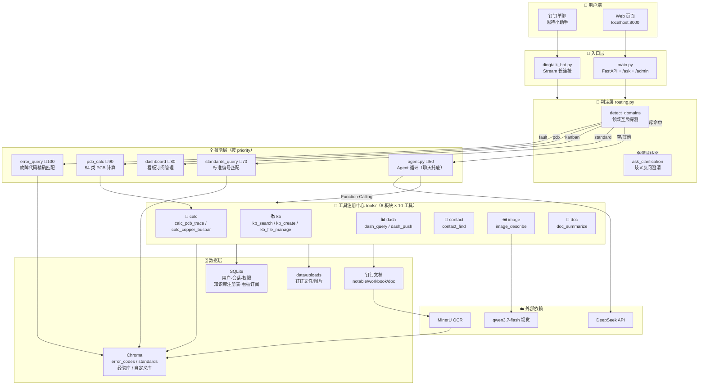
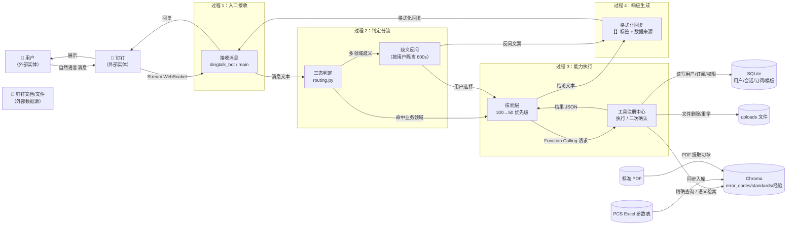
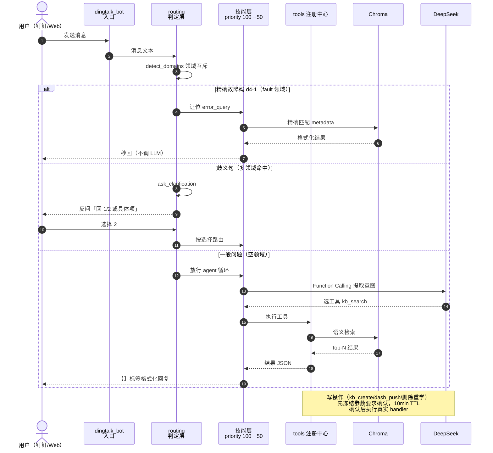
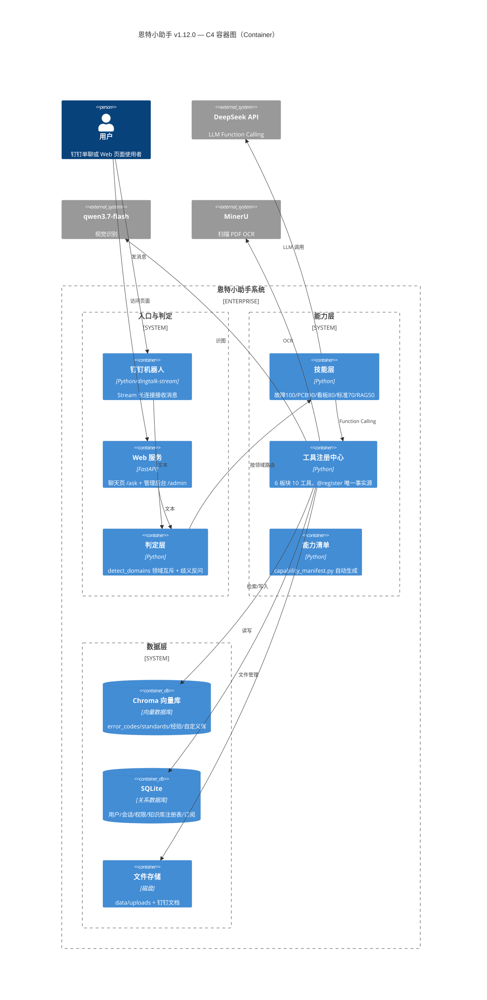

# 🗺️ 恩特小助手 v1.12.0 — 架构图集

> 生成时间：2026-08-13｜对应版本：v1.12.0（工具板块化重构 + 判定层治本框架）
> 绘图规范：[20260804-逻辑图绘制速查.md](20260804-逻辑图绘制速查.md)（Mermaid 首选，图随代码进 git）
> **怎么看图**：VS Code 装 `Markdown Preview Mermaid Support` 插件（作者 bierner），打开本文件 `Ctrl+Shift+V` 预览；GitHub 网页直接渲染。
> 全部图已用 mermaid v11 解析器逐张验证通过（语法无错）。

---

## 📌 本次图集包含 4 张图

| 图 | 视角 | 解决什么问题 |
|---|---|---|
| ① 系统架构图 | 静态结构分层 | 有哪些层、层间怎么连 |
| ② 数据流图（DFD） | 数据动线 | 用户消息进来后数据往哪流、在哪存 |
| ③ 时序图 | 一次会话的消息交互 | 一条消息从进入到回复经历了什么 |
| ④ C4 model | 上下文→容器→组件 | 系统边界、外部依赖、内部容器 |

---

## 一、系统架构图（静态分层）

**视角**：六大板块（用户端→入口→判定→技能→工具→数据/外部），展示 v1.12.0 全貌。

**要点**：
- v1.12.0 关键新增 = **判定层 routing.py**（三态：确定性直行 / 歧义交还 / 放行）+ **工具注册中心唯一事实源**（prompt 工具段、能力清单自动生成）
- 技能层按 priority 降序（100→90→80→70→50），agent 兜底，RAG Agent 只在空领域接管

---

## 二、数据流图（DFD）

**视角**：外部实体（方框）→ 过程（圆角矩形）→ 数据存储（圆柱），画「一条消息的数据动线」。

**要点**：
- 数据源头有两条**离线入库通道**：PCS Excel / 标准 PDF → Chroma（同步脚本），与运行时查询解耦
- 写操作（删除/重学/建库/推看板）经工具注册中心**二次确认**后才真正改数据

---

## 三、时序图（一次查询的消息交互）

**视角**：精确快速通道 / 歧义澄清 / 一般问题走 Agent 三支，加写操作二次确认。

**要点**：
- 三条路径核心差异在**是否调 LLM**：精确匹配秒回（0 LLM 调用），Agent 路径一次 Function Calling
- 歧义澄清把决定权交还用户（v1.12.0 判定层治本框架核心思想）

---

## 四、C4 model（Context → Container）

**视角**：C4 模型四层中的前两层——系统上下文（外部依赖边界）+ 容器图（系统内部容器与数据流向）。按 Mermaid 原生 `C4Container` 语法绘制（等价于 C4 L1+L2）。

**要点**：
- C4 强调**边界**：外部依赖（DeepSeek/qwen/MinerU）与系统内部容器严格区分
- 若需更细粒度，可继续画 C4Component（每个容器内部类/模块）——当前粒度足够覆盖架构说明

---

## 📎 附：图集维护说明

- 4 张图均可**直接改 `.md` 内 Mermaid 代码后刷新预览**，无需工具
- 图内容与代码同步核对过（`scripts/routing.py`、`scripts/tools/__init__.py`、`docs/能力清单.md`、技能 priority），如需核对最新事实源可运行 `python scripts/capability_manifest.py --write` 再对照
- 对外精美展示版（带品牌色/真实图标）可另做 `.drawio`，本图集定位「逻辑正确、随代码进 git」
